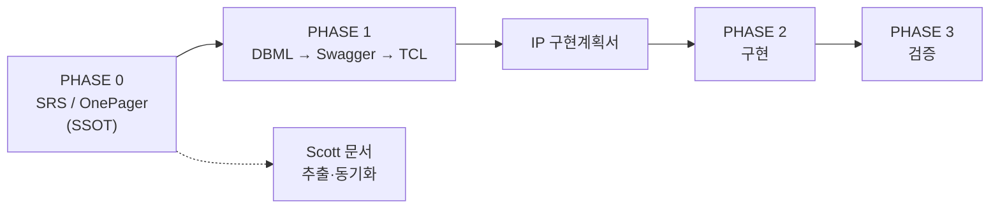

# VT API Gateway — 프로젝트 진행·문서 전략

> **문서 위치·성격.** 본 문서는 **분석 아키텍트 개인 운영용**(non-controlled, **VKS·08 허브 미공유**)이다. [README](<README.md>)에서만 참조한다. **팀 공유용** 스펙 단위·문서 유형 표는 [PRD §12.1](<VT API Gateway — PRD (v2).md>)이 정본이다.
>
> **갱신:** 2026-06-16 · 작성: 프로젝트 분석 아키텍트 합의 반영

---

## 1. 왜 이 문서가 별도인가

| 위치 | 역할 | 본문을 여기에 두지 않는 이유 |
|------|------|------------------------------|
| [README](<README.md>) | 레포·VKS·Jira·참고 자료 **인덱스** + **본 문서 링크(개인용)** | 운영 링크와 방법론이 섞이면 README가 비대해짐 |
| [08.VT_API_Gateway.md](<08.VT_API_Gateway.md>) | Scott 체계 **통제 문서 허브** | 본 문서는 허브에 올리지 않음 |
| **본 문서** | **개인 운영 가이드** | SSOT·추출·PHASE 등 상세 운영 규칙 |
| [PRD §12.1](<VT API Gateway — PRD (v2).md>) | **팀 공유** 스펙 단위 표 | One Pager / SRS / Sub-SRS 경계만 공개 |

README에만 링크한다. VKS 허브에는 두지 않는다.

---

## 2. 두 가지 문서 체계 — 충돌이 아니라 역할 분담

### 2.1 Scott 체계 (08 폴더, Naver/의료기기 통제 문서)

- **목적:** IEC 62304 / ISO 13485 감사 — 문서 ID·버전·승인·추적성(FR/NFR ↔ ADR ↔ 테스트)
- **형태:** PRD · ARD · 요구사항 명세 · API명세 · 보안설계 · 개발계획서 등 **다문서 분리**
- **강점:** 릴리스별 baseline 동결, 규제 증적, 역할별 읽기 경로
- **한계:** 본문이 여러 파일에 흩어지면 **동기화 비용**·중복·드리프트. 분석·설계 깊이는 문서 개수와 무관

### 2.2 본 프로젝트 SSOT 체계 (요구공학·실무 중심)

- **목적:** 진짜 분석·설계 — **측정 가능한 요구**, 외부 인터페이스 계약, 에러·경계·비목표를 한 흐름으로 정리
- **형태:** **SRS**(신규·대규모) 또는 **Engineering One Pager**(수정·업그레이드·승인용 요약)
- **설계 산출물:** SSOT 확정 후 **DBML → Swagger → Unit TCL → IP(구현계획서)** (dev-chain PHASE 1)
- **강점:** 작성·검토·변경이 한 축. 구현자가 SRS(+설계 산출물)만으로 닫힌 시스템

### 2.3 통합 원칙 (본 프로젝트 채택)

1. **SSOT = SRS 또는 OnePager** — 분석·설계·변경은 여기서만 한다.
2. **Scott 문서 = SSOT에서 추출한 파생 뷰** — 같은 내용을 두 곳에 각각 쓰지 않는다.
3. **baseline 동결 시** SSOT를 기준으로 PRD/ARD/요구사항 명세 등을 **승인·동결**한다(감사 시 통제 문서가 증적이 될 수 있음 — §5).
4. **배경·의사결정 기록**(Roadmap 결정 등)은 SSOT가 아니며, 결론만 PRD/ARD에 흡수한다.

---

## 3. SSOT 문서 분할 — Roadmap 4개 스펙 단위

[개발 Roadmap 결정](<VT API Gateway — PRD (v2)/VT API Gateway — 개발 Roadmap 결정.md>) §3.9와 합의한 경계. **스펙 경계 ≠ 실행 경계** — 케이스 D는 ③+④를 통합 실행한다.

| # | Roadmap 단계 | 성격 | SSOT 문서 | 근거 |
|---|--------------|------|-----------|------|
| ① | 1단계 API 호환성 | 기존 제품 **수정** | **One Pager** | 단일 도메인·즉시 착수·외부 협의 적음 |
| ② | 2단계 Presigned URL | 기존 경로 **업그레이드** | **One Pager** | ①과 병행, 데이터 경로 확장 |
| ③ | 3+4단계 GW 일원화 + 멀티 Region | **신규 플랫폼** 구축 | **SRS (메인)** | 신규 아키텍처·다수 연동·프로젝트 기준점 |
| ④ | 5단계 Straumann(AXS) | GW 위 **외부 연동** | **Sub-SRS** | 외부 의존·Webhook·OAuth·리전 — Case C 상세도. ③ SRS의 자식, 중복 금지 |

### 3.1 ③ SRS에 넣을 것 (메인 SSOT)

- GW PEP, 라우팅, ClinicID·Region, Path B Deprecated/EOS
- **Webhook Receiver**(범용) — 수신·검증·멱등·분배(HTTP/MQTT) **프레임**
- **Presigned** 발급·완료 통지·멱등 **공통 규칙**
- 멀티 Region·GeoDNS·매핑 테이블(논리)
- 클라이언트 식별(`Vatech-*`, `Vatech-Via`, User-Agent) **규칙**
- 첫 연동 구현 순서: **Straumann → CleverSpace**(범용 설계, 구현 우선순위만 명시)

### 3.2 ④ Sub-SRS에 넣을 것 (AXS 전용)

- AXS OAuth·스코프·Org-ID 매핑·리전 제약
- AXS Webhook 이벤트·서명·재시도
- EzServer → AXS 갈래 A 시나리오(1차 단방향 범위)
- CleverLab ↔ AXS 갈래 B — **범위 TBD/Will Not Do**는 여기서 확정
- AXS `unstable` 테스트 환경 전제·Assumptions
- ③ SRS §1.5 Related Documents로 상위 링크

### 3.3 OnePager에 넣을 것 (①② 및 승인용 요약)

- Project Description · Business Justification · Risk · Resource/Schedule
- Technical Description에 **핵심 결정 + Swagger/ERD 링크**(작성 후)
- ④ Straumann에 대해 **경영·Straumann 협의용 1장 요약**을 Sub-SRS 앞에 둘 수 있음(SSOT는 Sub-SRS)

### 3.4 아직 작성하지 않은 것

- ①~④ SSOT 본문 — 본 전략 확정 후 순서대로 작성
- Scott 문서로의 추출본 — 각 SSOT baseline 통과 후

---

## 4. 실행 모델 — 케이스 D

[개발 Roadmap 결정](<VT API Gateway — PRD (v2)/VT API Gateway — 개발 Roadmap 결정.md>)과 동일.

| 트랙 | 실행 |
|------|------|
| **1·2** | **병행 착수** (호환성 + presigned) |
| **3·4·5** | **통합 진행** (멀티리전-ready GW + Straumann). GW **연동 구현 순서**: Straumann → CleverSpace |
| **EzServer Rust 전면 교체** | 5단계 **제외**, 후속 트랙 |

의존: 3(GW) ← 2(presigned) 필수. 5(Straumann) ← 2+3, 4와 병렬 가능.

---

## 5. PHASE별 진행 (분석·설계·구현)

Scott의 PRD/ARD는 대부분 **PHASE 0(요구·상위 아키텍처)** 에 해당한다. 본 프로젝트는 그 다음을 아래처럼 진행한다.



| PHASE | 입력 | 산출물 | 사람 게이트 |
|-------|------|--------|-------------|
| 0 | 기획·Roadmap·§1.2·§2.1·§2.2 사람 초안 | **SRS / OnePager**(SSOT) | PM/리드 비즈니스 승인 |
| 1 | SSOT 확정 | DBML, Swagger, Unit TCL | BE+FE/App Peer Review → **baseline** |
| 1末 | 4종 설계 | **IP**(Task·DAG·DoD) | IP 리뷰 후 PHASE 2 진입 |
| 2 | IP + Swagger + TCL | 코드·Unit/E2E | PR 승인( risk-tier 사람 정독) |
| 3 | TCL | 검증·rc | 수동 체크리스트 |

**규칙:** Swagger·TCL 없이 구현 시작 금지. SSOT에 없는 결정은 Slack/회의에만 두지 않는다.

---

## 6. Scott 문서 ↔ SSOT 추출 매핑

baseline 또는 주요 갱신 시 SSOT에서 아래로 **발췌·요약**한다. 역방향(Scott만 수정) 금지.

| Scott 통제 문서 | SSOT에서 가져올 내용 |
|-----------------|----------------------|
| PRD (v2) | §1.2 Product Scope, Why, Will Not Do, 로드맵 요약 |
| ARD | §2.1·§2.2, ADR/Decision Log, 시퀀스·컴포넌트 |
| 요구사항 명세 | FR/NFR ID 매핑표 |
| API 명세·데이터 모델 | Swagger·DBML 링크 + 엔터티 요약 |
| 인증·보안·컴플라이언스 | §6.2 Security, IEC 관련 제약 |
| 개발계획서(착수 품의) | OnePager Resource/Schedule + IP 마일스톤 |
| AXS 연동 테스트 환경 | Sub-SRS §3 Environment, Assumptions |

추출본 상단에 반드시 기재:

```text
출처: {SRS 또는 OnePager 파일명} {버전/일자}
동기화: {YYYY-MM-DD} — 이후 SSOT 변경 시 본 문서도 갱신
```

---

## 7. 작성·품질 규칙 (요약)

SSOT 작성 시 적용하는 표준(상세는 사내 `spec-standard.md`, `spec-philosophy.md`, `spec-writing-tips.md`).

| 규칙 | 적용 |
|------|------|
| Why–What–How | Why ~30% — 특히 §1.2 |
| Will Not Do | 1.2 + 기능별 비목표 |
| TBD | 미결 이유·책임자·마감·영향 섹션 4종 필수 |
| 대안 검토 | 인증·Webhook·멀티리전·외부 SDK 등 핵심 결정 |
| Decision Log | SRS 부록 A |
| 중복 금지 | API 상세 → Swagger, DB → DBML, 본문은 링크 |
| 외부 인터페이스 | 스펙에 계약 수준(에러·멱등·경계) |

**상세도:** ③·④는 Case B~C(외부 연동·의료 맥락). ①② OnePager는 승인·일정 중심, Technical Description에 계약 링크.

---

## 8. 문서 목록 — 역할 한눈에

| 문서 | 통제 | 역할 |
|------|------|------|
| **SRS ③ / Sub-SRS ④ / OnePager ①②** | SSOT(작성 후 baseline) | **정본** — 분석·설계·변경 |
| PRD · ARD · 요구사항 · API명세 · 보안 · 개발계획서 | Controlled | **추출 뷰** — 규제·감사·VKS |
| [개발 Roadmap 결정](<VT API Gateway — PRD (v2)/VT API Gateway — 개발 Roadmap 결정.md>) | Non-controlled | 케이스 A~D·의존성 **배경** |
| **본 문서** | Non-controlled | **진행·문서 전략** |
| DBML · Swagger · TCL · IP | 설계/실행 | PHASE 1~2 산출물 — SRS 참조 |

---

## 9. 다음 작업 순서 (권장)

1. **③ SRS**(3+4) 착수 — §1.2·§2.1·§2.2 사람 초안 후 확장
2. ①② OnePager — 병행 착수(케이스 D 1·2 트랙)
3. ③ SRS baseline 후 **④ Sub-SRS**(Straumann)
4. PHASE 1: DBML → Swagger → TCL → IP
5. SSOT baseline 시점에 Scott 문서 **추출·동기화** 일괄 수행

---

## 10. 미결 — SSOT 작성 시 확정

| 항목 | 비고 |
|------|------|
| CleverLab ↔ AXS(5단계 갈래 B) | 이번 포함 vs Will Not Do — Sub-SRS §1.2 |
| 4단계 멀티리전 | gw/1.0 통합 vs v1.2 후행 — ③ SRS §2.7 |
| MQTT 브로커 운영 주체 | ③ SRS §6 / ARD 추출 |
| Path B EOS 시점 | ③ SRS §2.8 |
| Scott baseline 시 통제 문서 정본 | SSOT vs 추출본 — 개발실장과 감사 관점 합의 |

---

## 변경 이력

| 일자 | 변경 |
|------|------|
| 2026-06-16 | 최초 작성 — SSOT 전략, ①② OnePager / ③ SRS / ④ Sub-SRS, Scott 추출 원칙, 케이스 D·PHASE 연계 |
