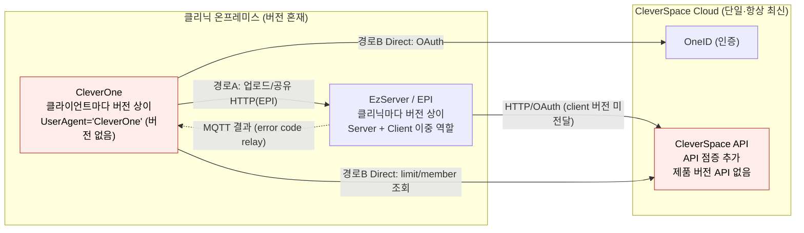
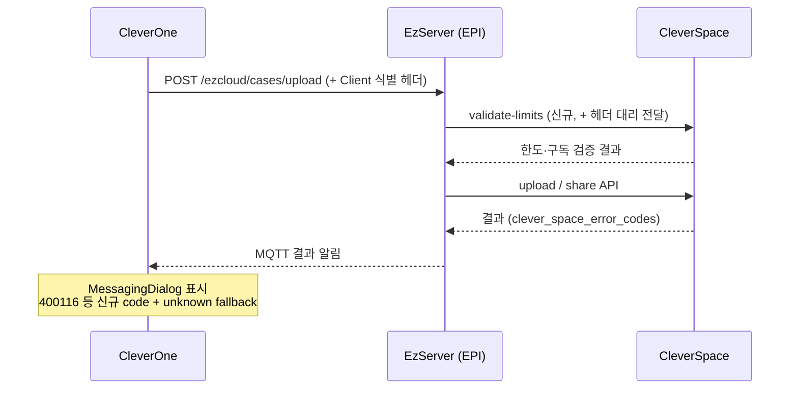
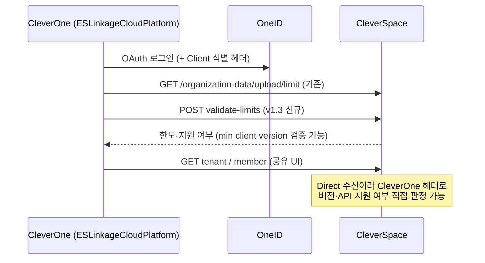
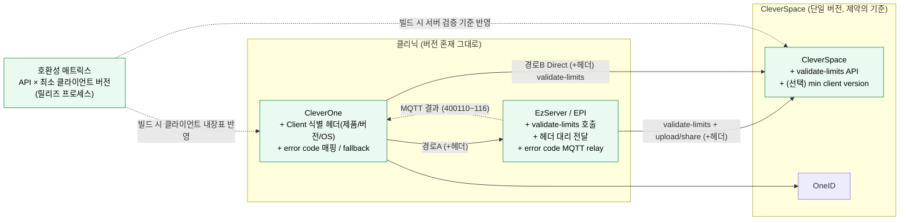
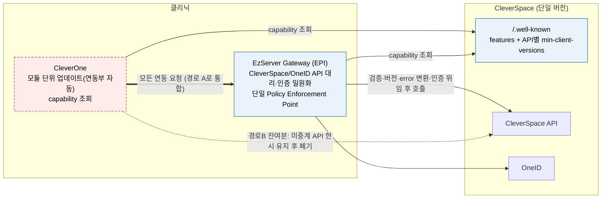
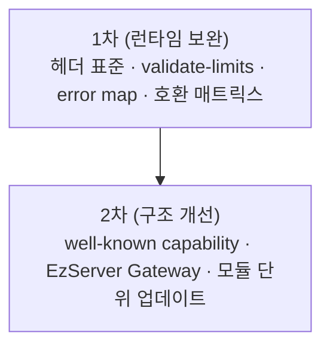
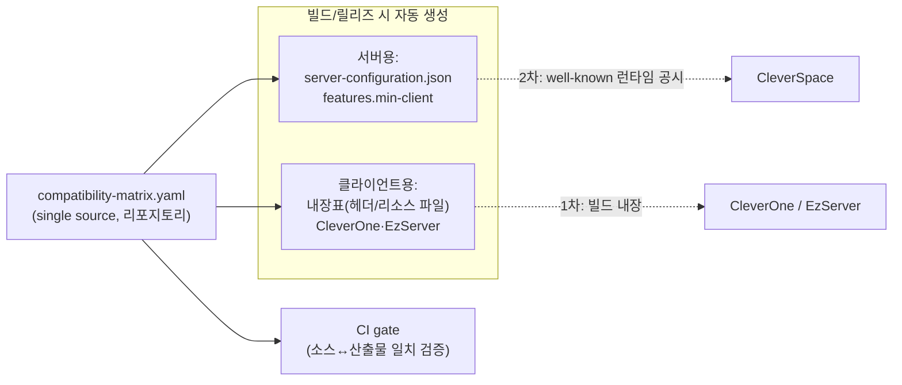

# Clever API 호환성 방안 비교 보고서

작성일: 2026-06-01  
과제: VKS 요청 — CleverOne·EzServer·CleverSpace API 호환성 검토 (Thomas)  
근거: VKS(과제 요청·현황·논의사항), 수집 문서(OneID/EzCloud RestApi CSV, CleverSpace v1.3 기능정의서·MMI ErrorCode, EzServer PMS Integration SRS MD), 4개 제품 소스코드, EzServer Releases CSV, PLAN-1191/EZSV-2506 Jira XML

---

## Executive Summary

**문제 (현재).** CleverSpace는 유상화·이용 한도 등 새 정책을 위해 API를 계속 추가하지만, 클리닉마다·PC마다 버전이 제각각인 **구버전 CleverOne·EzServer는 이 신규 API와 오류 코드를 인식하지 못한다.** 그 결과 사용자는 **원인 안내 없는 실패**(업로드·공유 거부 등)를 겪고, 신규 유상 기능이 구버전에서 **조용히 동작하지 않는다**. 게다가 CleverOne이 EzServer를 거치지 않고 CleverSpace로 **직접 연동하는 구간(경로 B)**이 있어 **인증과 정책 통제가 두 갈래로 분산**되어 있다.

**해결 방향.** 한 제품만 고쳐서는 풀리지 않는다. **서버(CleverSpace)가 호환 기준을 정해 제약을 집행하고, 클라이언트는 그 기준을 미리 확인**하도록 역할을 나눠 **2단계**로 해결한다.

| 단계 | 핵심 조치 | 기대 효과 |
| --- | --- | --- |
| **1차 (단기 대응)** | CleverSpace **사전 검증 API**(한도 확인) + **클라이언트 식별 정보(버전) 전달** + **오류 코드 매핑·업데이트 안내** + **API별 호환성 표** 운영 | 구버전에서도 **명확한 한도·권한 안내**와 **업데이트 유도**, 원인불명 실패 제거 |
| **2차 (구조 개선, 장기)** | CleverSpace가 **API별 지원 버전을 공시** + **EzServer를 단일 게이트웨이로 일원화(경로 B 흡수)** + 연동 모듈 **자동 업데이트** | **인증·정책 단일 창구**, 신규 API 자동 호환, 운영·보안 단순화 |

> **시점 기준:** 1차의 마감은 **CleverSpace v1.3.0 출시 일정**에 맞춰진다. v1.3.0은 유상화·이용 한도 API를 도입하는 **CleverSpace 측 차기 릴리즈(외부 일정으로, 본 과제가 정하지 않음)**이며, 이 출시가 곧 구버전 호환성 문제를 촉발하는 시점이다.

**경로 B(Direct) 흡수 — 별도의 중요 이슈.** Direct는 “EzServer가 중계하지 않는 CleverSpace API”를 CleverOne이 우회 호출하면서 생긴 구간이다. 2차에서 이를 **없애는 것이 아니라 EzServer 게이트웨이가 대신 처리**하도록 전환한다. EzServer가 중계 가능한 API부터 **순차적으로** 옮겨, 최종적으로 모든 CleverSpace 연동이 **EzServer 한 창구**를 거치게 해 인증·정책을 통일한다.

**권고.** **1차는 v1.3.0 일정에 맞춰 즉시 착수**(서버 사전검증 + 식별 헤더 + 오류 매핑 + 호환성 표), **2차(게이트웨이·버전 공시)는 로드맵으로 병행 준비**한다. 상세 근거·전제·설계는 아래 본문에서 다룬다.

---

## 1. 연동 구조와 검토 범위

### 핵심 전제

이 보고서의 분석과 권고가 전제로 삼는 **구조적 사실**을 먼저 정리한다. 각 항목의 상세 근거는 괄호 안에 표기한 절에서 다룬다.

- **연동 경로는 2개다.** 경로 A `CleverOne → EzServer → CleverSpace`, 경로 B `CleverOne → CleverSpace`(Direct). 두 경로는 **EzServer(EPI)가 그 API를 중계하는지** 여부로 갈린다(§1.1). 여기서 **EPI = EzServer PMS Integration**, 즉 EzServer에서 PMS·클라우드(CleverSpace) 연동을 담당하는 모듈을 가리킨다.
- **EzServer는 Server이자 Client다.** CleverOne에게는 서버, CleverSpace·OneID에게는 클라이언트, 결과 알림에서는 MQTT 서버로 동작한다(§1.2).
- **버전 분포가 비대칭이다.** CleverSpace는 **단일(항상 최신) 1개**지만, EzServer는 **클리닉마다**, CleverOne은 **PC마다(한 클리닉 안에서도) 여러 버전**이 공존한다. 그래서 “클라이언트가 서버 버전을 확인”하던 기존 방식(`CheckServerVersion`)은 CleverSpace에 **그대로 쓸 수 없다**(§1.3).
- **호환의 단위는 제품 버전이 아니라 API/기능이다.** 단일 CleverSpace라도 API마다 도입 시점이 달라 **요구 최소 클라이언트 버전이 제각각**이다. 호환성 표도 `API(기능) × 최소 클라이언트 버전` 형태여야 한다(§1.3).
- **해결책은 단일 선택이 아니라 조합이다.** 서버 집행과 클라이언트 사전 인지를 **2~3개 조합**한다. 클라이언트는 다수·다버전이라 손이 많이 들지만, **서버는 1곳 수정으로 전 클라이언트에 효과**가 미친다(§3).
- **경로 B(Direct)는 버전 문제와 별개의 구조 이슈다.** 인증 이원화·정책 공백을 낳으며, 2차에서 EzServer 게이트웨이가 흡수할 대상이다(§1.4).

### 1.1 두 연동 경로

VKS에서 정리한 두 경로는 **동시에 존재**하며, ESLinkageCloudPlatform이 **기능별로 분기**한다.

**AS-IS 전체 구조 (현재)**



> 붉은 노드 = 호환성 gap 지점. CleverOne은 버전 미전달, CleverSpace는 제품 버전·API별 호환 정보를 노출하지 않음.

| 기능                                 | 경로                  | ESLinkageCloudPlatform 구현                                 |
| ------------------------------------ | --------------------- | ----------------------------------------------------------- |
| 업로드·공유·이력·파일크기            | **A** (EzServer 경유) | `CEzServerLinker` → EPI `/ezcloud/cases/*`                  |
| OneID 로그인·OAuth                   | **B** (Direct)        | `COneIdLinker`                                              |
| 업로드 제한 조회, tenant/member 검색 | **B** (Direct)        | `CEzCloudLinker` → `GET /organization-data/upload/limit` 등 |
| 업로드/공유 **결과 알림**            | **A** (EzServer MQTT) | CleverOne `CMQTTManager` → EzServer messenger               |

SRS v6.2(EzServer PMS Integration)는 경로 A의 시퀀스를 정의한다. Imaging App(CleverOne)이 EPI에 업로드/공유를 요청하면, EPI가 presigned URL·organization-data API를 호출하고 **결과를 MQTT로 Imaging App에 전달**한다.

**경로가 둘로 갈리는 기준 = EzServer(EPI) 지원 여부.** 업로드·공유처럼 **EPI가 대리 API를 제공하는 기능**은 경로 A로 가고, OneID 로그인·`upload/limit`·tenant/member 조회처럼 **EPI가 노출하지 않는 CleverSpace/OneID API**는 CleverOne이 ESLinkageCloudPlatform으로 **직접(경로 B)** 호출한다. 즉 Direct 경로는 “굳이 직접 가고 싶어서”가 아니라 **EzServer가 해당 API를 중계하지 않기 때문에** 생긴 우회로다. CleverSpace가 새 API를 추가할 때 EPI가 따라가지 못하면 그만큼 **경로 B가 늘어나는** 구조다.

### 1.2 EzServer의 이중 역할

| 관점 | 역할 | 버전·식별 현황 |
| --- | --- | --- |
| CleverOne → EzServer | **Server** (EzWebServer + EPI) | CleverOne이 `GetVersion` 후 `CheckServerVersion`(최소 6.3.1). UserAgent에 `"CleverOne"`만, **버전 없음** |
| EzServer → CleverSpace/OneID | **Client** (EPI HTTP) | OAuth client_id 기반. UserAgent·client product version **미전달** |
| EzServer → CleverOne | **Server** (MQTT messenger) | `clever_space_error_codes`를 MQTT payload로 전달 |

**시사점:** CleverSpace에서 min client version을 검증하려면 **경로 B(Direct)는 CleverOne 헤더**를, **경로 A는 EzServer가 대리 전달**해야 한다. EzServer만 고치면 경로 A는 일괄 적용되지만, **경로 B는 CleverOne(ESLinkageCloudPlatform) 수정 없이는 버전을 알 수 없다.**

### 1.3 버전 분포 비대칭과 “API별 호환성”

> **이 과제의 핵심 이슈**(VKS): “CleverSpace가 **새로 추가한 API**를 구버전 CleverOne·EzServer가 인식하지 못해 제약이 생긴다.” 즉 문제의 단위는 제품 버전이 아니라 **API별 지원 여부**다. 본 절은 그 구조를 정리하고, 본 보고서의 목적은 **‘버전(=API 지원 여부)을 확인하는 방법’ 제시**에 있다. **API별 정확한 최소 버전 값은 이 보고서 범위가 아니며**, 전략 적용 시 각 API 도입 릴리즈를 추적해 확정한다. 여기서는 **소스로 확인된 것만 기재하고, 모르는 값은 ‘미상’으로 둔다.**

호환성 문제의 근본 원인은 **세 제품의 버전 분포가 다르다**는 점이다.

| 제품 | 배포 형태 | 버전 분포 | 호환성 관점 |
| --- | --- | --- | --- |
| **CleverSpace** | 클라우드 SaaS | **단일(항상 최신) 1개** | API를 점증 추가. 구버전 API 제거는 드묾 → **하위호환은 서버가 쥠** |
| **EzServer** | 클리닉 온프레미스 설치 | **클리닉마다 상이** (다수) | 클리닉 업데이트 주기에 종속. 한 시점에 여러 버전 운영 |
| **CleverOne** | 데스크톱 클라이언트 | **클라이언트마다 상이**, **한 클리닉 안에서도 혼재** 가능 | 가장 분산. 자동 업데이트 어려움 |

이로부터 두 가지가 도출된다.

1. **방향 역전:** 기존엔 “클라이언트(CleverOne)가 서버(EzServer) 버전을 확인”했다(`CheckServerVersion`). 그러나 CleverSpace는 단일·항상-최신이라 **클라이언트가 CleverSpace 버전을 확인하는 것은 무의미**하다. 대신 **“이 클라이언트 버전이 이 API/기능을 쓸 수 있는가”**를 판정해야 한다. 즉 **서버가 API별 최소 클라이언트 버전을 알고**, 클라이언트는 **기능(capability) 단위로 조회**하는 모델이 맞다.

2. **호환성 단위 = API/기능 (오류 코드는 단위가 아님):** CleverSpace 1개를 두고도 API마다 도입 시점이 달라 **요구 최소 클라이언트 버전이 제각각**이다. 따라서 호환성 매트릭스는 제품 버전 곱(`CleverSpace × EzServer × CleverOne`)이 아니라 **`API(기능) × 최소 클라이언트 버전`** 형태다. **오류 코드는 호환성 단위가 아니라 특정 기능이 돌려주는 응답**이므로, 매트릭스의 행이 아니라 그 기능의 **속성(관련 오류 코드)**으로 둔다. 아래 표는 **형식(템플릿) 예시**이며, 값은 소스로 확인된 항목만 채우고 나머지는 `미상`으로 둔다.

| API / 기능 | CleverSpace 도입 | CleverOne 현재 지원 | EzServer(EPI) 현재 지원 | 최소 클라이언트 버전 | 경로 | 관련 오류 코드(응답) |
| --- | --- | --- | --- | --- | --- | --- |
| `GET /organization-data/upload/limit` (업로드 한도 조회) | v1.1 | 지원 (`CheckUploadCondition`) | — | **미상** | B | (조회 기능) |
| `POST /tenants/subscriptions/validate-limits` (한도·구독 사전검증) | v1.3(PLAN-1191) | **미연동** | **미연동** | **미상** (계획: CleverOne v1.5.5 / EzServer v6.5.0) | A·B | `400110`~`400113`(기존), `400116`(v1.3 신규) |
| 업로드·공유 (`POST /ezcloud/cases/upload`·`/share`, EPI) | v1.0 | 지원 | 지원 | **미상** | A | `400110`~`400113`, `400116` 등을 MQTT relay |

> **단위 구분:** 표의 행은 **호출 대상(엔드포인트·기능)**이고, `관련 오류 코드`는 그 기능이 돌려줄 수 있는 **응답 코드**다. “이 버전이 그 기능을 **호출할 수 있는가**”(버전 게이트)와 “그 응답 코드를 **알아듣는가**”(코드 인식)는 별개 문제이며, 후자는 §C.3 오류 코드 registry와 fallback으로 처리한다(모르는 코드는 “업데이트 필요”로 안내).

표에서 **확인된 것**은 “현재 CleverOne/EzServer 소스가 그 기능을 지원하는가”(지원/미지원)이고, **미상**은 “그 기능을 처음 지원한 최소 클라이언트 버전 번호”다. 후자는 각 기능의 도입 릴리즈 노트를 추적해야 알 수 있으므로 본 보고서에서는 채우지 않는다(방법 4 적용 단계의 산출물).

**결론:** “단일 서버 1곳 수정으로 다수 클라이언트 커버”라는 이점은 **서버가 API별 호환 정보를 보유·노출**할 때 성립한다. 이것이 방법 1(capability 조회)·방법 4(매트릭스)를 **API 단위**로 설계해야 하는 이유다.

### 1.4 경로 B(Direct)에 대한 우려 — 인증·연동 창구 일원화

이것은 버전 호환성과 **별개로 다뤄야 할 중요한 구조 이슈**다(VKS 추가 주제: “CleverOne→CleverSpace Direct를 EzServer를 통하도록”, “EzServer Gateway”, “각 연결의 authentication”).

**현재 (AS-IS) 문제 제기**

- CleverOne이 EzServer가 **지원하지 않는 CleverSpace/OneID API**를 직접 호출하면서(경로 B), CleverSpace로 가는 **연동 창구가 둘**로 갈렸다.
- 이에 대해 **“모든 CleverOne의 CleverSpace 연동도 결국 EzServer를 거쳐야 하는 것 아니냐”**는 의견이 있다. 근거는 다음과 같다.
  - **인증 분산:** 경로 B는 CleverOne이 OneID OAuth 토큰을 **직접** 보관·갱신한다(`ProgramData/.../oneid/oauth.json`). 경로 A의 EzServer client_id/secret 기반 인증과 **이원화**되어, 토큰 관리·만료·권한 정책이 두 곳에 흩어진다.
  - **정책 집행 공백:** 버전·quota·error code 검증을 경로 A는 EPI에서 할 수 있지만, 경로 B는 **CleverOne(클라이언트) 또는 CleverSpace(서버) 양끝**에만 의존한다. 클리닉마다·클라이언트마다 버전이 다른 환경에서 Direct는 통제점이 없다.
  - **창구 증식:** §1.1대로 CleverSpace가 새 API를 늘릴수록 EPI 미중계분이 경로 B로 쌓여, 일관성·감사(audit)·보안 표면이 계속 벌어진다.

**제안 방향**: EzServer가 **Gateway(단일 연동 창구)** 역할을 맡아, CleverOne의 CleverSpace 연동을 **인증·검증·중계까지 한곳에서** 처리하자는 것이다. 이는 방법 3(§3)·TO-BE 2차(§5.2)의 핵심이며, 본 보고서는 이를 **권장하되 점진 전환**으로 본다(아래 주의).

> **주의 — 2차에서 경로 B를 “제거”하는 것이 아니라 “EzServer Gateway로 흡수”한다.** 즉 CleverOne 입장에서 Direct 호출을 EzServer 경유로 **대체**하는 것이며, 기능 자체를 없애는 것이 아니다. 전환에는 (1) EPI가 현재 Direct로만 가능한 API(OneID OAuth, `upload/limit`, tenant/member 등)를 **중계 endpoint로 추가**, (2) 인증 모델 통일(EzServer 경유 토큰 발급/위임), (3) ESLinkageCloudPlatform이 Direct 대신 EPI를 호출하도록 전환 — 이 선행돼야 한다. 그래서 **1차에서는 경로 B를 유지**하고(헤더·validate-limits 적용), **2차에서 EPI 중계가 준비된 API부터 순차 흡수**한다.

---

## 2. 현황 분석 (문서·소스 근거)

### 2.1 Client 식별·버전 전달

| 구간 | UserAgent / Header | 버전 체크 | 근거 |
| --- | --- | --- | --- |
| CleverOne → EzServer | `"CleverOne"` (PRODUCT_NAME) | CleverOne → EzServer **있음** | `CleverOneInitializer.cpp`: `pHttp->Set(..., PRODUCT_NAME, ...)`, `CheckServerVersion(..., REQUIRE_EZWEBSERVER_API_VERSION)` |
| CleverOne → OneID/CleverSpace (Direct) | `"CleverOne"` (`strAgent`) | **없음** | `EzCloudController.cpp` → `CEzCloudServiceHelper(..., "CleverOne")` → `EzCloudLinker`/`OneIdLinker` → `m_pHttp->Set(..., strAgent, ...)` |
| EzServer → CleverSpace | client_id/OAuth | **없음** | EPI HTTP client, SRS v6.2 |
| CleverSpace → Client | `server-configuration.json` `"version":"v1"` | URI API 버전만, **제품 릴리즈 버전 API 없음** | ezcloud repo |

VKS 논의사항(제안): 지난 회의에서 **Client의 UserAgent에 제품명·버전·OS명·OS버전을 담는 전사 표준을 만들자**는 의견이 제시되었다. 아직 정해진 규칙은 아니며, 현재 소스는 위 표처럼 제품명만(또는 일부만) 넣고 있다. 본 보고서는 이 표준화를 **앞으로 도입할 권고 사항**으로 다룬다(방법 2의 전제, §3 참조).

### 2.2 기존 호환성 패턴

**CleverOne → EzServer (동작 중인 유일한 버전 게이트)**

- 시작 시 EzServer 버전 조회 → major/minor/micro별 종료·경고.
- EzServer Releases CSV와 유사한 **클라이언트 내장 최소 버전** 방식.

**EzServer → Third-party PMS (참고 모델, EzCloud 미적용)**

- `post_clinics.rs`: PMS `GET /versions`로 EPI 지원 여부 확인.
- **EzCloud(CleverSpace) endpoint에는 동일 패턴 없음.**

**CleverOne 사전 검증 (Direct, 제한적)**

- `CheckUploadCondition()` → `GET /organization-data/upload/limit` (v1.1 RestApi).
- 업로드 **직전** 파일 개수·용량 등 정적 제한만 조회. v1.3 **구독·quota 통합 검증**(`validate-limits`)은 **미연동**.

### 2.3 Error code 처리 gap

#### MMI v1.3 Error code (EzServer → CleverOne MQTT, Desktop)

| 우선순위 | 유형                | Code                   | CleverOne `MessagingDialog`                                                       |
| -------- | ------------------- | ---------------------- | --------------------------------------------------------------------------------- |
| 4        | 네트워크            | EzServer 동적 code     | 별도 분기 없음                                                                    |
| 3        | 사용 한도 초과      | 400110~400113          | **처리**                                                                          |
| 3        | 일일 업로드(남용)   | **400116** (v1.3 신규) | **미처리**                                                                        |
| 2        | 권한 없음           | 404101, 403100, 401101 | **처리** (403100은 v1.1 CSV에 4031xx와 번호 체계 상이 — 구현·문서 정합 확인 필요) |
| 1        | 사용자 오류(zip 등) | 400102                 | **처리**                                                                          |
| 5        | 시스템              | 500xxx                 | 5xx prefix만                                                                      |

#### EzCloud v1.1 RestApi `(errors).csv` vs v1.3

- v1.1: `400101` QUOTA_EXCEEDED (통합).
- v1.3 MMI: quota **세분화** (400110 조직 스토리지, 400111 공유 횟수, 400112 파일 개수, 400113 파일 용량, 400116 일일 업로드).
- EzServer EPI: CleverSpace API error를 `clever_space_error_codes`로 수집해 MQTT 전달 (`upload_manager_context.rs`, `ez_cloud_share_task.rs`). **400101 era와 40011x era 공존 가능.**

#### CleverSpace v1.3 기능정의서와의 대응

P1 요구(스토리지·공유·다운로드·CT 조회 제한)는 MMI error code **400110~400113** 및 PLAN-1191 **`validate-limits`**와 정합. 웹 UI는 CleverSpace에서 처리, Desktop은 **MQTT + 사전 API**로 동일 제약을 전달해야 한다.

### 2.4 v1.3 신규 API (문서·구현 gap)

| API                                           | 출처      | v1.1 CSV | ezcloud repo                               |
| --------------------------------------------- | --------- | -------- | ------------------------------------------ |
| `POST /tenants/subscriptions/validate-limits` | PLAN-1191 | **없음** | **미구현** (검색 결과 없음)                |
| `GET /organization-data/upload/limit`         | v1.1      | **있음** | 구현됨 (CleverOne Direct 사전 조회에 사용) |
| `GET /tenants/subscriptions/metrics`          | v1.1      | **있음** | 홈·플랜 현황용                             |

PLAN-1191: EzServer가 MQTT error code 확장·히스토리 에러 표시 담당, CleverSpace가 `validate-limits` 제공 — **호출 주체·시점(EzServer vs CleverOne Direct)은 미확정**.

---

## 3. 호환성 제어 방안 (4가지, 조합 가능)

4가지는 **상호 배타적이 아니다**. 아래 조합이 VKS 과제 요청(서버 제어 + 클라이언트 사전 인지 + 다수 클라이언트 vs 단일 서버 수정)에 부합한다.

### 방법 1: 클라이언트 주도 — capability·호환 범위 **사전 조회**

클라이언트(또는 ESLinkageCloudPlatform)가 CleverSpace/EzServer의 **API별 지원 여부·기능(capability)**을 조회하고, 미지원 시 해당 기능만 비활성화·업데이트 안내. CleverSpace가 단일 버전이므로 “서버 버전 비교”가 아니라 **“이 기능을 내 버전이 쓸 수 있는가”를 기능 단위로 묻는** 형태여야 한다.

| 장점                                                                                  | 단점                                                       |
| ------------------------------------------------------------------------------------- | ---------------------------------------------------------- |
| UX 선제 제어(grey-out, 업로드 버튼 비활성). EzServer `CheckServerVersion` 패턴과 일관 | **N개 클라이언트** 배포 필요. 구버전은 서버 없이 우회 가능 |
| Direct 경로에서 **업로드 전** `upload/limit`·`validate-limits` 호출 가능              | capability API **신규** 필요(현재 없음)                    |

**단독 적용:** 불충분. **방법 2·4와 병행** 시 “미리 알려주는” UX 레이어로 적합.

### 방법 2: 서버 주도 — 요청 시 검증·거부·구조화 응답

CleverSpace(및 EzServer EPI)가 Client 식별 헤더를 파싱하거나, **사전 검증 API**로 quota·min version을 집행.

| 장점                                                                    | 단점                                        |
| ----------------------------------------------------------------------- | ------------------------------------------- |
| **한 곳(CleverSpace) 수정으로 모든 클라이언트에 효과** (Direct 수신 시) | 경로 A는 EzServer가 **헤더 대리 전달** 필요 |
| `validate-limits`로 v1.3 유상화 **업로드/공유 직전** 차단               | 헤더 표준화 선행                            |
| PLAN-1191 “웹·앱 버전 확인 후 업데이트 안내”와 부합                     |                                             |

**단독 적용:** UX는 거칠 수 있음(갑작스런 403). **방법 1·4와 병행** 권장.

### 방법 3: EzServer Gateway — Policy Enforcement Point

CleverOne Direct(경로 B)를 **EzServer EPI가 대리·흡수**하고, 버전·quota·error code 변환과 **인증을 EPI 한곳에 집중**. §1.4 Direct 우려(인증 이원화·정책 공백·창구 증식)에 대한 근본 해법이다.

| 장점 | 단점 |
| --- | --- |
| 검증·로깅·호환·**인증 단일 지점**. PMS `/versions` 패턴 재사용. 연동 창구 일원화 | **아키텍처 변경**. Direct 전용 API(OneID OAuth, `upload/limit`, member search)를 EPI에 **중계 endpoint로 추가**해야 흡수 가능 |
| EzServer가 CleverSpace **대표 Client** → 헤더·버전 일원화 | 단기 v1.3 일정에 과함 |

**단독 적용:** 2차 목표. 1차에서는 EPI에 **validate-limits 호출·error 전달 강화**만 선적용.

### 방법 4: 호환성 매트릭스 — 릴리즈 프로세스

EzServer Releases CSV와 유사하되 **축이 다르다.** CleverSpace는 단일 버전이므로 `제품 × 제품` 곱이 아니라 **`API/기능 × 최소 클라이언트 버전`(§1.3 표)** 형태의 테이블을 릴리즈 프로세스에서 유지한다. 여기에 **오류 코드 목록(registry)**과, 클라이언트가 모르는 코드를 만났을 때의 **fallback 규칙**(“업데이트 필요” 안내)을 함께 관리한다.

| 장점 | 단점 |
| --- | --- |
| API 추가 때마다 **최소 CleverOne/EzServer 버전**을 명시 → QA·릴리즈 노트 연동 | 매트릭스 **운영 부담** (자동화 없으면 drift → §C.2.1 단일 소스·CI gate로 완화) |
| 런타임(2) + 프로세스 이중 안전. 방법 1·2의 **데이터 소스** | 런타임만으로는 구버전 차단 불가 |

**단독 적용:** 불충분. **방법 2의 설계 입력** + **방법 1의 클라이언트 내장표**로 사용.

### 3.1 방안 조합 비교

| 조합                     | 서버 1곳 수정 효과 | 클라이언트 UX | 2경로 커버                             | v1.3 적합도 |
| ------------------------ | ------------------ | ------------- | -------------------------------------- | ----------- |
| **2 + 4** (1차 core)     | **높음**           | 중간          | A: EzServer/EPI, B: CleverSpace Direct | **최우선**  |
| **2 + 4 + 1** (1차 권장) | 높음               | **높음**      | A+B                                    | **권장**    |
| **2 + 1** (헤더 없이)    | 높음               | 중간          | B만 Direct 검증                        | 차선        |
| **3 + 4 + 1** (2차)      | **최고**           | 높음          | Direct 축소 후 단순                    | 장기        |
| 1만                      | 낮음               | 높음(신규만)  | 구버전 우회                            | 부족        |
| 2만                      | 높음               | 낮음          | B는 헤더 필요                          | 부분        |

---

## 4. 경로별 1차 대응 설계

### 4.1 경로 A: CleverOne → EzServer → CleverSpace



| 항목        | 담당                 | 내용                                                                                                  |
| ----------- | -------------------- | ----------------------------------------------------------------------------------------------------- |
| Client 식별 | CleverOne → EPI      | `X-Ewoosoft-Client` 또는 User-Agent 확장 (제품/버전/OS)                                               |
| 헤더 전달   | EPI → CleverSpace    | EPI HTTP client가 CleverOne 식별 정보 **대리 전달** (또는 EPI 자체 버전 + originating client)         |
| 사전 검증   | EPI                  | 업로드/공유 **직전** `validate-limits` (PLAN-1191)                                                    |
| Error 전달  | EPI → CleverOne MQTT | MMI code(400110~116 등)를 `clever_space_error_codes`에 포함 — **이미 구조 존재**, code 목록·매핑 갱신 |
| Error 표시  | CleverOne            | `MessagingDialog` switch 확장(400116), unknown → “업데이트 필요” fallback                             |

EzServer 수정 **1곳(EPI)** 으로 경로 A를 타는 **모든 Imaging App**(CleverOne, EzDent-i 등 EPI 사용 제품)에 사전 검증·error 전달을 통일할 수 있다.

### 4.2 경로 B: CleverOne → CleverSpace (Direct)



| 항목        | 담당                   | 내용                                                                                       |
| ----------- | ---------------------- | ------------------------------------------------------------------------------------------ |
| Client 식별 | ESLinkageCloudPlatform | `EzCloudLinker`/`OneIdLinker`의 `strAgent`를 **버전 포함** 문자열로 확장                   |
| 사전 검증   | ESLinkageCloudPlatform | `CheckUploadCondition`에 `validate-limits` **병행** (upload/limit만으로는 v1.3 quota 부족) |
| 서버 거부   | CleverSpace            | min client version middleware (방법 2) — **Direct만으로는 여기서 차단 가능**               |
| Error       | HTTP 응답              | Direct API 호출 실패 시 CleverOne UI 처리 (MQTT 아님)                                      |

경로 B는 **CleverSpace + ESLinkageCloudPlatform** 수정이 필요하다. 서버만 고쳐서는 CleverOne이 보내는 헤더 없이는 버전을 알 수 없다.

### 4.3 EzServer 이중 역할 정리

| EzServer 동작           | 1차 조치                                                                  |
| ----------------------- | ------------------------------------------------------------------------- |
| CleverOne의 Server      | (선택) EPI min version API 제공 — CleverOne `CheckServerVersion` 확장     |
| CleverSpace의 Client    | validate-limits 호출, CleverOne origin header 전달, error code MQTT relay |
| CleverOne의 MQTT Server | payload 스펙 유지, error code 필드 문서화                                 |

---

## 5. 1차 vs 2차 로드맵

### 5.1 1차 — 최소 수정 (단기 대응)

> **시점 기준(외부 일정):** CleverSpace **v1.3.0 출시** 전까지 대응을 목표로 한다. v1.3.0은 본 과제가 정하는 버전이 아니라 CleverSpace 측 릴리즈 계획이다. 클라이언트 측 대응 목표 버전은 PLAN-1191 기준 **EzServer v6.5.0 / CleverOne v1.5.5**(계획값)이다.

**목표:** silent failure 제거, 한도 초과·권한 오류의 **일관된 메시지**, unknown code **fallback**.

**권장 조합: 방법 2 + 4 + 1**

| 순서 | 작업                                                  | 경로        | 주체                   |
| ---- | ----------------------------------------------------- | ----------- | ---------------------- |
| A    | Client 식별 헤더 스펙 합의                            | A+B         | 전사(VKS 논의 tick)    |
| B    | CleverSpace `validate-limits` 구현                    | A+B         | CleverSpace            |
| C    | EPI: upload/share 전 validate-limits                  | **A**       | EzServer               |
| D    | ESLinkageCloudPlatform: Direct validate-limits + 헤더 | **B**       | ESLinkageCloudPlatform |
| E    | Error code 매핑 (400116, 400101 legacy, fallback)     | A primarily | CleverOne, EPI         |
| F    | CleverSpace 호환성 매트릭스 v0.1                      | 문서        | PM/아키텍처            |
| G    | unknown error → 업데이트 안내 UX                      | A+B         | CleverOne              |

**TO-BE 1차 전체 구조**



> 핵심: 제약의 기준은 **단일 서버(CleverSpace)**, EzServer는 경로 A의 게이트로 헤더·error 전달, CleverOne·ESLinkageCloudPlatform은 경로 B 헤더·사전검증을 담당.
>
> **매트릭스 공유 방식(1차):** 호환성 매트릭스는 런타임에 주고받는 채널이 아니라, **하나의 소스 파일을 양쪽이 각자 빌드에 반영**하는 형태다. 즉 서버는 검증 기준으로, 클라이언트는 내장표로 같은 내용을 박는다. 이때 **두 쪽이 어긋나지 않게 하는 단일 소스(single source of truth) + 자동 생성/검증 절차**가 필요하다(§C.2.1). 2차에서는 이 정적 반영을 well-known 런타임 공시로 대체한다(§5.2).

### 5.2 2차 — 구조 개선 (경로 B의 EzServer Gateway 흡수 포함)

**목표:** VKS 회의록 “연동 기능은 자동 업데이트/호환” + Tom idea(모듈 단위 업데이트) + **VKS 추가 주제(§1.4)의 연동 창구 일원화·인증 통일**.

**핵심: 경로 B(Direct)를 “제거”가 아니라 “EzServer Gateway로 흡수”한다.** §1.4에서 제기한 Direct 우려(인증 이원화·정책 공백·창구 증식)를 구조적으로 해소하는 단계다. CleverOne은 더 이상 CleverSpace/OneID를 직접 호출하지 않고, **모든 연동을 EzServer 경유**로 보낸다. 단, 이는 EPI가 해당 API를 **중계할 수 있게 된 것부터 순차적으로** 이뤄지며, 전환이 끝나기 전까지는 일부 기능이 한시적으로 Direct로 남는다(점선).

**권장 조합: 방법 3 + 4 + 1**

| 순서 | 작업                                                                                                          | 경로 B 흡수와의 관계              |
| ---- | ------------------------------------------------------------------------------------------------------------- | --------------------------------- |
| 1    | `/.well-known/server-configuration.json`에 `features`(API/기능별 `min-client-versions`) 노출                  | Gateway·클라이언트 공통 호환 기준 |
| 2    | **EPI 중계 endpoint 확충** — 현재 Direct 전용 API(OneID OAuth, `upload/limit`, tenant/member 등)를 EPI에 추가 | **경로 B → A 전환의 전제**        |
| 3    | **인증 모델 통일** — EzServer 경유 토큰 발급/위임으로 OAuth 창구 일원화                                       | §1.4 인증 이원화 해소             |
| 4    | ESLinkageCloudPlatform이 Direct 대신 **EPI 호출로 전환** + 모듈 단위 부분 업데이트 채널                       | 클라이언트 측 흡수                |
| 5    | 호환성 매트릭스 CI gate (EzServer Releases CSV 수준)                                                          | 릴리즈 자동 검증                  |

**TO-BE 2차 전체 구조**



> **굵은 화살표** = 경로 A로 통합된 정상 연동. **붉은 점선** = 아직 EPI가 중계하지 못해 한시적으로 남는 경로 B 잔여분(중계 준비되면 폐기). 즉 Direct는 한 번에 끊는 게 아니라 **API별 중계 완료 순서대로 닫힌다.**
>
> 1차의 런타임 보완을 **구조적으로 흡수**: 서버가 well-known으로 API별 호환을 공시하고, EzServer Gateway가 인증·검증의 단일 집행점이 되며, CleverOne은 연동 모듈만 자동 업데이트한다.

**1차 → 2차 진화 흐름**



---

## 6. 권장안 요약

1. **4방안 중 1개 선택이 아니라 2+4+1 조합**이 VKS·PLAN-1191·2경로 구조에 가장 맞다.
2. **버전 분포가 비대칭**(CleverSpace 단일 vs EzServer·CleverOne 다수)이라, **호환의 단위를 제품 버전이 아닌 API/기능**으로 잡아야 한다. 단일 서버에 **API별 최소 클라이언트 버전**을 보유시키는 것이 다수 클라이언트를 가장 적은 수정으로 커버하는 길이다.
3. **서버(CleverSpace)가 제약의 source of truth** — `validate-limits`, API별 min client version, error code 발급. **클라이언트는 기능 단위 사전 조회(1)로 UX**를 부드럽게 한다. CleverSpace가 단일·최신이라 **클라이언트가 서버 버전을 보는 기존 방식은 무효**하다.
4. **EzServer는 1차에서 “CleverSpace 앞단 게이트”** 역할을 강화하면 경로 A 다수 클라이언트를 **한 번에** 올릴 수 있다. **경로 B는 ESLinkageCloudPlatform 필수 수정.**
5. v1.3 **400116** 등 MMI code는 CleverOne switch **하드코딩 확장(단기)** + error registry **(중기)**.
6. EzServer PMS `/versions` 패턴을 CleverSpace **compatibility endpoint** 또는 well-known 확장(**API별 최소 버전 노출**)으로 **대칭 구현** 검토(2차).
7. **경로 B(Direct)는 별도의 중요 이슈(§1.4)다.** Direct는 EzServer 미중계 API의 우회로이며, 인증 이원화·정책 공백을 낳는다. **2차에서 EzServer Gateway가 흡수**하되(제거 아님), EPI 중계 endpoint·인증 통일이 준비된 API부터 **점진 전환**한다.

---

## 7. 다음 액션

담당은 **역할·제품 기준**으로 배정한다. 설계·아키텍처 성격은 아키텍처, 의사결정·조율은 PM, 구현·소스 확인·버전 데이터 채우기는 **해당 제품팀**이 맡는다.

| 우선순위 | Action | 성격 | 담당(역할·제품) |
| --- | --- | --- | --- |
| P0 | Client 식별 헤더 스펙 1p (User-Agent vs `X-Ewoosoft-Client`, 경로 A/B/EPI 전달 규칙) | 설계 | **아키텍처** 주관 + CleverOne·EzServer 팀 리뷰 |
| P0 | MMI error code ↔ CleverOne/EPI 매핑표 (400116 포함) | 구현/데이터 | CleverSpace 팀(코드 정의) + CleverOne·EzServer 개발(매핑 반영) |
| P1 | `validate-limits` **호출 주체·시점** 확정 (EPI only vs Direct also) | 의사결정 | **PM** 주관 + CleverSpace 팀 |
| P1 | CleverSpace 호환성 매트릭스 v0.1 — **`API/기능 × 최소 CleverOne/EzServer 버전`** 축 (§1.3 표 확장) | 데이터 취합 | CleverSpace 팀 취합, 각 제품팀이 자기 버전 제공 (PM 조율) |
| P1 | ESLinkageCloudPlatform `CheckUploadCondition` → validate-limits | 구현 | ESLinkageCloudPlatform 개발 |
| P1 | **경로 B Direct API 목록·인증 흐름 정리** (어떤 CleverSpace/OneID API가 EPI 미중계로 Direct인지) — Gateway 흡수 대상 산정 | 구현/조사 | CleverOne·EzServer 개발 담당 |
| P2 | well-known capability / Gateway 로드맵 + **EPI 중계 endpoint·인증 통일 설계** (경로 B 흡수, §1.4·§5.2) | 설계 | **아키텍처** 주관 + PM |

> 담당은 **역할·제품팀 기준**으로 표기했다. **PM**·**아키텍처/설계**를 제외한 구현·조사·데이터 항목은 **해당 제품팀(CleverOne, EzServer, CleverSpace, ESLinkageCloudPlatform)에서 담당자를 지정**한다. 본 보고서는 특정 담당자를 지정하지 않는다.

---

## 부록 A: 분석에 사용한 문서

아래는 **원본 문서** 기준이다. 일부 문서는 분석 편의를 위해 변환본(괄호 안)을 사용했다.

| 원본 문서                                                           | 용도                                             |
| ------------------------------------------------------------------- | ------------------------------------------------ |
| VKS 과제 (Jira)                                                     | 과제 요청·이슈·2경로·논의사항·개선방안 검토 범위 |
| Jira 이슈 PLAN-1191, EZSV-2506                                      | v1.3 scope, validate-limits, 타겟 버전           |
| Confidential_OneID_v1.xlsx                                          | OAuth, tenant — client version API **없음** 확인 |
| Confidential_EzCloud_v1.1_RestApi.xlsx                              | API·error v1.1 baseline, upload/limit            |
| Confidential_CleverSpace_v1.3.0_MMI_Kor_rev2.pptx (MMI 문서)        | Desktop MQTT error code                          |
| Confidential\_20260105\_CleverSpace v1.3\_기능 요구 사항 정의서.xlsx | P1 한도 제한 요구                                |
| Confidential_EzServer_PMS_Integration_v6.2_SRS.docx                 | EPI upload/share 시퀀스, API 목록                |
| EzServer Releases (ES_Internal).xlsx                                | 호환성 매트릭스 참고 모델                        |

## 부록 B: 참고 코드 위치

| 내용                            | 경로                                                                        |
| ------------------------------- | --------------------------------------------------------------------------- |
| CleverOne EzServer 버전 체크    | `cleveronegroup/cleverone/src/Main/CleverOneInitializer.cpp`                |
| CleverOne CleverSpace 연동·MQTT | `cleveronegroup/cleverone/src/Common/EzCloud/EzCloudController.cpp`         |
| CleverOne MQTT error switch     | `cleveronegroup/cleverone/src/Common/EzCloud/MessagingDialog.cpp`           |
| 경로 A/B 분기 (upload vs limit) | `common/ESLinkageCloudPlatform/EzCloudService/src/EzCloudServiceHelper.cpp` |
| UserAgent (`strAgent`)          | `common/ESLinkageCloudPlatform/.../EzCloudLinker.cpp`, `OneIdLinker.cpp`    |
| EPI EzServer API 래퍼           | `common/ESLinkageCloudPlatform/.../EzServerLinker.cpp`                      |
| EPI CleverSpace error → MQTT    | `ezserver_pms_integration/src/upload_manager/upload_manager_context.rs`     |
| EzServer PMS version check      | `ezserver_pms_integration/src/epi_api_server/handler/post_clinics.rs`       |
| CleverSpace error enums         | `ezcloud/packages/apis/api-types/src/errors/*.ts`                           |

---

## 부록 C: 관리 대상 파일 샘플

호환성 전략을 운영하려면 아래 파일들을 **누가·어디서 관리하는지**가 분명해야 한다. 각 샘플의 버전 값은 **예시이며, 실제 값은 §1.3 주의대로 확정 필요**(미상).

### C.1 `server-configuration.json` (CleverSpace·OneID 보관)

CleverSpace와 OneID가 각각 환경별로 보관하는 **서버 디스커버리 파일**이다. 클라이언트는 이 파일을 먼저 받아 endpoint를 확인한다.

- 위치(실제): CleverSpace `ezcloud/packages/apis/api-server/src/static/.well-known/<env>/server-configuration.json`, OneID `oneid/packages/apis/api-server/src/.well-known/<env>/server-configuration.json`
- 조회: `GET /.well-known/server-configuration.json`

**AS-IS (현재 실제 내용 — production 예)**

```json
{
  "version": "v1",
  "api-endpoint": "https://server.cleverspacecloud.com",
  "app-endpoint": "https://cleverspacecloud.com"
}
```

`version`은 **URI API 버전(v1)**일 뿐 제품 릴리즈 버전이 아니며, **API별 호환·min client 정보가 없다.** 이것이 §1.3에서 말한 gap이다.

**TO-BE 2차 제안 (capability·호환 정보 확장 — 예시)**

```json
{
  "version": "v1",
  "api-endpoint": "https://server.cleverspacecloud.com",
  "app-endpoint": "https://cleverspacecloud.com",
  "product-release": "1.3.0",
  "features": {
    "subscription.validate-limits": {
      "min-client": { "CleverOne": "1.5.5", "EzServer": "6.5.0" }
    },
    "organization-data.upload.limit": {
      "min-client": { "CleverOne": "1.0.0", "EzServer": "6.0.0" }
    }
  },
  "known-error-codes": [400110, 400111, 400112, 400113, 400116, 401101, 403100, 404101]
}
```

> 클라이언트(또는 EzServer Gateway)는 `features[].min-client`로 **자기 버전이 그 기능을 쓸 수 있는지** 판정한다(방법 1·§1.3 방향 역전). 위 `min-client` 값은 **예시(미상)**.

### C.2 호환성 매트릭스 (릴리즈 프로세스 — 신규 관리 파일)

**현재는 파일로 존재하지 않는다.** 방법 4·§1.3 표를 **버전 관리되는 파일**(리포지토리에 두고 릴리즈 때 갱신)로 운영하자는 제안이다. EzServer Releases CSV와 같은 결의 산출물이며, 축은 `API/기능 × 최소 클라이언트 버전`이다. CSV(표 친화) 또는 YAML(구조화) 중 택1.

**CSV 예시** (`compatibility-matrix.csv`)

**행의 단위는 API/기능이다.** 오류 코드는 호환성 단위가 아니므로 여기 행으로 넣지 않고, 각 기능의 `related_errorcodes`(응답으로 나올 수 있는 코드) **속성**으로만 적는다. 오류 코드의 분류·메시지·fallback은 §C.3 registry가 담당한다.

```csv
key,cleverspace_introduced,min_cleverone,min_ezserver,path,status,related_errorcodes,note
GET /organization-data/upload/limit,v1.1,미상,미상,B,지원,,업로드 한도 조회
POST /tenants/subscriptions/validate-limits,v1.3,미상,미상,A·B,미연동,400110-400113;400116,v1.3 신규(계획 CleverOne 1.5.5 / EzServer 6.5.0)
POST /ezcloud/cases/upload|share (EPI),v1.0,지원,지원,A,지원,400110-400113;400116,한도 초과 코드를 MQTT relay
```

**YAML 예시** (`compatibility-matrix.yaml`) — well-known 자동 생성 소스로 쓰기 좋음

```yaml
features:
  - id: subscription.validate-limits
    introduced: '1.3.0'
    path: [A, B]
    min-client: { CleverOne: '1.5.5', EzServer: '6.5.0' } # 미상: 확정 필요
    status: not-integrated
    related-errorcodes: [400110, 400111, 400112, 400113, 400116] # 응답 코드(참고), 단위 아님
  - id: organization-data.upload.limit
    introduced: '1.1'
    path: [B]
    min-client: { CleverOne: '1.0.0', EzServer: '6.0.0' } # 미상: 확정 필요
    status: supported
```

> `related-errorcodes`는 **그 기능이 돌려줄 수 있는 응답 코드**일 뿐, 버전 호환의 판정 단위가 아니다. 코드 인식·메시지·미지원 코드 fallback은 §C.3에서 관리한다.

#### C.2.1 매트릭스를 양쪽에 동일하게 반영하는 방법 (single source of truth)

매트릭스는 **서버(CleverSpace, 검증 기준)**와 **클라이언트(CleverOne·EzServer, 내장표)** 양쪽이 같은 내용을 알아야 의미가 있다. 두 곳에 **사람이 따로 옮겨 적으면 반드시 어긋난다(drift).** 따라서 **소스 1벌을 origin으로 두고, 거기서 양쪽 산출물을 자동 생성**하는 절차가 필요하다.



운영 규칙(권고):

1. **단일 소스:** `compatibility-matrix.yaml` 1개만 손으로 고친다. 위치·소유는 §C.4(PM/아키텍처).
2. **자동 생성(generated, 직접 편집 금지):**
   - 서버측 → `server-configuration.json`의 `features`(2차 well-known 공시용).
   - 클라이언트측 → CleverOne/EzServer가 빌드에 포함하는 **내장표**(예: 생성된 헤더·JSON 리소스). 각 제품 빌드 스크립트가 소스를 받아 변환한다.
3. **CI gate:** 릴리즈 파이프라인에서 “소스 ↔ 각 산출물”이 일치하는지 검사(EzServer Releases CSV 검증과 동일한 결). 불일치면 빌드 실패 → drift 차단.
4. **버전 태깅:** 매트릭스에 `schema-version`/갱신 일자를 두고, 클라이언트는 내장표의 출처 버전을 로그·진단에 남겨 “어떤 기준으로 판단했는지” 추적 가능하게 한다.

> 핵심은 **“양쪽에 두 번 적지 않는다”**이다. 1차에는 빌드 시 정적 반영, 2차에는 서버가 well-known으로 공시하고 클라이언트가 런타임 조회 — 어느 단계든 **소스는 이 파일 1벌**이라는 원칙은 동일하다.

### C.3 오류 코드 registry (CleverOne·EPI 공용 — 신규 관리 파일)

`MessagingDialog`의 하드코딩 switch(§2.3)를 대체할 **코드→분류→메시지** 매핑과, 모르는 코드의 **fallback** 규칙을 한 파일로 둔다. CleverOne·EPI가 같은 소스를 참조하면 코드 추가 시 일관 처리된다.

**JSON 예시** (`error-code-registry.json`)

```json
{
  "400110": { "category": "USAGE_LIMIT", "message_key": "Usage Limit Exceed", "since": "1.1" },
  "400111": { "category": "USAGE_LIMIT", "message_key": "Usage Limit Exceed", "since": "1.1" },
  "400116": { "category": "USAGE_LIMIT", "message_key": "Usage Limit Exceed", "since": "1.3" },
  "401101": { "category": "PERMISSION_DENIED", "message_key": "Permission Denied", "since": "1.1" },
  "403100": { "category": "PERMISSION_DENIED", "message_key": "Permission Denied", "since": "1.1" },
  "404101": { "category": "PERMISSION_DENIED", "message_key": "Permission Denied", "since": "1.1" },
  "400102": { "category": "FAIL", "message_key": "Fail", "since": "1.1" },
  "_fallback": { "category": "UNKNOWN", "message_key": "Please update your client", "action": "prompt_update" }
}
```

> `_fallback`이 §4.1·§5.1의 “unknown code → 업데이트 안내” 규칙이다. 신규 코드(예: 400116)는 이 파일에만 추가하면 클라이언트 코드 수정 없이 분류·메시지가 적용되도록 설계한다.

### C.4 관리 주체 요약

| 파일                               | 보관/관리 주체                    | 비고                                      |
| ---------------------------------- | --------------------------------- | ----------------------------------------- |
| `server-configuration.json`        | **CleverSpace, OneID** (서버)     | 현존. 2차에서 features·min-client 확장    |
| `compatibility-matrix.(csv\|yaml)` | **PM/아키텍처** (릴리즈 프로세스) | 신규. well-known 생성 소스로 활용 가능    |
| `error-code-registry.json`         | **CleverOne·EzServer 공용**       | 신규. MMI/CleverSpace error 정의와 동기화 |
