# VatechAPIGateway 구축 및 API 호환성 통합 Roadmap

작성일: 2026-06-04  
근거: 6월 4일 회의 결정(`0604_회의록_APIGateway통합.md`), API 호환성 분석(`API호환성_방안비교_보고서.md`), Straumann AXS 연동 분석(`Straumann연동/Straumann-Vatech_AXS연동_분석보고서.md`)

> 본 문서는 **이 한 편으로 개발 가이드가 완결**되도록 작성한다. 위 근거 문서는 필요할 때만 참고한다.

---

## Executive Summary

**목적.** 모든 클라우드 연동을 단일 게이트웨이(**VatechAPIGateway**, 이하 GW)로 통합하고, 그 위에서 **API 버전 호환성 문제까지 함께 해결**한다. 대상은 CleverSpace뿐 아니라 Straumann(AXS) 등 **외부 서버 연동 전체**다.

**현재 문제(AS-IS).**

- CleverOne·EzServer가 CleverSpace/OneID로 **여러 경로로 직접 연동**(EzServer 경유 경로 A + 직접 경로 B)되어 인증·정책 통제가 분산된다.
- 클라이언트가 **제품 버전을 전달하지 않아**, 구버전이 신규 API·오류 코드를 인식하지 못하고 **원인 불명 실패**가 발생한다.

> Straumann(AXS) 연동은 위와 같은 "문제"가 아니라, **GW가 만들어지면 그 위에서 자연히 수용되는 신규 연동 대상**이다. 본 프로젝트에서 **공식 5단계로 진행**하며, 두 갈래를 포함한다 — ① EzServer → AXS(온프레미스→클라우드), ② CleverLab ↔ AXS(클라우드↔클라우드, 기공소 주문 연동). 두 경우 모두 **VatechAPIGateway를 경유**하고 대용량은 **presigned**를 쓴다. 상세는 §3.7.

**목표(TO-BE).**

- **모든 연동은 GW를 단일 경유**한다. 온프레미스는 `EZ → GW → 대상 서버`, 클라우드 서비스(CleverLab 등)의 외부 연동도 `우리 클라우드 → GW → 외부 클라우드`로 **예외 없이 GW를 지난다**. GW가 **인증(OneID 연계)·버전 호환·Region 라우팅의 단일 집행점**이 된다.
- **정보(메타데이터)는 GW**를 지나고, **대용량 데이터(CT·이미지·디자인 파일)는 presigned URL로 스토리지에 직접 전송**한다(온프레미스·클라우드 동일 원리).
- **직접 연동 경로 B는 GW로 흡수하며 Deprecated**된다(3단계). 구버전 호환 종료 후 **EOS(End of Service) 예정**이다.
- CleverSpace를 **여러 Region에 두고**, GW가 **ClinicID 기준으로 분배**하며, EzServer는 **Route 53 GeoDNS로 가장 가까운 GW**에 연결된다.
- EzServer는 **현장의 Edge로 유지**한다(추후 Rust 전면 재개발은 별도 후속 트랙).

**Roadmap(5단계, 기능 응집·의존 순서 기준).** 목표 기한은 6개월이며, 단계는 기능 묶음으로 나눈다. 의존 순서상 **API 호환성(즉시 착수) → presigned 데이터 경로 → GW 일원화 → 멀티 Region → Straumann 외부 연동** 으로 진행한다.

| 단계 | 한 줄 정의 | 결과 |
|------|-----------|------|
| **1단계** | API 버전 호환성 해결(GW 없이 즉시) | 식별 헤더·서버 버전 체크·well-known 공시로 원인불명 실패 제거 |
| **2단계** | presigned 데이터 경로 | 대용량 데이터 직접 업로드 경로 완성(GW 일원화의 선행 요건) |
| **3단계** | GW 신설·일원화 | `EZ → GW → 대상` 단일 경유 + 인증 일원화 + 경로 B 흡수·Deprecated |
| **4단계** | 멀티 Region·글로벌·운영 | VatechAPIGateway 완성(멀티리전·HA·관리) |
| **5단계** | Straumann(AXS) 외부 연동 | EzServer→AXS + CleverLab↔AXS를 GW·presigned로 연동(3단계 이후 착수, 4와 병렬 가능) |

**케이스 A — 순차 진행**(기본 Roadmap)

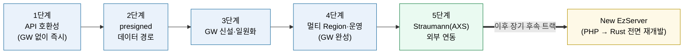

**케이스 B — 1·2단계 병행**(작업 영역이 독립적이라 동시 착수)

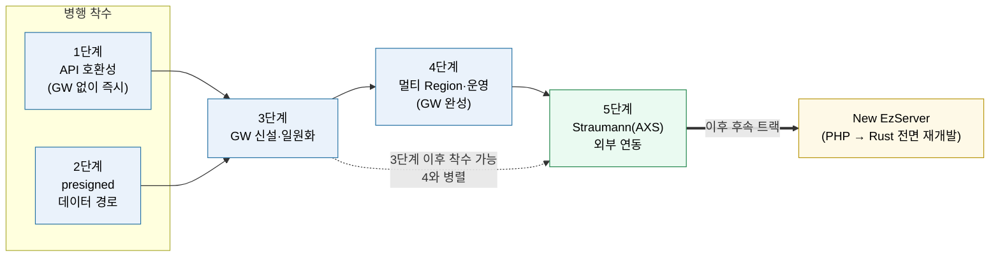

**케이스 C — 1·2 병행 + 3·4 통합**(GW를 멀티리전-ready로 한 번에)

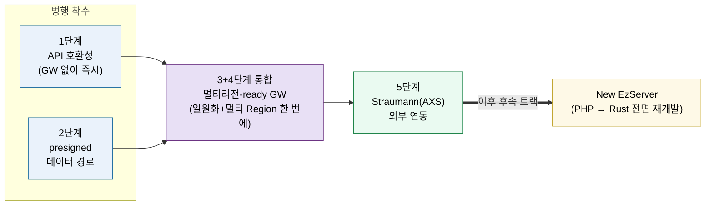

**케이스 D — 1·2 병행 + 3·4·5 통합**(GW·멀티리전·Straumann을 한 번에, 최대 동시화)

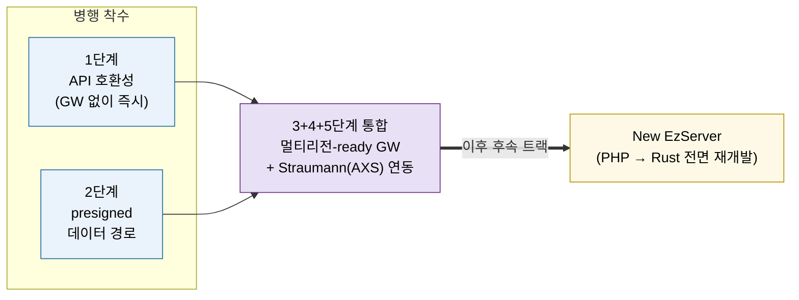

> 색상: 파란 = 핵심 단계, 보라 = 통합 단계, 초록 = Straumann 외부 연동(5단계), 노랑 = EzServer Rust 후속 트랙.
> 케이스 B·C·D 공통: 1·2단계는 작업 영역이 독립적이라 **동시 착수** 가능하고, GW 본체 **빌드도 병렬로 시작**할 수 있다. 다만 GW로의 **전환**(cutover)은 1·2가 안착한 뒤에 한다. 케이스 C는 단일 Region → 멀티 Region 재작업을 피하려고 **GW를 처음부터 멀티리전-ready로** 구축하는 시나리오다. 케이스 D는 여기에 **Straumann(5단계)까지 통합**해 인력이 충분할 때 최대 동시화하는 최속 시나리오다(멀티리전 확정·전담 인력이 전제).

- **1단계는 GW 없이 기존 경로에서 바로 착수**할 수 있어, CleverSpace v1.3.0 일정의 호환성 문제에 즉시 대응한다.
- **presigned(2단계)는 GW 일원화(3단계)의 선행 요건**이다. 모든 연동이 GW를 경유하는 구조에서 **대용량 데이터(CT·영상)는 GW로 보낼 수 없으므로**(병목·타임아웃), 업로드를 성립시키는 방법은 presigned(스토리지 직접 업로드)뿐이다. 즉 presigned 없이는 GW 체계에서 데이터 업로드를 처리할 수 없어, presigned가 먼저 갖춰져야 GW 일원화가 성립한다.
- **Straumann 연동(5단계)은 3단계 이후 착수 가능**하며 4단계와 병렬로 진행할 수 있다(선행 요건: presigned + GW + 인증 + Org-ID 매핑).
- **EzServer 전면 재개발**(PHP → Rust)은 5단계에서 제외하고 **이후 장기 후속 트랙**으로 둔다.

**기대 효과.** 연동 창구·인증 일원화로 보안·운영이 단순해지고, 버전 호환 실패가 사라지며, 멀티 Region으로 글로벌 확장과 외부(Straumann) 연동을 **같은 구조로** 수용한다.

---

## 1. 배경과 목적

세 제품(CleverOne, EzServer, CleverSpace)과 인증(OneID)은 현재 **두 갈래 경로**로 연동된다. EzServer가 중계하는 기능은 경로 A(`CleverOne → EzServer → CleverSpace`), EzServer가 중계하지 않는 기능은 경로 B(`CleverOne → CleverSpace/OneID` 직접)다.

이 구조의 문제는 세 가지다.

1. **연동 창구 분산** — 직접 경로(B)가 존재해 인증과 정책 통제가 두 갈래로 나뉜다.
2. **버전 호환 실패** — 클라이언트가 제품 버전을 전달하지 않아, 구버전이 신규 API·오류 코드를 처리하지 못하고 사용자에게 원인 불명 실패로 나타난다.
3. **외부 연동 확장의 어려움** — Straumann(AXS)처럼 보안상 **직접 연결이 불가능한 외부 서버**가 늘면, 중간 게이트웨이 없이는 연동 자체가 막힌다. 이 외부 연동은 **온프레미스→클라우드**(EzServer→AXS)뿐 아니라 **클라우드↔클라우드**(CleverLab↔AXS, 기공소 주문)까지 포함한다.

따라서 본 과제의 목적은 **VatechAPIGateway라는 단일 게이트웨이를 완성**하여 위 세 문제를 **한 번에** 푸는 것이다. GW는 단순 중계가 아니라 **인증·버전 호환·Region 분배를 집행하는 정책 지점**이다.

### AS-IS 전체 구조

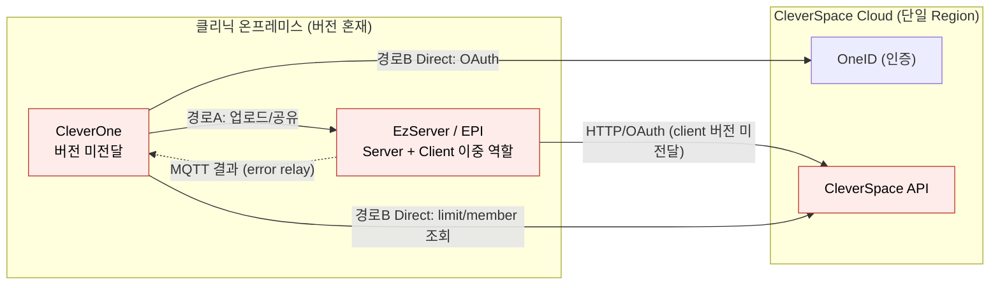

> 붉은 노드 = 문제 지점. 직접 경로(B)로 창구가 분산되고, 클라이언트 버전이 전달되지 않으며, 대용량 데이터는 그때그때 직접 전송된다.

---

## 2. 목표 아키텍처 (TO-BE 최종)

### 2.1 핵심 원칙 — 모든 연동은 GW를 통한다

- **명칭: VatechAPIGateway(GW).** 앞으로 모든 GW는 이것을 가리킨다.
- 모든 연동은 **`EZ → GW → 대상 서버`** 경로를 따른다. 대상은 CleverSpace, Straumann(AXS), 그 외 어떤 서버든 **예외 없이 GW를 경유**한다.
- GW는 **인증(OneID 연계)·버전 호환·Region 라우팅을 집행하는 단일 지점**이다.

### 2.2 구성요소

| 구성요소 | 역할 |
|----------|------|
| **EzServer(EZ)** | 클리닉 현장의 **Edge**. 장비·PMS·대용량 데이터를 현장에서 처리하고, 모든 클라우드 연동을 GW로 보낸다. (Edge로 유지 확정) |
| **VatechAPIGateway(GW)** | 모든 연동의 단일 경유점. 인증 검증, 버전 호환 판정, Region 분배, 외부 API 중계 |
| **GW Console** | Admin이 GW를 관리하는 Web client(매핑·클리닉·상태 관리) |
| **OneID(AuthServer)** | 인증. GW가 토큰 검증 등에서 연계(연계 범위는 설계에서 확장 가능) |
| **CleverSpace** | 클라우드 API. **여러 Region**에 구축 |
| **CleverLab** | 치과 기공소용 PMS(우리 클라우드 서비스). 외부 AXS와의 연동(기공소 주문·상태·확정)도 **GW를 경유**한다 |
| **외부 서버(Straumann AXS 등)** | GW를 통해서만 연동. 온프레미스(EZ)·클라우드(CleverLab) 양쪽의 외부 연동 모두 GW 경유 |
| **비-AWS 변형** | AWS 미지원 국가는 CleverSpace 대신 별도 서버 + **minio**(S3 대체). 구성은 표준과 동일, 스토리지만 교체 |

> CleverOne은 데스크톱 클라이언트로서 EZ를 통해 연동하며, 최초 접속 시 사용할 Region을 선택한다(§2.4).

### 2.3 데이터 경로 — 정보는 GW, 대용량은 presigned 직접

- **정보(메타데이터)**: `EZ → GW → 대상`. GW가 검증·라우팅한다.
- **대용량 데이터(CT·이미지)**: GW로 보내지 않는다. **presigned URL을 GW를 통해 발급**받고, **EZ가 스토리지(S3 또는 minio)에 직접 업로드**한다.
- **현재 CleverSpace는 presigned 방식이 아니라 Direct 전송**이므로, presigned 발급을 **신규 개발**해야 하고 **EZ의 전송 로직도 변경**된다(2단계).
- minio도 S3 호환이라 presigned 방식이 그대로 동작한다.
- **업로드 완료 확인**: 직접 업로드는 서버가 관여하지 않으므로, 완료 여부를 별도 신호로 확인한다. **EZ의 완료 콜백**(빠른 반영)과 **스토리지 이벤트**(S3 ObjectCreated / minio bucket notification — 권위 있는 확정·콜백 누락 백업)를 **함께** 쓰고, 서버는 size·ETag(체크섬)로 무결성을 검증한다.
- 두 신호는 **의도된 이중화**다(중복 정상). 콜백은 UX 즉시성, 이벤트는 정합성 보증·콜백 누락 백업으로 역할이 다르다. 서버는 같은 객체에 신호가 두 번 와도 **멱등**(idempotent)하게 처리해 "처리 중 → 완료"를 한 번만 반영한다(먼저 온 신호로 확정, 이후 신호는 무시).

### 2.4 Region 분배와 글로벌 라우팅

- CleverSpace를 **여러 Region에 구축**하고, GW가 요청의 **ClinicID를 보고 알맞은 Region으로 분배**한다.
- GW는 **ClinicID ↔ Region 매핑 테이블**을 보유한다. 매핑·등록 데이터는 **이식성 있는 저장소(PostgreSQL 등) + GW 메모리 캐시**로 둔다(DynamoDB는 AWS 전용이라 비-AWS 환경 불가).
- **글로벌 라우팅은 AWS Route 53로 확정.** latency-based / geolocation routing으로 EzServer를 **가장 가까운 GW Region**에 연결한다. GW는 우선 **서울·미주 2개 거점**에 **쿠버네티스로 HA** 구축한다.
- CleverOne은 **최초 설치·접속 시 사용할 Region을 선택하는 UI**가 필요하다(현재 미구현 → 4단계 개발).

### 2.5 클라이언트 식별 표준 (확정)

요청에 **제품명·버전**(·OS)을 실어 GW·CleverSpace가 버전 호환을 판정한다. **전용 헤더 + User-Agent 표준화 병행**으로 한다(권위 소스는 전용 헤더). 상세는 §5.

### 2.6 최종 아키텍처 다이어그램

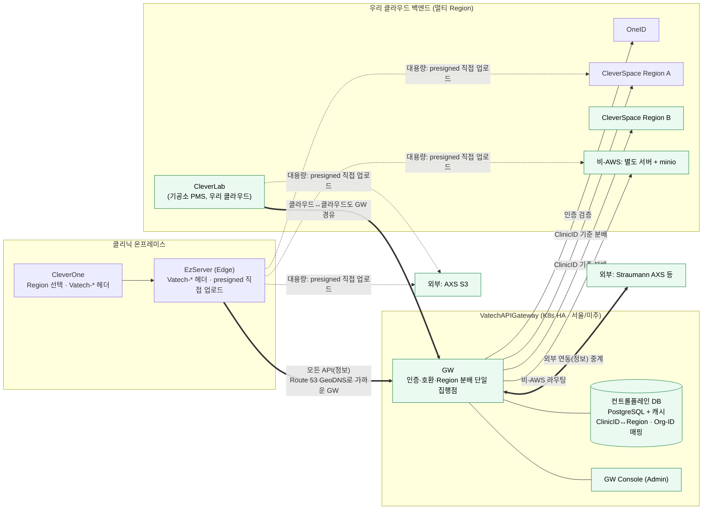

> 굵은 화살표 = 모든 API가 GW 단일 경유(온프레미스 EZ + 클라우드 CleverLab 모두). 점선 = 대용량 데이터의 presigned 직접 업로드(GW 비경유, AXS는 AXS S3로). 초록 = 본 과제로 새로 들어오는 요소. 가독성을 위해 **업로드 완료 확인(완료 콜백 + 스토리지 이벤트)은 그림에서 생략**했다(§2.3·§3.4 참조).

---

## 3. Roadmap (5단계)

단계는 **기능 응집도와 의존 순서**로 나눈다. **API 호환성은 GW 없이 즉시** 해결할 수 있고, **presigned는 GW 일원화의 선행 요건**이며, **Straumann 외부 연동은 GW·presigned 위에서 성립**하므로, 다음 5단계가 가장 효율적이다.

### 3.1 단계 개요

| 단계 | 기능 묶음 | 핵심 산출물 | 완료 의미 |
|------|-----------|-------------|-----------|
| **1단계** | API 호환성(즉시) | Vatech-* 식별 헤더(제품·버전·OS)·서버 버전 체크(validate-limits)·well-known 런타임 버전 공시·오류코드 매핑/fallback·호환성 매트릭스 | GW 없이 기존 경로에서 버전 호환 해결, 원인불명 실패 제거 |
| **2단계** | presigned 데이터 경로 | CleverSpace presigned 발급 신규 개발·EZ 전송 로직 변경(Direct→presigned 직접) | 대용량 데이터 직접 업로드 경로 완성(GW 선행 요건) |
| **3단계** | GW 신설·일원화 | GW 본체·EZ→GW 전환·OneID 인증 연계·경로 B 흡수(Deprecated)·presigned 발급 GW 경유 전환 | `EZ → GW → 대상` 단일 경유 + 인증 일원화(단일 Region) |
| **4단계** | 멀티리전·운영 | 멀티 Region·Region 분배(Postgres)·Route 53 GeoDNS·CleverOne Region UI·GW HA(K8s)·GW Console·minio | VatechAPIGateway 완성 |
| **5단계** | Straumann(AXS) 외부 연동 | EzServer→AXS(온프레미스) + CleverLab↔AXS(클라우드↔클라우드) 연동, OAuth 중계·Org-ID 매핑·온보딩 | 외부 생태계 연동을 GW·presigned로 수용 |
| (후속) | 별도 트랙 | EzServer 전면 재개발(PHP → Rust) | 5단계 이후 장기 과제 |

> 의존 관계 요약: 1단계(호환성)는 어디에도 의존하지 않아 **즉시 착수**한다. 3단계 GW가 "모든 연동 단일 경유"를 선언하려면 대용량 업로드를 GW 체계 안에서 인가해야 하므로, **2단계 presigned가 반드시 먼저** 와야 한다. 4단계(멀티리전)는 3단계 GW를 전제로 한다. 5단계(Straumann)는 **3단계(GW)·2단계(presigned)를 전제**로 하며 4단계와 병렬 가능하다.

### 3.2 AS-IS (기준점)

§1의 AS-IS 구조가 출발점이다. GW가 없고, 경로 A/B가 분산되며, 버전 미전달·Direct 데이터 전송 상태다.

### 3.3 1단계 — API 버전 호환성 해결 (GW 없이 즉시)

**목표.** GW를 기다리지 않고 **기존 경로(A·B) 위에서** 버전 호환 문제를 먼저 끝낸다. 클라이언트가 **제품·버전을 헤더로 전달**하고, CleverSpace가 **서버에서 버전을 체크**하며, **well-known으로 API별 지원 버전을 런타임 공시**한다. CleverSpace v1.3.0 일정에 바로 대응한다.

**제품별 개발 항목.**

| 제품 | 개발 항목 |
|------|-----------|
| CleverOne | Vatech-* 식별 헤더 부착(제품·버전·OS), well-known 조회 후 미지원 기능 사전 인지·안내, 오류코드 fallback("업데이트 필요") |
| EzServer(EZ) | 경로 A에서 Vatech-* 헤더 **대리 전달**(또는 EZ 자체 버전 + originating client) |
| CleverSpace | **서버 버전 체크**(validate-limits 사전검증), **well-known 런타임 버전 공시**(API/기능별 최소 클라이언트 버전), 오류 코드 정의·registry 정리 |
| 공통 | **호환성 매트릭스**(API/기능 × 최소 클라이언트 버전)를 단일 소스로 운영, 빌드/CI에 반영 |

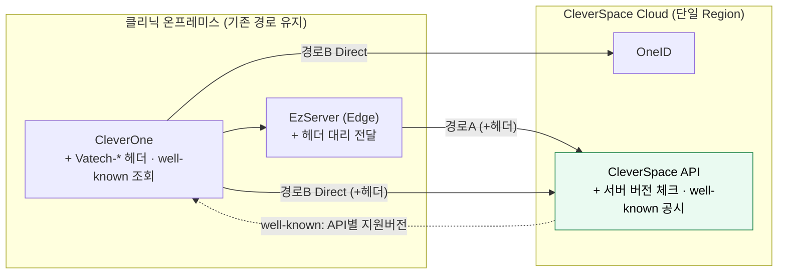

> 직전(AS-IS) 대비 변경: 경로 구조는 그대로 두되, **클라이언트가 버전을 헤더로 전달**하고 **서버가 버전을 체크·공시**한다. GW 없이도 **원인불명 실패가 사라진다.** 경로 B 통합은 3단계(GW)에서 다룬다.

### 3.4 2단계 — presigned 데이터 경로

**목표.** 대용량 데이터를 **presigned URL 직접 업로드**로 전환한다. CleverSpace에 presigned 발급을 신규 개발하고, EZ 전송 로직을 바꾼다. 이 단계는 **3단계 GW 일원화의 선행 요건**이다(GW는 대용량을 직접 나르지 않으므로, 업로드 인가를 위해 presigned가 먼저 필요).

**제품별 개발 항목.**

| 제품 | 개발 항목 |
|------|-----------|
| CleverSpace | **presigned URL 발급 API 신규 개발**(현재 Direct 전송 방식 대체), **업로드 완료 처리** — 완료 콜백 API + 스토리지 이벤트 수신, size·ETag 무결성 검증 |
| EzServer(EZ) | **데이터 전송 로직 변경** — 발급 요청 후 스토리지로 **직접 업로드**, 업로드 성공 시 **완료 콜백 호출** |
| 스토리지 | S3 ObjectCreated 이벤트(또는 minio bucket notification) → CleverSpace 통지 구성 |
| CleverOne | (해당 시) 업로드 흐름 연계 확인 |

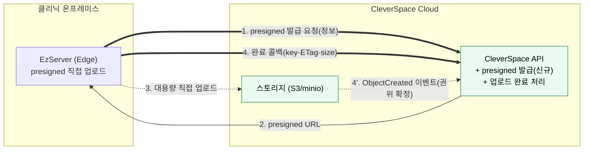

> 직전(1단계) 대비 변경: **데이터 경로 분리** — 정보(발급 요청)와 대용량(직접 업로드)이 나뉜다. 아직 GW는 없으며, 발급 요청은 CleverSpace로 직접 간다(3단계에서 GW 경유로 전환). **업로드 완료**는 EZ 콜백(4)과 스토리지 이벤트(4')를 함께 써서 확인한다.

### 3.5 3단계 — GW 신설·일원화

**목표.** **VatechAPIGateway를 세워 모든 연동을 `EZ → GW → 대상`으로 일원화**한다. 인증(OneID 연계)을 GW로 모으고, **경로 B(직접 연동)를 GW로 흡수**하며, 2단계에서 만든 **presigned 발급도 GW 경유로 전환**한다. (단일 Region으로 시작.)

> **경로 B는 이 시점부터 Deprecated**다. GW 경유 경로로 대체되며, 구버전 클라이언트 호환 종료 후 **EOS(End of Service)** 한다. 신규 개발은 경로 B를 쓰지 않는다.

**제품별 개발 항목.**

| 제품 | 개발 항목 |
|------|-----------|
| VatechAPIGateway | GW 본체(모든 연동 단일 경유), 라우팅/스로틀링, OneID 인증 검증 연계, 버전 호환 집행(1단계 자산 이관), presigned **발급 중계**, 경로 B 흡수 |
| OneID | GW 연계 토큰 검증 인터페이스 |
| EzServer(EZ) | CleverSpace/OneID 연동을 **GW 경유로 전환**, presigned 발급 요청도 GW로 |
| CleverOne | Direct 호출을 **GW 경유로 전환**(경로 B 흡수) |
| CleverSpace | GW 경유 호출 수신·검증 정합 |

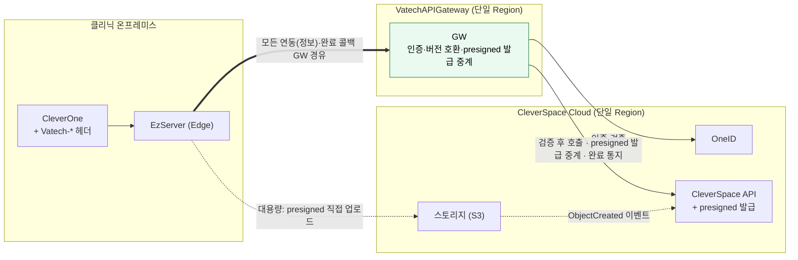

> 직전(2단계) 대비 변경: **경로 B 제거 → GW 단일 경유**. 인증·호환 집행이 GW로 모이고, presigned 발급·**업로드 완료 콜백도 GW가 중계**한다(스토리지 이벤트는 CleverSpace가 직접 수신). **이 시점부터 Straumann 착수 가능**(§3.7). 대용량 업로드는 여전히 스토리지로 직접(GW 비경유).

### 3.6 4단계 — 멀티 Region·글로벌·운영

**목표.** CleverSpace를 멀티 Region으로 확장하고, GW가 **ClinicID로 Region을 분배**하며, **Route 53 GeoDNS**로 가까운 GW에 연결한다. **HA·GW Console·비-AWS(minio)까지 갖춰 VatechAPIGateway를 완성**한다.

**제품별 개발 항목.**

| 제품 | 개발 항목 |
|------|-----------|
| CleverSpace | **멀티 Region 구축** |
| VatechAPIGateway | **Region 분배**(ClinicID↔Region 매핑), 컨트롤플레인 저장소(PostgreSQL + 캐시), **K8s HA(서울·미주)**, Route 53 GeoDNS 연계 |
| GW Console | **Admin Web Console**(매핑·클리닉·상태 관리) |
| CleverOne | **Region 선택 UI**(최초 접속 시), ClinicID 전달 |
| EzServer(EZ) | 요청에 **ClinicID 포함**, Region 인지 |
| 인프라 | **Route 53** latency/geolocation 라우팅, 비-AWS 국가 **별도 서버 + minio** |

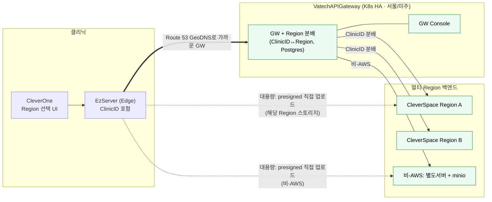

> 직전(3단계) 대비 변경: **단일 Region → 멀티 Region + GeoDNS + HA + Console + minio**. 정보는 GW가 Region을 분배하고, **대용량 업로드도 ClinicID가 가리키는 해당 Region 스토리지로 직접**(점선) 간다. 업로드 완료 확인(콜백 + 스토리지 이벤트)은 §3.4와 동일하며 가독성을 위해 그림에서 생략했다. 여기서 VatechAPIGateway가 완성된다.

### 3.7 5단계 — Straumann(AXS) 외부 연동

Straumann은 보안상 **직접 연결이 불가**하여 **반드시 GW(중간 계층)를 경유**해야 한다. 선행 요건은 **presigned(2단계) + GW 단일 경유(3단계) + 인증 + Org-ID 매핑**이다. 따라서 **3단계 완료 시점부터 착수 가능**하며, 4단계와 **병렬**로 진행한다(케이스 D는 3·4·5 통합).

연동은 두 갈래다 — **(A) EzServer → AXS**(온프레미스→클라우드)와 **(B) CleverLab ↔ AXS**(클라우드↔클라우드, 기공소 주문). **둘 다 GW를 경유**하고 대용량은 **presigned**를 쓴다.

#### 3.7.1 갈래 A — EzServer → AXS (온프레미스→클라우드)

| 항목 | 내용 |
|------|------|
| 선행 요건 | presigned 데이터 경로(2단계), GW 단일 경유·인증(3단계), Org-ID 매핑 테이블 |
| GW(중계 로직) | AXS OAuth 토큰 발급·갱신·캐싱, 환자/문서/케이스 중계, Create Document → presigned 반환 |
| 매핑 | Vatech ClinicID ↔ Straumann Organization-ID (GW 컨트롤플레인에 보관) |
| 클리닉 온보딩 | 클리닉당 1회 — Customer Number 입력 → Straumann Access 포털 승인 → Organization-ID 발급 → EzServer 설정 + GW 컨트롤플레인 등록 |
| EZ↔GW 인증 | 2층 — 공유 API Key(출처 확인) + 요청 Org-ID를 GW 등록 목록과 대조(클리닉 식별·미등록 거부) |
| 고정 egress IP | Straumann IP whitelist 대응 — GW(K8s) outbound 고정 IP(NAT) 확보 |
| Org-ID 복구 | EzServer 로컬 유실 시 GW 컨트롤플레인에서 조회·재설정(이중 저장) |
| EzServer(EZ) | AXS 연동 FE/BE, presigned 직접 업로드(Straumann S3) |
| 선결(외부) | Straumann의 API 스펙·OAuth 엔드포인트·샌드박스·자격증명 수령 |

> 데이터(영상)는 GW를 거치지 않고 **AXS S3로 presigned 직접 업로드**한다(§2.3과 동일 원리). Straumann 분석 보고서의 AWS 서버리스 전제는 본 통합에서 **K8s 기반 GW로 대체**된다.

> 범위: 갈래 A는 **EzServer → AXS 단방향**만 다룬다. 역방향 Webhook(AXS → EzServer)은 방화벽 뒤 EzServer로의 전달 문제 때문에 **Clever Orbit(클라우드 기반 EzServer) 이후로 제외**한다.

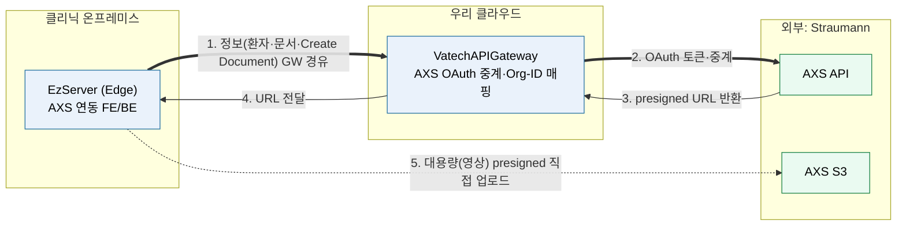

> 정보(메타데이터)는 `EZ → GW → AXS`로 GW를 경유하고, 대용량 영상은 GW가 받은 presigned URL로 **EZ가 AXS S3에 직접 업로드**한다(GW 비경유). 인증·Org-ID 매핑·토큰 갱신은 GW가 담당한다.

#### 3.7.2 갈래 B — CleverLab ↔ AXS (클라우드↔클라우드, 기공소 주문)

CleverLab은 **우리 클라우드 기공소 PMS**다. Straumann Scan SW에서 만든 기공 오더가 AXS를 통해 CleverLab로 들어오고, CleverLab의 작업 상태·확정 요청이 AXS로 나간다. **이 클라우드↔클라우드 연동도 우리 GW를 경유**하며, 디자인 파일·스캔 파일 등 대용량은 **presigned**로 처리한다. (4/2 제안서 Integration Scenario 3 기준)

| 시나리오 | 흐름 | 내용 |
|----------|------|------|
| 오더 전송 | AXS → GW → CleverLab | Straumann Scan SW에서 생성한 오더(Order ID)를 CleverLab에 등록, 상태 pending |
| 상태 동기화 | CleverLab → GW → AXS | 작업 상태(접수→진행중→완료)를 Order ID 기준으로 AXS에 전송 |
| 확정 요청 | CleverLab → GW → AXS → Straumann Console | 디자인 파일·트라이인 결과 첨부(대용량은 presigned), Confirm ID 부여 |
| 확정 결과 | AXS → GW → CleverLab | 승인/수정요청 결과를 Confirm ID 기준으로 회신 |

> AXS → CleverLab 인바운드(오더·확정 결과)는 CleverLab이 **클라우드 서비스**라 방화벽 제약이 없어 GW가 직접 수신·중계할 수 있다(EzServer의 Webhook 제약과 다름). 인바운드 수신 방식(Webhook vs 폴링)은 상세 설계에서 확정한다.

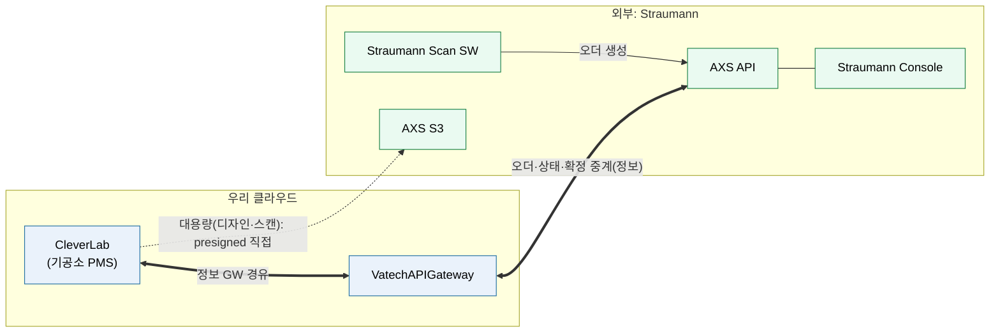

> 핵심: 온프레미스(갈래 A)든 클라우드(갈래 B)든 **외부 연동은 모두 GW를 단일 창구로 지나고**, 대용량은 presigned로 스토리지에 직접 보낸다 — 동일 원리다. 상세 설계·협상 항목·일정 추정은 `Straumann연동/Straumann-Vatech_AXS연동_분석보고서.md`와 4/2·4/30 회의 문서를 참조한다.

### 3.8 후속 트랙 — EzServer 전면 재개발 (PHP → Rust)

현재 EzServer는 PHP이며 일부 기능은 이미 Rust로 개발돼 있다. 이를 **Rust로 전면 교체**하는 것은 **5단계 이후의 장기 후속 트랙**이다(1~5단계에서 제외). **기존 API 그대로 포팅 vs API부터 재설계**는 **계속 열려 있는 숙제**다(§6). EzServer가 **Edge로 남는 것은 확정**이며 변하지 않는다.

### 3.9 구현 스펙화 — OnePager 구성

본 Roadmap은 아래 구성으로 **OnePager(프로젝트 단위 스펙)** 를 작성한다(본 보고서 작성 시점에는 미작성, 추후 작성). 4단계는 GW의 속성(Region 분배·확장)이므로 **스펙상 GW에 포함**하고, 2 → 3 → 4 단계별 구현 계획과 병행/통합 옵션은 각 OnePager의 일정 항목에 둔다.

| OnePager | 범위 | 비고 |
|----------|------|------|
| ① API 호환성 | 1단계 | 긴급·독립(v1.3.0 대응) |
| ② VatechAPIGateway 구축 | 2+3+4단계 | presigned·GW 일원화·멀티 Region을 한 스펙으로. 일정에 단계별 구현·병행/통합(케이스 C·D) 기술 |
| ③ Straumann(AXS) 연동 | 5단계 | 갈래 A(EzServer→AXS)·갈래 B(CleverLab↔AXS) 포함. 사업 동인·리스크가 상이, 3단계 이후 착수 |

> 2+3+4를 한 스펙으로 묶으면 케이스 A·B·C(순차·병행·3·4 통합)를 포괄하고, ③을 합치면 케이스 D(3·4·5 통합)까지 포괄한다.

---

## 4. 제품별 개발 항목 종합 (제품 × 단계)

| 제품 | 1단계(호환성) | 2단계(presigned) | 3단계(GW 일원화) | 4단계(멀티리전) | 5단계(Straumann) | 후속 |
|------|------|------|------|------|------|------|
| **CleverSpace** | 서버 버전 체크·well-known 공시·오류코드 정리 | **presigned 발급 신규 개발** | GW 경유 수신 정합 | 멀티 Region 구축 | — | — |
| **CleverOne** | Vatech-* 헤더·well-known 인지·fallback | 업로드 흐름 연계 | Direct→GW 경유 전환 | **Region 선택 UI**·ClinicID | — | — |
| **EzServer(EZ)** | 헤더 대리 전달 | 전송 로직 변경(presigned 직접) | GW 경유 전환 | ClinicID 포함·Region 인지 | AXS 연동 FE/BE(갈래 A)·presigned 직접 업로드 | **Rust 전면 재개발** |
| **CleverLab** | — | — | — | — | **AXS 오더·상태·확정 연동(갈래 B)**·presigned | — |
| **VatechAPIGateway** | — | — | 본체·라우팅·인증 연계·호환 집행·presigned 발급 중계·경로 B 흡수 | Region 분배·HA(K8s)·Route 53·저장소(Postgres) | AXS OAuth 중계·Org-ID 매핑·온보딩·인바운드 중계·고정 egress IP | — |
| **GW Console** | — | — | — | Admin Web Console | 온보딩·Org-ID 관리 화면 | — |
| **OneID** | (경로 B 인증 유지) | — | GW 연계 토큰 검증 | (멀티 Region 인증 고려) | — | — |
| **인프라** | 단일 Region | — | 단일 Region GW | Route 53·K8s·비-AWS minio | AXS whitelist용 고정 IP·샌드박스 | — |
| **외부(Straumann AXS)** | — | — | — | — | API 스펙·OAuth·샌드박스·자격증명 제공(선결) | — |

---

## 5. 클라이언트 식별 헤더 표준 (확정)

요청에 **제품명·버전**(·OS)을 실어 GW·CleverSpace가 버전 호환을 판정한다.

**구조화 전용 헤더가 권위 소스, User-Agent 표준화는 병행.** 머신 판정(버전 게이트·Region 라우팅·한도 검증)은 전용 헤더로 한다(User-Agent 파싱은 포맷이 제각각이고 중간 경로에서 변형될 수 있어 취약). User-Agent는 로깅·관측·하위호환을 위해 표준 포맷으로 유지한다.

```
Vatech-Product:   CleverOne          # 요청을 시작한 주체(originator)
Vatech-Version:   1.5.5              # originator 버전(semver)
Vatech-OS:        Windows/11         # OS명/버전
Vatech-Clinic-Id: <ClinicID>         # GW Region 라우팅 키
Vatech-Via:       EzServer/6.5.0     # 경유한 중계 홉(있을 때만)

User-Agent: EzServer/6.5.0   # 직전 송신자(로그·관측·하위호환)
```

- 프리픽스는 제품 브랜드 `Vatech-`를 쓴다. `X-` 접두는 RFC 6648에서 비권장이라 붙이지 않는다(`X-Vatech-Product` 아님).
- **ClinicID를 같은 체계에 포함** → Region 분배(§2.4)와 한 번에 해결.
- **집행 주체는 단계에 따라 다르다.** 1단계에서는 **CleverSpace(서버)가 직접** 헤더를 읽어 버전·한도를 판정하고, **3단계부터는 GW가 단일 집행점**으로 헤더를 읽어 라우팅·호환·한도 판정 후 다운스트림에 정규화 전달한다. 헤더 자체는 1단계부터 동일하게 쓰므로 추가 변경이 없다.
- **외부(Straumann 등)로는 내부 헤더를 보내지 않는다.**
- 적용 지점(기존 소스): CleverOne `CleverOneInitializer.cpp`·`EzCloudController.cpp`, ESLinkageCloudPlatform `EzCloudLinker.cpp`·`OneIdLinker.cpp`(`strAgent` 확장), EzServer(EPI) 대리 전달.

#### 5.1 중계 경로(CleverOne → EzServer → GW)의 식별 규칙

"누가 보냈나(전송 홉)"와 "누가 시작했나(originator)"를 분리해 담는다. EzServer는 GW로 가는 실제 송신자이면서, 그 요청의 트리거는 CleverOne일 수도 EzServer 자신일 수도 있다.

- **`Vatech-Product`/`Vatech-Version`/`Vatech-OS` = originator(요청을 시작한 주체).** 버전 호환 판정의 권위 소스다.
- **`Vatech-Via` = 경유한 중계 홉.** EzServer가 자기 자신(`EzServer/6.5.0`)을 덧붙인다. 홉이 여럿이면 콤마로 누적한다.
- **`User-Agent` = 직전 송신자(여기선 EzServer).** 전송 로그·관측용. 머신 판정은 위 전용 헤더로 한다.

| 트리거 | Vatech-Product / Version | Vatech-Via | User-Agent |
|--------|--------------------------|------------|------------|
| CleverOne → EZ → GW | CleverOne / CleverOne버전 | EzServer/6.5.0 | EzServer/6.5.0 |
| EZ 자체 → GW | EzServer / EzServer버전 | (비움) | EzServer/6.5.0 |

규칙 한 줄: **`Vatech-*`는 항상 시작한 주체, `Vatech-Via`는 거쳐 간 주체.** EzServer가 originator인 경우도 같은 규칙으로 자연히 처리된다.

왜 originator를 권위 소스로 두나: 경로 A는 CleverSpace가 새 API/오류코드를 돌려줄 때 화면에 쓰는 CleverOne과 MQTT로 중계하는 EzServer가 둘 다 충분히 최신이어야 정상 동작한다(§2.3). originator를 `Vatech-*`로, 경유 EzServer를 `Vatech-Via`로 함께 보내면 GW가 두 버전을 모두 보고 **더 낮은 쪽 기준**으로 호환을 게이팅할 수 있다. EzServer가 자기 버전으로 `Vatech-*`를 덮어쓰면 CleverOne이 구버전인지 GW가 알 수 없게 된다.

---

## 6. 남은 숙제·결정 항목

| 항목 | 내용 | 단계 |
|------|------|------|
| well-known 스펙 | 공시 경로(`.well-known/<env>/server-configuration.json`)·응답 스키마·캐시 정책 | 1단계 상세설계 |
| presigned 발급 시퀀스 상세 | 2단계(직접)→3단계(GW 경유) 전환 흐름·CleverSpace 개발 범위 | 2~3단계 상세설계 |
| 업로드 완료 확인 방식 | 완료 콜백 + 스토리지 이벤트 조합 확정, 재시도·타임아웃·무결성(ETag) 규칙 | 2단계 상세설계 |
| 매핑 테이블 스키마 | ClinicID↔Region, ClinicID↔Org-ID, 상태 등 필드 확정 | 4단계 / 5단계 |
| Route 53 옵션 | latency vs geolocation, 헬스체크·페일오버 정책 | 4단계 상세설계 |
| CleverLab 인바운드 방식 | AXS → CleverLab(오더·확정 결과) 수신을 Webhook vs 폴링 중 확정 | 5단계 상세설계 |
| 경로 B EOS 시점 | 구버전 호환 종료 시점과 연계한 경로 B 서비스 종료 일정 | 3단계 이후 |
| OneID 연계 범위 | 인증 Verify 외 토큰 발급·권한 조회 등 추가 연계 | 설계 중 구체화 |
| Region 확장 | 서울·미주 외 추가 Region 계획 | 운영 단계 |
| **EzServer Rust 재개발 방식** | **기존 API 포팅 vs API 재설계 — 계속 열린 장기 숙제** | 후속 트랙 |

> EzServer가 Edge로 남는 것, 글로벌 라우팅을 Route 53로 하는 것, 클라이언트 식별 표준(Vatech-*), 비-AWS는 minio 교체만 다른 것, 경로 B를 Deprecated 후 EOS하는 것은 **이미 확정**이다.
