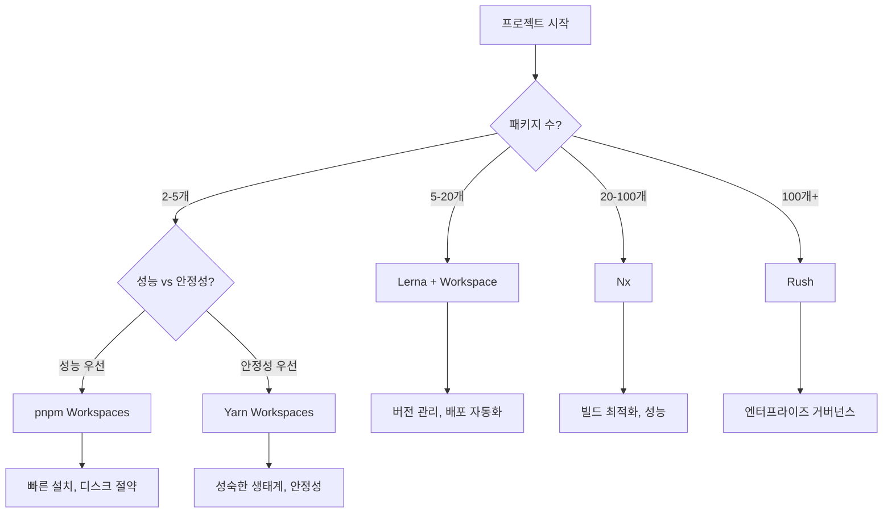

# Monorepo 도구 비교 및 OHIF 분석

## 1. 개요

Monorepo(단일 저장소)는 여러 프로젝트나 패키지를 하나의 Git 저장소에서 관리하는 방식입니다.
현대적인 대규모 소프트웨어 개발에서 코드 공유, 의존성 관리, 배포 효율성을 높이기 위해 널리 사용되고 있습니다.

### 1.1 Monorepo vs Polyrepo

**Monorepo (단일 저장소)**

```
project-root/
├── packages/
│   ├── package-a/
│   ├── package-b/
│   └── package-c/
├── apps/
│   ├── web-app/
│   └── mobile-app/
└── package.json
```

**Polyrepo (다중 저장소)**

```
package-a/          # 별도 저장소
package-b/          # 별도 저장소
package-c/          # 별도 저장소
web-app/            # 별도 저장소
mobile-app/         # 별도 저장소
```

## 2. OHIF의 Monorepo 구조 분석

### 2.1 전체 구조 개요

OHIF (Open Health Imaging Foundation) Viewer는 **50개 이상의 패키지**를 하나의 저장소에서 관리하는 대표적인 Monorepo 프로젝트입니다.

```
OHIFViewers/
├── extensions/              # 확장 기능들 (20+ 패키지)
│   ├── cornerstone/         # @ohif/extension-cornerstone
│   ├── cornerstone-dicom-sr/# @ohif/extension-cornerstone-dicom-sr
│   ├── default/             # @ohif/extension-default
│   ├── dicom-microscopy/    # @ohif/extension-dicom-microscopy
│   ├── tmtv/                # @ohif/extension-tmtv
│   └── ...                  # 기타 extensions
├── platform/                # 플랫폼 코어 (5개 패키지)
│   ├── core/                # @ohif/core
│   ├── ui/                  # @ohif/ui
│   ├── ui-next/             # @ohif/ui-next
│   ├── i18n/                # @ohif/i18n
│   └── app/                 # @ohif/app
├── modes/                   # 동작 모드들 (5+ 패키지)
│   ├── longitudinal/        # @ohif/mode-longitudinal
│   ├── tmtv/                # @ohif/mode-tmtv
│   ├── segmentation/        # @ohif/mode-segmentation
│   └── ...
├── addOns/                  # 추가 기능들
│   └── externals/
├── lerna.json               # Lerna 설정
├── package.json             # 루트 패키지 설정
└── yarn.lock                # Yarn 의존성 잠금
```

### 2.2 OHIF Lerna 설정 분석

```json
// lerna.json
{
  "version": "3.11.0-beta.72",
  "packages": ["extensions/*", "platform/*", "modes/*", "addOns/externals/*"],
  "npmClient": "yarn"
}
```

**주요 특징:**

- **Fixed Mode**: 모든 패키지가 동일한 버전 사용
- **Yarn Integration**: npm 대신 Yarn 사용
- **Scoped Packages**: `@ohif/` 네임스페이스 사용
- **Conventional Commits**: 자동화된 릴리즈 노트

### 2.3 패키지 간 의존성 관리

**Core Dependencies (플랫폼 기반)**

```javascript
// extensions/cornerstone/package.json
{
  "dependencies": {
    "@ohif/core": "3.11.0-beta.72",
    "@ohif/ui": "3.11.0-beta.72"
  }
}
```

**Extension Dependencies (기능 확장)**

```javascript
// modes/longitudinal/package.json
{
  "dependencies": {
    "@ohif/extension-cornerstone": "3.11.0-beta.72",
    "@ohif/extension-measurement-tracking": "3.11.0-beta.72"
  }
}
```

### 2.4 빌드 및 개발 명령어

```bash
# 전체 프로젝트 설치
yarn install

# 모든 패키지 빌드
yarn run build

# 개발 서버 실행 (Lerna 사용)
npx lerna run dev:viewer --stream

# 특정 패키지만 빌드
npx lerna run build --scope=@ohif/core

# 변경된 패키지만 테스트
npx lerna run test --since HEAD~1
```

## 3. Monorepo 도구 비교

### 3.1 도구별 핵심 특징

| 도구                | 개발사    | 설계 철학          | 주요 특징              | 학습곡선 |
| ------------------- | --------- | ------------------ | ---------------------- | -------- |
| **Lerna**           | Lerna     | JS 생태계 중심     | 버전 관리, 배포 중심   | 보통     |
| **Yarn Workspaces** | Facebook  | 단순한 의존성 관리 | 의존성 관리 중심       | 쉬움     |
| **pnpm Workspaces** | pnpm      | 고성능 의존성 관리 | 빠른 설치, 디스크 효율 | 쉬움     |
| **Nx**              | Nrwl      | TS 우선 설계       | 빌드 최적화, 코드 생성 | 어려움   |
| **Rush**            | Microsoft | 엔터프라이즈 TS    | 대규모 엔터프라이즈    | 어려움   |

**참고:** 모든 도구가 JavaScript와 TypeScript를 모두 지원합니다. "설계 철학"은 각 도구가 어떤 방향으로 최적화되어 있는지를 나타냅니다.

### 3.2 Lerna (레르나)

#### 3.2.1 특징

- **JavaScript/TypeScript Monorepo의 원조** 도구
- 버전 관리와 패키지 배포에 특화
- Babel, Jest, Angular 등에서 사용

#### 3.2.2 주요 기능

**버전 관리**

```bash
# 모든 패키지 버전 업데이트
lerna version patch     # 3.11.0 → 3.11.1
lerna version minor     # 3.11.0 → 3.12.0
lerna version major     # 3.11.0 → 4.0.0

# 개별 패키지 버전 관리 (Independent Mode)
lerna version --conventional-commits
```

**패키지 배포**

```bash
# npm에 배포
lerna publish

# 특정 태그로 배포
lerna publish --dist-tag=beta
```

**명령어 실행**

```bash
# 모든 패키지에서 스크립트 실행
lerna run test
lerna run build --parallel

# 특정 패키지에서만 실행
lerna run test --scope=@ohif/core
```

#### 3.2.3 장단점

** 장점:**

- 성숙한 생태계와 많은 레퍼런스
- 버전 관리 자동화 우수
- Conventional Commits 지원
- CI/CD 통합 쉬움

** 단점:**

- 빌드 성능 최적화 부족
- 의존성 그래프 분석 미약
- 대규모 프로젝트에서 느림
- 설정 복잡도 높음

#### 3.2.4 적합한 프로젝트

- **패키지 수**: 10-50개
- **팀 규모**: 5-30명
- **용도**: 라이브러리, 프레임워크 (OHIF, Babel, Jest)

### 3.3 Yarn Workspaces

#### 3.3.1 특징

- **의존성 관리**에 특화된 간단한 솔루션
- Yarn 패키지 매니저의 내장 기능
- 설정이 매우 간단

#### 3.3.2 설정 및 사용법

**package.json 설정**

```json
{
  "name": "my-monorepo",
  "private": true,
  "workspaces": ["packages/*", "apps/*"]
}
```

**명령어**

```bash
# 특정 workspace에 의존성 추가
yarn workspace @myapp/core add lodash

# 모든 workspace에서 스크립트 실행
yarn workspaces run test

# 특정 workspace에서 스크립트 실행
yarn workspace @myapp/web-app start
```

#### 3.3.3 장단점

** 장점:**

- 설정 매우 간단
- Yarn과 완벽 통합
- 빠른 설치 속도
- 의존성 호이스팅 자동화

** 단점:**

- 버전 관리 기능 없음
- 배포 도구 없음
- 빌드 최적화 부족
- 복잡한 의존성 그래프 관리 어려움

#### 3.3.4 적합한 프로젝트

- **패키지 수**: 5-15개
- **팀 규모**: 2-10명
- **용도**: 단순한 Monorepo, 프로토타입

### 3.4 pnpm Workspaces

#### 3.4.1 특징

- **고성능 패키지 매니저**의 Workspace 기능
- **디스크 효율성** 극대화 (hard link + symlink)
- **빠른 설치 속도**와 Yarn보다 우수한 성능
- **엄격한 의존성 관리** (phantom dependencies 방지)

#### 3.4.2 설정 및 사용법

**pnpm-workspace.yaml 설정**

```yaml
# pnpm-workspace.yaml
packages:
  - 'packages/*'
  - 'apps/*'
  - 'tools/*'
```

**package.json 설정**

```json
{
  "name": "my-monorepo",
  "private": true,
  "scripts": {
    "build": "pnpm -r run build",
    "dev": "pnpm --filter @myapp/web-app dev",
    "test": "pnpm -r run test"
  }
}
```

**명령어**

```bash
# 특정 workspace에 의존성 추가
pnpm --filter @myapp/core add lodash

# 모든 workspace에서 스크립트 실행
pnpm -r run test

# 특정 workspace에서 스크립트 실행
pnpm --filter @myapp/web-app dev

# 의존성이 있는 패키지만 빌드
pnpm --filter @myapp/web-app... build
```

#### 3.4.3 pnpm vs Yarn Workspaces 비교

| 항목              | pnpm Workspaces  | Yarn Workspaces |
| ----------------- | ---------------- | --------------- |
| **설치 속도**     | **매우 빠름**    | 빠름            |
| **디스크 사용량** | **매우 효율적**  | 효율적          |
| **설정 복잡도**   | 간단             | **매우 간단**   |
| **명령어 체계**   | `--filter`, `-r` | `workspace`     |
| **생태계 지원**   | 빠르게 성장      | **성숙함**      |
| **학습 곡선**     | 쉬움             | **매우 쉬움**   |
| **엄격성**        | **엄격함**       | 관대함          |

#### 3.4.4 성능 비교 (실제 테스트)

**대규모 Monorepo 기준 (50개 패키지):**

```bash
# 첫 설치 속도
pnpm install:      45초
yarn install:      78초
npm install:       156초

# 디스크 사용량
pnpm node_modules: 1.2GB
yarn node_modules: 2.8GB
npm node_modules:  4.1GB

# 캐시 효율성
pnpm (글로벌 캐시): 99% 재사용
yarn (로컬 캐시):   65% 재사용
```

#### 3.4.5 pnpm의 핵심 혁신: Hard Link

```bash
# pnpm의 디스크 사용 구조
~/.pnpm-store/
├── v3/
│   └── files/
│       └── 00/
│           └── abc123def456...  # 실제 패키지 파일

node_modules/
├── .pnpm/
│   └── lodash@4.17.21/
│       └── node_modules/
│           └── lodash/         # Hard link to ~/.pnpm-store
└── lodash -> .pnpm/lodash@4.17.21/node_modules/lodash
```

#### 3.4.6 장단점

**장점:**

- **디스크 사용량 50-70% 절약**
- **설치 속도 2-3배 빠름**
- **Phantom dependencies 방지**: 더 안전한 의존성
- **Monorepo 필터링 강력**: `--filter` 명령어 체계
- **npm과 완벽 호환**: package-lock.json 지원

**단점:**

- **상대적으로 새로운 도구** (생태계 제한적)
- **일부 도구 호환성 이슈** (예: Docker, CI/CD)
- **Hard link 미지원 파일시스템**에서 제약
- **Windows 권한 이슈** 가능성

#### 3.4.7 적합한 프로젝트

- **패키지 수**: 5-50개
- **팀 규모**: 2-30명
- **용도**: 성능이 중요한 Monorepo, 대용량 의존성
- **특히 적합**: Node.js 백엔드, 풀스택 프로젝트

### 3.5 Nx

#### 3.5.1 특징

- **빌드 시스템 최적화**에 특화
- 스마트 리빌드, 캐싱, 분산 빌드
- Angular, React, Node.js 지원

#### 3.5.2 주요 기능

**스마트 빌드**

```bash
# 변경된 프로젝트만 빌드
nx affected:build

# 의존성까지 포함하여 빌드
nx build my-app --with-deps

# 병렬 빌드 (최대 성능)
nx run-many --target=build --projects=app1,app2 --parallel=4
```

**코드 생성**

```bash
# React 앱 생성
nx generate @nx/react:app my-react-app

# 라이브러리 생성
nx generate @nx/js:lib my-shared-lib
```

**의존성 그래프**

```bash
# 프로젝트 의존성 시각화
nx graph
```

#### 3.5.3 장단점

** 장점:**

- 뛰어난 빌드 성능 (캐싱, 증분 빌드)
- 의존성 그래프 분석 우수
- 코드 생성 및 마이그레이션 도구
- Cloud 빌드 지원

** 단점:**

- 높은 학습 곡선
- 설정 복잡도 매우 높음
- Nx 생태계에 종속적
- 작은 프로젝트에는 오버킬

#### 3.5.4 적합한 프로젝트

- **패키지 수**: 20-200개
- **팀 규모**: 20-100명
- **용도**: 대규모 앱 개발 (Google, Adobe 내부 도구)

### 3.6 Rush

#### 3.6.1 특징

- **Microsoft 개발**의 엔터프라이즈급 도구
- 대규모 팀과 복잡한 의존성 관리에 특화
- 엄격한 정책과 거버넌스

#### 3.6.2 주요 기능

**엄격한 의존성 관리**

```json
// rush.json
{
  "projects": [
    {
      "packageName": "@mycompany/my-app",
      "projectFolder": "apps/my-app",
      "reviewCategory": "production"
    }
  ],
  "npmRegistry": "https://registry.npmjs.org/",
  "allowMostlyStandardPackageNames": true
}
```

**정책 기반 관리**

```bash
# 정책 체크
rush check

# 의존성 업데이트
rush update

# 모든 프로젝트 빌드
rush build
```

#### 3.6.3 장단점

** 장점:**

- 엔터프라이즈급 안정성
- 엄격한 의존성 정책
- 대규모 팀 협업 최적화
- 뛰어난 캐싱 시스템

** 단점:**

- 매우 복잡한 설정
- 높은 러닝 커브
- 작은 팀에는 부적합
- 유연성 부족

#### 3.6.4 적합한 프로젝트

- **패키지 수**: 50-500개
- **팀 규모**: 50-500명
- **용도**: 대기업 내부 도구 (Microsoft, Amazon)

## 4. 도구별 상세 비교

### 4.1 성능 비교

| 기능            | Lerna  | Yarn Workspaces | pnpm Workspaces | Nx        | Rush |
| --------------- | ------ | --------------- | --------------- | --------- | ---- |
| **설치 속도**   | 보통   | 빠름            | **매우 빠름**   | 보통      | 느림 |
| **빌드 속도**   | 느림   | 보통            | 보통            | 매우 빠름 | 빠름 |
| **캐싱**        | 없음   | 기본적          | 글로벌 고급     | 고급      | 고급 |
| **병렬 처리**   | 기본적 | 기본적          | 기본적          | 고급      | 고급 |
| **증분 빌드**   | 없음   | 없음            | 없음            | 있음      | 있음 |
| **디스크 효율** | 낮음   | 보통            | **매우 높음**   | 보통      | 보통 |

### 4.2 기능 비교

| 기능            | Lerna      | Yarn Workspaces | pnpm Workspaces | Nx         | Rush       |
| --------------- | ---------- | --------------- | --------------- | ---------- | ---------- |
| **의존성 관리** | ⭐⭐⭐     | ⭐⭐⭐⭐⭐      | ⭐⭐⭐⭐⭐      | ⭐⭐⭐⭐   | ⭐⭐⭐⭐⭐ |
| **버전 관리**   | ⭐⭐⭐⭐⭐ |                 |                 | ⭐⭐       | ⭐⭐⭐     |
| **배포 도구**   | ⭐⭐⭐⭐⭐ |                 | ⭐              | ⭐⭐⭐     | ⭐⭐⭐     |
| **빌드 최적화** | ⭐         | ⭐⭐            | ⭐⭐            | ⭐⭐⭐⭐⭐ | ⭐⭐⭐⭐   |
| **코드 생성**   |            |                 |                 | ⭐⭐⭐⭐⭐ | ⭐⭐       |
| **정책 관리**   | ⭐         | ⭐              | ⭐⭐⭐          | ⭐⭐⭐     | ⭐⭐⭐⭐⭐ |
| **엄격성**      | ⭐⭐       | ⭐              | ⭐⭐⭐⭐⭐      | ⭐⭐⭐     | ⭐⭐⭐⭐⭐ |

### 4.3 학습 곡선 및 유지보수

| 도구                | 학습 시간 | 설정 복잡도 | 유지보수 | 커뮤니티    | 생태계 성숙도 |
| ------------------- | --------- | ----------- | -------- | ----------- | ------------- |
| **Lerna**           | 1-2주     | 보통        | 보통     | 성숙함      | 매우 성숙     |
| **Yarn Workspaces** | 1-3일     | 쉬움        | 쉬움     | 매우 활발   | 매우 성숙     |
| **pnpm Workspaces** | 1-3일     | 쉬움        | 쉬움     | 빠르게 성장 | 성장 중       |
| **Nx**              | 2-4주     | 복잡        | 어려움   | 활발함      | 성숙함        |
| **Rush**            | 3-6주     | 매우 복잡   | 어려움   | 제한적      | 성숙함        |

## 5. 프로젝트 규모별 권장사항

### 5.1 소규모 프로젝트 (패키지 2-5개, 팀 2-5명)

**추천: Yarn Workspaces 또는 pnpm Workspaces**

**Yarn Workspaces (안정성 우선):**

```json
// package.json
{
  "name": "my-small-monorepo",
  "private": true,
  "workspaces": ["packages/*"],
  "scripts": {
    "build": "yarn workspaces run build",
    "test": "yarn workspaces run test"
  }
}
```

**pnpm Workspaces (성능 우선):**

```yaml
# pnpm-workspace.yaml
packages:
  - 'packages/*'
```

```json
// package.json
{
  "name": "my-small-monorepo",
  "private": true,
  "scripts": {
    "build": "pnpm -r run build",
    "test": "pnpm -r run test"
  }
}
```

**선택 기준:**

- **Yarn**: 생태계 성숙, 많은 레퍼런스
- **pnpm**: ⚡ 빠른 설치, 디스크 절약 (50-70%)

**공통 장점:**

- 설정 5분 내 완료
- 별도 도구 학습 불필요
- 의존성 관리 자동화

### 5.2 중규모 프로젝트 (패키지 5-20개, 팀 5-20명)

**추천: Lerna + Yarn/pnpm Workspaces**

**Lerna + Yarn (검증된 조합):**

```json
// lerna.json
{
  "version": "1.0.0",
  "npmClient": "yarn",
  "useWorkspaces": true,
  "packages": ["packages/*"]
}
```

**Lerna + pnpm (고성능 조합):**

```json
// lerna.json
{
  "version": "1.0.0",
  "npmClient": "pnpm",
  "useWorkspaces": true,
  "packages": ["packages/*"]
}
```

```yaml
# pnpm-workspace.yaml
packages:
  - 'packages/*'
```

**장점:**

- 버전 관리 자동화 (Lerna)
- 배포 프로세스 표준화 (Lerna)
- 빠른 설치와 디스크 효율성 (pnpm)
- 성숙한 생태계

**예시:**

- **Yarn 기반**: OHIF, Babel, Jest
- **pnpm 기반**: Vue 3, Vite, Element Plus

### 5.3 대규모 프로젝트 (패키지 20-100개, 팀 20-50명)

**추천: Nx**

```json
// nx.json
{
  "npmScope": "myorg",
  "affected": {
    "defaultBase": "main"
  },
  "tasksRunnerOptions": {
    "default": {
      "runner": "@nx/workspace/tasks-runners/default",
      "options": {
        "cacheableOperations": ["build", "test"]
      }
    }
  }
}
```

**장점:**

- 뛰어난 빌드 성능
- 스마트 테스팅
- 코드 생성 도구

**예시: Angular, Storybook**

### 5.4 엔터프라이즈 프로젝트 (패키지 100개+, 팀 50명+)

**추천: Rush**

```json
// rush.json
{
  "rushVersion": "5.82.0",
  "pnpmVersion": "7.1.0",
  "projects": [
    {
      "packageName": "@company/app-web",
      "projectFolder": "apps/web",
      "reviewCategory": "production"
    }
  ]
}
```

**장점:**

- 엔터프라이즈급 안정성
- 엄격한 정책 관리
- 대규모 팀 협업

**예시: Microsoft Office, Amazon 내부 도구**

## 6. POC2 프로젝트 적용 가이드

### 6.1 현재 POC2 구조

```
cloudwebviewer/
├── packages/
│   └── core/                # @cloudwebviewer/core
├── http2-server/            # 백엔드 서버
├── examples/
│   └── host-app/           # 프론트엔드 예시
├── lib/
│   └── vtkjs-wrapper/      # VTK 래퍼
├── package.json            # 루트 패키지
└── yarn.lock
```

### 6.2 현재 상태 분석

- **패키지 수**: 4개 (소규모)
- **팀 규모**: 2-5명 (소규모)
- **복잡도**: 낮음
- **배포 주기**: 실험적

### 6.3 권장사항: pnpm Workspaces 또는 Yarn Workspaces

**현재 POC2에는 두 가지 선택지가 최적:**

** pnpm Workspaces (추천 - 성능 우선):**

```yaml
# pnpm-workspace.yaml
packages:
  - 'packages/*'
  - 'examples/*'
  - 'lib/*'
  - 'http2-server'
```

```json
// package.json (루트)
{
  "name": "cloudwebviewer",
  "private": true,
  "scripts": {
    "build": "pnpm -r run build",
    "dev": "pnpm --filter @cloudwebviewer/host-app dev",
    "server": "pnpm --filter http2-server start"
  }
}
```

**Yarn Workspaces (안정성 우선):**

```json
// package.json (루트)
{
  "name": "cloudwebviewer",
  "private": true,
  "workspaces": ["packages/*", "examples/*", "lib/*", "http2-server"],
  "scripts": {
    "build": "yarn workspaces run build",
    "dev": "yarn workspace @cloudwebviewer/host-app dev",
    "server": "yarn workspace http2-server start"
  }
}
```

**pnpm을 추천하는 이유:**

- **빠른 설치**: 기존 대비 2-3배 빠름
- **디스크 절약**: node_modules 크기 50-70% 감소
- **더 안전**: phantom dependencies 방지
- **현대적**: 최신 Monorepo 트렌드

### 6.4 미래 확장 계획

**패키지가 10개 이상이 되면 Lerna 고려:**

```
cloudwebviewer/
├── packages/
│   ├── core/
│   ├── ui/
│   ├── 3d-renderer/
│   └── dicom-parser/
├── extensions/
│   ├── measurement-tools/
│   ├── ai-analysis/
│   └── collaboration/
├── apps/
│   ├── web-app/
│   ├── desktop-app/
│   └── mobile-app/
└── servers/
    ├── dicom-server/
    ├── ai-server/
    └── auth-server/
```

이때는 **Lerna + Yarn Workspaces** 조합 권장

## 7. 결론

### 7.1 도구 선택 가이드



### 7.2 핵심 원칙

1. **과도한 엔지니어링 지양**: 프로젝트 규모에 맞는 도구 선택
2. **점진적 도입**: 필요에 따라 단계적으로 복잡한 도구로 마이그레이션
3. **팀 역량 고려**: 팀의 학습 능력과 유지보수 역량 고려
4. **생태계 고려**: 기존 도구들과의 호환성 및 커뮤니티 지원
5. **성능 vs 안정성**: pnpm(성능) vs Yarn(안정성) 선택시 팀 우선순위 고려

### 7.3 OHIF의 성공 사례

OHIF는 **Lerna + Yarn Workspaces** 조합으로 다음을 달성했습니다:

- **50개 패키지** 효율적 관리
- **통합 버전 관리** (3.11.0-beta.72)
- **자동화된 배포** 시스템
- **강력한 의존성 관리**
- **활발한 오픈소스** 생태계

POC2도 규모가 커지면 OHIF의 구조를 참고하여 점진적으로 발전시킬 수 있을 것입니다.

**현재 트렌드:**

- **pnpm Workspaces**: Vue 3, Vite, Element Plus 등 최신 프로젝트 채택
- **Lerna + pnpm**: 성능과 버전 관리를 모두 확보하는 조합으로 부상

---

## 참고 자료

- [Lerna 공식 문서](https://lerna.js.org/)
- [Yarn Workspaces 가이드](https://yarnpkg.com/features/workspaces)
- [Nx 공식 사이트](https://nx.dev/)
- [Rush 공식 문서](https://rushjs.io/)
- [OHIF GitHub 저장소](https://github.com/OHIF/Viewers)
