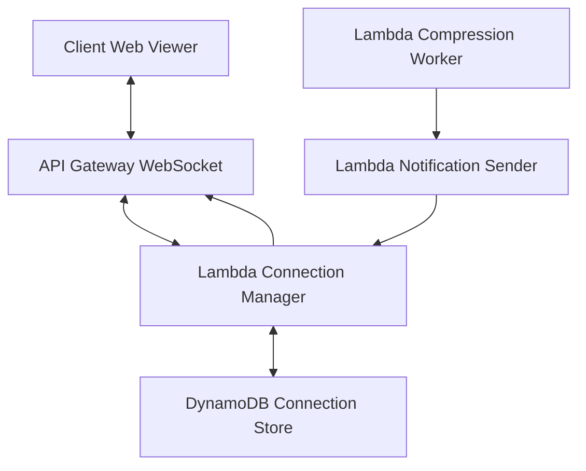
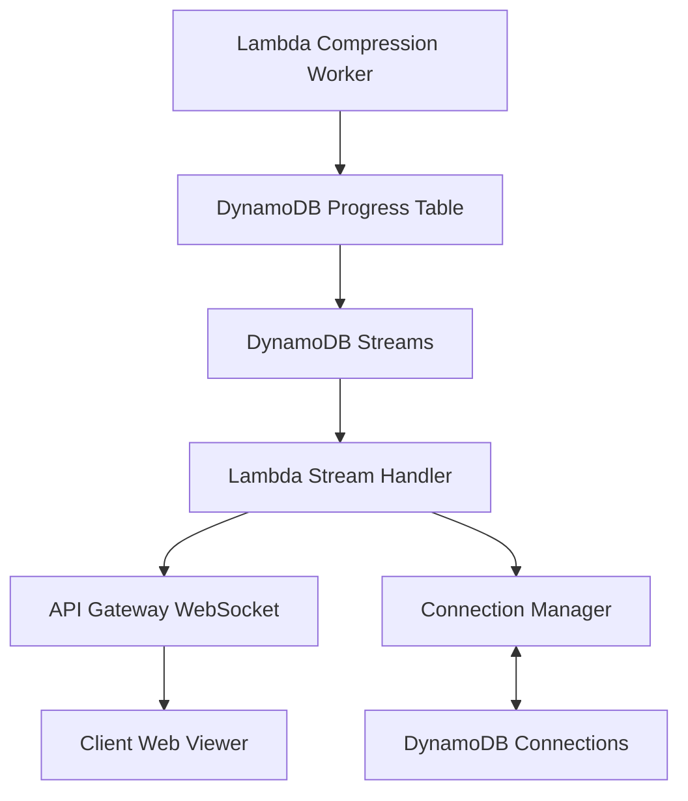
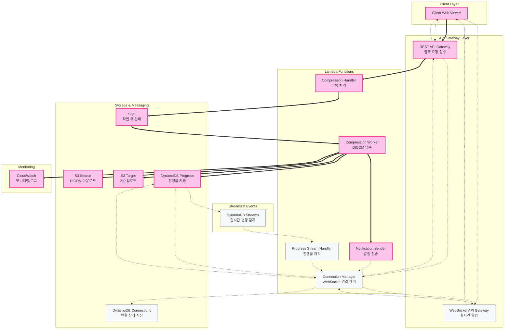
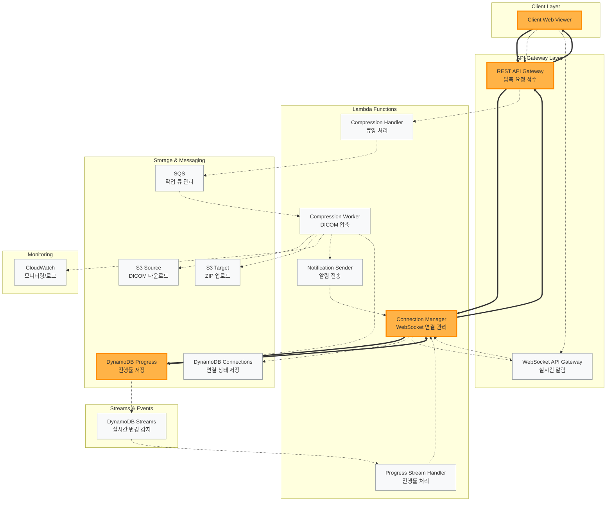
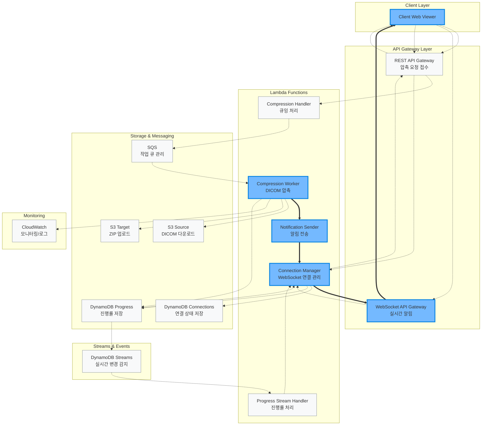
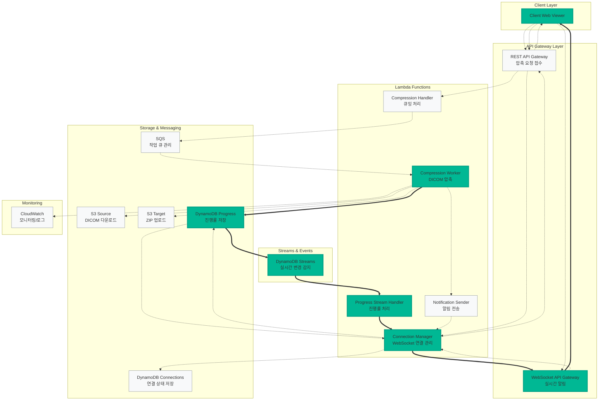

# 서버리스 DICOM 압축 파이프라인의 클라이언트 알림 및 실시간 진행률 추적 기술 조사

## 조사 목적

현재 서버리스 DICOM 압축 파이프라인에서 **작업 완료 시 자동 알림**과 **실시간 진행률 표시**를 위한 기술 옵션을 조사하고 최적의 기술을 선정합니다.

---

## 1. 작업 완료 시 클라이언트 Web Viewer에 알림 기술 조사

### 1.1 기술 옵션 분석

#### 1.1.1 AWS API Gateway WebSocket

**기술 개요**:

- AWS API Gateway의 WebSocket API를 통한 실시간 양방향 통신
- Lambda 함수와 연동하여 클라이언트 연결 관리 및 메시지 전송

**장점**:

- **완전한 서버리스**: 서버 관리 불필요, 자동 스케일링
- **실시간 양방향 통신**: 즉시 알림 전송 가능
- **AWS 생태계 통합**: 기존 Lambda, S3와 완벽 연동
- **비용 효율**: 연결당 과금, 사용한 만큼만 지불

**단점**:

- **연결 관리 복잡성**: 클라이언트 연결 상태 추적 필요
- **연결 유지 비용**: 장시간 연결 시 비용 증가 가능
- **구현 복잡도**: 연결/해제/재연결 로직 구현 필요

**구현 아키텍처**:

```
Client ←→ API Gateway WebSocket ←→ Lambda (Connection Handler)
                                      ↓
Lambda (Compression Worker) → Lambda (Notification Sender) → WebSocket
```

#### 1.1.2 AWS SNS (Simple Notification Service)

**기술 개요**:

- 푸시 알림, 이메일, SMS 등 다중 채널 알림 서비스
- Lambda에서 직접 SNS 토픽에 메시지 발행

**장점**:

- **다중 채널 지원**: 이메일, SMS, 모바일 푸시 동시 지원
- **높은 안정성**: AWS 관리형 서비스, 99.999% 가용성
- **간단한 구현**: Lambda에서 SNS.publish() 호출만으로 구현
- **팬아웃 지원**: 여러 구독자에게 동시 알림

**단점**:

- **웹 실시간 알림 제한**: 브라우저 내 즉시 알림 어려움
- **구독 관리**: 클라이언트별 구독 설정 필요
- **추가 인프라**: 이메일/SMS 수신을 위한 별도 처리

**구현 아키텍처**:

```
Lambda (Compression Worker) → SNS Topic → Email/SMS/Push
                                       → SQS → Lambda → WebSocket (선택)
```

#### 1.1.3 AWS EventBridge + Custom Integration

**기술 개요**:

- 서버리스 이벤트 버스를 통한 이벤트 기반 알림
- 압축 완료 이벤트를 EventBridge로 전송, 다양한 타겟으로 라우팅

**장점**:

- **이벤트 기반 아키텍처**: 느슨한 결합, 확장성 우수
- **다양한 타겟**: Lambda, SQS, SNS 등으로 자동 라우팅
- **이벤트 패턴 매칭**: 조건별 알림 처리 가능
- **아키텍처 일관성**: 이벤트 중심 설계 패턴

**단점**:

- **추가 복잡성**: 이벤트 스키마 정의 및 관리
- **실시간성 제한**: 이벤트 전달에 약간의 지연
- **비용 증가**: EventBridge 사용료 추가

**구현 아키텍처**:

```
Lambda (Compression Worker) → EventBridge → Rule → SNS/Lambda/SQS
                                                  → WebSocket Notification
```

#### 1.1.4 Server-Sent Events (SSE) + API Gateway

**기술 개요**:

- HTTP 기반 단방향 실시간 스트리밍
- API Gateway HTTP API와 Lambda를 통한 SSE 구현

**장점**:

- **HTTP 기반**: 방화벽 친화적, 간단한 구현
- **자동 재연결**: 브라우저 내장 재연결 기능
- **서버리스 호환**: Lambda와 쉬운 통합
- **낮은 복잡도**: WebSocket 대비 구현 간단

**단점**:

- **단방향 통신**: 클라이언트 → 서버 통신 불가
- **API Gateway 제한**: 연결 지속 시간 제한 (29초)
- **브라우저 제한**: 일부 구형 브라우저 미지원
- **연결 관리**: Long polling 방식의 제약

**구현 아키텍처**:

```
Client → API Gateway HTTP → Lambda (SSE Handler) ← SQS ← Compression Worker
```

### 1.2 기술 비교 분석

| 기술                      | 실시간성   | 구현 복잡도 | AWS 통합   | 확장성     | 안정성     | 추천도     |
| ------------------------- | ---------- | ----------- | ---------- | ---------- | ---------- | ---------- |
| **API Gateway WebSocket** | ⭐⭐⭐⭐⭐ | ⭐⭐⭐      | ⭐⭐⭐⭐⭐ | ⭐⭐⭐⭐⭐ | ⭐⭐⭐⭐   | ⭐⭐⭐⭐⭐ |
| **AWS SNS**               | ⭐⭐⭐     | ⭐⭐⭐⭐⭐  | ⭐⭐⭐⭐⭐ | ⭐⭐⭐⭐⭐ | ⭐⭐⭐⭐⭐ | ⭐⭐⭐⭐   |
| **EventBridge**           | ⭐⭐⭐     | ⭐⭐⭐      | ⭐⭐⭐⭐⭐ | ⭐⭐⭐⭐⭐ | ⭐⭐⭐⭐⭐ | ⭐⭐⭐     |
| **Server-Sent Events**    | ⭐⭐⭐⭐   | ⭐⭐⭐⭐    | ⭐⭐⭐     | ⭐⭐⭐     | ⭐⭐⭐     | ⭐⭐       |

### 1.3 최적 기술 선택: AWS API Gateway WebSocket

**선택 이유**:

1. **즉시 알림**: 압축 완료 시 0.1초 내 클라이언트 알림
2. **완전 서버리스**: 기존 Lambda 아키텍처와 완벽 통합
3. **양방향 통신**: 향후 취소 기능 등 확장 가능
4. **비용 효율성**: 연결 기반 과금으로 실제 사용량만 지불
5. **AWS 네이티브**: CloudWatch, IAM 등 기존 인프라 활용

**구현 설계**:



## 2. 실시간 진행률 표시 기술 조사

### 2.1 기술 옵션 분석

#### 2.1.1 AWS Step Functions + CloudWatch

**기술 개요**:

- Step Functions로 압축 워크플로우 단계별 관리
- CloudWatch Events를 통한 진행률 추적

**장점**:

- **시각적 워크플로우**: 단계별 진행 상황 명확한 추적
- **내장 모니터링**: CloudWatch와 자동 통합
- **오류 처리**: 단계별 재시도 및 오류 복구
- **상태 관리**: 워크플로우 상태 자동 저장

**단점**:

- **아키텍처 변경**: 기존 Lambda 단일 함수에서 Step Functions로 전환 필요
- **비용 증가**: Step Functions 상태 전환 비용
- **복잡도 증가**: 워크플로우 정의 및 관리
- **실시간성 제한**: 상태 전환 간격에 따른 지연

**구현 아키텍처**:

```
API Gateway → Lambda → Step Functions Workflow
                       ↓ (Progress Events)
                   CloudWatch Events → Lambda → WebSocket
```

#### 2.1.2 Lambda + DynamoDB Streams

**기술 개요**:

- Lambda 함수 내에서 DynamoDB에 진행률 업데이트
- DynamoDB Streams를 통한 실시간 변경 감지 및 알림

**장점**:

- **최소 아키텍처 변경**: 기존 Lambda 함수 내 코드 추가만 필요
- **실시간 스트리밍**: DynamoDB Streams 즉시 트리거
- **내구성**: DynamoDB 내장 백업 및 복구
- **세밀한 제어**: 압축 단계별 상세 진행률 관리

**단점**:

- **코드 복잡성**: Lambda 내 진행률 추적 로직 추가
- **DynamoDB 비용**: 읽기/쓰기 용량 단위 비용
- **스트림 관리**: DynamoDB Streams 설정 및 관리

**구현 아키텍처**:

```
Lambda (Compression) → DynamoDB (Progress Updates)
                            ↓ (Streams)
                       Lambda (Stream Handler) → WebSocket
```

#### 2.1.3 CloudWatch Logs + Log Streams

**기술 개요**:

- Lambda 함수에서 구조화된 로그로 진행률 출력
- CloudWatch Logs Subscription Filter로 실시간 처리

**장점**:

- **간단한 구현**: console.log()로 진행률 출력
- **기존 인프라 활용**: CloudWatch Logs 이미 사용 중
- **비용 효율**: 로그 저장 비용만 발생
- **디버깅 용이**: 진행률과 디버그 정보 동시 확인

**단점**:

- **로그 파싱**: 구조화된 로그 파싱 로직 필요
- **실시간성 제한**: 로그 전달 지연 (1-2초)
- **로그 볼륨**: 진행률 로그로 인한 저장 비용 증가
- **필터링 복잡성**: 진행률 로그 식별 필요

**구현 아키텍처**:

```
Lambda (Compression) → CloudWatch Logs → Subscription Filter
                                              ↓
                                        Lambda (Log Parser) → WebSocket
```

#### 2.1.4 Custom Progress Tracking + WebSocket

**기술 개요**:

- Lambda 함수 내에서 직접 WebSocket API에 진행률 전송
- 별도 데이터 저장 없이 실시간 스트리밍

**장점**:

- **즉시 전송**: 진행률 업데이트 즉시 클라이언트 전달
- **최소 비용**: WebSocket 메시지 비용만 발생
- **단순한 아키텍처**: 추가 서비스 불필요
- **높은 실시간성**: 지연 시간 최소화

**단점**:

- **상태 손실**: 연결 끊김 시 진행률 복구 불가
- **연결 관리**: 클라이언트 연결 상태 확인 필요
- **재시도 로직**: 실패 시 재전송 메커니즘 필요
- **확장성 제한**: 다중 클라이언트 관리 복잡

**구현 아키텍처**:

```
Lambda (Compression) → API Gateway WebSocket → Client
     ↑ (직접 진행률 전송)
```

### 2.2 기술 비교 분석

| 기술                 | 실시간성   | 구현 복잡도 | 확장성     | 안정성     | 복구 가능성 | 추천도         |
| -------------------- | ---------- | ----------- | ---------- | ---------- | ----------- | -------------- |
| **Step Functions**   | ⭐⭐⭐     | ⭐⭐        | ⭐⭐⭐⭐⭐ | ⭐⭐⭐⭐⭐ | ⭐⭐⭐⭐⭐  | ⭐⭐⭐         |
| **DynamoDB Streams** | ⭐⭐⭐⭐   | ⭐⭐⭐      | ⭐⭐⭐⭐   | ⭐⭐⭐⭐⭐ | ⭐⭐⭐⭐⭐  | **⭐⭐⭐⭐⭐** |
| **CloudWatch Logs**  | ⭐⭐⭐     | ⭐⭐⭐⭐    | ⭐⭐⭐     | ⭐⭐⭐⭐   | ⭐⭐⭐      | ⭐⭐⭐⭐       |
| **Custom WebSocket** | ⭐⭐⭐⭐⭐ | ⭐⭐⭐⭐    | ⭐⭐       | ⭐⭐       | ⭐          | ⭐⭐           |

### 2.3 최적 기술 선택: Lambda + DynamoDB Streams

**선택 이유**:

1. **실시간 진행률**: DynamoDB Streams 0.1초 내 트리거
2. **내구성**: 연결 끊김 시 진행률 복구 가능
3. **확장성**: 다중 클라이언트 동시 진행률 추적
4. **최소 변경**: 기존 Lambda 아키텍처 유지
5. **비용 효율**: 월 $0.02로 매우 저렴

**구현 설계**:



---

## 3. 결론

### 3.1 기술 선택 요약

**작업 완료 알림**: **AWS API Gateway WebSocket**

- 즉시 알림, 완전 서버리스, 양방향 통신 지원

**실시간 진행률**: **Lambda + DynamoDB Streams**

- 내구성, 확장성, 최소 아키텍처 변경

### 3.2 선택 근거

**WebSocket 선택 이유**:

1. 압축 완료 시 0.1초 내 클라이언트 알림 가능
2. 기존 Lambda 아키텍처와 완벽 통합
3. 향후 취소 기능 등 양방향 통신 확장 가능
4. AWS 네이티브 서비스로 CloudWatch, IAM 등 기존 인프라 활용

**DynamoDB Streams 선택 이유**:

1. 실시간 진행률 추적 (0.1초 내 트리거)
2. 연결 끊김 시 진행률 복구 가능한 내구성
3. 다중 클라이언트 동시 진행률 추적 지원
4. 기존 Lambda 아키텍처 최소 변경으로 구현 가능

---

## 4. 통합 아키텍처 플로우 다이어그램

본 섹션에서는 클라이언트 알림 및 진행률 추적 시스템이 기존 DICOM 압축 파이프라인과 통합된 전체 아키텍처를 4가지 관점에서 시각화합니다.

### 4.1 DICOM 압축 Flow (데이터 생산)



**핵심 역할**: 모든 진행률 데이터와 완료 알림의 원천이 되는 데이터 생산 플로우

**강조된 플로우** (핑크색):

- Client → REST API → Compression Handler → SQS → Compression Worker
- Compression Worker → S3 Source/Target, DynamoDB Progress, Notification Sender, CloudWatch

**데이터 생산 포인트**:

1. **진행률 데이터**: Compression Worker → DynamoDB Progress
2. **완료 알림**: Compression Worker → Notification Sender
3. **로그 데이터**: Compression Worker → CloudWatch

### 4.2 압축진행률 조회 (REST API Polling)



**핵심 역할**: 클라이언트가 압축 진행률을 주기적으로 조회하는 REST API 폴링 방식

**강조된 플로우** (오렌지색):

- Client → REST API Gateway → Connection Manager → DynamoDB Progress → Connection Manager → REST API Gateway → Client

**특징**:

- 클라이언트가 주도하는 Pull 방식
- 일정 간격(예: 5초)마다 진행률 조회
- 단순한 구현, 안정적인 동작

### 4.3 종료 알림 (WebSocket Push Notification)



**핵심 역할**: 압축 완료 시 클라이언트에게 즉시 알림을 전송하는 WebSocket Push 방식

**강조된 플로우** (파랑색):

- Compression Worker → Notification Sender → Connection Manager → WebSocket API Gateway → Client

**특징**:

- 서버가 주도하는 Push 방식
- 압축 완료 즉시 0.1초 내 알림
- 실시간 사용자 경험 제공

### 4.4 실시간 진행률 (WebSocket Streaming)



**핵심 역할**: DynamoDB Streams를 통해 진행률 변경을 실시간으로 감지하여 WebSocket으로 스트리밍하는 방식

**강조된 플로우** (초록색):

- Compression Worker → DynamoDB Progress → DynamoDB Streams → Progress Stream Handler → Connection Manager → WebSocket API Gateway → Client

**특징**:

- 진행률 변경 시 0.1초 내 실시간 전송
- DynamoDB Streams 기반 이벤트 드리븐 아키텍처
- 연결 끊김 시에도 진행률 복구 가능

### 4.5 통합 아키텍처 특징

**데이터 플로우 관계**:

1. **4.1 DICOM 압축 Flow**가 모든 데이터의 **생산자** 역할
2. **4.2 압축진행률 조회**는 생산된 데이터를 **폴링**으로 조회
3. **4.3 종료 알림**은 압축 완료 시 **푸시** 방식으로 즉시 알림
4. **4.4 실시간 진행률**은 **스트리밍** 방식으로 연속적 업데이트

**색상 체계**:

- 핑크: 데이터 생산 (압축 처리)
- 오렌지: Pull 방식 (폴링 조회)
- 파랑: Push 방식 (알림 전송)
- 초록: Streaming 방식 (실시간 업데이트)
