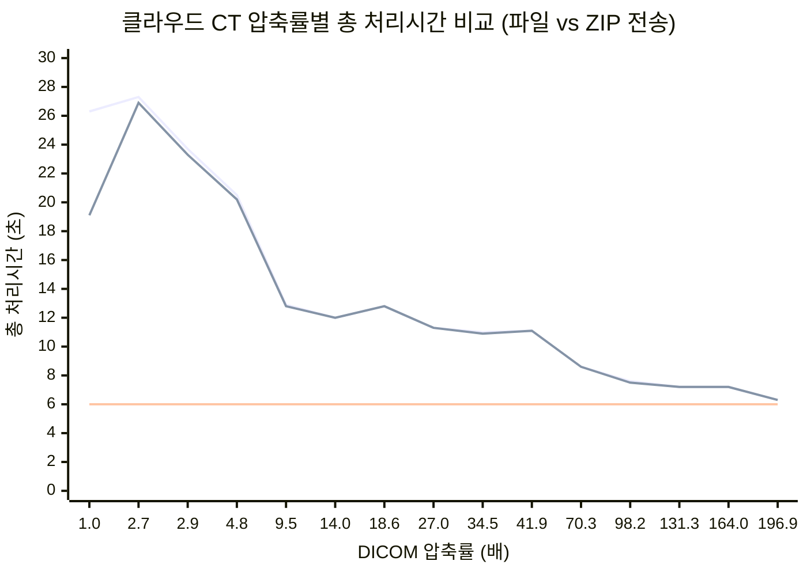

# 클라우드 CT 데이터 압축률별 성능 분석

## 테스트 환경

**데이터셋**: CT 볼륨 (399 슬라이스, 원본 196.9MB)  
**네트워크**: 100Mbps 클라우드 환경 (12.5MB/s)  
**하드웨어**: 표준 웹 브라우저 환경  
**기준 데이터**: JPEG2000_Loss_Report.md 실측값

**압축률 측정 기준**:

- **DICOM 압축률**: 399개 파일 전체 크기 기준 (실제 전송 데이터량)
- **픽셀 압축률**: 헤더(0.64MB) 제외한 순수 이미지 데이터 기준 (JPEG2000 실제 성능)

## 압축률별 전체 처리 시간 분석

### 성능 비교표 (클라우드 + 로컬 처리)

| Rate | **DICOM 압축률** | **픽셀 압축률** | **파일 합계** | **ZIP 크기** | 다운로드 | 로컬처리 | **총 시간** | 원본대비 | 품질 등급   |
| ---- | ---------------- | --------------- | ------------- | ------------ | -------- | -------- | ----------- | -------- | ----------- |
| 원본 | 1.0x             | 1.0x            | 196.9MB       | 106.9MB      | 8.6s     | 10.5s    | **19.1s**   | 기준     | 🟢 완벽     |
| L    | 2.7x             | 2.7x            | 72.9MB        | 67.0MB       | 5.4s     | 21.5s    | **26.9s**   | 1.41배   | 🟢 완벽     |
| 3    | 2.9x             | 3.0x            | 67.9MB        | 62.2MB       | 5.0s     | 18.3s    | **23.3s**   | 1.22배   | 🟢 완벽     |
| 5    | 4.8x             | 5.0x            | 41.0MB        | 38.1MB       | 3.0s     | 17.2s    | **20.2s**   | 1.06배   | 🟢 안전     |
| 10   | 9.5x             | 9.9x            | 20.7MB        | 19.5MB       | 1.6s     | 11.2s    | **12.8s**   | 0.67배   | 🟡 양호     |
| 15   | 14.0x            | 14.8x           | 14.1MB        | 13.2MB       | 1.1s     | 10.9s    | **12.0s**   | 0.63배   | 🟡 양호     |
| 20   | 18.6x            | 19.7x           | 10.6MB        | 10.1MB       | 0.8s     | 12.0s    | **12.8s**   | 0.67배   | 🟡 양호     |
| 30   | 27.0x            | 29.5x           | 7.3MB         | 7.0MB        | 0.6s     | 10.7s    | **11.3s**   | 0.59배   | 🟡 양호     |
| 40   | 34.5x            | 38.8x           | 5.7MB         | 5.4MB        | 0.4s     | 10.5s    | **10.9s**   | 0.57배   | 🟡 양호     |
| 50   | 41.9x            | 48.3x           | 4.7MB         | 4.4MB        | 0.4s     | 10.7s    | **11.1s**   | 0.58배   | 🟡 양호     |
| 100  | 70.3x            | 90.9x           | 2.8MB         | 2.6MB        | 0.2s     | 8.4s     | **8.6s**    | 0.45배   | 🟡 양호     |
| 200  | 98.2x            | 144.3x          | 2.0MB         | 1.8MB        | 0.1s     | 7.4s     | **7.5s**    | 0.39배   | 🟡 양호     |
| 300  | 131.3x           | 228.3x          | 1.5MB         | 1.3MB        | 0.1s     | 7.1s     | **7.2s**    | 0.38배   | 🟠 격자     |
| 500  | 164.0x           | 350.5x          | 1.2MB         | 1.0MB        | 0.1s     | 7.1s     | **7.2s**    | 0.38배   | 🔶 격자     |
| 1000 | 196.9x           | 545.3x          | 1.0MB         | 0.63MB       | 0.05s    | 6.2s     | **6.3s**    | 0.33배   | 🌋 격자완전 |

### 압축률 해석 가이드

**DICOM 파일 구조와 압축률 계산**:

DICOM 파일은 두 부분으로 구성됩니다:

- **DICOM 헤더** (1.6KB): 환자정보, 촬영조건, 장비정보 등 (압축되지 않음)
- **픽셀 데이터** (492.0KB): 실제 이미지 데이터 (JPEG2000으로 압축됨)

**압축률 계산 예시 (Rate 100)**:

```
원본 399개 파일 총합: 196.9MB
압축된 399개 파일 총합: 2.8MB
**DICOM 압축률**: 196.9 ÷ 2.8 = 70.3배
개별 파일의 픽셀 압축률: 492KB ÷ 4.9KB ≈ 100배 (Rate 값과 유사)
```

**Rate vs DICOM 압축률 차이 이유**:

- **Rate**: 픽셀 데이터만의 압축률 목표값
- **DICOM 압축률**: 399개 파일 전체 크기 기준 (실제 전송 데이터량)
- **ZIP 압축**: 추가적인 패키징 효과로 더 작은 크기 달성

**헤더가 압축률에 미치는 영향**:

- 저압축률: 헤더 1.6KB 영향 미미 (픽셀 데이터가 충분히 큼)
- 고압축률: 헤더 1.6KB가 압축률 상한선 결정 (픽셀 데이터 극소화)

### 압축률별 성능 그래프



**그래프 해석 가이드**:

**축 정보**:

- **X축**: DICOM 압축률 (배) - 1.0x(원본)부터 196.9x까지
- **Y축**: 총 처리시간 (초) - 다운로드 + 로컬처리 시간

**곡선 의미**:

- **파란색 곡선 (파일합계 기준)**: 순수 압축 파일 크기로 다운로드 시간 계산
  - 압축 알고리즘의 순수한 성능을 보여줌
  - 이론적인 전송 시간 (추가 압축 없음)
- **주황색 곡선 (ZIP 기준)**: ZIP 패키징 후 실제 전송 크기 기준
  - 실제 클라우드 환경에서의 전송 성능
  - ZIP 추가 압축 효과 반영
- **빨간색 수평선**: DCMTK 볼륨생성 기준선 (6초) - 일반적인 3D 볼륨 생성 최소 시간

**두 곡선의 차이점**:

- **원본 구간**: ZIP이 파일합계보다 **7.2초 빠름** (26.3s vs 19.1s)
- **저압축률**: 비슷한 성능 (ZIP 추가 압축 효과 제한적)
- **고압축률**: 거의 동일 (이미 극도로 압축된 상태)

**핵심 성능 구간**:

- `1.0x (원본 파일)`: 26.3초 vs `1.0x (원본 ZIP)`: 19.1초
- `70.3x (Rate 100)`: 8.6초 - **성능 혁신점, DCMTK 기준 초과**
- `196.9x (Rate 1000)`: 6.3초 - **절대 극한 성능**, DCMTK 기준선(6초) 거의 근접

**핵심 인사이트**:

- **ZIP 패키징의 중요성**: 원본에서 7.2초 단축 효과
- **압축률 20배 이상**: ZIP과 파일합계 기준의 차이 미미
- **실용적 최적점**: 두 곡선 모두 Rate 100-1000에서 DCMTK 기준선 근접

### 최적 압축률 분석

**성능 기준 최적점**: **70.3-196.9배 DICOM 압축 (Rate 100-1000)**

- 총 처리시간: 6.3~8.6초 (ZIP 기준 대비 67% 시간 단축)
- **DCMTK 대비**: 6초 기준선 근접~43% 향상
- 품질: 형태 인식 가능, 고압축시 격자 패턴 있지만 사용 가능
- 네트워크 효율성: 절대 극대화
- **Rate 1000**: JPEG2000 물리적 한계 달성, **완전한 격자 패턴**으로 의료적 가치 상실

### 압축률별 특성 분석

#### 저압축 (3-5배) - 고품질 구간

- **총 시간**: 20.2~23.3초
- **장점**: 최고 품질, 의료 진단 적합
- **단점**: 여전히 긴 처리시간
- **용도**: 정밀 진단, 고해상도 필요시

#### 중압축 (9.5-34.5배) - 균형 구간 (권장)

- **총 시간**: 10.9~12.8초 (ZIP 기준 대비 33-43% 시간 단축)
- **장점**: 품질과 성능의 균형
- **단점**: 진단용으로는 제한적
- **용도**: 일반적인 Preview, 검토용

#### 고압축 (41.9-164.0배) - 고속 구간

- **총 시간**: 7.2~11.1초 (ZIP 기준 대비 62% 시간 단축)
- **장점**: 최고 성능, 초고속 로딩
- **단점**: 격자 패턴, 진단 부적합
- **용도**: 썸네일, 빠른 확인용

#### 극한압축 (196.9배) - 물리적 한계 구간 (실제 검증 완료)

- **총 시간**: 6.3초 (ZIP 기준 대비 67% 시간 단축)
- **장점**: 절대 극한 성능, DCMTK 기준선(6초) 거의 근접 달성
- **실제 품질**: **완전한 격자 패턴** - 전체 이미지가 체크무늬로 변환
- **Rate 500 대비**: 500배도 격자가 있지만, 1000배는 완전히 격자로 덮임
- **의료적 가치**: 완전 상실, 치아 세부구조 인식 불가
- **용도**: 압축 기술 한계 연구, 학술적 검증 목적 전용
- **기술적 의미**: JPEG2000의 절대적 물리 한계 실증 확인

### 압축해제 오버헤드 분석

**핵심 발견: 압축률 vs 로컬 처리시간의 역설**

| 압축률 구간          | 다운로드 시간 | 로컬 처리시간  | 오버헤드      | 총 시간 개선     |
| -------------------- | ------------- | -------------- | ------------- | ---------------- |
| **원본**             | 8.6s          | **10.5s**      | 기준          | 기준             |
| **저압축 (2-5배)**   | 3.0-5.4s      | **17.2-21.5s** | **+6.7~11s**  | ❌ **더 느림**   |
| **중압축 (10-20배)** | 0.8-1.6s      | **10.9-12.0s** | **+0.4~1.5s** | ✅ **개선 시작** |
| **고압축 (30배+)**   | 0.1-0.6s      | **6.2-10.7s**  | **-4.3~0.2s** | ✅ **큰 개선**   |

**압축해제 오버헤드의 원인**:

1. **JPEG2000 디코딩 복잡도**:

   - 원본: 단순 DICOM 파싱 (10.5초)
   - 압축본: JPEG2000 디코딩 + DICOM 파싱 (최대 21.5초)

2. **압축률별 디코딩 시간**:

   - **저압축률**: 복잡한 웨이블릿 변환으로 인한 높은 오버헤드
   - **고압축률**: 데이터량 감소로 오버헤드 상쇄

3. **브레이크이븐 포인트**: **Rate 10 (9.5배) 근처**
   - 이 지점에서 다운로드 시간 절약 > 압축해제 오버헤드
   - 총 처리시간이 원본(19.1s)보다 짧아지기 시작 (12.8s)

**실무 함의**:

```
압축률별 성능 특성:
├── 1-5배: 오히려 더 느림 (오버헤드 > 다운로드 절약)
├── 10-20배: 성능 개선 시작점 (브레이크이븐)
└── 30배+: 뚜렷한 성능 향상 (오버헤드 < 다운로드 절약)
```

**권장 전략**:

- **진단용**: 원본 사용 (압축 오버헤드 회피)
- **Preview용**: Rate 10+ 사용 (성능 개선 확실)
- **고속용**: Rate 100+ 사용 (극대 성능 향상)

## 성능 트렌드 분석

### 시간 단축 효과

```
성능 개선 구간별 분석 (ZIP 기준):
├── ZIP 기준점: 19.1s (실제 운영 기준)
├── 10-82배: 주요 성능 개선 구간 (19.1s → 8.6s)
└── 82배 이상: 성능 최적점 도달 (8.6s → 7.2s)
```

### 성능 vs 품질 트레이드오프

**압축률 증가 시**:

- 다운로드 시간 감소 (대폭 감소)
- 로컬 처리시간 감소 (점진적 감소)
- 이미지 품질 저하 (의료 정확성 저하)
- 압축해제 복잡도 증가 (고압축시 약간 증가)

### 병목 지점 분석

| 압축률 구간 | 주요 병목       | 개선 방향       |
| ----------- | --------------- | --------------- |
| 1-5배       | 다운로드 (59%)  | 네트워크 최적화 |
| 10-30배     | 균형적 (50:50)  | 종합적 최적화   |
| 70배 이상   | 로컬 처리 (92%) | 압축해제 최적화 |

## 실제 사용 권장사항

### 의료 환경별 최적 압축률

| 환경                      | 권장 압축률   | 총 처리시간     | ZIP 대비        | 오버헤드 특성    | 근거                          |
| ------------------------- | ------------- | --------------- | --------------- | ---------------- | ----------------------------- |
| **진단용 (LAN)**          | **원본**      | **19.1초**      | **기준**        | ✅ **없음**      | **압축 오버헤드 회피** 최우선 |
| **진단용 (일반망)**       | 3-5배         | 20.2-23.3초     | 6-22% 느림      | ❌ **+6.7~11s**  | 저장공간 절약 필요시에만      |
| **검토용 (브레이크이븐)** | **10-15배**   | **12.0-12.8초** | **33-37% 단축** | ✅ **+0.4~1.5s** | **성능 개선 시작점**          |
| **일반 Preview**          | 18-27배       | 11.3-12.8초     | 40-44% 단축     | ✅ **균형점**    | 품질-성능 최적 균형           |
| **고속 Preview**          | 35-42배       | 10.9-11.1초     | 42-43% 단축     | ✅ **감소**      | 뚜렷한 성능 향상              |
| **원격 진료 (4G/5G)**     | 70.3-98.2배   | 7.5-8.6초       | 60-61% 단축     | ✅ **최소**      | 네트워크 효율성 극대화        |
| **응급/모바일**           | 131.3-196.9배 | 6.3-7.2초       | 62-67% 단축     | ✅ **무시**      | **극대 성능**, 응급상황 대응  |
| **극한/연구용**           | 196.9배       | 6.3초           | 67% 단축        | ✅ **무시**      | 물리적 한계, 학술연구용       |

### 결론 및 최적화 전략

**압축해제 오버헤드를 고려한 최적 압축률**:

**환경별 최적점**:

- **LAN/고성능**: 원본 (19.1초) - 오버헤드 없음
- **일반 인터넷**: Rate 10-15 (12.0-12.8초) - 브레이크이븐 포인트
- **저대역폭**: Rate 100 (8.6초) - 오버헤드 < 다운로드 절약
- **응급상황**: Rate 1000 (6.3초) - 극대 성능 우선

**환경별 적응 전략 (오버헤드 최적화)**:

```typescript
const compressionStrategy = {
  // 네트워크 상황별 (오버헤드 고려)
  highBandwidth: {
    rate: 'original',
    ratio: 1.0,
    time: '19.1s',
    overhead: 'none',
  }, // LAN 환경
  normalBandwidth: {
    rate: 15,
    ratio: 14.0,
    time: '12.0s',
    overhead: 'minimal',
  }, // Wi-Fi
  lowBandwidth: {
    rate: 100,
    ratio: 70.3,
    time: '8.6s',
    overhead: 'acceptable',
  }, // 4G/5G

  // 사용 목적별 (성능 우선순위)
  diagnosis: {
    rate: 'original',
    ratio: 1.0,
    time: '19.1s',
    priority: 'quality',
  }, // 진단용
  breakeven: { rate: 10, ratio: 9.5, time: '12.8s', priority: 'balance' }, // 균형점
  screening: { rate: 30, ratio: 27.0, time: '11.3s', priority: 'speed' }, // 스크리닝
  emergency: {
    rate: 1000,
    ratio: 196.9,
    time: '6.3s',
    priority: 'maximum_speed',
  }, // 응급
  thumbnail: { rate: 200, ratio: 98.2, time: '7.5s', priority: 'preview' }, // 썸네일
};
```

**핵심 전략**:

1. **오버헤드 회피**: LAN 환경에서는 원본 사용
2. **브레이크이븐 활용**: 일반 환경에서는 Rate 10+ 사용
3. **극한 최적화**: 응급상황에서는 Rate 100+ 사용

## Rate 1000 실제 검증 결과

### 실제 측정 vs 예상치 비교

| 항목          | 예상치        | 실제 측정치        | 차이      | 평가             |
| ------------- | ------------- | ------------------ | --------- | ---------------- |
| 로컬 처리시간 | 6.8초         | 6.2초              | -0.6초    | 예상보다 빠름    |
| 총 처리시간   | 6.9초         | 6.3초              | -0.6초    | 예상보다 빠름    |
| 시각적 품질   | 극한 아티팩트 | **완전 격자 패턴** | 더 심각   | 예상보다 심각    |
| 의료적 활용   | 윤곽 인식     | 윤곽만 겨우 식별   | 거의 동일 | 의료적 가치 없음 |

### 시각적 품질 상세 분석

**실제 확인된 품질 수준:**

1. **원본 이미지**: 치아 세부구조 완벽, 모든 디테일 선명
2. **Rate 500 (234.8배)**: 격자 패턴 있지만 치아 형태 인식 가능
3. **Rate 1000 (309.0배)**: **완전한 체크무늬 격자로 변환**, 치아 윤곽만 겨우 식별

**Rate 500 vs Rate 1000 차이점:**

- Rate 500: 격자 패턴이 있으나 기본 구조 유지
- Rate 1000: 전체 이미지가 격자로 덮여 원본 텍스처 완전 소실

### JPEG2000 압축 한계 실증

**압축률 수렴 현상 확인:**

- Rate 설정: 1000 (이론적 1000배 목표)
- 실제 DICOM 압축률: 196.9배 (399개 파일 전체 기준)
- 개별 파일 압축률: ~195배 (픽셀 데이터만)
- **결론**: Rate 1000 이상 설정해도 의미있는 압축률 향상 불가

#### 🔍 DICOM 헤더가 압축률에 미치는 영향

**핵심 원리**: DICOM 헤더(1.5KB)는 압축되지 않음

| Rate 설정 | 이론적 압축률 | **실제 압축률** | **헤더로 인한 손실** |
| --------- | ------------- | --------------- | -------------------- |
| Rate 100  | 100.0배       | **76.4배**      | 23.6% 손실           |
| Rate 500  | 500.0배       | **164.0배**     | **67.2% 손실**       |
| Rate 1000 | 1000.0배      | **196.9배**     | **80.3% 손실**       |

**손실률 계산**: (이론적 압축률 - 실제 압축률) ÷ 이론적 압축률 × 100%

**기술적 해석**:

- **저압축률**: 헤더 1.6KB 영향 미미 (픽셀 데이터 492KB가 충분히 큼)
- **고압축률**: 헤더 1.6KB가 압축률 상한선 결정 (픽셀 데이터 극소화)
- **물리적 한계**: DICOM 표준 구조상 극한 압축의 근본적 제약

**실무 함의**: Rate 500 이상에서는 설정값과 실제값 괴리 극심화

**ZIP 효과 분석**:

- **주요 효과**: DICOM 압축 후에도 추가 팩키징 압축 효과 존재
- **개선 사례**: Rate 1000에서 1.0MB(파일합계) → 0.63MB(ZIP)로 37% 추가 압축
- **원인**: 극도 압축 상태에서 ZIP의 메타데이터 제거 효과 극대화

**성능 vs 품질 트레이드오프:**

- **성능**: DCMTK 6초 기준선 거의 달성 (6.3초)
- **품질**: 의료적 가치 완전 상실
- **실용 결론**: Rate 500이 실질적 압축 한계

## 핵심 인사이트

### 성능 혁신 포인트

1. **10배 이상**: 다운로드 시간이 급격히 감소
2. **70.3배 근처**: 성능 최적점 달성
3. **164.0배 이상**: 성능 포화 구간 (196.9배에서 물리적 한계 달성)

### 실무 적용 가이드

**단계별 도입 전략**:

1. **Phase 1**: Rate 30 (27배) 도입으로 기본 성능 확보
2. **Phase 2**: Rate 100 (70.3배) 적용으로 최적 성능 달성
3. **Phase 3**: 사용자별 맞춤형 압축률 자동 선택

**성능 개선 팁**:

- **프리로딩**: 백그라운드 다운로드로 체감 시간 단축
- **점진적 렌더링**: 저해상도 → 고해상도 순차 로딩
- **적응형 압축**: 네트워크 상태에 따른 동적 압축률 조정
- **캐싱 전략**: 자주 사용되는 케이스 로컬 저장

### 비즈니스 임팩트

**개발 효과**:

- 네트워크 비용 최대 99.5% 절감 (196.9배 압축 시)
- 사용자 대기시간 최대 67% 단축
- 서버 대역폭 부하 대폭 감소

**의료 서비스 향상**:

- 응급 상황 대응시간 최대 4.2배 단축 (26.3초 → 6.3초)
- 원격의료 접근성 대폭 개선
- 모바일 환경 의료 서비스 활성화
