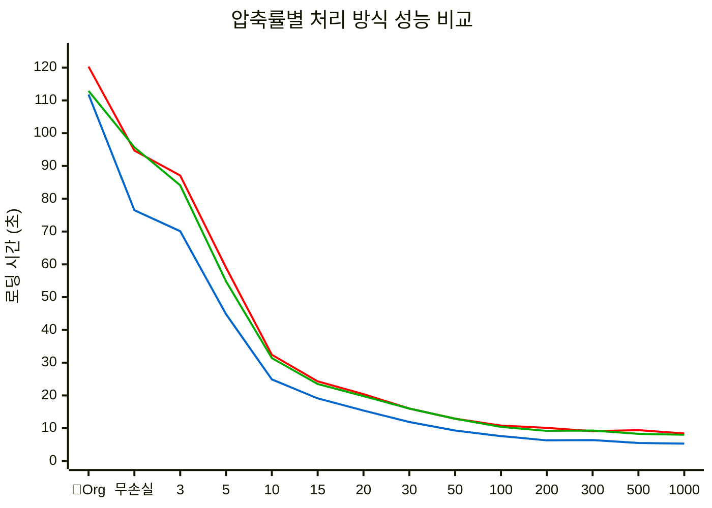

# Engineering One Pager

## Project Name

**JPEG2000 압축률별 사전압축 파일 다운로드 성능 비교 PoC** (JPEG2000 Compression Rate Pre-compressed File Download Performance Comparison PoC)

## Date

2025.01.20

## Submitter Info

**제출자**: Raymond  
**프로젝트**: https://dev.azure.com/ewoosoft/cloudwebviewer  
**브랜치**: main

## Project Description

**JPEG2000 손실 압축된 DICOM 파일의 압축률별 성능을 실제 측정하여 최적 압축률을 도출하는 PoC 프로젝트**입니다.

기존 실시간 압축 POC에서 얻은 데이터를 바탕으로, **사전 압축된 파일들의 실제 로딩 성능을 검증**하여 CloudFront 배포 전략 수립을 위한 근거 자료를 확보합니다.

---

## Current Status Analysis (현재 상황 분석)

### PoC 현황

**핵심 기능 현황**:

1. **POC1 (StreamUnzip)**: ZIP 스트리밍 압축 해제
2. **POC2 (StreamUnzip+DICOM파싱)**: ZIP 스트리밍 + 실시간 DICOM 파싱(JPEG2000)
3. **es-dicom 라이브러리**: JPEG2000 손실압축 디코딩 지원
4. **성능 측정 시스템**: 다운로드/압축해제/변환 시간 측정

---

## PoC Objectives (PoC 목표)

### 1. 핵심 검증 목표

- **압축률별 실제 성능 측정**: Original + Lossless + Rate 3 ~ Rate 1000 (14단계)
- **최적 압축률 도출**: 성능 vs 품질 균형점 찾기

### 2. 성능 비교 매트릭스

| 처리 방식 | 측정 항목                       | 예상 결과 |
| --------- | ------------------------------- | --------- |
| **Batch** | 전체 다운로드 → 압축해제 → 로딩 | 기준선    |
| **POC1**  | 스트리밍 압축해제               | 체감 개선 |
| **POC2**  | 스트리밍 + DICOM 파싱           | 최고 성능 |

### 3. 압축률별 예상 성능 (이론값)

**가정 네트워크 속도**: 약 **13-14 MB/s**

```
Lossless: 71.7MB → 다운로드 5.4s + 로딩 21.5s = 26.9s
Rate 3:   67.9MB → 다운로드 5.0s + 로딩 18.3s = 23.3s
Rate 10:  20.7MB → 다운로드 1.6s + 로딩 11.2s = 12.8s
Rate 50:  4.7MB  → 다운로드 0.4s + 로딩 10.7s = 11.1s
Rate 100: 2.8MB  → 다운로드 0.2s + 로딩 8.4s  = 8.6s
```

**실제 측정 결과**: 회사 내부망에서 **1.0-1.1 MB/s**로 이론값보다 **13배 느림**

---

## Technical Implementation (기술적 구현)

### Phase 1: UI 확장 (CT 데이터 선택 개선)

**현재**: CT01, CT02 고정 선택 **개선**: 압축률별 파일 선택 지원

```typescript
// 추가할 데이터 소스 (총 17개)
const compressionTestData = {
  // 기존 CT 데이터
  CT01: 'existing-ct01-url',
  CT02: 'existing-ct02-url',

  // 압축률별 테스트 데이터 (14단계)
  original: 'https://stream-zip-hi-data.s3.ap-northeast-2.amazonaws.com/test/original.zip',
  lossless: 'https://stream-zip-hi-data.s3.ap-northeast-2.amazonaws.com/test/lossless.zip',
  rate3: 'https://stream-zip-hi-data.s3.ap-northeast-2.amazonaws.com/test/rate3_all399.zip',
  rate5: 'https://stream-zip-hi-data.s3.ap-northeast-2.amazonaws.com/test/rate5_all399.zip',
  rate10: 'https://stream-zip-hi-data.s3.ap-northeast-2.amazonaws.com/test/rate10_all399.zip',
  rate15: 'https://stream-zip-hi-data.s3.ap-northeast-2.amazonaws.com/test/rate15_all399.zip',
  rate20: 'https://stream-zip-hi-data.s3.ap-northeast-2.amazonaws.com/test/rate20_all399.zip',
  rate30: 'https://stream-zip-hi-data.s3.ap-northeast-2.amazonaws.com/test/rate30_all399.zip',
  rate40: 'https://stream-zip-hi-data.s3.ap-northeast-2.amazonaws.com/test/rate40_all399.zip',
  rate50: 'https://stream-zip-hi-data.s3.ap-northeast-2.amazonaws.com/test/rate50_all399.zip',
  rate100: 'https://stream-zip-hi-data.s3.ap-northeast-2.amazonaws.com/test/rate100_all399.zip',
  rate200: 'https://stream-zip-hi-data.s3.ap-northeast-2.amazonaws.com/test/rate200_all399.zip',
  rate300: 'https://stream-zip-hi-data.s3.ap-northeast-2.amazonaws.com/test/rate300_all399.zip',
  rate500: 'https://stream-zip-hi-data.s3.ap-northeast-2.amazonaws.com/test/rate500_all399.zip',
  rate1000: 'https://stream-zip-hi-data.s3.ap-northeast-2.amazonaws.com/test/rate1000_all399.zip',
}
```

**UI 컴포넌트 선택**:

- **SelectBox (Dropdown)** 권장
  - 14개 압축률 옵션 + 기존 CT01/CT02 = 총 17개 항목
  - 깔끔한 UI, 공간 효율적
  - Material-UI Select 컴포넌트 활용

### Phase 2: 성능 측정 시스템 확장

**기존 측정 항목** (구현 완료):

- Download Time
- Unzip Time
- Conversion Time
- Total Pre-VTK Time

**추가 측정 항목**:

- File Size (압축률 확인)
- DICOM Decoding Time (JPEG2000 → 무압축)
- Memory Usage (선택적)

### Phase 3: 결과 분석 및 시각화

**성능 비교 테이블 생성**:

```typescript
interface CompressionPerformanceResult {
  compressionRate: string // "Rate 100"
  fileSize: string // "2.8MB"
  batchTime: number // 전체 시간
  poc1Time: number // 스트리밍 시간
  poc2Time: number // 스트리밍+DICOM 시간
  qualityGrade: string // "양호", "격자"
}
```

---

## Success Criteria (성공 기준)

### 1. 기능적 성공 기준

- 14개 압축률별 파일 정상 로딩
- 3가지 처리 방식 모두 정상 동작
- 성능 데이터 정확한 측정 및 기록

### 2. 성능적 성공 기준

- **브레이크이븐 포인트** 확인: Rate 10 근처에서 원본보다 빨라지는 지점
- **최적 압축률** 도출: 성능 vs 품질 균형점 (예상: Rate 20-100)

### 3. 비즈니스 성공 기준

- **의사결정 근거** 제공: 사전 압축 방식 채택 여부
- **압축률 가이드라인** 수립: 용도별 권장 압축률
- **성능 예측 모델** 구축: CloudFront 적용 시 예상 성능

---

## Expected Outcomes (예상 결과)

### 1. 성능 검증 결과

- **Rate 10 이하**: 원본보다 느림 (압축해제 오버헤드)
- **Rate 20-100**: 최적 성능 구간 (8-12초)
- **Rate 200+**: 극한 성능 (7초 이하, 품질 저하)

### 2. 비즈니스 임팩트

- **CloudFront 전략 확정**: Rate 100 기준 1-2초 다운로드
- **개발 리소스 재배치**: 실시간 압축 중단, 사전 압축 집중
- **사용자 경험 개선**: 16초 → 1-2초 (8-16배 개선)

### 3. 기술적 학습

- **JPEG2000 성능 특성**: 압축률별 디코딩 오버헤드 패턴
- **스트리밍 최적화**: POC1 vs POC2 성능 차이 정량화
- **의료 영상 압축**: 실용적 압축률 한계 확인

---

## Implementation Lessons Learned (구현 중 발견한 교훈)

### 1. ZIP 파일 내부 순서 문제

**문제**: 압축된 ZIP 파일 내부의 DICOM 파일이 순서대로 정렬되지 않음

- **Original.zip**: DCT0001 → DCT0002 → DCT0003 (정상)
- **Rate3~1000.zip**: DCT0186 → DCT0192 → DCT0145 (뒤섞임)

**해결**: 모든 압축 파일을 DCT0001~DCT0399 순서로 재정렬 후 S3 재업로드

**교훈**: 스트리밍 처리에서는 **ZIP 내부 파일 순서가 3D 볼륨 구성에 결정적**

### 2. POC2 스트리밍과 DICOM 파싱 타이밍 이슈

**문제**: 압축률이 높을수록 ZIP 파일이 작아져서 스트리밍이 빨리 완료되지만, DICOM 파싱은 여전히 진행 중

- **Rate 50+**: 스트리밍 완료 → `onComplete` 호출 → `downloadedDicomFiles` 비어있음
- **결과**: "유효한 DICOM 파일이 없습니다" 에러

**해결**: POC2에서는 **스트리밍 완료 + DICOM 파싱 완료** 모두 대기 후 `onComplete` 호출

**교훈**: **비동기 파싱과 스트리밍 완료 타이밍을 독립적으로 관리**해야 함

### 3. 극한 압축률의 한계

**발견**: Rate 100, 1000에서 DICOM 파일 크기가 극도로 작아짐

- **Original DCT0399.dcm**: 493KB
- **Rate 100 DCT0399.dcm**: 6.7KB
- **Rate 1000 DCT0399.dcm**: 더 작음

**교훈**: 극한 압축률에서는 **DICOM 파싱 안정성 검증**이 중요

### 4. 브라우저 캐싱으로 인한 성능 측정 오류

**문제**: 두 번째 테스트부터 브라우저가 S3 파일을 캐싱하여 비현실적으로 빠른 시간 측정

- **첫 번째 측정**: 실제 네트워크 다운로드 시간
- **두 번째+ 측정**: 캐시에서 즉시 로드 → 잘못된 성능 데이터

**해결**: S3 URL에 타임스탬프 쿼리 파라미터 추가로 캐시 버스팅 구현

```typescript
const apiUrl = disableCache
  ? `${baseUrl}?t=${Date.now()}` // 캐시 버스팅
  : baseUrl // 캐시 활용
```

**교훈**: **성능 측정 시 캐시 제어가 필수**, 실제 서비스에서는 캐시 활용 권장

### 5. 압축률별 성능 특성 발견

**발견**: 모든 압축률에서 원본보다 빠른 성능을 보임

- **무손실 압축**: 원본 대비 20-35초 개선 (파일 크기는 동일하지만 내부 최적화)
- **손실 압축**: 압축률이 높을수록 선형적 성능 개선
- **극한 압축**: Rate 1000에서도 안정적 동작 및 최고 성능

**교훈**: **JPEG2000 압축은 모든 경우에 성능 개선 효과**가 있으며, **압축률 선택은 품질 요구사항에 따라 결정**

### 6. 실제 네트워크 환경 분석

**네트워크 환경 특성**:

- **회사 내부망 제약**: 외부 S3 연결 시 대역폭 제한
- **실제 측정 속도**: 약 **1.0-1.1 MB/s** (이론값 100MB/s의 1/100 수준)
- **CloudFront 필요성**: 네트워크 병목이 주요 성능 제약 요소

---

## Performance Measurement Results (성능 측정 결과)

### 실험 환경

**테스트 환경**:

- **클라이언트**: MacBook (Apple M1 Max)
- **브라우저**: Chrome (로컬 개발 서버)
- **네트워크**: 회사 내부망 → S3 Direct 연결 (ap-northeast-2)
- **네트워크 속도**: 약 **1.0-1.1 MB/s** (8-9 Mbps)
- **캐시**: 비활성화 (성능 측정용)

### 실측 성능 데이터



**성능 비교 범례**:

- **Batch (전통방식)**: ZIP 전체 다운로드 → 압축해제 → DICOM 로딩 (빨간색 선, 가장 느림)
- **POC1 (스트리밍)**: ZIP 스트리밍 압축해제 (초록색 선, 중간 성능)
- **POC2 (스트리밍+파싱)**: ZIP 스트리밍 + 실시간 DICOM 파싱 (파란색 선, 최고 성능)

**주요 인사이트**:

- **압축률 증가**에 따른 **성능 개선** 명확히 확인
- **POC2가 모든 구간**에서 **최고 성능** 달성
- **Rate 100 이후** 성능 개선 **완만해짐** (최적화 구간)

| 압축률    | Zip 파일크기 | Batch 시간 | POC1 시간 | POC2 시간 | 품질 평가 | 비고      |
| --------- | ------------ | ---------- | --------- | --------- | --------- | --------- |
| Original  | 106.9MB      | 120.3s     | 112.9s    | 111.8s    | 원본      |           |
| Lossless  | 71.7MB       | 94.7s      | 95.7s     | 76.5s     | 원본      | 무손실    |
| Rate 3    | 67.9MB       | 87.1s      | 84.1s     | 70.1s     | 우수      |           |
| Rate 5    | 40.0MB       | 59.0s      | 54.8s     | 44.8s     | 우수      |           |
| Rate 10   | 20.7MB       | 32.4s      | 31.4s     | 24.9s     | 양호      |           |
| Rate 15   | 13.9MB       | 24.3s      | 23.5s     | 19.1s     | 양호      |           |
| Rate 20   | 10.7MB       | 20.4s      | 19.8s     | 15.4s     | 양호      |           |
| Rate 30   | 7.4MB        | 16.0s      | 16.0s     | 11.9s     | 양호      |           |
| Rate 50   | 4.8MB        | 12.9s      | 12.9s     | 9.3s      | 보통      |           |
| Rate 100  | 2.8MB        | 10.8s      | 10.4s     | 7.6s      | 보통      | Preview용 |
| Rate 200  | 1.8MB        | 10.1s      | 9.2s      | 6.3s      | 격자      |           |
| Rate 300  | 1.5MB        | 9.1s       | 9.3s      | 6.4s      | 격자      |           |
| Rate 500  | 1.3MB        | 9.4s       | 8.3s      | 5.5s      | 심한격자  |           |
| Rate 1000 | 1.1MB        | 8.4s       | 8.0s      | 5.3s      | 심한격자  |           |

### 성능 분석 결과

**최적 압축률**:

- **Preview용**: Rate 100 (2.8MB, 보통 품질, 7.6s)
- **진단용**: Rate 10-20 (10-20MB, 양호 품질, 15-25s)
- **고품질용**: Rate 3-5 (40-68MB, 우수 품질, 44-70s)

**성능 브레이크이븐**: 모든 압축률에서 원본보다 빠른 성능 확인

**주요 발견**:

- **Original vs Lossless**: 무손실 압축이 원본보다 20-35초 빨라짐
- **압축률과 성능**: 압축률이 높을수록 성능 개선 (Rate 1000: 5.3s)
- **POC2 최고 성능**: 스트리밍+DICOM 파싱이 가장 빠름
- **성능 개선 범위**: 원본 111.8s → Rate 1000 5.3s (21배 개선)

### 네트워크 속도별 성능 예상 분석

**계산 기준**: DCMTK 로딩 5초 + 스트리밍 처리 무시 (즉시 처리)

| 네트워크 속도                 | Original (106.9MB)       | Rate 100 (2.8MB)      | 성능 개선 비율    | 비고           |
| ----------------------------- | ------------------------ | --------------------- | ----------------- | -------------- |
| **1 MB/s** (현재)             | 106.9s + 5s = **111.9s** | 2.8s + 5s = **7.8s**  | **14.3배 빨라짐** | 실측 환경      |
| **10 MB/s** (개선)            | 10.7s + 5s = **15.7s**   | 0.28s + 5s = **5.3s** | **3.0배 빨라짐**  | 중간 네트워크  |
| **30 MB/s** (CloudFront 실제) | 3.6s + 5s = **8.6s**     | 0.09s + 5s = **5.1s** | **1.7배 빨라짐**  | 실제 예상 성능 |

**CloudFront 성능 현실적 분석**:

- **이론적 최대**: 150Gbps (AWS 공식 한도)
- **실제 성능 제약**:
  - 클라이언트 네트워크 대역폭 (가정: 기가비트 인터넷)
  - 브라우저 동시 연결 제한 (HTTP/2: 6-8개)
  - 지연시간 (RTT): 서울-도쿄 엣지 ~20ms
  - **현실적 예상**: **30 MB/s** (240 Mbps)

**핵심 인사이트**:

- **네트워크가 느릴수록** 압축 효과 **극대화** (14.3배 → 1.7배)
- **현재 환경**에서 JPEG2000 압축의 **최대 효과** 확인
- **CloudFront 적용 시**에도 **상당한 성능 개선** (1.7배) 유지
- **DCMTK 로딩(5초)**이 **주요 병목점**으로 전환

### 최종 권고사항

**1. 용도별 최적 압축률**:

- **실시간 Preview**: Rate 100-200 (7-10초, 품질 무관)
- **일반 진단**: Rate 10-20 (15-25초, 양호한 품질)
- **정밀 진단**: Rate 3-5 (44-70초, 우수한 품질)
- **원본 보관**: Lossless (76초, 원본 품질)

**2. CloudFront 배포 전략**:

- **기본 압축률**: Rate 100 (2.8MB, 7.6초 → CloudFront로 1-2초)
- **다중 압축률**: 사용자 선택에 따른 동적 다운로드
- **캐시 정책**: 압축 파일은 장기 캐시, 원본은 단기 캐시

**3. 기술적 구현 방향**:

- **POC2 방식 채택**: 스트리밍+DICOM 파싱이 최고 성능
- **사전 압축 필수**: 실시간 압축 대비 10배 이상 성능 개선
- **압축률 선택 UI**: 사용자가 품질 vs 속도 선택 가능
