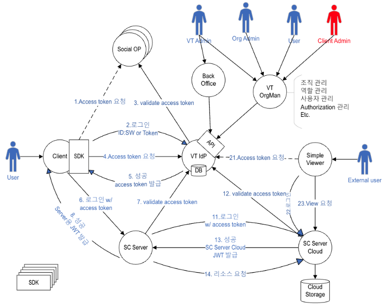
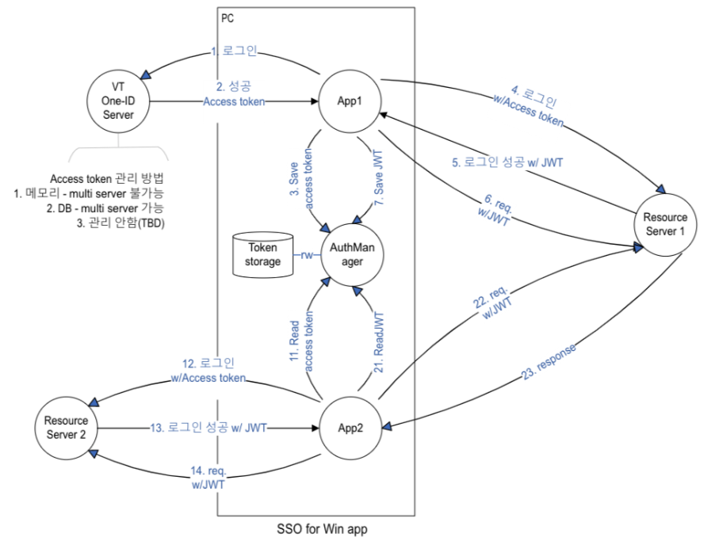
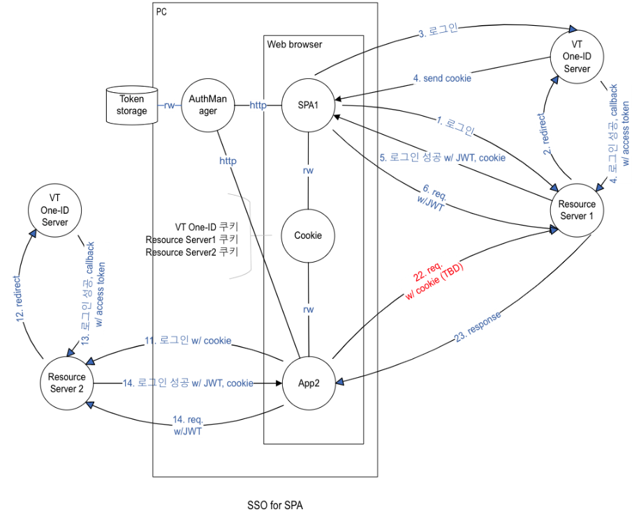
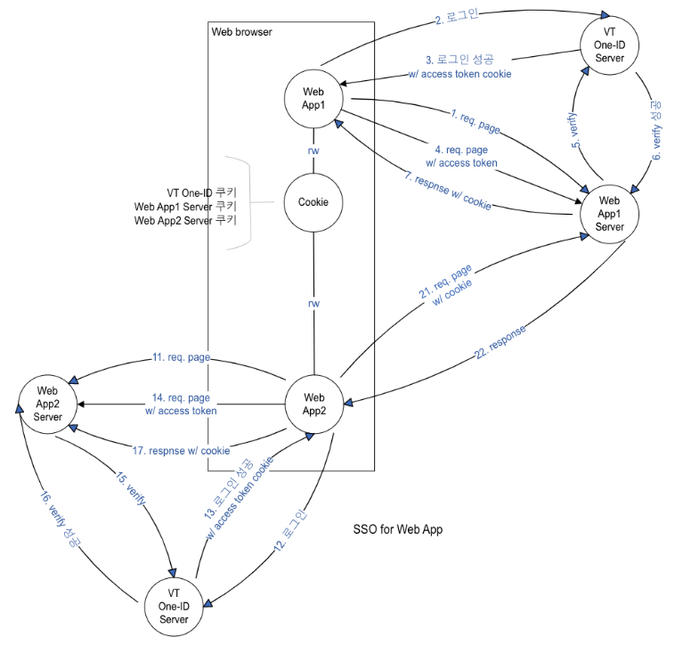
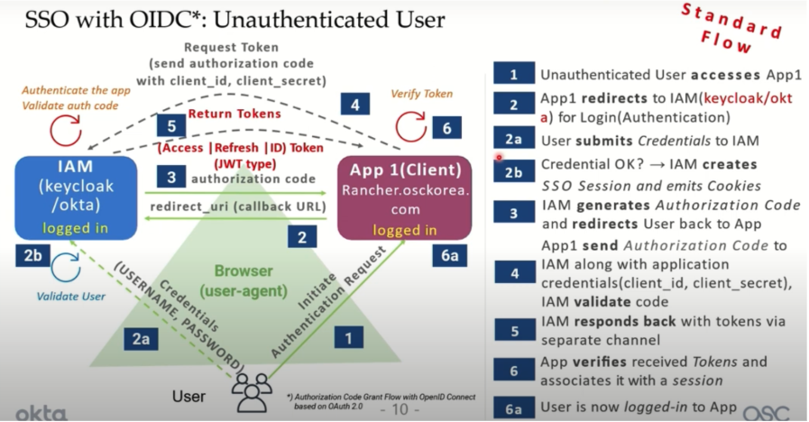
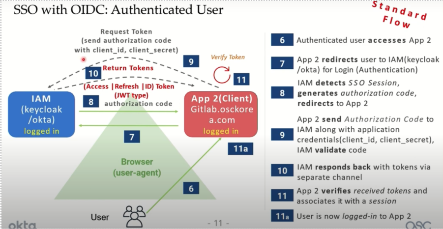
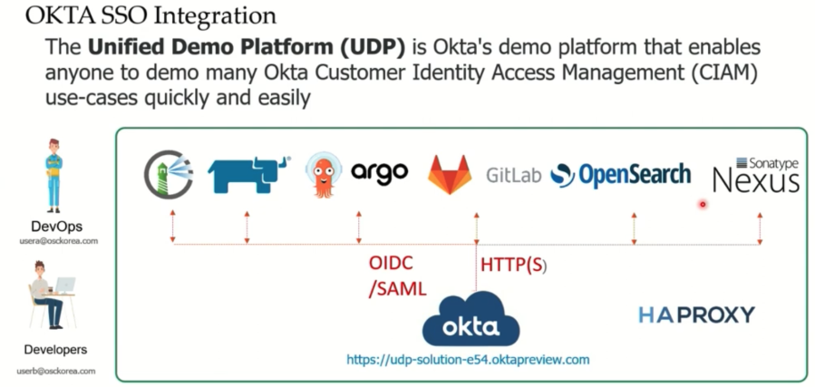
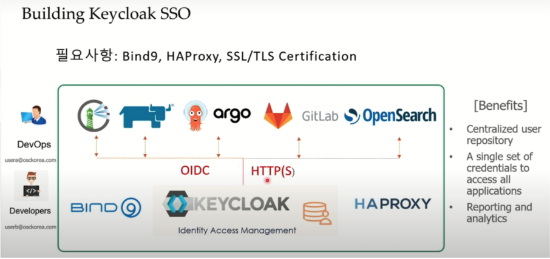

# Architecture 분석 (초기 버전)

## 1. Top Level Diagram

## 2. 로그인

### 2.1 로그인의 종류

- Social login (예, 구글)
- VT One-id login
- Resource server login (예 SC 서버)

### 2.2 로그인 flow

1. VT One-id login 클릭
2. Social login 선택
3. Social login redirect
4. Social login 성공
5. callback으로 다시 VT One-id login 화면으로 돌아옴
6. VT One-id login 성공
7. Client에서 Access token 획득
8. VT One-id의 Access token을 이용해서 Resource server로 로그인 시도
9. Resource server에서 해당 access token이 valid 한지 검사
10. Client로 Resource server용 JWT 전달
    - JWT에는 Resource server에 필요한 사용자 정보를 포함한다.

## 3. 자동 로그인

### 3.1 자동 로그인을 위한 저장소

- Cookie
- Auth manager

### 3.2 자동 로그인의 종류

- Social 자동 로그인
- VT One-id 자동 로그인
- Resource server 자동 로그인

### 3.3 자동 로그인 설명

#### 3.3.1 Social 자동 로그인

- 쿠키에 로그인 정보 보관
- Social 로그인 창이 뜨면서 다음 화면으로 자동으로 넘어간다.

#### 3.3.2 VT One-id 자동 로그인

**Web app**

- 쿠키에 로그인 정보 보관
- Social 로그인 창이 뜨면서 다음 화면으로 자동으로 넘어간다.

**SPA**

- TBD (쿠키?, auth manager)

**Native app**

- Auth manager에 로그인 정보(JWT) 보관
- background에서 자동으로 로그인 처리

#### 3.3.3 Resource server 자동 로그인

- TBD
  - 자동 로그인 지원해야 하는가? JWT보관
  - JWT는 보관하지 않고 필요시 VT One-id 재로그인 또는 자동 로그인

## 4. 로그아웃

### 4.1 로그아웃의 종류

- Social logout (예, 구글)
- VT One-id logout
- Resource server logout (예 SC 서버)

### 4.2 로그아웃 범위

- 로그아웃을 할 경우 어디까지 로그아웃을 할 것인가?
- Social id에 따라서 logout 메카니즘이 다를 수 있다.

## 5. SSO (Single-Sign-On)

### 5.1 SSO란?

- VT OneID에 한번 로그인하면 다른 VT서비스에 로그인하지 않고 접속하기
- VT OneID에 한번로 로그인하지 않고 VT의 서비스를 이용할때 VT OneID에 한번은 로그인을 해야 한다.

### 5.2 VT OneID SSO 구현 방법

- TBD : 여러 방식 비교 Diagram
- Session 관리를 하지 않고 SSO를 처리하는 방법
- Session을 DB에 넣어서 관리하는 방법
- 멀티 서버를 지원해야 한다.
- Session 관리를 하지 않으면 Logout 시 Access token을 무효화할 수 없다.
  - Auth0에서는 Logout을 해도 Access token이 무효화되지 않는다.

### 5.3 중요 사항

**SSO 기술을 prototype을 통해서 검증 및 재설계가 필요하다.**

### 5.4 비 Web client SSO 구현 방법

#### 5.4.1 PC Auth Manager 요구사항

**기능**

**통신 방법**

- Http (for web app)
  - Port는 어떻게 지정(default)? 변경? 알림?
- Windows message

**인증 기능**

- 로그인, 로그아웃

**멀티 유저 지원**

- TBD
- 다른 사람의 id로 로그인할 수 있는 부작용이 있을 수 있다.

**보안 기능**

- Auth manager에서 access token을 가져올 때 암호를 한번 물어보게 해야 하나? TBD

### 5.5 Web client SSO 구현 방법

#### 5.5.1 저장소 방식

- Web browser에 Global storage가 있을까?
- Cookie에 Access token을 넣어 놓는 방법

#### 5.5.2 통합 SSO 방식

- PC의 Auth manager의 web service를 수행해서 Web, 비Web 모두 하나의 SSO를 제공하는 방법

#### 5.5.3 애플리케이션 타입별 구현

- SPA
- 비 SPA (서버 rendering app)

## 6. 참고

### 6.1 SSO using OIDC 표준 flow

- 참조: <https://youtu.be/21MQozhb-SU>

### 6.2 SSO using Keycloak

- 참조: <https://youtu.be/21MQozhb-SU>

