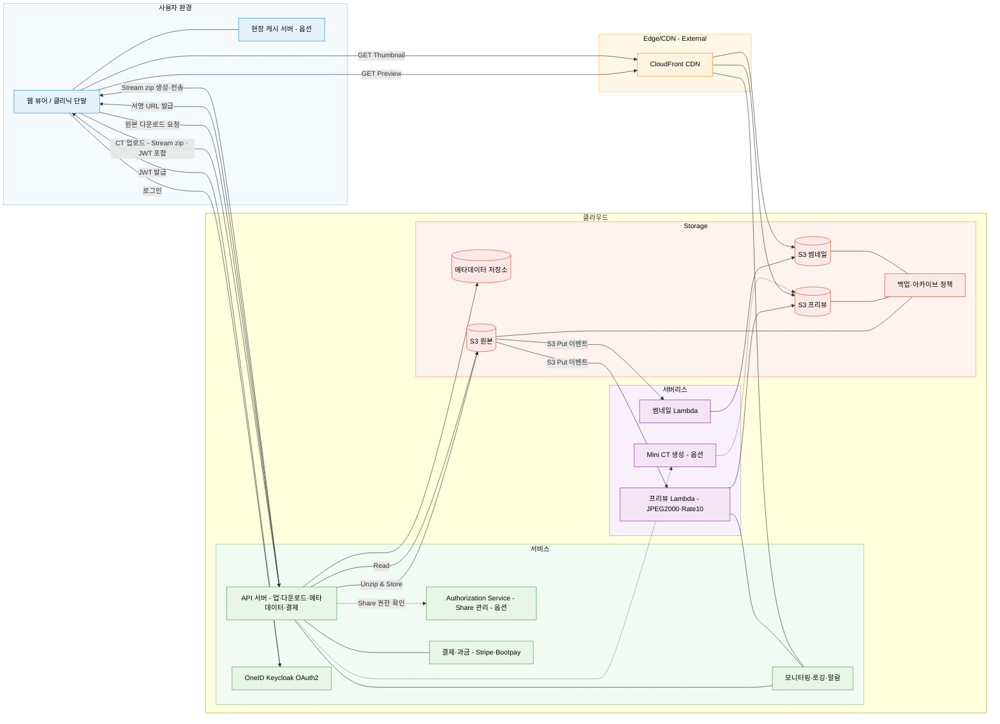

## SPC Cloud Server란?

치과에서 생산하는 모든 이미지(CT 포함)를 안전하게 클라우드에 저장·전송·조회·공유하기 위한 백엔드 중심 서비스. S3에 데이터를 저장하고 CloudFront를 통해 전송하며, 백엔드 API와 DICOM 표준(WADO/DICOMweb)은 선택 검토(우선순위: 매우 낮음)한다. 본 문서는 요구사항을 지속 수집·정리·논의·발전시키는 워킹 문서다.

## 목표 및 범위

- 치과용 대용량 영상(특히 CT)의 업로드/다운로드/조회 성능을 실사용 수준으로 제공
- 클라우드 보안과 규정 준수 기반의 안전한 저장, 접근 제어, 감사 추적 제공
- 웹 뷰어 중심의 사용성, 오프라인/캐시를 통한 현장 친화적 운영 지원
- 글로벌 서비스 운영을 위한 결제/과금, 지역별 배포, 다국어/다통화 기반 지원

## 핵심 기능(초안)

- Sharing, Order, 판독(리뷰), Cloud AI 서비스 — 범위/우선순위는 추후 확정 [논의 필요]

## 전체 아키텍처(초안)

- 저장소: S3(원본, 프리뷰, 썸네일, 아카이브), 스토리지 클래스/Lifecycle 적용
- 전송: CloudFront(+ Lambda@Edge), 사인드 URL, 범용 HTTP 전송 최적화
- 백엔드: API 서버(업로드/다운로드, 메타데이터, 결제/과금 연동)
- 인증(Authentication): OneID Keycloak OAuth2 서버
- [논의 필요] 인가(Authorization): 백엔드 검증 + 별도 Authorization 서비스 옵션(TBD, Share 관리)
- [논의 필요] DICOM 표준: 선택적으로 WADO-RS/QIDO-RS/STOW-RS 지원 또는 전용 PoC 파이프라인 (우선순위: 매우 낮음, 채택 미정)
- 메타데이터: 영상/환자/검사 메타데이터 저장소
- 캐시/오프라인: 현장 캐시 서버 도입 검토(환자/영상 일부 미러링)
- 모니터링/로그/백업: CloudWatch/ELK, 감사 로그, 백업·아카이브 정책

## 아키텍처 다이어그램

## 데이터 수집(업로드)

- CT 업로드: Client에서 Stream zip → 서버에서 Stream unzip 후 S3 저장
  - 대용량 안정성, 재시도, 부분 실패 복구 고려
- 서버리스 프리뷰 생성 파이프라인(JPEG2000 손실 압축/Rate10 binning 등)
  - 업로드 트리거 기반 비동기 처리, 진행률/상태 알림(클라이언트 구독) 연구 결과 반영
  - Lambda 메모리/성능 요구사항 검증 PoC 결과를 기준으로 설정(세부 수치 별도 문서 참조)
  - 3D 썸네일 생성은 본 프리뷰 생성 파이프라인 완료 후 후속 단계로 수행
- 서버리스 썸네일 생성 파이프라인
  - 업로드 트리거 기반 비동기 처리, 상태 알림 연동
  - 썸네일 규격/품질 정책 정의 및 저장소(S3 썸네일) 반영
  - [논의 필요] 3D CT 썸네일: Lambda로 처리 가능성 PoC 필요(메모리/실행시간/콜드스타트 검증)
    - 정의: 3D 볼륨 렌더링 스냅샷(정적 이미지) 중 정면 1컷, 프리셋(Bone/SoftTissue 등) 적용
    - Lambda(CPU) 가능 범위: Rate10 + 2×~4× binning 후 256~512px VR 스냅샷(정면 1컷)
  - 기타 2D 이미지(파노라마/IO 등)는 서버리스 처리로 충분히 커버 가능 전망
  - 대안: CT의 경우 Lambda가 곤란하면, 클라이언트에서 이미 렌더링된 뷰를 프리뷰/썸네일로 생성해 업로드(서버 검증·정합 체크 포함)하는 경로도 고려

## 데이터 저장/메타데이터

- S3 버킷 구성: 원본, 프리뷰, 썸네일, 임시, 아카이브 분리 저장(버전닝/암호화/KMS)
- 데이터 형식/유형: DICOM, JPEG 등 2D/3D(CT 포함) 지원
- 스토리지 정책: S3 Intelligent-Tiering/IA/Glacier로 Lifecycle 관리 (참고: [스토리지 클래스 및 라이프사이클 전략](데이터%20저장%20관리%20연구/스토리지%20클래스%20및%20라이프사이클%20전략.md))
- 메타데이터 저장소(결론):
  - 환자/클리닉/유저 등 마스터 데이터 → RDBMS(Aurora PostgreSQL)
  - 이미지 메타데이터(시스템+사용자) → DynamoDB 단일 저장(정본/인덱스/권한/버전)
  - 사이드카 JSON Export는 선택(오프라인/내보내기 호환)
- 상세 연구: [메타데이터 연구](데이터%20저장%20관리%20연구/메타데이터%20연구.md) 참조

## 데이터 제공(다운로드/조회)

- 원본 묶음 다운로드: 서버에서 Stream zip 생성 → Client에서 Stream unzip (슬라이스 범위 지정 다운로드 지원)
- [논의 필요] 프리뷰 조회: CloudFront 경유, Signed URL vs Lambda@Edge 실시간 인증(병용 가능)
  - 선택지
    - Signed URL: 캐시 적중률 높음, 구현 단순, 링크 만료/키 롤테이션 필요, 권한 변경 반영 지연 가능성
    - Lambda@Edge 인증: 요청마다 실시간 검증, 권한 변경 즉시 반영. 캐시 적중률은 캐시 키 설계에 따라 유지 가능(Authorization 헤더·쿠키 제외, 서명 쿠키/경로 버전 활용). 잘못 설계 시 변형 증가로 히트 저하·지연·비용 증가 가능
    - 혼용 전략: 기본은 Signed URL, 고위험/공유 리소스는 Edge 인증 적용
  - 고려사항
    - 인코딩/프리셋: 기본 가정은 Rate10 + binning (품질·용량·속도 트레이드오프, 스터디/클리닉 단위로 조정 가능)
    - 캐시 전략: 경로/쿼리 정규화, 헤더 변이 최소화, Origin Shield 활용(특히 Lambda@Edge 사용 시 인증 헤더/쿠키를 캐시 키에서 제외해 공용 캐시 히트를 유지)
    - 철회/만료: 링크 즉시 철회 요구 시 Edge 인증 우위, 일반 조회는 만료 짧은 Signed URL로 커버
    - 보안: 토큰 바인딩(클리닉/사용자/리소스), IP/Referrer 제한 여부, 재사용 방지
    - 운영: 키 롤테이션, 403/302 처리, 장애 시 폴백 경로
    - 비용/성능: Lambda@Edge 호출 비용·지연 vs 캐시 적중률 이점 비교
- 썸네일 조회: CloudFront 경유, 프리뷰와 동일 인증 정책 적용(Signed URL 기본, 필요 시 Lambda@Edge 병행)
  - 캐시: 썸네일은 작은 용량/빈번 조회 특성상 더 긴 TTL 적용(예: 7~30일), 권한 변경/삭제 시 무효화 필요
  - URL 설계: 원본/프리뷰와 분리된 경로, 파라미터 해시/버전 키로 캐시 일관성/무효화 용이성 확보
  - 권한: 원본이 아카이브 상태여도 썸네일은 즉시 노출 대상이지만, 접근은 인증 후 제공(민감정보 보호)
  - 포맷/규격: 고정 해상도/품질 프리셋 정의(예: 256px, 512px), 다중 사이즈 변형은 경로 규칙으로 구분
- [논의 필요] 관심영역 소형 CT(Mini CT): Z 슬라이스 범위 + XY ROI 크롭 기반 경량 재조합
  - Z 범위 지정: sliceRange(zStart, zEnd) 다운로드 지원(원본 묶음 다운로드에서도 지원)
  - XY 크롭/다운샘플: Bounding Box 기준 크롭, 필요 시 리샘플/해상도 축소
  - 결과 포맷: DICOM 시리즈/멀티프레임 또는 raw+header, 프리셋(예: Rate10 + binning) 적용 가능
  - 메타데이터 보정: Rows/Columns, PixelSpacing, ImagePositionPatient, SliceThickness/Spacing, NumberOfFrames 등 업데이트
  - 캐시/운영: 파라미터 해시 키로 S3 임시 객체 캐싱, 짧은 TTL 서명 URL 제공

## 뷰어 요구사항

- 웹 뷰어 중심 운영(참고 후보: OHIF/VTK.js — 확정 아님), 모바일 최적화(Responsive/Touch), 3D 렌더링 성능 개선 항목 반영
  - 대용량 CT 표시 전략: 점진적 표시 → PoC 수행 → 고속 프리뷰 제공(최종 채택)
  - [논의 필요] 3D 뷰어 엔진 선정
    - 배경: 기존 사내 WebViewer는 VTK.js 구버전 사용(업그레이드 곤란, 참조: [CloudWebViewer VTK.js 업그레이드 검토](Image%20Download%20Upload%20속도%20개선%20연구/CloudWebViewer%20CT%20Loading%20개선%20PoC/CloudWebViewer%20프로젝트에서%20VTK.js%20업그레이드%20기술%20검토%20보고서.md))
    - 옵션 A: OHIF(코너스톤/VTK 기반) 참고·재사용 → 표준 DICOM 연계 용이, 커뮤니티/업데이트 빠름
    - 옵션 B: 사내 엔진 재개발/업그레이드 → 요구 기능/UX 최적화, 의존성 축소(업그레이드 난이도는 검토 필요)
    - 고려사항: 성능(WebGL2/WebGPU), 기능 파리티(슬라이스/VR/측정), 모바일 성능, 유지보수성, 라이선스, 커뮤니티, 2D/3D 통합, 메모리/로딩 파이프라인
    - PoC 제안: 동일 CT 데이터셋 기준 초기 로딩 시간, 상호작용 FPS, 메모리 피크, 기능 커버리지, 개발 비용/기간 비교
- 동시 편집: yjs 기반 코레버레이션(Annotation, 이미지 설정 등) 범위 정의
- 데스크톱 뷰어: 이미 개발 완료, 인터페이스 연동만 필요, Quick Preview 지원을 위한 수정 필요
  - 대상: Clever One
  - 연동 방식: (1) EzWebServer 연동 (2) SCP Cloud Image Server 연동
- [논의 필요] 웹 네이티브 앱: 필수 아님(선택), 조사/논의 대상

## WADO/DICOMweb 지원(우선순위: 매우 낮음)

- [논의 필요] 현재 채택 여부 미정(비용/복잡도 대비 효과 검토 후 결정)
- 표준 지원 옵션: WADO-RS/QIDO-RS/STOW-RS 엔드포인트 제공(OHIF 연동)
- PoC 파이프라인 옵션: 압축 스트리밍 기반 전용 API(속도 우위)와의 트레이드오프 관리
- 병원 연동/인증이 필요한 경우 표준 우선, 클라우드 뷰어 서비스는 PoC 우선 적용 가능

## 성능 최적화 전략

- JPEG2000 손실 압축 프리뷰(10~20배 이상 전송 최적화) 및 Rate10 binning
- 대용량 파일 Stream zip/unzip 업/다운로드 파이프라인
- CDN 엣지 캐싱, HTTP Range/멀티파트, 병렬 요청 최적화
- HTJ2K/HealthImaging: 현재 고려하지 않음(미채택)

## 캐시/오프라인

- 현장 캐시 서버 도입 검토: 빈번 조회 환자/영상 캐싱, 오프라인 대비
- 캐시 동기화/일관성, 접근 제어/보안 정책 수립(난이도 높음)

## 보안/규정 준수

- 전송 암호화(HTTPS), 저장 암호화(SSE-KMS), 키 관리
- 인증(Authentication): OneID(Keycloak) OAuth2/JWT — 클리닉 컨텍스트(clinicId 등) 포함
- 인가(Authorization): 백엔드 확인 + 별도 Authorization 서비스(옵션) — Share/권한 정책 관리
- 의료 데이터 규정 준수 고려(HIPAA 등) 및 데이터 지역 규제 대응(지역별 배포)
- 테넌트 격리: 시스템/데이터 레벨 격리 원칙 수립
- [논의 필요] RBAC 적용 범위(역할/권한 모델)
- 사용자 역할: 의사, 스태프, 기공소, 시스템 관리자, 고객 지원(SA), [논의 필요] 환자 로그인 허용 여부

## 운영/배포/관측

- 리전별 배포 전략: 병원/국가 단위 리전 격리 옵션 검토(지연/규제/비용 균형)
- IaC, Blue/Green 또는 Canary 배포, 장애 대응/복구, 백업/리스토어 절차
- 지표/로그/알람 설계(업로드 성공률, 프리뷰 생성 지연, 조회 TTFB 등)
- 백업/아카이브 정책과 대상: 상단 '데이터 저장/메타데이터' 참조 (참고: [스토리지 클래스 및 라이프사이클 전략](데이터%20저장%20관리%20연구/스토리지%20클래스%20및%20라이프사이클%20전략.md))
- [논의 필요] 복구 목표(RTO/RPO)와 백업 선택 기준(자동/사용자 선택/기간 지정)

## 결제/과금(요약)

- 과금 모델: 구독 기반(플랜: Basic/Standard/Premium) + 사용량 기반(저장, 전송, API, 처리시간)
- 결제: 해외 Stripe, 한국 Bootpay(이니시스) 조합 검토
  - Stripe Tax로 글로벌 세금 자동 계산/징수/보고 지원
  - 지원국/수수료/현지 결제 수단은 결제 연구 문서의 표와 정책 준용
- 환율/지역별 가격 정책, 국가별 규제/허가 요건 반영

## 비용 및 대안(아키텍처 선택지)

- 클라우드 매니지드: AWS HealthImaging/GCP Healthcare/Azure DICOM Service(표준 호환, 운영 용이)
- 오픈소스 자가 운영: DCM4CHEE/Orthanc(+ S3) — 커스터마이징 자유 vs 높은 운영비
- 규모별 비용·운영 비교는 비용 분석 문서의 표 준용, Import Job 전략이 비용에 결정적 영향

## 오픈 이슈 / To-Do

- Overall Architecture Diagram 작성 및 합의(데이터 플로우, 버킷/서비스 경계 포함)
- 메타데이터 저장소 선정(Aurora vs DynamoDB 등)과 스키마 정의
- 프리뷰 파이프라인 표준화(메트릭/알림 API, 장애 복구 시나리오)
- WADO 표준과 전용 파이프라인 공존 전략(라우팅/페일백) — 우선순위: 매우 낮음
- 현장 캐시 서버 PoC(동기화/보안/오프라인 워크플로)
- Lambda 기반 3D CT 볼륨 스냅샷 생성 가능성 검증(CT-Thumb-Lambda POC)
- 운영 지표/알람 SLO 정의(업로드 성공률, 프리뷰 대기시간, 조회 성능)
- 결제/과금 MVP 범위 확정(플랜, 과금 지표, 청구 리포트)

## 참고 문서

- Image Download/Upload 속도 개선, JPEG2000/Preview 파이프라인, WADO 분석, OHIF 분석, 결제/과금 연구 및 비용 분석 일체는 `/docs/SCP Cloud Server 연구` 하위 각 문서 참조
