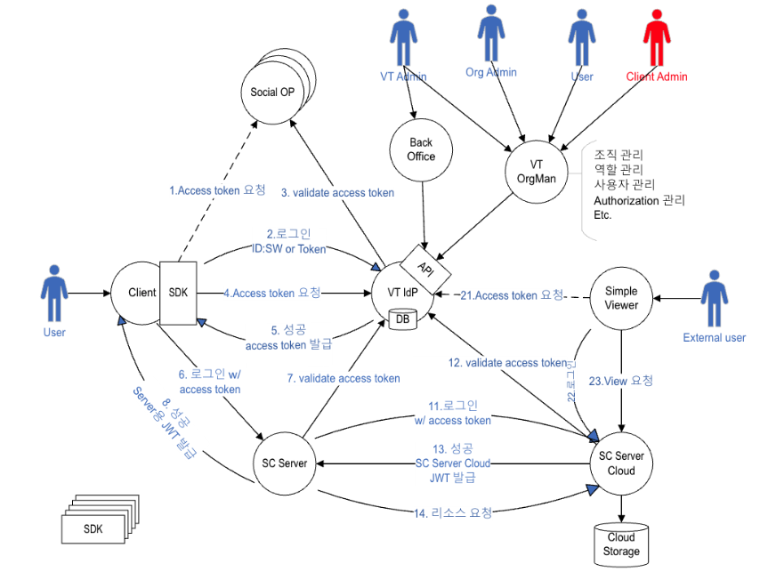
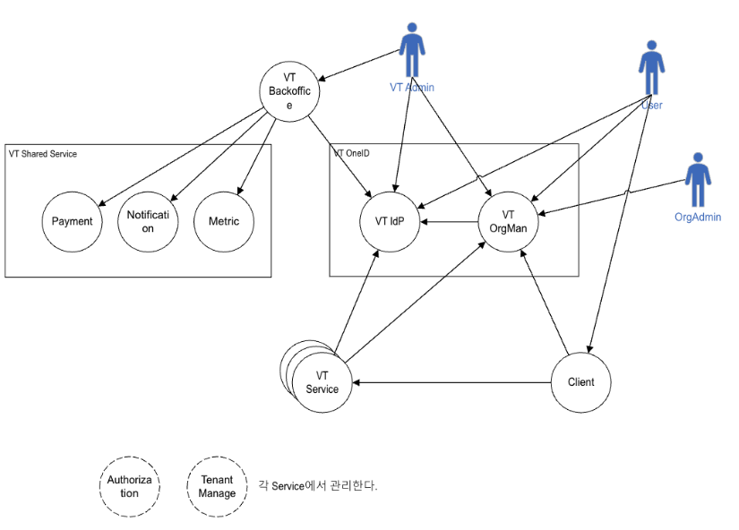
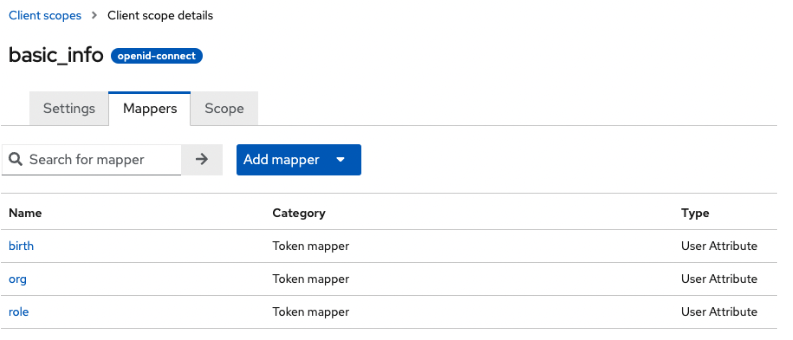
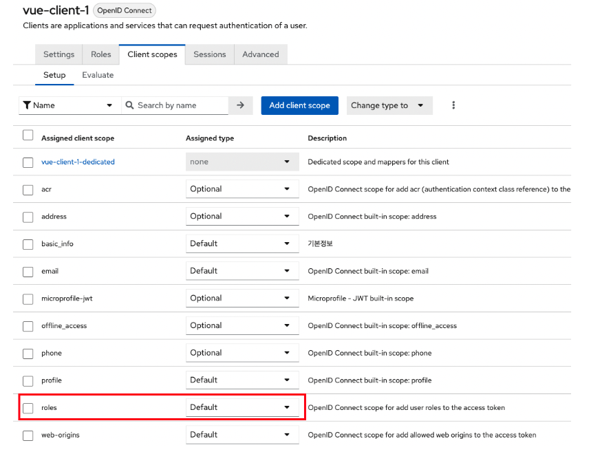

# Top level Architecture(초기 버전)

## 1. Top Level Diagram



## 2. Access Token 확장 (Keycloak vs. Auth0)

- **Keycloak**

  - Group 정보 포함 가능
  - Role 정보 포함 또는 제거 가능
  - User attribute를 access token에 포함 할 수 있다.
  - Client마다 포함할 User attribute를 다르게 지정할 수 있다.
  - 조직, 역할 등의 정보를 User attribute에 포함할 수 있다.
  - PUT /{realm}/users/{id} API를 이용해서 User attribute를 관리할 수 있다.
    - Todo : attribute 항목 삭제 테스트 필요 (추가, 수정은 되는데, 삭제가 잘 안된다)

- **Auth0**
  - Organization 정보 포함 못함
  - User meta 정보를 관리할 수 있다.
  - Access token에 meta 정보가 포함된다.
  - Client마다 meta 정보를 다르게 지정할 수 없다.

## 3. Top Level Diagram (상세)



## 4. Actor

- **VT Admin**

  - 바텍의 서비스 관리자
  - 조직 등록 승인
  - 서비스(클라이언트) 등록 승인 및 관리
  - **Admin 권한 구분**
    - 모든 권한을 가진 전체 Admin
    - 조직 승인 등 특정한 역할만 수행하는 Admin
      - CS
      - 법인
    - TBD: Admin 권한의 분류가 필요하다.

- **User**

  - 바텍 Application, Service 이용자
  - 병원의 의사, 간호사, 스텝
  - 기공소의 기사
  - 영상센터의 촬영기사, 판독사
  - Application 테스터/개발자

- **Org Admin**

  - 각 조직의 Admin (병원의 Admin)
  - 조직내 멤버 관리
  - TBD

- **Client Admin**
  - VT OneID를 연동하여 서비스, Application를 개발하는 개발자
  - 로그인 연동 개발
  - Authorization 연동 개발
  - TBD: 여러 명을 지정할 수 있어야 하는가?

## 5. Component

- **VT IdP**

  - **기술 스택**: Keycloak
  - **기능**
    - Authentication
    - SSO
      - 우리의 Application 간 SSO 제공
    - 소셜 로그인
    - Access token에 다양한 정보 포함
      - Application별로 포함할 정보 결정
      - 사용자 정보
      - 조직
      - 역할

- **VT OrgMan**

  - **목적**: 통합 조직 관리
  - **기능**
    - **사용자 관리**
      - 사용자 등록, 수정, 삭제
      - 사용자 Attribute (사용자 정보 확장)
        - Application에 필요한 정보 확장
        - 각 서비스에서 확장이 필요한 정보를 API를 통해서 저장한다.
    - **조직 관리**
      - 조직 등록, 수정, 삭제
      - 조직 유형
      - 조직 Attribute (조직 정보 확장)
        - Application에 필요한 정보 확장
        - 각 서비스에서 확장이 필요한 정보를 API를 통해서 저장한다.
    - **역할 관리**
      - 역할, 등록, 수정, 삭제
      - 사용자에게 역할 지정
    - **Client 관리**
      - VT OneID의 인증을 이용할 Application, Service를 등록 관리하는 기능
      - Client Admin은 이 기능을 이용해서 Client 등록 및 수정을 요청할 수 있고, VT Admin은 Keycloak Admin API를 이용하여 자동으로 설정 또는 직접 VT IdP에 로그인해서 수동으로 설정해야 한다.
    - **Authorization 관리**
      - Authorization항목 등록 UI 제공
        - 항목 중에 "Authorization설정"이 있다? (TBD)
      - Authorization설정은 서비스의 Admin이 할 수 있다.
  - **VT IdP 연동**
    - 정보 중에서 지정된 정보는 생성, 수정, 삭제 시 VT IdP로 보내서 로그인 시 Access token에 포함될 수 있도록 한다.

- **Client**

  - 사용자가 직접 사용하는 Application
  - Login UI가 있음
  - 예) Native app, SPA

- **VT Service**

  - Client들이 사용하는 Back-end서비스
  - 예) SC Server

- **VT Backoffice**

  - TBD

- **Notification**

  - 각 서비스 또는 Client에서 Notification이 필요할 때 사용
  - 상세 내용은 TBD

- **Payment**

  - 표준 API를 정립하여 공통 서비스로 제공한다.

- **Metric**

  - 표준 API를 정립하여 공통 서비스로 제공한다.

- **Authorization (TBD)**

  - 서비스 종속된 성격이 강하므로 각 서비스에서 관리한다.
  - Or
  - Authorization 기능을 VT OrgMan에 포함할 수 있다.

- **Tenant Manage**
  - 서비스 종속된 성격이 강하므로 각 서비스에서 관리한다.

## 6. Interface

- **VT OrgMan → VT IdP**

  - 사용자 Attribute를 설정한다.
    - OrgMan의 조직, 역할, User attribute를 IdP의 User attribute로 저장한다.

- **User → VT IdP**
  - 로그인 한다.
    - 추가로 필요한 정보를 Access token에 포함한다.
      - 조직, 역할, 생년월일 등
      - Client 별로 다른 정보를 포함할 수 있다.

## 7. Scenario

- **조직 유형 관리**

  - **예시**: 치과, 기공소 등
  - **국제화 고려사항**
    - TBD: 조직 정보는 국제화 되어야 하는가?
      - id: 3
      - 영어 키: dental clinic
      - 로컬 이름: 치과
  - **제약사항**
    - TBD: 조직에 조직 유형은 하나만 지정 가능하다.
  - **구현 방식**
    - 1안. 조직 유형은 소스코드에 고정해서 넣을 것인가?
      - 수정하려면 소스코드를 수정
    - 2안. 조직 유형은 Admin이 추가 수정할 수 있게 할 것인가?
      - DB에 저장하여 VT Admin이 관리할 수 있도록 함

- **조직 등록**

  - **사용자가 가입 요청**
    1. 사용자가 VT OrgMan에 접속한다.
    2. 사용자가 가입 메뉴를 클릭한다.
    3. 기존 클리닉 선택 or 클리닉 추가 에서 클리닉 추가를 선택한다.
    4. 클리닉 정보와 사용자 정보를 입력하고 추가한다.
    5. VT OrgMan의 Admin이 이를 승인한다.
    6. 승인 Email이 사용자에게 전송된다.
    7. 사용자가 Email을 확인한다.
  - **CS가 대신 가입 처리**
    1. CS 가 고객의 사용자 정보와 클리닉 정보를 접수 받는다.
    2. VT OrgMan에 Admin의 권한으로 클리닉(조직)과 사용자를 등록한다.
    3. 사용자에게 Confirm 메일이 전송된다.
    4. 사용자는 Confirm 메일을 확인하고 Confirm을 진행한다.
    5. 해당 사용자는 해당 클리닉의 조직Admin이 된다.

- **조직 수정**

  1. 조직Admin이 VT OrgMan에 로그인한다.
  2. 자신이 관리하는 조직을 선택한다.
  3. 조직 정보를 수정한다.

- **조직 삭제**

  - **조직Admin이 탈퇴를 한다**
    - TBD
  - **VT Admin이 조직을 삭제한다**
    - 소속 사용자도 모두 삭제해야 하나?
      - 모두 삭제 or 무소속 사용자가 된다.
      - = 그 조직 구성원을 조직에서 제거한다. "조직 탈퇴"
    - TBD

- **역할 관리**

  - **구현 방식 (TBD)**
    - **1안. 역할은 소스코드에 고정해서 넣을 것인가?**
      - 수정하려면 소스코드를 수정
    - **2안. 역할은 Admin이 추가 수정할 수 있게 할 것인가?**
      - DB에 저장하여 VT Admin이 관리할 수 있도록 함
  - **국제화 고려사항 (TBD)**
    - **역할은 국제화가 되어야 한다.**
    - **필드 구조**
      - id : 7
      - 영어 키: dentist
      - 로컬이름: 치과의사
    - **Access token에 역할을 포함할 때 어떻게 포함할 것인가?**
      - 1안. 영어 키 ( dentist )
      - 2안. id 포함 {"id":7, "key":"dentist", "name":"치과의사" }
    - **중요 결정사항** **→ OneID Layer에서는 서비스 조직 Admin / 서비스 조직 User 로만 구별되고, 상세 Role은 각 서비스에서 관리한다. Access Token에는 조직 ID, 조직에서의 역할 (Admin or User) 이 포함되어야 한다.**
  - **기타 고려사항 (TBD)**
    - 사용자에게 역할을 여러 개 할당할 수 있을까?

- **사용자 가입**

  - **조직 Admin이 사용자를 추가한다**
    1. 조직Admin이 사용자 정보를 VT OrgMan에 직접 입력하여 등록한다.
    2. 사용자에게 Confirm 메일이 전송된다.
    3. 사용자는 Confirm 메일을 확인하고 Confirm을 진행한다.
    4. 해당 사용자는 해당 클리닉의 일반 사용자가 된다.
  - **사용자가 직접 가입한다**
    1. 사용자가 VT OrgMan에 접속한다.
    2. 사용자가 가입 메뉴를 클릭한다.
    3. 기존 클리닉 선택 or 클리닉 추가 에서 기존 클리닉 선택을 선택한다.
    4. 클리닉을 검색하고 선택한다.
    5. 사용자 정보를 입력하고 추가한다.
    6. 사용자 등록 정보가 조직Admin에게 Email로 전송된다.
    7. 조직 Admin은 Email을 확인하고 승인한다.
    8. 승인 Email이 사용자에게 전송된다.
    9. 사용자가 Email을 확인한다
  - **VT Admin이 사용자를 추가 한다**
    1. VT Admin이 사용자 정보를 VT OrgMan에 직접 입력하여 등록한다.
    2. 사용자에게 Confirm 메일이 전송된다.
    3. 사용자는 Confirm 메일을 확인하고 Confirm을 진행한다.
    4. 해당 사용자는 해당 클리닉의 일반 사용자가 된다.
  - **기타 사항**
    - VT IdP에서는 사용자 가입 메뉴를 제거한다.

- **사용자 수정**

  1. 조직Admin이 VT OrgMan에 로그인한다.
  2. 자신의 정보를 선택한다.
  3. 자신의 정보를 수정한다.

  - **TBD 고려사항**
    - 사용자 정보 = "개인 정보" 를 조직 Admin이 수정할 수 있는가? → x
    - 사용자 정보를 조직 VT Admin이 수정할 수 있는가? → x

- **사용자 조직 가입**

  - **사용자 본인이 조직 가입을 신청한다**
    1. VT OrgMan에서 사용자 수정 메뉴에서 조직을 선택하여 가입을 신청한다.
    2. 가입요청 내용이 조직Admin에게 Email로 전송된다.
    3. 조직 Admin은 Email을 확인하고 승인한다.
    4. 승인 Email이 사용자에게 전송된다.
    5. 사용자가 Email을 확인한다
  - **조직 Admin이 사용자를 조직에 가입한다**
    1. 조직 Admin이 VT OrgMan에서 자신의 조직에 사용자를 가입시킨다.
    2. 사용자에게 Confirm 메일이 전송된다.
    3. 사용자는 Confirm 메일을 확인하고 Confirm을 진행한다.
    4. 해당 사용자는 해당 클리닉의 일반 사용자가 된다.
  - **VT Admin이 사용자를 조직에 가입한다**
  - **TBD 고려사항**
    - 사용자가 여러 조직이 소속할 수 있는가?
    - Or
    - 사용자는 하나의 조직에만 속할 수 있는가?
    - **TBD. 기획측과 심층적인 논의를 통해 결정한다.**

- **사용자 조직 탈퇴**

  - 사용자 본인이 탈퇴한다.
  - 조직 Admin이 사용자를 탈퇴 처리한다.
  - VT Admin이 사용자를 탈퇴 처리한다.

- **사용자 삭제 = 계정 탈퇴**

  - 사용자 본인이 본인을 삭제한다. → o
  - 조직 Admin이 사용자를 삭제한다. → x
  - VT Admin이 사용자를 삭제한다. → x 비활성화, 블락처리

- **사용자 암호 분실**

  - **VT IdP 로그인의 암호 분실 Flow를 따른다**
    1. 로그인 화면에서 암호 분실을 클릭한다.
    2. 사용자 Email주소를 입력한다.
    3. Email에 암호를 복구한다.
  - **이슈: VT OrgMan에 별도의 암호 분실 처리 Flow를 만들 것인가?**
    1. IDP 솔루션을 확정한 후에 해당 솔루션이 제공하는 방식을 1차적으로 검토한다.
    2. 고도의 방식은 차기 버전에서 검토하고, 사용자가 많지 않은 동안에는 그냥 관리자 대응으로 대응할 수도 있다.

- **조직 Admin 변경**

  - **이슈**
    - **조직 Admin은 1명만 허용할 것인가? 여러 명을 허용할 것인가?** → 여러명이다.
  - **Admin이 변경한다**
    1. VT OrgMan의 Admin이 하나의 조직(클리닉)을 선택한다.
    2. 사용자 한명을 선택하여 Admin을 부여하거나 제거한다.
       - 이때 조직 Admin은 최소 1명이상 남아 있어야 한다.
  - **조직 Admin이 부여한다 (여러 명 허용)**
    1. 조직 Admin이 일반 사용자를 선택하여 조직 Admin 권한을 부여한다.
  - **조직 Admin이 삭제한다 (여러 명 허용)**
    1. 조직 Admin이 조직 Admin 중에서 한 명의 Admin 권한을 제거하고 일반 사용자로 바꾼다.
       - 이때 조직 Admin은 최소 1명이상 남아 있어야 한다.
       - 조직 Admin이 본인의 Admin 권한을 제거할 수 있다.
  - **~~조직 Admin을 변경한다 (한 명만 허용)~~ (삭제된 방식)**
    - ~~1. 조직 Admin이 일반 사용자를 선택하여 조직 Admin 권한을 넘긴다.~~
    - ~~2. 해당 사용자에게는 Confirm Email이 전송된다.~~
    - ~~3. 사용자가 Confirm Email을 확인하고 승인한다.~~
    - ~~4. 기존 조직 Admin에게 조직 Admin 권한이 제거 되었다는 알림 메일을 전송한다.~~
  - **결론**
    - 조직의 Admin은 사용자에게 넘어간다.

- **Client 관리**

  - **Client 등록**
    1. VT OneID와 인증을 연동을 서비스(App) 개발을 계획한다.
    2. VT OrgMan에 개발할 서비스를 Client로 등록한다.
       - 인증 방식: User credential or Client credential
    3. Admin이 승인한다.
    4. VT OrgMan은 이 정보를 VT IdP에 Client로 등록한다.
       - Keycloak API 이용
       - Client Admin을 지정한다.
    5. Client id를 공유 받는다.
       - Client credential 방식은 Client secret로 공유 받는다.
    6. 이를 이용해서 서비스(App)를 개발한다.
    7. VT OneID로 로그인을 테스트한다.
  - **Client 삭제**
    - TBD

- **각 서비스에서 Authorization 설정 (Client는 이미 등록되어 있다)**
  - **Authorization 연동 개발**
    1. 서비스의 Authorization 항목을 결정한다.
    2. Client Admin이 VT OrgMan에 로그인한다.
    3. 해당 Client를 선택한다.
    4. Authorization관리 화면에서 항목을 추가한다.
    5. VT OrgMan은 이 정보를 VT IdP에 등록한다.
  - **Authorization 활용**
    1. 사용자가 서비스에 로그인한다.
    2. VT IdP는 해당 서비스(Client)의 Authorization 정보를 포함해서 Access token을 발행한다.
    3. 서비스는 Access token을 받는다.
    4. Authorization를 보고 사용자에게 기능을 인가한다.
    5. Authorization 정보를 포함하여 서비스 고유의 JWT를 사용자에게 전달한다.
    6. 2번째 Access 부터는 자체 JWT를 통해서 Authorization 처리를 한다.

## 8. 용어

- OneID Access token
- 각 Application JWT

## 9. Issues

- **특정 서비스의 Tenant 정보를 로그인 했을 때 Access token에 받아보기를 원하는 경우**

  - **예시**
    - Tenant 정보
    - 클리닉이 계약한 라이선스 정보
    - 사용 가능한 Storage 용량
    - 각 서비스의 User level, Authorization
  - **방법 1: 각 서비스에서 VT IdP에 직접 정보를 저장**
    - **프로세스**
      1. 각 서비스는 Access token에서 받아보기를 원하는 정보를 VT IdP의 User attribute로 저장한다.
         - User attribute는 JSON 포맷으로 한통으로 수정해야 하므로 매우 조심스럽게 다뤄야 한다.
      2. 해당 서비스를 VT IdP에 등록할 때 Client scope에 해당 정보를 가지고 있는 User attribute를 포함한다.
      3. 해당 서비스의 서버는 Admin의 client credential을 얻어올 수 있는 정보를 보유해야 한다.
         - Client id
         - Client secret
    - **단점**
      - 보안상 취약할 수 있다.
  - **방법 2: 각 서비스에서 VT OrgMan을 통해서 VT IdP에 필요 정보를 저장한다**
    - **프로세스**
      1. 각 서비스는 Access token에서 받아보기를 원하는 정보를 VT OrgMan의 User attribute, Org attribute에 저장한다.
      2. VT OrgMan는 해당 정보를 VT IdP의 User attribute로 저장한다.
      3. 해당 서비스를 VT IdP에 등록할 때 Client scope에 해당 정보를 가지고 있는 User attribute를 포함한다.
      4. VT OrgMan을 통하기 때문에 해당 서비스가 Admin 권한을 보유할 필요가 없다.
         - VT OrgMan을 사용할 수 있는 권한만 있으면 된다.

- **각 서비스(Client)의 Authorization 관리 기능을 어디에 둘것인가?**
  - **참고**
    - **서비스의 기능(Menu)별 Authorization**: 이 기능을 어디에 둘것인가?
      - 예) 이미지 목록조회, 이미지 추가 기능
    - **서비스내의 Resource별 Authorization**: 각 서비스에 둔다.
      - 예) 영상 파일의 읽기, 수정, 삭제 권한
  - **1안: 각 서비스에 기능 Authorization 관리 기능을 둔다**
    - **설명**
      - 각 서비스 User DB에 Authorization 필드를 둔다.
      - Authorization 관리 페이지를 만들어서 사용한다.
      - 서비스에서 Authorization을 확인하려면 User DB를 읽어야 한다.
      - VT OneID로 Authentication 확인 후에 서비스 자체 DB를 읽어서 사용자 Authorization 정보를 서비스 JWT에 포함하여 Client로 전송한다.
    - **장점**
      - 서비스 별 다양한 Authorization 요구사항을 직접 구현할 수 있다.
    - **단점**
      - 모든 서비스에 Authorization page를 만들어야 한다. 개발/유지보수 비용 발생
      - Authorization을 확인하기 위해서 user db를 한번 더 읽어야 한다.
  - **2안: VT OrgMan에서 각 서비스의 기능 Authorization Page를 제공한다**
    - **2.1안: 서비스는 기능 Authorization 정보를 보관하지 않는다**
      - **Flow**
        1. 서비스 생성시 VT IdP에 Client를 등록한다.
        2. VT OrgMan에 해당 Client의 Authorization Page를 생성한다.
        3. 서비스의 Authorization 목록을 추가한다.
        4. 서비스의 Admin은 사용자 정보에서 Authorization button을 클릭하면 VT OrgMan의 Authorization Page가 표시된다.
        5. 서비스 Admin은 사용자의 Authorization 정보를 설정하고 저장한다.
        6. 사용자가 서비스에 로그인한다. VT OneID로 로그인한다.
        7. VT OneID는 Access token에 Authorization 정보를 포함한다.
        8. 서비스는 Authorization 정보를 서비스의 JWT에 포함하여 처리한다.
        9. 이후는 서비스의 JWT의 Authorization 정보를 보고 처리한다.
      - **장점**
        - Authorization page를 각 서비스별로 만들 필요가 없어서 개발/유지보수 비용이 감소한다.
      - **단점**
        - 구조가 복잡하다.
    - **2.2안: 서비스는 기능 Authorization 정보를 보관한다**
      - **Flow**
        1. 서비스 생성시 VT IdP에 Client를 등록한다.
        2. VT OrgMan에 해당 Client의 Authorization Page를 생성한다. 이때 서비스의 Callback URL을 설정한다.
        3. 서비스의 Authorization 목록을 추가한다.
        4. 서비스의 Admin은 사용자 정보에서 Authorization button을 클릭하면 VT OrgMan의 Authorization Page가 표시된다.
        5. 서비스 Admin은 사용자의 Authorization 정보를 설정하고 저장한다. 이때 서비스의 Callback URL을 호출하여 사용자의 Authorization 정보를 서비스 DB에도 저장한다.
        6. 사용자가 서비스에 로그인한다. VT OneID로 로그인한다.
        7. VT OneID는 Access token에 Authorization 정보를 포함한다.
        8. 서비스는 Authorization 정보를 서비스의 JWT에 포함하여 처리한다.
        9. 이후는 서비스의 JWT의 Authorization 정보를 보고 처리한다.
      - **장점**
        - Authorization page를 각 서비스별로 만들 필요가 없어서 개발/유지보수 비용이 감소한다.
      - **단점**
        - 구조가 복잡하다.
        - Authorization 정보가 VT OrgMan, 서비스 양쪽에 저장되므로 Sync가 안맞을 수도 있다.

## 10. Access Token

- **Default 값**

```json
{
  "exp": 1684904181,
  "iat": 1684904121,
  "auth_time": 1684903950,
  "jti": "e967b5cd-71a8-495f-9aaa-fe54fe17c2b1",
  "iss": "https://kc21.esclouddev.com/realms/master",
  "aud": ["master-realm", "account"],
  "sub": "5ff7dbb6-0aac-4133-a1c2-98b4d31ea707",
  "typ": "Bearer",
  "azp": "vue-client-1",
  "nonce": "e3b87b68-a091-4b6d-80dc-f11b812348a8",
  "session_state": "a4923a46-2d87-4b81-aea7-d2992753dc60",
  "acr": "1",
  "allowed-origins": ["*"],
  "realm_access": {
    "roles": ["create-realm", "default-roles-master", "offline_access", "admin", "uma_authorization"]
  },
  "resource_access": {
    "master-realm": {
      "roles": [
        "view-identity-providers",
        "view-realm",
        "manage-identity-providers",
        "impersonation",
        "create-client",
        "manage-users",
        "query-realms",
        "view-authorization",
        "query-clients",
        "query-users",
        "manage-events",
        "manage-realm",
        "view-events",
        "view-users",
        "view-clients",
        "manage-authorization",
        "manage-clients",
        "query-groups"
      ]
    },
    "account": {
      "roles": ["manage-account", "manage-account-links", "view-profile"]
    }
  },
  "scope": "openid email basic_info profile",
  "sid": "a4923a46-2d87-4b81-aea7-d2992753dc60",
  "email_verified": false,
  "preferred_username": "admin"
}
```

- **Client scope을 이용해서 Access token을 custom 화함**

```json
{
  "exp": 1684904673,
  "iat": 1684904613,
  "auth_time": 1684904603,
  "jti": "325d93ca-bb41-4e62-8e6e-1667d329dd98",
  "iss": "https://kc21.esclouddev.com/realms/master",
  "sub": "5ff7dbb6-0aac-4133-a1c2-98b4d31ea707",
  "typ": "Bearer",
  "azp": "vue-client-1",
  "nonce": "e0148376-436e-4796-85c4-202b518a3869",
  "session_state": "d8f0d89e-42ab-426e-93c4-1b5221a456ae",
  "acr": "1",
  "allowed-origins": ["*"],
  "scope": "openid email basic_info profile",
  "sid": "d8f0d89e-42ab-426e-93c4-1b5221a456ae",
  "email_verified": false,
  "role": ["분석가", "의사"],
  "org": ["양재기공소", "양재치과"],
  "birth": "990101",
  "preferred_username": "admin"
}
```



여러가지 Format을 지원한다. (String, num, json 등)

```json
{
  "exp": 1684905033,
  "iat": 1684904973,
  "auth_time": 1684904603,
  "jti": "29dd9707-62f3-4e5d-b9bb-7d5b02e69202",
  "iss": "https://kc21.esclouddev.com/realms/master",
  "sub": "5ff7dbb6-0aac-4133-a1c2-98b4d31ea707",
  "typ": "Bearer",
  "azp": "vue-client-1",
  "nonce": "e0148376-436e-4796-85c4-202b518a3869",
  "session_state": "d8f0d89e-42ab-426e-93c4-1b5221a456ae",
  "acr": "1",
  "allowed-origins": ["*"],
  "scope": "openid email basic_info profile",
  "sid": "d8f0d89e-42ab-426e-93c4-1b5221a456ae",
  "email_verified": false,
  "role": ["분석가", "의사"],
  "bool": true,
  "org": ["양재기공소", "양재치과"],
  "num": 1,
  "json": [
    { "id": 5678, "name": "삼성치과" },
    { "id": 1234, "name": "양재치과" }
  ],
  "birth": "990101",
  "preferred_username": "admin"
}
```

- **User property 정보도 포함할 수 있다**

```json
{
  "exp": 1684905273,
  "iat": 1684905213,
  "auth_time": 1684905156,
  "jti": "6a34bb0d-c262-4621-89d5-5c6a21583ac7",
  "iss": "https://kc21.esclouddev.com/realms/master",
  "sub": "5ff7dbb6-0aac-4133-a1c2-98b4d31ea707",
  "typ": "Bearer",
  "azp": "vue-client-1",
  "nonce": "20fece21-2843-4253-ba03-d3da15fae501",
  "session_state": "b7b8905c-6cb2-48b4-a373-9e112c0b7bfd",
  "acr": "0",
  "allowed-origins": ["*"],
  "scope": "openid email basic_info profile",
  "sid": "b7b8905c-6cb2-48b4-a373-9e112c0b7bfd",
  "email_verified": false,
  "role": ["분석가", "의사"],
  "bool": true,
  "org": ["양재기공소", "양재치과"],
  "num": 1,
  "name": "Raymond Jeon",
  "json": [
    { "id": 5678, "name": "삼성치과" },
    { "id": 1234, "name": "양재치과" }
  ],
  "birth": "990101",
  "preferred_username": "admin",
  "given_name": "Raymond",
  "family_name": "Jeon",
  "email": "gracegyu@gmail.com"
}
```

- **Admin API를 이용한 User attribute 수정**

Admin API를 이용해서 User attribute를 수정할 수 있다. Attribute를 통째로 수정하는 것이다. 하나를 추가하거나 수정, 삭제할 수는 없다. 조심해서 수정해야 한다.

**API 호출**

```http
PUT https://{address}/admin/realms/master/users/{userid}
Authorization: Bearer Token
Content-Type: application/json
```

**Body**

```json
{
  "attributes": {
    "role": ["의사", "기공사"],
    "test": "test2",
    "bool": ["TRUE"],
    "org": ["양재치과"],
    "num": ["1"],
    "birth": ["990101"],
    "json": ["{\"id\":5678,\"name\":\"삼성치과\"}", "{\"id\":1234,\"name\":\"양재치과\"}"]
  }
}
```

- **Access token에는 꼭 Role이 포함되어 있어야 한다**

```json
{
  "exp": 1684909516,
  "iat": 1684907716,
  "auth_time": 1684907566,
  "jti": "4f86ea57-620d-4278-b722-40a62502a058",
  "iss": "https://kc21.esclouddev.com/realms/master",
  "aud": ["master-realm", "account"],
  "sub": "5ff7dbb6-0aac-4133-a1c2-98b4d31ea707",
  "typ": "Bearer",
  "azp": "vue-client-1",
  "nonce": "12a05324-b12b-4b6e-8068-6491fa87b71f",
  "session_state": "9c144bc4-014c-494f-bfe8-0086440050b9",
  "allowed-origins": ["*"],
  "realm_access": {
    "roles": ["create-realm", "default-roles-master", "offline_access", "admin", "uma_authorization"]
  },
  "resource_access": {
    "master-realm": {
      "roles": [
        "view-identity-providers",
        "view-realm",
        "manage-identity-providers",
        "impersonation",
        "create-client",
        "manage-users",
        "query-realms",
        "view-authorization",
        "query-clients",
        "query-users",
        "manage-events",
        "manage-realm",
        "view-events",
        "view-users",
        "view-clients",
        "manage-authorization",
        "manage-clients",
        "query-groups"
      ]
    },
    "account": {
      "roles": ["manage-account", "manage-account-links", "view-profile"]
    }
  },
  "scope": "openid email basic_info profile",
  "sid": "9c144bc4-014c-494f-bfe8-0086440050b9",
  "email_verified": false,
  "role": ["기공사", "의사"],
  "bool": true,
  "org": ["양재치과"],
  "num": 1,
  "name": "Raymond Jeon",
  "json": [
    { "id": 5678, "name": "삼성치과" },
    { "id": 1234, "name": "양재치과" }
  ],
  "birth": "990101",
  "preferred_username": "admin",
  "given_name": "Raymond",
  "family_name": "Jeon",
  "email": "gracegyu@gmail.com"
}
```

Client Scopes에서 "roles"를 Default로 설정해야 role 정보가 access token에 포함된다.



- **Admin API 사용 방법**

Admin API를 호출 하기 위해서는 Admin 권한이 포함된 Access token이 필요하다.

**Access Token 획득 방법**

- Admin 계정으로 로그인하여 발급받은 Access token을 사용
- Client credential을 사용

**Client credential 용 Client 생성 방법**

1. **Clients > Create Client > Capability config에서**

- Client authentication : On
- Standard flow : Off
- Service accounts roles: On

2. **Service accounts roles에서**
   - Assign role에서 admin을 추가한다.
