# 목차

1. [시스템 아키텍처 개요](#1-시스템-아키텍처-개요)
2. [데이터 모델 및 엔티티 매핑](#2-데이터-모델-및-엔티티-매핑)
3. [결제 흐름 구현 가이드](#3-결제-흐름-구현-가이드)
4. [이벤트 처리 및 웹훅](#4-이벤트-처리-및-웹훅)
5. [오류 처리 및 장애 대응](#5-오류-처리-및-장애-대응)
6. [보안 및 규정 준수](#6-보안-및-규정-준수)
7. [API 선택 가이드](#7-api-선택-가이드)
8. [테스트 전략](#8-테스트-전략)
9. [운영 및 유지보수](#9-운영-및-유지보수)
10. [비즈니스 인텔리전스 및 보고](#10-비즈니스-인텔리전스-및-보고)
11. [효과적인 알림 시스템 구현](#11-효과적인-알림-시스템-구현)

# 1. 시스템 아키텍처 개요

## 1.1 전체 시스템 구조도

Stripe 결제 시스템과 애플리케이션의 통합 아키텍처는 다음과 같이 구성된다:

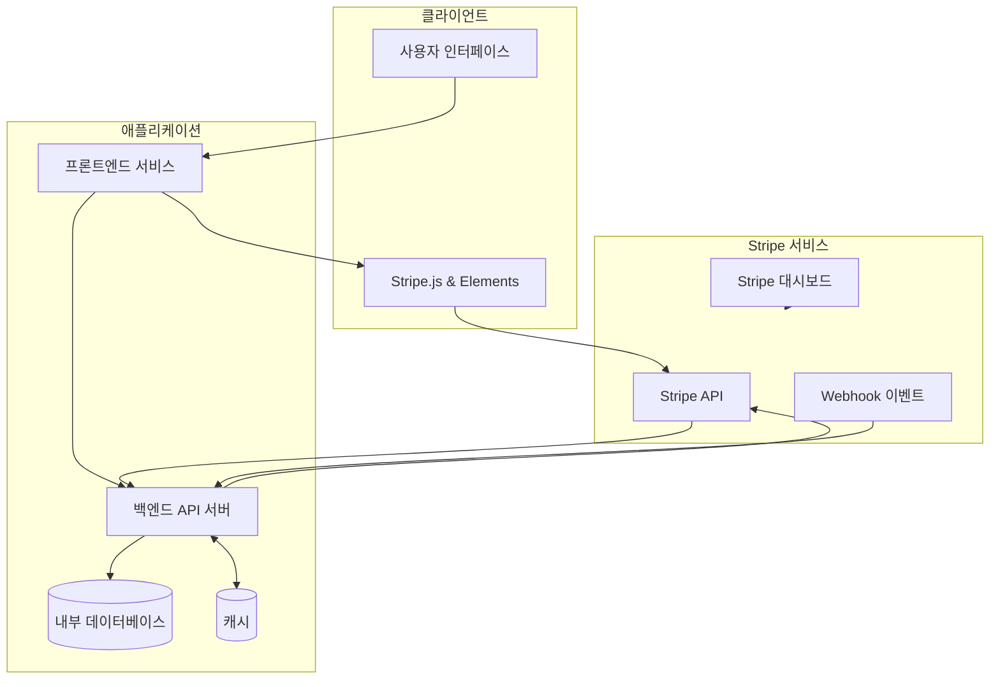
```mermaid
flowchart TD
    subgraph Client [클라이언트]
        UI[사용자 인터페이스]
        StripeJS[Stripe.js & Elements]
    end

    subgraph App [애플리케이션]
        Frontend[프론트엔드 서비스]
        Backend[백엔드 API 서버]
        DB[(내부 데이터베이스)]
        Cache[(캐시)]
    end

    subgraph Stripe [Stripe 서비스]
        StripeAPI[Stripe API]
        Webhook[Webhook 이벤트]
        Dashboard[Stripe 대시보드]
    end

    UI --> Frontend
    Frontend --> StripeJS
    StripeJS --> StripeAPI
    Frontend --> Backend
    Backend --> StripeAPI
    StripeAPI --> Backend
    Backend --> DB
    Backend <--> Cache
    Webhook --> Backend
    Dashboard --> Stripe
```

## 1.2 핵심 컴포넌트 및 데이터 흐름

### 클라이언트 측 컴포넌트

1. **사용자 인터페이스(UI)**: 결제 관련 화면 제공
2. **Stripe.js & Elements**:
   - 안전한 카드 정보 수집 및 관리
   - PCI DSS 규정 준수 지원
   - 다양한 결제 UI 컴포넌트 제공

### 서버 측 컴포넌트

1. **백엔드 API 서버**:

   - Stripe API와 통신
   - 결제 로직 처리
   - 웹훅 이벤트 수신 및 처리
   - 내부 데이터 관리

2. **내부 데이터베이스**:
   - 고객, 결제, 구독 정보 저장
   - Stripe 엔티티와 내부 엔티티 매핑
   - 트랜잭션 및 결제 내역 관리

### Stripe 컴포넌트

1. **Stripe API**:

   - 결제, 구독, 고객 관리 기능 제공
   - 실시간 결제 처리 및 상태 관리
   - 사용량 기반 과금, 정기 결제 지원

2. **Webhook 이벤트**:
   - 비동기 이벤트 알림
   - 중요 결제 상태 변경 통지
   - 시스템 간 상태 동기화

## 1.3 Stripe와 내부 시스템 통합 원칙

1. **데이터 일관성 유지**:

   - Stripe 이벤트를 기반으로 내부 DB 상태 동기화
   - 핵심 엔티티(고객, 구독, 결제수단)의 ID 매핑 관리
   - 정기적인 데이터 검증 및 불일치 해결

2. **안전한 통신**:

   - API 키 보안 관리
   - Webhook 서명 검증
   - HTTPS 통신 및 TLS 인증서 관리

3. **장애 대응 설계**:

   - 멱등성 있는 API 호출 설계
   - Webhook 실패 시 재시도 메커니즘
   - 분산 시스템 장애 고려한 설계

4. **확장성 고려**:
   - 마이크로서비스 분리 가능한 설계
   - 대량 트랜잭션 처리 고려
   - 이벤트 기반 아키텍처 적용

# 2. 데이터 모델 및 엔티티 매핑

## 2.1 Stripe 엔티티와 내부 DB 매핑

Stripe와 내부 데이터베이스 간의 매핑은 서비스의 안정성과 일관성에 중요하다. 다음 엔티티 관계를 구축해야 한다:

| 내부 엔티티        | Stripe 엔티티        | 설명                                                            |
| ------------------ | -------------------- | --------------------------------------------------------------- |
| Organization (Org) | Customer             | 결제 주체가 되는 조직/회사 정보와 Stripe Customer를 1:1로 매핑  |
| User               | -                    | 사용자는 Organization에 소속되며, 직접적인 Stripe 매핑은 불필요 |
| PaymentMethod      | PaymentMethod        | 고객의 결제 수단 정보 (카드, 계좌 등)                           |
| Subscription       | Subscription         | 정기 결제 구독 정보                                             |
| Invoice            | Invoice              | 청구서 정보                                                     |
| Transaction        | Charge/PaymentIntent | 개별 결제 트랜잭션 정보                                         |
| Product            | Product              | 판매 상품/서비스 정보                                           |
| Price              | Price                | 상품의 가격 정보 (구독의 경우 반복 청구 정보 포함)              |

## 2.2 주요 테이블 구조

### Organizations 테이블

```sql
CREATE TABLE organizations (
  id UUID PRIMARY KEY,
  name VARCHAR(255) NOT NULL,
  email VARCHAR(255) NOT NULL,
  stripe_customer_id VARCHAR(255) UNIQUE,
  billing_address JSONB,
  created_at TIMESTAMP WITH TIME ZONE DEFAULT NOW(),
  updated_at TIMESTAMP WITH TIME ZONE DEFAULT NOW()
);
```

### PaymentMethods 테이블

```sql
CREATE TABLE payment_methods (
  id UUID PRIMARY KEY,
  organization_id UUID NOT NULL REFERENCES organizations(id),
  stripe_payment_method_id VARCHAR(255) NOT NULL UNIQUE,
  type VARCHAR(50) NOT NULL, -- 'card', 'bank_account' 등
  details JSONB NOT NULL, -- 마스킹된 카드 정보 (last4, brand 등)
  is_default BOOLEAN DEFAULT FALSE,
  created_at TIMESTAMP WITH TIME ZONE DEFAULT NOW(),
  updated_at TIMESTAMP WITH TIME ZONE DEFAULT NOW()
);
```

### Subscriptions 테이블

```sql
CREATE TABLE subscriptions (
  id UUID PRIMARY KEY,
  organization_id UUID NOT NULL REFERENCES organizations(id),
  stripe_subscription_id VARCHAR(255) NOT NULL UNIQUE,
  status VARCHAR(50) NOT NULL, -- 'active', 'past_due', 'canceled' 등
  current_period_start TIMESTAMP WITH TIME ZONE,
  current_period_end TIMESTAMP WITH TIME ZONE,
  stripe_price_id VARCHAR(255),
  quantity INT DEFAULT 1,
  canceled_at TIMESTAMP WITH TIME ZONE,
  created_at TIMESTAMP WITH TIME ZONE DEFAULT NOW(),
  updated_at TIMESTAMP WITH TIME ZONE DEFAULT NOW()
);
```

### Invoices 테이블

```sql
CREATE TABLE invoices (
  id UUID PRIMARY KEY,
  organization_id UUID NOT NULL REFERENCES organizations(id),
  stripe_invoice_id VARCHAR(255) NOT NULL UNIQUE,
  stripe_subscription_id VARCHAR(255),
  amount_due BIGINT NOT NULL, -- 최소 단위(원) 기준 금액 (예: 10000원 = 10000)
  amount_paid BIGINT DEFAULT 0,
  currency VARCHAR(3) DEFAULT 'KRW',
  status VARCHAR(50) NOT NULL, -- 'draft', 'open', 'paid', 'void' 등
  invoice_pdf_url TEXT,
  created_at TIMESTAMP WITH TIME ZONE DEFAULT NOW(),
  updated_at TIMESTAMP WITH TIME ZONE DEFAULT NOW()
);
```

### Transactions 테이블

```sql
CREATE TABLE transactions (
  id UUID PRIMARY KEY,
  organization_id UUID NOT NULL REFERENCES organizations(id),
  stripe_payment_intent_id VARCHAR(255),
  stripe_charge_id VARCHAR(255),
  stripe_invoice_id VARCHAR(255),
  amount BIGINT NOT NULL,
  currency VARCHAR(3) DEFAULT 'KRW',
  status VARCHAR(50) NOT NULL, -- 'succeeded', 'failed', 'pending'
  payment_method_id UUID REFERENCES payment_methods(id),
  failure_code VARCHAR(100),
  failure_message TEXT,
  created_at TIMESTAMP WITH TIME ZONE DEFAULT NOW(),
  updated_at TIMESTAMP WITH TIME ZONE DEFAULT NOW()
);
```

### WebhookEvents 테이블 (Webhook 이벤트 로그)

```sql
CREATE TABLE webhook_events (
  id UUID PRIMARY KEY,
  stripe_event_id VARCHAR(255) NOT NULL UNIQUE,
  event_type VARCHAR(255) NOT NULL, -- 'invoice.paid', 'customer.subscription.created' 등
  organization_id UUID REFERENCES organizations(id),
  payload JSONB NOT NULL, -- 이벤트 원본 데이터 (필요시 참조)
  processed BOOLEAN DEFAULT FALSE,
  processed_at TIMESTAMP WITH TIME ZONE,
  error_message TEXT,
  created_at TIMESTAMP WITH TIME ZONE DEFAULT NOW()
);
```

## 2.3 고객 ID 관리 및 조회 전략

테스트 과정에서 발견된 문제점 중 하나는 고객 ID를 효과적으로 관리하고 조회하는 전략이 필요하다는 점이다. 다음과 같은 접근 방식을 권장한다:

1. **이메일 기반 고객 매핑**:

   - 이메일을 고객 식별의 기본 키로 사용
   - 내부 DB에 고객 이메일과 Stripe 고객 ID 매핑 저장
   - 이메일 기반 조회 API 구현

2. **다중 조회 경로 제공**:

   - 이메일로 직접 Stripe 고객 조회
   - 내부 DB에서 이메일-고객 ID 매핑 조회
   - 조회 실패 시 fallback 로직 구현

3. **API 응답 확장**:
   - 결제 수단 조회 API에 고객 ID 포함
   - 관련 엔티티 조회 시 참조 ID 함께 제공

```javascript
// 고객 ID 조회 함수 예시
async function findCustomerIdByEmail(email) {
  try {
    // 1. 내부 DB에서 먼저 조회 시도
    const orgRecord = await Organization.findOne({ email });
    if (orgRecord?.stripe_customer_id) {
      return orgRecord.stripe_customer_id;
    }

    // 2. Stripe API에서 고객 목록 조회
    const customers = await stripe.customers.list({
      email,
      limit: 1,
    });

    if (customers.data.length > 0) {
      const customerId = customers.data[0].id;

      // 발견된 고객 ID를 내부 DB에 저장 (필요시)
      if (orgRecord && !orgRecord.stripe_customer_id) {
        await Organization.update({ id: orgRecord.id }, { stripe_customer_id: customerId });
      }

      return customerId;
    }

    return null; // 못 찾은 경우
  } catch (error) {
    logger.error(`고객 ID 조회 오류: ${error.message}`);
    throw error;
  }
}
```

이러한 전략을 통해 다양한 상황에서도 고객 ID를 안정적으로 조회하고 관리할 수 있다.

## 2.4 Stripe Customer Metadata 활용 전략

Stripe Customer 객체의 metadata 필드를 활용하면 커스텀 데이터를 저장하고 활용할 수 있다. metadata는 키-값 쌍 형태로 유연하게 데이터를 저장할 수 있어 내부 시스템과 Stripe를 효과적으로 연동하는 데 매우 유용하다.

### 2.4.1 Metadata 특성 및 제한사항

1. **데이터 형식**:

   - 문자열 키-값 쌍으로 저장
   - 값은 문자열 형태만 지원 (숫자, 날짜 등도 문자열로 변환)
   - 구조화된 데이터는 JSON 문자열로 직렬화하여 저장 가능

2. **용량 제한**:

   - 최대 50개의 키-값 쌍 저장 가능
   - 각 키는 최대 40자
   - 각 값은 최대 500자
   - 전체 metadata 객체는 최대 16KB

3. **활용 범위**:
   - Webhook 이벤트에 포함되어 전달
   - 필터링 및 검색 가능
   - API 응답에 항상 포함됨

### 2.4.2 권장 Metadata 활용 패턴

다음은 SaaS 서비스에서 유용하게 활용할 수 있는 Stripe Customer metadata 패턴이다:

1. **내부 ID 매핑**:

```javascript
// Customer 생성 시 내부 ID 저장
const customer = await stripe.customers.create({
  email: organization.email,
  name: organization.name,
  metadata: {
    organization_id: organization.id, // 내부 조직/사용자 ID
    user_type: 'organization', // 고객 유형 (개인/조직)
    signup_source: 'direct', // 가입 경로
    plan_tier: 'premium', // 요금제 등급
  },
});
```

2. **비즈니스 정보 저장**:

```javascript
// 비즈니스 관련 정보 저장
await stripe.customers.update(customerId, {
  metadata: {
    company_size: '10-49', // 회사 규모
    industry: 'technology', // 산업 분야
    account_manager: 'jane.doe', // 담당 계정 관리자
    renewal_preference: 'auto', // 갱신 설정
    billing_cycle: 'annual', // 결제 주기
  },
});
```

3. **통합 식별자 저장**:

```javascript
// 다른 시스템 연동을 위한 ID 저장
await stripe.customers.update(customerId, {
  metadata: {
    crm_id: 'CRM12345', // CRM 시스템 ID
    analytics_id: 'GA-123456', // 분석 도구 ID
    support_id: 'ZD-78901', // 고객지원 시스템 ID
    legacy_customer_id: 'OLD-56789', // 기존 시스템 ID
  },
});
```

4. **기능 설정 및 권한**:

```javascript
// 기능 접근 권한 및 설정 저장
await stripe.customers.update(customerId, {
  metadata: {
    feature_flags: JSON.stringify({
      // 기능 플래그 (JSON 문자열로 저장)
      beta_access: true,
      api_rate_limit: 1000,
      max_projects: 25,
    }),
    permissions: 'admin,billing,user', // 권한 설정
    custom_domain: 'example.org', // 커스텀 도메인
  },
});
```

### 2.4.3 Metadata 조회 및 활용

Metadata를 효과적으로 활용하기 위한 조회 방법:

```javascript
/**
 * 메타데이터 기반 고객 조회 함수
 * @param {string} key 메타데이터 키
 * @param {string} value 메타데이터 값
 * @returns {Promise<Array>} 조회된 고객 목록
 */
async function findCustomersByMetadata(key, value) {
  try {
    // 메타데이터 기반 고객 목록 조회
    const customers = await stripe.customers.list({
      limit: 100,
      expand: ['data.subscriptions'],
    });

    // 메타데이터 값으로 필터링
    return customers.data.filter((customer) => customer.metadata && customer.metadata[key] === value);
  } catch (error) {
    logger.error(`메타데이터 기반 고객 조회 오류: ${error.message}`);
    throw error;
  }
}

// 활용 예시: 특정 조직 ID를 가진 고객 조회
const orgCustomers = await findCustomersByMetadata('organization_id', 'org_123456');

// 활용 예시: 특정 산업 분야 고객 조회
const techCustomers = await findCustomersByMetadata('industry', 'technology');
```

### 2.4.4 Metadata 이중화 관리 전략

Metadata 정보의 신뢰성을 높이기 위한 이중화 전략:

1. **주기적 동기화**:

```javascript
/**
 * Stripe 고객 메타데이터 동기화 함수
 * @param {string} organizationId 조직 ID
 * @returns {Promise<Object>} 업데이트된 고객 객체
 */
async function syncCustomerMetadata(organizationId) {
  // 1. 내부 DB에서 최신 조직 정보 조회
  const organization = await Organization.findById(organizationId);
  if (!organization || !organization.stripe_customer_id) {
    throw new Error('유효한 조직 또는 Stripe 고객 ID가 없습니다.');
  }

  // 2. 현재 Stripe 고객 정보 조회
  const stripeCustomer = await stripe.customers.retrieve(organization.stripe_customer_id);

  // 3. 메타데이터 업데이트 필요 여부 확인
  const currentMeta = stripeCustomer.metadata || {};
  const needsUpdate =
    currentMeta.organization_id !== organizationId ||
    currentMeta.company_size !== organization.size ||
    currentMeta.industry !== organization.industry ||
    // 기타 필요한 필드 비교...
    false;

  // 4. 필요한 경우에만 업데이트 수행
  if (needsUpdate) {
    const updatedCustomer = await stripe.customers.update(organization.stripe_customer_id, {
      metadata: {
        organization_id: organizationId,
        company_size: organization.size,
        industry: organization.industry,
        updated_at: new Date().toISOString(),
        // 기타 필요한 메타데이터...
      },
    });

    logger.info(`고객 메타데이터 동기화 완료: ${organization.stripe_customer_id}`);
    return updatedCustomer;
  }

  return stripeCustomer;
}
```

2. **이벤트 기반 동기화**:

내부 시스템의 데이터가 변경될 때마다 Stripe 메타데이터를 업데이트:

```javascript
// 조직 정보 업데이트 이벤트 핸들러
organizationEvents.on('organization.updated', async (orgId, updatedFields) => {
  try {
    // 메타데이터에 반영할 필드가 있는지 확인
    const metadataFields = ['name', 'size', 'industry', 'plan_tier'];
    const hasRelevantChanges = Object.keys(updatedFields).some((field) => metadataFields.includes(field));

    if (hasRelevantChanges) {
      // 조직 정보 조회
      const organization = await Organization.findById(orgId);
      if (!organization.stripe_customer_id) return;

      // Stripe 메타데이터 업데이트
      await stripe.customers.update(organization.stripe_customer_id, {
        metadata: {
          ...Object.fromEntries(
            Object.entries(updatedFields)
              .filter(([key]) => metadataFields.includes(key))
              .map(([key, value]) => [key, String(value)]),
          ),
          updated_at: new Date().toISOString(),
        },
      });

      logger.info(`조직 업데이트에 따른 Stripe 메타데이터 동기화 완료: ${orgId}`);
    }
  } catch (error) {
    logger.error(`메타데이터 동기화 오류: ${error.message}`, error);
  }
});
```

### 2.4.5 Metadata 설계 시 고려사항

1. **명명 규칙**:

   - 일관된 형식 사용 (snake_case 또는 camelCase)
   - 의미를 명확히 표현하는 이름 선택
   - 시스템별 접두사 활용 (예: `app_`, `crm_`, `billing_`)

2. **데이터 무결성**:

   - 메타데이터는 보조 데이터로 취급 (주 데이터는 내부 DB에 저장)
   - 중요 비즈니스 로직은 메타데이터 의존성 최소화
   - 정기적인 데이터 검증 및 동기화 수행

3. **용량 관리**:

   - 필수 정보만 저장하여 50개 키 제한 준수
   - 관련 데이터는 JSON 문자열로 그룹화
   - 500자 이상의 긴 데이터는 내부 DB에 저장하고 참조 ID만 저장

4. **보안 고려사항**:
   - 메타데이터에 PII(개인식별정보) 저장 최소화
   - 메타데이터에 민감한 비즈니스 정보 저장 지양
   - Webhook 이벤트에 포함되는 점 고려하여 설계

Stripe Customer의 metadata 필드를 적절히 활용하면 외부 결제 시스템과 내부 비즈니스 로직을 효과적으로 연계할 수 있으며, 이는 SaaS 서비스 개발에 있어 중요한 설계 요소가 된다.

# 3. 결제 흐름 구현 가이드

## 3.1 결제 수단 등록 흐름

결제 수단 등록은 PCI-DSS 보안 규정을 준수하기 위해 카드 정보가 백엔드 서버를 거치지 않는 방식으로 구현해야 한다.

### 3.1.1 결제 수단 등록 다이어그램

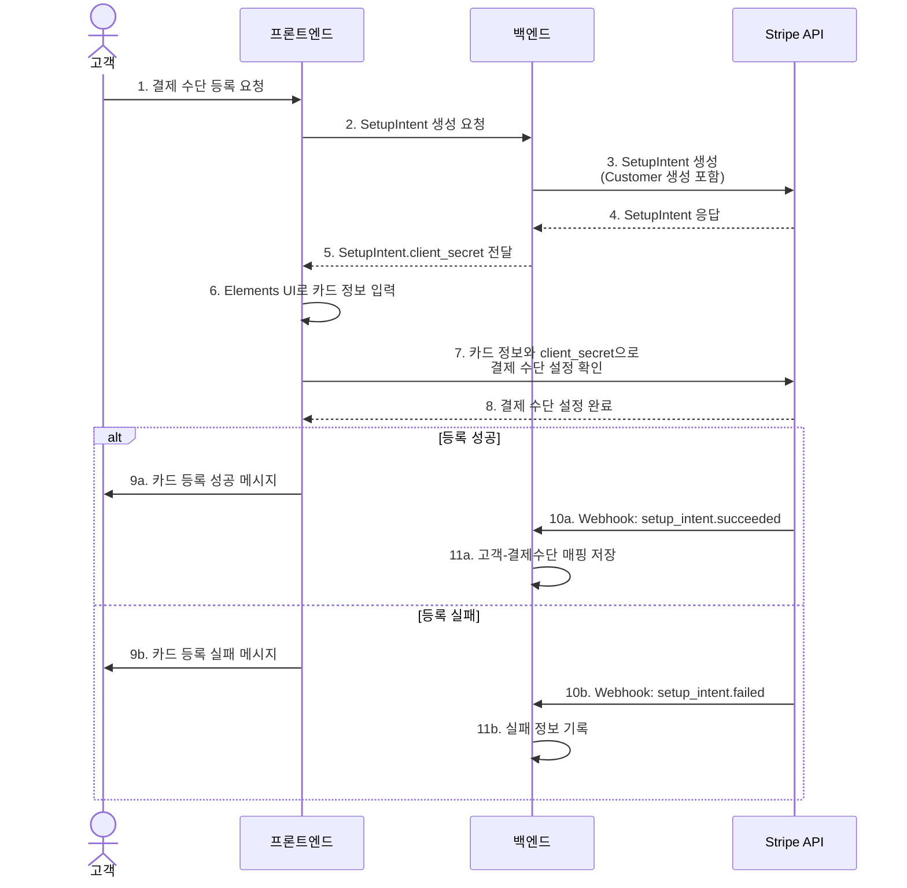
```mermaid
sequenceDiagram
    actor 고객
    participant FE as 프론트엔드
    participant BE as 백엔드
    participant Stripe as Stripe API

    고객->>FE: 1. 결제 수단 등록 요청
    FE->>BE: 2. SetupIntent 생성 요청
    BE->>Stripe: 3. SetupIntent 생성<br/>(Customer 생성 포함)
    Stripe-->>BE: 4. SetupIntent 응답
    BE-->>FE: 5. SetupIntent.client_secret 전달
    FE->>FE: 6. Elements UI로 카드 정보 입력
    FE->>Stripe: 7. 카드 정보와 client_secret으로<br/>결제 수단 설정 확인
    Stripe-->>FE: 8. 결제 수단 설정 완료

    alt 등록 성공
        FE->>고객: 9a. 카드 등록 성공 메시지
        Stripe->>BE: 10a. Webhook: setup_intent.succeeded
        BE->>BE: 11a. 고객-결제수단 매핑 저장
    else 등록 실패
        FE->>고객: 9b. 카드 등록 실패 메시지
        Stripe->>BE: 10b. Webhook: setup_intent.failed
        BE->>BE: 11b. 실패 정보 기록
    end
```

### 3.1.2 백엔드 구현: SetupIntent 생성

```javascript
/**
 * 결제 수단 등록을 위한 SetupIntent 생성 함수
 * @param organizationId 조직/고객 ID
 * @param options 추가 옵션
 * @returns 생성된 SetupIntent의 client_secret
 */
async function createSetupIntent(organizationId, options = {}) {
  // 조직 정보 조회
  const organization = await Organization.findById(organizationId);
  let customerId = organization?.stripe_customer_id;

  // 고객 ID가 없는 경우 새 고객 생성
  if (!customerId) {
    const customer = await stripe.customers.create({
      email: organization.email,
      name: organization.name,
      metadata: {
        organization_id: organizationId,
      },
    });

    customerId = customer.id;

    // 내부 DB에 고객 ID 저장
    await Organization.update({ id: organizationId }, { stripe_customer_id: customerId });
  }

  // SetupIntent 생성
  const setupIntent = await stripe.setupIntents.create({
    customer: customerId,
    payment_method_types: ['card'],
    usage: 'off_session', // 향후 자동 결제를 위함
    metadata: options.metadata || {},
  });

  return {
    client_secret: setupIntent.client_secret,
    customer_id: customerId,
  };
}
```

### 3.1.3 프론트엔드 구현: 카드 정보 수집 및 확인

```javascript
/**
 * 프론트엔드에서 카드 정보 수집 및 확인 함수
 * @param clientSecret SetupIntent의 client_secret
 * @param cardElement Stripe Elements로 생성한 카드 요소
 * @param billingDetails 청구 정보
 * @returns 등록 결과
 */
async function confirmCardSetup(clientSecret, cardElement, billingDetails) {
  try {
    const result = await stripe.confirmCardSetup(clientSecret, {
      payment_method: {
        card: cardElement,
        billing_details: billingDetails,
      },
    });

    if (result.error) {
      // 오류 처리
      console.error('카드 등록 오류:', result.error);
      return { success: false, error: result.error };
    }

    return {
      success: true,
      setupIntent: result.setupIntent,
      paymentMethodId: result.setupIntent.payment_method,
    };
  } catch (error) {
    console.error('카드 등록 중 예외 발생:', error);
    return { success: false, error };
  }
}
```

### 3.1.4 백엔드 구현: 결제 수단 저장

```javascript
/**
 * 등록된 결제 수단 저장 함수
 * @param organizationId 조직/고객 ID
 * @param paymentMethodId 결제 수단 ID
 * @returns 저장 결과
 */
async function savePaymentMethod(organizationId, paymentMethodId) {
  try {
    // Stripe에서 PaymentMethod 정보 조회
    const paymentMethod = await stripe.paymentMethods.retrieve(paymentMethodId);

    // 내부 DB에 결제 수단 정보 저장
    const savedMethod = await PaymentMethod.create({
      organization_id: organizationId,
      stripe_payment_method_id: paymentMethodId,
      type: paymentMethod.type,
      details: {
        brand: paymentMethod.card.brand,
        last4: paymentMethod.card.last4,
        exp_month: paymentMethod.card.exp_month,
        exp_year: paymentMethod.card.exp_year,
      },
      is_default: true, // 첫 결제 수단은 기본값으로 설정
    });

    // 기존 기본 결제 수단이 있다면 is_default 해제
    await PaymentMethod.updateMany({ organization_id: organizationId, id: { $ne: savedMethod.id }, is_default: true }, { is_default: false });

    return { success: true, paymentMethod: savedMethod };
  } catch (error) {
    logger.error(`결제 수단 저장 오류: ${error.message}`, error);
    throw error;
  }
}
```

### 3.1.5 설계 및 구현 시 주요 고려사항

1. **보안 강화**:

   - 카드 정보는 반드시 프론트엔드에서 직접 Stripe로 전송
   - API 키 노출 방지 (공개 키만 프론트엔드에서 사용)
   - SetupIntent의 client_secret 안전한 전달

2. **오류 처리**:

   - 카드 유효성 검증 실패
   - 네트워크 오류
   - 서버 오류

3. **사용자 경험**:

   - 실시간 카드 유효성 피드백
   - 처리 중 로딩 상태 표시
   - 명확한 성공/실패 메시지

4. **멱등성 보장**:
   - 중복 요청에 대한 처리
   - 웹훅 중복 이벤트 처리

### 3.1.6 서버에서 결제 수단 변경 처리

결제 수단 변경은 카드 만료, 분실, 도난, 정보 변경 등의 이유로 사용자가 기존 등록된 결제 수단을 변경해야 할 때 발생한다. 특히 구독 모델에서는 결제 수단 갱신이 중요한 흐름이다.

#### 3.1.6.1 결제 수단 변경 흐름 다이어그램

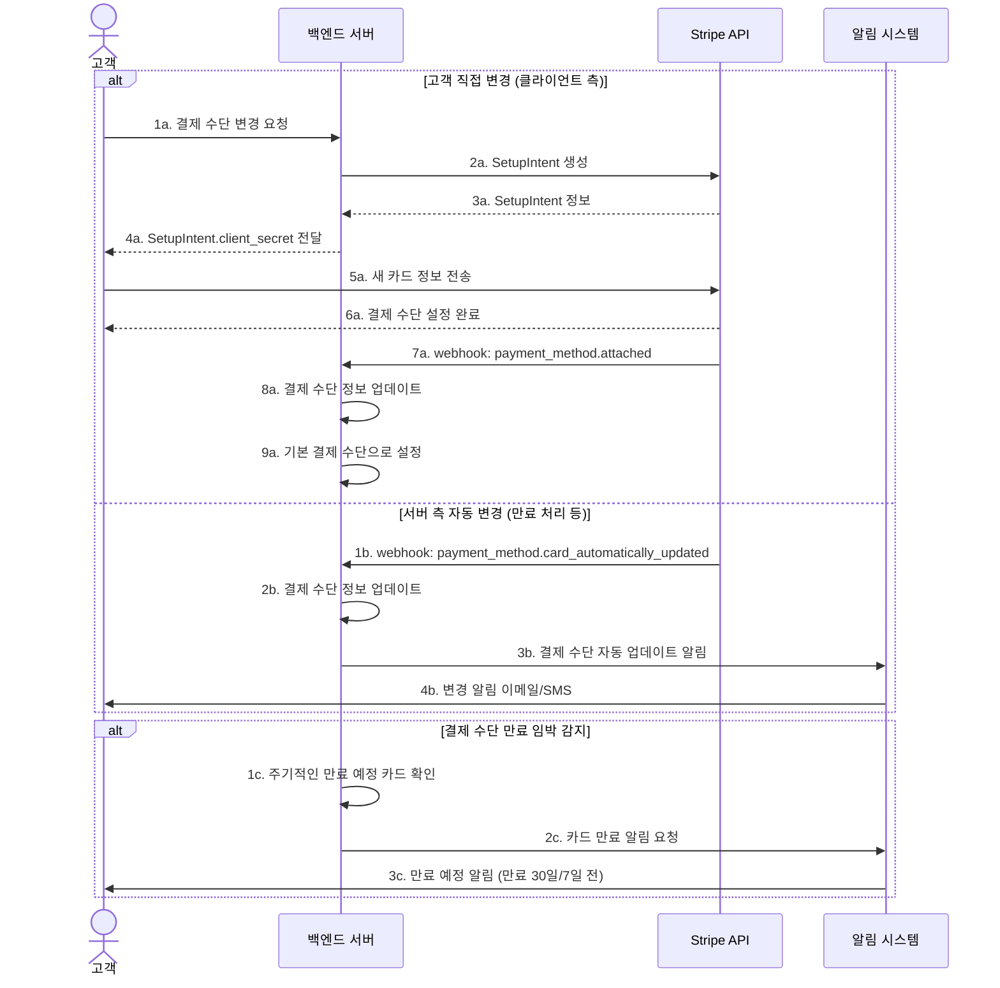
```mermaid
sequenceDiagram
    actor 고객
    participant BE as 백엔드 서버
    participant Stripe as Stripe API
    participant NotificationSystem as 알림 시스템

    alt 고객 직접 변경 (클라이언트 측)
        고객->>BE: 1a. 결제 수단 변경 요청
        BE->>Stripe: 2a. SetupIntent 생성
        Stripe-->>BE: 3a. SetupIntent 정보
        BE-->>고객: 4a. SetupIntent.client_secret 전달
        고객->>Stripe: 5a. 새 카드 정보 전송
        Stripe-->>고객: 6a. 결제 수단 설정 완료
        Stripe->>BE: 7a. webhook: payment_method.attached
        BE->>BE: 8a. 결제 수단 정보 업데이트
        BE->>BE: 9a. 기본 결제 수단으로 설정
    else 서버 측 자동 변경 (만료 처리 등)
        Stripe->>BE: 1b. webhook: payment_method.card_automatically_updated
        BE->>BE: 2b. 결제 수단 정보 업데이트
        BE->>NotificationSystem: 3b. 결제 수단 자동 업데이트 알림
        NotificationSystem->>고객: 4b. 변경 알림 이메일/SMS
    end

    alt 결제 수단 만료 임박 감지
        BE->>BE: 1c. 주기적인 만료 예정 카드 확인
        BE->>NotificationSystem: 2c. 카드 만료 알림 요청
        NotificationSystem->>고객: 3c. 만료 예정 알림 (만료 30일/7일 전)
    end
```

#### 3.1.6.2 백엔드 구현: 결제 수단 변경 및 기본 결제 수단 업데이트

```javascript
/**
 * 사용자 결제 수단 변경 처리 함수
 * @param customerId Stripe 고객 ID
 * @param newPaymentMethodId 새 결제 수단 ID
 * @param options 추가 옵션
 * @returns 처리 결과
 */
async function updateDefaultPaymentMethod(customerId, newPaymentMethodId, options = {}) {
  try {
    // 1. 결제 수단이 이미 고객에게 연결되어 있는지 확인
    const paymentMethod = await stripe.paymentMethods.retrieve(newPaymentMethodId);

    // 2. 다른 고객에게 연결된 경우 분리 후 재연결
    if (paymentMethod.customer && paymentMethod.customer !== customerId) {
      await stripe.paymentMethods.detach(newPaymentMethodId);
      await stripe.paymentMethods.attach(newPaymentMethodId, {
        customer: customerId,
      });
    }
    // 연결되지 않은 경우 새로 연결
    else if (!paymentMethod.customer) {
      await stripe.paymentMethods.attach(newPaymentMethodId, {
        customer: customerId,
      });
    }

    // 3. 기본 결제 수단으로 설정
    await stripe.customers.update(customerId, {
      invoice_settings: {
        default_payment_method: newPaymentMethodId,
      },
    });

    // 4. 내부 DB에 결제 수단 정보 업데이트
    const organizationId = await findOrganizationByCustomerId(customerId);
    if (organizationId) {
      // 기존 기본 결제 수단 찾기
      const currentDefaultMethod = await PaymentMethod.findOne({
        organization_id: organizationId,
        is_default: true,
      });

      // 기존 기본 결제 수단 기본 상태 해제
      if (currentDefaultMethod && currentDefaultMethod.stripe_payment_method_id !== newPaymentMethodId) {
        await PaymentMethod.findByIdAndUpdate(currentDefaultMethod.id, {
          is_default: false,
          updated_at: new Date(),
        });
      }

      // 새 결제 수단 정보 업데이트 또는 생성
      const existingMethod = await PaymentMethod.findOne({
        stripe_payment_method_id: newPaymentMethodId,
      });

      if (existingMethod) {
        // 기존 결제 수단 업데이트
        await PaymentMethod.findByIdAndUpdate(existingMethod.id, {
          is_default: true,
          details: {
            brand: paymentMethod.card.brand,
            last4: paymentMethod.card.last4,
            exp_month: paymentMethod.card.exp_month,
            exp_year: paymentMethod.card.exp_year,
          },
          updated_at: new Date(),
        });
      } else {
        // 새 결제 수단 생성
        await PaymentMethod.create({
          organization_id: organizationId,
          stripe_payment_method_id: newPaymentMethodId,
          type: paymentMethod.type,
          details: {
            brand: paymentMethod.card.brand,
            last4: paymentMethod.card.last4,
            exp_month: paymentMethod.card.exp_month,
            exp_year: paymentMethod.card.exp_year,
          },
          is_default: true,
          created_at: new Date(),
        });
      }
    }

    // 5. 구독이 있는 경우 결제 수단 업데이트
    if (options.updateSubscriptions) {
      await updateSubscriptionsPaymentMethod(customerId, newPaymentMethodId);
    }

    return {
      success: true,
      customer: customerId,
      payment_method: newPaymentMethodId,
    };
  } catch (error) {
    logger.error(`결제 수단 변경 오류: ${error.message}`, error);
    throw error;
  }
}

/**
 * 구독의 결제 수단 업데이트 함수
 * @param customerId Stripe 고객 ID
 * @param paymentMethodId 결제 수단 ID
 */
async function updateSubscriptionsPaymentMethod(customerId, paymentMethodId) {
  // 고객의 활성 구독 조회
  const subscriptions = await stripe.subscriptions.list({
    customer: customerId,
    status: 'active',
    expand: ['data.default_payment_method'],
  });

  // 각 구독의 기본 결제 수단 업데이트
  for (const subscription of subscriptions.data) {
    // 구독에 결제 수단 직접 설정
    await stripe.subscriptions.update(subscription.id, {
      default_payment_method: paymentMethodId,
    });
  }

  return {
    success: true,
    updated_count: subscriptions.data.length,
  };
}
```

#### 3.1.6.3 웹훅 핸들러: 결제 수단 자동 업데이트 처리

```javascript
/**
 * 결제 수단 자동 업데이트 웹훅 처리 함수
 * payment_method.card_automatically_updated 이벤트 처리
 * @param event Stripe 웹훅 이벤트
 */
async function handlePaymentMethodAutomaticallyUpdated(event) {
  const paymentMethod = event.data.object;
  const previousAttributes = event.data.previous_attributes;

  try {
    // 내부 DB에서 결제 수단 정보 조회
    const dbPaymentMethod = await PaymentMethod.findOne({
      stripe_payment_method_id: paymentMethod.id,
    });

    if (!dbPaymentMethod) {
      logger.warn(`자동 업데이트된 결제 수단 찾을 수 없음: ${paymentMethod.id}`);
      return { success: false, error: 'payment_method_not_found' };
    }

    // 결제 수단 정보 업데이트
    await PaymentMethod.findByIdAndUpdate(dbPaymentMethod.id, {
      details: {
        brand: paymentMethod.card.brand,
        last4: paymentMethod.card.last4,
        exp_month: paymentMethod.card.exp_month,
        exp_year: paymentMethod.card.exp_year,
      },
      updated_at: new Date(),
      automatically_updated: true,
    });

    // 조직 정보 조회
    const organization = await Organization.findById(dbPaymentMethod.organization_id);

    // 사용자에게 결제 수단 자동 업데이트 알림
    if (organization) {
      await notificationService.sendPaymentMethodUpdatedNotification({
        email: organization.email,
        paymentMethod: {
          last4: paymentMethod.card.last4,
          brand: paymentMethod.card.brand,
          expMonth: paymentMethod.card.exp_month,
          expYear: paymentMethod.card.exp_year,
        },
        previousDetails: {
          expMonth: previousAttributes.card?.exp_month,
          expYear: previousAttributes.card?.exp_year,
        },
      });
    }

    return { success: true };
  } catch (error) {
    logger.error(`결제 수단 자동 업데이트 처리 오류: ${error.message}`, error);
    throw error;
  }
}
```

#### 3.1.6.4 만료 예정 결제 수단 감지 및 알림

```javascript
/**
 * 만료 예정 결제 수단 확인 및 알림 함수
 * 배치 작업으로 실행 (예: 매일)
 */
async function checkExpiringPaymentMethods() {
  const now = new Date();
  const currentMonth = now.getMonth() + 1; // 0-based to 1-based
  const currentYear = now.getFullYear();

  try {
    // 30일 이내 만료 예정 결제 수단 조회
    const expiringMethods = await PaymentMethod.find({
      'details.exp_year': currentYear,
      'details.exp_month': { $gte: currentMonth, $lte: currentMonth + 1 },
      notified_expiration: { $ne: true },
    }).populate('organization_id');

    logger.info(`만료 예정 결제 수단 ${expiringMethods.length}개 발견`);

    // 각 결제 수단별 알림 처리
    for (const method of expiringMethods) {
      const organization = method.organization_id;

      if (!organization || !organization.email) {
        logger.warn(`결제 수단 ${method.id}의 조직 정보 누락`);
        continue;
      }

      // 만료 알림 발송
      await notificationService.sendPaymentMethodExpiringNotification({
        email: organization.email,
        paymentMethod: {
          id: method.stripe_payment_method_id,
          last4: method.details.last4,
          brand: method.details.brand,
          expMonth: method.details.exp_month,
          expYear: method.details.exp_year,
        },
        daysUntilExpiration: calculateDaysUntilExpiration(method.details.exp_month, method.details.exp_year),
        updateUrl: `${config.appUrl}/account/payment-methods?action=update&id=${method.stripe_payment_method_id}`,
      });

      // 알림 상태 업데이트
      await PaymentMethod.findByIdAndUpdate(method.id, {
        notified_expiration: true,
        notified_at: new Date(),
      });
    }

    return { success: true, notified_count: expiringMethods.length };
  } catch (error) {
    logger.error(`만료 예정 결제 수단 처리 오류: ${error.message}`, error);
    throw error;
  }
}
```

#### 3.1.6.5 API 엔드포인트: 결제 수단 변경 요청 처리

```javascript
/**
 * 결제 수단 변경 API 엔드포인트 핸들러
 */
async function handleUpdatePaymentMethodRequest(req, res) {
  try {
    const { customerId, paymentMethodId } = req.body;

    // 요청 유효성 검증
    if (!customerId || !paymentMethodId) {
      return res.status(400).json({ error: 'customer_id와 payment_method_id가 필요합니다.' });
    }

    // 권한 검증 (고객 ID가 현재 사용자와 연결되어 있는지)
    const hasAccess = await verifyCustomerAccess(req.user.id, customerId);
    if (!hasAccess) {
      return res.status(403).json({ error: '권한이 없습니다.' });
    }

    // 결제 수단 업데이트 처리
    const result = await updateDefaultPaymentMethod(customerId, paymentMethodId, {
      updateSubscriptions: true, // 연결된 구독도 함께 업데이트
    });

    // 성공 응답
    return res.status(200).json({
      success: true,
      customer: result.customer,
      payment_method: result.payment_method,
    });
  } catch (error) {
    logger.error(`결제 수단 변경 요청 처리 오류: ${error.message}`, error);

    // 오류 응답
    return res.status(500).json({
      error: '결제 수단 변경 중 오류가 발생했습니다.',
      message: error.message,
    });
  }
}
```

#### 3.1.6.6 결제 수단 변경 시 주요 고려사항

1. **구독 연속성 보장**:

   - 자동 갱신 구독이 있는 경우 결제 실패 방지를 위해 모든 구독의 결제 수단 정보도 함께 업데이트
   - Stripe의 기본 결제 수단과 각 구독별 결제 수단 설정을 모두 고려

2. **자동 업데이트 처리**:

   - 카드 정보가 자동으로 업데이트되는 경우(예: 카드 교체) 처리 로직 구현
   - 고객에게 자동 업데이트 완료 알림 제공

3. **만료 관리**:

   - 사전 알림 발송으로 만료 전 카드 업데이트 유도
   - 만료 시점별 알림 단계 설정 (30일 전, 7일 전, 만료 당일)

4. **오류 처리**:

   - 결제 수단 변경 실패 시 명확한 오류 메시지 제공
   - 기존 결제 수단을 유지하여 서비스 중단 방지

5. **UI/UX 최적화**:

   - 결제 수단 관리 페이지에서 만료 상태 시각적 표시
   - 만료 임박/만료된 카드에 대한 즉각적인 업데이트 액션 버튼 제공

6. **다중 결제 수단 관리**:

   - 여러 결제 수단을 등록하고 전환할 수 있는 인터페이스
   - 기본 결제 수단 표시 및 손쉬운 변경 기능

7. **보안 고려사항**:
   - 결제 수단 변경 권한 엄격히 관리
   - 변경 시 확인 단계 추가 (이메일 확인 등)
   - 변경 이력 기록 및 모니터링

## 3.2 단건 결제 구현

단건 결제는 일회성 결제를 처리하기 위한 방식으로, 카드 정보 직접 입력 후 결제하는 흐름이다.

### 3.2.1 단건 결제 다이어그램

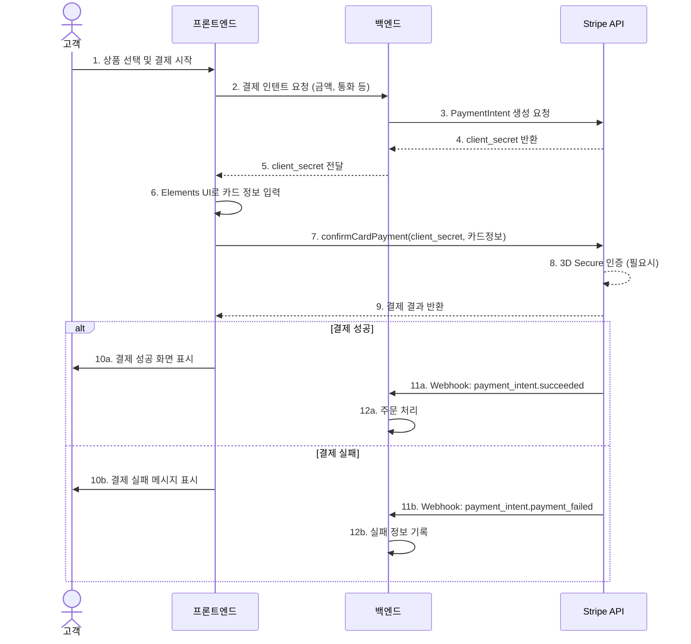
```mermaid
sequenceDiagram
    actor 고객
    participant FE as 프론트엔드
    participant BE as 백엔드
    participant Stripe as Stripe API

    고객->>FE: 1. 상품 선택 및 결제 시작
    FE->>BE: 2. 결제 인텐트 요청 (금액, 통화 등)
    BE->>Stripe: 3. PaymentIntent 생성 요청
    Stripe-->>BE: 4. client_secret 반환
    BE-->>FE: 5. client_secret 전달
    FE->>FE: 6. Elements UI로 카드 정보 입력
    FE->>Stripe: 7. confirmCardPayment(client_secret, 카드정보)
    Stripe-->>Stripe: 8. 3D Secure 인증 (필요시)
    Stripe-->>FE: 9. 결제 결과 반환

    alt 결제 성공
        FE->>고객: 10a. 결제 성공 화면 표시
        Stripe->>BE: 11a. Webhook: payment_intent.succeeded
        BE->>BE: 12a. 주문 처리
    else 결제 실패
        FE->>고객: 10b. 결제 실패 메시지 표시
        Stripe->>BE: 11b. Webhook: payment_intent.payment_failed
        BE->>BE: 12b. 실패 정보 기록
    end
```

### 3.2.2 백엔드 구현: PaymentIntent 생성

```javascript
/**
 * 단건 결제를 위한 PaymentIntent 생성 함수
 * @param amount 결제 금액 (최소 단위, 예: KRW의 경우 원)
 * @param currency 통화 코드 (예: KRW, USD)
 * @param organizationId 조직/고객 ID
 * @param options 추가 옵션
 * @returns 생성된 PaymentIntent의 client_secret
 */
async function createPaymentIntent(amount, currency, organizationId, options = {}) {
  try {
    // 통화에 따른 금액 조정 (필요시)
    const adjustedAmount = adjustAmountByCurrency(amount, currency);

    // 조직 정보 조회
    const organization = await Organization.findById(organizationId);
    const customerId = organization?.stripe_customer_id;

    // PaymentIntent 생성 파라미터
    const params = {
      amount: adjustedAmount,
      currency,
      description: options.description || null,
      metadata: {
        organization_id: organizationId,
        ...(options.metadata || {}),
      },
      // 자동 결제 방지 (3DS 등)를 위한 설정
      automatic_payment_methods: {
        enabled: true,
        allow_redirects: 'always',
      },
    };

    // 고객 ID가 있는 경우 추가
    if (customerId) {
      params.customer = customerId;
    }

    // PaymentIntent 생성
    const paymentIntent = await stripe.paymentIntents.create(params);

    // 내부 DB에 결제 시도 기록 (선택사항)
    await Transaction.create({
      organization_id: organizationId,
      stripe_payment_intent_id: paymentIntent.id,
      amount: adjustedAmount,
      currency,
      status: 'pending',
      created_at: new Date(),
    });

    return {
      clientSecret: paymentIntent.client_secret,
      paymentIntentId: paymentIntent.id,
    };
  } catch (error) {
    logger.error(`PaymentIntent 생성 오류: ${error.message}`, error);
    throw error;
  }
}

// 통화에 따른 금액 조정 함수
function adjustAmountByCurrency(amount, currency) {
  // USD의 경우 센트 단위로 변환 (×100)
  if (currency === 'USD' && !Number.isInteger(amount * 100)) {
    return Math.round(amount * 100);
  }
  return amount;
}
```

### 3.2.3 프론트엔드 구현: 카드 결제 처리

```javascript
/**
 * 프론트엔드에서 카드 결제 처리 함수
 * @param clientSecret PaymentIntent의 client_secret
 * @param cardElement Stripe Elements로 생성한 카드 요소
 * @param billingDetails 청구 정보
 * @returns 결제 결과
 */
async function confirmCardPayment(clientSecret, cardElement, billingDetails) {
  try {
    setProcessing(true); // UI 상태 업데이트

    const result = await stripe.confirmCardPayment(clientSecret, {
      payment_method: {
        card: cardElement,
        billing_details: billingDetails,
      },
    });

    if (result.error) {
      // 오류 처리
      console.error('결제 오류:', result.error);
      return { success: false, error: result.error };
    }

    if (result.paymentIntent.status === 'succeeded') {
      // 결제 성공
      return {
        success: true,
        paymentIntent: result.paymentIntent,
      };
    } else if (result.paymentIntent.status === 'requires_action') {
      // 추가 인증 필요 (3D Secure 등)
      const secureResult = await stripe.confirmCardPayment(clientSecret);

      if (secureResult.error) {
        return { success: false, error: secureResult.error };
      }

      return {
        success: true,
        paymentIntent: secureResult.paymentIntent,
      };
    }

    return {
      success: false,
      status: result.paymentIntent.status,
      message: '알 수 없는 결제 상태',
    };
  } catch (error) {
    console.error('결제 중 예외 발생:', error);
    return { success: false, error };
  } finally {
    setProcessing(false); // UI 상태 업데이트
  }
}
```

### 3.2.4 웹훅 처리: 결제 완료 처리

```javascript
/**
 * payment_intent.succeeded 웹훅 이벤트 처리 함수
 * @param event Stripe 웹훅 이벤트
 * @returns 처리 결과
 */
async function handlePaymentIntentSucceeded(event) {
  const paymentIntent = event.data.object;

  try {
    // 이미 처리된 이벤트인지 확인 (멱등성 보장)
    const existingTransaction = await Transaction.findOne({
      stripe_payment_intent_id: paymentIntent.id,
      status: 'succeeded',
    });

    if (existingTransaction) {
      logger.info(`이미 처리된 결제 이벤트: ${paymentIntent.id}`);
      return { success: true, alreadyProcessed: true };
    }

    // 트랜잭션 상태 업데이트
    const transaction = await Transaction.findOneAndUpdate(
      { stripe_payment_intent_id: paymentIntent.id },
      {
        status: 'succeeded',
        updated_at: new Date(),
        payment_method_id: await findInternalPaymentMethodId(paymentIntent.payment_method),
      },
      { new: true },
    );

    // 트랜잭션 레코드가 없는 경우 새로 생성
    if (!transaction) {
      const organizationId = paymentIntent.metadata?.organization_id || (await findOrganizationByCustomerId(paymentIntent.customer));

      await Transaction.create({
        organization_id: organizationId,
        stripe_payment_intent_id: paymentIntent.id,
        amount: paymentIntent.amount,
        currency: paymentIntent.currency,
        status: 'succeeded',
        payment_method_id: await findInternalPaymentMethodId(paymentIntent.payment_method),
        created_at: new Date(paymentIntent.created * 1000),
      });
    }

    // 추가 비즈니스 로직 (주문 처리, 알림 발송 등)
    await processOrder(paymentIntent);
    await sendPaymentConfirmationEmail(paymentIntent);

    return { success: true };
  } catch (error) {
    logger.error(`결제 성공 이벤트 처리 오류: ${error.message}`, error);
    throw error;
  }
}
```

### 3.2.5 설계 및 구현 시 주요 고려사항

1. **보안 강화**:

   - 카드 정보는 백엔드를 거치지 않고 직접 Stripe로 전송
   - HTTPS 통신 보장
   - PaymentIntent의 client_secret 안전한 전달

2. **사용자 경험**:

   - 3D Secure 인증 처리
   - 처리 중 로딩 상태 표시
   - 다양한 결제 에러에 대한 명확한 메시지

3. **통화 처리**:

   - 통화별 금액 단위 처리 (예: USD의 경우 센트 단위)
   - 국제 결제 지원 고려

4. **오류 복구**:
   - 결제 오류 시 재시도 메커니즘
   - 웹훅 실패 시 대응 전략

## 3.3 저장된 결제 수단으로 결제 구현

저장된 결제 수단(Payment Method)을 이용한 단건 결제는 이미 결제 정보가 등록된 고객에게 편리한 결제 경험을 제공한다. 이 방식은 두 단계로 구성된다: 1) 결제 수단 등록, 2) 저장된 결제 수단으로 결제 처리.

### 3.3.1 저장된 결제 수단으로 결제 흐름

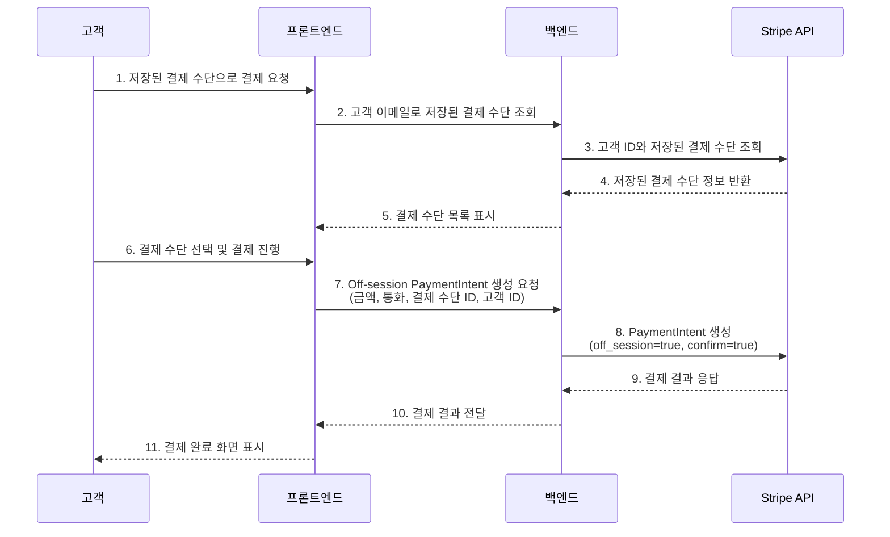
```mermaid
sequenceDiagram
    participant 고객 as 고객
    participant FE as 프론트엔드
    participant BE as 백엔드
    participant Stripe as Stripe API

    %% 저장된 결제 수단으로 결제 단계
    고객->>FE: 1. 저장된 결제 수단으로 결제 요청
    FE->>BE: 2. 고객 이메일로 저장된 결제 수단 조회
    BE->>Stripe: 3. 고객 ID와 저장된 결제 수단 조회
    Stripe-->>BE: 4. 저장된 결제 수단 정보 반환
    BE-->>FE: 5. 결제 수단 목록 표시
    고객->>FE: 6. 결제 수단 선택 및 결제 진행
    FE->>BE: 7. Off-session PaymentIntent 생성 요청<br/>(금액, 통화, 결제 수단 ID, 고객 ID)
    BE->>Stripe: 8. PaymentIntent 생성<br/>(off_session=true, confirm=true)
    Stripe-->>BE: 9. 결제 결과 응답
    BE-->>FE: 10. 결제 결과 전달
    FE-->>고객: 11. 결제 완료 화면 표시
```

### 3.3.2 백엔드 구현: Off-session PaymentIntent 생성

```javascript
/**
 * 저장된 결제 수단으로 결제하는 PaymentIntent 생성 함수
 * @param organizationId 조직/고객 ID
 * @param amount 결제 금액
 * @param currency 통화 코드
 * @param paymentMethodId 저장된 결제 수단 ID
 * @param options 추가 옵션
 * @returns 생성된 PaymentIntent 객체
 */
async function createOffSessionPaymentIntent(organizationId, amount, currency, paymentMethodId, options = {}) {
  // 조직 정보 조회
  const organization = await Organization.findById(organizationId);
  if (!organization || !organization.stripe_customer_id) {
    throw new Error('고객 ID가 필요합니다.');
  }

  try {
    // Off-session PaymentIntent 생성
    const paymentIntent = await stripe.paymentIntents.create({
      amount,
      currency,
      customer: organization.stripe_customer_id,
      payment_method: paymentMethodId,
      off_session: true, // 중요: 저장된 결제 수단 사용 표시
      confirm: true, // 즉시 결제 승인 시도
      description: options.description || null,
      metadata: options.metadata || {},
    });

    // 내부 DB에 트랜잭션 기록
    await Transaction.create({
      organization_id: organizationId,
      stripe_payment_intent_id: paymentIntent.id,
      amount,
      currency,
      status: paymentIntent.status,
      payment_method_id: await findInternalPaymentMethodId(paymentMethodId),
      created_at: new Date(paymentIntent.created * 1000),
    });

    return paymentIntent;
  } catch (error) {
    logger.error(`Off-session 결제 생성 오류: ${error.message}`, error);

    // 적절한 오류 메시지 생성
    let errorMessage = '저장된 결제 수단으로 결제 생성 중 오류가 발생했습니다.';
    if (error.code === 'authentication_required') {
      errorMessage = '추가 인증이 필요합니다. 다른 결제 수단을 사용하거나 일반 결제를 시도하세요.';
    } else if (error.code === 'card_declined') {
      errorMessage = '카드가 거절되었습니다. 다른 결제 수단을 사용해주세요.';
    }

    throw new Error(errorMessage);
  }
}
```

### 3.3.3 프론트엔드 구현: 결제 수단 조회 및 결제 처리

```javascript
/**
 * 저장된 결제 수단 조회 함수
 * @param customerEmail 고객 이메일
 * @returns 저장된 결제 수단 목록 및 고객 ID
 */
async function fetchCustomerPaymentMethods(customerEmail) {
  try {
    // 고객 이메일로 저장된 결제 수단 조회
    const { data } = await apiClient.get(`/api/customers/${customerEmail}/payment-methods`);

    // 고객 ID가 응답에 없는 경우 추가 조회
    if (!data.customerId) {
      // 고객 이메일로 고객 정보 조회
      const customersResponse = await apiClient.get('/api/customers');
      const customer = customersResponse.data.customers.find((c) => c.email === customerEmail);
      if (customer) {
        data.customerId = customer.id;
      }
    }

    return {
      paymentMethods: data.data || [],
      customerId: data.customerId,
    };
  } catch (error) {
    console.error('결제 수단 조회 오류:', error);
    throw new Error('저장된 결제 수단을 조회하는 중 오류가 발생했습니다.');
  }
}

/**
 * 저장된 결제 수단으로 결제 함수
 * @param amount 금액
 * @param currency 통화
 * @param paymentMethodId 결제 수단 ID
 * @param customerId 고객 ID
 * @param description 설명
 * @returns 결제 결과
 */
async function processOffSessionPayment(amount, currency, paymentMethodId, customerId, description = null) {
  try {
    // 서버에 off-session 결제 요청
    const response = await apiClient.post('/api/payments/intent/off-session', {
      amount,
      currency,
      payment_method_id: paymentMethodId,
      customer_id: customerId,
      description,
    });

    return {
      success: true,
      paymentIntent: response.data,
    };
  } catch (error) {
    console.error('결제 오류:', error);

    // 오류 응답 처리
    let errorMessage = '결제 처리 중 오류가 발생했습니다.';
    if (error.response) {
      // 서버에서 반환한 오류 메시지 사용
      errorMessage = error.response.data.message || error.response.data.error || errorMessage;
    }

    return {
      success: false,
      error: errorMessage,
    };
  }
}
```

### 3.3.4 설계 및 구현 시 주요 고려사항

1. **고객-결제 수단 조회 최적화**:

   - 고객 이메일만으로 결제 수단을 조회할 수 있도록 API 설계
   - 응답에 고객 ID를 포함하여 추가 조회 없이 결제 처리 가능하게 함
   - 고객 ID가 응답에 없는 경우 고객 목록 API 호출로 대체하는 fallback 로직 구현

2. **서버 측 결제 처리의 이점**:

   - 카드 정보가 프론트엔드에 노출되지 않음
   - 3D Secure 인증이 필요 없는 대부분의 결제를 빠르게 처리
   - 실패한 결제에 대한 상세한 로깅 및 오류 처리 가능

3. **off_session 파라미터 처리**:

   - 프론트엔드 요청에서는 `off_session` 파라미터를 명시적으로 전송하지 않음
   - 백엔드에서 저장된 결제 수단으로 결제 시 항상 `off_session: true` 설정
   - 이는 API 명세를 단순화하고 혼란을 방지하기 위함

4. **오류 처리 전략**:

   - 카드 인증 필요(`authentication_required`) 오류: 사용자에게 대체 결제 방법 안내
   - 카드 거절(`card_declined`) 오류: 다른 결제 수단 사용 권장
   - 고객 ID 누락: 고객 조회 API를 통한 ID 조회 시도
   - 결제 수단 조회 실패: 명확한 오류 메시지로 사용자에게 안내

5. **보안 고려사항**:
   - 결제 요청 전 고객-결제 수단 소유권 검증
   - 결제 금액 및 통화에 대한 서버 측 유효성 검사
   - 모든 결제 시도에 대한 상세 로깅으로 이상 거래 탐지 지원

### 3.3.5 구현 체크리스트

- [ ] 결제 수단 등록 및 저장 기능 구현
- [ ] 고객 이메일로 결제 수단 조회 API 구현
- [ ] 고객 ID 조회 fallback 메커니즘 구현
- [ ] Off-session PaymentIntent 생성 API 구현
- [ ] 다양한 결제 오류 상황에 대한 처리 구현
- [ ] 결제 성공/실패 로깅 및 트랜잭션 기록
- [ ] 사용자 친화적인 오류 메시지 정의

## 3.4 구독 결제 구현

구독 결제는 정기적인 과금이 필요한 서비스에 적합한 결제 방식으로, Stripe Subscription API를 활용한다.

### 3.4.1 구독 결제 흐름

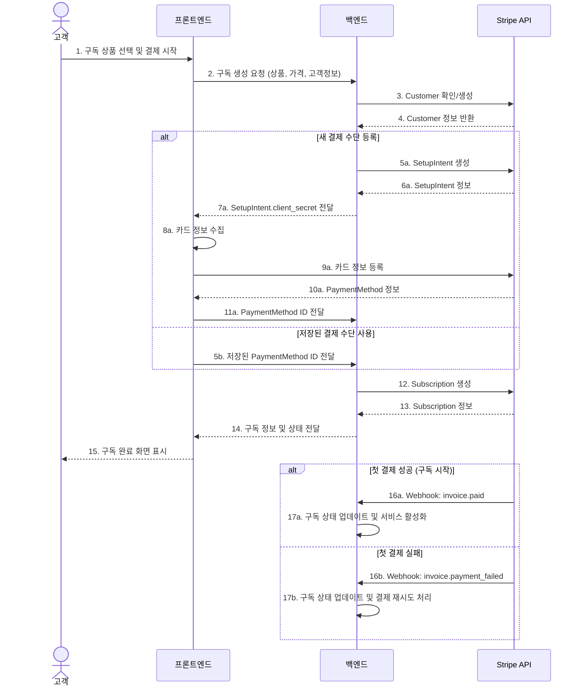
```mermaid
sequenceDiagram
    actor 고객
    participant FE as 프론트엔드
    participant BE as 백엔드
    participant Stripe as Stripe API

    고객->>FE: 1. 구독 상품 선택 및 결제 시작
    FE->>BE: 2. 구독 생성 요청 (상품, 가격, 고객정보)
    BE->>Stripe: 3. Customer 확인/생성
    Stripe-->>BE: 4. Customer 정보 반환
    alt 새 결제 수단 등록
        BE->>Stripe: 5a. SetupIntent 생성
        Stripe-->>BE: 6a. SetupIntent 정보
        BE-->>FE: 7a. SetupIntent.client_secret 전달
        FE->>FE: 8a. 카드 정보 수집
        FE->>Stripe: 9a. 카드 정보 등록
        Stripe-->>FE: 10a. PaymentMethod 정보
        FE->>BE: 11a. PaymentMethod ID 전달
    else 저장된 결제 수단 사용
        FE->>BE: 5b. 저장된 PaymentMethod ID 전달
    end
    BE->>Stripe: 12. Subscription 생성
    Stripe-->>BE: 13. Subscription 정보
    BE-->>FE: 14. 구독 정보 및 상태 전달
    FE-->>고객: 15. 구독 완료 화면 표시

    alt 첫 결제 성공 (구독 시작)
        Stripe->>BE: 16a. Webhook: invoice.paid
        BE->>BE: 17a. 구독 상태 업데이트 및 서비스 활성화
    else 첫 결제 실패
        Stripe->>BE: 16b. Webhook: invoice.payment_failed
        BE->>BE: 17b. 구독 상태 업데이트 및 결제 재시도 처리
    end
```

### 3.4.2 백엔드 구현: 구독 생성

```javascript
/**
 * 구독 생성 함수
 * @param organizationId 조직/고객 ID
 * @param priceId Stripe 가격 ID
 * @param paymentMethodId 결제 수단 ID
 * @param options 추가 옵션
 * @returns 생성된 구독 정보
 */
async function createSubscription(organizationId, priceId, paymentMethodId, options = {}) {
  // 조직 정보 조회
  const organization = await Organization.findById(organizationId);
  let customerId = organization?.stripe_customer_id;

  try {
    // 고객 ID가 없는 경우 새 고객 생성
    if (!customerId) {
      const customer = await stripe.customers.create({
        email: organization.email,
        name: organization.name,
        metadata: {
          organization_id: organizationId,
        },
      });

      customerId = customer.id;

      // 내부 DB에 고객 ID 저장
      await Organization.update({ id: organizationId }, { stripe_customer_id: customerId });
    }

    // 고객에 결제 수단 연결
    await stripe.paymentMethods.attach(paymentMethodId, {
      customer: customerId,
    });

    // 해당 결제 수단을 기본 결제 수단으로 설정
    await stripe.customers.update(customerId, {
      invoice_settings: {
        default_payment_method: paymentMethodId,
      },
    });

    // 구독 생성
    const subscription = await stripe.subscriptions.create({
      customer: customerId,
      items: [
        {
          price: priceId,
          quantity: options.quantity || 1,
        },
      ],
      payment_behavior: 'default_incomplete', // 첫 청구서 즉시 생성
      payment_settings: {
        payment_method_types: ['card'],
        save_default_payment_method: 'on_subscription',
      },
      expand: ['latest_invoice.payment_intent'],
      trial_period_days: options.trialDays || null,
      metadata: options.metadata || {},
    });

    // 내부 DB에 구독 기록
    await Subscription.create({
      organization_id: organizationId,
      stripe_subscription_id: subscription.id,
      status: subscription.status,
      current_period_start: new Date(subscription.current_period_start * 1000),
      current_period_end: new Date(subscription.current_period_end * 1000),
      stripe_price_id: priceId,
      quantity: options.quantity || 1,
      created_at: new Date(subscription.created * 1000),
    });

    return {
      subscription,
      // 결제가 필요한 경우 client_secret 포함
      clientSecret: subscription.latest_invoice?.payment_intent?.client_secret,
    };
  } catch (error) {
    logger.error(`구독 생성 오류: ${error.message}`, error);
    throw error;
  }
}
```

### 3.4.3 프론트엔드 구현: 구독 프로세스

```javascript
/**
 * 구독 결제 처리 함수
 * @param priceId Stripe 가격 ID
 * @param paymentMethodId 결제 수단 ID
 * @param organizationId 조직 ID
 * @param options 추가 옵션
 * @returns 구독 결과
 */
async function processSubscription(priceId, paymentMethodId, organizationId, options = {}) {
  try {
    // 서버에 구독 생성 요청
    const { data } = await apiClient.post('/api/subscriptions', {
      organization_id: organizationId,
      price_id: priceId,
      payment_method_id: paymentMethodId,
      quantity: options.quantity || 1,
      trial_days: options.trialDays || null,
      metadata: options.metadata || {},
    });

    // 즉시 결제가 필요한 경우 (clientSecret이 있는 경우)
    if (data.clientSecret) {
      const stripe = await loadStripe(STRIPE_PUBLIC_KEY);

      const { error } = await stripe.confirmCardPayment(data.clientSecret);

      if (error) {
        console.error('구독 결제 오류:', error);
        return { success: false, error };
      }
    }

    return {
      success: true,
      subscription: data.subscription,
    };
  } catch (error) {
    console.error('구독 처리 오류:', error);
    return { success: false, error };
  }
}
```

### 3.4.4 웹훅 처리: 구독 상태 관리

```javascript
/**
 * 구독 관련 웹훅 이벤트 처리 함수
 * @param event Stripe 웹훅 이벤트
 * @returns 처리 결과
 */
async function handleSubscriptionEvent(event) {
  const subscription = event.data.object;

  try {
    switch (event.type) {
      case 'customer.subscription.created':
        // 구독 생성 이벤트 처리
        await handleSubscriptionCreated(subscription);
        break;

      case 'customer.subscription.updated':
        // 구독 업데이트 이벤트 처리
        await handleSubscriptionUpdated(subscription);
        break;

      case 'customer.subscription.deleted':
        // 구독 삭제 이벤트 처리
        await handleSubscriptionDeleted(subscription);
        break;

      case 'invoice.paid':
        // 청구서 결제 이벤트 처리
        await handleInvoicePaid(event.data.object);
        break;

      case 'invoice.payment_failed':
        // 청구서 결제 실패 이벤트 처리
        await handleInvoicePaymentFailed(event.data.object);
        break;
    }

    return { success: true };
  } catch (error) {
    logger.error(`구독 이벤트 처리 오류: ${error.message}`, error);
    throw error;
  }
}

/**
 * 구독 업데이트 처리 함수
 * @param subscription Stripe 구독 객체
 */
async function handleSubscriptionUpdated(subscription) {
  try {
    // 내부 DB의 구독 정보 업데이트
    await Subscription.findOneAndUpdate(
      { stripe_subscription_id: subscription.id },
      {
        status: subscription.status,
        current_period_start: new Date(subscription.current_period_start * 1000),
        current_period_end: new Date(subscription.current_period_end * 1000),
        updated_at: new Date(),
        canceled_at: subscription.canceled_at ? new Date(subscription.canceled_at * 1000) : null,
      },
    );

    // 적절한 비즈니스 로직 실행
    if (subscription.status === 'active') {
      await activateSubscriptionServices(subscription);
    } else if (subscription.status === 'past_due') {
      await handlePastDueSubscription(subscription);
    } else if (subscription.status === 'canceled') {
      await deactivateSubscriptionServices(subscription);
    }
  } catch (error) {
    logger.error(`구독 업데이트 처리 오류: ${error.message}`, error);
    throw error;
  }
}
```

### 3.4.5 구독 변경 및 업그레이드/다운그레이드 구현

구독 변경(플랜 업그레이드/다운그레이드)은 SaaS 서비스에서 사용자 니즈 변화에 대응하기 위한 핵심 기능이다. 주요 구현 사항으로는 플랜 변경 시 일할 계산(proration)과 요금 조정이 포함된다.

#### 3.4.5.1 구독 변경 흐름

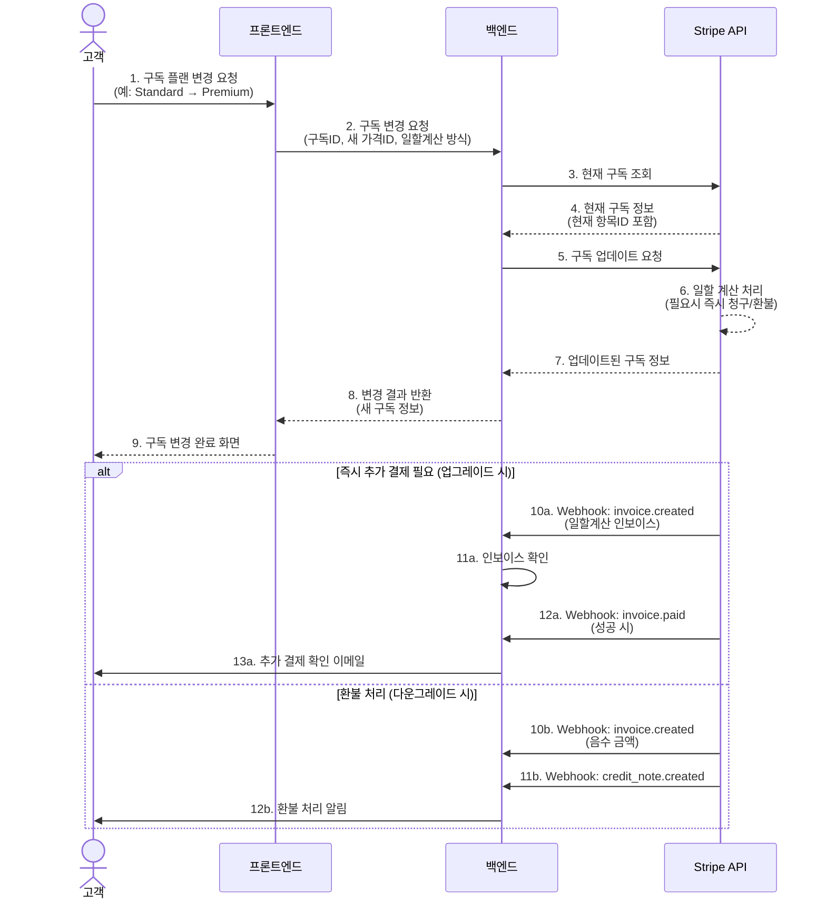
```mermaid
sequenceDiagram
    actor 고객
    participant FE as 프론트엔드
    participant BE as 백엔드
    participant Stripe as Stripe API

    고객->>FE: 1. 구독 플랜 변경 요청<br/>(예: Standard → Premium)
    FE->>BE: 2. 구독 변경 요청<br/>(구독ID, 새 가격ID, 일할계산 방식)
    BE->>Stripe: 3. 현재 구독 조회
    Stripe-->>BE: 4. 현재 구독 정보<br/>(현재 항목ID 포함)
    BE->>Stripe: 5. 구독 업데이트 요청
    Stripe-->>Stripe: 6. 일할 계산 처리<br/>(필요시 즉시 청구/환불)
    Stripe-->>BE: 7. 업데이트된 구독 정보
    BE-->>FE: 8. 변경 결과 반환<br/>(새 구독 정보)
    FE-->>고객: 9. 구독 변경 완료 화면

    alt 즉시 추가 결제 필요 (업그레이드 시)
        Stripe->>BE: 10a. Webhook: invoice.created<br/>(일할계산 인보이스)
        BE->>BE: 11a. 인보이스 확인
        Stripe->>BE: 12a. Webhook: invoice.paid<br/>(성공 시)
        BE->>고객: 13a. 추가 결제 확인 이메일
    else 환불 처리 (다운그레이드 시)
        Stripe->>BE: 10b. Webhook: invoice.created<br/>(음수 금액)
        Stripe->>BE: 11b. Webhook: credit_note.created
        BE->>고객: 12b. 환불 처리 알림
    end
```

#### 3.4.5.2 백엔드 구현: 구독 변경 함수

```javascript
/**
 * 구독 변경 함수 (업그레이드/다운그레이드)
 * @param subscriptionId 변경할 구독 ID
 * @param newPriceId 새 가격 ID
 * @param options 추가 옵션
 * @returns 변경된 구독 정보
 */
async function changeSubscription(subscriptionId, newPriceId, options = {}) {
  try {
    // 1. 현재 구독 정보 조회
    const subscription = await stripe.subscriptions.retrieve(subscriptionId);

    // 2. 현재 구독 항목 ID 추출 (일반적으로 첫 번째 항목)
    const currentItemId = subscription.items.data[0].id;

    // 3. 구독 업데이트 파라미터 구성
    const updateParams = {
      // 항목 변경 설정
      items: [
        {
          id: currentItemId, // 기존 항목 ID (변경 대상)
          price: newPriceId, // 새 가격 ID
        },
      ],
      // 일할 계산 처리 방식
      proration_behavior: options.prorationBehavior || 'create_prorations',
      // 결제 처리 방식 (즉시 인보이스 생성 및 결제)
      payment_behavior: options.paymentBehavior || 'pending_if_incomplete',
      // 추가 메타데이터
      metadata: {
        ...subscription.metadata,
        changed_at: new Date().toISOString(),
        previous_price_id: subscription.items.data[0].price.id,
        ...(options.metadata || {}),
      },
    };

    // 4. 구독 업데이트 실행
    const updatedSubscription = await stripe.subscriptions.update(subscriptionId, updateParams);

    // 5. 내부 DB 업데이트
    await Subscription.findOneAndUpdate(
      { stripe_subscription_id: subscriptionId },
      {
        stripe_price_id: newPriceId,
        status: updatedSubscription.status,
        current_period_start: new Date(updatedSubscription.current_period_start * 1000),
        current_period_end: new Date(updatedSubscription.current_period_end * 1000),
        updated_at: new Date(),
      },
    );

    // 6. 관련 인보이스 확인 (일할 계산으로 인한 추가 인보이스)
    let invoice = null;
    if (updateParams.proration_behavior === 'create_prorations') {
      try {
        // 최신 인보이스 조회
        const invoices = await stripe.invoices.list({
          subscription: subscriptionId,
          limit: 1,
        });

        if (invoices.data.length > 0) {
          invoice = invoices.data[0];
        }
      } catch (invoiceError) {
        logger.warn(`구독 변경 인보이스 조회 실패: ${invoiceError.message}`);
      }
    }

    return {
      subscription: updatedSubscription,
      invoice,
      changed_from: subscription.items.data[0].price.id,
      changed_to: newPriceId,
    };
  } catch (error) {
    logger.error(`구독 변경 오류: ${error.message}`, error);
    throw error;
  }
}
```

#### 3.4.5.3 프론트엔드 구현: 플랜 변경 UI

```jsx
/**
 * 구독 플랜 변경 컴포넌트
 */
function SubscriptionUpgrade({ currentSubscription, availablePlans }) {
  const [isLoading, setIsLoading] = useState(false);
  const [selectedPlan, setSelectedPlan] = useState(null);
  const [prorationPreview, setProrationPreview] = useState(null);

  // 플랜 변경 시 일할 계산 미리보기
  const handlePlanChange = async (plan) => {
    setSelectedPlan(plan);

    try {
      // 서버에 일할 계산 미리보기 요청
      const { data } = await apiClient.get('/api/subscriptions/preview-change', {
        params: {
          subscription_id: currentSubscription.id,
          new_price_id: plan.id,
        },
      });

      setProrationPreview(data);
    } catch (error) {
      console.error('미리보기 오류:', error);
    }
  };

  // 구독 변경 실행
  const handleUpgrade = async () => {
    if (!selectedPlan) return;

    setIsLoading(true);

    try {
      const { data } = await apiClient.post('/api/subscriptions/change', {
        subscription_id: currentSubscription.id,
        new_price_id: selectedPlan.id,
        proration_behavior: 'create_prorations', // 일할 계산 즉시 적용
      });

      // 변경 성공 처리
      toast.success('구독 플랜이 성공적으로 변경되었습니다.');
      router.push('/account/subscription'); // 구독 정보 페이지로 이동
    } catch (error) {
      console.error('구독 변경 오류:', error);
      toast.error('구독 변경 중 오류가 발생했습니다.');
    } finally {
      setIsLoading(false);
    }
  };

  return (
    <div className="subscription-upgrade">
      <h2>구독 플랜 변경</h2>
      <p>
        현재 플랜: <strong>{currentSubscription.plan.name}</strong>
      </p>

      <div className="plan-selection">
        {availablePlans.map((plan) => (
          <div key={plan.id} className={`plan-card ${selectedPlan?.id === plan.id ? 'selected' : ''}`} onClick={() => handlePlanChange(plan)}>
            <h3>{plan.name}</h3>
            <p className="price">
              {formatCurrency(plan.amount, plan.currency)}/{plan.interval}
            </p>
            <ul className="features">
              {plan.features.map((feature) => (
                <li key={feature}>{feature}</li>
              ))}
            </ul>
          </div>
        ))}
      </div>

      {prorationPreview && (
        <div className="proration-preview">
          <h4>변경 시 예상 금액</h4>
          {prorationPreview.amount_due > 0 ? (
            <p>추가 결제 금액: {formatCurrency(prorationPreview.amount_due, prorationPreview.currency)}</p>
          ) : prorationPreview.amount_due < 0 ? (
            <p>환불 예정 금액: {formatCurrency(Math.abs(prorationPreview.amount_due), prorationPreview.currency)}</p>
          ) : (
            <p>추가 금액 없음</p>
          )}

          <p className="next-billing">다음 정기 결제일: {formatDate(prorationPreview.next_billing_date)}</p>
        </div>
      )}

      <button className="upgrade-button" disabled={!selectedPlan || isLoading} onClick={handleUpgrade}>
        {isLoading ? '처리 중...' : '플랜 변경하기'}
      </button>
    </div>
  );
}
```

#### 3.4.5.4 일할 계산(Proration) 옵션 이해하기

Stripe는 구독 변경 시 다양한 일할 계산 방식을 제공한다:

1. **`create_prorations`** (기본값):

   - 즉시 일할 계산을 적용하여 인보이스 생성
   - 업그레이드 시: 추가 금액 즉시 청구
   - 다운그레이드 시: 차액 환불 또는 크레딧 발행

2. **`none`**:

   - 일할 계산 없이 다음 결제 주기부터 새 가격 적용
   - 현재 주기는 기존 가격으로 유지

3. **`always_invoice`**:
   - 항상 별도 인보이스 생성
   - 업그레이드/다운그레이드 모두 새 인보이스 발행

#### 3.4.5.5 구독 변경 시 주요 고려사항

1. **일할 계산 방식 선택**:

   - 일반적으로 업그레이드는 즉시 결제, 다운그레이드는 다음 주기 적용이 흔한 패턴
   - 사용자 경험과 비즈니스 모델에 맞는 방식 선택 필요

2. **이전 플랜 혜택 처리**:

   - 플랜 변경 시 이전 플랜 관련 리소스 및 기능 접근 권한 조정 로직 구현 필요
   - 특히 다운그레이드 시 초과 리소스 처리 방안 마련

3. **변경 기록 관리**:

   - 구독 변경 히스토리 기록 관리
   - 사용자가 변경 내역을 확인할 수 있는 UI 제공

4. **UI/UX 최적화**:

   - 플랜 비교 테이블로 명확한 차이점 시각화
   - 변경 전 최종 금액(추가 결제/환불) 미리보기 제공
   - 변경 절차 및 영향에 대한 명확한 안내

5. **알림 및 커뮤니케이션**:

   - 플랜 변경 전/후 이메일 알림 발송
   - 업그레이드 시 새로운 기능 안내
   - 다운그레이드 시 기능 제한 사항 안내

6. **결제 실패 처리**:
   - 업그레이드 시 추가 결제가 실패하는 경우의 대응 전략
   - 실패 시 원래 플랜으로 롤백 또는 재시도 메커니즘 구현

### 3.4.6 설계 및 구현 시 주요 고려사항

1. **구독 라이프사이클 관리**:

   - 구독 상태 변경 시 적절한 비즈니스 로직 실행
   - 구독 갱신, 업그레이드/다운그레이드, 취소 처리

2. **청구서 처리**:

   - 청구서 생성, 결제, 실패 이벤트 처리
   - 결제 실패 시 재시도 정책

3. **사용자 경험**:

   - 구독 상태에 따른 UI 상태 관리
   - 결제 실패 시 적절한 알림 제공

4. **구독 변경 처리**:
   - 플랜 변경 시 비례 요금 계산
   - 일시 중지, 재개 기능

## 3.5 사용량 기반 결제 구현

사용량 기반 결제는 클라우드 서비스, API 사용 등 실제 사용량에 따라 요금을 청구하는 방식으로, Stripe의 Usage 기반 가격 책정을 활용한다.

### 3.5.1 사용량 기반 결제 흐름

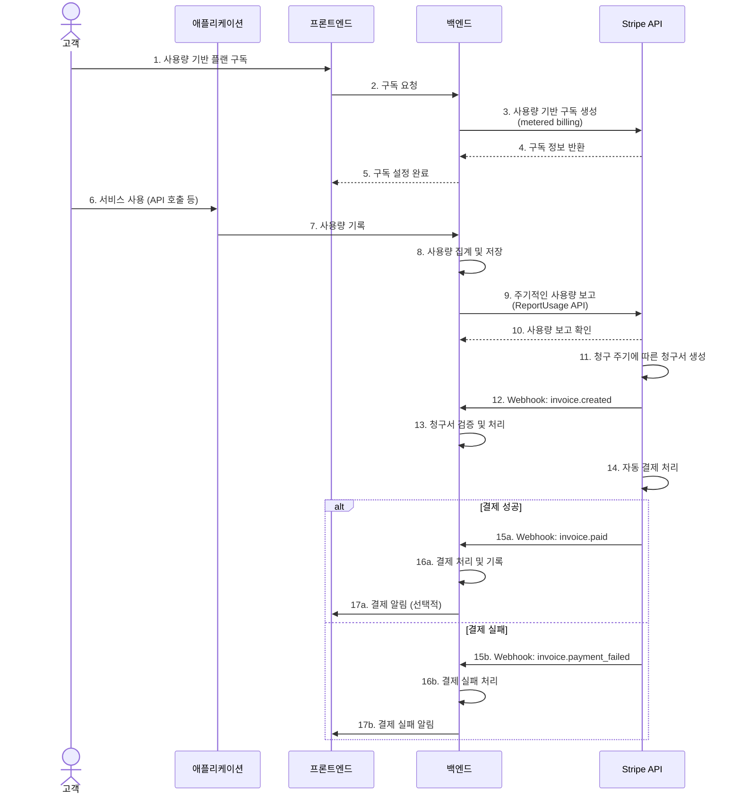
```mermaid
sequenceDiagram
    actor 고객
    participant App as 애플리케이션
    participant FE as 프론트엔드
    participant BE as 백엔드
    participant Stripe as Stripe API

    %% 초기 구독 설정
    고객->>FE: 1. 사용량 기반 플랜 구독
    FE->>BE: 2. 구독 요청
    BE->>Stripe: 3. 사용량 기반 구독 생성<br/>(metered billing)
    Stripe-->>BE: 4. 구독 정보 반환
    BE-->>FE: 5. 구독 설정 완료

    %% 사용량 추적
    고객->>App: 6. 서비스 사용 (API 호출 등)
    App->>BE: 7. 사용량 기록
    BE->>BE: 8. 사용량 집계 및 저장

    %% 사용량 보고
    BE->>Stripe: 9. 주기적인 사용량 보고<br/>(ReportUsage API)
    Stripe-->>BE: 10. 사용량 보고 확인

    %% 청구 및 결제
    Stripe->>Stripe: 11. 청구 주기에 따른 청구서 생성
    Stripe->>BE: 12. Webhook: invoice.created
    BE->>BE: 13. 청구서 검증 및 처리
    Stripe->>Stripe: 14. 자동 결제 처리

    alt 결제 성공
        Stripe->>BE: 15a. Webhook: invoice.paid
        BE->>BE: 16a. 결제 처리 및 기록
        BE->>FE: 17a. 결제 알림 (선택적)
    else 결제 실패
        Stripe->>BE: 15b. Webhook: invoice.payment_failed
        BE->>BE: 16b. 결제 실패 처리
        BE->>FE: 17b. 결제 실패 알림
    end
```

### 3.5.2 백엔드 구현: 사용량 기반 구독 생성

```javascript
/**
 * 사용량 기반 구독 생성 함수
 * @param organizationId 조직/고객 ID
 * @param priceId 사용량 기반 가격 ID
 * @param paymentMethodId 결제 수단 ID
 * @param options 추가 옵션
 * @returns 생성된 구독 정보
 */
async function createUsageBasedSubscription(organizationId, priceId, paymentMethodId, options = {}) {
  // ... 고객 ID 확인 및 결제 수단 설정 (구독 결제와 유사)

  try {
    // 사용량 기반 구독 생성
    const subscription = await stripe.subscriptions.create({
      customer: customerId,
      items: [
        {
          price: priceId,
          // 사용량 기반 가격은 수량 지정 불필요
        },
      ],
      payment_behavior: 'default_incomplete',
      payment_settings: {
        payment_method_types: ['card'],
        save_default_payment_method: 'on_subscription',
      },
      expand: ['latest_invoice.payment_intent'],
      metadata: options.metadata || {},
    });

    // 내부 DB에 구독 기록
    await Subscription.create({
      organization_id: organizationId,
      stripe_subscription_id: subscription.id,
      status: subscription.status,
      current_period_start: new Date(subscription.current_period_start * 1000),
      current_period_end: new Date(subscription.current_period_end * 1000),
      stripe_price_id: priceId,
      created_at: new Date(subscription.created * 1000),
    });

    return {
      subscription,
      clientSecret: subscription.latest_invoice?.payment_intent?.client_secret,
    };
  } catch (error) {
    logger.error(`사용량 기반 구독 생성 오류: ${error.message}`, error);
    throw error;
  }
}
```

### 3.5.3 사용량 추적 및 보고

```javascript
/**
 * 사용량 추적 함수
 * @param organizationId 조직/고객 ID
 * @param metricName 사용량 지표 이름
 * @param quantity 사용량
 * @returns 저장된 사용량 레코드
 */
async function trackUsage(organizationId, metricName, quantity) {
  try {
    // 내부 DB에 사용량 기록
    const usageRecord = await UsageRecord.create({
      organization_id: organizationId,
      metric_name: metricName,
      quantity,
      timestamp: new Date(),
    });

    return usageRecord;
  } catch (error) {
    logger.error(`사용량 추적 오류: ${error.message}`, error);
    throw error;
  }
}

/**
 * Stripe에 사용량 보고 함수
 * @param subscriptionItemId 구독 항목 ID
 * @param quantity 사용량
 * @param timestamp 타임스탬프 (Unix 시간)
 * @returns Stripe 사용량 레코드
 */
async function reportUsageToStripe(subscriptionItemId, quantity, timestamp = null) {
  try {
    const usageRecord = await stripe.subscriptionItems.createUsageRecord(subscriptionItemId, {
      quantity,
      timestamp: timestamp || Math.floor(Date.now() / 1000),
      action: 'increment', // 증분 사용량 보고
    });

    return usageRecord;
  } catch (error) {
    logger.error(`Stripe 사용량 보고 오류: ${error.message}`, error);
    throw error;
  }
}

/**
 * 정기적인 사용량 집계 및 보고 함수
 * 배치 작업으로 실행 (예: 시간별, 일별)
 */
async function aggregateAndReportUsage() {
  try {
    // 마지막 보고 이후 미보고된 사용량 조회
    const unreportedUsage = await UsageRecord.find({
      reported_to_stripe: false,
      timestamp: { $gt: lastReportTimestamp },
    }).sort({ timestamp: 1 });

    // 구독 및 조직별로 사용량 집계
    const aggregatedUsage = aggregateUsageBySubscription(unreportedUsage);

    // Stripe에 집계된 사용량 보고
    for (const [subscriptionItemId, usage] of Object.entries(aggregatedUsage)) {
      await reportUsageToStripe(subscriptionItemId, usage.quantity, usage.timestamp);

      // 보고된 사용량 레코드 업데이트
      await UsageRecord.updateMany({ _id: { $in: usage.recordIds } }, { reported_to_stripe: true, reported_at: new Date() });
    }

    return { success: true };
  } catch (error) {
    logger.error(`사용량 집계 및 보고 오류: ${error.message}`, error);
    throw error;
  }
}
```

### 3.5.4 설계 및 구현 시 주요 고려사항

1. **사용량 추적 메커니즘**:

   - 실시간 vs. 배치 처리
   - 사용량 이벤트 로깅 및 집계
   - 사용량 측정 및 표준화

2. **사용량 보고 전략**:

   - 실시간 보고 vs. 주기적 집계 보고
   - 오류 발생 시 재시도 메커니즘
   - 멱등성 있는 사용량 보고

3. **청구서 생성 및 검증**:

   - 청구서 생성 전 사용량 검증
   - 예상치 못한 고액 청구 방지 (비정상 사용량 탐지)
   - 사용량 한도 설정 및 알림

4. **사용량 투명성**:
   - 고객용 사용량 대시보드
   - 사용량 예측 및 비용 예상
   - 사용량 알림 및 경고

## 3.5.5 사용량 기반 결제 방식 유형

사용량 기반 결제는 크게 두 가지 방식으로 구현할 수 있다. 각 방식은 비즈니스 모델과 고객 사용 패턴에 따라 선택할 수 있다.

1. **정기 청구 주기 기반 사용량 결제 (Metered Billing)**:

   - 정해진 청구 주기(월간, 연간 등)에 따라 사용량을 집계하여 한 번에 결제
   - 청구 주기가 종료되면 누적된 사용량에 대해 인보이스가 생성되고 결제 처리
   - 예측 가능한 결제 일정을 선호하는 고객에게 적합
   - 구현 예시:

   ```javascript
   // 기본 metered billing 구독 생성
   const subscription = await stripe.subscriptions.create({
     customer: customerId,
     items: [
       {
         price: priceId, // metered 유형의 가격 ID
       },
     ],
     // 월간 결제 주기로 설정
     billing_cycle_anchor: Math.floor(Date.now() / 1000),
     proration_behavior: 'create_prorations',
     payment_settings: {
       payment_method_types: ['card'],
       save_default_payment_method: 'on_subscription',
     },
   });
   ```

2. **임계값 기반 사용량 결제 (Threshold Billing)**:

   - 특정 사용량 임계값이나 금액 기준을 초과할 때마다 즉시 결제가 이루어지는 방식
   - 사용량 또는 누적 금액이 지정된 임계값을 넘으면 중간 인보이스 생성 및 결제
   - 대량 사용 시 요금 충격 방지나 선불형 크레딧 모델에 적합
   - 구현 예시:

   ```javascript
   // 임계값 설정이 있는 사용량 기반 구독 생성
   const subscription = await stripe.subscriptions.create({
     customer: customerId,
     items: [
       {
         price: priceId,
         // 항목별 사용량 임계값 설정
         billing_thresholds: {
           usage_gte: 1000, // 사용량이 1000 단위 이상이 되면 즉시 청구
         },
       },
     ],
     // 전체 구독에 대한 금액 임계값 설정
     billing_thresholds: {
       amount_gte: 10000, // 누적 금액이 100 USD(센트 기준 10000) 이상이 되면 즉시 청구
     },
     payment_settings: {
       payment_method_types: ['card'],
       save_default_payment_method: 'on_subscription',
     },
   });
   ```

두 방식 모두 Stripe의 동일한 사용량 보고 API(`reportUsageToStripe`)를 사용하여 사용량을 기록하지만, 결제 트리거 방식에서 차이가 있다. 비즈니스 요구사항에 따라 적절한 방식을 선택하거나, 고객에게 두 옵션을 모두 제공하여 유연성을 높일 수 있다.

### 3.5.6 사용량 기반 결제 방식 선택 가이드

| 고려 사항         | Metered Billing (정기 청구)            | Threshold Billing (임계값 기반)             |
| ----------------- | -------------------------------------- | ------------------------------------------- |
| **과금 예측성**   | 정해진 날짜에 결제 발생                | 사용량에 따라 불규칙적 결제 발생            |
| **현금 흐름**     | 청구 주기 종료 시점에 수금             | 임계값 도달 시 즉시 수금으로 현금 흐름 개선 |
| **고객 선호도**   | 예측 가능한 결제일 선호 고객           | 선불형/충전식 모델 선호 고객                |
| **과금 충격**     | 대량 사용 시 한 번에 큰 금액 청구 가능 | 작은 단위로 나누어 결제되어 충격 감소       |
| **구현 복잡성**   | 상대적으로 단순                        | 임계값 관리 및 모니터링 추가 필요           |
| **적합한 서비스** | 일관된 사용 패턴의 서비스              | 사용량 변동이 큰 서비스, API 서비스         |

프로젝트 구현 시 SaaS 비즈니스 모델과 목표 고객층을 고려하여 적절한 방식을 선택하거나, 고급 사용자를 위한 옵션으로 두 방식을 모두 지원하는 것도 가능하다.

### 3.5.7 Threshold Billing 구현 시 추가 고려사항

Threshold Billing(임계값 기반 과금)을 구현할 때는 다음 사항들을 추가로 고려해야 한다:

1. **임계값 설정 전략**:

   - **동적 임계값 vs. 고정 임계값**: 비즈니스 규모나 과거 사용 패턴에 따라 임계값을 동적으로 조정할지, 고정값으로 설정할지 결정한다.
   - **사용량 기반 임계값 vs. 금액 기반 임계값**: `usage_gte`(사용량 기준)와 `amount_gte`(금액 기준) 중 어떤 방식이 비즈니스 모델에 적합한지 검토한다.
   - **고객별 맞춤 임계값**: 고객 규모나 결제 이력에 따라 개별 임계값을 설정하는 기능을 고려한다.

2. **알림 및 투명성**:

   - **임계값 접근 알림**: 임계값에 가까워질 때(예: 80% 도달) 사전 알림을 제공한다.
   - **결제 예정 알림**: 임계값 초과로 인한 결제가 예정되어 있을 때 사전 알림을 제공한다.
   - **사용량 대시보드**: 고객이 현재 사용량과 임계값 대비 상태를 실시간으로 확인할 수 있는 대시보드를 제공한다.

3. **기술적 구현 고려사항**:

   ```javascript
   // 사용량과 금액 기준 임계값을 모두 설정한 예시
   const subscription = await stripe.subscriptions.create({
     customer: customerId,
     items: [
       {
         price: priceId,
         billing_thresholds: {
           usage_gte: 1000, // 사용량이 1000 단위 이상이 되면 청구
         },
       },
     ],
     billing_thresholds: {
       amount_gte: 10000, // 누적 금액이 100 USD(센트 기준) 이상이 되면 청구
     },
     // 기타 설정...
   });

   // 임계값 도달 시 웹훅 이벤트 처리 예시
   async function handleInvoiceCreated(invoice) {
     // 임계값 도달로 인한 인보이스인지 확인
     if (invoice.billing_reason === 'subscription_threshold') {
       // 고객에게 임계값 기반 청구 알림 발송
       await notificationService.sendThresholdInvoiceNotification({
         customerId: invoice.customer,
         invoiceId: invoice.id,
         amount: invoice.amount_due,
         usage: await getInvoiceUsageSummary(invoice.id),
       });
     }
   }
   ```

4. **비즈니스 및 현금 흐름 고려사항**:

   - **최소 청구 금액**: 너무 작은 금액의 빈번한 청구를 방지하기 위한 최소 청구 금액 설정을 고려한다.
   - **임계값 초과 마진**: 임계값 도달 즉시가 아닌, 약간의 마진(예: 110%)을 두고 청구하는 방식을 고려한다.
   - **현금 흐름 분석**: 임계값 기반 청구가 비즈니스 현금 흐름에 미치는 영향을 분석하고 최적화한다.

5. **사용자 경험 및 UI 설계**:

   - **선호도 설정**: 고객이 임계값 설정을 직접 조정할 수 있는 UI 제공을 고려한다.
   - **임계값 시각화**: 사용량 대비 임계값을 시각적으로 표현하는 프로그레스 바 등의 UI 요소를 구현한다.
   - **결제 이력 표시**: 임계값 기반으로 발생한 결제와 정기 결제를 구분하여 표시한다.

6. **여러 서비스/상품에 대한 임계값 관리**:

   - **통합 임계값 vs. 개별 임계값**: 여러 서비스나 상품을 묶어 하나의 임계값으로 관리할지, 각각 별도의 임계값을 설정할지 결정한다.
   - **우선순위 설정**: 여러 임계값이 동시에 작동할 때의 우선순위 규칙을 정의한다.

7. **리스크 관리**:

   - **사용량 급증 대응**: 비정상적인 사용량 급증 시 자동 알림 및 대응 체계를 구축한다.
   - **사용량 한도**: 임계값과는 별도로 최대 사용량 한도를 설정하여 예상치 못한 고액 청구를 방지한다.
   - **결제 실패 대응**: 임계값 기반 청구 시 결제 실패에 대한 정책(서비스 제한, 재시도 등)을 명확히 한다.

Threshold Billing 구현 시 이러한 고려사항들을 사전에 검토하고 설계에 반영하면, 고객 만족도를 높이고 비즈니스 목표에 부합하는 사용량 기반 결제 시스템을 구축할 수 있다.

### 3.5.8 Threshold Billing 웹훅 이벤트 처리

Threshold Billing을 효과적으로 구현하기 위해서는 특정 웹훅 이벤트를 처리하는 것이 중요하다. 임계값 기반 결제는 일반적인 정기 결제와 다른 이벤트 흐름을 가지므로, 이에 맞는 이벤트 처리 전략이 필요하다.

1. **주요 관련 웹훅 이벤트**:

   - `invoice.created` (임계값 도달 시 발생)
   - `invoice.finalized` (인보이스 확정 시)
   - `invoice.payment_succeeded` (임계값 기반 결제 성공 시)
   - `invoice.payment_failed` (임계값 기반 결제 실패 시)
   - `billing.meter_event.created` (미터링 이벤트 생성 시, V2 API)

2. **임계값 기반 인보이스 식별**:

   ```javascript
   async function handleInvoiceCreated(event) {
     const invoice = event.data.object;

     // 임계값 도달로 생성된 인보이스인지 확인
     const isThresholdInvoice = invoice.billing_reason === 'subscription_threshold';

     if (isThresholdInvoice) {
       // 임계값 기반 인보이스에 대한 특별 처리
       logger.info(`임계값 도달 인보이스 생성: ${invoice.id}, 금액: ${invoice.amount_due}`);

       // 고객에게 임계값 기반 청구 알림
       await notificationService.sendThresholdInvoiceNotification({
         customerId: invoice.customer,
         invoiceId: invoice.id,
         amount: invoice.amount_due,
         usage: await getInvoiceUsageSummary(invoice.id),
       });

       // 사용량 리셋 여부 관련 처리
       const resetUsage = await determineUsageResetPolicy(invoice);
       if (resetUsage) {
         await handleUsageReset(invoice.subscription);
       }
     }
   }
   ```

3. **사용량 리셋 정책**:

   ```javascript
   /**
    * 임계값 기반 인보이스 발행 후 사용량 리셋 여부 결정 함수
    * @param {Object} invoice 인보이스 객체
    * @returns {Boolean} 사용량 리셋 여부
    */
   async function determineUsageResetPolicy(invoice) {
     // 구독 정보 조회
     const subscription = await stripe.subscriptions.retrieve(invoice.subscription);

     // 구독 메타데이터나 설정에서 리셋 정책 확인
     const resetPolicy = subscription.metadata.threshold_reset_policy || 'maintain';

     // 정책에 따라 리셋 여부 결정
     switch (resetPolicy) {
       case 'reset':
         // 임계값 도달 시마다 사용량 리셋
         return true;
       case 'reset_if_paid':
         // 결제 성공 시에만 리셋 (별도 웹훅에서 처리)
         return false;
       case 'maintain':
       default:
         // 사용량 유지 (청구 주기 종료 시까지 누적)
         return false;
     }
   }
   ```

4. **임계값 결제 실패 처리**:

   ```javascript
   async function handleInvoicePaymentFailed(event) {
     const invoice = event.data.object;

     // 임계값 기반 인보이스 결제 실패인지 확인
     if (invoice.billing_reason === 'subscription_threshold') {
       logger.warn(`임계값 기반 인보이스 결제 실패: ${invoice.id}`);

       // 관련 구독 정보 조회
       const subscription = await stripe.subscriptions.retrieve(invoice.subscription);

       // 임계값 결제 실패에 대한 정책 적용
       const failurePolicy = subscription.metadata.threshold_failure_policy || 'continue';

       switch (failurePolicy) {
         case 'pause':
           // 서비스 일시 중지
           await pauseService(subscription.customer);
           break;
         case 'limit':
           // 추가 사용량 제한
           await limitUsage(subscription.customer);
           break;
         case 'continue':
         default:
           // 서비스 계속 제공 (다음 정기 청구 시점에 함께 청구)
           break;
       }

       // 고객에게 결제 실패 알림
       await notificationService.sendThresholdPaymentFailedNotification({
         customerId: invoice.customer,
         invoiceId: invoice.id,
         amount: invoice.amount_due,
         failureMessage: invoice.last_payment_error?.message || '결제 실패',
       });
     }
   }
   ```

5. **사용량 모니터링 및 임계값 접근 알림**:

   ```javascript
   /**
    * 주기적으로 실행되어 임계값 접근 알림을 발송하는 함수
    */
   async function monitorThresholdApproach() {
     // 활성 구독 조회
     const subscriptions = await fetchActiveSubscriptionsWithThreshold();

     for (const subscription of subscriptions) {
       // 현재 사용량 조회
       const currentUsage = await getCurrentUsage(subscription.id);

       // 임계값 조회
       const thresholdAmount = subscription.billing_thresholds?.amount_gte;
       const thresholdUsage = subscription.items.data[0].billing_thresholds?.usage_gte;

       // 사용량 기반 임계값 접근 검사
       if (thresholdUsage && currentUsage > thresholdUsage * 0.8) {
         // 80% 이상 도달 시 알림
         await notificationService.sendThresholdApproachingNotification({
           customerId: subscription.customer,
           subscriptionId: subscription.id,
           currentUsage,
           thresholdUsage,
           usagePercentage: ((currentUsage / thresholdUsage) * 100).toFixed(1),
         });
       }

       // 금액 기반 임계값 접근 검사 (추정 금액 계산 필요)
       if (thresholdAmount) {
         const estimatedAmount = calculateEstimatedAmount(currentUsage, subscription);
         if (estimatedAmount > thresholdAmount * 0.8) {
           // 80% 이상 도달 시 알림
           await notificationService.sendAmountThresholdApproachingNotification({
             customerId: subscription.customer,
             subscriptionId: subscription.id,
             estimatedAmount,
             thresholdAmount,
             amountPercentage: ((estimatedAmount / thresholdAmount) * 100).toFixed(1),
           });
         }
       }
     }
   }
   ```

Threshold Billing의 웹훅 이벤트 처리는 기존 정기 결제와 구별되는 특별한 로직이 필요하다. 이러한 이벤트를 적절히 처리하고 고객과 내부 시스템에 알림을 제공함으로써, 사용량 임계값에 기반한 결제 프로세스를 원활하게 관리할 수 있다.

## 3.6 체크아웃 세션 구현 전략

체크아웃 세션은 Stripe가 제공하는 호스팅 결제 페이지 또는 CardElement를 활용한 결제 흐름으로, 안전하고 최적화된 결제 경험을 제공한다.

### 3.6.1 체크아웃 세션 구현 아키텍처

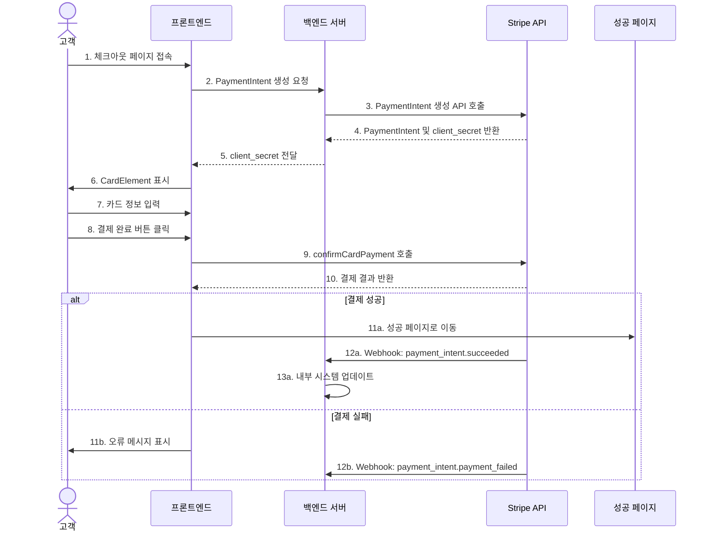
```mermaid
sequenceDiagram
    actor 고객
    participant FE as 프론트엔드
    participant BE as 백엔드 서버
    participant Stripe as Stripe API
    participant Success as 성공 페이지

    %% 결제 페이지 초기화 및 PaymentIntent 생성
    고객->>FE: 1. 체크아웃 페이지 접속
    FE->>BE: 2. PaymentIntent 생성 요청
    BE->>Stripe: 3. PaymentIntent 생성 API 호출
    Stripe-->>BE: 4. PaymentIntent 및 client_secret 반환
    BE-->>FE: 5. client_secret 전달

    %% 카드 정보 입력 및 처리
    FE->>고객: 6. CardElement 표시
    고객->>FE: 7. 카드 정보 입력

    %% 결제 처리
    고객->>FE: 8. 결제 완료 버튼 클릭
    FE->>Stripe: 9. confirmCardPayment 호출
    Stripe-->>FE: 10. 결제 결과 반환

    alt 결제 성공
        FE->>Success: 11a. 성공 페이지로 이동
        Stripe->>BE: 12a. Webhook: payment_intent.succeeded
        BE->>BE: 13a. 내부 시스템 업데이트
    else 결제 실패
        FE->>고객: 11b. 오류 메시지 표시
        Stripe->>BE: 12b. Webhook: payment_intent.payment_failed
    end
```

### 3.6.2 데이터베이스 설계

체크아웃 세션을 처리하기 위한 데이터베이스 구조는 다음과 같이 설계해야 한다:

```sql
-- 체크아웃 세션 테이블
CREATE TABLE checkout_sessions (
  id UUID PRIMARY KEY,
  stripe_payment_intent_id VARCHAR(255) NOT NULL UNIQUE,
  user_id UUID REFERENCES users(id),
  amount_in_cents BIGINT NOT NULL,
  currency VARCHAR(3) NOT NULL,
  description TEXT,
  status VARCHAR(50) NOT NULL, -- 'created', 'processing', 'succeeded', 'failed'
  metadata JSONB,
  created_at TIMESTAMP WITH TIME ZONE NOT NULL DEFAULT NOW(),
  updated_at TIMESTAMP WITH TIME ZONE NOT NULL DEFAULT NOW()
);

-- 결제 상태 이력 테이블
CREATE TABLE payment_status_history (
  id UUID PRIMARY KEY,
  checkout_session_id UUID REFERENCES checkout_sessions(id),
  previous_status VARCHAR(50),
  new_status VARCHAR(50) NOT NULL,
  event_type VARCHAR(100), -- webhook 이벤트 타입
  event_id VARCHAR(255),   -- webhook 이벤트 ID
  created_at TIMESTAMP WITH TIME ZONE NOT NULL DEFAULT NOW()
);

-- 인덱스 설정
CREATE INDEX idx_checkout_sessions_user_id ON checkout_sessions(user_id);
CREATE INDEX idx_checkout_sessions_status ON checkout_sessions(status);
CREATE INDEX idx_payment_status_history_checkout_session_id ON payment_status_history(checkout_session_id);
```

### 3.6.3 구현 시 고려사항

1. **상태 관리**:

   - CardElement의 마운트 상태와 결제 처리 상태를 명확히 관리한다.
   - 각 상태 변경 시 사용자에게 적절한 피드백을 제공한다.
   - 페이지 새로고침, 브라우저 종료 등 예외 상황을 고려한 상태 복구 메커니즘을 구현한다.

2. **보안 강화**:

   - client_secret은 항상 서버에서 생성하고, 프론트엔드로 전달한다.
   - Stripe Elements 사용 시 CSP(Content Security Policy) 설정을 적절히 구성한다.
   - 중요 결제 정보는 로그에 기록하지 않도록 주의한다.

3. **오류 처리 전략**:

   - 카드 입력 오류, 결제 처리 실패 등 다양한 오류 상황에 대한 명확한 처리 방법을 정의한다.
   - 오류 메시지는 사용자 친화적이면서도 충분한 정보를 제공해야 한다.
   - 일시적인 서버 오류와 영구적인 카드 오류를 구분하여 처리한다.

4. **성능 최적화**:

   - CardElement 초기화 시 불필요한 리렌더링을 방지한다.
   - 결제 처리 중 UI 블로킹을 최소화한다.
   - 중복 결제 방지를 위한 디바운싱 기법을 적용한다.

5. **분석 및 모니터링**:
   - 결제 시도, 성공, 실패 등 주요 이벤트를 분석 시스템에 기록한다.
   - 결제 실패율, 평균 처리 시간 등 주요 지표를 모니터링한다.
   - 이상 패턴 감지 시 알림 시스템을 구현한다.

### 3.6.4 프론트엔드 아키텍처 패턴

체크아웃 세션 구현을 위한 권장 프론트엔드 아키텍처 패턴:

```javascript
// 결제 상태 관리를 위한 Context
const CheckoutContext = createContext();

function CheckoutProvider({ children }) {
  const [status, setStatus] = useState('idle');
  const [paymentIntent, setPaymentIntent] = useState(null);
  const [error, setError] = useState(null);
  const [cardElement, setCardElement] = useState(null);

  // 결제 초기화 함수
  const initializePayment = async (amount, currency, description) => {
    try {
      setStatus('initializing');
      const { clientSecret } = await api.createPaymentIntent(amount, currency, description);
      setPaymentIntent({ clientSecret, amount, currency, description });
      setStatus('ready');
      return true;
    } catch (err) {
      setError(err.message);
      setStatus('error');
      return false;
    }
  };

  // 결제 처리 함수
  const processPayment = async () => {
    if (!cardElement || !paymentIntent) {
      setError('카드 정보 또는 결제 정보가 준비되지 않았습니다.');
      return false;
    }

    try {
      setStatus('processing');
      const { error, paymentIntent: result } = await stripe.confirmCardPayment(paymentIntent.clientSecret, { payment_method: { card: cardElement } });

      if (error) {
        setError(error.message);
        setStatus('error');
        return false;
      }

      setPaymentIntent(result);
      setStatus('succeeded');
      return true;
    } catch (err) {
      setError(err.message);
      setStatus('error');
      return false;
    }
  };

  const contextValue = {
    status,
    error,
    paymentIntent,
    initializePayment,
    processPayment,
    setCardElement,
  };

  return <CheckoutContext.Provider value={contextValue}>{children}</CheckoutContext.Provider>;
}
```

### 3.6.5 백엔드 역할 및 책임

1. **PaymentIntent 생성 및 관리**:

   - 금액, 통화, 설명 등 결제 정보 검증
   - Stripe API 호출 및 응답 처리
   - client_secret 안전한 전달

2. **웹훅 처리**:

   - 결제 상태 변경에 따른 비즈니스 로직 실행
   - 결제 정보 데이터베이스 업데이트
   - 결제 완료/실패 시 알림 발송

3. **재시도 및 복구 전략**:
   - 일시적인 오류에 대한 자동 재시도 메커니즘
   - 영구적인 오류에 대한 대체 결제 방법 제안
   - 미완료 결제 세션 정리 및 복구

## 3.7 결제 취소 및 환불 처리 전략

결제 취소 및 환불은 고객 만족도와 법적 규정 준수를 위해 중요한 기능으로, 체계적인 설계가 필요하다.

### 3.7.1 환불 시스템 아키텍처

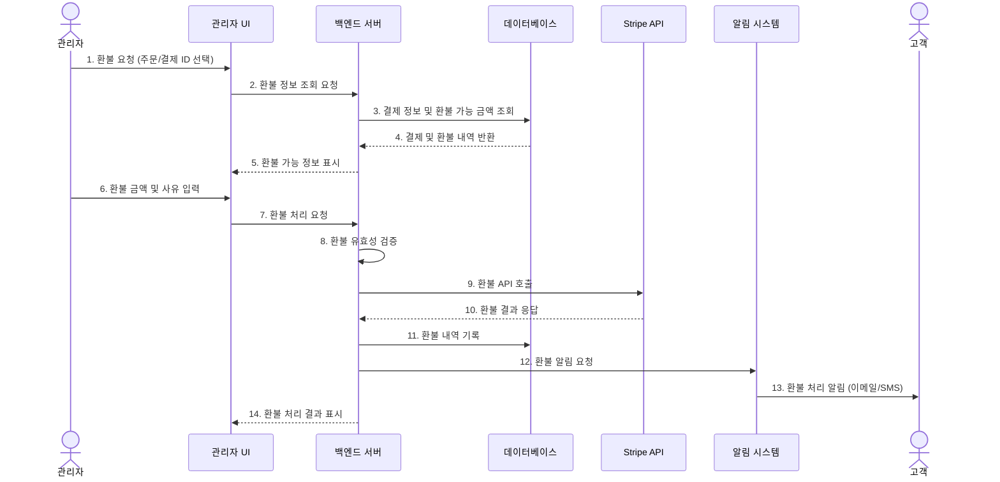
```mermaid
sequenceDiagram
    actor 관리자
    participant Admin as 관리자 UI
    participant BE as 백엔드 서버
    participant DB as 데이터베이스
    participant Stripe as Stripe API
    participant Notify as 알림 시스템
    actor 고객

    관리자->>Admin: 1. 환불 요청 (주문/결제 ID 선택)
    Admin->>BE: 2. 환불 정보 조회 요청
    BE->>DB: 3. 결제 정보 및 환불 가능 금액 조회
    DB-->>BE: 4. 결제 및 환불 내역 반환
    BE-->>Admin: 5. 환불 가능 정보 표시

    관리자->>Admin: 6. 환불 금액 및 사유 입력
    Admin->>BE: 7. 환불 처리 요청
    BE->>BE: 8. 환불 유효성 검증
    BE->>Stripe: 9. 환불 API 호출
    Stripe-->>BE: 10. 환불 결과 응답

    BE->>DB: 11. 환불 내역 기록
    BE->>Notify: 12. 환불 알림 요청
    Notify->>고객: 13. 환불 처리 알림 (이메일/SMS)
    BE-->>Admin: 14. 환불 처리 결과 표시
```

### 3.7.2 환불 관련 데이터베이스 설계

```sql
-- 환불 테이블
CREATE TABLE refunds (
  id UUID PRIMARY KEY,
  payment_id UUID NOT NULL REFERENCES payments(id),
  stripe_refund_id VARCHAR(255) NOT NULL UNIQUE,
  amount_in_cents BIGINT NOT NULL CHECK (amount_in_cents > 0),
  currency VARCHAR(3) NOT NULL,
  reason VARCHAR(50) NOT NULL, -- 'requested_by_customer', 'duplicate', 'fraudulent'
  status VARCHAR(50) NOT NULL, -- 'pending', 'succeeded', 'failed', 'canceled'
  admin_id UUID REFERENCES users(id), -- 환불 처리한 관리자
  metadata JSONB,
  notes TEXT, -- 내부 관리용 메모
  created_at TIMESTAMP WITH TIME ZONE NOT NULL DEFAULT NOW(),
  updated_at TIMESTAMP WITH TIME ZONE NOT NULL DEFAULT NOW()
);

-- 환불 상태 이력 테이블
CREATE TABLE refund_status_history (
  id UUID PRIMARY KEY,
  refund_id UUID NOT NULL REFERENCES refunds(id),
  previous_status VARCHAR(50),
  new_status VARCHAR(50) NOT NULL,
  event_type VARCHAR(100), -- webhook 이벤트 타입
  event_id VARCHAR(255),   -- webhook 이벤트 ID
  created_at TIMESTAMP WITH TIME ZONE NOT NULL DEFAULT NOW()
);

-- 환불 항목 테이블 (주문의 개별 상품 환불 관리용)
CREATE TABLE refund_items (
  id UUID PRIMARY KEY,
  refund_id UUID NOT NULL REFERENCES refunds(id),
  order_item_id UUID NOT NULL REFERENCES order_items(id),
  quantity INT NOT NULL CHECK (quantity > 0),
  amount_in_cents BIGINT NOT NULL CHECK (amount_in_cents > 0),
  created_at TIMESTAMP WITH TIME ZONE NOT NULL DEFAULT NOW()
);

-- 인덱스 설정
CREATE INDEX idx_refunds_payment_id ON refunds(payment_id);
CREATE INDEX idx_refunds_status ON refunds(status);
CREATE INDEX idx_refund_status_history_refund_id ON refund_status_history(refund_id);
CREATE INDEX idx_refund_items_refund_id ON refund_items(refund_id);
CREATE INDEX idx_refund_items_order_item_id ON refund_items(order_item_id);
```

### 3.7.3 환불 유형별 처리 전략

1. **전체 환불(Full Refund)**:

   - 모든 환불 금액이 원결제 금액과 동일한 경우
   - 관련 주문 상태 변경: `'paid'` → `'refunded'`
   - 재고 조정: 주문 상품이 재고에 반영되어야 하는 경우 처리
   - 구독의 경우: 구독 취소 처리 연동

2. **부분 환불(Partial Refund)**:

   - 환불 금액이 원결제 금액보다 적은 경우
   - 관련 주문 상태 변경: `'paid'` → `'partially_refunded'`
   - 항목별 환불(Line Item Refund): 주문의 특정 상품만 환불할 경우 `refund_items` 테이블 활용
   - 다중 부분 환불 추적: 누적 환불 금액 관리

3. **분쟁/이의제기(Dispute) 처리**:
   - 고객이 카드사를 통해 직접 분쟁을 제기한 경우
   - 환불이 아닌 별도의 `disputes` 테이블 관리
   - 분쟁 증빙 자료 및 대응 내용 기록
   - 분쟁 결과에 따른 최종 처리 자동화

### 3.7.4 환불 상태 관리 전략

1. **상태 흐름**:

   ```
   pending → succeeded/failed → (필요시) canceled
   ```

2. **멱등성 보장**:

   - 동일 결제에 대한 중복 환불 방지 메커니즘
   - 환불 요청 식별자(idempotency key) 활용
   - 트랜잭션 락을 통한 동시 환불 요청 충돌 방지

3. **환불 한도 관리**:
   - 결제별 최대 환불 가능 금액 계산 로직
   - 이전 환불 내역 고려한 가용 금액 자동 계산
   - 환불 한도 초과 시 명확한 오류 메시지 제공

### 3.7.5 웹훅 이벤트 처리 전략

1. **환불 관련 주요 이벤트**:

   - `refund.created`: 환불 요청 생성 시
   - `charge.refunded`: 청구 건이 환불됨
   - `refund.updated`: 환불 상태 업데이트
   - `charge.refund.updated`: 청구-환불 관계 업데이트

2. **이벤트 처리 로직**:

   ```javascript
   // 환불 이벤트 처리
   async function handleRefundEvent(event) {
     const { type, data } = event;
     const { object } = data;

     switch (type) {
       case 'refund.created':
         await recordRefundCreated(object);
         break;

       case 'charge.refunded':
         await processChargeRefunded(object);
         break;

       case 'refund.updated':
         await updateRefundStatus(object);
         break;

       case 'charge.refund.updated':
         await syncRefundMetadata(object);
         break;
     }
   }

   // 청구 환불 처리
   async function processChargeRefunded(charge) {
     const { payment_intent, amount_refunded, refunded } = charge;

     // 환불 내역 업데이트
     await updateRefundAmount(payment_intent, amount_refunded);

     // 전체 환불 여부에 따른 처리
     if (refunded) {
       await markOrderAsFullyRefunded(payment_intent);
       await processInventoryAdjustment(payment_intent);
     } else {
       await markOrderAsPartiallyRefunded(payment_intent, amount_refunded);
     }

     // 고객 알림 발송
     await sendRefundNotification(payment_intent, amount_refunded);
   }
   ```

### 3.7.6 환불 정책 및 업무 규칙 관리

1. **환불 정책 설정**:

   - 기간별 환불 가능 여부 (예: 결제 후 30일 이내)
   - 상품 유형별 환불 정책 (예: 디지털 상품은 다운로드 전만 환불)
   - 환불 수수료 정책 (필요시)

2. **관리자 권한 설계**:

   - 환불 처리 권한 관리
   - 환불 금액 한도별 승인 체계
   - 환불 처리 감사 로그 유지

3. **자동화 규칙**:
   - 특정 조건 만족 시 자동 환불 처리
   - 환불 사유별 주문 분석 시스템 연동
   - 부정 환불 패턴 감지 로직

### 3.7.7 UI/UX 설계 고려사항

1. **관리자 인터페이스**:

   - 환불 가능 금액 명확한 표시
   - 부분 환불 시 항목별 선택 기능
   - 환불 이력 조회 및 필터링 기능

2. **고객 인터페이스**:

   - 환불 상태 조회 기능
   - 환불 진행 상황 추적
   - 환불 예상 소요 시간 안내

3. **알림 시스템**:
   - 환불 진행 단계별 알림
   - 환불 완료 확인 메시지
   - 환불 지연 시 상태 업데이트

## 3.8 미리 생성된 Invoice 기반 수동 결제 구현

미리 생성된 인보이스 기반 수동 결제는 구독(subscription) 외에 일회성 결제나 커스텀 청구를 위한 유연한 결제 방식이다. 이 방식은 SaaS 서비스에서 구독 외 추가 서비스, 일회성 컨설팅, 사용자 맞춤형 요금제 등을 제공할 때 활용할 수 있다.

### 3.8.1 수동 인보이스 결제 흐름

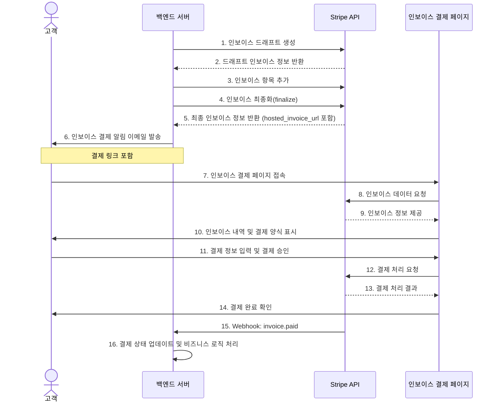
```mermaid
sequenceDiagram
    actor 고객
    participant BE as 백엔드 서버
    participant Stripe as Stripe API
    participant Portal as 인보이스 결제 페이지

    %% 인보이스 생성 단계
    BE->>Stripe: 1. 인보이스 드래프트 생성
    Stripe-->>BE: 2. 드래프트 인보이스 정보 반환
    BE->>Stripe: 3. 인보이스 항목 추가
    BE->>Stripe: 4. 인보이스 최종화(finalize)
    Stripe-->>BE: 5. 최종 인보이스 정보 반환 (hosted_invoice_url 포함)

    %% 고객 알림 단계
    BE->>고객: 6. 인보이스 결제 알림 이메일 발송
    Note over BE,고객: 결제 링크 포함

    %% 결제 처리 단계
    고객->>Portal: 7. 인보이스 결제 페이지 접속
    Portal->>Stripe: 8. 인보이스 데이터 요청
    Stripe-->>Portal: 9. 인보이스 정보 제공
    Portal->>고객: 10. 인보이스 내역 및 결제 양식 표시
    고객->>Portal: 11. 결제 정보 입력 및 결제 승인
    Portal->>Stripe: 12. 결제 처리 요청
    Stripe-->>Portal: 13. 결제 처리 결과
    Portal->>고객: 14. 결제 완료 확인

    %% 웹훅 이벤트 처리
    Stripe->>BE: 15. Webhook: invoice.paid
    BE->>BE: 16. 결제 상태 업데이트 및 비즈니스 로직 처리
```

# 4. 이벤트 처리 및 웹훅

## 4.1 Stripe 웹훅 설정

Stripe는 결제, 구독, 고객 상태 변경 등의 이벤트를 웹훅을 통해 비동기적으로 통지한다. 적절한 웹훅 처리는 안정적인 결제 시스템의 핵심이다

### 4.1.1 웹훅 엔드포인트 설정

```javascript
// 웹훅 엔드포인트 설정 예시 (Express 기준)
app.post('/api/webhooks/stripe', express.raw({ type: 'application/json' }), async (req, res) => {
  try {
    // 서명 검증
    const signature = req.headers['stripe-signature'];
    const event = stripe.webhooks.constructEvent(req.body, signature, process.env.STRIPE_WEBHOOK_SECRET);

    // 웹훅 이벤트 로깅
    await logWebhookEvent(event);

    // 이벤트 타입에 따른 처리
    await processWebhookEvent(event);

    res.status(200).send({ received: true });
  } catch (error) {
    console.error('웹훅 처리 오류:', error);
    res.status(400).send(`Webhook Error: ${error.message}`);
  }
});

// 웹훅 이벤트 로깅 함수
async function logWebhookEvent(event) {
  await WebhookEvent.create({
    stripe_event_id: event.id,
    event_type: event.type,
    payload: event.data,
    organization_id: event.data.object.customer ? await findOrganizationByCustomerId(event.data.object.customer) : null,
    created_at: new Date(event.created * 1000),
  });
}
```

### 4.1.2 주요 웹훅 이벤트 유형

| 이벤트 유형                     | 설명                | 대응 액션                        |
| ------------------------------- | ------------------- | -------------------------------- |
| `payment_intent.succeeded`      | 결제 성공           | 주문 처리, 영수증 발송           |
| `payment_intent.payment_failed` | 결제 실패           | 사용자에게 알림, 결제 재시도     |
| `setup_intent.succeeded`        | 결제 수단 설정 성공 | 결제 수단 저장, 사용자에게 알림  |
| `customer.subscription.created` | 구독 생성           | 구독 정보 저장, 서비스 활성화    |
| `customer.subscription.updated` | 구독 상태 변경      | 구독 상태 업데이트               |
| `customer.subscription.deleted` | 구독 취소           | 서비스 비활성화, 사용자에게 알림 |
| `invoice.paid`                  | 청구서 결제 완료    | 구독 갱신, 영수증 발송           |
| `invoice.payment_failed`        | 청구서 결제 실패    | 결제 재시도, 사용자에게 알림     |

## 4.2 이벤트 처리 전략

성공적인 이벤트 처리를 위한 주요 전략을 설명한다.

### 4.2.1 멱등성 보장

같은 이벤트가 여러 번 수신되어도 시스템 상태가 일관되게 유지되도록 멱등성 있는 처리가 필요하다.

```javascript
async function processPaymentSucceeded(event) {
  const paymentIntent = event.data.object;

  // 이미 처리된 이벤트인지 확인
  const existingTransaction = await Transaction.findOne({
    stripe_payment_intent_id: paymentIntent.id,
    status: 'succeeded',
  });

  if (existingTransaction) {
    logger.info(`이미 처리된 결제 이벤트: ${paymentIntent.id}`);
    return { success: true, alreadyProcessed: true };
  }

  // 새 이벤트 처리 로직
  // ...
}
```

### 4.2.2 순서 독립성

이벤트가 순서대로 도착하지 않을 수 있으므로, 이벤트 타임스탬프를 기준으로 처리하거나 상태 전이를 조건부로 수행해야 한다.

```javascript
async function processSubscriptionEvent(event) {
  const subscription = event.data.object;

  // 현재 저장된 구독 정보 조회
  const existingSubscription = await Subscription.findOne({
    stripe_subscription_id: subscription.id,
  });

  // 이벤트 타임스탬프 비교
  const eventTimestamp = new Date(event.created * 1000);

  if (existingSubscription && existingSubscription.updated_at > eventTimestamp) {
    logger.info(`더 최신 상태가 이미 반영됨: ${subscription.id}`);
    return { success: true, outdatedEvent: true };
  }

  // 이벤트 처리 로직
  // ...
}
```

### 4.2.3 오류 처리와 재시도

웹훅 처리 실패 시의 재시도 메커니즘과 오류 복구 전략이 필요하다.

```javascript
async function processWebhookEvent(event) {
  try {
    // 이벤트 타입에 따른 처리
    switch (event.type) {
      case 'payment_intent.succeeded':
        await processPaymentSucceeded(event);
        break;
      // 다른 이벤트 타입 처리
      // ...
    }

    // 처리 완료 표시
    await WebhookEvent.findOneAndUpdate(
      { stripe_event_id: event.id },
      {
        processed: true,
        processed_at: new Date(),
      },
    );

    return { success: true };
  } catch (error) {
    // 오류 정보 기록
    await WebhookEvent.findOneAndUpdate(
      { stripe_event_id: event.id },
      {
        error_message: error.message,
        retry_count: { $inc: 1 },
      },
    );

    // 치명적이지 않은 오류는 정상 응답 반환 (Stripe가 재시도하지 않도록)
    // 치명적인 오류는 예외 재발생
    if (isCriticalError(error)) {
      throw error;
    }

    return { success: false, error: error.message };
  }
}

// 주기적인 실패한 웹훅 재처리 작업
async function retryFailedWebhooks() {
  const failedEvents = await WebhookEvent.find({
    processed: false,
    retry_count: { $lt: 5 }, // 최대 5회 재시도
    created_at: { $gt: new Date(Date.now() - 24 * 60 * 60 * 1000) }, // 24시간 이내
  }).sort({ created_at: 1 });

  for (const event of failedEvents) {
    try {
      const stripeEvent = JSON.parse(event.payload);
      await processWebhookEvent(stripeEvent);
    } catch (error) {
      logger.error(`웹훅 재처리 실패: ${event.stripe_event_id}`, error);
    }
  }
}
```

## 4.3 주요 이벤트 처리 구현

### 4.3.1 결제 성공 이벤트 처리

```javascript
async function handlePaymentIntentSucceeded(event) {
  const paymentIntent = event.data.object;

  try {
    // 트랜잭션 상태 업데이트
    const transaction = await Transaction.findOneAndUpdate(
      { stripe_payment_intent_id: paymentIntent.id },
      {
        status: 'succeeded',
        updated_at: new Date(),
      },
      { new: true },
    );

    // 트랜잭션 레코드가 없는 경우 새로 생성
    if (!transaction) {
      const organizationId = paymentIntent.metadata?.organization_id || (await findOrganizationByCustomerId(paymentIntent.customer));

      await Transaction.create({
        organization_id: organizationId,
        stripe_payment_intent_id: paymentIntent.id,
        amount: paymentIntent.amount,
        currency: paymentIntent.currency,
        status: 'succeeded',
        created_at: new Date(paymentIntent.created * 1000),
      });
    }

    // 추가 비즈니스 로직
    if (paymentIntent.metadata?.order_id) {
      await updateOrderStatus(paymentIntent.metadata.order_id, 'paid');
    }

    // 알림 발송
    await sendPaymentConfirmationEmail(paymentIntent);

    return { success: true };
  } catch (error) {
    logger.error(`결제 성공 이벤트 처리 오류: ${error.message}`, error);
    throw error;
  }
}
```

### 4.3.2 구독 상태 변경 이벤트 처리

```javascript
async function handleSubscriptionUpdated(event) {
  const subscription = event.data.object;

  try {
    // 구독 정보 업데이트
    const updatedSubscription = await Subscription.findOneAndUpdate(
      { stripe_subscription_id: subscription.id },
      {
        status: subscription.status,
        current_period_start: new Date(subscription.current_period_start * 1000),
        current_period_end: new Date(subscription.current_period_end * 1000),
        updated_at: new Date(),
      },
      { new: true },
    );

    // 비즈니스 로직 처리
    switch (subscription.status) {
      case 'active':
        await activateServices(subscription.customer);
        break;
      case 'past_due':
        await sendPaymentReminderEmail(subscription.customer);
        break;
      case 'canceled':
        await deactivateServices(subscription.customer);
        break;
    }

    return { success: true };
  } catch (error) {
    logger.error(`구독 업데이트 이벤트 처리 오류: ${error.message}`, error);
    throw error;
  }
}
```

### 4.3.3 청구서 결제 실패 이벤트 처리

```javascript
async function handleInvoicePaymentFailed(event) {
  const invoice = event.data.object;

  try {
    // 청구서 상태 업데이트
    await Invoice.findOneAndUpdate(
      { stripe_invoice_id: invoice.id },
      {
        status: 'payment_failed',
        updated_at: new Date(),
      },
    );

    // 구독 정보 조회
    if (invoice.subscription) {
      const subscription = await Subscription.findOne({
        stripe_subscription_id: invoice.subscription,
      });

      // 사용자에게 결제 실패 알림
      await sendPaymentFailureEmail({
        customer: invoice.customer,
        invoice: invoice.id,
        amount: invoice.amount_due,
        currency: invoice.currency,
        nextAttempt: new Date(invoice.next_payment_attempt * 1000),
      });

      // 구독 상태에 따른 서비스 조정
      if (subscription && subscription.status === 'past_due') {
        await limitServiceAccess(invoice.customer);
      }
    }

    return { success: true };
  } catch (error) {
    logger.error(`청구서 결제 실패 이벤트 처리 오류: ${error.message}`, error);
    throw error;
  }
}
```

## 4.4 이벤트 기반 아키텍처

### 4.4.1 내부 이벤트 시스템 통합

Stripe 웹훅을 내부 이벤트 시스템과 통합하면 결제 관련 이벤트를 다양한 서비스에서 활용할 수 있다.

```javascript
// 이벤트 발행 함수
async function publishEvent(eventType, payload) {
  // 이벤트 브로커 (예: RabbitMQ, Kafka, Redis Pub/Sub 등)에 이벤트 발행
  await eventBroker.publish(eventType, payload);
}

// Stripe 웹훅을 내부 이벤트로 변환
async function processWebhookEvent(event) {
  // Stripe 이벤트 처리
  // ...

  // 내부 이벤트 발행
  switch (event.type) {
    case 'payment_intent.succeeded':
      await publishEvent('payment.succeeded', {
        organizationId: organizationId,
        amount: event.data.object.amount,
        currency: event.data.object.currency,
        paymentId: event.data.object.id,
        timestamp: new Date(event.created * 1000),
      });
      break;
    // 다른 이벤트 타입 처리
    // ...
  }
}
```

### 4.4.2 이벤트 기반 마이크로서비스 아키텍처

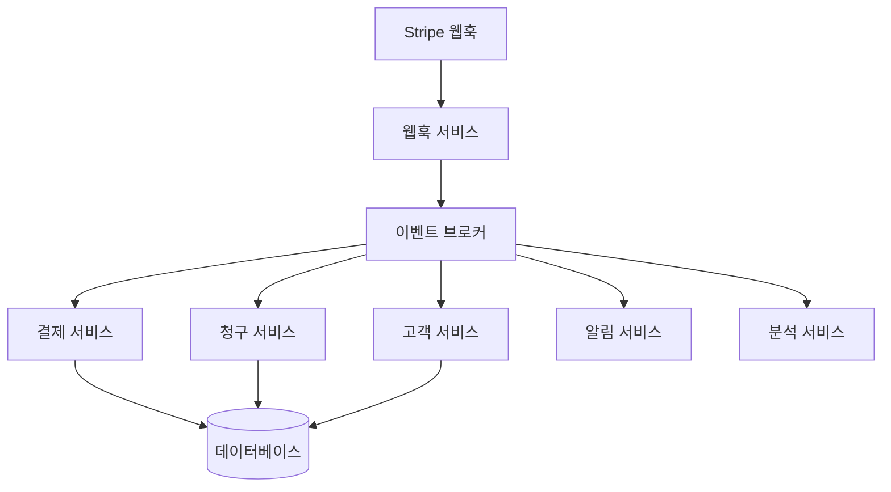
```mermaid
flowchart TD
    Stripe[Stripe 웹훅] --> WebhookService[웹훅 서비스]
    WebhookService --> EventBroker[이벤트 브로커]

    EventBroker --> PaymentService[결제 서비스]
    EventBroker --> BillingService[청구 서비스]
    EventBroker --> CustomerService[고객 서비스]
    EventBroker --> NotificationService[알림 서비스]
    EventBroker --> AnalyticsService[분석 서비스]

    PaymentService --> Database[(데이터베이스)]
    BillingService --> Database
    CustomerService --> Database
```

이벤트 기반 아키텍처의 이점:

1. **느슨한 결합**: 서비스 간 직접적인 의존성 감소
2. **확장성**: 새로운 서비스 추가가 용이
3. **장애 격리**: 한 서비스의 장애가 전체 시스템에 영향을 미치지 않음
4. **비동기 처리**: 중요한 작업 먼저 처리 후 나머지는 비동기로 처리 가능

# 5. 오류 처리 및 장애 대응

결제 시스템은 높은 안정성이 요구되므로 다양한 오류 상황과 장애에 대비한 설계가 필요하다.

## 5.1 결제 오류 유형 및 처리 전략

Stripe 결제 처리 중 발생할 수 있는 주요 오류 유형과 처리 방법을 정리한다.

### 5.1.1 카드 결제 오류

| 오류 코드                 | 설명           | 처리 전략                           |
| ------------------------- | -------------- | ----------------------------------- |
| `card_declined`           | 카드 거절됨    | 다른 카드 사용 권유, 은행 연락 안내 |
| `incorrect_cvc`           | 잘못된 CVC     | CVC 재입력 요청                     |
| `expired_card`            | 만료된 카드    | 다른 카드 사용 권유                 |
| `processing_error`        | 카드 처리 오류 | 잠시 후 재시도 권유                 |
| `insufficient_funds`      | 잔액 부족      | 다른 결제 수단 권유                 |
| `authentication_required` | 추가 인증 필요 | 3D Secure 인증 안내                 |

### 5.1.2 클라이언트 측 오류 처리

```javascript
// 결제 확인 함수
async function confirmPayment(clientSecret, cardElement) {
  try {
    const result = await stripe.confirmCardPayment(clientSecret, {
      payment_method: { card: cardElement },
    });

    if (result.error) {
      // 오류 처리
      switch (result.error.code) {
        case 'card_declined':
          return {
            success: false,
            message: '카드가 거절되었습니다. 다른 카드를 사용하거나 은행에 문의하세요.',
            recommendRetry: false,
          };

        case 'incorrect_cvc':
          return {
            success: false,
            message: 'CVC 번호가 올바르지 않습니다. 다시 확인해주세요.',
            recommendRetry: true,
          };

        case 'processing_error':
          return {
            success: false,
            message: '카드 처리 중 오류가 발생했습니다. 잠시 후 다시 시도해주세요.',
            recommendRetry: true,
          };

        default:
          return {
            success: false,
            message: `결제 오류: ${result.error.message}`,
            recommendRetry: false,
          };
      }
    }

    if (result.paymentIntent.status === 'succeeded') {
      return { success: true };
    } else {
      return {
        success: false,
        message: `알 수 없는 결제 상태: ${result.paymentIntent.status}`,
        recommendRetry: false,
      };
    }
  } catch (error) {
    console.error('결제 처리 중 예외 발생:', error);
    return {
      success: false,
      message: '결제 처리 중 예기치 않은 오류가 발생했습니다. 잠시 후 다시 시도해주세요.',
      recommendRetry: true,
    };
  }
}
```

### 5.1.3 서버 측 오류 처리

```javascript
// PaymentIntent 생성 함수
async function createPaymentIntent(amount, currency, customerId) {
  try {
    const paymentIntent = await stripe.paymentIntents.create({
      amount,
      currency,
      customer: customerId,
    });

    return { success: true, clientSecret: paymentIntent.client_secret };
  } catch (error) {
    // Stripe API 오류 처리
    if (error.type === 'StripeCardError') {
      // 카드 관련 오류
      return {
        success: false,
        error: error.message,
        code: error.code,
      };
    } else if (error.type === 'StripeInvalidRequestError') {
      // 잘못된 요청 오류
      logger.error('Stripe 요청 오류:', error);
      return {
        success: false,
        error: '잘못된 결제 요청입니다.',
        code: 'invalid_request',
      };
    } else if (error.type === 'StripeAPIError') {
      // Stripe API 서버 오류
      logger.error('Stripe API 오류:', error);
      return {
        success: false,
        error: '결제 서비스 일시적 오류입니다. 잠시 후 다시 시도해주세요.',
        code: 'api_error',
      };
    } else {
      // 기타 예기치 않은 오류
      logger.error('예기치 않은 결제 오류:', error);
      return {
        success: false,
        error: '결제 처리 중 오류가 발생했습니다.',
        code: 'unknown_error',
      };
    }
  }
}
```

## 5.2 데이터 일관성 유지 전략

분산 시스템에서 결제 데이터의 일관성을 유지하기 위한 전략이다

### 5.2.1 트랜잭션 로깅 및 감사

모든 결제 관련 작업에 대한 상세 로그를 남겨 문제 발생 시 추적할 수 있도록 한다.

```javascript
// 트랜잭션 로깅 함수
async function logTransaction(action, data, result) {
  try {
    await TransactionLog.create({
      action, // 'payment_create', 'payment_confirm', 'subscription_update' 등
      input_data: sanitizeData(data), // 민감 정보 제거
      result_data: sanitizeData(result),
      status: result.success ? 'success' : 'error',
      error: result.error || null,
      timestamp: new Date(),
    });
  } catch (logError) {
    // 로깅 실패는 주요 흐름에 영향을 주지 않도록 처리
    console.error('트랜잭션 로깅 오류:', logError);
  }
}
```

### 5.2.2 재시도 메커니즘

일시적인 오류가 발생한 경우 적절한 재시도 전략을 구현한다.

```javascript
// 지수 백오프를 사용한 재시도 함수
async function retryWithExponentialBackoff(operation, maxRetries = 3, initialDelay = 1000) {
  let retries = 0;
  let delay = initialDelay;

  while (retries < maxRetries) {
    try {
      return await operation();
    } catch (error) {
      // 재시도 불가능한 오류는 바로 실패 처리
      if (!isRetryableError(error)) {
        throw error;
      }

      retries++;

      if (retries >= maxRetries) {
        throw error;
      }

      // 로깅
      logger.warn(`작업 실패, ${retries}번째 재시도 예정 (${delay}ms 후)`, error);

      // 지연 후 재시도
      await sleep(delay);

      // 지연 시간 2배 증가 (지수 백오프)
      delay *= 2;
    }
  }
}
```

### 5.2.3 결제 상태 조정

네트워크 장애 등으로 결제 상태를 확인할 수 없는 경우 상태 조회 API를 통해 조정한다.

```javascript
// 결제 상태 조정 함수
async function reconcilePaymentStatus(paymentIntentId) {
  try {
    // 내부 DB에서 결제 정보 조회
    const transaction = await Transaction.findOne({
      stripe_payment_intent_id: paymentIntentId,
    });

    if (!transaction) {
      logger.error(`결제 정보를 찾을 수 없음: ${paymentIntentId}`);
      return { success: false, error: 'payment_not_found' };
    }

    // Stripe API에서 최신 상태 조회
    const paymentIntent = await stripe.paymentIntents.retrieve(paymentIntentId);

    // 상태가 다른 경우 업데이트
    if (transaction.status !== paymentIntent.status) {
      logger.info(`결제 상태 불일치 조정: ${transaction.status} -> ${paymentIntent.status}`);

      await Transaction.findByIdAndUpdate(transaction.id, {
        status: paymentIntent.status,
        updated_at: new Date(),
      });

      // 상태에 따른 추가 처리
      if (paymentIntent.status === 'succeeded' && transaction.status !== 'succeeded') {
        await processSuccessfulPayment(paymentIntent);
      }
    }

    return { success: true, status: paymentIntent.status };
  } catch (error) {
    logger.error(`결제 상태 조정 오류: ${error.message}`, error);
    throw error;
  }
}
```

## 5.3 장애 대응 시나리오

실제 서비스 운영 중 발생할 수 있는 장애 시나리오와 대응 방안을 정리한다.

### 5.3.1 Stripe API 장애

Stripe API 서버에 장애가 발생한 경우의 대응 전략이다

```javascript
// Stripe 상태 확인 함수
async function checkStripeStatus() {
  try {
    // 간단한 API 호출로 상태 확인
    await stripe.customers.list({ limit: 1 });
    return { available: true };
  } catch (error) {
    // 연결 오류인 경우 서비스 불가능 상태로 판단
    if (error.type === 'StripeConnectionError' || error.type === 'StripeAPIError') {
      logger.error('Stripe API 서비스 불가:', error);
      return { available: false, error };
    }

    // 다른 오류는 서비스 가능 상태로 판단
    return { available: true };
  }
}
```

### 5.3.2 결제 확인 불일치

결제 완료 후 결제 상태 확인이 실패하거나 불일치하는 경우의 대응 전략이다

```javascript
// 주기적인 미확인 결제 조정 작업
async function reconcileUnconfirmedPayments() {
  // 30분 이상 'processing' 상태로 남아있는 결제 조회
  const pendingTransactions = await Transaction.find({
    status: 'processing',
    created_at: { $lt: new Date(Date.now() - 30 * 60 * 1000) },
  });

  logger.info(`미확인 결제 ${pendingTransactions.length}건 조정 시작`);

  for (const transaction of pendingTransactions) {
    try {
      // Stripe에서 결제 상태 조회
      const paymentIntent = await stripe.paymentIntents.retrieve(transaction.stripe_payment_intent_id);

      // 상태 업데이트
      await Transaction.findByIdAndUpdate(transaction.id, {
        status: paymentIntent.status,
        updated_at: new Date(),
        reconciled: true,
        reconciled_at: new Date(),
      });

      // 완료된 결제는 후속 처리
      if (paymentIntent.status === 'succeeded') {
        await processSuccessfulPayment(paymentIntent);
      }
    } catch (error) {
      logger.error(`결제 조정 오류: ${error.message}`, error);
    }
  }
}
```

## 5.4 모니터링 및 알림 시스템

결제 시스템의 안정적인 운영을 위한 모니터링 및 알림 전략이다

### 5.4.1 주요 모니터링 지표

| 지표           | 설명                             | 임계값    |
| -------------- | -------------------------------- | --------- |
| 결제 성공률    | 전체 결제 시도 중 성공한 비율    | 95% 이상  |
| API 응답 시간  | Stripe API 호출의 평균 응답 시간 | 2초 이내  |
| 결제 오류율    | 전체 결제 시도 중 오류 발생 비율 | 5% 이하   |
| 웹훅 처리 지연 | 웹훅 수신부터 처리 완료까지 시간 | 10초 이내 |
| 미처리 웹훅 수 | 처리되지 않은 웹훅 이벤트 수     | 10개 이하 |

# 6. 보안 및 규정 준수

결제 시스템은 매우 민감한 금융 정보를 다루므로 엄격한 보안 조치와 규정 준수가 필요하다.

## 6.1 PCI-DSS 규정 준수

PCI-DSS(Payment Card Industry Data Security Standard)는 카드 결제를 처리하는 모든 시스템이 준수해야 하는 보안 표준이다

### 6.1.1 PCI 규정 준수를 위한 아키텍처

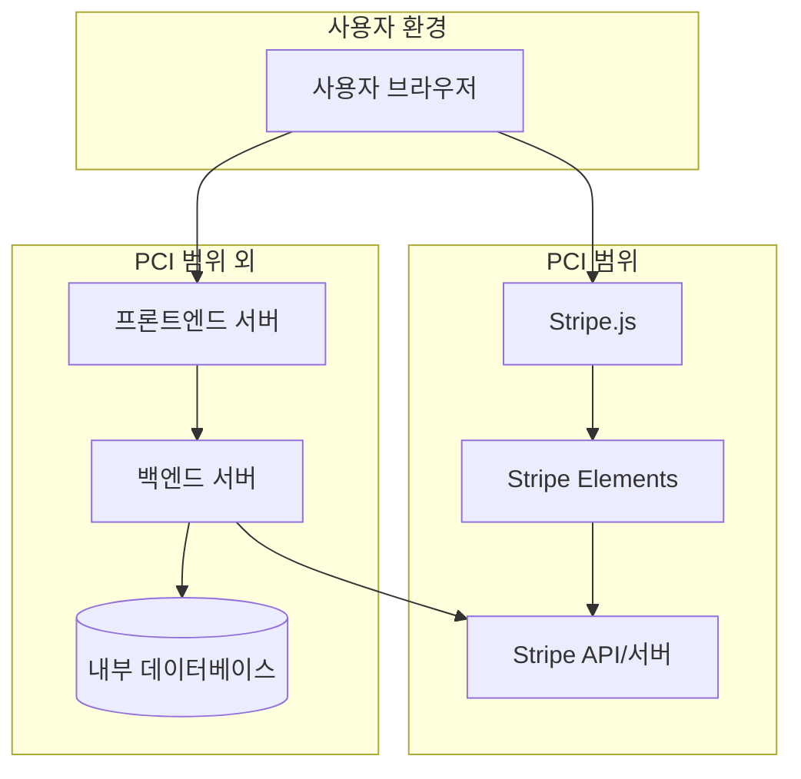
```mermaid
flowchart TD
    subgraph User [사용자 환경]
        Browser[사용자 브라우저]
    end

    subgraph PCI [PCI 범위]
        StripeJS[Stripe.js]
        StripeElements[Stripe Elements]
        StripeAPI[Stripe API/서버]
    end

    subgraph NonPCI [PCI 범위 외]
        Frontend[프론트엔드 서버]
        Backend[백엔드 서버]
        DB[(내부 데이터베이스)]
    end

    Browser --> Frontend
    Browser --> StripeJS
    StripeJS --> StripeElements
    StripeElements --> StripeAPI
    Frontend --> Backend
    Backend --> StripeAPI
    Backend --> DB
```

### 6.1.2 PCI 범위 제한 전략

1. **카드 정보 직접 처리 금지**:

   - 카드 정보(카드 번호, CVV, 만료일 등)는 절대 서버로 전송하지 않음
   - Stripe.js와 Elements를 사용하여 브라우저에서 직접 Stripe로 전송

2. **저장 금지**:

   - 민감한 카드 정보는 내부 데이터베이스에 저장하지 않음
   - 마스킹된 정보(last4, 카드 종류 등)만 보관

3. **토큰화**:
   - 카드 정보 대신 Stripe에서 발급한 토큰 또는 ID만 사용
   - PaymentMethod ID, SetupIntent ID 등 참조 값만 저장

## 6.2 API 보안

### 6.2.1 API 키 관리

```javascript
// 환경별 API 키 설정 예시
function configureStripe() {
  // 프로덕션 환경에서는 프로덕션 키 사용
  if (process.env.NODE_ENV === 'production') {
    return new Stripe(process.env.STRIPE_SECRET_KEY_PROD, {
      apiVersion: '2023-10-16',
      maxNetworkRetries: 3,
    });
  }

  // 스테이징 환경에서는 스테이징 전용 키 사용
  if (process.env.NODE_ENV === 'staging') {
    return new Stripe(process.env.STRIPE_SECRET_KEY_STAGING, {
      apiVersion: '2023-10-16',
      maxNetworkRetries: 2,
    });
  }

  // 개발/테스트 환경에서는 테스트 키 사용
  return new Stripe(process.env.STRIPE_SECRET_KEY_TEST, {
    apiVersion: '2023-10-16',
    maxNetworkRetries: 1,
  });
}
```

### 6.2.2 웹훅 서명 검증

```javascript
// 웹훅 서명 검증 미들웨어
function verifyStripeWebhookSignature(req, res, next) {
  const signature = req.headers['stripe-signature'];

  if (!signature) {
    return res.status(400).send('Stripe signature is missing');
  }

  try {
    // 원본 요청 본문과 서명을 사용하여 이벤트 구성
    const event = stripe.webhooks.constructEvent(
      req.rawBody, // Express에서 원본 요청 본문을 보존해야 함
      signature,
      process.env.STRIPE_WEBHOOK_SECRET,
    );

    // 검증된 이벤트를 요청 객체에 저장
    req.stripeEvent = event;
    next();
  } catch (error) {
    logger.error('Webhook 서명 검증 실패:', error);
    res.status(400).send(`Webhook Error: ${error.message}`);
  }
}

// Express 설정 예시
app.post(
  '/api/webhooks/stripe',
  express.raw({ type: 'application/json' }), // 원본 요청 본문 보존
  verifyStripeWebhookSignature,
  handleStripeWebhook,
);
```

### 6.2.3 클라이언트 측 보안

```javascript
// 프론트엔드에서 공개 키 사용 예시
const stripe = Stripe(process.env.NEXT_PUBLIC_STRIPE_PUBLISHABLE_KEY, {
  locale: 'ko', // 지역화 설정
  apiVersion: '2023-10-16',
});

// 민감한 작업에 대한 추가 검증
async function confirmCardPayment(clientSecret) {
  // 사용자 세션 유효성 검증
  if (!isUserSessionValid()) {
    throw new Error('유효하지 않은 세션입니다. 다시 로그인해주세요.');
  }

  // CSRF 토큰 검증
  if (!validateCsrfToken()) {
    throw new Error('보안 토큰이 유효하지 않습니다.');
  }

  // 결제 확인
  return await stripe.confirmCardPayment(clientSecret, {
    payment_method: { ... }
  });
}
```

## 6.3 데이터 보호

### 6.3.1 민감 정보 마스킹

```javascript
// 카드 정보 마스킹 함수
function maskCardData(card) {
  if (!card) return null;

  return {
    last4: card.last4,
    brand: card.brand,
    exp_month: card.exp_month,
    exp_year: card.exp_year,
    // 마스킹된 카드 번호 (예: **** **** **** 1234)
    masked_number: `**** **** **** ${card.last4}`,
    // 민감 정보는 제외
    // card_number, cvc 등은 제거
  };
}

// 로깅 시 민감 정보 제거
function sanitizeLogData(data) {
  if (!data) return null;

  const sanitized = { ...data };

  // API 키 마스킹
  if (sanitized.api_key) {
    sanitized.api_key = '****';
  }

  // 카드 정보 마스킹
  if (sanitized.card) {
    sanitized.card = maskCardData(sanitized.card);
  }

  // 고객 정보 부분 마스킹
  if (sanitized.customer && sanitized.customer.email) {
    // 이메일 일부 마스킹 (예: j***@example.com)
    const email = sanitized.customer.email;
    const [username, domain] = email.split('@');
    sanitized.customer.email = `${username.charAt(0)}***@${domain}`;
  }

  return sanitized;
}
```

### 6.3.2 데이터 암호화

```javascript
// 데이터베이스 필드 암호화 예시 (Mongoose)
const customerSchema = new mongoose.Schema({
  name: String,
  email: String,

  // 필드 수준 암호화
  phone: {
    type: String,
    encrypt: true, // 필드 암호화 적용
  },

  tax_id: {
    type: String,
    encrypt: true,
  },

  // 일반 필드
  stripe_customer_id: String,
  created_at: Date,
});

// 암호화 플러그인 적용
customerSchema.plugin(encryptionPlugin, {
  encryptionKey: process.env.ENCRYPTION_KEY, // 환경 변수에서 키 로드
  fields: ['phone', 'tax_id'], // 암호화할 필드 지정
});
```

## 6.4 국제 규정 준수

### 6.4.1 GDPR (유럽 개인정보보호법)

```javascript
// 고객 데이터 삭제 요청 처리 함수
async function handleCustomerDataDeleteRequest(organizationId) {
  try {
    // 내부 데이터베이스에서 정보 조회
    const organization = await Organization.findById(organizationId);

    if (!organization) {
      throw new Error('고객 정보를 찾을 수 없습니다.');
    }

    // Stripe에서 고객 정보 삭제
    if (organization.stripe_customer_id) {
      await stripe.customers.del(organization.stripe_customer_id);
    }

    // 내부 데이터 익명화
    await Organization.findByIdAndUpdate(organizationId, {
      name: 'DELETED_USER',
      email: `deleted_${Date.now()}@example.com`,
      phone: null,
      address: null,
      metadata: {},
      deleted_at: new Date(),
      is_deleted: true,
    });

    // 관련 트랜잭션 기록 보존 (법적 요구사항)
    // 하지만 식별 정보는 제거
    await Transaction.updateMany(
      { organization_id: organizationId },
      {
        customer_data_anonymized: true,
        anonymized_at: new Date(),
      },
    );

    return { success: true };
  } catch (error) {
    logger.error(`고객 데이터 삭제 오류: ${error.message}`, error);
    throw error;
  }
}
```

### 6.4.2 다국어 및 통화 지원

```javascript
// 통화별 결제 금액 처리 함수
function formatAmountForStripe(amount, currency) {
  // 소수점 자릿수가 있는 통화인지 확인
  const hasCents = ['USD', 'EUR', 'GBP', 'AUD', 'CAD'].includes(currency);

  if (hasCents) {
    // 센트 단위로 변환 (달러 → 센트)
    return Math.round(amount * 100);
  } else {
    // 원, 엔 등 소수점이 없는 통화는 그대로 사용
    return Math.round(amount);
  }
}

// 표시용 금액 포맷 함수
function formatAmountForDisplay(amount, currency) {
  const formatter = new Intl.NumberFormat(getCurrencyLocale(currency), {
    style: 'currency',
    currency,
    currencyDisplay: 'symbol',
  });

  // 소수점 자릿수가 있는 통화인지 확인
  const hasCents = ['USD', 'EUR', 'GBP', 'AUD', 'CAD'].includes(currency);

  if (hasCents) {
    // 센트 단위를 달러로 변환
    return formatter.format(amount / 100);
  } else {
    // 원, 엔 등은 그대로 표시
    return formatter.format(amount);
  }
}
```

# 7. API 선택 가이드

신규 프로젝트에서는 최신 Stripe API와 이벤트 처리 방식을 선택하는 것이 중요하다. 여기서는 optimal한 API 선택과 이벤트 처리 가이드라인을 제시한다.

## 7.1 최신 API 선택 가이드

### 7.1.1 권장 Stripe API

신규 프로젝트에서는 다음 API를 우선적으로 사용해야 한다:

1. **Payment Intents API**: 모든 결제 처리의 핵심 API

   - 3D Secure 인증 지원
   - 다양한 결제 방식 통합
   - 최신 규정 준수 (SCA 등)

2. **Payment Methods API**: 결제 수단 관리

   - 카드, 계좌이체 등 다양한 결제 수단 지원
   - 저장된 결제 수단 재사용

3. **Billing API**: 구독 및 인보이스 관리

   - 구독 생성 및 관리
   - 자동 청구 및 인보이스 처리

4. **Setup Intents API**: 결제 수단 설정

   - 결제 없이 카드 정보 검증
   - 향후 사용을 위한 결제 수단 저장

5. **Billing Portal API**: 고객 셀프 서비스 포털

   - 고객이 직접 구독 및 결제 수단 관리
   - 인보이스 및 결제 내역 조회
   - 구현 및 유지보수 비용 절감

6. **Metering API**: 사용량 기반 과금
   - V2 API (`/v2/billing/meter_events`)를 우선적으로 사용
   - 미터 이벤트를 통한 사용량 추적 및 청구
   - 유연한 사용량 기반 가격 책정

### 7.1.2 사용을 지양해야 할 레거시 API

하위 호환성을 위해 여전히 존재하지만, 신규 프로젝트에서는 사용을 지양해야 하는 API:

1. **Charges API**: 단순 결제 처리

   - SCA 미지원
   - 제한된 결제 방식

2. **Tokens API**: 일회용 결제 토큰

   - 재사용 불가
   - 제한된 기능

3. **Sources API**: 결제 소스 관리

   - 공식적으로 deprecated 상태
   - Payment Methods API로 대체됨

4. **Usage Records API (V1)**: 전통적인 사용량 기록 API
   - 하이브리드 접근법의 일부로만 사용 (V2 API 우선 사용)
   - 일부 환경과 버전에서 호환성 문제 발생 가능

## 7.2 이벤트 처리 최적화 가이드

### 7.2.1 우선 처리해야 할 이벤트

신규 프로젝트에서 중점적으로 처리해야 하는 이벤트:

1. **결제 관련**:

   - `payment_intent.succeeded`
   - `payment_intent.payment_failed`

2. **구독 관련**:

   - `customer.subscription.created`
   - `customer.subscription.updated`
   - `customer.subscription.deleted`
   - `invoice.payment_succeeded`
   - `invoice.payment_failed`

3. **결제 수단 관련**:

   - `payment_method.attached`
   - `payment_method.updated`
   - `payment_method.detached`

4. **고객 포털 관련**:

   - `billing_portal.session.created`
   - `billing_portal.configuration.updated`

5. **사용량 관련**:
   - `billing.meter_event.created`: 사용량 미터 이벤트 생성
   - `billing.meter_event.updated`: 사용량 미터 이벤트 업데이트

### 7.2.2 무시해도 되는 하위 호환 이벤트

신규 프로젝트에서는 다음 이벤트를 처리하지 않아도 된다:

1. **`charge.succeeded`**: `payment_intent.succeeded`로 대체됨
2. **`charge.failed`**: `payment_intent.payment_failed`로 대체됨
3. **`source.*` 이벤트들**: Sources API 관련 이벤트들
4. **`customer.source.*` 이벤트들**: 이전 결제 수단 관련 이벤트들

### 7.2.3 이벤트 처리 우선순위 설정

리소스와 시간이 제한된 경우, 다음 순서로 이벤트 처리를 구현하는 것이 효율적이다:

1. **필수 이벤트**:

   - `payment_intent.succeeded`
   - `payment_intent.payment_failed`
   - `invoice.payment_succeeded` (구독 모델 사용 시)
   - `customer.subscription.created/updated/deleted` (구독 모델 사용 시)

2. **중요 이벤트**:

   - `payment_method.attached/detached`
   - `invoice.created/finalized`
   - `customer.created/updated`

3. **보조 이벤트**:
   - `customer.subscription.trial_will_end`
   - `setup_intent.succeeded`
   - 기타 이벤트들

## 7.3 이벤트 처리 구현 패턴

### 7.3.1 이벤트 라우터 패턴

여러 이벤트를 효율적으로 관리하기 위한 라우터 패턴 구현:

```javascript
// 이벤트 라우터 패턴 예시
class WebhookEventRouter {
  // 이벤트 핸들러 맵
  static handlers = {
    'payment_intent.succeeded': handlePaymentIntentSucceeded,
    'payment_intent.payment_failed': handlePaymentIntentFailed,
    'invoice.payment_succeeded': handleInvoicePaymentSucceeded,
    'customer.subscription.created': handleSubscriptionCreated,
    // 기타 이벤트 핸들러...
  };

  // 이벤트 라우팅 메소드
  static async routeEvent(event) {
    const handler = this.handlers[event.type];

    if (handler) {
      await handler(event.data.object);
      return true;
    } else {
      console.log(`핸들러가 없는 이벤트 타입: ${event.type}`);
      return false;
    }
  }
}

// 사용 예시
app.post('/webhook', async (req, res) => {
  try {
    const event = stripe.webhooks.constructEvent(req.rawBody, req.headers['stripe-signature'], process.env.STRIPE_WEBHOOK_SECRET);

    // 이벤트 라우팅
    await WebhookEventRouter.routeEvent(event);

    res.status(200).send({ received: true });
  } catch (err) {
    res.status(400).send(`Webhook Error: ${err.message}`);
  }
});
```

### 7.3.2 이벤트 처리 큐 구현

대량의 이벤트를 안정적으로 처리하기 위한 큐 시스템:

```javascript
// 이벤트 처리 큐 예시 (Redis 및 Bull 사용)
const Queue = require('bull');

// 웹훅 이벤트 처리 큐 생성
const webhookQueue = new Queue('stripe-webhooks', {
  redis: {
    host: process.env.REDIS_HOST,
    port: process.env.REDIS_PORT,
  },
});

// 웹훅 엔드포인트에서 큐에 이벤트 추가
app.post('/webhook', async (req, res) => {
  try {
    const event = stripe.webhooks.constructEvent(req.rawBody, req.headers['stripe-signature'], process.env.STRIPE_WEBHOOK_SECRET);

    // 이벤트를 큐에 추가
    await webhookQueue.add(event, {
      attempts: 3,
      backoff: {
        type: 'exponential',
        delay: 5000,
      },
    });

    res.status(200).send({ received: true });
  } catch (err) {
    res.status(400).send(`Webhook Error: ${err.message}`);
  }
});

// 큐 워커 설정
webhookQueue.process(async (job) => {
  const event = job.data;

  try {
    // 이벤트 처리 로직
    await WebhookEventRouter.routeEvent(event);

    // 처리 완료 기록
    await WebhookEvent.update({ stripe_event_id: event.id }, { processed: true, processed_at: new Date() });

    return { success: true };
  } catch (error) {
    console.error(`이벤트 ${event.id} 처리 오류:`, error);

    // 실패 정보 기록
    await WebhookEvent.update({ stripe_event_id: event.id }, { error_message: error.message });

    // 재시도 여부 결정
    if (job.attemptsMade < job.opts.attempts - 1) {
      throw error; // 재시도를 위해 오류 발생
    }

    return { success: false, error: error.message };
  }
});
```

# 8. 테스트 전략

## 8.1 테스트 환경

1. **Stripe 테스트 모드**: 실제 결제 없이 모든 기능 테스트 가능
2. **테스트 클록**: 구독 주기를 빠르게 시뮬레이션하여 테스트

## 8.2 테스트 시나리오

1. **결제 수단 등록/삭제**: 다양한 카드 유형 테스트
2. **구독 라이프사이클**: 생성, 업그레이드, 다운그레이드, 취소 등
3. **결제 실패 처리**: 다양한 실패 시나리오 및 복구 흐름
4. **Webhook 처리**: 모든 주요 이벤트에 대한 처리 검증
5. **고객 포털 테스트**:
   - 포털 세션 생성 및 접근 검증
   - 구독 관리 기능 테스트 (변경, 취소 등)
   - 결제 수단 관리 테스트 (추가, 변경, 삭제)
   - 인보이스 조회 및 다운로드 테스트
   - 리디렉션 URL 동작 확인

# 9. 운영 및 유지보수

## 9.1 모니터링 및 알림

1. **결제 성공률**: (성공한 결제 / 시도된 결제) × 100%
2. **구독 해지율**: (해지된 구독 / 총 구독) × 100%
3. **MRR(Monthly Recurring Revenue)**: 월간 반복 수익
4. **ARPU(Average Revenue Per User)**: 사용자당 평균 수익
5. **결제 실패율**: (실패한 결제 / 시도된 결제) × 100%

## 9.2 알림 설정

1. **결제 실패**: 임계값 초과 시 운영팀 알림 (예: 1시간 내 5건 이상)
2. **구독 취소**: 대량 취소 시 알림 (예: 1일 내 정상 평균의 2배 이상)
3. **Webhook 실패**: 연속 실패 시 알림
4. **데이터 불일치**: 정기 검사에서 불일치 발견 시 알림

자세한 알림 시스템 구현 방법은 12장을 참조한다.

## 9.3 보안 고려사항

1. **PCI 규정 준수**: 민감한 카드 정보는 백엔드를 거치지 않고 Stripe Elements로 직접 처리
2. **사기 방지**: Stripe Radar 활용
3. **사용량 제한**: API 요청 제한으로 악의적 시도 방지

## 9.4 테스트 전략

1. **테스트 환경**: Stripe 테스트 모드 활용
2. **테스트 시나리오**: 다양한 시나리오 및 복구 흐름 테스트
3. **모니터링**: 실시간 지표 모니터링
4. **알림 설정**: 결제 실패, 구독 취소, Webhook 실패 등 알림 설정

## 9.5 운영 및 유지보수 가이드

1. **일일 백업**: 내부 DB 및 외부 스토리지 백업
2. **로그 분석**: 상세한 로깅으로 문제 지점 식별
3. **복구 프로세스**: 불일치 발견 시 자동 또는 수동 복구 프로세스 실행
4. **보안 감사**: 정기적인 보안 감사 및 개선 사항 도출
5. **모니터링 도구**: Grafana, Datadog 등 모니터링 도구 활용

# 10. 비즈니스 인텔리전스 및 보고

## 10.1 핵심 보고서

1. **매출 보고서**: 일/주/월/연간 매출 추이
2. **구독 메트릭**: 신규/해지/업그레이드/다운그레이드 추이
3. **고객 LTV(Life Time Value)**: 고객별 예상 수명 가치
4. **결제 성공률**: 시간에 따른 결제 성공률 추이
5. **Churn 분석**: 해지 사유 및 패턴 분석

## 10.2 데이터 파이프라인

1. **Stripe 데이터 익스포트**: 정기적으로 Stripe 데이터를 DW로 익스포트
2. **내부 DB 통합**: 결제 데이터와 사용 데이터 통합 분석
3. **시각화**: Tableau, PowerBI 등을 통한 데이터 시각화

# 11. 효과적인 알림 시스템 구현

결제 시스템에서 알림은 사용자 경험과 비즈니스 연속성을 보장하는 핵심 요소이다. 효과적인 알림 시스템은 다음 측면에서 접근해야 한다.

## 11.1 알림 유형 및 채널

### 11.1.1 고객 대상 알림

고객에게 전달되는 알림은 명확하고 실행 가능한 정보를 제공해야 한다:

1. **트랜잭션 알림**:

   - 결제 성공/실패 알림
   - 구독 생성/갱신/취소 알림
   - 인보이스 발행/결제 완료 알림

2. **예방적 알림**:

   - 신용카드 만료 예정 알림 (만료 30일/7일 전)
   - 구독 갱신 예정 알림 (갱신 7일/1일 전)
   - 무료 체험 종료 예정 알림 (종료 3일/1일 전)

3. **채널별 최적화**:
   | 채널 | 적합한 알림 유형 | 특징 |
   | --- | --- | --- |
   | 이메일 | 인보이스, 영수증, 상세 설명이 필요한 알림 | 공식 기록으로 보존, 상세 정보 포함 가능 |
   | SMS/문자 | 긴급 알림, 결제 실패, 액션 필요 사항 | 빠른 확인률, 간결한 메시지로 즉각 대응 유도 |
   | 인앱 알림 | 일상적 알림, 정보성 알림 | 앱 사용 중에만 확인 가능, 컨텍스트 제공 용이 |
   | 푸시 알림 | 중요 알림, 즉각적 조치 필요 사항 | 높은 주목도, 사용자 개입 없이도 전달 |

### 11.1.2 내부 시스템/운영팀 알림

시스템 및 비즈니스 상태를 모니터링하기 위한 내부 알림:

1. **시스템 알림**:

   - Webhook 오류 알림
   - API 응답 지연/오류 알림
   - 재시도 한계 도달 알림

2. **비즈니스 알림**:

   - 이상 결제 패턴 감지
   - 대량 구독 취소 발생
   - 결제 실패율 임계값 초과

3. **채널별 구성**:
   | 채널 | 적합한 알림 유형 | 구성 방법 |
   | --- | --- | --- |
   | 이메일 | 일일/주간 요약 보고서, 중간 우선순위 알림 | 이메일 서비스(Mailgun, SendGrid 등) 연동 |
   | Slack/Teams | 실시간 알림, 팀 협업 필요 사항 | Webhook 연동으로 전용 채널에 알림 발송 |
   | SMS/전화 | 긴급 장애, 고우선순위 알림 | 알림 서비스(PagerDuty, OpsGenie 등) 연동 |
   | 모니터링 대시보드 | 실시간 지표, 트렌드 분석 | Grafana, Datadog 등 모니터링 도구 활용 |

## 11.2 Stripe 이벤트 기반 알림 구현

Stripe Webhook 이벤트를 활용한 알림 시스템 구현 방법:

### 11.2.1 주요 알림 대상 이벤트

| 이벤트                                 | 알림 대상    | 알림 내용                           | 우선순위 |
| -------------------------------------- | ------------ | ----------------------------------- | -------- |
| `invoice.payment_failed`               | 고객, 운영팀 | 결제 실패 안내, 재시도 방법         | 높음     |
| `customer.subscription.trial_will_end` | 고객         | 체험 종료 예정, 결제 수단 등록 안내 | 중간     |
| `invoice.upcoming`                     | 고객         | 다가오는 청구 예정 안내             | 낮음     |
| `payment_intent.succeeded`             | 고객         | 결제 성공 확인                      | 낮음     |
| `charge.dispute.created`               | 운영팀       | 분쟁/환불 요청 발생                 | 높음     |
| `customer.subscription.deleted`        | 고객, 운영팀 | 구독 종료 확인, 피드백 요청         | 중간     |

### 11.2.2 알림 처리 아키텍처

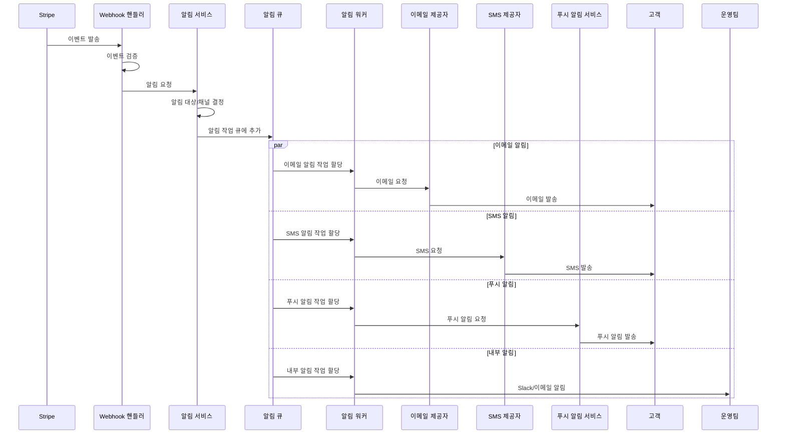
```mermaid
sequenceDiagram
    participant Stripe
    participant WebhookHandler as Webhook 핸들러
    participant NotificationService as 알림 서비스
    participant Queue as 알림 큐
    participant Workers as 알림 워커
    participant EmailProvider as 이메일 제공자
    participant SMSProvider as SMS 제공자
    participant PushService as 푸시 알림 서비스
    participant Customer as 고객
    participant Team as 운영팀

    Stripe->>WebhookHandler: 이벤트 발송
    WebhookHandler->>WebhookHandler: 이벤트 검증
    WebhookHandler->>NotificationService: 알림 요청
    NotificationService->>NotificationService: 알림 대상/채널 결정
    NotificationService->>Queue: 알림 작업 큐에 추가

    par 이메일 알림
        Queue->>Workers: 이메일 알림 작업 할당
        Workers->>EmailProvider: 이메일 요청
        EmailProvider->>Customer: 이메일 발송
    and SMS 알림
        Queue->>Workers: SMS 알림 작업 할당
        Workers->>SMSProvider: SMS 요청
        SMSProvider->>Customer: SMS 발송
    and 푸시 알림
        Queue->>Workers: 푸시 알림 작업 할당
        Workers->>PushService: 푸시 알림 요청
        PushService->>Customer: 푸시 알림 발송
    and 내부 알림
        Queue->>Workers: 내부 알림 작업 할당
        Workers->>Team: Slack/이메일 알림
    end
```

### 11.2.3 알림 처리 예시 코드

Webhook 이벤트를 받아 알림을 처리하는 Node.js 예시:

```javascript
// 알림 서비스 구현 예시
class NotificationService {
  async processStripeEvent(event) {
    switch (event.type) {
      case 'invoice.payment_failed':
        await this.handleInvoicePaymentFailed(event.data.object);
        break;
      case 'customer.subscription.deleted':
        await this.handleSubscriptionCanceled(event.data.object);
        break;
      // 기타 이벤트 처리...
    }
  }

  async handleInvoicePaymentFailed(invoice) {
    const customer = await stripe.customers.retrieve(invoice.customer);
    const user = await this.findUserByCustomerId(invoice.customer);

    // 1. 고객 알림
    await this.notificationQueue.add('customer-notification', {
      recipient: {
        userId: user.id,
        email: customer.email,
        phone: customer.phone,
      },
      template: 'payment-failed',
      data: {
        invoiceId: invoice.id,
        amount: invoice.amount_due,
        currency: invoice.currency,
        paymentUrl: invoice.hosted_invoice_url,
        attemptCount: invoice.attempt_count,
        nextAttemptDate: this.calculateNextAttemptDate(invoice),
      },
      channels: ['email', 'sms', 'push'],
      priority: 'high',
    });

    // 2. 내부 알림 (임계값 기반)
    if (this.shouldSendInternalAlert(invoice)) {
      await this.notificationQueue.add('internal-notification', {
        template: 'payment-failure-alert',
        data: {
          customer: {
            id: customer.id,
            email: customer.email,
            name: customer.name,
          },
          invoice: {
            id: invoice.id,
            amount: invoice.amount_due,
            currency: invoice.currency,
            attemptCount: invoice.attempt_count,
            failureReason: invoice.last_payment_error?.message || '알 수 없음',
          },
        },
        channels: ['slack', 'email'],
        recipients: this.getFinanceTeamRecipients(),
      });
    }
  }

  // 기타 알림 핸들러 메서드...
}
```

## 11.3 알림 템플릿 설계

효과적인 알림을 위한 템플릿 설계 원칙:

1. **명확한 제목과 요약**:

   - 알림의 목적을 즉시 파악할 수 있는 제목
   - 핵심 정보를 요약한 첫 문단

2. **실행 가능한 정보**:

   - 문제 해결을 위한 명확한 단계 제시
   - 바로 액션을 취할 수 있는 링크/버튼 포함

3. **맥락 정보 제공**:

   - 관련 계정/구독/인보이스 정보
   - 시간 정보 (발생 시간, 다음 시도 예정 시간 등)

4. **일관된 브랜딩**:

   - 회사 브랜드 요소 적용
   - 공식 커뮤니케이션임을 명확히 표시

5. **채널별 최적화**:
   - 이메일: HTML/텍스트 버전 모두 제공, 모바일 반응형 디자인
   - SMS: 160자 이내의 간결한 메시지, 중요 링크 포함
   - 푸시 알림: 50자 이내의 메시지, 탭 시 관련 화면으로 이동

### 11.3.1 이메일 템플릿 예시 (결제 실패)

```html
<div style="font-family: Arial, sans-serif; max-width: 600px; margin: 0 auto;">
  <div style="background-color: #f5f5f5; padding: 20px; text-align: center;">
    
  </div>

  <div style="padding: 20px;">
    <h2>결제에 실패했습니다</h2>

    <p>안녕하세요 {{customer.name}}님,</p>

    <p>최근 구독 결제가 실패했습니다. 서비스 이용에 문제가 없도록 가능한 빨리 결제 문제를 해결해 주시기 바랍니다.</p>

    <div style="background-color: #f9f9f9; padding: 15px; border-radius: 5px; margin: 20px 0;">
      <p>
        <strong>구독:</strong>
        {{subscription.name}}
      </p>
      <p>
        <strong>금액:</strong>
        {{format_amount(invoice.amount)}} {{invoice.currency}}
      </p>
      <p>
        <strong>실패 이유:</strong>
        {{failure_reason}}
      </p>
      <p>
        <strong>다음 자동 결제 시도:</strong>
        {{format_date(next_attempt_date)}}
      </p>
    </div>

    <div style="text-align: center; margin: 30px 0;">
      <a
        href="{{payment_url}}"
        style="background-color: #4CAF50; color: white; padding: 12px 20px; text-decoration: none; border-radius: 4px; font-weight: bold;"
      >
        지금 결제하기
      </a>
    </div>

    <p>
      또는
      <a href="{{update_payment_method_url}}">결제 수단을 업데이트</a>
      할 수 있습니다.
    </p>

    <p>
      궁금한 점이 있으시면 언제든지
      <a href="mailto:support@example.com">고객 지원팀</a>
      에 문의해 주세요.
    </p>
  </div>

  <div style="background-color: #f5f5f5; padding: 15px; text-align: center; font-size: 12px; color: #666;">
    <p>© 2023 Example Company. All rights reserved.</p>
    <p>
      <a href="{{unsubscribe_url}}">이메일 구독 해제</a>
      |
      <a href="{{privacy_url}}">개인정보처리방침</a>
    </p>
  </div>
</div>
```

## 11.4 알림 전략 최적화

알림 효과를 극대화하기 위한 전략:

1. **사용자 환경설정 제공**:

   - 알림 유형별 수신 여부 설정
   - 채널별 선호도 설정 (이메일/SMS/푸시 등)
   - 알림 빈도 조절 옵션

2. **점진적 알림 전략**:

   - 중요도에 따른 채널 확대 (예: 처음엔 인앱 → 이메일 → SMS)
   - 시간 경과에 따른 알림 반복 (첫 실패 → 3일 후 → 7일 후)

3. **A/B 테스트 및 최적화**:

   - 알림 제목, 콘텐츠, 발송 시간 테스트
   - 클릭률, 해결률 등 지표 기반 최적화

4. **알림 피로도 관리**:
   - 알림 도달 제한 (일일/주간 최대 알림 수)
   - 유사 알림 통합으로 중복 방지
   - 사용자 시간대 고려한 발송 시간 설정

## 11.5 Stripe 알림과 자체 알림 시스템 통합 전략

결제 시스템의 알림은 Stripe에서 제공하는 알림과 자체적으로 구현하는 알림을 적절히 조합하여 사용해야 효율적이다. 두 시스템의 특성을 이해하고 최적의 조합을 찾는 것이 중요하다.

### 11.5.1 Stripe 제공 알림과 자체 알림 비교

| 측면             | Stripe 제공 알림                      | 자체 알림 시스템                              |
| ---------------- | ------------------------------------- | --------------------------------------------- |
| **구현 난이도**  | 낮음 (기본 설정으로 즉시 사용)        | 높음 (개발 및 인프라 구축 필요)               |
| **커스터마이징** | 제한적 (로고, 색상, 기본 문구만 변경) | 완전한 자유도 (디자인, 내용, 로직 등)         |
| **알림 채널**    | 이메일 중심                           | 다양한 채널 지원 (이메일, SMS, 푸시, 인앱 등) |
| **유지보수**     | Stripe에서 관리                       | 자체 리소스로 관리                            |
| **사용자 설정**  | 제한적                                | 상세한 환경설정 가능                          |

### 11.5.2 하이브리드 알림 전략

효율성과 사용자 경험 모두를 최적화하기 위해 하이브리드 접근법을 권장한다:

1. **Stripe 알림 활용이 적합한 경우**:

   - 표준적인 트랜잭션 알림 (인보이스 발행, 영수증)
   - 법적 요구사항이 있는 공식 문서 (영수증, 세금 관련 문서)
   - 카드 만료와 같은 결제 수단 관련 기본 알림

2. **자체 알림 시스템이 유리한 경우**:

   - 즉각적인 대응이 필요한 중요 알림 (결제 실패)
   - 다중 채널 활용이 필요한 경우 (SMS, 푸시 알림 등)
   - 복잡한 비즈니스 로직이 필요한 알림
   - 내부 시스템/운영팀 대상 알림

3. **일관된 사용자 경험을 위한 조치**:
   - Stripe 브랜딩 설정을 통해 자동 알림의 로고, 색상을 자체 브랜드와 일치시킴
   - 모든 알림이 일관된 어조와 스타일을 유지하도록 템플릿 설계
   - 사용자 포털에서 모든 알림 히스토리를 통합 관리

### 11.5.3 알림 담당 분리 가이드

| 알림 유형      | 권장 시스템 | 이유                                  |
| -------------- | ----------- | ------------------------------------- |
| 인보이스 발행  | Stripe      | PDF 첨부 및 법적 문서로서의 표준 형식 |
| 결제 영수증    | Stripe      | 법적 요구사항을 충족하는 표준 양식    |
| 카드 만료 예정 | Stripe      | 자동으로 시기 파악하여 발송           |
| 결제 실패      | 자체 시스템 | 다양한 채널, 즉시 대응 유도 필요      |
| 체험 종료 예정 | 자체 시스템 | 전환율 향상을 위한 맞춤형 메시지      |
| 구독 변경/취소 | 자체 시스템 | 비즈니스 로직 및 후속 조치 연계       |
| 내부 알림      | 자체 시스템 | Slack, 모니터링 도구 등과 통합 필요   |

### 11.5.4 Stripe 알림 설정 및 자체 시스템 연동

1. **Stripe 이메일 템플릿 커스터마이징**:

   ```javascript
   // Stripe 대시보드 > 설정 > 이메일에서 설정 가능
   // 프로그래매틱 설정 예시
   const account = await stripe.accounts.update('acct_123456789', {
     settings: {
       branding: {
         logo: 'https://example.com/logo.png',
         primary_color: '#4CAF50',
         secondary_color: '#2196F3',
       },
       email: {
         support_email: 'support@example.com',
       },
     },
   });
   ```

2. **Stripe 자동 이메일 설정**:

   - 대시보드에서 활성화/비활성화 가능한 이메일:
     - 인보이스 이메일 (발행, 결제, 실패)
     - 구독 알림 (생성, 갱신, 취소)
     - 영수증 이메일

3. **자체 알림 시스템과 Stripe 통합**:

   ```javascript
   // 알림 중복 방지를 위한 Webhook 처리 예시
   async function processStripeEvent(event) {
     // Stripe 자동 이메일 설정에 따라 처리 방향 결정
     const stripeSettings = await getStripeEmailSettings();

     switch (event.type) {
       case 'invoice.payment_failed':
         // 결제 실패는 항상 자체 시스템에서 처리 (중요도 높음)
         await sendOwnNotification(event.data.object, 'payment_failed');
         break;

       case 'invoice.created':
         // 인보이스 생성은 Stripe 설정에 따라 처리 방향 결정
         if (!stripeSettings.invoice_emails_enabled) {
           await sendOwnNotification(event.data.object, 'invoice_created');
         }
         // Stripe에서 처리하도록 별도 조치 없음
         break;

       // 기타 이벤트...
     }
   }
   ```

4. **구현 단계별 접근법**:
   - **초기 단계**: Stripe 알림 최대 활용 + 브랜딩만 조정
   - **성장 단계**: 중요 알림부터 점진적으로 자체 시스템 구현
   - **성숙 단계**: 사용자 행동 분석 기반의 알림 최적화

## 11.6 성능 및 신뢰성 보장

알림 시스템의 안정성을 위한 구현 전략:

1. **비동기 처리**:

   - 알림 생성과 발송을 분리하여 메인 요청 처리에 영향 없게 함
   - 메시지 큐 시스템 활용 (RabbitMQ, Redis, SQS 등)

2. **재시도 메커니즘**:

   - 알림 전송 실패 시 지수 백오프(exponential backoff) 방식의 재시도
   - 최대 재시도 횟수 및 최종 실패 처리 방안 마련

3. **모니터링 및 알림 감사**:

   - 알림 전송률, 오류율 등 지표 모니터링
   - 모든 알림 기록 저장 및 감사 기능

4. **대량 알림 처리 전략**:
   - 배치 처리로 API 호출 최소화
   - 채널별 속도 제한(rate limiting) 구현
   - 중요도에 따른 우선순위 큐 관리

## 11.7 알림 관련 데이터베이스 스키마

알림 시스템을 위한 데이터베이스 설계:

```sql
-- 알림 템플릿 테이블
CREATE TABLE notification_templates (
  id UUID PRIMARY KEY,
  code VARCHAR(100) NOT NULL UNIQUE, -- 'payment_failed', 'subscription_renewed' 등
  name VARCHAR(255) NOT NULL,
  description TEXT,
  subject_template TEXT, -- 이메일 제목 등에 사용될 템플릿
  body_template TEXT, -- 기본 메시지 본문 템플릿
  email_template TEXT, -- HTML 이메일용 템플릿
  sms_template TEXT, -- SMS용 간결한 템플릿
  push_template TEXT, -- 푸시 알림용 템플릿
  variables JSONB, -- 템플릿에서 사용 가능한 변수 목록
  created_at TIMESTAMP WITH TIME ZONE DEFAULT NOW(),
  updated_at TIMESTAMP WITH TIME ZONE DEFAULT NOW()
);

-- 발송된 알림 기록 테이블
CREATE TABLE notifications (
  id UUID PRIMARY KEY,
  user_id UUID REFERENCES users(id),
  template_code VARCHAR(100) NOT NULL REFERENCES notification_templates(code),
  channels JSONB NOT NULL, -- ['email', 'sms', 'push'] 등
  data JSONB NOT NULL, -- 템플릿에 주입된 실제 데이터
  status VARCHAR(50) NOT NULL, -- 'pending', 'sent', 'failed', 'delivered', 'read'
  external_ids JSONB, -- 각 채널별 외부 시스템 ID (이메일 ID, SMS ID 등)
  error_message TEXT,
  retry_count INT DEFAULT 0,
  scheduled_at TIMESTAMP WITH TIME ZONE,
  created_at TIMESTAMP WITH TIME ZONE DEFAULT NOW(),
  updated_at TIMESTAMP WITH TIME ZONE DEFAULT NOW()
);

-- 알림 설정 테이블
CREATE TABLE notification_preferences (
  id UUID PRIMARY KEY,
  user_id UUID NOT NULL REFERENCES users(id),
  notification_type VARCHAR(100) NOT NULL, -- 'payment', 'subscription', 'system' 등
  email_enabled BOOLEAN DEFAULT TRUE,
  sms_enabled BOOLEAN DEFAULT FALSE,
  push_enabled BOOLEAN DEFAULT TRUE,
  created_at TIMESTAMP WITH TIME ZONE DEFAULT NOW(),
  updated_at TIMESTAMP WITH TIME ZONE DEFAULT NOW(),
  UNIQUE (user_id, notification_type)
);
```
