# Stripe Dashboard 정보

- URL: https://dashboard.stripe.com/test/dashboard
- 로그인 정보
  - Email: [raymond.jeon@ewoosoft.com](mailto:raymond.jeon@ewoosoft.com)
  - Password: EwoosoftStripePrototype

## Stripe Dashboard 주요 메뉴

### 메인 메뉴

- **Home**: Dashboard 메인 화면으로, 결제 및 매출 개요, 최근 활동, API 키 등을 확인할 수 있다.
- **Balances**: 계정 잔액, 예정된 지급 금액, 보류 중인 금액 등 자금 현황을 확인할 수 있다.
- **Transactions**: 모든 결제, 환불, 분쟁 등 금융 거래 내역을 확인하고 관리할 수 있다.
- **Customers**: 등록된 고객 목록 관리 및 고객별 결제 수단, 구독 정보, 결제 내역 등을 확인할 수 있다.
- **Product catalog**: 판매 제품, 가격 모델, 구독 플랜 등을 생성하고 관리할 수 있다.

### 제품 메뉴

- **Payments**: 결제 관련 설정 및 기능을 관리한다.
  - **Analytics**: 결제 데이터 분석 및 통계를 확인할 수 있다.
  - **Disputes**: 분쟁, 이의 제기된 결제건을 관리한다.
  - **Radar**: 부정 거래 감지 및 방지 기능을 설정한다.
  - **Payment Links**: 결제 링크를 생성하고 관리한다.
  - **Terminal**: 오프라인 결제를 위한 단말기 설정과 관리를 한다.
- **Billing**: 구독, 인보이스, 견적 등 청구 관련 기능을 관리한다.
  - **Overview**: 구독 기반 비즈니스의 주요 지표와 성과를 한눈에 파악할 수 있는 종합 대시보드
  - **Subscriptions**: 구독 상품을 설정하고 관리한다. 정기 결제 고객 관리와 구독 상태 추적이 가능하다.
  - **Invoices**: 고객에게 발송된 인보이스를 생성, 관리, 추적한다.
  - **Meters**: 사용량 기반 과금을 위한 미터링 시스템을 설정하고 관리한다.
  - **Revenue recovery**: 실패한 결제 복구 및 연체 관리 기능을 제공한다.
- **Reporting**: 재무 보고서, 세금 보고서 등 다양한 보고서를 생성하고 확인할 수 있다.
  - **Reports**: 결제, 구독, 환불 등 다양한 재무 관련 데이터 보고서를 생성한다.
  - **Custom metrics**: 맞춤형 지표를 설정하고 추적할 수 있다.
  - **Sigma**: SQL을 사용하여 Stripe 데이터를 쿼리하고 분석할 수 있는 기능이다.
  - **Revenue Recognition**: 수익 인식 규칙을 설정하고 회계 목적의 보고서를 생성한다.
  - **Data management**: Stripe 계정 데이터를 관리하고 정리할 수 있다.
- **More**: 추가 기능 메뉴로 확장된다.
  - **Tax**: 세금 계산 및 세금 보고서 관련 기능을 관리한다.
  - **Connect**: 다중 판매자 플랫폼을 위한 결제 분배 기능을 설정한다.
  - **Identity**: 사용자 신원 확인 서비스를 관리한다.
  - **Atlas**: 스타트업 법인 설립 및 비즈니스 도구를 제공한다.
  - **Issuing**: 가상 및 물리적 카드 발행 서비스를 관리한다.
  - **Financial Connections**: 금융 계좌 연결 및 데이터 액세스를 관리한다.
  - **Climate**: 탄소 제거 프로젝트에 기여할 수 있는 기능을 제공한다.
  - **Global Payouts**: 전 세계 수취인에게 자금을 보낼 수 있는 기능을 관리한다.

### 개발자 메뉴

- **Developers**: API 문서, 웹훅, 로그, 개발 도구 등 개발자 리소스에 접근할 수 있다.

## 설정 페이지 주요 메뉴

### 개인 설정 (Personal settings)

- **Profile**: 개인 정보, 비밀번호, 통신 환경 설정 및 활성 세션을 관리한다.
- **Communication preferences**: 이메일, SMS, 푸시 알림 등 알림 방식을 설정한다.
- **Developers**: 개발자 작업 환경, 도구 및 API 관련 설정을 관리한다.

### 계정 설정 (Account settings)

- **Business**: 회사 정보, 계정 상태, 공개 정보, 지급 방식, 법적 실체 등을 관리한다.
- **Team and security**: 팀원 관리, 역할 할당, 보안 설정, 앱 접근 권한, 공유 리소스 관리 등을 설정한다.
- **Your plans**: Stripe 서비스 요금제 관리 및 결제 방식을 확인할 수 있다.
- **Compliance and documents**: PCI 규정 준수 상태, 법적 문서, 과거 내역 등을 관리한다.

### 제품 설정 (Product settings)

- **Billing**: 구독, 인보이스, 견적 및 고객 포털과 관련된 설정을 관리한다.
- **Payments**: 결제 방식, 결제 수단, 통화 변환, 기타 결제 관련 설정을 구성한다.
- **Sigma**: 사용자 정의 보고서 도구인 Sigma 기능을 관리한다.
- **Financial Connections**: 금융 기관 연결, 기능 최적화, 사용 내역 등을 관리한다.
- **Radar**: 사기 방지 보호 기능 및 설정을 관리한다.
- **Discover more features**: 수익 증대, 재무 관리 등을 위한 추가 기능을 탐색한다.

# Stripe 고객 관리 아키텍처

Stripe에서의 고객(Customer) 관리는 결제, 구독, 인보이스 등 다양한 결제 기능의 기반이 되는 중요한 요소이다. 특히 SaaS 서비스 개발 시 고객 데이터의 효율적인 관리는 필수적이다.

## Stripe 고객 데이터 특성

### 이메일 중복 허용 문제

Stripe의 고객 데이터 관리에서 가장 주목해야 할 점은 **이메일 주소의 중복을 허용**한다는 것이다. 이는 다음과 같은 의미를 가진다:

1. 동일한 이메일로 여러 Customer 객체를 생성할 수 있다.
2. 이메일만으로는 고객의 유일성(Uniqueness)을 보장할 수 없다.
3. 서비스 내에서 별도의 중복 검증 로직이 필요하다.

```javascript
// 이메일이 동일한 두 고객을 생성할 수 있음
const customer1 = await stripe.customers.create({
  email: 'user@example.com',
  name: '사용자 A',
});

const customer2 = await stripe.customers.create({
  email: 'user@example.com', // 동일한 이메일
  name: '사용자 B',
});

// 두 고객은 서로 다른 ID를 가짐
console.log(customer1.id); // 예: cus_Abcd1234
console.log(customer2.id); // 예: cus_Efgh5678
```

이러한 특성은 Stripe가 다양한 비즈니스 모델과 유연하게 통합될 수 있도록 설계되었기 때문이지만, SaaS 서비스에서는 이에 대한 적절한 처리가 필요하다.

## 고객 데이터 관리 아키텍처

SaaS 서비스에서 고객 데이터를 효과적으로 관리하기 위한 아키텍처는 다음과 같다:

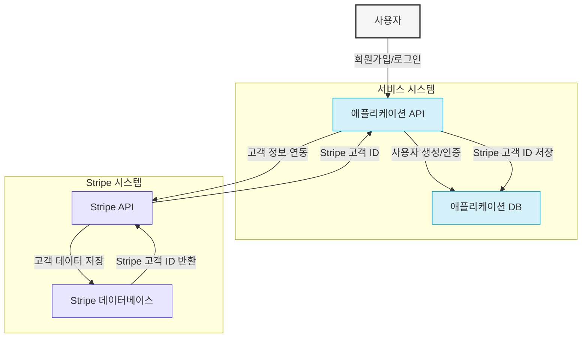

### 핵심 데이터 구조

#### 애플리케이션 DB의 사용자 테이블

```sql
CREATE TABLE users (
  id UUID PRIMARY KEY,
  email VARCHAR(255) UNIQUE NOT NULL,
  name VARCHAR(255),
  password_hash VARCHAR(255),
  stripe_customer_id VARCHAR(255) UNIQUE,
  created_at TIMESTAMP DEFAULT CURRENT_TIMESTAMP,
  updated_at TIMESTAMP DEFAULT CURRENT_TIMESTAMP
);

CREATE UNIQUE INDEX idx_users_email ON users(email);
CREATE INDEX idx_users_stripe_customer_id ON users(stripe_customer_id);
```

##### 1. 사용자(User) - Stripe Customer 매핑 모델

개인 사용자 중심 서비스의 경우, 각 사용자가 하나의 Stripe Customer와 매핑됩니다.

```sql
CREATE TABLE users (
  id UUID PRIMARY KEY,
  email VARCHAR(255) UNIQUE NOT NULL,
  name VARCHAR(255),
  password_hash VARCHAR(255),
  stripe_customer_id VARCHAR(255) UNIQUE,
  created_at TIMESTAMP DEFAULT CURRENT_TIMESTAMP,
  updated_at TIMESTAMP DEFAULT CURRENT_TIMESTAMP
);

CREATE UNIQUE INDEX idx_users_email ON users(email);
CREATE INDEX idx_users_stripe_customer_id ON users(stripe_customer_id);
```

##### 2. 조직(Organization) - Stripe Customer 매핑 모델

B2B 서비스나 팀 기반 서비스의 경우, 조직(또는 회사)이 하나의 Stripe Customer와 매핑되고, 여러 사용자가 하나의 조직에 속하는 구조가 일반적이다.

```sql
-- 조직 테이블
CREATE TABLE organizations (
  id UUID PRIMARY KEY,
  name VARCHAR(255) NOT NULL,
  email VARCHAR(255) NOT NULL,
  stripe_customer_id VARCHAR(255) UNIQUE,
  billing_address JSONB,
  tax_id VARCHAR(100),
  created_at TIMESTAMP WITH TIME ZONE DEFAULT CURRENT_TIMESTAMP,
  updated_at TIMESTAMP WITH TIME ZONE DEFAULT CURRENT_TIMESTAMP
);

CREATE UNIQUE INDEX idx_organizations_stripe_customer_id ON organizations(stripe_customer_id);

-- 사용자 테이블
CREATE TABLE users (
  id UUID PRIMARY KEY,
  email VARCHAR(255) UNIQUE NOT NULL,
  name VARCHAR(255),
  password_hash VARCHAR(255),
  organization_id UUID REFERENCES organizations(id),
  role VARCHAR(50) NOT NULL, -- 'admin', 'member' 등
  created_at TIMESTAMP WITH TIME ZONE DEFAULT CURRENT_TIMESTAMP,
  updated_at TIMESTAMP WITH TIME ZONE DEFAULT CURRENT_TIMESTAMP
);

CREATE UNIQUE INDEX idx_users_email ON users(email);
CREATE INDEX idx_users_organization_id ON users(organization_id);
```

#### Stripe 고객 객체 구조

```javascript
{
  id: 'cus_Abcd1234',
  object: 'customer',
  email: 'user@example.com',
  name: '사용자 A',
  phone: null,
  address: {
    /* 주소 정보 */
  },
  metadata: {
    app_user_id: '550e8400-e29b-41d4-a716-446655440000',
    subscription_tier: 'premium',
    company_name: '회사명',
    /* 기타 커스텀 데이터 */
  },
  /* 기타 필드 생략 */
}
```

##### 사용자-고객 매핑 시 Stripe 메타데이터 예시

```javascript
// 사용자 기반 매핑의 메타데이터
metadata: {
  app_user_id: '550e8400-e29b-41d4-a716-446655440000',
  user_type: 'individual',
  signup_source: 'direct',
  plan_type: 'premium'
}
```

##### 조직-고객 매핑 시 Stripe 메타데이터 예시

```javascript
// 조직 기반 매핑의 메타데이터
metadata: {
  organization_id: '63a8f2e5-56c3-4d09-b354-9a7c3f2ae6d9',
  org_type: 'business',
  industry: 'clinic',  
  plan_type: 'standard'
}
```

## 고객 관리 CRUD 작업

### 1. 고객 생성 (Create)

사용자 등록 시 다음과 같은 과정으로 Stripe 고객 데이터를 생성한다:

```javascript
// 백엔드 API 구현 예시
async function createCustomer(userData) {
  // 1. 이메일 중복 체크 (애플리케이션 DB)
  const existingUser = await db.users.findOne({ email: userData.email });
  if (existingUser) {
    throw new Error('이미 등록된 이메일입니다.');
  }

  // 2. 사용자 정보 저장 (애플리케이션 DB)
  const newUser = await db.users.create({
    id: uuid(),
    email: userData.email,
    name: userData.name,
    password_hash: await hashPassword(userData.password),
  });

  // 3. Stripe 고객 생성
  const stripeCustomer = await stripe.customers.create({
    email: userData.email,
    name: userData.name,
    phone: userData.phone,
    metadata: {
      app_user_id: newUser.id,
      signup_source: userData.source || 'direct',
    },
  });

  // 4. Stripe 고객 ID를 사용자 정보에 연결
  await db.users.update({ id: newUser.id }, { stripe_customer_id: stripeCustomer.id });

  return {
    user: newUser,
    stripe_customer_id: stripeCustomer.id,
  };
}
```

#### 고객 생성 시 고려사항

1. **이메일 중복 방지**:

   - 애플리케이션 DB에서 이메일 유일성을 강제한다.
   - 사용자 등록 전 항상 이메일 중복 검사를 수행한다.

2. **양방향 ID 매핑**:

   - 애플리케이션 사용자 ID를 Stripe 고객의 metadata에 저장한다.
   - Stripe 고객 ID를 애플리케이션 DB에 저장한다.

3. **트랜잭션 처리**:
   - 두 시스템 간 데이터 불일치를 방지하기 위한 트랜잭션 처리나 에러 복구 로직이 필요하다.

### 2. 고객 조회 (Read)

```javascript
// 단일 고객 조회
async function getCustomer(userId) {
  // 1. 애플리케이션 DB에서 사용자 정보 조회
  const user = await db.users.findOne({ id: userId });
  if (!user) {
    throw new Error('사용자를 찾을 수 없습니다.');
  }

  // 2. Stripe에서 고객 정보 조회
  const stripeCustomer = await stripe.customers.retrieve(user.stripe_customer_id);

  // 3. 필요한 정보 결합
  return {
    user_info: {
      id: user.id,
      email: user.email,
      name: user.name,
      created_at: user.created_at,
    },
    payment_info: {
      customer_id: stripeCustomer.id,
      default_payment_method: stripeCustomer.invoice_settings?.default_payment_method,
      has_payment_method: !!stripeCustomer.invoice_settings?.default_payment_method,
    },
  };
}

// 이메일로 고객 검색
async function findCustomerByEmail(email) {
  // 1. 애플리케이션 DB에서 검색 (정확한 이메일 매칭)
  const user = await db.users.findOne({ email });

  // 2. 사용자가 있으면 Stripe 고객 정보 조회
  if (user && user.stripe_customer_id) {
    const stripeCustomer = await stripe.customers.retrieve(user.stripe_customer_id);
    return { user, stripeCustomer };
  }

  return null;
}

// 여러 고객 조회 (페이지네이션)
async function listCustomers(page = 1, limit = 20) {
  const offset = (page - 1) * limit;

  // 1. 애플리케이션 DB에서 사용자 목록 조회
  const users = await db.users.findAll({
    limit,
    offset,
    order: [['created_at', 'DESC']],
  });

  // 2. Stripe 고객 ID 목록 추출
  const stripeCustomerIds = users.filter((user) => user.stripe_customer_id).map((user) => user.stripe_customer_id);

  // 3. Stripe API로 여러 고객 정보 조회 (효율적인 방법)
  const stripeCustomers = await stripe.customers.list({
    limit: stripeCustomerIds.length,
    starting_after: stripeCustomerIds[0],
    expand: ['data.invoice_settings.default_payment_method'],
  });

  // 4. 사용자 정보와 Stripe 고객 정보 매핑
  const customerMap = {};
  stripeCustomers.data.forEach((customer) => {
    customerMap[customer.id] = customer;
  });

  // 5. 통합 데이터 반환
  return users.map((user) => ({
    id: user.id,
    email: user.email,
    name: user.name,
    created_at: user.created_at,
    stripe_info: user.stripe_customer_id ? customerMap[user.stripe_customer_id] : null,
  }));
}
```

#### 고객 조회 시 고려사항

1. **성능 최적화**:

   - 불필요한 API 호출을 최소화한다.
   - 대량 조회 시 배치 처리를 활용한다.

2. **캐싱 전략**:

   - 자주 조회되는 고객 정보는 캐싱을 고려한다.
   - 캐시 무효화 정책을 명확히 설정한다.

3. **확장 필드 활용**:
   - Stripe API의 `expand` 파라미터를 활용하여 필요한 관련 객체 정보를 함께 조회한다.

### 3. 고객 정보 수정 (Update)

```javascript
// 고객 정보 업데이트
async function updateCustomer(userId, updateData) {
  // 1. 애플리케이션 DB에서 사용자 정보 조회
  const user = await db.users.findOne({ id: userId });
  if (!user) {
    throw new Error('사용자를 찾을 수 없습니다.');
  }

  // 2. 이메일 변경 시 중복 검사
  if (updateData.email && updateData.email !== user.email) {
    const existingUserWithEmail = await db.users.findOne({ email: updateData.email });
    if (existingUserWithEmail) {
      throw new Error('이미 사용 중인 이메일입니다.');
    }
  }

  // 3. 애플리케이션 DB 업데이트
  const updatedUser = await db.users.update(
    { id: userId },
    {
      ...(updateData.email && { email: updateData.email }),
      ...(updateData.name && { name: updateData.name }),
      updated_at: new Date(),
    },
  );

  // 4. Stripe 고객 정보 업데이트
  const stripeUpdateData = {};
  if (updateData.email) stripeUpdateData.email = updateData.email;
  if (updateData.name) stripeUpdateData.name = updateData.name;
  if (updateData.phone) stripeUpdateData.phone = updateData.phone;
  if (updateData.address) stripeUpdateData.address = updateData.address;
  if (updateData.metadata) stripeUpdateData.metadata = updateData.metadata;

  const updatedStripeCustomer = await stripe.customers.update(user.stripe_customer_id, stripeUpdateData);

  return {
    user: updatedUser,
    stripe_customer: updatedStripeCustomer,
  };
}

// 결제 방법 업데이트
async function updateCustomerPaymentMethod(userId, paymentMethodId) {
  // 1. 사용자 조회
  const user = await db.users.findOne({ id: userId });
  if (!user || !user.stripe_customer_id) {
    throw new Error('사용자 또는 Stripe 고객 정보를 찾을 수 없습니다.');
  }

  // 2. 결제 방법을 고객에 연결
  await stripe.paymentMethods.attach(paymentMethodId, {
    customer: user.stripe_customer_id,
  });

  // 3. 기본 결제 방법으로 설정
  const updatedCustomer = await stripe.customers.update(user.stripe_customer_id, {
    invoice_settings: {
      default_payment_method: paymentMethodId,
    },
  });

  return updatedCustomer;
}
```

#### 고객 정보 수정 시 고려사항

1. **동기화 문제**:

   - 애플리케이션 DB와 Stripe 간 데이터 일관성을 유지해야 한다.
   - 한 시스템에서 업데이트가 실패할 경우 롤백 전략을 고려한다.

2. **이메일 중복 처리**:

   - 이메일 변경 시 항상 중복 검사를 수행한다.
   - 이메일 변경 시 추가 인증 과정을 고려한다.

3. **업데이트 이벤트 처리**:
   - 중요 정보 변경 시 관련 시스템에 알림을 보내거나 이벤트를 발생시킨다.

### 4. 고객 삭제 (Delete)

```javascript
// 고객 삭제 (소프트 삭제 권장)
async function deleteCustomer(userId) {
  // 1. 애플리케이션 DB에서 사용자 정보 조회
  const user = await db.users.findOne({ id: userId });
  if (!user) {
    throw new Error('사용자를 찾을 수 없습니다.');
  }

  // 2. 활성 구독 확인
  if (user.stripe_customer_id) {
    const subscriptions = await stripe.subscriptions.list({
      customer: user.stripe_customer_id,
      status: 'active',
    });

    // 활성 구독이 있으면 모두 취소
    if (subscriptions.data.length > 0) {
      for (const subscription of subscriptions.data) {
        await stripe.subscriptions.del(subscription.id);
      }
    }

    // 3. Stripe 고객 삭제 (또는 비활성화)
    // 옵션 1: 완전 삭제 (권장하지 않음)
    // await stripe.customers.del(user.stripe_customer_id);

    // 옵션 2: 메타데이터로 비활성화 표시 (권장)
    await stripe.customers.update(user.stripe_customer_id, {
      metadata: {
        ...user.metadata,
        is_deleted: 'true',
        deleted_at: new Date().toISOString(),
      },
    });
  }

  // 4. 애플리케이션 DB에서 사용자 처리
  // 옵션 1: 하드 삭제 (권장하지 않음)
  // await db.users.delete({ id: userId });

  // 옵션 2: 소프트 삭제 (권장)
  await db.users.update(
    { id: userId },
    {
      is_deleted: true,
      deleted_at: new Date(),
      // 개인정보 처리 (예: 이메일 익명화)
      email: `deleted_${uuid()}_${user.email}`,
      stripe_customer_id: null,
    },
  );

  return { success: true };
}
```

#### 고객 삭제 시 고려사항

1. **소프트 삭제 vs 하드 삭제**:

   - 결제 이력, 법적 요구사항 등의 이유로 소프트 삭제가 권장된다.
   - 소프트 삭제 시 개인 식별 정보는 익명화 처리한다.

2. **구독 및 결제 처리**:

   - 진행 중인 구독 처리 방법을 명확히 정의한다 (즉시 취소, 기간 종료 후 취소 등).
   - 환불 정책을 고려한다.

3. **데이터 보존 정책**:
   - 법적 및 회계적 요구사항에 따라 데이터 보존 기간을 설정한다.
   - GDPR과 같은 개인정보 보호 규정을 준수한다.

## SaaS 서비스 개발 시 고객 관리 구현 고려사항

### 데이터베이스 설계

1. **ID 매핑 테이블 고려**:

   ```sql
   CREATE TABLE customer_mappings (
     app_user_id UUID PRIMARY KEY,
     stripe_customer_id VARCHAR(255) UNIQUE NOT NULL,
     created_at TIMESTAMP DEFAULT CURRENT_TIMESTAMP,
     updated_at TIMESTAMP DEFAULT CURRENT_TIMESTAMP
   );
   ```

2. **고객 메타데이터 관리**:
   ```sql
   CREATE TABLE customer_metadata (
     app_user_id UUID PRIMARY KEY REFERENCES users(id),
     subscription_tier VARCHAR(100),
     company_info JSONB,
     preferences JSONB,
     usage_data JSONB,
     created_at TIMESTAMP DEFAULT CURRENT_TIMESTAMP,
     updated_at TIMESTAMP DEFAULT CURRENT_TIMESTAMP
   );
   ```

### 동기화 전략

1. **이벤트 기반 아키텍처**:

   - 고객 정보 변경 시 이벤트를 발행하여 관련 시스템 동기화
   - 웹훅과 내부 이벤트 시스템 활용

2. **정기적 감사 및 동기화**:

   - 두 시스템 간 정기적인 데이터 정합성 검사
   - 불일치 발견 시 자동/수동 동기화 프로세스

3. **멱등성 보장**:
   - 동일한 고객 작업이 여러 번 실행되어도 안전하도록 멱등성 구현

### 보안 고려사항

1. **API 키 관리**:

   - Stripe API 키는 안전하게 보관하고 권한 범위 최소화
   - 환경별(개발, 테스트, 프로덕션) 분리된 API 키 사용

2. **개인정보 보호**:

   - PII(개인식별정보) 처리 최소화
   - 필요한 경우 암호화 저장

3. **접근 제어**:
   - 고객 데이터 접근에 대한 세분화된 권한 부여
   - 모든 접근 및 변경 로깅

### 확장성 고려사항

1. **배치 처리**:

   - 대량 고객 데이터 처리 시 배치 작업 구현
   - 비동기 처리 및 작업 큐 활용

2. **캐싱 전략**:

   - 자주 조회되는 고객 정보 캐싱
   - 캐시 무효화 메커니즘 구현

3. **분산 시스템 고려**:
   - 다중 서비스 환경에서 고객 데이터 일관성 유지
   - 글로벌 ID 또는 UUID 활용

### 고객 경험 최적화

1. **원활한 온보딩**:

   - 고객 등록과 결제 설정의 통합 흐름 구현
   - 필요한 정보만 최소한으로 수집

2. **자가 서비스**:

   - 고객이 자신의 정보와 결제 설정을 직접 관리할 수 있는 대시보드 제공
   - Stripe Customer Portal 연동 고려

3. **알림 시스템**:
   - 중요 변경사항에 대한 적절한 알림 제공
   - 결제 수단 만료, 갱신 예정 등 사전 알림

## 결론

Stripe를 활용한 SaaS 서비스 개발 시 고객 관리는 단순히 Stripe API를 호출하는 것 이상의 전략적 접근이 필요하다. 특히 Stripe에서 이메일 중복을 허용하는 특성을 이해하고, 자체 애플리케이션에서 적절한 중복 방지 및 데이터 동기화 메커니즘을 구현하는 것이 중요하다.

효과적인 고객 관리 시스템은 결제 처리의 신뢰성을 높이고, 고객 경험을 향상시키며, 비즈니스 운영의 효율성을 크게 개선할 수 있다. 따라서 초기 설계 단계에서부터 확장성, 보안, 유지보수성을 고려한 아키텍처를 계획해야 한다.

# 결제 Overall Diagram

## Payment Flow

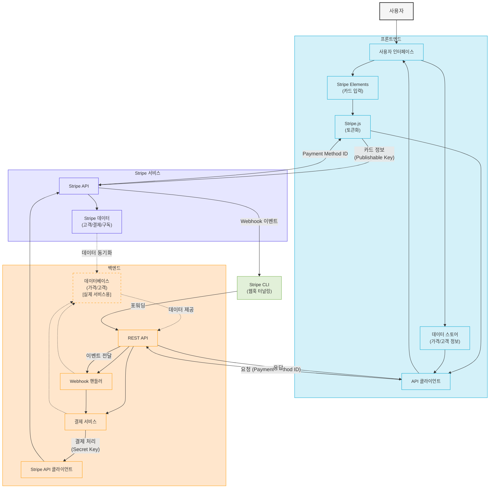

### 사용자

- **Web App**: 사용자가 결제 시스템을 이용하기 위해 접근하는 웹 애플리케이션.

### 프론트엔드 (Frontend)

- **UI 컴포넌트**: 사용자에게 결제 화면, 상품 목록, 결제 수단 선택 등의 인터페이스를 제공하는 컴포넌트.
- **Stripe Elements**: Stripe에서 제공하는 PCI-DSS 준수 카드 입력 폼 컴포넌트. 안전하게 카드 정보를 수집함.
- **Stripe.js**: 카드 정보를 안전하게 Stripe 서버로 직접 전송하여 토큰이나 Payment Method ID로 변환하는 자바스크립트 라이브러리.
- **가격 정보 스토어**: 상품 가격, 할인 정보 등 결제에 필요한 데이터를 관리하는 상태 관리 컴포넌트.
- **고객 정보 스토어**: 고객 정보를 관리하는 컴포넌트.
- **API 클라이언트**: 백엔드 서버와 통신하기 위한 HTTP 클라이언트 모듈.

### 백엔드 (Backend)

- **REST API**: 프론트엔드의 요청을 처리하는 API 엔드포인트들. 결제 생성, 구독 관리 등의 기능 제공.
- **결제 서비스**: 결제 관련 비즈니스 로직을 처리하는 서비스 계층. 결제 금액 검증, 할인 적용 등의 로직 수행.
- **Stripe API 클라이언트**: Stripe의 서버 API를 호출하기 위한 클라이언트 모듈. Secret Key를 사용하여 인증됨.
- **Webhook 핸들러**: Stripe에서 발송하는 이벤트(결제 성공, 실패, 구독 갱신 등)를 수신하고 처리하는 모듈.
- **데이터베이스** (점선으로 표시): 현재 프로토타입에는 구현되어 있지 않지만, 실제 서비스에서는 고객 정보, 결제 내역, 구독 정보 등을 영구적으로 저장하기 위해 필요한 컴포넌트. 현재는 Stripe API를 직접 호출하거나 메모리 내 임시 저장소를 사용하여 데이터를 관리함.

### Stripe 서비스

- **Stripe 서버**: Stripe의 클라우드 기반 결제 처리 서버. 모든 결제 관련 데이터를 처리하고 저장함.
- **고객 정보**: Stripe에 저장된 고객 프로필 데이터. 이메일, 이름, 메타데이터 등 포함.
- **결제 수단**: 고객의 신용카드, 은행 계좌 등 저장된 결제 수단 정보.
- **구독 정보**: 고객의 구독 상태, 구독 기간, 구독 플랜 등에 관한 데이터.
- **청구서**: 고객에게 발행된 인보이스와 결제 내역 정보.
- **제품/가격 데이터**: 판매 상품, 가격 정보, 구독 플랜 등의 데이터를 관리하는 컴포넌트.

### 개발 도구

- **Stripe CLI**: 로컬 개발 환경에서 Stripe 웹훅 이벤트를 테스트할 수 있게 해주는 도구. Stripe 서버와 로컬 서버 사이에 터널을 생성하여 이벤트를 포워딩함.

## Payment 관리 by 고객

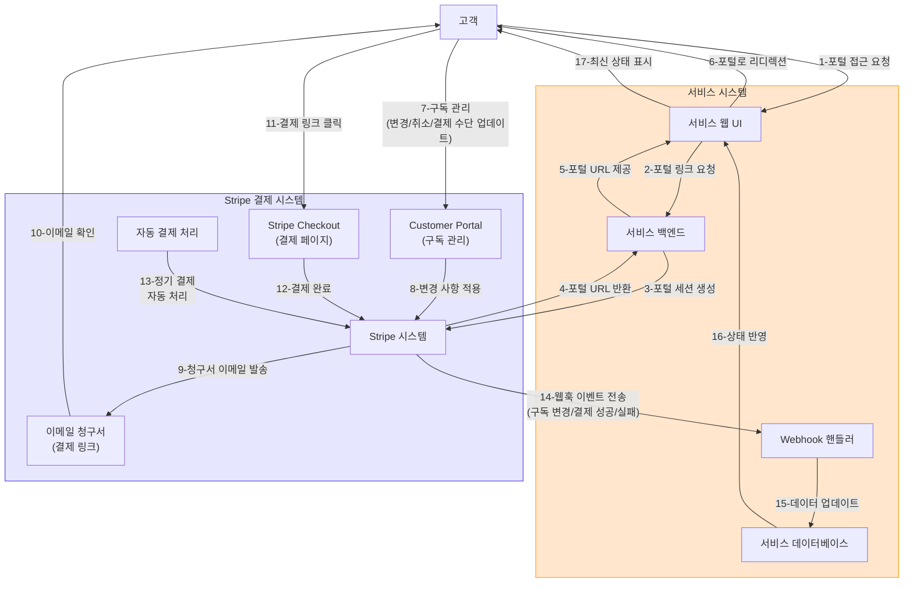

이 다이어그램은 다음과 같은 핵심 흐름을 보여준다:

1. **Customer Portal 접근 흐름** (단계 1-8):

   - 고객이 서비스의 UI를 통해 Stripe Customer Portal에 접근을 요청한다.
   - 백엔드는 Stripe API를 통해 포털 세션을 생성하고 URL을 반환한다.
   - 고객은 포털에서 구독 변경, 취소, 결제 수단 업데이트 등을 직접 관리한다.

2. **이메일 청구서 결제 흐름** (단계 9-12):

   - Stripe에서 고객에게 청구서 이메일을 발송한다.
     - 자동 결제를 설정하지 않은 고객
     - 기간별 사용량에 따라 변동되는 금액을 청구할 때
     - 정기 구독이 아닌 비정기적인 서비스나 제품 결제
     - B2B 고객에게 회계 처리를 위한 인보이스 형태로 청구할 때
   - 고객은 이메일의 결제 링크를 클릭하여 Stripe Checkout 페이지로 이동한다.
   - 고객은 체크아웃 페이지에서 결제를 완료한다.

3. **자동 결제 처리** (단계 13):

   - Stripe의 자동 결제 시스템이 정기 구독에 대한 결제를 자동으로 처리한다.
   - 고객이 이전에 등록해놓은 결제 수단(카드, 계좌 등)으로 자동 처리됩니다
   - 결제가 완료된 후 알림 이메일이 고객에게 발송됩니다 (성공/실패 여부 등 포함)

4. **웹훅을 통한 서비스 업데이트** (단계 14-17):
   - 모든 결제 및 구독 상태 변경은 웹훅을 통해 서비스 백엔드에 통보된다.
   - 백엔드는 이 정보를 사용하여 데이터베이스를 업데이트한다.
   - 업데이트된 상태는 UI에 반영되어 고객에게 표시된다.

이 다이어그램은 고객이 서비스를 거치지 않고도 Stripe와 직접 상호작용하여 결제와 구독을 관리할 수 있는 다양한 방법을 보여주면서, 서비스가 어떻게 웹훅을 통해 이러한 변경 사항을 동기화하는지 명확하게 보여준다.

### 주요 구성 요소

#### 사용자

- **Web App**: 사용자가 결제 시스템을 이용하기 위해 접근하는 웹 애플리케이션

#### 프론트엔드 (Frontend)

- **UI 컴포넌트**: 사용자에게 결제 화면, 상품 목록, 결제 수단 선택 등의 인터페이스를 제공
- **Stripe Elements**: PCI-DSS 준수 카드 입력 폼으로 안전하게 카드 정보를 수집
- **Stripe.js**: 카드 정보를 안전하게 Stripe 서버로 직접 전송하여 토큰화
- **가격 정보 스토어**: 상품 가격, 할인 정보 등의 데이터 관리
- **고객 정보 스토어**: 고객 프로필, 결제 기록 등의 정보 관리
- **API 클라이언트**: 백엔드 서버와 통신을 담당하는 모듈

#### 백엔드 (Backend)

- **REST API**: 프론트엔드 요청 처리 및 Webhook 이벤트 수신 엔드포인트
- **결제 서비스**: 결제 관련 비즈니스 로직 처리 (검증, 할인 적용 등)
- **Stripe API 클라이언트**: Stripe API를 호출하는 모듈 (Secret Key 사용)
- **Webhook 핸들러**: Stripe 이벤트(결제 성공, 실패, 구독 갱신 등) 처리
- **제품/가격 데이터**: 판매 상품, 가격 정보, 구독 플랜 등의 데이터 저장
- **고객 데이터**: 고객 정보 및 관련 데이터 저장

#### Stripe 서비스

- **Stripe 서버**: 클라우드 기반 결제 처리 시스템
- **고객 정보**: 고객 프로필 데이터 (이메일, 이름, 메타데이터 등)
- **가격 정보**: 상품 및 서비스 가격 정보
- **결제 수단**: 고객의 카드, 계좌 등 결제 수단 정보
- **구독 정보**: 구독 상태, 기간, 플랜 등의 데이터
- **청구서**: 인보이스와 결제 내역 정보

#### 개발 도구

- **Stripe CLI**: 로컬 개발 환경에서 Webhook 이벤트 테스트를 위한 도구로, Stripe 서버와 로컬 서버 사이에 터널을 생성하여 이벤트를 포워딩

### 주요 흐름

#### 결제 프로세스 흐름

1. **카드 정보 입력**: 사용자가 Stripe Elements를 통해 카드 정보 입력
2. **정보 전송**: Stripe.js가 카드 정보를 Stripe 서버로 전송 (Publishable Key 사용)
3. **토큰 생성**: Stripe 서버가 카드 정보를 검증하고 Payment Method ID 생성
4. **결제 요청**: 프론트엔드가 Payment Method ID를 포함한 결제 요청을 API에 전송
5. **결제 처리**: 백엔드 결제 서비스가 Stripe API를 통해 결제 처리 (Secret Key 사용)
6. **상태 업데이트**: Webhook을 통해 결제 상태 변경이 백엔드에 통보되고 데이터베이스 업데이트
7. **결과 표시**: 최종 결제 결과가 사용자에게 표시

#### 고객 결제 관리 흐름

1. **포털 접근**: 고객이 서비스 UI를 통해 Stripe 포털 접근 요청
2. **세션 생성**: 백엔드가 Stripe API를 통해 포털 세션 생성
3. **포털 사용**: 고객이 포털에서 구독 변경, 취소, 결제 수단 업데이트 등을 직접 관리
4. **청구서 관리**:
   - Stripe에서 고객에게 청구서 이메일 발송
   - 고객이 이메일 링크를 통해 결제 페이지로 이동하여 결제
5. **자동 결제**: Stripe가 저장된 결제 수단으로 정기 구독 자동 처리
6. **상태 동기화**: 모든 결제/구독 상태 변경이 Webhook을 통해 서비스에 통보되고 데이터베이스와 UI 업데이트

# Stripe Checkout vs. Payment Elements

Stripe에서 제공하는 결제 솔루션인 Checkout과 Payment Elements에 대해 비교 설명한다.

## Stripe Checkout

Stripe Checkout은 **완전히 호스팅된 결제 페이지**다. 다음과 같은 특징이 있다:

1. **호스팅된 솔루션**: Stripe가 직접 호스팅하는 결제 페이지로, 개발자가 결제 폼을 직접 구현할 필요가 없다.

2. **간단한 통합**:

   ```javascript
   // 서버 측에서 세션 생성
   const session = await stripe.checkout.sessions.create({
     line_items: [{ price: 'price_123', quantity: 1 }],
     mode: 'payment',
     success_url: '...',
     cancel_url: '...',
   });

   // 클라이언트 측에서는 단순히 URL로 리다이렉션
   window.location.href = session.url;
   ```

3. **완성된 UI**: 모바일 최적화, 국제화, 다양한 결제 방식이 이미 구현되어 있다.

4. **즉시 사용 가능**: 복잡한 프론트엔드 작업 없이 빠르게 구현 가능

5. **제한된 커스터마이징**: 색상, 로고 등 기본적인 브랜딩만 변경 가능

## Payment Elements

Payment Elements는 **커스텀 결제 폼을 구축할 수 있는 UI 컴포넌트**다:

1. **직접 통합 UI 컴포넌트**: 개발자가 자신의 웹페이지에 결제 폼을 직접 삽입하고 디자인 해야 한다.

2. **세밀한 구현 필요**:

   ```javascript
   // 클라이언트 측에서 Elements 인스턴스 생성
   const elements = stripe.elements({ clientSecret });

   // 원하는 위치에 컴포넌트 마운트
   const paymentElement = elements.create('payment');
   paymentElement.mount('#payment-element');

   // 폼 제출 처리 등 추가 로직 구현 필요
   ```

3. **높은 커스터마이징**: 결제 폼의 외관과 동작을 세밀하게 제어할 수 있다.

4. **고급 통합**: 자체 결제 흐름과 UI에 완벽하게 통합할 수 있다.

5. **구현 복잡성 증가**: 더 많은 프론트엔드 코드 작성이 필요하다.

## 주요 차이점

| 특성             | Stripe Checkout                  | Payment Elements                |
| ---------------- | -------------------------------- | ------------------------------- |
| **구현 난이도**  | 낮음 (몇 줄의 코드로 구현)       | 높음 (직접 UI 설계 필요)        |
| **커스터마이징** | 제한적 (색상, 로고 등)           | 높음 (거의 모든 요소 제어 가능) |
| **브랜드 경험**  | Stripe 페이지로 리다이렉션       | 자체 사이트 내에 통합됨         |
| **개발 시간**    | 짧음                             | 길음                            |
| **유지보수**     | 쉬움 (Stripe가 관리)             | 복잡함 (직접 관리)              |
| **장점**         | 빠른 구현, 최적화된 UX           | 완전한 브랜드 통합, 세밀한 제어 |
| **단점**         | 제한된 커스터마이징, 페이지 이탈 | 개발 복잡성, 유지보수 부담      |

일반적으로 MVP나 빠른 출시가 필요한 경우 Checkout을, 브랜드 경험이 중요하거나 복잡한 결제 흐름이 필요한 경우 Payment Elements를 선택한다.

# Stripe Portal 통합 방법

## 일반적인 Best Practice

1. **리디렉션 방식 사용**:

   - 가장 일반적이고 권장되는 방식은 고객을 Stripe Portal로 리디렉션하는 것이다.
   - 이는 기술적 문제와 사용자 경험 이슈를 최소화한다.
   - 리디렉션 후 `return_url`을 통해 고객이 작업을 완료한 후 우리 서비스로 돌아오게 한다.

2. **버튼 배치**:

   - "구독 관리" 또는 "결제 관리" 버튼을 계정 설정이나 대시보드 페이지에 명확하게 배치한다.
   - 이 버튼을 클릭하면 백엔드는 포털 세션을 생성하고 사용자를 리디렉션한다.

3. **컨텍스트 유지**:

   - Customer Portal에서 작업을 완료한 후 사용자가 돌아올 페이지를 `return_url`에 지정한다.
   - 사용자를 원래 있던 페이지나 관련 정보를 볼 수 있는 페이지로 돌려보낸다.

4. **브랜딩 커스터마이징**:
   - Stripe Dashboard에서 포털의 로고, 색상, 텍스트 등을 우리 브랜드에 맞게 커스터마이징한다.
   - 이는 iframe 없이도 일관된 브랜드 경험을 제공한다.

## 인증 관련

1. **세션 기반 인증**:

   - Portal URL은 항상 인증된 사용자에게만 제공해야 한다.
   - 우리 서비스에서 인증 확인 후 백엔드에서만 Portal 세션을 생성한다.

2. **고객 ID 매핑**:

   - 우리 서비스의 사용자 ID와 Stripe Customer ID 간의 매핑을 관리한다.
   - 인증된 사용자에게만 해당 사용자의 Stripe Customer ID에 해당하는 Portal URL을 생성해 제공한다.

3. **포털 내 추가 인증 없음**:
   - 일단 유효한 포털 URL을 받으면, 사용자는 Stripe Portal 내에서 추가 인증 없이 작업할 수 있다.
   - 따라서 URL 생성 전 우리 서비스에서의 인증이 중요하다.

## URL 유효성 및 수명

1. **일회성 URL**:

   - Stripe Portal URL은 기본적으로 일회성이 아니며, 생성 후 일정 기간 동안 유효하다.
   - 그러나 보안 관점에서 매번 새로운 세션 URL을 생성하는 것이 좋다.

2. **세션 만료**:

   - Portal 세션 URL은 생성 후 기본적으로 짧은 시간(약 몇 시간) 동안만 유효하다.
   - 만료 후에는 해당 URL로 접근하면 오류가 발생한다.

3. **사용자 활동에 따른 지속 시간**:
   - 사용자가 포털에서 활동 중이면 세션이 계속 유지된다.
   - 장시간 비활성 상태가 되면 세션이 종료된다.

# 인보이스 및 정기결제 관리 방식 비교

## 1. 자체 UI 구현 vs Stripe 포털 활용

| 구분            | 자체 UI 구현                           | Stripe Customer Portal 활용           |
| --------------- | -------------------------------------- | ------------------------------------- |
| **구현 복잡도** | 높음 (자체 개발 필요)                  | 낮음 (단일 버튼으로 연동)             |
| **개발 시간**   | 길다 (UI/UX 설계, API 연동, 테스트 등) | 짧다 (세션 생성 API만 연동)           |
| **유지보수**    | 지속적인 유지보수 필요                 | Stripe가 자동 업데이트, 최소 유지보수 |
| **브랜딩**      | 완전한 자체 브랜드 경험                | 제한적 커스터마이징 (로고, 색상 정도) |
| **통제력**      | 높음 (모든 UI/UX 요소 직접 제어)       | 제한적 (Stripe 제공 인터페이스 활용)  |
| **사용자 경험** | 일관된 서비스 경험 제공 가능           | 외부 서비스로 이동하는 불연속성       |
| **기능 범위**   | 필요한 기능만 선별 구현 가능           | Stripe가 제공하는 모든 기능 사용 가능 |

## 2. 인보이스 관리 비교

| 기능                   | 자체 UI 구현                        | Stripe Customer Portal        |
| ---------------------- | ----------------------------------- | ----------------------------- |
| **인보이스 목록 조회** | 커스텀 디자인 및 필터링 제공 가능   | 기본 목록 제공, 필터링 제한적 |
| **인보이스 상세 보기** | 비즈니스 맥락에 맞는 정보 강조 가능 | 표준화된 정보 표시            |
| **인보이스 결제**      | 자체 결제 프로세스와 통합 가능      | Stripe 표준 결제 프로세스     |
| **PDF 다운로드**       | 맞춤형 서식 제공 가능               | Stripe 표준 서식만 가능       |
| **정책 변경 적용**     | 빠른 적용 가능 (자체 개발)          | Stripe 업데이트에 의존        |
| **인보이스 검색**      | 비즈니스 요구에 맞는 검색 기능      | 기본 검색 기능만 제공         |

## 3. 정기결제(구독) 관리 비교

| 기능                            | 자체 UI 구현                            | Stripe Customer Portal     |
| ------------------------------- | --------------------------------------- | -------------------------- |
| **구독 조회/상태 확인**         | 자체 서비스 컨텍스트와 함께 표시 가능   | 독립된 구독 정보 표시      |
| **플랜 변경 (업/다운그레이드)** | 서비스 영향을 함께 시각화하여 제공 가능 | 요금 중심의 기본 비교 정보 |
| **결제 수단 관리**              | 자체 UX에 맞춰 디자인 가능              | Stripe 표준 인터페이스     |
| **구독 취소**                   | 취소 방지 프로세스 구현 가능            | 기본적인 확인 단계만 있음  |
| **결제 이력 조회**              | 서비스 사용과 연계한 정보 제공 가능     | 단순 결제 이력만 표시      |
| **사용량 기반 요금 확인**       | 상세 사용량 데이터와 함께 시각화 가능   | 요약 정보 중심             |
| **할인/프로모션 적용**          | 맞춤형 프로모션 UI 제공 가능            | 제한적인 쿠폰 적용 UI      |

## 4. 권장 접근법

### 초기 스타트업/MVP 단계:

- **Stripe Customer Portal 활용**
  - 빠른 구현 및 시장 진입
  - 개발 리소스 절약
  - 기본 기능으로 충분한 사용자 경험 제공

### 성장 단계 서비스:

- **하이브리드 접근법**
  - 핵심 기능은 자체 UI 개발 (주요 구독 관리, 기본 인보이스 조회)
  - 복잡한 기능은 Stripe Portal로 리디렉션 (상세 결제 이력, 세금 문서 등)
  - 사용자 행동 데이터 수집하여 점진적 개선

### 대규모 서비스:

- **완전한 자체 UI 구현**
  - 일관된 브랜드 경험 제공
  - 고객 여정 데이터 완전 소유
  - 세밀한 A/B 테스트와 최적화 가능
  - Stripe API 직접 활용한 맞춤형 솔루션

각 접근법은 비즈니스 단계, 개발 리소스, 고객 요구사항에 따라 선택하는 것이 좋다. 초기에는 Stripe Portal을 활용하다가 점진적으로 중요 기능을 자체 UI로 이전하는 전략이 효과적일 수 있다.

# 직접 구현 vs Stripe Portal 항목별 구현 권장사항

| 항목                           | 직접 구현 권장 | Stripe Portal 권장 | 상황에 따라 결정 |
| ------------------------------ | :------------: | :----------------: | :--------------: |
| **1. 구독관리 관련**           |                |                    |                  |
| - 구독 상태 조회               |       ✓        |                    |                  |
| - 구독 플랜 변경               |                |                    |        ✓         |
| - 구독 일시 중지               |                |         ✓          |                  |
| - 구독 취소                    |                |                    |        ✓         |
| - 구독 갱신 설정               |                |         ✓          |                  |
| **2. 정기결제 관련**           |                |                    |                  |
| - 결제 주기 변경               |                |         ✓          |                  |
| - 자동 결제 설정/해제          |                |         ✓          |                  |
| - 다음 결제일 확인             |       ✓        |                    |                  |
| - 결제 이력 조회               |                |                    |        ✓         |
| - 결제 실패 복구 흐름          |                |         ✓          |                  |
| **3. 인보이스 관련**           |                |                    |                  |
| - 인보이스 목록 조회           |       ✓        |                    |                  |
| - 인보이스 상세 보기           |                |                    |        ✓         |
| - 미지불 인보이스 결제         |                |         ✓          |                  |
| - 인보이스 다운로드            |                |         ✓          |                  |
| - 인보이스 이메일 재발송       |                |         ✓          |                  |
| **4. 결제 수단 관리**          |                |                    |                  |
| - 카드 정보 관리               |                |         ✓          |                  |
| - 결제 수단 우선순위 설정      |                |         ✓          |                  |
| - 은행 계좌 연동               |                |         ✓          |                  |
| - 디지털 월렛 연동             |                |         ✓          |                  |
| - 결제 수단 보안 검증          |                |         ✓          |                  |
| **5. 환불 및 분쟁 관리**       |                |                    |                  |
| - 환불 요청 처리               |       ✓        |                    |                  |
| - 환불 내역 조회               |                |                    |        ✓         |
| - 분쟁(Dispute) 관리           |                |         ✓          |                  |
| - 증빙 자료 제출               |                |         ✓          |                  |
| **6. 세금 및 회계 문서**       |                |                    |                  |
| - 세금 계산서/영수증 발행      |                |         ✓          |                  |
| - 세금 면제 증명               |                |         ✓          |                  |
| - 연간 거래 내역               |                |                    |        ✓         |
| - 세금 식별 번호 관리          |                |         ✓          |                  |
| **7. 다국어/다국적 지원**      |                |                    |                  |
| - 다국어 인터페이스            |       ✓        |                    |                  |
| - 통화 변환 및 표시            |                |         ✓          |                  |
| - 지역별 결제 방식             |                |         ✓          |                  |
| - 국제 세금 규정 준수          |                |         ✓          |                  |
| **8. 충전식 잔액/크레딧 관리** |                |                    |                  |
| - 선불 잔액 충전               |       ✓        |                    |                  |
| - 크레딧 사용 내역             |       ✓        |                    |                  |
| - 잔액 만료 관리               |       ✓        |                    |                  |
| - 자동 충전 설정               |                |                    |        ✓         |
| **9. 알림 및 커뮤니케이션**    |                |                    |                  |
| - 결제 알림 설정               |                |                    |        ✓         |
| - 커뮤니케이션 선호도          |       ✓        |                    |                  |
| - 청구서 발송 일정             |                |         ✓          |                  |
| - 결제 미리 알림               |                |                    |        ✓         |
| **10. 사용량 및 한도 관리**    |                |                    |                  |
| - 사용량 대시보드              |       ✓        |                    |                  |
| - 한도 설정                    |       ✓        |                    |                  |
| - 사용량 예측                  |       ✓        |                    |                  |
| - 초과 사용 정책               |       ✓        |                    |                  |
| **11. 보안 및 사기 방지**      |                |                    |                  |
| - 의심스러운 활동 알림         |                |         ✓          |                  |
| - IP 제한                      |       ✓        |                    |                  |
| - 2단계 인증                   |       ✓        |                    |                  |
| - 로그인 이력                  |       ✓        |                    |                  |
| **12. 프로모션 및 할인 관리**  |                |                    |                  |
| - 쿠폰 적용/관리               |                |                    |        ✓         |
| - 정기 할인 설정               |                |                    |        ✓         |
| - 추천 보상 관리               |       ✓        |                    |                  |
| - 번들 할인                    |       ✓        |                    |                  |
| **13. 고객 지원 통합**         |                |                    |                  |
| - 결제 관련 문의 생성          |       ✓        |                    |                  |
| - 결제 이슈 자동 진단          |                |                    |        ✓         |
| - 라이브 채팅 통합             |       ✓        |                    |                  |
| - 지식 베이스 연동             |                |                    |        ✓         |

## 구분 기준 설명

1. **직접 구현 권장** - 다음 특성을 가진 항목:

   - 서비스 핵심 기능과 밀접하게 연결됨
   - 비즈니스 로직이 복잡하거나 맞춤화가 필수적
   - 서비스 브랜드 경험과 직접 관련됨
   - 사용자 데이터 및 행동 분석이 중요한 영역

2. **Stripe Portal 권장** - 다음 특성을 가진 항목:

   - 복잡한 규정 준수가 필요한 기능
   - 보안 중요도가 높은 영역
   - Stripe가 이미 최적화된 솔루션을 제공하는 기능
   - 개발/유지보수 비용이 높은 기능

3. **상황에 따라 결정** - 다음 특성을 가진 항목:
   - 비즈니스 모델에 따라 중요도가 달라지는 기능
   - 서비스 성장 단계에 따라 접근 방식이 달라질 수 있는 기능
   - 하이브리드 접근(일부는 직접 구현, 일부는 Stripe 활용)이 가능한 영역

# Additional Information:

### 테스트용 카드 번호

테스트에 사용할 수 있는 Stripe 테스트 카드 번호 샘플들:

### 기본 성공 카드

- **4242 4242 4242 4242**: 기본 성공 케이스 (Visa)
- **5555 5555 5555 4444**: 기본 성공 케이스 (Mastercard)
- **3782 822463 10005**: 기본 성공 케이스 (American Express)
- **6011 1111 1111 1117**: 기본 성공 케이스 (Discover)
- **3566 0020 2036 0505**: 기본 성공 케이스 (JCB)

### 인증 관련 테스트

- **4000 0025 0000 3155**: 3D Secure 인증 필요 (성공)
- **4000 0027 6000 3184**: 3D Secure 인증 필요 (실패)
- **4000 0082 6000 3178**: 3D Secure 2 인증 필요 (성공)
- **4000 0030 0000 1000**: 3DS 인증 필요 + 원클릭 결제 제외

### 결제 실패 케이스

- **4000 0000 0000 0002**: 결제 거절
- **4000 0000 0000 0069**: 만료된 카드
- **4000 0000 0000 0127**: 유효하지 않은 CVC
- **4000 0000 0000 0101**: 잔액 부족
- **4000 0000 0000 9995**: 사기 의심 거절
- **4000 0000 0000 9979**: 분실/도난 카드로 신고됨
- **4000 0000 0000 9987**: 일반 거절 (특정 이유 없음)

### 특수 처리 케이스

- **4000 0000 0000 9235**: 결제가 계속 보류됨 (지속적 pending 상태)
- **4242 4242 4242 4241**: 잘못된 카드 번호 (체크섬 오류)
- **4000 0000 0000 0341**: SCA 면제 필요한 카드 (제한 초과)
- **4000 1000 0000 0004**: 일시적인 네트워크 문제 (재시도 필요)
- **4000 0000 0000 0010**: 결제 처리 중 오류 발생
- **4000 0000 0000 9995**: 의심스러운 거래로 판단 (잠재적 사기)

### 특별 처리 케이스

- **4000 0000 0000 3220**: 승인 즉시 취소됨
- **4000 0000 0000 3063**: 결제 처리 성공 후 분쟁(Dispute) 발생
- **4000 0000 0000 3055**: 결제 처리 성공 후 환불(Refund) 필요
- **4000 0000 0000 0070**: 결제는 성공하지만 청구(Charge) 불가
- **4000 0000 0000 3097**: 1주일 후 분쟁 발생
- **4000 0000 0000 3089**: 2일 후 분쟁 발생 (사기 이유)

### 국제 결제 테스트

- **4000 0000 0000 9222**: 미국 외 발행 카드
- **4000 0000 0000 0036**: 통화 불일치 오류

모든 테스트 카드는 유효기간은 미래 날짜(예: 12/25)로, CVC는 아무 3자리 숫자(예: 123)를 사용하면 된다. 이 카드들을 테스트하여 다양한 결제 시나리오를 시뮬레이션할 수 있다.

# Stripe Link

Stripe Link는 결제 과정을 간소화하고 사용자 경험을 향상시키는 Stripe의 서비스. Link를 통해 사용자는 여러 온라인 상점(merchant) 사이트에서 결제 정보를 한 번만 저장하고 이후에는 빠르게 결제할 수 있다.

## 주요 기능

1. **자동 입력 (Autofill)**: 사용자가 이전에 Link를 통해 결제한 경우, 카드 정보, 청구지 주소 등이 자동으로 입력된다.

2. **원클릭 결제**: 저장된 정보를 사용하여 빠르게 결제를 완료할 수 있다.

3. **크로스 머천트(교차 판매자) 지원**: 한 판매자 사이트에서 저장한 정보를 다른 Stripe 판매자 사이트에서도 사용할 수 있다.

4. **OTP 인증**: 사용자는 이메일로 전송된 일회용 패스워드(OTP)를 통해 계정에 접근할 수 있다.

5. **모바일 최적화**: 모바일 환경에서도 최적화된 결제 경험을 제공한다.

## Link의 장점

- **전환율 향상**: 결제 과정이 간소화되어 구매 완료율이 증가한다.
- **사용자 경험 개선**: 반복 구매 시 정보 재입력이 필요 없어 고객 만족도가 향상된다.
- **교차 판매자 혜택**: 사용자가 한 번 Link에 가입하면 모든 Link 지원 사이트에서 간편하게 결제할 수 있다.
- **보안성**: 카드 정보는 Stripe의 보안 기준에 따라 안전하게 저장된다.

## 기술적 구현

Link는 Stripe Elements나 Checkout과 통합하여 구현할 수 있다:

## 테스트 모드에서의 Link

테스트 환경에서 Link를 테스트할 때 다음 이메일을 사용할 수 있다:

- `customer-success@example.com`: 성공 시나리오
- `customer-decline@example.com`: 거절 시나리오
- `customer-error@example.com`: 오류 시나리오

## 적용 시 고려사항

1. **브랜딩 일관성**: Link UI가 사이트의 디자인과 일관되게 표시되도록 Appearance API를 활용할 것
2. **사용자 교육**: 처음 사용하는 사용자에게 Link의 장점을 설명하는 간단한 안내를 제공하는 것이 좋다.
3. **모바일 최적화**: 모바일 사용자를 위한 UI 최적화가 중요
4. **다국어 지원**: 글로벌 비즈니스의 경우 여러 언어로 Link 환경을 제공할 수 있다.

## 참고 자료

- [Stripe Link 공식 문서](https://stripe.com/docs/payments/link)

# 3D Secure란?

3D Secure(3DS)는 온라인 카드 결제 시 추가적인 인증 단계를 제공하는 국제 보안 프로토콜이다. Visa(Verified by Visa), Mastercard(Mastercard SecureCode), American Express(AmEx SafeKey) 등 주요 카드 네트워크에서 채택한 글로벌 표준으로, 온라인 결제 사기를 방지하기 위해 설계되었다.

이름의 "3D"는 "Three Domain"의 약자로, 다음 세 영역 간의 상호작용을 의미한다:

1. **발급사 도메인(Issuer Domain)**: 카드 발급 은행이 관리
2. **가맹점 도메인(Acquirer Domain)**: 판매자와 결제 프로세서
3. **상호운용성 도메인(Interoperability Domain)**: 전체 인프라를 지원하는 영역

3D Secure는 Stripe만의 기술이 아니라 카드 발급사와 네트워크에서 관리하는 표준 프로토콜이며, Stripe를 포함한 모든 결제 프로세서가 이 표준을 구현하여 제공한다. 최신 버전인 3D Secure 2(3DS2)는 사용자 경험을 개선하고 모바일 환경에 더 적합하도록 업데이트되었다.

주요 목적:

- 온라인 결제 사기 감소
- 가맹점의 책임 전가(liability shift) 제공: 인증된 거래에 대한 책임이 가맹점에서 카드 발급사로 이전
- 카드 소유자 보호 강화
- 전자상거래 신뢰도 향상

## 실제 3D Secure 인증 과정

실제 환경에서 3D Secure(3DS) 인증은 카드 발급사와 은행에 따라 다르게 나타난다:

### 일반적인 인증 방법

1. **모바일 앱 인증**:

   - 사용자의 은행 앱으로 푸시 알림이 전송된다.
   - 알림을 통해 앱을 열고 거래를 승인하거나 거부한다.
   - 일부 앱에서는 지문, 얼굴 인식 등 생체 인증을 요구한다.

2. **SMS 인증 코드**:

   - 등록된 휴대폰 번호로 일회용 인증 코드(OTP)가 전송된다.
   - 결제 페이지에 이 코드를 입력해야 한다.

3. **카드 발급사 앱 인증**:

   - 신한, 삼성, 현대카드 등 카드사 앱을 통한 인증
   - 앱 내에서 거래 내역을 확인하고 승인한다.

4. **보안 질문**:

   - 일부 은행은 미리 설정한 보안 질문에 답변하도록 요구한다.
   - 예: "자주 가는 식당은?" 또는 "좋아하는 동물은?"

5. **보안카드/일회용 비밀번호 입력**:
   - 한국의 경우 보안카드나 OTP 기기에서 생성된 번호를 입력한다.

### 실제 화면 구성

실제 3DS 화면은 다음과 같은 요소를 포함한다:

1. **은행/카드사 로고**: 사용자의 은행이나 카드 발급사 로고가 표시된다.

2. **거래 정보 표시**:

   - 결제 금액
   - 가맹점 이름
   - 거래 날짜 및 시간
   - 카드 번호 일부(마스킹 처리)

3. **인증 입력 필드**:

   - SMS 코드 입력란
   - 보안 질문 답변란
   - 보안카드 번호 입력란 등

4. **타이머**: 인증 제한 시간이 표시되며, 보통 3~5분 내에 완료해야 한다.

5. **도움말 및 연락처**: 문제 발생 시 연락할 수 있는 고객 서비스 정보

### 국가별 차이점

3DS 구현은 국가마다 크게 다르다:

- **한국**: 보안카드, OTP, 앱 승인 등 다양한 방식 사용
- **유럽**: PSD2 규정으로 인해 강력한 고객 인증(SCA) 필수적
- **미국**: 상대적으로 덜 엄격하며, 리스크 기반 접근법 사용
- **영국**: 은행 앱 인증이 일반적임

### 3D Secure 인증이 필요한 경우

3D Secure 인증이 필요한 경우는 여러 요소에 따라 결정된다. 주요 경우는 다음과 같다:

1. **카드 발급사 요구사항**:

   - 일부 카드 발급사(은행)는 특정 금액 이상의 모든 거래에 3DS 인증을 요구한다.
   - 특히 유럽(EU)의 PSD2 규제에 따라 강력한 고객 인증(SCA)이 의무화된 지역에서는 대부분의 거래에 필요하다.

2. **위험도 평가 결과**:

   - 카드 발급사의 자체 위험 평가 알고리즘이 거래를 '고위험'으로 판단하는 경우
   - 예: 평소와 다른 지역에서의 구매, 평소보다 큰 금액, 비정상적 구매 패턴 등

3. **거래 유형 및 특성**:

   - 고액 거래(은행마다 기준 다름)
   - 해외 거래(국제 거래)
   - 새로운 기기나 IP 주소에서의 결제
   - 평소와 다른 국가나 도시에서의 결제

4. **가맹점(서비스 제공자) 설정**:

   - 서비스 제공자가 Stripe 설정에서 3DS를 항상 요구하도록 설정한 경우
   - 특정 금액 이상의 거래에만 3DS를 활성화하도록 구성한 경우

5. **특정 카드 유형**:

   - 3DS 인증이 필수로 설정된 카드를 사용할 때 (예: 테스트 카드 4000 0025 0000 3155)
   - 기업 카드, 특정 프리미엄 카드 등 특수 카드 유형

6. **사기 방지 조치**:
   - 이전에 사기 이력이 있는 고객이나 IP 주소에서의 거래
   - 카드 도용 의심 패턴이 감지된 경우

프로토타입 테스트에서는 일반적으로 Stripe의 테스트 카드 번호를 사용하여 3DS 인증 과정을 시뮬레이션할 수 있다. 예를 들어, 테스트 카드 `4000 0025 0000 3155`를 사용하면 항상 3DS 인증 화면이 표시된다.

실제 서비스 환경에서는 카드 발급사와 지역 규제에 따라 3DS 인증 빈도가 결정되며, 소비자 보호와 사기 방지를 위해 점점 더 많은 거래에서 3DS 인증이 요구되는 추세다.

### 최신 3D Secure 2.0 특징

최신 버전인 3DS 2.0은 다음과 같은 특징이 있다:

1. **생체 인증 지원**: 지문, 얼굴 인식 등을 통한 인증
2. **리스크 기반 접근법**: 모든 거래가 아닌 의심스러운 거래만 인증 요구
3. **모바일 최적화**: 모바일 환경에서 더 나은 사용자 경험 제공
4. **더 많은 데이터 전송**: 더 정확한 위험 평가를 위해 300개 이상의 데이터 포인트 전송
5. **SDK 지원**: 앱 내 원활한 인증 경험 제공

테스트 환경에서 보이는 간단한 화면과 달리, 실제 3DS 인증은 각 은행과 카드 발급사의 보안 요구사항에 맞춰 훨씬 복잡하고 다양한 형태로 제공된다.

# PCI DSS란?

## PCI DSS 규정 준수

PCI DSS(Payment Card Industry Data Security Standard)는 카드 소지자 데이터와 민감한 인증 데이터를 저장, 처리 또는 전송하는 모든 기업에 적용되는 글로벌 보안 표준이다. 이 표준은 Visa, Mastercard, American Express, Discover, JCB와 같은 주요 카드 브랜드들이 2006년에 설립한 PCI 보안 표준 위원회(PCI SSC)에서 관리한다.

### PCI DSS의 목적

PCI DSS의 주요 목적은 다음과 같다:

- 소비자 결제 카드 데이터 보호
- 데이터 유출 및 사기 방지
- 결제 생태계 전반의 보안 수준 향상
- 소비자 신뢰 구축 및 유지

### 주요 요구사항

PCI DSS는 12개의 주요 요구사항으로 구성되어 있으며, 이는 다시 300개 이상의 세부 보안 통제로 나뉜다:

1. 카드 소지자 데이터 보호를 위한 보안 네트워크 및 시스템 구축
2. 카드 소지자 데이터 보호
3. 취약점 관리 프로그램 유지
4. 강력한 접근 통제 조치 구현
5. 네트워크 모니터링 및 정기적인 테스트
6. 정보 보안 정책 유지

### 준수 수준

PCI 준수 수준은 연간 카드 거래량에 따라 4개 수준으로 나뉜다:

- **레벨 1**: 연간 600만 건 이상의 거래
- **레벨 2**: 연간 100만~600만 건의 거래
- **레벨 3**: 연간 2만~100만 건의 전자상거래 거래
- **레벨 4**: 연간 2만 건 미만의 전자상거래 거래 또는 100만 건 미만의 총 거래

각 수준마다 다른 검증 요구사항이 있으며, 레벨 1은 가장 엄격한 요구사항을 갖는다.

### Stripe와 PCI 준수

Stripe는 PCI DSS 레벨 1 서비스 제공업체로 인증되어 있어, 가장 엄격한 보안 표준을 준수한다. Stripe를 통합함으로써 기업들은 다음과 같은 PCI 준수 이점을 얻을 수 있다:

- **간소화된 PCI 부담**: Stripe Checkout, Elements, 모바일 SDK와 같은 토큰화된 통합 방법을 사용하면 고객의 카드 정보가 Stripe의 서버로 직접 전송되어 기업의 서버를 거치지 않다.
- **적절한 SAQ 유형 자동 결정**: Stripe PCI 마법사는 통합 방법을 분석하여 적합한 자체 평가 질문지(SAQ) 유형을 자동으로 결정한다.
- **연간 준수 검증 지원**: Stripe는 사용자의 통합 유형에 따라 맞춤형 대시보드 경험을 제공하고, 일부 사용자에게는 사전 작성된 SAQ와 가이드 흐름을 제공한다.

### 결론

PCI DSS 준수는 일회성 이벤트가 아닌 지속적인 프로세스다. 결제 카드를 처리하는 모든 기업은 고객 데이터를 안전하게 보호하고, 데이터 유출과 관련된 재정적, 평판적 위험을 줄이기 위해 이 표준을 준수해야 한다. Stripe와 같은 PCI 인증 서비스 제공업체를 활용하면 PCI 준수 부담을 크게 줄이면서도 높은 수준의 보안을 유지할 수 있다.

## 구독 결제

구독 결제는 정기적인 청구 주기에 맞춰 반복적으로 결제가 이루어지는 방식이다. Stripe의 Subscription API를 통해 구현되며, 월간/연간 멤버십, SaaS 구독 등의 비즈니스 모델에 적합하다.

### 구독 신청 흐름 Diagram

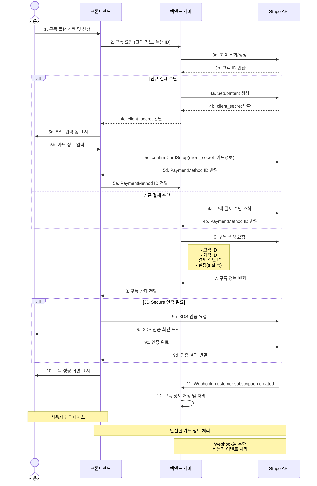

이 다이어그램은 Stripe를 통한 구독 신청 과정의 전체 흐름을 보여준다. 주요 단계는 다음과 같다:

1. **고객 정보 처리 (단계 1-3)**:

   - 사용자가 구독 플랜을 선택하고 신청한다.
   - 백엔드는 Stripe API를 통해 고객 정보를 조회하거나 새로 생성한다.

2. **결제 수단 처리 (단계 4-5)**:

   - 신규 결제 수단: SetupIntent를 생성하고 카드 정보를 안전하게 Stripe 서버로 전송한다.
   - 기존 결제 수단: 고객 계정에 저장된 결제 수단을 조회한다.

3. **구독 생성 (단계 6-8)**:

   - 백엔드는 고객 ID, 가격 ID, 결제 수단 ID 등을 포함하여 Stripe API를 통해 구독을 생성한다.
   - 구독 정보가 프론트엔드로 반환된다.

4. **추가 인증 (단계 9, 조건부)**:

   - 필요한 경우 3D Secure 인증이 수행된다.

5. **결과 처리 (단계 10-12)**:
   - 사용자에게 구독 성공 화면이 표시된다.
   - Webhook을 통해 구독 생성 이벤트가 백엔드에 전송되고 처리된다.

이 흐름의 주요 이점은 결제 수단 등록과 구독 생성이 하나의 과정으로 통합되어 있으면서도, 카드 정보의 안전한 처리를 위해 PCI DSS 규정을 준수한다는 점이다.

### 정기 결제 처리 흐름 Diagram

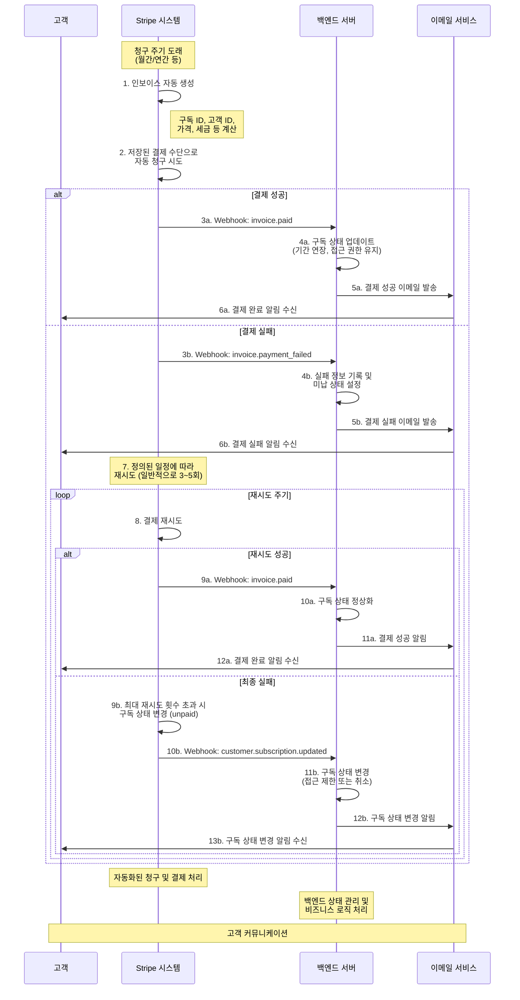

이 다이어그램은 구독 신청 후 정기적으로 발생하는 결제 처리 흐름을 보여준다. 주요 단계는 다음과 같다:

1. **청구 주기 및 인보이스 생성 (단계 1)**:

   - 구독의 청구 주기(월간, 연간 등)가 도래하면 Stripe 시스템이 자동으로 인보이스를 생성한다.
   - 인보이스에는 구독 ID, 고객 ID, 가격, 적용 세금 등의 정보가 포함된다.

2. **자동 결제 처리 (단계 2)**:

   - Stripe는 고객 계정에 저장된 기본 결제 수단을 사용하여 자동으로 결제를 시도한다.

3. **성공 흐름 (단계 3a-6a)**:

   - 결제 성공 시 Webhook을 통해 `invoice.paid` 이벤트가 백엔드로 전송된다.
   - 백엔드는 구독 상태를 업데이트하고 고객의 서비스 접근 권한을 유지한다.
   - 결제 성공 알림이 고객에게 이메일로 발송된다.

4. **실패 흐름 및 재시도 (단계 3b-13b)**:
   - 결제 실패 시 Webhook을 통해 `invoice.payment_failed` 이벤트가 백엔드로 전송된다.
   - 백엔드는 실패 정보를 기록하고 미납 상태를 설정한다.
   - 결제 실패 알림이 고객에게 발송된다.
   - Stripe는 정의된 일정(일반적으로 3~5회)에 따라 자동으로 결제를 재시도한다.
   - 재시도가 성공하면 구독이 정상화되고, 최종적으로 실패하면 구독 상태가 변경된다(unpaid).
   - 최종 상태 변경 시 고객에게 알림이 발송된다.

이 자동화된 재시도 메커니즘은 일시적인 결제 실패(카드 한도 초과, 일시적 네트워크 문제 등)로 인한 구독 중단을 최소화하여 매출 손실을 방지하고 고객 경험을 향상시킨다.

### 테스트 결과

테스트 환경에서 구독 결제 기능을 검증한 결과, 다음과 같은 주요 사항을 확인했다:

1. **구독 생성 성공**:

   - 테스트 상품: 월간 구독 플랜 (월 10,000원)
   - 테스트 카드: `4242 4242 4242 4242` (성공 테스트 카드)
   - 결과: "구독이 성공적으로 생성되었다! 구독 ID: sub_1RJUPcRJ3gmrV5Gwqqxfe0kd"
   - Stripe 대시보드에서 구독 정보 확인 완료

2. **자동 결제 테스트**:

   - 테스트를 위해 청구 주기를 짧게 설정하여 자동 결제 확인
   - Webhook 이벤트(`invoice.paid`)가 정상적으로 수신되었으며, 백엔드에서 적절히 처리됨
   - 결제 완료 후 확인 이메일이 정상적으로 발송됨

3. **3D Secure 인증**:

   - 3DS 인증이 필요한 테스트 카드 (`4000 0025 0000 3155`)를 사용하여 구독 테스트
   - 인증 프로세스가 정상적으로 표시되고 완료됨
   - 인증 후 구독이 성공적으로 생성됨

4. **구독 취소 테스트**:

   - 고객 포털을 통한 구독 취소 기능 테스트
   - 즉시 취소 및 주기 종료 시 취소 옵션 모두 정상 작동
   - `customer.subscription.updated` Webhook 이벤트가 수신되어 백엔드에서 처리됨

5. **결제 실패 및 재시도**:
   - 의도적으로 실패하는 테스트 카드 (`4000 0000 0000 0341`)를 사용하여 결제 실패 시나리오 테스트
   - 실패 후 자동 재시도 메커니즘이 정상 작동
   - 알림 이메일이 적절히 발송됨

구독 결제 시스템은 전반적으로 안정적으로 작동하며, 다양한 시나리오(성공, 실패, 인증 필요 등)에 적절히 대응함을 확인했다. 또한 Webhook을 통한 비동기 이벤트 처리가 효과적으로 이루어져, 결제 상태 변화에 따른 서비스 접근 권한 관리가 원활하게 이루어졌다.

특히 자동 결제 및 재시도 메커니즘이 효과적으로 작동하여, 일시적인 결제 실패로 인한 고객 이탈을 최소화할 수 있는 가능성을 확인했다.

## PCI DSS 규정 준수

PCI DSS(Payment Card Industry Data Security Standard)는 카드 소지자 데이터와 민감한 인증 데이터를 저장, 처리 또는 전송하는 모든 기업에 적용되는 글로벌 보안 표준이다. 이 표준은 Visa, Mastercard, American Express, Discover, JCB와 같은 주요 카드 브랜드들이 2006년에 설립한 PCI 보안 표준 위원회(PCI SSC)에서 관리한다.

### PCI DSS의 목적

PCI DSS의 주요 목적은 다음과 같다:

- 소비자 결제 카드 데이터 보호
- 데이터 유출 및 사기 방지
- 결제 생태계 전반의 보안 수준 향상
- 소비자 신뢰 구축 및 유지

### 주요 요구사항

PCI DSS는 12개의 주요 요구사항으로 구성되어 있으며, 이는 다시 300개 이상의 세부 보안 통제로 나뉜다:

1. 카드 소지자 데이터 보호를 위한 보안 네트워크 및 시스템 구축
2. 카드 소지자 데이터 보호
3. 취약점 관리 프로그램 유지
4. 강력한 접근 통제 조치 구현
5. 네트워크 모니터링 및 정기적인 테스트
6. 정보 보안 정책 유지

### 준수 수준

PCI 준수 수준은 연간 카드 거래량에 따라 4개 수준으로 나뉜다:

- **레벨 1**: 연간 600만 건 이상의 거래
- **레벨 2**: 연간 100만~600만 건의 거래
- **레벨 3**: 연간 2만~100만 건의 전자상거래 거래
- **레벨 4**: 연간 2만 건 미만의 전자상거래 거래 또는 100만 건 미만의 총 거래

각 수준마다 다른 검증 요구사항이 있으며, 레벨 1은 가장 엄격한 요구사항을 갖는다.

### Stripe와 PCI 준수

Stripe는 PCI DSS 레벨 1 서비스 제공업체로 인증되어 있어, 가장 엄격한 보안 표준을 준수한다. Stripe를 통합함으로써 기업들은 다음과 같은 PCI 준수 이점을 얻을 수 있다:

- **간소화된 PCI 부담**: Stripe Checkout, Elements, 모바일 SDK와 같은 토큰화된 통합 방법을 사용하면 고객의 카드 정보가 Stripe의 서버로 직접 전송되어 기업의 서버를 거치지 않는다.
- **적절한 SAQ 유형 자동 결정**: Stripe PCI 마법사는 통합 방법을 분석하여 적합한 자체 평가 질문지(SAQ) 유형을 자동으로 결정한다.
- **연간 준수 검증 지원**: Stripe는 사용자의 통합 유형에 따라 맞춤형 대시보드 경험을 제공하고, 일부 사용자에게는 사전 작성된 SAQ와 가이드 흐름을 제공한다.

### 결론

PCI DSS 준수는 일회성 이벤트가 아닌 지속적인 프로세스다. 결제 카드를 처리하는 모든 기업은 고객 데이터를 안전하게 보호하고, 데이터 유출과 관련된 재정적, 평판적 위험을 줄이기 위해 이 표준을 준수해야 한다. Stripe와 같은 PCI 인증 서비스 제공업체를 활용하면 PCI 준수 부담을 크게 줄이면서도 높은 수준의 보안을 유지할 수 있다.

# 다국적 통화 및 결제 시나리오

## 통화 지원 개요

Stripe는 광범위한 통화 지원 기능을 제공하여 전 세계적으로 결제를 처리할 수 있게 해준다. 이 기능은 국제 고객을 대상으로 하는 서비스에 특히 중요하다.

### 지원되는 통화

현재 Stripe는 135개 이상의 통화로 결제를 처리할 수 있다. 주요 통화는 다음과 같다:

- USD (미국 달러)
- EUR (유로)
- GBP (영국 파운드)
- JPY (일본 엔)
- CAD (캐나다 달러)
- AUD (호주 달러)
- KRW (대한민국 원)
- CNY (중국 위안)
- INR (인도 루피)
- 기타 다양한 통화

### 통화 처리 방식

Stripe의 통화 처리 방식은 두 가지 주요 개념을 중심으로 이루어진다:

1. **표시 통화 (Presentment Currency)**: 고객에게 표시되는 통화
2. **결제 통화 (Settlement Currency)**: 판매자 계정으로 정산되는 통화

이 두 통화는 다를 수 있으며, 다음과 같은 방식으로 처리된다:

#### 통화 전환 옵션

1. **자동 통화 변환**:

   - Stripe가 자동으로 표시 통화에서 결제 통화로 변환
   - 변환 수수료: 일반적으로 2% 내외
   - 장점: 간편한 설정, 즉시 사용 가능
   - 단점: 상대적으로 높은 환전 수수료

2. **다중 통화 계정**:
   - 여러 통화로 직접 결제 수취 가능
   - 각 통화별 잔액 유지
   - 장점: 환전 수수료 절감, 유연한 자금 관리
   - 단점: 설정 복잡성 증가, 국가별 추가 요구사항 가능

## 다국적 결제 시나리오

### 시나리오 1: 현지 통화 결제 (KRW)

한국 고객이 한국 원화(KRW)로 표시된 가격으로 결제하는 경우:

```javascript
// 서버 측 코드
const paymentIntent = await stripe.paymentIntents.create({
  amount: 15000, // 15,000원
  currency: 'krw',
  payment_method_types: ['card'],
  description: '한국 고객 결제',
  metadata: {
    customer_country: 'KR',
  },
});
```

**결과 분석**:

- 한국 고객은 친숙한 통화로 가격을 확인하고 결제할 수 있다.
- Stripe는 KRW 결제를 처리하고, 판매자 계정 설정에 따라 USD 또는 다른 통화로 정산할 수 있다.
- 이는 고객의 결제 경험을 향상시키며 카드 승인률을 높이는 데 도움이 된다.

### 시나리오 2: 정산 통화가 다른 결제

일본 고객이 JPY로 결제하고 USD로 정산받는 경우:

```javascript
// 가격 설정 (Stripe Dashboard 또는 API)
const price = await stripe.prices.create({
  unit_amount: 5000,
  currency: 'jpy',
  product: 'prod_xxx',
});

// 결제 처리 (정산은 계정 기본 통화인 USD로)
const paymentIntent = await stripe.paymentIntents.create({
  amount: 5000,
  currency: 'jpy',
  payment_method_types: ['card'],
  description: '일본 고객 결제',
});
```

**결과 분석**:

- 고객은 JPY로 결제하지만, 판매자는 USD로 정산받는다.
- Stripe는 자동으로 통화 변환을 처리하며, 변환 시점의 환율이 적용된다.
- 이 방식은 다국적 고객에게 서비스를 제공하면서도 재무 관리를 단순화할 수 있다.

### 시나리오 3: 동적 통화 변환

사용자의 위치에 따라 통화를 동적으로 표시하는 경우:

```javascript
// 클라이언트 측에서 사용자 위치 감지
const userCountry = getUserCountry(); // 위치 감지 함수
const currency = getCurrencyForCountry(userCountry); // 국가별 통화 매핑

// 서버에 결제 요청
const response = await fetch('/create-payment', {
  method: 'POST',
  headers: { 'Content-Type': 'application/json' },
  body: JSON.stringify({
    amount: convertAmount(100, currency), // 기준 금액을 해당 통화로 변환
    currency: currency,
  }),
});
```

**결과 분석**:

- 사용자의 국가나 선호도에 따라 적절한 통화로 가격을 표시할 수 있다.
- 이는 국제 사용자의 구매 결정을 도울 수 있으며, 전환율을 높일 수 있다.
- 단, 환율 변동에 따른 가격 업데이트 로직이 필요하다.

## 다국적 결제 구현 시 고려사항

### 1. 법적 및 규제 요구사항

- **세금 처리**: 국가별로 다른 부가가치세(VAT), 판매세 등을 고려해야 한다.
- **규정 준수**: EU의 GDPR, 한국의 개인정보 보호법 등 지역별 규제를 준수해야 한다.
- **소비자 보호법**: 국가별 환불 정책, 취소 조건 등이 다를 수 있다.

### 2. UX/UI 고려사항

- **통화 표시**: 통화 기호, 단위, 소수점 표기법 등 지역화된 형식을 사용해야 한다.
- **언어 지원**: 결제 과정이 사용자의 언어로 제공되어야 한다.
- **날짜 형식**: MM/DD/YYYY vs DD/MM/YYYY 등 지역별 차이를 고려해야 한다.

### 3. 기술적 고려사항

- **환율 업데이트**: 정기적인 환율 업데이트 메커니즘이 필요하다.
- **반올림 정책**: 통화 변환 시 반올림 규칙을 일관되게 적용해야 한다.
- **정산 일정**: 통화별로 다른 정산 주기를 관리해야 할 수 있다.

## 결론 및 권장사항

다국적 통화 지원은 글로벌 비즈니스에 필수적이지만, 구현 복잡성과 운영 오버헤드가 증가한다. 다음과 같은 접근 방식을 권장한다:

1. **단계적 접근**: 처음에는 주요 시장 통화만 지원하고 점진적으로 확장
2. **자동화**: 환율 업데이트, 가격 조정 등의 프로세스 자동화
3. **투명성**: 환전 수수료, 환율 등을 고객에게 명확히 공개
4. **모니터링**: 통화별 거래 패턴, 환율 변동 영향 등을 지속적으로 분석

Stripe의 통화 지원 기능을 활용하면 기술적 복잡성을 크게 줄이면서도 글로벌 고객에게 원활한 결제 경험을 제공할 수 있다.

# 은행 계좌 기반 결제 수단

## ACH Debit 및 Bank Redirect 개요

신용카드 외에도 Stripe는 은행 계좌를 통한 다양한 결제 방식을 지원한다. 주요 방식은 다음과 같다:

1. **ACH Debit (미국)**: 미국 은행 계좌에서 직접 자금을 인출하는 방식
2. **SEPA Debit (유럽)**: 유럽 내 은행 계좌를 이용한 직접 출금 방식
3. **BACS Debit (영국)**: 영국 은행 계좌를 이용한 직접 출금 방식
4. **Bank Redirect 결제**:
   - 사용자가 자신의 온라인 뱅킹으로 리디렉션되어 결제를 승인하는 방식
   - 국가별로 다양한 유형이 있음 (예: iDEAL, Sofort, GiroPay 등)

## ACH Debit 결제 흐름

ACH Debit는 특히 미국에서 정기 결제, 구독 모델, 고액 결제에 적합한 방식이다.

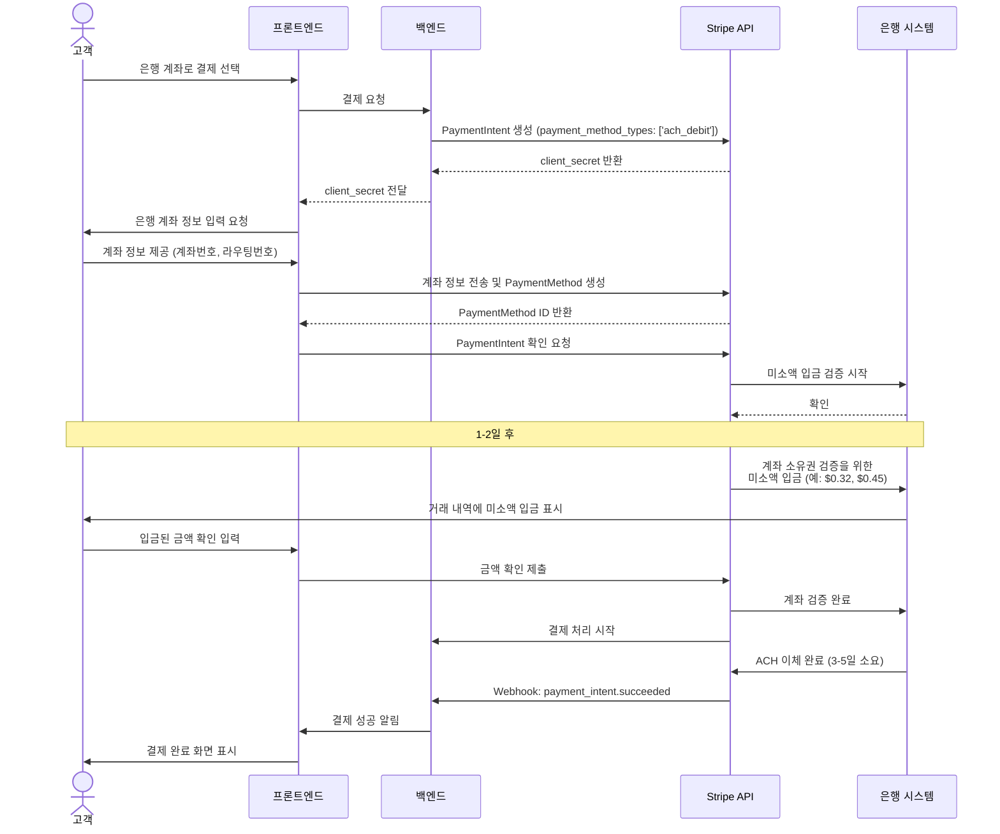

### ACH Debit 구현 코드 예시

```javascript
// 서버 측 코드
const paymentIntent = await stripe.paymentIntents.create({
  amount: 5000, // $50.00
  currency: 'usd',
  payment_method_types: ['ach_debit'],
  payment_method_data: {
    type: 'ach_debit',
    ach_debit: {
      account_number: '000123456789',
      routing_number: '110000000',
      account_holder_type: 'individual',
      account_holder_name: 'Jenny Rosen',
    },
  },
  confirm: true,
});
```

### ACH Debit 장단점

**장점**:

- **낮은 수수료**: 일반적으로 신용카드보다 수수료가 낮다 (0.8% vs 2.9%+)
- **높은 거래 한도**: 대규모 거래에 적합
- **낮은 분쟁률**: 신용카드보다 분쟁 발생률이 낮음
- **정기 결제에 이상적**: 구독 모델에 적합

**단점**:

- **긴 처리 시간**: 결제 정산까지 3-5일 소요
- **미국 한정**: 미국 내 은행 계좌만 지원
- **검증 과정**: 초기 설정에 시간이 소요됨 (미소액 입금 검증)
- **즉시 이용 불가**: 상품/서비스 즉시 제공이 필요한 경우 부적합

## Bank Redirect 결제

Bank Redirect는 사용자가 자신의 온라인 뱅킹 포털로 리디렉션되어 결제를 직접 승인하는 방식이다. 국가별로 다양한 시스템이 있다.

### 주요 Bank Redirect 시스템

1. **iDEAL (네덜란드)**:

   - 네덜란드의 주요 온라인 뱅킹 결제 시스템
   - 매우 높은 시장 점유율 (네덜란드 온라인 결제의 60% 이상)

2. **Sofort (독일, 오스트리아 등)**:

   - 독일어권 국가에서 인기 있는 뱅킹 결제 시스템
   - 즉시 거래 확인 제공

3. **GiroPay (독일)**:

   - 독일 은행 협회에서 개발한 결제 시스템
   - 독일 내 35백만 이상의 온라인 뱅킹 사용자 지원

4. **Bancontact (벨기에)**:

   - 벨기에의 주요 결제 시스템
   - 직불카드 및 온라인 뱅킹 연동

5. **EPS (오스트리아)**:
   - 오스트리아 은행들이 개발한 온라인 뱅킹 결제 시스템

### Bank Redirect 결제 흐름

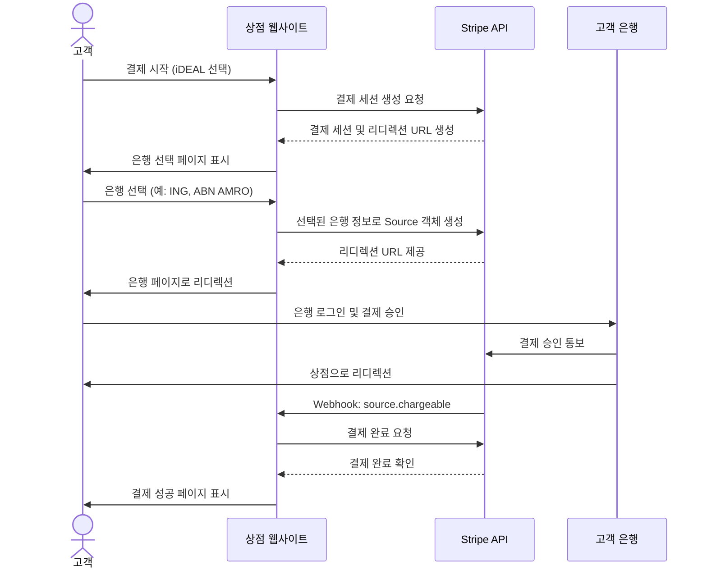

### Bank Redirect 구현 코드 예시 (iDEAL)

```javascript
// 서버 측 코드
const session = await stripe.checkout.sessions.create({
  payment_method_types: ['ideal'],
  line_items: [
    {
      price_data: {
        currency: 'eur',
        product_data: {
          name: '네덜란드 상품',
        },
        unit_amount: 2000, // €20.00
      },
      quantity: 1,
    },
  ],
  mode: 'payment',
  success_url: 'https://example.com/success',
  cancel_url: 'https://example.com/cancel',
});
```

### Bank Redirect 장단점

**장점**:

- **높은 전환율**: 특정 국가에서 선호되는 결제 방식 제공
- **낮은 수수료**: 일반적으로 신용카드보다 저렴
- **즉각적인 확인**: 거래 성공 여부를 즉시 확인 가능
- **높은 보안성**: 고객이 자신의 은행 인증 시스템 사용

**단점**:

- **지역 제한**: 특정 국가/지역에서만 사용 가능
- **UX 복잡성**: 외부 사이트로의 리디렉션이 필요함
- **설정 복잡성**: 국가별로 다른 시스템 통합 필요
- **자동 결제 제한**: 구독 모델에 적합하지 않음

## 한국 시장 적용 가능성

한국 시장에서 은행 계좌 기반 결제는 주로 다음과 같은 방식으로 구현될 수 있다:

1. **가상계좌 입금**:

   - 고객별로 임시 가상계좌 발급
   - 고객이 계좌이체로 입금 후 결제 완료
   - Stripe 직접 지원은 제한적이며, 국내 PG사 연동 필요할 수 있음

2. **실시간 계좌이체**:
   - 국내 인터넷뱅킹 시스템을 활용한 즉시 이체
   - 공인인증서/금융인증서 기반 인증 필요
   - 국내 PG사 연동 필요

### 국내 적용 시 고려사항

1. **규제 요구사항**:

   - 전자금융거래법 준수 필요
   - 금융위원회/금융감독원 규제 요구사항 확인

2. **기술적 통합**:

   - 국내 은행 시스템과의 호환성
   - 공인인증서/금융인증서 인증 처리

3. **사용자 경험**:
   - 한국 사용자의 결제 선호도 고려
   - 모바일 환경 최적화 필요

## 결론 및 권장사항

은행 계좌 기반 결제는 특정 시장과 사용 사례에서 중요한 결제 옵션이다. 다음과 같은 접근을 권장한다:

1. **시장별 맞춤 전략**:

   - 미국: ACH Debit 활용 (특히 구독 모델)
   - 유럽: 국가별 Bank Redirect 시스템 통합
   - 한국: 국내 PG사와 협력하여 가상계좌/실시간 계좌이체 제공

2. **하이브리드 접근**:

   - 신용카드와 은행 계좌 결제를 모두 제공
   - 고객이 선호하는 결제 방식 선택 가능

3. **지속적인 모니터링**:
   - 결제 성공률 추적
   - 지역별 선호도 변화 관찰

은행 계좌 기반 결제는 신용카드 결제를 보완하는 중요한 옵션으로, 특히 특정 지역이나 높은 금액의 거래에서 중요한 역할을 한다. 그러나 각 시장의 특성과 규제를 충분히 이해하고 적용하는 것이 성공적인 구현의 핵심이다.

# 결제 실패 및 재시도 로직

결제 실패는 모든 결제 시스템에서 발생할 수 있는 일반적인 문제다. Stripe는 결제 실패를 자동으로 처리하고 재시도하는 강력한 메커니즘을 제공한다. 이 섹션에서는 결제 실패 시나리오, 실패 원인, 그리고 자동 및 수동 재시도 방법에 대해 설명한다.

## 결제 실패 원인

결제가 실패하는 주요 원인은 다음과 같다:

1. **카드 관련 문제**:

   - 잔액 부족
   - 카드 만료
   - 한도 초과
   - 분실/도난 카드
   - 잘못된 CVC 또는 우편번호
   - 해외 결제 제한

2. **은행/네트워크 문제**:

   - 일시적인 네트워크 장애
   - 은행 시스템 유지보수
   - 처리 지연

3. **보안 관련 문제**:

   - 사기 의심 거래로 표시됨
   - 3D Secure 인증 실패
   - 비정상적인 구매 패턴 감지

4. **기술적 문제**:
   - 결제 처리 중 오류
   - 요청 제한 초과
   - 유효하지 않은 요청 파라미터

## Stripe의 자동 재시도 메커니즘

### 구독 결제 자동 재시도

Stripe는 구독(Subscription) 결제가 실패할 경우 자동으로 재시도하는 Smart Retries 시스템을 제공한다:

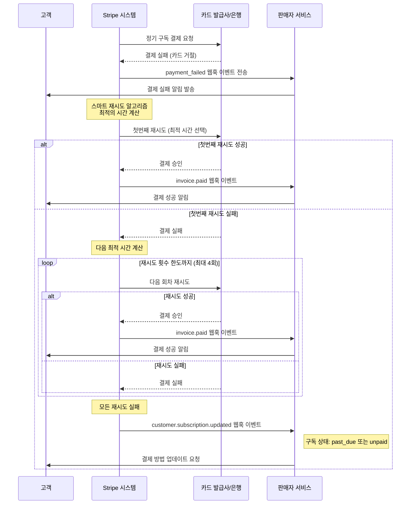

#### 자동 재시도 주요 특징:

1. **스마트 스케줄링**:

   - Stripe는 성공 가능성이 가장 높은 시간에 재시도한다.
   - 이는 카드 유형, 국가, 이전 성공 패턴 등 다양한 요소를 고려한다.

2. **기본 재시도 일정**:

   - 기본적으로 최대 4회 재시도
   - 일반적인 재시도 일정: 첫 실패 후 1일, 3일, 5일, 7일
   - 이 일정은 Stripe의 머신러닝 모델에 의해 최적화될 수 있다.

3. **맞춤 재시도 설정**:

   - Stripe 대시보드에서 맞춤 재시도 설정 가능
   - 재시도 횟수, 간격, 최대 재시도 기간 조정 가능

4. **결제 액션 필요(action_required) 처리**:
   - 3D Secure 인증이 필요한 경우 고객에게 추가 인증 요청
   - 재시도 메커니즘과 별도로 처리됨

### 결제 실패 웹훅 핸들링

결제 실패와 관련된 Stripe의 주요 웹훅 이벤트와 그 처리 방법은 다음과 같다:

#### 1. `invoice.payment_failed` 이벤트

```javascript
// 백엔드 웹훅 핸들러 예시 코드
if (event.type === 'invoice.payment_failed') {
  const invoice = event.data.object;
  const customerId = invoice.customer;
  const subscriptionId = invoice.subscription;
  const attemptCount = invoice.attempt_count;

  // 실패 로그 기록
  logger.info(`결제 실패: 고객 ID ${customerId}, 구독 ID ${subscriptionId}, 시도 횟수: ${attemptCount}`);

  // 고객에게 알림 발송
  if (attemptCount === 1) {
    // 첫 번째 실패 시 이메일 발송
    await sendPaymentFailureEmail(customerId, invoice);
  } else if (attemptCount >= 3) {
    // 여러 번 실패 시 더 긴급한 알림 발송
    await sendUrgentPaymentFailureNotification(customerId, invoice);
  }

  // 필요한 비즈니스 로직 처리 (예: 접근 제한 등)
  await updateSubscriptionStatus(subscriptionId, 'payment_issue');
}
```

#### 2. `customer.subscription.updated` 이벤트

```javascript
// 백엔드 웹훅 핸들러 예시 코드
if (event.type === 'customer.subscription.updated') {
  const subscription = event.data.object;
  const customerId = subscription.customer;
  const status = subscription.status;

  // 구독 상태가 past_due 또는 unpaid로 변경된 경우
  if (status === 'past_due' || status === 'unpaid') {
    // 모든 자동 재시도가 실패했을 때의 처리

    // 1. 고객에게 결제 수단 업데이트 요청
    await sendUpdatePaymentMethodEmail(customerId, subscription);

    // 2. 서비스 접근 제한 (그레이스 기간 고려)
    if (status === 'unpaid') {
      await restrictServiceAccess(customerId, subscription.id);
    }

    // 3. 내부 알림 (고객 지원팀 등)
    await notifyCustomerSupportTeam(customerId, subscription);
  }
}
```

## 수동 재시도 및 복구 전략

자동 재시도 외에도 다음과 같은 수동 복구 전략을 구현할 수 있다:

### 1. 고객 셀프 서비스 복구

고객이 직접 결제 문제를 해결할 수 있는 인터페이스 제공:

```javascript
// 프론트엔드 - 결제 재시도 요청
async function retryFailedPayment(invoiceId) {
  try {
    const response = await fetch('/api/payments/retry', {
      method: 'POST',
      headers: { 'Content-Type': 'application/json' },
      body: JSON.stringify({ invoice_id: invoiceId }),
    });

    const result = await response.json();

    if (result.requires_action) {
      // 3D Secure 인증 등 추가 액션 필요
      const { error } = await stripe.confirmCardPayment(result.client_secret);
      if (error) {
        throw new Error(error.message);
      }
    }

    // 성공 UI 표시
    showSuccessMessage('결제가 성공적으로 처리되었습니다.');
  } catch (error) {
    // 오류 UI 표시
    showErrorMessage(`결제 재시도 중 오류 발생: ${error.message}`);
  }
}
```

```javascript
// 백엔드 - 결제 재시도 API
app.post('/api/payments/retry', async (req, res) => {
  try {
    const { invoice_id } = req.body;

    // 인보이스 조회
    const invoice = await stripe.invoices.retrieve(invoice_id);

    // 인보이스 결제 재시도
    const paymentIntent = await stripe.invoices.pay(invoice_id);

    return res.json({ success: true, payment_intent: paymentIntent });
  } catch (error) {
    if (error.code === 'authentication_required') {
      // 3D Secure 인증 필요
      return res.json({
        requires_action: true,
        client_secret: error.payment_intent.client_secret,
      });
    }

    return res.status(400).json({ error: error.message });
  }
});
```

### 2. 결제 수단 업데이트 흐름

고객에게 결제 수단 업데이트를 유도하는 전략:

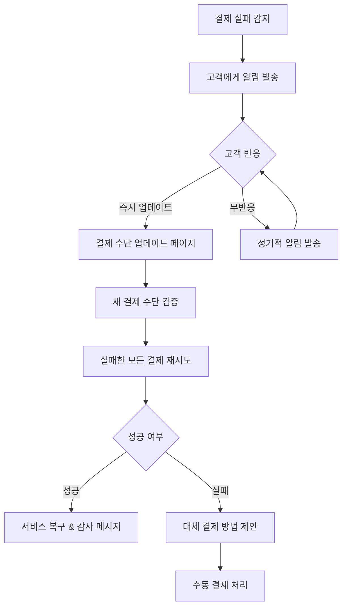

### 3. 관리자용 복구 도구

비즈니스 중요도가 높은 고객을 위한 관리자 도구:

```javascript
// 관리자 도구 - 수동 결제 재시도 함수
async function adminRetryPayment(subscriptionId, customerId) {
  try {
    // 1. 가장 최근 실패한 인보이스 조회
    const invoices = await stripe.invoices.list({
      customer: customerId,
      subscription: subscriptionId,
      status: 'open',
      limit: 1,
    });

    if (invoices.data.length === 0) {
      throw new Error('재시도할 미납 인보이스가 없습니다.');
    }

    const invoice = invoices.data[0];

    // 2. 수동으로 결제 재시도
    const updatedInvoice = await stripe.invoices.pay(invoice.id);

    // 3. 결과 기록
    await logAdminAction({
      type: 'payment_retry',
      admin_id: currentAdminId,
      customer_id: customerId,
      subscription_id: subscriptionId,
      invoice_id: invoice.id,
      result: updatedInvoice.status,
    });

    return {
      success: updatedInvoice.status === 'paid',
      invoice: updatedInvoice,
    };
  } catch (error) {
    // 오류 기록 및 반환
    await logAdminError({
      action: 'payment_retry',
      error: error.message,
      customer_id: customerId,
    });

    return {
      success: false,
      error: error.message,
    };
  }
}
```

## 결제 실패 모니터링 및 분석

### 실패율 모니터링 대시보드 예시

```javascript
// 대시보드용 데이터 집계 쿼리 예시
async function getPaymentFailureMetrics(startDate, endDate) {
  // Stripe 데이터 분석 (실제로는 Stripe Sigma나 자체 데이터 웨어하우스 활용)
  const failureData = await analyzePaymentFailures(startDate, endDate);

  return {
    // 전체 실패율
    overall_failure_rate: failureData.failureCount / failureData.totalAttempts,

    // 원인별 실패 비율
    failure_reasons: {
      insufficient_funds: failureData.reasonCounts.insufficient_funds / failureData.failureCount,
      expired_card: failureData.reasonCounts.expired_card / failureData.failureCount,
      declined: failureData.reasonCounts.declined / failureData.failureCount,
      processing_error: failureData.reasonCounts.processing_error / failureData.failureCount,
      // 기타 원인...
    },

    // 재시도 성공률
    retry_success_rate: failureData.retrySuccessCount / failureData.retryAttempts,

    // 결제 수단별 실패율
    by_payment_method: {
      visa: failureData.byCard.visa.failureRate,
      mastercard: failureData.byCard.mastercard.failureRate,
      amex: failureData.byCard.amex.failureRate,
      // 기타 카드...
    },

    // 국가별 실패율
    by_country: failureData.byCountry,

    // 트렌드 (일별/주별)
    trends: failureData.trends,
  };
}
```

### 실패 원인별 대응 전략

| 실패 원인         | 대응 전략                | 구현 방식                                     |
| ----------------- | ------------------------ | --------------------------------------------- |
| **잔액 부족**     | 결제일 조정, 분할 결제   | 고객에게 결제일 변경 옵션 제공, 인보이스 분할 |
| **카드 만료**     | 사전 알림, 자동 업데이트 | 만료 전 이메일 알림, 네트워크 자동 업데이트   |
| **일시적 거절**   | 지능적 재시도            | 성공 가능성 높은 시간대에 재시도              |
| **영구적 거절**   | 대체 결제 수단           | 다른 카드나 결제 방식 제안                    |
| **3DS 인증 실패** | 사용자 안내 개선         | 명확한 인증 안내, 시간 제한 연장              |
| **사기 의심**     | 합법적 거래 확인         | 추가 인증 요청, 은행 연락 안내                |

## 통합 복구 프로세스 흐름

Stripe의 자동 재시도와 자체 복구 메커니즘을 통합한 전체 프로세스:

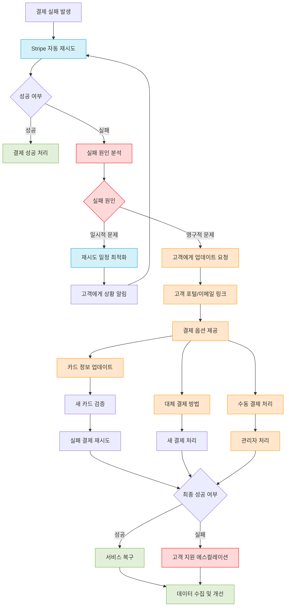

## 결론 및 권장 사항

1. **자동 재시도 최적화**:

   - Stripe의 기본 재시도 메커니즘을 활용하고 비즈니스 특성에 맞게 최적화한다.
   - 특정 고객 세그먼트나 가격 플랜에 대해 다른 재시도 정책을 적용할 수 있다.

2. **효과적인 커뮤니케이션**:

   - 결제 실패 시 명확하고 행동 유도가 포함된 커뮤니케이션을 제공한다.
   - 알림의 톤과 긴급성을 재시도 횟수에 따라 점진적으로 조절한다.

3. **셀프 서비스 도구**:

   - 고객이 스스로 문제를 해결할 수 있는 직관적인 인터페이스를 제공한다.
   - Stripe 고객 포털과의 통합을 고려한다.

4. **데이터 기반 접근**:

   - 결제 실패 패턴을 분석하여 시스템을 지속적으로 개선한다.
   - 실패율이 높은 세그먼트를 식별하고 맞춤형 전략을 개발한다.

5. **그레이스 기간 관리**:
   - 결제 실패 후 즉시 서비스를 중단하기보다 합리적인 그레이스 기간을 제공한다.
   - 고객 등급이나 거래 이력에 따라 차별화된 그레이스 기간을 적용할 수 있다.

결제 실패는 피할 수 없는 현상이지만, 잘 설계된 재시도 및 복구 메커니즘을 통해 대부분의 실패를 성공으로 전환할 수 있다. 자동화된 재시도, 효과적인 고객 커뮤니케이션, 그리고 사용하기 쉬운 셀프 서비스 도구의 조합이 최적의 결과를 가져온다.

# Free Trial 및 프로모션 적용

Stripe는 다양한 비즈니스 모델을 지원하기 위해 무료 체험 기간(Free Trial), 쿠폰 코드, 할인 등 여러 프로모션 유형을 제공한다. 이 섹션에서는 각 프로모션 유형과 구현 방법, 그리고 유의사항을 설명한다.

## 무료 체험 기간 (Free Trial)

무료 체험 기간은 고객이 비용 지불 없이 서비스를 사용해볼 수 있는 기간을 제공하는 방식이다. Stripe에서는 구독 생성 시 무료 체험 기간을 쉽게 설정할 수 있다.

### 무료 체험 기간 구현 방법

#### 1. 구독 생성 시 trial_period_days 설정

```javascript
// 백엔드 구현 - 무료 체험 기간 설정
const subscription = await stripe.subscriptions.create({
  customer: 'cus_MWgH5g0NXw9Eiy',
  items: [{ price: 'price_1NZJ0rRJ3gmrV5GwUwcJY9Qr' }],
  trial_period_days: 14, // 14일 무료 체험 기간
  // 선택적으로 카드 정보 없이 무료 체험 시작 가능
  payment_settings: {
    payment_method_types: ['card'],
    save_default_payment_method: 'on_subscription',
  },
  // 무료 체험 종료 후 알림 설정
  trial_settings: {
    end_behavior: {
      missing_payment_method: {
        // 결제 수단 없는 경우 자동 취소
        subscription_behavior: 'cancel',
      },
    },
  },
});
```

#### 2. 특정 날짜까지 무료 체험 제공

기간이 아닌 특정 날짜까지 무료 체험을 제공하려면 `trial_end` 매개변수를 사용한다:

```javascript
// 특정 날짜까지 무료 체험 제공
const trialEndDate = Math.floor(new Date('2025-06-30').getTime() / 1000);
const subscription = await stripe.subscriptions.create({
  customer: 'cus_MWgH5g0NXw9Eiy',
  items: [{ price: 'price_1NZJ0rRJ3gmrV5GwUwcJY9Qr' }],
  trial_end: trialEndDate, // Unix 타임스탬프로 지정
  expand: ['latest_invoice.payment_intent'],
});
```

### 무료 체험 기간 웹훅 이벤트

무료 체험 기간과 관련된 주요 웹훅 이벤트는 다음과 같다:

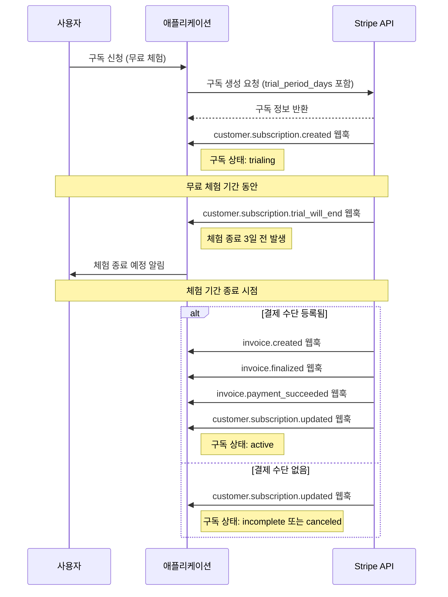

주목할 만한 웹훅 이벤트:

1. **customer.subscription.created**: 무료 체험 구독 생성 시 발생
2. **customer.subscription.trial_will_end**: 무료 체험 종료 3일 전 발생
3. **customer.subscription.updated**: 무료 체험에서 정식 구독으로 전환 시 발생

### 무료 체험 구현 시 고려사항

1. **결제 정보 수집 시점**:

   - 체험 시작 시 결제 정보 수집: 전환율이 높지만 초기 이탈 가능성
   - 체험 종료 전 결제 정보 수집: 가입자 수 증가, 전환율 하락 가능성

2. **체험 종료 알림**:

   - `customer.subscription.trial_will_end` 웹훅을 활용하여 체험 종료 전 알림
   - 이메일, 앱 내 알림 등으로 사용자에게 체험 종료와 결제 예정 알림

3. **결제 수단 없을 때 처리**:
   - `trial_settings.end_behavior` 설정으로 체험 종료 시 동작 정의
   - 일반적으로 결제 수단 없으면 구독 취소 또는 불완전 상태로 전환

## 프로모션 코드 및 쿠폰

Stripe에서는 쿠폰(Coupon)과 프로모션 코드(Promotion Code)를 통해 할인을 제공할 수 있다.

### 쿠폰과 프로모션 코드의 차이

1. **쿠폰(Coupon)**:

   - 할인 규칙을 정의하는 객체
   - 직접 고객에게 노출되지 않음
   - 백엔드에서 참조하여 사용

2. **프로모션 코드(Promotion Code)**:
   - 쿠폰과 연결된 고유 코드(예: WELCOME20)
   - 사용자가 직접 입력하여 사용
   - 동일한 쿠폰에 여러 프로모션 코드 연결 가능

### 쿠폰 생성 및 적용 방법

#### 1. 쿠폰 생성

```javascript
// 백엔드에서 쿠폰 생성
const coupon = await stripe.coupons.create({
  name: '30% 할인', // 관리자용 쿠폰 이름
  percent_off: 30, // 30% 할인
  duration: 'repeating', // 반복 적용 (once, forever, repeating)
  duration_in_months: 3, // 3개월 동안 할인 적용
  max_redemptions: 1000, // 최대 1000회 사용 가능
  applies_to: {
    products: ['prod_NvKT5DYqE3D8xZ'], // 특정 상품에만 적용
  },
});

// 또는 고정 금액 할인
const fixedAmountCoupon = await stripe.coupons.create({
  name: '10000원 할인',
  amount_off: 10000, // 10,000원 할인
  currency: 'krw',
  duration: 'once', // 한 번만 적용
});
```

#### 2. 프로모션 코드 생성

```javascript
// 프로모션 코드 생성
const promotionCode = await stripe.promotionCodes.create({
  coupon: coupon.id, // 위에서 생성한 쿠폰 ID
  code: 'WELCOME30', // 사용자가 입력할 코드
  max_redemptions: 100, // 이 코드의 최대 사용 횟수
  expires_at: Math.floor(new Date('2025-12-31').getTime() / 1000), // 만료일
  restrictions: {
    minimum_amount: 20000, // 최소 주문 금액 (20,000원)
    minimum_amount_currency: 'krw',
    first_time_transaction: true, // 첫 거래에만 적용
  },
});
```

#### 3. 구독 생성 시 쿠폰 적용

```javascript
// 구독 생성 시 쿠폰 적용
const subscription = await stripe.subscriptions.create({
  customer: 'cus_MWgH5g0NXw9Eiy',
  items: [{ price: 'price_1NZJ0rRJ3gmrV5GwUwcJY9Qr' }],
  coupon: 'ZFQE9CKS', // 쿠폰 ID 직접 지정
  // 또는
  promotion_code: 'promo_1NkQ3oRJ3gmrV5GwwA1p5S9v', // 프로모션 코드 ID 지정
});
```

#### 4. 클라이언트에서 프로모션 코드 검증

```javascript
// 프론트엔드 - 프로모션 코드 유효성 검증
const validatePromoCode = async (code) => {
  try {
    const response = await fetch('/api/validate-promo-code', {
      method: 'POST',
      headers: { 'Content-Type': 'application/json' },
      body: JSON.stringify({ code }),
    });

    const result = await response.json();
    if (result.valid) {
      // 유효한 프로모션 코드 처리
      return {
        valid: true,
        discount: result.discount,
        description: result.description,
      };
    } else {
      // 잘못된 프로모션 코드 처리
      return { valid: false, error: result.error };
    }
  } catch (error) {
    return { valid: false, error: '프로모션 코드 검증 중 오류가 발생했습니다.' };
  }
};
```

```javascript
// 백엔드 - 프로모션 코드 검증 API
app.post('/api/validate-promo-code', async (req, res) => {
  try {
    const { code } = req.body;

    // 프로모션 코드 검색
    const promotionCodes = await stripe.promotionCodes.list({
      code,
      active: true,
    });

    if (promotionCodes.data.length === 0) {
      return res.json({ valid: false, error: '유효하지 않은 프로모션 코드입니다.' });
    }

    const promoCode = promotionCodes.data[0];

    // 사용 제한 확인
    if (promoCode.max_redemptions && promoCode.times_redeemed >= promoCode.max_redemptions) {
      return res.json({ valid: false, error: '이 프로모션 코드는 모두 소진되었습니다.' });
    }

    // 만료 여부 확인
    if (promoCode.expires_at && promoCode.expires_at < Math.floor(Date.now() / 1000)) {
      return res.json({ valid: false, error: '만료된 프로모션 코드입니다.' });
    }

    // 쿠폰 정보 가져오기
    const coupon = await stripe.coupons.retrieve(promoCode.coupon.id);

    // 할인 정보 구성
    let discountInfo = '';
    if (coupon.percent_off) {
      discountInfo = `${coupon.percent_off}% 할인`;
    } else if (coupon.amount_off) {
      const amount = (coupon.amount_off / 100).toLocaleString(); // 센트 단위를 화폐 단위로 변환
      discountInfo = `${amount}${coupon.currency.toUpperCase()} 할인`;
    }

    // 적용 기간 정보
    let durationInfo = '';
    if (coupon.duration === 'once') {
      durationInfo = '(1회)';
    } else if (coupon.duration === 'repeating') {
      durationInfo = `(${coupon.duration_in_months}개월간)`;
    } else if (coupon.duration === 'forever') {
      durationInfo = '(영구적)';
    }

    return res.json({
      valid: true,
      discount: {
        type: coupon.percent_off ? 'percent' : 'fixed_amount',
        value: coupon.percent_off || coupon.amount_off,
        currency: coupon.currency,
        duration: coupon.duration,
        duration_in_months: coupon.duration_in_months,
      },
      description: `${discountInfo} ${durationInfo}`,
    });
  } catch (error) {
    console.error('프로모션 코드 검증 오류:', error);
    return res.status(400).json({ valid: false, error: '프로모션 코드 검증 중 오류가 발생했습니다.' });
  }
});
```

### 할인 금액 계산 및 표시

```javascript
// 할인 금액 계산 예시
const calculateDiscountedPrice = (originalPrice, discount) => {
  if (discount.type === 'percent') {
    return originalPrice * (1 - discount.value / 100);
  } else if (discount.type === 'fixed_amount') {
    return Math.max(0, originalPrice - discount.value);
  }
  return originalPrice;
};

// 사용 예
const originalPrice = 50000; // 50,000원
const discountedPrice = calculateDiscountedPrice(originalPrice, {
  type: 'percent',
  value: 20,
}); // 40,000원
```

## 무료 체험과 프로모션 조합 사례

무료 체험과 프로모션을 조합하여 다양한 마케팅 전략을 구현할 수 있다:

### 사례 1: 무료 체험 후 첫 결제 할인

```javascript
// 무료 체험 + 첫 결제 할인 적용
const subscription = await stripe.subscriptions.create({
  customer: 'cus_MWgH5g0NXw9Eiy',
  items: [{ price: 'price_1NZJ0rRJ3gmrV5GwUwcJY9Qr' }],
  trial_period_days: 14, // 14일 무료 체험
  coupon: 'FIRST50OFF', // 첫 결제 50% 할인 쿠폰
});
```

### 사례 2: 연간 결제 할인 + 추가 무료 개월

```javascript
// 연간 결제 할인 + 추가 무료 기간
const yearlySubscription = await stripe.subscriptions.create({
  customer: 'cus_MWgH5g0NXw9Eiy',
  items: [{ price: 'price_yearly_1NZJ0rRJ3gmrV5GwUwcJY9Qr' }], // 연간 가격
  trial_period_days: 30 + 60, // 1개월 기본 체험 + 2개월 추가 혜택
  coupon: 'YEARLY20', // 연간 구독 20% 할인
});
```

### 사례 3: 소개 프로그램 (Referral Program)

```javascript
// 소개 프로그램 - 소개한 사용자에게 크레딧 적용
const applyReferralCredit = async (referringUserId, newCustomerId) => {
  // 1. 소개한 사용자에게 크레딧 추가
  await stripe.customers.createBalanceTransaction({
    customer: referringUserId,
    amount: -5000, // 5,000원 크레딧 (음수는 잔액 증가)
    currency: 'krw',
    description: '친구 소개 크레딧',
  });

  // 2. 새 고객에게 할인 쿠폰 적용
  const subscription = await stripe.subscriptions.create({
    customer: newCustomerId,
    items: [{ price: 'price_1NZJ0rRJ3gmrV5GwUwcJY9Qr' }],
    trial_period_days: 30, // 일반 무료 체험
    coupon: 'REFERRED30', // 30% 할인 쿠폰
  });

  return subscription;
};
```

## 프로모션 관련 웹훅 이벤트

프로모션과 관련된 주요 웹훅 이벤트:

1. **customer.discount.created**: 고객에게 할인이 적용될 때 발생
2. **customer.discount.updated**: 고객의 할인이 업데이트될 때 발생
3. **customer.discount.deleted**: 고객의 할인이 제거될 때 발생
4. **invoice.created**: 할인이 적용된 인보이스 생성 시 발생

## 프로모션 추적 및 분석

프로모션 효과를 측정하기 위한 추적 전략:

```javascript
// 프로모션 코드에 메타데이터 추가
const promotionCode = await stripe.promotionCodes.create({
  coupon: 'SUMMER2025',
  code: 'SUMMER25',
  metadata: {
    campaign: 'summer_2025',
    source: 'email',
    segment: 'inactive_users',
  },
});

// 구독에 메타데이터 추가
const subscription = await stripe.subscriptions.create({
  customer: 'cus_MWgH5g0NXw9Eiy',
  items: [{ price: 'price_1NZJ0rRJ3gmrV5GwUwcJY9Qr' }],
  promotion_code: promotionCode.id,
  metadata: {
    acquisition_channel: 'summer_campaign',
    promo_applied: 'SUMMER25',
  },
});
```

## 결론 및 권장 사항

Free Trial 및 프로모션 전략은 고객 획득과 유지에 중요한 역할을 한다. Stripe의 기능을 활용하여 다양한 마케팅 전략을 구현할 수 있으며, 다음 사항을 고려해야 한다:

1. **비즈니스 목표 정의**:

   - 고객 획득 최대화: 진입 장벽을 낮추는 관대한 무료 체험
   - 전환율 최적화: 적절한 체험 기간과 할인으로 유료 전환 유도
   - 수익 최대화: 프로모션에 의한 할인 효과와 고객 생애 가치 균형 고려

2. **무료 체험 최적화**:

   - 서비스 유형에 맞는 적절한 체험 기간 설정
   - 체험 종료 전 적절한 시점에 알림 제공
   - 결제 정보 수집 시점을 비즈니스 모델에 맞게 선택

3. **프로모션 코드 전략**:

   - 목표 고객층에 맞는 할인 유형 선택 (퍼센트 vs 고정 금액)
   - 적절한 사용 제한 설정 (최소 주문 금액, 만료일, 최대 사용 횟수)
   - 프로모션 효과 측정을 위한 메타데이터 활용

4. **기술적 구현**:
   - 웹훅을 활용한 이벤트 기반 처리
   - 프로모션 코드 유효성 검증 로직 구현
   - 사용자 친화적인 할인 정보 표시

Stripe의 유연한 API를 활용하면 다양한 비즈니스 요구사항에 맞는 무료 체험 및 프로모션 전략을 효과적으로 구현할 수 있다. 실제 구현 시에는 비즈니스 목표와 사용자 경험을 균형 있게 고려하는 것이 중요하다.
