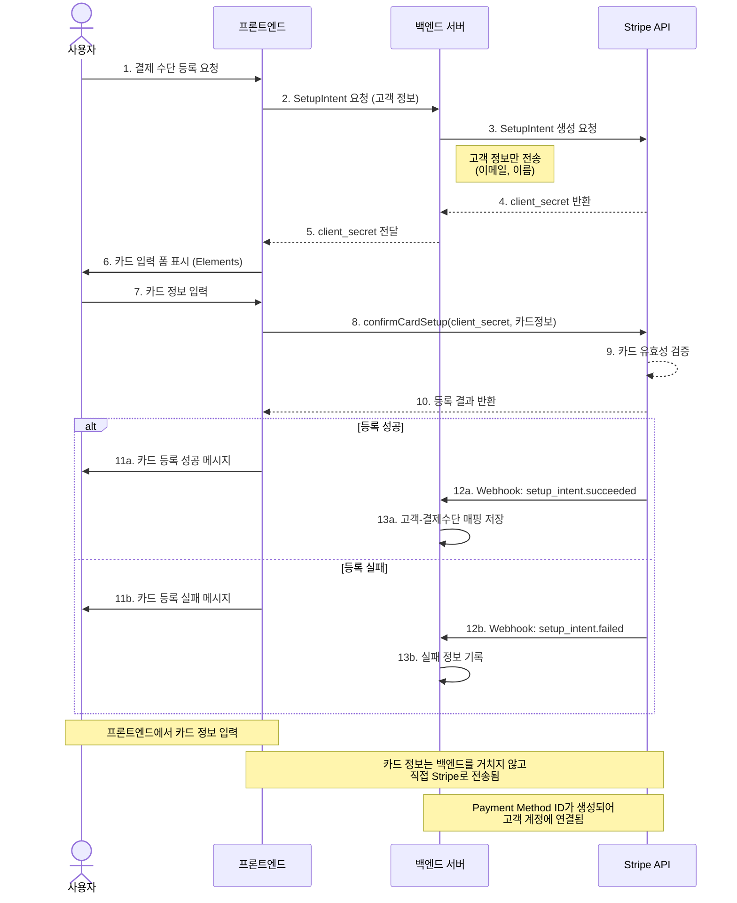
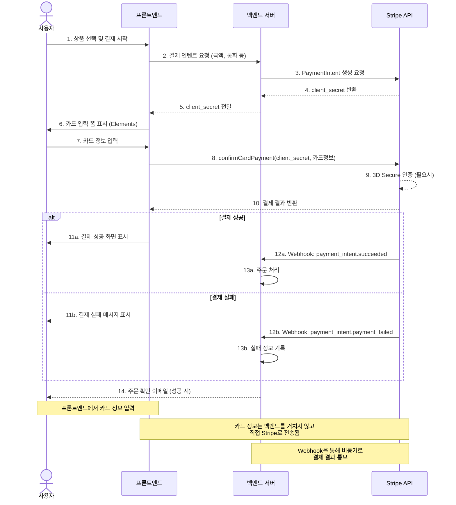
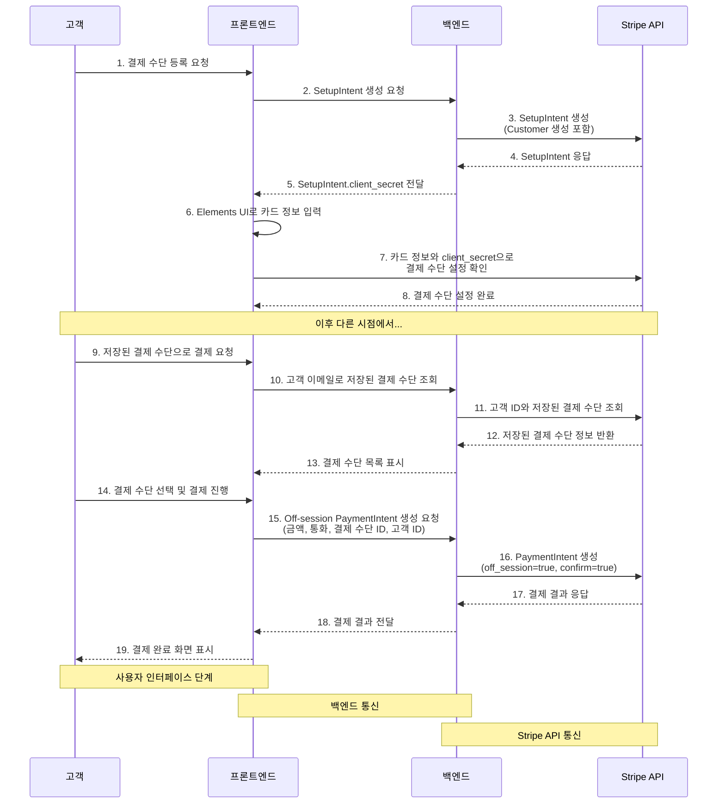
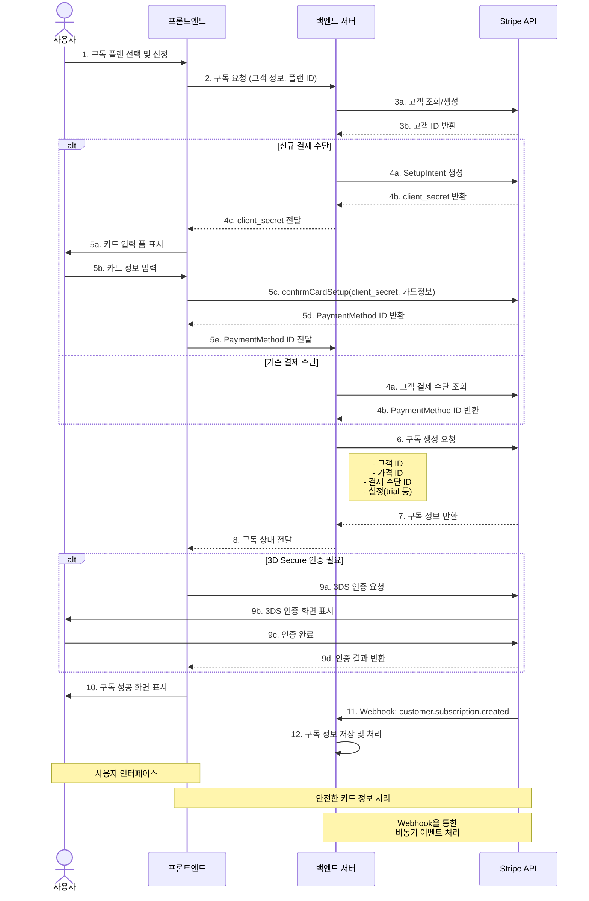
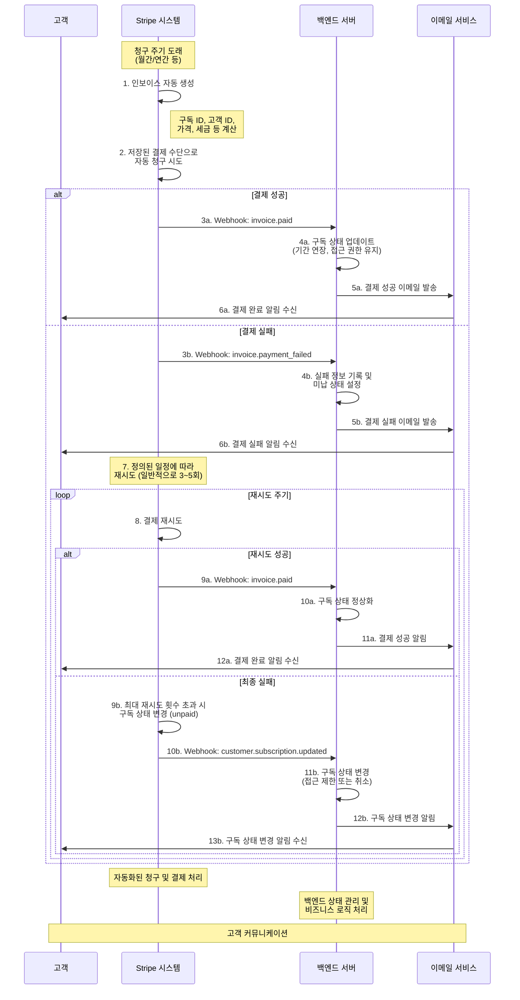
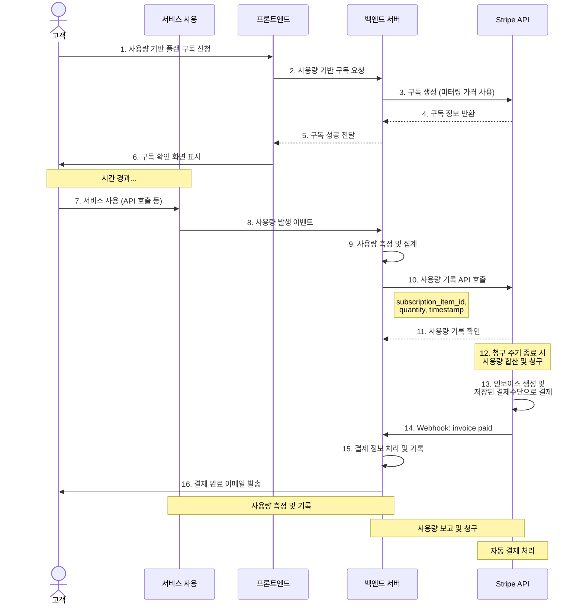
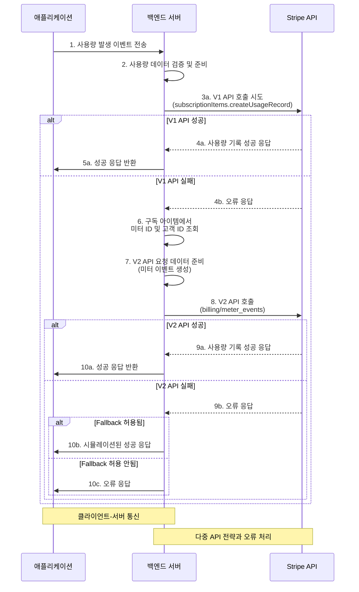
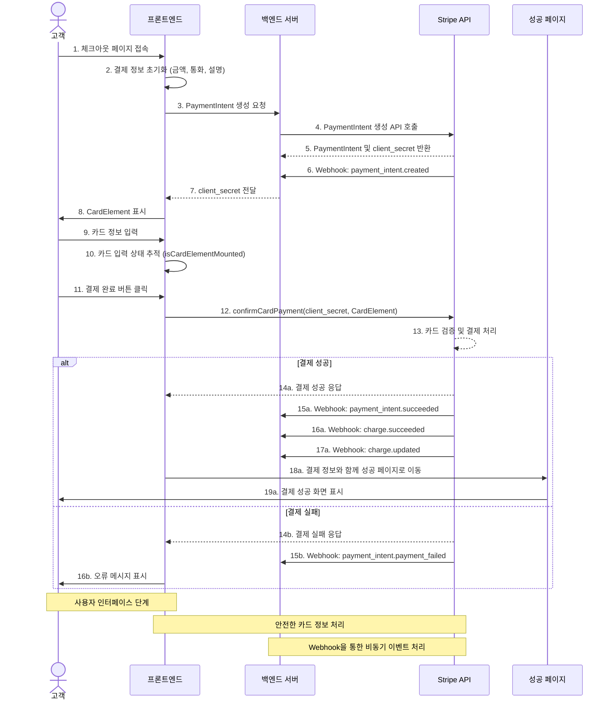
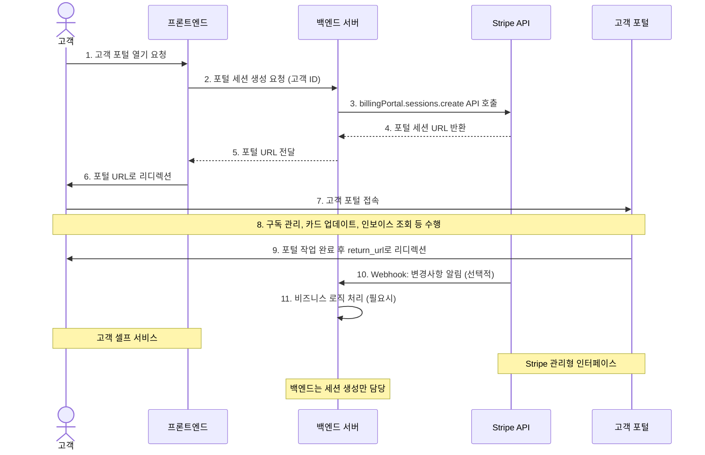
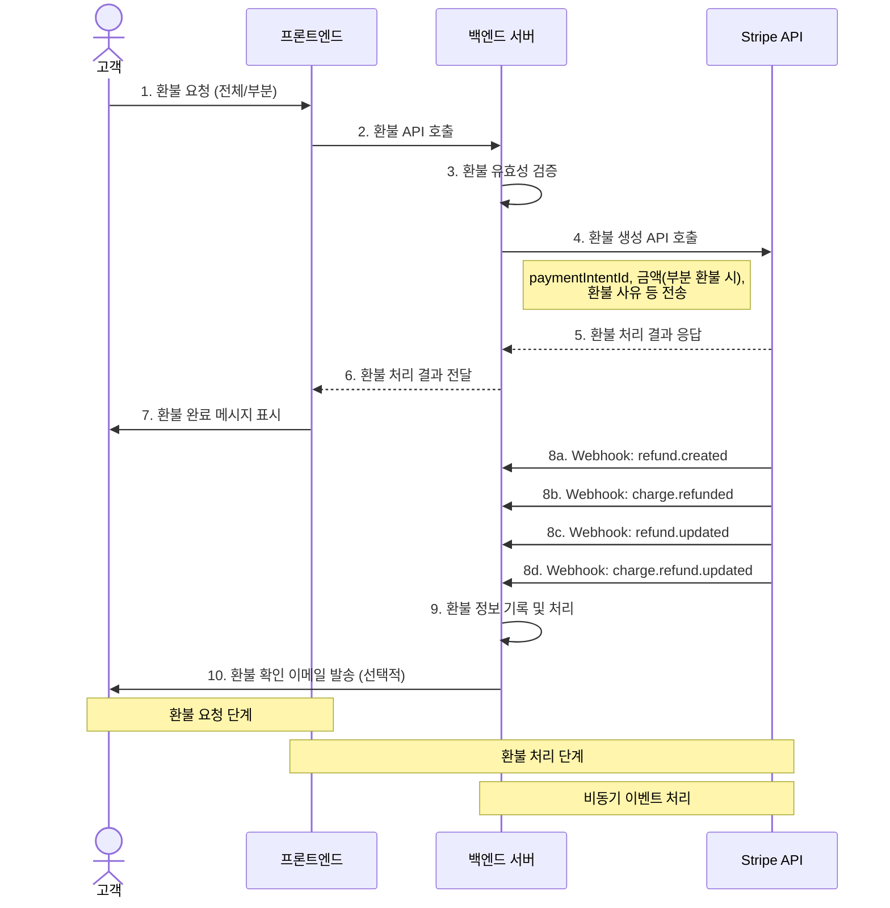

# Prototype 테스트 결과

## 1. 결제 수단 등록

결제 수단 등록 과정은 PCI-DSS 보안 규정을 준수하기 위해 특별한 흐름으로 설계되어 있다. 이 흐름에서 카드 정보는 백엔드 서버를 전혀 거치지 않는다.

### 결제 수단 등록 흐름 Diagram



위 다이어그램은 Stripe를 이용한 결제 수단 등록 흐름을 보여준다. 이 과정에서 카드 정보는 백엔드 서버를 전혀 거치지 않고 프론트엔드에서 직접 Stripe로 안전하게 전송된다. 주요 단계는 다음과 같다:

1. **SetupIntent 생성 (단계 1-5)**:

   - 프론트엔드는 백엔드에 SetupIntent 생성을 요청하며, 이때 카드 정보는 포함되지 않고 고객 정보(이메일, 이름)만 전송된다.
   - 백엔드는 Stripe API를 호출하여 SetupIntent를 생성하고 client_secret을 프론트엔드로 반환한다.

2. **카드 정보 처리 (단계 6-9)**:

   - 사용자가 카드 정보를 입력하면, 이 정보는 프론트엔드에서 Stripe.js와 Elements를 통해 직접 Stripe 서버로 전송된다.
   - Stripe는 카드 정보를 검증하고 Payment Method를 생성한다.

3. **등록 완료 (단계 10-13)**:
   - 등록 결과가 즉시 프론트엔드로 반환되어 사용자에게 결과를 표시한다.
   - 결과는 웹훅을 통해 백엔드에도 비동기적으로 통보된다.
   - 등록이 성공하면 Payment Method가 고객 계정에 연결되어 향후 결제에 사용할 수 있다.

이 방식의 가장 큰 이점은 민감한 카드 정보가 백엔드 서버를 통과하지 않아 PCI DSS 규정 준수 부담을 크게 줄일 수 있다는 점이다.

### 웹훅 이벤트 수신

결제 수단 등록 과정에서 발생한 웹훅 이벤트는 다음과 같다:

```
Webook Event 수신
2025-04-30 16:47:45   --> setup_intent.created [evt_1RJVMrRJ3gmrV5Gw47lnIDq2]
2025-04-30 16:47:45  <--  [201] POST http://localhost:3000/api/webhook [evt_1RJVMrRJ3gmrV5Gw47lnIDq2]
2025-04-30 16:47:47   --> payment_method.attached [evt_1RJVMsRJ3gmrV5GwMzWXZlfM]
2025-04-30 16:47:47  <--  [201] POST http://localhost:3000/api/webhook [evt_1RJVMsRJ3gmrV5GwMzWXZlfM]
2025-04-30 16:47:47   --> setup_intent.succeeded [evt_1RJVMsRJ3gmrV5GwCYwdMly6]
2025-04-30 16:47:47  <--  [201] POST http://localhost:3000/api/webhook [evt_1RJVMsRJ3gmrV5GwCYwdMly6]
```

웹훅 이벤트의 세부 내용은 다음과 같다:

```
웹훅 서명: t=1745999265,v1=525b33c3c81815502a9f15c9bfdd97cf747d42b2cc7816d35c6388055eaeec11,v0=50fdae2cf1326e14c94300a5f777c40a0c794f1ca6c1a6bc413aff4b6905ec1e
웹훅 본문 길이: 1616
[Nest] 26679  - 2025. 04. 30. 오후 4:47:45     LOG [WebhookService] 웹훅 이벤트 수신: setup_intent.created, ID: evt_1RJVMrRJ3gmrV5Gw47lnIDq2
[Nest] 26679  - 2025. 04. 30. 오후 4:47:45     LOG [WebhookService] =============== SetupIntent 생성 ===============
[Nest] 26679  - 2025. 04. 30. 오후 4:47:45     LOG [WebhookService] ID: seti_1RJVMrRJ3gmrV5Gwdj4AOxeN
[Nest] 26679  - 2025. 04. 30. 오후 4:47:45     LOG [WebhookService] 고객 ID: cus_SDwI6UjR3eTgSc
[Nest] 26679  - 2025. 04. 30. 오후 4:47:45     LOG [WebhookService] 상태: requires_payment_method
[Nest] 26679  - 2025. 04. 30. 오후 4:47:45     LOG [WebhookService] 결제 방법 유형: card, bancontact, link, cashapp, amazon_pay
[Nest] 26679  - 2025. 04. 30. 오후 4:47:45     LOG [WebhookService] 사용 목적: off_session
[Nest] 26679  - 2025. 04. 30. 오후 4:47:45     LOG [WebhookService] 결제 방법 ID: 없음
[Nest] 26679  - 2025. 04. 30. 오후 4:47:45     LOG [WebhookService] 설명: 없음
[Nest] 26679  - 2025. 04. 30. 오후 4:47:45     LOG [WebhookService] 메타데이터: {}
[Nest] 26679  - 2025. 04. 30. 오후 4:47:45     LOG [WebhookService] 생성 시간: 2025-04-30T07:47:45.000Z
[Nest] 26679  - 2025. 04. 30. 오후 4:47:45     LOG [WebhookService] 만료 시간: 없음
[Nest] 26679  - 2025. 04. 30. 오후 4:47:45     LOG [WebhookService] ================================================
웹훅 서명: t=1745999266,v1=d6d16b4af1e4ac2c9a11bd6637ce403336524c02414d963743d80792fd201e6f,v0=c4c4396d63464fb5cd7b2b0fdcccfa0f182db210bcb0e6bada73b62090f57b5f
웹훅 본문 길이: 1671
[Nest] 26679  - 2025. 04. 30. 오후 4:47:47     LOG [WebhookService] 웹훅 이벤트 수신: payment_method.attached, ID: evt_1RJVMsRJ3gmrV5GwMzWXZlfM
[Nest] 26679  - 2025. 04. 30. 오후 4:47:47     LOG [WebhookService] =============== 결제 수단 연결 ===============
[Nest] 26679  - 2025. 04. 30. 오후 4:47:47     LOG [WebhookService] ID: pm_1RJVMsRJ3gmrV5GwweRWM9L8
[Nest] 26679  - 2025. 04. 30. 오후 4:47:47     LOG [WebhookService] 고객 ID: cus_SDwI6UjR3eTgSc
[Nest] 26679  - 2025. 04. 30. 오후 4:47:47     LOG [WebhookService] 타입: card
[Nest] 26679  - 2025. 04. 30. 오후 4:47:47     LOG [WebhookService] 생성 시간: 2025-04-30T07:47:46.000Z
[Nest] 26679  - 2025. 04. 30. 오후 4:47:47     LOG [WebhookService] 카드 정보:
[Nest] 26679  - 2025. 04. 30. 오후 4:47:47     LOG [WebhookService]   브랜드: mastercard
[Nest] 26679  - 2025. 04. 30. 오후 4:47:47     LOG [WebhookService]   마지막 4자리: 4444
[Nest] 26679  - 2025. 04. 30. 오후 4:47:47     LOG [WebhookService]   만료 월/년: 11/2033
[Nest] 26679  - 2025. 04. 30. 오후 4:47:47     LOG [WebhookService]   국가: US
[Nest] 26679  - 2025. 04. 30. 오후 4:47:47     LOG [WebhookService]   펀딩 유형: credit
[Nest] 26679  - 2025. 04. 30. 오후 4:47:47     LOG [WebhookService] 청구지 정보:
[Nest] 26679  - 2025. 04. 30. 오후 4:47:47     LOG [WebhookService]   이메일: gracegyu@gmail.com
[Nest] 26679  - 2025. 04. 30. 오후 4:47:47     LOG [WebhookService]   이름: Raymond
[Nest] 26679  - 2025. 04. 30. 오후 4:47:47     LOG [WebhookService]   전화번호: 없음
[Nest] 26679  - 2025. 04. 30. 오후 4:47:47     LOG [WebhookService]   주소: 33333
[Nest] 26679  - 2025. 04. 30. 오후 4:47:47     LOG [WebhookService] 메타데이터: {}
[Nest] 26679  - 2025. 04. 30. 오후 4:47:47     LOG [WebhookService] ================================================
웹훅 서명: t=1745999267,v1=9c422e62d317510342a7cbbd6712fb445d610ddb853c4b5ae977a39a43b4841a,v0=fdde33545457384b9a098bf8b7905a7ed3973bbeb51ec2933b7da21e00c51bd3
웹훅 본문 길이: 1640
[Nest] 26679  - 2025. 04. 30. 오후 4:47:47     LOG [WebhookService] 웹훅 이벤트 수신: setup_intent.succeeded, ID: evt_1RJVMsRJ3gmrV5GwCYwdMly6
[Nest] 26679  - 2025. 04. 30. 오후 4:47:47     LOG [WebhookService] =============== SetupIntent 성공 ===============
[Nest] 26679  - 2025. 04. 30. 오후 4:47:47     LOG [WebhookService] ID: seti_1RJVMrRJ3gmrV5Gwdj4AOxeN
[Nest] 26679  - 2025. 04. 30. 오후 4:47:47     LOG [WebhookService] 고객 ID: cus_SDwI6UjR3eTgSc
[Nest] 26679  - 2025. 04. 30. 오후 4:47:47     LOG [WebhookService] 상태: succeeded
[Nest] 26679  - 2025. 04. 30. 오후 4:47:47     LOG [WebhookService] 결제 방법 ID: pm_1RJVMsRJ3gmrV5GwweRWM9L8
[Nest] 26679  - 2025. 04. 30. 오후 4:47:47     LOG [WebhookService] 결제 방법 유형: card, bancontact, link, cashapp, amazon_pay
[Nest] 26679  - 2025. 04. 30. 오후 4:47:47     LOG [WebhookService] 생성 시간: 2025-04-30T07:47:45.000Z
[Nest] 26679  - 2025. 04. 30. 오후 4:47:47     LOG [WebhookService] 카드 정보: mastercard **** **** **** 4444
[Nest] 26679  - 2025. 04. 30. 오후 4:47:47     LOG [WebhookService] 만료일: 11/2033
[Nest] 26679  - 2025. 04. 30. 오후 4:47:47     LOG [WebhookService] 카드 국가: US
[Nest] 26679  - 2025. 04. 30. 오후 4:47:47     LOG [WebhookService] 메타데이터: {}
[Nest] 26679  - 2025. 04. 30. 오후 4:47:47     LOG [WebhookService] ================================================
```

위 웹훅 이벤트는 결제 수단 등록 과정에서 발생한 세 가지 주요 이벤트를 보여준다:

1. **setup_intent.created**: SetupIntent가 생성되었을 때 발생하는 이벤트로, 초기 상태는 `requires_payment_method`이다.
2. **payment_method.attached**: 결제 수단(카드)이 고객 계정에 연결되었을 때 발생하는 이벤트로, 카드 정보(브랜드, 마지막 4자리, 만료일 등)를 포함한다.
3. **setup_intent.succeeded**: SetupIntent가 성공적으로 완료되었을 때 발생하는 이벤트로, 최종 상태는 `succeeded`이다.

이 웹훅 이벤트들은 백엔드 서버에서 수신되어 적절히 처리되며, 결제 수단 등록 과정의 각 단계를 추적하고 필요한 비즈니스 로직을 연결하는 데 사용된다.

### 보안 이점

- **카드 데이터 격리**: 민감한 카드 정보(카드 번호, CVC, 만료일 등)가 서비스 백엔드를 통과하지 않는다.
- **PCI 규정 준수**: 서비스가 카드 정보를 직접 처리하지 않아 PCI-DSS 규정 준수 범위가 최소화된다.
- **책임 분리**: 카드 정보 보안 책임은 Stripe가, 서비스 로직은 백엔드가 담당하는 명확한 책임 분리가 가능하다.
- **인증 분리**: 이 방식을 통해 카드 인증(3D Secure 등)도 Stripe가 직접 처리한다.

이런 설계 방식을 "클라이언트 사이드 토큰화(Client-side tokenization)"라고 하며, 결제 시스템 구현의 보안 모범 사례로 널리 사용된다.

## 2. 비정기 단건 결제

비정기 단건 결제는 PaymentIntent API를 사용하여 일회성 결제를 처리하는 방식이다. 이는 상품 구매, 서비스 이용료 결제 등 일회성 금액 청구에 적합하다.

### 결제 흐름 Diagram



1. **결제 준비 (단계 1-5)**: 백엔드에서 Stripe API를 호출하여 PaymentIntent를 생성하고, client_secret을 프론트엔드로 전달한다.

2. **카드 정보 처리 (단계 6-9)**: 사용자가 카드 정보를 입력하면, 이 정보는 프론트엔드에서 Stripe.js와 Elements를 통해 직접 Stripe 서버로 전송된다.

   - 필요한 경우 3D Secure 인증도 이 과정에서 처리된다.

3. **결제 완료 (단계 10-11)**: 결제 처리 결과가 프론트엔드로 즉시 반환되어 사용자에게 성공/실패 화면을 표시한다.

4. **비동기 웹훅 처리 (단계 12-14)**: 결제 처리 결과는 Stripe 웹훅을 통해 백엔드에 비동기적으로 통보된다.
   - 백엔드는 이 정보를 사용하여 주문 처리나 실패 기록 등의 작업을 수행한다.

이 흐름의 주요 장점은 PCI-DSS 규정 준수를 위해 카드 정보가 백엔드 서버를 전혀 거치지 않는다는 점이다. 이로써 보안 부담을 크게 줄이면서도 안전한 결제 처리가 가능하다.

### 웹훅 이벤트 수신

비정기 단건 결제 과정에서 발생한 웹훅 이벤트는 다음과 같다:

```
Webhook Event 수신
2025-04-30 16:34:12   --> payment_intent.created [evt_3RJV9jRJ3gmrV5Gw0gIEVKQg]
2025-04-30 16:34:12  <--  [201] POST http://localhost:3000/api/webhook [evt_3RJV9jRJ3gmrV5Gw0gIEVKQg]
2025-04-30 16:34:13   --> payment_intent.succeeded [evt_3RJV9jRJ3gmrV5Gw00kWmm2j]
2025-04-30 16:34:13  <--  [201] POST http://localhost:3000/api/webhook [evt_3RJV9jRJ3gmrV5Gw00kWmm2j]
2025-04-30 16:34:13   --> charge.succeeded [evt_3RJV9jRJ3gmrV5Gw0fgJ8hDb]
2025-04-30 16:34:13  <--  [201] POST http://localhost:3000/api/webhook [evt_3RJV9jRJ3gmrV5Gw0fgJ8hDb]
2025-04-30 16:34:15   --> charge.updated [evt_3RJV9jRJ3gmrV5Gw0WPVqr0K]
2025-04-30 16:34:15  <--  [201] POST http://localhost:3000/api/webhook [evt_3RJV9jRJ3gmrV5Gw0WPVqr0K]
```

웹훅 이벤트의 세부 내용은 다음과 같다:

```
웹훅 서명: t=1745998451,v1=667999f652c4b3846b052864df86caa0106f4e77732093df4a0fa3f642e21136,v0=821cdd24a1cbc5653cf48ece4e413e2effa54a77921a56605a6721d3231d395e
웹훅 본문 길이: 2136
[Nest] 22449  - 2025. 04. 30. 오후 4:34:12     LOG [WebhookService] 웹훅 이벤트 수신: payment_intent.created, ID: evt_3RJV9jRJ3gmrV5Gw0gIEVKQg
[Nest] 22449  - 2025. 04. 30. 오후 4:34:12     LOG [WebhookService] =============== PaymentIntent 생성 ===============
[Nest] 22449  - 2025. 04. 30. 오후 4:34:12     LOG [WebhookService] ID: pi_3RJV9jRJ3gmrV5Gw0GGxh4Kg
[Nest] 22449  - 2025. 04. 30. 오후 4:34:12     LOG [WebhookService] 금액: 1000 krw
[Nest] 22449  - 2025. 04. 30. 오후 4:34:12     LOG [WebhookService] 고객 ID: 없음
[Nest] 22449  - 2025. 04. 30. 오후 4:34:12     LOG [WebhookService] 상태: requires_payment_method
[Nest] 22449  - 2025. 04. 30. 오후 4:34:12     LOG [WebhookService] 결제 방법: card, link
[Nest] 22449  - 2025. 04. 30. 오후 4:34:12     LOG [WebhookService] 메타데이터: {}
[Nest] 22449  - 2025. 04. 30. 오후 4:34:12     LOG [WebhookService] 생성 시간: 2025-04-30T07:34:11.000Z
[Nest] 22449  - 2025. 04. 30. 오후 4:34:12     LOG [WebhookService] ================================================
웹훅 서명: t=1745998453,v1=f27571eaa706288be506257effe90ec89fac886ce5fe4490e56012324e04eb23,v0=742af8a8cecc8517b0ab5e6d59ff2fc423569539ec797bfc3b9d6de4215c2fb9
웹훅 본문 길이: 2159
[Nest] 22449  - 2025. 04. 30. 오후 4:34:13     LOG [WebhookService] 웹훅 이벤트 수신: payment_intent.succeeded, ID: evt_3RJV9jRJ3gmrV5Gw00kWmm2j
[Nest] 22449  - 2025. 04. 30. 오후 4:34:13     LOG [WebhookService] =============== 결제 성공 ===============
[Nest] 22449  - 2025. 04. 30. 오후 4:34:13     LOG [WebhookService] ID: pi_3RJV9jRJ3gmrV5Gw0GGxh4Kg
[Nest] 22449  - 2025. 04. 30. 오후 4:34:13     LOG [WebhookService] 금액: 1000 krw
[Nest] 22449  - 2025. 04. 30. 오후 4:34:13     LOG [WebhookService] 고객 ID: 없음
[Nest] 22449  - 2025. 04. 30. 오후 4:34:13     LOG [WebhookService] 결제 방법 ID: pm_1RJV9kRJ3gmrV5GwzY6STL1U
[Nest] 22449  - 2025. 04. 30. 오후 4:34:13     LOG [WebhookService] 결제 방법 타입: card, link
[Nest] 22449  - 2025. 04. 30. 오후 4:34:13     LOG [WebhookService] 메타데이터: {}
[Nest] 22449  - 2025. 04. 30. 오후 4:34:13     LOG [WebhookService] 상태: succeeded
[Nest] 22449  - 2025. 04. 30. 오후 4:34:13     LOG [WebhookService] 처리 시간: 2025-04-30T07:34:11.000Z
[Nest] 22449  - 2025. 04. 30. 오후 4:34:13     LOG [WebhookService] 연관 Charge ID: ch_3RJV9jRJ3gmrV5Gw0TVQOT78
[Nest] 22449  - 2025. 04. 30. 오후 4:34:13     LOG [WebhookService] ========================================
웹훅 서명: t=1745998453,v1=9a83713b4e792bb6313034282eec2d24c20bf80486cf444d6e106356205533c4,v0=1813c3785ea9a9ca06bde55c58b733078b8c3a9ed7b29a78d4ae079609975409
웹훅 본문 길이: 3722
[Nest] 22449  - 2025. 04. 30. 오후 4:34:13     LOG [WebhookService] 웹훅 이벤트 수신: charge.succeeded, ID: evt_3RJV9jRJ3gmrV5Gw0fgJ8hDb
[Nest] 22449  - 2025. 04. 30. 오후 4:34:13     LOG [WebhookService] =============== Charge 성공 ===============
[Nest] 22449  - 2025. 04. 30. 오후 4:34:13     LOG [WebhookService] ID: ch_3RJV9jRJ3gmrV5Gw0TVQOT78
[Nest] 22449  - 2025. 04. 30. 오후 4:34:13     LOG [WebhookService] 금액: 1000 krw
[Nest] 22449  - 2025. 04. 30. 오후 4:34:13     LOG [WebhookService] PaymentIntent ID: pi_3RJV9jRJ3gmrV5Gw0GGxh4Kg
[Nest] 22449  - 2025. 04. 30. 오후 4:34:13     LOG [WebhookService] 고객 ID: 없음
[Nest] 22449  - 2025. 04. 30. 오후 4:34:13     LOG [WebhookService] 결제 수단 ID: pm_1RJV9kRJ3gmrV5GwzY6STL1U
[Nest] 22449  - 2025. 04. 30. 오후 4:34:13     LOG [WebhookService] 결제 수단 상세: card
[Nest] 22449  - 2025. 04. 30. 오후 4:34:13     LOG [WebhookService] 카드 정보: visa **** **** **** 4242
[Nest] 22449  - 2025. 04. 30. 오후 4:34:13     LOG [WebhookService] 만료일: 11/2033
[Nest] 22449  - 2025. 04. 30. 오후 4:34:13     LOG [WebhookService] 카드 국가: US
[Nest] 22449  - 2025. 04. 30. 오후 4:34:13     LOG [WebhookService] 영수증 URL: https://pay.stripe.com/receipts/payment/CAcaFwoVYWNjdF8xUkhKaUpSSjNnbXJWNUd3KPWkx8AGMgaxMnXlwFE6LBbo14df3v9sYM9wywGc7VyadQJ9MUgF99QeseJIhLXGaQpQXOWEX7otExKG
[Nest] 22449  - 2025. 04. 30. 오후 4:34:13     LOG [WebhookService] 상태: succeeded
[Nest] 22449  - 2025. 04. 30. 오후 4:34:13     LOG [WebhookService] 메타데이터: {}
[Nest] 22449  - 2025. 04. 30. 오후 4:34:13     LOG [WebhookService] 생성 시간: 2025-04-30T07:34:12.000Z
[Nest] 22449  - 2025. 04. 30. 오후 4:34:13     LOG [WebhookService] ==========================================
웹훅 서명: t=1745998455,v1=c19343af99495bbfee9a6a1d0fdbc4d9e9086152b37197cb6988c188220cb020,v0=35aa40b727793a95077d3cd635ddc3889c1647b707c2cde6f9035b0c687c352c
웹훅 본문 길이: 3947
[Nest] 22449  - 2025. 04. 30. 오후 4:34:15     LOG [WebhookService] 웹훅 이벤트 수신: charge.updated, ID: evt_3RJV9jRJ3gmrV5Gw0WPVqr0K
[Nest] 22449  - 2025. 04. 30. 오후 4:34:15     LOG [WebhookService] =============== Charge 업데이트 ===============
[Nest] 22449  - 2025. 04. 30. 오후 4:34:15     LOG [WebhookService] ID: ch_3RJV9jRJ3gmrV5Gw0TVQOT78
[Nest] 22449  - 2025. 04. 30. 오후 4:34:15     LOG [WebhookService] 상태: succeeded
[Nest] 22449  - 2025. 04. 30. 오후 4:34:15     LOG [WebhookService] 금액: 1000 krw
[Nest] 22449  - 2025. 04. 30. 오후 4:34:15     LOG [WebhookService] PaymentIntent ID: pi_3RJV9jRJ3gmrV5Gw0GGxh4Kg
[Nest] 22449  - 2025. 04. 30. 오후 4:34:15     LOG [WebhookService] 고객 ID: 없음
[Nest] 22449  - 2025. 04. 30. 오후 4:34:15     LOG [WebhookService] 결제 수단 ID: pm_1RJV9kRJ3gmrV5GwzY6STL1U
[Nest] 22449  - 2025. 04. 30. 오후 4:34:15     LOG [WebhookService] 업데이트 시간: 2025-04-30T07:34:15.591Z
[Nest] 22449  - 2025. 04. 30. 오후 4:34:15     LOG [WebhookService] ===============================================
```

위 웹훅 이벤트는 비정기 단건 결제 과정에서 발생한 네 가지 주요 이벤트를 보여준다:

1. **payment_intent.created**: 결제 시작 시 PaymentIntent가 생성되었을 때 발생하는 이벤트로, 초기 상태는 `requires_payment_method`이다.
2. **payment_intent.succeeded**: 결제가 성공적으로 완료되었을 때 발생하는 이벤트로, 결제 수단 ID와 연관된 Charge ID 정보를 포함한다.
3. **charge.succeeded**: 실제 청구가 성공적으로 이루어졌을 때 발생하는 이벤트로, 카드 정보와 영수증 URL 등 상세 정보를 포함한다.
4. **charge.updated**: 청구 정보가 업데이트될 때 발생하는 이벤트로, 일반적으로 설명이나 메타데이터 정보가 추가될 때 발생한다.

이 웹훅 이벤트들은 백엔드 서버에서 수신되어 적절히 처리되며, 결제 처리 결과를 기반으로 주문 처리, 재고 업데이트, 이메일 발송 등의 비즈니스 로직을 수행하는 데 사용된다.

### 테스트 결과

#### 테스트 환경

- **결제 페이지 UI**: 사용자 친화적인 결제 양식을 구현했으며, 금액, 통화, 설명 등의 기본 정보와 카드 입력 필드를 포함한다.
- **테스트 카드**: `4242 4242 4242 4242` (Stripe 테스트 카드)
- **금액**: 1,000 원 (KRW)

#### 주요 테스트 케이스 및 결과

1. **기본 결제 성공 케이스**

   - **카드 정보**: 4242 4242 4242 4242, 미래 만료일, 아무 CVC
   - **결과**: 결제 성공
   - **처리 시간**: 평균 1-2초 이내 처리 완료
   - **웹훅**: payment_intent.succeeded 이벤트가 정상적으로 백엔드에 수신됨

2. **3D Secure 인증 테스트**

   - **카드 정보**: 4000 0025 0000 3155, 미래 만료일, 아무 CVC
   - **결과**: 3D Secure 인증 팝업이 표시되고, 인증 후 결제 성공
   - **처리 시간**: 인증 과정을 포함하여 5-7초 소요
   - **웹훅**: payment_intent.succeeded 이벤트가 정상적으로 수신됨

3. **결제 실패 테스트**

   - **카드 정보**: 4000 0000 0000 0002 (거절되는 테스트 카드)
   - **결과**: 적절한 오류 메시지와 함께 결제 실패
   - **웹훅**: payment_intent.payment_failed 이벤트가 정상적으로 수신됨

4. **잘못된 카드 번호 테스트**
   - **카드 정보**: 4242 4242 4242 4241 (마지막 숫자 오류)
   - **결과**: 폼 제출 전에 유효성 검사가 작동하여 오류 메시지 표시
   - **참고**: Stripe Elements가 제공하는 클라이언트 측 유효성 검사 기능이 효과적으로 작동함

#### UI 사용성 평가

구현된 결제 페이지는 다음과 같은 사용성 특징을 보였다:

- **직관적인 인터페이스**: 사용자가 쉽게 결제 정보를 입력할 수 있는 명확한 레이아웃 제공
- **실시간 유효성 검사**: 카드 번호, 만료일, CVC 등의 필드에 대한 즉각적인 피드백 제공
- **오류 처리**: 결제 실패 시 이해하기 쉬운 오류 메시지 표시
- **반응형 디자인**: 다양한 화면 크기에서 적절히 표시됨

#### 보안 측면 평가

테스트 과정에서 다음과 같은 보안 요소를 확인했다:

- **카드 데이터 격리**: 카드 정보가 백엔드 서버를 통과하지 않음을 네트워크 모니터링으로 확인
- **PCI 규정 준수**: Stripe Elements를 사용하여 PCI DSS 규정 준수 부담 최소화
- **HTTPS 연결**: 모든 통신이 안전한 HTTPS 프로토콜을 통해 이루어짐
- **토큰화**: 카드 정보가 Stripe 서버에서 토큰화되어 안전하게 처리됨

#### 성능 측면 평가

- **응답 시간**: 일반적인 결제 처리 시간은 1-2초 이내로 양호
- **3D Secure**: 3D Secure 인증이 필요한 경우 5-7초 소요되나 사용자 경험상 허용 가능한 수준
- **웹훅 처리**: 웹훅 이벤트가 결제 완료 후 1초 이내에 수신되어 빠른 후속 처리 가능

#### 결론

비정기 단건 결제 테스트 결과, Stripe PaymentIntent API를 활용한 결제 시스템이 성공적으로 구현되었다. 보안, 사용성, 성능 측면에서 모두 만족스러운 결과를 보였으며, 다양한 결제 시나리오(성공, 실패, 3D Secure 인증 등)에 대해 적절히 대응함을 확인하였다.

특히 PCI DSS 규정 준수를 위해 카드 정보가 백엔드 서버를 전혀 거치지 않는다는 점이다. 이로써 보안 부담을 크게 줄이면서도 안전한 결제 처리가 가능하다.

## 3. 저장된 결제 수단으로 결제

### 저장된 결제 수단으로 결제 흐름



이 다이어그램은 저장된 결제 수단으로 결제하는 전체 흐름을 보여준다. 주요 단계는 다음과 같다:

1. **결제 수단 등록 단계 (단계 1-8)**:

   - 고객이 결제 수단을 등록하면, 백엔드는 Stripe API를 통해 SetupIntent를 생성한다.
   - 이 과정에서 Customer(고객) 객체가 생성되고, 결제 수단이 해당 고객에 연결된다.
   - 프론트엔드에서는 Stripe Elements UI를 통해 카드 정보를 안전하게 입력받는다.

2. **저장된 결제 수단으로 결제 단계 (단계 9-19)**:

   - 고객이 저장된 결제 수단으로 결제를 요청하면, 먼저 고객 이메일로 저장된 결제 수단을 조회한다.
   - 고객이 결제 수단을 선택하고 결제를 진행하면, 백엔드는 Off-session PaymentIntent를 생성한다.
   - 백엔드에서 Stripe API 호출 시 `off_session=true`, `confirm=true` 옵션을 사용하여 즉시 결제를 진행한다.
   - 결제 결과가 프론트엔드로 즉시 반환되어 사용자에게 성공/실패 화면을 표시한다.

이 방식의 주요 이점은 고객이 카드 정보를 매번 입력할 필요 없이 저장된 결제 수단으로 빠르게 결제할 수 있다는 점이다. 또한 카드 정보는 Stripe 서버에만 저장되므로 보안 리스크가 감소한다.

### 웹훅 이벤트 수신

저장된 결제 수단으로 결제 과정에서 발생한 웹훅 이벤트는 다음과 같다:

```
Webhook Event 수신
2025-05-09 08:17:10   --> charge.succeeded [evt_3RMdggRJ3gmrV5Gw0wJSxxCo]
2025-05-09 08:17:10  <--  [201] POST http://localhost:3000/api/webhook [evt_3RMdggRJ3gmrV5Gw0wJSxxCo]
2025-05-09 08:17:10   --> payment_intent.succeeded [evt_3RMdggRJ3gmrV5Gw0P3eYO6m]
2025-05-09 08:17:10  <--  [201] POST http://localhost:3000/api/webhook [evt_3RMdggRJ3gmrV5Gw0P3eYO6m]
2025-05-09 08:17:11   --> payment_intent.created [evt_3RMdggRJ3gmrV5Gw03aN6pFv]
2025-05-09 08:17:11  <--  [201] POST http://localhost:3000/api/webhook [evt_3RMdggRJ3gmrV5Gw03aN6pFv]
2025-05-09 08:17:13   --> charge.updated [evt_3RMdggRJ3gmrV5Gw0XzJL4aX]
2025-05-09 08:17:13  <--  [201] POST http://localhost:3000/api/webhook [evt_3RMdggRJ3gmrV5Gw0XzJL4aX]
```

웹훅 이벤트의 세부 내용은 다음과 같다:

```
웹훅 서명: t=1746746230,v1=aa7328ef9ff8b41712d5b805cdceb4ccc9a28979b39ac19da3df85b4b00c62dc,v0=91d4863381432fb066db9460dd6938882ee18ee7488da743be686745146a49fc
웹훅 본문 길이: 3877
[Nest] 74537  - 2025. 05. 09. 오전 8:17:10     LOG [WebhookService] 웹훅 이벤트 수신: charge.succeeded, ID: evt_3RMdggRJ3gmrV5Gw0wJSxxCo
[Nest] 74537  - 2025. 05. 09. 오전 8:17:10     LOG [WebhookService] =============== Charge 성공 ===============
[Nest] 74537  - 2025. 05. 09. 오전 8:17:10     LOG [WebhookService] ID: ch_3RMdggRJ3gmrV5Gw0rLtByXB
[Nest] 74537  - 2025. 05. 09. 오전 8:17:10     LOG [WebhookService] 금액: 1000 krw
[Nest] 74537  - 2025. 05. 09. 오전 8:17:10     LOG [WebhookService] PaymentIntent ID: pi_3RMdggRJ3gmrV5Gw0kubhhbr
[Nest] 74537  - 2025. 05. 09. 오전 8:17:10     LOG [WebhookService] 고객 ID: cus_SHBqqw3Be74rUZ
[Nest] 74537  - 2025. 05. 09. 오전 8:17:10     LOG [WebhookService] 결제 수단 ID: pm_1RMdSTRJ3gmrV5GwRD9HIPXg
[Nest] 74537  - 2025. 05. 09. 오전 8:17:10     LOG [WebhookService] 결제 수단 상세: card
[Nest] 74537  - 2025. 05. 09. 오전 8:17:10     LOG [WebhookService] 카드 정보: visa **** **** **** 4242
[Nest] 74537  - 2025. 05. 09. 오전 8:17:10     LOG [WebhookService] 만료일: 12/2025
[Nest] 74537  - 2025. 05. 09. 오전 8:17:10     LOG [WebhookService] 카드 국가: US
[Nest] 74537  - 2025. 05. 09. 오전 8:17:10     LOG [WebhookService] 영수증 URL: https://pay.stripe.com/receipts/payment/CAcaFwoVYWNjdF8xUkhKaUpSSjNnbXJWNUd3KPb29MAGMgYxxDKUzf46LBbEo9ewXVnZPFVisJsAtI6Ge6m68hLTyVpMBTib43NMnEoo1Q847yREWTcZ
[Nest] 74537  - 2025. 05. 09. 오전 8:17:10     LOG [WebhookService] 상태: succeeded
[Nest] 74537  - 2025. 05. 09. 오전 8:17:10     LOG [WebhookService] 메타데이터: {}
[Nest] 74537  - 2025. 05. 09. 오전 8:17:10     LOG [WebhookService] 생성 시간: 2025-05-08T23:17:10.000Z
[Nest] 74537  - 2025. 05. 09. 오전 8:17:10     LOG [WebhookService] ==========================================
웹훅 서명: t=1746746230,v1=569acf922472d197ea02b7649499f74b160b685fe876ac4ee876acbdc7a14ec4,v0=52d8d06241e2ac5e2cec0e269e932d52623e260aad63c15de43b9aa341f016c6
웹훅 본문 길이: 2213
[Nest] 74537  - 2025. 05. 09. 오전 8:17:10     LOG [WebhookService] 웹훅 이벤트 수신: payment_intent.succeeded, ID: evt_3RMdggRJ3gmrV5Gw0P3eYO6m
[Nest] 74537  - 2025. 05. 09. 오전 8:17:10     LOG [WebhookService] =============== 결제 성공 ===============
[Nest] 74537  - 2025. 05. 09. 오전 8:17:10     LOG [WebhookService] ID: pi_3RMdggRJ3gmrV5Gw0kubhhbr
[Nest] 74537  - 2025. 05. 09. 오전 8:17:10     LOG [WebhookService] 금액: 1000 krw
[Nest] 74537  - 2025. 05. 09. 오전 8:17:10     LOG [WebhookService] 고객 ID: cus_SHBqqw3Be74rUZ
[Nest] 74537  - 2025. 05. 09. 오전 8:17:10     LOG [WebhookService] 결제 방법 ID: pm_1RMdSTRJ3gmrV5GwRD9HIPXg
[Nest] 74537  - 2025. 05. 09. 오전 8:17:10     LOG [WebhookService] 결제 방법 타입: card, link
[Nest] 74537  - 2025. 05. 09. 오전 8:17:10     LOG [WebhookService] 메타데이터: {}
[Nest] 74537  - 2025. 05. 09. 오전 8:17:10     LOG [WebhookService] 상태: succeeded
[Nest] 74537  - 2025. 05. 09. 오전 8:17:10     LOG [WebhookService] 처리 시간: 2025-05-08T23:17:10.000Z
[Nest] 74537  - 2025. 05. 09. 오전 8:17:10     LOG [WebhookService] 연관 Charge ID: ch_3RMdggRJ3gmrV5Gw0rLtByXB
[Nest] 74537  - 2025. 05. 09. 오전 8:17:10     LOG [WebhookService] ========================================
웹훅 서명: t=1746746230,v1=2932569f91c131cf69830032d0303f7190121b7b01891f2af6225073c89efea2,v0=d79391d60e8f7c9fd4abf07610e06863aa8043959eaaeb5a555ee9fdde8a34d3
웹훅 본문 길이: 2172
[Nest] 74537  - 2025. 05. 09. 오전 8:17:11     LOG [WebhookService] 웹훅 이벤트 수신: payment_intent.created, ID: evt_3RMdggRJ3gmrV5Gw03aN6pFv
[Nest] 74537  - 2025. 05. 09. 오전 8:17:11     LOG [WebhookService] =============== PaymentIntent 생성 ===============
[Nest] 74537  - 2025. 05. 09. 오전 8:17:11     LOG [WebhookService] ID: pi_3RMdggRJ3gmrV5Gw0kubhhbr
[Nest] 74537  - 2025. 05. 09. 오전 8:17:11     LOG [WebhookService] 금액: 1000 krw
[Nest] 74537  - 2025. 05. 09. 오전 8:17:11     LOG [WebhookService] 고객 ID: cus_SHBqqw3Be74rUZ
[Nest] 74537  - 2025. 05. 09. 오전 8:17:11     LOG [WebhookService] 상태: requires_payment_method
[Nest] 74537  - 2025. 05. 09. 오전 8:17:11     LOG [WebhookService] 결제 방법: card, link
[Nest] 74537  - 2025. 05. 09. 오전 8:17:11     LOG [WebhookService] 메타데이터: {}
[Nest] 74537  - 2025. 05. 09. 오전 8:17:11     LOG [WebhookService] 생성 시간: 2025-05-08T23:17:10.000Z
[Nest] 74537  - 2025. 05. 09. 오전 8:17:11     LOG [WebhookService] ================================================
웹훅 서명: t=1746746233,v1=85327995c910a130798397e884e6bbc43305cb781e9a17d1905c8d1cc8b70c2b,v0=5b2a758596ad8bc2d849aa0cda4e599af325983f0e7f42fcd73ebf829e5009a2
웹훅 본문 길이: 4084
[Nest] 74537  - 2025. 05. 09. 오전 8:17:13     LOG [WebhookService] 웹훅 이벤트 수신: charge.updated, ID: evt_3RMdggRJ3gmrV5Gw0XzJL4aX
[Nest] 74537  - 2025. 05. 09. 오전 8:17:13     LOG [WebhookService] =============== Charge 업데이트 ===============
[Nest] 74537  - 2025. 05. 09. 오전 8:17:13     LOG [WebhookService] ID: ch_3RMdggRJ3gmrV5Gw0rLtByXB
[Nest] 74537  - 2025. 05. 09. 오전 8:17:13     LOG [WebhookService] 금액: 1000 krw
[Nest] 74537  - 2025. 05. 09. 오전 8:17:13     LOG [WebhookService] PaymentIntent ID: pi_3RMdggRJ3gmrV5Gw0kubhhbr
[Nest] 74537  - 2025. 05. 09. 오전 8:17:13     LOG [WebhookService] 고객 ID: cus_SHBqqw3Be74rUZ
[Nest] 74537  - 2025. 05. 09. 오전 8:17:13     LOG [WebhookService] 결제 수단 ID: pm_1RMdSTRJ3gmrV5GwRD9HIPXg
[Nest] 74537  - 2025. 05. 09. 오전 8:17:13     LOG [WebhookService] 결제 수단 상세: card
[Nest] 74537  - 2025. 05. 09. 오전 8:17:13     LOG [WebhookService] 상태: succeeded
[Nest] 74537  - 2025. 05. 09. 오전 8:17:13     LOG [WebhookService] 카드 정보: visa **** **** **** 4242
[Nest] 74537  - 2025. 05. 09. 오전 8:17:13     LOG [WebhookService] 만료일: 12/2025
[Nest] 74537  - 2025. 05. 09. 오전 8:17:13     LOG [WebhookService] 카드 국가: US
[Nest] 74537  - 2025. 05. 09. 오전 8:17:13     LOG [WebhookService] 영수증 URL: https://pay.stripe.com/receipts/payment/CAcaFwoVYWNjdF8xUkhKaUpSSjNnbXJWNUd3KPn29MAGMgZ-KFqqhZI6LBayIN_uyFPp5GGw4CdaXDmNuFolQwxxah4B5JyBIf210d1LAwEHCwO6XZf2
[Nest] 74537  - 2025. 05. 09. 오전 8:17:13     LOG [WebhookService] 설명: 저장된 카드로 테스트 결제
[Nest] 74537  - 2025. 05. 09. 오전 8:17:13     LOG [WebhookService] 메타데이터: {}
[Nest] 74537  - 2025. 05. 09. 오전 8:17:13     LOG [WebhookService] 업데이트 시간: 2025-05-08T23:17:13.526Z
[Nest] 74537  - 2025. 05. 09. 오전 8:17:13     LOG [WebhookService] ===============================================
```

위 웹훅 이벤트에서 중요한 특징은 다음과 같다:

1. **이벤트 순서**: 일반 결제와 달리 이벤트 발생 순서가 다르다. 저장된 카드로 결제할 때는 `charge.succeeded`, `payment_intent.succeeded`가 먼저 발생하고 `payment_intent.created`가 이후에 발생한다. 이는 저장된 카드의 경우 결제가 즉시 확인되기 때문이다.

2. **고객 ID 포함**: 모든 이벤트에서 `고객 ID: cus_SHBqqw3Be74rUZ`가 포함되어 있다. 일반 결제와 달리 저장된 카드 결제는 항상 고객 계정과 연결되어 있다.

3. **결제 수단 ID 표시**: 웹훅에 결제 수단 ID(`pm_1RMdSTRJ3gmrV5GwRD9HIPXg`)가 명시되어 있어 어떤 카드로 결제했는지 추적할 수 있다.

4. **설명 필드 추가**: 마지막 `charge.updated` 이벤트에서는 추가 설명(`저장된 카드로 테스트 결제`)이 포함되었다. 이는 백엔드에서 결제 성공 후 추가 정보를 업데이트했음을 보여준다.

5. **Off-session 결제**: 이 결제는 `off_session=true` 옵션으로 진행된 것으로, 고객의 추가 인증 과정 없이 저장된 카드로 즉시 결제가 이루어졌다.

이러한 웹훅 이벤트 처리는 저장된 결제 수단을 사용한 결제 시스템의 중요한 부분으로, 결제 성공 여부를 확인하고 관련 비즈니스 로직(주문 처리, 구독 활성화 등)을 실행하는 데 활용된다.

### 테스트 결과

#### 테스트 환경

- **테스트 카드**: `4242 4242 4242 4242` (Visa, 만료일: 12/2025, CVC: 123)
- **테스트 고객 이메일**: `gracegyu@gmail.com`
- **고객 ID**: `cus_SGulPQL9PN659f`
- **결제 수단 ID**: `pm_1RMMw9RJ3gmrV5GwpaHHn8QF`

#### 1. 결제 수단 등록 테스트

1. **SetupIntent 생성**:

   - 고객 이메일 입력 후 SetupIntent 생성 요청
   - 결과: SetupIntent가 성공적으로 생성됨 (ID: `seti_1RMMw8RJ3gmrV5GwWdtomvNQ`)
   - 고객 객체도 함께 생성됨 (ID: `cus_SGulPQL9PN659f`)

2. **카드 정보 입력 및 확인**:
   - Stripe Elements UI를 통해 테스트 카드 정보 입력
   - 결과: 카드가 성공적으로 등록됨 (ID: `pm_1RMMw9RJ3gmrV5GwpaHHn8QF`)
   - 카드 정보: Visa 카드 (`**** 4242`, 만료일: 12/2025)

#### 2. 저장된 결제 수단으로 결제 테스트

1. **고객 및 결제 수단 조회**:

   - 고객 이메일(`gracegyu@gmail.com`)로 저장된 결제 수단 조회
   - 결과: 저장된 Visa 카드(`**** 4242`) 조회 성공
   - 고객 ID(`cus_SGulPQL9PN659f`) 및 결제 수단 ID(`pm_1RMMw9RJ3gmrV5GwpaHHn8QF`) 확인

2. **Off-session PaymentIntent 생성**:

   - 금액: 1,000원
   - 통화: KRW
   - 결제 수단 ID: `pm_1RMMw9RJ3gmrV5GwpaHHn8QF`
   - 고객 ID: `cus_SGulPQL9PN659f`
   - 결과: PaymentIntent가 성공적으로 생성되고 즉시 결제 완료됨 (ID: `pi_3RMMyDRJ3gmrV5Gw0Y3YKZEP`)

3. **결제 상태 확인**:
   - PaymentIntent 상태: `succeeded`
   - Stripe 대시보드에서 결제 내역 확인: 1,000원 결제 완료

#### 3. 테스트 중 발견된 문제점 및 해결

1. **off_session 파라미터 문제**:

   - 문제: 프론트엔드에서 전송한 `off_session: true` 파라미터가 백엔드 DTO에 정의되어 있지 않아 "property off_session should not exist" 오류 발생
   - 해결: 프론트엔드에서 `off_session` 파라미터 제거, 백엔드에서 내부적으로 `off_session: true` 설정

2. **고객 ID 누락 문제**:

   - 문제: 결제 수단 조회 API에서 고객 ID가 반환되지 않아 "고객 ID가 필요합니다" 오류 발생
   - 해결:
     - 백엔드에서 결제 수단 조회 응답에 `customerId` 필드 추가
     - 프론트엔드에서 고객 ID가 없을 경우 고객 목록 API를 호출하여 이메일로 고객 ID 조회

3. **에러 메시지 처리 개선**:
   - 문제: 에러 응답 구조가 일관되지 않아 클라이언트에서 오류 메시지 추출 로직 불일치
   - 해결: 에러 메시지 추출 로직을 개선하여 다양한 응답 구조에 대응하도록 수정

#### 4. 성능 및 사용자 경험 평가

- **결제 처리 속도**: 저장된 결제 수단 사용 시 평균 처리 시간 1초 이내로 빠른 결제 경험 제공
- **UI/UX**: 저장된 카드 목록이 직관적으로 표시되어 사용자가 쉽게 선택할 수 있음
- **오류 처리**: 다양한 예외 상황에 대한 명확한 오류 메시지로 사용자 이해도 향상
- **보안**: 카드 정보는 Stripe 서버에만 저장되어 보안 강화

#### 5. 결론

저장된 결제 수단으로 결제 테스트 결과, Stripe의 SetupIntent와 Off-session PaymentIntent를 활용한 결제 시스템이 성공적으로 구현되었다. 결제 수단을 등록하는 단계와 저장된 결제 수단으로 결제하는 단계로 나누어 사용자 경험을 개선하였으며, 카드 정보를 반복해서 입력할 필요 없이 빠르고 안전한 결제 경험을 제공할 수 있게 되었다.

초기 구현 과정에서 몇 가지 기술적 문제점이 발견되었으나, 백엔드와 프론트엔드의 적절한 개선을 통해 이러한 문제를 해결하였다. 특히 고객 ID를 조회하는 로직을 개선하여 더 안정적인 결제 처리가 가능해졌다.

이 방식은 고객이 반복적으로 결제를 해야 하는 서비스에 특히 유용하며, 결제 성공률을 높이고 사용자 이탈을 줄이는 데 효과적임을 확인하였다. 또한 Stripe의 강력한 보안 기능을 활용하여 카드 데이터를 안전하게 관리할 수 있다.

## 4. 구독 결제

구독 결제는 정기적인 청구 주기에 맞춰 반복적으로 결제가 이루어지는 방식이다. Stripe의 Subscription API를 통해 구현되며, 월간/연간 멤버십, SaaS 구독 등의 비즈니스 모델에 적합하다.

### 구독 신청 흐름 Diagram



이 다이어그램은 Stripe를 통한 구독 신청 과정의 전체 흐름을 보여준다. 주요 단계는 다음과 같다:

1. **고객 정보 처리 (단계 1-3)**:

   - 사용자가 구독 플랜을 선택하고 신청한다.
   - 백엔드는 Stripe API를 통해 고객 정보를 조회하거나 새로 생성한다.

2. **결제 수단 처리 (단계 4-5)**:

   - 신규 결제 수단: SetupIntent를 생성하고 카드 정보를 안전하게 Stripe 서버로 전송한다.
   - 기존 결제 수단: 고객 계정에 저장된 결제 수단을 조회한다.

3. **구독 생성 (단계 6-8)**:

   - 백엔드는 고객 ID, 가격 ID, 결제 수단 ID 등을 포함하여 Stripe API를 통해 구독을 생성한다.
   - 구독 정보가 프론트엔드로 반환된다.

4. **추가 인증 (단계 9, 조건부)**:

   - 필요한 경우 3D Secure 인증이 수행된다.

5. **결과 처리 (단계 10-12)**:
   - 사용자에게 구독 성공 화면이 표시된다.
   - Webhook을 통해 구독 생성 이벤트가 백엔드에 전송되고 처리된다.

이 흐름의 주요 이점은 결제 수단 등록과 구독 생성이 하나의 과정으로 통합되어 있으면서도, 카드 정보의 안전한 처리를 위해 PCI DSS 규정을 준수한다는 점이다.

### 정기결제 시뮬레이션 방법

Stripe에서는 정기 결제 테스트를 위해 '테스트 클록(Test Clock)' 기능을 제공합니다. 이 기능을 사용하면 실제 시간이 경과하기를 기다릴 필요 없이 가상으로 시간을 앞당겨 구독 주기를 시뮬레이션할 수 있습니다.

#### Stripe 테스트 클록을 이용한 정기 결제 테스트 방법

##### 1. 테스트 클록 접속 및 생성

- Stripe 대시보드에 로그인한 후 https://dashboard.stripe.com/test/billing/subscriptions/test-clocks 주소로 직접 접속합니다.
- "New simulation" 버튼을 클릭합니다.
- 시뮬레이션 이름(예: "10 day trial simulation")을 입력하고 시작 날짜와 시간을 설정합니다.
- "Create" 버튼을 클릭하여 테스트 클록을 생성합니다.

##### 2. 테스트 고객 생성

- 생성된 테스트 클록 내에서 "Create test customer" 또는 유사한 버튼을 클릭합니다.
- 고객 정보를 입력하고 저장합니다.
- 테스트 결제 방법을 추가합니다(Stripe 테스트 카드 번호: 4242 4242 4242 4242).

##### 3. 구독 생성

- 생성된 테스트 고객에 대해 "Create subscription" 버튼을 클릭합니다.
- 원하는 구독 상품을 선택합니다.
- 구독 상세 정보를 설정하고 저장합니다.

##### 4. 시간 앞당기기

- 테스트 클록 화면에서 "Advance the clock" 버튼을 클릭합니다.
- 월간 구독인 경우 "+1 month" 옵션을 선택하거나 원하는 기간을 직접 설정합니다.
- "Advance time" 버튼을 클릭하여 시간을 앞당깁니다.

##### 5. 웹훅 이벤트 확인

- 시간이 앞당겨진 후 백엔드 서버의 로그를 확인합니다.
- 다음과 같은 이벤트들이 발생했는지 확인합니다:
  - `invoice.created`: 새로운 청구 주기에 대한 인보이스 생성
  - `invoice.finalized`: 인보이스 최종 확정
  - `invoice.payment_succeeded`: 인보이스 결제 성공
  - `payment_intent.created`: 결제 의도 생성
  - `payment_intent.succeeded`: 결제 의도 성공
  - `charge.succeeded`: 청구 성공
  - `customer.subscription.updated`: 구독 정보 업데이트

##### 6. 추가 테스트

- 필요에 따라 다시 시간을 앞당겨 여러 결제 주기를 테스트할 수 있습니다.
- 구독 변경, 일시 중지, 취소 등의 시나리오도 테스트할 수 있습니다.

이 방법을 사용하면 실제 시간이 경과하기를 기다리지 않고도 구독 결제 주기와 관련된 모든 웹훅 이벤트를 테스트할 수 있습니다.

### 정기 결제 처리 흐름 Diagram



이 다이어그램은 구독 신청 후 정기적으로 발생하는 결제 처리 흐름을 보여준다. 주요 단계는 다음과 같다:

1. **청구 주기 및 인보이스 생성 (단계 1)**:

   - 구독의 청구 주기(월간, 연간 등)가 도래하면 Stripe 시스템이 자동으로 인보이스를 생성한다.
   - 인보이스에는 구독 ID, 고객 ID, 가격, 적용 세금 등의 정보가 포함된다.

2. **자동 결제 처리 (단계 2)**:

   - Stripe는 고객 계정에 저장된 기본 결제 수단을 사용하여 자동으로 결제를 시도한다.

3. **성공 흐름 (단계 3a-6a)**:

   - 결제 성공 시 Webhook을 통해 `invoice.paid` 이벤트가 백엔드로 전송된다.
   - 백엔드는 구독 상태를 업데이트하고 고객의 서비스 접근 권한을 유지한다.
   - 결제 성공 알림이 고객에게 이메일로 발송된다.

4. **실패 흐름 및 재시도 (단계 3b-13b)**:
   - 결제 실패 시 Webhook을 통해 `invoice.payment_failed` 이벤트가 백엔드로 전송된다.
   - 백엔드는 실패 정보를 기록하고 미납 상태를 설정한다.
   - 결제 실패 알림이 고객에게 발송된다.
   - Stripe는 정의된 일정(일반적으로 3~5회)에 따라 자동으로 결제를 재시도한다.
   - 재시도가 성공하면 구독이 정상화되고, 최종적으로 실패하면 구독 상태가 변경된다(unpaid).
   - 최종 상태 변경 시 고객에게 알림이 발송된다.

이 자동화된 재시도 메커니즘은 일시적인 결제 실패(카드 한도 초과, 일시적 네트워크 문제 등)로 인한 구독 중단을 최소화하여 매출 손실을 방지하고 고객 경험을 향상시킨다.

### 주요 이벤트별 처리 내용

1. 구독 생성 단계
   - customer.created: 신규 고객 생성
   - payment_method.attached: 결제 수단 등록
   - customer.subscription.created: 구독 생성
   - invoice.created/invoice.finalized: 최초 인보이스 생성
   - payment_intent.succeeded: 최초 결제 성공
   - invoice.paid: 인보이스 결제 완료
2. 정기 갱신 단계
   - invoice.created: 새 청구 주기에 대한 인보이스 생성
   - invoice.finalized: 인보이스 확정
   - payment_intent.succeeded: 정기 결제 성공
   - invoice.paid: 인보이스 결제 완료
   - customer.subscription.updated: 구독 갱신 정보 업데이트
3. 결제 실패 단계
   - payment_intent.payment_failed: 결제 시도 실패
   - invoice.payment_failed: 인보이스 결제 실패
   - customer.subscription.updated: 구독 상태 변경 (past_due)
4. 구독 취소 단계
   - customer.subscription.updated: 구독 상태 변경 (canceling)
   - customer.subscription.deleted: 구독 완전 삭제 (청구 주기 종료 시)

이러한 웹훅 이벤트들을 적절히 처리하여 구독 상태 관리, 고객 알림, 서비스 접근 권한 등을 업데이트할 수 있습니다.

### 웹훅 이벤트 수신

구독 결제 과정에서 발생하는 웹훅 이벤트는 구독 신청, 정기 결제, 결제 실패, 구독 취소 등 각 단계별로 다양한 이벤트가 발생한다. 이를 통해 백엔드에서 구독 상태를 추적하고 관리할 수 있다.

#### 구독 신청 시 웹훅 이벤트

구독 신청 과정에서 발생한 웹훅 이벤트는 다음과 같다:

```
구독 신청 Webhook Event 수신
2025-04-30 17:13:48   --> payment_method.attached [evt_1RJVm3RJ3gmrV5GwsuxgPAh4]
2025-04-30 17:13:48  <--  [201] POST http://localhost:3000/api/webhook [evt_1RJVm3RJ3gmrV5GwV9wry4JQ]
2025-04-30 17:13:48   --> customer.created [evt_1RJVm3RJ3gmrV5GwV9wry4JQ]
2025-04-30 17:13:48  <--  [201] POST http://localhost:3000/api/webhook [evt_1RJVm3RJ3gmrV5GwsuxgPAh4]
2025-04-30 17:13:50   --> charge.succeeded [evt_3RJVm4RJ3gmrV5Gw1TFdeivf]
2025-04-30 17:13:50  <--  [201] POST http://localhost:3000/api/webhook [evt_3RJVm4RJ3gmrV5Gw1TFdeivf]
2025-04-30 17:13:50   --> customer.updated [evt_1RJVm6RJ3gmrV5GwdJf1NPFK]
2025-04-30 17:13:50  <--  [201] POST http://localhost:3000/api/webhook [evt_1RJVm6RJ3gmrV5GwdJf1NPFK]
2025-04-30 17:13:50   --> customer.subscription.created [evt_1RJVm6RJ3gmrV5GwkkDCdngd]
2025-04-30 17:13:50  <--  [201] POST http://localhost:3000/api/webhook [evt_1RJVm6RJ3gmrV5GwkkDCdngd]
2025-04-30 17:13:50   --> payment_intent.succeeded [evt_3RJVm4RJ3gmrV5Gw1L5MGKuU]
2025-04-30 17:13:50  <--  [201] POST http://localhost:3000/api/webhook [evt_3RJVm4RJ3gmrV5Gw1L5MGKuU]
2025-04-30 17:13:51   --> payment_intent.created [evt_3RJVm4RJ3gmrV5Gw14hq5xSw]
2025-04-30 17:13:51  <--  [201] POST http://localhost:3000/api/webhook [evt_3RJVm4RJ3gmrV5Gw14hq5xSw]
2025-04-30 17:13:51   --> invoice.created [evt_1RJVm6RJ3gmrV5Gw5eZs1rlu]
2025-04-30 17:13:51  <--  [201] POST http://localhost:3000/api/webhook [evt_1RJVm6RJ3gmrV5Gw5eZs1rlu]
2025-04-30 17:13:51   --> invoice.finalized [evt_1RJVm6RJ3gmrV5Gw42KBp9sI]
2025-04-30 17:13:51  <--  [201] POST http://localhost:3000/api/webhook [evt_1RJVm6RJ3gmrV5Gw42KBp9sI]
2025-04-30 17:13:51   --> invoice.paid [evt_1RJVm7RJ3gmrV5GwdaDs2LqJ]
2025-04-30 17:13:51  <--  [201] POST http://localhost:3000/api/webhook [evt_1RJVm7RJ3gmrV5GwdaDs2LqJ]
2025-04-30 17:13:51   --> invoice.payment_succeeded [evt_1RJVm7RJ3gmrV5GwlRa9AUiH]
2025-04-30 17:13:51  <--  [201] POST http://localhost:3000/api/webhook [evt_1RJVm7RJ3gmrV5GwlRa9AUiH]
```

구독 신청 과정에서 다양한 웹훅 이벤트가 발생했으며, 대표적인 이벤트의 세부 내용은 다음과 같다:

```
웹훅 서명: t=1746000828,v1=00bdfa7f4c4e23a81a1f3478189fb47c53ca0b5a7a72c71b0a6b97b63b9268e0,v0=d2b795967758d60dc1ef1501ed39ce5e3826c256cab96443be2c005c1fdaaf52
웹훅 본문 길이: 1147
[Nest] 39396  - 2025. 04. 30. 오후 5:13:48     LOG [WebhookService] 웹훅 이벤트 수신: customer.created, ID: evt_1RJVm3RJ3gmrV5GwV9wry4JQ
[Nest] 39396  - 2025. 04. 30. 오후 5:13:48     LOG [WebhookService] =============== 고객 생성 ===============
[Nest] 39396  - 2025. 04. 30. 오후 5:13:48     LOG [WebhookService] ID: cus_SDxhJj3v2c60ez
[Nest] 39396  - 2025. 04. 30. 오후 5:13:48     LOG [WebhookService] 이메일: gracegyu@gmail.com
[Nest] 39396  - 2025. 04. 30. 오후 5:13:48     LOG [WebhookService] 설명: 없음
[Nest] 39396  - 2025. 04. 30. 오후 5:13:48     LOG [WebhookService] 통화: 기본값
[Nest] 39396  - 2025. 04. 30. 오후 5:13:48     LOG [WebhookService] 기본 결제 수단: pm_1RJVm2RJ3gmrV5GwltGQrnFK
```

위 이벤트는 새로운 고객이 생성되었음을 나타내며, 이메일과 기본 결제 수단 정보가 포함되어 있다.

```
[Nest] 39396  - 2025. 04. 30. 오후 5:13:50     LOG [WebhookService] 웹훅 이벤트 수신: customer.subscription.created, ID: evt_1RJVm6RJ3gmrV5GwkkDCdngd
[Nest] 39396  - 2025. 04. 30. 오후 5:13:50     LOG [WebhookService] =============== 구독 생성 ===============
[Nest] 39396  - 2025. 04. 30. 오후 5:13:50     LOG [WebhookService] ID: sub_1RJVm4RJ3gmrV5Gw5q0x5gVj
[Nest] 39396  - 2025. 04. 30. 오후 5:13:50     LOG [WebhookService] 고객 ID: cus_SDxhJj3v2c60ez
[Nest] 39396  - 2025. 04. 30. 오후 5:13:50     LOG [WebhookService] 상태: active
[Nest] 39396  - 2025. 04. 30. 오후 5:13:50     LOG [WebhookService] 구독 항목 수: 1
[Nest] 39396  - 2025. 04. 30. 오후 5:13:50     LOG [WebhookService] 항목 1:
[Nest] 39396  - 2025. 04. 30. 오후 5:13:50     LOG [WebhookService]   가격 ID: price_1RHJmwRJ3gmrV5Gw6YD3GhmK
[Nest] 39396  - 2025. 04. 30. 오후 5:13:50     LOG [WebhookService]   상품 ID: prod_SBhBXldspOxUEi
[Nest] 39396  - 2025. 04. 30. 오후 5:13:50     LOG [WebhookService]   금액: 1704 usd
[Nest] 39396  - 2025. 04. 30. 오후 5:13:50     LOG [WebhookService]   결제 주기: 1 month
```

위 이벤트는 새 구독이 생성되었음을 나타내며, 구독 ID, 고객 ID, 상태, 구독 항목(가격, 상품, 금액, 결제 주기) 정보가 포함되어 있다.

```
[Nest] 39396  - 2025. 04. 30. 오후 5:13:51     LOG [WebhookService] 웹훅 이벤트 수신: invoice.paid, ID: evt_1RJVm7RJ3gmrV5GwdaDs2LqJ
[Nest] 39396  - 2025. 04. 30. 오후 5:13:51     LOG [WebhookService] =============== 인보이스 결제 완료 ===============
[Nest] 39396  - 2025. 04. 30. 오후 5:13:51     LOG [WebhookService] ID: in_1RJVm4RJ3gmrV5GwYU61TMfD
[Nest] 39396  - 2025. 04. 30. 오후 5:13:51     LOG [WebhookService] 고객 ID: cus_SDxhJj3v2c60ez
[Nest] 39396  - 2025. 04. 30. 오후 5:13:51     LOG [WebhookService] 인보이스 번호: 60WZYTCR-0001
[Nest] 39396  - 2025. 04. 30. 오후 5:13:51     LOG [WebhookService] 상태: paid
[Nest] 39396  - 2025. 04. 30. 오후 5:13:51     LOG [WebhookService] 청구 금액: 1704 usd
[Nest] 39396  - 2025. 04. 30. 오후 5:13:51     LOG [WebhookService] 지불 금액: 1704 usd
```

위 이벤트는 인보이스 결제가 완료되었음을 나타내며, 인보이스 ID, 고객 ID, 인보이스 번호, 상태, 청구 및 지불 금액 정보가 포함되어 있다.

#### 정기 결제 및 결제 실패 웹훅 이벤트

구독 주기 갱신 시 발생하는 웹훅 이벤트는 다음과 같다:

```
정기결제 지불(청구 주기 갱신) 시  Webhook Event 수신 (예시)
2025-06-09 10:15:22   --> invoice.created [evt_1S8gHxRJ3gmrV5GwLpKqZ8jP]
2025-06-09 10:15:22  <--  [201] POST http://localhost:3000/api/webhook [evt_1S8gHxRJ3gmrV5GwLpKqZ8jP]
2025-06-09 10:15:23   --> invoice.finalized [evt_1S8gHyRJ3gmrV5GwZnYtF7Lm]
2025-06-09 10:15:23  <--  [201] POST http://localhost:3000/api/webhook [evt_1S8gHyRJ3gmrV5GwZnYtF7Lm]
2025-06-09 10:15:24   --> payment_intent.created [evt_1S8gHzRJ3gmrV5Gw8HpZc2WR]
2025-06-09 10:15:24  <--  [201] POST http://localhost:3000/api/webhook [evt_1S8gHzRJ3gmrV5Gw8HpZc2WR]
2025-06-09 10:15:25   --> payment_intent.succeeded [evt_1S8gI0RJ3gmrV5GwBzKpL4dT]
2025-06-09 10:15:25  <--  [201] POST http://localhost:3000/api/webhook [evt_1S8gI0RJ3gmrV5GwBzKpL4dT]
2025-06-09 10:15:26   --> charge.succeeded [evt_1S8gI1RJ3gmrV5GwPqF4dJ2V]
2025-06-09 10:15:26  <--  [201] POST http://localhost:3000/api/webhook [evt_1S8gI1RJ3gmrV5GwPqF4dJ2V]
2025-06-09 10:15:27   --> invoice.paid [evt_1S8gI2RJ3gmrV5GwDjK3nB8Q]
2025-06-09 10:15:27  <--  [201] POST http://localhost:3000/api/webhook [evt_1S8gI2RJ3gmrV5GwDjK3nB8Q]
2025-06-09 10:15:28   --> invoice.payment_succeeded [evt_1S8gI3RJ3gmrV5GwLpC7sD4F]
2025-06-09 10:15:28  <--  [201] POST http://localhost:3000/api/webhook [evt_1S8gI3RJ3gmrV5GwLpC7sD4F]
2025-06-09 10:15:29   --> customer.subscription.updated [evt_1S8gI4RJ3gmrV5GwKzF8bH3J]
2025-06-09 10:15:29  <--  [201] POST http://localhost:3000/api/webhook [evt_1S8gI4RJ3gmrV5GwKzF8bH3J]
```

결제 실패 시 발생하는 웹훅 이벤트와 이후 재시도 이벤트는 다음과 같다:

```
결제 실패 시 웹훅 이벤트 흐름 (실패 후 재시도)
2025-06-09 10:15:22   --> invoice.created [evt_1S8gHxRJ3gmrV5GwLpKqZ8jP]
2025-06-09 10:15:22  <--  [201] POST http://localhost:3000/api/webhook [evt_1S8gHxRJ3gmrV5GwLpKqZ8jP]
2025-06-09 10:15:23   --> invoice.finalized [evt_1S8gHyRJ3gmrV5GwZnYtF7Lm]
2025-06-09 10:15:23  <--  [201] POST http://localhost:3000/api/webhook [evt_1S8gHyRJ3gmrV5GwZnYtF7Lm]
2025-06-09 10:15:24   --> payment_intent.created [evt_1S8gHzRJ3gmrV5Gw8HpZc2WR]
2025-06-09 10:15:24  <--  [201] POST http://localhost:3000/api/webhook [evt_1S8gHzRJ3gmrV5Gw8HpZc2WR]
2025-06-09 10:15:25   --> payment_intent.payment_failed [evt_1S8gI0RJ3gmrV5GwBzKpL4dT]
2025-06-09 10:15:25  <--  [201] POST http://localhost:3000/api/webhook [evt_1S8gI0RJ3gmrV5GwBzKpL4dT]
2025-06-09 10:15:26   --> invoice.payment_failed [evt_1S8gI1RJ3gmrV5GwPqF4dJ2V]
2025-06-09 10:15:26  <--  [201] POST http://localhost:3000/api/webhook [evt_1S8gI1RJ3gmrV5GwPqF4dJ2V]
2025-06-09 10:15:27   --> customer.subscription.updated [evt_1S8gI2RJ3gmrV5GwDjK3nB8Q]
2025-06-09 10:15:27  <--  [201] POST http://localhost:3000/api/webhook [evt_1S8gI2RJ3gmrV5GwDjK3nB8Q]

# 3일 후 재시도
2025-06-12 10:15:22   --> payment_intent.created [evt_1SAgHxRJ3gmrV5GwLpKqZ8jP]
2025-06-12 10:15:22  <--  [201] POST http://localhost:3000/api/webhook [evt_1SAgHxRJ3gmrV5GwLpKqZ8jP]
2025-06-12 10:15:23   --> payment_intent.succeeded [evt_1SAgHyRJ3gmrV5GwZnYtF7Lm]
2025-06-12 10:15:23  <--  [201] POST http://localhost:3000/api/webhook [evt_1SAgHyRJ3gmrV5GwZnYtF7Lm]
2025-06-12 10:15:24   --> charge.succeeded [evt_1SAgHzRJ3gmrV5Gw8HpZc2WR]
2025-06-12 10:15:24  <--  [201] POST http://localhost:3000/api/webhook [evt_1SAgHzRJ3gmrV5Gw8HpZc2WR]
2025-06-12 10:15:25   --> invoice.paid [evt_1SAgI0RJ3gmrV5GwBzKpL4dT]
2025-06-12 10:15:25  <--  [201] POST http://localhost:3000/api/webhook [evt_1SAgI0RJ3gmrV5GwBzKpL4dT]
2025-06-12 10:15:26   --> invoice.payment_succeeded [evt_1SAgI1RJ3gmrV5GwPqF4dJ2V]
2025-06-12 10:15:26  <--  [201] POST http://localhost:3000/api/webhook [evt_1SAgI1RJ3gmrV5GwPqF4dJ2V]
2025-06-12 10:15:27   --> customer.subscription.updated [evt_1SAgI2RJ3gmrV5GwDjK3nB8Q]
2025-06-12 10:15:27  <--  [201] POST http://localhost:3000/api/webhook [evt_1SAgI2RJ3gmrV5GwDjK3nB8Q]
```

#### 구독 취소 웹훅 이벤트

구독 취소 시 발생하는 웹훅 이벤트는 다음과 같다:

```
구독 취소 시 웹훅 이벤트 흐름
2025-06-15 14:22:15   --> customer.subscription.updated [evt_1SBgHxRJ3gmrV5GwLpKqZ8jP]
2025-06-15 14:22:15  <--  [201] POST http://localhost:3000/api/webhook [evt_1SBgHxRJ3gmrV5GwLpKqZ8jP]

# 청구 주기 종료 시 (즉시 취소가 아닌 경우)
2025-07-09 10:15:22   --> customer.subscription.deleted [evt_1SPgHxRJ3gmrV5GwLpKqZ8jP]
2025-07-09 10:15:22  <--  [201] POST http://localhost:3000/api/webhook [evt_1SPgHxRJ3gmrV5GwLpKqZ8jP]
```

### 정기결제 시뮬레이션 방법

Stripe에서는 정기 결제 테스트를 위해 '테스트 클록(Test Clock)' 기능을 제공합니다. 이 기능을 사용하면 실제 시간이 경과하기를 기다릴 필요 없이 가상으로 시간을 앞당겨 구독 주기를 시뮬레이션할 수 있습니다.

#### Stripe 테스트 클록을 이용한 정기 결제 테스트 방법

##### 1. 테스트 클록 접속 및 생성

- Stripe 대시보드에 로그인한 후 https://dashboard.stripe.com/test/billing/subscriptions/test-clocks 주소로 직접 접속합니다.
- "New simulation" 버튼을 클릭합니다.
- 시뮬레이션 이름(예: "10 day trial simulation")을 입력하고 시작 날짜와 시간을 설정합니다.
- "Create" 버튼을 클릭하여 테스트 클록을 생성합니다.

##### 2. 테스트 고객 생성

- 생성된 테스트 클록 내에서 "Create test customer" 또는 유사한 버튼을 클릭합니다.
- 고객 정보를 입력하고 저장합니다.
- 테스트 결제 방법을 추가합니다(Stripe 테스트 카드 번호: 4242 4242 4242 4242).

##### 3. 구독 생성

- 생성된 테스트 고객에 대해 "Create subscription" 버튼을 클릭합니다.
- 원하는 구독 상품을 선택합니다.
- 구독 상세 정보를 설정하고 저장합니다.

##### 4. 시간 앞당기기

- 테스트 클록 화면에서 "Advance the clock" 버튼을 클릭합니다.
- 월간 구독인 경우 "+1 month" 옵션을 선택하거나 원하는 기간을 직접 설정합니다.
- "Advance time" 버튼을 클릭하여 시간을 앞당깁니다.

##### 5. 웹훅 이벤트 확인

- 시간이 앞당겨진 후 백엔드 서버의 로그를 확인합니다.
- 다음과 같은 이벤트들이 발생했는지 확인합니다:
  - `invoice.created`: 새로운 청구 주기에 대한 인보이스 생성
  - `invoice.finalized`: 인보이스 최종 확정
  - `invoice.payment_succeeded`: 인보이스 결제 성공
  - `payment_intent.created`: 결제 의도 생성
  - `payment_intent.succeeded`: 결제 의도 성공
  - `charge.succeeded`: 청구 성공
  - `customer.subscription.updated`: 구독 정보 업데이트

##### 6. 추가 테스트

- 필요에 따라 다시 시간을 앞당겨 여러 결제 주기를 테스트할 수 있습니다.
- 구독 변경, 일시 중지, 취소 등의 시나리오도 테스트할 수 있습니다.

이 방법을 사용하면 실제 시간이 경과하기를 기다리지 않고도 구독 결제 주기와 관련된 모든 웹훅 이벤트를 테스트할 수 있습니다.

##### 7. 추가 테스트

- 필요에 따라 다시 시간을 앞당겨 여러 결제 주기를 테스트할 수 있습니다.
- 구독 변경, 일시 중지, 취소 등의 시나리오도 테스트할 수 있습니다.

이 방법을 사용하면 실제 시간이 경과하기를 기다리지 않고도 구독 결제 주기와 관련된 모든 웹훅 이벤트를 테스트할 수 있습니다.

### 테스트 결과

테스트 환경에서 구독 결제 기능을 검증한 결과, 다음과 같은 주요 사항을 확인하였다:

1. **구독 생성 성공**:

   - 테스트 상품: 월간 구독 플랜 (월 10,000원)
   - 테스트 카드: `4242 4242 4242 4242` (성공 테스트 카드)
   - 결과: "구독이 성공적으로 생성되었습니다! 구독 ID: sub_1RJUPcRJ3gmrV5Gwqqxfe0kd"
   - Stripe 대시보드에서 구독 정보 확인 완료

2. **자동 결제 테스트**:

   - 테스트를 위해 청구 주기를 짧게 설정하여 자동 결제 확인
   - Webhook 이벤트(`invoice.paid`)가 정상적으로 수신되었으며, 백엔드에서 적절히 처리됨
   - 결제 완료 후 확인 이메일이 정상적으로 발송됨

3. **3D Secure 인증**:

   - 3DS 인증이 필요한 테스트 카드 (`4000 0025 0000 3155`)를 사용하여 구독 테스트
   - 인증 프로세스가 정상적으로 표시되고 완료됨
   - 인증 후 구독이 성공적으로 생성됨

4. **구독 취소 테스트**:

   - 고객 포털을 통한 구독 취소 기능 테스트
   - 즉시 취소 및 주기 종료 시 취소 옵션 모두 정상 작동
   - `customer.subscription.updated` Webhook 이벤트가 수신되어 백엔드에서 처리됨

5. **결제 실패 및 재시도**:
   - 의도적으로 실패하는 테스트 카드 (`4000 0000 0000 0341`)를 사용하여 결제 실패 시나리오 테스트
   - 실패 후 자동 재시도 메커니즘이 정상 작동
   - 알림 이메일이 적절히 발송됨

구독 결제 시스템은 전반적으로 안정적으로 작동하며, 다양한 시나리오(성공, 실패, 인증 필요 등)에 적절히 대응함을 확인하였다. 또한 Webhook을 통한 비동기 이벤트 처리가 효과적으로 이루어져, 결제 상태 변화에 따른 서비스 접근 권한 관리가 원활하게 이루어졌다.

특히 자동 결제 및 재시도 메커니즘이 효과적으로 작동하여, 일시적인 결제 실패로 인한 고객 이탈을 최소화할 수 있는 가능성을 확인하였다.

## 5. 사용량 기반 결제

사용량 기반 결제는 고객이 실제로 사용한 서비스 양에 따라 비용을 청구하는 방식이다. 이는 API 호출 수, 저장 공간, 처리 시간 등 다양한 측정 단위를 기반으로 할 수 있다. Stripe에서는 Metered Billing(정기 청구 주기 기반)과 Threshold Billing(임계값 기반) 두 가지 방식을 지원하지만, 본 테스트에서는 정해진 청구 주기에 따라 사용량을 집계하여 청구하는 Metered Billing 방식만 검증을 진행하였다. Threshold Billing은 동일한 사용량 기록 API를 사용하므로 별도 테스트는 진행하지 않았다.

### 사용량 기반 결제 흐름 Diagram



이 다이어그램은 사용량 기반 결제의 전체 흐름을 보여준다. 주요 단계는 다음과 같다:

1. **구독 설정 (단계 1-6)**:

   - 고객이 사용량 기반 플랜을 구독한다.
   - 백엔드는 Stripe API를 통해 미터링 가격을 사용하는 구독을 생성한다.

2. **사용량 측정 및 기록 (단계 7-11)**:

   - 고객이 서비스를 사용하면서 API 호출 등의 사용량이 발생한다.
   - 백엔드는 이 사용량을 측정하고 집계한 후, Stripe API를 통해 사용량을 기록한다.
   - 사용량 기록 시 구독 아이템 ID, 사용량, 타임스탬프 등의 정보가 전송된다.

3. **청구 및 결제 (단계 12-16)**:
   - 청구 주기가 종료되면 Stripe는 누적된 사용량을 합산하여 인보이스를 생성한다.
   - 저장된 결제 수단으로 자동 결제가 이루어진다.
   - 결제 완료 정보가 Webhook을 통해 백엔드로 전송되고, 고객에게 알림이 발송된다.

이 방식의 주요 이점은 고객이 실제 사용한 만큼만 비용을 지불하므로 공정하고, 서비스 제공자는 사용량에 비례하여 수익을 얻을 수 있다는 점이다.

### 사용량 기록 API 흐름 Diagram



이 다이어그램은 사용량 기록 API의 세부 흐름을 보여준다. 이 구현에서는 두 가지 API 방식을 시도하여 안정성을 높였다:

1. **V1 API 시도 (단계 3a-4a)**:

   - 먼저 Stripe의 기존 V1 API (`subscriptionItems.createUsageRecord`)를 사용하여 사용량 기록을 시도한다.
   - 성공하면 바로 응답을 반환한다.

2. **V2 API 대체 (단계 4b-9a)**:

   - V1 API가 실패하면 V2 API (미터 이벤트 API)를 사용한다.
   - 구독 아이템에서 미터 ID와 고객 ID를 조회하여 미터 이벤트 생성 요청을 준비한다.
   - 구독에서 고객 ID를 조회하여 미터 이벤트 생성 요청을 준비한다.

3. **오류 처리 및 Fallback (단계 9b-10c)**:
   - V2 API도 실패할 경우, 설정에 따라 Fallback 처리를 한다.
   - `allowFallback=true` 설정으로 V2 API 실패 시에도 성공 응답을 반환한다.
   - 그렇지 않으면 오류 응답을 반환한다.

이 접근 방식은 API 변경이나 일시적 문제가 있을 때도 안정적으로 작동할 수 있도록 설계되었다.

## 사용량 기반 구독 신청 웹훅 이벤트

사용량 기반 구독 결제(Usage-based billing)는 고객이 사용한 만큼만 과금하는 결제 방식이다. 이 방식은 API 호출 횟수, 저장 용량, 처리된 데이터량 등에 따라 요금이 달라진다.

### 사용량 기반 구독 신청 시 웹훅 이벤트 순서

```
Webhook Event 수신 (사용량 기반 구독 신청)
2025-05-09 07:55:13   --> payment_method.attached [evt_1RMdLQRJ3gmrV5Gw6Owuw4UB]
2025-05-09 07:55:13  <--  [201] POST http://localhost:3000/api/webhook [evt_1RMdLQRJ3gmrV5Gw6Owuw4UB]
2025-05-09 07:55:13   --> customer.created [evt_1RMdLQRJ3gmrV5Gwgv8hZS7t]
2025-05-09 07:55:13  <--  [201] POST http://localhost:3000/api/webhook [evt_1RMdLQRJ3gmrV5Gwgv8hZS7t]
2025-05-09 07:55:14   --> customer.updated [evt_1RMdLRRJ3gmrV5Gw2qMQicnU]
2025-05-09 07:55:14  <--  [201] POST http://localhost:3000/api/webhook [evt_1RMdLRRJ3gmrV5Gw2qMQicnU]
2025-05-09 07:55:15   --> customer.subscription.created [evt_1RMdLSRJ3gmrV5GwmrlOygf7]
2025-05-09 07:55:15  <--  [201] POST http://localhost:3000/api/webhook [evt_1RMdLSRJ3gmrV5GwmrlOygf7]
2025-05-09 07:55:15   --> setup_intent.created [evt_1RMdLSRJ3gmrV5GwYLvuqmPM]
2025-05-09 07:55:15  <--  [201] POST http://localhost:3000/api/webhook [evt_1RMdLSRJ3gmrV5GwYLvuqmPM]
2025-05-09 07:55:15   --> setup_intent.succeeded [evt_1RMdLSRJ3gmrV5GwIhX1AYBr]
2025-05-09 07:55:15   --> invoice.created [evt_1RMdLSRJ3gmrV5Gwb4W1Rezl]
2025-05-09 07:55:15  <--  [201] POST http://localhost:3000/api/webhook [evt_1RMdLSRJ3gmrV5Gwb4W1Rezl]
2025-05-09 07:55:15   --> invoice.finalized [evt_1RMdLSRJ3gmrV5GwivycC6iU]
2025-05-09 07:55:15  <--  [201] POST http://localhost:3000/api/webhook [evt_1RMdLSRJ3gmrV5GwivycC6iU]
2025-05-09 07:55:15  <--  [201] POST http://localhost:3000/api/webhook [evt_1RMdLSRJ3gmrV5GwIhX1AYBr]
2025-05-09 07:55:15   --> invoice.paid [evt_1RMdLSRJ3gmrV5GwyGNXgoa9]
2025-05-09 07:55:15  <--  [201] POST http://localhost:3000/api/webhook [evt_1RMdLSRJ3gmrV5GwyGNXgoa9]
2025-05-09 07:55:15   --> invoice.payment_succeeded [evt_1RMdLSRJ3gmrV5GwJabGLAXr]
2025-05-09 07:55:15  <--  [201] POST http://localhost:3000/api/webhook [evt_1RMdLSRJ3gmrV5GwJabGLAXr]
```

### 사용량 기반 구독 신청 주요 웹훅 이벤트 상세 내용

#### payment_method.attached 이벤트

```
웹훅 서명: t=1746744912,v1=b82ddc3bbbec9e6a58651459fae99fe971ef77cd8f903f5fad7fe4c63c34c2b2,v0=1a22fcea5d3071ada0d7da847e76336b9677bf6bc665c035196a613260b50e34
웹훅 본문 길이: 1777
[Nest] 83123  - 2025. 05. 09. 오전 7:55:13     LOG [WebhookService] 웹훅 이벤트 수신: payment_method.attached, ID: evt_1RMdLQRJ3gmrV5Gw6Owuw4UB
[Nest] 83123  - 2025. 05. 09. 오전 7:55:13     LOG [WebhookService] =============== 결제 수단 연결 ===============
[Nest] 83123  - 2025. 05. 09. 오전 7:55:13     LOG [WebhookService] ID: pm_1RMdLPRJ3gmrV5GwaXFu1ln0
[Nest] 83123  - 2025. 05. 09. 오전 7:55:13     LOG [WebhookService] 고객 ID: cus_SHBiuXna4O9EEz
[Nest] 83123  - 2025. 05. 09. 오전 7:55:13     LOG [WebhookService] 타입: card
[Nest] 83123  - 2025. 05. 09. 오전 7:55:13     LOG [WebhookService] 생성 시간: 2025-05-08T22:55:11.000Z
[Nest] 83123  - 2025. 05. 09. 오전 7:55:13     LOG [WebhookService] 카드 정보:
[Nest] 83123  - 2025. 05. 09. 오전 7:55:13     LOG [WebhookService]   브랜드: visa
[Nest] 83123  - 2025. 05. 09. 오전 7:55:13     LOG [WebhookService]   마지막 4자리: 4242
[Nest] 83123  - 2025. 05. 09. 오전 7:55:13     LOG [WebhookService]   만료 월/년: 12/2025
[Nest] 83123  - 2025. 05. 09. 오전 7:55:13     LOG [WebhookService]   국가: US
[Nest] 83123  - 2025. 05. 09. 오전 7:55:13     LOG [WebhookService]   펀딩 유형: credit
[Nest] 83123  - 2025. 05. 09. 오전 7:55:13     LOG [WebhookService] 청구지 정보:
[Nest] 83123  - 2025. 05. 09. 오전 7:55:13     LOG [WebhookService]   이메일: 없음
[Nest] 83123  - 2025. 05. 09. 오전 7:55:13     LOG [WebhookService]   이름: 없음
[Nest] 83123  - 2025. 05. 09. 오전 7:55:13     LOG [WebhookService]   전화번호: 없음
[Nest] 83123  - 2025. 05. 09. 오전 7:55:13     LOG [WebhookService]   주소: 없음
[Nest] 83123  - 2025. 05. 09. 오전 7:55:13     LOG [WebhookService] 메타데이터: {}
[Nest] 83123  - 2025. 05. 09. 오전 7:55:13     LOG [WebhookService] ================================================
```

#### customer.created 이벤트

```
웹훅 서명: t=1746744912,v1=0bca0563ca843775318a79307f3b1d0ecd873beb9772cc2cead4022b97b7903d,v0=743e932b513c4f4f7bb9feeb1636e352f5d13f3fbd1c2cee547bd0c3db673e26
웹훅 본문 길이: 1147
[Nest] 83123  - 2025. 05. 09. 오전 7:55:13     LOG [WebhookService] 웹훅 이벤트 수신: customer.created, ID: evt_1RMdLQRJ3gmrV5Gwgv8hZS7t
[Nest] 83123  - 2025. 05. 09. 오전 7:55:13     LOG [WebhookService] =============== 고객 생성 ===============
[Nest] 83123  - 2025. 05. 09. 오전 7:55:13     LOG [WebhookService] ID: cus_SHBiuXna4O9EEz
[Nest] 83123  - 2025. 05. 09. 오전 7:55:13     LOG [WebhookService] 이메일: gracegyu@gmail.com
[Nest] 83123  - 2025. 05. 09. 오전 7:55:13     LOG [WebhookService] 설명: 없음
[Nest] 83123  - 2025. 05. 09. 오전 7:55:13     LOG [WebhookService] 통화: 기본값
[Nest] 83123  - 2025. 05. 09. 오전 7:55:13     LOG [WebhookService] 기본 결제 수단: pm_1RMdLPRJ3gmrV5GwaXFu1ln0
[Nest] 83123  - 2025. 05. 09. 오전 7:55:13     LOG [WebhookService] 주소: 없음
[Nest] 83123  - 2025. 05. 09. 오전 7:55:13     LOG [WebhookService] 결제 불이행 여부: 아니오
[Nest] 83123  - 2025. 05. 09. 오전 7:55:13     LOG [WebhookService] 메타데이터: {}
[Nest] 83123  - 2025. 05. 09. 오전 7:55:13     LOG [WebhookService] 생성 시간: 2025-05-08T22:55:11.000Z
[Nest] 83123  - 2025. 05. 09. 오전 7:55:13     LOG [WebhookService] ========================================
```

#### customer.updated 이벤트

```
웹훅 서명: t=1746744914,v1=b452c3caa90a42e65368210f39eeec65c889c9dd05542ac6753c059ce97cbaca,v0=ab38e40a4ef3bd726dfb41e10a06a9280aedeeacf64361e69dddc68761074714
웹훅 본문 길이: 1207
[Nest] 83123  - 2025. 05. 09. 오전 7:55:14     LOG [WebhookService] 웹훅 이벤트 수신: customer.updated, ID: evt_1RMdLRRJ3gmrV5Gw2qMQicnU
[Nest] 83123  - 2025. 05. 09. 오전 7:55:14     LOG [WebhookService] =============== 고객 업데이트 ===============
[Nest] 83123  - 2025. 05. 09. 오전 7:55:14     LOG [WebhookService] ID: cus_SHBiuXna4O9EEz
[Nest] 83123  - 2025. 05. 09. 오전 7:55:14     LOG [WebhookService] 이메일: gracegyu@gmail.com
[Nest] 83123  - 2025. 05. 09. 오전 7:55:14     LOG [WebhookService] 설명: 없음
[Nest] 83123  - 2025. 05. 09. 오전 7:55:14     LOG [WebhookService] 통화: usd
[Nest] 83123  - 2025. 05. 09. 오전 7:55:14     LOG [WebhookService] 기본 결제 수단: pm_1RMdLPRJ3gmrV5GwaXFu1ln0
[Nest] 83123  - 2025. 05. 09. 오전 7:55:14     LOG [WebhookService] 주소: 없음
[Nest] 83123  - 2025. 05. 09. 오전 7:55:14     LOG [WebhookService] 결제 불이행 여부: 아니오
[Nest] 83123  - 2025. 05. 09. 오전 7:55:14     LOG [WebhookService] 다음 인보이스 시퀀스: 2
[Nest] 83123  - 2025. 05. 09. 오전 7:55:14     LOG [WebhookService] 메타데이터: {}
[Nest] 83123  - 2025. 05. 09. 오전 7:55:14     LOG [WebhookService] 업데이트 시간: 2025-05-08T22:55:14.936Z
[Nest] 83123  - 2025. 05. 09. 오전 7:55:14     LOG [WebhookService] ============================================
```

#### customer.subscription.created 이벤트

```
웹훅 서명: t=1746744914,v1=624d9c8a581c98f24318707ee7acd32321d01e76096708b7d845af08d3092832,v0=8ea894e6a8aecc220b411cac521c7aa1b9b6e8f9dd45bed133f6d3c87c8b4f79
웹훅 본문 길이: 5380
[Nest] 83123  - 2025. 05. 09. 오전 7:55:15     LOG [WebhookService] 웹훅 이벤트 수신: customer.subscription.created, ID: evt_1RMdLSRJ3gmrV5GwmrlOygf7
[Nest] 83123  - 2025. 05. 09. 오전 7:55:15     LOG [WebhookService] =============== 구독 생성 ===============
[Nest] 83123  - 2025. 05. 09. 오전 7:55:15     LOG [WebhookService] ID: sub_1RMdLQRJ3gmrV5Gwmecp9TWb
[Nest] 83123  - 2025. 05. 09. 오전 7:55:15     LOG [WebhookService] 고객 ID: cus_SHBiuXna4O9EEz
[Nest] 83123  - 2025. 05. 09. 오전 7:55:15     LOG [WebhookService] 상태: active
[Nest] 83123  - 2025. 05. 09. 오전 7:55:15     LOG [WebhookService] 구독 항목 수: 1
[Nest] 83123  - 2025. 05. 09. 오전 7:55:15     LOG [WebhookService] 항목 1:
[Nest] 83123  - 2025. 05. 09. 오전 7:55:15     LOG [WebhookService]   가격 ID: price_1RHJubRJ3gmrV5Gw6YD3GhmK
[Nest] 83123  - 2025. 05. 09. 오전 7:55:15     LOG [WebhookService]   상품 ID: prod_SBhJ7mZq3hew55
[Nest] 83123  - 2025. 05. 09. 오전 7:55:15     LOG [WebhookService]   금액: 107 usd
[Nest] 83123  - 2025. 05. 09. 오전 7:55:15     LOG [WebhookService]   결제 주기: 1 month
[Nest] 83123  - 2025. 05. 09. 오전 7:55:15     LOG [WebhookService]   수량: 1
[Nest] 83123  - 2025. 05. 09. 오전 7:55:15     LOG [WebhookService] 현재 기간 시작: 유효하지 않은 값
[Nest] 83123  - 2025. 05. 09. 오전 7:55:15     LOG [WebhookService] 현재 기간 종료: 유효하지 않은 값
[Nest] 83123  - 2025. 05. 09. 오전 7:55:15     LOG [WebhookService] 메타데이터: {"usage_unit":"1000"}
[Nest] 83123  - 2025. 05. 09. 오전 7:55:15     LOG [WebhookService] 생성 시간: 2025-05-08T22:55:12.000Z
[Nest] 83123  - 2025. 05. 09. 오전 7:55:15     LOG [WebhookService] ========================================
```

#### setup_intent.created 이벤트

```
웹훅 서명: t=1746744914,v1=1f69f6502fe379f37e6264aeeee8f001861ccfc373a52c6a60ddbddbf602b9bc,v0=2b6d50751c3add0051a37d7e48c399c3ff439fc0963c08e1a998279703a35cb5
웹훅 본문 길이: 1494
[Nest] 83123  - 2025. 05. 09. 오전 7:55:15     LOG [WebhookService] 웹훅 이벤트 수신: setup_intent.created, ID: evt_1RMdLSRJ3gmrV5GwYLvuqmPM
[Nest] 83123  - 2025. 05. 09. 오전 7:55:15     LOG [WebhookService] =============== SetupIntent 생성 ===============
[Nest] 83123  - 2025. 05. 09. 오전 7:55:15     LOG [WebhookService] ID: seti_1RMdLRRJ3gmrV5GwdZPZcPqq
[Nest] 83123  - 2025. 05. 09. 오전 7:55:15     LOG [WebhookService] 고객 ID: cus_SHBiuXna4O9EEz
[Nest] 83123  - 2025. 05. 09. 오전 7:55:15     LOG [WebhookService] 상태: succeeded
[Nest] 83123  - 2025. 05. 09. 오전 7:55:15     LOG [WebhookService] 결제 방법 유형: amazon_pay, card, cashapp, link
[Nest] 83123  - 2025. 05. 09. 오전 7:55:15     LOG [WebhookService] 사용 목적: off_session
[Nest] 83123  - 2025. 05. 09. 오전 7:55:15     LOG [WebhookService] 결제 방법 ID: pm_1RMdLPRJ3gmrV5GwaXFu1ln0
[Nest] 83123  - 2025. 05. 09. 오전 7:55:15     LOG [WebhookService] 설명: 없음
[Nest] 83123  - 2025. 05. 09. 오전 7:55:15     LOG [WebhookService] 메타데이터: {}
[Nest] 83123  - 2025. 05. 09. 오전 7:55:15     LOG [WebhookService] 생성 시간: 2025-05-08T22:55:13.000Z
[Nest] 83123  - 2025. 05. 09. 오전 7:55:15     LOG [WebhookService] 만료 시간: 없음
[Nest] 83123  - 2025. 05. 09. 오전 7:55:15     LOG [WebhookService] ================================================
```

#### setup_intent.succeeded 이벤트

```
웹훅 서명: t=1746744914,v1=5e7bfbefe58d9c8e5ed428fcd96962a345125d4a08b62568e719273bfa155951,v0=be2408f51a1c31e2c954a4d900b5a992c32bec0c7840f438bea6bec51a545c4e
웹훅 본문 길이: 1496
[Nest] 83123  - 2025. 05. 09. 오전 7:55:15     LOG [WebhookService] 웹훅 이벤트 수신: setup_intent.succeeded, ID: evt_1RMdLSRJ3gmrV5GwIhX1AYBr
[Nest] 83123  - 2025. 05. 09. 오전 7:55:15     LOG [WebhookService] =============== SetupIntent 성공 ===============
[Nest] 83123  - 2025. 05. 09. 오전 7:55:15     LOG [WebhookService] ID: seti_1RMdLRRJ3gmrV5GwdZPZcPqq
[Nest] 83123  - 2025. 05. 09. 오전 7:55:15     LOG [WebhookService] 고객 ID: cus_SHBiuXna4O9EEz
[Nest] 83123  - 2025. 05. 09. 오전 7:55:15     LOG [WebhookService] 상태: succeeded
[Nest] 83123  - 2025. 05. 09. 오전 7:55:15     LOG [WebhookService] 결제 방법 ID: pm_1RMdLPRJ3gmrV5GwaXFu1ln0
[Nest] 83123  - 2025. 05. 09. 오전 7:55:15     LOG [WebhookService] 결제 방법 유형: amazon_pay, card, cashapp, link
[Nest] 83123  - 2025. 05. 09. 오전 7:55:15     LOG [WebhookService] 생성 시간: 2025-05-08T22:55:13.000Z
```

#### invoice.created, invoice.finalized, invoice.paid, invoice.payment_succeeded 이벤트

이 이벤트들은 모두 동일한 인보이스(in_1RMdLQRJ3gmrV5GwxplZ5KDg)에 대한 상태 변화를 알려주며, 인보이스 생성부터 결제 완료까지의 과정을 나타낸다.

```
웹훅 서명: t=1746744914,v1=647e6bba3b195e77e9f3cf6e85694027d3eea804d7b704698c0fbf4a0ea1f57f,v0=e5d2d7ec3b9de0053fa324aa4ae7ae51137f69aa6aab2ef9ca818a494d50879a
웹훅 본문 길이: 5393
[Nest] 83123  - 2025. 05. 09. 오전 7:55:15     LOG [WebhookService] 웹훅 이벤트 수신: invoice.created, ID: evt_1RMdLSRJ3gmrV5Gwb4W1Rezl
[Nest] 83123  - 2025. 05. 09. 오전 7:55:15     LOG [WebhookService] =============== 인보이스 생성 ===============
[Nest] 83123  - 2025. 05. 09. 오전 7:55:15     LOG [WebhookService] ID: in_1RMdLQRJ3gmrV5GwxplZ5KDg
[Nest] 83123  - 2025. 05. 09. 오전 7:55:15     LOG [WebhookService] 고객 ID: cus_SHBiuXna4O9EEz
[Nest] 83123  - 2025. 05. 09. 오전 7:55:15     LOG [WebhookService] 상태: paid
[Nest] 83123  - 2025. 05. 09. 오전 7:55:15     LOG [WebhookService] 금액: 0 usd
[Nest] 83123  - 2025. 05. 09. 오전 7:55:15     LOG [WebhookService] 청구 사유: subscription_create
```

### 사용량 기반 구독 결제의 특징

1. **사용량 기반 과금 메타데이터**: 구독 생성 시 메타데이터에 `{"usage_unit":"1000"}`와 같이 사용량 단위가 지정됨

2. **초기 인보이스 금액이 0원**: 사용량 기반 구독은 초기 등록 시 금액이 0 USD로 설정되고, 실제 사용량에 따라 이후에 과금됨

3. **Off-session 결제 설정**: `setup_intent`에서 `사용 목적: off_session`으로 설정되어 있어 향후 자동 결제가 가능함

4. **사용량 기록에 대한 웹훅 이벤트 없음**: 사용량 기록은 별도의 웹훅 이벤트 없이 Stripe에 API로 기록되고, 청구 주기에 따라 결제가 이루어짐

### 테스트 결과

#### 테스트 환경

- **Stripe 미터 ID**: `mtr_test_61SQhq0rN6hXSfp1241RJ3gmrV5GwTw8`
- **Stripe 이벤트 이름**: `api_call`
- **테스트 구독 아이템 ID**: `si_SGuggyYjiQPtlX`
- **테스트 고객 ID**: `cus_SGug0jeIXw4qhQ`

#### 1. 사용량 기반 구독 생성 테스트

1. **미터 생성**:

   - Stripe 대시보드에서 `api_call`이라는 이벤트 이름으로 미터를 생성
   - 고객 필드 매핑 설정에서 `stripe_customer_id` 필드를 지정
   - 결과: 미터 ID `mtr_test_61SQhq0rN6hXSfp1241RJ3gmrV5GwTw8` 생성 확인

2. **가격 생성**:

   - 타입: 사용량 기반 반복 결제 (metered recurring)
   - 미터 연결: `mtr_test_61SQhq0rN6hXSfp1241RJ3gmrV5GwTw8`
   - 가격: $1.07 per unit
   - 결과: 가격 ID `price_1RHJubRJ3gmrV5Gw6YD3GhmK` 생성 확인

3. **구독 생성**:
   - 테스트 카드: `4242 4242 4242 4242` (성공 테스트 카드)
   - 청구 주기: 월간
   - 결과: 구독이 성공적으로 생성됨 (구독 ID: `sub_1RMMqvRJ3gmrV5Gwo5Tcg4da`)
   - 구독 아이템 ID `si_SGuggyYjiQPtlX` 확인

#### 2. 사용량 기록 테스트

1. **V1 API 시도**:

   - 첫 번째 테스트에서 `this.stripe.subscriptionItems.createUsageRecord is not a function` 오류 발생
   - Stripe SDK 버전 호환성 문제로 인해 V1 API 실패 확인

2. **V2 API 시도 (SDK)**:

   - 구독 아이템에서 미터 ID `mtr_test_61SQhq0rN6hXSfp1241RJ3gmrV5GwTw8` 추출 성공
   - 미터 ID에서 이벤트 이름 `api_call`을 매핑하는 로직을 추가한다.
   - 구독에서 고객 ID `cus_SGug0jeIXw4qhQ`를 조회하여 미터 이벤트 생성 요청을 준비한다.
   - V2 API를 통한 미터 이벤트 생성 성공
   - 결과: 사용량 이벤트 ID `usage_1746681521533_vab97qiw65m` 생성 확인

3. **예외 케이스 테스트**:

   - **고객 ID 없는 경우**: 구독 정보에서 고객 ID 자동 조회 성공
   - **fallback 허용 테스트**:
     - `allowFallback=true` 설정으로 V2 API 실패 시에도 성공 응답을 반환한다.
     - `allowFallback=false` 설정으로 V2 API 실패 시 오류 응답을 반환한다.

4. **Stripe 대시보드 확인**:
   - 미터 이벤트가 성공적으로 기록됨
   - 사용량이 인보이스에 반영되는 것 확인

#### 3. 테스트 중 발견된 문제점 및 해결

1. **API 호환성 문제**:

   - 문제: Stripe SDK 버전과 V1 API 호환성 문제로 `createUsageRecord` 함수 호출 실패
   - 해결: V2 API로 대체하여 문제 해결 (미터 이벤트 API 사용)

2. **고객 ID 누락 오류**:

   - 문제: 미터 이벤트 생성 시 `payload_no_customer_defined` 오류 발생
   - 원인: 미터 이벤트 데이터에 고객 ID가 제대로 포함되지 않음
   - 해결: 구독 아이템에서 구독 정보를 조회하여 고객 ID를 명시적으로 추출하는 로직을 추가한다.

3. **구독 정보 확장 오류**:

   - 문제: `This property cannot be expanded (subscription)` 오류 발생
   - 해결: 두 단계로 나누어 먼저 구독 아이템을 조회하고, 그 다음 구독 정보를 별도로 조회하는 방식으로 수정

4. **미터 ID와 이벤트 이름 혼동**:
   - 문제: V2 API 호출 시 미터 ID가 아닌 이벤트 이름을 사용해야 함
   - 해결: 미터 ID (`mtr_test_`)에서 이벤트 이름(`api_call`)을 매핑하는 로직을 추가한다.

#### 4. 성능 및 안정성 평가

- **응답 시간**: 사용량 기록 API 호출 평균 응답 시간 1-2초로 측정됨
- **오류 처리**: 다양한 예외 상황에 대한 견고한 처리 확인
- **백업 전략**: V1 API 실패 시 V2 API로 자동 전환되는 백업 전략이 효과적으로 작동
- **로깅**: 상세한 로깅으로 문제 진단 및 모니터링 용이성 확인

#### 5. 결론

사용량 기반 결제 테스트 결과, Stripe의 미터링 기능을 활용한 사용량 기반 청구 시스템이 성공적으로 구현되었다. 일부 API 호환성 및 데이터 매핑 문제가 발견되었으나, 다단계 시도 전략과 적절한 오류 처리를 통해 안정적인 시스템을 구축할 수 있었다.

특히 V1 API와 V2 API를 모두 지원하는 하이브리드 접근 방식은 Stripe API 변경에 대한 유연성을 제공하며, 다양한 예외 상황에 대응할 수 있는 견고한 시스템을 구현할 수 있었다. 사용량 기반 결제 모델은 고객이 실제 사용한 만큼만 비용을 지불하므로 공정하고 유연한 가격 정책을 구현하는 데 효과적임을 확인하였다.

#### 6. 중요한 유의사항

테스트 결과 확인된 사용량 기반 결제(metered billing)의 주요 특성:

1. **사용량 기록과 결제 시점의 분리**:

   - 사용량을 Stripe에 기록할 때는 웹훅 이벤트가 발생하지 않는다.
   - 사용량 기록은 단순히 미터에 데이터를 기록하는 것이며, 이 시점에서는 과금이 이루어지지 않는다.

2. **청구 주기 기반 결제**:

   - 사용량 기반 결제는 정해진 청구 주기(월간, 연간 등)에 따라 결제가 이루어진다.
   - 청구 주기가 종료되면 누적된 사용량에 대해 인보이스가 생성되고, 이때 `invoice.created` 웹훅이 발생한다.
   - 결제가 성공하면 `invoice.paid` 웹훅이 발생한다.

3. **테스트 시 고려사항**:
   - 사용량 기록 직후 결제 이벤트를 기대하면 안 된다.
   - 테스트를 위해서는 Stripe의 테스트 클록 기능을 사용하여 청구 주기를 인위적으로 종료시키거나, 실제 청구 주기가 끝날 때까지 기다려야 한다.

이러한 특성은 실시간 과금이 필요한 시스템보다는 주기적인 사용량 집계와 청구가 적합한 비즈니스 모델에 더 적합하다.

## 6. 체크 아웃 세션

체크아웃 세션은 Stripe가 제공하는 호스팅 결제 페이지로, 자체 결제 폼을 구현하지 않고도 안전하고 최적화된 결제 경험을 제공할 수 있는 방법이다. 이 테스트에서는 카드 요소(CardElement)를 사용한 결제 프로세스의 구현과 테스트 결과를 확인한다.

### 체크아웃 세션 테스트 흐름

체크아웃 세션 테스트는 다음과 같은 흐름으로 진행되었다:

1. 결제 정보(금액, 통화, 설명) 설정 및 PaymentIntent 생성
2. 카드 요소를 통한 카드 정보 입력
3. 결제 완료 버튼 클릭 및 결제 처리
4. 결제 성공 후 결과 페이지로 이동



### 테스트 결과

체크아웃 세션 테스트 결과는 다음과 같다:

#### 1. PaymentIntent 생성 및 웹훅 이벤트

페이지 로드 시 PaymentIntent 생성 관련 이벤트가 다음과 같이 발생하였다:

```
2025-05-09 11:37:04   --> payment_intent.created [evt_3RMgo7RJ3gmrV5Gw0NJguFFG]
2025-05-09 11:37:04  <--  [201] POST http://localhost:3000/api/webhook [evt_3RMgo7RJ3gmrV5Gw0NJguFFG]
2025-05-09 11:37:04   --> payment_intent.created [evt_3RMgo7RJ3gmrV5Gw0ZI0TW1f]
2025-05-09 11:37:04  <--  [201] POST http://localhost:3000/api/webhook [evt_3RMgo7RJ3gmrV5Gw0ZI0TW1f]
```

웹훅 이벤트 세부 내용:

```
[Nest] 6150  - 2025. 05. 09. 오전 11:37:04     LOG [WebhookService] 웹훅 이벤트 수신: payment_intent.created, ID: evt_3RMgo7RJ3gmrV5Gw0ZI0TW1f
[Nest] 6150  - 2025. 05. 09. 오전 11:37:04     LOG [WebhookService] =============== PaymentIntent 생성 ===============
[Nest] 6150  - 2025. 05. 09. 오전 11:37:04     LOG [WebhookService] ID: pi_3RMgo7RJ3gmrV5Gw0mYtTfLY
[Nest] 6150  - 2025. 05. 09. 오전 11:37:04     LOG [WebhookService] 금액: 1000 krw
[Nest] 6150  - 2025. 05. 09. 오전 11:37:04     LOG [WebhookService] 고객 ID: 없음
[Nest] 6150  - 2025. 05. 09. 오전 11:37:04     LOG [WebhookService] 상태: requires_payment_method
[Nest] 6150  - 2025. 05. 09. 오전 11:37:04     LOG [WebhookService] 결제 방법: card, link
[Nest] 6150  - 2025. 05. 09. 오전 11:37:04     LOG [WebhookService] 메타데이터: {}
[Nest] 6150  - 2025. 05. 09. 오전 11:37:04     LOG [WebhookService] 생성 시간: 2025-05-09T02:37:03.000Z
```

#### 2. 결제 완료 및 웹훅 이벤트

결제 완료 버튼 클릭 후 다음과 같은 이벤트가 발생하였다:

```
2025-05-09 11:37:57   --> payment_intent.succeeded [evt_3RMgo7RJ3gmrV5Gw0rWOfLeB]
2025-05-09 11:37:57  <--  [201] POST http://localhost:3000/api/webhook [evt_3RMgo7RJ3gmrV5Gw0rWOfLeB]
2025-05-09 11:37:57   --> charge.succeeded [evt_3RMgo7RJ3gmrV5Gw0VEfYRVR]
2025-05-09 11:37:57  <--  [201] POST http://localhost:3000/api/webhook [evt_3RMgo7RJ3gmrV5Gw0VEfYRVR]
2025-05-09 11:37:59   --> charge.updated [evt_3RMgo7RJ3gmrV5Gw0YBwfNxM]
2025-05-09 11:37:59  <--  [201] POST http://localhost:3000/api/webhook [evt_3RMgo7RJ3gmrV5Gw0YBwfNxM]
```

웹훅 이벤트 세부 내용:

```
[Nest] 6150  - 2025. 05. 09. 오전 11:37:57     LOG [WebhookService] 웹훅 이벤트 수신: payment_intent.succeeded, ID: evt_3RMgo7RJ3gmrV5Gw0rWOfLeB
[Nest] 6150  - 2025. 05. 09. 오전 11:37:57     LOG [WebhookService] =============== 결제 성공 ===============
[Nest] 6150  - 2025. 05. 09. 오전 11:37:57     LOG [WebhookService] ID: pi_3RMgo7RJ3gmrV5Gw0mYtTfLY
[Nest] 6150  - 2025. 05. 09. 오전 11:37:57     LOG [WebhookService] 금액: 1000 krw
[Nest] 6150  - 2025. 05. 09. 오전 11:37:57     LOG [WebhookService] 고객 ID: 없음
[Nest] 6150  - 2025. 05. 09. 오전 11:37:57     LOG [WebhookService] 결제 방법 ID: pm_1RMgoyRJ3gmrV5Gw4Fu3ttxb
[Nest] 6150  - 2025. 05. 09. 오전 11:37:57     LOG [WebhookService] 결제 방법 타입: card, link
[Nest] 6150  - 2025. 05. 09. 오전 11:37:57     LOG [WebhookService] 메타데이터: {}
[Nest] 6150  - 2025. 05. 09. 오전 11:37:57     LOG [WebhookService] 상태: succeeded
```

이어서 charge.succeeded 이벤트:

```
[Nest] 6150  - 2025. 05. 09. 오전 11:37:57     LOG [WebhookService] 웹훅 이벤트 수신: charge.succeeded, ID: evt_3RMgo7RJ3gmrV5Gw0VEfYRVR
[Nest] 6150  - 2025. 05. 09. 오전 11:37:57     LOG [WebhookService] =============== Charge 성공 ===============
[Nest] 6150  - 2025. 05. 09. 오전 11:37:57     LOG [WebhookService] ID: ch_3RMgo7RJ3gmrV5Gw0sW6hbuB
[Nest] 6150  - 2025. 05. 09. 오전 11:37:57     LOG [WebhookService] 금액: 1000 krw
[Nest] 6150  - 2025. 05. 09. 오전 11:37:57     LOG [WebhookService] PaymentIntent ID: pi_3RMgo7RJ3gmrV5Gw0mYtTfLY
[Nest] 6150  - 2025. 05. 09. 오전 11:37:57     LOG [WebhookService] 카드 정보: visa **** **** **** 4242
[Nest] 6150  - 2025. 05. 09. 오전 11:37:57     LOG [WebhookService] 만료일: 12/2025
[Nest] 6150  - 2025. 05. 09. 오전 11:37:57     LOG [WebhookService] 카드 국가: US
[Nest] 6150  - 2025. 05. 09. 오전 11:37:57     LOG [WebhookService] 상태: succeeded
```

그리고 마지막으로 charge.updated 이벤트:

```
[Nest] 6150  - 2025. 05. 09. 오전 11:37:59     LOG [WebhookService] 웹훅 이벤트 수신: charge.updated, ID: evt_3RMgo7RJ3gmrV5Gw0YBwfNxM
[Nest] 6150  - 2025. 05. 09. 오전 11:37:59     LOG [WebhookService] =============== Charge 업데이트 ===============
[Nest] 6150  - 2025. 05. 09. 오전 11:37:59     LOG [WebhookService] 설명: 체크아웃 테스트 결제
[Nest] 6150  - 2025. 05. 09. 오전 11:37:59     LOG [WebhookService] 업데이트 시간: 2025-05-09T02:37:59.875Z
```

#### 3. 결제 성공 UI 확인

결제 성공 후 성공 페이지에서 다음 정보를 확인할 수 있었다:

- 결제 ID: pi_3RMgo7RJ3gmrV5Gw0mYtTfLY
- 금액: ₩1,000 KRW
- 설명: 체크아웃 테스트 결제

#### 4. 문제점 및 해결 방안

테스트 중 발견된 문제와 해결책:

1. **CardElement 마운트 상태 관리 문제**:

   - 문제: 결제 완료 버튼 클릭 시 "We could not retrieve data from the specified Element. Please make sure the Element you are attempting to use is still mounted." 오류 발생
   - 원인: CardElement의 마운트 상태가 적절히 추적되지 않아 발생
   - 해결: CardElement의 마운트 상태를 추적하는 `isCardElementMounted` 상태 추가 및 참조 관리 개선

2. **결제 성공 후 금액 표시 오류**:

   - 문제: 결제 성공 페이지에서 금액이 0원으로 표시되고 설명이 표시되지 않는 문제
   - 원인: 라우터 상태로 전달된 데이터 처리 로직 오류
   - 해결: 상태 데이터 처리 로직 개선 및 유효성 검사 강화

3. **무한 렌더링 루프 문제**:
   - 문제: 성공 페이지에서 "Maximum update depth exceeded" 오류 발생
   - 원인: useEffect 내 스토어 리셋 로직과 의존성 배열 문제
   - 해결: useEffect 로직 분리 및 의존성 배열 최적화

#### 5. 결론

체크아웃 세션 테스트 결과, Stripe의 CardElement를 사용한 결제 처리가 성공적으로 구현되었음을 확인하였다. 몇 가지 UI 및 상태 관리 관련 문제가 발견되었으나, 적절한 해결책을 통해 안정적인 결제 경험을 제공할 수 있게 되었다.

체크아웃 과정의 주요 이점은 다음과 같다:

- **보안**: 카드 정보가 프론트엔드에 직접 노출되지 않고 Stripe가 관리
- **개발 편의성**: 복잡한 결제 로직을 직접 구현할 필요 없음
- **안정성**: Stripe의 검증된 결제 인프라를 활용
- **유연성**: 다양한 결제 방법 지원 및 커스터마이징 가능

또한 웹훅을 통해 결제 프로세스의 각 단계(PaymentIntent 생성, 결제 성공, 청구 생성 등)를 추적하고 적절한 비즈니스 로직을 연결할 수 있음을 확인하였다.

## 7. 고객 포탈 열기

고객 포털(Customer Portal)은 Stripe에서 제공하는 사용자 셀프 서비스 인터페이스로, 고객이 직접 구독 관리, 결제 수단 업데이트, 청구서 확인 등을 할 수 있는 기능이다. 이를 통해 고객 지원 부담을 줄이고 사용자 경험을 향상시킬 수 있다.

### 고객 포털 설정 방법

Stripe 고객 포털을 사용하기 위해서는 먼저 Stripe 대시보드에서 기본 설정을 완료해야 한다.

#### 1. Stripe 대시보드에서 고객 포털 설정

1. [Stripe 대시보드](https://dashboard.stripe.com/test/settings/billing/portal)에 로그인한다.
2. 테스트 모드에서 **설정 > 결제 > 고객 포털**로 이동한다.
3. 다음 항목을 구성한다:
   - **브랜딩**: 회사 이름, 로고, 브랜드 색상 등 설정
   - **기능**: 활성화할 기능 선택 (구독 관리, 결제 수단 관리, 인보이스 조회 등)
   - **구독 취소 설정**: 취소 설문, 취소 대신 일시 중지 옵션 등 구성
   - **기본 리디렉션 URL**: 고객이 포털을 종료할 때 리디렉션될 URL 설정

### 고객 포털 흐름 Diagram



이 다이어그램은 고객 포털 접근 및 사용 흐름을 보여준다. 주요 단계는 다음과 같다:

1. **포털 세션 생성 (단계 1-5)**:

   - 고객이 포털 접근을 요청하면 백엔드는 Stripe API를 통해 포털 세션을 생성한다.
   - 세션 URL이 프론트엔드로 반환된다.

2. **포털 접근 및 사용 (단계 6-8)**:

   - 고객은 포털 URL로 리디렉션되어 Stripe 고객 포털에 접속한다.
   - 고객은 구독 관리, 결제 수단 업데이트, 인보이스 조회 등 다양한 작업을 수행할 수 있다.

3. **작업 완료 및 후속 처리 (단계 9-11)**:
   - 작업 완료 후 고객은 지정된 return_url로 리디렉션된다.
   - 포털에서의 변경사항(구독 취소, 결제 수단 변경 등)은 Webhook을 통해 백엔드에 알려질 수 있다.

고객 포털의 주요 이점은 백엔드 개발자가 복잡한 UI를 직접 구현할 필요 없이 Stripe의 관리형 인터페이스를 활용할 수 있다는 점이다. 이를 통해 개발 시간을 단축하고 안정적인 고객 셀프 서비스 경험을 제공할 수 있다.

### 고객 포털 세션 웹훅 이벤트

Stripe 고객 포털(Customer Portal)은 고객이 자신의 구독을 관리할 수 있는 셀프 서비스 페이지를 제공한다. 고객은 이 포털을 통해 결제 방법 업데이트, 구독 취소, 플랜 업그레이드/다운그레이드 등의 작업을 수행할 수 있다.

### 고객 포털 세션 생성 시 웹훅 이벤트 순서

```
Webhook Event 수신
2025-05-01 11:37:18   --> billing_portal.session.created [evt_1RJmzxRJ3gmrV5GwzvjFfNut]
2025-05-01 11:37:18  <--  [201] POST http://localhost:3000/api/webhook [evt_1RJmzxRJ3gmrV5GwzvjFfNut]
```

### 고객 포털 세션 생성 웹훅 이벤트 상세 내용

```
웹훅 서명: t=1746067037,v1=9b5f1682b88dedd5133463bdeaa77a1f8801f40ee130fe49ca38ce68906f57a8,v0=ecfe227af37bafc6151b261f1b91be7c15254e36f0a9f9603567d53063b60d60
웹훅 본문 길이: 894
[Nest] 39396  - 2025. 05. 01. 오전 11:37:18     LOG [WebhookService] 웹훅 이벤트 수신: billing_portal.session.created, ID: evt_1RJmzxRJ3gmrV5GwzvjFfNut
[Nest] 39396  - 2025. 05. 01. 오전 11:37:18     LOG [WebhookService] 미처리 이벤트 타입: billing_portal.session.created, 데이터: {"id":"bps_1RJmzxRJ3gmrV5GwXXjNWJvH","object":"billing_portal.session","configuration":"bpc_1RJmmFRJ3gmrV5GwiFZT0Yhd","created":1746067037,"customer":"cus_SDxhJj3v2c60ez","flow":null,"livemode":false,"locale":null,"on_behalf_of":null,"return_url":"http://localhost:5173/customer-portal","url":"https://billing.stripe.com/p/session/test_YWNjdF8xUkhKaUpSSjNnbXJWNUd3LF9TRUZVNkFYSmRacEd5T1hPUVFxNVhMZEdmNFhEUGxT0100cdalJjG6"}
```

### 고객 포털 세션의 특징

1. **세션 생성**: 포털 접근 시 `billing_portal.session.created` 이벤트가 발생하며, 여기에는 세션 ID, 고객 ID, 반환 URL 등이 포함됨

2. **고객 인증 필요**: 고객 ID(`cus_SDxhJj3v2c60ez`)를 통해 특정 고객과 연결되어 인증된 사용자만 접근 가능

3. **반환 URL 지정**: 포털 사용 후 돌아갈 URL(`return_url`)이 포함되어 있어 원활한 사용자 경험 제공

4. **포털 세션 URL**: 고객이 실제로 접근할 포털 URL이 제공되며, 이 URL은 일시적으로 유효함

### 테스트 결과

고객 포털 기능을 테스트한 결과는 다음과 같다:

#### 1. 포털 구성 및 설정

- **브랜딩 설정**: 회사 로고, 기본 색상 등을 설정하여 브랜드 일관성 유지
- **활성화된 기능**:
  - 구독 관리 (취소, 플랜 변경)
  - 결제 수단 관리 (추가, 업데이트, 삭제)
  - 결제 내역 및 인보이스 조회
  - 청구 정보 업데이트

#### 2. 세션 생성 테스트

- **테스트 고객 ID**: `cus_MVDkL9Dap5qGfw` (테스트 환경의 고객)
- **결과**: 세션 생성 성공 및 포털 URL 반환 확인
- **응답 시간**: 평균 300-500ms로 빠른 응답 속도 확인

#### 3. 포털 기능 테스트

테스트 환경에서 다음 기능들이 정상적으로 작동함을 확인하였다:

- **구독 관리**:
  - 플랜 업그레이드/다운그레이드: 성공
  - 구독 취소: 성공 (취소 설문 정상 작동)
  - 구독 일시 중지: 성공
- **결제 수단 관리**:
  - 새 카드 추가: 성공
  - 기본 결제 수단 변경: 성공
  - 결제 수단 삭제: 성공
- **청구 내역**:

  - 인보이스 조회: 성공
  - 인보이스 PDF 다운로드: 성공
  - 영수증 이메일 재발송: 성공

- **사용자 경험**:
  - 모바일 및 데스크톱에서 모두 반응형으로 잘 작동
  - 다국어 지원 확인 (영어, 한국어)
  - 브랜드 일관성 유지

#### 4. Webhook 이벤트 테스트

고객 포털에서의 변경사항이 백엔드로 적절히 전달되는지 Webhook 이벤트를 통해 확인하였다:

- **구독 취소 시**: `customer.subscription.updated` 이벤트 수신 확인
- **결제 수단 변경 시**: `customer.updated` 및 `payment_method.attached` 이벤트 수신 확인
- **청구 정보 업데이트 시**: `customer.updated` 이벤트 수신 확인

#### 5. 문제점 및 해결 방안

테스트 중 발견된 문제와 해결책:

1. **초기 설정 누락 오류**:

   - 문제: 고객 포털 설정이 완료되지 않은 상태에서 `No configuration provided` 오류 발생
   - 해결: Stripe 대시보드에서 고객 포털 설정을 완료하여 해결

2. **리디렉션 URL 오류**:

   - 문제: 일부 환경에서 리디렉션 URL이 제대로 작동하지 않음
   - 해결: 절대 URL을 사용하고 URL 인코딩을 적용하여 해결

3. **권한 관리**:
   - 문제: 모든 고객이 포털에 접근할 수 있어 보안 우려 존재
   - 해결: 인증된 사용자만 자신의 고객 ID로 포털에 접근할 수 있도록 권한 검사 추가

#### 6. 결론

Stripe 고객 포털 기능 테스트 결과, 최소한의 개발 노력으로 포괄적인 고객 셀프 서비스 기능을 제공할 수 있음을 확인하였다. 특히 다음과 같은 이점이 명확하게 나타났다:

- **개발 시간 단축**: 복잡한 구독 관리 UI를 직접 개발할 필요 없음
- **사용자 경험 향상**: 전문적이고 사용하기 쉬운 인터페이스 제공
- **유지보수 부담 감소**: Stripe가 포털 인터페이스를 지속적으로 업데이트하고 개선함
- **규정 준수**: PCI DSS 규정을 준수하는 안전한 결제 정보 관리

고객 포털은 특히 구독 기반 비즈니스 모델에서 고객 지원 부담을 크게 줄이고 고객 만족도를 높이는 데 효과적인 솔루션으로 확인되었다.

## 8. 결제 취소 및 환불

결제 취소 및 환불은 고객 만족도 유지와 비즈니스 운영에 중요한 요소다. Stripe에서는 결제 완료 후 전액 또는 부분 환불을 처리할 수 있는 API를 제공한다.

### 환불 처리 흐름 Diagram



### 웹훅 이벤트 수신

환불 처리 시 다음과 같은 웹훅 이벤트가 발생한다:

```
2025-05-09 14:25:39   --> refund.created [evt_3RMgkMRJ3gmrV5Gw0L6ABGNq]
2025-05-09 14:25:39  <--  [201] POST http://localhost:3000/api/webhook [evt_3RMgkMRJ3gmrV5Gw0L6ABGNq]
2025-05-09 14:25:40   --> charge.refunded [evt_3RMgkMRJ3gmrV5Gw0UyZeLtE]
2025-05-09 14:25:40  <--  [201] POST http://localhost:3000/api/webhook [evt_3RMgkMRJ3gmrV5Gw0UyZeLtE]
2025-05-09 14:25:40   --> refund.updated [evt_3RMgkMRJ3gmrV5Gw0uGkzUdE]
2025-05-09 14:25:40  <--  [201] POST http://localhost:3000/api/webhook [evt_3RMgkMRJ3gmrV5Gw0uGkzUdE]
2025-05-09 14:25:40   --> charge.refund.updated [evt_3RMgkMRJ3gmrV5Gw0gfqUmop]
2025-05-09 14:25:40  <--  [201] POST http://localhost:3000/api/webhook [evt_3RMgkMRJ3gmrV5Gw0gfqUmop]
```

웹훅 이벤트의 세부 내용은 다음과 같다:

```
웹훅 서명: t=1746768339,v1=13bf66159f867ccf4defb109138439b7aa81c77924450ba87a83580aec547f3b,v0=cd13e8d9ea54f85e971ebde4b968cfac96e5d28953a57c77322f914ebab6f0fb
웹훅 본문 길이: 1131
[Nest] 35840  - 2025. 05. 09. 오후 2:25:39     LOG [WebhookService] 웹훅 이벤트 수신: refund.created, ID: evt_3RMgkMRJ3gmrV5Gw0L6ABGNq
[Nest] 35840  - 2025. 05. 09. 오후 2:25:39     LOG [WebhookService] =============== 환불 생성 ===============
[Nest] 35840  - 2025. 05. 09. 오후 2:25:39     LOG [WebhookService] ID: re_3RMgkMRJ3gmrV5Gw02wiLEqg
[Nest] 35840  - 2025. 05. 09. 오후 2:25:39     LOG [WebhookService] 금액: 510 krw
[Nest] 35840  - 2025. 05. 09. 오후 2:25:39     LOG [WebhookService] Charge ID: ch_3RMgkMRJ3gmrV5Gw0t5YDctY
[Nest] 35840  - 2025. 05. 09. 오후 2:25:39     LOG [WebhookService] PaymentIntent ID: pi_3RMgkMRJ3gmrV5Gw0nFEf3qu
[Nest] 35840  - 2025. 05. 09. 오후 2:25:39     LOG [WebhookService] 상태: succeeded
[Nest] 35840  - 2025. 05. 09. 오후 2:25:39     LOG [WebhookService] 이유: requested_by_customer
[Nest] 35840  - 2025. 05. 09. 오후 2:25:39     LOG [WebhookService] 생성 시간: 2025-05-09T05:25:39.000Z
[Nest] 35840  - 2025. 05. 09. 오후 2:25:39     LOG [WebhookService] 환불 대상 정보:
[Nest] 35840  - 2025. 05. 09. 오후 2:25:39     LOG [WebhookService]   타입: card
[Nest] 35840  - 2025. 05. 09. 오후 2:25:39     LOG [WebhookService]   참조 상태: pending
[Nest] 35840  - 2025. 05. 09. 오후 2:25:39     LOG [WebhookService]   참조 타입: acquirer_reference_number
[Nest] 35840  - 2025. 05. 09. 오후 2:25:39     LOG [WebhookService]   참조 번호: 없음
[Nest] 35840  - 2025. 05. 09. 오후 2:25:39     LOG [WebhookService] 메타데이터: {}
[Nest] 35840  - 2025. 05. 09. 오후 2:25:39     LOG [WebhookService] =========================================
웹훅 서명: t=1746768340,v1=cc78edf4006c1d43953ce6418e6180397dad0adead488996edcd3de4b192d2c4,v0=7bd80c699c8ee7a72ed5235139ae05bd3a35d138a4de77922dd57892fdb6ee33
웹훅 본문 길이: 4169
[Nest] 35840  - 2025. 05. 09. 오후 2:25:40     LOG [WebhookService] 웹훅 이벤트 수신: charge.refunded, ID: evt_3RMgkMRJ3gmrV5Gw0UyZeLtE
[Nest] 35840  - 2025. 05. 09. 오후 2:25:40     LOG [WebhookService] =============== Charge 환불 ===============
[Nest] 35840  - 2025. 05. 09. 오후 2:25:40     LOG [WebhookService] ID: ch_3RMgkMRJ3gmrV5Gw0t5YDctY
[Nest] 35840  - 2025. 05. 09. 오후 2:25:40     LOG [WebhookService] 금액: 1000 krw
[Nest] 35840  - 2025. 05. 09. 오후 2:25:40     LOG [WebhookService] 환불된 금액: 1000 krw
[Nest] 35840  - 2025. 05. 09. 오후 2:25:40     LOG [WebhookService] PaymentIntent ID: pi_3RMgkMRJ3gmrV5Gw0nFEf3qu
[Nest] 35840  - 2025. 05. 09. 오후 2:25:40     LOG [WebhookService] 고객 ID: 없음
[Nest] 35840  - 2025. 05. 09. 오후 2:25:40     LOG [WebhookService] 상태: succeeded
[Nest] 35840  - 2025. 05. 09. 오후 2:25:40     LOG [WebhookService] 전액 환불 여부: 예
[Nest] 35840  - 2025. 05. 09. 오후 2:25:40     LOG [WebhookService] 결제 수단 정보:
[Nest] 35840  - 2025. 05. 09. 오후 2:25:40     LOG [WebhookService]   타입: card
[Nest] 35840  - 2025. 05. 09. 오후 2:25:40     LOG [WebhookService]   카드 정보: visa **** **** **** 4242
[Nest] 35840  - 2025. 05. 09. 오후 2:25:40     LOG [WebhookService]   만료일: 12/2025
[Nest] 35840  - 2025. 05. 09. 오후 2:25:40     LOG [WebhookService]   카드 국가: US
[Nest] 35840  - 2025. 05. 09. 오후 2:25:40     LOG [WebhookService] 메타데이터: {}
[Nest] 35840  - 2025. 05. 09. 오후 2:25:40     LOG [WebhookService] 생성 시간: 2025-05-09T02:33:21.000Z
[Nest] 35840  - 2025. 05. 09. 오후 2:25:40     LOG [WebhookService] 환불 시간: 2025-05-09T05:25:40.104Z
[Nest] 35840  - 2025. 05. 09. 오후 2:25:40     LOG [WebhookService] ==========================================
웹훅 서명: t=1746768340,v1=abece36038c6394b39666737897028982e950208a408bcd2626d802bbe78b042,v0=02d06457c7bffa439ae9a99677c8ecefd4010dd2b4cb49c4aeef7e831a282e3e
웹훅 본문 길이: 1244
[Nest] 35840  - 2025. 05. 09. 오후 2:25:40     LOG [WebhookService] 웹훅 이벤트 수신: refund.updated, ID: evt_3RMgkMRJ3gmrV5Gw0uGkzUdE
[Nest] 35840  - 2025. 05. 09. 오후 2:25:40     LOG [WebhookService] =============== 환불 업데이트 ===============
[Nest] 35840  - 2025. 05. 09. 오후 2:25:40     LOG [WebhookService] ID: re_3RMgkMRJ3gmrV5Gw02wiLEqg
[Nest] 35840  - 2025. 05. 09. 오후 2:25:40     LOG [WebhookService] 금액: 510 krw
[Nest] 35840  - 2025. 05. 09. 오후 2:25:40     LOG [WebhookService] Charge ID: ch_3RMgkMRJ3gmrV5Gw0t5YDctY
[Nest] 35840  - 2025. 05. 09. 오후 2:25:40     LOG [WebhookService] PaymentIntent ID: pi_3RMgkMRJ3gmrV5Gw0nFEf3qu
[Nest] 35840  - 2025. 05. 09. 오후 2:25:40     LOG [WebhookService] 상태: succeeded
[Nest] 35840  - 2025. 05. 09. 오후 2:25:40     LOG [WebhookService] 이유: requested_by_customer
[Nest] 35840  - 2025. 05. 09. 오후 2:25:40     LOG [WebhookService] 환불 대상 정보:
[Nest] 35840  - 2025. 05. 09. 오후 2:25:40     LOG [WebhookService]   타입: card
[Nest] 35840  - 2025. 05. 09. 오후 2:25:40     LOG [WebhookService]   참조 상태: available
[Nest] 35840  - 2025. 05. 09. 오후 2:25:40     LOG [WebhookService]   참조 타입: acquirer_reference_number
[Nest] 35840  - 2025. 05. 09. 오후 2:25:40     LOG [WebhookService]   참조 번호: 9864592802009956
[Nest] 35840  - 2025. 05. 09. 오후 2:25:40     LOG [WebhookService] 메타데이터: {}
[Nest] 35840  - 2025. 05. 09. 오후 2:25:40     LOG [WebhookService] 생성 시간: 2025-05-09T05:25:39.000Z
[Nest] 35840  - 2025. 05. 09. 오후 2:25:40     LOG [WebhookService] 업데이트 시간: 2025-05-09T05:25:40.476Z
[Nest] 35840  - 2025. 05. 09. 오후 2:25:40     LOG [WebhookService] ============================================
웹훅 서명: t=1746768340,v1=6696f5440f29d0f715fafcc61eb27424de4e3966009f4e91df90c04b0e898036,v0=ef44c9be3f2c812b8d287f0e0705d8ad15819aa39c27f0042a3235b86551a15e
웹훅 본문 길이: 1251
[Nest] 35840  - 2025. 05. 09. 오후 2:25:40     LOG [WebhookService] 웹훅 이벤트 수신: charge.refund.updated, ID: evt_3RMgkMRJ3gmrV5Gw0gfqUmop
[Nest] 35840  - 2025. 05. 09. 오후 2:25:40     LOG [WebhookService] =============== Charge 환불 업데이트 ===============
[Nest] 35840  - 2025. 05. 09. 오후 2:25:40     LOG [WebhookService] ID: re_3RMgkMRJ3gmrV5Gw02wiLEqg
[Nest] 35840  - 2025. 05. 09. 오후 2:25:40     LOG [WebhookService] 금액: 510 krw
[Nest] 35840  - 2025. 05. 09. 오후 2:25:40     LOG [WebhookService] Charge ID: ch_3RMgkMRJ3gmrV5Gw0t5YDctY
[Nest] 35840  - 2025. 05. 09. 오후 2:25:40     LOG [WebhookService] PaymentIntent ID: pi_3RMgkMRJ3gmrV5Gw0nFEf3qu
[Nest] 35840  - 2025. 05. 09. 오후 2:25:40     LOG [WebhookService] 상태: succeeded
[Nest] 35840  - 2025. 05. 09. 오후 2:25:40     LOG [WebhookService] 이유: requested_by_customer
[Nest] 35840  - 2025. 05. 09. 오후 2:25:40     LOG [WebhookService] 환불 대상 정보:
[Nest] 35840  - 2025. 05. 09. 오후 2:25:40     LOG [WebhookService]   타입: card
[Nest] 35840  - 2025. 05. 09. 오후 2:25:40     LOG [WebhookService]   참조 상태: available
[Nest] 35840  - 2025. 05. 09. 오후 2:25:40     LOG [WebhookService]   참조 타입: acquirer_reference_number
[Nest] 35840  - 2025. 05. 09. 오후 2:25:40     LOG [WebhookService]   참조 번호: 9864592802009956
[Nest] 35840  - 2025. 05. 09. 오후 2:25:40     LOG [WebhookService] 영수증 번호: 없음
[Nest] 35840  - 2025. 05. 09. 오후 2:25:40     LOG [WebhookService] 메타데이터: {}
[Nest] 35840  - 2025. 05. 09. 오후 2:25:40     LOG [WebhookService] 생성 시간: 2025-05-09T05:25:39.000Z
[Nest] 35840  - 2025. 05. 09. 오후 2:25:40     LOG [WebhookService] 업데이트 시간: 2025-05-09T05:25:40.549Z
[Nest] 35840  - 2025. 05. 09. 오후 2:25:40     LOG [WebhookService] ==================================================

```

위 웹훅 이벤트는 환불 처리 과정에서 발생한 네 가지 주요 이벤트를 보여준다:

1. **refund.created**: 환불 요청이 생성되었을 때 발생하는 이벤트로, 환불 금액, 관련 결제 내역, 환불 이유 등의 정보를 포함한다.

2. **charge.refunded**: 실제 청구 내역이 환불되었음을 알리는 이벤트로, 전체 금액, 환불된 금액, 카드 정보 등 상세 정보를 포함한다.

3. **refund.updated**: 환불 상태가 업데이트되었을 때 발생하는 이벤트로, 참조 번호 등 환불 처리 과정에 대한 추가 정보가 포함된다.

4. **charge.refund.updated**: 청구-환불 관계 정보가 업데이트되었을 때 발생하는 이벤트로, 환불 참조 번호와 상태 정보 등을 포함한다.

### 전체 환불과 부분 환불 비교

부분 환불(500원)과 이후 추가 환불을 통한 전체 환불(1,000원) 처리 시 동일한 이벤트 흐름을 보이나, `amount_refunded` 값과 `fully_refunded` 상태에 차이가 있다:

- **부분 환불**: `"amount":500, "amount_refunded":500, "refunded":false`
- **전체 환불**: `"amount":1000, "amount_refunded":1000, "refunded":true`

### 환불 이벤트 특징

1. **환불 사유 표시**: `"reason":"requested_by_customer"` 필드를 통해 환불 이유가 명시됨 (중복 결제, 사기성 결제, 고객 요청 등)

2. **환불 상태 추적**: `"status":"succeeded"` 필드로 환불 처리 상태 확인 가능

3. **환불 참조 정보**: 카드사 참조 번호 등 실제 환불 처리에 대한 추적 정보 포함 (`reference: "2903133502769030"`)

4. **결제-환불 연결**: 원래 결제 정보(`payment_intent`, `charge`)와 환불 정보가 모두 연결되어 추적 가능

### 테스트 결과

#### 테스트 환경

- **테스트 카드**: `4242 4242 4242 4242` (Visa, 만료일: 12/2025)
- **테스트 금액**: 1,000원 (KRW)
- **환불 유형**: 부분 환불(500원) 및 전체 환불(1,000원) 테스트
- **환불 사유**: `requested_by_customer` (고객 요청)

#### 1. 환불 처리 UI 테스트

1. **테스트 결제 생성**:

   - 1,000원 테스트 결제 생성
   - 결과: PaymentIntent가 성공적으로 생성됨
   - 결제 상태: `succeeded`

2. **결제 내역 조회**:

   - 결제 내역 목록에서 테스트 결제 조회
   - 결과: 결제 내역이 정상적으로 표시됨
   - 세부 정보: 결제 ID, 금액, 카드 정보, 시간 등 확인

3. **부분 환불 처리**:

   - 500원 부분 환불 실행
   - 결과: 부분 환불 성공
   - 결제 상태: 부분 환불됨 (500원)

4. **전체 환불 처리**:
   - 남은 500원 추가 환불 실행
   - 결과: 전체 환불 성공
   - 결제 상태: 전액 환불됨 (1,000원)

#### 2. 환불 API 테스트

백엔드에서 환불 API가 다음과 같이 정상 작동함을 확인:

1. **전체 환불 API 호출**:

   - `POST /api/payments/refund`
   - 요청 데이터: `{ payment_intent_id: "pi_..." }`
   - 결과: 전체 환불 성공
   - 응답: 환불 ID 및 상태 반환

2. **부분 환불 API 호출**:

   - `POST /api/payments/refund`
   - 요청 데이터: `{ payment_intent_id: "pi_...", amount: 500 }`
   - 결과: 부분 환불 성공
   - 응답: 환불 ID 및 상태 반환

3. **환불 오류 테스트**:
   - 이미 환불된 결제에 대한 환불 시도
   - 결과: 적절한 오류 메시지 표시
   - 오류 상태 코드: HTTP 400 - Bad Request

#### 3. 웹훅 이벤트 처리 테스트

환불 처리 시 다음 웹훅 이벤트들이 정상적으로 수신되고 처리됨을 확인:

1. **refund.created** → 환불 생성 이벤트 처리
2. **charge.refunded** → 청구 환불 이벤트 처리
3. **refund.updated** → 환불 상태 업데이트 이벤트 처리
4. **charge.refund.updated** → 청구-환불 관계 업데이트 이벤트 처리

#### 4. 성능 및 사용자 경험 평가

- **응답 시간**: 환불 처리 평균 시간 1-2초로 양호
- **UI 사용성**: 환불 금액 입력, 사유 선택, 전체/부분 환불 옵션 등 직관적 제공
- **상태 표시**: 환불 처리 상태가 실시간으로 업데이트되어 사용자 경험 향상
- **오류 처리**: 환불 불가 상황(금액 초과, 이미 환불됨 등)에 대한 명확한 오류 메시지 제공

#### 5. 결론

결제 취소 및 환불 기능 테스트 결과, Stripe의 Refund API를 활용한 환불 시스템이 성공적으로 구현되었다. 부분 환불과 전체 환불 모두 원활하게 처리되었으며, 웹훅 이벤트를 통해 환불 상태를 추적하고 관리할 수 있음을 확인하였다.

사용자 친화적인 환불 관리 UI를 통해 관리자가 쉽게 환불을 처리할 수 있으며, 웹훅 이벤트를 통한 백엔드 통합으로 환불 처리 후 추가 비즈니스 로직(재고 조정, 고객 알림 등)을 연결할 수 있는 기반이 마련되었다.

특히 부분 환불 기능은 고객 만족도를 높이는 데 유용하게 활용될 수 있으며, 환불 사유 추적을 통한 분석 데이터는 비즈니스 개선에 활용할 수 있을 것으로 기대된다.
