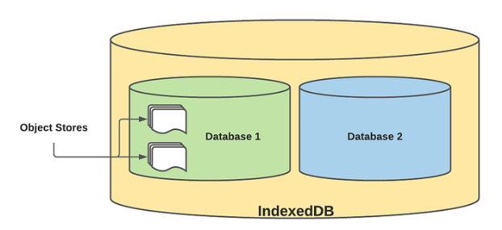

# 브라우저의 저장소

- Cookie

  - 너무 작은 사이즈

- Sessionstorage

  - 브라우저 종료 시 데이터 소멸

- Localstorage

  - 최대5MB, 실질적으로 2.5MB 저장 가능

- WebSQL

  - 2010년 W3C에 의해 폐기됨

  - 표준부재, 보안 문제

- IndexedDB

  - W3C 표준

  - 용량

    - 크롬 : 사용자 디스크 용량의 60%

    - 엣지 : 사용자 디스크 용량의 60%

    - 파이어폭스 : 빈 디스크 용량의 50%

    - 사파리 : 기본 1GB, 용량을 다 사용했을 시 200mb를 더 늘릴 것인지팝업이 뜸

  - 저장 가능 용량 확인 ([StorageManager API](https://caniuse.com/mdn-api_storagemanager) 사용)

```javascript
if (navigator.storage && navigator.storage.estimate) {
  const quota = await navigator.storage.estimate()

  // quota.usage -> Number of bytes used.
  // quota.quota -> Maximum number of bytes available.

  const percentageUsed = (quota.usage / quota.quota) * 100

  console.log(`You've used ${percentageUsed}% of the available storage.`)

  const remaining = quota.quota - quota.usage

  console.log(`You can write up to ${remaining} more bytes.`)
}
```

# 특징

- 많은 양의 구조화된 데이터를 클라이언트에 저장할 수 있다.

- Javascript 기반의 객체지향 데이터베이스이다. 즉, Javascript가 인식할수 있는 자료형과 객체를 저장할 수 있다. File/Blob 포함

- 트랜잭션을 사용하며 Key-Value 데이터베이스이다.

- IndexedDB는 비동기 API이다.

- 온라인/오프라인 환경 모두에서 쿼리 지원

- Index Table System 지향하며 , Index 설정으로 효율적인 데이터 검색 지원

- 하나 이상의 DB 와 테이블을 가질 수 있음

# 웹브라우저별 indexedDB 지원 현황

- <https://caniuse.com/?search=indexeddb>

- IE는 부분적 지원

- 그 외는 최신 버전을 쓰면 거의 됨

# 용어

- Database

  - Version/Name 을 가지며 하나 이상의 Object Store 로 구성되는저장소로서 , 브라우저는 하나 이상의 Database 를 가질 수 있습니다.

- Object Store

  - 실제 데이터를 담는 공간으로서, N개의 Key-Value 레코드를 영구적으로저장함 키(key)에 따라 오름차순으로 정렬됩니다. Object Store의 이름은고유해야 하며, 선택적으로 key generator와 key path를 가질 수 있는데, key path를 설정하면 in-line key (내부 key) 를 사용해야 하고 아닐경우 out-of-line key (외부 key) 를 사용해야 합니다.

  - 

- Transaction

  - 특정 Database 에 대한 data-access 와 data-modification 등 Data 상호작용을 의미하며, 모든 Data의 Read/Write는 Transaction 내에서일어나야 합니다. Transaction은 세가지 모드 readwrite, readonly, versionchange를 가지며, Object Store와 Indexes 생성은 versionchange transaction 내에서 가능합니다.

- Key Path

  - Object Store 또는 Index에서 브라우저가 어디로부터 key를 추출해야하는지 정의합니다.

- Index

  - 하나의 Index는 다른 Object Stored의 레코드를 찾기 위한 specialized object store로, referenced object store 라 불립니다. Object Store에 Index와 관련된 레코드가 업데이트 되면 자동으로 업데이트 됩니다.

  - API : <https://developer.mozilla.org/en-US/docs/Web/API/IDBObjectStore/createIndex>

    - createIndex(indexName, keyPath)

    - createIndex(indexName, keyPath, options)

    - keyPath에는 Array를 입력하여 multi 필드 index를 만들 수 있다.

  - 예제

```javascript
DBOpenRequest.onupgradeneeded = (event) => {
  const db = event.target.result

  db.onerror = (event) => {
    note.innerHTML += '<li>Error loading database.</li>'
  }

  // Create an objectStore for this database
  const objectStore = db.createObjectStore('toDoList', {
    keyPath: 'taskTitle',
  })

  // define what data items the objectStore will contain
  objectStore.createIndex('hours', 'hours', { unique: false })
  objectStore.createIndex('minutes', 'minutes', { unique: false })
  objectStore.createIndex('day', 'day', { unique: false })
  objectStore.createIndex('month', 'month', { unique: false })
  objectStore.createIndex('year', 'year', { unique: false })
  objectStore.createIndex('notified', 'notified', { unique: false })
}
```

-

<!-- -->

- Request

  - Database에 읽고 쓰기를 행하는 Operation을 의미하며, 모든 Request는하나의 읽기 또는 쓰기 Operation을 나타냅니다.

- Cursor

  - 특정 key range의 여러 레코드들에 대한 iterating을 위한매커니즘으로서, 여러 레코드들에 대한 순회/반복 기능을 제공합니다

# 검색

- indexedDB는 SQL query와 같은 기본 검색 기능이 없다.

- Cursor를 이용하여 직접 구현해야 한다.

- Index 생성

  - ObjectStore (table)생성하면서 index 생성하기

```javascript
const objectStore = db.createObjectStore('todo', {
  autoIncrement: true,
  keyPath: 'id',
})

objectStore.createIndex('color', 'color', { unique: false })
```

- 추후에 index 추가하기 (onupgradeneeded 함수 이용)

```javascript
request.onupgradeneeded = (e) => {
  const db = e.target.result

  if (e.oldVersion < 1) {
    // DB 생성
    const objectStore = db.createObjectStore('todo', {
      autoIncrement: true,
      keyPath: 'id',
    })

    objectStore.createIndex('color', 'color', { unique: false })
  } else {
    if (e.oldVersion < 2) {
      const transaction = e.target.transaction
      const objectStore = transaction.objectStore('todo')

      objectStore.createIndex('title', 'title', { unique: false })
    }
  }
}
```

-

- Index를 이용한 검색 예제

  - Title 순으로 목록 모두 가져오기

```javascript
const cursorRequest = objectStore.index('title').openCursor()

cursorRequest.onsuccess = (e) => {
  const cursor = e.target.result

  if (cursor) {
    console.log(cursor.value)
    cursor.continue()
  }
}
```

- Color index를 이용해서 red color인 값만 빠르게 찾기

```javascript
const range = IDBKeyRange.only('red')

const cursorRequest = objectStore.index('color').openCursor(range)

cursorRequest.onsuccess = (e) => {
  const cursor = e.target.result

  if (cursor) {
    console.log(cursor.value)
    cursor.continue()
  }
}
```

-

<!-- -->

- IDBKeyRange란

  - Index를 이용하여 검색할 때 범위를 지정하는 방법

  - 숫자, 문자열 모두 비교 된다.

  | **Range**                   | **Code**                             |
  | --------------------------- | ------------------------------------ |
  | All keys ≥ **x**            | IDBKeyRange.lowerBound(x)            |
  | All keys > **x**            | IDBKeyRange.lowerBound(x, true)      |
  | All keys ≤ **y**            | IDBKeyRange.upperBound(y)            |
  | All keys < **y**            | IDBKeyRange.upperBound(y, true)      |
  | All keys ≥ **x** && ≤ **y** | IDBKeyRange.bound(x, y)              |
  | All keys > **x** && < **y** | IDBKeyRange.bound(x, y, true, true)  |
  | All keys > **x** && ≤ **y** | IDBKeyRange.bound(x, y, true, false) |
  | All keys ≥ **x** && < **y** | IDBKeyRange.bound(x, y, false, true) |
  | The key = **z**             | IDBKeyRange.only(z)                  |

- Multi field index에서 IDBKeyRange를 이용하는 방법

  - <https://gist.github.com/inexorabletash/704e9688f99ac12dd336>

- Index는 기본적으로 ascending임

  - 만약에 descending으로 출력하고 싶다면 'prev'를 이용한다.

```
   const cursorRequest = objectStore.index(\'color\').openCursor(null, \'prev\')
```

#

# 구현 방법

- Javascript

  - Database 열기

    - window.indexedDB.open(db_name, version)

    - version을 사용하는 이유 : 추구 db의 스키마가 바뀌는 경우 upgrade 작업을 해주기 위해서

  - Database 열기 예제

```javascript
// 1. indexedDB 객체 가져오기
const idxedDB = window.indexedDB

// 2. 브라우저에서 지원하는지 체크하기
if (!idxedDB) window.alert('해당 브라우저에서는 indexedDB를 지원하지 않습니다.')
else {
  let db

  const request = idxedDB.open('SampleDB') // 3. SampleDB(db) 열기

  request.onerror = (e) => alert('failed')
  request.onsuccess = (e) => (db = request.result)
}
```

- Object store 생성하기

```javascript

  IDBRequest.createObjectStore(\'store_name\', {keyPath: \'id\'})

```

- ObjectStore는 데이터를 담는 공간이다.

- 여러 개의 레코드(key-value)를 가진다.

- ObjectStore의 이름은 고유해야 한다.

- 각 객체에 유일성을 부여하기 위해 keyPath를 정의해야 한다.

- createObjectStore를 사용해 특정 DB에 ObjectStore를 추가할 수 있다.

- 단, createObjectStore는 onupgradeneeded 이벤트와 함께 써야 한다.

<!-- -->

- onupgradeneeded 이벤트

  - 새로운 데이터 베이스 만들 때

  - 기존 데이터베이스의 버전을 높일 때(db를 열었는데(open), 이전보다높은 버전을 지정하는 경우)

    - DB를 ugrade 할 수 있다. (예, index 추가)

```javascript
// 1. indexedDB 객체 가져오기
const idxedDB = window.indexedDB

// 2. 브라우저에서 지원하는지 체크하기
if (!idxedDB) window.alert('해당 브라우저에서는 indexedDB를 지원하지 않습니다.')
else {
  let db

  const request = idxedDB.open('SampleDB') // 3. SampleDB(db) 열기

  request.onupgradeneeded = (e) => {
    db = e.target.result

    db.createObjectStore('name', { keyPath: 'id' }) // 4. name저장소 만들고, key는 id로 지정

    request.onerror = (e) => alert('failed')
    request.onsuccess = (e) => (db = request.result) // 5. 성공시 db에 result를 저장
  }
}
```

- transaction() 사용하기

  - 우리는 transaction()을 사용해 특정 객체 저장소에 접근할 수 있다.

  - 모드가 지정되지 않는다면 기본적으로 트랜잭션은 readonly 모드로열린다.

  - 해당 메소드는 객체 저장소에 접근할 수 있는 트랜잭션 객체를 반환한다.

  - IDBDatabase.transaction(store_names, mode, options);

  - 예시

+------------------------------------------------------+ | // 객체저장소 여러개에 접근할 경우 | | | | IDBDatabase.transaction(\[\'store1\', \'store2\'\]); | | | | // 객체저장소 하나에 접근할 경우 | | | | IDBDatabase.transaction(\'store1\'); | +======================================================+

- 예제: add()함수 이용해서 추가하기

+------------------------------------------------------+ | function writeIdxedDB(names) { | | | | const request = window.indexedDB.open(\'SampleDB\'); | | | | request.onerror =(e)=\> { | | | | alert(\'DataBase error\', e.target.errorCode); | | | | } | | | | request.onsuccess =(e)=\> { | | | | const db = request.result; | | | | const transaction = db.transaction(\[\'name\'\], | | \'readwrite\'); | | | | //person 객체 저장소에 읽기&쓰기 권한으로 | | transaction 생성 | | | | // 완료, 실패 이벤트 처리 | | | | transaction.oncomplete =(e)=\> { | | | | console.log(\'success\'); | | | | } | | | | transaction.onerror =(e)=\> { | | | | console.log(\'fail\'); | | | | } | | | | // transaction으로 | | | | const objStore = transaction.objectStore(\'name\'); | | | | for (const name of names) { | | | | const request = objStore.add(name); // 저장 | | | | request.onsuccess =(e)=\> | | console.log(e.target.result); | | | | } | | | | } | | | | } | | | | const names = \[{id: 1, name: \'a\'}, {id: 2, name: | | \'b\'}, {id: 3, name: \'c\'}\]; | | | | writeIdxedDB(names); | +======================================================+

- 데이터 조회하기: get()함수 이용

+-----------------------------------------------------------+ | function getIdxedDBValue(key) { | | | | const request = window.indexedDB.open(\'SampleDB\'); | | // 1. DB 열기 | | | | request.onerror =(e)=\> console.log(e.target.errorCode); | | | | request.onsuccess =(e)=\> { | | | | const db = request.result; | | | | const transaction = db.transaction(\'name\'); | | | | transaction.onerror =(e)=\> console.log(\'fail\'); | | | | transaction.oncomplete =(e)=\> console.log(\'success\'); | | | | const objStore = transaction.objectStore(\'name\'); | | | | const objStoreRequest = objStore.get(key); // 2. get으로 | | 데이터 접근 | | | | objStoreRequest.onsuccess =(e)=\> { | | | | console.log(objStoreRequest.result) | | | | } | | | | } | | | | } | | | | getIdxedDBValue(1); // { id:1, name:\"a\" } | +===========================================================+

- 전체 데이터 조회하기 (cursor사용)

+-----------------------------------------------------------+ | function getIdxedDBValues() { | | | | const request = window.indexedDB.open(\'SampleDB\'); | | // 1. DB 열기 | | | | request.onerror =(e)=\> console.log(e.target.errorCode); | | | | request.onsuccess =(e)=\> { | | | | const db = request.result; | | | | const transaction = db.transaction(\'name\'); | | | | transaction.onerror =(e)=\> console.log(\'fail\'); | | | | transaction.oncomplete =(e)=\> console.log(\'success\'); | | | | const objStore = transaction.objectStore(\'name\'); // 2. | | name 저장소 접근 | | | | const cursorRequest = objStore.openCursor(); | | | | cursorRequest.onsuccess =(e)=\> { | | | | let cursor = e.target.result; | | | | if (cursor) { | | | | const value = objStore.get(cursor.key); // 3. 커서를 | | 사용해 데이터 접근 | | | | value.onsuccess =(e)=\> { | | | | console.log(e.target.result); | | | | } | | | | cursor.continue();// 4. cursor로 순회 | | | | } | | | | } | | | | } | | | | } | | | | getIdxedDBValues(); // { id:1, name:\"a\" }, {id: 2, | | name: \'b\'}, {id: 3, name: \'c\'} | +===========================================================+

- 데이터 수정하기: put() 사용

+-----------------------------------------------------------+ | function updateIdxedDBValue(key, value) { | | | | const request = window.indexedDB.open(\'SampleDB\'); | | // 1. db 열기 | | | | request.onerror =(e)=\> console.log(e.target.errorCode); | | | | request.onsuccess =(e)=\> { | | | | const db = request.result; | | | | const transaction = db.transaction(\'name\', | | \'readwrite\'); | | | | transaction.onerror =(e)=\> console.log(\'fail\'); | | | | transaction.oncomplete =(e)=\> console.log(\'success\'); | | | | const objStore = transaction.objectStore(\'name\');// 2. | | name 저장소 접근 | | | | const objStoreRequest = objStore.get(key); // 3. | | key값으로 데이터 접근 | | | | objStoreRequest.onsuccess =(e)=\> { | | | | const updateRequest = objStore.put(value); // 4. 수정 | | | | updateRequest.onerror =(e)=\> console.log(\'udpate | | error\'); | | | | updateRequest.onsuccess =(e)=\> console.log(\'success\'); | | | | } | | | | } | | | | } | | | | updateIdxedDBValue(1, {id: 1, name: \'vvvv\'}); | | | | updateIdxedDBValue(2, {id: 2, name: \'bbbbb\'}); | +===========================================================+

- 특정 키의 데이터 삭제하기: delete()사용

+-----------------------------------------------------------+ | function deleteIdxedDBValue(key) { | | | | const request = window.indexedDB.open(\'SampleDB\'); | | // 1. db 열기 | | | | request.onerror =(e)=\> console.log(e.target.errorCode); | | | | request.onsuccess =(e)=\> { | | | | const db = request.result; | | | | const transaction = db.transaction(\'name\', | | \'readwrite\'); | | | | transaction.onerror =(e)=\> console.log(\'fail\'); | | | | transaction.oncomplete =(e)=\> console.log(\'success\'); | | | | const objStore = transaction.objectStore(\'name\'); // 2. | | name 저장소 접근 | | | | const objStoreRequest = objStore.delete(key); // 3. | | 삭제하기 | | | | objStoreRequest.onsuccess =(e)=\> { | | | | console.log(\'deleted\'); | | | | } | | | | } | | | | } | | | | deleteIdxedDBValue(1); | +===========================================================+

- 특정 저장소 데이터 모두 삭제하기 : clear() 사용

+-----------------------------------------------------------+ | function clearIdxedDBValue() { | | | | const request = window.indexedDB.open(\'SampleDB\'); | | // 1. db 열기 | | | | request.onerror =(e)=\> console.log(e.target.errorCode); | | | | request.onsuccess =(e)=\> { | | | | const db = request.result; | | | | const transaction = db.transaction(\'name\', | | \'readwrite\'); | | | | transaction.onerror =(e)=\> console.log(\'fail\'); | | | | transaction.oncomplete =(e)=\> console.log(\'success\'); | | | | const objStore = transaction.objectStore(\'name\'); // 2. | | name 저장소 접근 | | | | const objStoreRequest = objStore.clear(); // 3. 전체 삭제 | | | | objStoreRequest.onsuccess =(e)=\> { | | | | console.log(\'cleared\'); | | | | } | | | | } | | | | } | | | | clearIdxedDBValue(); | +===========================================================+

-

<!-- -->

-

-

- React

  - react-indexed-db

    - <https://www.npmjs.com/package/react-indexed-db>

    - <https://velog.io/@bwj0509/indexedDB-%EC%82%AC%EC%9A%A9%ED%95%98%EA%B8%B0-with-react-indexed-db>

  - idb

    - 아래 참조

    - idb wrapper

      - <https://all-dev-kang.tistory.com/entry/%EC%9E%90%EB%B0%94%EC%8A%A4%ED%81%AC%EB%A6%BD%ED%8A%B8-IndexedDB-%EC%8B%A4%EC%A0%84-%EC%82%AC%EC%9A%A9%EB%B2%95-idb>

    - Sample

      - <https://codesandbox.io/s/react-idb-hooks-17n8t>

      -

- Vuejs

  - Lib 없이 직접 구현

    - Demo: <http://yjs-prototype.esclouddev.com/>

  - idb

    - <https://www.npmjs.com/package/idb>

    - <https://www.raymondcamden.com/2019/10/16/using-indexeddb-with-vuejs>

    - <https://devpress.csdn.net/vue/62f0d6567e6682346618357a.html>

    -

  - Sample

    - <https://codepen.io/azmiadhani/pen/WWBeyZ>

# 적용 전략

- 환경 1. 개인 전용 데이터 (예, Email)

  - IndexedDB에 저장할 데이터는?

    - 1안. Offline 상태일 때만 저장

      - 추가, 수정 시 offline 일 때만 저장했다가 다시 online 상태가 되면서버로 전송

      - 작성하는 내용만 소실 되지 않고, 서비스를 더이상 이용할 수 없다.

    - 2안. Online 상태일 때도 저장

      - 서버에서 가져온 데이터를 indexedDB에 저장(sync)해 놨다가, offline이 되면 활용

      - List, get, add, edit, delete 모두 처리 가능

      - 다시 online이 되면 add, edit, delete 내용 서버에 적용

      - 서버와 데이터는 연동되지 않지만 거의 모든 기능을 이용할 수 있다.

  - Conflict 이슈가 거의 없다.

- 환경 2. 단체 공유 데이터 (예, 게시판)

  - 환경 1과 동일

  - Offline 상태가 길어지면 conflict 이슈가 커짐

- 환경 3. 단체 동시 편집 데이터 (예, Google docs, white board)

  - y-indexeddb 이용. 구현이 간단하다.

  - Offline 상태에서도 데이터를 수정할 수 있고, 다시 Online 상태가 되면자동으로 Merge가 된다. 다른 사람이 수정한 내용도 반영된다.
