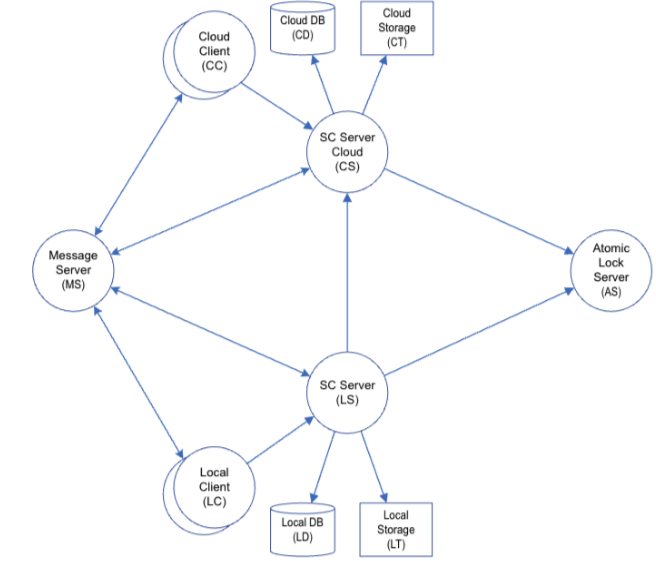

# SC Server와 SC Server Cloud간의 Data sync

- 용어

  - Local client

  - Cloud client

  - SC Server -- local server

  - SC Server Cloud -- cloud server

  - Message server

  - Lock server

- Top level architecture

- 

- -

- 제약 사항

  - SC Server와 SC Server Cloud는 1:1이다.

    - SC Server Cloud는 여러 SC Server와 연결되지만, SC Server 입장에서는 1:1이다.

    - 엄밀히 말하면 N:1이다.

  - Server와 Client는 1:N 관계이다.

  - SC Server는 단일서버이다.

  - SC Server Cloud는 Multi server이다.

    - 분할 단위도 결정사항이다.

    - 고가용성, 법적 사유로 인한 Region 분할 등등\...

    -

- Question

  - E2, E3에서 영상 데이터를 조회하고 수정할 때, View 모드, Edit 모드가구분이 되는가? View, Edit모드는 구분 없이 동일한가?

    - 현재 그러한 모드 구분이 없다.

    - 저장 시점은 매 편집 단위마다 일어나지는 않는다. 특정한 액션을 수행할 때 저장된다.

      - 버전 관리에 대한 스펙도 정의가 필요하다.

    - View/Edit 모드 구분이 필요하다. (하는 것을 전제로 이후 검토를 진행해도 된다)

- Sync 대상 데이터 (동시 편집 불가 대상)

  - 이미지 파일 (2D, 3D)

    - 그래도 버전 관리 대상으로 삼을 수도 있겠다. 개발시 고려사항

  - 메타데이터 (tag, project file)

  - 이미지 속성

    - 담당의사

  - 캡쳐 이미지

  - 의사 정보

  - 환자 정보

  - 사용자 계정

  - 리포트(E2, E3)

    - 리포트 Template

  - 설정

  - DB 데이터

  - TBD

- Sync 데이터 범위

  - 모든 데이터?

  - 선택적

    - 종류별? (Modality, ...)

    - 기간별?

    - 사용자 선택?

  - 오래된 데이터 처리

    - 무삭제

    - 삭제

    - 백업

      - 복구 기능 제공 필요

    - 옵션 처리한다.

  - Local DB에는 Sync된 항목은 Synced 필드가 필요하다.

    - Cloud DB에도 Synced 필드가 필요한가?

    - Local이 원본이어야 할 가능성이 높다.

    - Cloud DB에서는 DB record를 지우는 것이 아니라, "deleted"로기록되어야 할 것이다. (deleted/backuped 등의 상태가 있을 수 있다)

    - Last synced time 필드가 필요할 수도 있다.

- Sync 개별 해제 가능? 불가능? - 가능해야 한다.

  - Local에서 해제?

    - Cloud 삭제

  - Cloud에서 해제?

    - Cloud 삭제

- 서버 운영 시나리오

  - SC Server만 운영하다가 Cloud를 연결한 경우

    - 모든 데이터 sync?

      - 오래 축적된 대규모 데이터를 싱크할 경우를 고려해야 하는가?

      - 전부 싱크하고 있지는 않다가 필요한 경우에 Messaging을 통해서 Cloud로 동기화되는 방식 등.

    - 최신 데이터 sync?

    - Sync 순서

      - 최신 순?

  - SC Server와 Cloud를 동시에 open한 경우

    - SC Server에서 추가되는 순서 대로 규칙에 따라서 Sync

    - Cloud Server에서 추가되는 순서 대로 규칙에 따라서 Sync

- Sync 방법 (File Upload 방법)

  - SC Server -\> Cloud

    - 1안 : Upload to S3 1안으로 결정.

    - 2안 : Upload to Cloud server -\> S3

  - Cloud -\> SC Server

    - 1안 : Download from S3 1안으로결정.

    - 2안: Download from Cloud server \<- S3

  - S3를 직접 Access 하면 보안 문제는?

    - TBD

  - EC2에서 S3 read, write 속도? 비용?

  - 현재 Ezshare는 Signed URL 통해서 직접 업로드한다.

    - CloudFront에서 토큰 검사를 통해 보안을 유지한다.

  - 가공을 해야할 경우에는 Cloud Server를 통해야 할 수도 있겠다.

- Sync는 기본적으로 양방향

  - SC server에 추가, 수정, 삭제한 것은 Cloud로 자동 Sync (설정에따라서)

    - SC server에서 수정 중에 있으면 Cloud에 Editing by local으로 표시됨

  - Cloud에서 추가 한 것은 SC Server로 자동 download

  - Cloud에서 수정한 것은

    - SC Server로 자동 download

      - Conflict 해결 필요 (TBD)

        - Edit/View 상태 관리, Lock 상태 관리를 잘 해야 한다.

    - 사용자에게 수정이 있음을 알리고 download 받을 것인지 Ask

      - 사용자가 사용하지 않으면 오래 누적이 되어서 현실적이지 않을 수 있음.

  - Cloud에서 수정 중에 있으면 SC server에서 Editing by cloud으로 표시됨

- 동시 편집 지원 안함

  - 현재 편집 중인 client는 하나 뿐임을 보장하는 방법

  - Local client, Cloud client 모두 포함하여 하나만 편집이 가능해야한다.

  - Lock 기능 필요.

- Conflict를 막기 위해서는 Atomic lock 기능이 필요하다.

  - Local과 cloud를 아우르는 Atomic lock 기능은?

    - Lock server?

    - DB를 이용하는 방법

    - Mutex

    - TBD

  - Lock하고 unlock을 안하면?

    - Unlock 보장은?

    - TTL?

  - Lock 시 데이터의 현재 버전을 기록해야 하는가?

    - 1.0일 때 lock을 하고 수정했는데, 저장하려고 보니 2.0으로 바뀌어있다면?

  - Lock 후에 수정하려고 했다가 수정된 사항이 없다면?

    - 1안. 버전 변경 없다. 1안으로 결정.

    - 2안. 무조건 버전을 올린다.

      - 부작용: View, Edit 모드 구분이 없다면 버전이 끝없이 올라갈 수있다.

  - Lock 서버에 접속이 안되면?

    - 1안. 수정 금지

    - 2안. 무조건 수정 가능

    - 3안. 사용자 선택? 3안으로 결정.

      - Conflict 감수. (사용자에게 안내)

- SC Server와 cloud 간의 sync 알림, Notification 방법

  - 1안. Client가 직접 Message Server로 알림을 보낼 것인가?

    - 번거로움

  - 2안. Server를 통해서 알림을 보낼 것인가?

    - Client가 Server로 Editing 권한 획득하는 요청

    - Lock 서버에 Lock 요청

    - 성공하면 Server에서 Editing으로 mode 변경

    - Server는 Message 서버로 Editing 정보를 전달하여 연결된 모든 Client에 Editing 알림

    - Client에서 Editing 수행

- Notification의 목적

  - 1\. Data sync

    - Cloud Server의 데이터가 변경되었으니 Download해야 한다.

    - Local Server의 데이터 변화는 Noti 없이 Cloud로 Upload하면 된다.

  - 2\. 수정 중, 수정 됨을 Client에게 알려주는 목적

    - Cloud 또는 Local Client에서 현재 수정 중이므로 다른 Cloud 또는 Local Client들에게 수정 중, 수정 됨 상태를 알려줌

      - 상태 표시

      - 동시 수정 방지

      - Cloud

        - 수정 후에는 자동으로 Sync 됨

      - Local

        - 수정 후에는 자동으로 Sync 또는 내려 받을까요? 물어봄

  - 3. 수정 완료된 Client에게 알려주는 목적?

    - 연속적으로 일어나는 수정에 대해서는 어떻게 다루어야 하는가?

    - "수정 중" "수정 완료" 상태가 따로 있을 것인가?

      - 기능 기획에 따라 달라질 수 있다.

      - 사용자가 열고 방치하고 있을 경우에는?

        - 일정 시간 이후 영상을 자동으로 닫아버리는 기능(안내 후 입력 없으면 Close) 같은 것도 고려해볼 수 있겠다.

          - 의료영상이므로 보호 차원의 기능을 추가필요할 수도 있다.

- Notification 기술

  - Target

    - Client

      - Web browser

      - Native app

    - Server

      - SC Server

      - SC Server Cloud

  - 솔루션

    - MQTT

    - **RabbitMQ**

      - 프랑스 Web PMS 연동을 위해 현재 EzServer v5.5 개발 진행중

    - TBD

- 데이터 모드 (나중에 다시 정리)

  - Adding -- 필요할까? 필요 없음

  - Viewing -- 필요할까? 필요 없음

  - Editing

  - Saved

  - 검토 필요(syncing)

    - Downloading

      - 다운로드 중에 Cloud 데이터를 바꾸면?

    - Uploading

      - 업로딩 중에 Local 데이터를 바꾸면?

    - Syncing 도중에는 데이터를 바꾸지 못하게 해야 하나?

- 데이터의 ID

  - Cloud와 Local의 data id는 동일?

  - Global 하게 Unique한 id를 발급 받는 방법은?

    - UUID -- 길다

    - SnowFlake(https://en.wikipedia.org/wiki/Snowflake_ID)

- 데이터 버전 관리

  - A.B:

    - 1.0,

    - 1.1

  - 한번 오픈 후에 여러 번 수정한 것은 B가 변한다.

  - 새로 오픈하면 A가 변한다.

  - Rollback 기능을 제공할 것인가?

    - 버전별 데이터를 모두 백업해두고 있어야 한다.

    - -\> 기획 확인 필요.

- 데이터의 수정

  - 원본 영상 파일은 수정하지 않는다.

    - 원본 데이터의 버전은 1.0이 유지된다.

    - 수정 가능성을 열어둔다.

  - Meta data만 수정한다.

- DB의 수정

  - DB에 저장되는 속성 수정 시?

    - 담당의사

    - TBD

  - Cloud에서 수정한 속성을 Local로 내려 받아야 하나?

  - 복수 Client의 편집을 컨트롤하는 방식(Lock 등)을 영상 메타데이터 외의 데이터에도 적용할 것인가?

    - 환자정보 등등

  - Cloud에서 편집이 일어나는 항목을 명확히 정의할 필요가 있다.

    - -\> 기획 확인 필요하나, 하지 않는 방향이 낫다. (개발이 매우 복잡해진다)
