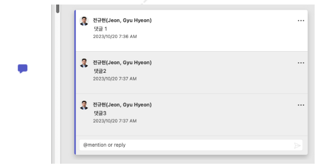

# Comment 동시 수정 prototype with YJS

- Spec

  - Git
    - <https://ewoosoft@dev.azure.com/ewoosoft/prototypes/_git/yjs_vue_prototype>
  - Demo
    - <http://yjs-prototype.esclouddev.com/>
  - Server (yjs Websocket server)
    - ws://y-websocket.esclouddev.com:1234
  - Framework
    - Vue.js 2.6
    - Vuetify 2.6
    - Vuex 3.1
  - 용어

    - Comment
      - 여러 댓글을 포함
    - 댓글
      - 한 사람이 남긴 글

  - 기능

    - Server
      - Y-websocket 서버를 구축한다.
      - ws protocol을 지원한다.
      - Data 서버를 연결한다. (Next)
        - DB or S3?
    - element 지원
      - 기존: Line, rectangle, ellipse
      - 신규: Element 추가,이동, 편집, 삭제
    - Comment 지원
      - Comment element 취급
        - Select, 이동 가능
      - Image 위에Comment 추가
      - Comment 추가/수정/삭제 시 Peer client에 동시 표시
        - 본인이 추가한 댓글만 수정/삭제할 수 있다.
        - 두번째 이상의 댓글만 삭제할 수 있다.
        - 첫번째 댓글을 삭제하면 Comment 전체가 삭제된다.
      - Comment 편집 시 Peer client에 동시 표시
        - 타이핑 중간에 공유하지 않고 타이핑이 끝나면 공유한다.
      - Comment 위치 변경 시 Peer client에 동시 표시
        - Comment 위치 Drag는 실시간 공유한다.
      - 하나의 Comment element에 여러 명이 여러 댓글 추가 기능
        - 댓글 하위에 댓글을 다는 Thread는 지원하지 않는다. (Word도지원하지 않음)
        - 각 댓글은 순서대로 추가되는 목록이다.
        - 각 댓글은 indent하지 않고 같은 level로 표시한다
      - Comment를 resolve할 수 있다
      - Comment 생성 후 생성자가 아무런 댓글을 남기지 않고, 다른 Action을 하면 Comment는 삭제한다.
      - Comment를 생성하면 다른 Client도 Comment가 생성되지만, 첫번째댓글은 오직 Comment를 생성한 Client에서만 확인할 수 있다. ClientID를 확인하여 처리한다.
    - Connect/Disconnect 기능 추가

      - 가상으로 Offline 재현 테스트 가능

    - Comment 속성
      - Properties
        - userId
        - clientId
        - time
      - Status:
        - open or resolved
      - Position
        - X
        - y
      - 댓글 목록
        - userId
        - clientId
        - comment
        - time
    - UI
      - MS Office (Word)의 UI를 참고한다.
      - Comment icon
        - 
      - Comment Pan
        - 
      - Comment Pan에는 하나의 Comment만 표시한다.
        - Comment를 선택하면 해당 Comment의 댓글을 표시한다.

- 이슈
  - Client 들이 Offline 상태에서 각각 Annotation을 추가해도 Online이되면 Merge 된다.
  - Offline 상태에서 두개의 Client가 하나의 Annotation을 각각 다르게수정하면 나중에 수정한 값으로 정해진다.
  - Offline 상태에서 두개의 Client 각각 Comment를 남길 경우 먼저 남긴 Comment는 사라질 수 있다.
  - YJS map의 key:value 쌍에서 key는 merge가 되지만, value는 merge되지않는다.

# React에 접목하기 위한 소스코드 설명

- y-websocket 접속 처리를 하는 모듈 (websocketModel.js)

```javascript
import Vue from 'vue'
import { WebsocketProvider } from 'y-websocket'
import * as Y from 'yjs'
import * as awarenessProtocol from 'y-protocols/awareness.js'

export default function websocketModel(id) {
  const ydoc = new Y.Doc()
  const awareness = new awarenessProtocol.Awareness(ydoc)
  const provider = new WebsocketProvider(`ws://y-websocket.esclouddev.com`, id, ydoc)

  provider.on('status', (event) => {
    console.log('provider:status', event.status) // logs "connected" or "disconnected"
  })

  return new Vue({
    data() {
      return {
        ydoc,
        provider,
        awareness,
        content: null,
      }
    },
  })
}
```

- 실제로 websocket에 접속하여 sync를 준비하는 모듈 (DrawWebSocketMap.vue)

```javascript
const id = 'DrawWebSocketMap-1'
const mapType = 'DrawWebSocketMap-2'
const model = websocketModel(id)
const ydoc = model.ydoc
const provider = model.provider
const awareness = model.awareness
const content = ydoc.getMap(mapType)
const contentMap = content.toJSON()

// ydoc의 map은 content에 저장된다.
// 우리가 사용할 수 있는 Object형태로는 contentMap에 저장한다.
```

- 첫번째 Client인지 검사하는 기능

```javascript
const id = 'DrawWebSocketMap-1'
const mapType = 'DrawWebSocketMap-2'

let syncYJS = false
let readFromServer = false
let loading = true

const model = websocketModel(id)
const ydoc = model.ydoc
const provider = model.provider
const awareness = model.awareness
const content = ydoc.getMap(mapType)
const contentMap = content.toJSON()

console.log('##contentMap', this.contentMap)

content.observe((event) => {
  this.syncYJS = true
  console.log('event', event, event.changes.delta)
  this.content = this.ydoc.getMap(mapType)
  this.contentMap = this.content.toJSON()
  console.log('DrawWebSocketMap Event ##contentMap', this.contentMap)
})

setTimeout(() => {
  console.log('##setTimeout', this.syncYJS)
  if (this.syncYJS == false) {
    // road data from data server
    this.readDataFromDataServer()
  } else {
    // 이미 다른 클라이언트로부터 데이터를 받음
  }
  this.loading = false
}, 1000)
```

- 편집 내용을 ydoc과 sync하는 방법

```javascript
const map = content // 위 참조

map.set(key, value)
map.delete(key)

// key는 unique 값, value는 object
```
