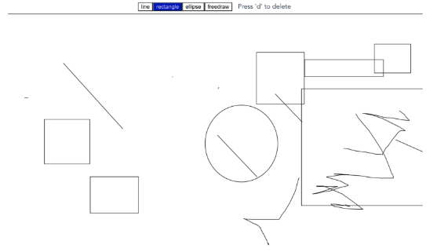
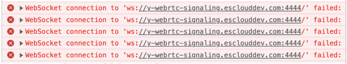
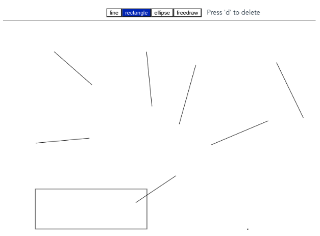
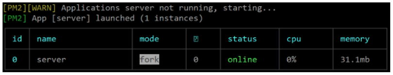
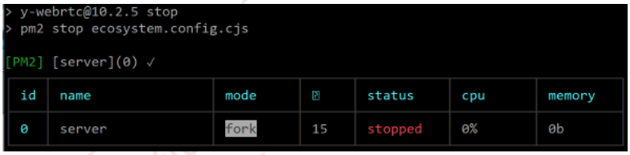
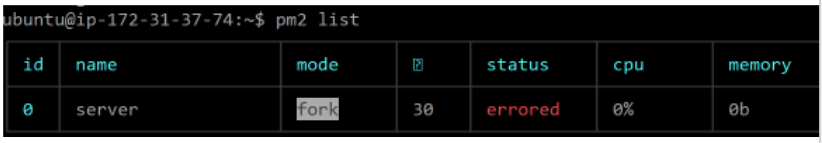
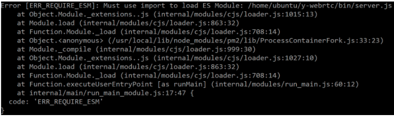

# YJS PoC

- Server

  - Y-WebSocket 서버 구축

    - ws구축

      - localhost에 서버 구축
        - 소스코드 download : <https://github.com/yjs/y-websocket.git>
        - \$ npm i y-websocket
        - \$ HOST=localhost PORT=1234 npx y-websocket
        - Client 소스코드 수정
          - WebsocketProvider(\`ws://localhost:1234\`, id, ydoc)
      - EC2에 서버 구축
        - EC2 instance 구축
          - Name: y-websocket server2
          - Images: Ubuntu
          - Type: t2.micro
          - URL: https://ec2-15-164-94-102.ap-northeast-2.compute.amazonaws.com
          - DNS: y-websocket.esclouddev.com
        - Node.js 설치
          - \$ sudo apt-get update
          - \$ sudo apt install nodejs
          - \$ sudo apt install npm
          - \$ node -v (버전 확인)
        - Y-websocket 내려받기
          - \$ git clone <https://github.com/yjs/y-websocket.git>
          - \$ cd y-websocket
          - \$ npm i y-websokcet
        - Y-websocket 실행하기
          - \$ HOST=y-websocket.esclouddev.com PORT=1234 npx y-websocket
      - S3에 Client 등록
        - Client 소스 수정
          - WebsocketProvider(\`ws://y-websocket.esclouddev.com:1234\`, id, ydoc)
        - URL: <http://yjs-prototype.esclouddev.com/>
      - Demo
        - 서로 다른 PC끼리 동시 편집 됨
        - 

    - wss구축
      - CloudFront 이용해서 wss 구현 가능할 것으로 예상함

  - Y-WebRTC signaling서버 구축

    - ws구축
      - EC2에 Signaling server 구축
        - Name: y-webrtc-signaling
        - Type: t2.micro
        - URL: <https://ec2-54-180-120-49.ap-northeast-2.compute.amazonaws.com/>
        - DNS: y-webrtc-signaling.esclouddev.com
      - Node.js 설치
        - \$ sudo apt-get update
        - \$ sudo apt install nodejs
        - \$ sudo apt install npm
        - \$ node -v (버전 확인)
      - Y-webrtc 내려받기
        - \$ git clone https://github.com/yjs/y-webrtc.git
        - \$ cd y-webrtc
        - \$ npm i y-webrtc
      - Y-webrtc 실행하기
        - \$ PORT=1234 nohup node ./bin/server.js &
      - S3에 Client 등록
        - Client 소스 수정
          - signaling: \[\'ws://y-webrtc-signaling.esclouddev.com:1234\'\]
          - signaling 서버는 여러개 를 추가할 수 있다.
        - URL: <http://yjs-prototype.esclouddev.com/>
      - 이슈
        - Signaling 서버에 접속이 안됨
        - 
        - Websocket client로 테스트 결과
          - ws://y-webrtc-signaling.esclouddev.com:1234/websocket 로접속이 안됨
        - EC2 보안 설정 문제 였음
          - Inbound Port open
          - Port는 4444 -\> 1234로 변경
      - Demo
        - 서로 다른 PC끼리 동시 편집 됨
        - 
    - wss구축

  - 서버 이슈
    - 프로세스 관리 필요
      - 프로세스가 종료되면 자동으로 재시작하도록 해야 한다.
      - PM2 사용
        - PM2 설치
          - \$ sudo npm install pm2 -g
        - ecosystem.config.cjs 생성
          - y-webrtc

```javascript
'use strict'

module.exports = {
  apps: [
    {
      name: 'server',
      script: './bin/server.js',
      watch: false,
    },
  ],
}
```

- y-websocket

```javascript
'use strict'

module.exports = {
  apps: [
    {
      name: 'server',
      script: './bin/server.js',
      watch: false,
      env: {
        HOST: 'y-websocket.esclouddev.com',
        PORT: 1234,
      },
    },
  ],
}
```

- package.json 수정

```json
{
  "scripts": {
    "start": "pm2 start ecosystem.config.cjs",
    "stop": "pm2 stop ecosystem.config.cjs",
    ...
  }
}
```

- \$ npm run start
- 
- \$ npm run stop
- 
- \$ npm run start
- 
- Y-webrtc는 PM2로 실행하면 아래 에러 발생함
  - y-websocket은 정상 동작
- 
- 
- \$ node -v
  - V12.22.9
- \$ npm cache verify
  - Cache verified and compressed (\~/.npm/\_cacache)
  - Content verified: 357 (23383328 bytes)
  - Index entries: 357
  - Finished in 2.232s
- \$ npm cache clean \--force
  - npm WARN using \--force Recommended protections disabled.
- Nvm 설치
  - \$ curl -o- https://raw.githubusercontent.com/nvm-sh/nvm/v0.35.3/install.sh \| bash
  - \$ source \~/.bashrc
- Node 최신 버전 설치
  - \$ nvm install node
  - \$ node -v
    - v21.0.0
- npm 최신 버전 설치
  - \$ npm -v
    - 8.5.1
  - \$ npm install -g npm@latest
  - \$ npm -v
    - 10.2.1
- 여전히 ERR_REQUIRE_ESM 에러 발생함 (y-webrtc만)
- Y-WebRTC signaling서버와 Y-WebSocket 서버 종료 시 시나리오
  - 서버는 종료 시 Doc 정보가 사라진다.

| **구분** | **Y-WebRTC signaling** | **Y-WebSocket** |
| :-: | :-: | :-: |
| 이미 Peer끼리 연결된 Client가 있을 때 | 동시 편집이 계속 된다. | 동시 편집이 안된다. |
| 새로 접속하는 Client | 동시 편집이 안된다. | 동시 편집이 안된다. |
| 서버를 재시작할 경우 | Client들이 Offline 상태에서 수정한 내용이 Online이 되면 모두 Merge된다. | Client들이 Offline 상태에서 수정한 내용이 Online이 되면 모두 Merge된다. |
| Offline 상태에서 Conflict 발생시 | Online 상태가 되면, 마지막에 수정하는 것으로 결정된다. | Online 상태가 되면, 마지막에 수정하는 것으로 결정된다. |

- Client

  - Info

    - YJS를 이용해서 동시 편집하려면 모든 데이터를 등록 해야 한다.
      - 따라서 첫번째로 파일을 Open하는 Peer만 YJS에 데이터를 등록하고, 두번째로 Open하는 Peer는 YJS에서 데이터를 가져오기만 해야 한다.
      - TBD -- 첫번째 Peer인지 어떻게 알 것인가?
        - <https://discuss.yjs.dev/t/webrtc-get-value-from-db-for-first-peer-only/103>
      - DB를 이용하면?
        - y-indexeddb
        - y-leveldb
        - y-redis

  - Prototype 1

    - URL: <https://dev.azure.com/ewoosoft/prototypes/_git/yjs_vue_prototype>
    - 목적: 간단한 yjs 동작 확인
    - Local webSocket
    - Y.Array 사용
    - Vue.js
    - Simple Todo

  - Prototype 2

    - URL: <https://dev.azure.com/ewoosoft/prototypes/_git/yjs_vue_prototype>
    - 목적: webRTC 적용
    - Local webRTC
    - Y.Array 사용
    - Vue.js
    - Todo 추가,수정,삭제,색깔 적용

  - Prototype 3

    - URL: <https://dev.azure.com/ewoosoft/prototypes/_git/yjs_vue_prototype>
    - 목적: 수정 기능 추가
    - Y.Array를 이용해서 수정 기능을 구현할 경우
    - Y.Array는 항목을 삭제 후 삽입해야 한다.
    - Index를 기준으로 수정을 시도할 경우 다른 peer에서 index 위의 todo를 삭제할 경우 수정 항목이 아래로 한칸 밀린다.
    - Y.Map을 사용하거나, Y.Array를 사용하더라도 [flakeid](https://www.npmjs.com/package/flakeid)를 이용해서 todo마다 고유의 id를 가지도록 하면 밀리지 않고 정확하게 원하는항목을 수정할 수 있다.
    - Y.Array는 삭제 수정 없이 계속 누적되는 데이터 용으로 적합함
    - Y.Map을 사용할 경우 key 부분에 flakeid를 적용하면 될 것으로예상한다.

  - Prototype 4

    - URL: <https://dev.azure.com/ewoosoft/prototypes/_git/yjs_vue_prototype>
    - 목적: Drawing App에 yjs 접목 (SVG 사용)
    - Line 그리기 기능
    - Rectangle 그리기 기능
    - Ellipse 그리기 기능
    - Element 삭제하기
    - Element Picking, 이동, 크기 수정
    - 그리는 과정이 실시간으로 공유되는 방식 적용
      - 네크워크 사용량 많음
      - 그리거나 수정 시 수정 내용은 공유를 하지 않다가 완료 후 공유하는방식도 가능함 -- 이 경우network 사용량이 작음

    - 이슈
    - 
      - TBD (추후 정리 예정)

  - Prototype 5

    - URL: TBD
    - 목적: WebRTC 서버와 연결

  - Prototype 6

    - URL: TBD
    - 목적: WebSocket 서버와 연결
