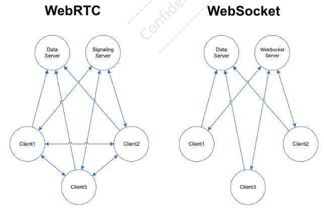

# YJS Study

- Architecture



- 시나리오

  - Y.Doc() 생성 - ydoc
  - Provider 생성 -- RTC or Websocket - provider
    - RTC -- signaling server 필요
    - Websocket -- websocket server 필요
  - get Shared Type from ydoc - type
  - get 외부의 수정 내용 -- type.observe()를 통해서 감시
  - share 나의 수정 내용 -- type.applyDelta()를 통해서 공유
  - 수정 내용 외의 상태 공유 -- awareness = provider.awareness

    - 커서 위치
    - Selection
    - Camera angle?
    - Zoom in/out?
    - Etc.
    - get 외부 상태 -- awareness.on('change', (added, removed, updated) => {...})
    - share 나의 상태 -- awareness.setLocalStateField()

  - 종료 시

    - ydoc.destroy() 호출
    - 비정상 종료 시 서버(signaling server, websocket server)와 연결이끊겨서 서버 측에서 자동으로 종료된다.

  - ~~TBD - Data Server(SC Server, SC Server Cloud)에는 언제 저장할것인가?~~
    - ~~편집 중간 중간 저장할 것인가? 마지막에 저장할 것인가?~~
    - ~~마지막을 알 수 없다.~~
    - ~~편집 시 계속 저장할 경우, Network 사용량 증가?~~
    - ~~누가 저장할 것인가?~~
    - ~~자신이 편집을 했을 때만 저장, 이전에 다른 Peer가 수정한 것을포함~~
  - ~~TBD - Client1이 편집을 먼저 시작하고 Client2가 나중에 편집을시작하면?~~

    - ~~Client1이 v1.0을 열어서 편집을 시작~~
    - ~~Client1이 v1.1을 저장~~
    - ~~Client2가 v1.1을 Open하여 편집을 시작~~
    - ~~v1.0\~v1.1 수정 내용을 Sync하면 중복됨~~
    - ~~Client2이 v1.2로 수정하고 저장~~
    - ~~Client3은 v1.2를 Open하여 편집을 시작~~
    - ~~v1.0\~v1.2 수정 내용을 Sync하면 중복됨~~

  - Data Server에서 읽어오는 방법 관련

    - 해당 데이터를 최초로 Open하는 Client가 Data Server에서 읽어온다.
    - 최초를 알아내는 방법
      - YJS에서 아무런 데이터를 가져오지 않을 경우가 최초이다.
    - Annotation(Comment 포함)이 하나도 없는 데이터(영상)도 최소한의데이터를 포함하고 있어야 한다.
      - 예)
        - \_ : { id, time}
        - Key1 : annotation1
        - Key2 : annotation2
        - ...
    - 2번째 부터는 YJS를 통해서 데이터를 가져오면 된다.
    - 2개의 클라이언트가 거의 동시에 접속해서 둘다 Data Server에서읽어오면
    - 같은 데이터를 읽어 오기 때문에 문제는 없다.
    - 데이터는 key:value 형태가 되어야 하며 key는 unique해야 한다.
    - Key:value가 yjs에서 map 형태로 저장된다.
    - 모든 Client는 close전에 Data를 서버에 저장해야 한다.
    - 마지막 client라는 것을 알기 어렵다.uniq
    - 모든 Client가 close되어도 YJS 서버는 상당 기간(?) 데이터를 가지고있는 것 같다.
    - 모든 client가 connection을 해제하고 한참 후에 다시 접속해도 이전데이터가 복구된다.

  - TBD
  - SC Server와 SC Server Cloud로 두개의 서버를 Sync해야 하는 상황에서동시 편집에 대한 이슈
    - 기획의 방향성 결정이 필요하다.
    - 동시 편집은 어려우므로 Lock을 해야 할 수 있다.
  - Local Client, Cloud Client간의 동시 편집이 가능해야 하는가?
    - 기능의 차이도 있어서 어렵지 않을까?
    - Sync의 시간 차이도 있어서 어렵지 않을까?
    - Local Client끼리, Cloud Client끼리?

- Y.Doc

  - const ydoc = new Y.Doc()
  - ydoc.destroy()

- Shared Type
  - TBD - 어떤 shared type을 써야 하는지는 prototype이 필요함
  - 하나의 App에서 여러 Type을 같이 쓸 때가 있다.
    - Data는 Array, Cursor는 Map
    - Data는 Map, 채팅은 Array
    - Data는 Text, Cursor/Selection은 Awareness
    - Etc.
  - Y.Map - global.Map과 유사한 API와 유사한 공유 유형

```javascript
// Method 1: Define a top-level type
const ymap = ydoc.getMap('my map type')

// Method 2: Define Y.Map that can be included into the Yjs document
const ymapNested = new Y.Map()

// Nested types can be included as content into any other shared type
ymap.set('my nested map', ymapNested)
```

    - <https://github.com/y-js/y-map>
    - 속도가 빠르다.
    - 예
      - [Collaboration-demo (3D)](https://collaboration.vertexvis.io/)
        -- model, config

- Y.Array - 시퀀스와 같은 데이터 구조로 데이터를 저장하는 공유 유형

```javascript
// Method 1: Define a top-level type
const yarray = ydoc.getArray('my array type')

// Method 2: Define Y.Array that can be included into the Yjs document
const yarrayNested = new Y.Array()

// Nested types can be included as content into any other shared type
yarray.set('my nested array', yarrayNested)
```

    - <https://github.com/y-js/y-array>

    - 예

      - [Collaboration-demo (3D)](https://collaboration.vertexvis.io/) -
        채팅

      - Latex-editor

- Y.Text - Text & RichText를 나타내는 공유 유형

```javascript
// Method 1: Define a top-level type
const ytext = ydoc.getText('my text type')

// Method 2: Define Y.Text that can be included into the Yjs document
const ytextNested = new Y.Text()

// Nested types can be included as content into any other shared type
ydoc.getMap('another shared structure').set('my nested text', ytextNested)
```

    - <https://github.com/y-js/y-text>

    - 예

      - [Quill Editor](https://github.com/yjs/yjs-demos/tree/main/quill)

      - 대부분의 Text, Rich Text Editor

- Y.XmlFragment - Y.Xml\* 노드 모음을 관리하는 공유 유형

```javascript
// Method 1: Define a top-level type
const yxmlFragment = ydoc.getXmlFragment('my xml fragment')

// Method 2: Define Y.XmlFragment that can be included into the Yjs document
const yxmlNested = new Y.XmlFragment()
```

    - <https://github.com/y-js/y-xml>

    - 예

      - [ProseMirror](https://github.com/yjs/yjs-demos/tree/main/prosemirror)

- Y.XmlElement - XML 노드를 나타내는 공유 유형

```javascript
// Method 1: Define a top-level type
// Note that the nodeName is always "undefined"
// when defining an XmlElement as a top-level type.
const yxmlElement = ydoc.get('prop-name', Y.XmlElement)

// Method 2: Define Y.XmlFragment that can be included into the Yjs document
const yxmlNested = new Y.XmlElement('node-name')
```

    - <https://github.com/y-js/y-xml>

- Y.XmlText - Y.Xml 노드를 나타내기 위해 Y.Text를 확장합니다. Y.Text를상속함

```javascript
// Method 1: Define a top-level type
const yxmlText = ydoc.get('my xmltext type', Y.XmlText)

// Method 2: Define Y.XmlText that can be included into the Yjs document
const yxmltextNested = new Y.XmlText()

// Nested types can be included as content into any other shared type
yxmlText.set('my nested text', ytextNested)
```

    - <https://github.com/y-js/y-xml>

- Y.UndoManager - Yjs를 위한 선택적인 실행 취소/다시 실행 관리자

```javascript
const ytext = doc.getText('text')
const undoManager = new Y.UndoManager(ytext)

ytext.insert(0, 'abc')
undoManager.undo()
ytext.toString() // => ''

undoManager.redo()
ytext.toString() // => 'abc'
```

- Y.Event

  - TBD

- Delta Format
  - Delta Format은 원래 Quill Editor에서 설명되었습니다. 시퀀스와 유사한데이터(예: Y.Text, Y.Array, Y.XmlFragment)의 변경 사항을 설명하기위해 적용했습니다.
  - Delta는 Y.Array, Y.XmlFragment 또는 Y.Text와 같은 시퀀스와 유사한데이터 구조의 변경 사항을 설명하는 형식입니다. 그러나 다음 예에서 볼수 있듯이 시퀀스와 유사한 데이터 구조의 현재 상태를 설명하는 데에도사용할 수 있습니다.

```javascript
const ytext = ydoc.getText()

ytext.toDelta() // => []

ytext.insert(0, 'World', { bold: true })
ytext.insert(0, 'Hello ')

ytext.toDelta() // => [{ insert: 'Hello ' }, { insert: 'World', attributes: { bold: true } }]
```

- Documents Update

  - TBD

- Y.RelativePosition - 인덱스 위치로 다시 변환하는 강력한 위치 인코딩

  - TBD

- Connection provider

  - y-webrtc

    - URL: <https://github.com/yjs/y-webrtc>
    - <https://codesandbox.io/examples/package/y-webrtc>
    - 예
      - [Quill Editor](https://github.com/yjs/yjs-demos/tree/main/quill)
      - [ProseMirror](https://github.com/yjs/yjs-demos/tree/main/prosemirror)
      - [Collaboration-demo (3D)](https://collaboration.vertexvis.io/)
    - 모든 사용자에게 문서 업데이트를 P2P로 전파한다.
    - 빠른 메시지 전파
    - 신뢰할 수 없는 신호 서버에 대한 암호화 및 승인
    - 설정이 필요하지 않으며 공개 신호 서버를 사용할 수 있다.
    - 서버 부하가 거의 없음
    - **단일 문서에 다수의 공동 작업자가 있는 경우에는 적합하지 않다.** (각 피어가 서로 연결되어 있음)
      - 소수의 공동 작업자일 때 좋은 선택
    - 웹브라우저가 생성할 수 있는 Peer 수에 의해 제한됨. maxConn 옵션으로 최대 연결 설정 가능
    - 원격 Peer들을 어떻게 연결하는지?
      - Signaling server에 연결하여 Peer끼리 서로를 찾는다.
      - Signaling serve는 ./bin/server.js
      - 소소코드: <https://github.com/yjs/y-webrtc/tree/master/bin/server.js>

```javascript
const provider = new WebrtcProvider('quill-demo-room', ydoc, opts)

const opts = {
  // Specify signaling servers. The client will connect to every
  // signaling server concurrently to find other peers as fast as possible.
  signaling: ['wss://signaling.yjs.dev', 'wss://y-webrtc-signaling-eu.herokuapp.com', 'wss://y-webrtc-signaling-us.herokuapp.com'],

  // If password is a string, it will be used to encrypt all
  // communication over the signaling servers.
  // No sensitive information (WebRTC connection info, shared data) will
  // be shared over the signaling servers.
  // The main objective is to prevent man-in-the-middle attacks and to
  // allow you to securely use public / untrusted signaling instances.
  password: null,

  // Specify an existing Awareness instance - see
  // https://github.com/yjs/y-protocols
  awareness: new awarenessProtocol.Awareness(doc),

  // Maximal number of WebRTC connections.
  // A random factor is recommended, because it reduces the chance that
  // n clients form a cluster.
  maxConns: 20 + math.floor(random.rand() * 15),

  // Whether to disable WebRTC connections to other tabs in the same browser.
  // Tabs within the same browser share document updates using BroadcastChannels.
  // WebRTC connections within the same browser are therefore only
  // necessary if you want to share video information too.
  filterBcConns: true,

  // simple-peer options. See
  // https://github.com/feross/simple-peer#peer--new-peeropts for
  // available options.
  // y-webrtc uses simple-peer internally as a library to create WebRTC
  // connections.
  peerOpts: {},
}
```

- serverless에 대한 기사

  - <https://medium.com/collaborne-engineering/serverless-yjs-72d0a84326a2>
  - DB를 이용

- y-websocket

  - URL: <https://github.com/yjs/y-websocket>
  - <https://codesandbox.io/examples/package/y-websocket>
  - <https://snyk.io/advisor/npm-package/y-websocket/example>
  - 예
    - [Tiptap editor](https://github.com/yjs/yjs-demos/tree/main/tiptap) (websocket 추천, RTC도 지원)
  - Client-server 모델을 구현
  - Client는 Websocket을 통해서 단일 endpoint로 연결
  - 서버는 클라이언트 간에 문서 업데이트 및 인식 정보를 배포
  - 서버에서도 Provider를 구성하여 문서 업데이트를 유지하거나 인프라를확장할 수 있다.
  - 인증 및 권한 부여를 처리하는 중앙 소스를 원하는 경우 Websocket 공급자는 확실한 선택이다.

  - 웹소켓은 헤더 정보와 쿠키도 전송하므로 이 서버에서 기존 인증메커니즘을 사용할 수 있다.
  - 웹소켓 서버(y-websocker server)를 구축해야 한다.
    - <https://github.com/yjs/y-websocket/tree/master/bin>

```javascript
const wsProvider = new WebsocketProvider(serverUrl, room, ydoc, wsOpts)

const wsOpts = {
  // Set this to `false` if you want to connect manually using
  // wsProvider.connect()
  connect: true,

  // Specify a query-string that will be url-encoded and attached to the
  // `serverUrl`
  // I.e. params = { auth: "bearer" } will be transformed to
  // "?auth=bearer"
  params: {}, // Object<string,string>

  // You may polyfill the Websocket object
  // (https://developer.mozilla.org/en-US/docs/Web/API/WebSocket).
  // E.g. In nodejs, you could specify WebsocketPolyfill = require('ws')
  WebsocketPolyfill: Websocket,

  // Specify an existing Awareness instance - see
  // https://github.com/yjs/y-protocols
  awareness: new awarenessProtocol.Awareness(ydoc),

  // Specify the maximum amount to wait between reconnects (we use
  // exponential backoff).
  maxBackoffTime: 2500,
}
```

- y-dat

  - URL: <https://github.com/yjs/y-dat>
  - Dat 프로토콜을 사용하여 문서 업데이트를 전파한다. WIP - 아직 모든세부 사항이 해결되지 않았습니다.
  - 하이퍼코어 데이터 채널을 사용하여 문서 업데이트 및 인식 정보를 교환
  - 동일한 날짜를 조작하는 여러 사용자 지원
  - 클라이언트가 공개 키(\"dat 키\")를 알고 있으면 액세스가 허용된다.
  - 현재 에서는 개인 키를 사용하여 문서 업데이트에 서명하지 않는다.

  - 데이터를 유지하기 위해 dat-storage 지원
  - 노드 및 브라우저에서 작동합니다(내부적으로 dat-sdk 사용).
  - const datKey = \'7b0d584fcdaf1de.....30f7393025146dc02fb\'
  - const provider = new DatProvider(datKey, ydoc)

- Data Provider

  - y-indexeddb
  - y-leveldb
  - y-redis

- Awareness & Presence

  - 현재 상태와 커서 위치와 같은 인식 정보를 전파합니다.
  - Awareness 기능은 협업 어플리케이션의 필수적인 부분입니다.
  - 커서 위치와 현재 상태 정보를 공유함으로써 사용자가 적극적으로 협력할수 있도록 돕습니다.
  - 또한 대부분의 응용 프로그램은 각 사용자에게 고유한 이름과 색상을할당합니다. 이러한 종류의 정보는 일반적으로 \"인식\"정보로 분류될 수있습니다. 다른 사용자가 현재 무엇을 하고 있는지에 대한 힌트를제공합니다.
  - 각 사용자의 마우스 위치나 각 사용자의 실시간 비디오 녹화와 같은 더많은 인식 정보를 공유할 수 있습니다. 하지만 너무 많은 정보를공유하면 사용자가 당면한 작업에 집중하지 못하게 됩니다. 따라서귀하의 애플리케이션에 적합한 적절한 균형을 찾는 것이 중요합니다.

- Offline support

```javascript
const provider = new WebrtcProvider('quill-demo-xxxx', ydoc)

// 연결 끊기
provider.disconnect()

// 다시 연결
provider.connect()
```

- 초기 데이터를 Load하는 방법
  - 참고
    - <https://discuss.yjs.dev/t/appropriate-way-to-load-initial-data-fallback-to-current-yjs-doc-data/1189/3>
      - if(awareness.getStates().size === 1)
      - ydoc.store.clients.size

**Quill Editor 분석**

- Quill Editor

  - <https://github.com/quilljs/quill>

- y-quill
  - Quill Editor에 yjs를 접목하게 하는 Sample 소스코드
  - <https://github.com/yjs/y-quill>

```javascript
const ydoc = new Y.Doc()
const provider = new WebrtcProvider('quill-demo-xxxx', ydoc)
const type = ydoc.getText('quill')

// ...

var editor = new Quill(editorContainer, {
  // ...
})

const binding = new QuillBinding(type, editor, provider.awareness)
```

- QuillBinding Class

  - Member

    - doc : Y.Doc와 동일
    - type : Y.Text Shared Type
    - quill : Quill Editor instance
    - quillCursors
      - Quill의 'cursors' 모듈
      - Quill Editor에 동시편집자의 커서와 이름을 표시하는 기능 제공
      - <https://www.npmjs.com/package/quill-cursors>
    - \_negatedusedFormats
      - Quill 인스턴스에 사용되는 모든 속성이 포함
    - awareness: Provider의 awareness
      - TBD
    - \_awarenessChange
      - Add, remove, update 시 원격 사용자의 커서 위치를 표시한다. 사용자마다 다른 색으로 표시
    - \_typeObserver
      - 외부의 공동 편집자가 수정한 내용을 가져와서 Quill Editor에반영한다.
      - Y.Text의 변경 관찰자 함수인 observe() 함수 용
      - event =\> { ... }
      - event.delta를 획득하여 delta를 생성해서 quill.updateContents()를호출한다.
      - Quill Editor의 내용이 변경된다.
    - \_quillObserver

      - Quill Editor에서 내가 수정한 내용을 jys를 통해서 외부의 공동편집자에게 전달한다.
      - (eventType, delta, state, origin) =\> { ... }

        - eventType: eventName, 'selection-change'
        - delta: 바뀐 내용
        - state: old value
        - origin: source

      - quill.on(\'editor-change\', this.\_quillObserver) 함수를 통해서 Quill Editor 의 변화를 감시한다.
      - 편집 내용 공유
        - delta.ops를 얻어온다.
          - ops는 Quill Editor의 operation의 배열
        - type.applyDelta(ops)를 호출하여 yjs에 편집 내용을 적용한다.
      - Selection 내용 공유
        - quill.getSelection()을 호출하여 사용자가 selection한 정보를가져온다. 아래 함수로 selection의 시작과 끝을 가져온다.
        - const anchor = Y.createRelativePositionFromTypeIndex(type, sel.index)
        - const head = Y.createRelativePositionFromTypeIndex(type, sel.index + sel.length)
        - awareness.setLocalStateField(\'cursor\', { anchor, head }) 함수 호출하여 yjs에 selection 정보를 적용한다.
      - 외부 사용자가 selection한 정보를 나의 Quill Editor에 모두적용한다.
        - // update all remote cursor locations
        - awareness.getStates().forEach((aw, clientId) => { updateCursor(quillCursors, aw, clientId, doc, type) })

```javascript
export class QuillBinding {
  constructor(type, quill, awareness) {
    // Y.Text와 Quill Editor를 연결하는 바인딩 클래스
    // 주요 기능:
    // 1. YJS 변경사항을 Quill Editor에 반영 (_typeObserver)
    // 2. Quill Editor 변경사항을 YJS에 반영 (_quillObserver)
    // 3. 다른 사용자의 커서 위치 표시 (_awarenessChange)

    this.type = type
    this.doc = type.doc
    this.quill = quill
    this.awareness = awareness

    // 이벤트 리스너 설정
    type.observe(this._typeObserver)
    quill.on('editor-change', this._quillObserver)
    awareness.on('change', this._awarenessChange)
  }

  destroy() {
    // 이벤트 리스너 정리
    this.type.unobserve(this._typeObserver)
    this.quill.off('editor-change', this._quillObserver)
    if (this.awareness) {
      this.awareness.off('change', this._awarenessChange)
    }
  }
}
```
