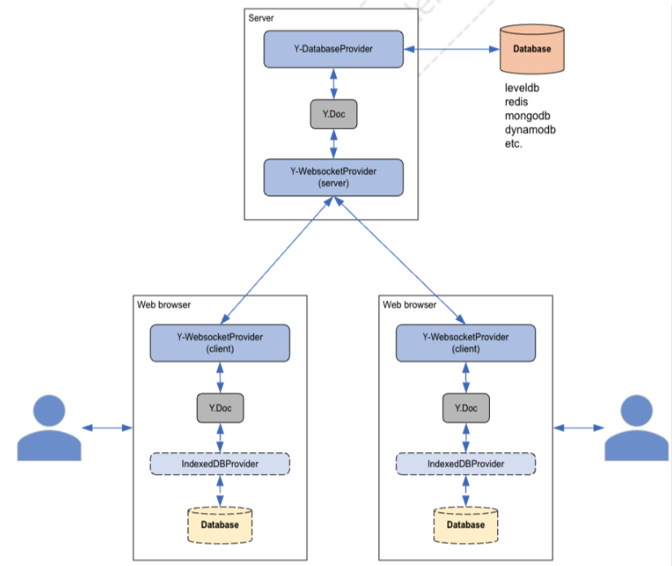

# YJS Database Provider

## Architecture



- NoSQL database를 영구 저장소로 데이터를 저장할 수 있습니다.
  - Leveldb, redis, mongodb, dynamodb, etc.
- Local browser에서는 임베드된 indexedDB에 저장하여 재접속 시 세션을유지함. Offline상태를 좀더 잘 지원합니다

## 종류

- y-indexeddb (web browser용)

  - <https://github.com/yjs/y-indexeddb>
  - IndexedDB 데이터베이스 어댑터를 사용하여 공유 데이터를 브라우저에지속적으로 저장하세요. 다음에 세션에 참여할 때 변경 사항은 그대로유지됩니다.
  - 서버와 클라이언트 간에 교환되는 데이터의 양을 최소화합니다.
  - 오프라인 편집이 가능해졌습니다
  - IndexedDB
    - NoSQL
    - Indexed Database API 또는 IndexedDB는 색인이 포함된 JSON 객체가모여있는 트랜잭셔널 로컬 데이터베이스를 위해 W3C가 권고한 웹브라우저 표준 인터페이스의 하나이다.
    - 웹사이트는 데이터베이스에서 영속적인 데이터를 모아서 저장할 수있다.

- y-leveldb (server 용)
  - <https://github.com/yjs/y-leveldb>
  - LevelDB는 빠른 임베디드 데이터베이스입니다. IndexedDB의 기본기술입니다.
  - 내부적으로 y-leveldb는 저장 매체를 지원되는 다른 데이터베이스로교환할 수 있는 level을 사용합니다. 따라서 이 어댑터는 Rocksdb, lmdb 등도 지원합니다.
  - 서버용 영구 스토리지
  - 교환 가능한 저장 매체
  - y-websocket에서 사용할 수 있습니다.
  - 단일 y-leveldb 인스턴스는 많은 문서를 처리할 수 있습니다.
  - levelDB
    - <https://github.com/google/leveldb>
    - LevelDB는 문자열 키에서 문자열 값으로의 순서화된 매핑을 제공하는 Google에서 작성된 빠른 키-값 스토리지 라이브러리입니다.
  - Sample code

```javascript
import * as Y from 'yjs'
import { LeveldbPersistence } from 'y-leveldb'

const persistence = new LeveldbPersistence('./storage-location')

const ydoc = new Y.Doc()

ydoc.getArray('arr').insert(0, [1, 2, 3])

ydoc.getArray('arr').toArray() // => [1, 2, 3]

// store document updates retrieved from other clients
persistence.storeUpdate('my-doc', Y.encodeStateAsUpdate(ydoc))

// when you want to sync, or store data to a database,
// retrieve the temporary Y.Doc to consume data
const ydocPersisted = await persistence.getYDoc('my-doc')

ydocPersisted.getArray('arr') // [1, 2, 3]
```

- y-redis (server 용)

  - <https://github.com/yjs/y-redis>
  - Yjs용 Redis 지속성 계층
  - 문서가 거의 없음

- y-mongodb-provider (server 용)

  - <https://github.com/MaxNoetzold/y-mongodb-provider>
  - y-websocket 서버를 위한 영구 Mongodb 스토리지
  - 이것은 기본적으로 공식 y-leveldb의 포크이지만 MongoDB용입니다.
  - 이 패키지는 Yjs 팀에서 공식적으로 지원하지 않습니다.

- y-dynamodb (server 용)
  - <https://github.com/hesselbom/y-dynamodb>
  - AWS DynamoDB를 위한 Yjs 영구 저장소 어댑터

## 시도

- y-leveldb 시도

  - 구현 예정

- y-mongodb-provider 시도
  - 구현 예정
