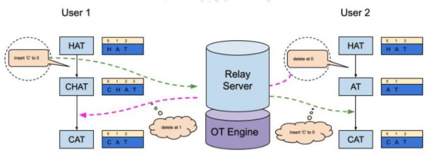
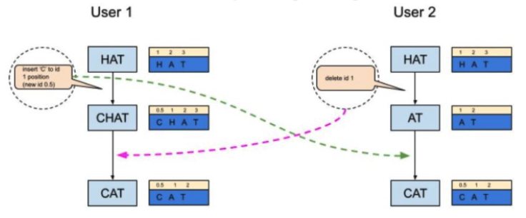
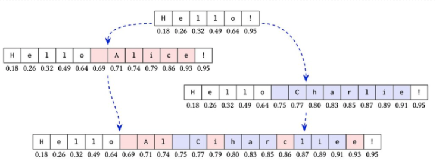
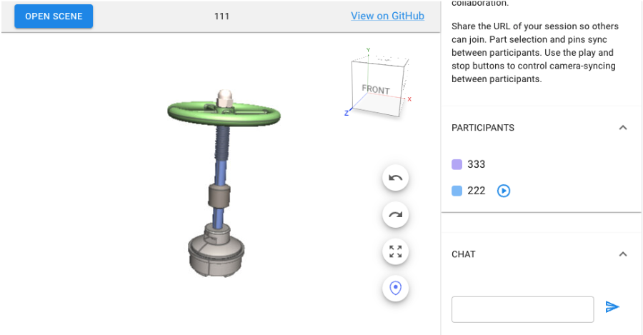

# 동시 편집 기술 조사

## 1. 종합 평가

- OP(Operational Transformation), CRDT(Conflict-Free-Replicated Data Types) 두가지 기술이 대세를 이루고 있다.
- OP: 중앙의 서버를 통함
- CRDT: Client끼리 직접 통신
- OP, CRDT 모두 완벽하지 않다.
- 둘 다 다소간의 문제점을 가지고 있고 지속적으로 개선하고 있다.
- OP가 중앙집중식 처리를 하기 때문에 좀더 안정적이다.
- CRDT가 전망이 더 밝다.
- 앞으로 새로운 솔루션에 동시 편집을 도입한다면 CRDT를 고려하는 것이더 좋다.

### 1.1 CRDT의 우수성에 대한 전문가 의견

- [I was wrong. CRDTs are the future.](https://josephg.com/blog/crdts-are-the-future/)
  - **Joseph Gentle**: Google wave(OP 적용) 개발자
  - **OP의 문제**: 중앙 집중식 서버. 과부하시 편집 불가
  - **CRDT의 초기 문제**
    - 느리다
    - 문서의 크기가 엄청나게 커진다. 메모리를 많이 쓴다.
    - 기능 부족
    - 복잡, 추론이 어려움
  - **CRDT가 발전을 거듭하여 문제가 많이 해결됨**
  - **CRDT는 OP의 모든 기능을 포함할 수 있지만, 반대는 불가능**
  - 현재 JSON, REST가 어디에서나 사용되듯이, 15년 후에는 실시간 공동편집이 어디에서나 사용될 것이다.

### 1.2 결론 및 고려사항

- **Yjs 가 가장 적합한 라이브러리로 판단됨**
- **TBD** - 동시 편집 기능에는 채팅 기능이 필요할까?
- **ES 제품에 접목할 경우**
  - Local Client, Cloud Client에 동시에 적용을 해야 한다.
  - 일부만 적용 될 경우 Lock 기능과 동시 지원해야 한다.

## 2. OP (Operational Transformation) 방식

### 2.1 특징

- 서버를 통하므로 서버에 부하가 가중된다. 비용 증가
- 서버가 요청을 받아서 연산 후 사용자가 응답을 받기 때문에 느리다.

### 2.2 알고리즘

### 2.3 사용처

- GoogleWave(서비스 중단)
- GoogleDocs
- MS365

### 2.4 라이브러리

- **Ot**: https://github.com/Operational-Transformation/ot.js
- **Gulf**: https://github.com/gulf/gulf#readme

## 3. CRDT (Conflict-Free-Replicated Data Types) 방식

### 3.1 개요

- **개발 시기**: 2006년부터

### 3.2 알고리즘

### 3.3 특징

- **장점**

  - 사용자 간에 수정 내용 직접 전달하여 속도가 빠르다.
  - 오프라인 환경에서도 문서를 편집하고 이후에 온라인이 되었을 때 변경사항 업로드가 가능하다.

- **단점**
  - OP보다 많은 메모리 사용 (문서용량의 2~3배)
    - 트리구조로 메모리를 관리
  - P2P 통신이 안되는 상황이 있다.
    - 이럴 때는 서버가 중계하기도 한다. 이 경우 장점 무색해짐
  - 의도치 않은 Merge 결과가 나오기도 함

- **보완 알고리즘**

  - 이를 보완하기 위한 다양한 알고리즘이 있음
  - Logoot, LSEQ, RGA, Treedoc, WOOT, Astrong 등

- **성능 특성**
  - **속도**: 요즘의 CRDT (Automerge / RGA or y.js / YATA) 들은 log(n) 수준의 조회 가능
  - **기능**: 이론적으로는 Rewinding 및 replaying이 가능
  - **복잡도**: 구현체 크기가 OT보다 CRDT가 크긴 하겠지만 큰 차이는 없음

### 3.4 사용처

- [Figma](https://www.figma.com/)
- [Apple Notes](https://www.icloud.com/notes)
- [Riak](https://riak.com/index.html)
- [Redis](https://redis.io/)
- [Yorkie](https://yorkie.dev/)

### 3.5 라이브러리

#### 3.5.1 Automerge

- **URL**: https://automerge.org/
- **개발언어**: JS, Rust
- **지원언어**
  - JS, TS
  - Rust([autosurgen](https://github.com/alexjg/autosurgeon))
  - Swift
  - Go
  - Java
  - Python
- **특징**: 네트워크에서 자유롭고, 클라이언트 서버, Peer-to-peer, 로컬환경에서 자유롭게 사용 가능

#### 3.5.2 Yjs

- **URL**: https://docs.yjs.dev/
- **개발언어**: JS
- **특징**
  - document가 잘 작성되어 있고 직관적입니다. npm trends에서 가장많은 다운로드 수
  - 텍스트 공유 편집을 위해서 탄생함
  - Undo, redo 지원
- **Versioning 지원**
  - 편집 중에 Version 생성
  - 편집 중 이전 Version으로 되돌아 갈 수 있음, me only
  - Version은 Readonly
- **지원 언어 (Porting)**

  - JS, TS
  - [C#](https://github.com/yjs/ycs)
  - [Rust](https://github.com/y-crdt/y-crdt)
  - [WASM](https://github.com/yjs/ywasm)

- **사용처**

  - [Quill](https://github.com/yjs/y-quill)
    - [데모](https://github.com/yjs/yjs-demos/tree/main/quill)
  - [TipTap](https://tiptap.dev/guide/collaborative-editing)
    - [**동시 편집데모**](https://tiptap.dev/examples/collaborative-editing)

- **연관 라이브러리**

  - [y-webrtc](https://github.com/yjs/y-webrtc): WebRTC connector for Yjs
  - [y-websocket](https://github.com/yjs/y-websocket): WebSocket Provider for Yjs
    - WebSocket 서버를 구축해야 함
  - [y-indexeddb](https://github.com/yjs/y-indexeddb): IndexedDB database provider for Yjs
  - [y-dat](https://github.com/yjs/y-dat): Dat connector for Yjs

- **Docs**

  - https://github.com/yjs/yjs/blob/master/README.md
  - https://docs.yjs.dev/

- **Demo site**

  - https://yjs.dev/#demos
    - Drawing
  - [SyncedStore](https://syncedstore.org/docs/)
    - Yjs를 사용. 텍스트 편집에 중점
    - **Demo**:
      - React: https://syncedstore.org/docs/react/
      - Vue: https://syncedstore.org/docs/vue

- **Demo src**
  - **Github**: https://github.com/yjs/yjs-demos
  - **Text**: https://docs.yjs.dev/getting-started/a-collaborative-editor
  - **3D**: https://collaboration.vertexvis.io/
    - 동시 편집
    - 참여자 표시
    - 채팅 지원
    - React, yjs, y-protocols, y-webrtc
    - https://github.com/Vertexvis/collaboration-demo

- **Example**

  - **Drawing**
    - https://codesandbox.io/s/yjs-v13-drawing-example-3fouz
    - 간단한 Drawing sample src
  - **Collaborative Drawing App**
    - https://www.youtube.com/watch?v=Dkn72yYEqNk
    - https://github.com/steveruizok/perfect-freehand
    - **데모 사이트**: https://www.tldraw.com/
      - 파일 포맷: JSON

- **Demo 제한사항**

  - 모든 Demo는 local 내에서 동작하는 Demo
  - 원격 PC에서 동작하는 Demo는 없음

- **Community**

  - **Y Community youtube**: https://www.youtube.com/@ycommunity5894
  - **Y Community discuss**: https://discuss.yjs.dev/

#### 3.5.3 Diamond Types

- **URL**: https://github.com/josephg/diamond-types
- **특징**: 가장 빠름

## 4. Articles

- **Scalable distributed collaborative editing for 3D models using conflict-free data structure**

  - URL: https://www.inderscience.com/info/inarticle.php?artid=100008
  - 유료 문서: $40

- **A novel CRDT-based synchronization method for real-time collaborative CAD systems**

  - URL: https://www.sciencedirect.com/science/article/abs/pii/S147403461730486X

- **CRDT 관련 영상**
  - URL: https://www.youtube.com/watch?v=kSiTGMKMPHw
  - 내용: CRDT가 좋다.

## 5. 라이브러리 비교

### 5.1 Yjs vs Automerge vs Diamond Types

| 구분          | Yjs        | Automerge        | Diamond Types |
| ------------- | ---------- | ---------------- | ------------- |
| Mentions      | 50         | 44               | 14            |
| Stars         | 12,667     | 1,925            | 1,270         |
| Latest Commit | 1 day ago  | 4 days ago       | 3 months ago  |
| Language      | JavaScript | JavaScript, Rust | Rust          |
| License       | MIT        | MIT License      | ISC           |

### 5.2 CRDT 벤치마크

- **벤치마크 저장소**: https://github.com/dmonad/crdt-benchmarks
- **비교 대상**: Yjs, ywasm, automerge-wasm
  - **ywasm**: Wasm bindings of the Yjs CRDT

### 5.3 성능 비교 결과

- **Yjs가 Automerge 보다는 훨씬 빠름**
- **Yjs가 더 적은 메모리 사용**
