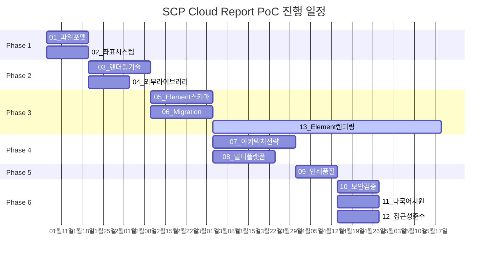
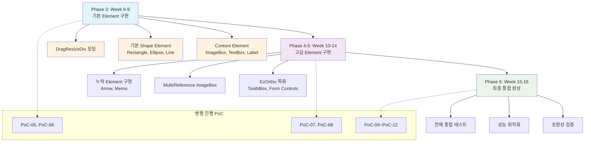

# SCP Cloud Report PoC 설계

## 문서 정보

- **작성일**: 2026년 1월 6일
- **작성자**: SCP Cloud 개발팀
- **목적**: 기존 Desktop 리포트 시스템 분석 기반 Web 리포트 PoC 설계
- **범위**: E2, E3, EzOrtho, CleverOne 리포트 통합 분석 및 Cloud 전환 전략
- **소스코드 위치**: [Azure DevOps](https://ewoosoft@dev.azure.com/ewoosoft/prototypes/_git/scp-report-poc)

## PoC 진행 순서 및 일정

### 순서 결정 기준

1. **종속성**: 후속 PoC의 기반이 되는 것부터
2. **리스크**: 기술적 리스크가 큰 것부터
3. **비즈니스 임팩트**: 제품 성공에 중요한 것부터

### 로드맵

#### Phase 1: 기본 아키텍처 검증 (Week 1-2)

- [ ] PoC-01: 파일 포맷 전환 검증 (XML → JSON)
- [ ] PoC-02: 좌표값 단위 시스템 설계 (정수 → 실수값)

#### Phase 2: 렌더링 기술 검증 (Week 3-5)

- [ ] PoC-03: 렌더링 기술 비교 분석 (HTML DOM+SVG vs Canvas)
- [ ] PoC-04: 외부 라이브러리 평가 (Fabric.js, Konva.js, PDF 생성 등)

#### Phase 3: Element 호환성 및 구현 시작 (Week 6-9)

- [ ] PoC-05: 통합 Element 스키마 설계 (E2/E3/EzOrtho/CleverOne 통합)
- [ ] PoC-06: Migration 시스템 설계 (기존 파일 변환)
- [ ] PoC-13: Element 렌더링 엔진 구현 (Week 6-16, 단계별 구현, TypeScript React 기반)

#### Phase 4: 아키텍처 전략 검증 (Week 10-13)

- [ ] PoC-07: 배포 방식 비교 분석 (NPM Package vs SaaS)
- [ ] PoC-08: 멀티 플랫폼 지원 검증 (Web/Desktop/Mobile)

#### Phase 5: 품질 및 출력 검증 (Week 14)

- [ ] PoC-09: 인쇄 및 Export 품질 검증 (고해상도 PDF, DICOM Print)

#### Phase 6: 보안 및 표준 준수 (Week 15-16)

- [ ] PoC-10: 의료 데이터 보안 검증 (HIPAA/GDPR 준수)
- [ ] PoC-11: 다국어 지원 시스템 (i18n, RTL 언어)
- [ ] PoC-12: 접근성 준수 (WCAG 2.1 AA)

### 병렬 진행 가능한 PoC

- PoC-01 + PoC-02 (독립적 검증)
- PoC-03 + PoC-04 (렌더링 관련)
- PoC-05 + PoC-06 (Element 스키마 및 Migration)
- **PoC-13**: 장기 프로젝트로 Phase 3-6에 걸쳐 단계별 진행
  - Phase 3: PoC-05, PoC-06과 병행 (기본 Element)
  - Phase 4: PoC-07, PoC-08과 병행 (고급 Element)
  - Phase 5-6: PoC-09~PoC-12와 병행 (최종 통합)
- PoC-10 + PoC-11 + PoC-12 (표준 준수 관련)

### PoC 진행 Flow Diagram



**PoC-13 단계별 세부 일정**:



## 기존 제품 분석 요약

### 제품별 특징

- **E2 (v3.0)**: 기본 리포트 편집, XML 기반, .rpt 파일 저장
- **E3 (v4.3~v5.1)**: 고급 편집 기능, Template 시스템, Auto Fill 기능
- **EzOrtho (v1.0)**: 치료/분석/히스토리 차트 특화, Excel 기반 설정 관리
- **RC Report (v5.1)**: Dialog 기반 편집, 다양한 Annotation 지원

### 공통 Element 분석

1. **Box Types**: ImageBox (Single/Multi/Reference), TextBox
2. **Image Fit Modes**: RealSize, BoxFit, Modified
3. **Paper Properties**: Size, Orientation, Margin
4. **Annotation Types**: Rectangle, Ellipse, Line, Arrow, FreeDraw, Memo
5. **Template System**: 재사용 가능한 레이아웃 구조

### 기술적 특징

- **파일 포맷**: 모든 제품이 XML 기반
- **좌표 시스템**: v5.0 이하 비율값 → v5.1 이상 mm 실측값
- **이미지 처리**: Base64 인코딩 또는 파일 경로 참조
- **Migration**: 복잡한 버전별 호환성 요구

## PoC 주제 및 우선순위

### Phase 1: 기본 아키텍처 검증 (1-2주)

#### PoC-01: 파일 포맷 전환 검증

**목적**: XML → JSON 전환 타당성 검증

- **검증 내용**:
  - 기존 XML 구조의 JSON 변환 완전성
  - 파일 크기 비교 (XML vs JSON)
  - Parsing 성능 비교
  - Schema 검증 방식 비교
- **우선순위**: 최고 (모든 후속 PoC의 기반)
- **산출물**: 포맷 변환 가이드라인, 성능 벤치마크

#### PoC-02: 좌표값 단위 시스템 설계

**목적**: 정수 → 실수값 전환 및 단위 통일

- **검증 내용**:
  - mm 기반 실수 좌표 시스템 설계
  - 다양한 해상도/화면 크기 대응 방안
  - 정밀도 요구사항 분석
  - 기존 정수값과의 Migration 정책
- **우선순위**: 높음
- **산출물**: 좌표 시스템 스펙, Migration 도구

### Phase 2: 렌더링 기술 검증 (2-3주)

#### PoC-03: 렌더링 기술 비교 분석

**목적**: HTML DOM+SVG vs Canvas 성능 비교

- **검증 내용**:
  - 복잡한 리포트 렌더링 성능
  - 인쇄/PDF 출력 품질
  - 확대/축소 시 화질 유지
  - 메모리 사용량 비교
  - 브라우저 호환성
- **세부 테스트**:
  - Single/Multi ImageBox 렌더링
  - Annotation 그리기 성능
  - 실시간 편집 반응성
- **우선순위**: 높음
- **산출물**: 렌더링 기술 선택 기준서

#### PoC-04: 외부 라이브러리 평가

**목적**: 리포트 편집 라이브러리 선정

- **검증 내용**:
  - Fabric.js, Konva.js, Paper.js 비교
  - PDF 생성 라이브러리 (jsPDF, PDFKit)
  - 이미지 처리 라이브러리
  - DICOM 이미지 처리 지원
- **우선순위**: 중간
- **산출물**: 라이브러리 선정 가이드

### Phase 3: Element 호환성 및 구현 (3-4주)

#### PoC-05: 통합 Element 스키마 설계

**목적**: 모든 제품의 Element를 아우르는 공통 스키마 설계

- **검증 내용**:
  - E2/E3/EzOrtho/CleverOne Element 매핑
  - 확장 가능한 스키마 구조 설계
  - 제품별 고유 기능 처리 방안
  - Element 속성 정규화
- **주요 Element 분석** (PoC-13과 동일):
  - **기본 Shape**: Rectangle, Ellipse, Line, Arrow, FreeDraw, Memo
  - **Content Elements**: ImageBox(Single/Multi/Reference), TextBox, Label
  - **EzOrtho 특화**: ToothBox, TreatmentCategory, Form Controls(RadioButton, CheckBox, Button, ComboBox, TextInput, TextArea)
  - **그룹핑**: Block 요소로 Element 그룹 관리
  - **제외**: Canvas Element (교정 분석 차트 전용, 별도 프로젝트)
- **우선순위**: 높음
- **산출물**: 통합 Element 스키마, 호환성 매트릭스

#### PoC-06: Migration 시스템 설계

**목적**: 기존 파일의 완벽한 Migration 지원

- **검증 내용**:
  - 제품별 버전 호환성 분석
  - 데이터 손실 없는 변환 보장
  - 부분적 Migration 전략
  - 대용량 파일 처리 성능
- **Migration 경로**:
  - E2 v3.0 → Cloud Format
  - E3 v1.x → v4.x → v5.1 → Cloud Format
  - EzOrtho v1.0 → Cloud Format
- **우선순위**: 높음
- **산출물**: Migration 도구, 검증 시나리오

#### PoC-13: Element 렌더링 엔진 구현

**목적**: React 기반 Element 렌더링 및 편집 시스템 구현

- **검증 내용**:
  - ezorthoweb(Vue.js) Element 클래스 구조 분석
  - React 기반 Element 렌더링 엔진 구현
  - **DragResizeDiv.vue Handler 시스템 포팅** (700줄 검증된 시스템)
  - HTML 편집기 통합 (외부 컴포넌트)
- **주요 구현 Element** (일반 리포트용):
  - 기본 Shape: Rectangle, Ellipse, Line, Arrow, FreeDraw, Memo
  - Content: ImageBox(Single/Multi/Reference), TextBox, Label
  - EzOrtho 특화: ToothBox, TreatmentCategory, Form Controls
  - Annotation: 6가지 타입 완전 지원
- **제외 사항**: 교정 분석 차트(Canvas 기반) - 별도 프로젝트
- **우선순위**: 높음 (PoC-05와 밀접한 연관)
- **산출물**: Element 렌더링 엔진, **DragResizeDiv 포팅 Handler 시스템**, HTML 편집기 통합

### Phase 4: 아키텍처 전략 검증 (3-4주)

#### PoC-07: 배포 방식 비교 분석

**목적**: NPM Package vs SaaS 서비스 방식 검증

- **검증 내용**:
  - **NPM Package 방식**:
    - TypeScript React Component Library 형태
    - 각 서비스별 독립적 통합
    - 버전 관리 복잡성
    - 커스터마이징 유연성
  - **SaaS 방식**:
    - 중앙화된 리포트 서비스
    - API 기반 통합
    - 일관된 사용자 경험
    - 유지보수 효율성
- **우선순위**: 높음
- **산출물**: 아키텍처 선택 가이드

#### PoC-08: 멀티 플랫폼 지원 검증

**목적**: Web/Desktop/Mobile 플랫폼 지원 전략

- **검증 내용**:
  - **Web App**: TypeScript React 기반 완전 기능
  - **Desktop App**: Electron/WebView 래핑
  - **Mobile App**: WebView 임베딩 방식
  - 플랫폼별 UX 최적화 필요성
- **성능 테스트**:
  - WebView 렌더링 성능
  - 메모리 사용량
  - 파일 시스템 접근
- **우선순위**: 중간
- **산출물**: 플랫폼 지원 전략서

### Phase 5: 품질 및 출력 검증 (2주)

#### PoC-09: 인쇄 및 Export 품질 검증

**목적**: 의료용 인쇄 품질 보장

- **검증 내용**:
  - 고해상도 PDF 생성
  - DICOM Print 지원 방안
  - 브라우저별 인쇄 일관성
  - 의료 이미지 품질 유지
- **품질 기준**:
  - 300 DPI 이상 인쇄 품질
  - 색상 정확도 유지
  - 의료용 프린터 호환성
- **우선순위**: 중간
- **산출물**: 인쇄 품질 가이드라인

### Phase 6: 보안 및 표준 준수 (2주)

#### PoC-10: 의료 데이터 보안 검증

**목적**: HIPAA/GDPR 등 의료 규정 준수

- **검증 내용**:
  - 클라이언트 사이드 데이터 암호화
  - 브라우저 캐시 보안 정책
  - 임시 파일 관리 방안
  - Audit Trail 시스템
- **우선순위**: 높음
- **산출물**: 보안 가이드라인

## 추가 검토 사항

### 기존 사용자 검토사항 외 필요 PoC

#### PoC-11: 다국어 지원 시스템

**목적**: 글로벌 SaaS 서비스를 위한 i18n 시스템

- **검증 내용**:
  - 텍스트 다국어 처리
  - RTL 언어 지원 (아랍어, 히브리어)
  - 폰트 시스템 국가별 대응
  - 의료 용어 번역 정확성

#### PoC-12: 접근성 (Accessibility) 준수

**목적**: 웹 접근성 표준(WCAG 2.1 AA) 준수를 위한 요구사항 정리 및 구현 가능성 검증

- **검증 내용** (PoC 단계):
  - WCAG 2.1 AA 요구사항 분석 및 정리
  - 접근성 구현 설계 및 가이드라인 작성
  - 기본 프로토타입으로 핵심 기능 검증
  - 자동 접근성 테스트 도구(axe-core, Lighthouse) 활용
  - 스크린 리더, 키보드 네비게이션, 고대비 모드 설계
- **본 개발 단계에서 수행**:
  - 완전한 접근성 기능 구현
  - 장애인 의료진 실사용 테스트
  - 접근성 검증 전문기관 표준 준수 확인

#### PoC-13: Element 렌더링 엔진 구현 (장기 프로젝트)

**목적**: TypeScript React 기반 Element 렌더링 및 편집 시스템 구현

**실행 기간**: Week 6-16 (11주간, 단계별 구현)

- **Phase 3 (Week 6-9)**: DragResizeDiv 포팅 + 기본 Element 구현
- **Phase 4-5 (Week 10-14)**: 고급 Element 및 기능 추가
- **Phase 6 (Week 15-16)**: 최종 통합 및 완성

- **검증 내용**:
  - ezorthoweb(Vue.js) Element 클래스 구조 TypeScript React 포팅
  - **DragResizeDiv.vue Handler 시스템 포팅** (700줄 검증된 시스템)
  - 모든 Element 타입 렌더링 (Shape, Image, Text, Annotation)
  - HTML 편집기 외부 컴포넌트 통합
  - Element 간 상호작용 (선택, 그룹핑, z-index) 구현
- **ezorthoweb 활용**:
  - 검증된 Element 클래스 설계 구조 활용
  - **DragResizeDiv.vue 완벽한 Handler 시스템** (Grid Snap, Zoom, 모바일 지원)
  - 18개 Element 타입 + 누락된 4개(Arrow, Memo, Multi ImageBox, Reference ImageBox) 추가 구현
  - 좌표 변환 시스템 (mm2px, px2mm) 활용
- **우선순위**: 높음 (PoC-05와 밀접한 연관, **최장기 PoC**)
- **산출물**: Element 렌더링 엔진, **DragResizeDiv 포팅 Handler 시스템**, HTML 편집기

### Will Not Do (제외 사항)

#### 실시간 협업 편집 (동시 편집)

**제외 이유**: 복잡성 대비 우선순위 낮음

- 의료 리포트는 일반적으로 단일 사용자 작업
- 기술적 복잡도가 높고 개발 리소스 과다 소요
- 기본 리포트 기능 안정화 후 추후 검토 대상

#### 대용량 리포트 성능 최적화 (100+ 페이지)

**제외 이유**: 기존 제품 요구사항과 불일치

- **기존 제품 분석 근거**: E3 RC Report v5.1에서 "최대 10페이지까지 추가할 수 있다"고 명시
- 실제 의료 리포트는 대부분 1-5페이지 내외로 구성
- Virtual Scrolling, 지연 로딩 등 복잡한 최적화 기법이 불필요
- 10페이지 이하 리포트에 대해서는 표준 웹 기술로 충분한 성능 확보 가능

#### 교정 분석 차트 (Canvas 기반)

**제외 이유**: 별도 프로젝트로 분리

- **기술적 복잡성**: Canvas 기반 복잡한 그래프 및 분석 도구 구현
- **프로젝트 범위**: 일반 리포트(HTML DOM+SVG)와 교정 분석(Canvas)은 별도 기술 스택
- **우선순위**: 일반 리포트 기능 안정화 후 별도 프로젝트로 진행
- **기존 구현**: ezorthoweb에서 Canvas 기반으로 이미 구현되어 있음

## 각 PoC별 상세 계획

### PoC-01: 파일 포맷 전환 검증 (Critical Path)

#### 배경 분석

- **기존 XML 구조**: 복잡한 중첩 구조, 네임스페이스 사용
- **JSON 장점**: 웹 친화적, 파싱 성능, 스키마 검증 용이
- **우려사항**: 기존 데이터 표현 완전성, 파일 크기

#### 검증 방법

1. **변환 완전성 테스트**

   - 모든 제품의 샘플 파일 JSON 변환
   - 역변환 후 원본과 비교
   - 데이터 손실 여부 확인

2. **성능 비교 테스트**

   - 파일 크기: XML vs JSON vs JSON+압축
   - 파싱 속도: 브라우저별 성능 측정
   - 메모리 사용량 비교

3. **개발 편의성 검증**
   - TypeScript 타입 정의 자동 생성
   - Schema 검증 (JSON Schema vs XSD)
   - 개발 도구 지원도

#### 예상 결과

- JSON 형태가 웹 개발에 유리할 것으로 예상
- 압축 시 파일 크기 이슈 해결 가능
- 개발 생산성 향상 기대

### PoC-02: 좌표값 단위 시스템 설계 (Critical Path)

#### 배경 분석

- **기존 한계**: 정수값으로 인한 정밀도 부족
- **요구사항**: 의료 이미지의 정확한 측정 지원
- **해상도 다양성**: 다양한 디스플레이 환경 대응

#### 검증 방법

1. **정밀도 요구사항 분석**

   - 의료 측정 최소 단위 조사
   - 프린터 해상도별 필요 정밀도
   - 화면 확대/축소 시 정밀도 유지

2. **단위 시스템 설계**

   - mm 기반 실수 좌표계
   - 상대 좌표 vs 절대 좌표
   - 다양한 용지 크기 대응

3. **변환 알고리즘 개발**
   - 기존 비율값 → 실측값 변환
   - 해상도별 픽셀 변환
   - 반올림 오차 최소화

### PoC-03: 렌더링 기술 비교 분석 (High Risk)

#### 배경 분석

- **HTML DOM + SVG**: 벡터 기반, CSS 스타일 적용 용이
- **Canvas**: 픽셀 기반, 성능 우수, WebGL 가속 가능

#### 검증 방법

1. **성능 벤치마크**

   - 복잡한 리포트 (100+ Elements) 렌더링
   - 실시간 편집 반응성
   - 메모리 사용량 및 GC 영향

2. **품질 비교**

   - 확대/축소 시 화질
   - 텍스트 렌더링 품질
   - 인쇄 출력 품질

3. **개발 복잡도**
   - 이벤트 처리 시스템
   - 히트 테스팅 구현
   - 상태 관리 복잡도
   - **Element Handler 시스템**: ezorthoweb DragResizeDiv.vue 발견으로 복잡도 대폭 감소

### PoC-05: 통합 Element 스키마 설계 (Critical Path)

#### 배경 분석

- 4개 제품의 서로 다른 Element 구조
- 확장성과 호환성 동시 고려 필요

#### 검증 방법

1. **Element 매핑 분석**

```json
{
  "elementTypes": {
    "imageBox": {
      "variants": ["single", "multi", "reference"],
      "properties": ["position", "size", "fitMode", "source"],
      "compatibility": {
        "e2": "supported",
        "e3": "full",
        "ezortho": "limited",
        "cleverone": "supported"
      }
    },
    "textBox": {
      "properties": ["font", "alignment", "macro"],
      "macroTypes": ["patientInfo", "reportDate", "clinicInfo"]
    }
  }
}
```

2. **확장성 검증**
   - 새로운 Element 타입 추가 용이성
   - 기존 Element 속성 확장 방안
   - 버전별 호환성 유지 전략

### PoC-07: 아키텍처 전략 검증 (Business Critical)

#### NPM Package 방식

**장점**:

- 각 서비스별 독립적 커스터마이징
- 라이센스 정책 유연성
- 오프라인 사용 가능

**단점**:

- 버전 관리 복잡성
- 일관성 유지 어려움
- 중복 개발 리스크

#### SaaS 방식

**장점**:

- 중앙화된 관리
- 일관된 사용자 경험
- 실시간 업데이트 가능

**단점**:

- 네트워크 의존성
- 커스터마이징 제약
- 보안 우려사항

#### 하이브리드 방식 (권장)

- Core Engine: NPM Package
- 클라우드 서비스: Template, Asset 관리
- 오프라인 모드 지원

## 성공 기준 및 평가 방법

### 기술적 성공 기준

1. **성능**: 기존 Desktop 대비 90% 이상 성능
2. **호환성**: 100% 데이터 Migration 성공
3. **품질**: 의료용 인쇄 품질 기준 충족
4. **확장성**: 새로운 Element 추가 시 1일 이내 구현

### 비즈니스 성공 기준

1. **개발 효율성**: 기존 대비 50% 개발 시간 단축
2. **유지보수성**: 버그 수정 및 기능 추가 용이성
3. **사용자 만족도**: 기존 Desktop 사용자 학습 곡선 최소화

### 평가 방법

- 각 PoC별 정량적 메트릭 수집
- 프로토타입 기반 사용자 테스트
- 개발팀 피드백 수집 및 반영

## 리스크 및 대응 방안

### 기술적 리스크

1. **브라우저 호환성**: 최신 웹 표준 활용에 따른 구형 브라우저 이슈
   - **대응**: Progressive Enhancement 적용
2. **성능 이슈**: 복잡한 리포트의 브라우저 렌더링 성능

   - **대응**: WebAssembly 활용 검토

3. **의료 이미지 품질**: DICOM 이미지 웹 처리 품질
   - **대응**: 서버 사이드 이미지 전처리

### 프로젝트 리스크

1. **일정 지연**: 복잡한 Migration 요구사항

   - **대응**: 단계별 MVP 접근

2. **요구사항 변경**: 기존 사용자 피드백에 따른 변경
   - **대응**: 유연한 아키텍처 설계

## 다음 단계

1. **PoC-01 (파일포맷)** 즉시 시작
2. 주간 진행상황 리뷰 및 조정
3. 각 Phase 완료 시 Go/No-Go 결정점 설정
4. 성공적인 PoC 결과물의 제품 적용 계획 수립

이 PoC 계획을 통해 기존 Desktop 리포트 시스템의 완전한 Cloud 전환을 위한 기술적 기반을 확보하고, 향후 제품 개발의 명확한 방향성을 제시할 수 있을 것으로 기대됩니다.
