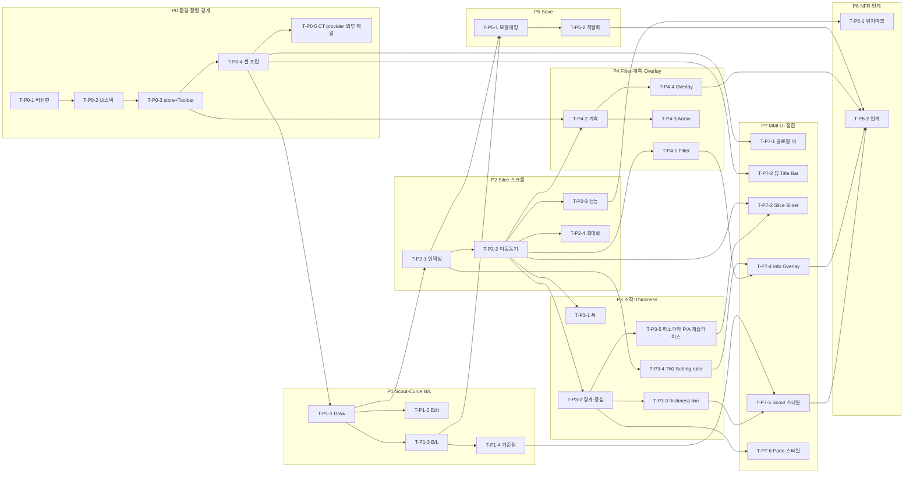

# Section Module v1.3.2 — Implementation Plan

> ABC IP 표준(`ip-standard.md`) 8섹션 고정 구조. **v0.1 초안** — Spec(OnePager) baseline 동결·사람 리뷰 7질문 통과 전까지 DAG 정확도·DoD 기계판정은 미검증.
>
> **본 프로젝트 특성(표준과의 차이):** 단일 **프론트엔드 WebGL 모듈**(`scp-section-poc`)이며 BE·DB·REST API가 없다. 따라서 DBML/Swagger = **N/A**(OnePager §Technical Description 참조), 별도 **TCL 문서 없음** → 테스트 케이스 ID는 본 IP에 **인라인 정의**(`UT-*` 자동 단위, `MT-*` 수동 시각). risk-tier(인증·결제·DB마이그레이션·PII) 해당 없음. **각 Task 카드에는 9필드 표(표준) 위에 완료 체크박스 `- [ ]`를 덧붙여 유인 진행 현황을 추적한다(9필드는 불변).**

## 1. Project Header

| 항목 | 값 |
|------|------|
| 프로젝트명 | section-module-v1.3.2 |
| PL | Raymond (전규현) |
| 작성 시작 | 2026-07-13 |
| **현재 버전** | **v0.3 (초안 — baseline 미확정, 파노라마 생성 모델 정정·MMI 재검토 반영)** |
| 관련 Spec 베이스라인 | Section OnePager **v1.6** (scp-architecture, **미커밋** — 커밋 후 SHA 동결) |
| 구현 Repo | `scp-section-poc` @ `23ac6ef` |
| 접목/참조 Repo | `cloudwebviewer` (Cloud Web Viewer, CW) @ `d063ae2` (embed 대상, 읽기·계약 참조) |
| Operating Mode 디폴트 | **유인 (Task 단위, 사람 확인·커밋)** — 무인 루프 미사용 |
| 단일/분리 세션 | **단일 세션** (Repo 1개·Task 32개·2주·1명 → ip-standard 4기준상 단일) |
| Slack 채널 | (해당 시 지정) |
| 무인 모드 Kill Switch | **N/A** — 무인 루프 인프라 미사용(유인 전용, §7) |

## 2. Spec Index

> Task 카드 `spec_refs[]`는 모두 이 인덱스 ID를 가리킨다. 외부(SharePoint/Jira/VKS) 문서는 git SHA가 없어 URL·`N/A(외부)`로 표기.

| ID | Repo/위치 | 경로 | 베이스라인 SHA | 비고 |
|----|-----------|------|--------------|------|
| **S-SPEC** | scp-architecture | `docs/…/Cloud Web Viewer v1.3.2/Section-Module-Spec-v1.3.2-OnePager.md` | **TBD: OnePager 커밋 후 동결 (담당 Raymond)** | Section 모듈 Spec 정본 v1.5 (요구·접목 계약 단일 출처) |
| S-PLAN2 | 개발계획 | `docs/…/Section-Module-개발계획.md` | TBD: 커밋 후 동결 | 내부 계획·Decision Log(D1~D10) |
| S-MMI | 외부(SharePoint) | [MMI PPT](https://vatechcorp.sharepoint.com/:p:/s/es/IQCjrxXEJ0pTQYGI9-PSaawwARs_XFxM0DuVBzvOYQBGVu0?e=ztkM8R) | N/A(외부) | 요구사항 정본 |
| S-PLAN | 외부(Jira) | [PLAN-1287](https://vts.vatech.com/browse/PLAN-1287) | N/A(외부) | 기획 답변·B/L |
| S-REVIEW | 외부(VKS) | [개발실 리뷰](https://vks.vatech.com/x/2_bhEg) | N/A(외부) | 공수·리스크·아키텍처 |
| S-POC | scp-section-poc | 레포 전체 (`packages/core`·`components`·`section-wasm`·`apps/section-demo`) | `23ac6ef` | 구현 출발 코드베이스 |
| S-CW | cloudwebviewer | `packages/core/src/toolbar/type.ts`·`store/`·`workSpace/…/ContentTitleBar.tsx`·`content/handler/`·`types/core/`·`lib/vtkjs-wrapper/…/projectFile.ts` | `d063ae2` | 접목 계약(InteractionType·useBoundStore·ContentHandler·prj 스키마·setting) |

## 3. Phase Breakdown

| Phase | 제목 | 목표 | 예상 | 도메인 |
|-------|------|------|:----:|--------|
| **P0** | 환경 정렬·경계 | scp-section-poc ↔ CW 버전·UI 스택·store·toolbar stub 정합 + CT 공급 인터페이스 추상화·외부 패널 (구현 착수 게이트) | 2일 | poc |
| **P1** | Scout·Curve·B/L | Draw/Edit curve UX, B/L 단일 규칙, BL/LB 기준점 | 2일 | poc |
| **P2** | Section Slice 스크롤 | 전체 slice 인덱싱·페이징·9장·slice number·최대화 (성능 핵심 §NFR) | 2일 | poc |
| **P3** | Pano/Scout 조작·Thickness | 드래그 핸들·경계선·중심선·thickness line·**파노라마 thin 재슬라이스·P/A offset 스윕(생성 모델 정정)**·Setting(combo·전 뷰 두께)·ruler 전체 축 | 2.5일 | poc |
| **P4** | Windowing/Filter·계측·Overlay | Image Filter, Length/Angle/FreeDraw/Arrow(section 스코프), Overlay 규칙(3D 좌표) | 1.5일 | poc |
| **P5** | Save Project | 데이터 모델·CW prj 스키마 매핑·직렬화·브라우저 임시저장 | 1일 | poc |
| **P7** | **MMI UI 정합(한땀 정합)** | **뷰 Title Bar·글로벌 바·per-panel Slice Slider·Image Info Overlay·Scout/Pano 렌더 스타일**을 MMI(§1.2·1.3·1.4)와 픽셀 단위 일치 | 1.5일 | poc |
| **P6** | NFR·인계 | Slice 스크롤 벤치마크→NFR, 공개 API·embed 매핑·Known gaps·데모 | 0.5일 | poc |

합계 ≈ 12.5일(예상 2주). 목표 1주는 P0·P1·P2 우선(핵심 신규) 기준.

**실행 전략 — Phase 번호 순차가 아니라 DAG 의존성 기반 interleaving.** P7(UI 정합)은 태스크를 한 곳에 모아 "빠짐없이" 추적하는 버킷이며, **실행은 각 P7 태스크의 선행(P2/P3/P4)이 끝나는 즉시** 수행한다(기능 완성 → 그 UI를 바로 MMI에 정합 → 실데이터로 시각 검증). 정적 크롬(T-P7-1/2, T-P7-3 골격)은 P0 셸 직후 이미 착수. 이후 순서: P1-4 → P2 → (T-P7-3 실배선·T-P7-4 slice번호/방향) → P3 → (T-P7-6·T-P7-4 Th/INT·T-P3-4 ruler) → P4 → (T-P7-5·T-P7-4 W/L) → P5 → P6. §5 DAG가 이 순서를 규정한다.

## 4. Task Cards

> 9필드 고정. `spec_refs[]`는 §2 ID. `dod[]`의 `UT-*`=자동 단위(vitest), `MT-*`=수동 시각/상호작용(본 IP 인라인 정의). 검증 명령 기준: `corepack pnpm@9.15.9 …`.

### P0 — 환경 정렬

#### T-P0-1 — 버전 핀 고정

- [x] **완료** — DoD(§6) 항목 통과 시 체크 (install·build 4/4·dev :5173 확인)

| 필드 | 값 |
|------|------|
| id | T-P0-1 |
| title | root+section-demo 버전 핀 (pnpm 9.15.9·node 20·vite 5·react 18.2·ts 5.2) |
| repo | scp-section-poc |
| spec_refs[] | S-SPEC §9.3, S-PLAN2 §10.1, S-CW `d063ae2`(버전 정본) |
| depends_on[] | (없음 — 시작) |
| outputs[] | `package.json`, `apps/section-demo/package.json`, `pnpm-lock.yaml` |
| dod[] | UT-ENV-001(`corepack pnpm@9.15.9 install` 성공) + UT-ENV-002(`corepack pnpm@9.15.9 build` 4/4 통과) + MT-ENV-003 dev 서버 `:5173` 기동 |
| estimate | 1h |
| risk | Vite 6→5 config 비호환(현재 표준 API만 사용, 낮음) |

#### T-P0-2 — UI 스택·registry 도입

- [x] **완료** — DoD(§6) 항목 통과 시 체크 (MUI·Emotion·zustand·Lingui 설치·.npmrc·build 통과)

| 필드 | 값 |
|------|------|
| id | T-P0-2 |
| title | MUI 5.15·Emotion 11.11·zustand 4.4.7·@lingui/react 4.7 추가 + `.npmrc`(@ewoosoft registry, 토큰 제외) |
| repo | scp-section-poc |
| spec_refs[] | S-SPEC §9.3·§9.5, S-PLAN2 §10.1 |
| depends_on[] | T-P0-1 |
| outputs[] | `apps/section-demo/package.json`, `.npmrc` |
| dod[] | UT-ENV-011(install 성공) + UT-ENV-012(build 통과) |
| estimate | 0.5h |
| risk | (낮음) 공개 npm 패키지 |

#### T-P0-3 — CW 계약 미러 store + Toolbar stub + core-types link

- [x] **완료** — DoD(§6) 항목 통과 시 체크 (toolStore 단위 5/5·core-types link tsc 통과·Toolbar 시각은 T-P0-4 dev 확인)

| 필드 | 값 |
|------|------|
| id | T-P0-3 |
| title | zustand toolStore(InteractionType 미러+`arrow`)·CW 토큰 MUI Toolbar stub·`@cloudwebviewer/core-types` link |
| repo | scp-section-poc |
| spec_refs[] | S-SPEC §9.6·§9.2, S-CW `packages/core/src/toolbar/type.ts`#InteractionType·`toolbar/const.ts`#TOOL_POLICY·`types/core`@d063ae2 |
| depends_on[] | T-P0-2 |
| outputs[] | `apps/section-demo/src/cw/toolContract.ts`, `cw/toolStore.ts`, `cw/CwToolbar.tsx` |
| dod[] | UT-ENV-021(toolStore activate/deactivate/setFeature 단위) + UT-ENV-022(core-types 타입 import 빌드) + MT-ENV-023 Toolbar가 CW 토큰(#141414·36px·hover rgba(0,190,165,0.4))으로 렌더 |
| estimate | 2h |
| risk | **CW core는 federation 앱이라 Toolbar 직접 import 불가(§9 확인) → stub로 구현**. core-types만 link |

#### T-P0-4 — 데모 셸 조립·검증

- [x] **완료** — DoD(§6) 항목 통과 시 체크 (Toolbar+MPR/Section 선택+SectionViewer 조립·build 974모듈·dev :5173)

| 필드 | 값 |
|------|------|
| id | T-P0-4 |
| title | App = Toolbar + MPR/Section 선택 stub + SectionViewer 세로 조립, image23 정합 |
| repo | scp-section-poc |
| spec_refs[] | S-SPEC §2, S-MMI §1.1·§1.2 |
| depends_on[] | T-P0-3 |
| outputs[] | `apps/section-demo/src/App.tsx` |
| dod[] | MT-ENV-031 3영역+Toolbar가 image23·Slide7과 한 화면으로 정합 + UT-ENV-032(build/dev 통과) |
| estimate | 1.5h |
| risk | (낮음) |

#### T-P0-5 — CT 공급 인터페이스 추상화 + 외부 CT 패널

- [x] **완료** — DoD(§6) 항목 통과 시 체크 (SectionCtProvider+S3 impl·UT-ENV-041·좌측 CtSourcePanel·SectionViewer는 volume만 소비)

| 필드 | 값 |
|------|------|
| id | T-P0-5 |
| title | `SectionCtProvider` 계약(+S3 시뮬 구현)으로 CT 공급 추상화, CT 선택을 Section 뷰 밖 좌측 패널로 분리 |
| repo | scp-section-poc |
| spec_refs[] | S-SPEC §1·§9.4, S-CW `types/core/src/content.ts`#IContainerApis.contentIOApis@d063ae2 |
| depends_on[] | T-P0-4 |
| outputs[] | `packages/components/src/ct/SectionCtProvider.ts`, `CtSourcePanel.tsx`, `index.ts`, `apps/section-demo/src/App.tsx` |
| dod[] | UT-ENV-041(provider listCases 계약 단위) + MT-ENV-042 좌측 CT 패널 로드→Section 3영역 표시, CT 선택이 Section 뷰 밖 |
| estimate | 1h |
| risk | 접목 시 S3 provider → CW `contentIOApis` provider로 교체(주입점 유지) |

### P1 — Scout·Curve·B/L

#### T-P1-1 — Draw Curve UX 정합

- [x] **완료** — DoD(§6) 항목 통과 시 체크 (UT-CRV-001~003 core 4/4 + useCurveEditor hook 6/6·ESC 미적용·1점더블클릭 무시·우클릭 취소·완료 후 생성 게이트·build/dev)

| 필드 | 값 |
|------|------|
| id | T-P1-1 |
| title | ESC 제거·1점 더블클릭 무시(종료 point≥2)·Section/Pano는 curve 완료 후 1회 생성·Active line 실시간 |
| repo | scp-section-poc |
| spec_refs[] | S-SPEC §6·§3.2, S-MMI §1.5, S-PLAN(comment 7/7) |
| depends_on[] | T-P0-4 |
| outputs[] | `packages/components/src/ScoutView.tsx`, `hooks/useCurveEditor.ts` |
| dod[] | UT-CRV-001(종료는 point≥2)·UT-CRV-002(1점 더블클릭 무시)·UT-CRV-003(우클릭 직전 취소) + MT-CRV-004 완료 전 Section blank·완료 후 1회 생성 |
| estimate | 2h |
| risk | 완료 게이트 누락 시 매 점 재생성(성능) |

#### T-P1-2 — Edit Curve·context menu

- [x] **완료** — DoD(§6) 항목 통과 시 체크 (UT-CRV-011/012 + edit ops 5개 hook 통과·context menu Add/Delete Point·Delete Curve 확인 다이얼로그·L/B Switching(Scout 라벨)·최소 2점. Section 타일 B/L는 T-P1-3)

| 필드 | 값 |
|------|------|
| id | T-P1-2 |
| title | Add/Delete Point·Delete Curve(확인 다이얼로그)·L/B Switching, 최소 2점 제약 |
| repo | scp-section-poc |
| spec_refs[] | S-SPEC §3.1(1.6)·§3.2, S-MMI §1.6 |
| depends_on[] | T-P1-1 |
| outputs[] | `packages/components/src/ScoutView.tsx`, `hooks/useCurveEditor.ts` |
| dod[] | UT-CRV-011(최소 2점 삭제 불가)·UT-CRV-012(point add/delete 후 spline 재연결) + MT-CRV-013 Delete Curve 확인 box·Pano/Section 초기화 |
| estimate | 2.5h |
| risk | context menu·drag 충돌 |

#### T-P1-3 — B/L blPolarity (단일 규칙)

- [x] **완료** — DoD(§6) 항목 통과 시 체크 (UT-BL-001 core 3/3·UT-BL-002 hook 1회고정·L/B Switching(UT-BL-003 T-P1-2)·Scout+Section 타일 라벨 blPolarity 반영·더블클릭 종료 시 자동판정)

| 필드 | 값 |
|------|------|
| id | T-P1-3 |
| title | P1→P2 선분·C쪽=L 규칙, 최초 2점 1회 고정, Scout/Section 라벨·픽셀 열 반전 연동 |
| repo | scp-section-poc |
| spec_refs[] | S-SPEC §5, S-PLAN(2026-07-13 B/L 회신), S-MMI §1.3 |
| depends_on[] | T-P1-1 |
| outputs[] | `packages/core/src/bl/blPolarity.ts`, `components/src/SectionGrid.tsx` |
| dod[] | UT-BL-001(중앙 타일 법선 n̂·C 내적 부호 판정 — 점 순서 무관)·UT-BL-002(최초 2점 후 편집에 재판정 없음)·UT-BL-003(L/B Switching 토글) + MT-BL-004 Scout/Section B·L 라벨 방향 일치(좌→우·우→좌 모두 C쪽=L) |
| estimate | 2h |
| risk | 좌표계(objectFit contain) 변환 오차 |

#### T-P1-4 — BL/LB 기준점

- [x] **완료(부분)** — 2026-07-14 useCurveEditor `blRefArcMm`(기본 0=첫 점)·`setBlRefArcMm` 추가(B/L 극성 분리). ScoutView 연두 삼각형(size 14)+"BL/LB" 라벨, hover=move 커서, drag=section line(interval) 스냅 이동, 이동 시 blPolarity 불변. UT-BL-011 통과 + 사용자 시각 확인(#23).
- [x] **잔여 구현 — 삼각형 blPolarity 시각 반전(2026-07-14 자동):** L/B Switching으로 `blPolarity` 토글 시 삼각형 방향(inverted면 B 반대쪽 향함)·라벨 "BL/LB"↔"LB/BL" 반전. `curveEditor.blPolarity` deps 반영. MMI 1.3-8·S-SPEC §5. ⚠ 폐기된 1.3-8①(위치기반 자동반전, D2·D10)과 구분. **시각 확인 대기**(반전 방향이 MMI와 맞는지 사용자 확인).

| 필드 | 값 |
|------|------|
| id | T-P1-4 |
| title | 첫 점 시각 표식(연두 삼각형) + drag 이동(section line 스냅, B/L 무영향) |
| repo | scp-section-poc |
| spec_refs[] | S-SPEC §5(기준점)·§3.1(1.6·1.7), S-MMI §1.3#8 |
| depends_on[] | T-P1-3 |
| outputs[] | `packages/components/src/ScoutView.tsx` |
| dod[] | UT-BL-011(기준점 이동 시 blPolarity 불변) + MT-BL-012 삼각형 표식 hover·drag + **MT-BL-013(잔여) L/B Switching 시 삼각형 아이콘·텍스트 반전 시각 확인** |
| estimate | 1.5h + 0.5h(잔여 반전) |
| risk | MMI 1.3#8① *위치기반* 반전은 폐기 유지(§5·D2·D10). 본 태스크 잔여는 *현 blPolarity 시각반영*(별개 항목) |

### P2 — Section Slice 스크롤 (핵심 신규)

#### T-P2-1 — 전체 slice 인덱싱·페이징 모델

- [x] **완료** — 2026-07-14 core `computeSectionIndexModel`(+`SECTION_WINDOW_SIZE=9`, `SectionIndexModel`) 신규: totalCount=floor(totalMm/interval)+1, 9-window windowStart 양끝 clamp. UT-SEC-001/002(+경계 방어) 통과. `useScoutAxialUi.sectionIndexModel` 파생 노출. (시각 없음 — 자동 UT DoD 충족)

| 필드 | 값 |
|------|------|
| id | T-P2-1 |
| title | Section line(전체) vs Active 9 window 상태 모델·총 개수·시작 인덱스 |
| repo | scp-section-poc |
| spec_refs[] | S-SPEC §3.1(1.9), S-REVIEW §3.2·§4.2, S-MMI §1.9 |
| depends_on[] | T-P1-1 |
| outputs[] | `packages/core/src/section/section.ts`, `components/src/hooks/useScoutAxialUi.ts` |
| dod[] | UT-SEC-001(전체 slice 개수 산출)·UT-SEC-002(9 window 인덱스 경계) |
| estimate | 2h |
| risk | 중심 9장→전체 인덱싱 전환 회귀 |

#### T-P2-2 — Slice 이동·동기

- [x] **완료** — 2026-07-14 core `clampSectionCenterMm`, `useScoutAxialUi` stepSectionSlice(휠)·setSectionSliceIndex(슬라이더)·arcTotalMm. SectionGrid 휠·R/L 슬라이더 실배선, 타일 번호=전체 slice(windowStart+i+1)·중앙 굵게·흰색. Scout/Pano Active line 자동 동기. Scout 선 위 1~9 라벨 제거. UT-SEC-011/012 통과 + 사용자 시각 확인(#36→수정). (WebGL/Canvas2D 두 타일 경로 모두 수정) **정합 수정(2026-07-14)**: `clampSectionCenterMm`가 center를 interval 격자 스냅 + Scout tick을 archCtx 동일 소스(s=m·interval)로 통일 → tick·9 Active line·생성이 같은 slice 격자에 정확히 정합(UT-SEC-011b).

| 필드 | 값 |
|------|------|
| id | T-P2-2 |
| title | 휠·slider slice 이동 + slice number + Scout/Pano Active line 동기 |
| repo | scp-section-poc |
| spec_refs[] | S-SPEC §3.1(1.9), S-MMI §1.9 |
| depends_on[] | T-P2-1 |
| outputs[] | `packages/components/src/SectionGrid.tsx`·`ScoutView.tsx`·`PanoramaView.tsx` |
| dod[] | UT-SEC-011(slice 인덱스→9장 매핑)·UT-SEC-012(양방향 Active line 동기) + MT-SEC-013 휠 이동 시 Scout/Pano 선 동기 |
| estimate | 2.5h |
| risk | 3뷰 상호 동기 순환 갱신 |

#### T-P2-3 — 재생성 성능(캐싱·디바운스·표시 분리)

- [x] **완료** — 2026-07-14 core `sectionCache.ts`(`makeSectionCacheKey`·`BoundedImageCache` LRU 24). SectionViewer: 재방문 window 캐시 hit 시 재생성·디바운스 skip, 디바운스 ≥48ms+seq 취소, 재생성 중 이전 이미지 유지(표시 분리), 볼륨 변경 시 cache clear. UT-SEC-021/022(+최근성) 통과 + 사용자 확인.

| 필드 | 값 |
|------|------|
| id | T-P2-3 |
| title | 생성 slice 캐시·디바운스(≥48ms)·이전 이미지 유지 표시 분리 |
| repo | scp-section-poc |
| spec_refs[] | S-SPEC §8(NFR), S-REVIEW §7 |
| depends_on[] | T-P2-2 |
| outputs[] | `packages/components/src/SectionViewer.tsx`, `core/src/section/section.ts` |
| dod[] | UT-SEC-021(캐시 hit 시 재생성 skip)·UT-SEC-022(디바운스 seq 취소) + MT-SEC-023 스크롤 중 이전 이미지 유지 |
| estimate | 2h |
| risk | 캐시 무효화 타이밍·메모리 |

#### T-P2-4 — 최대화

- [x] **완료** — 2026-07-14 SectionViewer `maximizedView`(3뷰 공통, display 토글로 컨텍스트 보존). ViewTitleBar ⛶↔복원 토글(CW `TitleMaximizeIcon`/`TitleNormalizeIcon` SVG). 개별 tile 더블클릭 최대화/복원(callback ref로 draw 타이밍 버그 수정). UT-SEC-031 통과 + 사용자 확인. OnePager 1.2/1.9·IP 보강.

| 필드 | 값 |
|------|------|
| id | T-P2-4 |
| title | 뷰 최대화(Scout/Panorama/Section 각 ⛶ — SectionViewer `maximizedView`, MMI 1.2) + 최대화 시 **⛶↔복원(최소화) 아이콘 토글**(CW `TitleNormalizeIcon`) + Section 3×3 유지 확장 + 개별 slice 더블클릭 최대화/복원(MMI 1.9-3) |
| repo | scp-section-poc |
| spec_refs[] | S-SPEC §3.1(1.2·1.9), S-MMI §1.9-3·§1.2, S-CW `lib/react-vtkjs/src/icon/TitleMaximizeIcon`·`TitleNormalizeIcon`·`ContentTitleBar`#maximized@d063ae2 |
| depends_on[] | T-P2-2 |
| outputs[] | `packages/components/src/SectionViewer.tsx`·`SectionGrid.tsx`·`ScoutView.tsx`·`PanoramaView.tsx`·`ViewTitleBar.tsx` |
| dod[] | UT-SEC-031(최대화 상태 전이·개별 tile 토글) + MT-SEC-032 3뷰 ⛶ 최대화·복원 토글 + 개별 tile 더블클릭 최대화/복원 |
| estimate | 1h |
| risk | (낮음) |

### P3 — Pano/Scout 조작·Thickness

#### T-P3-1 — Scout Active line 이동·폭 조절

- [x] **완료** — 2026-07-14. **조작**: core `sectionWidthFromHandleMm`(대칭 폭·clamp, 범위 20~80mm=§3.4·D13). Center line 끝 control point 대칭 드래그→Section 가로폭(draft→drop 커밋), 선 드래그→위치 이동(clamped), hover 커서(끝=ew-resize·선=move, MMI 1.7-1a). 폭 핸들 네모=**녹색 테두리·속 비침·Section 선 방향 회전**(hs 7). Sec 폭 슬라이더 병행.
  **Scout curve 렌더 정합(MMI 1.3, T-P7-5 선반영)**: ① Curve 제어점=**연두 꽉찬 네모(테두리 없음, ~13px)** ② **9개 Active line 모두 섹션 폭 길이** ③ 커브 위 tick 짧게(길이 동일)·minor 두껍게(흐림 개선)·**20mm 배수 밝은 빨강 `#CB6163`** ④ **20mm마다 L(안쪽)에 호장(mm) 숫자** ⑤ Center line 노랑·가늘게(1.3px) ⑥ B/L 흰색·section line 연장선 위 ⑦ **z-order: 제어점→커브→빨강 tick→노랑/삼각형**(MMI #49·#50·#52). UT-CTL-001 통과 + 사용자 확인.

| 필드 | 값 |
|------|------|
| id | T-P3-1 |
| title | Active line drag 이동 + Center line control point 대칭 드래그로 폭 조절(slider 대체/병행) |
| repo | scp-section-poc |
| spec_refs[] | S-SPEC §3.1(1.7), S-MMI §1.7, S-REVIEW §5(1.7) |
| depends_on[] | T-P2-2 |
| outputs[] | `packages/components/src/ScoutView.tsx` |
| dod[] | UT-CTL-001(폭 대칭 조정)·UT-CTL-002(폭→재생성 트리거) + MT-CTL-003 드래그 핸들 |
| estimate | 2h |
| risk | 드래그 중 연속 재생성 부하 |

#### T-P3-2 — Panorama 경계선·중심선 이동

- [x] **완료** — 2026-07-14 core `sectionBand.ts`(resizeSectionBandSymmetric·moveSectionBandCenter·clampSectionZBand). PanoramaView: 경계선 대칭 드래그(중심 고정)·중심선(밴드 Z 중심) 드래그→3뷰 갱신·중심선 drop 시 Scout 위치선(sliceIndex) 동기·중심선(초록)/Scout 위치선(흰 점선) 렌더·**hover 커서**(경계·중심 ns-resize, Active line ew-resize, MMI 1.8-1a/2a/3a). UT-CTL-011/012 통과 + 사용자 확인.

| 필드 | 값 |
|------|------|
| id | T-P3-2 |
| title | 경계선(세로폭 대칭)·중심선 이동(drop 시 3뷰 갱신·Scout 위치선 동기) |
| repo | scp-section-poc |
| spec_refs[] | S-SPEC §3.1(1.8), S-MMI §1.8 |
| depends_on[] | T-P2-2 |
| outputs[] | `packages/components/src/PanoramaView.tsx` |
| dod[] | UT-CTL-011(경계선 100mm 대칭)·UT-CTL-012(중심선 이동→3뷰 갱신) + MT-CTL-013 드래그 |
| estimate | 2h |
| risk | ±45° 회전은 스펙아웃(구현 금지) |

#### T-P3-3 — Panorama thickness line

- [x] **완료** — 2026-07-14 초록 한 쌍(±th/2)·**control point 곡선 시작점(s=0)·끝점(s=totalMm) 양쪽**(MMI image26)·대칭 드래그(잡은 끝점 법선 투영)→Pano thickness 실시간·30mm clamp(`clampThicknessMm`). thickness=0이면 커브에 겹쳐 collapse. UT-CTL-023 통과. Setting 다이얼로그(T-P3-4)에서 Th>0 설정 후 시각 확인.

| 필드 | 값 |
|------|------|
| id | T-P3-3 |
| title | thickness line control point **양 끝(시작·끝)** 대칭 드래그 → Pano thickness 실시간, **combo와 동일 30mm cap**(단일 `MAX_THICKNESS_MM`) |
| repo | scp-section-poc |
| spec_refs[] | S-SPEC §3.1(1.3·1.7)·§8·§12-D8, S-MMI §1.7-3 |
| depends_on[] | T-P3-2 |
| outputs[] | `packages/components/src/PanoramaView.tsx`, `core/src/panorama/panorama.ts` |
| dod[] | UT-CTL-021(thickness 대칭·overlay 반영)·UT-CTL-023(드래그 상한 30mm clamp — combo와 동일) + MT-CTL-022 드래그 |
| estimate | 1h |
| risk | (낮음) |

#### T-P3-4 — Thickness 0mm·Setting UI·ruler

- [x] **완료(부분)** — `SettingDialog`(Popover, Thickness/Interval combo) 신설 + Scout/Panorama/Section 3뷰 기어에 배선. Thickness 뷰별 독립(Pano↔Section↔Scout), 선택 즉시 반영. 기존 dev 슬라이더는 다이얼로그 하단 '개발용' 블록으로 이동. **잔여**: Scout thickness는 placeholder(렌더 미적용, MPR 동기 예정), UT-SET-001/003 자동화. **세로 스케일 바(ruler) 2026-07-14 수정**: Scout 50mm/Panorama 20mm(공용 20→분리, MMI image19), 척도는 DICOM `spacing[1]`(Scout Y)·`spacing[2]`(Pano Z) 기반 확인. (Section 타일 10/20/30 눈금은 별도 T-P7-4.)

| 필드 | 값 |
|------|------|
| id | T-P3-4 |
| title | **CW `CTSliceSettingDialog` 이식**(§3.5): 기어→Popover(184px, live-apply), **Thickness combo {0,0.1,0.5,1,2,3,5,10,20,30}mm**(기본 0)·**Interval combo [Voxel Based Interval,0.1~10]**(Voxel Based→0=min voxel spacing). **뷰별 독립**(Scout·Pano·Section slab 두께 각자). 기존 PoC 슬라이더 박스 교체. Th 기본 0(slabHalfWidthMm=0)·ruler 전체 축. 상한 30mm=단일 `MAX_THICKNESS_MM`(T-P3-3) |
| repo | scp-section-poc |
| spec_refs[] | S-SPEC §3.1(1.2·1.10)·§3.3·§3.5·§8, S-MMI §1.10(Slide20·27)·§1.2, S-CW `workSpace/…/ctContent/CTSliceSettingDialog.tsx`·`workSpace/setting/index.ts`#SLICE_THICKNESSES/getSliceIntervals·`types/core/src/setting.ts`#IMPRViewSetting@d063ae2 |
| depends_on[] | T-P2-1 |
| outputs[] | `packages/core/src/panorama/panorama.ts`·`section/section.ts`, `components/src/*`(SettingDialog·SectionTileChrome), `hooks/useScoutAxialUi.ts`(뷰별 두께·interval 상태) |
| dod[] | UT-SET-001(Th=0 경로 픽셀)·UT-SET-002(combo 옵션값·상한 30mm)·UT-SET-005(**뷰별 두께 독립** — Pano 변경이 Section 무영향)·UT-SET-006(Interval Voxel Based→min voxel spacing)·UT-SET-003(ruler 전체 축) + MT-SET-004 Setting Popover(Thickness·Interval combo) |
| estimate | 2.5h |
| risk | Th=0 경계 케이스(슬랩 루프)·전 뷰 두께 배선 |

#### T-P3-5 — 파노라마 생성 모델 정정 (thin 재슬라이스 + B/L offset 스윕)

- [x] **완료** — 2026-07-14. 기본 Th0 thin + **기본 투영 mean**(D12) 이미 반영. **navigator line**(Scout 단선·초록, 커브 법선 offset, 기본 0=커브 위) + **B/L 슬라이더**(±20mm 잠정·step=panoramaInterval)로 offset 조작. `generatePanoramaImageData`에 **`navigatorOffsetMm`** 추가 → 재슬라이스 중심을 법선 바깥(B)/안(L) 이동, offset 변경 시 자동 재생성. Scout navigator·파노라마 깊이 동일 부호(CT중심 기준). 사용자 시각 확인(navigator 이동·파노라마 재슬라이스). 잔여: 스윕 범위 실측 튜닝, UT-PAN 자동화.

| 필드 | 값 |
|------|------|
| id | T-P3-5 |
| title | 파노라마를 **thin 기본(Th0) 재슬라이스**로 정정 + **B/L 슬라이더(구 P/A) → 곡선 법선 offset 스윕**(navigator 위치에서 재생성, 스텝=Panorama interval) + Scout **Panorama navigator line** 동기 + **기본 투영 = 평균(mean)**(D12 확정, MIP는 Image Adjust 토글=T-P4-1). **슬라이더 라벨 B/L**(§12-D15, P/A→B/L 확정). T-P7-3 Pano 실배선 완성 |
| repo | scp-section-poc |
| spec_refs[] | S-SPEC §3.3·§3.1(1.3·1.8)·§12-D11·D12, S-MMI §1.3-5·§1.8-5, S-PLAN(2026-07-13 파노라마 회신) |
| depends_on[] | T-P3-2 |
| outputs[] | `packages/core/src/panorama/panorama.ts`(offset 재슬라이스·투영 param), `components/src/PanoramaView.tsx`·`ScoutView.tsx`(navigator line·P/A slider) |
| dod[] | UT-PAN-001(navigator offset≠0 시 재슬라이스 곡선이 법선방향 이동)·UT-PAN-002(투영 param MIP↔mean 전환)·UT-PAN-003(Th0 thin 경로) + MT-PAN-004 P/A 스윕 시 Scout navigator line 동기·파노라마 깊이 변화 |
| estimate | 3h |
| risk | offset 재슬라이스 곡선 생성 신규. (D12 확정: 기본 mean·MIP는 Image Adjust 토글) |

#### T-P3-6 — 뷰별 독립 Interval (Scout/Panorama/Section)

- [x] **완료** — 2026-07-14. 3뷰 독립 interval: `scoutIntervalMm`(축 Z·placeholder·Voxel Based 기본), `panoramaIntervalMm`(B/L navigator 슬라이더 step, 기본 1), `sectionIntervalMm`(=`curveEditor.sectionInterval`, 호 방향·Scout/Pano section line 구동, MMI 1.10-3b). 각 Setting 다이얼로그가 자기 interval에 바인딩(기존 단일 공유 버그 해소). 기획 확인 완료(§12-D15). 잔여: Scout interval의 Z 스크롤 실적용(MPR 동기).

| 필드 | 값 |
|------|------|
| id | T-P3-6 |
| title | Interval을 **뷰별 독립 3개**로 분리: `scoutIntervalMm`(축 Z 스크롤·Voxel Based 기본·MPR 동기·Total Slice 구동), `panoramaIntervalMm`(P/A 스윕 slice 스텝, 기본 1mm), `sectionIntervalMm`(호 방향 단면 간격, 기본 1mm). **Scout·Panorama의 Section line/Active line 간격은 `sectionIntervalMm` 구동 유지**(MMI 1.10-3b). 각 Setting 다이얼로그를 자기 interval에 바인딩(현재 3뷰가 sectionInterval 공유 = 버그 정정) |
| repo | scp-section-poc |
| spec_refs[] | S-SPEC §1.10·§12-D15, S-MMI §1.10-3①·3③·3b·§1.10-2③·§1.8-5 |
| depends_on[] | T-P3-4, T-P3-5 (Panorama interval=P/A 스텝이라 navigator/스윕과 함께 확정) |
| outputs[] | `hooks/useScoutAxialUi.ts`(3 interval 상태), `components/src/{ScoutView,PanoramaView,SectionGrid,SettingDialog}.tsx` |
| dod[] | UT-INT-001(Scout interval→Total Slice·Z 스텝, Section line 무영향)·UT-INT-002(Section interval→Scout·Pano Section line 간격 갱신)·UT-INT-003(Panorama interval 독립) + MT-INT-004 3뷰 Setting 각자 독립 확인 |
| estimate | 2h |
| risk | **Panorama interval 용도 미확정(D15)** — 기획 답변 전 착수 시 재작업 위험. Scout/Section 분리는 저위험이나 Panorama는 T-P3-5(navigator)와 묶어 진행 권장 |

### P4 — Windowing/Filter·계측·Overlay

#### T-P4-1 — Image Filter MPR→Section

- [x] **완료** — 2026-07-14. `ImageAdjustDialog`(380px, W/L 슬라이더+필터 토글+Revert) 3뷰 배선. **W/L**(볼륨 기본값 기준 적응형 범위 `wlSliderRanges`)·**MIP**(projection mean↔mip, Panorama 재생성 dep 버그 수정)·**Smooth/Sharpen/MaxSharpen/Inverse**(core `applyImageFilter` 3×3 커널+inverse, Scout/Panorama/Section 후처리) 모두 동작. Revert(W/L 기본+필터 off). 전 뷰 **공유**(MMI 1.11-1②·**§12-D17 확정**: W/L·Filter 전역 공유·Scout 포함, 판독 시각기준 유지 목적). UT-FLT-001 통과(커널·inverse). 잔여: 필터 상태 좌상단 text(T-P7-4), Section 캐시키에 필터 포함(완료).

| 필드 | 값 |
|------|------|
| id | T-P4-1 |
| title | **CW `ImageAdjustDialog` 이식**(§3.6, 380px): W/L 슬라이더(mappingMin/Max=level∓ceil(w/2)) + 필터 토글 **Smooth·Sharpen·Max Sharpen·Inverse·MIP**(Smooth/Sharpen/MaxSharpen 상호배타·Inverse 공존) + **Revert**(원복). 3×3 커널(Smooth box 1/9·Sharpen edge-0.5/center5·MaxSharpen edge-1/center9·Inverse 1-rgb·MIP=slab 최대투영/D12). 전 단면 일괄·좌상단 text·뷰 간 동기 |
| repo | scp-section-poc |
| spec_refs[] | S-SPEC §3.1(1.11)·§3.6·§12-D12, S-MMI §1.11, S-REVIEW §4.4, S-CW `workSpace/…/common/ImageAdjustDialog.tsx`·`content/utils/imageAdjust.ts`·`lib/vtkjs-wrapper/…/ESImageMapper`(3×3 conv)·`VolumeObject2D`(windowing·MIP)@d063ae2 |
| depends_on[] | T-P2-2 |
| outputs[] | `packages/core/src/section/section.ts`·`panorama/panorama.ts`(필터 커널·windowing), `components/src/*`(ImageAdjustDialog) |
| dod[] | UT-FLT-001(각 필터 커널: box 1/9·sharpen·maxsharpen·inverse)·UT-FLT-002(뷰 간 W/L 동기)·UT-FLT-004(Smooth/Sharpen/MaxSharpen 배타·Revert 원복) + MT-FLT-003 필터 시각 |
| estimate | 3h |
| risk | 필터별 화질·성능. MIP는 slab(thickness>0) 필요(단일 slice no-op) |

#### T-P4-2 — 계측 Length/Angle·Free Draw

- [x] **완료(2026-07-15)** — core `measure/measurement.ts`(정규화 타일좌표 length mm·angle deg·폴리라인·타일 clamp) + `SectionMeasureOverlay.tsx`(오버레이 캔버스, hit-test로 첫 점 영역에 귀속→스코프, 렌더모드/최대화 무관, `contentRect`로 letterbox 보정). Toolbar interaction→`SectionViewer.measureTool`→3뷰 배선. Length=2클릭(mm)·Angle=3클릭(화면좌표 °)·FreeDraw=드래그(선만), 영역 밖 클릭 경계 clamp, 우클릭/Esc 취소. **UT-MEA-001/002** 13케이스 통과. MT-MEA-003 확인 완료. **3뷰 확장(§12-D21, Jessi 확정 2026-07-15)**: Scout·Panorama에도 `SectionMeasureOverlay`를 단일 영역(rows=cols=1·letterbox `contentRect`·물리 mm)으로 마운트 → 4개 툴이 Scout(영역)·Panorama(영역)·Section(slice) 모두 동작. **잔여**: 계측 삭제 UI, Scout Z-slice/Panorama offset별 오버레이 평면 귀속(현재 뷰 내 상시 표시).

| 필드 | 값 |
|------|------|
| id | T-P4-2 |
| title | Length/Angle 측정 + Free Draw, 각 section slice 스코프(경계 넘나들 불가) |
| repo | scp-section-poc |
| spec_refs[] | S-SPEC §3.1(1.12·1.13), S-MMI §1.12·§1.13, S-CW `toolbar/type.ts`#InteractionType@d063ae2 |
| depends_on[] | T-P0-3, T-P2-2 |
| outputs[] | `packages/components/src/SectionGrid.tsx`, `cw/toolStore.ts` |
| dod[] | UT-MEA-001(length 계산)·UT-MEA-002(section 스코프 제약) + MT-MEA-003 계측 상호작용 |
| estimate | 2.5h |
| risk | tool store↔뷰 handler 연동 |

#### T-P4-3 — Arrow 툴 신규

- [~] **구현 완료·MT 확인 대기(2026-07-15)** — `arrow` InteractionType은 `toolContract.ts`에 기존 정의(CW 미존재 신규, TOOL_POLICY=length/angle과 동일 편집권한). Section 계측 오버레이(T-P4-2) 재사용: 2클릭(시작·끝) 누적, `SectionMeasureOverlay`가 kind='arrow'를 선+**화살촉**(끝점 방향)으로 렌더(점·라벨 없음), 타일 스코프 clamp 동일. App `toMeasureTool`에 arrow 매핑. **UT-ARR-001**(2클릭 확정·끝점 clamp, `measurement.test.ts`)·**UT-ARR-002**(TOOL_POLICY·overlay 정책, `toolContract.test.ts`) 통과. **잔여**: MT-ARR-003(dev 서버 렌더 확인). **접목 gap**: CW core에 `arrow` InteractionType·TOOL_POLICY·아이콘 역머지 필요(§9.6).

| 필드 | 값 |
|------|------|
| id | T-P4-3 |
| title | Arrow InteractionType 신규(2클릭 시작·끝), section 스코프. CW 패턴 준수 |
| repo | scp-section-poc |
| spec_refs[] | S-SPEC §3.1(1.12)·§9.6, S-MMI §1.12-3, S-CW `toolbar/type.ts`·`toolbar/const.ts`@d063ae2 |
| depends_on[] | T-P4-2 |
| outputs[] | `apps/section-demo/src/cw/toolContract.ts`, `components/src/SectionGrid.tsx` |
| dod[] | UT-ARR-001(2클릭 arrow 생성)·UT-ARR-002(TOOL_POLICY 정합) + MT-ARR-003 arrow 렌더 |
| estimate | 1.5h |
| risk | 접목 시 CW core 역머지 필요(Known gap) |

#### T-P4-4 — Overlay 표시 규칙(3D 좌표)

- [~] **핵심 완료·MT 확인 대기(2026-07-15)** — core `overlay/overlayPlane.ts`: `OverlayPlane`(point·normal 3D mm)·`planeSignedDistanceMm`·`planeNormalAngleDeg`·`isOverlayVisibleOnPlane`(거리≤±Interval/2 **AND** normal≤허용오차)·`isOverlayVisibleOnArc`(동일 Curve slice 1D 특수화). **D3 = `OVERLAY_NORMAL_TOLERANCE_DEG`(5°) 상수 분리**. **UT-OVL-001**(거리)·**UT-OVL-002**(normal 각 임계·커스텀)·**UT-OVL-003**(interval 변경 재판정·원위치 복귀) `overlayPlane.test.ts` 12케이스 통과. **UI 통합(호장 앵커)**: 계측을 생성 호장(mm)에 귀속(`SectionMeasureOverlay` `arcMm=(windowStart+tile)*interval`), slice 스크롤/interval 변경 시 `round(arc/interval)` 타일로 재표시·윈도우 밖이면 숨김 → "스크롤 앵커" 한계 해소·1.13-6-4 구현. **잔여**: MT-OVL-004(dev 스크롤 재표시 시각 확인) + Curve 변경 시 normal 기반 미표시는 core 함수는 준비됐으나 UI가 curve tangent 미수신이라 미배선(Scout/Pano 확장 배치와 함께 처리 예정, §후속).

| 필드 | 값 |
|------|------|
| id | T-P4-4 |
| title | Overlay를 Curve+평면(point,normal)·환자 볼륨 3D 좌표 귀속. 표시 = 거리≤±Interval/2 & normal≤5° |
| repo | scp-section-poc |
| spec_refs[] | S-SPEC §4, S-MMI §1.13-6, S-REVIEW §3.3 |
| depends_on[] | T-P4-2 |
| outputs[] | `packages/core/src/section/section.ts`(overlay plane), `components/src/*` |
| dod[] | UT-OVL-001(거리 판정)·UT-OVL-002(normal 각 임계)·UT-OVL-003(Interval 변경 후 복귀 재표시) + MT-OVL-004 curve 변경 시 일시 미표시 |
| estimate | 2h |
| risk | normal 허용 오차 5° 튜닝(D3, 상수 분리) |

#### T-P4-5 — Show/Hide Grid (격자 오버레이)

- [x] **완료(2026-07-15)** — MMI 1.13-2a 기능이 초기 구현에서 누락(스토어·툴바만·뷰 미배선)이었음을 확인·보완. CW `@ewoosoft/es-view-info` GridView 정합: **물리 10mm 간격**(px=round(mm×뷰px/뷰mm))·`#A9A9A9`·opacity 0.7·1px·점선 `[1,1]`·**셀 중앙 원점 양방향**·Canvas 2D. `GridOverlay.tsx` 신설, Scout·Panorama(단일 영역·letterbox contentRect)·Section(타일별 tileMmMetrics)에 마운트. `showGrid` 배선(App `useToolStore`→SectionViewer→3뷰). 전 모드 표시(Appendix). §3.4.1(색)·§3.4.2(간격 정본) 등재. **잔여**: 간격 설정 UI(1~50mm, CW Setting) — 현재 10mm 고정. MT 시각 확인.

| 필드 | 값 |
|------|------|
| id | T-P4-5 |
| title | Show/Hide Grid — 3뷰 격자 오버레이(물리 10mm·#A9A9A9·점선), `showGrid` 배선 |
| repo | scp-section-poc |
| spec_refs[] | S-SPEC §3.4.1·§3.4.2, S-MMI §1.13-2a·Appendix, S-CW `@ewoosoft/es-view-info` GridView |
| depends_on[] | T-P0-3, T-P2-2 |
| outputs[] | `components/src/GridOverlay.tsx`, `ScoutView.tsx`·`PanoramaView.tsx`·`SectionGrid.tsx`, `App.tsx` |
| dod[] | MT-GRID-001 3뷰 격자 표시·토글·10mm 물리 간격 시각 확인 |
| estimate | 1.5h |
| risk | (낮음) 간격 UI는 후속 |

#### T-P4-6 — 공통 뷰 조작 (Pan / Zoom / Reset View / Pointer)

- [x] **구현 완료(2026-07-15) — 사용자 시각 검증 대기.** 공용 `useViewTransform` 훅(뷰별 `panX/panY/zoom` + Pan=좌드래그·Zoom=우클릭/상하드래그·Reset=tick 초기화·CW 커서). 3뷰 모두 **이미지(및 이미지 앵커 계측)만 transform**(이미지 CSS translate+scale origin 중앙, 계측 오버레이 동일 transform) + 히트테스트 역변환(Scout `screenToSliceCoords`·Panorama `clientToCanvas` 부모rect+역변환). **Grid·Ruler는 Pan/Zoom 미적용 고정**(§12-D27b, 2026-07-15 사용자 피드백 — Grid는 뷰 전체 고정 10mm, Ruler는 뷰/타일 하단·우측 고정; GridOverlay·SectionTileChrome·스케일바 transform 제거). Section 3×3은 **9뷰가 하나의 transform으로 함께**(2026-07-15 최종 확정, §12-D27 — 각 뷰 자기 중앙 기준 제자리 확대·타일 클립, 뭉쳐 스프레드 아님): 단일 `useViewTransform`, WebGL은 **타일별 `gl.viewport`에 같은 transform을 각 타일 중앙 기준 적용 + `gl.scissor` 클립**, canvas2d·크롬 그리드·최대화는 셀별 CSS transform + `overflow:hidden`, 오버레이는 단일 `transform`을 **각 셀 중앙 기준**으로 적용·타일 클립. (초안의 타일별 독립 9-transform은 slice 스크롤 배율 혼선·Save 9벌 문제로 배제 — D27.) Panorama 콘텐츠 컨테이너 `overflow:hidden` 추가(확대 시 뷰 밖 넘침 수정). 휠=Section slice 스크롤 유지(zoom과 분리). Store에 `resetView()`·`resetViewTick` 추가, CwToolbar `resetView` 배선, App `toNavTool`(pan/zoom) 전달. **UT-NAV-001·002 통과**(useViewTransform.test.ts 9케이스). 커서 = `components/src/cursors.ts` CW 정본. **Ruler 적응형 눈금(2026-07-15 추가, §D27b)**: 위치 고정이되 Zoom에 따라 단위·간격·표시 mm 변경(스케일바 표시 mm=base/zoom, 예 2×→25mm) — core `view/rulerTicks.ts` `chooseRulerSteps`(1·5·10·50·100mm, 확대 시 1mm까지) 3뷰 공통, `ViewVerticalScaleBar`·`SectionTileChrome`에 `zoom` 배선. UT: rulerTicks.test.ts 8케이스 통과. **잔여(사용자 확인):** pan/zoom·reset·오버레이 정합·grid 고정·ruler 단위 변경·CW 커서 시각 확인(MT-NAV-003), 감도(ZOOM_SENSITIVITY 0.005) 튜닝.

| 필드 | 값 |
|------|------|
| id | T-P4-6 |
| title | Pan/Zoom/Reset View/Pointer — **뷰별 독립** transform(pan·zoom, 마우스 드래그·Zoom=우클릭 상하) + 이미지·grid·ruler·계측 동일 transform 공유(zoom out 시도 grid/ruler 뷰 전체 유지) |
| repo | scp-section-poc |
| spec_refs[] | S-SPEC §3.7·§3.4.2, S-MMI §1.13-1a·Appendix, S-CW `ES3DRenderWindowInteractor`·`ActionState` |
| depends_on[] | T-P0-3, T-P2-2, T-P4-5(grid) |
| outputs[] | 공용 `useViewTransform` 훅(pan/zoom) + `ScoutView.tsx`·`PanoramaView.tsx`·`SectionGrid.tsx`·`GridOverlay.tsx`·`SectionTileChrome.tsx`(transform 적용), **`components/src/cursors.ts`(CW `CURSORS` 복사 — 완료)**, `App.tsx` |
| dod[] | UT-NAV-001(pan/zoom→screen 좌표·유효 pxPerMm 변환)·UT-NAV-002(zoom out 시 grid/ruler 뷰 전체 커버 산출) + MT-NAV-003 3뷰 독립 pan·zoom(우클릭 상하)·reset·오버레이 정합·zoom out 여백에도 grid/ruler·**Pan/Zoom 활성 시 CW 커서(손/돋보기) 표시** |
| estimate | 5h |
| risk | 뷰별 transform·오버레이(이미지/grid/ruler/계측) 동기, Zoom 우클릭 vs 컨텍스트 메뉴(Scout 커브) 충돌 정책, 감도 CW 정합 |

#### T-P4-7 — 국제화(i18n) — CW Lingui 구조 정합

- [ ] **미구현·회의/기획(Scott) 결정 대기(2026-07-15 신설)** — 현재 모듈은 i18n 미적용·한/영 문자열 혼재. CleverSpace·CW 모두 Lingui(§9.11-CW-2). **§D23 추천안 = CleverSpace 연동·한국어 지원**. **선행: 모듈 UI 문자열을 한국어로 통일**(현재 "Draw Curve"·"Curve 1" 등 영어와 "취소"·"Section 생성 중…" 등 한국어 혼재 → 한국어 기준으로 통일). 이후 **CW와 동일 Lingui 구조 채택**(문자열 `t\`\`` 매크로화, `@lingui/react` federation shared 재사용, 카탈로그 en_US/ko_KR). **회의 결정 후 착수**(한국어 지원 여부·대상 언어 = 기획 Scott 판단).

| 필드 | 값 |
|------|------|
| id | T-P4-7 |
| title | 국제화 — UI 문자열 한국어 통일 → CW Lingui 구조 채택(`t\`\`` 매크로·카탈로그), 한국어 지원(§D23) |
| repo | scp-section-poc |
| spec_refs[] | S-SPEC §9.11-CW-2·§12-D23, S-CW `packages/core/src/App.tsx`(i18n.load/activate)·`i18n/*.po`, ezcloud `lingui.config.ts` |
| depends_on[] | (회의/기획 Scott 결정) |
| outputs[] | `packages/components/src/*`(문자열 `t\`\``화)·`packages/core/src/*`·i18n 카탈로그(en_US/ko_KR) |
| dod[] | MT-I18N-001 문자열 한국어 통일(혼재 제거) · MT-I18N-002 CW Lingui 구조로 locale 전환 시 언어 반영(en/ko) |
| estimate | 3~4h (문자열 수에 따라) |
| risk | 접목 시 CW `useBoundStore i18nStore` locale 구독 배선 · CW 한국어 카탈로그 누락(CW-2)과 동반 개선 필요 |

#### T-P4-8 — Pointer 주석 도구 (CW PointerDialog/PointerCanvas 포트)

- [x] **구현 완료(2026-07-15) — 사용자 시각 검증 대기.** CW 조사(Explore) 후 **소스 포트**: `PointerCanvas`(전체 오버레이 Canvas2D·`Path2D` 자유곡선 다중 요소·Eraser `isPointInStroke`(15px) 1요소 삭제·`resetPointer` ref·Pen/Eraser 커서) + `PointerDialog`(Pen·Eraser·두께 1~5[기본2]·색 스와치/커스텀·Reset·Close·경량 드래그). App(WorkSpace 상당)이 `interaction==='pointer'`에서 오버레이+다이얼로그 렌더, **Close=deactivate→언마운트→그림 소거**(임시). 커서 `ERASE` CW 정본 복사(`cursors.ts`). **CW 의존(react-rnd·react-color·MUI)은 경량 대체**(닫힌 다이얼로그 근접, 그라디언트 picker만 미복제). **모달**: backdrop이 뒤 UI 클릭 전부 차단, 드로잉 캔버스는 **본문(뷰) rect에만** 겹쳐 Toolbar엔 안 그려짐(CW 정합, 2026-07-16 수정). 기본색 `#FFDD40`. Pointer는 **CW 셸(WorkSpace) 소유** — 접목 시 우리 포트 삭제·CW가 제공(§9.10). **1안 확정**(verbatim 2안 배제: throwaway 의존). **잔여(사용자 확인):** 그리기·Eraser·색/두께·Reset·Close 소거·툴바 차단 시각 확인(MT-PTR-001~004).

| 필드 | 값 |
|------|------|
| id | T-P4-8 |
| title | Pointer 주석 — CW `PointerDialog`/`PointerCanvas` 포트(FreeDraw 다중·Eraser·두께·색·Reset·Close=소거) |
| repo | scp-section-poc |
| spec_refs[] | S-SPEC §3.8·§12-D28·§9.10, S-MMI §1.13-1a(Pointer), S-CW `workSpace/layout/components/{PointerDialog,PointerCanvas}.tsx`·`workSpace/setting/index.ts`(CURSORS.ERASE·STROKE_WIDTH) |
| depends_on[] | T-P0-3(toolStore interaction) |
| outputs[] | `packages/components/src/PointerCanvas.tsx`·`PointerDialog.tsx`, `cursors.ts`(ERASE), `apps/section-demo/src/App.tsx`(배선) |
| dod[] | MT-PTR-001 3뷰 위 자유곡선 다중 요소 · MT-PTR-002 Eraser로 1요소 삭제 · MT-PTR-003 두께·색 변경/Reset·Close 시 전부 소거 |
| estimate | 3h(포트) |
| risk | 접목 시 CW 컴포넌트로 교체(중복 금지 §9.10) · Path2D `isPointInStroke` 브라우저 지원(모던 OK) |

#### T-P4-9 — 계측/주석 편집 (Edit · Property · Context Menu)

- [x] **구현 완료(2026-07-16) — 사용자 시각 검증 대기.** CW `es-pixi-wrapper` 편집 UX를 Canvas2D로 이식(§3.9·§12-D29). `SectionMeasureOverlay`에: 도구 미선택 시 **hover→이동커서(`MOVE`=CW `overlaySelectedCursor` 복사)**, **선 드래그=통째 이동**(bbox clamp), **속빈 네모 핸들 드래그=점 편집**(길이·각도 실시간), **단일 선택**(activeTool 활성 시 해제), **우클릭=편집+컨텍스트 메뉴**(흰 바탕 검정, Property/Delete). **Property 다이얼로그**(`AnnotationPropertyDialog`=CW `OverlayPropertyDialog` 포트): Line/Font Color·Font Size(6~20)·Save/Cancel, **선색=핸들색**. 계측 모델 `style{lineColor,fontColor,fontSize}` 추가(→Save ⑨). 편집 오버레이는 **hover일 때만 입력 캡처**(window mousemove로 `pointerEvents` 토글)해 커브/Pan-Zoom 방해 없음. 라벨 검정박스 제거(흰 글씨). **UT-ANN-001**(스타일 기본·병합·폰트옵션) 통과. **잔여(사용자 확인):** 선택·이동·핸들 편집·각도/길이 갱신·Property 색/크기·Delete·메뉴 시각 확인(MT-ANN-001~004). 접목 시 CW PIXI/`OverlayPropertyDialog`/`CustomMenu`로 교체(§9.10).

| 필드 | 값 |
|------|------|
| id | T-P4-9 |
| title | 계측/주석 편집 — 선택·이동·핸들 점편집·컨텍스트 메뉴(Property/Delete)·Property 다이얼로그(선색/글자색/크기) |
| repo | scp-section-poc |
| spec_refs[] | S-SPEC §3.9·§12-D29·§7-⑨·§9.10, S-MMI MPR참조(AngleEdit·AnnotationProperty·Annotation), S-CW `es-pixi-wrapper`(MeasurementOverlay/DrawingOverlay/SquareItem)·`OverlayPropertyDialog`·`CustomMenu`·`vtkjs-wrapper cursor.ts`(overlaySelectedCursor) |
| depends_on[] | T-P4-2, T-P4-3 |
| outputs[] | `packages/core/src/measure/measurement.ts`(style)·`packages/components/src/SectionMeasureOverlay.tsx`·`AnnotationPropertyDialog.tsx`·`cursors.ts`(MOVE) |
| dod[] | UT-ANN-001(스타일 병합·폰트옵션) + MT-ANN-001 선택·이동 · MT-ANN-002 핸들 점편집→각도/길이 갱신 · MT-ANN-003 Property 선색/글자색/크기·핸들색 · MT-ANN-004 우클릭 메뉴 Property/Delete |
| estimate | 5h |
| risk | Canvas2D 이식 vs CW PIXI 미세 UX 차이(접목 시 CW 정본 교체로 수렴) · Save ⑨(T-P5-4) 연동 필요 |

### P5 — Save Project

#### T-P5-1 — 데이터 모델·CW prj 스키마 매핑

- [x] **완료(부분)** — 2026-07-14(자동). `core/project/projectModel.ts`: `SectionProjectState`(version·curve{controlPoints·blPolarity·blRefArcMm}·scout·panorama·section·imaging{W/L·filter·projection}) + `emptySectionProjectState`(blank). CW 매핑 개념(curve↔CurveList·section↔SectionInfo·pano↔PanoInfo, 정확 필드는 D5). 회전 각도 제외(스펙아웃). **MMI 1.14-c ①~⑫ 전수 대조(2026-07-15, §7 표)**: 현재 모델은 ⑤⑪⑫(curve)·②⑥⑦(위치)·⑧(Th/INT)·⑩(W-L/filter) **보유**. ①레이아웃·④ShowGrid = **셸 소유**(D24, 모듈 범위 밖). **미보유 2건**: ③ 카메라(Pan/Zoom)·⑨ Overlay 계측 → **T-P5-4에서 모델 확장**(D25·D26). (기존 "카메라 모듈 범위 밖" 서술은 D25로 정정.)

| 필드 | 값 |
|------|------|
| id | T-P5-1 |
| title | 저장 항목→CW prj XML 필드 매핑(Curve/Section/Pano/blPolarity/기준점/Th·INT/Overlay/W-L) |
| repo | scp-section-poc |
| spec_refs[] | S-SPEC §7·§9.5, S-MMI §1.14, S-CW `lib/vtkjs-wrapper/src/common/defines/projectFile.ts`#CurveList,SectionInfo,PanoInfo@d063ae2 |
| depends_on[] | T-P1-3, T-P2-1 |
| outputs[] | `packages/core/src/project/projectModel.ts` |
| dod[] | UT-SAV-001(모델↔CW 필드 매핑 표 검증)·UT-SAV-002(회전 각도 항목 제외) |
| estimate | 2h |
| risk | CW prj 필드 실제 구조 확인 필요(D5, CW팀) |

#### T-P5-2 — 직렬화 API·브라우저 임시저장

- [x] **완료(부분)** — 2026-07-14(자동). `core/project/serialize.ts`: `serializeProject`(JSON)·`deserializeProject`(관대 파싱·버전 체크·손상 좌표 필터·부분 누락 blank 보정). `apps/section-demo/src/save/projectStorage.ts`: localStorage save/load/clear + 파일 export/import. UT-SAV-011(round-trip 무손실)·UT-SAV-012(blank 복원)+버전불일치/손상 케이스 통과. **잔여(2026-07-15 범위 확정)**: **완전한 Save 흐름** — ① 데모에 **Save 버튼** → **CT 식별 키(Study/Series UID, 없으면 PatientID+StudyDate 폴백)로 localStorage 저장**, ② **동일 CT 재오픈 시 자동 로드→상태 적용**(axialUi setter 배선), ③ 저장된 상태(커브·섹션 파라미터·계측)가 올바르게 복원·적용되는지 검증(MT-SAV-013). 접목 시 저장 계층만 호스트로 교체. (**저장 payload를 CW 필드 조각으로 맞추는 건 T-P5-3**.)

| 필드 | 값 |
|------|------|
| id | T-P5-2 |
| title | serialize/deserialize API + **CT별 키 localStorage 저장 + 동일 CT 재오픈 자동 복원·적용** + export/import |
| repo | scp-section-poc |
| spec_refs[] | S-SPEC §7(개발 임시저장), S-MMI §1.14-2 |
| depends_on[] | T-P5-1 |
| outputs[] | `packages/core/src/project/serialize.ts`, `apps/section-demo/src/save/`(CT키 storage·Save 버튼·자동 복원 배선) |
| dod[] | UT-SAV-011(round-trip 무손실)·UT-SAV-012(Curve 없음→blank 복원) + **MT-SAV-013 데모 Save→동일 CT 재오픈 시 상태(커브·섹션 파라미터·계측) 자동 복원·적용** |
| estimate | 2h(+버튼·자동복원 배선 1h) |
| risk | prj Curve 없음 예외(§7) · CT 식별 키 부재 시 폴백(PatientID+StudyDate) |

#### T-P5-3 — CW prj 필드 어댑터 + 조각 시뮬레이션

- [ ] **미구현(2026-07-15 신설)** — Save는 상위 소유이고 우리는 **Section 조각을 기여**하는 구조(§7 소유·기여). T-P5-2의 `SectionProjectState`(우리 순수 모델)를 **CW prj 필드 형태로 변환하는 어댑터** 신설 → 접목 기여 지점이자 매핑(D5) 검증. 데모는 **`.e3prj` 전체가 아니라 "CW 필드 형태의 Section 조각"**(`CurveList`·`SectionInfo{Width,Height,Interval,Thickness}`·`PanoInfo`, `projectFile.ts`)을 localStorage에 round-trip. 포맷=객체(JSON, 객체↔XML은 호스트 몫); 선택적으로 **`.e3prj` XML 미리보기 export**. 접목 시 이 조각을 `SectionContentHandler`가 상위 prj에 병합.

| 필드 | 값 |
|------|------|
| id | T-P5-3 |
| title | `cwPrjAdapter`(SectionProjectState ↔ CurveList/SectionInfo/PanoInfo) + 데모 조각 저장·선택 XML 미리보기 |
| repo | scp-section-poc |
| spec_refs[] | S-SPEC §7·§12-D5, S-CW `lib/vtkjs-wrapper/src/common/defines/projectFile.ts`(CurveList·SectionInfo·PanoInfo) |
| depends_on[] | T-P5-1, T-P5-2 |
| outputs[] | `packages/core/src/project/cwPrjAdapter.ts`, `apps/section-demo/src/save/`(조각 저장·XML 미리보기) |
| dod[] | UT-SAV-014(어댑터 상태↔CW 필드 조각 round-trip)·UT-SAV-015(누락 필드 관대 복원) + MT-SAV-016 데모 조각 저장·재오픈·(선택)XML 미리보기 |
| estimate | 1.5~2h |
| risk | CW 필드 정확 대응·역호환은 D5(CW 팀 확인) — 확인된 필드로 구현·불확실분 표시 |

#### T-P5-4 — 저장 모델 갭 보완 (③ 카메라 · ⑨ Overlay 계측)

- [ ] **미구현(2026-07-15 신설)** — MMI 1.14-c 전수 대조(§7 표)에서 발견된 **모듈 소유 미보유 2건**을 `SectionProjectState`에 추가. ① **⑨ Overlay 계측**(D26): `measurements[]` 필드 추가 — `core/measure/measurement.ts` 모델 재사용, 뷰(Scout/Pano/Section)·slice/arc 앵커 포함, 재오픈 재표시 로직과 정합. ② **③ 카메라 Pan/Zoom**(D25): 뷰별 pan offset·zoom 필드 추가 — **T-P4-6(Pan/Zoom 구현) 완료 후**에만 착수(그 전엔 저장 제외·기본 뷰 복원). serialize/deserialize·어댑터(T-P5-3)·CT키 저장(T-P5-2)에 신규 필드 반영. ①레이아웃·④ShowGrid는 셸 소유라 제외(D24).

| 필드 | 값 |
|------|------|
| id | T-P5-4 |
| title | `SectionProjectState` 확장 — `measurements[]`(⑨) + 뷰별 카메라(③, T-P4-6 후) |
| repo | scp-section-poc |
| spec_refs[] | S-SPEC §7(1.14 대조표)·§12-D25·D26, S-MMI §1.14-c ③⑨ |
| depends_on[] | T-P5-1, T-P5-2, T-P5-3 · (③ 부분은 T-P4-6) |
| outputs[] | `packages/core/src/project/projectModel.ts`·`serialize.ts`·`cwPrjAdapter.ts`(신규 필드) |
| dod[] | UT-SAV-017(계측 round-trip·뷰/앵커 보존)·UT-SAV-018(카메라 round-trip) + MT-SAV-019(재오픈 시 계측·뷰 복원) |
| estimate | ⑨ 1.5h + ③ 1h(T-P4-6 후) |
| risk | ⑨ 계측 좌표계(tile u,v + 3D 앵커) 역호환 · ③ 카메라 필드는 CW prj에 대응 필드 있는지 D5 확인 |

### P6 — NFR·인계

#### T-P6-1 — Slice 스크롤 벤치마크→NFR

- [x] **완료(2026-07-15)** — core `bench/sectionGenBench.ts`(`buildSectionGenSample`·`summarizeSectionGenSamples`·`FRAME_BUDGET_MS`=33.3) + `SectionViewer` 수집·dev 훅 `window.__sectionGenBench.summary()/reset()`. **UT-NFR-001** `sectionGenBench.test.ts` 6케이스 통과. **MT-NFR-002 측정 완료**(사용자 dev, Th 30mm worst-case): **JS mean 1484·max 1787ms / WASM-resident mean 1225·max 1336ms**, 둘 다 30FPS(33ms) 예산 40~54× 초과. WASM이 두꺼운 슬랩에서 JS 대비 −17%~25%·저분산. 결과·해석 `docs/benchmark-section-scroll.md`(poc), OnePager §8 반영. 결론: CPU 경로 두꺼운 슬랩 실시간 스크롤 불가 → 완충책+WebGL2 GPU 경로(§12-D7). (얇은 단면 스크롤 보강 측정은 후속.)

| 필드 | 값 |
|------|------|
| id | T-P6-1 |
| title | Section Slice 스크롤 worst-case 측정(`SectionGen` 로그)→NFR 목표 수치 확정 |
| repo | scp-section-poc |
| spec_refs[] | S-SPEC §8·§12(D7), S-REVIEW §7 |
| depends_on[] | T-P2-3 |
| outputs[] | `docs/benchmark-section-scroll.md`(poc), 콘솔 로그 수집 |
| dod[] | UT-NFR-001(SectionGen 로그 mode·ms 수집) + MT-NFR-002 스크롤 worst-case 프레임 예산 기록·NFR 반영 |
| estimate | 1h |
| risk | 목표 미달 시 정책(디바운스·캐시) 재조정 |

#### T-P6-2 — 공개 API·인계 패키지

- [x] **완료(부분)** — 2026-07-15(자동). `HANDOFF.md`(진입점·공개 표면 목록·CW 임베드 통합 지점 §9.2·Decision Log 요약·빌드/테스트/dev·재시작 주의) 작성. **잔여**: CW 임베드 실요구 확정 시 `SectionViewer` props 확장(curve·blPolarity·interaction·콜백)·prj 어댑터 실배선(D5).

| 필드 | 값 |
|------|------|
| id | T-P6-2 |
| title | SectionViewer props 확장(curve·blPolarity·interaction·콜백)·embed 매핑 문서·Known gaps·데모 URL |
| repo | scp-section-poc |
| spec_refs[] | S-SPEC §10·§9.7, S-PLAN2 §12 |
| depends_on[] | T-P5-2, T-P4-4 |
| outputs[] | `packages/components/src/index.ts`(API), `README.md`, `docs/handoff.md`(embed 매핑·Known gaps) |
| dod[] | UT-API-001(공개 API 타입 export 빌드) + MT-API-002 embed 매핑·Known gaps 문서 리뷰 |
| estimate | 1.5h |
| risk | (낮음) |

### P7 — MMI UI 정합 (한땀 정합)

> MMI §1.2(Section Layout Overview)·§1.3(Scout Curve 요소)·§1.4(Panorama Line 요소)가 규정하는 **뷰 크롬·정보 오버레이·렌더 스타일**을 PoC와 픽셀 단위로 일치시킨다. 기존 P1~P4 태스크는 **동작(behavior)**을, P7은 **시각 정합(chrome·overlay·style)**을 담당하며 중복 항목은 서로 참조한다(ruler=T-P3-4, slice number=T-P2-2, B/L 라벨=T-P1-3). MMI가 명시한 "PoC와 상이" 크롬 차이를 모두 태스크화한다.

#### T-P7-1 — 글로벌 상단 바 (Patient·MPR/Section·Save)

- [x] **완료** — 2026-07-13 App.tsx 글로벌 바(Patient stub·CT/MPR/Section 토글·Save 디스켓) MMI 정합, 사용자 시각 확인. UT-UI-001(토글 상태 전이)은 App 레벨이라 MT로 확인

| 필드 | 값 |
|------|------|
| id | T-P7-1 |
| title | 상단 글로벌 바: Patient 정보 strip(좌)·CT / [MPR] / [Section] 토글(중앙)·Save 디스켓(우), CW 헤더 토큰 픽셀 정합 |
| repo | scp-section-poc |
| spec_refs[] | S-SPEC §3.1(1.1·1.2), S-MMI §1.1·§1.2, S-CW `workSpace/…/ContentTitleBar.tsx`@d063ae2 |
| depends_on[] | T-P0-4 |
| outputs[] | `apps/section-demo/src/App.tsx`, `apps/section-demo/src/cw/*` |
| dod[] | UT-UI-001(MPR/Section 토글 상태 전이) + MT-UI-002 Patient strip·토글·Save 아이콘이 MMI 상단 바와 배치·토큰 정합 |
| estimate | 1.5h |
| risk | Patient 데이터는 provider(§T-P0-5)에서 주입(placeholder 허용) |

#### T-P7-2 — 3-뷰 Title Bar 골격 (라벨·Curve 관리·아이콘 클러스터)

- [x] **완료** — 2026-07-13 공용 `ViewTitleBar.tsx` 신규(라벨·slider·Image Adjust/Setting/최대화 아이콘). Scout Curve 관리(Draw↔Curve1 chip+편집+삭제) 토글, dev 컨트롤은 Setting 뒤로. 사용자 시각 확인(골격 정합). **아이콘은 CW 원본 SVG 사용**(2026-07-14): `TitleImageAdjustIcon`·`TitleSettingIcon`·`TitleMaximizeIcon`/`TitleNormalizeIcon`(fill=currentColor). 세부 픽셀 폴리시는 T-P7-4/5/6 병행

| 필드 | 값 |
|------|------|
| id | T-P7-2 |
| title | Scout/Panorama/Section 각 뷰 상단 Title Bar: 뷰 라벨 + 우측 아이콘(Image Adjust·Setting·최대화). Scout는 Curve 관리 영역(curve 無=[Draw Curve], 有=Curve번호+[편집]+[삭제] 토글) |
| repo | scp-section-poc |
| spec_refs[] | S-SPEC §3.1(1.2), S-MMI §1.2(각 뷰 e)·§1.5-1·§1.6-1, S-CW `workSpace/…/ContentTitleBar.tsx`@d063ae2 |
| depends_on[] | T-P0-4 |
| outputs[] | `packages/components/src/ScoutView.tsx`·`PanoramaView.tsx`·`SectionGrid.tsx`(또는 신규 `ViewTitleBar.tsx`) |
| dod[] | UT-UI-011(Curve 유무에 따른 Scout 헤더 토글: Draw ↔ 번호+편집+삭제) + MT-UI-012 3-뷰 Title Bar가 MMI 라벨·아이콘 배치와 정합 |
| estimate | 2h |
| risk | Image Adjust/Setting 다이얼로그 동작은 P3-4·P4-1, 여기선 헤더 트리거만 |

#### T-P7-3 — Per-panel Slice Slider (H/F · P/A · R/L)

- [x] **완료** — 2026-07-14. Scout H/F→sliceIndex, Section R/L→sectionSliceIndex(T-P2-2), **Pano 슬라이더→B/L navigator offset 실배선(T-P3-5, P/A→B/L 명칭 확정 §12-D15)**. step=panoramaInterval. 3뷰 슬라이더 모두 실동작.

| 필드 | 값 |
|------|------|
| id | T-P7-3 |
| title | PoC의 별도 슬라이더 박스 → 각 뷰 Title Bar 내장 slice slider로 이관. 방향 라벨 Scout **H/F**·Pano **P/A**·Section **R/L**, 휠과 동기 |
| repo | scp-section-poc |
| spec_refs[] | S-SPEC §3.1(1.2), S-MMI §1.2-1d·2c·3c, §1.7-4·§1.8-5·§1.9-1 |
| depends_on[] | T-P2-2 |
| outputs[] | `packages/components/src/ScoutView.tsx`·`PanoramaView.tsx`·`SectionGrid.tsx`, `hooks/useScoutAxialUi.ts` |
| dod[] | UT-UI-021(slider↔slice 인덱스 양방향)·UT-UI-022(방향 라벨 매핑 H/F·P/A·R/L) + MT-UI-023 슬라이더 위치·라벨이 MMI와 정합, 휠 동기 |
| estimate | 2h |
| risk | slice 모델(P2) 의존 — 인덱스 경계 회귀 |

#### T-P7-4 — Image Information Overlay (3뷰)

- [x] **완료(부분)** — 2026-07-14(자동). `ViewInfoOverlay`(우상단 W/L+Filter·우하단 TH/INT/Total Slice) 3뷰 배선 + `imagingStatusLines` 헬퍼. **Panorama 상단 방향 라벨(§5.1)** 구현: core `panoramaDirectionLabels`(순수함수, UT-UI-034 5케이스) + Panorama 상단 좌/우 렌더. Section slice 번호(타일 좌상·center bold)는 기존. **잔여**: Patient 정보(좌상, 볼륨 메타 부재로 보류)·좌표 위치 픽셀 폴리시(MT-UI-033 시각 확인).

| 필드 | 값 |
|------|------|
| id | T-P7-4 |
| title | 뷰별 정보 오버레이: Patient(좌상, Scout)·W/L+Filter(우상, 3뷰)·방향표기 R/L(Scout 상단 고정)·**Panorama 상단 방향 라벨=Curve 시작/끝점 각도로 R/L·L/R·P/A·A/P 동적(§5.1 확정규칙: <45°=R/L·≥45°=P/A, 좌=Start·우=End 라벨)**·B/L(Section 상단)·Th/INT/Total Slice(우하)·slice number(Section 좌상, center bold). MMI 위치 규격 정합 |
| repo | scp-section-poc |
| spec_refs[] | S-SPEC §3.1(1.2·1.10)·§5·**§5.1**, S-MMI §1.2-b·§1.10-3②③·§1.9-2·**EP01_F004 p.13-5(방향 라벨)** |
| depends_on[] | T-P3-4, T-P4-1 |
| outputs[] | `packages/components/src/SectionTileChrome.tsx`·`ScoutView.tsx`·`PanoramaView.tsx`, `core`(순수함수 `panoramaDirectionLabels(start,end)`) |
| dod[] | UT-UI-031(Th/INT/Total Slice 텍스트 값 반영)·UT-UI-032(center slice number bold)·**UT-UI-034(panoramaDirectionLabels: 4케이스 R/L·L/R·A/P·P/A)** + MT-UI-033 Patient·W/L·Filter·방향표기 위치가 MMI와 정합 |
| estimate | 2h |
| risk | W/L·Th/INT 값 소스(P3·P4) 선행. 미완 항목 placeholder |

#### T-P7-5 — Scout Curve 렌더 스타일 정합 (MMI §1.3)

- [x] **완료** — 2026-07-15. Scout 요소 색·글리프·라벨을 MMI 1.3과 정합(v1.11~1.16 렌더 구현 + 최근 dim 어포던스). **색/굵기 토큰화**: `overlayStyle.ts` `SCOUT_OVERLAY_COLORS`로 분리, `ScoutView` COLOR_*가 이를 참조(risk 해소). **UT-UI-041**(색·9 section line 호장 좌표 산출) `overlayStyle.test.ts` 통과. MT-UI-042 사용자 시각 확인 완료.

| 필드 | 값 |
|------|------|
| id | T-P7-5 |
| title | Scout curve 요소 색·글리프·라벨을 MMI와 정합: Section line(빨강 수직)·Active section line(9 빨강)·Center line(노랑+control point square)·Panorama navigator line(초록 offset)·thickness line(초록 한 쌍+control point)·L/B(흰 text)·arc mm 눈금 라벨(20 간격)·호장 길이 텍스트 |
| repo | scp-section-poc |
| spec_refs[] | S-SPEC §3.1(1.3), S-MMI §1.3(요소 1~8) |
| depends_on[] | T-P1-4, T-P3-3 |
| outputs[] | `packages/components/src/ScoutView.tsx` |
| dod[] | UT-UI-041(요소별 색·control point 좌표 산출) + MT-UI-042 Scout 선/점/라벨 스타일이 MMI Scout와 정합(색·점선·square·번호·호장 텍스트) |
| estimate | 2h |
| risk | 요소 다수 — 색/굵기 상수 분리(스타일 토큰화) |

#### T-P7-6 — Panorama 렌더 스타일 정합 (MMI §1.4)

- [x] **완료** — 2026-07-15. Panorama 선(경계 노랑·중심 초록·Scout 위치선 흰 점선·Active/Center section line)을 MMI 1.4와 정합(v1.11·1.16). **색/굵기 토큰화**: `overlayStyle.ts` `PANORAMA_OVERLAY_COLORS`+`rgbaDim`으로 분리, `PanoramaView`가 참조(인라인 rgba 제거, 출력 동일). 9 section line 호장 좌표는 공용 `nineSectionArcOffsetsMm` 사용. **UT-UI-051** `overlayStyle.test.ts` 통과. MT-UI-052 사용자 시각 확인 완료.

| 필드 | 값 |
|------|------|
| id | T-P7-6 |
| title | Panorama line 요소를 MMI와 정합: 이미지 경계선(노랑 가로 실선)·중심선(초록 가로 실선)·Scout 위치선(흰 가로 점선)·Active/Center section line(세로, center 별색) |
| repo | scp-section-poc |
| spec_refs[] | S-SPEC §3.1(1.8), S-MMI §1.4(요소 1~4) |
| depends_on[] | T-P3-2 |
| outputs[] | `packages/components/src/PanoramaView.tsx` |
| dod[] | UT-UI-051(각 선 색·좌표 산출) + MT-UI-052 Panorama 선 스타일이 MMI Panorama와 정합(경계 노랑·중심 초록·위치선 흰 점선) |
| estimate | 1.5h |
| risk | (낮음) |

## 5. Dependency DAG

순환 없음. 같은 subgraph 내 분기 노드(T-P3-1/2/4, T-P4-1/2)는 병렬 가능. **P7 정적 크롬(T-P7-1/2/3)은 P0 셸 직후 착수 가능**하며, 스타일·오버레이(T-P7-4/5/6)는 데이터 태스크(P3·P4·P1-4) 완료분에 의존한다.

## 6. DoD Mapping

| Task | DoD 케이스 | 자동/수동 | 검증 명령 |
|------|-----------|:--------:|----------|
| T-P0-1 | UT-ENV-001/002, MT-ENV-003 | 혼합 | `corepack pnpm@9.15.9 install && build`; dev 수동 |
| T-P0-2 | UT-ENV-011/012 | 자동 | `corepack pnpm@9.15.9 install && build` |
| T-P0-3 | UT-ENV-021/022, MT-ENV-023 | 혼합 | `pnpm --filter section-demo test`; Toolbar 시각 수동 |
| T-P0-4 | UT-ENV-032, MT-ENV-031 | 혼합 | build/dev; image23 정합 수동 |
| T-P0-5 | UT-ENV-041, MT-ENV-042 | 혼합 | `pnpm --filter …components test`; 좌측 CT 패널 로드 수동 |
| T-P1-1 | UT-CRV-001~003, MT-CRV-004 | 혼합 | `pnpm --filter …components test`; blank/생성 수동 |
| T-P1-2 | UT-CRV-011/012, MT-CRV-013 | 혼합 | vitest; 다이얼로그 수동 |
| T-P1-3 | UT-BL-001~003, MT-BL-004 | 혼합 | `pnpm --filter …core test`; 라벨 방향 수동 |
| T-P1-4 | UT-BL-011, MT-BL-012 | 혼합 | vitest; 드래그 수동 |
| T-P2-1 | UT-SEC-001/002 | 자동 | `pnpm --filter …core test` |
| T-P2-2 | UT-SEC-011/012, MT-SEC-013 | 혼합 | vitest; 동기 수동 |
| T-P2-3 | UT-SEC-021/022, MT-SEC-023 | 혼합 | vitest; 표시분리 수동 |
| T-P2-4 | UT-SEC-031, MT-SEC-032 | 혼합 | vitest; 더블클릭 수동 |
| T-P3-1 | UT-CTL-001/002, MT-CTL-003 | 혼합 | vitest; 드래그 수동 |
| T-P3-2 | UT-CTL-011/012, MT-CTL-013 | 혼합 | vitest; 드래그 수동 |
| T-P3-3 | UT-CTL-021/023, MT-CTL-022 | 혼합 | vitest(30mm clamp); 드래그 수동 |
| T-P3-4 | UT-SET-001/002/003/005, MT-SET-004 | 혼합 | vitest; Setting UI 수동 |
| T-P3-5 | UT-PAN-001~003, MT-PAN-004 | 혼합 | `pnpm --filter …core test`; P/A 스윕·navigator 수동 |
| T-P4-1 | UT-FLT-001/002, MT-FLT-003 | 혼합 | vitest; 필터 시각 수동 |
| T-P4-2 | UT-MEA-001/002, MT-MEA-003 | 혼합 | vitest; 계측 수동 |
| T-P4-3 | UT-ARR-001/002, MT-ARR-003 | 혼합 | vitest; arrow 수동 |
| T-P4-4 | UT-OVL-001~003, MT-OVL-004 | 혼합 | vitest; 미표시 수동 |
| T-P5-1 | UT-SAV-001/002 | 자동 | `pnpm --filter …core test` |
| T-P5-2 | UT-SAV-011/012, MT-SAV-013 | 혼합 | vitest; 저장/재오픈 수동 |
| T-P6-1 | UT-NFR-001, MT-NFR-002 | 혼합 | 로그 수집; worst-case 수동 |
| T-P6-2 | UT-API-001, MT-API-002 | 혼합 | build; 문서 리뷰 수동 |
| T-P7-1 | UT-UI-001, MT-UI-002 | 혼합 | vitest; 상단 바 정합 수동 |
| T-P7-2 | UT-UI-011, MT-UI-012 | 혼합 | vitest; Title Bar 정합 수동 |
| T-P7-3 | UT-UI-021/022, MT-UI-023 | 혼합 | vitest; 슬라이더·휠 수동 |
| T-P7-4 | UT-UI-031/032, MT-UI-033 | 혼합 | vitest; 오버레이 위치 수동 |
| T-P7-5 | UT-UI-041, MT-UI-042 | 혼합 | vitest; Scout 스타일 정합 수동 |
| T-P7-6 | UT-UI-051, MT-UI-052 | 혼합 | vitest; Pano 스타일 정합 수동 |

> 수동(MT-*) 항목은 대부분 **시각·상호작용 검증**(WebGL 렌더·드래그·라벨)이라 자동화 불가분이며, risk-tier(인증·결제·DB마이그레이션·PII)에 해당하지 않는다. 자동(UT-*)은 순수 로직(B/L 수학·curve·인덱싱·직렬화·필터 커널) 위주. 무인 모드 미사용이므로 수동 DoD 허용.

## 7. Operating Mode

| 항목 | 값 |
|------|------|
| 기본 모드 | **유인** — Task 단위 구현 후 사람이 dev/build·시각 확인, 커밋은 사람 지시 시 |
| 무인 전환 조건 | **없음(미사용)** — 단일 개발자·시각 검증 다수라 무인 루프 부적합 |
| 무인 안전 기본값 | (무인 미사용이나 명시) **cloudwebviewer 레포 자동 수정 금지**, **자동 commit/push 금지**(지시 시만), **scp-architecture 문서 자동 변경 금지** |
| BLOCKER 정의 | 의존 Task 미완 / 단위 테스트 실패 / CW 계약(예: prj 필드) 실제와 불일치 / Vite·link 해결 실패 |
| Kill Switch | **N/A** — 무인 실행 루프 인프라 미도입(유인 전용) |
| 알림 | Phase 완료·BLOCKER 시 사람에게 보고(대화) |

## 8. Change History

| 일자 | 버전 | 인수자 | 내용 |
|------|------|--------|------|
| 2026-07-14 | v0.8 | — | **자동 배치(사용자 부재)** — 완료: T-P5-1(prj 데이터 모델)·T-P5-2 core(직렬화 round-trip+localStorage util)·T-P7-3(Pano B/L 슬라이더 실배선)·T-P4-1 Scout Z-slab·T-P1-4 잔여(삼각형 반전). 부분: T-P7-4(방향라벨 §5.1 순수함수+렌더·Info Overlay 3뷰; 잔여 Patient·위치폴리시). 신규 UT: UT-UI-034·UT-SAV-011/012. 시각 확인 대기: 삼각형 반전 방향·오버레이 위치. 미착수(확인/설계 필요): T-P4-2/3(측정·주석)·T-P4-4·T-P6-1(벤치)·T-P6-2(공개 API)·T-P7-5/6(시각 폴리시). |
| 2026-07-14 | v0.7 | — | **Panorama 상단 방향 라벨 규칙 반영(기획 확정 §5.1)** — MMI 1.2-2② "R,L"은 Curve 시작/끝점 각도에 따라 R,L/L,R/P,A/A,P 동적(수평 <45°=R/L·≥45°=P/A, 좌=Start·우=End; R/L 좌측점=R, P/A 상단점=A). T-P7-4 title·spec_refs·DoD(UT-UI-034) 갱신, 순수함수 `panoramaDirectionLabels` outputs 추가. OnePager §5.1·§3.1(1.2)·변경이력 v1.20 동기. |
| 2026-07-14 | v0.6 | — | **슬랩 두께 샘플링 voxel 연동 구현(§12-D16 확정)** — CW MPR 소스 분석으로 알고리즘 결정: `slabSampleStepMm` 기본 0=in-plane min voxel spacing 자동, `slabSampleOffsetsMm`(nHalf=round(half/step), 중앙 대칭·최소1) 헬퍼 신설. `panorama.ts`·`section.ts`·section-wasm 래퍼(0-step 무한루프 방지) 적용. sub-voxel(0·0.1mm)=단일 샘플. 단위테스트 UT-D16(resolveSlabStepMm·slabSampleOffsetsMm) 추가. OnePager §3.3 공식·§12-D16 동기. (CW 현행 MPR은 두께 미반영 stripped 상태 발견) |
| 2026-07-14 | v0.5 | — | **신규 T-P3-6(뷰별 독립 Interval)** 추가 — MMI 1.10-3① 재검토 결과 Scout(Z축 스크롤·MPR 동기)·Section(호 방향·Section line 구동)·Panorama(P/A 스텝) Interval 의미가 상이하며 현 구현이 단일 공유(버그)임을 발견. **§12-D15 등록·Teams로 기획 문의**(Panorama Interval 용도 확인). T-P3-6은 기획 답변 후 착수(T-P3-4·T-P3-5 의존). OnePager §3.5·§12-D15 동기 |
| 2026-07-14 | v0.4 | — | **CW 다이얼로그 이식 상세화** — T-P3-4를 CW `CTSliceSettingDialog`(Popover·Thickness/Interval combo·뷰별 독립 두께·기본 0)로, T-P4-1을 CW `ImageAdjustDialog`(W/L·필터 3×3 커널·배타·Revert)로 refine(OnePager §3.5·§3.6 신설). **thickness 뷰별 분리 버그 수정**(panorama↔section 독립, 기본 0). DoD에 UT-SET-005/006·UT-FLT-004 추가 |
| 2026-07-13 | v0.3 | — | **MMI 전면 재검토(38 슬라이드 병렬 감사) — 파노라마 생성 모델 정정 반영**(OnePager v1.6 동기). **신규 T-P3-5**(파노라마 thin 재슬라이스 + P/A offset 스윕 + navigator 동기 + 투영 param) 추가. **T-P3-4 확장**(Thickness combo 옵션값·off-list drag·Voxel Based Interval·**Section slab 두께**). Phase P3 2.5일, 합계 12.5일, Task 31→32. DAG·DoD 동기(T3e·UT-PAN-*·UT-SET-005). D12(max/mean 투영) **기획 결정 대기**로 T-P3-5 risk 명시. T-P7-3 Pano P/A 실배선은 T-P3-5 의존으로 갱신 |
| 2026-07-13 | v0.2 | — | **MMI UI 정합 갭 보강** — MMI §1.2(Section Layout Overview) 뷰 크롬·오버레이가 기존 IP에 전용 태스크로 없던 것을 감사·발견하여 **신규 Phase P7(6 Task: 글로벌 바·뷰 Title Bar·per-panel Slice Slider·Info Overlay·Scout/Pano 렌더 스타일) 추가**. Phase 표·DAG·DoD 매핑 동기화(Task 24→30, Phase 7→8). 행동(P1~P4)과 시각 정합(P7) 분리, 중복 항목 상호 참조(ruler=P3-4·slice number=P2-2·B/L=P1-3). Thickness 드래그 30mm cap 확정(§12-D8) 반영분 포함 |
| 2026-07-13 | v0.1a | — | **T-P0-5 추가** — CT 공급 인터페이스(`SectionCtProvider`) 추상화 + 외부 좌측 CT 패널로 모듈 경계 명확화(§9.4). Phase P0 "환경 정렬·경계"로 확장, DAG·DoD·Phase 표 동기화. (구현 병행 반영: P0 T-P0-1~5·T-P1-1 완료 체크) |
| 2026-07-13 | v0.1 | — (ip-writer 초안) | 초안 작성. **spec-baseline-handoff 없이 작성** — OnePager v1.5 기반, 컨텍스트 신뢰도는 사람 리뷰 전. 8섹션·24 Task·7 Phase(P0~P6). 프론트 단일 모듈이라 DBML/Swagger N/A·TCL 인라인 정의. **Spec(OnePager) 미커밋 → §2 S-SPEC SHA 미동결(TBD)**: baseline 후 IP 사람 리뷰 7질문 재점검 필요 |
