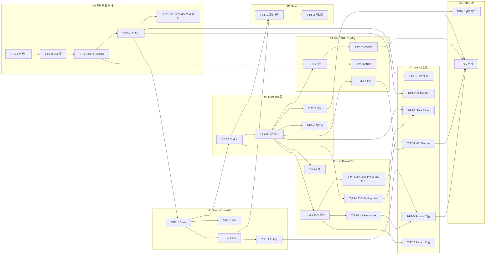

# Section Module v1.3.2 — Implementation Plan

> ABC IP 표준(`ip-standard.md`) 8섹션 고정 구조. **v0.1 초안** — Spec(OnePager) baseline 동결·사람 리뷰 7질문 통과 전까지 DAG 정확도·DoD 기계판정은 미검증.
>
> **본 프로젝트 특성(표준과의 차이):** 단일 **프론트엔드 WebGL 모듈**(`scp-section-poc`)이며 BE·DB·REST API가 없다. 따라서 DBML/Swagger = **N/A**(OnePager §Technical Description 참조), 별도 **TCL 문서 없음** → 테스트 케이스 ID는 본 IP에 **인라인 정의**(`UT-*` 자동 단위, `MT-*` 수동 시각). risk-tier(인증·결제·DB마이그레이션·PII) 해당 없음. **각 Task 카드에는 9필드 표(표준) 위에 완료 체크박스 `- [ ]`를 덧붙여 유인 진행 현황을 추적한다(9필드는 불변).**

## 1. Project Header

| 항목 | 값 |
|------|------|
| 프로젝트명 | section-module-v1.3.2 |
| PL | Raymond (전규현) |
| 작성 시작 | 2026-07-13 |
| **현재 버전** | **v0.3 (초안 — baseline 미확정, 파노라마 생성 모델 정정·MMI 재검토 반영)** |
| 관련 Spec 베이스라인 | Section OnePager **v1.6** (scp-architecture, **미커밋** — 커밋 후 SHA 동결) |
| 구현 Repo | `scp-section-poc` @ `23ac6ef` |
| 접목/참조 Repo | `cloudwebviewer` (Cloud Web Viewer, CW) @ `d063ae2` (embed 대상, 읽기·계약 참조) |
| Operating Mode 디폴트 | **유인 (Task 단위, 사람 확인·커밋)** — 무인 루프 미사용 |
| 단일/분리 세션 | **단일 세션** (Repo 1개·Task 32개·2주·1명 → ip-standard 4기준상 단일) |
| Slack 채널 | (해당 시 지정) |
| 무인 모드 Kill Switch | **N/A** — 무인 루프 인프라 미사용(유인 전용, §7) |

## 2. Spec Index

> Task 카드 `spec_refs[]`는 모두 이 인덱스 ID를 가리킨다. 외부(SharePoint/Jira/VKS) 문서는 git SHA가 없어 URL·`N/A(외부)`로 표기.

| ID | Repo/위치 | 경로 | 베이스라인 SHA | 비고 |
|----|-----------|------|--------------|------|
| **S-SPEC** | scp-architecture | `docs/…/Cloud Web Viewer v1.3.2/Section-Module-Spec-v1.3.2-OnePager.md` | **TBD: OnePager 커밋 후 동결 (담당 Raymond)** | Section 모듈 Spec 정본 v1.5 (요구·접목 계약 단일 출처) |
| S-PLAN2 | 개발계획 | `docs/…/Section-Module-개발계획.md` | TBD: 커밋 후 동결 | 내부 계획·Decision Log(D1~D10) |
| S-MMI | 외부(SharePoint) | [MMI PPT](https://vatechcorp.sharepoint.com/:p:/s/es/IQCjrxXEJ0pTQYGI9-PSaawwARs_XFxM0DuVBzvOYQBGVu0?e=ztkM8R) | N/A(외부) | 요구사항 정본 |
| S-PLAN | 외부(Jira) | [PLAN-1287](https://vts.vatech.com/browse/PLAN-1287) | N/A(외부) | 기획 답변·B/L |
| S-REVIEW | 외부(VKS) | [개발실 리뷰](https://vks.vatech.com/x/2_bhEg) | N/A(외부) | 공수·리스크·아키텍처 |
| S-POC | scp-section-poc | 레포 전체 (`packages/core`·`components`·`section-wasm`·`apps/section-demo`) | `23ac6ef` | 구현 출발 코드베이스 |
| S-CW | cloudwebviewer | `packages/core/src/toolbar/type.ts`·`store/`·`workSpace/…/ContentTitleBar.tsx`·`content/handler/`·`types/core/`·`lib/vtkjs-wrapper/…/projectFile.ts` | `d063ae2` | 접목 계약(InteractionType·useBoundStore·ContentHandler·prj 스키마·setting) |

## 3. Phase Breakdown

| Phase | 제목 | 목표 | 예상 | 도메인 |
|-------|------|------|:----:|--------|
| **P0** | 환경 정렬·경계 | scp-section-poc ↔ CW 버전·UI 스택·store·toolbar stub 정합 + CT 공급 인터페이스 추상화·외부 패널 (구현 착수 게이트) | 2일 | poc |
| **P1** | Scout·Curve·B/L | Draw/Edit curve UX, B/L 단일 규칙, BL/LB 기준점 | 2일 | poc |
| **P2** | Section Slice 스크롤 | 전체 slice 인덱싱·페이징·9장·slice number·최대화 (성능 핵심 §NFR) | 2일 | poc |
| **P3** | Pano/Scout 조작·Thickness | 드래그 핸들·경계선·중심선·thickness line·**파노라마 thin 재슬라이스·P/A offset 스윕(생성 모델 정정)**·Setting(combo·전 뷰 두께)·ruler 전체 축 | 2.5일 | poc |
| **P4** | Windowing/Filter·계측·Overlay | Image Filter, Length/Angle/FreeDraw/Arrow(section 스코프), Overlay 규칙(3D 좌표) | 1.5일 | poc |
| **P5** | Save Project | 데이터 모델·CW prj 스키마 매핑·직렬화·브라우저 임시저장 | 1일 | poc |
| **P7** | **MMI UI 정합(한땀 정합)** | **뷰 Title Bar·글로벌 바·per-panel Slice Slider·Image Info Overlay·Scout/Pano 렌더 스타일**을 MMI(§1.2·1.3·1.4)와 픽셀 단위 일치 | 1.5일 | poc |
| **P6** | NFR·인계 | Slice 스크롤 벤치마크→NFR, 공개 API·embed 매핑·Known gaps·데모 | 0.5일 | poc |

합계 ≈ 12.5일(예상 2주). 목표 1주는 P0·P1·P2 우선(핵심 신규) 기준.

**실행 전략 — Phase 번호 순차가 아니라 DAG 의존성 기반 interleaving.** P7(UI 정합)은 태스크를 한 곳에 모아 "빠짐없이" 추적하는 버킷이며, **실행은 각 P7 태스크의 선행(P2/P3/P4)이 끝나는 즉시** 수행한다(기능 완성 → 그 UI를 바로 MMI에 정합 → 실데이터로 시각 검증). 정적 크롬(T-P7-1/2, T-P7-3 골격)은 P0 셸 직후 이미 착수. 이후 순서: P1-4 → P2 → (T-P7-3 실배선·T-P7-4 slice번호/방향) → P3 → (T-P7-6·T-P7-4 Th/INT·T-P3-4 ruler) → P4 → (T-P7-5·T-P7-4 W/L) → P5 → P6. §5 DAG가 이 순서를 규정한다.

## 4. Task Cards

> 9필드 고정. `spec_refs[]`는 §2 ID. `dod[]`의 `UT-*`=자동 단위(vitest), `MT-*`=수동 시각/상호작용(본 IP 인라인 정의). 검증 명령 기준: `corepack pnpm@9.15.9 …`.

### P0 — 환경 정렬

#### T-P0-1 — 버전 핀 고정

- [x] **완료** — DoD(§6) 항목 통과 시 체크 (install·build 4/4·dev :5173 확인)

| 필드 | 값 |
|------|------|
| id | T-P0-1 |
| title | root+section-demo 버전 핀 (pnpm 9.15.9·node 20·vite 5·react 18.2·ts 5.2) |
| repo | scp-section-poc |
| spec_refs[] | S-SPEC §9.3, S-PLAN2 §10.1, S-CW `d063ae2`(버전 정본) |
| depends_on[] | (없음 — 시작) |
| outputs[] | `package.json`, `apps/section-demo/package.json`, `pnpm-lock.yaml` |
| dod[] | UT-ENV-001(`corepack pnpm@9.15.9 install` 성공) + UT-ENV-002(`corepack pnpm@9.15.9 build` 4/4 통과) + MT-ENV-003 dev 서버 `:5173` 기동 |
| estimate | 1h |
| risk | Vite 6→5 config 비호환(현재 표준 API만 사용, 낮음) |

#### T-P0-2 — UI 스택·registry 도입

- [x] **완료** — DoD(§6) 항목 통과 시 체크 (MUI·Emotion·zustand·Lingui 설치·.npmrc·build 통과)

| 필드 | 값 |
|------|------|
| id | T-P0-2 |
| title | MUI 5.15·Emotion 11.11·zustand 4.4.7·@lingui/react 4.7 추가 + `.npmrc`(@ewoosoft registry, 토큰 제외) |
| repo | scp-section-poc |
| spec_refs[] | S-SPEC §9.3·§9.5, S-PLAN2 §10.1 |
| depends_on[] | T-P0-1 |
| outputs[] | `apps/section-demo/package.json`, `.npmrc` |
| dod[] | UT-ENV-011(install 성공) + UT-ENV-012(build 통과) |
| estimate | 0.5h |
| risk | (낮음) 공개 npm 패키지 |

#### T-P0-3 — CW 계약 미러 store + Toolbar stub + core-types link

- [x] **완료** — DoD(§6) 항목 통과 시 체크 (toolStore 단위 5/5·core-types link tsc 통과·Toolbar 시각은 T-P0-4 dev 확인)

| 필드 | 값 |
|------|------|
| id | T-P0-3 |
| title | zustand toolStore(InteractionType 미러+`arrow`)·CW 토큰 MUI Toolbar stub·`@cloudwebviewer/core-types` link |
| repo | scp-section-poc |
| spec_refs[] | S-SPEC §9.6·§9.2, S-CW `packages/core/src/toolbar/type.ts`#InteractionType·`toolbar/const.ts`#TOOL_POLICY·`types/core`@d063ae2 |
| depends_on[] | T-P0-2 |
| outputs[] | `apps/section-demo/src/cw/toolContract.ts`, `cw/toolStore.ts`, `cw/CwToolbar.tsx` |
| dod[] | UT-ENV-021(toolStore activate/deactivate/setFeature 단위) + UT-ENV-022(core-types 타입 import 빌드) + MT-ENV-023 Toolbar가 CW 토큰(#141414·36px·hover rgba(0,190,165,0.4))으로 렌더 |
| estimate | 2h |
| risk | **CW core는 federation 앱이라 Toolbar 직접 import 불가(§9 확인) → stub로 구현**. core-types만 link |

#### T-P0-4 — 데모 셸 조립·검증

- [x] **완료** — DoD(§6) 항목 통과 시 체크 (Toolbar+MPR/Section 선택+SectionViewer 조립·build 974모듈·dev :5173)

| 필드 | 값 |
|------|------|
| id | T-P0-4 |
| title | App = Toolbar + MPR/Section 선택 stub + SectionViewer 세로 조립, image23 정합 |
| repo | scp-section-poc |
| spec_refs[] | S-SPEC §2, S-MMI §1.1·§1.2 |
| depends_on[] | T-P0-3 |
| outputs[] | `apps/section-demo/src/App.tsx` |
| dod[] | MT-ENV-031 3영역+Toolbar가 image23·Slide7과 한 화면으로 정합 + UT-ENV-032(build/dev 통과) |
| estimate | 1.5h |
| risk | (낮음) |

#### T-P0-5 — CT 공급 인터페이스 추상화 + 외부 CT 패널

- [x] **완료** — DoD(§6) 항목 통과 시 체크 (SectionCtProvider+S3 impl·UT-ENV-041·좌측 CtSourcePanel·SectionViewer는 volume만 소비)

| 필드 | 값 |
|------|------|
| id | T-P0-5 |
| title | `SectionCtProvider` 계약(+S3 시뮬 구현)으로 CT 공급 추상화, CT 선택을 Section 뷰 밖 좌측 패널로 분리 |
| repo | scp-section-poc |
| spec_refs[] | S-SPEC §1·§9.4, S-CW `types/core/src/content.ts`#IContainerApis.contentIOApis@d063ae2 |
| depends_on[] | T-P0-4 |
| outputs[] | `packages/components/src/ct/SectionCtProvider.ts`, `CtSourcePanel.tsx`, `index.ts`, `apps/section-demo/src/App.tsx` |
| dod[] | UT-ENV-041(provider listCases 계약 단위) + MT-ENV-042 좌측 CT 패널 로드→Section 3영역 표시, CT 선택이 Section 뷰 밖 |
| estimate | 1h |
| risk | 접목 시 S3 provider → CW `contentIOApis` provider로 교체(주입점 유지) |

### P1 — Scout·Curve·B/L

#### T-P1-1 — Draw Curve UX 정합

- [x] **완료** — DoD(§6) 항목 통과 시 체크 (UT-CRV-001~003 core 4/4 + useCurveEditor hook 6/6·ESC 미적용·1점더블클릭 무시·우클릭 취소·완료 후 생성 게이트·build/dev)

| 필드 | 값 |
|------|------|
| id | T-P1-1 |
| title | ESC 제거·1점 더블클릭 무시(종료 point≥2)·Section/Pano는 curve 완료 후 1회 생성·Active line 실시간 |
| repo | scp-section-poc |
| spec_refs[] | S-SPEC §6·§3.2, S-MMI §1.5, S-PLAN(comment 7/7) |
| depends_on[] | T-P0-4 |
| outputs[] | `packages/components/src/ScoutView.tsx`, `hooks/useCurveEditor.ts` |
| dod[] | UT-CRV-001(종료는 point≥2)·UT-CRV-002(1점 더블클릭 무시)·UT-CRV-003(우클릭 직전 취소) + MT-CRV-004 완료 전 Section blank·완료 후 1회 생성 |
| estimate | 2h |
| risk | 완료 게이트 누락 시 매 점 재생성(성능) |

#### T-P1-2 — Edit Curve·context menu

- [x] **완료** — DoD(§6) 항목 통과 시 체크 (UT-CRV-011/012 + edit ops 5개 hook 통과·context menu Add/Delete Point·Delete Curve 확인 다이얼로그·L/B Switching(Scout 라벨)·최소 2점. Section 타일 B/L는 T-P1-3)

| 필드 | 값 |
|------|------|
| id | T-P1-2 |
| title | Add/Delete Point·Delete Curve(확인 다이얼로그)·L/B Switching, 최소 2점 제약 |
| repo | scp-section-poc |
| spec_refs[] | S-SPEC §3.1(1.6)·§3.2, S-MMI §1.6 |
| depends_on[] | T-P1-1 |
| outputs[] | `packages/components/src/ScoutView.tsx`, `hooks/useCurveEditor.ts` |
| dod[] | UT-CRV-011(최소 2점 삭제 불가)·UT-CRV-012(point add/delete 후 spline 재연결) + MT-CRV-013 Delete Curve 확인 box·Pano/Section 초기화 |
| estimate | 2.5h |
| risk | context menu·drag 충돌 |

#### T-P1-3 — B/L blPolarity (단일 규칙)

- [x] **완료** — DoD(§6) 항목 통과 시 체크 (UT-BL-001 core 3/3·UT-BL-002 hook 1회고정·L/B Switching(UT-BL-003 T-P1-2)·Scout+Section 타일 라벨 blPolarity 반영·더블클릭 종료 시 자동판정)

| 필드 | 값 |
|------|------|
| id | T-P1-3 |
| title | P1→P2 선분·C쪽=L 규칙, 최초 2점 1회 고정, Scout/Section 라벨·픽셀 열 반전 연동 |
| repo | scp-section-poc |
| spec_refs[] | S-SPEC §5, S-PLAN(2026-07-13 B/L 회신), S-MMI §1.3 |
| depends_on[] | T-P1-1 |
| outputs[] | `packages/core/src/bl/blPolarity.ts`, `components/src/SectionGrid.tsx` |
| dod[] | UT-BL-001(중앙 타일 법선 n̂·C 내적 부호 판정 — 점 순서 무관)·UT-BL-002(최초 2점 후 편집에 재판정 없음)·UT-BL-003(L/B Switching 토글) + MT-BL-004 Scout/Section B·L 라벨 방향 일치(좌→우·우→좌 모두 C쪽=L) |
| estimate | 2h |
| risk | 좌표계(objectFit contain) 변환 오차 |

#### T-P1-4 — BL/LB 기준점

- [ ] **완료** — DoD(§6) 항목 통과 시 체크

| 필드 | 값 |
|------|------|
| id | T-P1-4 |
| title | 첫 점 시각 표식(연두 삼각형) + drag 이동(section line 스냅, B/L 무영향) |
| repo | scp-section-poc |
| spec_refs[] | S-SPEC §5(기준점)·§3.1(1.6·1.7), S-MMI §1.3#8 |
| depends_on[] | T-P1-3 |
| outputs[] | `packages/components/src/ScoutView.tsx` |
| dod[] | UT-BL-011(기준점 이동 시 blPolarity 불변) + MT-BL-012 삼각형 표식 hover·drag |
| estimate | 1.5h |
| risk | MMI 1.3#8① 반전 폐기 정합(§5) |

### P2 — Section Slice 스크롤 (핵심 신규)

#### T-P2-1 — 전체 slice 인덱싱·페이징 모델

- [ ] **완료** — DoD(§6) 항목 통과 시 체크

| 필드 | 값 |
|------|------|
| id | T-P2-1 |
| title | Section line(전체) vs Active 9 window 상태 모델·총 개수·시작 인덱스 |
| repo | scp-section-poc |
| spec_refs[] | S-SPEC §3.1(1.9), S-REVIEW §3.2·§4.2, S-MMI §1.9 |
| depends_on[] | T-P1-1 |
| outputs[] | `packages/core/src/section/section.ts`, `components/src/hooks/useScoutAxialUi.ts` |
| dod[] | UT-SEC-001(전체 slice 개수 산출)·UT-SEC-002(9 window 인덱스 경계) |
| estimate | 2h |
| risk | 중심 9장→전체 인덱싱 전환 회귀 |

#### T-P2-2 — Slice 이동·동기

- [ ] **완료** — DoD(§6) 항목 통과 시 체크

| 필드 | 값 |
|------|------|
| id | T-P2-2 |
| title | 휠·slider slice 이동 + slice number + Scout/Pano Active line 동기 |
| repo | scp-section-poc |
| spec_refs[] | S-SPEC §3.1(1.9), S-MMI §1.9 |
| depends_on[] | T-P2-1 |
| outputs[] | `packages/components/src/SectionGrid.tsx`·`ScoutView.tsx`·`PanoramaView.tsx` |
| dod[] | UT-SEC-011(slice 인덱스→9장 매핑)·UT-SEC-012(양방향 Active line 동기) + MT-SEC-013 휠 이동 시 Scout/Pano 선 동기 |
| estimate | 2.5h |
| risk | 3뷰 상호 동기 순환 갱신 |

#### T-P2-3 — 재생성 성능(캐싱·디바운스·표시 분리)

- [ ] **완료** — DoD(§6) 항목 통과 시 체크

| 필드 | 값 |
|------|------|
| id | T-P2-3 |
| title | 생성 slice 캐시·디바운스(≥48ms)·이전 이미지 유지 표시 분리 |
| repo | scp-section-poc |
| spec_refs[] | S-SPEC §8(NFR), S-REVIEW §7 |
| depends_on[] | T-P2-2 |
| outputs[] | `packages/components/src/SectionViewer.tsx`, `core/src/section/section.ts` |
| dod[] | UT-SEC-021(캐시 hit 시 재생성 skip)·UT-SEC-022(디바운스 seq 취소) + MT-SEC-023 스크롤 중 이전 이미지 유지 |
| estimate | 2h |
| risk | 캐시 무효화 타이밍·메모리 |

#### T-P2-4 — 최대화

- [ ] **완료** — DoD(§6) 항목 통과 시 체크

| 필드 | 값 |
|------|------|
| id | T-P2-4 |
| title | 3×3 최대화 유지 확장 + 개별 slice 더블클릭 최대화 |
| repo | scp-section-poc |
| spec_refs[] | S-SPEC §3.1(1.9), S-MMI §1.9-3 |
| depends_on[] | T-P2-2 |
| outputs[] | `packages/components/src/SectionGrid.tsx` |
| dod[] | UT-SEC-031(최대화 상태 전이) + MT-SEC-032 더블클릭 개별 최대화 |
| estimate | 1h |
| risk | (낮음) |

### P3 — Pano/Scout 조작·Thickness

#### T-P3-1 — Scout Active line 이동·폭 조절

- [ ] **완료** — DoD(§6) 항목 통과 시 체크

| 필드 | 값 |
|------|------|
| id | T-P3-1 |
| title | Active line drag 이동 + Center line control point 대칭 드래그로 폭 조절(slider 대체/병행) |
| repo | scp-section-poc |
| spec_refs[] | S-SPEC §3.1(1.7), S-MMI §1.7, S-REVIEW §5(1.7) |
| depends_on[] | T-P2-2 |
| outputs[] | `packages/components/src/ScoutView.tsx` |
| dod[] | UT-CTL-001(폭 대칭 조정)·UT-CTL-002(폭→재생성 트리거) + MT-CTL-003 드래그 핸들 |
| estimate | 2h |
| risk | 드래그 중 연속 재생성 부하 |

#### T-P3-2 — Panorama 경계선·중심선 이동

- [ ] **완료** — DoD(§6) 항목 통과 시 체크

| 필드 | 값 |
|------|------|
| id | T-P3-2 |
| title | 경계선(세로폭 대칭)·중심선 이동(drop 시 3뷰 갱신·Scout 위치선 동기) |
| repo | scp-section-poc |
| spec_refs[] | S-SPEC §3.1(1.8), S-MMI §1.8 |
| depends_on[] | T-P2-2 |
| outputs[] | `packages/components/src/PanoramaView.tsx` |
| dod[] | UT-CTL-011(경계선 100mm 대칭)·UT-CTL-012(중심선 이동→3뷰 갱신) + MT-CTL-013 드래그 |
| estimate | 2h |
| risk | ±45° 회전은 스펙아웃(구현 금지) |

#### T-P3-3 — Panorama thickness line

- [ ] **완료** — DoD(§6) 항목 통과 시 체크

| 필드 | 값 |
|------|------|
| id | T-P3-3 |
| title | thickness line control point 대칭 드래그 → Pano thickness 실시간, **combo와 동일 30mm cap**(단일 `MAX_THICKNESS_MM`) |
| repo | scp-section-poc |
| spec_refs[] | S-SPEC §3.1(1.3·1.7)·§8·§12-D8, S-MMI §1.7-3 |
| depends_on[] | T-P3-2 |
| outputs[] | `packages/components/src/PanoramaView.tsx`, `core/src/panorama/panorama.ts` |
| dod[] | UT-CTL-021(thickness 대칭·overlay 반영)·UT-CTL-023(드래그 상한 30mm clamp — combo와 동일) + MT-CTL-022 드래그 |
| estimate | 1h |
| risk | (낮음) |

#### T-P3-4 — Thickness 0mm·Setting UI·ruler

- [ ] **완료** — DoD(§6) 항목 통과 시 체크

| 필드 | 값 |
|------|------|
| id | T-P3-4 |
| title | 각 뷰 Setting 다이얼로그(**Thickness combo {0,0.1,0.5,1,2,3,5,10,20,30}mm** + drag off-list 값·**Interval: Scout=Voxel Based·Pano/Section=1mm**)·**Section slab 두께 노출**(Scout·Pano·Section 전 뷰)·Th 기본 0mm(slabHalfWidthMm=0)·ruler 전체 축. 상한 30mm는 드래그와 단일 `MAX_THICKNESS_MM`(T-P3-3) |
| repo | scp-section-poc |
| spec_refs[] | S-SPEC §3.1(1.2·1.10)·§3.3·§8, S-MMI §1.10(Slide20·27)·§1.2, S-CW `types/core/src/setting.ts`#SLICE_THICKNESSES@d063ae2 |
| depends_on[] | T-P2-1 |
| outputs[] | `packages/core/src/panorama/panorama.ts`·`section/section.ts`, `components/src/*`(Setting 다이얼로그·SectionTileChrome) |
| dod[] | UT-SET-001(Th=0 경로 픽셀)·UT-SET-002(combo 옵션값·상한 30mm·off-list drag 값 표시)·UT-SET-005(Section slab 두께 적용)·UT-SET-003(ruler 전체 축 눈금) + MT-SET-004 Setting UI(Th combo·Interval Voxel Based) |
| estimate | 2.5h |
| risk | Th=0 경계 케이스(슬랩 루프)·전 뷰 두께 배선 |

#### T-P3-5 — 파노라마 생성 모델 정정 (thin 재슬라이스 + P/A offset 스윕)

- [ ] **완료** — DoD(§6) 항목 통과 시 체크

| 필드 | 값 |
|------|------|
| id | T-P3-5 |
| title | 파노라마를 **thin 기본(Th0) 재슬라이스**로 정정 + **P/A 슬라이더 → 곡선 법선 offset 스윕**(navigator 위치에서 재생성) + Scout **Panorama navigator line** 동기 + 투영 방식 파라미터(기본값 D12 대기, MIP/mean 전환 가능). T-P7-3 Pano P/A 실배선 완성 |
| repo | scp-section-poc |
| spec_refs[] | S-SPEC §3.3·§3.1(1.3·1.8)·§12-D11·D12, S-MMI §1.3-5·§1.8-5, S-PLAN(2026-07-13 파노라마 회신) |
| depends_on[] | T-P3-2 |
| outputs[] | `packages/core/src/panorama/panorama.ts`(offset 재슬라이스·투영 param), `components/src/PanoramaView.tsx`·`ScoutView.tsx`(navigator line·P/A slider) |
| dod[] | UT-PAN-001(navigator offset≠0 시 재슬라이스 곡선이 법선방향 이동)·UT-PAN-002(투영 param MIP↔mean 전환)·UT-PAN-003(Th0 thin 경로) + MT-PAN-004 P/A 스윕 시 Scout navigator line 동기·파노라마 깊이 변화 |
| estimate | 3h |
| risk | **D12(max/mean) 미확정** — 기본 투영값은 파라미터로 두고 확정 시 스위치. offset 재슬라이스 곡선 생성 신규 |

### P4 — Windowing/Filter·계측·Overlay

#### T-P4-1 — Image Filter MPR→Section

- [ ] **완료** — DoD(§6) 항목 통과 시 체크

| 필드 | 값 |
|------|------|
| id | T-P4-1 |
| title | W/L + Smooth/Sharpen/Max Sharpen/Inverse/MIP, 전 단면 일괄·좌상단 text·뷰 간 동기 |
| repo | scp-section-poc |
| spec_refs[] | S-SPEC §3.1(1.11), S-MMI §1.11, S-REVIEW §4.4 |
| depends_on[] | T-P2-2 |
| outputs[] | `packages/core/src/section/section.ts`·`panorama/panorama.ts`, `components/src/*` |
| dod[] | UT-FLT-001(각 필터 커널)·UT-FLT-002(뷰 간 W/L 동기) + MT-FLT-003 필터 시각 |
| estimate | 2h |
| risk | 필터별 화질·성능 |

#### T-P4-2 — 계측 Length/Angle·Free Draw

- [ ] **완료** — DoD(§6) 항목 통과 시 체크

| 필드 | 값 |
|------|------|
| id | T-P4-2 |
| title | Length/Angle 측정 + Free Draw, 각 section slice 스코프(경계 넘나들 불가) |
| repo | scp-section-poc |
| spec_refs[] | S-SPEC §3.1(1.12·1.13), S-MMI §1.12·§1.13, S-CW `toolbar/type.ts`#InteractionType@d063ae2 |
| depends_on[] | T-P0-3, T-P2-2 |
| outputs[] | `packages/components/src/SectionGrid.tsx`, `cw/toolStore.ts` |
| dod[] | UT-MEA-001(length 계산)·UT-MEA-002(section 스코프 제약) + MT-MEA-003 계측 상호작용 |
| estimate | 2.5h |
| risk | tool store↔뷰 handler 연동 |

#### T-P4-3 — Arrow 툴 신규

- [ ] **완료** — DoD(§6) 항목 통과 시 체크

| 필드 | 값 |
|------|------|
| id | T-P4-3 |
| title | Arrow InteractionType 신규(2클릭 시작·끝), section 스코프. CW 패턴 준수 |
| repo | scp-section-poc |
| spec_refs[] | S-SPEC §3.1(1.12)·§9.6, S-MMI §1.12-3, S-CW `toolbar/type.ts`·`toolbar/const.ts`@d063ae2 |
| depends_on[] | T-P4-2 |
| outputs[] | `apps/section-demo/src/cw/toolContract.ts`, `components/src/SectionGrid.tsx` |
| dod[] | UT-ARR-001(2클릭 arrow 생성)·UT-ARR-002(TOOL_POLICY 정합) + MT-ARR-003 arrow 렌더 |
| estimate | 1.5h |
| risk | 접목 시 CW core 역머지 필요(Known gap) |

#### T-P4-4 — Overlay 표시 규칙(3D 좌표)

- [ ] **완료** — DoD(§6) 항목 통과 시 체크

| 필드 | 값 |
|------|------|
| id | T-P4-4 |
| title | Overlay를 Curve+평면(point,normal)·환자 볼륨 3D 좌표 귀속. 표시 = 거리≤±Interval/2 & normal≤5° |
| repo | scp-section-poc |
| spec_refs[] | S-SPEC §4, S-MMI §1.13-6, S-REVIEW §3.3 |
| depends_on[] | T-P4-2 |
| outputs[] | `packages/core/src/section/section.ts`(overlay plane), `components/src/*` |
| dod[] | UT-OVL-001(거리 판정)·UT-OVL-002(normal 각 임계)·UT-OVL-003(Interval 변경 후 복귀 재표시) + MT-OVL-004 curve 변경 시 일시 미표시 |
| estimate | 2h |
| risk | normal 허용 오차 5° 튜닝(D3, 상수 분리) |

### P5 — Save Project

#### T-P5-1 — 데이터 모델·CW prj 스키마 매핑

- [ ] **완료** — DoD(§6) 항목 통과 시 체크

| 필드 | 값 |
|------|------|
| id | T-P5-1 |
| title | 저장 항목→CW prj XML 필드 매핑(Curve/Section/Pano/blPolarity/기준점/Th·INT/Overlay/W-L) |
| repo | scp-section-poc |
| spec_refs[] | S-SPEC §7·§9.5, S-MMI §1.14, S-CW `lib/vtkjs-wrapper/src/common/defines/projectFile.ts`#CurveList,SectionInfo,PanoInfo@d063ae2 |
| depends_on[] | T-P1-3, T-P2-1 |
| outputs[] | `packages/core/src/project/projectModel.ts` |
| dod[] | UT-SAV-001(모델↔CW 필드 매핑 표 검증)·UT-SAV-002(회전 각도 항목 제외) |
| estimate | 2h |
| risk | CW prj 필드 실제 구조 확인 필요(D5, CW팀) |

#### T-P5-2 — 직렬화 API·브라우저 임시저장

- [ ] **완료** — DoD(§6) 항목 통과 시 체크

| 필드 | 값 |
|------|------|
| id | T-P5-2 |
| title | serialize/deserialize API + localStorage/export·import(payload=CW prj 구조 동일) |
| repo | scp-section-poc |
| spec_refs[] | S-SPEC §7(개발 임시저장), S-MMI §1.14-2 |
| depends_on[] | T-P5-1 |
| outputs[] | `packages/core/src/project/serialize.ts`, `apps/section-demo/src/save/` |
| dod[] | UT-SAV-011(직렬화 round-trip 무손실)·UT-SAV-012(Curve 없음→blank 복원) + MT-SAV-013 데모 저장/재오픈 |
| estimate | 2h |
| risk | prj Curve 없음 예외(§7) |

### P6 — NFR·인계

#### T-P6-1 — Slice 스크롤 벤치마크→NFR

- [ ] **완료** — DoD(§6) 항목 통과 시 체크

| 필드 | 값 |
|------|------|
| id | T-P6-1 |
| title | Section Slice 스크롤 worst-case 측정(`SectionGen` 로그)→NFR 목표 수치 확정 |
| repo | scp-section-poc |
| spec_refs[] | S-SPEC §8·§12(D7), S-REVIEW §7 |
| depends_on[] | T-P2-3 |
| outputs[] | `docs/benchmark-section-scroll.md`(poc), 콘솔 로그 수집 |
| dod[] | UT-NFR-001(SectionGen 로그 mode·ms 수집) + MT-NFR-002 스크롤 worst-case 프레임 예산 기록·NFR 반영 |
| estimate | 1h |
| risk | 목표 미달 시 정책(디바운스·캐시) 재조정 |

#### T-P6-2 — 공개 API·인계 패키지

- [ ] **완료** — DoD(§6) 항목 통과 시 체크

| 필드 | 값 |
|------|------|
| id | T-P6-2 |
| title | SectionViewer props 확장(curve·blPolarity·interaction·콜백)·embed 매핑 문서·Known gaps·데모 URL |
| repo | scp-section-poc |
| spec_refs[] | S-SPEC §10·§9.7, S-PLAN2 §12 |
| depends_on[] | T-P5-2, T-P4-4 |
| outputs[] | `packages/components/src/index.ts`(API), `README.md`, `docs/handoff.md`(embed 매핑·Known gaps) |
| dod[] | UT-API-001(공개 API 타입 export 빌드) + MT-API-002 embed 매핑·Known gaps 문서 리뷰 |
| estimate | 1.5h |
| risk | (낮음) |

### P7 — MMI UI 정합 (한땀 정합)

> MMI §1.2(Section Layout Overview)·§1.3(Scout Curve 요소)·§1.4(Panorama Line 요소)가 규정하는 **뷰 크롬·정보 오버레이·렌더 스타일**을 PoC와 픽셀 단위로 일치시킨다. 기존 P1~P4 태스크는 **동작(behavior)**을, P7은 **시각 정합(chrome·overlay·style)**을 담당하며 중복 항목은 서로 참조한다(ruler=T-P3-4, slice number=T-P2-2, B/L 라벨=T-P1-3). MMI가 명시한 "PoC와 상이" 크롬 차이를 모두 태스크화한다.

#### T-P7-1 — 글로벌 상단 바 (Patient·MPR/Section·Save)

- [x] **완료** — 2026-07-13 App.tsx 글로벌 바(Patient stub·CT/MPR/Section 토글·Save 디스켓) MMI 정합, 사용자 시각 확인. UT-UI-001(토글 상태 전이)은 App 레벨이라 MT로 확인

| 필드 | 값 |
|------|------|
| id | T-P7-1 |
| title | 상단 글로벌 바: Patient 정보 strip(좌)·CT / [MPR] / [Section] 토글(중앙)·Save 디스켓(우), CW 헤더 토큰 픽셀 정합 |
| repo | scp-section-poc |
| spec_refs[] | S-SPEC §3.1(1.1·1.2), S-MMI §1.1·§1.2, S-CW `workSpace/…/ContentTitleBar.tsx`@d063ae2 |
| depends_on[] | T-P0-4 |
| outputs[] | `apps/section-demo/src/App.tsx`, `apps/section-demo/src/cw/*` |
| dod[] | UT-UI-001(MPR/Section 토글 상태 전이) + MT-UI-002 Patient strip·토글·Save 아이콘이 MMI 상단 바와 배치·토큰 정합 |
| estimate | 1.5h |
| risk | Patient 데이터는 provider(§T-P0-5)에서 주입(placeholder 허용) |

#### T-P7-2 — 3-뷰 Title Bar 골격 (라벨·Curve 관리·아이콘 클러스터)

- [x] **완료** — 2026-07-13 공용 `ViewTitleBar.tsx` 신규(라벨·slider·Image Adjust/Setting/최대화 아이콘). Scout Curve 관리(Draw↔Curve1 chip+편집+삭제) 토글, dev 컨트롤은 Setting 뒤로. 사용자 시각 확인(골격 정합). 세부 픽셀 폴리시는 T-P7-4/5/6 병행

| 필드 | 값 |
|------|------|
| id | T-P7-2 |
| title | Scout/Panorama/Section 각 뷰 상단 Title Bar: 뷰 라벨 + 우측 아이콘(Image Adjust·Setting·최대화). Scout는 Curve 관리 영역(curve 無=[Draw Curve], 有=Curve번호+[편집]+[삭제] 토글) |
| repo | scp-section-poc |
| spec_refs[] | S-SPEC §3.1(1.2), S-MMI §1.2(각 뷰 e)·§1.5-1·§1.6-1, S-CW `workSpace/…/ContentTitleBar.tsx`@d063ae2 |
| depends_on[] | T-P0-4 |
| outputs[] | `packages/components/src/ScoutView.tsx`·`PanoramaView.tsx`·`SectionGrid.tsx`(또는 신규 `ViewTitleBar.tsx`) |
| dod[] | UT-UI-011(Curve 유무에 따른 Scout 헤더 토글: Draw ↔ 번호+편집+삭제) + MT-UI-012 3-뷰 Title Bar가 MMI 라벨·아이콘 배치와 정합 |
| estimate | 2h |
| risk | Image Adjust/Setting 다이얼로그 동작은 P3-4·P4-1, 여기선 헤더 트리거만 |

#### T-P7-3 — Per-panel Slice Slider (H/F · P/A · R/L)

- [ ] **완료** — (진행) 골격·방향 라벨(H/F·P/A·R/L) 렌더 완료. **Scout H/F → sliceIndex 실배선 완료**. Section R/L은 **T-P2-2**, **Pano P/A는 T-P3-5(파노라마 P/A offset 스윕)** 완료 후 실배선 (현재 시각 placeholder)

| 필드 | 값 |
|------|------|
| id | T-P7-3 |
| title | PoC의 별도 슬라이더 박스 → 각 뷰 Title Bar 내장 slice slider로 이관. 방향 라벨 Scout **H/F**·Pano **P/A**·Section **R/L**, 휠과 동기 |
| repo | scp-section-poc |
| spec_refs[] | S-SPEC §3.1(1.2), S-MMI §1.2-1d·2c·3c, §1.7-4·§1.8-5·§1.9-1 |
| depends_on[] | T-P2-2 |
| outputs[] | `packages/components/src/ScoutView.tsx`·`PanoramaView.tsx`·`SectionGrid.tsx`, `hooks/useScoutAxialUi.ts` |
| dod[] | UT-UI-021(slider↔slice 인덱스 양방향)·UT-UI-022(방향 라벨 매핑 H/F·P/A·R/L) + MT-UI-023 슬라이더 위치·라벨이 MMI와 정합, 휠 동기 |
| estimate | 2h |
| risk | slice 모델(P2) 의존 — 인덱스 경계 회귀 |

#### T-P7-4 — Image Information Overlay (3뷰)

- [ ] **완료** — DoD(§6) 항목 통과 시 체크

| 필드 | 값 |
|------|------|
| id | T-P7-4 |
| title | 뷰별 정보 오버레이: Patient(좌상, Scout)·W/L+Filter(우상, 3뷰)·방향표기 R/L(Scout·Pano 상단)·B/L(Section 상단)·Th/INT/Total Slice(우하)·slice number(Section 좌상, center bold). MMI 위치 규격 정합 |
| repo | scp-section-poc |
| spec_refs[] | S-SPEC §3.1(1.2·1.10)·§5, S-MMI §1.2-b·§1.10-3②③·§1.9-2 |
| depends_on[] | T-P3-4, T-P4-1 |
| outputs[] | `packages/components/src/SectionTileChrome.tsx`·`ScoutView.tsx`·`PanoramaView.tsx` |
| dod[] | UT-UI-031(Th/INT/Total Slice 텍스트 값 반영)·UT-UI-032(center slice number bold) + MT-UI-033 Patient·W/L·Filter·방향표기 위치가 MMI와 정합 |
| estimate | 2h |
| risk | W/L·Th/INT 값 소스(P3·P4) 선행. 미완 항목 placeholder |

#### T-P7-5 — Scout Curve 렌더 스타일 정합 (MMI §1.3)

- [ ] **완료** — DoD(§6) 항목 통과 시 체크

| 필드 | 값 |
|------|------|
| id | T-P7-5 |
| title | Scout curve 요소 색·글리프·라벨을 MMI와 정합: Section line(빨강 수직)·Active section line(9 빨강)·Center line(노랑+control point square)·Panorama navigator line(초록 offset)·thickness line(초록 한 쌍+control point)·L/B(흰 text)·arc mm 눈금 라벨(20 간격)·호장 길이 텍스트 |
| repo | scp-section-poc |
| spec_refs[] | S-SPEC §3.1(1.3), S-MMI §1.3(요소 1~8) |
| depends_on[] | T-P1-4, T-P3-3 |
| outputs[] | `packages/components/src/ScoutView.tsx` |
| dod[] | UT-UI-041(요소별 색·control point 좌표 산출) + MT-UI-042 Scout 선/점/라벨 스타일이 MMI Scout와 정합(색·점선·square·번호·호장 텍스트) |
| estimate | 2h |
| risk | 요소 다수 — 색/굵기 상수 분리(스타일 토큰화) |

#### T-P7-6 — Panorama 렌더 스타일 정합 (MMI §1.4)

- [ ] **완료** — DoD(§6) 항목 통과 시 체크

| 필드 | 값 |
|------|------|
| id | T-P7-6 |
| title | Panorama line 요소를 MMI와 정합: 이미지 경계선(노랑 가로 실선)·중심선(초록 가로 실선)·Scout 위치선(흰 가로 점선)·Active/Center section line(세로, center 별색) |
| repo | scp-section-poc |
| spec_refs[] | S-SPEC §3.1(1.8), S-MMI §1.4(요소 1~4) |
| depends_on[] | T-P3-2 |
| outputs[] | `packages/components/src/PanoramaView.tsx` |
| dod[] | UT-UI-051(각 선 색·좌표 산출) + MT-UI-052 Panorama 선 스타일이 MMI Panorama와 정합(경계 노랑·중심 초록·위치선 흰 점선) |
| estimate | 1.5h |
| risk | (낮음) |

## 5. Dependency DAG

순환 없음. 같은 subgraph 내 분기 노드(T-P3-1/2/4, T-P4-1/2)는 병렬 가능. **P7 정적 크롬(T-P7-1/2/3)은 P0 셸 직후 착수 가능**하며, 스타일·오버레이(T-P7-4/5/6)는 데이터 태스크(P3·P4·P1-4) 완료분에 의존한다.

## 6. DoD Mapping

| Task | DoD 케이스 | 자동/수동 | 검증 명령 |
|------|-----------|:--------:|----------|
| T-P0-1 | UT-ENV-001/002, MT-ENV-003 | 혼합 | `corepack pnpm@9.15.9 install && build`; dev 수동 |
| T-P0-2 | UT-ENV-011/012 | 자동 | `corepack pnpm@9.15.9 install && build` |
| T-P0-3 | UT-ENV-021/022, MT-ENV-023 | 혼합 | `pnpm --filter section-demo test`; Toolbar 시각 수동 |
| T-P0-4 | UT-ENV-032, MT-ENV-031 | 혼합 | build/dev; image23 정합 수동 |
| T-P0-5 | UT-ENV-041, MT-ENV-042 | 혼합 | `pnpm --filter …components test`; 좌측 CT 패널 로드 수동 |
| T-P1-1 | UT-CRV-001~003, MT-CRV-004 | 혼합 | `pnpm --filter …components test`; blank/생성 수동 |
| T-P1-2 | UT-CRV-011/012, MT-CRV-013 | 혼합 | vitest; 다이얼로그 수동 |
| T-P1-3 | UT-BL-001~003, MT-BL-004 | 혼합 | `pnpm --filter …core test`; 라벨 방향 수동 |
| T-P1-4 | UT-BL-011, MT-BL-012 | 혼합 | vitest; 드래그 수동 |
| T-P2-1 | UT-SEC-001/002 | 자동 | `pnpm --filter …core test` |
| T-P2-2 | UT-SEC-011/012, MT-SEC-013 | 혼합 | vitest; 동기 수동 |
| T-P2-3 | UT-SEC-021/022, MT-SEC-023 | 혼합 | vitest; 표시분리 수동 |
| T-P2-4 | UT-SEC-031, MT-SEC-032 | 혼합 | vitest; 더블클릭 수동 |
| T-P3-1 | UT-CTL-001/002, MT-CTL-003 | 혼합 | vitest; 드래그 수동 |
| T-P3-2 | UT-CTL-011/012, MT-CTL-013 | 혼합 | vitest; 드래그 수동 |
| T-P3-3 | UT-CTL-021/023, MT-CTL-022 | 혼합 | vitest(30mm clamp); 드래그 수동 |
| T-P3-4 | UT-SET-001/002/003/005, MT-SET-004 | 혼합 | vitest; Setting UI 수동 |
| T-P3-5 | UT-PAN-001~003, MT-PAN-004 | 혼합 | `pnpm --filter …core test`; P/A 스윕·navigator 수동 |
| T-P4-1 | UT-FLT-001/002, MT-FLT-003 | 혼합 | vitest; 필터 시각 수동 |
| T-P4-2 | UT-MEA-001/002, MT-MEA-003 | 혼합 | vitest; 계측 수동 |
| T-P4-3 | UT-ARR-001/002, MT-ARR-003 | 혼합 | vitest; arrow 수동 |
| T-P4-4 | UT-OVL-001~003, MT-OVL-004 | 혼합 | vitest; 미표시 수동 |
| T-P5-1 | UT-SAV-001/002 | 자동 | `pnpm --filter …core test` |
| T-P5-2 | UT-SAV-011/012, MT-SAV-013 | 혼합 | vitest; 저장/재오픈 수동 |
| T-P6-1 | UT-NFR-001, MT-NFR-002 | 혼합 | 로그 수집; worst-case 수동 |
| T-P6-2 | UT-API-001, MT-API-002 | 혼합 | build; 문서 리뷰 수동 |
| T-P7-1 | UT-UI-001, MT-UI-002 | 혼합 | vitest; 상단 바 정합 수동 |
| T-P7-2 | UT-UI-011, MT-UI-012 | 혼합 | vitest; Title Bar 정합 수동 |
| T-P7-3 | UT-UI-021/022, MT-UI-023 | 혼합 | vitest; 슬라이더·휠 수동 |
| T-P7-4 | UT-UI-031/032, MT-UI-033 | 혼합 | vitest; 오버레이 위치 수동 |
| T-P7-5 | UT-UI-041, MT-UI-042 | 혼합 | vitest; Scout 스타일 정합 수동 |
| T-P7-6 | UT-UI-051, MT-UI-052 | 혼합 | vitest; Pano 스타일 정합 수동 |

> 수동(MT-*) 항목은 대부분 **시각·상호작용 검증**(WebGL 렌더·드래그·라벨)이라 자동화 불가분이며, risk-tier(인증·결제·DB마이그레이션·PII)에 해당하지 않는다. 자동(UT-*)은 순수 로직(B/L 수학·curve·인덱싱·직렬화·필터 커널) 위주. 무인 모드 미사용이므로 수동 DoD 허용.

## 7. Operating Mode

| 항목 | 값 |
|------|------|
| 기본 모드 | **유인** — Task 단위 구현 후 사람이 dev/build·시각 확인, 커밋은 사람 지시 시 |
| 무인 전환 조건 | **없음(미사용)** — 단일 개발자·시각 검증 다수라 무인 루프 부적합 |
| 무인 안전 기본값 | (무인 미사용이나 명시) **cloudwebviewer 레포 자동 수정 금지**, **자동 commit/push 금지**(지시 시만), **scp-architecture 문서 자동 변경 금지** |
| BLOCKER 정의 | 의존 Task 미완 / 단위 테스트 실패 / CW 계약(예: prj 필드) 실제와 불일치 / Vite·link 해결 실패 |
| Kill Switch | **N/A** — 무인 실행 루프 인프라 미도입(유인 전용) |
| 알림 | Phase 완료·BLOCKER 시 사람에게 보고(대화) |

## 8. Change History

| 일자 | 버전 | 인수자 | 내용 |
|------|------|--------|------|
| 2026-07-13 | v0.3 | — | **MMI 전면 재검토(38 슬라이드 병렬 감사) — 파노라마 생성 모델 정정 반영**(OnePager v1.6 동기). **신규 T-P3-5**(파노라마 thin 재슬라이스 + P/A offset 스윕 + navigator 동기 + 투영 param) 추가. **T-P3-4 확장**(Thickness combo 옵션값·off-list drag·Voxel Based Interval·**Section slab 두께**). Phase P3 2.5일, 합계 12.5일, Task 31→32. DAG·DoD 동기(T3e·UT-PAN-*·UT-SET-005). D12(max/mean 투영) **기획 결정 대기**로 T-P3-5 risk 명시. T-P7-3 Pano P/A 실배선은 T-P3-5 의존으로 갱신 |
| 2026-07-13 | v0.2 | — | **MMI UI 정합 갭 보강** — MMI §1.2(Section Layout Overview) 뷰 크롬·오버레이가 기존 IP에 전용 태스크로 없던 것을 감사·발견하여 **신규 Phase P7(6 Task: 글로벌 바·뷰 Title Bar·per-panel Slice Slider·Info Overlay·Scout/Pano 렌더 스타일) 추가**. Phase 표·DAG·DoD 매핑 동기화(Task 24→30, Phase 7→8). 행동(P1~P4)과 시각 정합(P7) 분리, 중복 항목 상호 참조(ruler=P3-4·slice number=P2-2·B/L=P1-3). Thickness 드래그 30mm cap 확정(§12-D8) 반영분 포함 |
| 2026-07-13 | v0.1a | — | **T-P0-5 추가** — CT 공급 인터페이스(`SectionCtProvider`) 추상화 + 외부 좌측 CT 패널로 모듈 경계 명확화(§9.4). Phase P0 "환경 정렬·경계"로 확장, DAG·DoD·Phase 표 동기화. (구현 병행 반영: P0 T-P0-1~5·T-P1-1 완료 체크) |
| 2026-07-13 | v0.1 | — (ip-writer 초안) | 초안 작성. **spec-baseline-handoff 없이 작성** — OnePager v1.5 기반, 컨텍스트 신뢰도는 사람 리뷰 전. 8섹션·24 Task·7 Phase(P0~P6). 프론트 단일 모듈이라 DBML/Swagger N/A·TCL 인라인 정의. **Spec(OnePager) 미커밋 → §2 S-SPEC SHA 미동결(TBD)**: baseline 후 IP 사람 리뷰 7질문 재점검 필요 |
