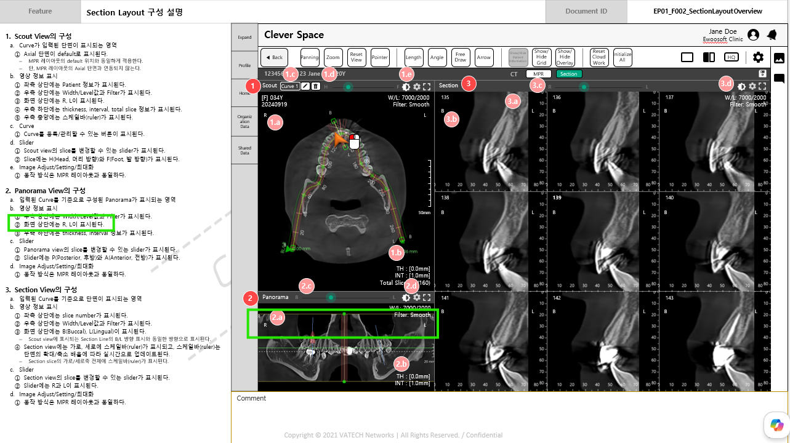

MMI 작성 당시에는 누락하였던 스펙을 발견하여 말씀드립니다.
Panorama view에 단순히 R, L 을 표시한다고만 기재해 두었는데, 
Curve 의 시작점/끝점의 각도에 따라 R, L / L, R / P, A / A, P 로 변경되는 것을 확인하였습니다.
수평선 기준으로 시작점/끝점이 45도 이하면 R,L / L,R (좌우판단한다)
수평선 기준으로 시작점/끝점이 45도 이상이면 P,A / A,P (BL 판단과 같은 로직 적용, BL 판단다는 시작2점이지만 PA 판단은 시작/끝점이기 때문에 로직이 다르다.)

해당 로직은 조금 더 테스트해보고 정리해서 전달드리면 반영이 가능할지요??

Panorama상의 영상 방향 표시 관련해서는 아래와 같이 정리하였습니다.

MMI EP01_F004_PanoLineComponents (p.13) 5번 항목에 업데이트도 해두었습니다.

VTS에도 기록 차원에서 comment 남기도록 하겠습니다.

**영상 방향 표시**

1. Scout view 상에 그려진 Curve의 시작점과 끝점을 기준으로 Panorama view의 영상 방향이 결정된다.
    1. 3개 이상의 점이 이루는 곡선의 경우에도 시작점과 끝점만 비교하여 방향을 결정한다.
2. 축 판정 기준
    1. Curve의 시작점(Start)과 끝점(End)을 잇는 벡터가 수평축과 이루는 각도를 계산하여 판정한다.
    2. 각도 < 45° → R/L 체계 적용 (좌우 방향이 우세한 곡선)
    3. 각도 ≥ 45° → P/A 체계 적용 (전후 방향이 우세한 곡선)
3. 라벨 배치 기준
    1. 시작점과 끝점의 좌표를 상대 비교하여 방향을 판정한다.
    2. R/L 체계: Scout view 상에서 더 좌측에 위치한 점 = R, 더 우측에 위치한 점 = L
    3. P/A 체계: Scout view 상에서 더 상단에 위치한 점 = A, 더 하단에 위치한 점 = P
    4. Panorama 뷰의 좌측 = 시작점의 방향 라벨, 우측 = 끝점의 방향 라벨로 배치된다.

