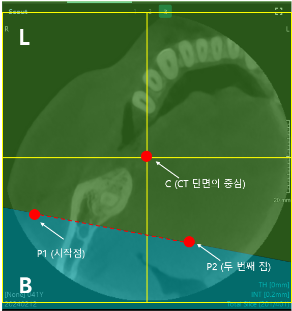

# [Cloud Web Viewer v1.3.2] MMI를 작성한다.

**Background**

- Cloud Web Viewer v1.3.2 개발을 위해 MMI 작성이 필요하다.
- Cross-sectional view의 web 구현 PoC가 성공적으로 완료됨.

**Purpose**

- CT의 cross-sectional view 기능을 Cloud Web Viewer에 탑재하여 서비스 경쟁력을 확보한다.

**Process**

1. Cloud Web Viewer v1.3.2 MMI 초안 작성: 6/22 (월) 완료
2. 기획팀 MMI 리뷰 및 리뷰 내용 반영 일정: 6/24 (수) 완료
3. 유관부서(디자인실, 개발실) MMI 리뷰 및 리뷰 내용 반영 일정: 7/6 (월) 목표

**Considerable Factors**

- EzDent Web, Clever Space의 CT viewer (MPR)의 기존 동작 방식을 참고하여 MMI를 작성한다.
- 모바일에서도 기능 실행이 가능해야 하므로, 기능이 context menu 또는 마우스 휠로만 동작하지 않도록 유의한다.

**Result Image**

- Cloud Web Viewer v1.3.2 MMI가 작성 완료된다.
- 참고자료
    - 기능 정의서: Confidential_260602_Cloud Web Viewer_Market Requirements.xlsx
    - MMI: Confidential_CloudWebViewer_v1.3.2_MMI_Kor.pptx
    - PoC: http://scp-section-demo.test.scp.esclouddev.com/

# comment by Raymond

안녕하세요.

Cloud Web Viewer v1.3.2 MMI에 대한 개발실 리뷰를 마쳐, 의견을 VKS에 정리해 두었습니다.

**Cloud Web Viewer v1.3.2 MMI — 개발실 리뷰 의견**

전체적으로 MMI에 담긴 기능은 대부분 구현 가능한 것으로 보았습니다. PoC와 Clever Space MPR 레이아웃에서 가져올 수 있는 부분이 많고, 이번에 새로 무게가 실리는 부분은 Section Slice 변경(1.9)과 Save Project(1.14) 쪽입니다. 특히 Save Project는 prj 호환 방향과 Section 저장 좌표계를 먼저 정해야 범위와 일정을 확정할 수 있어, 문서에서도 별도로 상세히 적어 두었습니다. Section Slice·Thickness·회전 등은 성능 영향이 있어, 개발실에서 선행 PoC를 진행한 뒤 필요한 수치는 따로 공유드리겠습니다.

문서 6장에는 기획·관련팀에서 확정해 주셔야 하는 항목을 표로 정리해 두었습니다. MMI 반영과 개발 착수를 위해 **본 comment로 회신** 부탁드리며, 우선 Save Project(1.14), 계측·주석 저장(1.11·1.12), Active section line 회전(1.8), BL/LB 기준점 이동(1.6·1.7) 네 가지부터 답변 주시면 감사하겠습니다. B/L 판정 규칙, Thickness, Draw curve 동작, 모바일 정책 등 나머지 항목은 VKS 6장 표를 참고해 주시면 됩니다.

검토 후 회신 부탁드립니다. 감사합니다.

# comment by Jessi

To. 전규현/ Raymond , 김성훈 / Scott , 민진우/ Thomas (cc. 심명희/ Liz , 조상형(Leo) , 박서연/ Ruby , 김성호_ES/ Owen )

안녕하십니까, 개발실 리뷰 내용 확인하여 기획실에서 검토한 내용 아래와 같이 정리하여 전달드립니다.

관련 내용은 MMI에도 업데이트 되었으며, 별도로 MMI상에서 멘션드리도록 하겠습니다.

1. (1.14) Save Project
    1. Clever Space의 CT viewer (MPR 레이아웃)에 구현된 그대로 처리합니다. (최초 업로드 시에 Desktop→Web 단방향)
    2. 업로드 이후 Clever One과의 sync 는 없습니다.
2. (1.11, 1.12) 계측/주석
    1. 프로젝트 파일에 저장됩니다.
    2. Curve·Interval 변경 후의 계측 위치 표시 규칙은 Clever One과 동일한 규칙을 적용하며, 관련 내용은 [EP01_F013_CommonTools] 6번 항목으로 MMI 업데이트 완료하였습니다. 
3. (1.8) Active section line 각도 회전 (±45°)
    1. Active section line 각도 회전 스펙은 v1.3.2에는 **스펙아웃** 처리하도록 하겠습니다.
        1. Clever Space > CT viewer에 임플란트 시뮬레이션 기능이 탑재되는 시점에 재검토 합니다. 
4. (1.6, 1.7) BL/LB 기준점 이동
    1. 기능 포함합니다. 
5. (1.3, 1.5) B/L 자동 판정 로직
    1. Ez3D-i의 코드를 재사용할 수 없음을 확인하였습니다.
    2. Ez3D-i의 코드를 직접 확인하여 정리할 일정을 별도로 산정하기에는 여유가 없어, **기획팀에서 테스트를 기반으로 직접 로직 작성하여 전달드리도록 하겠습니다.**
    3. **로직은 7/10(금) 전달을 목표로 하겠습니다.**
        1. 우선순위 조정 등으로 인해 일정 변동이 발생할 시에는 별도 안내드리도록 하겠습니다. 
6. (1.10) Thickness 기본값 및 상한
    1. 기본값 0mm로 적용합니다.
    2. 상한은 Clever One과 동일하게 처리합니다.
        1. Thickness 선택 combo box 상에서는 30mm가 최대입니다.
        2. 단, Scout view상에서 panorama thickness line을 drag & drop하여 조작할 시에는 상한값이 존재하지 않습니다. (이는 Ez3D-i, Clever One과 동일한 정책입니다.)
    3. 단, 개발실 판단 하에 상한값 필요 시에는 30mm로 정의할 수 있습니다.
        1. 또한, 상한 30mm로 지정할 시에는 마우스로 panorama thickness line 포인트를 drag & drop 조절할 시에도 30mm에서 정지하도록 적용합니다. 
7. (1.10) Draw curve 중 Thickness/Interval 변경
    1. Draw curve 동작 중 Thickness/Interval 변경 시에도 Draw curve 동작 취소하지 않습니다. (값 즉시 적용).
8. (1.5) Draw curve 표시 시점
    1. Clever One과 UX 통일. MMI에 기재된 방식대로 적용합니다.:
        1. Active section line: Curve point 추가 시마다 실시간 갱신
        2. Section view 이미지: Curve 입력 완료 후 1회 생성
9. (1.9) 개별 slice 더블클릭 최대화
    1. 기능 포함합니다.
10. (1.10) 모바일/터치 정책
    1. v1.3.2는 마우스 전용으로 개발 진행합니다.
    2. 추후 EzDent Web 적용 시점에 터치 UX는 별도로 검토하도록 하겠습니다. 
11. (1.2) Scout view 명칭
    1. 우선 Scout view로 진행합니다.
    2. 7/10까지 기획실 검토 후 변경사항 있을 시 개발실 공유하도록 하겠습니다.

# comment by Jessi

To. 전규현/ Raymond (cc. 김성훈 / Scott , 민진우/ Thomas , 탁수용/ Nick )

안녕하십니까, B/L 방향 결정 로직 관련하여 하기의 내용을 검토 요청드립니다.

MMI 11페이지(EP01_F003_ScoutCurveComponents) 7번 항목 최초 작성 시에는 Ez3D-i 코드 재사용을 기준으로 문서를 작성하였으나,

Raymond께서 코드 직접 재사용이 어렵다는 피드백을 주신 바 있습니다.

영상SW개발팀에도 로직 파악을 요청하였으나, 적지 않은 공수가 필요하며 7월 중 별도 일정 확보가 어렵다는 회신을 받았습니다.

Ez3D-i MMI도 남아있지 않고, Clever One MMI에도 Ez3D-i와 동일하게 처리한다는 내용만 남아 있어 기획실에서는 파악이 불가한 상황입니다.

기획실에서 테스트를 통해 직접 로직을 정의하는 방안도 검토하였으나, 테스트를 통해 로직을 정의하게 되면 Ez3D-i 로직을 완벽하게 재현하기 어려워 추후 QA 이슈 및 VoC 발생 가능성이 있습니다.

이에 Raymond께서 Ez3D-i를 개발하신 서용운 대표님과 직접 소통하셔서 해당 로직을 확인해 주실 수 있으신지 검토 부탁드립니다.

감사합니다.

# comment by Raymond

To. @임지수/ Jessi (cc. @김성훈 / Scott, @민진우/ Thomas)

안녕하십니까.

B/L 자동 판정 로직 관련하여 Jessi님과 대면으로 정리한 내용과, 개발실에서 제안하는 자동 판정 알고리즘 초안을 아래에 공유합니다. 기획 confirm 부탁드립니다.

---

## 1. 대면 합의 요약

- 서용운 대표님(Ez3D-i 당시 개발) 경로는 진행하지 않습니다. 오래된 기능이라 정확한 기억 확보가 어렵다는 점을 함께 확인했습니다.
- B/L 자동 판정은 **개발실이 알고리즘 초안을 제안**하고, **기획에서 confirm** 받는 방식으로 진행합니다.
- 자동 판정으로 커버되지 않는 경우는 MMI에 있는 **L/B Switching(수동 반전)** 으로 사용자가 보정합니다.
- BL/LB 기준점 이동(1.6·1.7 포함)은 기존 회신대로 유지합니다.

추가로 기획에서 판단이 필요한 사항이 있으면 comment로 알려 주세요.

---

## 2. B/L 자동 판정 — 제안 알고리즘 (v1.3.2 초안)

### 2.1 용어·출력

- B(Buccal): 협측(바깥), L(Lingual): 설측(안). Scout·Section view 라벨과 단면 이미지 좌우 표기에 동일하게 적용.
- 판정 결과는 curve 전역 `blPolarity` (정상 / 반전) 로 관리하고, Section 타일 좌·우에 B/L을 매핑합니다.
- 수동 L/B Switching 시 `blPolarity`를 토글합니다 (MMI 1.6·1.7).

### 2.2 전제

- 판정 입력은 **Scout(Axial) 화면 좌표**의 curve 제어점 시퀀스입니다.
- **전악 curve가 아니어도** 동일 규칙을 적용합니다 (어금니만, 앞니만 등 부분 curve 포함).
- 첫 번째 입력 점 = **BL/LB 기준점** (MMI 1.3 #8).

### 2.3 1단계 — 시작 반구(화면 좌우 절반)

Scout view 가로 폭의 **중앙 수직선**을 기준으로 시작점 위치를 나눕니다.

| 조건 | 명칭 |
|------|------|
| 시작점 X < 화면 너비 / 2 | **좌반구 시작** |
| 시작점 X ≥ 화면 너비 / 2 | **우반구 시작** |

부분 curve라도 **시작점이 어느 반구에 있느냐**만 보면 되므로, 전악 여부와 무관합니다.

### 2.4 2단계 — 초기 진행 방향 (1→2번째 점)

두 번째 점이 찍히면 1→2 벡터 `(dx, dy)`로 **주 진행 방향**을 분류합니다.

| 분류 | 조건 |
|------|------|
| 가로 우세 | \|dx\| ≥ \|dy\| |
| 세로 우세 | \|dx\| < \|dy\| |

가로 우세일 때:

| 방향 | 조건 |
|------|------|
| 좌→우 | dx > 0 |
| 우→좌 | dx < 0 |

세로 우세일 때:

| 방향 | 조건 |
|------|------|
| 위→아래 | dy > 0 (화면 좌표, 아래가 +Y) |
| 아래→위 | dy < 0 |

### 2.5 3단계 — 기본 B/L 극성 (blPolarity = normal)

**Section view 기준: 화면 왼쪽 라벨 / 오른쪽 라벨**

#### 좌반구에서 시작

| 주 진행 방향 | 왼쪽 | 오른쪽 |
|-------------|------|--------|
| 좌→우 (가로) | B | L |
| 우→좌 (가로) | L | B |
| 위→아래 (세로) | B | L |
| 아래→위 (세로) | L | B |

#### 우반구에서 시작

| 주 진행 방향 | 왼쪽 | 오른쪽 |
|-------------|------|--------|
| 좌→우 (가로) | L | B |
| 우→좌 (가로) | B | L |
| 위→아래 (세로) | L | B |
| 아래→위 (세로) | B | L |

요약하면, **좌반구 + 좌→우 = 왼쪽 B**가 기본이고, 우반구이거나 진행 방향이 반대이면 좌우가 뒤바뀝니다.

### 2.6 4단계 — 드로잉 중 극성 반전 (동적)

curve를 이어 그리는 동안 아래 **어느 하나라도** 발생하면 `blPolarity`를 **토글**(B↔L swap):

1. **진행 방향 급반전**: 직전 구간 접선과 현재 구간 접선의 내적 < 0 (대략 90° 이상 꺾여 진행 방향이 반대로 바뀐 경우)
2. **화면 중앙선 교차**: curve가 화면 가로 중앙을 지나 반대 반구로 넘어간 경우 (이전 반구 ≠ 현재 반구)
3. (MMI 1.3 #8 연계) **Active Section Line 중앙 기준점**을 지나 BL/LB 기준점 기준으로 반전이 필요한 경우 — 기준점 이동 기능과 동일 규칙으로 후속 구간에 적용

토글은 **누적**합니다 (홀수 번 반전 = 반전 상태).

### 2.7 5단계 — 예외·폴백

| 상황 | 처리 |
|------|------|
| 점 1개만 (방향 미정) | B/L 라벨 미표시 또는 임시 기본값(좌반구·좌→우 가정) — 기획 confirm 요청 |
| 자동 판정 불확실 | 사용자 **L/B Switching** (context menu) |
| BL/LB 기준점 이동 | 기준점 위치 변경 시 해당 규칙으로 B/L 재판정 (1.6·1.7) |

---

## 3. 기획 confirm 요청

아래를 확인해 주시면 구현에 반영하겠습니다.

1. **2.5 세로 우세(위/아래) 시 B/L 배치** — 위 표가 Clever One 체감과 맞는지 (특히 앞니·어금니 부분 curve 샘플 2~3종)
2. **2.6 반전 조건** — 중앙선 교차·급반전 토글을 모두 적용할지, 일부만 적용할지
3. **점 1개일 때** 표시 정책

Clever One에서 확인 가능한 **대표 curve 케이스(스크린샷 또는 그리기 순서)** 를 주시면 표를 조정한 뒤 최종 spec으로 고정하겠습니다.

감사합니다.

# comment by Jessi

To. 전규현/ Raymond , 김성훈 / Scott , 민진우/ Thomas (cc. 심명희/ Liz , 조상형(Leo) , 박서연/ Ruby , 김성호_ES/ Owen, 탁수용/ Nick )

안녕하세요, 

Clever One에서 CT 업로드 시 proj 파일 내 Curve 정보 존재 유무에 따라
Clever Space에서 Curve를 표시할 것인지를 신규로 정의하여 MMI [EP01_F014_SaveProject] 3번 항목에 추가하였습니다.

Nick을 통해 Clever One의 proj 파일에 Curve 정보가 함께 저장되는 것을 확인하였고,
해당 데이터를 기반으로 Clever Space에서 Curve를 초기 세팅하는 방식을 신규로 정의하였습니다.

단, Clever One에서 Section view를 1회 이상 열어야 proj 파일에 Curve 정보가 기록되므로, 파일 내 Curve 정보가 없는 경우도 있습니다.
이 경우에는 [EP01_F005_DrawCurve]와 동일하게 Curve 없이 Panorama/Section view가 blank 상태로 표시됩니다.

업무에 참고 부탁드립니다. 

# comment by Jessi

To. 전규현/ Raymond  (cc. 김성훈 / Scott , 민진우/ Thomas , 탁수용/ Nick , 심명희/ Liz , 조상형(Leo) , 김성호_ES/ Owen, 박서연/ Ruby  )

제안해주신 알고리즘 초안을 검토해보고 Clever One을 테스트 해본 결과, 간단한 규칙 하나로 대체 가능할 것 같아서 공유드립니다.

**제안 규칙**

> P1(시작점) → P2(두 번째 점) 선분을 그었을 때, **CT 단면의 중심점(C)이 있는 쪽 = L, 반대쪽 = B**
> 
 
  

이 규칙대로라면 반구가 좌/우 어디서 시작하든, 진행 방향이 가로/세로/대각선 어디든 상관없이, **C가 어느 쪽에 있는지 한 번만 판정하면** 됩니다.

**2.6(드로잉 중 극성 반전) 은 통째로 불필요**

- "진행 방향 급반전", "화면 중앙선 교차" 감지 및 blPolarity 토글 로직은 적용하지 않아도 됩니다.
- C점 기준 판정 방식에서는 curve가 어떻게 꺾이든, 화면 중앙선을 넘나들든 상관없이 P1-P2 시점에 이미 C의 위치로 B/L이 확정되기 때문에, 별도의 반전 감지/토글 처리가 요구되지 않습니다.

**정리하면**

1. P1, P2가 찍히는 시점에 C점이 P1-P2 선분 기준 어느 쪽에 있는지 판정 (C 있는 쪽 = L, 반대쪽 = B)
2. **P3부터는 변경 없음** — 이후 점이 몇 개 추가되든 위에서 정해진 B/L 그대로 유지

확인 부탁드립니다. 감사합니다.