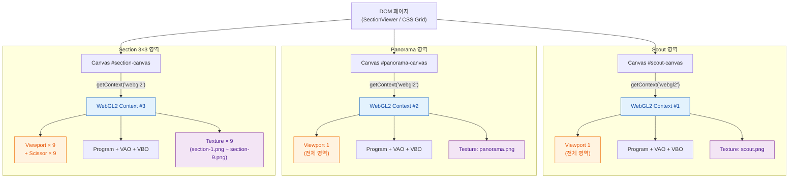
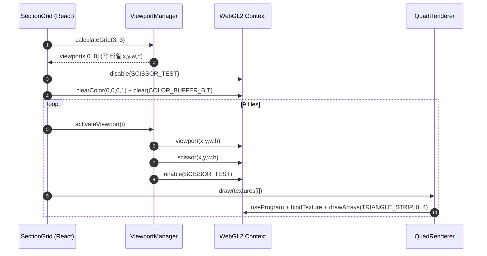
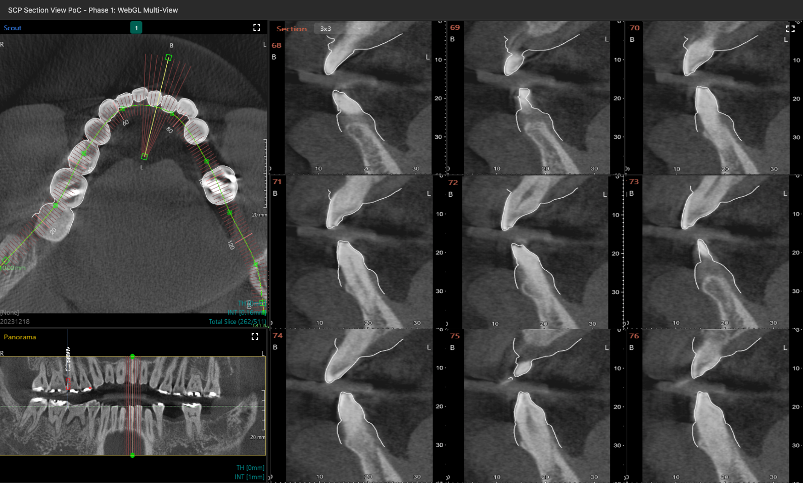

# Phase 1: WebGL Multi-View — 결과 보고

## 개요

| 항목 | 내용 |
|------|------|
| 과제 | `Phase1_WebGL_MultiView_OnePager.md` (11 View 동시 표시 기술 검증) |
| 결론 | **완료** — WebGL **Context 3개**만 사용하고, **Viewport(및 Scissor) 분할**로 11개 화면을 구성하는 방식으로 Context 수 제한 문제를 해소함. |
| 근거 문서 | 상세 기획·리스크·성공 기준은 One Pager 동일 경로 파일 참고. |

## 해법 요약

- **Scout(1)**, **Panorama(1)**, **Section(3×3=9)** 영역에 **Canvas 3개 / WebGL Context 3개**를 두고, Section 한 개의 context 안에서 **9개 Viewport**로 슬라이스를 그린다.
- View마다 Context를 11개 둔 이전 방식(Chrome `CONTEXT_LOST_WEBGL` 유발)을 대체한다.
- Section Grid 쪽은 `viewport` + `scissor`로 타일마다 별도 텍스처/쿼드 렌더(One Pager 의사코드와 동일).

## 왜 WebGL이 필요한가 (= 왜 CPU만으로는 부적합한가)

본 PoC의 최종 형태(이후 Phase 4~5)는 “**CT Volume에서 매 프레임 9개 단면을 다시 만들고 화면에 그린다**”이다. 이 작업은 **단순 표시 부하**가 아니라 **연산 + 표시가 엮인 부하**이며, 이런 종류 작업은 구조적으로 **GPU 경로(WebGL)가 거의 강제되는 것**에 가깝다. 정량 비교는 [WebSectionView_PoC_OnePager.md](../WebSectionView_PoC_OnePager.md) **Phase 6 - 부속 PoC**에서 다룬다(아래 참조). 결과 문서에는 **이론적 근거**만 정리한다.

### 1) 픽셀당 연산이 “거의 SIMD에 최적화된” 형태이다

각 출력 픽셀은 다음 3단계 정도가 거의 전부이다.
1. 단면 평면 좌표(u, v) → CT Volume 인덱스(x, y, z) 행렬곱 1회
2. **3선형 보간**: 8개 voxel 샘플 + 14회 정도의 곱·덧셈
3. windowing/CLUT(밝기 매핑)

이 패턴은 **픽셀끼리 의존성이 0**인 **fully data-parallel** 워크로드라, GPU 셰이더 한 줄과 거의 1:1로 매핑된다. CPU에서 같은 일을 하면 동일 알고리즘을 **수십만~수백만 번 반복**해야 하고, JS 엔진/typed array 한계 안에서 **순차 실행**된다.

### 2) **표시까지의 경로**에서 GPU만 “회수(read-back) 비용 0”

CPU 경로는 항상 다음 중 하나의 추가 비용을 낸다.
- ImageData 만들고 `putImageData`(Canvas2D) — **CPU→DOM/GPU 복사**
- 또는 만든 픽셀을 다시 WebGL 텍스처로 업로드 — **CPU→GPU 복사**

WebGL 경로는 **CT 볼륨을 한 번만 GPU로 올린 뒤**(3D 텍스처 또는 2D Array), 매 프레임 단면만 셰이더로 만들어서 **그대로 표시**한다. **회수가 없다.** 이게 사실상 가장 큰 절대 차이이며, “계산이 빠르다” 이상의 본질적 우위다.

### 3) 9뷰 동시 갱신 + 사용자 인터랙션

- 위치 슬라이더/드래그를 **체감 부드럽게(>= 30 FPS)** 갱신하려면 한 프레임이 **약 33ms 이내**여야 한다.
- 9뷰 × 출력 256²~512² × 8 voxel sample/픽셀이면 프레임당 **수백만~수천만 voxel fetch + 보간**이다.
- 이 양은 **typed array + 단일 스레드 JS**로는 자릿수가 안 맞고, Worker로 N개 코어 분산해도 “계산은 어느 정도 따라가지만 **결과를 다시 표시하려면 회수 비용이 또 발생**” 한다(=2번 항목).
- WebGL이면 **모든 단면을 같은 context 안에서 viewport만 바꿔가며 그리고**, 표시까지 그대로 끝난다(이번 Phase 1에서 이미 검증한 패턴).

### 4) 자릿수 추정(이론적 근거)

| 항목 | 대략 값 | 코멘트 |
|------|---------|--------|
| 출력 1프레임(9뷰, 512²) 연산 | 약 19~38 M voxel fetch + 보간 | 픽셀 0.26 M × 9 × 8 sample(~14 곱셈) |
| GPU 처리량 | 보통 수십~수백 GFLOPS, 텍스처 캐시 수백 GB/s | 내장 GPU 기준 자릿수 |
| 단일 스레드 JS 처리량 | 수 GFLOPS 미만 | typed array 최적화 시 |
| 회수 비용 | GPU=0, CPU=프레임마다 발생 | 본질적 차이 |

→ **계산만 비교해도 자릿수 차이**, 게다가 **표시까지의 회수 비용**까지 겹치면 “WebGL을 쓰지 않을 이유가 없다”는 결론이 곧바로 나온다.

### 5) 그러면 왜 정량 비교 PoC를 지금 안 하나

- 결정 자체에는 영향이 없고(이미 채택), **수치는 데이터·브라우저·GPU에 따라 자릿수 안에서 흔들린다.**
- 다만 SCP Cloud 제품 적용 시점에 **숫자로 보여줘야 할 자리**가 있을 수 있어, **Phase 6에서 부속 PoC로** “WebGL vs CPU 단일 스레드(+옵션 Worker)” 미니 벤치를 잡는 절차만 OnePager에 정리해 둔다.

## 핵심 개념: Canvas · WebGL Context · Viewport

Phase 1을 이해하려면 우선 세 가지의 **계층 관계**가 분명해야 한다.

| 개념 | 정체 | 개수·범위 | 본 PoC에서의 사용 |
|------|------|-----------|-------------------|
| **Canvas** (`HTMLCanvasElement`) | DOM 요소(픽셀 사각형 + JS 그리기 표면). CSS로 위치·크기를 받음 | 페이지 안에 여러 개. **이 PoC = 3개**(Scout, Panorama, Section) | 레이아웃·이벤트 단위. 각 View 영역 = 각 Canvas |
| **WebGL Context** (`WebGL2RenderingContext`) | 한 Canvas에 1:1로 붙은 **GPU 게이트웨이**. 셰이더·텍스처·VAO 등 GPU 자원의 **소유 단위** | 브라우저 탭 전체에 **상한**(예: Chrome 약 16개). Canvas 1개당 1개 | `canvas.getContext('webgl2')`로 1개씩, 총 **3개만 생성** |
| **Viewport** (`gl.viewport(x,y,w,h)`) | "이 context가 그릴 때 **캔버스의 어느 사각형 영역**에 매핑할지" 지정하는 **상태값** | Context 안에서 매 draw 전에 바꿀 수 있음(개수 제한 없음) | Section context에서 **9번**(타일마다) 갱신 |

핵심은 **"Context는 비싸고 수가 제한되지만, Viewport는 같은 Context 안에서 자유롭게 바꿀 수 있는 상태(state)일 뿐"** 이라는 점이다.  
그래서 **Context 11개(View마다 1개) → Context 3개 + Viewport 11개**로 옮긴 것이 이번 Phase의 정정안이다.

### 함께 알아야 할 요소

Canvas / Context / Viewport 외에 본 PoC에서 직접 쓰거나, 이후 Phase에서 반드시 마주칠 보조 개념들이다.

| 요소 | 역할 | Phase 1에서의 위치 |
|------|------|--------------------|
| **Scissor** (`gl.scissor` + `enable(SCISSOR_TEST)`) | `clear`/`draw` 결과를 사각형 밖에서 **잘라냄**. Viewport는 좌표 변환만, Scissor는 **출력 마스크**. 둘은 **세트로** 써야 타일이 깔끔. | Section 3×3 타일에서 Viewport와 동일 rect로 켜둠 |
| **Drawing buffer**(`canvas.width`/`height`) vs **CSS pixel**(`getBoundingClientRect`) | Canvas에는 두 종류 크기가 있음. WebGL 좌표는 **drawing buffer 픽셀** 기준. CSS와 다르면 흐려지거나 위치가 어긋남. | `useWebGLCanvas`에서 `devicePixelRatio`로 맞춤 |
| **Texture** (`WebGLTexture`) | GPU 메모리에 올린 2D 이미지. Context별로 **공유 불가**(별도 Context면 다시 업로드). | View마다 어차피 다른 이미지라, 공유 이득이 없는 것이 결정 근거 중 하나 |
| **Program / Shader / VAO / VBO** | Vertex+Fragment 셰이더를 묶은 `WebGLProgram`, 쿼드 정점·UV를 담은 VBO와 그 바인딩을 캐시하는 VAO. | `QuadRenderer`가 Context당 1세트(쿼드 1개)로 보유 |
| **Framebuffer Object (FBO)** | 화면이 아닌 **텍스처에 그리기**(오프스크린). 향후 Panorama/Section 이미지를 Volume에서 만들어 텍스처로 굽고 표시할 때 필요. | Phase 1에는 미사용. **Phase 4~5에서 등장 예정** |
| **Context Lost / Restore** | GPU 드라이버 리셋·탭 백그라운드·자원 한계로 Context가 죽고 살아나는 이벤트. 죽으면 텍스처·Program **모두 무효화**. | Phase 1은 발생 0건이 성공 기준 중 하나. 핸들러는 등록되어 있음 |
| **State machine** | WebGL은 거대한 전역 상태 기계. `bindTexture`, `useProgram`, `viewport`, `scissor` 등을 **호출 직전에 명시**하는 습관 필요. | 본 데모는 매 draw마다 viewport/scissor/program/vao를 다시 세팅 |

(이후 Phase에서 더 추가될 만한 것: **WebGL 확장(EXT_color_buffer_float 등)**, **Compute(WebGPU 이행 시)**, **DICOM Loader**, **3D Texture / 2D Texture Array**(volume), **Render-to-Texture(FBO)**)

### Diagram: Canvas → Context → Viewport (3 Canvas 전략)

### Diagram: Section Grid 1프레임 렌더 시퀀스

> Scout / Panorama는 위 루프가 1회(전체 영역 1 Viewport)로 줄어든 형태에 해당한다. 즉 "Section은 같은 Context 안에서 Viewport·Scissor·Texture만 9번 갈아끼우며 그린다" 가 본 PoC 핵심 구현 패턴이다.

## 실행 결과 화면

아래 캡처는 PoC 앱 **「SCP Section View PoC - Phase 1: WebGL Multi-View」** 기준.

- **좌상**: Scout(Axial) — 곡선 가이드, 방사상 단면 기준선 등 오버레이.
- **좌하**: Panorama — Section과 연동된 선택 영역(세로 띠) 표시.
- **우측**: Section **3×3** — 슬라이스 9면, 번호(예: 68~76) 및 치/R/L/B 등 눈금·툴이 함께 그려짐(윤곽 등 2D 오버레이 포함).

(정적 이미지이므로 FPS·응답은 별도 측정/스크립트 산출물이 있으면 One Pager 성능 항목에 맞춰 기록하면 된다.)

## 결론 (Gate)

- Phase 1 One Pager에서 정한 **「3 Context + 11 Viewport로 11 View 동시 표시」** 전략이 구현·동작이 확인되었고, **이후 Phase(2~6)를 진행할 수 있는 기술 전제**는 충족된 것으로 본다.
- 데모 URL·빌드·벤치마크 수치는 저장소/파이프라인 및 측정 로그에 따른다.
