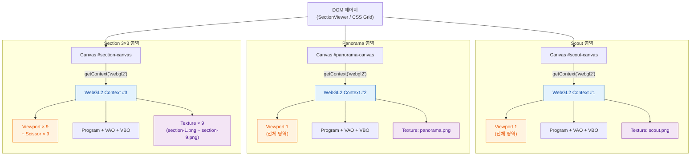
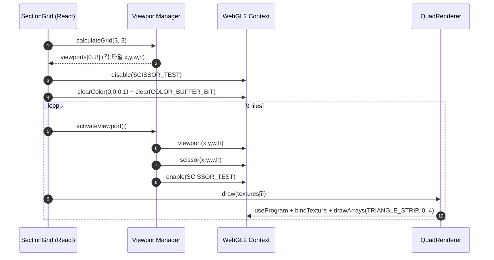

# Phase 1: WebGL Multi-View — 결과 보고

## 개요

| 항목 | 내용 |
|------|------|
| 과제 | `Phase1_WebGL_MultiView_OnePager.md` (11 View 동시 표시 기술 검증) |
| 결론 | **완료** — WebGL **Context 3개**만 사용하고, **Viewport(및 Scissor) 분할**로 11개 화면을 구성하는 방식으로 Context 수 제한 문제를 해소함. |
| 근거 문서 | 상세 기획·리스크·성공 기준은 One Pager 동일 경로 파일 참고. |

## 해법 요약

- **Scout(1)**, **Panorama(1)**, **Section(3×3=9)** 영역에 **Canvas 3개 / WebGL Context 3개**를 두고, Section 한 개의 context 안에서 **9개 Viewport**로 슬라이스를 그린다.
- View마다 Context를 11개 둔 이전 방식(Chrome `CONTEXT_LOST_WEBGL` 유발)을 대체한다.
- Section Grid 쪽은 `viewport` + `scissor`로 타일마다 별도 텍스처/쿼드 렌더(One Pager 의사코드와 동일).

## 핵심 개념: Canvas · WebGL Context · Viewport

Phase 1을 이해하려면 우선 세 가지의 **계층 관계**가 분명해야 한다.

| 개념 | 정체 | 개수·범위 | 본 PoC에서의 사용 |
|------|------|-----------|-------------------|
| **Canvas** (`HTMLCanvasElement`) | DOM 요소(픽셀 사각형 + JS 그리기 표면). CSS로 위치·크기를 받음 | 페이지 안에 여러 개. **이 PoC = 3개**(Scout, Panorama, Section) | 레이아웃·이벤트 단위. 각 View 영역 = 각 Canvas |
| **WebGL Context** (`WebGL2RenderingContext`) | 한 Canvas에 1:1로 붙은 **GPU 게이트웨이**. 셰이더·텍스처·VAO 등 GPU 자원의 **소유 단위** | 브라우저 탭 전체에 **상한**(예: Chrome 약 16개). Canvas 1개당 1개 | `canvas.getContext('webgl2')`로 1개씩, 총 **3개만 생성** |
| **Viewport** (`gl.viewport(x,y,w,h)`) | "이 context가 그릴 때 **캔버스의 어느 사각형 영역**에 매핑할지" 지정하는 **상태값** | Context 안에서 매 draw 전에 바꿀 수 있음(개수 제한 없음) | Section context에서 **9번**(타일마다) 갱신 |

핵심은 **"Context는 비싸고 수가 제한되지만, Viewport는 같은 Context 안에서 자유롭게 바꿀 수 있는 상태(state)일 뿐"** 이라는 점이다.  
그래서 **Context 11개(View마다 1개) → Context 3개 + Viewport 11개**로 옮긴 것이 이번 Phase의 정정안이다.

### 함께 알아야 할 요소

Canvas / Context / Viewport 외에 본 PoC에서 직접 쓰거나, 이후 Phase에서 반드시 마주칠 보조 개념들이다.

| 요소 | 역할 | Phase 1에서의 위치 |
|------|------|--------------------|
| **Scissor** (`gl.scissor` + `enable(SCISSOR_TEST)`) | `clear`/`draw` 결과를 사각형 밖에서 **잘라냄**. Viewport는 좌표 변환만, Scissor는 **출력 마스크**. 둘은 **세트로** 써야 타일이 깔끔. | Section 3×3 타일에서 Viewport와 동일 rect로 켜둠 |
| **Drawing buffer**(`canvas.width`/`height`) vs **CSS pixel**(`getBoundingClientRect`) | Canvas에는 두 종류 크기가 있음. WebGL 좌표는 **drawing buffer 픽셀** 기준. CSS와 다르면 흐려지거나 위치가 어긋남. | `useWebGLCanvas`에서 `devicePixelRatio`로 맞춤 |
| **Texture** (`WebGLTexture`) | GPU 메모리에 올린 2D 이미지. Context별로 **공유 불가**(별도 Context면 다시 업로드). | View마다 어차피 다른 이미지라, 공유 이득이 없는 것이 결정 근거 중 하나 |
| **Program / Shader / VAO / VBO** | Vertex+Fragment 셰이더를 묶은 `WebGLProgram`, 쿼드 정점·UV를 담은 VBO와 그 바인딩을 캐시하는 VAO. | `QuadRenderer`가 Context당 1세트(쿼드 1개)로 보유 |
| **Framebuffer Object (FBO)** | 화면이 아닌 **텍스처에 그리기**(오프스크린). 향후 Panorama/Section 이미지를 Volume에서 만들어 텍스처로 굽고 표시할 때 필요. | Phase 1에는 미사용. **Phase 4~5에서 등장 예정** |
| **Context Lost / Restore** | GPU 드라이버 리셋·탭 백그라운드·자원 한계로 Context가 죽고 살아나는 이벤트. 죽으면 텍스처·Program **모두 무효화**. | Phase 1은 발생 0건이 성공 기준 중 하나. 핸들러는 등록되어 있음 |
| **State machine** | WebGL은 거대한 전역 상태 기계. `bindTexture`, `useProgram`, `viewport`, `scissor` 등을 **호출 직전에 명시**하는 습관 필요. | 본 데모는 매 draw마다 viewport/scissor/program/vao를 다시 세팅 |

(이후 Phase에서 더 추가될 만한 것: **WebGL 확장(EXT_color_buffer_float 등)**, **Compute(WebGPU 이행 시)**, **DICOM Loader**, **3D Texture / 2D Texture Array**(volume), **Render-to-Texture(FBO)**)

### Mermaid: Canvas → Context → Viewport (3 Canvas 전략)

### Mermaid: Section Grid 1프레임 렌더 시퀀스

> Scout / Panorama는 위 루프가 1회(전체 영역 1 Viewport)로 줄어든 형태에 해당한다. 즉 "Section은 같은 Context 안에서 Viewport·Scissor·Texture만 9번 갈아끼우며 그린다" 가 본 PoC 핵심 구현 패턴이다.

## 실행 결과 화면

아래 캡처는 PoC 앱 **「SCP Section View PoC - Phase 1: WebGL Multi-View」** 기준.

- **좌상**: Scout(Axial) — 곡선 가이드, 방사상 단면 기준선 등 오버레이.
- **좌하**: Panorama — Section과 연동된 선택 영역(세로 띠) 표시.
- **우측**: Section **3×3** — 슬라이스 9면, 번호(예: 68~76) 및 치/R/L/B 등 눈금·툴이 함께 그려짐(윤곽 등 2D 오버레이 포함).

(정적 이미지이므로 FPS·응답은 별도 측정/스크립트 산출물이 있으면 One Pager 성능 항목에 맞춰 기록하면 된다.)

## 결론 (Gate)

- Phase 1 One Pager에서 정한 **「3 Context + 11 Viewport로 11 View 동시 표시」** 전략이 구현·동작이 확인되었고, **이후 Phase(2~6)를 진행할 수 있는 기술 전제**는 충족된 것으로 본다.
- 데모 URL·빌드·벤치마크 수치는 저장소/파이프라인 및 측정 로그에 따른다.
