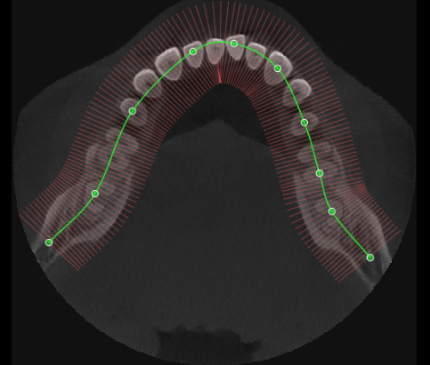

Engineering One Pager

## Project Name

Phase 4: 치열궁 곡선 기반 파노라마(Curved MPR) 이미지 생성 기술 검증

## Date

- **기획/제출(초안)**: 2026-05-05
- **상태**: 착수 전 (본 문서로 범위·알고리즘 확정)

## Submitter Info

Raymond

## Project Description

Phase 3에서 Scout Axial 상에 정의한 **치열궁 곡선(녹색 스플라인)** 과, 곡선에 **수직인 샘플 방향(빨간 세그먼트)** 을 사용하여, 메모리에 적재된 **3D CT Volume**에서 **파노라마용 2D 이미지**를 생성한다. 생성 결과는 Panorama View 영역에 **2D 비트맵**으로 표시하면 된다(WebGL 표시는 필수 아님, 메인 OnePager 「뷰별 렌더링 경로」 참조).

**참고 이미지**: Axial 단면 위 녹색 곡선·제어점·곡선에 수직인 빨간 샘플링 직선(슬랩 두께 시각화).

**선행 조건**: Phase 2(Volume 구성), Phase 3(곡선·수직 방향 샘플 `CurveSample` 또는 동등 정보).

**상위 로드맵**: [0.Web Section View PoC OnePager](https://vks.vatech.com/spaces/ESDEVELOPER/pages/302045944/0.Web+Section+View+PoC+OnePager)

---

## 곡선 도해와 PoC에서의 해석 (삽입 도해·`curve.png` 참고)

| 시각 요소 | 의미 (PoC 해석) |
| --- | --- |
| **녹색 곡선** | 파노라마의 **중심 경로(centerline)**. 최종 파노라마의 **가로축(열 방향)** 에 대응하는 위치를 곡선의 **호장(arc length) 파라미터** 로 순회한다. |
| **녹색 제어점** | Catmull-Rom 등으로 곡선을 정의하는 점(Phase 3). Phase 4는 **이미 생성된 연속 곡선·접선·법선** 을 입력으로 쓴다. |
| **빨간 짧은 선들** | 각 샘플 지점에서 **곡선 접선에 수직인 방향**(대개 Axial 평면 내 **내외측 법선**)을 나타낸다. **슬랩 두께(focal trough / slab thickness)** 안에서 복셀을 모아 **한 열(column)의 두께 방향**으로 투영할 때 사용한다. |
| **빨간 선 간격** | CleverOne 등에서는 수 mm 단위. PoC에서는 Phase 3 **INT(mm)** 와 별도로 **파노라마 열 간격(Δs, mm)** 을 두어 해상도와 속도를 맞춘다. **「화면 1픽셀」** 과 혼동하지 않는다(출력 가로 해상도는 Δs와 출력 폭으로 결정). |

---

## 파노라마 생성 알고리즘 (개요)

치과 CBCT에서 흔히 쓰는 접근은 **곡면 평면 재구성(Curved Planar Reformation, CPR)** 의 일종이다: 치열궁을 따라 “펼친” 2D 영상을 만든다.

### 1. 입력

- **Volume**: `Int16Array`(또는 float) + `dimensions`(cols, rows, slices) + **체격 간격** `spacing`(mm) + **원점/방향**(가능하면 Image Orientation Patient 기반; PoC에서는 축 정렬 가정으로 단순화할 수 있음).
- **중심 경로**: Axial 상의 2D 곡선을 **월드/복셀 3D** 로 올린 곡선 `C(s)` — 호장 `s`(mm)에 대한 위치.
- **각 점에서의 프레임**: 접선 `T̂(s)`, Axial 평면 내 법선 `N̂(s)` (Phase 3 `CurveSample.perpendicular`와 정렬 가능).
- **파라미터(튜닝)**:
  - `Δs`: 곡선을 따라 **열(column) 샘플 간격**(mm).
  - `slabHalfWidth`: `N̂` 방향으로 ±방향 **슬랩 반폭**(mm), 도해(원문 삽입 이미지·로컬 `curve.png` 참고)의 빨간 선 반장에 해당.
  - 출력 **세로(rows)**: 보통 **환자 두부-족(z)** 또는 슬라이스 스택 방향을 따라 일정 범위를 샘플(예: 곡선이 놓인 주변 slice 전체 또는 cropping 범위).

### 2. 출력 이미지 인덱싱

- **열 인덱스 `i`** (0 … `Ncols-1`): 곡선을 `Δs` 마다 진행한 샘플마다 하나의 열을 채운다.
- **행 인덱스 `j`** (0 … `Nrows-1`): **수직 방향**(예: slice 인덱스 또는 월드 z에 해당하는 축)을 따라 균등 또는 물리 간격으로 샘플한 위치.

### 3. 복셀 샘플링

각 출력 픽셀 `(i, j)` 에 대해:

1. 호장에서 `s_i = i * Δs`(또는 누적)에 해당하는 곡선 위 점 `P_i = C(s_i)` 와 `N̂_i`, `T̂_i` 를 구한다.
2. **수직 좌표** `j` 에 해당하는 높이에서, 슬랩 내 여러 지점을 `N̂_i` 방향으로 배치한다. 예: `Q_k = P_i + t_k * N̂_i`, `t_k ∈ [-slabHalfWidth, +slabHalfWidth]` (복셀 격자에 맞게 이산화).
3. 각 `Q_k` 를 **볼륨 좌표**로 변환하고 **삼선형(trilinear) 보간** 으로 HU(또는 저장값)를 읽는다.

### 4. 슬랩 두께 방향의 값 결합 (본 PoC: MIP만)

빨간 선 방향(법선 `N̂`)으로 여러 샘플 `k` 를 얻었을 때, 슬랩 내 값들을 **한 스칼라**로 줄인다.

| 방법 | 설명 | 본 PoC |
| --- | --- | --- |
| **최대(MIP)** | 슬랩 내 **최댓값** | **채택**. 치아·뼈·금속 등 고밀도 구조가 잘 드러나며 치과 CT 뷰어에서 흔히 쓴다. |
| **평균(Mean)** 등 | 슬랩 내 평균 등 | **범위 밖**. 제품 단계에서 필요 시 별도 검토. |

**본 PoC**: **삼선형 샘플 + 슬랩 방향 MIP** 만 구현한다.

**오해 방지**: “모든 DICOM 파일을 매번 다시 읽는다”기보다, Phase 2 이후에는 **이미 메모리의 단일 3D Volume**에서 인덱스로 접근한다. DICOM은 디스크 형식일 뿐, 런타임 연산은 **볼륨 배열** 기준이다.

---

## 구현 전략 (Phase 4 PoC)

| 항목 | 결정 |
| --- | --- |
| **연산 위치** | 우선 **클라이언트 단일 스레드 JavaScript** 로 trilinear 샘플 + 루프 구현. **파노라마 생성 버튼 1회**당 소요 시간(ms)을 로그/UI로 기록한다. |
| **WASM** | JS 측정 후 목표(예: 1초 이내) 미달 시 **동일 알고리즘** 을 WASM으로 옮겨 **정확 비교** (Phase 6 Client vs WASM 표와도 연결 가능). Phase 4 착수 순서상 **후순위**로 둔다. |
| **표시** | `ImageData` / Canvas 2D `putImageData` 또는 기존 **단일 WebGL 텍스처 쿼드** 로 붙여도 됨. |
| **GPU(WebGL)** | Phase 5 Section 파이프라인과 통합 가능하나, Phase 4 **검증 목표**는 “알고리즘·좌표·품질” 이므로 **CPU(JS) 우선** 으로 두어도 메인 로드맵과 모순 없음. |

---

## 파노라마 생성 UI (PoC)

곡선을 추가·이동·삭제할 때마다 **전체 파노라마를 자동 재생성**할지, **사용자가 한 번 더 확인하는 액션**을 둘지는 비용·측정 정의·입력 지연에 직결된다.

### 자동 재생성 vs 명시적 생성

| 방식 | 장점 | PoC에서의 문제 |
| --- | --- | --- |
| **곡선 편집마다 자동** | 상용 뷰어에 가까운 흐름 | 제어점 드래그 등으로 이벤트가 연속 발생하면 **메인 스레드 MIP 루프**가 겹쳐 UI가 끊길 수 있음. “한 번 생성”에 걸린 시간과 **부분 갱신·중복 호출**이 섞여 벤치마크가 애매해짐. |
| **명시적 생성 버튼** | 호출 시점이 분명해 **ms 측정**과 성공 기준(목표 시간) 정의가 쉬움. 편집 중에는 Scout만 갱신하면 됨 | 곡선을 고친 뒤 **버튼을 한 번 눌러야** 결과가 바뀜 |

**본 PoC 채택**: **명시적 “파노라마 생성”(또는 동등 라벨) 버튼**으로 전체 파노라마를 재계산한다. 곡선 변경만으로는 **자동 재생성하지 않는다**. 편집 종료 후 일정 시간 두고 자동 생성하는 **디바운스 방식**은 제품 후보로 남기되, Phase 4 **필수 범위는 아니다**.

### 버튼 배치

| 후보 | 설명 |
| --- | --- |
| **권장: Panorama 영역 내부** | **Panorama View 칸**에서 캔버스 **위쪽**에 얇은 컨트롤 줄(또는 한 줄 툴바)을 두고 버튼을 둔다. **결과가 나오는 영역과 동작이 같은 칸**에 묶여 설명·스크린샷이 단순하다. |
| 대안: Scout 쪽 | Edit Curve(Phase 3, 좌상) 근처에 두면 “곡선 짜고 바로 생성” 동선은 짧지만, Scout가 **컨트롤이 더 많아지고** Phase 3와 시각적으로 겹칠 수 있다. |
| 전역 헤더만 | 데모 앱 상단 레이아웃 변경이 커질 수 있어 Phase 4 **기본안에서는 제외**해도 된다. |

### 동작 규칙 (PoC)

- Volume 미로드 또는 곡선이 최소 조건(예: 유효 제어점 개수)을 만족하지 않으면 버튼 **비활성**, 필요 시 한 줄 안내.
- 생성 중에는 버튼 **비활성** 또는 로딩 표시로 **중복 실행 방지**.
- 구현·결과 문서에는 **버튼 위치**(Panorama 상단 등)를 Phase 3 레이아웃 설명과 같이 남긴다.

---

## Business and Marketing Justification

- 파노라마는 Section View UX에서 **스카우트·섹션 위치** 의 기준 이미지로 쓰이며, Web 제품에서 CleverOne급 워크플로를 설명하려면 **동일 데이터(Volume + 곡선)** 로 재현 가능해야 한다.
- Phase 5(9 Section)와의 **공통 수학(곡선·법선·호장)** 을 Phase 4에서 정리하면 이후 GPU 이전 시에도 인터페이스가 명확해진다.

## Risk Assessment

| 리스크 | 영향도 | 발생 가능성 | 대응 방안 |
| --- | --- | --- | --- |
| Volume–world 정합 단순 가정으로 기하 왜곡 | 중간 | 중간 | PoC 초기에는 축 정렬 볼륨으로 검증, 메타데이터로 변환 행렬 단계적 도입 |
| 클라이언트 JS만으로 1초 목표 초과 | 중간 | 중간 | Δs 완화, 출력 해상도 축소, WASM·Worker·GPU 검토(Phase 6 연계) |
| MIP 가정과 실제 장비 투영 방식 차이 | 낮음 | 낮음 | PoC는 MIP만 명시, 제품화 시 장비 스펙 대비 |
| 곡선이 Axial 한 장에만 있어 3D 휨 미반영 | 중간 | 중간 | PoC에서는 **고정 Z(선택 Axial slice)** 로 중심경로를 올리는 단순화 문서화, 후속 3D 곡선은 범위 외로 표시 |

## Resource and Scheduling Details

- **기간**: 1주(5일) 목표(메인 OnePager와 동일 오더)
- **인력**: 1명 (TS + 기하/영상 기초)
- **산출물**: `packages/core` 내 `volume` 또는 `panorama` 모듈 초안, `PanoramaView`에 실제 비트맵 연결, 간단 벤치마크 표

| Day | 작업 | 산출물 |
| --- | --- | --- |
| 1 | 도해(로컬 파일명 `curve.png`) 및 Phase 3 출력 기준 좌표계 정리, `C(s)`, `N̂` 확정 | 설계 노트 반영(본 문서) |
| 2 | 호장 샘플링 + trilinear + 슬랩 **MIP** 루프 | Core 함수 |
| 3 | Panorama 상단 **파노라마 생성** 버튼, 결과 바인딩, WC/WW 적용 | UI 통합 |
| 4 | Δs·슬랩 폭·해상도 스윕, ms 측정 | 측정값 |
| 5 | 결과 md·스크린샷, 메인 OnePager Phase 4 링크 갱신 | 문서 |

## Technical Description

### 좌표계 (PoC)

- **Slice 플레인(Axial)**: Phase 3 곡선은 특정 `z = z0` (선택 슬라이스) 에 그려진 것으로 두고, `C(s)` 를 **복셀 인덱스 (x, y)** 또는 **물리 (X, Y, Z0)** 로 표현한다.
- **세로축**: **slice 인덱스(또는 Z 물리좌표)** 를 파노라마 행으로 매핑한다.
- **법선**: Phase 3와 동일하게 Axial 평면 내 단위 벡터 `N̂` (`CurveSample.perpendicular` 정규화, 방향 부호 규약 고정).

### 성공 기준 (Phase 4)

1. Phase 3 곡선을 바꾼 뒤 **파노라마 생성 버튼**으로 **재생성**할 수 있다(자동 연속 재생성은 PoC 필수 아님).
2. 생성된 파노라마에서 **치열이 펼쳐져** 시각적으로 판독 가능하다(정량 SSIM 등은 PoC 필수 아님).
3. **Chrome 기준** 생성 시간이 메인 OnePager 목표(**1초 이내**)에 근접하거나, 초과 시 원인·완화책을 결과에 기록한다.
4. 투영 방식은 **MIP** 로 문서·코드에 고정한다.

### Phase 4 산출물

1. 본 OnePager 및 Phase 4 결과 md(구현 후)
2. 파노라마 생성 Core + `PanoramaView` 연동 + **Panorama 영역·명시적 생성 버튼**
3. 본 문서 도해와 동일 의미의 **스크린샷**(곡선·파노라마 나란히) — 검수용

### 참고 (용어)

- **Curved MPR / Panoramic CPR**: 곡선을 따라 평면들을 채집해 전개한 2D 표현.
- **Focal trough / slab**: 파노라마에 기여하는 얇은 판 또는 법선 방향 적분 구간.
