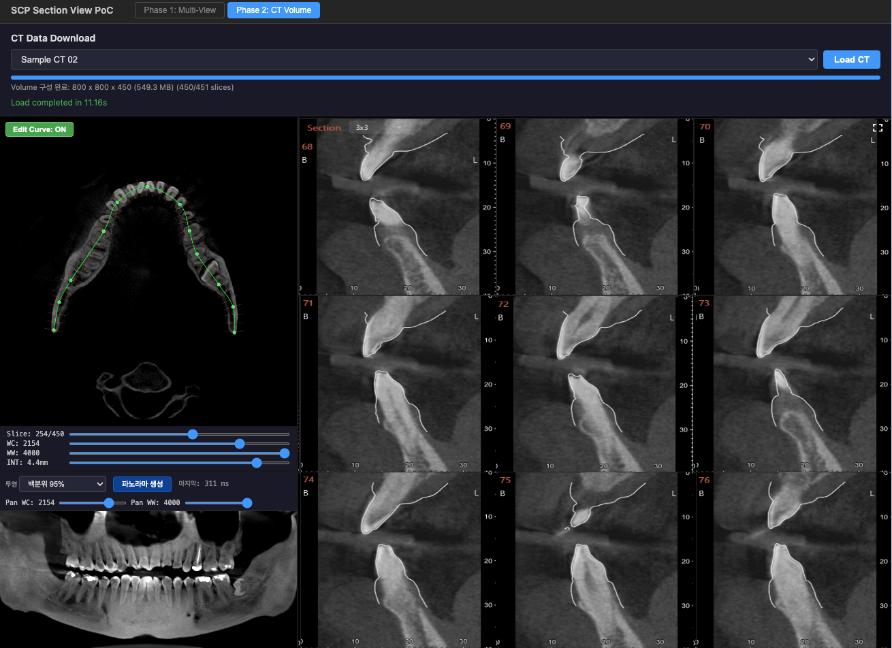

# Phase 4: 치열궁 곡선 기반 파노라마(Curved MPR) 연결 결과

## 개요

| 항목 | 내용 |
| --- | --- |
| 목표 | Phase 3 곡선·법선 정보로 메모리 CT Volume에서 파노라마용 2D `ImageData` 생성 후 Panorama 영역에 표시 |
| 기간 | 2026-05-05 ~ 2026-05-06 (PoC 구현 반영) |
| 상태 | 구현 완료(알고리즘·UI 연동, 후속 튜닝·성능 최적화는 별도) |
| 데모 사이트 | http://scp-section-demo.test.scp.esclouddev.com/ — 헤더 **CT Volume (Scout / Panorama)** 탭 → CT 로드 후 Panorama 상단 툴바 |
| 소스코드 | [Azure DevOps](https://dev.azure.com/ewoosoft/prototypes/_git/scp-section-poc) |
| 설계 상세 | [Phase 4: 치열궁 곡선 기반 파노라마(Curved MPR) 이미지 생성 기술 검증](https://vks.vatech.com/spaces/ESDEVELOPER/pages/303490289/Phase+4+%EC%B9%98%EC%97%B4%EA%B6%81+%EA%B3%A1%EC%84%A0+%EA%B8%B0%EB%B0%98+%ED%8C%8C%EB%85%B8%EB%9D%BC%EB%A7%88+Curved+MPR+%EC%9D%B4%EB%AF%B8%EC%A7%80+%EC%83%9D%EC%84%B1+%EA%B8%B0%EC%88%A0+%EA%B2%80%EC%A6%9D) |

## 구현 결과

### 레이아웃·경로 변화 (Phase 3 대비)

Phase 3 결과 문서의 레이아웃은 유지되나, **Volume이 로드된 경우 Panorama 슬롯**은 다음처럼 동작한다.

| 조건 | Panorama 렌더링 |
| --- | --- |
| `volume == null` | Phase 1과 동일 — WebGL 쿼드 + 정적 `panorama.png` |
| `volume` + `axialUi` 있음 | **Canvas 2D** — `generatePanoramaImageData`의 `ImageData`를 소스 캔버스에 올린 뒤 표시 캔버스에 비율 유지 스케일 |

헤더 두 번째 탭은 **Phase 2~4 통합 뷰**로 CT를 올리면 Scout(Axial·곡선)·Panorama·Section 3×3이 한 그리드에 함께 나온다. 탭 이름만으로 Phase 번호가 나뉘지 않는다(`App.tsx` 주석 참고).

### UI 흐름

1. **CT Volume (Scout / Panorama)** 탭에서 CT 로드.
2. Scout에서 곡선 제어점 **2개 이상** 배치(Phase 3). 단, 스플라인 시각은 Phase 3과 같이 **3점 이상**일 때 풀 곡선 표시일 수 있으므로, 화질 비교 시에는 3점 이상 사용을 권장.

3. Panorama 툴바에서 **투영**(MIP / Mean / 백분위 50·60·70·80·90·95%) 선택 → **파노라마 생성** 클릭.

4. 툴바에 **마지막 생성 ms** 표시. 생성 중에는 버튼·투영 `<select>`·**Pan WC / Pan WW** 슬라이더 비활성.

5. **곡선·현재 Axial 슬라이스 인덱스·투영 프리셋**이 바뀌면 이미지는 그대로이므로, 반영하려면 다시 **파노라마 생성**을 누른다.

6. **WC/WW**: Scout 하단과 동일 상태(`useScoutAxialUi`). **최초 생성 성공 후** WC/WW만 바꾸면 **약 280ms 디바운스** 뒤 자동 재생성. CT(Volume)를 다시 로드하면 파노라마 비트맵·자동 재생성 플래그가 초기화된다.

### 기본 생성 옵션(Core)

`DEFAULT_PANORAMA_OPTIONS`(`packages/core/src/panorama/panorama.ts`):

| 필드 | 기본값 | 의미 |
| --- | --- | --- |
| `panoramaColumnSpacingMm` | 0.4 | 곡선 호장 방향 열 간격(mm) |
| `slabHalfWidthMm` | 3 | 법선 방향 슬랩 반폭(mm) |
| `slabSampleStepMm` | 0.5 | 슬랩 내부 샘플 스텝(mm) |
| `projection` | `mip` | MIP / mean / percentile |
| `percentile` | 0.9 | percentile 모드 시 비율(0~1); UI 프리셋이 덮어씀 |

### 주요 구현 모듈

#### 1. `packages/core/src/panorama/panorama.ts`

- **`buildPanoramaCurveSamples`**: 제어점 2개면 직선 구간 호장 샘플, 3개 이상이면 `sampleAtInterval`(Catmull-Rom 기반)으로 열 샘플 + 법선 생성.
- **`generatePanoramaImageData`**: 열×전체 슬라이스(`z`) 이중 루프, 슬랩마다 trilinear HU → `reduceSlabHu`(MIP·mean·백분위) → WC/WW로 0–255 그레이 RGBA `ImageData`. `performance.now()`로 경과 ms 반환.
- **`percentileFromSorted`**: 정렬 HU에 선형 보간 백분위.

#### 2. `packages/components/src/PanoramaView.tsx`

- Volume 없음: 기존 WebGL 정적 텍스처 경로.
- Volume+`axialUi`: 툴바(MIP/Mean/백분위, 생성 버튼, ms, Pan WC/WW) + `startGenerateAsync`로 Core 호출, WC/WW 디바운스 자동 재생성(`hadPanoramaRef` 등).

#### 3. `packages/components/src/hooks/useScoutAxialUi.ts`

- `sliceIndex`, `windowCenter`/`windowWidth`, `curveEditor`를 Scout·Panorama에 공유. Volume 바꿀 때 슬라이스·WC/WW를 메타데이터 기준으로 맞춤.

#### 4. `packages/components/src/SectionViewer.tsx`

- `useScoutAxialUi(volume)` 한 번만 호출해 `ScoutView`·`PanoramaView`에 동일 `axialUi` 전달.

### 측정된 생성 소요 시간 (참고)

동일 PoC 조합(기본 `DEFAULT_PANORAMA_OPTIONS`, 사용 중 CT·브라우저·PC)에서 UI에 표시되는 **마지막 생성 ms**를 여러 차례 본 대략적인 범위다. 해상도·곡선 길이·투영·옵션에 따라 수치가 크게 바뀔 수 있다.

| 투영 | 관측 대략 범위 |
| --- | --- |
| **MIP** | 약 0.1 ~ 0.2초 |
| **Mean** | 약 0.1 ~ 0.2초 |
| **백분위**(슬랩마다 정렬·보간) | 약 0.3 ~ 0.4초 |

백분위가 더 걸리는 이유는 슬랩 후보 HU마다 `sort`와 선형 보간 백분위를 쓰기 때문이다.

**WASM 여부**: 위 정도면 메인 OnePager에서 잡은 **약 1초 이내** 목표에는 여유가 있다. 따라서 “속도만을 이유로” 지금 당장 WASM으로 옮길 **필요는 크지 않다**고 보는 것이 타당하다. WASM·Rust/AssemblyScript 도입 비용(빌드 파이프, 메모리 공유, 디버깅) 대비 이득이 명확하지 않을 수 있다.

WASM(또는 **Web Worker**에서 동일 JS 알고리즘 실행)을 검토할 만한 시점 예시는 다음과 같다.

- 볼륨이 훨씬 크거나 `panoramaColumnSpacingMm`·`slabSampleStepMm`을 촘촘히 해 **관측이 1초를 자주 넘기는** 경우
- 저사양 기기·모바일에서도 동일 UX를 맞춰야 하는 경우
- WC/WW 디바운스 재생성처럼 호출은 잦은데 루프가 메인 스레드 버벅임을 유발할 때(우선 **Worker**로 UI 스레드만 분리해 프로파일하는 편이 단순할 수 있음)
- 백분위를 쓰되 정렬 비용을 줄이는 **알고리즘 개선**(예: 선택적 히스토그램·근사)을 먼저 시도한 뒤에도 부족할 때

정리하면, **현재 체감 속도라면 WASM은 후순위**로 두고, 필요해지면 Worker·옵션 스윕·(백분위 쪽) 수학 최적화를 먼저 검토하는 흐름이 합리적이다.

## 성공 기준 달성 여부

| 기준 (OnePager 요약) | 달성 | 비고 |
| --- | --- | --- |
| 곡선·슬라이스·투영 변경 후 버튼으로 재생성 | O | 명시적 **파노라마 생성** |
| 치열궁을 따라 펼친 2D로 시각 판독 가능 수준 | O | 볼륨·곡선·윈도에 따라 상이; PoC 정성 평가 |
| Chrome 기준 생성 ~1초 목표 | O (관측 환경) | 아래 **측정된 생성 소요 시간** 참고; 볼륨·옵션·단말에 따라 재측정 |
| MIP·Mean·백분위(50~95%) UI 선택 | O | 생성 시 반영; 프리셋만 변경 시에는 재클릭 필요 |
| WC/WW 반영 + (생성 후) 변경 시 디바운스 재생성 | O | Scout·Panorama 슬라이더 공유 |

## 알려진 제한·주의

- Phase 3 오버레이의 Section Cut **빨간 수직선** 길이와 Core **`slabHalfWidthMm`** 은 별도 개념일 수 있음(OnePager 참고).
- 좌표·방향은 PoC에서 **축 정렬 볼륨** 등 단순화를 가정; Image Orientation Patient 전개는 후속 과제.
- 클라이언트 단일 스레드 JS 루프이므로 큰 볼륨·촘촘한 Δs에서는 UI 멈춤이 길어질 수 있음.

## 다음 단계

- Phase 5: Section 9뷰와의 곡선·슬라이스 연동, 필요 시 GPU 경로 검토.
- 성능: 관측이 목표를 크게 넘기거나 저사양 대응이 필요해지면 **Web Worker**로 메인 스레드 분리를 우선 검토하고, 그다음 병목이 명확할 때만 WASM·옵션 스윕·백분위 최적화를 비교한다.
