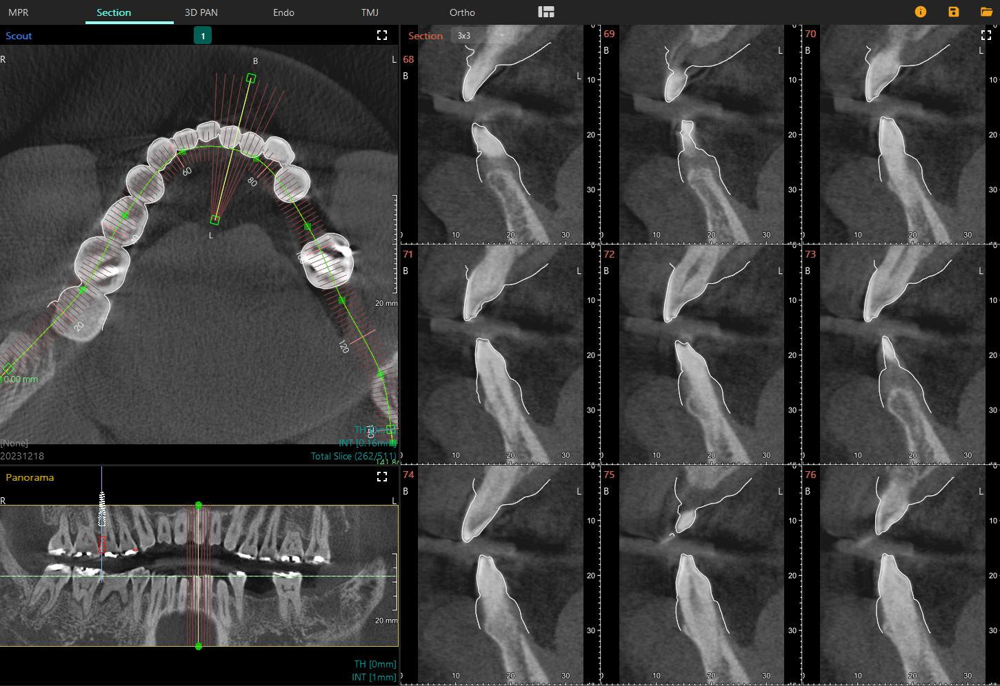
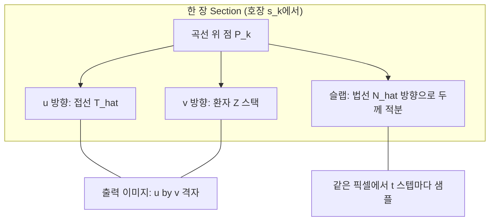
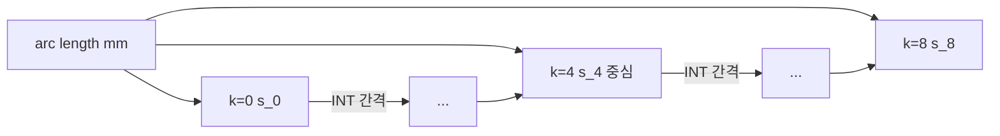
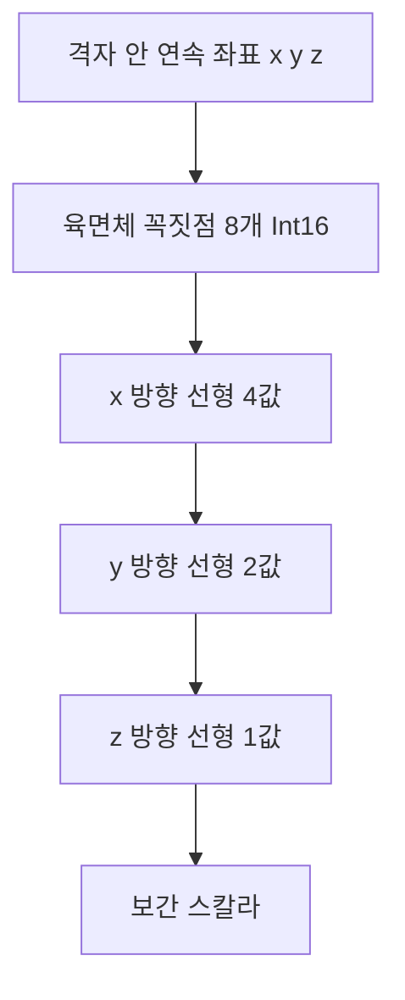

Engineering One Pager

## Project Name

Phase 5: 9개 Cross-Section 이미지 실시간 생성·표시(WebGL vs Canvas 2D·**JS / WASM(복사) / WASM(상주) 연산** 비교)

## Date

- **기획/제출(초안)**: 2026-05-07
- **상태**: 진행 중 — WebGL2/Canvas2D 표시 경로, 연산(JS·WASM 매번 복사·WASM 상주) 9장 생성·툴바 ms 표시

## Submitter Info

Raymond

## Project Description

Phase 3의 치열궁 곡선과 Phase 4의 파노라마 위에서, 사용자가 고른 **Section 위치**를 기준으로 **곡선에 수직인 9장의 단면(Cross-Section)** 을 **실시간 생성**하여 우측 3×3 Grid에 표시한다. Phase 1에서 검증한 **단일 Section Canvas + 9 Viewport(Scissor)** 흐름과 호환되며, Phase 4에서 정의한 **호장(arc length)·법선·슬랩** 수학을 그대로 재사용한다.

**참고 이미지**

Phase 4 PoC 데모(동일 레이아웃에서 Section 구현 예정):

CleverOne Section 화면(참고 UI):

**선행 조건**: Phase 2(Volume), Phase 3(곡선·법선·INT(mm)), Phase 4(파노라마 생성·툴바·`useScoutAxialUi`).

**상위 로드맵**: [0.Web Section View PoC OnePager](https://vks.vatech.com/spaces/ESDEVELOPER/pages/302045944/0.Web+Section+View+PoC+OnePager)

---

## CleverOne 비교 (도해·`CleverOneSectionView.png` 참고)

| 시각 요소 | CleverOne | 본 PoC |
| --- | --- | --- |
| Scout 위 9 단면 표시 | 9개 빨간 짧은 선들이 곡선 위에 1~9 번호로 정렬 | 동일 의미. 번호는 **3×3 그리드 매핑**과 일치. |
| Panorama 위 단면 위치 | 세로 9선 + 가로 2선(상·하 핸들) | 동일. 가운데 1선이 **현재 중심**, 좌우 4선이 ±k·INT. |
| Panorama 우측 Ruler | 있음(mm 자) | **PoC 미구현**(시야 단순화). |
| Section 칸 라벨 | B / L 등 방향, 1~9 번호, mm 자 | 1~9 번호·B/L 방향만. **눈금(ruler)·축선 미구현**(필요 시 캡션 한 줄). |
| 위치 변경 | Scout/Panorama 핸들 드래그 | 동일. 키보드 좌·우 키로 INT 단위 미세 이동 가능(선택 사항). |

---

## Section 위치·범위 정의

### Section 중심 위치 `sectionCenterMm`

- 곡선 호장 좌표(0 ~ `arcLengthMm`)에서 **현재 중심 위치**.
- ScoutView·PanoramaView는 같은 값을 공유(다음 절). 두 입력 중 **나중에 바뀐 쪽**이 곧바로 반영된다.

### 9장 위치

- `INT`(Phase 3 슬라이더 값, mm). Section 9장의 **호장 간격** 으로 그대로 쓴다.
- `s_k = clamp(sectionCenterMm + (k - 4) * INT, 0, arcLengthMm)`, `k = 0..8`.
- 곡선이 짧아 9장이 다 들어가지 않으면 **양 끝에서 클램프** 되며, **번호·표시는 그대로 9칸**(중복으로 보일 수 있음). 결과 문서에 케이스 기록.

### 한 장 단면의 기하

- 한 장은 **2D 평면 직사각형** 으로, **3D 평면**은 다음과 같다.
  - **원점** `P_k = curve(s_k)` (Axial 슬라이스 픽셀에서 시작, 곡선 슬라이스 인덱스로 z 결정)
  - **가로축** = 곡선 접선 `T̂_k`(Axial 평면 내 단위벡터)
  - **세로축** = 환자 z(슬라이스 스택 방향)
  - **법선** = `N̂_k`(Axial 평면 내 곡선에 수직, 슬랩 두께 방향)
- 출력 픽셀 `(u, v)`: `u ∈ [-W/2, +W/2]`(`sectionWidthMm`), `v ∈ [topMm, bottomMm]`. 슬랩은 Phase 4와 동일하게 `±slabHalfWidthMm`을 `N̂_k`로 ±방향 적분.

### Top / Bottom 자르기 (Panorama 가로 핸들)

- **목적**: 큰 FOV에서 치아 외 주변 뼈를 잘라 Section의 세로 길이·생성 비용을 줄인다.
- Panorama 좌·우 끝에 **수평 핸들 2개**(상·하). 드래그로 mm 단위 조절.
- 초기값: 볼륨 z 범위(`0..nz·spacing[2]`) 안에서 자동 추정(예: 중심 ±50 mm) 후 사용자가 조정.
- Section의 `v` 범위가 곧 `[topMm, bottomMm]`. 동시에 **Panorama의 보이는 영역**도 동일 범위로 자르거나 두 핸들 사이 영역을 강조한다(둘 중 단순한 쪽 채택, 결과 문서에 표기).

### 슬랩(법선 방향) 두께

- Phase 4와 같은 `slabHalfWidthMm`/`slabSampleStepMm`/투영(MIP/Mean/백분위) 옵션을 **재사용**한다(공유 옵션 또는 Section 전용 사본 — 1차 PoC는 **공유**).

---

## UI 결정

### Scout View (좌상)

- 곡선 위 **클릭** 또는 기존 곡선 영역에서 **드래그** 시 가장 가까운 호장 위치를 `sectionCenterMm`로 설정.
- Phase 3의 “수직 짧은 빨간 선”은 그대로 두되, **현재 9장에 해당하는 9개 선**은 **굵게/번호와 함께** 강조한다.
- Edit Curve 모드일 때는 위치 선택을 **막는다**(드래그 충돌 방지). 둘 중 한 가지 모드만.

### Panorama View (좌하)

- 가로 위·아래에 **Top / Bottom 핸들**(반투명 막대) 표시·드래그.
- 세로선 9개 표시. **가운데(굵은) 선**을 좌우로 드래그하면 9개가 함께 이동(`sectionCenterMm` 변경).
- 좌우 4개의 보조선은 표시만(드래그하면 일부 PoC만 가운데 선과 동일하게 동작; 1차에서는 **표시만**).
- 파노라마 영역 우측 **Ruler 미표시**.
- 기존 Phase 4 툴바는 그대로(투영·생성·Pan WC/WW).

### Section View (우, 3×3)

- 칸 좌상단 작은 **번호 1~9**(좌→우, 위→아래 = `s_0..s_8`).
- 좌/우 가장자리에 작은 **B / L** 텍스트(법선 부호 규약에 따른 buccal/lingual 가이드).
- **눈금(ruler)·축선은 PoC에서 미구현**.

### Section View 렌더·연산 토글 (PoC 핵심 검증)

- Section 영역 상단에 **표시: WebGL2 ▾ / Canvas 2D ▾** 토글(Phase 1과 동일한 9 Viewport·Scissor vs `putImageData`).
- **연산 토글**(PoC용): 동일 `ImageData`를 가리키는 경로를 **JS** / **WASM (매번 복사)** / **WASM (상주)** 중에서 고른다(`useScoutAxialUi`의 `SECTION_COMPUTE_INCLUDE_LEGACY_WASM_COPY`가 `false`이면 레거시 “매번 복사” 항목은 툴바에서 숨기고 **JS + WASM(상주)** 만 노출).
  - **JS**: `generateSectionImagesData`(볼륨은 힙 그대로 참조).
  - **WASM (매번 복사)**: 호출마다 CT `Int16` 전체를 WASM 선형 메모리에 복사 후 `sectionGenerate9`(기존 Phase 5 Baseline 비교용).
  - **WASM (상주)**: `initSectionWasm` 이후 **동일 `CTVolume` 객체 참조**가 유지되는 동안 볼륨 복사를 생략하고, Section 위치·옵션 변경 시 곡선 버퍼 채우기 + `sectionGenerate9`만 반복한다. 새 볼륨 로드 등으로 `volume` 참조가 바뀌면 자동으로 한 번 다시 복사한다.
- **`@ewoosoft/scp-section-wasm`**: `generateSectionImagesDataWasm`(복사 매번), `generateSectionImagesDataWasmResident`(상주). 곡선 전처리·`s_k`·B/L 반전 규약은 JS 코어와 동일, 핫패스는 WASM.
- **9장 생성 ms**는 선택된 연산 기준으로 표시한다. 구현상 `elapsedMs`는 **`nU`/`nV` 확정 직후 ~ 9장 `ImageData` 완성**이다(세부·공정 정의는 `Phase5_SectionView_결과.md` 3.1절).
- 두 표시 경로(WebGL2/Canvas2D)는 같은 `ImageData`를 소비하므로 화면 차이는 미미할 수 있다(연산 토글은 시간 비교가 목적).

### 생성 트리거 (자동/실시간)

- **별도 “Section 생성” 버튼은 두지 않는다.** 다음 조건 변화에 즉시(또는 짧은 스로틀 후) 9장을 다시 만든다.
  - `sectionCenterMm`, `INT`, `topMm`/`bottomMm`, `sectionWidthMm`, **WC/WW**, **곡선**, **현재 곡선 슬라이스 인덱스**, 투영·슬랩 옵션, **표시(WebGL2/Canvas2D)**, **연산(JS / WASM 복사 / WASM 상주)** 토글.
- 마우스 드래그 같은 **연속 입력**은 약 **1 frame 스로틀(또는 60 ms 디바운스)** 정도로 제한. 일정 ms 안에 끝나면 그대로 매 프레임 재계산.
- **목표는 끊김 없는 갱신**이므로 “명시적 버튼”은 본 PoC의 검증 의도와 반대다.

### 파노라마 재생성 시 Section

- 파노라마(곡선·INT 등) 변경 시 **곧바로 새 9장**을 만든다.
- `sectionCenterMm`은 **새 곡선 길이 안에 있으면 그대로**, 벗어나면 **곡선 중앙(`arcLengthMm/2`)으로 리셋**.
- `topMm/bottomMm`은 **유지**(볼륨이 같으니 z 범위가 그대로).

### WC/WW 공유

- Phase 4와 동일하게 `useScoutAxialUi`의 WC/WW를 **Scout·Panorama·Section이 모두 공유**한다. Section 전용 슬라이더는 1차 PoC에서 두지 않는다(필요 시 후속).

---

## 알고리즘: Section 픽셀 생성 (개발자 요약)

다음은 **구현(`generateSectionImagesData` / WASM `sectionGenerate9`)과 동일한 순서**로 정리한 것이다. Phase 4 파노라마의 **삼선형 보간·슬랩·투영** 커널을 공유하지만, **단면 평면·슬랩 축**은 Section 전용 기하(본 OnePager 상단 **「한 장 단면의 기하」**·결과 문서 **4.4 Section 단면 기하** 참고)를 따른다. Phase 4 문서 `Phase4_Panorama_OnePager.md` §3 복셀 샘플링과 **보간식 의미는 같고**, **3D 점을 어떻게 찍는지만 다르다**고 보면 된다.

### 입력·출력

- **입력:** 메모리상 CT 볼륨(`Int16` 격자 + `dimensions`·`spacing`·rescale·윈도), 치열궁 제어점, `sectionCenterMm`, INT, `topMm`/`bottomMm`, `sectionWidthMm`, 슬랩·투영 옵션.
- **출력:** 호장 위치가 다른 **9장**의 `ImageData`(각 **nU×nV** RGBA). 격자 해상도는 한 번에 결정되며 9장이 공유한다.

### 격자 해상도 `nU`, `nV`

- **nU(가로, u):** `sectionWidthMm` 을 in-plane 간격 `min(spacing[0], spacing[1])` 으로 나눈 뒤 올림, **최소 16**.
- **nV(세로, v):** **`topMm` ~ `bottomMm`** mm 구간을 `spacing[2]`(슬라이스 간격)로 나눈 뒤 올림, **최소 16**.

### 한 장(인덱스 `k = 0..8`)의 기하

1. 호장 `s_k = clamp(sectionCenterMm + (k - 4) * INT, 0, arcLengthMm)`.
2. 곡선 코어에서 `P_k`, 단위 접선 `T̂_k`, 단위 법선 `N̂_k` 를 구한다(`evaluateCurveAtArcMm`).
3. 단면 평면: **u축 = `T̂_k`**, **v축 = 환자 Z(슬라이스 스택 방향)**. **슬랩(법선 두께)** 은 **`N̂_k` 방향**으로 `±slabHalfWidthMm` 을 `slabSampleStepMm` 간격으로 샘플한다(Phase 5에서는 파노라마 “한 열”과 평면 정의가 어긋나지 않도록 이 축을 쓴다).

### 출력 픽셀 하나`(iu, j)`마다 수행하는 일

1. 해당 픽셀의 **u(mm), v(mm)** 에 대응하는 기준점 `Q` 를 단면 평면 위에 둔다(구현에서는 `uMm`, `zMm` → `baseX/baseY` 및 `fz` 로 환산).
2. **슬랩:** `t` 를 따라 `Q' = Q + t * N̂_k` 를 찍고, 각 점을 볼륨의 **연속 복셀 인덱스** `(fx, fy, fz)` 로 변환한다.
3. **`sampleTrilinear`:** 각 샘플에서 **포함 격자 육면체의 꼭짓점 8개** `Int16` 값을 읽고, **삼선형(trilinear) 보간**으로 스칼라를 얻는다. **최근접 한 픽셀만 쓰는 방식이 아니고**, 인근 여러 점에 대한 **거리 반비례 가중(IDW)** 도 아니다. **x·y·z 각 방향 선형 가중**의 합성이다. **z도 연속 인덱스**이므로 **인접 슬라이스 두 층** 값이 섞인다(이미 `volume.data`에 스택된 뒤 3D로 보간).
4. 슬랩을 따라 모인 HU에 **MIP / Mean / Percentile** 적용 → 한 픽셀당 스칼라 HU.
5. **Rescale**(`rescaleSlope`, `rescaleIntercept`) 후 **윈도**(`windowToByte(WC, WW)`) → 0–255.
6. **B/L 관례:** 법선 방향 출력 열을 **좌우 반전**한다(`iu` → `nU - 1 - iu`, CleverOne 등과 정렬).

### 코드 위치

| 역할 | 경로 |
| --- | --- |
| JS 9장 생성 | `scp-section-poc/packages/core/src/section/section.ts` — `generateSectionImagesData` |
| 삼선형 보간 | `packages/core/src/panorama/panorama.ts` — `sampleTrilinear` |
| WASM 핫패스 | `packages/section-wasm/assembly/index.ts` — `sampleTrilinear`(동일 수식), `sectionGenerate9` |
| WASM 글루 | `packages/section-wasm/src/index.ts` |

### 다이어그램 (Mermaid)

**정적 도식(PNG):** Axial 뷰에서 곡선·`P_k`·`T_hat`·`N_hat`과 단면 평면(`u`×`v`)·슬랩 방향을 묶어 표현한 스케치다. 의학 해부 정확도보다 **코드에서 쓰는 축 관계** 전달이 목적이다.

아래 Mermaid는 GitHub·일부 뷰어에서 렌더된다. 로컬에서는 Mermaid 지원 미리보기를 쓰거나 [Mermaid Live Editor](https://mermaid.live)에 붙여 확인하면 된다.

**1) 한 장 Section의 축(단면 평면 vs 슬랩 방향)**

**2) 호장 따라 9장 배치(INT)**

**3) 출력 픽셀 하나 처리 파이프라인**

**4) 삼선형 보간(개념)**

---

## JS → WASM 전략 (Phase 5에 포함)

| 단계 | 결정 |
| --- | --- |
| 1차 | **JS·WASM(복사)·WASM(상주) 제공**: 툴바 연산 선택. WASM은 `packages/section-wasm`(AssemblyScript). 볼륨은 64KiB 이후에 두어 AS 정적 데이터와 충돌 방지. **상주**는 동일 `CTVolume` 참조 시 **매 호출 복사 생략**으로 “위치만 바꿀 때” ms를 줄인다. |
| 2차(필요 시) | 메인 스레드 블로킹이 보이면 **Web Worker**에 JS 또는 WASM 인스턴스를 옮겨 UI 분리. |
| 3차(Phase 6) | SIMD·Rust 등으로 확장하거나 서버 오프로드 검토. Phase 5 결과(ms·정확도)를 Phase 6 베이스라인으로 사용. |

처음에 JS만 두지 않고 WASM을 Phase 5에 넣은 이유: PoC에서 **체감·수치 비교**를 빠르게 하고, 이후 Phase 6에서 동일 스펙으로 심화하기 위함.

---

## WebGL vs Canvas 2D·JS·WASM(복사)·WASM(상주) 비교 (PoC 핵심 검증)

### 측정 항목

- **위치 드래그 중 평균 FPS / 95퍼센타일 프레임 ms**
- **9장 1회 생성 ms** — 연산(JS), WASM(복사), WASM(상주) 각각(툴바·콘솔 로그). `elapsedMs` 정의: **`nU`/`nV` 확정 후 ~ 9장 `ImageData` 완성**(WASM은 이 구간에 볼륨 복사·`sectionGenerate9`·RGBA 패킹 포함; **`initSectionWasm` 제외**). 상세는 `Phase5_SectionView_결과.md` 3.1절.
- **메인 스레드 long task** 발생 빈도(가능하면 PerformanceObserver)
- 시각 비교: WebGL2·Canvas2D는 **스케일/필터** 차이만 있을 수 있음. JS·WASM은 동일 `ImageData`가 목표.

### 비교 조건

- 같은 `INT`, `topMm/bottomMm`, `sectionWidthMm`, 슬랩, 투영, WC/WW.
- 연산 **ms만** 비교할 때는 **표시 모드(WebGL2 등)를 고정**하고 연산 토글만 바꾼다. **WASM(복사)** vs **WASM(상주)** 는 동일 볼륨·동일 조건에서 드래그 반복 시 상주 쪽이 유리한지 확인한다.
- 같은 입력 디바이스(마우스)로 같은 패턴 드래그.

### 성공 기준 (Phase 5)

1. 9개 Section이 **드래그 중에도 끊김 없이** 보이며, **WebGL2 경로**에서 **30 FPS 이상**(또는 체감상 끊김 없는 수준)을 달성한다.
2. **Canvas 2D 경로**도 동작하여 같은 화면을 만들고, FPS/ms 비교 수치를 결과 문서에 남긴다.
3. **JS·WASM(복사)·WASM(상주)** 연산이 동작하고, 동일 조건에서 **9장 생성 ms**를 기록·비교한다(상대 우열은 볼륨·브라우저마다 다를 수 있음).
4. ScoutView·PanoramaView 어느 쪽에서 위치를 바꿔도 **양쪽 표시·9장 결과가 동기화**된다.
5. Top/Bottom 핸들 조절이 즉시 9장에 반영되며, FOV가 큰 볼륨에서도 **불필요한 세로 영역을 잘라** 사용성을 확보한다.
6. 곡선·INT가 바뀌면 9장이 즉시 갱신되고, `sectionCenterMm` 보존/리셋 규칙대로 동작한다.

---

## 좌표계 (요약)

| 좌표계 | 설명 |
| --- | --- |
| Slice px | Phase 3과 동일. Axial 슬라이스 내 곡선·핸들의 기본 단위 |
| Arc length mm | 곡선 호장. `sectionCenterMm`, `s_k`, INT의 단위 |
| Section local mm | 한 장 평면 내부 `(u, v)` 좌표. `u`는 접선, `v`는 z |
| Panorama px → mm | Phase 4의 `panoramaColumnSpacingMm`로 환산. Top/Bottom 핸들은 mm로 저장 |

---

## 동작 규칙 (PoC)

- Volume·곡선(제어점 ≥ 2)·`topMm < bottomMm` 이 모두 만족할 때만 9장 생성.
- 위 조건을 만족하지 않으면 Section 칸은 **검은 배경 + 짧은 안내**.
- 드래그 중 스로틀 정책으로 **메인 스레드 부하 제어**, 끝났을 때 마지막 값으로 1회 마무리 갱신.
- **렌더·연산 토글** 변경 시 즉시 새로 그림(동일 입력이면 `ImageData`는 경로만 다르고 동일해야 한다).
- `INT`의 의미는 Phase 3과 동일(`Section Cut 표시 간격` 그대로). UI에 별도 라벨 두지 않음.

---

## 좌표 부호·번호 매핑 규약

- 9칸 그리드 위치 (행, 열): `(0,0)=k0`, `(0,1)=k1`, `(0,2)=k2`, `(1,0)=k3`, …, `(2,2)=k8`.
- `s_k = sectionCenterMm + (k - 4) * INT` 이므로 가운데 칸이 **현재 중심 단면**.
- 법선 방향 `N̂_k`: Phase 3의 `perpendicularFromTangent` 부호 규약을 따른다(buccal/lingual은 추후 메타로 결정, B/L 라벨은 그 규약에 맞춰 표시).

---

## Risk Assessment

| 리스크 | 영향도 | 발생 가능성 | 대응 방안 |
| --- | --- | --- | --- |
| 드래그 중 30 FPS 미달 | 중 | 중 | Worker 분리. `sectionWidthMm`/`slabSampleStepMm` 스윕. WASM은 이미 Phase 5에서 비교 가능 |
| WASM 볼륨 복사·메모리 grow 비용 | 중 | 중 | **WASM(상주)** 로 드래그 경로 완화. Baseline 비교는 **WASM(복사)** 유지. `SECTION_COMPUTE_INCLUDE_LEGACY_WASM_COPY`로 UI 정리 |
| 곡선 변경 시 `sectionCenterMm` 의미 변동 | 중 | 중 | 위 보존/리셋 규칙. 결과 문서에 케이스 기록 |
| FOV가 큰 볼륨에서 세로 영역 비대 | 중 | 중 | Top/Bottom 핸들 기본값 자동 추정 + 사용자 조정 |
| 9 Viewport(Scissor) 단일 캔버스 vs 9 캔버스 선택 | 중 | 중 | 1차는 단일 WebGL2 캔버스 + Scissor; 비교 필요 시 9 캔버스 변형 추가 측정 |
| Canvas 2D 경로의 연속 갱신이 메인 스레드 점유 | 중 | 중 | 토글로 비교 명확화. 측정 결과로 권장 경로 명시 |
| Phase 3 Edit Curve 와 위치 드래그 충돌 | 낮음 | 중 | Edit 모드 동안 Section 위치 핸들을 비활성 |

---

## Resource and Scheduling Details

- **기간**: 1주(5일) 목표(메인 OnePager와 동일 오더)
- **인력**: 1명 (TS + WebGL2)
- **산출물**: Section Core 모듈(JS), **`@ewoosoft/scp-section-wasm`**(AssemblyScript·`section.wasm`), `ScoutView`·`PanoramaView` 위치 핸들, `SectionGrid` 표시 토글(WebGL2/Canvas2D)·**연산 토글(JS / WASM 복사 / WASM 상주)** , FPS·ms 측정·결과 문서

| Day | 작업 | 산출물 |
| --- | --- | --- |
| 1 | `sectionCenterMm` 공유 상태(`useScoutAxialUi` 확장), Scout/Panorama 핸들 UI, 9장 위치 계산 | 핸들 동작 |
| 2 | Section Core(JS): 9장 `ImageData` 동시 생성, Top/Bottom·INT 반영 | Core 함수 + 단위 테스트 |
| 3 | **Canvas 2D 경로** 표시 + 드래그 스로틀 + WC/WW 공유 | 1차 동작 영상 |
| 4 | **WebGL2 경로**(9 Viewport/Scissor) + 표시 토글 + **연산 토글(JS·WASM 복사·WASM 상주)** + 생성 ms 표시 | 비교 측정 |
| 5 | 결과 md·스크린샷, OnePager 링크 갱신, 필요 시 Worker 1차 실험 | 문서 |

---

## Technical Description

### 핵심 함수(예상 시그니처)

- `generateSectionImagesData(...)` — JS 핫패스.
- `generateSectionImagesDataWasm` / `generateSectionImagesDataWasmResident` / `initSectionWasm(wasmUrl)` — `@ewoosoft/scp-section-wasm`. 데모는 `predev`/`prebuild`로 `section.wasm`을 `public/section-wasm.wasm`에 복사하거나 Vite 미들웨어로 서빙 후 `/section-wasm.wasm` fetch.
- WebGL 경로는 위 결과를 **9 Texture 업로드** 후 단일 캔버스의 9 Viewport에 그린다(또는 동일 텍스처 + per-section uniform).

### 산출물

1. 본 OnePager + Phase 5 결과 md(구현 후)
2. `packages/core` 내 `section/` 모듈, **`packages/section-wasm`**, `useScoutAxialUi` 확장(`sectionComputeMode`, `SECTION_COMPUTE_INCLUDE_LEGACY_WASM_COPY`)
3. `ScoutView` 9장 강조 표시, `PanoramaView` 세로 9선 + Top/Bottom 핸들, `SectionGrid` Canvas 2D / WebGL2·**연산(JS·WASM 복사·WASM 상주)** 토글
4. 비교 결과(평균 FPS, 95퍼센타일 ms, **JS / WASM(복사) / WASM(상주)** 9장 생성 ms, 시각 비교 캡처)

### 참고 (용어)

- **Cross-Section / Buccolingual section**: 치열궁 곡선에 수직인 평면 영상.
- **Scissor**: WebGL에서 한 캔버스를 N영역으로 자르는 GL 상태.
- **Stroke 30 FPS**: 마우스 입력 → 다음 프레임에 갱신될 때 보이는 평균 frame rate.
