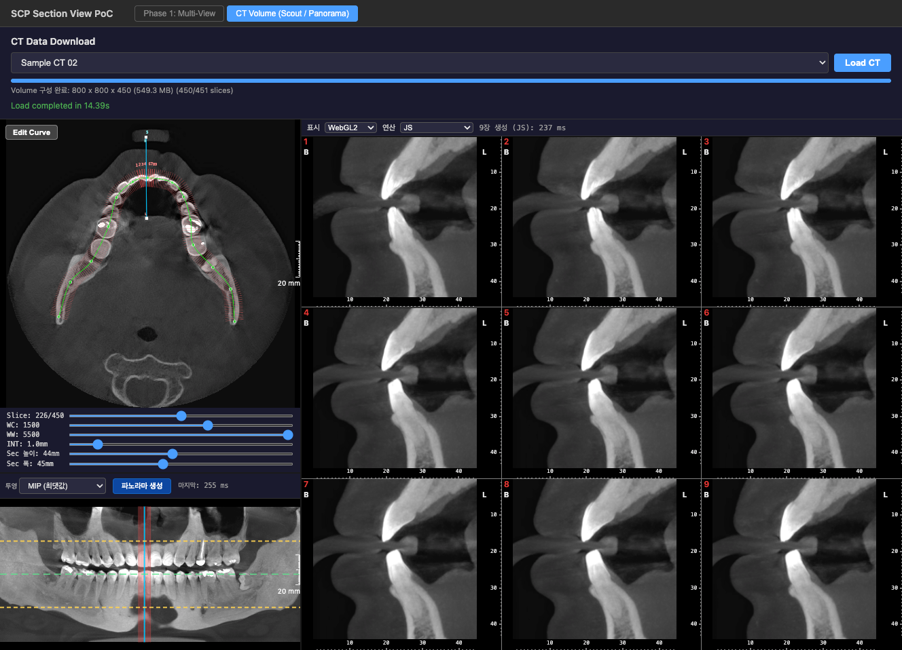
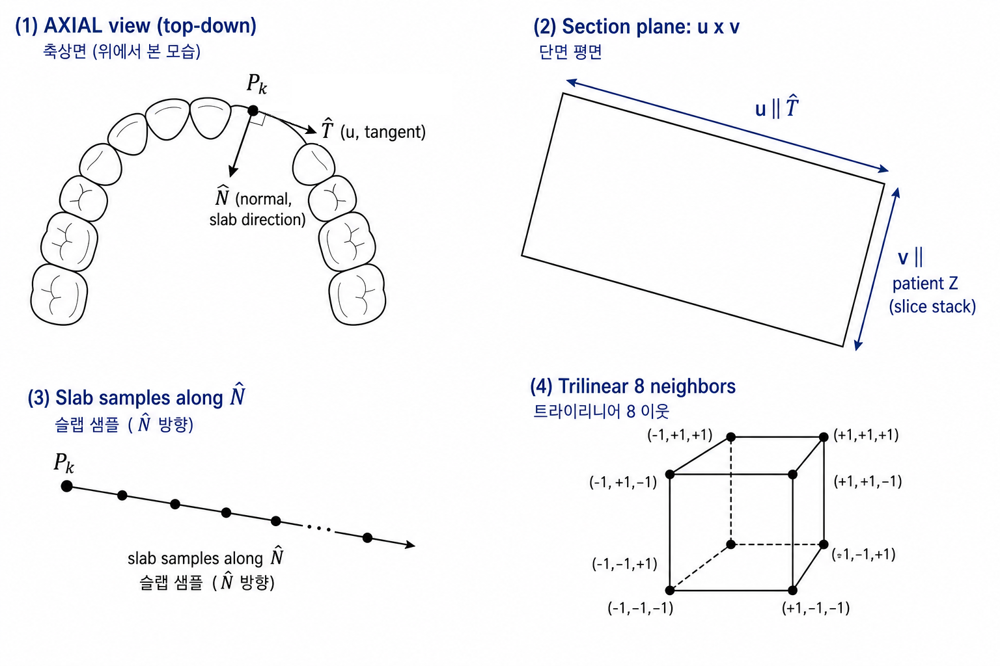

# Phase 5: Section View(9장 Cross-Section) 결과 보고

## 1. 개요

Phase 3 치열궁 곡선과 Phase 4 파노라마에 이어, 사용자가 지정한 **Section 중심**을 기준으로 곡선에 수직인 단면 9장을 생성해 우측 3×3 그리드에 표시하는 PoC를 구현했다.

비교한 항목은 다음 두 축이다.

- **표시 경로**: WebGL2 / Canvas 2D
- **연산 경로**: JS / WASM(매번 복사) / WASM(상주)

픽셀 생성 알고리즘(삼선형 보간·슬랩·윈도) 상세는 [Phase 5: 9개 Cross-Section 이미지 실시간 생성·표시(WebGL vs Canvas 2D·JS / WASM(복사) / WASM(상주) 연산 비교)](https://vks.vatech.com/spaces/ESDEVELOPER/pages/305058086/Phase+5+9%EA%B0%9C+Cross-Section+%EC%9D%B4%EB%AF%B8%EC%A7%80+%EC%8B%A4%EC%8B%9C%EA%B0%84+%EC%83%9D%EC%84%B1%C2%B7%ED%91%9C%EC%8B%9C+WebGL+vs+Canvas+2D%C2%B7JS+vs+WASM+%EC%97%B0%EC%82%B0+%EB%B9%84%EA%B5%90)의 알고리즘 절과 본 문서 4.2절을 본다.

---

## 2. 결과 화면

CT 볼륨 로드 후 Scout · Panorama · Section이 동시에 동작하는 화면이다.

스크린샷 예시 조건:

- 샘플 볼륨: 496 × 496 × 399 (약 187 MB)
- 투영: MIP(최댓값), INT 1.0 mm
- WC / WW: 3000 / 9100 (Scout·파노라마·Section 공유)
- Scout 하단 **Sec 폭·Sec 높이** 슬라이더로 단면 가로(mm)·Z 구간 길이(mm) 조절 가능(폭/높이는 포인터 업·blur에서 커밋)
- Section 표시: WebGL2, 연산 모드 예시(WASM 경로): 툴바 약 445 ms (한 시점 값. 3.1절 표는 콘솔 다중 샘플 평균)

같은 조건에서 파노라마 1회 생성은 화면상 약 132 ms 수준으로, 9장 Section은 단일 파노라마보다 명확히 무거운 작업이다.

---

## 3. 성능 비교

### 3.1 9장 생성 시간 (콘솔 측정)

같은 볼륨에서 Scout/Panorama로 Section 위치를 연속 변경하며 `console.log`로 남긴 `{ "tag":"SectionGen", "mode", "ms" }` 샘플을 모아 산출했다.

`ms` 정의(JS·WASM 공통): **`nU`/`nV` 확정 직후 ~ 9장 `ImageData` 준비 완료**까지. 다음을 포함한다.

- JS: 본 절에서 `buildCurveArcContext` 이전 단계는 제외.
- WASM: 힙 레이아웃, `mem.grow`, (경로에 따라) 전체 볼륨 `Int16` 복사, 곡선 버퍼, `sectionGenerate9`, RGBA → `ImageData` 복사 포함.
- 둘 다 `initSectionWasm`(최초 fetch/instantiate)은 제외.

| 연산 경로 | 표본 수 n | 평균 ms | 최소~최대 ms |
| --- | ---: | ---: | --- |
| JS (`generateSectionImagesData`) | 16 | 393.2 | 362.7 ~ 427.4 |
| WASM 매번 복사 (`generateSectionImagesDataWasm`) | 19 | 420.3 | 370.9 ~ 483.2 |
| WASM 상주 (`generateSectionImagesDataWasmResident`, 동일 `CTVolume`) | 19 | 415.9 | 371.9 ~ 454.9 |

해석:

- 평균 순서는 **JS < WASM(상주) < WASM(매번 복사)**. 매번 복사 쪽은 호출마다 187 MB 볼륨 복사가 들어가므로 평균·최댓값이 가장 큰 것이 자연스럽다.
- 상주는 복사를 생략해 매번 복사 대비 평균 약 4 ms 낮았으나, JS 대비는 여전히 약 23 ms 높다.
- 표본별 분산이 크고(`wasm-copy` 최대 483 ms), 콘솔에 long task 경고가 뜨는 등 **체감 지연은 표 ms보다 클 수 있다.**

### 3.2 “WASM이 더 빠르지 않은” 이유

PoC에서 JS가 자주 더 빠른 이유는 한 가지가 아니라, 다음 요인이 누적된 결과로 본다.

| 요인 | 내용 |
| --- | --- |
| 측정 구간에 **글루·복사 포함** | `elapsedMs`에는 볼륨 `Int16` 복사, JS↔WASM 경계, RGBA → `ImageData` 패킹이 같이 들어간다. 핵심 보간만 떼어 놓은 시간이 아니다. |
| **JS는 제자리 샘플링** | `volume.data`(`TypedArray`)를 그대로 읽기 때문에 “복사·경계 비용 0”에서 출발한다. |
| **JIT 친화적 핵심 루프** | 삼선형·슬랩 루프는 분기가 단순하고 `Float64`/`Int32` 위주라 V8 등 JIT가 잘 최적화한다. |
| **AssemblyScript 툴체인** | `section-wasm`은 AssemblyScript 기반이다. C++/Rust(LLVM) 대비 동일 알고리즘이라도 생성 코드 품질·SIMD/벡터화 여지가 다를 수 있다. “언어가 느리다”라기보다 **컴파일·튜닝 폭의 차이**에 가깝다. |

요약하면, 이번 측정은 **WASM 핫패스가 느려서**가 아니라 **WASM 경로가 측정 구간 안에서 추가로 해야 할 일(복사·글루·패킹)이 있고, JS 쪽이 그 일을 안 해도 되는 구조**라 평균이 비슷하거나 JS가 약간 빠르게 나오는 것이다.

### 3.3 그래도 WASM이 유리한 경우

“WASM이 빠르다”고 일반적으로 이야기되는 전형은 다음 조건과 겹칠 때다. 이번 Section PoC는 이 조건과 부분적으로만 겹친다.

- **길고 무거운 순수 CPU 루프** (압축·해시·암호, DSP 등). 분기·할당이 적고 연속 버퍼 위 루프가 오래 도는 형태.
- **C/C++/Rust로 이미 튜닝된 라이브러리 이식**.
- **SIMD·멀티스레드**가 가능한 환경에서의 큰 덩어리 연산.
- 평균보다 **worst case·편차**가 중요한 워크로드(JS의 JIT 편차·GC 스파이크 회피).

따라서 “WASM 채택” 결정은 “이번 구간이 위 4가지 중 어디에 가까운가”와 “복사·글루를 얼마나 줄일 수 있는가”를 같이 본다.

### 3.4 WebGL2 vs Canvas 2D (표시)

- 두 경로 모두 **같은 9장 `ImageData`** 를 소비한다.
- 시각적으로는 차이를 거의 느끼기 어렵다. WebGL2가 텍스처 선형 보간 등으로 미세하게 부드러울 수 있는 정도.
- Section은 해상도·연산이 지배적이라, 표시 방식만으로 체감이 크게 바뀌지는 않는다.

---

## 4. 개발 과정에서 정리한 기술 사항

### 4.1 볼륨 축·메타데이터(`dimensions`, `spacing`)

- `dimensions`: `[columns, rows, sliceCount]`, 즉 X(열) · Y(행) · Z(슬라이스 개수).
- `spacing`: `[pixelSpacingX, pixelSpacingY, sliceSpacing]` (mm). DICOM `Pixel Spacing`(보통 row\column 문자열)을 파싱해 **열·행 순으로 재배치**한다.
- Z 간격(`spacing[2]`)은 인접 슬라이스 `Image Position Patient`의 z 차이를 우선 쓰고, 비정상이면 DICOM `(0018,0088) Spacing Between Slices`로 보조한다. Axial 스택의 물리 두께와 Section의 v 샘플링·파노라마 행 샘플링에 직결된다.

### 4.2 Section 픽셀 알고리즘 (보간 ~ 윈도)

목표: 치열궁에 수직인 단면 9장(`nU × nV`)의 그레이스케일을 윈도 처리해 RGBA로 출력. 수학·구현 상세는 [Phase 5: 9개 Cross-Section 이미지 실시간 생성·표시(WebGL vs Canvas 2D·JS / WASM(복사) / WASM(상주) 연산 비교)](https://vks.vatech.com/spaces/ESDEVELOPER/pages/305058086/Phase+5+9%EA%B0%9C+Cross-Section+%EC%9D%B4%EB%AF%B8%EC%A7%80+%EC%8B%A4%EC%8B%9C%EA%B0%84+%EC%83%9D%EC%84%B1%C2%B7%ED%91%9C%EC%8B%9C+WebGL+vs+Canvas+2D%C2%B7JS+vs+WASM+%EC%97%B0%EC%82%B0+%EB%B9%84%EA%B5%90) 알고리즘 절을 본다.

파이프라인 요지:

1. 호장 `s_k`마다 `P_k`, `T̂_k`, `N̂_k` 계산. 단면은 u ∥ `T̂_k`, v ∥ 환자 Z, 슬랩은 `N̂_k` 방향. (Phase 4 파노라마의 한 열 평면·슬랩 정의와 다르다.)
2. 각 출력 `(iu, j)`에서 u·v(mm)를 볼륨 내 3D 점으로 변환. 슬랩 스텝마다 연속 복셀 좌표 `(fx, fy, fz)`로 푼다.
3. `sampleTrilinear`: 감싸는 격자 8꼭짓점 `Int16`을 읽어 x·y·z 각각 선형 보간. z도 연속이라 인접 슬라이스가 섞인다. 구현은 `packages/core/src/panorama/panorama.ts`, WASM 동일 수식은 `packages/section-wasm/assembly/index.ts`.
4. 슬랩 내 HU에 MIP / Mean / Percentile → Rescale → `windowToByte(WC, WW)` → 출력 열을 법선 방향으로 좌우 반전(`nU - 1 - iu`, B/L 정렬).

데이터 레이아웃:

- `sampleTrilinear` 인자 `(x, y, z)`는 각각 열·행·슬라이스 인덱스의 연속값.
- `volume.data`는 `[z * (cols * rows) + y * cols + x]` 순서의 `Int16`.
- Scout Axial 곡선 제어점은 현재 슬라이스의 픽셀 좌표. 호장(mm)은 in-plane spacing으로 환산한다.

Phase 4와의 관계: 삼선형 보간 + 슬랩 + 투영이라는 “값 읽기 방식”은 공유한다. Section은 **어떤 3D 점을 찍을지**(단면 + 슬랩 축)가 다르다.

### 4.3 파노라마 좌우(호장) 확장과 열 간격

- 파노라마는 곡선을 따라 호장(mm) 간격으로 열을 늘려 가로 방향(치열궁 따라)으로 확장된다.
- 열 간격(mm)은 `panoramaColumnSpacingFromVolumeSpacing`에서 `min(spacing[0], spacing[1])`로 둔다. X·Y 픽셀 간격 중 더 촘촘한 쪽에 맞춰, 한 열이 한 격자 스텝과 비슷한 물리 스케일이 되도록 한다. (둘 다 비정상이면 0.4 mm 등으로 폴백.)
- Section 옵션에도 `panoramaColumnSpacingMm`이 넘어가지만, 9장의 u·v 격자는 `sectionWidthMm`, `topMm/bottomMm`, `spacing`으로 별도 결정된다.

### 4.4 Section 단면 기하 (파노라마와의 차이)

- 한 장의 단면 평면은 접선 `T̂`(u축, 치열궁 따라) × 볼륨 스택 Z(v축). 법선 `N̂`은 Axial 평면 내에서 곡선에 수직이다.
- 슬랩 적분 축은 접선 방향이다. 파노라마 열의 평면과 같아지지 않게 한 것이 Phase 5의 핵심 정정 사항이다(이전엔 단면이 “파노라마 조각”처럼 보이는 문제가 있었음).
- CleverOne B/L 정렬: 법선 방향 출력 열을 좌우 반전해 상용 관례에 맞춘다(JS·WASM 동일).

### 4.5 UI · 상태 · 동기화

- `sectionCenterMm`, INT, Top/Bottom(mm), WC/WW, 곡선, 슬라이스 인덱스, 투영·슬랩 옵션이 바뀌면 짧은 스로틀 후 9장을 재생성한다.
- 파노라마·Scout는 동일 `axialUi`로 Section 중심과 핸들을 공유한다.
- Edit Curve 모드에서는 Section 위치 픽이 막히도록 해 곡선 편집과 충돌을 줄였다.
- **Sec 폭(mm)**(`sectionWidthMm`): Scout 하단 슬라이더. **드래그 중에는 draft만 변경**하고 **포인터 업·취소·blur**에서 커밋해 재생성 호출을 줄인다(기본 폭은 코어 `DEFAULT_SECTION_WIDTH_MM`, CleverOne에 맞춰 상대적으로 좁게 둠).
- **Sec 높이(mm)**: `bottomMm - topMm`만 바꾼다. **현재 Z 구간 중점**을 유지한 채 상·하 경계를 조정하며, 볼륨 Z 물리 길이 `zExtent` 안으로 클램프한다. Panorama의 Top/Bottom 핸들과 **같은 state**이므로 한쪽을 바꾸면 다른 쪽 표시도 따라간다.
- **눈금과 비트맵 짝**: Section 타일의 `tileMmMetrics`에는 `axialUi`의 최신 폭·높이가 아니라 **마지막으로 9장 `apply`에 성공한 샘플링 mm**를 쓴다. 커밋 직후 새 `ImageData`가 오기 전에 이전 텍스처가 새 눈금에 늘어져 보이는 깜빡임을 막기 위함이다(`SectionViewer`의 `bitmapSectionLayout` 등).

### 4.6 개발 중 발견한 이슈 · 대응

| 이슈 | 내용 |
| --- | --- |
| WASM 404 | `public/section-wasm.wasm`이 없으면 `fetch` 실패 후 Section이 조용히 비어 보였다. Vite 개발 서버에서 `packages/section-wasm/dist/section.wasm`을 직접 서빙하는 플러그인으로 보완. |
| WebGL `bindTexture` 삭제 객체 | `sectionImages` 갱신 시 텍스처 cleanup과 `renderGrid`가 같은 틱에서 어긋나 삭제된 텍스처를 bind하는 레이스. `texturesLiveRef`로 업로드 직후 참조를 동기화해 해결. |
| `sectionCenterMm` 초기값 | 곡선이 유효해지기 전 `0`이면 9장이 잘못 겹칠 수 있어 배치 전 `-1` 등 “미배치”를 두고, 유효 곡선 시 호장 중앙으로 채운다. |
| DICOM Z 간격 | IPP z 차이만으로 spacing이 깨지는 데이터가 있어 `Spacing Between Slices` 태그를 보조로 사용. |
| 폭·높이 커밋 vs 비트맵 지연 | `sectionWidthMm` 또는 Z 구간이 바뀌어도 새 9장이 도착하기 전에 `tileMmMetrics`만 이어질 경우 이전 이미지가 가로로 늘어난 듯 보일 수 있어, **적용 성공 시점의 mm**로 눈금 물리 스케일을 고정한다. |

### 4.7 레거시(Viewport·VTK)에서의 입력/아치 검출 고충과 이번 PoC의 관계

**(정리) 이전 제품/연구 측 회고(Kevin 의견 요지)**

- **한 윈도우·다중 viewport**: 윈도우로 들어온 키보드·마우스 이벤트를 **어느 viewport로 넘길지** 연결이 까다로웠다.
- **VTK**: `vtkInteractorStyle`을 쓰지 않고 **자체 이벤트 체계**로 처리하는 방식이었다면, 포커스·피킹·카메라 조작과의 정합을 매번 맞춰야 하는 부담이 있었을 수 있다(구체 구현은 레거시 코드 기준).
- **Axial Arch Curve**: OpenCV 기반 자동 검출 경로가 있었다. 관련 소스 트리 예: `http://essvn.vatech.co.kr/svn/vatech/trunk/product/common/ailib/detection/VTDentalArchDetection/` (이 PoC 저장소와는 무관).

**이번 Phase 5 웹 PoC에서는 위와 같은 형태의 문제가 “그대로” 재현되지 않는다. 다만 스택이 다르기 때문이다.**

| 구분 | 레거시에서 겪기 쉬운 부분 | 이번 PoC(`scp-section-poc`) |
| --- | --- | --- |
| 뷰 구성 | 단일 앱윈도우 안 VTK 다중 렌더 뷰 + 이벤트 라우팅 | **브라우저 DOM**: Scout·Panorama·Section이 **서로 다른 캔버스/영역**. 마우스는 각 요소에 붙은 리스너로 들어가며, “한 interactor가 여러 VTK viewport를 돌리는” 구조가 아니다. |
| Section 표시 WebGL | (해당 시) VTK 파이프라인·스타일과 결합 | **표시 전용**: 9장 `ImageData`를 텍스처로 올려 scissor로 그릴 뿐, Section 쪽 WebGL이 **별도 카메라 조작 interactor**를 두지 않는다. 조작은 Scout/Panorama·슬라이더가 담당. |
| 치열궁 곡선 | OpenCV 자동 검출 등 | Phase 3 PoC는 **Catmull-Rom 제어점 편집** 중심. OpenCV 아치 검출 모듈은 **사용하지 않는다**. |

정리하면, **“VTK 다중 viewport + 커스텀 이벤트”에서 나온 클래스의 어려움은 이 웹 PoC 코드 경로에는 없다.** 반대로, 나중에 **동일 UI를 네이티브 VTK 뷰어에 붙일 때**에는 그때 다시 포커스·라우팅 설계가 필요하다. 즉 **문제가 원천적으로 불가능해졌다**기보다, **현재 검증 범위(브라우저 PoC)에서는 해당 난제를 타지 않는다**가 정확한 표현이다.

### 4.8 키보드(좌·우) Section 미세 이동

- 기획 문서([Phase 5: 9개 Cross-Section 이미지 실시간 생성·표시(WebGL vs Canvas 2D·JS / WASM(복사) / WASM(상주) 연산 비교)](https://vks.vatech.com/spaces/ESDEVELOPER/pages/305058086/Phase+5+9%EA%B0%9C+Cross-Section+%EC%9D%B4%EB%AF%B8%EC%A7%80+%EC%8B%A4%EC%8B%9C%EA%B0%84+%EC%83%9D%EC%84%B1%C2%B7%ED%91%9C%EC%8B%9C+WebGL+vs+Canvas+2D%C2%B7JS+vs+WASM+%EC%97%B0%EC%82%B0+%EB%B9%84%EA%B5%90)) CleverOne 비교 표에는 위치 변경에 대해 “키보드 좌·우 키로 INT 단위 미세 이동 가능(선택 사항)”이라고 적혀 있으나, 이는 **제품 UI를 가정한 선택 항목**에 가깝다.
- **현재 `scp-section-poc` 구현에는 `keydown` 등 키보드 핸들러가 없다.** Section 중심(`sectionCenterMm`)은 **Scout에서 곡선 클릭/드래그**, **Panorama에서 중앙 세로선 드래그** 등 **마우스(포인터)** 로 조정한다.
- 레거시 데스크톱 뷰어에서 키보드로 단면을 한 칸씩 옮겼는지는 본 문서 범위에서 코드로 확인하지 않았다. 필요 시 제품 스펙·구 코드와 대조하면 된다.

**추가 개발 여부**: 접근성·파워 유저용으로 **INT(또는 고정 mm) 단위로 `sectionCenterMm`만 키보드로 ±조정**하는 것은 구현 난이도는 낮고, 포커스가 어느 패널에 있을 때만 동작하게 하면 Scout 오버레이와의 충돌도 줄일 수 있다. 다만 Phase 5 PoC의 검증 목적(표시·연산 경로·9장 생성)에는 **필수는 아니다**. 상용 CleverOne급 조작 감각을 맞출 때 **후속 과제**로 넣을지 결정하면 된다.

---

## 5. 결론

- 기능: 9장 Cross-Section 실시간 생성, WebGL2 / Canvas 2D 표시, JS / WASM(복사) / WASM(상주) 연산 선택, CleverOne 방향에 가까운 B/L·mm 눈금, Scout **Sec 폭·Sec 높이** 슬라이더 및 Panorama·Scout 연동을 PoC 수준에서 달성했다.
- 성능: 콘솔 샘플 기준 평균 ms는 JS 약 393 ms < WASM 상주 약 416 ms < WASM 매번 복사 약 420 ms. 상주는 복사 경로 대비 소폭 유리하지만 JS보다는 느리다. 분산이 커서 추가 측정이 필요하다. 이번 조건에서 “WASM이 항상 빠르다”는 성립하지 않는다(자세한 이유는 3.2, WASM이 유리한 전형은 3.3).
- 표시: WebGL2와 Canvas 2D는 거의 차이 없음. WebGL2 쪽이 미세하게 부드러울 수 있는 정도.
- 아키텍처·입력: VTK·다중 viewport 기반의 키보드/마우스 라우팅 난제는 **이번 브라우저 PoC에서는 경로가 다르다**(§4.7). **키보드로 Section 위치를 옮기는 기능은 현재 없다**(§4.8).
