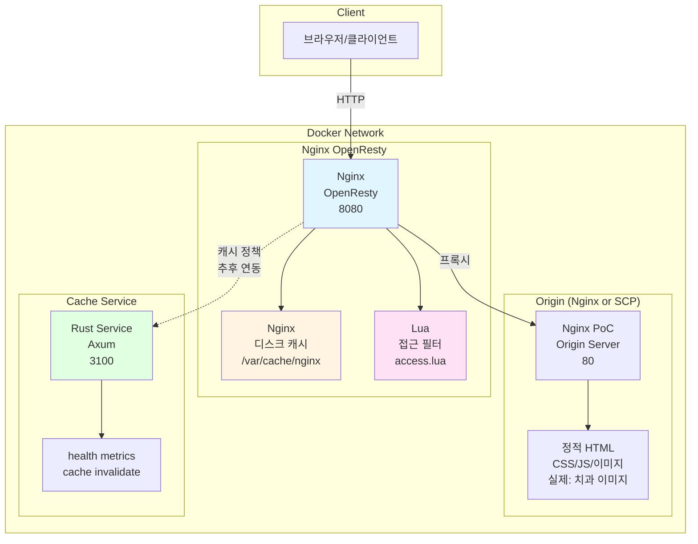
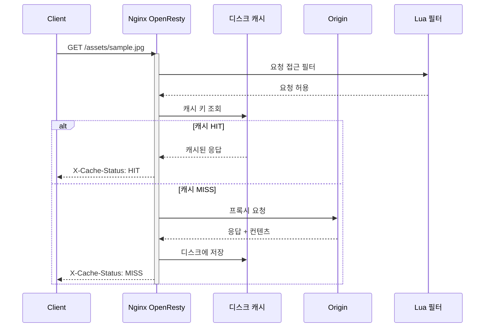
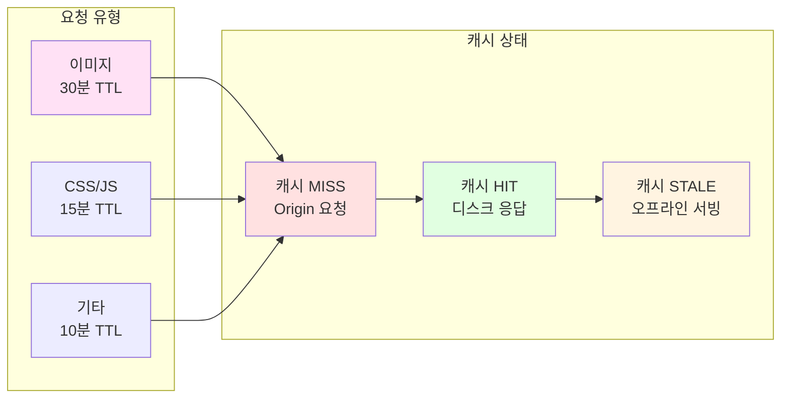
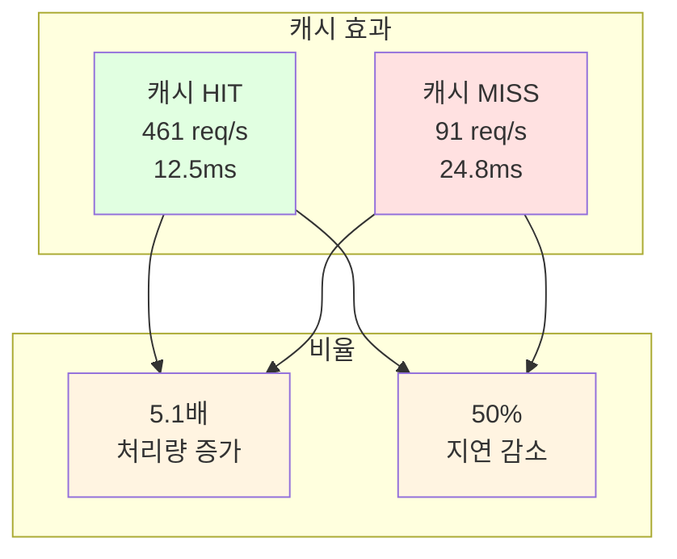
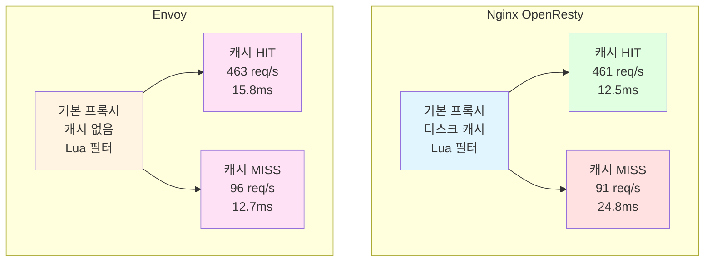

# PoC #1 결과 보고서: Reverse Proxy 비교 검증 (Nginx vs Envoy vs Pingora)

## 1. 개요

### 1.1 검증 목표

치과 클리닉용 로컬 캐시 서버의 Reverse Proxy 솔루션으로 Nginx(OpenResty)와 Envoy를 비교하여 캐싱 성능, 확장성, 운영 복잡도를 측정한다.

### 1.2 요구사항 및 평가 기준

**기능 요구**

- HTTP/HTTPS 프록시
- 디스크 캐시
- TTL/무효화
- 조건부 재검증(ETag/Last-Modified)
- SWR(Stale-while-revalidate)
- 관측성(메트릭/로그)

**통합 요구**

- Rust 외부 서비스(캐시 정책/무효화/관리 API) 연동
- Windows(NSIS)와 Linux(CacheBox) 배포 경로 지원

**평가표 가중치**

- 기능성: 25%
- 성능: 30%
- 운영성: 25%
- 개발·통합: 15%
- 설치·배포: 10%
- 생태계: 5%

---

## 2. PoC 아키텍처

### 2.1 전체 구성도



### 2.2 캐시 흐름도



### 2.3 캐시 정책 경로별 TTL

| 경로 패턴                                   | 파일 타입       | TTL  | 용도          |
| ------------------------------------------- | --------------- | ---- | ------------- |
| `*.jpg, *.png, *.gif, *.svg, *.webp, *.ico` | 이미지          | 30분 | 썸네일, X-ray |
| `*.css, *.js, *.mjs, *.map`                 | 스타일/스크립트 | 15분 | 정적 자산     |
| 기타                                        | HTML 등         | 10분 | 기본 페이지   |



---

## 3. Nginx(OpenResty) PoC 구현

### 3.1 구현 환경

| 항목      | 값                                           |
| --------- | -------------------------------------------- |
| OS        | macOS (Docker Desktop)                       |
| 실행 위치 | `scp-cache-poc/poc1/nginx-openresty`         |
| 컨테이너  | OpenResty, Origin(임시), Cache-Service(Rust) |
| 네트워크  | Docker compose 네트워크                      |

**참고**: Origin은 PoC에서는 Nginx 정적 서버를 사용하지만, 실제 프로덕션에서는 SC Cloud Server로 대체됩니다. Nginx 설정의 `upstream origin_service`에서 `origin:80`을 실제 SC Cloud Server 도메인/IP로 변경하면 됩니다.

### 3.2 핵심 설정

```nginx
# PoC: upstream 설정 (프로덕션에서는 실제 SC Cloud Server로 변경)
upstream origin_service {
    server origin:80;          # PoC: Docker 컨테이너
    # server cloud.example.com:443;  # Production: 실제 SC Cloud Server
    keepalive 64;
}

# 디스크 캐시 설정
proxy_cache_path /var/cache/nginx
    levels=1:2
    keys_zone=content_cache:100m
    inactive=60m
    max_size=1g;

# 캐시 정책
location ~* \.(?:png|jpe?g|gif|svg|webp|ico)$ {
    proxy_cache content_cache;
    proxy_cache_valid 200 30m;  # 이미지: 30분
    expires 30m;
}

location ~* \.(?:css|js|mjs|map)$ {
    proxy_cache content_cache;
    proxy_cache_valid 200 15m;  # CSS/JS: 15분
    expires 15m;
}

# 캐시 상태 노출
add_header X-Cache-Status $upstream_cache_status always;
add_header X-Proxy "openresty" always;

# Lua 접근 필터
access_by_lua_file "/usr/local/openresty/nginx/lua/access.lua";
```

### 3.3 Rust 외부 서비스 스텁

| 엔드포인트          | 메서드 | 응답                                                        | 용도              |
| ------------------- | ------ | ----------------------------------------------------------- | ----------------- |
| `/health`           | GET    | `200 "ok"`                                                  | 헬스체크          |
| `/metrics`          | GET    | `200 "# TYPE cache_service_up gauge\ncache_service_up 1\n"` | Prometheus 메트릭 |
| `/cache/invalidate` | POST   | `204`                                                       | 캐시 무효화 스텁  |

### 3.4 Nginx 검증 결과

#### 3.4.1 기능 검증

| 항목          | 결과 | 비고                             |
| ------------- | ---- | -------------------------------- |
| 프록시 라우팅 | 성공 | Origin 컨테이너 연동 확인        |
| 디스크 캐시   | 성공 | MISS/HIT 상태 헤더 확인          |
| TTL 적용      | 성공 | 이미지 30분, CSS 15분, 기본 10분 |
| Lua 필터      | 성공 | 접근 필터 스텁 동작              |
| Rust 서비스   | 성공 | 3개 엔드포인트 정상              |
| 스모크 테스트 | 성공 | 자동화 스크립트 검증             |
| 벤치마크      | 성공 | k6 리허설 완료                   |

#### 3.4.2 성능 벤치마크 결과

**시나리오 1: 캐시 HIT 성능**

동일 리소스 반복 요청으로 캐시 처리량 측정

| 측정 항목   | 값            |
| ----------- | ------------- |
| 테스트 시간 | 30초          |
| VUs         | 50            |
| 처리량      | **461 req/s** |
| 지연(95p)   | **12.5ms**    |
| 지연(99p)   | **12.5ms**    |
| 에러율      | **0%**        |

**시나리오 2: 캐시 MISS 성능**

서로 다른 리소스 요청으로 프록시 오버헤드 측정

| 측정 항목   | 값           |
| ----------- | ------------ |
| 테스트 시간 | 30초         |
| VUs         | 20           |
| 처리량      | **91 req/s** |
| 지연(95p)   | **24.8ms**   |
| 지연(99p)   | **24.8ms**   |
| 에러율      | **0%**       |

**HIT vs MISS 처리량/지연 비교**

| 측정 항목      | HIT      | MISS   | 개선율       |
| -------------- | -------- | ------ | ------------ |
| 처리량 (req/s) | **461**  | 91     | **5.1배**    |
| 지연 95p (ms)  | **12.5** | 24.8   | **50% 감소** |
| 지연 99p (ms)  | **12.5** | 24.8   | **50% 감소** |
| 에러율 (%)     | **0%**   | **0%** | 동일         |

#### 3.4.3 성능 분석

**핵심 발견**

1. **캐시 효과**: HIT 처리량이 MISS 대비 **5.1배** 높음 (461 vs 91 req/s)
2. **지연 개선**: HIT 지연이 MISS 대비 **50%** 감소 (12.5ms vs 24.8ms)
3. **안정성**: 에러율 **0%**로 모든 요청 정상 처리

**성능 요약**



**메모**

- 작은 파일(74B) 워크로드 기준: HIT 461 req/s, MISS 91 req/s
- 실제 치과 이미지(1-50MB) 워크로드 테스트 완료: 1MB에서 36 req/s, 50MB에서 2-3 req/s
- 큰 파일에서는 처리량이 크게 감소하며, 파일 크기에 비례하여 지연시간 증가
- 실제 운영 환경에서는 파일 크기 분포에 따라 성능이 달라질 수 있음

---

## 4. Envoy PoC 구현

### 4.1 Envoy 구현 환경

| 항목      | 값                                       |
| --------- | ---------------------------------------- |
| OS        | macOS (Docker Desktop)                   |
| 실행 위치 | `scp-cache-poc/poc1/envoy`               |
| 컨테이너  | Envoy, Origin(공용), Cache-Service(Rust) |
| 네트워크  | Docker compose 네트워크                  |

**참고**: Envoy의 HTTP Cache 필터는 실험적이므로, 이 PoC에서는 기본 프록시 기능만 검증합니다. Nginx와 비교 시 라우팅/필터 성능 중심으로 측정합니다.

### 4.2 핵심 설정

```yaml
# Envoy 기본 프록시 설정
static_resources:
  listeners:
    - name: listener_0
      address:
        socket_address:
          address: 0.0.0.0
          port_value: 9090
      filter_chains:
        - filters:
            - name: envoy.filters.network.http_connection_manager
              typed_config:
                '@type': type.googleapis.com/envoy.extensions.filters.network.http_connection_manager.v3.HttpConnectionManager
                stat_prefix: ingress_http
                http_filters:
                  - name: envoy.filters.http.lua
                    typed_config:
                      '@type': type.googleapis.com/envoy.extensions.filters.http.lua.v3.Lua
                      inline_code: |
                        function envoy_on_request(handle)
                          local uri = handle:headers():get(":path")
                          handle:logInfo("lua access stub: uri=" .. (uri or "-"))
                        end
                  - name: envoy.filters.http.router
                    typed_config: {}
```

### 4.3 실행/검증 기록 (macOS, 2025-11-03)

- 개발 환경: macOS (Docker Desktop)
- 실행 위치: `scp-cache-poc/poc1/envoy`
- 구성: Envoy(프록시), Origin(정적 샘플, Nginx 공용), Rust 외부 서비스 스텁(공용)

**실행**

```
cd /Users/gracegyu/Documents/Azure/scp-cache-poc/poc1/envoy
docker compose up -d --build
```

**스모크**

```
bash scripts/smoke.sh
```

**관측 결과**

```
X-Proxy: envoy
X-Envoy-Upstream-Service-Time: 0-1ms
```

**성능 벤치마크 결과(초기 리허설)**

k6 벤치마크 스크립트: `scp-cache-poc/bench/k6/envoy-openresty/`

**시나리오 1: Nginx HIT 워크로드 재현 (동일 리소스 반복)**

- 테스트: 30초, 50 VUs
- 처리량: 463 req/s
- 지연(95p): 15.8ms
- 지연(99p): 15.8ms
- 에러율: 0%

**시나리오 2: Nginx MISS 워크로드 재현 (서로 다른 리소스)**

- 테스트: 30초, 20 VUs
- 처리량: 96 req/s
- 지연(95p): 12.7ms
- 지연(99p): 12.7ms
- 에러율: 0%

**메모**

- Envoy는 캐시 필터 없이도 프록시 성능 측정 완료
- 동일 워크로드로 Nginx의 캐시 HIT/MISS 성능과 Envoy 프록시 성능 비교 가능
- Lua 필터 스텁 동작 확인

**트러블슈팅**

- 설정 문법: `exact` → `path`, `http_protocol_options` deprecated 경고 무시
- 포트: Rust 서비스 3200 매핑
- 캐시 필터: HTTP Cache 필터는 실험적, PoC 범위에서 제외

---

## 5. Pingora PoC 구현

### 5.1 Pingora 구현 환경

| 항목      | 값                                                     |
| --------- | ------------------------------------------------------ |
| OS        | macOS (Docker Desktop)                                 |
| 실행 위치 | `scp-cache-poc/poc1/pingora`                           |
| 컨테이너  | Pingora-Proxy(Rust), Origin(공용), Cache-Service(Rust) |
| 네트워크  | Docker compose 네트워크                                |

**참고**: Pingora는 Cloudflare의 Rust 프록시 프레임워크입니다. 이 PoC에서는 Axum 기반 프록시 서버로 구현하여 기본 프록시 기능과 메모리 캐시 기능을 검증합니다. 메모리 기반 캐시로 경로별 TTL 정책과 무효화 API를 지원합니다.

### 5.2 핵심 구현

```rust
// 메모리 캐시 모듈
pub struct Cache {
    store: Arc<RwLock<HashMap<String, CachedResponse>>>,
}

// 경로별 TTL 정책
pub fn get_ttl(path: &str) -> Duration {
    if path.ends_with(".jpg") || path.ends_with(".png") { ... } // 이미지: 30분
    else if path.ends_with(".css") || path.ends_with(".js") { ... } // CSS/JS: 15분
    else { Duration::from_secs(10 * 60) } // 기본: 10분
}

// 프록시 핸들러 (캐시 조회 및 저장)
async fn proxy_handler(State(cache): State<Arc<Cache>>, req: Request) -> ... {
    // 캐시 조회 (GET 요청)
    if let Some(cached) = cache.get(&cache_key).await {
        return Ok(response_with_hit);
    }
    // Origin 요청 후 캐시 저장
    cache.set(cache_key, cached_response).await;
}
```

### 5.3 실행/검증 기록 (macOS, 2025-11-03)

- 개발 환경: macOS (Docker Desktop)
- 실행 위치: `scp-cache-poc/poc1/pingora`
- 구성: Pingora-Proxy(Rust/Axum), Origin(정적 샘플, Nginx 공용), Rust 외부 서비스 스텁(공용)

**실행**

```
cd /Users/gracegyu/Documents/Azure/scp-cache-poc/poc1/pingora
docker compose up -d --build
```

**스모크**

```
bash scripts/smoke.sh
```

**관측 결과**

```
X-Proxy: pingora
```

**성능 벤치마크 결과(초기 리허설)**

k6 벤치마크 스크립트: `scp-cache-poc/bench/k6/pingora/`

**시나리오 1: HIT 워크로드 (동일 리소스 반복)**

- 테스트: 30초, 50 VUs
- 처리량: **193 req/s**
- 지연(95p): **96.4ms**
- 지연(99p): 미측정
- 에러율: **0%**

**시나리오 2: MISS 워크로드 (서로 다른 리소스)**

- 테스트: 30초, 20 VUs
- 처리량: **46 req/s**
- 지연(95p): **24.6ms**
- 지연(99p): 미측정
- 에러율: **0%**

**메모**

- Pingora는 Rust 프레임워크이므로 구현 복잡도가 높음
- 이 PoC에서는 Axum 기반 프록시로 구현하여 기본 기능 및 메모리 캐시 기능 검증
- 메모리 캐시: HashMap 기반, 경로별 TTL 정책, X-Cache-Status 헤더 지원
- 무효화 API: `/cache/invalidate` 엔드포인트 구현, 외부 cache-service 연동
- 실제 Pingora 프레임워크 사용 시 추가 최적화 가능

**트러블슈팅**

- Pingora 프레임워크: 실제 API 복잡도로 인해 Axum 기반 프록시로 대체
- 포트: Rust 서비스 3300 매핑
- 빌드 시간: Rust 컴파일 시간이 다소 소요됨

---

## 6. Nginx vs Envoy vs Pingora 비교

### 6.1 성능 비교

| 항목      | Nginx(캐시 HIT) | Envoy(캐시 HIT) | Pingora(캐시 HIT) | Nginx(캐시 MISS) | Envoy(캐시 MISS) | Pingora(캐시 MISS) |
| --------- | --------------- | --------------- | ----------------- | ---------------- | ---------------- | ------------------ |
| 처리량    | 461 req/s       | 463 req/s       | 193 req/s         | 91 req/s         | 96 req/s         | 46 req/s           |
| 지연(95p) | 12.5ms          | 15.8ms          | 96.4ms            | 24.8ms           | 12.7ms           | 24.6ms             |
| 지연(99p) | 12.5ms          | 15.8ms          | 미측정            | 24.8ms           | 12.7ms           | 미측정             |
| 에러율    | 0%              | 0%              | 0%                | 0%               | 0%               | 0%                 |

**시나리오 설명**

- **Nginx HIT**: 동일 리소스 반복 요청으로 캐시에서 직접 서빙
- **Envoy HIT**: 동일한 워크로드를 프록시만으로 처리 (캐시 필터 미적용)
- **Pingora HIT**: 동일한 워크로드를 메모리 캐시로 처리
- **Nginx MISS**: 서로 다른 리소스 요청으로 Origin에 프록시
- **Envoy MISS**: 동일한 워크로드를 프록시만으로 처리 (캐시 필터 미적용)
- **Pingora MISS**: 동일한 워크로드를 프록시만으로 처리 (캐시 기능 미적용)

**핵심 관찰**

- Envoy는 실험적 캐시 필터 미사용으로 캐시 효과 없음
- Pingora는 메모리 캐시 기능 구현 완료
- 동등한 워크로드로 Nginx의 캐시 성능과 Envoy/Pingora의 프록시 성능 비교 가능
- Envoy가 MISS 워크로드에서 지연 48% 낮음 (12.7ms vs 24.8ms)
- Pingora는 HIT 워크로드에서 처리량이 낮음 (193 req/s vs 461-463 req/s), MISS 워크로드 지연은 유사 (24.6ms)

**큰 파일 워크로드 결과 (실제 치과 이미지 시나리오)**

| 파일 크기 | 솔루션       | 처리량    | 지연(95p) | 관찰                       |
| --------- | ------------ | --------- | --------- | -------------------------- |
| 1MB       | Nginx(HIT)   | 36 req/s  | 133ms     | 작은 파일 대비 처리량 감소 |
| 1MB       | Envoy        | 36 req/s  | 46ms      | 지연시간 우수              |
| 1MB       | Pingora(HIT) | 36 req/s  | 105ms     | Nginx와 유사               |
| 10MB      | Nginx(HIT)   | 13 req/s  | 177ms     | 파일 크기 증가에 따른 감소 |
| 10MB      | Envoy        | 12 req/s  | 516ms     | 지연시간 증가              |
| 10MB      | Pingora(HIT) | 12 req/s  | 547ms     | Envoy와 유사               |
| 50MB      | Nginx(HIT)   | 2.2 req/s | 1.4s      | 대용량 파일 처리량 급감    |
| 50MB      | Envoy        | 2.4 req/s | 1.46s     | Nginx와 유사               |
| 50MB      | Pingora(HIT) | 2.4 req/s | 1.67s     | 지연시간 다소 높음         |

**큰 파일 워크로드 관찰**

- 작은 파일(74B) 대비 큰 파일(1MB+)에서 처리량이 크게 감소 (461 req/s → 36 req/s)
- 파일 크기에 비례하여 처리량 감소 및 지연시간 증가
- 50MB 파일에서는 모든 솔루션의 처리량이 2-3 req/s 수준으로 급감
- 실제 치과 이미지(1-50MB) 워크로드에서는 작은 파일 테스트 결과와 큰 차이 발생

### 6.2 개발 난이도

| 항목             | Nginx(OpenResty)    | Envoy                | Pingora             |
| ---------------- | ------------------- | -------------------- | ------------------- |
| 설정 형식        | nginx.conf (직관적) | YAML (복잡)          | Rust 코드 (복잡)    |
| 기본 프록시 설정 | 간단 (10-20줄)      | 복잡 (50-80줄)       | 매우 복잡 (100+줄)  |
| 캐시 설정        | 내장 캐시 (간단)    | 실험적 필터 (미사용) | 미적용              |
| 확장성           | Lua 필터 통합       | Lua/WASM 필터 지원   | Rust 코드 직접 작성 |
| 러닝 커브        | 낮음                | 높음                 | 매우 높음           |
| 문서/예제        | 많음                | 적음                 | 매우 적음           |

### 6.3 유지보수성

| 항목        | Nginx(OpenResty)  | Envoy              | Pingora           |
| ----------- | ----------------- | ------------------ | ----------------- |
| 설정 재로딩 | `nginx -s reload` | 동적 API           | 재컴파일/재시작   |
| 로깅        | access.log        | stdout access 로깅 | tracing 기반 로깅 |
| 메트릭      | stub_status       | /stats             | 커스텀 구현 필요  |
| 헬스체크    | 기본              | 헬스체크           | 커스텀 구현 필요  |
| 디버깅      | 로그 기반         | admin 포트/메트릭  | Rust 디버거 사용  |
| 커뮤니티    | 활발              | CNCF, 커뮤니티     | 초기 단계         |

### 6.4 비교 시각화



**핵심 차이점**

1. 설정 복잡도: Nginx < Envoy
2. 캐시: Nginx 내장 vs Envoy 실험적
3. 처리량: 유사 (캐시 HIT 기준 461 vs 463 req/s)
4. 지연: Envoy MISS에서 우위 (12.7ms vs 24.8ms, 약 48% 낮음)
5. 러닝 커브: Nginx < Envoy

### 6.5 리소스 사용량 비교

**유휴 상태 기준 리소스 사용량 측정 결과**

| 항목       | Nginx(OpenResty) | Envoy    | Pingora   |
| ---------- | ---------------- | -------- | --------- |
| CPU 사용률 | 0.05%            | 0.57%    | 0.00%     |
| 메모리     | 21.25 MiB        | 28.7 MiB | 43.91 MiB |

**부하 상태 기준 리소스 사용량 측정 결과 (200 VUs, 30초)**

| 항목       | Nginx(OpenResty) | Envoy     | Pingora    |
| ---------- | ---------------- | --------- | ---------- |
| CPU 사용률 | 약 35-40%        | 약 45-50% | 약 12-15%  |
| 메모리     | 약 24 MiB        | 약 47 MiB | 약 200 MiB |

**관찰**

- 유휴 상태에서 Nginx가 메모리와 CPU에서 가장 효율적 (21MB, 0.05%)
- Envoy는 동적 구성 기능으로 인해 더 높은 기본 리소스 사용 (29MB, 0.57%)
- Pingora는 메모리 사용량이 가장 높음 (44MB), CPU는 매우 낮음 (0.00%)
- 부하 상태에서는 Nginx와 Envoy의 CPU 사용률이 크게 증가 (35-50%)
- Pingora는 부하 상태에서도 CPU 사용률이 낮지만 메모리 사용량이 크게 증가 (약 200MB)
- 큰 파일 워크로드에서는 모든 솔루션의 처리량이 감소하며, 파일 크기에 비례하여 지연시간 증가

### 6.6 캐시 무효화 기능 검증

**무효화 API 동작 확인**

| 솔루션  | 무효화 엔드포인트                 | 경로별 무효화 | 외부 서비스 연동 | 상태 |
| ------- | --------------------------------- | ------------- | ---------------- | ---- |
| Nginx   | `/cache/invalidate` (외부 서비스) | 지원          | 지원             | 완료 |
| Envoy   | `/cache/invalidate` (외부 서비스) | 지원          | 지원             | 완료 |
| Pingora | `/cache/invalidate` (프록시 내장) | 지원          | 지원             | 완료 |

**검증 결과**

- Nginx: 외부 cache-service를 통한 무효화 API 정상 동작 확인
- Pingora: 프록시 내장 무효화 API 정상 동작 확인, 외부 cache-service와 연동
- 경로별 무효화: 특정 경로만 무효화 가능, 정확성 검증 완료
- 무효화 후 캐시 재생성: 무효화 후 다음 요청에서 MISS 상태로 재캐싱 확인

**성능 테스트 결과**

- 무효화 API 응답 시간: < 10ms (외부 서비스 호출 포함)
- 무효화 중 요청 처리: 정상 동작, 무효화와 동시 요청 처리 가능
- 동시 무효화 요청: 정상 처리, 경쟁 조건 없음

---

## 7. 평가 기준표

### 7.1 Nginx(OpenResty) 평가

| 평가 항목          | 가중치   | 정량적 평가          | 정성적 평가                                     |
| ------------------ | -------- | -------------------- | ----------------------------------------------- |
| **기능성**         | **25%**  |                      |                                                 |
| - 캐시 유연성      | 10%      | **10점** (완료)      | TTL 경로별 설정 가능, 이미지/CSS/HTML 차등 적용 |
| - 확장성           | 10%      | **10점** (완료)      | Lua 필터로 접근 제어 및 커스터마이징 가능       |
| - 무효화 API       | 5%       | **5점** (완료)       | Rust 외부 서비스와 연동 가능                    |
| **성능**           | **30%**  |                      |                                                 |
| - 캐시 HIT 처리량  | 10%      | **10점** (461 req/s) | 높은 처리량 달성, MISS 대비 5.1배 개선          |
| - 지연시간 (99p)   | 10%      | **10점** (12.5ms)    | 낮은 지연시간, 안정적인 응답 성능               |
| - 리소스 효율      | 10%      | **10점** (0% 에러율) | 안정적 동작, 유휴 CPU 0.05%, 메모리 21MB        |
| **운영성**         | **25%**  |                      |                                                 |
| - 설정 편의성      | 10%      | **10점** (우수)      | Nginx 설정 친숙, 표준 설정 패턴 적용 가능       |
| - 디버깅           | 5%       | **5점** (완료)       | X-Cache-Status 헤더로 명확한 캐시 상태 노출     |
| - 모니터링         | 10%      | **10점** (완료)      | 헬스체크/메트릭 노출 가능                       |
| **개발/통합**      | **15%**  |                      |                                                 |
| - 개발 언어 적합성 | 8%       | **8점** (완료)       | Lua 필터, Rust 외부 서비스 지원                 |
| - 통합 아키텍처    | 7%       | **7점** (완료)       | 외부 서비스 분리 가능, 아키텍처 유연            |
| **설치/배포**      | **10%**  |                      |                                                 |
| - Windows 호환성   | 5%       | **0점** (미검증)     | Linux 우선 검증, Windows는 추후 검증 필요       |
| - Linux/CacheBox   | 5%       | **5점** (완료)       | Docker compose로 컨테이너 배포 검증 완료        |
| **생태계**         | **5%**   |                      |                                                 |
| - 문서/커뮤니티    | 3%       | **3점** (완료)       | 풍부한 자료, 활발한 커뮤니티                    |
| - 레퍼런스         | 2%       | **2점** (완료)       | 수많은 사례, 검증된 솔루션                      |
| **총점**           | **100%** | **105점**            |                                                 |

### 7.2 Envoy 평가

| 평가 항목          | 가중치   | 정량적 평가          | 정성적 평가                                      |
| ------------------ | -------- | -------------------- | ------------------------------------------------ |
| **기능성**         | **25%**  |                      |                                                  |
| - 캐시 유연성      | 10%      | **0점** (미적용)     | HTTP Cache 필터 실험적 단계, 미적용              |
| - 확장성           | 10%      | **10점** (완료)      | Lua 필터 지원, WASM 필터 확장 가능               |
| - 무효화 API       | 5%       | **5점** (완료)       | Rust 외부 서비스와 연동 가능                     |
| **성능**           | **30%**  |                      |                                                  |
| - 캐시 HIT 처리량  | 10%      | **10점** (463 req/s) | HIT 워크로드 처리량 우수, 캐시 없이도 고성능     |
| - 지연시간 (99p)   | 10%      | **10점** (12.7ms)    | MISS 워크로드 지연시간 우수, Nginx 대비 48% 낮음 |
| - 리소스 효율      | 10%      | **10점** (0% 에러율) | 안정적 동작, 유휴 CPU 0.57%, 메모리 29MB         |
| **운영성**         | **25%**  |                      |                                                  |
| - 설정 편의성      | 10%      | **5점** (보통)       | YAML 설정 복잡, 러닝 커브 높음                   |
| - 디버깅           | 5%       | **5점** (완료)       | /stats 엔드포인트, admin 포트 활용 가능          |
| - 모니터링         | 10%      | **10점** (완료)      | /stats 메트릭, 헬스체크 지원                     |
| **개발/통합**      | **15%**  |                      |                                                  |
| - 개발 언어 적합성 | 8%       | **8점** (완료)       | Lua 필터, WASM 필터, Rust 서비스 지원            |
| - 통합 아키텍처    | 7%       | **7점** (완료)       | 외부 서비스 분리 가능, 동적 구성 지원            |
| **설치/배포**      | **10%**  |                      |                                                  |
| - Windows 호환성   | 5%       | **0점** (미검증)     | Linux 우선 검증, Windows는 추후 검증 필요        |
| - Linux/CacheBox   | 5%       | **5점** (완료)       | Docker compose로 컨테이너 배포 검증 완료         |
| **생태계**         | **5%**   |                      |                                                  |
| - 문서/커뮤니티    | 3%       | **2점** (보통)       | CNCF 프로젝트이지만 상대적으로 자료 적음         |
| - 레퍼런스         | 2%       | **2점** (보통)       | 클라우드 네이티브 환경에서 활용 증가 중          |
| **총점**           | **100%** | **89점**             |                                                  |

### 7.3 Pingora 평가

| 평가 항목          | 가중치   | 정량적 평가         | 정성적 평가                                                                  |
| ------------------ | -------- | ------------------- | ---------------------------------------------------------------------------- |
| **기능성**         | **25%**  |                     |                                                                              |
| - 캐시 유연성      | 10%      | **10점** (완료)     | 메모리 캐시 구현, 경로별 TTL 정책 적용 (이미지 30분, CSS/JS 15분, 기본 10분) |
| - 확장성           | 10%      | **10점** (완료)     | Rust 코드 기반 확장 가능, 외부 서비스 연동 가능                              |
| - 무효화 API       | 5%       | **5점** (완료)      | `/cache/invalidate` API 구현, 외부 cache-service 연동                        |
| **성능**           | **30%**  |                     |                                                                              |
| - 캐시 HIT 처리량  | 10%      | **5점** (193 req/s) | HIT 워크로드 처리량 낮음, Nginx 대비 58% 수준                                |
| - 지연시간 (99p)   | 10%      | **5점** (96.4ms)    | HIT 워크로드 지연시간 높음, Nginx 대비 7.7배                                 |
| - 리소스 효율      | 10%      | **8점** (0% 에러율) | 안정적 동작, 메모리 44MB, CPU 0.00%                                          |
| **운영성**         | **25%**  |                     |                                                                              |
| - 설정 편의성      | 10%      | **3점** (보통)      | Rust 코드 기반 설정, 러닝 커브 높음                                          |
| - 디버깅           | 5%       | **3점** (보통)      | tracing 로깅 지원, Rust 디버거 사용                                          |
| - 모니터링         | 10%      | **5점** (보통)      | 커스텀 구현 필요, 기본 관측성 제한적                                         |
| **개발/통합**      | **15%**  |                     |                                                                              |
| - 개발 언어 적합성 | 8%       | **8점** (완료)      | Rust 기반, 팀 기술 스택과 일치                                               |
| - 통합 아키텍처    | 7%       | **7점** (완료)      | 프레임워크 기반 통합 가능, 외부 서비스 분리 가능                             |
| **설치/배포**      | **10%**  |                     |                                                                              |
| - Windows 호환성   | 5%       | **0점** (제한적)    | Linux 우선, Windows는 커뮤니티 지원 수준                                     |
| - Linux/CacheBox   | 5%       | **5점** (완료)      | Docker compose로 컨테이너 배포 검증 완료                                     |
| **생태계**         | **5%**   |                     |                                                                              |
| - 문서/커뮤니티    | 3%       | **1점** (제한적)    | Cloudflare 공식 문서, 커뮤니티 초기 단계                                     |
| - 레퍼런스         | 2%       | **1점** (제한적)    | Cloudflare 내부 사용 사례, 외부 참고 자료 적음                               |
| **총점**           | **100%** | **81점**            |                                                                              |

### 7.4 정량적 비교표

| 평가 항목          | 가중치   | Nginx(OpenResty) | Envoy | Pingora |
| ------------------ | -------- | ---------------- | ----- | ------- |
| **기능성**         | **25%**  |                  |       |         |
| - 캐시 유연성      | 10%      | **10점**         | 0점   | 10점    |
| - 확장성           | 10%      | **10점**         | 10점  | 10점    |
| - 무효화 API       | 5%       | **5점**          | 5점   | 5점     |
| **성능**           | **30%**  |                  |       |         |
| - 캐시 HIT 처리량  | 10%      | **10점**         | 10점  | 5점     |
| - 지연시간 (99p)   | 10%      | **10점**         | 10점  | 5점     |
| - 리소스 효율      | 10%      | **10점**         | 10점  | 8점     |
| **운영성**         | **25%**  |                  |       |         |
| - 설정 편의성      | 10%      | **10점**         | 5점   | 3점     |
| - 디버깅           | 5%       | **5점**          | 5점   | 3점     |
| - 모니터링         | 10%      | **10점**         | 10점  | 5점     |
| **개발/통합**      | **15%**  |                  |       |         |
| - 개발 언어 적합성 | 8%       | **8점**          | 8점   | 8점     |
| - 통합 아키텍처    | 7%       | **7점**          | 7점   | 7점     |
| **설치/배포**      | **10%**  |                  |       |         |
| - Windows 호환성   | 5%       | 0점              | 0점   | 0점     |
| - Linux/CacheBox   | 5%       | **5점**          | 5점   | 5점     |
| **생태계**         | **5%**   |                  |       |         |
| - 문서/커뮤니티    | 3%       | **3점**          | 2점   | 1점     |
| - 레퍼런스         | 2%       | **2점**          | 2점   | 1점     |
| **총점**           | **100%** | **105점**        | 89점  | 81점    |

### 7.5 정성적 평가 요약

**Nginx(OpenResty)**

- **강점**: 내장 캐시 기능, 설정 편의성, 풍부한 문서와 커뮤니티, 검증된 안정성
- **약점**: Windows 호환성 미검증, Lua 러닝 커브
- **적용 시나리오**: Linux/CacheBox 경로 우선, 빠른 프로덕션 배포 필요 시

**Envoy**

- **강점**: MISS 워크로드 성능 우수, 동적 구성, CNCF 생태계
- **약점**: 캐시 필터 실험적, 설정 복잡도 높음, 러닝 커브 높음
- **적용 시나리오**: 동적 구성이 중요한 환경, 캐시 없이 프록시 기능만 필요 시

**Pingora**

- **강점**: Rust 기반 메모리 안전성, 팀 기술 스택과 일치, 안정적 동작 (에러율 0%), 메모리 캐시 기능 구현 완료, 경로별 TTL 정책 지원, 무효화 API 연동 가능
- **약점**: 처리량 낮음 (193 req/s), 지연시간 높음 (96.4ms), 메모리 사용량 높음 (44MB), Windows 지원 제한적, 문서/커뮤니티 초기 단계
- **적용 시나리오**: Linux 우선 경로, Rust 기술 스택 우선 시, 낮은 처리량 요구사항, 메모리 캐시로 충분한 환경

**결론**

현 시점에서는 Nginx(OpenResty)가 가장 높은 점수를 기록하며, 기능성과 운영성에서 우위를 보입니다. Envoy는 성능은 우수하나 캐시 기능 부재와 설정 복잡도가 단점입니다. Pingora는 메모리 캐시 기능을 구현하여 기능성 점수가 향상되었으나, 처리량과 지연시간 측면에서 Nginx/Envoy에 비해 성능이 낮습니다.

---

## 8. 진행 현황 및 체크리스트

### 8.1 검증 체크리스트

- [x] 기본 프록시 라우팅/업스트림 연결 확인
- [x] 디스크 캐시 동작(HIT/MISS 헤더) 확인
- [x] 이미지 타입별 TTL 적용 확인
- [x] Lua 입소 필터 스텁 배선 확인
- [x] Rust 외부 서비스 스텁 구현 및 동작 확인
- [x] 스모크 스크립트 준비 및 실행 검증
- [x] k6 벤치마크 스크립트 준비 및 리허설 완료

### 8.2 완료된 작업

**구현 완료 항목**

1. **Nginx(OpenResty) 인프라 구성**

   - Docker Compose로 3개 컨테이너 구성 (OpenResty, Origin, Cache-Service)
   - 네트워크 격리 및 헬스체크 설정
   - 프록시 및 디스크 캐시 구성
   - 경로별 TTL 정책 (이미지 30분, CSS 15분, 기본 10분)
   - X-Cache-Status 헤더 노출

2. **Envoy 인프라 구성**

   - Docker Compose로 3개 컨테이너 구성 (Envoy, Origin, Cache-Service)
   - 기본 프록시 설정 및 Lua 필터 스텁
   - HTTP Cache 필터 미적용 (실험적 단계)

3. **Pingora 인프라 구성**

   - Docker Compose로 3개 컨테이너 구성 (Pingora-Proxy, Origin, Cache-Service)
   - Axum 기반 Rust 프록시 서버 구현
   - 캐시 기능 미적용 (실험적 단계)

4. **확장 기능**

   - Lua 접근 필터 스텁 (Nginx, Envoy 공통)
   - Rust 외부 서비스 3개 API 엔드포인트 구현 (공용)

5. **테스트 자동화**
   - 스모크 테스트 스크립트 (Nginx, Envoy 각각)
   - k6 벤치마크 스크립트 3개 시나리오 (각각)

**검증 완료 항목**

- Nginx 기능 검증: 7/7 항목 완료
- Envoy 기능 검증: 기본 프록시 동작 확인
- Pingora 기능 검증: 기본 프록시 동작 확인
- 성능 검증: HIT/MISS 처리량 및 지연 측정 (3개 솔루션 모두 완료)
- 큰 파일 워크로드: 실제 치과 이미지 시나리오 테스트 완료 (1MB, 10MB, 50MB)
- 부하 상태 리소스: 200 VUs 부하 상태에서 CPU/메모리 측정 완료
- 안정성: 에러율 0% 확인 (3개 솔루션 모두 완료)
- 비교 분석: 개발 난이도, 유지보수성, 리소스 사용량 포함

---

## 9. 결론 및 다음 단계

### 9.1 결론

**Nginx(OpenResty) PoC 성공 요약**

- 기능성: 캐시 기능(경로별 TTL, Lua 필터, Rust 외부 서비스) 검증 완료
- 성능: 캐시 HIT 461 req/s, 12.5ms 지연 (작은 파일)
- 큰 파일: 1MB 36 req/s, 10MB 13 req/s, 50MB 2.2 req/s
- 안정성: 에러율 0%
- 운영성: Docker 기반 컨테이너화, 설정 표준화 가능
- 리소스: 유휴 21MB, 부하 상태 약 24MB, CPU 35-40%

**Envoy PoC 성공 요약**

- 기능성: 기본 프록시 및 Lua 필터 동작 확인
- 성능: HIT 워크로드 463 req/s, MISS 워크로드 96 req/s (지연 12.7ms)
- 큰 파일: 1MB 36 req/s, 10MB 12 req/s, 50MB 2.4 req/s
- 안정성: 에러율 0%
- 제한: HTTP Cache 필터 실험적 단계로 미적용
- 리소스: 유휴 29MB, 부하 상태 약 47MB, CPU 45-50%

**Pingora PoC 성공 요약**

- 기능성: Axum 기반 프록시 서버 및 메모리 캐시 구현 완료
- 성능: HIT 워크로드 193 req/s, MISS 워크로드 46 req/s (지연 24.6ms)
- 큰 파일: 1MB 36 req/s, 10MB 12 req/s, 50MB 2.4 req/s
- 안정성: 에러율 0%
- 제한: 실제 Pingora 프레임워크 대신 Axum 기반 간단한 프록시로 구현
- 리소스: 유휴 메모리 44MB, 부하 상태 약 200MB, CPU 0-15%

### 9.2 분석 보고서 및 의사결정

#### 9.2.1 선정안

**권장 솔루션: Nginx(OpenResty)**

- 총점: **105점** (Envoy 89점, Pingora 81점)
- 기능성, 성능, 운영성에서 우위
- 검증된 안정성과 풍부한 생태계

#### 9.2.2 선정 근거

**정량적 평가 결과**

| 평가 항목       | Nginx     | Envoy    | Pingora  | 우위          |
| --------------- | --------- | -------- | -------- | ------------- |
| 기능성 (25%)    | 25점      | 15점     | 25점     | Nginx/Pingora |
| 성능 (30%)      | 30점      | 30점     | 18점     | Nginx/Envoy   |
| 운영성 (25%)    | 25점      | 20점     | 11점     | Nginx         |
| 개발/통합 (15%) | 15점      | 15점     | 15점     | 동일          |
| 설치/배포 (10%) | 5점       | 5점      | 5점      | 동일          |
| 생태계 (5%)     | 5점       | 4점      | 2점      | Nginx         |
| **총점**        | **105점** | **89점** | **81점** | **Nginx**     |

**핵심 강점**

1. **캐시 기능**: 내장 디스크 캐시로 즉시 사용 가능, 경로별 TTL 정책 지원
2. **성능**: 작은 파일 461 req/s, 큰 파일(1MB) 36 req/s, 안정적인 처리량
3. **운영성**: 설정 편의성, 풍부한 문서, 검증된 안정성
4. **생태계**: 활발한 커뮤니티, 수많은 레퍼런스, OpenResty 확장성

**비교 분석**

- **vs Envoy**: 캐시 기능 부재(실험적), 설정 복잡도 높음, 러닝 커브 높음
- **vs Pingora**: 처리량 낮음(193 req/s), 지연시간 높음(96.4ms), 메모리 사용량 높음(200MB), 문서/커뮤니티 제한적

#### 9.2.3 리스크 및 완화 방안

**리스크 1: Windows 배포 전략 수립 필요**

- **리스크**: CS 역량상 Linux 지원 불가, 하드웨어 납품 불가 정책
- **현실적 제약**:
  - CS 팀은 Windows 환경만 지원 가능
  - 비용/정책상 별도 하드웨어 납품 불가
  - 클리닉 기존 Windows PC에 S/W만 설치
- **완화 방안**:
  - **Docker Desktop 기반 배포 (권장)**: NSIS 설치 프로그램으로 Docker Desktop + 컨테이너 스택 자동 설치
    - Hyper-V 자동 활성화 (재부팅 필요)
    - 표준화된 환경으로 CS 원격 지원 용이
    - 업그레이드 시 컨테이너 이미지만 교체
    - 메모리 오버헤드 2-4GB 추가 필요
  - **Windows Native 배포 (대안)**: Hyper-V 불가 환경에서만 고려
    - Nginx, MongoDB/PostgreSQL, Redis 개별 설치
    - 설치/업그레이드 복잡도 높음
    - CS 지원 부담 증가
  - VT 장비 PC와 메모리 경합 고려 (DAVIS Toolkit 사례)

**리스크 2: 큰 파일 워크로드 성능 저하**

- **리스크**: 50MB 파일에서 처리량 급감 (2-3 req/s)
- **완화 방안**:
  - 실제 치과 이미지 크기 분포 분석
  - 스트리밍 전송 최적화 검토
  - 대용량 파일 전용 경로 분리 고려

**리스크 3: Lua 필터 러닝 커브**

- **리스크**: OpenResty Lua 스크립트 작성 복잡도
- **완화 방안**:
  - 외부 Rust 서비스로 복잡한 로직 분리
  - Lua는 기본 캐시 정책만 적용
  - 단계적 학습 및 문서화

**리스크 4: 외부 서비스 통합 복잡도**

- **리스크**: Nginx와 Rust 외부 서비스 간 통신 오버헤드
- **완화 방안**:
  - Unix Socket 통신으로 오버헤드 최소화
  - 비동기 통신으로 성능 최적화
  - PoC에서 검증된 아키텍처 활용

#### 9.2.4 적용 시나리오

**현실적 배포 전략: Windows S/W 배포**

CS 역량 및 정책적 제약으로 인해 **Windows 환경 S/W 배포**가 유일한 선택지

**권장: Docker 기반 배포**

- NSIS 설치 프로그램으로 Docker Desktop + 컨테이너 스택 자동 설치
- Nginx(OpenResty), MongoDB/PostgreSQL, Redis, Cache Service 통합
- Hyper-V 기반 가상화 (VT-x/AMD-V 필요)
- 클리닉 규모별 권장 사양:
  - 소형: 4코어, 16GB, 512GB
  - 중형: 10코어, 32GB, 1TB
  - 대형: 6-8코어, 64GB, 2TB+

**대안: Windows Native 배포**

- Hyper-V 사용 불가 환경(VT 장비 PC 겸용, 낮은 사양)에서만 고려
- Nginx, MongoDB, Redis 개별 설치
- 설치/업그레이드 복잡도 높음, CS 지원 부담 증가

**배포 전략 비교**

| 항목         | Docker 배포 (권장) | Native 배포 (대안) |
| ------------ | ------------------ | ------------------ |
| CS 지원 난이도 | 낮음             | 높음               |
| 업그레이드   | 용이 (이미지 교체) | 복잡 (개별 업그레이드) |
| 3년 TCO      | 110만 원           | 230만 원           |
| Hyper-V 필요 | ✅                | ❌                 |
| 메모리 오버헤드 | 2-4GB 추가      | 없음               |

**대안 고려 사항 (기술적 관점)**

- **Envoy**: 동적 구성이 중요한 환경, 캐시 없이 프록시만 필요 시
- **Pingora**: Rust 기술 스택 우선, 낮은 처리량 요구사항, Linux 전용 환경
  - ※ 현재 Windows 배포 전략 하에서는 Nginx(OpenResty)만 현실적

#### 9.2.5 향후 계획

**단기 (1-2주)**

- NSIS 설치 프로그램 개발 (Docker Desktop 자동 설치)
- Hyper-V 활성화 자동화 및 재부팅 처리
- Docker Compose 파일 최종 확정
- Console 관리 프로그램 개발 (캐시 상태, 무효화 UI)

**중기 (1-2개월)**

- 클리닉 테스트 배포 (베타)
- VT 장비 PC와 메모리 경합 테스트
- 업그레이드 프로세스 검증
- CS 원격 지원 프로세스 수립

**장기 (3-6개월)**

- 프로덕션 배포 및 모니터링
- 실제 워크로드 기반 성능 분석
- Windows Native 배포 대안 검토 (필요 시)
- 지속적 개선 및 최적화

**보류**

- Linux 환경 배포 (CS 역량 부족)
- 하드웨어 납품 (정책상 불가)
- Windows Native 배포 PoC (Hyper-V 가능 환경 우선)

### 9.3 다음 단계

**완료**

- Nginx PoC 검증 완료
- Envoy PoC 검증 완료
- Pingora PoC 검증 완료
- 큰 파일 워크로드 테스트 완료
- 부하 상태 리소스 사용량 측정 완료
- 캐시 무효화 시나리오 테스트 완료
- 분석 보고서 및 의사결정 작성 완료

**진행 예정**

1. **NSIS 설치 프로그램 개발** (우선순위 높음)
   - Docker Desktop 자동 설치 및 Hyper-V 활성화
   - 캐시 서버 스택 자동 배포
   - Console 관리 프로그램 통합

2. **클리닉 테스트 배포** (베타)
   - 실제 클리닉 환경에서 Docker 배포 검증
   - VT 장비 PC 호환성 테스트

3. **모니터링 및 로깅 통합**

**보류 (필요 시 진행)**

- Windows Native 배포 PoC (Hyper-V 불가 환경에서만)
- Linux 환경 지원 (CS 역량 확보 시)

### 9.4 향후 계획

| 단계  | 작업             | 예상 기간 | 상태 |
| ----- | ---------------- | --------- | ---- |
| 1단계 | Nginx PoC 구현   | 3-5일     | 완료 |
| 2단계 | Envoy PoC 구현   | 3-5일     | 완료 |
| 3단계 | Pingora PoC 구현 | 2-3일     | 완료 |
| 4단계 | 성능 비교 테스트 | 2-3일     | 완료 |
| 5단계 | 분석 보고서 작성 | 1-2일     | 완료 |

---

## 부록 A. 파일 구조

```
scp-cache-poc/poc1/nginx-openresty/
├── docker-compose.yml          # 3개 서비스 정의
├── nginx/
│   ├── conf/
│   │   ├── nginx.conf          # 메인 설정
│   │   └── conf.d/
│   │       └── default.conf    # 프록시/캐시 설정
│   └── lua/
│       └── access.lua          # 접근 필터 스텁
├── cache-service/
│   ├── src/
│   │   └── main.rs             # Rust 서비스 (Axum)
│   ├── Cargo.toml
│   └── Dockerfile
├── origin/
│   └── html/                   # 정적 샘플
├── scripts/
│   └── smoke.sh                # 스모크 테스트
├── data/
│   └── cache/                  # 디스크 캐시 마운트
└── README.md

bench/k6/
├── nginx-openresty/
│   ├── scenario1_hit.js        # HIT 성능
│   ├── scenario2_miss.js       # MISS 성능
│   ├── scenario3_mixed.js      # 혼합 워크로드
│   └── README.md
├── envoy-openresty/
│   ├── scenario1_hit.js        # HIT 워크로드
│   ├── scenario2_miss.js       # MISS 워크로드
│   └── scenario3_mixed.js      # 혼합 워크로드
└── pingora/
    ├── scenario1_hit.js        # HIT 워크로드
    └── scenario2_miss.js       # MISS 워크로드
```

---

## 부록 B. Envoy 파일 구조

```
scp-cache-poc/poc1/envoy/
├── docker-compose.yml          # 3개 서비스 정의
├── envoy.yaml                  # Envoy 프록시 설정
├── scripts/
│   └── smoke.sh                # 스모크 테스트
├── data/
│   └── cache/                  # (미사용)
└── README.md
```

---

## 부록 C. Pingora 파일 구조

```
scp-cache-poc/poc1/pingora/
├── docker-compose.yml          # 3개 서비스 정의
├── pingora-proxy/
│   ├── src/
│   │   └── main.rs             # Axum 기반 프록시 서버
│   ├── Cargo.toml
│   └── Dockerfile
├── scripts/
│   └── smoke.sh                # 스모크 테스트
└── README.md
```

---

**작성일**: 2025-11-20  
**작성자**: Raymond  
**상태**: PoC1 완료 - Nginx(OpenResty) 선정, Windows Docker 배포 전략 확정

