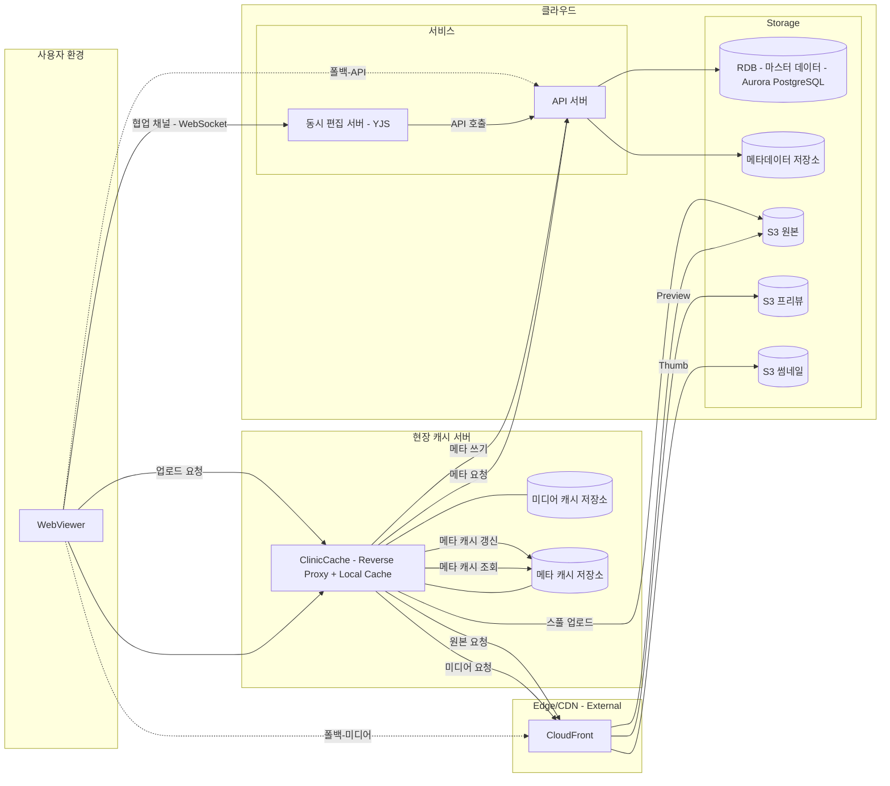

# 현장(클리닉) 캐시 서버 연구

## 1) 배경과 목적

- 빈번히 조회되는 썸네일/프리뷰/일부 원본, 환자·스터디 메타데이터를 클리닉 내부에 캐시하여 TTFB와 백홀 트래픽을 감소시키고, 일시적 네트워크 장애 시에도 조회 연속성을 확보한다.
- 캐시는 단순 파일 캐시를 넘어 리버스 프록시, 인증 위임, 무효화, 스풀링(write-back)까지 포함하는 경량 엣지 노드를 지향한다.

## 2) 범위(초안)

- 대상:
  - 미디어: 썸네일/프리뷰(우선), 원본 묶음 다운로드는 패스스루 또는 단기 캐시
  - 메타데이터: 환자·스터디·시리즈 목록/요약 GET
- 제외: 쓰기 민감 API(권한/결제 등) 캐시, 장기 보관(백업) 기능은 범위 외

## 3) 아키텍처 개념

- WebViewer(클라이언트) → ClinicCache(리버스 프록시 + 로컬 디스크 캐시) → Edge(CDN: CloudFront) → Origin(S3)
- API 읽기(요약/목록)도 ClinicCache를 경유해 Read‑through 캐시, API 쓰기는 정책에 따라 Write‑through/Write‑back 선택
- 구성 요소:
  - Reverse Proxy(예: Nginx/Envoy) + 메타 캐시 저장소(KV/SQLite) + 파일 캐시
  - 관리/헬스 API, 메트릭/로그, 암호화(디스크/전송)

### 아키텍처 다이어그램 (Mermaid)



## 4) 동작 흐름

- 읽기(미디어): WebViewer → ClinicCache →(HIT 응답) or → Edge/S3 → ClinicCache 저장 → WebViewer
- 읽기(메타데이터): 목록/요약 GET만 캐시. TTL 5~15분 + ETag/Last‑Modified 조건부 재검증 + stale‑while‑revalidate
- 쓰기(미디어 업로드): Write‑back 스풀링. 202 Accepted + resourceId/progress, 로컬 스풀→S3 멀티파트 업로드. 즉시 조회는 로컬 캐시가 서빙
- 쓰기(메타데이터): Write‑through(원서버 성공 시 200/201) + 로컬 캐시 즉시 반영. 요청자 세션은 짧은 기간 read‑after‑write 보장
- 장애/폴백: 캐시 불가/장애 시 클라우드 직통, 네트워크 단절 시 캐시 히트만 응답

### 폴백과 재동기화(일치화)

- 폴백 트리거: 캐시 서버 장애/과부하/네트워크 단절 감지 시 뷰어는 클라우드로 직접 접속(미디어→CloudFront, 메타→API)
- 쓰기 일관성:
  - 미디어: 스풀 큐에 보류된 항목은 재시도. 멱등키/해시로 중복 업로드 방지
  - 메타데이터: write‑through 실패분은 로컬 저널에 기록 후 백그라운드 재반영(최대 재시도/백오프)
- 재동기화 절차(복구 후):
  1. 저널 재생: 로컬 저널을 순서대로 재적용(버전/타임스탬프 검증)
  2. 차등 스캔: updatedAt/버전 비교로 변경분만 클라우드↔로컬 동기화
  3. 캐시 무효화: 환자ID/스터디ID 단위 강제 무효화 및 프리페치 재시작
- 보증: 요청자(read‑after‑write)는 단기 캐시 고정, 전역 일관성은 최종적 일관성(Eventual Consistency)로 정의

### 오프라인 모드(클라우드 미연결 시 조회)

- 트리거: 인터넷/전용선 장애 또는 Edge/Origin 장애 시 자동 전환
- 제공 범위: 캐시에 적중한 미디어(썸네일/프리뷰/원본 일부)와 메타 요약/목록(메타 캐시 저장소)
- 제약: 미보유 항목은 조회 불가, 권한 변경·삭제는 즉시 반영 불가(복구 후 재검증)
- 쓰기 처리: 미디어는 스풀 큐 보류, 메타는 로컬 저널 기록 후 온라인 복귀 시 재반영(재시도/백오프)
- 인증: 기존 유효 세션 내 사용, 만료 시 제한 모드; 로컬 저장 암호화 및 감사 로그 유지
- UX/운영: 화면에 오프라인 배지, 동기화 큐/진행률 노출, 제한 기능 안내. 복구 후 “폴백과 재동기화(일치화)” 절차 적용

### 동시 편집(YJS) 지원 정책

- 연결 방식: 평시에는 WebViewer가 클라우드의 YJS 서버(WebSocket)에 직접 연결한다.
- 오프라인 시: 동시 편집은 지원하지 않으며, 로컬 편집은 제한하거나 임시 저장 후 온라인 복귀 시 병합 정책 별도 정의(본 문서 범위 외).
- 네트워크/보안: WebSocket 프록시(업그레이드 헤더) 지원, 인증 토큰 패스스루, QoS(타임아웃·재접속) 설정.
- 다이어그램 반영: ClinicCache → YJS(클라우드) 협업 채널 연결 추가.

### URI 설계 원칙(캐시/클라우드 동일 경로)

- 목적: 폴백 시 호스트만 교체하고 경로/쿼리는 동일하게 유지하여 무중단·무경로변경을 달성
- 경로 스키마 고정: 예) `/v1/clinic/{clinicId}/patients/{patientId}/studies` — 캐시/클라우드 모두 동일 버전·경로 체계 사용
- 쿼리 정규화: 파라미터 정렬·소문자 키·일관된 퍼센트 인코딩으로 캐시 키/오리진 요청의 일치 보장
- 서명/인증 독립:
  - 미디어는 CloudFront 서명 쿠키 또는 경로 기반 HMAC 서명을 권장(호스트 비의존)
  - API는 JWT Authorization 헤더 패스스루(경로/쿼리는 그대로), Authorization은 캐시 키에서 제외
- 프록시 설정: URI 보존, 호스트만 교체(Nginx `proxy_pass` URI 보존 + `proxy_set_header Host ...`, Envoy `auto_host_rewrite: true`)
- CORS/리다이렉트: 오리진만 달라도 정상 동작하도록 허용 도메인/리다이렉트 정책을 경로 불변 가정 하에 구성
- 캐시 키/무효화: `clinicId + canonicalURI + policyVersion`으로 동일 계산, 헤더 변이는 키에서 제외
- 적용 범위: 메타데이터(API)와 미디어(썸네일/프리뷰/원본) 모두 동일 URI 원칙 준수 → 폴백 용이
- 검증: 골든 URL 세트로 캐시/클라우드 응답 동등성(E2E) 자동 검증 파이프라인 구축

## 5) 캐시 대상/정책

- 우선순위: 썸네일 > 프리뷰 > 원본(패스스루/단기)
- 메타데이터: 환자 요약(최소 필드), 스터디/시리즈 목록(간략 필드). 상세/민감/권한 API는 캐시 제외
- 키/TTL: key = clinicId + 경로 + 정규화 쿼리 + policyVersion. TTL 5~15분, LRU 제거, prefetch(최근 N명/최근 M일)
- SWR: 응답 즉시, 백그라운드 재검증으로 체감 지연 최소화

### 히트율 향상 로직

- 정책 조합: W-TinyLFU 기반 입소 + Segmented LRU 유지로 단기 노이즈 차단과 장기 인기 키 유지
- 키 설계: clinicId + 정규화 경로 + 쿼리 + policyVersion; Authorization 제외, 경로 버전으로 무효화
- TTL/우선순위: 썸네일 7~30일, 프리뷰 1~7일, 메타 요약 5~15분 + SWR; 원본은 패스스루/단기
- 쓰기 직후 최적화: 요청자 세션 pin 1~5분; 메타는 write-through, 미디어는 write-back 스풀
- 프리페치: 환자 진입 시 썸네일 전량 + 대표 프리뷰 N, 슬라이스 탐색 시 주변 k, 최근 N명/M일 우선
- 크기/비용 인지: 작은 객체 가점, 목표 지표(요청 히트율/바이트 히트율)에 맞춰 튜닝
- 재검증: ETag·Last-Modified 조건부 GET + stale-while-revalidate 적용
- 파티셔닝/격리: 클리닉/환자 단위 파티션, 소프트 쿼터로 쏠림 방지
- 네거티브 캐시: 404/403을 단기 캐시해 오리진 과부하 완화
- 측정/적응: 히트율/바이트히트/TTFB/오리진 비율 기반으로 TTL·프리페치 폭·핀 시간 자동 조정

### SLRU/TinyLFU 적용을 위한 Nginx/Envoy 설정 스케치

- 주의: TinyLFU/SLRU는 기본 내장 기능이 아니며, OpenResty(Lua) 또는 플러그인/필터로 근사 구현한다. 아래는 동작 개념을 보여주는 스케치다.

#### Nginx(OpenResty) 예시

```nginx
# 캐시 영역 정의(디스크 캐시)
proxy_cache_path  /var/cache/nginx levels=1:2 keys_zone=media_cache:10g
                  max_size=200g inactive=30d use_temp_path=off;

# 캐시 키: 클리닉ID + 경로 + 정규화 쿼리 + 정책버전
map $http_x_clinic_id $clinic_id { default "anon"; }
map $args $norm_qs { default $args; }   # 필요 시 정규화 로직 추가
set $policy_version "v1";
proxy_cache_key "$clinic_id:$uri?$norm_qs:$policy_version";

# TinyLFU 근사: 요청 빈도 기반 입소 결정을 위한 카운터 (Count-Min 근사)
lua_shared_dict lfu 128m;

init_by_lua_block {
  local cm = require "resty.count_min_sketch"  -- 예시 모듈(직접 구현/번들 필요)
  _G.cms = cm.new(1e6, 5)                      -- 용량/해시 수 조정
}

# 요청 전: 빈도 증가 및 입소 여부 결정
access_by_lua_block {
  local key = ngx.var.proxy_cache_key
  local f = cms:inc(key, 1)
  -- 임계치 미만이면 캐시에 저장하지 않음(노이즈 필터)
  if f < 5 then
    ngx.var.no_cache = "1"
  end
}

# 캐시 사용/저장 정책
proxy_cache            media_cache;
proxy_cache_valid      200  7d;        # 썸네일/프리뷰 라우트별 location에서 재정의
proxy_cache_use_stale  error timeout updating http_500 http_502 http_503 http_504;
proxy_cache_min_uses   1;              # Lua 입소 필터가 대신 역할 수행
proxy_no_cache         $no_cache;      # 입소 차단
proxy_cache_bypass     $no_cache;      # 우회

# SLRU 근사: 핫/콜드 세그먼트로 라우팅(간단 라벨 기반)
map $request_uri $segment { default cold; ~*"/thumb|/preview" hot; }

# 핫 세그먼트: 더 긴 TTL, 우선 순위 높음
location ~* ^/(thumb|preview)/ {
  set $policy_version "v1-hot";
  proxy_cache_valid 200 30d;
  proxy_pass http://edge_or_origin;
}

# 콜드 세그먼트: 짧은 TTL 또는 패스스루
location /raw/ {
  set $policy_version "v1-cold";
  proxy_cache_valid 200 1h;
  proxy_pass http://edge_or_origin;
}

# 메타데이터(요약/목록) 경로: 짧은 TTL + SWR
location /api/meta/summary {
  add_header Cache-Control "stale-while-revalidate=30";
  proxy_cache_valid 200 10m;
  proxy_pass http://api_backend;
}

# 응답 헤더로 상태 노출
add_header X-Cache-Status $upstream_cache_status always;
```

#### Envoy 예시

```yaml
static_resources:
  listeners:
    - name: listener_0
      address: { socket_address: { address: 0.0.0.0, port_value: 8080 } }
      filter_chains:
        - filters:
            - name: envoy.filters.network.http_connection_manager
              typed_config:
                '@type': type.googleapis.com/envoy.extensions.filters.network.http_connection_manager.v3.HttpConnectionManager
                stat_prefix: ingress_http
                route_config:
                  name: local_route
                  virtual_hosts:
                    - name: service
                      domains: ['*']
                      routes:
                        - match: { prefix: '/thumb' }
                          route: { cluster: edge }
                          typed_per_filter_config:
                            envoy.filters.http.cache:
                              '@type': type.googleapis.com/envoy.extensions.filters.http.cache.v3.CacheConfig
                              typed_config:
                                name: file_system_cache
                                typed_config:
                                  '@type': type.googleapis.com/envoy.extensions.http.cache.file_system.v3.FileSystemCacheConfig
                                  cache_path: /var/cache/envoy/hot
                                  max_cache_size: 214748364800 # 200GB
                        - match: { prefix: '/raw' }
                          route: { cluster: edge }
                          typed_per_filter_config:
                            envoy.filters.http.cache:
                              '@type': type.googleapis.com/envoy.extensions.filters.http.cache.v3.CacheConfig
                              typed_config:
                                name: file_system_cache
                                typed_config:
                                  '@type': type.googleapis.com/envoy.extensions.http.cache.file_system.v3.FileSystemCacheConfig
                                  cache_path: /var/cache/envoy/cold
                                  max_cache_size: 10737418240 # 10GB
                http_filters:
                  - name: envoy.filters.http.lua
                    typed_config:
                      '@type': type.googleapis.com/envoy.extensions.filters.http.lua.v3.Lua
                      inline_code: |
                        function envoy_on_request(handle)
                          local key = handle:headers():get(":path")
                          -- TinyLFU 입소 근사: 단순 카운터 임계치 예시(프로덕션은 외부 스토리지 연동 권장)
                          local f = tonumber(handle:streamInfo():dynamicMetadata():get("hitfreq.key") or 0) or 0
                          f = f + 1
                          handle:streamInfo():dynamicMetadata():set("hitfreq.key", tostring(f))
                          if f < 5 then
                            handle:headers():add("cache-control", "no-store")
                          end
                        end
                  - name: envoy.filters.http.cache
                    typed_config:
                      '@type': type.googleapis.com/envoy.extensions.filters.http.cache.v3.CacheConfig
                  - name: envoy.filters.http.router
                    typed_config: {}

  clusters:
    - name: edge
      connect_timeout: 5s
      type: LOGICAL_DNS
      lb_policy: ROUND_ROBIN
      load_assignment:
        cluster_name: edge
        endpoints:
          - lb_endpoints:
              - endpoint:
                  address:
                    socket_address: { address: cloudfront.example.com, port_value: 443 }
      transport_socket:
        name: envoy.transport_sockets.tls
        typed_config: { '@type': type.googleapis.com/envoy.extensions.transport_sockets.tls.v3.UpstreamTlsContext }
```

설명:

- Nginx는 OpenResty(Lua)로 요청 빈도 기반 입소 필터를 두고, 라우트별 TTL로 SLRU(핫/콜드 근사)를 구현한다.
- Envoy는 HTTP Cache 필터와 Lua 필터를 조합해 입소 정책을 근사한다. 파일 시스템 캐시 경로를 핫/콜드로 분리해 세그먼트 효과를 낸다.

## 6) 인증/권한/보안

- 인증 전달: Authorization 헤더는 원서버로 패스스루. 캐시 키에서는 제외
- Signed URL/Signed Cookie: 캐시 히트율을 위해 경로 버전/해시 사용, 헤더 기반 변형 최소화
- 로컬 보안: 디스크 암호화, 접근제어, 감사 로그. 최소 수집/저장 원칙(민감 PII 미저장), 보존 기간 제한

## 7) 무효화/일관성

- 변경 이벤트(Webhook) 수신 시 환자ID/스터디ID 단위 강제 무효화
- 폴백: 주기 폴링(updatedAt/ETag)로 재검증
- URL 버전 키 도입(권한/데이터 변경 시 경로 변경)으로 캐시 일관성 확보

## 8) 운영/배포

- 배포: 에이전트 이미지(Nginx/Envoy + 캐시 데몬)로 온프레 설치. 자동 업데이트/롤백 지원
- 용량/성능 가이드: 예) 디스크 1TB, 동시 10세트, 네트워크 1Gbps, 95p TTFB 목표 X ms
- 관측: 히트율/TTFB/오리진 트래픽/무효화/스풀 큐 대기/실패율 지표 수집

## 9) POC 계획(핵심 지표)

- 시나리오: 일반 조회, 쓰기 직후 조회(read‑after‑write), 네트워크 단절/복구, 권한 변경, 무효화 폭주, 키 로테이션
- 미디어: 프리뷰/썸네일 HIT%와 TTFB(50/95/99p), 원본 패스스루 지연
- 메타데이터: 목록/요약 HIT%/지연, SWR 효과, ETag 재검증 비율
- 쓰기: 미디어 스풀 성공률/재시도, 메타데이터 write‑through 지연, 요청자 read‑after‑write 보장률
- 비용/운영: 에이전트 설치/업데이트 난이도, 로그/보안/백업 요구 충족 여부

## 10) 오픈 이슈

- 라우팅: 앱 내 Base URL 전환 vs 네트워크 프록시(PAC/WPAD)
- 일관성: 다중 클라이언트 동시 쓰기 충돌(Optimistic Locking/멱등키)
- 관리: 원격 관리 UI/정책 배포/테넌트별 격리
- 거버넌스: 오프라인 사용 범위/법적 보관, 로그 보존/마스킹 정책
- 다중 클리닉/리전: 캐시 간 동기화는 불필요 가정(클리닉 독립), 필요 시 별도 연구
