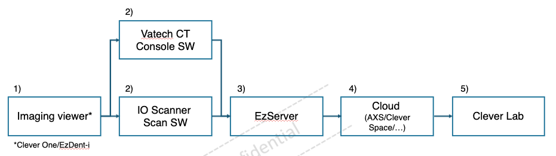
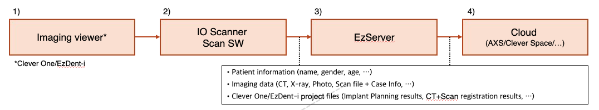
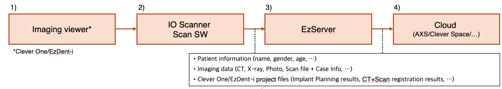
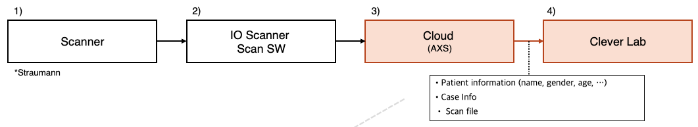
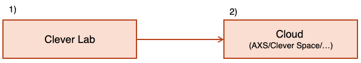
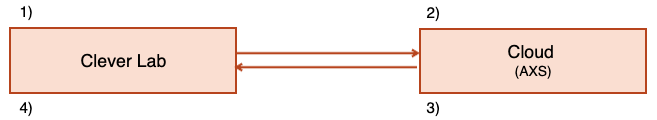

# Review of Vatech SW Integration with AXS Platform

# SW & Service Overview

**EzDent-i**

- 2D Viewer: Select patient, initiates scan session via IO Scanner Scan SW, and manages imaging data

**Clever One**

- Integrated 2D & 3D Viewer : Select patient, initiates scan session via IO Scanner Scan SW, and manages imaging data

**EzServer**

- On-premise central DB Server : Data Storage & Management

**Clever Space**

- Cloud Service for Imaging Data Sharing

**Clever Lab**

- Service for Dental Lab Operations Management

# Data Integration Prerequisites​

**Data Management Overview**

- All data within the dental clinic is stored in EzServer (intraoral scanner integration is mandatory*[*Under discussion]*)
- Dental lab orders are transmitted to Clever Lab
- 

**Unidirectional Data Flow**

- Only one-way transmission in the direction of EzServer → AXS → Clever Lab is supported
- Bidirectional synchronization (Sync) between AXS ↔ EzServer is not supported

**Data Integrity and History Preservation**

- Once a case is saved, it cannot be overwritten; a new Case ID must be issued for any modifications
- Linkage between the original case and the modified case must be maintained (history tracing must be supported)

# Basic Workflow (EzServer → AXS → Clever Lab) ​

① → ② : Launch Scan SW and Console SW​

② → ③ : Save Scan and CT files ​

③ → ④ : Upload patient information, Image Data, Case Information​

④ → ⑤ : Transfer patient information, Image Data, Case Information

# Integration Scenario 1. Basic Data Flow (EzServer → AXS) ​

| **Step** | **Stage** | **Description** | **Notes** |
| --- | --- | --- | --- |
| **1** | Initiate scan from Imaging Viewer | Select a patient in the Imaging Viewer and initiate an intraoral scan → IO Scanner Scan SW creates a new case based on registered patient information and prepares for scanning based on Case ID |  |
| **2** | Scan and generate/save scan file | Save original scan file + Case Info locally |  |
| **3** | Save scan file to EzServer | Automatically transmit locally saved scan file (from Step 2) from Imaging viewer to EzServer | Integration method to be discussed |
| **4** | Upload to AXS | One-way transmission: EzServer → AXS |  |

# Integration Scenario 2. Modifying Data (Saved as New Case)​
(Saved as New Case When Rescanning Due to Scan Quality Issues, etc.)​

| **Step** | **Stage** | **Description** | **Notes** |
| --- | --- | --- | --- |
| **1** | Select case to modify | Select patient in Imaging viewer → pass chart number + Case ID to IO Scanner Scan SW |  |
| **2** | Modify existing scan data | Launch Scan SW with patient and case pre-selected based on chart number + Case ID → user modifies scan data (rescan or edit) → save locally under new Case ID | Modified data saved separately under new Case ID without overwriting existing case |
| **3** | Save scan file to EzServer | Automatically transmit locally saved scan file (from Step 2) from Imaging viewer to EzServer |  |
| **4** | Upload to Cloud | One-way transmission: EzServer → Cloud |  |

# Integration Scenario 3. AXS - Clever Lab  ​
(Scenario 1: Order Information Transmission.)​

| **Step** | **Stage** | **Description** | **Notes** |
| --- | --- | --- | --- |
| **1** | Patient Selection & Order Creation | Select patient in Straumann Scan SW → Enter prosthetic information (tooth number, prosthesis type, material, etc.) and create order | Unique Order ID assigned upon order creation |
| **2** | Scan & File Generation | Perform intraoral scan with Straumann Scanner → Scan file + order information saved in Straumann Scan SW(Server) | Case ID and Order ID mapped |
| **3** | Data Transmission to AXS | Straumann Scan SW → AXS: transmit scan file + order information | Transmission method (API/file transfer, etc.) to be discussed |
| 4 | Clever Lab Order Registration | AXS → Clever Lab: deliver order information → Order automatically registered in Clever Lab and status set to pending | Data mapped based on Order ID |

# Integration Scenario 3. AXS - Clever Lab  ​
(Scenario 2: Work Status Synchronization.)​

| Step | Stage | Description | Notes |
| --- | --- | --- | --- |
| 1 | Work Status Update | Update work status in Clever Lab (Order Received → In Progress → Completed, etc.) | Timestamp recorded upon status change |
| 2 | Status Transmission to AXS | Clever Lab → AXS: transmit updated work status | Status synchronized based on Order ID |

# Integration Scenario 3. AXS - Clever Lab  ​
(Scenario 3: Confirmation Request)​

| Step | Stage | Description | Notes |
| --- | --- | --- | --- |
| 1 | Confirmation Request Submission | Clever Lab completes work → Creates confirmation request with design file or try-in result attached | Unique Confirm ID assigned upon confirmation request |
| 2 | Delivery via AXS | Clever Lab → AXS → Straumann Console: deliver confirmation request data | Design images, scan files, etc. can be attached |
| 3 | Confirmation Result Transmission | AXS → Clever Lab: deliver confirmation result | Result mapped based on Confirm ID |
| 4 | Clever Lab Follow-up | If approved: proceed to fabrication / If revision requested: rework and resubmit confirmation request | Scenario 3 can be repeated |

# End of Document​

