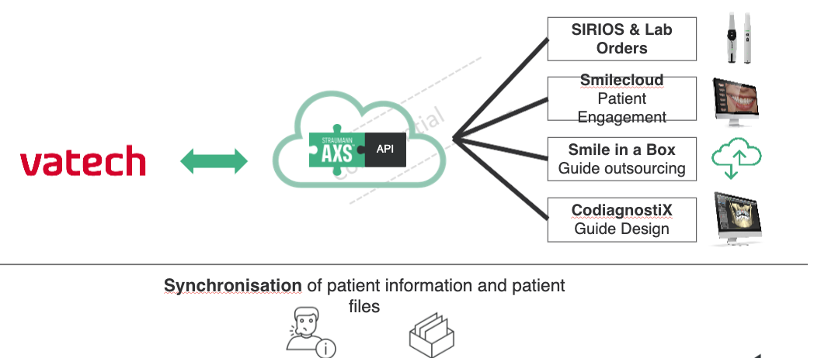
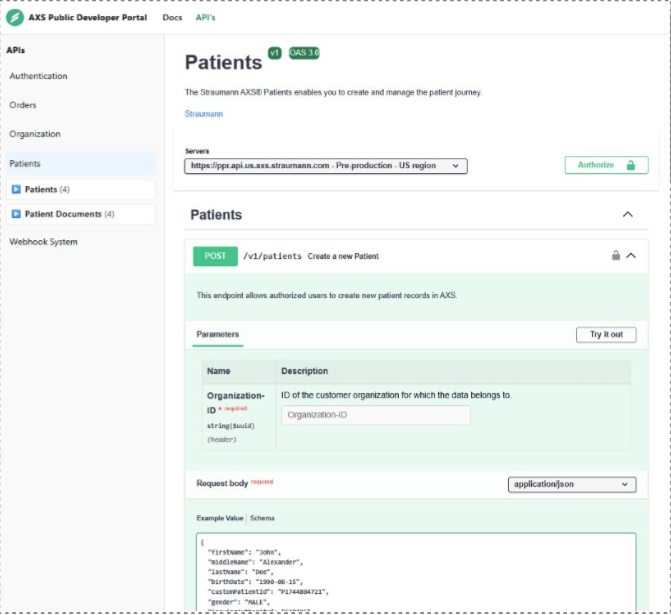
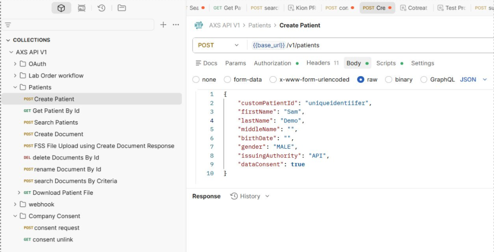
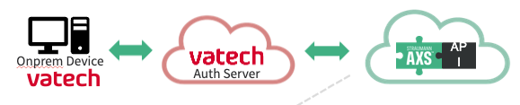
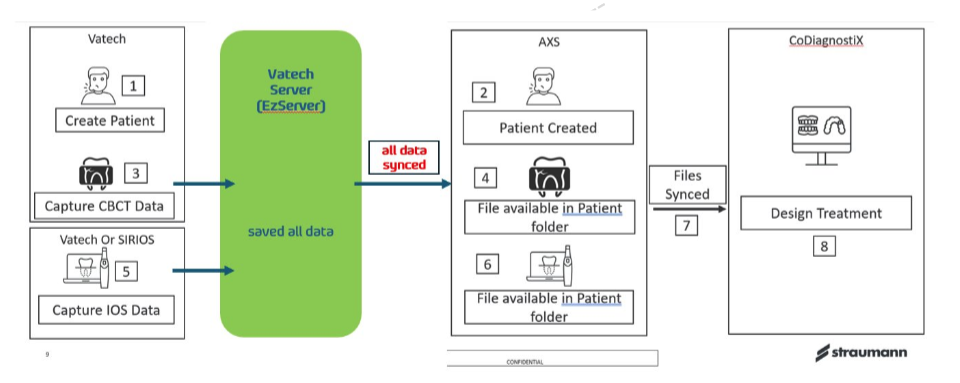
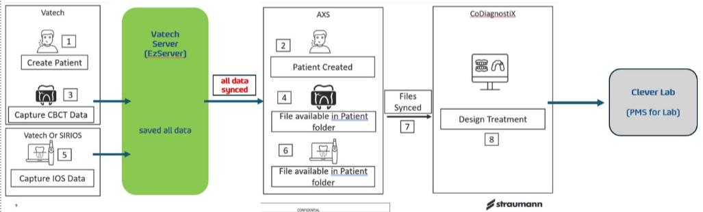

# AXS​ API​

# Agenda

| 1 | Introduction | All |
| --- | --- | --- |
| 2 | AXS API check in – feedback on the AXS API | All |
| 3 | Straumann AXS Ecosystem | Samuel |
| 4 | Suggested Vatech – Straumann AXS Integration | Mahesh |
| 5 | Next steps | All |

# AXS ecosystem​

AXS is entry point to all Straumann digital ecosystem 

# Feedback on AXS API​

# Suggested Vatech – Straumann AXS Integration​
Connecting on premise devices to cloud APi​

- **How the Flow Works:**
1. Vatech Desktop app/server connects only to Vatechbackend **(Vatech Auth Server)**
2. Vatech auth server securely stores:
- client_id
- client_secret
1. Vatech auth server:
- Fetches access tokens from AXS platform
- Calls APIs on behalf of the desktop app.
- **Desktop app never sees or handles sensitivecredentials**

**Key Design Principles**

- Desktop applications are public clients
- No secrets (client_id / client_secret) must be stored locally.
- All secure communication must go through a trusted backend.
- 

**Benefits of This Approach**

- **Strong Security:** Secrets never exposed to end-user devices
- **Centralized Secret Rotation:** Rotate credentials without redeploying desktop apps
- **Reduced Risk Surface:** Prevents reverse engineering exploits

# Vatech Request

# Request 1:​
​
We'd like to store all data at our server (EzServer) and then synchronise the information with
AXS, allowing our mutual customers to access both Vatech and Straumann platforms.

# Request 2:

​- As the part of Request #1, we would like your IOS (SIRIOS/Alliedstar) data to be automaticallysaved to our server immediately after capture.
- This would allow us to access the data through our software and open and merge the files asneeded.

# Request 3:

- Additionally, we would like to discuss a potential integration between your solution and CleverLab, Vatech's PMS for dental labs.
- Through this integration, your customers would be able to send orders to dental labsseamlessly.

