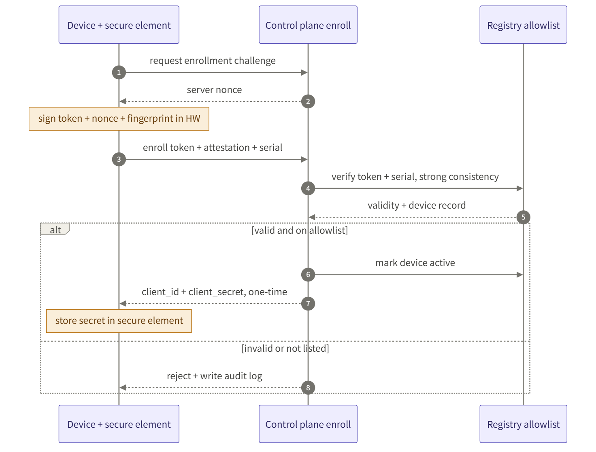
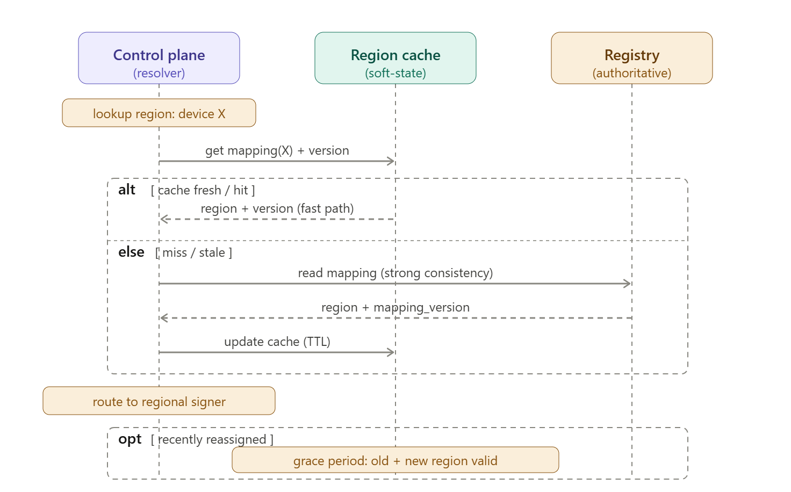

ARD = Architecture Decision/Reference Document. 상태: **스켈레톤**(상세 설계 단계 채움). 요구사항 출처: [VT API Gateway — PRD (v2)](<VT API Gateway — PRD (v2).md>).

**문서 통제**

| 항목        | 내용                                         |
| -------------- | --------------------------------------------------- |
| 문서 ID        | ESIP-GW-ARD                                         |
| 문서 버전      | v0.9                                                |
| 적용 제품 버전 | gw/1.0.0.0                                          |
| 분류           | 통제 문서 (Controlled · IEC 62304 / ISO 13485 대상) |
| 상태           | Draft                                               |

## 0. 개정 이력 (Revision History)

| 문서 번호 | 일자 | 작성 | 변경 내용 | 상태 |
| --- | --- | --- | --- | --- |
| v0.1 | 2026-06-08 | Scott | 스켈레톤 — ADR 6건 등록, 컴포넌트·시퀀스 TBD | Superseded |
| v0.3 | 2026-06-08 | Scott | 핵심 시퀀스 3종(온보딩·리전 해석·업로드 세션) 추가 | Draft |
| v0.8 | 2026-06-15 | Scott | ESMN Roadmap 흡수 — ADR-07~10(API 버전 호환성·OneID 인증면·Webhook Receiver·라우팅 키 통합), 컴포넌트 4종·시퀀스 2종 추가 | Draft |
| v0.9 | 2026-06-15 | Scott | Webhook Edge MQTT 역방향(WH-06)을 b1(v1.0)로 당김 — AXS pilot 일정 반영(ESIP-23) | Draft |
| v0.10 | 2026-06-23 | (SRS 동기화) | **ADR-11(라우팅 모델: target-routed proxy)** 추가 + **Router / PEP** 컴포넌트 등록 — SRS §4.1.1·§4.1.2·§2.2와 동기화(모든 upstream 동일 proxy 경로, 차이는 trust profile). CCB 확인 대기 | Draft |
| v0.11 | 2026-06-23 | (SRS 동기화) | **ADR-03(리전 signer)·ADR-04(Upload Session) 철회** — GW는 presigned 직접 발급/세션/storage 비소유, 발급=CleverSpace/AXS·GW 중계. §5.3·컴포넌트·Data plane 정리(SRS §4.1.4·§7.4와 동기화) | Draft |
| v0.12 | 2026-06-25 | (SRS 동기화) | **디바이스=EzServer 정의 추가(Scott 확정)** — §1 개요에 "GW 관점 디바이스=EzServer(물리 HW는 EzServer 뒤·GW 비대상)" 용어 노트. ARD의 디바이스 머신 인증·enrollment·device→region·§5 시퀀스는 모두 EzServer로 읽음(SRS §1.4와 정합) | Draft |
| v0.13 | 2026-06-25 | (SRS 동기화) | **ADR-11 CCB 승인(오늘 회의)** — ADR-11 상태 '채택·CCB 확인 대기' → '채택·CCB 승인(2026-06-25)'. SRS Appendix A·B #13과 정합 | Draft |
| v0.14 | 2026-06-30 | (SRS 동기화) | **ADR-12(Webhook 분배 워커 = 별도 worker Deployment)** 추가 + **Webhook Dispatcher** 컴포넌트 등록 — SQS consumer가 큐 소비→대상 해석→MQTT/HTTP 발행. Webhook Receiver는 수신·ACK·적재까지로 분리. SRS §2.2·§2.3.6·§7.6.7과 동기화. in-process·Lambda 반려 | Draft |
| v0.15 | 2026-07-01 | (SRS 동기화) | **fingerprint = EzServer 생성 키페어 공개키**(물리·LM Cryptlex 하드웨어 지문 아님) 명확화 + **재설치 fingerprint 회전**(라이선스/Clinic-ID 재검증·기존 revoke·횟수제한·감사, 개인키 백업 미도입) — §5.1·Enrollment Service·SRS §7.2.6/§7.2.7·DBML·OpenAPI 정합 | Draft |

## 1. 아키텍처 개요

3-Plane(Control / Data / Integration) — 상세는 PRD §4 참조. 본 문서는 그 위의 아키텍처 결정·컴포넌트·시퀀스를 확정한다.

> **용어(확정 2026-06-25): GW 관점의 "디바이스" = EzServer**(클리닉당 1개 엣지 머신). 본 ARD의 디바이스 머신 인증·enrollment·Device Registry·device→region·시퀀스의 "디바이스"는 모두 **EzServer**를 가리킨다. 물리 영상장비(CT/Xray)는 EzServer 뒤편이며 **GW 비대상**(GW에 직접 연결하지 않음 — §5 시퀀스의 "디바이스→GW"는 "EzServer→GW"로 읽는다). SRS §1.4와 정합.

## 2. 주요 아키텍처 결정 (ADR)

| ID | 결정 | 근거 | 상태 |
| --- | --- | --- | --- |
| ADR-01 | mTLS 미채택, DPoP + 하드웨어 키(SE/TPM) | 10만대 운영 부담 / mTLS는 물리 키추출 위협 미해결 | 채택(방향) · 적용 gw/1.1 (v1.0은 OAuth2 cc + claim 바인딩, SRS §7.1.1) |
| ADR-02 | Control plane = soft-state (완전 stateless 아님) | cache TTL·mapping_version·강한 일관성 경로 분리 | 채택 |
| ADR-03 | ~~리전 signer agent~~ — **철회(2026-06-23)**: GW는 presigned 직접 발급·서명 안 함. 발급=upstream(CleverSpace/AXS), GW 중계 | SRS §4.1.4·§7.4 | 철회 |
| ADR-04 | ~~Upload Session 추상화~~ — **철회(2026-06-23)**: GW는 업로드 세션 비소유. 세션·resumable·멱등·무결성=발급 주체(CleverSpace ②/AXS ④) | SRS §7.4 | 철회 |
| ADR-05 | presign broker 멀티클라우드(S3·Blob·GCS·MinIO) | 리전 이종성·온프렘 수용 | 채택 |
| ADR-06 | Fleet 운영 1급 서브시스템 | 10만대 실질 난이도 1순위 | 채택 |
| ADR-07 | API 버전 호환성 게이트 — Vatech-\* 식별 헤더 + well-known 런타임 버전 공시 + 호환성 매트릭스 | 구버전 클라이언트 원인불명 실패 제거(CleverSpace v1.3.0 즉시 대응) / 클라이언트 버전 미전달 방치(반려) · ESMN Roadmap 1단계 흡수 | 채택 |
| ADR-08 | 인증 2면 공존 — 디바이스 머신 인증(OAuth2 cc·enrollment) + OneID(OIDC, 사람·클리닉·사내 호출자) | 무인 디바이스와 사람/서비스 신원은 성질이 달라 단일 인증면으로 묶지 않음 / OneID 단독(무인 디바이스 부적합)·디바이스 단독(사내 서비스 미수용) 반려 | 채택 |
| ADR-09 | Webhook Receiver — 외부 이벤트 단일 수신·분배(클라우드 HTTP push / Edge(EzServer) MQTT QoS1) | 방화벽 뒤 Edge inbound 불가 + 외부 서명·IP·멱등 검증 분산 방지 / 서비스별 개별 수신(반려) · ESMN Roadmap §2.7 흡수 | 채택 |
| ADR-10 | 라우팅 키 통합 — device↔clinic↔region (resolver가 device_id·clinic_id 모두 수용) | 디바이스 단위(08)·클리닉 단위(서비스 연동) 라우팅 이원화 제거. 디바이스는 클리닉에 소속되어 동일 리전으로 귀결 | 채택 |
| ADR-11 | 라우팅 모델 = target-routed proxy — `Vatech-Target` 유무로 GW 고유 API(없음) vs upstream proxy(있음·논리 ID enum) 구분, proxy는 verbatim 전달(host만 교체). 신규 upstream = 레지스트리 1행(코드·경로 변경 0) | 경로 네임스페이스 라우팅 / 투명 프록시 / 클라이언트 지정 upstream(SSRF) 반려. upstream 무한 확장을 설정 기반으로(NFR-SCL), 내부(B)·외부(C)를 단일 규칙으로 — 차이는 trust profile(C=OAuth·고정 egress IP)뿐 (SRS §4.1.1·§4.1.2) | 채택(2026-06-23) · **CCB 승인(2026-06-25)** |
| ADR-12 | Webhook Dispatcher(분배 워커) = **별도 worker Deployment** — SQS(A)를 소비(consume)해 대상 해석 후 MQTT(Edge)/HTTP(클라우드)로 발행하는 주체. GW와 동일 코드베이스·HTTP 없이 consumer만, API tier와 독립 스케일(KEDA·SQS 큐depth)·장애 격리 | 기존 GW 모듈 in-process(부하·스케일 결합) / 서버리스 Lambda(로직·DB·시크릿·egress 중복·2nd 런타임 검증 부담) 반려. 코드·도메인·커넥터·시크릿 공유로 드리프트 0·단일 검증 스택 유지 + webhook 버스트를 분배만 독립 확장 (SRS §2.2·§2.3.6·§7.6.7) | 채택(2026-06-30) |

## 3. 논리 / 배포 구성

### **3.1 논리 구성 (3-plane)**

| Plane | 컴포넌트 | 비고 |
| --- | --- | --- |
| Control (글로벌, soft-state) | Device Registry · Enrollment · Auth(OAuth2/JWT) · Region Resolver · Config · Fleet Ops · Policy(OPA) · Audit | 메타데이터만 · PHI 미경유 |
| Data (리전 한정) | **GW 비호스팅** — presigned 발급·storage는 upstream(CleverSpace/AXS); GW는 중계만 | PHI 리전 밖 미이동(주권) |
| Integration (north-south) | Connector Framework · AXS Connector · Egress 정책 | 안전 링크 pull |

### **3.2 배포 구성 (v1.0 · AWS 단일 리전)**

- 진입: API Gateway / ALB → 서비스(EKS 또는 Lambda).
- 상태: 메타·매핑·토큰 = 관리형 DB(DynamoDB / 글로벌복제 DB는 v1.2 멀티리전 시). 시크릿 = KMS / Secrets Manager.
- 파일: 리전 S3(디바이스 직결, presigned). 비동기 = SQS / Step Functions.
- 정책: OPA(allowlist·region·scope·egress).
- 온프렘(후속): presign·storage는 제품(CleverSpace) 영역(MinIO 포함). **GW Region Signer는 철회** — GW는 발급하지 않음.
- 전 구성 IaC 재현(NFR-MNT). 가용성 Multi-AZ(NFR-AVA).

## 4. 컴포넌트

| 컴포넌트 | Plane | 책임 | v1.0 심도 |
| --- | --- | --- | --- |
| Device Registry / Lifecycle | Control | 디바이스 등록·조회·상태기계(pending→active→suspended→revoked) | 핵심 |
| Enrollment Service | Control | 부트스트랩 신뢰(라이선스/Clinic-ID)·nonce·**fingerprint(키페어 공개키) 바인딩**·재설치 회전·자격 발급 | 핵심(HW attestation·개인키 비추출은 v1.1) |
| Auth Service | Control | OAuth2 cc·JWT 발급/검증·token store·secret 회전 | 핵심(DPoP/HW키 v1.1) |
| Region Resolver | Control | device→region 매핑·mapping_version·강한 일관성 경로 | 핵심(단일 리전) |
| Router / PEP (target-routed proxy) | Control | `Vatech-Target` 기반 upstream 라우팅(B 내부·C 외부 동일 경로)·정책 체인(인증·버전·egress allowlist)·verbatim bypass. 외부(C)는 Connector Framework로 OAuth·egress 적용 | 핵심(ADR-11) |
| Config Service | Control | 중앙 config push/pull | 핵심 |
| Fleet Ops | Control | heartbeat·kill-switch·성공률·rollout | 기본(rollout/카나리 v1.1) |
| Connector Framework + AXS | Integration | adapter·egress 정책·AXS OAuth2 위임·proxy | 핵심(추가 connector v1.1) |
| Policy Engine (OPA) | Control | allowlist·region·scope·egress 판단 | 핵심 |
| Audit Service | Control | append-only 감사 로그 | 경량(MVP) |
| Admin UI / RBAC | Control | 운영자 관리·권한 | 경량(MVP) |
| API Compatibility Gate | Control | Vatech-\* 헤더 판정 · well-known 버전 공시 · 오류코드 매핑/fallback · 호환성 매트릭스 집행 | 핵심(즉시 · Roadmap 1단계) |
| OneID Integration | Control | OIDC 연계 — 사람·클리닉·사내 호출자(EzServer/CleverOne) 인증. 디바이스 머신 인증과 분리 surface | 핵심 |
| Webhook Receiver | Integration | 외부 Webhook 수신(HMAC·IP·timestamp·멱등)·즉시 ACK·내부 큐(SQS) 적재 | 핵심(b1 · forward+역방향) |
| Webhook Dispatcher (분배 워커) | Integration | **SQS consumer — 별도 worker Deployment(ADR-12)**. 큐 소비→대상 해석(Org-ID→Clinic→region→채널)→MQTT(Edge)/HTTP(클라우드) 발행·재시도/DLQ. API tier와 독립 스케일·격리 | 핵심(b1) |
| MQTT Broker (Edge 분배) | Integration / Data | Edge(EzServer)로의 이벤트 전달 채널(QoS1·persistent·토픽 클리닉 단위). Webhook Dispatcher가 publish | 핵심(b1 · 역방향 포함) |

## 4.5 기술 스택 (Tech Stack)

확정(◎) · 권장 보완(○ — 누락분). 단일 리전 v1.0 기준.

| 영역 | 채택 | 비고 |
| --- | --- | --- |
| BE | ◎ NestJS + DDD + TDD | bounded context=모듈·도메인 계층 분리·테스트 우선 |
| FE (관리 UI) | ◎ React + Vite + FSD + shadcn/ui | 경량 · 디자인시스템 미도입 |
| API 문서 | ◎ Swagger (@nestjs/swagger, code-first) | 데코레이터→OpenAPI 자동 · /api-docs |
| 관계 DB | ◎ PostgreSQL | 레지스트리·매핑·토큰메타·정책·감사 (멀티리전 v1.2 → 분산SQL 검토) |
| 캐시 | ◎ Redis (key-val) | region 매핑 캐시(TTL)·nonce·rate-limit·idempotency·JWKS |
| 큐 | ○ RabbitMQ (권장) / SQS(AWS-only) / BullMQ(내부 경량 잡) | 외부 전달 durable·DLQ·라우팅·멀티클라우드·온프렘 포터블. 선정 기준은 throughput 아닌 **전달 보증·포터빌리티** |
| 오브젝트 스토리지 | (제품 영역) S3(리전)/MinIO(온프렘) | **발급 주체(CleverSpace/AXS) 소유** — GW 스택 아님(GW 미경유 직결) |
| 시크릿/키 | ○ KMS/Secrets Manager (+ Vault: enrollment·PKI) | 시크릿 회전·암호화 — 보안설계 필수 |
| 정책 엔진 | ○ OPA | allowlist·region·scope·egress (ARD ADR/시퀀스 전제) |
| 관측성 | ○ OpenTelemetry + 로그/메트릭 | NFR-OBS · fleet 지표·감사 |
| IaC | ◎ Terraform | NFR-MNT 환경 재현 |
| CI/CD | ◎ Azure Pipelines | TDD 게이트(테스트 통과 필수) |
| ORM/마이그레이션 | ◎ Prisma | 스키마 마이그레이션 |
| Edge/Ingress | ○ AWS API Gateway/ALB / Envoy | TLS·rate-limit·진입점 |
| 사람(admin) 인증 | ○ OIDC (Keycloak 등) | 디바이스 인증과 분리 |
| Feature Flag | ○ OpenFeature + Unleash(OSS) | 카나리 rollout·kill-switch 토글·점진 cutover (FLEET·MIG) |
| 로깅 | ○ 구조화 로그(Pino/nestjs-pino) + correlation/trace ID | 중앙 수집(OTel→Loki/CloudWatch) · **PHI·시크릿 미기록** |
| 헬스/검증 | ○ @nestjs/terminus · class-validator | health·readiness · 입력 검증 |

## 5. 핵심 시퀀스

핵심 3개 흐름. 각 절은 텍스트 시퀀스 + 다이어그램 + 요구사항/작업 추적.

### **5.1 온보딩 (Enrollment)**

요구사항: FR-ENR-01~04 ([요구사항 명세](<VT API Gateway — 요구사항 명세 (Requirements).md>)) · 작업: [ESIP-9](https://vts.vatech.com/browse/ESIP-9)

1. 디바이스가 부트스트랩 신뢰(공장 주입 토큰 / OOB 일회 코드)로 enrollment 요청.
2. Control plane이 **nonce challenge** 발급.
3. 디바이스가 **키페어 생성** → nonce **개인키 서명**(소지 증명) + **공개키(= device fingerprint)** 동봉 응답. (**fingerprint = 생성 키페어의 공개키/key-id**, 물리 머신 지문 아님 · LM Cryptlex 하드웨어 지문과 별개.)
4. Control plane: 신뢰 검증 + **geo/velocity 이상탐지** → allowlist 등록(=자격 발급).
5. 디바이스 자격증명(client_id/secret, **공개키 바인딩**) 발급·저장. **v1.0=SW 보관 키(hw_key_bound=false), gw/1.1=TPM/SE 비추출**(ADR-01).
6. lifecycle: pending → active (강한 일관성 경로).
7. **재설치·키 변경(fingerprint 회전)**: 부트스트랩 신뢰(라이선스·Clinic-ID) 재검증 + **기존 fingerprint/credential revoke → 새 공개키 회전**(횟수·속도 제한·감사, 개인키 백업 미도입). 상세 SRS §7.2.7.

### **5.2 리전 해석 (Region Resolution)**

요구사항: FR-RGN-01~03 ([요구사항 명세](<VT API Gateway — 요구사항 명세 (Requirements).md>)) · 작업: [ESIP-4](https://vts.vatech.com/browse/ESIP-4)

1. 인증된 디바이스(JWT)가 작업 직전 region 해석 요청.
2. region resolver: device→region 매핑 조회(`mapping_version` · cache TTL 초 단위).
3. assignment 변경 등 강한 일관성 필요 연산은 strong-consistency 경로.
4. 매핑 리전 endpoint + 주권 정책(PHI 리전 밖 금지) 반환.
5. 이후 모든 데이터 경로는 해당 리전으로 고정.

### **5.3 파일 업로드 — presigned 중계 (GW 비발급)**

요구사항: FR-SES-01~05([요구사항 명세](<VT API Gateway — 요구사항 명세 (Requirements).md>)) — **발급 주체(CleverSpace ②/AXS ④) 소유**, GW는 중계.

1. 클라이언트(EzServer/디바이스) → GW: presigned 발급 **요청**(Vatech-Target로 대상 지정, B/C bypass).
2. GW: 인증·버전 게이트·정책(egress) 적용 후 **upstream(CleverSpace/AXS)으로 verbatim 중계** — GW는 서명하지 않는다.
3. upstream이 presigned URL 발급 → GW가 그대로 전달(변환 없음).
4. 클라이언트 → **발급 주체 storage 직결** 업로드(Control plane 미경유). resumable/multipart·checksum·commit·완료처리는 **upstream 책임**.
5. PHI는 GW control plane 미경유 · GW는 객체 키·세션을 저장하지 않음.

> **철회(2026-06-23)**: 이전 'GW Region Signer가 리전 storage용 presigned 직접 발급 + GW Upload Session'(ADR-03/04)은 폐기. GW는 presigned 발급·세션·storage를 소유하지 않는다(SRS §4.1.4·§7.4).

## 6. 교차 링크

PRD: [VT API Gateway — PRD (v2)](<VT API Gateway — PRD (v2).md>) · 작업: [ESIP-1](https://vts.vatech.com/browse/ESIP-1) (Pillar) · [ESIP-2](https://vts.vatech.com/browse/ESIP-2) (v1.0) · 기획 [ESIP-3](https://vts.vatech.com/browse/ESIP-3) · 동인: [VGBX-8906](https://vts.vatech.com/browse/VGBX-8906) · [VTWB-16535](https://vts.vatech.com/browse/VTWB-16535)

## 7. Roadmap 통합 (ESMN VatechAPIGateway Roadmap 흡수)

본 ARD의 3-Plane control plane을 **골격**으로 유지하고, ESMN *VatechAPIGateway 구축 및 API 호환성 통합 Roadmap*(2026-06-11 SCServer 기술검토 회의)의 4개 요소를 흡수한다. 원칙: **골격=08, 우선순위·현실 메커니즘=Roadmap**.

| 흡수 항목                    | Roadmap 출처                   | 08 반영                                                           | ADR    |
| ---------------------------- | ------------------------------ | ----------------------------------------------------------------- | ------ |
| API 버전 호환성              | 1단계(즉시·CleverSpace v1.3.0) | API Compatibility Gate · FR-COMPAT-01~05                          | ADR-07 |
| OneID 인증면                 | OneID 단일 집행                | OneID Integration · FR-AUTH-08/09 (디바이스 머신 인증과 2면 공존) | ADR-08 |
| Webhook Receiver + Edge MQTT | §2.7                           | Webhook Receiver · MQTT Broker · FR-WH-01~06                      | ADR-09 |
| 라우팅 키 통합               | ClinicID 라우팅                | Region Resolver 확장 · FR-RGN-06                                  | ADR-10 |

### **7.1 외부 이벤트 수신·분배 (Webhook Receiver)**

요구사항: FR-WH-01~06 · 작업: 신규 ESIP(Webhook Receiver)

1. 외부(AXS 등)가 **등록된 webhook 엔드포인트(provider별·유연)** 로 이벤트(HTTPS POST) 전송 — 경로/형식은 provider 규약 수용(GW 비강제·payload 비해석).
2. Receiver 검증: HMAC 서명 · 소스 IP allowlist · timestamp(replay 방지).
3. 즉시 2xx ACK 후 내부 큐로 위임(재시도·백오프·DLQ).
4. `eventId` 기준 멱등 처리(중복 1회만 반영).
5. 분배 — 클라우드 대상(CleverLab/CleverSpace)=HTTP push, Edge(EzServer)=MQTT(QoS1·persistent).

### **7.2 클라이언트 버전 호환 판정 (API Compatibility)**

요구사항: FR-COMPAT-01~05 · 작업: 신규 ESIP(API 버전 호환성)

1. 클라이언트가 `Vatech-Product/Version/OS/Clinic-Id/Via` 헤더 부착(originator 권위).
2. API Compatibility Gate가 well-known 공시 버전·호환성 매트릭스와 대조.
3. 미지원 시 표준 오류코드 + fallback(업데이트 필요 안내) 반환.
4. 1단계는 GW 신설 전에도 기존 경로(서버 직접 판정)에서 즉시 적용 — Roadmap의 GW 없이 즉시 원칙 흡수.
