# VT API Gateway — 개발 Roadmap 결정

> **문서 위치·성격.** 본 문서는 **통제 문서가 아닌 배경·의사결정 기록**(non-controlled, free-form)이며, [VT API Gateway — PRD (v2)](<../VT API Gateway — PRD (v2).md>)의 **child(배경 문서)**다. 여기서 내린 결론(케이스 D 확정·5단계 구성 등)은 **PRD §12·ARD §7에 흡수**되어 있으며, 확정 스펙은 PRD/ARD/요구사항 명세를 정본으로 한다. 본 문서는 그 결론에 이르는 **케이스 비교·단계 의존성 분석**을 보존한다. 정본 링크: [PRD (v2)](<../VT API Gateway — PRD (v2).md>) · [ARD (아키텍처)](<../VT API Gateway — ARD (아키텍처).md>)

작성일: 2026-06-04  
근거: 6월 4일 회의 결정([`0604_회의록_APIGateway통합.md`](../../references/CleverAPI호환성체크/0604_회의록_APIGateway통합.md)), API 호환성 분석([`API호환성_방안비교_보고서.md`](../../references/CleverAPI호환성체크/API호환성_방안비교_보고서.md)), Straumann AXS 연동 분석([`Straumann-Vatech_AXS연동_분석보고서.md`](../../references/Straumann연동/Straumann-Vatech_AXS연동_분석보고서.md))

> 본 문서는 **이 한 편으로 개발 가이드가 완결**되도록 작성한다. 위 근거 문서는 필요할 때만 참고한다.

---

## Executive Summary

> **[진행 방식 확정] 케이스 D로 진행한다.** 1·2단계(API 호환성 · presigned)는 **병행 착수**하고, 3·4·5단계(GW 일원화 · 멀티 Region · Straumann 연동)는 **통합 진행**한다(최대 동시화). GW·Webhook은 **범용(다중 서비스) 구조로 설계**하되, GW 위 **첫 연동 구현은 Straumann → 이후 CleverSpace** 순이다(§3.5·§3.7). 케이스 비교는 아래 다이어그램(케이스 A~D) 참조.

**목적.** 모든 클라우드 연동을 단일 게이트웨이(**VatechAPIGateway**, 이하 GW)로 통합하고, 그 위에서 **API 버전 호환성 문제까지 함께 해결**한다. 대상은 CleverSpace뿐 아니라 Straumann(AXS) 등 **외부 서버 연동 전체**다.

**현재 문제(AS-IS).**

- CleverOne·EzServer가 CleverSpace로 **여러 경로로 직접 연동**(EzServer 경유 경로 A + 직접 경로 B)되어 인증·정책 통제가 분산된다.
- 클라이언트가 **제품 버전을 전달하지 않아**, 구버전이 신규 API·오류 코드를 인식하지 못하고 **원인 불명 실패**가 발생한다.

> Straumann(AXS) 연동은 위와 같은 "문제"가 아니라, **GW가 만들어지면 그 위에서 자연히 수용되는 신규 연동 대상**이다. 본 프로젝트에서 **공식 5단계로 진행**하며, 두 갈래를 포함한다 — ① EzServer → AXS(온프레미스→클라우드), ② CleverLab ↔ AXS(클라우드↔클라우드, 기공소 주문 연동). 두 경우 모두 **VatechAPIGateway를 경유**하고 대용량은 **presigned**를 쓴다. 상세는 §3.7.

**목표(TO-BE).**

- **모든 연동은 GW를 단일 경유**한다. 온프레미스는 `EZ → GW → 대상 서버`, 클라우드 서비스(CleverLab 등)의 외부 연동도 `우리 클라우드 → GW → 외부 클라우드`로 **예외 없이 GW를 지난다**. GW가 **인증(디바이스 머신·운영자)·버전 호환·Region 라우팅의 단일 집행점**이 된다.
- **정보(메타데이터)는 GW**를 지나고, **대용량 데이터(CT·이미지·디자인 파일)는 presigned URL로 스토리지에 직접 전송**한다(온프레미스·클라우드 동일 원리).
- **직접 연동 경로 B는 GW로 흡수하며 Deprecated**된다(3단계). 구버전 호환 종료 후 **EOS(End of Service) 예정**이다.
- CleverSpace를 **여러 Region에 두고**, GW가 **ClinicID 기준으로 분배**하며, EzServer는 **Route 53 GeoDNS로 가장 가까운 GW**에 연결된다.
- EzServer는 **현장의 Edge로 유지**한다(추후 Rust 전면 재개발은 별도 후속 트랙).

**Roadmap(0~5단계, 기능 응집·의존 순서 기준).** 목표 기한은 6개월이며, 단계는 기능 묶음으로 나눈다. 의존 순서상 **IO Scanner↔EzServer 수집(v1.0 선결·방식 R1) → API 호환성(즉시 착수) → presigned 데이터 경로 → GW 일원화 → 멀티 Region → Straumann 외부 연동** 으로 진행한다. **0단계는 v1.0(Straumann IO Scanner 우선, 7/9 결정)으로 앞에 붙는 선결 단계이며, 기존 1~5단계 번호·정의는 불변**(방식은 R1·2026-07-16 논의).

| 단계      | 한 줄 정의                         | 결과                                                                               |
| --------- | ---------------------------------- | ---------------------------------------------------------------------------------- |
| **0단계** | IO Scanner↔EzServer 수집(v1.0 선결·방식 R1) | 스캔 데이터를 EzServer로 유입 — v1.0 첫 연동의 데이터 소스 확보(수집 제품·방식 미정·R1) |
| **1단계** | API 버전 호환성 해결(GW 없이 즉시) | 식별 헤더·서버 버전 체크·well-known 공시로 원인불명 실패 제거                      |
| **2단계** | presigned 데이터 경로              | 대용량 데이터 직접 업로드 경로 완성(GW 일원화의 선행 요건)                         |
| **3단계** | GW 신설·일원화                     | `EZ → GW → 대상` 단일 경유 + 인증 일원화 + 경로 B 흡수·Deprecated                  |
| **4단계** | 멀티 Region·글로벌·운영            | VatechAPIGateway 완성(멀티리전·HA·관리)                                            |
| **5단계** | Straumann(AXS) 외부 연동           | EzServer→AXS + CleverLab↔AXS를 GW·presigned로 연동(3단계 이후 착수, 4와 병렬 가능) |

아래는 진행 방식 비교(케이스 A~D)다. **본 프로젝트는 케이스 D로 확정**했으며, A~C는 비교·참고용이다.

**케이스 A — 순차 진행**(기본 Roadmap, 참고용)

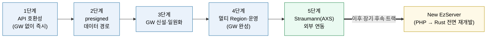

**케이스 B — 1·2단계 병행**(작업 영역이 독립적이라 동시 착수)

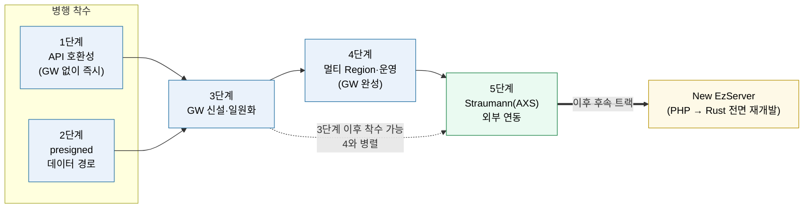

**케이스 C — 1·2 병행 + 3·4 통합**(GW를 멀티리전-ready로 한 번에)

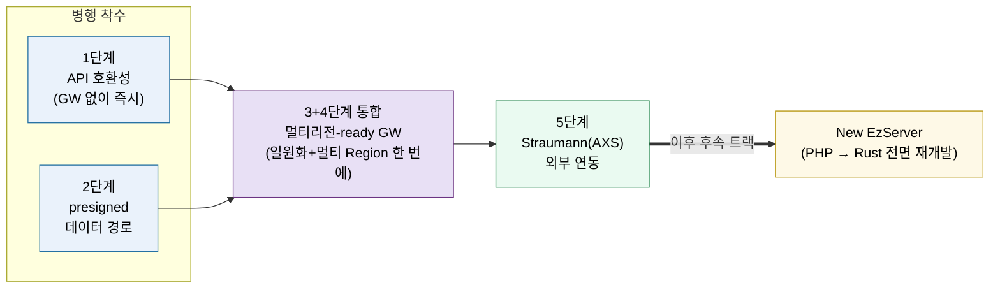

**■ 케이스 D — 1·2 병행 + 3·4·5 통합**(GW·멀티리전·Straumann을 한 번에, 최대 동시화) — **★ 확정(채택)**

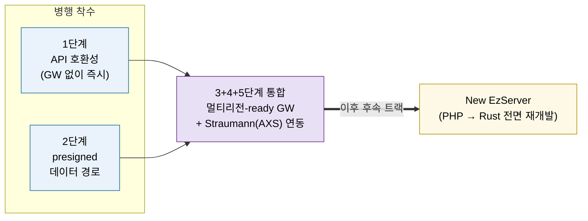

> 색상: 파란 = 핵심 단계, 보라 = 통합 단계, 초록 = Straumann 외부 연동(5단계), 노랑 = EzServer Rust 후속 트랙. 케이스 B·C·D 공통: 1·2단계는 작업 영역이 독립적이라 **동시 착수** 가능하고, GW 본체 **빌드도 병렬로 시작**할 수 있다. 다만 GW로의 **전환**(cutover)은 1·2가 안착한 뒤에 한다. 케이스 C는 단일 Region → 멀티 Region 재작업을 피하려고 **GW를 처음부터 멀티리전-ready로** 구축하는 시나리오다. 케이스 D는 여기에 **Straumann(5단계)까지 통합**해 인력이 충분할 때 최대 동시화하는 최속 시나리오다(멀티리전 확정·전담 인력이 전제).
>
> **본 프로젝트는 케이스 D로 확정**했다. 즉 1·2단계 병행 + 3·4·5단계 통합으로 진행하며, 멀티리전·Straumann 연동을 처음부터 전제로 GW를 구축한다.

- **1단계는 GW 없이 기존 경로에서 바로 착수**할 수 있어, CleverSpace v1.3.0 일정의 호환성 문제에 즉시 대응한다.
- **presigned(2단계)는 GW 일원화(3단계)의 선행 요건**이다. 모든 연동이 GW를 경유하는 구조에서 **대용량 데이터(CT·영상)는 GW로 보낼 수 없으므로**(병목·타임아웃), 업로드를 성립시키는 방법은 presigned(스토리지 직접 업로드)뿐이다. 즉 presigned 없이는 GW 체계에서 데이터 업로드를 처리할 수 없어, presigned가 먼저 갖춰져야 GW 일원화가 성립한다.
- **Straumann 연동(5단계)은 3단계 이후 착수 가능**하며 4단계와 병렬로 진행할 수 있다(선행 요건: presigned + GW + 인증 + Org-ID 매핑).
- **EzServer 전면 재개발**(PHP → Rust)은 5단계에서 제외하고 **이후 장기 후속 트랙**으로 둔다.

**기대 효과.** 연동 창구·인증 일원화로 보안·운영이 단순해지고, 버전 호환 실패가 사라지며, 멀티 Region으로 글로벌 확장과 외부(Straumann) 연동을 **같은 구조로** 수용한다.

---

## 1. 배경과 목적

세 제품(CleverOne, EzServer, CleverSpace)은 현재 **두 갈래 경로**로 연동된다. EzServer가 중계하는 기능은 경로 A(`CleverOne → EzServer → CleverSpace`), EzServer가 중계하지 않는 기능은 경로 B(`CleverOne → CleverSpace` 직접)다.

이 구조의 문제는 세 가지다.

1. **연동 창구 분산** — 직접 경로(B)가 존재해 인증과 정책 통제가 두 갈래로 나뉜다.
2. **버전 호환 실패** — 클라이언트가 제품 버전을 전달하지 않아, 구버전이 신규 API·오류 코드를 처리하지 못하고 사용자에게 원인 불명 실패로 나타난다.
3. **외부 연동 확장의 어려움** — Straumann(AXS)처럼 보안상 **직접 연결이 불가능한 외부 서버**가 늘면, 중간 게이트웨이 없이는 연동 자체가 막힌다. 이 외부 연동은 **온프레미스→클라우드**(EzServer→AXS)뿐 아니라 **클라우드↔클라우드**(CleverLab↔AXS, 기공소 주문)까지 포함한다.

따라서 본 과제의 목적은 **VatechAPIGateway라는 단일 게이트웨이를 완성**하여 위 세 문제를 **한 번에** 푸는 것이다. GW는 단순 중계가 아니라 **인증·버전 호환·Region 분배를 집행하는 정책 지점**이다.

### AS-IS 전체 구조

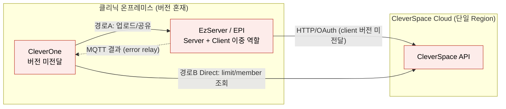

> 붉은 노드 = 문제 지점. 직접 경로(B)로 창구가 분산되고, 클라이언트 버전이 전달되지 않으며, 대용량 데이터는 그때그때 직접 전송된다.

---

## 2. 목표 아키텍처 (TO-BE 최종)

### 2.1 핵심 원칙 — 모든 연동은 GW를 통한다

- **명칭: VatechAPIGateway(GW).** 앞으로 모든 GW는 이것을 가리킨다.
- 모든 연동은 **`EZ → GW → 대상 서버`** 경로를 따른다. 대상은 CleverSpace, Straumann(AXS), 그 외 어떤 서버든 **예외 없이 GW를 경유**한다.
- GW는 **인증(디바이스·운영자)·버전 호환·Region 라우팅을 집행하는 단일 지점**이다.

### 2.2 구성요소

| 구성요소                        | 역할                                                                                                                     |
| ------------------------------- | ------------------------------------------------------------------------------------------------------------------------ |
| **EzServer(EZ)**                | 클리닉 현장의 **Edge**. 장비·PMS·대용량 데이터를 현장에서 처리하고, 모든 클라우드 연동을 GW로 보낸다. (Edge로 유지 확정) |
| **VatechAPIGateway(GW)**        | 모든 연동의 단일 경유점. 인증 검증, 버전 호환 판정, Region 분배, 외부 API 중계, **외부 Webhook 수신·분배**(§2.7)         |
| **GW Console**                  | Admin이 GW를 관리하는 Web client(매핑·클리닉·상태 관리). 스펙: **③-C Sub-SRS**                                           |
| **CleverSpace**                 | 클라우드 API. **여러 Region**에 구축                                                                                     |
| **CleverLab**                   | 치과 기공소용 PMS(우리 클라우드 서비스). 외부 AXS와의 연동(기공소 주문·상태·확정)도 **GW를 경유**한다                    |
| **외부 서버(Straumann AXS 등)** | GW를 통해서만 연동. 온프레미스(EZ)·클라우드(CleverLab) 양쪽의 외부 연동 모두 GW 경유                                     |
| **비-AWS 변형**                 | AWS 미지원 국가는 CleverSpace 대신 별도 서버 + **minio**(S3 대체). 구성은 표준과 동일, 스토리지만 교체                   |

> CleverOne은 데스크톱 클라이언트로서 EZ를 통해 연동하며, 최초 접속 시 사용할 Region을 선택한다(§2.4).

### 2.3 데이터 경로 — 정보는 GW, 대용량은 presigned 직접

- **정보(메타데이터)**: `EZ → GW → 대상`. GW가 검증·라우팅한다.
- **대용량 데이터(CT·이미지)**: GW로 보내지 않는다. **presigned URL을 GW를 통해 발급**받고, **EZ가 스토리지(S3 또는 minio)에 직접 업로드**한다.
- **현재 CleverSpace는 presigned 방식이 아니라 Direct 전송**이므로, presigned 발급을 **신규 개발**해야 하고 **EZ의 전송 로직도 변경**된다(2단계).
- minio도 S3 호환이라 presigned 방식이 그대로 동작한다.
- **업로드 완료 확인**: 직접 업로드는 서버가 관여하지 않으므로, 완료 여부를 별도 신호로 확인한다. **EZ의 완료 콜백**(빠른 반영)과 **스토리지 이벤트**(S3 ObjectCreated / minio bucket notification — 권위 있는 확정·콜백 누락 백업)를 **함께** 쓰고, 서버는 size·ETag(체크섬)로 무결성을 검증한다.
- 두 신호는 **의도된 이중화**다(중복 정상). 콜백은 UX 즉시성, 이벤트는 정합성 보증·콜백 누락 백업으로 역할이 다르다. 서버는 같은 객체에 신호가 두 번 와도 **멱등**(idempotent)하게 처리해 "처리 중 → 완료"를 한 번만 반영한다(먼저 온 신호로 확정, 이후 신호는 무시).

### 2.4 Region 분배와 글로벌 라우팅

- CleverSpace를 **여러 Region에 구축**하고, GW가 요청의 **ClinicID를 보고 알맞은 Region으로 분배**한다.
- GW는 **ClinicID ↔ Region 매핑 테이블**을 보유한다. 매핑·등록 데이터는 **이식성 있는 저장소(PostgreSQL 등) + GW 메모리 캐시**로 둔다(DynamoDB는 AWS 전용이라 비-AWS 환경 불가).
- **글로벌 라우팅은 AWS Route 53로 확정.** latency-based / geolocation routing으로 EzServer를 **가장 가까운 GW Region**에 연결한다. GW는 우선 **서울·미주 2개 거점**에 **쿠버네티스로 HA** 구축한다.
- 클리닉 최초 설치 시 **사용할 Region을 선택해 GW에 등록**한다(미구현 → 4단계). **등록 주체는 EzServer Console(잠정)·CleverOne 각 PC(대안) — TBD**(§4 노트·SRS §2.3.1). 클리닉=CleverOne 다수+EzServer 1개라 클리닉당 1회 등록(EzServer)이 자연스럽다.

### 2.5 클라이언트 식별 표준 (확정)

요청에 **제품명·버전**(·OS)을 실어 GW·CleverSpace가 버전 호환을 판정한다. **전용 헤더 + User-Agent 표준화 병행**으로 한다(권위 소스는 전용 헤더). 상세는 §5.

### 2.6 최종 아키텍처 다이어그램

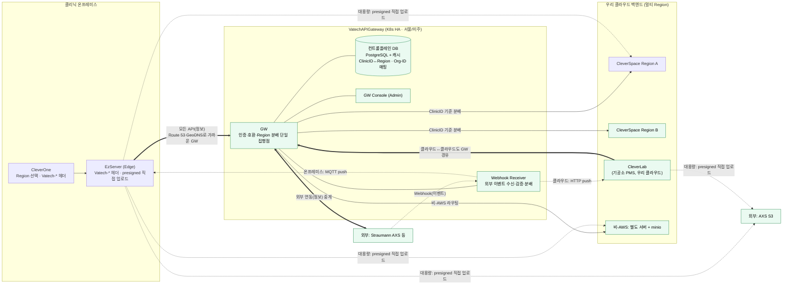

> 굵은 화살표 = 모든 API가 GW 단일 경유(온프레미스 EZ + 클라우드 CleverLab 모두). 점선 = 대용량 데이터의 presigned 직접 업로드(GW 비경유, AXS는 AXS S3로)와 **외부 Webhook의 수신·분배**. GW는 외부 서비스의 Webhook을 **Webhook Receiver로 대신 받아** 대상으로 분배한다(클라우드는 HTTP push, 온프레미스 EZ는 MQTT). 초록 = 본 과제로 새로 들어오는 요소. 상세는 §2.7. 가독성을 위해 **업로드 완료 확인(완료 콜백 + 스토리지 이벤트)은 그림에서 생략**했다(§2.3·§3.4 참조).
>
> **[현 범위 정합 — 2026-06 회의]** 본 다이어그램·§2.7은 _원래 계획(전체 그림)_ 을 보존한다. 다만 **CleverLab↔AXS(갈래 B)는 현 시점 미고려(보류)**, **CleverSpace는 Webhook 수신 대상이 아님(확정)** — 클라우드 webhook 수신은 **CleverLab만**(갈래 B). 현 범위의 정본은 **SRS §1.2(Will Not Do)·§2.3.6·④ \_status** 다 — 갈래 B·CleverSpace webhook이 활성으로 보이는 부분은 이 결정에 따라 읽는다(상세 §3.7.2 머리).

### 2.7 Webhook 수신·분배 — GW가 외부 이벤트의 단일 수신·분배점

외부 서비스(Straumann AXS 등)는 주문·상태·확정 결과 같은 비동기 이벤트를 **Webhook(HTTPS POST)으로 밀어 보낸다.** 이를 각 내부 서비스가 제각각 받으면 공개 엔드포인트·인증·서명 검증이 분산되고, 무엇보다 **방화벽 뒤의 EzServer는 외부에서 직접 호출할 수 없다.** 따라서 GW가 **모든 외부 Webhook의 단일 수신점**(Webhook Receiver)이 되어 수신·검증한 뒤, 대상에 맞는 방식으로 **분배**한다. 이 구조가 확정되면 AXS가 보내는 이벤트도 GW가 대신 받아 내부(클라우드/온프레미스)로 전달할 수 있다.

#### 2.7.1 상세 흐름

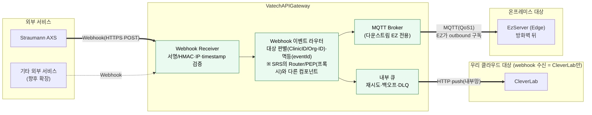

#### 2.7.2 받는 방법 (수신·검증)

- **단일 공개 엔드포인트(유연 수신)**: GW가 외부 Webhook을 받는다(기본 관례 `…/webhooks/<provider>`는 예시 — **경로/형식은 provider별 등록으로 유연**, 확정 아님). 외부엔 GW 주소만 노출되고 내부 서비스 주소는 숨는다. GW는 발신자 검증·라우팅만, payload는 소비자가 해석(SRS §4.1.3).
- **검증**: 제공자 서명(HMAC)·소스 IP allowlist·`timestamp`(replay 방지)로 정당한 호출만 수용한다. 검증 실패는 즉시 거부.
- **멱등 처리**: 외부가 재전송(at-least-once)해도 **eventId 기준으로 dedup**하여 한 번만 처리한다(§2.3 업로드 완료 처리와 같은 원리).
- **빠른 ACK + 비동기 처리**: 수신 즉시 2xx로 ACK하고, 실제 분배는 내부 큐로 넘겨 **재시도·백오프·DLQ**로 보장한다(외부가 우리 내부 지연 때문에 재전송 폭주하지 않게).

#### 2.7.3 분배 방법 — 대상에 따라 다르다

> **[현 범위 — 2026-06 회의]** 아래 "분배 방식"은 *메커니즘*이다. **구체 대상**은: **EzServer(갈래 A 역방향)=b1 포함**, **클라우드 수신=CleverLab만(갈래 B·보류)**. **CleverSpace는 webhook 수신 대상이 아니다**(B 프록시·presigned 백엔드). 정본·추적은 **SRS §2.3.6·§7.6.5·Appendix B #16**.

| 대상 | 위치 | 분배 방식 | 이유 |
| --- | --- | --- | --- |
| **우리 클라우드(CleverLab)** | 클라우드(도달 가능) | GW → 내부 큐 → **HTTP push**(내부망 호출) | GW가 직접 호출 가능한 위치. 동기 호출 또는 큐 기반 비동기로 재시도·순서 보장. (CleverSpace는 webhook 대상 아님) |
| **EzServer(Edge)** | 온프레미스, **방화벽 뒤** | GW → **MQTT broker** → EZ가 **outbound 구독**으로 수신 | 외부에서 EZ로 inbound push 불가. EZ가 먼저 바깥으로 맺은 연결로만 전달 가능 |

핵심 차이는 **도달성**이다. 클라우드 대상은 GW가 직접 호출(push)할 수 있어 단순하다. 반면 EzServer는 방화벽/NAT 뒤라 **EZ가 먼저 outbound로 맺은 연결**을 통해서만 받을 수 있다.

#### 2.7.4 GW Webhook → EzServer 전송 방식 권장 — MQTT

CleverOne은 이미 결과 중계에 **MQTT**를 쓰고 있다(§1 AS-IS의 EZ→CleverOne 결과 relay). GW가 EzServer로 이벤트를 내려보내는 채널도 **MQTT를 권장**한다. 근거는 다음과 같다.

- **방화벽 적합**: EZ가 broker로 **outbound 연결**을 유지하고 구독하므로, 외부 inbound 허용 없이 전달된다(역방향 Webhook을 직접 못 받던 제약을 GW가 해소).
- **기존 자산 재사용**: 이미 MQTT가 스택에 있어 운영·노하우가 누적돼 있다. 별도 채널을 새로 만들 필요가 적다.
- **전달 보장**: QoS1(at-least-once) + persistent session/retained로 **EZ가 잠시 오프라인이어도 broker가 버퍼**했다가 재접속 시 전달한다.
- **대안 대비 부담이 적다**: WebSocket/gRPC 상시 스트림은 재연결·세션 관리를 직접 구현해야 하고, long-poll/SSE는 오프라인 버퍼·QoS를 따로 보강해야 한다.

> 보완 규칙: EZ는 같은 eventId를 중복 수신해도 멱등 처리한다(MQTT QoS1은 중복 가능). 클라우드 대상의 HTTP push와 EZ의 MQTT는 **대상만 다를 뿐 같은 이벤트 모델**(eventId·대상 키·payload)을 공유한다. 토픽은 클리닉/EzServer 단위로 분리해 다른 현장 이벤트가 섞이지 않게 한다.

> 적용 메모: 이 Webhook Receiver 구조가 생기면 §3.7.1에서 "방화벽 때문에 제외"했던 **AXS → EzServer 역방향 전달도 `AXS → GW Webhook → MQTT → EZ`로 성립**한다. 다만 5단계 갈래 A의 1차 범위는 단방향(EZ→AXS)이며, 역방향 활성화 시점·대상 이벤트는 5단계 상세설계에서 확정한다.

---

## 3. Roadmap (5단계)

단계는 **기능 응집도와 의존 순서**로 나눈다. **API 호환성은 GW 없이 즉시** 해결할 수 있고, **presigned는 GW 일원화의 선행 요건**이며, **Straumann 외부 연동은 GW·presigned 위에서 성립**하므로, 다음 5단계가 가장 효율적이다.

### 3.1 단계 개요

| 단계 | 기능 묶음 | 핵심 산출물 | 완료 의미 |
| --- | --- | --- | --- |
| **0단계** | IO Scanner↔EzServer 수집(v1.0 선결) | IO Scanner 스캔 데이터 EzServer 유입 연동(수집 제품·방식 R1·미정) | v1.0 첫 연동의 데이터 소스 확보 |
| **1단계** | API 호환성(즉시) | Vatech-\* 식별 헤더(제품·버전·OS)·서버 버전 체크(validate-limits)·well-known 런타임 버전 공시·오류코드 매핑/fallback·호환성 매트릭스 | GW 없이 기존 경로에서 버전 호환 해결, 원인불명 실패 제거 |
| **2단계** | presigned 데이터 경로 | CleverSpace presigned 발급 신규 개발·EZ 전송 로직 변경(Direct→presigned 직접) | 대용량 데이터 직접 업로드 경로 완성(GW 선행 요건) |
| **3단계** | GW 신설·일원화 | GW 본체·EZ→GW 전환·경로 B 흡수(Deprecated)·presigned 발급 GW 경유 전환 | `EZ → GW → 대상` 단일 경유 + 인증 일원화(단일 Region) |
| **4단계** | 멀티리전·운영 | 멀티 Region·Region 분배(Postgres)·Route 53 GeoDNS·CleverOne Region UI·GW HA(K8s)·GW Console·minio | VatechAPIGateway 완성 |
| **5단계** | Straumann(AXS) 외부 연동 | EzServer→AXS(온프레미스) + CleverLab↔AXS(클라우드↔클라우드) 연동, OAuth 중계·Org-ID 매핑·온보딩 | 외부 생태계 연동을 GW·presigned로 수용 |
| (후속) | 별도 트랙 | EzServer 전면 재개발(PHP → Rust) | 5단계 이후 장기 과제 |

> 의존 관계 요약: 1단계(호환성)는 어디에도 의존하지 않아 **즉시 착수**한다. 3단계 GW가 "모든 연동 단일 경유"를 선언하려면 대용량 업로드를 GW 체계 안에서 인가해야 하므로, **2단계 presigned가 반드시 먼저** 와야 한다. 4단계(멀티리전)는 3단계 GW를 전제로 한다. 5단계(Straumann)는 **3단계(GW)·2단계(presigned)를 전제**로 하며 4단계와 병렬 가능하다.

#### 단계 ↔ GW 제품 버전 매핑 (참고)

본 로드맵의 단계는 **버전이 아니라 진행 단계**다. 제품마다 버전 체계가 달라 제품별 버전을 여기 모두 적지는 않고, **VT API Gateway(GW) 제품 버전 기준으로만** 대응을 병기한다(정본은 PRD/요구사항 명세). 단계와 버전은 1:1이 아니며, 단계는 기능 묶음·착수 순서를, 버전은 GW 산출물의 릴리스를 가리킨다.

본 프로젝트는 **케이스 D로 3·4·5단계를 통합 진행**하므로, 기본 목표는 **이들을 GW v1.0에 함께 담는 것**이다. 아래 버전은 **잠정**이다.

| 로드맵 단계                 | GW 제품 버전(잠정)          | 근거(요구사항)                                       |
| --------------------------- | --------------------------- | ---------------------------------------------------- |
| 1단계 API 호환성            | gw/1.0                      | FR-COMPAT-01~05                                      |
| 2단계 presigned 데이터 경로 | gw/1.0                      | FR-SES-01~05(Upload Session)                         |
| 3단계 GW 일원화             | gw/1.0                      | control plane(인증·라우팅·경로 B 흡수)               |
| 4단계 멀티 Region           | gw/1.0 목표(후행 시 gw/1.2) | FR-RGN-05(멀티 리전)·FR-SES-06(멀티클라우드 presign) |
| 5단계 Straumann(AXS)        | gw/1.0 b1(pilot)            | FR-INT-02(AXS connector). 추가 connector는 gw/1.1    |

> 4단계만 단서가 붙는 이유: 멀티 Region은 5단계 중 **우선순위가 가장 뒤**라 일정상 뒤로 밀릴 수 있고, Scott이 로드맵 논의 **이전에** 정리한 요구사항 명세에서는 이를 **v1.2(FR-RGN-05)** 로 배정해 두었다. 케이스 D로 함께 진행하면 **v1.0에 흡수**될 수도 있으므로, **v1.0 통합 vs v1.2 후행**은 인력·일정에 따라 후속 확정한다.

### 3.2 AS-IS (기준점)

§1의 AS-IS 구조가 출발점이다. GW가 없고, 경로 A/B가 분산되며, 버전 미전달·Direct 데이터 전송 상태다.

### 3.3 1단계 — API 버전 호환성 해결 (GW 없이 즉시)

**목표.** GW를 기다리지 않고 **기존 경로(A·B) 위에서** 버전 호환 문제를 먼저 끝낸다. 클라이언트가 **제품·버전을 헤더로 전달**하고, CleverSpace가 **서버에서 버전을 체크**하며, **well-known으로 API별 지원 버전을 런타임 공시**한다. CleverSpace v1.3.0 일정에 바로 대응한다.

**제품별 개발 항목.**

| 제품         | 개발 항목                                                                                                                                    |
| ------------ | -------------------------------------------------------------------------------------------------------------------------------------------- |
| CleverOne    | Vatech-\* 식별 헤더 부착(제품·버전·OS), well-known 조회 후 미지원 기능 사전 인지·안내, 오류코드 fallback("업데이트 필요")                    |
| EzServer(EZ) | 경로 A에서 Vatech-\* 헤더 **대리 전달**(또는 EZ 자체 버전 + originating client)                                                              |
| CleverSpace  | **서버 버전 체크**(validate-limits 사전검증), **well-known 런타임 버전 공시**(API/기능별 최소 클라이언트 버전), 오류 코드 정의·registry 정리 |
| 공통         | **호환성 매트릭스**(API/기능 × 최소 클라이언트 버전)를 단일 소스로 운영, 빌드/CI에 반영                                                      |

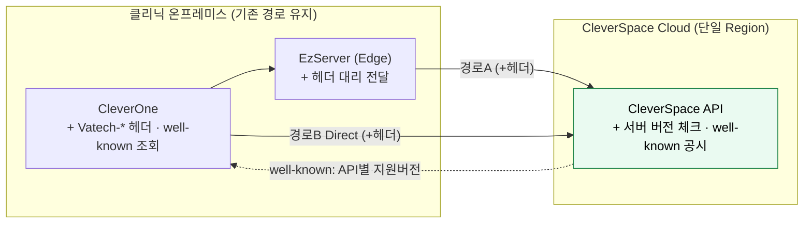

> 직전(AS-IS) 대비 변경: 경로 구조는 그대로 두되, **클라이언트가 버전을 헤더로 전달**하고 **서버가 버전을 체크·공시**한다. GW 없이도 **원인불명 실패가 사라진다.** 경로 B 통합은 3단계(GW)에서 다룬다.

### 3.4 2단계 — presigned 데이터 경로

**목표.** 대용량 데이터를 **presigned URL 직접 업로드**로 전환한다. CleverSpace에 presigned 발급을 신규 개발하고, EZ 전송 로직을 바꾼다. 이 단계는 **3단계 GW 일원화의 선행 요건**이다(GW는 대용량을 직접 나르지 않으므로, 업로드 인가를 위해 presigned가 먼저 필요).

**제품별 개발 항목.**

| 제품 | 개발 항목 |
| --- | --- |
| CleverSpace | **presigned URL 발급 API 신규 개발**(현재 Direct 전송 방식 대체), **업로드 완료 처리** — 완료 콜백 API + 스토리지 이벤트 수신, size·ETag 무결성 검증 |
| EzServer(EZ) | **데이터 전송 로직 변경** — 발급 요청 후 스토리지로 **직접 업로드**, 업로드 성공 시 **완료 콜백 호출** |
| 스토리지 | S3 ObjectCreated 이벤트(또는 minio bucket notification) → CleverSpace 통지 구성 |
| CleverOne | (해당 시) 업로드 흐름 연계 확인 |

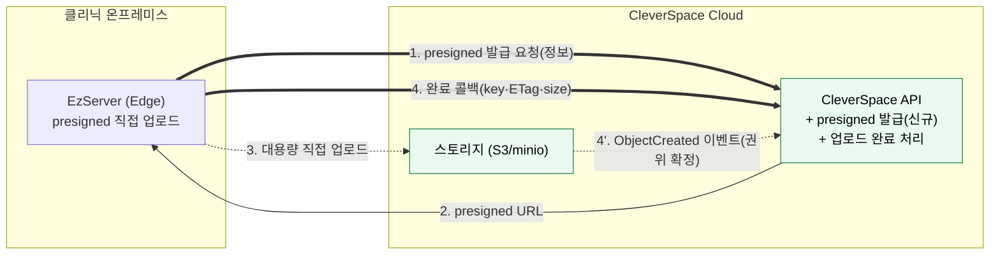

> 직전(1단계) 대비 변경: **데이터 경로 분리** — 정보(발급 요청)와 대용량(직접 업로드)이 나뉜다. 아직 GW는 없으며, 발급 요청은 CleverSpace로 직접 간다(3단계에서 GW 경유로 전환). **업로드 완료**는 EZ 콜백(4)과 스토리지 이벤트(4')를 함께 써서 확인한다.

### 3.5 3단계 — GW 신설·일원화

**목표.** **VatechAPIGateway를 세워 모든 연동을 `EZ → GW → 대상`으로 일원화**한다. 인증(디바이스 머신·운영자)을 GW로 모으고, **경로 B(직접 연동)를 GW로 흡수**하며, 2단계에서 만든 **presigned 발급도 GW 경유로 전환**한다. (단일 Region으로 시작.)

> **경로 B는 이 시점부터 Deprecated**다. GW 경유 경로로 대체되며, 구버전 클라이언트 호환 종료 후 **EOS(End of Service)** 한다. 신규 개발은 경로 B를 쓰지 않는다.

**구현 우선순위 — 범용 설계, 첫 연동은 Straumann, 두 번째가 CleverSpace.** GW(와 §2.7 Webhook 수신·분배)는 처음부터 **특정 대상에 종속되지 않는 범용 게이트웨이**(여러 서비스 연동 가능)로 설계한다. 다만 **실제 연동 구현 순서**는 ① **Straumann(AXS) 연동을 가장 먼저** 구현하여 외부 연동·Webhook 구조를 실제 서비스로 검증하고, ② **이후 CleverSpace 연동을 두 번째**로 진행한다. (케이스 D에서 3·4·5단계를 통합 진행하더라도, GW 위 연동 작업의 착수 순서는 Straumann → CleverSpace다.)

**제품별 개발 항목.**

| 제품 | 개발 항목 |
| --- | --- |
| VatechAPIGateway | GW 본체(모든 연동 단일 경유), 라우팅/스로틀링, 버전 호환 집행(1단계 자산 이관), presigned **발급 중계**, 경로 B 흡수 |
| EzServer(EZ) | CleverSpace 연동을 **GW 경유로 전환**, presigned 발급 요청도 GW로 |
| CleverOne | Direct 호출을 **GW 경유로 전환**(경로 B 흡수) |
| CleverSpace | GW 경유 호출 수신·검증 정합 |

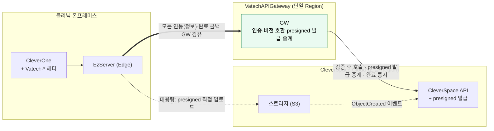

> 직전(2단계) 대비 변경: **경로 B 제거 → GW 단일 경유**. 인증·호환 집행이 GW로 모이고, presigned 발급·**업로드 완료 콜백도 GW가 중계**한다(스토리지 이벤트는 CleverSpace가 직접 수신). **이 시점부터 Straumann 착수 가능**(§3.7). 대용량 업로드는 여전히 스토리지로 직접(GW 비경유).

### 3.6 4단계 — 멀티 Region·글로벌·운영

**목표.** CleverSpace를 멀티 Region으로 확장하고, GW가 **ClinicID로 Region을 분배**하며, **Route 53 GeoDNS**로 가까운 GW에 연결한다. **HA·GW Console·비-AWS(minio)까지 갖춰 VatechAPIGateway를 완성**한다. (케이스 D로 3·4·5 통합 진행 시 **gw/1.0에 흡수 목표**, 후행 시 **gw/1.2**(FR-RGN-05·FR-SES-06) — 잠정. 매핑은 §3.1 참조.)

**제품별 개발 항목.**

| 제품             | 개발 항목                                                                                                                  |
| ---------------- | -------------------------------------------------------------------------------------------------------------------------- |
| CleverSpace      | **멀티 Region 구축**                                                                                                       |
| VatechAPIGateway | **Region 분배**(ClinicID↔Region 매핑), 컨트롤플레인 저장소(PostgreSQL + 캐시), **K8s HA(서울·미주)**, Route 53 GeoDNS 연계 |
| GW Console       | **Admin Web Console**(매핑·클리닉·상태 관리) — 스펙: **③-C Sub-SRS**                                                       |
| CleverOne        | **Region 선택 UI**(최초 접속 시), ClinicID 전달                                                                            |
| EzServer(EZ)     | 요청에 **ClinicID 포함**, Region 인지                                                                                      |
| 인프라           | **Route 53** latency/geolocation 라우팅, 비-AWS 국가 **별도 서버 + minio**                                                 |

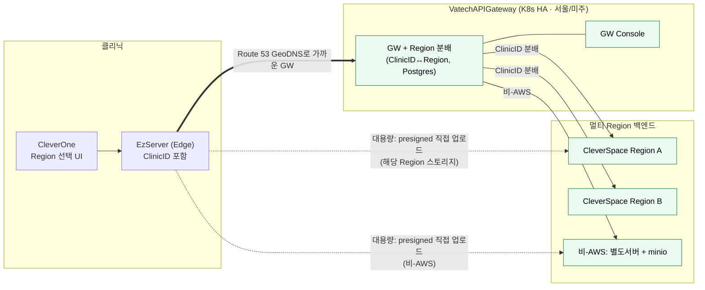

> 직전(3단계) 대비 변경: **단일 Region → 멀티 Region + GeoDNS + HA + Console + minio**. 정보는 GW가 Region을 분배하고, **대용량 업로드도 ClinicID가 가리키는 해당 Region 스토리지로 직접**(점선) 간다. 업로드 완료 확인(콜백 + 스토리지 이벤트)은 §3.4와 동일하며 가독성을 위해 그림에서 생략했다. 여기서 VatechAPIGateway가 완성된다.

### 3.7 5단계 — Straumann(AXS) 외부 연동

Straumann은 보안상 **직접 연결이 불가**하여 **반드시 GW(중간 계층)를 경유**해야 한다. 선행 요건은 **presigned(2단계) + GW 단일 경유(3단계) + 인증 + Org-ID 매핑**이다. 따라서 **3단계 완료 시점부터 착수 가능**하며, 4단계와 **병렬**로 진행한다(케이스 D는 3·4·5 통합).

> **Straumann은 GW의 첫 연동 구현 대상**이다(§3.5 구현 우선순위). 범용 게이트웨이·Webhook 구조를 실제 외부 서비스로 먼저 검증하고, **CleverSpace 연동은 그다음 두 번째**로 진행한다.

연동은 두 갈래다 — **(A) EzServer → AXS**(온프레미스→클라우드)와 **(B) CleverLab ↔ AXS**(클라우드↔클라우드, 기공소 주문). **둘 다 GW를 경유**하고 대용량은 **presigned**를 쓴다.

#### 3.7.1 갈래 A — EzServer → AXS (온프레미스→클라우드)

| 항목           | 내용                                                                                                                           |
| -------------- | ------------------------------------------------------------------------------------------------------------------------------ |
| 선행 요건      | presigned 데이터 경로(2단계), GW 단일 경유·인증(3단계), Org-ID 매핑 테이블                                                     |
| GW(중계 로직)  | AXS OAuth 토큰 발급·갱신·캐싱, 환자/문서/케이스 중계, Create Document → presigned 반환                                         |
| 매핑           | Vatech ClinicID ↔ Straumann Organization-ID (GW 컨트롤플레인에 보관)                                                           |
| 클리닉 온보딩  | 클리닉당 1회 — Customer Number 입력 → Straumann Access 포털 승인 → Organization-ID 발급 → EzServer 설정 + GW 컨트롤플레인 등록 |
| EZ↔GW 인증     | 2층 — 공유 API Key(출처 확인) + 요청 Org-ID를 GW 등록 목록과 대조(클리닉 식별·미등록 거부)                                     |
| 고정 egress IP | Straumann IP whitelist 대응 — GW(K8s) outbound 고정 IP(NAT) 확보                                                               |
| Org-ID 복구    | EzServer 로컬 유실 시 GW 컨트롤플레인에서 조회·재설정(이중 저장)                                                               |
| EzServer(EZ)   | AXS 연동 FE/BE, presigned 직접 업로드(Straumann S3)                                                                            |
| 선결(외부)     | Straumann의 API 스펙·OAuth 엔드포인트·샌드박스·자격증명 수령                                                                   |

> 데이터(영상)는 GW를 거치지 않고 **AXS S3로 presigned 직접 업로드**한다(§2.3과 동일 원리). Straumann 분석 보고서의 AWS 서버리스 전제는 본 통합에서 **K8s 기반 GW로 대체**된다.

> 범위: 갈래 A의 1차 범위는 **EzServer → AXS 단방향**이다. 역방향(AXS → EzServer)은 그동안 방화벽 뒤 EzServer로의 직접 전달이 불가해 제외했으나, **GW Webhook Receiver(§2.7)가 생기면 `AXS → GW Webhook → MQTT → EZ`로 성립**한다. 역방향 활성화 시점·대상 이벤트는 5단계 상세설계에서 확정한다.

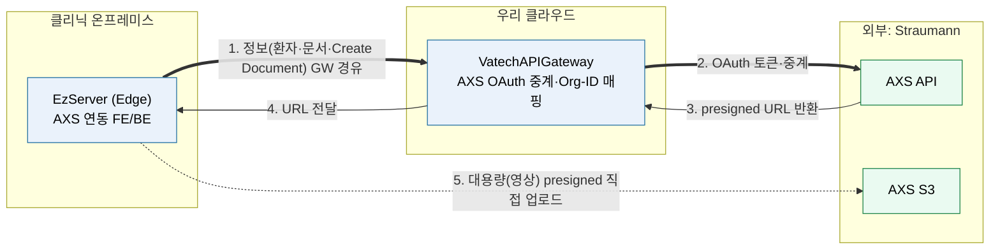

> 정보(메타데이터)는 `EZ → GW → AXS`로 GW를 경유하고, 대용량 영상은 GW가 받은 presigned URL로 **EZ가 AXS S3에 직접 업로드**한다(GW 비경유). 인증·Org-ID 매핑·토큰 갱신은 GW가 담당한다.

#### 3.7.2 갈래 B — CleverLab ↔ AXS (클라우드↔클라우드, 기공소 주문)

> **[2026-06 회의 결정 — 현 시점 보류]** CleverLab↔AXS **직접 연동(갈래 B)은 현재 고려하지 않는다.** 우선 범위는 갈래 A(EzServer→AXS)다. 단 *외부 cloud 서비스 연동 일반 역량*은 GW에 유지한다(target-routed proxy C 프로파일 — SRS §4.1.1·ADR-11). 즉 갈래 B는 향후 신규 코드 없이 **레지스트리 등록만으로 활성화** 가능하다. 아래 본문은 갈래 B를 활성화할 경우의 설계 근거로 보존하며, 현 범위는 SRS §1.2 Will Not Do·④ \_status가 정본이다.

CleverLab은 **우리 클라우드 기공소 PMS**다. Straumann Scan SW에서 만든 기공 오더가 AXS를 통해 CleverLab로 들어오고, CleverLab의 작업 상태·확정 요청이 AXS로 나간다. **이 클라우드↔클라우드 연동도 우리 GW를 경유**하며, 디자인 파일·스캔 파일 등 대용량은 **presigned**로 처리한다. (4/2 제안서 Integration Scenario 3 기준)

| 시나리오    | 흐름                                     | 내용                                                                         |
| ----------- | ---------------------------------------- | ---------------------------------------------------------------------------- |
| 오더 전송   | AXS → GW → CleverLab                     | Straumann Scan SW에서 생성한 오더(Order ID)를 CleverLab에 등록, 상태 pending |
| 상태 동기화 | CleverLab → GW → AXS                     | 작업 상태(접수→진행중→완료)를 Order ID 기준으로 AXS에 전송                   |
| 확정 요청   | CleverLab → GW → AXS → Straumann Console | 디자인 파일·트라이인 결과 첨부(대용량은 presigned), Confirm ID 부여          |
| 확정 결과   | AXS → GW → CleverLab                     | 승인/수정요청 결과를 Confirm ID 기준으로 회신                                |

> AXS → CleverLab 인바운드(오더·확정 결과)는 CleverLab이 **클라우드 서비스**라 방화벽 제약이 없어 GW가 직접 수신·중계할 수 있다(EzServer의 Webhook 제약과 다름). 인바운드 수신 방식(Webhook vs 폴링)은 상세 설계에서 확정한다.

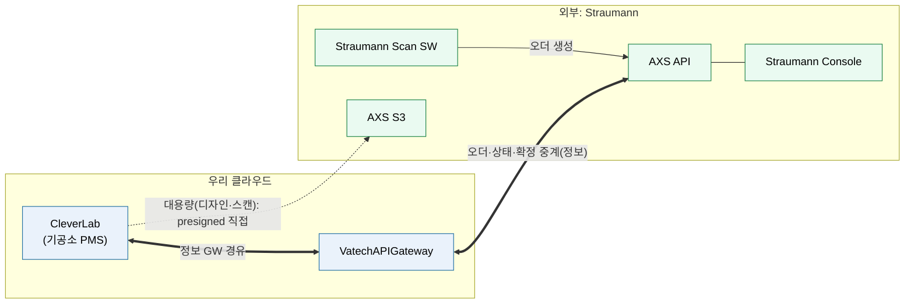

> 핵심: 온프레미스(갈래 A)든 클라우드(갈래 B)든 **외부 연동은 모두 GW를 단일 창구로 지나고**, 대용량은 presigned로 스토리지에 직접 보낸다 — 동일 원리다. 상세 설계·협상 항목·일정 추정은 [`Straumann-Vatech_AXS연동_분석보고서.md`](../../references/Straumann연동/Straumann-Vatech_AXS연동_분석보고서.md)와 4/2·4/30 회의 문서를 참조한다.

### 3.8 후속 트랙 — EzServer 전면 재개발 (PHP → Rust)

현재 EzServer는 PHP이며 일부 기능은 이미 Rust로 개발돼 있다. 이를 **Rust로 전면 교체**하는 것은 **5단계 이후의 장기 후속 트랙**이다(1~5단계에서 제외). **기존 API 그대로 포팅 vs API부터 재설계**는 **계속 열려 있는 숙제**다(§6). EzServer가 **Edge로 남는 것은 확정**이며 변하지 않는다.

### 3.9 구현 스펙화 — 스펙 단위 구성

본 Roadmap은 아래 구성으로 단계별 스펙을 작성한다(본 보고서 작성 시점에는 미작성, 추후 작성). **케이스 D 확정**(1·2 병행 + 3·4·5 통합)에 맞춰 경계를 나눈다. **스펙 문서 유형**(One Pager / SRS / Sub-SRS)의 확정 표는 [PRD §12.1](<../VT API Gateway — PRD (v2).md>)을 정본으로 한다.

| 스펙 단위               | 범위           | 스펙 문서 | 비고                                                        |
| ----------------------- | -------------- | --------- | ----------------------------------------------------------- |
| ① API 호환성            | 1단계          | One Pager | 긴급·독립(v1.3.0 대응), ②와 병행                            |
| ② presigned 데이터 경로 | 2단계          | One Pager | GW 선행 요건, ①과 병행                                      |
| ③ VatechAPIGateway 구축 | 3+4단계        | SRS       | GW 일원화 + 멀티 Region                                     |
| ③-C GW Console          | 3+4단계(4단계) | Sub-SRS   | ③ SRS 하위. Admin Web UI. 별도 레포. ③ 관리 API와 중복 금지 |
| ④ Straumann(AXS) 연동   | 5단계          | Sub-SRS   | ③ SRS 하위. 갈래 A·B 포함, 외부 협의 단위                   |

> 스펙 경계 ≠ 실행 경계다. 케이스 D는 ③(3+4)·③-C·④(5)를 **통합 실행**한다. ①·②는 병행 트랙이라 각각 독립 스펙으로 둔다.

#### 스펙 작성 순서 (권장)

**각 스펙은 `작성 → PR(리뷰·수정) → baseline(동결)` 3단계**를 거친다 — "PR(리뷰·수정)"이 곧 리뷰·반영 단계이고, **baseline은 PR 머지로 동결**된다. ③ GW SRS가 **계약 SSOT**라 가장 먼저 작성·PR(7/9~)을 거쳐 baseline된다. ③ GW SRS가 **PR에 진입(작성 완료)하는 7/9 시점에 ①·②(One Pager)와 ④(AXS Sub-SRS)를 동시 착수**(병행 작성)한다 — ④는 ③ baseline을 기다리지 않으며 **전체 Sub-SRS를 2주에 작성**한다(pilot 전 완료). **AXS sandbox 자격(B-2 #6)은 스펙 *작성* 엔 불요**하고 E2E·pilot 직전에 필요하므로 그 시점(확보 시점 TBD)에 둔다. ③-C·③-P·③-I는 ③ 계약을 참조하므로 **③ baseline 이후** — 특히 **③-I는 GW가 1주 초안 → 인프라 담당이 완성**한다.

> **v1.0 범위 재조정 (7/9 결정) — Straumann IO Scanner 우선.** 시간 제약상 v1.0의 Straumann(5단계) 연동을 **IO(IntraOral) Scanner로 한정**하고 **CleverOne 연동은 post-v1.0로 미룬다**. GW 기본(호환성·인증·라우팅·target 프록시)은 originator 무관 공통이라 v1.0 포함. **목표=10월 출시**(역산·잠정·Raymond는 SectionView 병행 부분투입). **IO Scanner↔EzServer 연동 방식 미정**(추후 확정). **스펙 초안 담당(7/16 R3)**: CleverOne=**Nick** · **EzServer 연동 Spec 초안=Raymond→Thomas** · **③-I Infra Sub-Spec=Raymond diagram→Jack detail**. (7/16 회의: SRS baseline 7/20(월)·③-I·③-P-EZ 초안 7/20 착수·①·④·③-C 연기) IO Scanner에 불필요한 스펙(② presigned·CleverSpace·CleverOne 적응)은 최대한 후행. 상세=아래 Gantt·SRS §1.2·§2.7.

| 순서 | 스펙 | 현재 단계 | 전제·선결 | 비고 |
| --- | --- | --- | --- | --- |
| 0 | **③ GW SRS + API(OpenAPI) + DBML** | 작성 마무리(본문·OpenAPI·DBML) → **PR 7/9~** → baseline v1.0 | — | 계약 SSOT(이것 먼저). **작성(본문+API/DBML) 완료 후 한 PR로 함께 리뷰·baseline**(§7↔OpenAPI, §6.4↔DBML 정합). OpenAPI는 code-first 초안 — 구현 때 코드 생성본으로 수렴 |
| 1 | **① 호환성 / ② Presigned** One Pager | ③ PR 시 동시 착수 | **GW SRS PR 시작(7/9)** | ②는 GW 선행 요건. ③ baseline 비종속(병행) |
| 2 | **④ Straumann(AXS) Sub-SRS** | ③ PR 시 ①②와 동시 착수 | **GW SRS PR 시작(7/9)** (AXS sandbox 자격 B-2 #6 = E2E·pilot 선결, _작성_ 엔 불요) | **최우선 후속**. **전체 Sub-SRS 2주 작성** → pilot(2026-08-15·개발계획서 내부 목표) 전 완료. ③ baseline 대기 없이 병행 |
| 3 | **③-C GW Console Sub-SRS** | 작성 대기(2주) | ③ baseline(관리 API) | 중복 금지. **Console 인프라는 *요구*만 정의**(호스팅·인증·API 접근 등) — *구축*은 ③-I가 담당 |
| 4 | **③-P 제품 적응**(EZ→CS·CO) | GW 초안 → 제품팀 인계 | ③ baseline | **GW 단일 작성자 순차**: EzServer 2주(가장 복잡) → CleverSpace·CleverOne 각 1주(병행 아님). 초안 후 제품팀이 완성·PR |
| 5 | **③-I 인프라 IaC 계획서** | GW 초안 → 인프라 완성 | ③ baseline | **GW 1주 초안 → 인프라 담당 완성(2주)·PR·baseline**. **GW 플랫폼 + 제품(③-C Console 등) 인프라를 단일 소유로 구축** — ③-C가 요구 확정하면 ③-I에 흡수·보강. IaC 도구(CDK 권장·7/2 R5) 반영 |

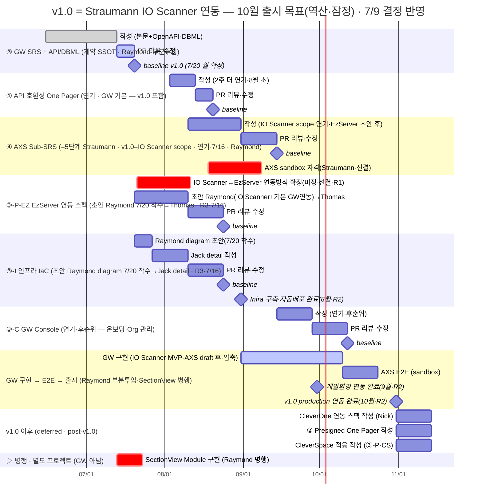

> 각 섹션 = **스펙 단위(①·②·③·③-C·④·③-P·③-I)** 1개, 막대 = `작성 / PR(리뷰·수정) / baseline` 생애주기 단계. **막대 색: 작성=기본색 · PR(리뷰·수정)=강조(밝은색) · ◆=baseline/마일스톤 · 회색=완료(done) · 빨강=외부 선결(sandbox 자격)**. **gantt는 스펙 단위 생애주기·순서만** 보이고, 제품×단계별 문서는 **[§4 표](#4-제품별-개발-항목-종합-제품--단계)** 가 정본(gantt 미표기). **날짜·기간은 순서·의존 표현용 잠정값**이며 일정 약속이 아니다 — 특히 **pilot 2026-08-15는 개발계획서(착수 품의·미승인) 내부 목표**이지 외부 확정 요구가 아니다(확정 일정은 PM/품의). **③-P·③-I는 GW가 초안만, PR·baseline은 제품팀/인프라 레포**. 핵심: **③ PR 시작(7/9)에 ①·②·④ 동시 착수(병행)**, ③ baseline이 ③-C·③-P·③-I의 선행, ④(AXS)는 **전체 Sub-SRS를 2주 작성**. **`③ GW SRS + 구현` 섹션의 `GW 구현` 막대 = R7 채택=1안**(④ AXS baseline 후 즉시·스펙 병행). *(2안=전 스펙 완료 후는 반려·7/2 R7.)* **기간 미정(SRS 확정 후 재산정)**. 구현은 ④ AXS 연동(첫 연동·테스트 필수) 이후. **AXS sandbox 자격(B-2 #6)은 스펙 작성엔 불요하고 E2E·pilot 직전에 필요**하므로 그 시점(7월 말~pilot 전)에 배치(확보 시점 TBD). **③-I는 GW가 1주 초안 → 인프라 담당이 완성·PR·baseline**. 단위·유형 정본 [PRD §12.1](<../VT API Gateway — PRD (v2).md>).

---

## 4. 제품별 개발 항목 종합 (제품 × 단계)

> 맨 오른쪽 **스펙 산출물** 열 = 제품 변경이 *어느 스펙 단위·유형*으로 작성되는가. 단위·유형 정본은 [PRD §12.1](<../VT API Gateway — PRD (v2).md>). 제품 적응(③-P\*/③-I)은 GW 소유자가 1차 초안 후 각 제품 담당자에게 인계한다.

| 제품 | 0단계(IO Scanner 수집·v1.0 선결·R1) | 1단계(호환성) | 2단계(presigned) | 3단계(GW 일원화) | 4단계(멀티리전) | 5단계(Straumann) | 후속 | 스펙 산출물(단위·유형) |
| --- | --- | --- | --- | --- | --- | --- | --- | --- |
| **CleverSpace** | — | 서버 버전 체크·well-known 공시·오류코드 정리 | **presigned 발급 신규 개발** | GW 경유 수신 정합 | 멀티 Region 구축 | — | — | ① One Pager · ② One Pager · ③-P-CS Sub-SRS(멀티Region 크면)/One Pager |
| **CleverOne** | — | Vatech-\* 헤더·well-known 인지·fallback | 업로드 흐름 연계 | Direct→GW 경유 전환 | Region 선택 UI(**대안 주체**)·ClinicID | — | — | ① One Pager · ② One Pager · ③-P-CO One Pager |
| **EzServer(EZ)** | **IO Scanner 데이터 수신·수집(방식 R1·미정)** | 헤더 대리 전달 | 전송 로직 변경(presigned 직접) | GW 경유 전환 | ClinicID 포함·Region 인지 · **GW 클리닉 등록(Console: region 선택·Clinic-ID) — 잠정 주체** | AXS 연동 FE/BE(갈래 A)·presigned 직접 업로드 | **Rust 전면 재개발** | ① One Pager · ② One Pager · ③-P-EZ(초안 Raymond→Thomas·7/16 R3) · ④ Sub-SRS(갈래 A) · (Rust=후속 별도) |
| **IO Scanner(Straumann 장비·수집 제품 미정)** | 스캔 데이터 출력 → EzServer 유입(수집 제품·방식 R1·미정) | — | — | — | — | (AXS 워크플로 대상) | — | R1 확정 후 ③-P-EZ(수신)·④(AXS scope) |
| **CleverLab** | — | — | — | — | — | **AXS 오더·상태·확정 연동(갈래 B)**·presigned | — | ④ Sub-SRS(갈래 B) |
| **VatechAPIGateway** | — | ↳ 3단계에서 흡수(호환 게이트·well-known·compat matrix·§7.7) | ↳ 3단계에서 흡수(presigned 중계·bypass·§4.1.4) | 본체·라우팅·인증 연계·호환 집행·presigned 발급 중계·경로 B 흡수 | Region 분배·HA(K8s)·Route 53·저장소(Postgres) | AXS OAuth 중계·Org-ID 매핑·온보딩·인바운드 중계·고정 egress IP | — | ③ SRS (계약 SSOT) · ④는 그 위 connector |
| **GW Console** | — | — | — | — | Admin Web Console (**③-C Sub-SRS**) | 온보딩·Org-ID 관리 화면 | — | ③-C Sub-SRS |
| **인프라** | — | 단일 Region | — | 단일 Region GW | Route 53·K8s·비-AWS minio | AXS whitelist용 고정 IP·샌드박스 | — | ③-I IaC 구축 계획서(초안 Raymond diagram→Jack·7/16 R3) |
| **외부(Straumann AXS)** | — | — | — | — | — | API 스펙·OAuth·샌드박스·자격증명 제공(선결) | — | ④ Sub-SRS 입력(외부 제공물) |
| **LMP (License Portal, 바텍)** | — | — | — | — | — | — | (조건부) 제3자 서명 attestation 발급 | **enroll B안(제3자 서명 자동승인) 채택 시만** — 서명 키·JWKS·attestation 발급 개발(ES 라이선스/ELM 팀·크로스팀·Roadmap 추가). v1.0=A안(C/S 승인)이면 무변경. 상세=Agenda R9·Appendix B #42 |

> **0단계(IO Scanner 수집)**: v1.0(Straumann IO Scanner 우선·7/9) 도입으로 앞에 붙는 **선결 단계**. IO Scanner→EzServer **수집 제품·방식은 미정(R1·2026-07-16 논의)**, 상세 §3.x는 R1 결정 후 보강한다. 기존 1~5단계 번호·정의는 불변.

> **GW의 단계별 스펙**: VatechAPIGateway는 **3단계에 신설**되므로 0~2단계 열은 '—'/포인터(↳)다. 0단계(IO 수집)는 GW 무관, **1·2단계 기능(호환 게이트·presigned 중계)은 GW가 3단계에서 흡수**해 규정한다. 따라서 **GW의 스펙 산출물 = 단일 ③ SRS**(단계별 별도 스펙 없음) — ↳는 "③ SRS 안에서 다룬다"는 표시다.

> **클리닉 GW 등록 주체(TBD)**: 클리닉 = **CleverOne 다수 + EzServer 1개**. 따라서 클리닉당 1회의 GW 등록(region 선택·Clinic-ID, 이후 외부 연동 시 Org-ID)은 **EzServer의 Console에서 하는 것을 잠정안**으로 한다(클리닉당 단일). **각 CleverOne(PC)에서 하는 대안도 가능 — 주체 확정은 ③-P-EZ(잠정)/③-P-CO(대안)** 에서. region 선택 UI도 이 주체에 따른다. 매핑은 온보딩 자가 등록이며 Admin은 교정만(SRS §2.3.1·§7.3·Appendix B #17).

---

## 5. 클라이언트 식별 헤더 표준 (확정)

요청에 **제품명·버전**(·OS)을 실어 GW·CleverSpace가 버전 호환을 판정한다.

**구조화 전용 헤더가 권위 소스, User-Agent 표준화는 병행.** 머신 판정(버전 게이트·Region 라우팅·한도 검증)은 전용 헤더로 한다(User-Agent 파싱은 포맷이 제각각이고 중간 경로에서 변형될 수 있어 취약). User-Agent는 로깅·관측·하위호환을 위해 표준 포맷으로 유지한다.

```
Vatech-Product:   CleverOne          # 요청을 시작한 주체(originator)
Vatech-Version:   1.5.5              # originator 버전(semver)
Vatech-OS:        Windows/11         # OS명/버전
Vatech-Clinic-Id: <ClinicID>         # GW Region 라우팅 키
Vatech-Via:       EzServer/6.5.0     # 경유한 중계 홉(있을 때만)

User-Agent: EzServer/6.5.0   # 직전 송신자(로그·관측·하위호환)
```

- 프리픽스는 제품 브랜드 `Vatech-`를 쓴다. `X-` 접두는 RFC 6648에서 비권장이라 붙이지 않는다(`X-Vatech-Product` 아님).
- **ClinicID를 같은 체계에 포함** → Region 분배(§2.4)와 한 번에 해결.
- **집행 주체는 단계에 따라 다르다.** 1단계에서는 **CleverSpace(서버)가 직접** 헤더를 읽어 버전·한도를 판정하고, **3단계부터는 GW가 단일 집행점**으로 헤더를 읽어 라우팅·호환·한도 판정 후 다운스트림에 정규화 전달한다. 헤더 자체는 1단계부터 동일하게 쓰므로 추가 변경이 없다.
- **외부(Straumann 등)로는 내부 헤더를 보내지 않는다.**
- 적용 지점(기존 소스): CleverOne `CleverOneInitializer.cpp`·`EzCloudController.cpp`, ESLinkageCloudPlatform `EzCloudLinker.cpp`(`strAgent` 확장), EzServer(EPI) 대리 전달.

#### 5.1 중계 경로(CleverOne → EzServer → GW)의 식별 규칙

"누가 보냈나(전송 홉)"와 "누가 시작했나(originator)"를 분리해 담는다. EzServer는 GW로 가는 실제 송신자이면서, 그 요청의 트리거는 CleverOne일 수도 EzServer 자신일 수도 있다.

- **`Vatech-Product`/`Vatech-Version`/`Vatech-OS` = originator(요청을 시작한 주체).** 버전 호환 판정의 권위 소스다.
- **`Vatech-Via` = 경유한 중계 홉.** EzServer가 자기 자신(`EzServer/6.5.0`)을 덧붙인다. 홉이 여럿이면 콤마로 누적한다.
- **`User-Agent` = 직전 송신자(여기선 EzServer).** 전송 로그·관측용. 머신 판정은 위 전용 헤더로 한다.

| 트리거              | Vatech-Product / Version  | Vatech-Via     | User-Agent     |
| ------------------- | ------------------------- | -------------- | -------------- |
| CleverOne → EZ → GW | CleverOne / CleverOne버전 | EzServer/6.5.0 | EzServer/6.5.0 |
| EZ 자체 → GW        | EzServer / EzServer버전   | (비움)         | EzServer/6.5.0 |

규칙 한 줄: **`Vatech-*`는 항상 시작한 주체, `Vatech-Via`는 거쳐 간 주체.** EzServer가 originator인 경우도 같은 규칙으로 자연히 처리된다.

왜 originator를 권위 소스로 두나: 경로 A는 CleverSpace가 새 API/오류코드를 돌려줄 때 화면에 쓰는 CleverOne과 MQTT로 중계하는 EzServer가 둘 다 충분히 최신이어야 정상 동작한다(§2.3). originator를 `Vatech-*`로, 경유 EzServer를 `Vatech-Via`로 함께 보내면 GW가 두 버전을 모두 보고 **더 낮은 쪽 기준**으로 호환을 게이팅할 수 있다. EzServer가 자기 버전으로 `Vatech-*`를 덮어쓰면 CleverOne이 구버전인지 GW가 알 수 없게 된다.

---

## 6. 남은 숙제·결정 항목

| 항목                          | 내용                                                                                  | 단계                   |
| ----------------------------- | ------------------------------------------------------------------------------------- | ---------------------- |
| well-known 스펙               | 공시 경로(`.well-known/<env>/server-configuration.json`)·응답 스키마·캐시 정책        | 1단계 상세설계         |
| presigned 발급 시퀀스 상세    | 2단계(직접)→3단계(GW 경유) 전환 흐름·CleverSpace 개발 범위                            | 2~3단계 상세설계       |
| 업로드 완료 확인 방식         | 완료 콜백 + 스토리지 이벤트 조합 확정, 재시도·타임아웃·무결성(ETag) 규칙              | 2단계 상세설계         |
| 매핑 테이블 스키마            | ClinicID↔Region, ClinicID↔Org-ID, 상태 등 필드 확정                                   | 4단계 / 5단계          |
| Route 53 옵션                 | latency vs geolocation, 헬스체크·페일오버 정책                                        | 4단계 상세설계         |
| GW Webhook Receiver 스펙      | 수신 검증(서명/HMAC·IP·timestamp)·멱등(eventId)·내부 큐/재시도/DLQ·이벤트 모델 표준화 | 3단계 상세설계         |
| Webhook 다운스트림 채널       | 클라우드=HTTP push, EzServer=MQTT(QoS1·persistent) 확정, 토픽·오프라인 버퍼 정책      | 3단계 / 5단계 상세설계 |
| CleverLab 인바운드 방식       | AXS → CleverLab(오더·확정 결과) 수신을 GW Webhook 경유로 확정(Webhook vs 폴링 세부)   | 5단계 상세설계         |
| 경로 B EOS 시점               | 구버전 호환 종료 시점과 연계한 경로 B 서비스 종료 일정                                | 3단계 이후             |
| Region 확장                   | 서울·미주 외 추가 Region 계획                                                         | 운영 단계              |
| **EzServer Rust 재개발 방식** | **기존 API 포팅 vs API 재설계 — 계속 열린 장기 숙제**                                 | 후속 트랙              |

> EzServer가 Edge로 남는 것, 글로벌 라우팅을 Route 53로 하는 것, 클라이언트 식별 표준(Vatech-\*), 비-AWS는 minio 교체만 다른 것, 경로 B를 Deprecated 후 EOS하는 것은 **이미 확정**이다.
