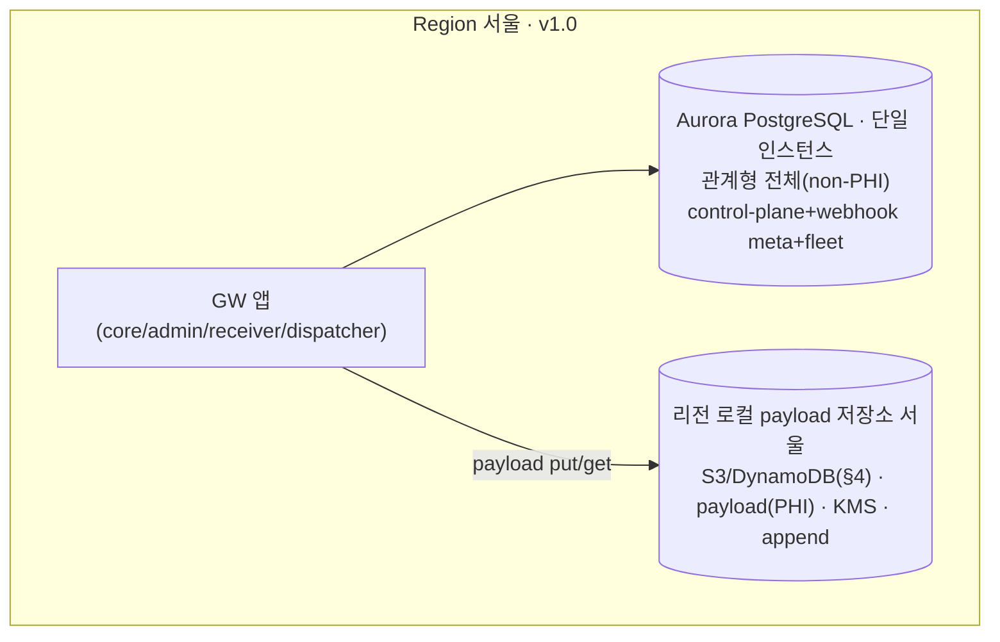
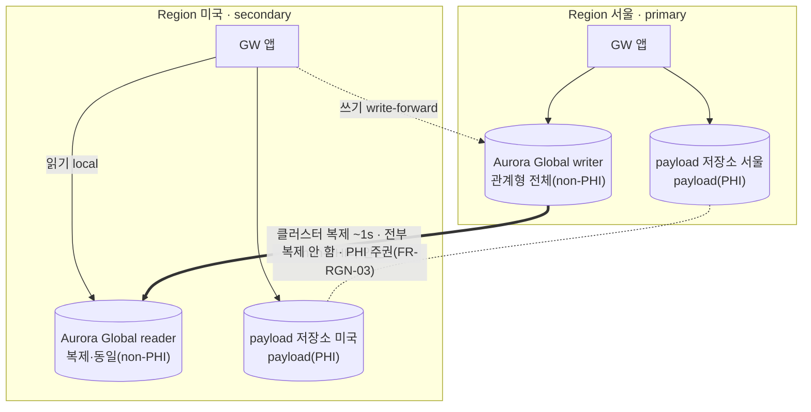
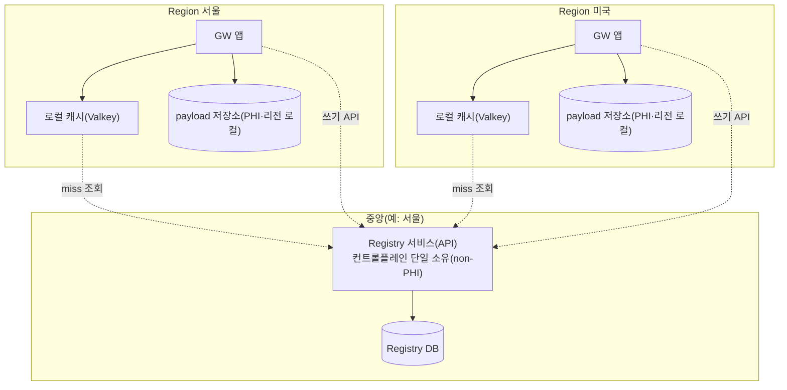

# VT API Gateway — GW 저장소 아키텍처 결정
### 7/30 주간회의 결정 검토 문서 (전역 일관 · DB 선택)

> **목적**: 인프라 스레드에서 GW 저장소 비용(“Aurora Global DB는 오버스펙 아니냐”)이 제기됐다. 이 문서는 **GW가 왜 전역 일관 계층을 필요로 하는지**를 정리하고, 그 전역 일관을 **비용 효율적으로 실현하는 DB 선택안**을 제시해 회의에서 결정하게 한다.
>
> **핵심 결론(미리)**: 전역 일관은 GW의 **요구사항**이다. **PHI(webhook payload)를 관계형 DB 밖(리전 로컬 저장소)으로 분리**하면 관계형 계층이 전부 non-PHI가 되어 **단일 Aurora Global 클러스터 하나로 인스턴스를 최소화**하면서 주권(PHI 리전 밖 미이동)까지 지킬 수 있다.
>
> **읽는 순서**: §1 발단(비용 우려·제약) → §2 전역 일관이 필요한 이유 → §3 핵심 통찰(PHI 외부화) → §4 payload 저장소(DB컬럼/S3/DynamoDB) → §5 관계형 토폴로지(A/B/C) → §6 결정 항목 → §7 추천.

---

## 0. 한눈에 (TL;DR)

- **범위**: 전역 일관(Global sync)은 GW의 **요구사항**이지 결정 대상이 아니다(리전변경·webhook 분배·device auth·정책/JWKS). 이 문서가 정하는 것은 **“그 전역 일관을 어떤 DB/저장 방식으로 담느냐(DB 선택)”**.
- **제약**: Aurora Global 복제는 **클러스터 단위**다(database/스키마 단위 선택 복제 불가). 따라서 **PHI가 관계형에 있으면** 멀티리전에서 "전역 데이터만 복제, PHI는 로컬"을 한 클러스터로 못 해 **리전마다 인스턴스 2개**가 든다.
- **해법**: **webhook payload(PHI)를 관계형 밖 리전 로컬 저장소에 분리**한다. 그러면 관계형이 **전부 non-PHI** → **클러스터 단위 복제가 안전** → **단일 Aurora Global 클러스터**로 충분(인스턴스 최소화).
- **payload 저장소 = S3 vs DynamoDB (접전·D1)** — 소형·저볼륨이면 DynamoDB(구현 단순·네이티브 TTL), 대량 장기 누적이면 S3(GB 비용). 관계형 DB 컬럼은 §3에서 탈락. Jack 볼륨·비용 견적으로 확정.
- **주권(FR-RGN-03)**: payload는 **리전 로컬 저장소에만** 저장·미복제. **GW Console은 전 리전 관리**라 리전별 GW 중개(복호·마스킹·감사)로 조회 — 조회에 문제 없음.
- **플랫폼**: Aurora는 heavy-use/RI에서 RDS와 비용이 근접하고 운영 편의·멀티리전 마이그레이션 0 이점이 있어 **v1.0부터 Aurora** 지향.
- **사수 요건**: PHI 리전 밖 미이동(FR-RGN-03) · 논리 데이터 분류(전역 vs 리전)는 **저장 계층으로 정의**(관계형=전역·non-PHI / 별도 저장소=리전·PHI).
- **영향(확정 시)**: SRS **§7.6.3**(payload 저장) · **§2.1.1**(데이터 클래스·다이어그램) · **§3.1.2**(v1.0 플랫폼) · **§2.7.1** · **DBML**(payload 컬럼→저장소 key 참조) · **IP P8**(Receiver 저장) 반영.

---

## 1. 발단 — 인프라 스레드의 비용 우려

출처: ES DevOps 채널 **"VT-API-Gateway 인프라 구성 스레드"** (Jack↔Scott, 7/27).

### 1.1 컨선
- Scott: "vt-api-gw는 **글로벌 커버가 아니라 지역별 커버**다" → **Aurora Global DB는 오버스펙**. "**짠돌이 스펙**으로 시작하고 이후 확장 생각하라."
- Scott도 데이터 거주성은 전제: *"gw를 process로만 인정하면 상관없는데, 메모리도 허용 안 하겠다는 국가가 나오면 분리해야 한다"* → **PHI는 리전 분리** 인정.
- 스레드 잠정 정리: "Global DB, Local DB 나눌 것 없이 Postgres RDS 하나." 단 이 정리에서 **전역 계층이 왜 필요한지(리전 간 sync)** 는 함께 다뤄지지 않았다 — 본 문서가 그 배경과 비용안을 함께 정리한다.

### 1.2 GW 저장소의 두 축 — 물리 vs 논리 (혼동 주의)

| 축 | 뜻 | 성격 |
|---|---|---|
| **물리 (인스턴스 수)** | RDS/Aurora 인스턴스 몇 개인가 | **비용 이슈** → v1.0 최소화 대상 |
| **논리 (데이터 클래스)** | 전역 일관 데이터 vs 리전 로컬(PHI) 데이터 | **요구사항**(주권·멀티리전-ready) |

- "2개 논리 데이터 클래스" ≠ "2개 인스턴스". 단일 리전에서는 **한 인스턴스 안에 두 database로 분리** 가능(비용=1개).
- "Global"은 **규모(대형 서비스)가 아니라 '작은 non-PHI 라우팅 레지스트리가 리전 간 일관'** 이라는 뜻이다(read-mostly·소용량).

### 1.3 저장소 선택을 좌우하는 제약 2가지 (조사 결과)

| # | 제약 | 함의 |
|---|---|---|
| **A** | **Aurora Global 복제 = 클러스터 단위** (database/스키마 단위로 골라 복제 불가) | 한 클러스터 안에서 "일부만 복제, 나머지는 리전 로컬"이 **불가** → PHI를 관계형에 두면 **PHI 분리 = 클러스터 분리 = 인스턴스 증가** |
| **B** | **Aurora 비용 ≈ RDS** (heavy-use·RI 기준), **운영 편의는 Aurora 우위** | "Aurora=오버스펙·무조건 비쌈"은 성립 안 함 → 특히 멀티리전 전환이 **Global DB 활성화만(마이그레이션 0)** 인 이점이 크다 |

### 1.4 database 단위 vs 클러스터 단위 (핵심 오해 방지)
- 흔한 가정: "gw_global(전역)만 복제하고 gw_regional(PHI)은 로컬로 두면 되지 않나?"
- 실제(§1.3-A): Aurora Global은 **클러스터를 통째로 복제**한다. gw_global만 복제하려면 **그 자체가 별도 클러스터**여야 한다. 두 database가 한 클러스터에 있으면 **둘 다 복제되거나 둘 다 안 되거나** 다.
- 따라서 **비용/인스턴스 문제의 진짜 원인은 "PHI가 관계형 안에 있다"** 는 점이다. 이 지점을 §3에서 푼다.

---

## 2. 전역 일관이 필요한 이유

전역 일관은 **결정 대상이 아니라 요구사항**이다. GW는 아래 때문에 **작은 컨트롤플레인(non-PHI)을 전 리전이 같은 값으로** 읽어야 한다.

- **(리전 변경)** 클리닉 home 리전을 **운영 중 변경**(운영자 override + EzServer 자가변경·FR-RGN-04) → 한 곳의 변경이 **전 리전에 즉시** 보여야 라우팅이 맞다.
- **(AXS webhook)** 외부 upstream(AXS) webhook은 **발신자 위치 기준 아무 리전에나** 떨어진다 → 수신 리전이 "클리닉 X = home A리전"을 알아야 대상 리전으로 분배(§7.6.3).
- **(device auth)** device auth 엔드포인트는 공개 → 디바이스가 어느 리전에 나타나든 **공개키 검증·revocation** 가능해야 한다.
- **(정책·타깃·config·운영자·JWKS)** 어디서 등록/폐기해도 **전 리전이 같은 답**.

반면 **PHI(webhook payload)는 리전 밖으로 복제하지 않는다**(주권·FR-RGN-03). 즉 **전역 일관(컨트롤플레인)** 과 **리전 로컬(PHI)** 두 성격이 공존한다 — 이 둘을 **어떤 저장 계층으로 나누느냐**가 이 문서의 결정이다.

---

## 3. 핵심 통찰 — PHI를 관계형 밖으로

### 3.1 관계형을 리전에 묶는 유일한 강제 요인 = webhook payload(PHI)

현 SRS가 리전 로컬(gw_regional)로 묶은 3개를 뜯어보면, 실제 PHI는 하나뿐이다.

| 테이블 | PHI? | 판정 |
|---|---|---|
| **webhook_event.payload** | **예(PHI)** | 외부(AXS) 이벤트 본문에 환자 신원 포함 가능 → 리전 로컬·미복제(FR-RGN-03) |
| audit_log | 아니오 | 운영자 행위·리소스 ID·시각 — 환자 데이터 아님 → 전역 관계형 |
| fleet_state | 아니오 | device 생존/버전 — 전역 관계형 |

즉 관계형을 리전에 못 박는 **강제 요인은 webhook payload 하나뿐**이고, audit_log·fleet_state는 non-PHI라 전역 관계형에 둔다.

### 3.2 payload를 빼면 관계형은 전부 non-PHI → 클러스터 복제가 안전

- payload를 **리전 로컬 저장소**로 옮기면 관계형에 남는 것은 **컨트롤플레인 + webhook 메타(PHI-free) + fleet_state** = **전부 non-PHI**.
- non-PHI만 있는 클러스터는 **통째로 복제해도 주권 위반이 아니다** → **클러스터 단위 복제(Aurora Global)가 자연스럽고 안전**.
- 따라서 관계형은 **단일 (Aurora Global) 클러스터 하나**면 되고, PHI는 **리전 로컬 저장소(S3/DynamoDB·§4)** 에 보관 → **인스턴스 2개 부담 없이** 전역 일관 + 주권을 동시에 만족한다.

### 3.3 데이터 분류

| 저장 계층 | 내용 | 리전 간 | PHI |
|---|---|---|---|
| **관계형 (단일 Aurora Global 클러스터)** | device·clinic·region_catalog·target·org_mapping·policy·config·operator(role)·client_inventory + **webhook_event 메타**(target·event_type·org·clinic·region·state·시각) + **fleet_state** + **audit_log** | **전 리전 복제(클러스터 sync)** | **없음** |
| **리전 로컬 저장소 (S3/DynamoDB·§4)** | **webhook_event.payload**(opaque·PHI·append) | **복제 안 함(주권)** | **있음** |

- **webhook_event 분리**: 메타(검색·필터·라우팅 근거)는 관계형(전역)에, **본문(payload)만 리전 로컬 저장소**에. 분배 큐(SQS)는 **eventId만** 싣는 claim-check 구조라, claim-check 대상이 "DB 행"에서 "저장소 객체/item"으로 바뀔 뿐 배관 변경은 최소.
- **fleet_state·audit_log → 전역 관계형**(둘 다 non-PHI). audit_log는 운영자 행위·리소스 ID·시각이라 환자 데이터가 아니므로 리전 로컬 강제 대상이 아니다.

---

## 4. payload 저장소 — DB 컬럼 vs S3 vs DynamoDB

### 4.1 현재 SRS 서술
현 SRS(§7.6.3)는 payload를 **관계형 `webhook_event.payload_encrypted` 컬럼에 KMS envelope 암호화** 저장한다. 본 문서는 이를 **리전 로컬 저장소(S3 또는 DynamoDB)로 이전**할 것을 제안한다(근거: §3 — 관계형에서 PHI를 빼야 단일 클러스터가 성립). 어느 저장소든 **암호화는 동일하게 적용**한다(§4.4).

### 4.2 데이터 성격 (선택의 전제)
- webhook payload = **이벤트 알림 JSON**(예: AXS `patient.created`)이다. **파일이 아니다** — 대용량 파일(CT 영상 등)은 presigned로 별도 업로드(§7.4)라 webhook을 타지 않는다.
- 따라서 payload는 **현실적으로 수 KB(많아야 수십 KB)** 이고, **append(수정 없음)·누적 보관**되며, **eventId로 단건 claim-check**된다. 조회는 비동기 dispatch + 드문 Console break-glass라 **초저지연이 불필요**하다.
- 이 성격에서 **관계형 DB 컬럼은 부적합**(PHI가 클러스터에 묶여 §3 문제)이고, **S3·DynamoDB 둘 다 적합**하다. 아래는 그 둘 사이의 균형 비교다.

### 4.3 S3 vs DynamoDB 비교 (관계형 DB 컬럼은 §3에서 탈락)

| 항목 | S3 | DynamoDB |
|---|---|---|
| **구현 단순성** | put/get object + **Lifecycle(인프라 설정)** | **put/get item 한 번 + 네이티브 TTL** — 앱 관점 더 단순 |
| **보존·purge** | Lifecycle(프리픽스·기간 기준) | **TTL 속성(레코드 단위·정밀)** |
| **조회** | eventId=key GET | eventId=PK 단건(한 자리 ms) — 단 비동기라 이점 미미 |
| **크기** | 무제한 | item ≤400KB — **webhook 알림엔 사실상 무관**(수 KB), 단 opaque 원칙상 가드 권장(§4.4) |
| **누적 저장 비용** | GB당 저렴(장기 대량 누적에 유리) | GB당 높음 — **단 소형·저볼륨이면 절대 금액 차이 작음** |
| **리전 로컬·주권** | 버킷=리전, 복제 안 걸면 로컬 | 테이블=리전, **Global Tables는 절대 켜지 않음**(PHI) |
| **암호화** | SSE-KMS + 앱 envelope(§4.4) | KMS + 앱 envelope(§4.4) |

### 4.4 선택 기준 (닫힌 추천 아님 · D1)
**접전이다.** 관계형 DB 컬럼만 §3 때문에 탈락하고, S3와 DynamoDB는 트레이드오프가 갈린다.
- **소형·저볼륨** → **DynamoDB**가 유리(단일 put/get·네이티브 TTL로 **구현이 더 단순**, 단건 조회 빠름).
- **대량·장기 누적** → **S3**가 유리(GB당 저장 비용).
- **DynamoDB 선택 시 안전 가드**: opaque 원칙상 비정상 대형 payload(>400KB) **거부+DLQ+경보** 한 줄만 둔다 — 정상 트래픽엔 안 걸리며 잠재 실패 모드를 없앤다.
- **확정 입력**: **Jack의 예상 누적 볼륨·실비용 견적** 한 번. 볼륨이 크지 않으면 DynamoDB(단순성), 대량 장기 누적이면 S3.
- **암호화(공통)**: 어느 쪽이든 **GW가 KMS envelope로 암호화한 ciphertext를 저장** + 저장소 관리형 암호화(S3 SSE-KMS / DynamoDB KMS)를 병행한다. 저장 매체가 달라도 *"GW만 복호"*(§7.6.3) 속성은 동일 — **보안 약화 없음**. 전송 중은 TLS.

### 4.5 Console 조회·주권 (성립 확인)
- **at-rest는 리전 로컬(S3 버킷/DynamoDB 테이블)에만** → PHI가 리전 밖으로 나가지 않음(주권 보장).
- **GW Console은 전 리전 관리**: 목록·필터는 **관계형(전역) 메타**로, **본문 열람은 해당 리전 GW가 중개**해 **저장소에서 복호(KMS)→마스킹→감사**(`GET /v1/admin/webhook-events/{eventId}/payload` break-glass·§7.6.3) 후 반환. Console은 마스킹 응답만 표시.
- **통합 Console(추천안의 장점)**: 컨트롤플레인·webhook 메타가 전역이라 **Console 하나가 전 리전을 네이티브로** 조회한다(리전별 설치·리전 스위칭 불요). ↔ 리전 완전 분리는 Console이 파편화된다(부록 A).
- 결론: **"payload는 리전 로컬 + Console은 전 리전 조회"가 모순 없이 성립**한다. 저장 위치만 DB→별도 저장소로 바뀌고 열람 흐름(중개·마스킹·감사)은 동일.

---

## 5. 관계형 토폴로지 — A / B / C

> **전제**: payload/PHI가 관계형 밖으로 나가 관계형은 **전부 non-PHI** → 클러스터 단위 복제가 안전. 세 안 모두 논리 모델은 동일(관계형=전역 일관·로컬읽기 / payload=리전 로컬 저장소·§4). v1.0(단일 리전)에선 A/B/C가 물리적으로 거의 같고, 차이는 **플랫폼·gw/1.2 확장 방식**뿐.

### 5.A 안 A — Aurora Global Database (추천)
관계형 전체를 **하나의 Aurora Global Database**로 둔다. Global DB는 **리전마다 독립 클러스터**로 구성되고 클러스터별 인스턴스 수·크기를 따로 정한다(예: 주 리전 writer 1 + reader 2, 보조 리전 reader 1 — 보조는 최소로 두어 비용↓). 읽기=로컬 reader. **쓰기 = Global Write Forwarding**: 앱은 자기 리전 로컬 엔드포인트에 쓰고 Aurora가 **자체 관리 채널로 주 리전 writer에 전달**한다.

> **이 write-forwarding이 결정적이다(인프라 확인).** 다중리전 VPC 토폴로지상 **타 리전 앱은 주 리전 DB에 직접 접속할 수 없어**, 전역 데이터의 리전 간 write는 Aurora Global Write Forwarding으로만 가능하다 — RDS엔 없는 기능이라 B가 탈락하는 근거이기도 하다(§5.B). 전부 non-PHI라 클러스터 복제가 주권 문제도 없다. 멀티리전 전환 = **Global DB 활성화만**(마이그레이션 0).

**A · v1.0 (서울 단일 · Aurora 단일 인스턴스 · Global 미활성)**

**A · v1.2 (Aurora Global 단일 클러스터 · 리전별 payload 저장소 · 2 리전)**

### 5.B 안 B — 표준 RDS + 교차리전 read replica (전역 write 요건에서 탈락)
관계형을 RDS primary + 타 리전 read replica로 두는 안. 그러나 **다중리전 VPC 토폴로지상 보조 리전 앱이 주 리전 primary DB에 직접 접속할 수 없고**(인프라 확인) RDS read replica는 read-only라, **보조 리전에서 전역 데이터를 쓸 방법이 없다** → 전역 write 요건에서 **B는 탈락**한다(RDS엔 Aurora Global Write Forwarding 같은 기능이 없음). 억지로 쓰려면 write를 중앙으로 보내는 앱 계층이 필요한데 그건 사실상 C다. **결론: 실질 선택지는 A(Aurora write forwarding) vs C(중앙 서비스)로 좁혀진다.**

### 5.C 안 C — 중앙 Registry 서비스 + 리전 로컬 캐시
관계형(컨트롤플레인)을 **중앙 서비스가 단일 소유**하고, 각 리전은 **로컬 캐시**로 읽고 쓰기/캐시미스만 중앙을 호출한다. 앱 변경 최대·**중앙 SPOF**(자체 HA 필요). payload 외부화와 직교(조합 가능)하나 v1.0 과설계. A/B와 **구조가 달라** 그림을 둔다:

### 5.D 비교

| 항목 | **A. Aurora Global(추천)** | B. RDS + replica *(전역 write 불가·탈락·§5.B)* | C. 중앙 registry |
|---|---|---|---|
| 전역 write(멀티리전) | **가능**(Global Write Forwarding) | **불가**(타 리전→주 primary 접속 X·read replica는 read-only) | 가능(중앙 write API) |
| 관계형 PHI | 없음(payload=별도 저장소) | 없음 | 없음 |
| 인스턴스(v1.0) | **1** | 1 | 1 + 서비스 컴퓨트 |
| 인스턴스(gw/1.2) | **리전당 1 클러스터(독립 사이징·보조 reader 최소)** | 리전당 1(+replica) | 중앙 1 + 리전 캐시 |
| 비용 | ≈ RDS(heavy/RI·§1.3-B) | 낮음 | 낮음(중앙+캐시) |
| 멀티리전 전환 | **Global DB 활성화만(마이그0)** | replica 구성 | 서비스화 |
| failover | **관리형·RTO낮음·RPO~0** | 수동 | 중앙 HA(SPOF) |
| 개발 복잡도 | **최저**(투명 R/W) | 중(R/W 분리) | 최고 |
| Scott 수용성 | ○(v1.0 단일 인스턴스로 짠돌이 부합·비용 근접) | ◎ | ◎ |

**요지**: payload 외부화로 A의 약점(PHI 클러스터 복제·인스턴스 2개)이 사라졌고 Aurora 비용도 근접(§1.3-B)이다. 게다가 **다중리전 전역 write는 Aurora Global Write Forwarding이 사실상 강제**(B의 직접 원격 write 불가·RDS 미지원)라 실질 선택지는 **A vs C**로 좁혀지고, **C는 앱 복잡·중앙 SPOF**라 **A(Aurora Global) + 별도 payload 저장소** 가 유력하다.

---

## 6. 🟨 결정해야 할 요소 (회의 산출물)

1. **[D1·상위] webhook payload 저장소** — ① 관계형 DB 컬럼(§3 탈락) / **② S3** / **③ DynamoDB**(②③ 접전·§4, Jack 볼륨·비용으로 확정). → 관계형이 non-PHI가 되는 전제.
2. **[D2] 관계형 토폴로지** — **A(Aurora Global·추천) vs C(중앙 서비스)**. **B(RDS+직접 원격 write)는 다중리전 VPC상 불가로 탈락**(§5.B). C는 앱 복잡·SPOF라 A 유력.
3. **[D3] v1.0 플랫폼** — 다중리전 전역 write가 **Aurora Global Write Forwarding을 요구**(RDS 미지원·§5.A)하므로, gw/1.2를 지원하면 **Aurora가 사실상 강제** → **v1.0부터 Aurora**가 마이그0. (RDS는 멀티리전 전역 write 불가라 v1.0-단일리전 한정 선택일 뿐.)
4. **[D4·전제] 멀티리전 지원 여부·failover 요건** — gw/1.2 멀티리전 하는가? failover(리전 장애 시 타 리전이 대신 서비스) 필요한가? (이월 #9 RTO/RPO 연계.)
5. **[사수 요건]** PHI 리전 밖 미이동(FR-RGN-03) — **리전 로컬 저장소로 집행** · 논리 데이터 분류(전역/리전)는 **저장 계층으로 정의**(관계형=전역·non-PHI / 별도 저장소=리전·PHI).

> **결정에서 뺀 것**: audit_log·fleet_state 배치 — 둘 다 non-PHI라 **전역 관계형으로 확정**(회의 결정 불요). audit_log는 운영자 행위·리소스 ID·시각이라 환자 데이터가 아니다.

---

##  7. 추천안 + 다음 단계

- **v1.0(지금 확정 권장)** = **Aurora 단일 인스턴스**(관계형 전체·non-PHI) **+ 리전 로컬 payload 저장소**(webhook payload·PHI·KMS). → 인스턴스 1개(짠돌이 부합) + 주권 보장 + 멀티리전 마이그0.
- **gw/1.2** = **Aurora Global 단일 클러스터**(전부 non-PHI라 클러스터 복제 안전) **+ 리전별 payload 저장소**(미복제). → 인스턴스 2개 부담 없이 전역 일관 + 주권.
- **payload 저장소** = **S3 또는 DynamoDB (D1·접전·§4)** — 소형·저볼륨이면 DynamoDB(단순), 대량 누적이면 S3. 크기 가드·암호화 병행 전제.
- **audit_log·fleet_state** = non-PHI → **전역 관계형**(별도 결정 아님).
- **되돌림 안전장치**: 외부엔 **단일 endpoint(GeoDNS)** · `client_id` **전역 유일** · payload 접근을 **claim-check(eventId→저장소 key) port로 추상화**(저장 매체를 앱 경계에 가둠) · **PHI는 관계형·전역 복제 대상에 두지 않음**.
- **결정 후 산출물**:
  - **ADR** 기록(대안 ①②③·A/B/C·근거).
  - **SRS 반영**(개정이력·승인·fixVersion): **§7.6.3**(payload = 리전 로컬 저장소 claim-check·KMS·S3 lifecycle 또는 DynamoDB TTL) · **§2.1.1**(데이터 클래스·다이어그램) · **§3.1.2**(v1.0 Aurora) · **§2.7.1**.
  - **DBML 반영**: `webhook_event.payload_encrypted` → payload 참조 key(S3 key 또는 DynamoDB PK) + KMS 참조.
  - **IP 반영**: **P8 webhook 수신** Task(payload 저장 = 관계형 DB → 리전 로컬 저장소)·claim-check 대상 변경.

---

## 부록 A — "전역 일관을 포기하고 리전 완전 분리"는 왜 비권장인가
전역 디렉토리를 없애 리전 사일로로 가면, 어느 리전 소속인지 알아야 forward가 되어 **요청에 리전 인코딩(외부 계약 변경)** 이 필요하고, 현 SRS(FR-RGN-04·§2.1.1·§7.6.3)를 수정해야 한다(투명 리전변경·교차리전 webhook 상실). 또한 컨트롤플레인이 리전별로 쪼개져 **GW Console도 리전별 설치 또는 리전 스위칭(한 번에 한 리전만 조회)** 으로 파편화된다 — 전 fleet을 한 화면에서 운영하지 못한다(추천안은 메타가 전역이라 Console 하나로 전 리전·§4.5). 게다가 §3의 해법으로 **전역 일관이 저비용**이 되므로, 리전 완전 분리의 유일한 동기(비용 회피)마저 약하다 → **비권장**.

## 부록 B — payload를 관계형 밖에 두는 것 vs DB 컬럼 (트레이드오프)
- **DB 컬럼**의 장점 = 단일 저장소 정합·트랜잭션 일관. 단점 = **PHI가 관계형 클러스터에 묶여** 멀티리전에서 인스턴스 2개를 유발(§1.4).
- **별도 저장소(S3/DynamoDB)** 의 장점 = 인스턴스 최소화·주권 자연 집행·비용. 단점 = **2-저장소 정합**(메타=DB, 본문=별도)인데, 이는 **claim-check port 추상화**(eventId→저장소 key)로 앱 경계에 가둔다. 열람 흐름(중개·마스킹·감사)은 저장 매체와 무관하게 동일.
- 결론: safety-critical PHI를 **리전 로컬 append 전용**으로 다루고, 관계형은 **전역 일관 컨트롤플레인**에 집중시킨다.

## 부록 C — 범위 밖: webhook Receiver/Dispatcher 배치 (별도 토폴로지 결정)
webhook 수신을 **전역 1점(global receiver)** 으로 모을지 **리전별 수신(GeoDNS 최근접)** 으로 둘지는 **수신 컴포넌트 배치** 문제로, 본 문서의 **저장(DB) 결정과 직교**한다 — 어느 토폴로지든 payload는 대상 리전 저장소에 써야 하므로(주권) 저장 결론(리전 로컬)은 불변이다. 트레이드오프(단일 수신의 리전 장애 취약·국경 간 in-transit 증가 ↔ 결정적 리전 판정·AXS 단일 콜백 정합)는 여기서 결정하지 않고 **SRS §7.6 / 별도 ADR**에서 다룬다. 단, 추천 DB안(단일 Aurora Global)은 **어디서든 리전 판정이 저렴**해 두 토폴로지 모두를 값싸게 뒷받침한다. **v1.0은 단일 리전이라 이 선택이 무의미**하고(수신·분배가 한 리전 안), 실제 결정은 **gw/1.2 다중리전 설계 시**다.
