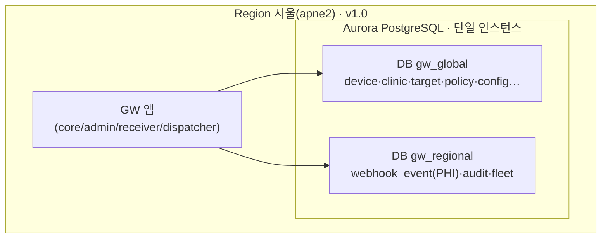
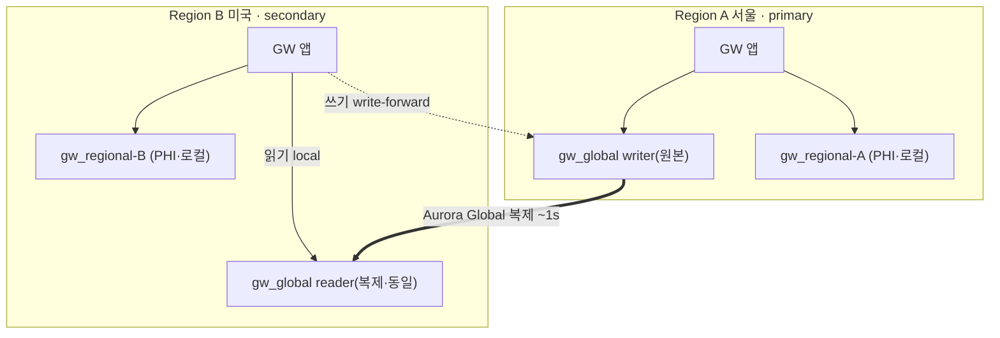
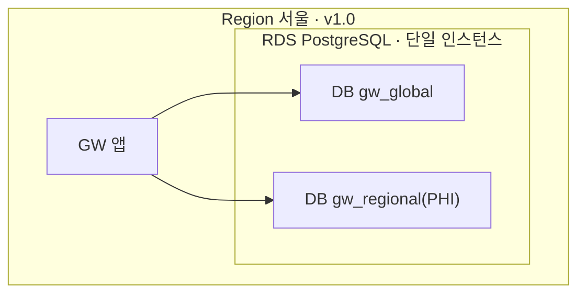
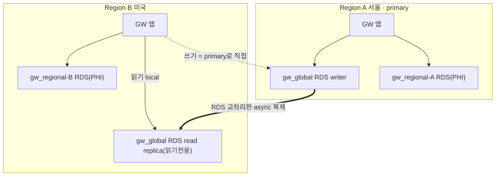
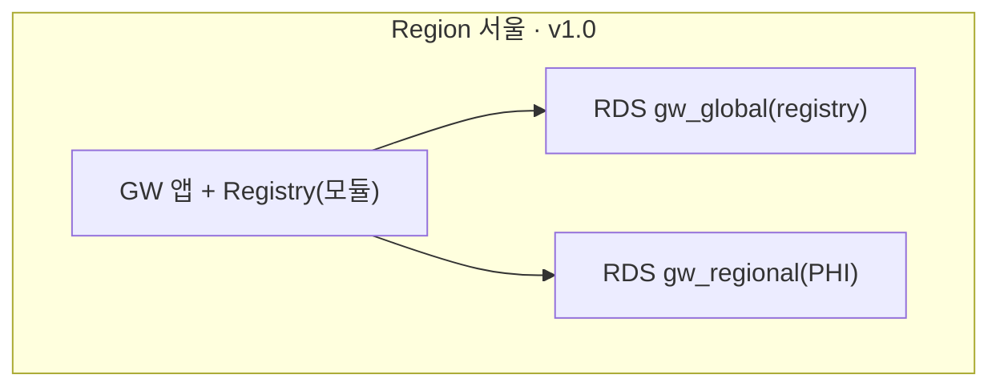
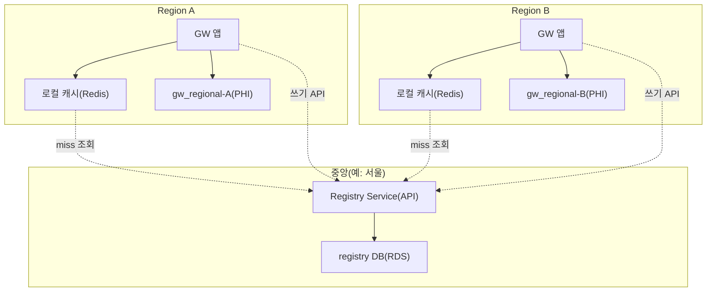

# VT API Gateway — GW 저장소 아키텍처 결정: 전역 일관(Global DB) vs 리전 완전 분리
### 7/30 주간회의 결정 검토 문서

> **목적**: 인프라 스레드에서 "Aurora Global DB는 오버스펙 아니냐"는 비용 우려가 나왔다. 이 문서는 **왜 전역 계층에 Aurora Global DB를 둬서 리전 간 sync를 하려 했는지**를 정리하고, **비용을 절약하기 위한 결정**을 회의에서 내릴 수 있도록 선택지·비용·구성을 제시한다.
>
> **읽는 순서**: §1 발단 → §2 왜 Aurora Global인가 → §3 두 갈래(전역 일관 vs 리전 분리)와 전제 → §4 전역 일관 시 A/B/C 방안(구성·다이어그램·비용) → §5 **결정 요소** → §6 추천.

---

## 0. 한눈에 (TL;DR)

- 이 결정은 **2층**이다: **① cross-region 일관이 필요한가**를 먼저 정하고, **필요할 때만 ② 어떻게(A/B/C)** 가 의미 있다.
- **①을 가르는 것은 4개 질문(Q1~Q4, §3).** 현재 답(클리닉 리전변경 허용=예, AXS 리전별 webhook=불가)으로는 **전역 디렉토리가 필요**하다.
- **Aurora Global DB는 "관리형 + 나중 마이그레이션 0" 때문에 선택했다**(기능 우위가 아님). 같은 전역 일관을 **RDS + 교차리전 read replica(B)** 나 **중앙 registry 서비스(C)** 로 **더 싸게** 실현할 수 있다.
- **v1.0은 어차피 단일 리전(서울)** — 무엇을 고르든 물리적으로 **인스턴스 1개**면 된다. 비용/방식 차이는 **gw/1.2 멀티리전에서만** 발생한다.
- **추천**: v1.0 = **RDS 1 인스턴스 + 논리 2-DB 유지**(Aurora Global 미도입) · gw/1.2 = **B(RDS+replica)** 잠정. 단 이는 **SRS §3.1.2 개정**을 동반(§5·§6).

---

## 1. 발단 — 인프라 스레드의 컨선과 오해

출처: `VT-API-Gateway 인프라 구성 스레드 대화.md` (Jack↔Scott, 7/27).

### 1.1 Scott의 컨선
- "vt-api-gw는 **글로벌 커버가 아니라 지역별 커버**다" → **Aurora Global DB는 오버스펙**.
- "**짠돌이 스펙**으로 시작하고, 이후 확장 생각하라." "그게 DB가 글로벌 커버해서 갈 일은 없다."
- 데이터 거주성은 인정: *"gw를 그냥 process로만 인정하면 상관없는데, 메모리도 허용 안 하겠다는 국가 나오면 분리해야 해요"* → **PHI는 리전 분리**를 Scott도 전제.

### 1.2 스레드의 잠정 정리
- 스레드 정리: *"VT-API-Gateway 또한 Global DB, Local DB 나눌 것 없이 Postgres RDS 하나 사용하는 것으로 정리되었습니다."*
- 이 정리에서는 **글로벌 DB가 있었던 근거(리전 간 sync 필요)** 가 함께 다뤄지지 않았다. 본 문서는 그 배경을 복원하고, **비용 절감 방안까지 포함해 회의에서 함께 확정**하기 위한 것이다.

### 1.3 혼동하기 쉬운 2가지 (물리 vs 논리)

논의 과정에서 아래 두 가지가 뒤섞이기 쉽다:

| | 흔한 혼동 | 실제 |
|---|---|---|
| **① 인스턴스 vs DB** | "2 DB = 2 인스턴스" | **2개 논리 database(gw_global·gw_regional)는 1개 인스턴스 안에서 분리 가능** — 비용은 인스턴스 1개. |
| **② "Global"의 의미** | "Global DB = 글로벌 대형서비스 스케일" | 여기 "Global"은 **규모가 아니라 '작은 non-PHI 라우팅 레지스트리가 리전 간 일관'**이라는 뜻(read-mostly·소용량). |

**핵심 축**: **물리(인스턴스 수)=비용 이슈 → v1.0 최소화 OK** / **논리(전역·리전 데이터 클래스 분리)=멀티리전-ready·PHI 주권 → 유지**. 둘은 별개다.

---

## 2. 현재 SRS(§2.1.1)는 왜 Aurora Global DB를 뒀나

### 2.1 데이터를 두 부류로 나눈다

| 클래스 | 테이블 | 성격 | 리전 간 |
|---|---|---|---|
| **gw_global** (전역 일관·non-PHI) | device·clinic·region_catalog·target·org_mapping·policy·config·operator·operator_role·client_inventory (10) | 라우팅·식별 데이터 | **전 리전 동일(복제/공유)** |
| **gw_regional** (리전 로컬·PHI) | webhook_event(payload=PHI)·audit_log·fleet_state (3) | 운영·PHI | **복제 안 함(주권)** |

- **불변식(FR-RGN-03)**: PHI(webhook payload)는 **리전 밖으로 복제하지 않는다**. Aurora Global DB는 **클러스터 통째 복제**라 특정 테이블만 제외 불가 → **PHI를 전역 클러스터에 두지 않으려면 클러스터를 2개**로 나눈다.

### 2.2 gw_global이 "전 리전 동일"이어야 하는 이유 = 요구사항들

*"모든 리전이 같은 답을 내야 한다"* — 대표 근거:

- **(리전 변경)** 클리닉 home 리전을 **운영 중 변경**(운영자 override + EzServer 자가변경, FR-RGN-04). 한 곳의 변경이 **모든 리전에 즉시** 보여야 라우팅이 맞음.
- **(AXS webhook)** 외부 upstream(AXS)의 webhook은 **발신자 위치 기준 아무 리전에나** 떨어짐 → 수신 리전이 "클리닉 X = home A리전"을 알아야 대상 리전으로 분배(§7.6.3).
- **(디바이스 auth)** device auth 엔드포인트는 공개 → 디바이스가 여러 리전에 나타날 수 있으면 어느 리전이든 공개키 검증·revocation이 필요.
- **(정책·타깃·config·운영자·JWKS)** 어디서 등록/폐기해도 전 리전이 같은 답.

> 이 요구들이 **얼마나 진짜인지**(우리가 포기할 수 있는지)가 §3의 Q1~Q4다.

### 2.3 Aurora Global DB를 고른 이유 = 관리형 + 마이그레이션 0

전역 일관이라는 *니즈*는 고정이지만 그걸 *실현하는 제품*은 여럿이며, Aurora Global DB는 다음 두 이유로 선택됐다(기능 우위가 아님):

1. **관리형 교차리전 복제**(~1s)·**관리형 빠른 failover** — 운영 부담이 작다.
2. **마이그레이션 0**: 단일 리전을 처음부터 Aurora로 두면 멀티리전 전환이 **Global Database 활성화만**으로 끝난다. RDS로 시작하면 나중에 **RDS→Aurora 플랫폼 마이그레이션 + IEC 62304 재검증**이 필요해 비대칭적으로 비싸다(§3.1.2 근거).

같은 전역 일관 니즈를 **RDS + 교차리전 read replica(B)** 나 **중앙 registry 서비스(C)** 로 **더 싸게**(운영/코드 손이 조금 더 가는 대가로) 실현할 수 있다 → §4.

---

## 3. 두 갈래: 전역 일관 유지 vs 리전 완전 분리

**전제(확정 필요): 멀티리전은 지원한다(gw/1.2).** v1.0은 어차피 단일 리전이라 아래는 gw/1.2 설계 판단이다.

### 3.1 ①을 가르는 결정적 질문 (이게 A/B/C보다 상위 결정)

| # | 유형 | 질문 | "아니오" → 리전 분리 가능 | "예" → 전역 일관(디렉토리) 필요 | 현재 |
|---|---|---|---|---|---|
| **Q1** | 정보·AXS | AXS 등 upstream이 **클리닉/리전그룹별 다른 webhook endpoint**로 보낼 수 있나? | 교차리전 webhook 분배 불요 | 아무 리전에 떨어짐 → 분배 필요 | **불가 가정**(Straumann 협상 중) |
| **Q2** | 결정·제품 | 클리닉이 **리전을 투명하게 변경**할 수 있어야 하나? | 고정 · 이전=수동 migration | 옛→새 리전 자동 라우팅 필요 | **예**(허용) |
| **Q3** | 결정·가용성 | 리전 장애 시 **다른 리전이 그 클리닉을 대신 서비스**(failover)해야 하나? | 리전 다운=그 클리닉 오프라인 감수 | 복제로 failover → 필요 | **미정** |
| **Q4** | 정보·주권 | 데이터 주권상 **home 리전이 geoDNS 최근접과 다를 수** 있나? | 로밍 없음(항상 최근접=home) | non-home 접속 → 전역 검증 필요 | **미정** |

**판정**: Q1~Q4 **전부 "아니오" → 리전 완전 분리**(디렉토리·A/B/C 전부 불요). **하나라도 "예" → 전역 디렉토리 필요 → A/B/C 중 선택.**

### 3.2 각 갈래의 전제 조건

**(갈래 1) 전역 일관 유지 → "리전끼리 데이터(작은 컨트롤플레인)를 공유"**
- 필요: gw_global(10테이블)을 **전 리전이 같은 값으로** 읽을 수 있는 디렉토리(복제 or 중앙+캐시).
- PHI(gw_regional)는 **여전히 리전 로컬**(공유 안 함).
- 장점: 투명 리전변경·교차리전 webhook·auth failover 다 됨(요구사항 그대로).

**(갈래 2) 리전 완전 분리 → "정책 수정 + webhook 처리 방안 마련"**
- **정책 수정**: 클리닉 리전 **고정**(변경=별도 **수동 migration**·다운타임 허용) → Q2를 "아니오"로. 그리고 **교차리전 auth failover 포기**(리전 다운=그 클리닉 오프라인) → Q3를 "아니오"로.
- **webhook 처리 방안**: AXS 등 upstream이 **클리닉/리전그룹별 endpoint**로 보내도록 연동 계약 → Q1을 "가능"으로 (Straumann 협조 필요).
- 그러면 각 리전이 **완전 독립 스택**(자기 DB·자기 전부). Global DB 불필요.
- ⚠️ **되돌림 비대칭**: 분리로 갔다가 나중에 전역이 필요해지면, **외부 계약(AXS·EzServer 엔드포인트) 재조정** 때문에 복귀가 비싸다. 작은 디렉토리를 유지하는 비용은 작다 → 애매하면 유지가 안전.

### 3.3 구체 시나리오 — 호주 법인이 서울 리전을 쓰다가, 나중에 호주 리전이 생기면? _(가정·미확정)_

- **현재(v1.0)**: AXS 연동을 **호주 법인이 먼저 사용** → 호주 클리닉이 **서울 리전**을 쓴다(v1.0은 단일 리전이라 자연스러움).
- **미래(가정)**: 호주 리전을 구축하면 호주 클리닉을 **서울 → 호주 리전으로 이전**하고 싶어진다(지연·데이터 주권). 이때 두 모델의 이전 난이도가 크게 갈린다:

| 이전 작업 | 전역 일관(디렉토리) | 리전 완전 분리 |
|---|---|---|
| **라우팅·식별 전환** | `clinic.region` 갱신·`mapping_version++` → **전 리전 자동 전파(투명)**·외부 무변경 | region-pinned라 **AXS webhook URL·EzServer/디바이스 엔드포인트를 전부 재지정**(외부 재조정 + fleet 재설정) |
| **PHI 데이터 이전** | 필요(옛 리전 잔류 or 점진 이전) — **라우팅과 분리되어 여유** | 필요 — **위 재지정과 함께 다운타임 cutover로 몰림** |
| **투명성** | 무중단 가능 | 비투명(유지보수 창·외부 협조 필요) |
| **난이도** | **중**(데이터 이전만) | **높음**(데이터 이전 + 외부 계약 재지정 + 다운타임) |

- **핵심**: **PHI 데이터 이전은 어느 모델이든 필요**하다. 차이는 **리전 분리 모델에선 여기에 "외부 연동 재지정 + 비투명 cutover"가 얹혀 상당히 까다로워진다**는 점 — §3.2 **되돌림 비대칭의 구체 사례**다. 특히 호주처럼 **v1.0에 이미 원격(서울) 리전을 쓰는 법인**이 있으면, 나중 리전 신설 시 이전 대상이 명확해 이 리스크가 현실적이다.
- (미확정 가정이지만) 이런 이전 가능성이 조금이라도 있으면, **전역 일관(디렉토리) 유지가 이전 리스크를 낮춘다** — Q2(리전 변경)·Q4(주권상 home≠최근접)가 "예"로 굳어지는 방향.

---

## 4. 전역 일관으로 갈 경우 — A / B / C 방안

> 세 방안 모두 **논리 모델은 동일**: gw_global = 전 리전 동일(공유/복제·로컬 읽기), gw_regional = 리전 로컬(PHI·복제 안 함). **차이는 "그 공유를 무엇으로 실현하느냐".**
>
> **v1.0(단일 리전)에선 A/B/C가 물리적으로 거의 같다**(인스턴스 1개·직접 R/W). 차이는 **플랫폼(Aurora vs RDS)** 과 **gw/1.2 확장 방식**뿐.

### 4.A 안 A — Aurora Global Database

- **아이디어**: gw_global을 **Aurora Global 클러스터**로. secondary 리전이 같은 글로벌 클러스터의 일부. write-forwarding·관리형 failover 내장.
- **개발자 R/W**: 읽기=로컬 reader, 쓰기=로컬에 써도 **자동 primary 전달**. 앱은 거의 투명.

**A · v1.0 (서울 단일 · Aurora 단일 인스턴스, Global 미활성)**

**A · v1.2 (Aurora Global · 2 리전)**

### 4.B 안 B — 표준 RDS + 교차리전 read replica

- **아이디어**: gw_global을 **일반 RDS 인스턴스(primary) + 다른 리전에 read replica**. Aurora와 **논리 동일**, 제품만 RDS.
- **개발자 R/W**: 읽기=로컬 replica, **쓰기=원격 primary로 직접**(replica는 읽기전용) → 앱이 **읽기/쓰기 분리**. read-after-write는 primary 읽기/`mapping_version`.

**B · v1.0 (서울 단일 · RDS 단일 인스턴스)**

**B · v1.2 (RDS + 교차리전 read replica · 2 리전)**

### 4.C 안 C — 중앙 Registry 서비스 + 리전 로컬 캐시

- **아이디어**: gw_global을 **중앙 registry 서비스(API)** 가 소유(단일 DB). 각 리전은 **로컬 캐시**로 읽고, miss/쓰기만 중앙 호출. (Scott의 "process면 OK"에 부합)
- **개발자 R/W**: gw_global을 **DB 직접이 아니라 서비스 클라이언트+캐시**로 접근(앱 변경 가장 큼). PHI·요청 처리는 리전 로컬 → 중앙은 "작은 디렉토리"만, 병목 아님. 단 **중앙 = SPOF**라 자체 HA 필요.

**C · v1.0 (서울 단일 · registry는 앱 내 모듈)**

**C · v1.2 (중앙 Registry 서비스 + 리전 캐시 · 2 리전)**

### 4.D A / B / C 비교

> 비용 = 서울 리전·인스턴스분·**개략치(±)·Jack 확정**(스토리지·백업·전송·교차리전 복제 별도). 온디맨드 / 1년RI(No-Upfront).

| 항목 | A. Aurora Global | B. RDS + read replica | C. 중앙 registry 서비스 |
|---|---|---|---|
| **논리 모델** | 전 리전 전체복제·로컬읽기 | **동일** | 중앙 소유 + 리전 캐시 |
| **v1.0 인스턴스 비용($/월)** | Aurora t4g.medium **82 / 40** | RDS t4g.small **34/21**~medium **68/40** | RDS(동급) + 서비스 컴퓨트(소) |
| **AWS 비용(gw/1.2)** | 높음(Global 복제·스토리지·IO) | 낮음(replica 인스턴스) | 낮음(중앙 DB + 서비스) |
| **개발 복잡도** | **최저**(R/W 투명·write-forwarding) | 중(읽기/쓰기 분리) | **최고**(DB직접→서비스+캐시 전환) |
| **읽기(R)** | 로컬 reader | 로컬 replica | 로컬 캐시(miss=중앙) |
| **쓰기(W)** | 로컬에 써도 자동 forward | 원격 primary로 직접 | 중앙 write API |
| **failover(리전 장애)** | 관리형 승격·RTO 낮음·RPO~0 | **수동 승격**·RTO 중·RPO 소 | 중앙 자체 HA(SPOF) |
| **마이그레이션 위험** | 낮음(선Aurora) | **없음**(RDS 유지) | 낮음(RDS 유지) |
| **운영 부담** | 낮음 | 중(runbook) | 중(중앙 SPOF HA) |
| **Scott 수용성** | △(오버스펙 지적) | ◎ | ◎(process면 OK) |

**요지**: **논리는 A=B=C 동일.** A는 편하고 비쌈, B는 읽기/쓰기 분리 한 겹·쌈·마이그레이션 0, C는 앱 변경 크지만 유연. gw_global은 **작고·쓰기 드물고·읽기는 어차피 생존**이라 **B의 수동 failover를 runbook으로 감당하면 B가 비용/이관 관점 합리적.**

---

## 5. 🟨 결정해야 할 요소 (회의 산출물)

1. **[전제] 멀티리전을 gw/1.2에서 지원하는가?** — 예/아니오. (아니오면 이하 전부 무의미.)
2. **[① 게이팅] Q1~Q4 (§3.1) 답 확정** →
   - 하나라도 "예" → **전역 디렉토리 필요**(3~6으로).
   - 전부 "아니오" → **리전 완전 분리**(정책 수정 + AXS 리전별 webhook 계약, §3.2 갈래2) → A/B/C 불필요.
   - *특히 Q3(failover)·Q4(주권) 는 현재 미정 → 오늘 결정 대상.*
3. **[② 메커니즘] 디렉토리가 필요하면 A / B / C 중?** — 잠정 추천 **B**.
4. **[v1.0 플랫폼] RDS vs Aurora?** — gw/1.2 방향과 정렬: **A 지향→v1.0 Aurora**(마이그0) / **B·C 지향→v1.0 RDS**(최저). **RDS로 시작하면 B/C/D 무이관, A만 이관.**
5. **[SRS 영향] v1.0을 RDS로 하면 SRS §3.1.2("단일 리전부터 Aurora")와 달라짐** → **§3.1.2·§2.7.1 개정 대상**(ADR). 논리 분리(§2.1.1·§6.4)는 불변.
6. **[불변 사수]** PHI 주권(FR-RGN-03)·논리 2-datasource 분리 — 어느 안이든 유지.

---

## 6. 추천안 + 다음 단계

- **v1.0(지금 확정) = RDS 1 인스턴스 + 2 database(gw_global·gw_regional) + 논리 2-datasource 유지 · Aurora Global 미도입.** → Scott 비용관 수용 + 논리 분리 사수.
- **gw/1.2 = B(RDS + 교차리전 read replica) 잠정 추천** — `Appendix B #15`로 이관해 인프라 설계 시 확정. (관리형 DR RTO/RPO가 꼭 필요하면 A 재론.)
- **되돌림 안전장치(양방향 안 잠기기)**: 외부엔 **단일 엔드포인트(geoDNS)** 만 노출 · `client_id` **전역 유일 네임스페이스** · gw_global 접근을 **repository/port** 로 추상화 · **PHI는 글로벌 후보 저장소에 금지**.
- **결정 후**: **ADR**로 기록(대안 A~D·근거) + (RDS 확정 시) **SRS §3.1.2·§2.7.1 개정**(개정이력·승인·fixVersion).

---

### 부록 — 왜 D(전역 DB 제거·region-pinned)는 별도 안이 아니고 "리전 분리 갈래"인가
D는 전역 디렉토리를 없애 사일로로 가는 것인데, 그러려면 **어느 리전 소속인지**를 알아야 forward가 되고(그 디렉토리가 곧 A/B/C), 없애면 **요청에 리전 인코딩(외부 계약 변경)** 이 필요하다. 즉 D = §3.2 **갈래2(리전 분리)** 의 구현이며, 현 SRS(FR-RGN-04·§2.1.1·§7.6.3)를 **개정해야** 성립한다(webhook 유실·투명 리전변경 상실).
