# VatechAPIGateway SRS (③ GW 일원화 + 멀티 Region)

**문서 통제**

| 문서 ID | ESIP-GW-SRS |
| --- | --- |
| 문서 버전 | 0.9 (Draft · baseline 승인 시 1.0) |
| 적용 제품 버전 | gw/1.0.0.0~ |
| 분류 | 통제 문서 (Controlled · IEC 62304 / ISO 13485 — 요구사항 추적성) |
| SSOT 여부 | 본 SRS가 GW 플랫폼 요구사항의 SSOT. 기존 [요구사항 명세](https://vks.vatech.com/x/AcSSEg)·[PRD](https://vks.vatech.com/pages/viewpage.action?pageId=311608280)·[ARD](https://vks.vatech.com/pages/viewpage.action?pageId=311608281)는 추출/배경 뷰 |
| 공식 등록처 | [vt-api-gateway `docs/specs/SRS.md`](https://dev.azure.com/ewoosoft/es-platforms/_git/vt-api-gateway/docs/specs/SRS.md) (PR 리뷰) |

---

# 1 Introduction (개요)

## 1.1 Purpose (목표)

본 SRS는 **VatechAPIGateway(이하 GW)** 의 소프트웨어 요구사항을 정의한다. 적용 제품 버전은 `gw/1.0.0.0` 이상이다.

본 문서는 **내부 개발용**으로 작성하며, 동시에 **IEC 62304 / ISO 13485 통제 문서 baseline**의 요구사항 추적성 근거로 사용한다. 외부(파트너·외주) 공유 시 §6.6 등 회사 내부 사정에 해당하는 절은 제거 후 전달한다.

## 1.2 Product Scope (범위)

**배경.** 다음 세 문제가 이 프로젝트의 출발점이다.

- CleverSpace가 새 정책으로 API를 계속 확장하지만, 클리닉·PC마다 버전이 제각각인 구버전 CleverOne·EzServer가 이를 인식하지 못해 **원인불명 실패**가 발생한다.
- CleverOne이 EzServer를 거치지 않고 CleverSpace로 직접 연동하는 **경로 B**가 존재해, 인증·정책 통제가 두 갈래로 분산된다.
- Straumann AXS처럼 보안상 직접 연결이 불가능한 외부 연동 수요가 늘고 있다.

**목표.** GW는 모든 클라우드·디바이스 연동을 **단일 게이트웨이로 일원화**하여, 인증(사람=직원 IdP·device=private_key_jwt)·버전 호환·Region 라우팅을 한 집행점에서 처리한다. 구체적으로 GW는 다음을 수행한다.

- GW는 모든 통신이 경유하는 중앙 **control plane**으로서 인증·디바이스 관리·라우팅·config를 담당한다.
- 파일은 presigned URL로 **디바이스와 리전 storage를 직접 연결해** 전송하고, GW는 그 바이트 경로에 관여하지 않는다.
- GW는 디바이스를 소속 리전에 매칭하여 **데이터 주권**(PHI가 리전 밖으로 나가지 않음)을 보장한다.
- GW는 외부 이벤트(AXS 등)를 **단일 창구로 수신**하여 대상 클리닉으로 분배한다.
- GW는 클라이언트 버전을 검사하여 호환되지 않는 요청을 **게이팅**한다.

**GW의 정체 — 범용 API Gateway.** GW는 특정 서비스(AXS)나 특정 클라이언트(EzServer)에 종속되지 않고, VT와 외부의 여러 클라우드 서비스를 연동하는 **범용 API Gateway**이다. 모든 호출은 **`device(주체) → GW → target`** 경로를 따르며, GW의 호출자(client)는 GW에 인증해 target로 연결하는 머신 클라이언트인 **device**이다(§1.4). clinic은 이 경로에 놓인 노드가 아니라 device가 선택적으로 속하는 **그룹**이다.

- **현재(v1.0).** GW는 CleverSpace와 AXS를 연동한다. 인증은 두 면 — device는 private_key_jwt(§7.1.1), 사람(운영자)은 직원 IdP(MS365/Entra·§7.1.4). device는 EzServer 한 종류(클리닉당 1대)뿐이므로, 모든 device가 clinic에 속한다.
- **미래(확장성).** 본 SRS는 다음 확장 여지를 미리 보장한다. 연동 target는 VT·외부의 여러 클라우드 서비스로 늘어나되, **레지스트리에 한 행을 등록하는 것만으로 추가되고 코드·경로는 바뀌지 않는다**(§4.1.2·NFR-SCL). device도 EzServer 외의 종류가 생길 수 있고, clinic에 속하지 않는 device(**clinic-less**)도 있을 수 있다.
- **귀속 원칙.** 주체는 device이고, clinic은 device가 속할 때 region·정책·target-org 같은 *clinic-종속 정보*를 대신 제공하는 그룹이다. 따라서 region·policy는 **device를 기준으로 해석**하되, device가 clinic에 속하면 clinic이 그 값을 상속시키고 속하지 않으면 device 자체 값이나 global 기본을 쓴다. 해석은 **device → clinic → global** 순서를 따른다(§6.4.1·§7.5.3). v1.0에서는 모든 device가 clinic에 속하므로 실제로는 clinic 단위로 해석되지만, 스키마는 device·global 스코프를 미리 수용한다.

**Will Not Do (의도적으로 제외):**

- **제품측(CleverSpace·CleverOne·EzServer) 변경 상세** — ① API 호환성 / ② Presigned One Pager에서 다룬다. 본 SRS는 GW 쪽 계약만 정의한다.
- **Straumann AXS connector 상세** — ④ Sub-SRS([Straumann AXS Sub-SRS](https://dev.azure.com/ewoosoft/es-platforms/_git/vt-api-gateway/docs/specs/04-subsrs-straumann-axs/Sub-SRS.md))에서 다룬다. 본 SRS는 connector 프레임워크(§7.5)까지만.
- **GW Console(Admin Web) UI 상세** — ③-C Sub-SRS([GW Console Sub-SRS](https://dev.azure.com/ewoosoft/es-platforms/_git/vt-api-gateway/docs/specs/03c-subsrs-gw-console/Sub-SRS.md))에서 다룬다. 본 SRS는 관리 API(§7.9)까지만.
- **CleverLab↔AXS 직접 연동(Roadmap 5단계 갈래 B)** — **현 시점 미고려**(2026-06 회의). 단 외부 cloud 서비스 연동 **일반 역량**(외부(C) 프록시·§4.1.1·§7.5)은 유지하므로, 향후 활성화 시 신규 코드가 아닌 레지스트리 등록으로 수용한다. 우선 범위는 **갈래 A(EzServer→AXS)** 다(④).
- **v1.0 우선 개발 범위 = Straumann IO(IntraOral) Scanner 연동만 (7/9 결정).** 시간 제약상 AXS 연동(갈래 A)의 **v1.0 1차 범위를 Straumann IO Scanner로 한정**한다 — **CleverOne 연동은 v1.0에 넣지 않고 후속 버전으로 미룬다**(§2.7). 단 **GW의 기본 계약(버전 호환성 게이팅 §2.8·§7.7 · 인증 §7.1 · 라우팅·target 프록시 §4.1·§7.5)은 originator와 무관한 공통 토대라 v1.0에 포함**한다(IO Scanner·CleverOne 공통). **IO Scanner↔EzServer 연동 방식은 미정**(추후 확정). IO Scanner에 불필요한 스펙은 최대한 후행한다(우선순위=Agenda Gantt·개발 Roadmap §3.9). 제품 스펙 작성 주체 — **CleverOne=Nick·EzServer=Thomas**(GW는 표준 계약만 제공, 초안은 각 제품 담당이 직접).
- **비-EzServer·clinic-less device의 구체 정체·연동 방식** — **지금 정의하지 않는다.** device 모델은 이를 **수용하도록 확장성 있게 설계**(주체=device, clinic 선택적, region·policy는 device 기준 해석)하되, **실제로 그런 device 연동이 요구되면 그때 상세히 다룬다**(clinic-less device의 region 출처·target-org 신원·인증 부트스트랩 등 clinic-종속 규칙 포함). **v1.0의 device = EzServer(clinic-bound)** 뿐.
- **레거시 10만대 마이그레이션** — v2.0(FR-MIG-\*). 본 v1.0 범위 밖.

## 1.3 Document Conventions (문서규칙)

> **문서 상태·읽는 법.** 본 문서는 GW 플랫폼 요구사항의 SSOT이며 SRS v3.3 표준(1~7장 + Appendix)을 따른다. **확정된 결정은 본문**(전략 §2·비기능 §6·기능 §7)에 규격으로 반영되어 있고, **미확정 항목은 Appendix B(미결 추적)** 에 결정자·기한과 함께 있다.
> **본 SRS는 자기완결적이다** — 읽는 데 필요한 모든 정의는 본문·§1.4(용어)·Appendix에 있다(계약 정본 = 본 SRS + DBML + OpenAPI). 외부 문서(개발 Roadmap·ARD 등) 참조는 *배경·상세 위임*용이며 본 SRS 이해의 전제가 아니다.

- **우선순위 표기**: 각 기능에 `(P1)/(P2)/(P3)` 표기. 하위 요구사항은 별도 표기 없으면 상위 우선순위를 상속한다.
  - **P1** = 반드시 포함, 제외 시 릴리스 불가 (요구사항 명세의 `M`·`v1.0`에 대응)
  - **P2** = 중요하나 일정 조정 가능 (`S` 또는 `v1.1`)
  - **P3** = 추가되면 좋음, 다음 Phase (`v1.2`/`v2.0`)
- **버전 표기**: 베이스라인(`gw/1.0`)은 표기 없음. 후속분만 `(v1.1)`·`(v1.2)` 표기.
- **변경 표기**: 색이 아닌 텍스트(`(변경: YYYY-MM-DD)`)로 표기, 색은 보조.
- **시간**: Unix Timestamp(ms). 필드명: camelCase.

## 1.4 Terms and Abbreviations (정의 및 약어)

> 모두가 아는 표준 용어(JWT·TLS·REST·OAuth2 등)는 제외. 본 문서 독자(개발·QA·인프라·PM) 일부가 모르거나 혼동할 만한 것만 선별.

| 용어 | 본 문서에서의 의미 | 비고 |
| --- | --- | --- |
| GW (VatechAPIGateway) | 모든 연동이 단일 경유하는 control plane | 본 SRS의 대상 제품 |
| LMP (LicenseManager) | EzServer **라이선스 관리 플랫폼** — 클리닉의 **Clinic-ID 발급원**. EzServer가 LMP에서 Clinic-ID 수신 시 GW 자동·무조건 등록(§2.3.1) | §2.3.1 |
| 디바이스(Device, GW 관점) | GW에 인증해 target로 연결하는 **머신 클라이언트(호출 주체·principal)** — 경로 `device→GW→target`의 출발점. **v1.0 유일 종류 = EzServer**(클리닉당 1개 엣지 머신, 확정 2026-06-25). 미래엔 **비-EzServer device**도 가능(구체 정체는 §1.2 Will Not Do). device는 **선택적으로 clinic에 속함**(v1.0 100%; clinic-less 가능). region·policy 등은 device 기준 해석(§6.4.1). 물리 영상장비(CT/Xray)는 EzServer 뒤·**GW 비대상** | §1.2·§2.3.1·§6.4.1·§7.1·§7.2·ADR-08 |
| 클리닉(Clinic) | device들의 **선택적 그룹** — 소속 device들이 공유하는 **clinic-종속 정보**(데이터 주권 region·target-org 관계·policy 기본값)의 홈. 호출 경로의 노드가 아니라 device의 맥락 제공자. PK=LMP 발급 Clinic-ID. v1.0은 모든 device가 clinic에 속함(1 clinic ↔ 1 EzServer) | §1.2·§6.4.1·§7.3 |
| Valkey | **캐시 엔진**(Redis 포크·완전 호환 — RESP 프로토콜·클라이언트·명령·키스페이스 동일). AWS 제품 = **ElastiCache for Valkey**. Redis는 2024 초 오픈소스 종료, Valkey가 후속·저비용이라 채택. 본 문서·키스페이스의 "Redis(호환)"는 곧 **Valkey**를 가리킴 | §3.1.2·§6.4·`design/redis/` |
| PHI | Protected Health Information — **환자 식별 가능 건강정보**(환자 정보·영상 파일 등). **GW는 PHI 본문을 저장·경유하지 않는다**(presigned 직결, 발급=CleverSpace/AXS) — control plane엔 메타·식별자만. 데이터 주권(리전 밖 미이동)·consent 게이팅 대상이며, 개발·테스트는 더미만(운영만 실 PHI) | §6.4·§6.5·§7.3.3·§3.1 |
| OTel (OpenTelemetry) | 관측성(추적·메트릭·로그) 수집·전송 **벤더 중립 표준/SDK**(CNCF). 요청 상관용 `traceId`/`spanId`를 생성 | §6.3.2·§3.1.2 |
| Grafana Alloy | **OTel 호환 통합 수집 에이전트**(Grafana) — 로그·메트릭·트레이스를 한 에이전트로 수집·전송. OTel 계측 → Alloy 수집 → 백엔드(Prometheus/Loki/Tempo·Grafana 등, 인프라 선택). **수집 에이전트 확정** | §3.1.2·§6.3.2 |
| OOB (Out-Of-Band) | **대역외** — 인증·자격 전달을 주 통신 채널이 아닌 **별도 경로**로 하는 방식. 예: enroll은 네트워크(주 채널)로 하되 검증용 1회 코드는 문자·별도 포털 등 다른 경로로 전달 → 주 채널이 탈취돼도 코드 없이는 등록 불가. **GW는 OOB 코드를 미도입**(부트스트랩=LM 라이선스·Clinic-ID + C/S 승인으로 대체, §2.3.1·§7.2.5) | §7.2.5 |
| PEP / PDP | **PEP**(Policy Enforcement Point) 요청 시점 정책 집행 지점(Proxy Router) · **PDP**(Policy Decision Point) 판정 지점(OPA) | §7.1·§7.5.3 |
| originator | 요청을 _시작한_ 주체(`Vatech-*` 헤더의 권위 소스) | §7.7 |
| `Vatech-Via` | 요청을 _경유한_ 중계 홉(예: EzServer) | originator와 분리 |
| Edge | 클리닉 현장의 EzServer (방화벽 뒤, inbound 불가) | §7.6 |
| soft-state | 완전 stateless가 아닌, cache TTL·mapping_version 기반 상태 | ADR-02 |
| Region Signer Agent | **미채택**(GW 범위 아님) — presigned 직접 발급·서명은 GW가 하지 않는다(발급=target, GW 중계) | §4.1.4·§7.4 |
| ClinicID↔Org-ID | 클리닉 식별자와 외부(AXS) 조직 식별자 매핑 | §7.3 / ④ |
| 경로 B (Path B) | CleverOne → CleverSpace 직접 연동(EzServer 미경유) | Deprecated 대상 |
| 갈래 A / 갈래 B (Straumann 연동 branch) | Roadmap Straumann-AXS 연동의 두 갈래 — **갈래 A**=EzServer→AXS(장비·스캐너 연동·**우선 범위**), **갈래 B**=CleverLab↔AXS(기공소 오더·**보류**). ※ 위 **경로 B와 다른 개념** | §1.2·§2.3.6 |
| 가입 상태 A/B/C (AXS 클리닉) | AXS 연동 관점의 클리닉 상태 — **A**=Straumann 고객+AXS 조직 연동완료(`organizationId` 보유), **B**=Straumann 고객이나 AXS 미연동(`customerNumber`만), **C**=비-Straumann(고객번호 없음) | §2.3.4 |
| b1 (pilot) | Roadmap 첫 통합 파일럿 빌드(AXS pilot·≈v1.0 초기 릴리스) — 일정 상세는 개발 Roadmap | §7.6.6 |

> (PHI 추가됨.) 추가로 등록할 용어(예: allowlist) 또는 사내 공유 용어집 링크는 필요 시 보강.

## 1.5 Related Documents (관련문서)

**VKS (Confluence) — 통제·설계**

- [PRD (v2)](https://vks.vatech.com/pages/viewpage.action?pageId=311608280) — 상위 기획. §12.1 스펙 단위 정본
- [ARD (아키텍처)](https://vks.vatech.com/pages/viewpage.action?pageId=311608281) — ADR-01~10·컴포넌트·시퀀스
- [요구사항 명세](https://vks.vatech.com/x/AcSSEg) — FR/NFR 등록부 (본 SRS가 SSOT로 흡수, 해당 문서는 추출 뷰)
- [인증·보안·컴플라이언스 설계](https://vks.vatech.com/pages/viewpage.action?pageId=311608329) · [API 명세·데이터 모델·주권](https://vks.vatech.com/x/CMSSEg)
- [개발 Roadmap 결정 (배경)](https://vks.vatech.com/x/r9iSEg) — 케이스 D·단계

**Azure Repos — 스펙·설계 산출물 (`vt-api-gateway`)**

- [OpenAPI (GW 고유 API)](https://dev.azure.com/ewoosoft/es-platforms/_git/vt-api-gateway/docs/specs/design/openapi/vt-api-gateway.openapi.yaml) — dev-chain-design SSOT
- [DBML (PostgreSQL)](https://dev.azure.com/ewoosoft/es-platforms/_git/vt-api-gateway/docs/specs/design/dbml/vt-api-gateway.dbml) — dev-chain-design SSOT
- 하위 스펙:
  - ① API 호환성 One Pager — VKS(Confluence), pageId 미확정
  - ② Presigned URL One Pager — VKS(Confluence), pageId 미확정
  - [③-C GW Console Sub-SRS](https://dev.azure.com/ewoosoft/es-platforms/_git/vt-api-gateway/docs/specs/03c-subsrs-gw-console/Sub-SRS.md)
  - [④ Straumann AXS Sub-SRS](https://dev.azure.com/ewoosoft/es-platforms/_git/vt-api-gateway/docs/specs/04-subsrs-straumann-axs/Sub-SRS.md)

**외부·참고**

- [AXS OpenAPI (Straumann 정본)](https://developer.axs.straumann.com/api) · 스펙 인덱스 `https://developer.axs.straumann.com/specs/index.json`
- [AXS OpenAPI 스냅샷 (사내)](https://dev.azure.com/ewoosoft/es-platforms/_git/vt-api-gateway/docs/specs/references/axs-docs/README.md) — ④ 연동 입력 (취득 2026-06-16, Confidential)

## 1.6 Intended Audience and Reading Suggestions (대상 및 읽는 방법)

| #   | 챕터                | PM  | 백엔드 | 인프라/DevOps | QA  | 보안 | 경영진 |
| --- | ------------------- | --- | ------ | ------------- | --- | ---- | ------ |
| 1.2 | Product Scope       | 2   | 1      | 1             | 1   | 1    | 2      |
| 2.x | Overall Description | 2   | 2      | 2             | 2   | 1    | 1      |
| 3.x | Environment         | 1   | 2      | 2             | 2   | 1    | —      |
| 4.x | External Interface  | 1   | 2      | 2             | 2   | 2    | —      |
| 5·6 | Perf / NFR          | 1   | 2      | 2             | 2   | 2    | —      |
| 7   | Functional Req      | 1   | 2      | 1             | 2   | 1    | —      |

> 범례: 1=훑어 이해 / 2=자세히 / —=읽지 않아도 됨

## 1.7 Project Output (프로젝트 산출물)

### 1.7.1 Output Format

백엔드 서비스 (NestJS, Kubernetes(EKS) 배포, 단일 control-plane endpoint). API 문서는 `@nestjs/swagger` code-first(`/api-docs`). 서비스 공개 호스트(제안)는 §4.5 참조.

### 1.7.2 Output Name and Version

- 공식 명칭: **VatechAPIGateway**
- 레포지토리: `vt-api-gateway` (Azure es-platforms)
- 초기 버전: `gw/1.0.0.0`

### 1.7.3 Patent Information

None

---

# 2 Overall Description (전체 설명)

## 2.1 Product Perspective (제품 조망)

GW는 기존 제품군(CleverOne·EzServer·CleverSpace)과 외부 플랫폼(Straumann AXS) 사이의 **단일 control plane**으로 신규 구축된다.

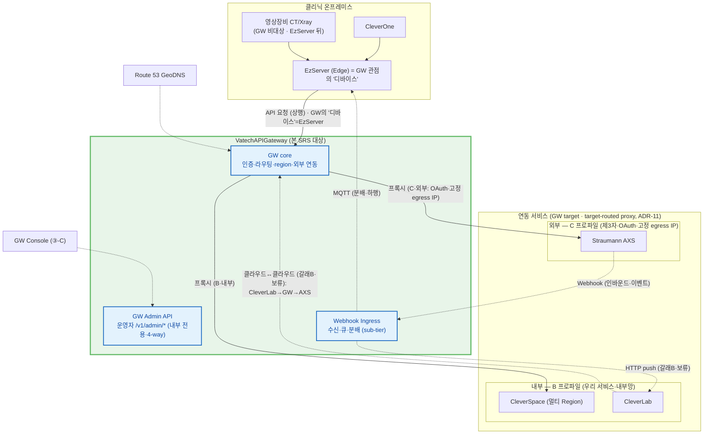

**색 범례** (§2.1·§2.1.1·§2.2 공통):

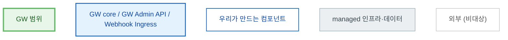

> managed(회색)=우리가 만들지 않는 AWS 자원(SQS·DB·S3·NAT·LB) · 외부=GW 범위 박스 밖. **§2.1(상위) → §2.2(GW core 펼침)** 가 같은 색으로 줌인되어 이어진다.

| 외부 시스템 | 역할 |
| --- | --- |
| CleverOne / EzServer | 사내 호출자. EzServer는 Edge(방화벽 뒤, inbound 불가) |
| CleverSpace | 멀티 Region 백엔드(데이터 경로 대상) |
| Straumann AXS | 외부 연동 대상. Webhook 수신·presigned 연동 |
| CleverLab | 우리 클라우드 기공소 PMS. GW의 **프록시 대상이 아니라 갈래 B 클라우드 클라이언트**(CleverLab→GW→AXS) + AXS 이벤트 webhook 수신처. **CleverLab↔AXS 직접 연동(갈래 B)은 현 시점 범위 외/보류**(§1.2·④ — 외부 cloud 연동 일반 역량은 유지) |
| Route 53 GeoDNS | EzServer를 최근접 GW Region에 연결 |
| GW Console | Admin Web(③-C Sub-SRS) — 관리 API 호출 |

> 상세 인터페이스는 §4. **API 호출은 대상 무관 동일 경로** — GW 단일 경유 target-routed proxy(ADR-11), 차이는 **trust profile뿐**(내부 B=CleverSpace / 외부 C=AXS는 OAuth·고정 egress 추가). **CleverLab은 프록시 대상이 아니라 GW를 호출하는 갈래B 클라이언트**(보류·§1.2). 컴포넌트·4-way 배포=§2.2, 라우팅 모델=§4.1.2.
>
> **Webhook(이벤트)만 방향이 반대** — AXS가 GW로 push → **Webhook Ingress**(Receiver·SQS·Dispatcher·GW 내부 sub-tier) 수신 → EzServer는 MQTT(하행)·클라우드는 HTTP push로 분배(대상=Org-ID→Clinic→리전). 클라우드 수신=CleverLab(보류)뿐, CleverSpace는 webhook 대상 아님. 상세=§2.3.6·§7.6.
>
> **본 도는 control plane(정보 경로) context다** — **대용량 데이터의 presigned 직접 업로드(EzServer→발급주체 storage, GW 미경유)·AWS 미지원국 target MinIO·리전별 CS 노드는 생략**했다(Roadmap §2.6은 데이터 plane까지 함께 그림). 데이터 경로는 §2.3.5(경로②)·§2.3.4(경로③)·§4.1.4, 멀티 리전·MinIO는 §2.1.1·§3.1.2 참조.

### 2.1.1 배포 토폴로지 — 멀티 서버·멀티 리전 (egress·Webhook)

GW는 두 축으로 다중화된다: **멀티 서버**(한 리전 내 Multi-AZ K8s 복제본 — HA·수평 확장, §6.3.1) 와 **멀티 리전**(서울·미주 등, gw/1.2·§7.3.5). 두 경우 모두 **inbound는 안정 endpoint 하나**(리전별 LB, GeoDNS 뒤)로 수렴하지만 **outbound(egress)는 NAT EIP 다수**로 나간다 — **inbound IP ≠ egress IP**. GW pod는 **무상태(soft-state, ADR-02)** 라 DB·Redis를 pod마다 두지 않는다 — **같은 리전 pod는 동일 저장소를 공유**하고, 라우팅·식별 데이터는 **전역 일관**으로 둔다(데이터 토폴로지는 다이어그램 아래 참조).

> **v1.0=단일 리전(서울)만 배포**(§2.7.1). 아래 멀티 리전 다이어그램은 2차(gw/1.2) 목표이며 v1.0이 이를 *ready*로 갖춘다 — 데이터 토폴로지·Region Resolver·apex/GeoDNS·egress 집합은 동일하고 **리전 수만 1→N**(전역 SSOT는 단일 리전에 존재, 2차에 복제 추가·§2.7.1·§4.5.1).

> **Webhook Ingress 위치 — 컴퓨트는 리전, DNS·데이터만 전역.** Receiver·SQS·Dispatcher(§7.6)는 **각 리전 GW pods에서 실행**되고, 전역인 것은 공개 호스트 DNS(`{target}.webhook.gw.vatech.com`·Route 53)와 매핑 SSOT뿐이다. v1.0은 GeoDNS 대상=서울 1개(서울이 수신·처리), 2차는 대상만 N개 추가(최근접 수신 → 매핑으로 대상 리전 판정 → 교차 리전 분배). record 타입·호스트·컴포넌트 불변(§4.5.1·§2.7.1).

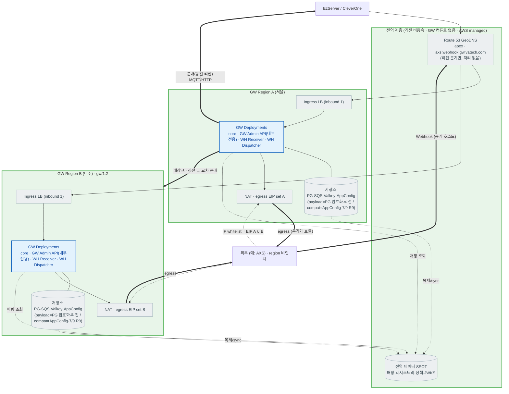

**색 범례** (§2.1과 동일):


> **일반화**: 아래는 **외부 서비스(C 프로파일) 공통** 규칙이며, **AXS는 한 예**다(향후 DS Core/3Shape 등 동일). egress IP whitelist·**target별 전용 호스트(DNS) 수신**(각 리전 Webhook Ingress)·리전 분배는 target에 무관하게 같은 방식으로 적용된다(ADR-11 레지스트리 모델과 일관).
>
> **B(내부) vs C(외부) 적용 범위**: **API 호출 경로는 내부(CleverSpace 등)·외부(AXS) 동일**(GW target-routed proxy, §2.1·§4.1.2). 본 절의 **고정 egress IP whitelist·Webhook 수신은 외부(C) 한정** 사항이다 — 내부(B) target은 같은 GW proxy를 타되 **내부망**이라 egress 고정 IP whitelist가 불필요하고, (현재) GW로 Webhook을 발신하지 않는다. 즉 §2.1.1이 외부(C) 토폴로지를 다루는 것이지, 내부 호출이 다른 경로라는 뜻이 아니다.

- **저장소 제품(§3.1.2 근거·비교표).** 엔진은 **PostgreSQL 확정**, 관리형 제품은 **처음부터 Aurora PostgreSQL 권장**(인프라 비준 예정, Appendix B #18). 멀티 리전 전환이 Aurora는 **Global Database 활성화(마이그레이션 0)** 인 반면 RDS-first는 **RDS→Aurora 마이그레이션**이라 비대칭적으로 비싸 **단일 리전부터 Aurora 권장**(비용 델타 ~20%·저QPS라 작음). 캐시 = **Amazon ElastiCache for Valkey**(Redis 호환·리전 로컬·교차복제 안 함·로컬 PG에서 재적재). **다이어그램은 2차 멀티 리전 목표 토폴로지**이며 v1.0은 단일 리전에서 동일 제품으로 시작.
- **egress IP whitelist = 고정 EIP 집합(멀티 IP).** 외부 서비스(예: AXS)가 IP whitelist를 요구하면, 화이트리스트 대상은 GW가 _외부를 호출_ 할 때의 egress IP다. pod별 임시 IP가 아니라 **AZ/리전별 NAT의 고정 EIP**여야 하고, 멀티 리전이면 **전 리전 집합의 합집합(A ∪ B …)** 이며 유한·열거 가능해야 한다(FR-INT-03·§7.5.3·§2.6).
- **리스크/제약**: 오토스케일·새 AZ·**리전 증설은 egress IP를 늘리므로**, egress를 **고정 EIP 풀로 핀(pin)** 하고 외부(예: Straumann)와 **whitelist를 협의·갱신(리드타임)** 해야 한다. EIP 풀 provisioning·고정은 인프라(③-I) 책임(§2.6·§7.3.5).
- **Webhook 수신 = target별 전용 호스트(식별)·region 분배는 매핑.** 외부는 region을 모른다 — `{target}.webhook.gw.vatech.com`으로 발신자를 Host/SNI 식별(source IP 비의존·인증은 HMAC+timestamp), 수신 GW가 **전역 매핑으로 대상 클리닉 리전을 판정해 재분배**(수신≠대상이면 교차 리전). **GeoDNS는 대상 리전을 정하지 않는다**(호출자 위치 기준일 뿐). 상세=§2.3.6·§7.6·§4.5.1.

#### 데이터 공유·토폴로지 (멀티 서버·멀티 리전)

- **멀티 서버(리전 내) = 데이터 공유.** GW pod는 **무상태(soft-state, ADR-02)** 이며 **DB·Redis를 pod마다 두지 않는다.** 같은 리전의 모든 pod가 **동일한 리전 DB(PostgreSQL HA)·Redis를 공유**하므로 어느 pod가 처리하든 세션·멱등·캐시가 공유된다. "멀티 서버 = 데이터 분리"가 **아니다**.
- **멀티 리전 = 데이터 부류를 나눈다.**
  - **(전역 일관) 라우팅·식별 데이터** — device/clinic↔region 매핑·레지스트리·Org-ID↔ClinicID·정책(OPA)·compat matrix·JWKS. **모든 리전이 같은 답을 내야** 한다(예: B 리전에 떨어진 Webhook이 "클리닉 X는 A 리전 소속"임을 알아야 분배 가능). 따라서 **전역 일관**으로 둔다 — soft-state 캐시 + 변경 시 strong-consistency 경로·`mapping_version`(ADR-02·§7.3.1·§7.3.2).
  - **(리전 로컬) 운영 데이터** — audit log(발생 리전)·in-flight webhook/queue. **리전마다 다르며** 합쳐서 전체다.
  - **PHI 영상 본문은 미저장**(presigned 직결·§6.4)이라 전역 데이터(PHI 미포함 control-plane 메타)는 리전 간 복제 가능 — **데이터 주권은 "PHI 바이트를 리전 storage로 라우팅"의 문제이지 GW DB 분리가 아니다**(§7.3.3). **예외 — webhook payload**는 PHI 포함 가능해 `webhook_event.payload_encrypted`(KMS envelope)로 **리전 로컬 DB 저장**(주권 유지·복호화 가능·masking·§7.6.3).
- **저장소 역할(PostgreSQL / Redis).** **PostgreSQL = 원본(SSOT).** 전역 일관 데이터는 **리전 간 복제/sync**(원본 → 리전 복제본), 리전 로컬 데이터(audit·in-flight queue)는 리전 전용. **Redis = 빠른 조회 캐시(리전마다).** Redis끼리 직접 복제하기보다 **각 리전이 로컬 PostgreSQL에서 캐시(cache-aside)** 하고 **TTL·`mapping_version`으로 무효화**해 일관성을 맞춘다(멱등 키·nonce 같은 휘발 상태는 리전 Redis 로컬). 즉 일관성의 근거는 _PostgreSQL 복제 + 캐시 무효화_ 다.
- **전역데이터 복제 토폴로지 세부**(원본 primary 위치·단일 vs multi-primary·충돌 처리)는 gw/1.2 설계 결정(Appendix B #15)이나, 위 **"PostgreSQL 원본+리전 복제 / Redis 리전 캐시" 모델과 "전역 일관/리전 로컬" 구분 원칙은 버전과 무관하게 고정**이다.

> **GW는 AWS에만 배포한다.** 비AWS·private GW 배포는 없다 — **AWS 미지원 국가도 별도 GW 없이 가장 가까운 AWS 리전 GW에 접속**(GeoDNS). 그 국가의 데이터 주권용 storage(MinIO 등)는 **target(CleverSpace/AXS)가 제공·GW는 presigned 중계만**(GW storage 비호스팅, §7.4·§3.1.2). 배포·NAT·EIP·GeoDNS 구성은 **인프라(③-I)** 소유이며, 본 SRS는 _GW가 전제하는 요구_ 만 기술한다(§3.1·§7.3.5·§2.6).

## 2.2 Overall System Configuration (전체 시스템 구성)

ARD §3·§4의 **3-Plane(Control / Data / Integration)** 구성을 따른다. 컴포넌트 도출 기준 = _plane(책임 영역) + 배포 단위_. **본 도는 §2.1과 같은 그림에서 GW 쪽을 확대한 것**이며(외부 시스템은 §2.1과 동일), GW를 **GW core · GW Admin API(내부 전용) · Webhook Ingress** 세 배포 단위로 나눈다(4-way — 제어평면 Admin을 데이터평면에서 격리).

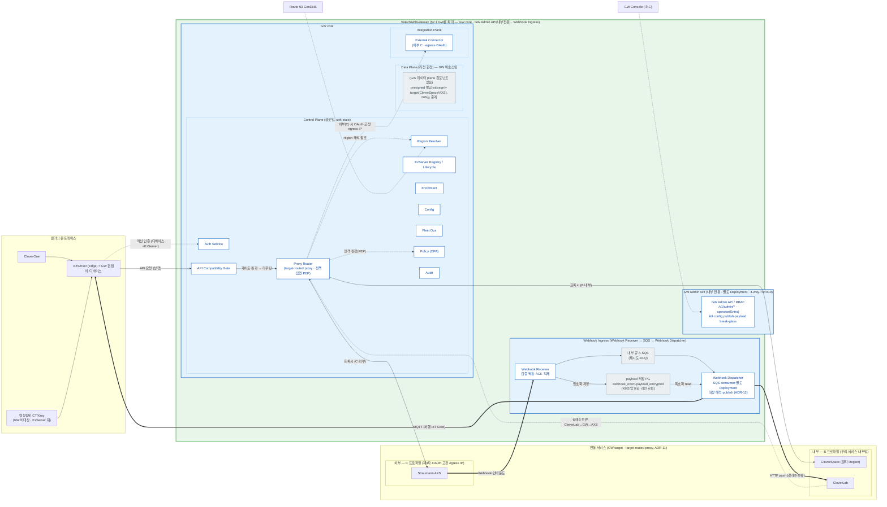

**색 범례** (§2.1과 동일):


> **프록시 복원력(diagram 주석)**: 재시도·서킷은 **service mesh(istio) egress**(GW 밖·③-I)라 다이어그램에 없다. GW는 **target 연결 timeout(D1~D3)** 만 책임지고, 실패를 표준 오류 envelope(`Vatech-Error-Origin`)로 정규화한다. 상세=§7.5.4.

> **그리는 규칙**: §2.1 GW를 **`GW core`(Control/Data/Integration plane) · `GW Admin API`(내부 전용·4-way) · `Webhook Ingress` 세 부분**으로 확대한 것(바깥은 §2.1과 동일). **API 호출은 대상 무관 동일 경로**(`ROUTER`=target-routed proxy·ADR-11 — B=CleverSpace 직접, C=AXS는 `ROUTER⇢CONN`으로 OAuth·고정 egress 추가). cross-cutting 컴포넌트(Registry·Enrollment·Config·Fleet·Audit)는 가독성상 **미연결**(특정 연결만 표기: `CONSOLE→ADM`·`R53→RGN`). CleverOne은 EzServer 경유(직접 미연결). **CleverLab은 프록시 대상이 아니라 GW를 호출하는 갈래B 클라이언트**(보류). **Webhook만 별개 흐름**(AXS→GW·§2.3.6 정본; CleverSpace는 webhook 대상 아님).

> **🔍 대안 검토 — 디바이스 인증 방식** (ADR-01)
>
> - 채택안: DPoP + 하드웨어 키(SE/TPM)
> - 대안: mTLS — 10만대 운영 부담·물리 키추출 위협 미해결로 반려
> - 상세·재검토 조건: ARD ADR-01. (본 SRS는 결정을 참조하며, 핵심 결정 로그는 Appendix A)

> 핵심 아키텍처 결정은 ARD ADR-01~10에 확정. 본 SRS는 이를 참조하고 Appendix A에 결정 로그로 연결한다.

## 2.3 Overall Operation (전체 동작방식)

GW의 주요 동작을 **시나리오별 개요(overview)** 로 정리한다. 본 절은 흐름의 골격만 보이며, **상세 시퀀스·예외·재시도 정책은 ARD §5가 정본**이다. 전체 시스템 맥락은 §2.1(제품 조망)·§2.2(3-Plane 구성)을, 단계별 아키텍처 배경은 [개발 Roadmap 결정 §2.6 (배경)](https://vks.vatech.com/x/r9iSEg)을 참조한다.

시퀀스의 참여자(액터)는 §2.1 외부 시스템·§2.2 컴포넌트와 일치한다.

> **(스코프) 운영자/Console 인증 흐름(로그인 화면·세션·토큰 refresh·RBAC UI)은 본 절에 정의하지 않는다** — Console UI는 **③-C GW Console Sub-SRS**, 운영자 인증 흐름 요약은 **§2.3.8**(상세 UI는 ③-C), 인증은 **직원 IdP(MS365/Entra OIDC) 위임**(§7.1.4·ADR-08), GW는 **IdP 토큰 검증 + 관리 API RBAC**(§7.9)만 소유한다(토큰 발급·refresh 권위는 IdP).

| 액터 | 의미 (출처) |
| --- | --- |
| EzServer(Edge=GW '디바이스') / CleverOne | 사내·현장 호출자(§2.1·§2.5). EzServer는 방화벽 뒤 Edge·GW 관점의 '디바이스'(§1.4); CleverOne은 EZ 경유. 물리 영상장비는 EzServer 뒤(GW 비대상) |
| GW | 본 SRS 대상. 내부 컴포넌트(Auth·Region Resolver·Proxy Router·External Connector·Webhook Receiver·내부 큐(A·SQS)·Webhook Dispatcher(§7.6.7)/MQTT(B))는 §2.2 |
| CleverSpace / CleverLab | 우리 클라우드 백엔드(§2.1) |
| Straumann AXS / AXS S3 | 외부 플랫폼·외부 스토리지(§2.1, 경로③·§4.1.4) |
| target storage(S3/MinIO) | CleverSpace·AXS 등 **발급 주체 소유** 객체 스토리지 — presigned 직접 업로드 대상(§4.1.4·§7.4) |

> **본 절 시나리오 ↔ §7 기능·§4.1.4 경로 매핑**: 온보딩(§7.2)·인증(§7.1)·리전(§7.3)·파일 업로드 경로②(§7.4·§4.1.4②)·외부 연동 경로③(§7.5·§4.1.4③)·Webhook(§7.6·§4.1.3)·버전 호환(§7.7).
>
> **API 호출 경로는 대상 무관 동일**(`…→GW→target` target-routed proxy, ADR-11): CleverSpace(B 내부)·AXS(C 외부)는 **같은 경로**이고 trust profile만 다르다(C는 OAuth·egress 추가). 그래서 **§2.3.4(외부 연동)는 CleverSpace에도 그대로 적용되는 일반 proxy 흐름**이며, AXS를 예로 들었을 뿐 GW 동작은 동일하다. CleverSpace presign(경로②)에 **별도 시나리오를 두지 않는 이유는 경로가 달라서가 아니라**, 그 계약이 GW 밖(② One Pager·CleverSpace OpenAPI)에 있고 GW는 verbatim bypass(B)만 하기 때문이다(§4.1.4②).

#### 데이터 레코드 생성 시점 (provenance) — 각 표가 언제·누구에 의해 채워지나

"어느 레코드가 언제·누가 만들고(C)·고치고(U)·지우나(D), 그리고 그 관리 API가 있나"를 한 곳에 모은다. 주체는 **① 클라이언트/디바이스 주도**(enroll·heartbeat·org-binding), **② 운영자/Admin 주도**(target·policy·config·region), **③ GW 런타임 자동**(webhook_event·audit_log)으로 나뉜다.

| 테이블 | 생성(C) | 수정(U) | 삭제(D) | 관리 API |
| --- | --- | --- | --- | --- |
| `region_catalog` | 운영자 리전 개통 `POST /v1/admin/regions` | `PUT /v1/admin/regions/{regionId}`(active/draining 전이) | `DELETE`(드묾) | device 공개 `GET /v1/regions` + **운영자 `GET /v1/admin/regions`(list) + POST/PUT/DELETE**(§7.9.1·#30 해소). v1.0=1행 시드 |
| `clinic` | **enroll 자동 upsert + LMP clinic 정보 포착(enroll 스냅샷·LMP 미sync)**(§2.3.1) · 운영자 `POST /v1/admin/clinics`(예외) | device 자가 `PATCH /v1/clinics/me`(수동 보정)·`PUT /v1/clinics/me/region` / 운영자 `PATCH /v1/admin/clinics/{clinicId}`·`PUT /v1/admin/clinics/{clinicId}/region` | 하드 삭제 미지원 | 조회: device `GET /v1/clinics/me` · 운영자 `GET /v1/admin/clinics`(list)·`/{clinicId}` (§7.9·필드셋 확정=name·country_code·address·phone·website) |
| `device` | **enroll** `POST /v1/enroll/complete` | `PATCH /v1/admin/devices/{id}`(pending→active 승인·suspend 등)·kill `POST /v1/admin/devices/{id}/kill` | 하드 삭제 없음(status=revoked) | ✓ GET/POST/PATCH `/v1/admin/devices` · clinic별 목록 `GET /v1/admin/clinics/{clinicId}/devices`(1:N·#47) · 응답에 `clinic` 요약 임베드 |
| `target` | Admin `POST /v1/admin/targets`(upsert·1 레코드) | 동 POST(upsert) | `DELETE /v1/admin/targets/{targetId}` | ✓ full |
| `policy` | Admin `POST /v1/admin/policies`(upsert) | 동 POST | `DELETE /v1/admin/policies/{id}` | ✓ full (#32 해소). deny-by-default라 v1.0 필수 |
| `org_mapping` | **연동 켤 때 자가 등록** `POST /v1/clinics/me/org-bindings`(client) + Admin 교정 `POST /v1/admin/org-mappings` | 동(upsert) | **`DELETE /v1/admin/org-mappings`**(연동 해지·오설정 제거) | ✓ (DELETE 포함) |
| `config` | Admin `PUT /v1/admin/config` | 동 PUT | `DELETE /v1/admin/config` | ✓ full |
| `fleet_state` | **최초 heartbeat upsert** `POST /v1/fleet/heartbeat` | 동 heartbeat | TTL/정리 | 조회 `GET /v1/admin/fleet`(대시보드) |
| `webhook_event` | **GW 런타임**(수신 시 생성) | GW 런타임(dispatch 상태 갱신) | 보존정책 정리(Appendix B #36) | **조회 `GET /v1/admin/webhook-events`**(Console 검색/필터)·write API 불요 |
| `audit_log` | **GW 런타임**(감사 대상 동작마다) | append-only(수정 없음) | 보존정책 정리 | GET `/v1/admin/audit`·write API 불요 |

> **API 불요/미정의 정리**: 하드 삭제가 없는 것(clinic·device=status 전이 / webhook_event·audit_log=보존정책 정리)은 DELETE API 불요. GW 런타임 생성(webhook_event·audit_log)은 외부 write API 불요(조회만). **관리 API 잔여 없음** — policy(`/v1/admin/policies`·#32 해소)·region_catalog(`/v1/admin/regions`·#30 해소) 관리 API 신설로 전 테이블 관리 수단 확보.
>
> **`org_mapping` 등록은 "GW 접속 시 자동"이 아니다 — 연동 켤 때 client가 등록한다.** 매핑 키인 **외부 Org-ID는 외부 target(예 Straumann AXS)이 발급**하므로 **GW가 스스로 알 수 없다**(자동 도출 불가). 그래서 클리닉이 그 target 연동을 **켜는 시점**에 **`POST /v1/clinics/me/org-bindings`로 자기 Org-ID를 등록**(client 자가 등록·§2.3.4)하고, 오설정은 Admin이 `/v1/admin/org-mappings`로 교정한다. 즉 EzServer가 GW에 처음 붙는다고(enroll) 자동 생성되지 않으며 **enroll·연동은 독립**(연동 안 하면 org_mapping 없음). **새 target이 추가되면** 그 target을 실제 쓰는 **클리닉마다 org-binding 1회**가 필요하다(GW가 일괄 자동 생성하지 않음). 등록된 org_mapping은 **양방향으로** 쓰인다 — **송신(outbound)**: GW가 클리닉 대신 AXS를 호출할 때 `clinic → org_id` 정조회로 Org-ID를 실어 보냄 · **수신(inbound webhook)**: 이벤트의 `org_id → (target_id, org_id) → clinic` 역조회로 분배 대상 판정(§2.3.6). 생성 시점·양방향 사용은 아래 생애주기 다이어그램 참조.

> 핵심 구분: **클리닉 측 레코드(clinic·device)는 EzServer enroll이 자동 생성**하고(§2.3.1·연동과 무관), **연동 측 레코드(`target`+`policy`)는 target을 붙일 때 Admin/Console이 등록**하며(등록 시퀀스=§2.3.4·가이드=③-C), **org_mapping은 그 연동을 실제 쓰는 클리닉이 붙을 때** 자가 등록된다. 즉 "device 최초 접속"이 만드는 것은 클리닉 측이지 연동(target) 측이 아니다.
>
> **분배는 저장 레코드가 아니라 규약으로 도출**한다 — 대상 clinic이 정해지면 그 클리닉 EzServer의 MQTT 토픽(`gw/clinic/{clinicId}/webhook`, §7.6.6)이 결정적이라 **별도 delivery 테이블이 없다**(v1.0 전 클리닉 edge). 따라서 **등록 순서 무관**(target-first=AXS / clinic-first=운영 중 새 target 추가 둘 다 동일)이고, **새 target을 추가해도 기존 클리닉에 만들 delivery 레코드가 없다**(fanout 없음) — 새 target이 기존 클리닉에 추가하는 것은 **`org_mapping` 한 행뿐**. (예외: 어떤 target의 이벤트가 클리닉 EzServer가 아닌 **다른 수신자**(클라우드 등)로 가야 하면 규약 도출만으론 부족 → 수신자 모델 도입, Appendix B #37.)

#### 클리닉 온보딩 end-to-end 여정 (설치 → 라이선스 → 온보딩 → 연동)

개별 기술 flow(§2.3.1~§2.3.6)를 **클리닉·C/S 관점의 한 여정**으로 꿴다 — 현장은 아래 순서로 진행된다. 여러 제품을 가로지르므로 각 단계의 상세·정본은 **소유 문서로 위임**하고, 본 절은 **GW 관점의 뼈대·순서·분기**만 조망한다.

- **[0] EzServer 설치** (클리닉 현장) — 아직 GW 미접속. 정본 = **③-P-EZ**.
- **[1] LMP 라이선스 등록** — 클리닉이 LM 라이선스를 활성화하고 **Clinic-ID**를 받는다. 정본 = **LMP/③-P-LMP**. 이 라이선스·Clinic-ID가 [2] enroll의 **부트스트랩 신뢰 앵커**(§2.3.1)다.
- **[2] GW 온보딩 (EzServer Console → enroll)** — LMP Clinic-ID를 실어 `/v1/enroll/*` → clinic·device·region 확립 → **활성화**: (A안) C/S가 Console 승인(**v1.0 확정**) / (B안) LMP 제3자 서명 자동승인(**v1.0 미지원 — LMP 재개발 후 적용**). 정본 = **§2.3.1**. (라이선스 등록 흐름에 enroll을 태워 설치자 개입 최소화 —)
- **[3] (선택·opt-in) AXS 외부 연동** — 연동을 켜는 클리닉만(사전 target `axs` 등록·운영자 1회 전제, §2.3.4 [1]). **Straumann/AXS 가맹이어도 연동을 안 하면 이 단계 생략**(org_mapping 없음·enroll 등 나머지 정상 — 새 처리 불요). 켠 경우, **처리는 `organizationId` 보유 여부**로 갈린다:
  - **연동 완료**(그 AXS 조직에 `organizationId` 확보·승인): AXS 링크 **생략**, org-binding 로컬 매핑만.
  - **미연동**(`link` 필요): AXS `link(customerNumber)`로 `organizationId` 획득 + org-admin **동의(`PENDING`→`APPROVED`)** 후 org-binding.
  - 이는 **클리닉 가입 상태 A/B/C**(A=Straumann+AXS · B=Straumann만·AXS org 없음 · C=비-Straumann)와 대응되며 **결정으로 A/B/C를 모두 cover**한다: **A**=처리 불요(orgId 보유) · **B**=GW가 `link`(프록시)로 자동 연동 · **C**=Straumann 고객가입이 **선행**(AXS API 없음·수동 온보딩 → `customerNumber` 확보 후 B로 수렴). **단 조직 생성은 API가 없다** — GW→AXS 통합 파트너 등록(1회·이메일)과 Straumann 고객가입(C)은 모두 **비-API 선행절차**이며, 필요 정보는 아래 「AXS 가입 필수정보」(§2.3.4)에 명시한다. 상세·판정 로직=**④ Sub-SRS 정본**, GW 공통 레일(org_mapping·프록시)만 §2.3.4. (근거: AXS Organization API `references/Straumann연동/AXS_docs/openapi/organization.yml`)

**여정은 상위 단계·분기만** 보인다(상세 시퀀스는 각 소유 절 — 재작도하지 않는다).

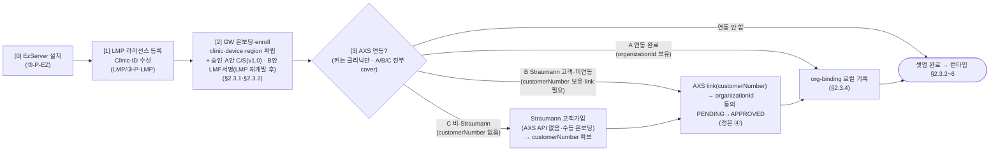

> **소유(정본) 분담**: [0] 설치=③-P-EZ · [1] 라이선스=LMP/③-P-LMP · [2] enroll·승인=§2.3.1 · [3] 연동 공통 레일(org_mapping·프록시)=§2.3.4 · **[3] AXS 내부 가입/구독 절차(상태 A/B/C 판정·동의 폴링·`customerNumber` 확보)=④ [Straumann AXS Sub-SRS](https://dev.azure.com/ewoosoft/es-platforms/_git/vt-api-gateway/docs/specs/04-subsrs-straumann-axs/Sub-SRS.md)**. 본 여정은 GW 관점 조망이며, 각 단계 상세는 링크된 정본을 따른다. 아래 「시나리오 발생 순서」는 이 여정을 GW 내부 기술 flow(§2.3.X) 관점으로 다시 편성한 것이다.

#### 시나리오 발생 순서 (lifecycle)

먼저 **§2.3.0(전 구간 라우팅 골격)** 이 이후 프록시·분배 시나리오가 공통으로 올라타는 토대다. 이어지는 §2.3.1~§2.3.7은 **실제 발생 순서에 맞춰 배치**했다: 온보딩(§2.3.1) → 디바이스 인증·토큰(§2.3.2) → 리전 해석·라우팅(§2.3.3) → 외부 연동 등록·호출(§2.3.4) → 파일 업로드(§2.3.5) → Webhook 수신·분배(§2.3.6) → **[횡단]** 버전 호환 게이팅(§2.3.7·모든 요청 경로에 적용).

- **셋업(1회)**: 온보딩(§2.3.1)으로 클리닉·디바이스·region 확립 → *(연동 쓸 클리닉만)* 외부 연동 켜기 = (선택)AXS 링크 + `org_mapping` 등록(§2.3.4 「연동 링크·org_mapping 생애주기」). **이 '등록'은 온보딩 직후 셋업 단계**로, 아래 런타임 호출·webhook보다 먼저다.
- **런타임(반복)**: 디바이스 인증·토큰(§2.3.2) → 리전 해석·라우팅(§2.3.3)을 전제로, 외부 연동 **호출**(§2.3.4 호출부)·파일 업로드(§2.3.5)·Webhook 분배(§2.3.6)가 요청마다 일어난다.

`org_mapping`이 정확히 언제 생기고(=[2b] 연동 켤 때) 어떻게 쓰이는지(송신·수신 양방향)는 **§2.3.4의 생애주기 다이어그램** 참조.

### 2.3.0 전 구간 라우팅 골격 (CleverOne → EzServer → GW → target) — ADR-11

본 절은 이후 시나리오가 **공통으로 올라타는 토대**다 — GW의 프록시·분배 시나리오(§2.3.4 외부 연동·§2.3.5 파일 업로드·§2.3.6 Webhook)가 모두 이 라우팅 골격 위에서 동작한다. 대표 경로 **`CleverOne → EzServer → GW → AXS`**(외부 target 호출)를 예로, **구간마다 target을 어떻게 지시하는지**를 보인다(ADR-11, 상세 §4.1.2·§4.5.1).

- **① CleverOne → EzServer (내부 구간 = 헤더).** CleverOne은 방화벽 안 EzServer에 요청하며 **`Vatech-Target: axs` 헤더**로 "어느 논리 서비스로 갈지"만 표명한다(대부분 평문 HTTP, 일부 self-signed HTTPS). 원서버 host·URL은 싣지 않는다.
- **② EzServer = 헤더 → 서브도메인 변환.** EzServer(nginx 리버스 프록시)가 헤더값 `axs`를 **`axs.gw.vatech.com` 서브도메인으로 변환**해 **HTTPS로 GW에 전달**한다(순정 nginx·제네릭 map, split-horizon DNS 불요; 평문→HTTPS 브리징). GW를 직접 호출하는 클라이언트(Console·클라우드)는 이 서브도메인을 처음부터 쓴다.
- **③ Proxy Router = 서브도메인(Host/SNI)으로 라우팅.** GW의 **`Proxy Router`**(§2.2 Control Plane)가 **Host 서브도메인 라벨**을 레지스트리(`target`)로 해석해 원서버 host를 정한다 — apex `gw.vatech.com`이면 **GW 고유 API(A)**, 등록된 `{target}.gw.vatech.com`이면 **프록시**, **미등록 라벨은 `404`**(SSRF 안전). 같은 컴포넌트가 **정책 집행 지점(PEP)** 으로서 인증(`Auth Service`)·버전 게이트(`API Compatibility Gate`)·정책(`Policy(OPA)`=PDP)·리전(`Region Resolver`)을 참조한다(§2.2). 리전은 서브도메인(어느 서비스)과 `Vatech-Clinic-Id`(어느 리전, §7.3)의 **직교 조합**으로 정한다.
- **④ 프로파일 적용 후 verbatim 전달.** `Proxy Router`가 **host만 바꿔 body를 그대로** 전달한다. **외부(C=AXS)** 는 **`External Connector`**(§2.2 Integration Plane·§7.5)가 **OAuth2 토큰·고정 egress IP**를 얹고, **내부(B=CleverSpace 등)** 는 내부망이라 `Proxy Router`가 `External Connector` 없이 통과+정규화 신원만 얹는다 — **경로·중계 방식은 동일, trust profile만 다르다**. 응답은 verbatim 통과하되 **GW가 *생성*한 오류만** 표준 envelope(502/503/504·`Vatech-Error-Origin: gateway`).

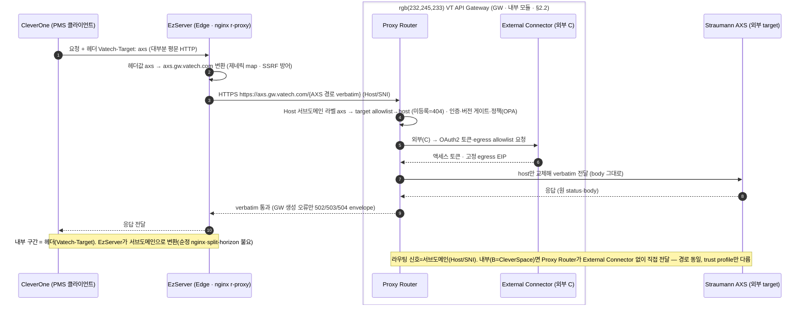

> **정리.** target 지시는 **구간마다 형태가 다르다** — CleverOne→EzServer는 **헤더(`Vatech-Target`)**, EzServer→GW(및 GW 직접 호출)는 **서브도메인(`{target}.gw.vatech.com`)**. **GW의 라우팅 신호는 오직 서브도메인**이며, 헤더는 EzServer가 서브도메인으로 바꾸기 위한 내부 hop 키일 뿐이다. `axs`를 `cleverspace`로 바꾸면 그대로 CleverSpace(내부 B) 호출 흐름이 된다(§2.3.5). Webhook(외부→GW)만 이 프록시 경로가 아니라 target 전용 수신 호스트로 들어오는 별개 흐름이다(§2.3.6).

#### 구간별 헤더 세트 (Vatech-* · 인증 · User-Agent)

target 지시(위)와 별개로 **식별·인증·관측 헤더**는 hop마다 실리는 내용이 다르다. `User-Agent`는 **모든 hop 공통(직전 송신자)** 이고, 머신 판정(버전 게이트·SW 인벤토리)은 `Vatech-*` 전용 헤더로 한다(§7.7.1). **GW→외부(AXS)로는 내부 `Vatech-*`를 전달하지 않고**(Roadmap §5.1) AXS가 요구하는 헤더로 교체한다.

| 헤더/항목 | ① CleverOne→EzServer (내부·평문) | ② EzServer→GW (edge·HTTPS) | ③a GW→AXS (외부 C) | ③b GW→CleverSpace (내부 B) |
| --- | --- | --- | --- | --- |
| `Vatech-Product/Version/OS` (originator) | **CleverOne**·버전·OS | ① 그대로 relay | **미전송** | 정규화 전달 |
| `Vatech-Clinic-Id` | ✓ | ✓ relay | 미전송 | 정규화 |
| `Vatech-Via` (경유 홉) | — | `EzServer/x` 누적 | 미전송 | (`VatechAPIGateway/x`) |
| **라우팅 지시** | `Vatech-Target: axs`(헤더) | **Host 서브도메인** `axs.gw.vatech.com` | GW가 host 결정(§4.1.2) | GW가 host 결정 |
| `Authorization` | (내부 hop·GW 인증 아님) | `Bearer <GW 발급 device 토큰>`(§7.1.1) | **`Bearer <AXS OAuth2>`**(client_credentials·External Connector·§7.1.3) | 내부 신뢰 |
| **대상 전용 헤더** | — | — | **`Organization-ID: <uuid>`**(AXS 필수·org_mapping) · `Content-Type`·`Accept` | — |
| `User-Agent` (기본·직전 송신자) | `CleverOne/x` | `EzServer/x` | `VatechAPIGateway/x` | `VatechAPIGateway/x` |
| **본문** | 원요청 | 원요청 | **verbatim**(AXS OpenAPI) | 통과+정규화 |

- **AXS(③a) 요구 헤더 근거**(`references/Straumann연동/AXS_docs/openapi`): `bearerAuth`(OAuth2 `client_credentials`·JWT Bearer)·**`Organization-ID`**(uuid·**required**·`OrganizationIdHeader`). GW의 `External Connector`가 토큰(§7.1.3)과 `Organization-ID`(org_mapping·§7.3)를 얹고 요청/응답 body는 verbatim bypass한다(§4.1.4 경로③). **내부 `Vatech-*`는 AXS로 전달하지 않는다**(Roadmap §5.1).
- **`User-Agent`는 전 hop 기본**(직전 송신자·로그·관측·하위호환). 단 **머신 판정(버전 게이트·SW 인벤토리 §7.8.5)은 `Vatech-*` 전용 헤더**로 하고 UA에 의존하지 않는다(중간 변형 취약·§7.7.1).
- **originator vs 경유 홉**: `Vatech-Product/Version/OS`는 항상 **요청 시작 주체**(CleverOne), `Vatech-Via`는 **거쳐 간 홉**(EzServer)이다. GW는 둘을 분리해 **더 낮은 버전 기준**으로 게이팅(§7.7.1)하고 **SW 인벤토리(§7.8.5)** 도 이 헤더에서 관측한다.

**Example — 대표 경로 `CleverOne → EzServer → GW → AXS`의 hop별 실제 헤더**(값은 예시):

```http
# ① CleverOne → EzServer   (내부·대개 평문 HTTP)
POST /axs/v1/orders HTTP/1.1
Host: ezserver.local
Vatech-Product: CleverOne
Vatech-Version: 1.5.5
Vatech-OS: Windows/11
Vatech-Clinic-Id: d3f1a9c07b6e4258af31c9d2e0b4a687
Vatech-Target: axs
User-Agent: CleverOne/1.5.5

# ② EzServer → GW   (edge·HTTPS·EzServer가 Vatech-Target→서브도메인 변환)
POST /v1/orders HTTP/1.1
Host: axs.gw.vatech.com
Vatech-Product: CleverOne            ; originator 그대로 relay
Vatech-Version: 1.5.5
Vatech-OS: Windows/11
Vatech-Clinic-Id: d3f1a9c07b6e4258af31c9d2e0b4a687
Vatech-Via: EzServer/6.5.0           ; 경유 홉 누적
Authorization: Bearer <GW 발급 device access token>   ; private_key_jwt로 발급(§7.1.1)
User-Agent: EzServer/6.5.0

# ③a GW → AXS   (외부 C·External Connector·verbatim bypass)
POST /v1/orders HTTP/1.1
Host: api.eu.axs.straumann.com
Authorization: Bearer <AXS OAuth2 access token>        ; client_credentials·GW 관리(§7.1.3)
Organization-ID: e407b34d-c4b0-4db3-bbcd-cc11770eae7b  ; AXS 필수(uuid·org_mapping)
Content-Type: application/json
Accept: application/json
User-Agent: VatechAPIGateway/1.0.0
;  ← 내부 Vatech-* 는 외부로 전송하지 않음(Roadmap §5.1)

# ③b GW → CleverSpace   (내부 B·target=cleverspace·②의 Host만 cleverspace.gw.vatech.com)
POST /... HTTP/1.1
Host: <cleverspace 내부 host>
Vatech-Product: CleverOne            ; 정규화 신원 전달(외부와 달리 유지)
Vatech-Version: 1.5.5
Vatech-OS: Windows/11
Vatech-Clinic-Id: d3f1a9c07b6e4258af31c9d2e0b4a687
Vatech-Via: EzServer/6.5.0           ; (VatechAPIGateway/1.0.0도 홉으로 누적 가능)
User-Agent: VatechAPIGateway/1.0.0
;  ← 내부라 AXS OAuth·Organization-ID 없음(External Connector 미개입)
```

> **③a(외부) vs ③b(내부) 차이만**: 외부는 `Vatech-*` 미전송 + AXS OAuth Bearer·`Organization-ID` 부착(verbatim), 내부는 `Vatech-*` 정규화 전달 + 내부 자격(OAuth 미부착). 그 외 ①②는 동일.

### 2.3.1 온보딩 — EzServer enrollment (클리닉·region 확립 포함) — FR-ENR-\* · FR-RGN-\*

온보딩은 **EzServer enrollment 한 흐름**이다 — 디바이스 머신 신뢰와 **그 클리닉의 존재·초기 region 확립**을 함께 처리한다(별도 "클리닉 등록" 전용 흐름·API 없음 — enroll이 흡수). enrollment은 **최초 1회**(재설치 시 재-enroll 회전, §7.2.7)이고, **region *변경*은 온보딩 이후의 별도 관심사**다(§2.3.3·§7.3.4·FR-RGN-04).

- **부트스트랩 신뢰 = LM 라이선스·Clinic-ID.** EzServer는 설치 시 LMP에서 받은 **Clinic-ID를 enroll 요청에 실어** 보낸다. GW가 라이선스·Clinic-ID로 "정당한 그 클리닉의 EzServer"를 검증한다(공장 토큰/OOB 미도입). **라이선스 등록 흐름에 enroll을 태워 설치자 개입을 최소화**한다(편의 — LMP Clinic-ID 수신 시 자동 enroll, Appendix B #17).
- **클리닉·region 확립(enroll 흡수).** GW는 검증 후 그 Clinic-ID의 **clinic을 없으면 생성(upsert)** 하고 디바이스를 `pending`으로 등록한다. **region 기본값 = enroll 요청이 GeoDNS로 도달한 최근접 리전**(§2.7.1; v1.0은 단일 리전이라 항상 서울). **C/S는 현장에서 `GET /v1/regions` 선택지로 다른 region을 지정**해 enroll할 수 있다(기본값 override).
- **활성화 게이트 = C/S 승인.** enroll 완료 디바이스는 `pending`(인증 불가) → **현장 설치를 담당한 C/S가 GW Console에서 승인**(설치 확인 + region 확정/override) → `active`. 사람 승인이 부트스트랩 신뢰 앵커라 Clinic-ID 위·변조 가짜 등록을 현장 검증으로 차단한다(§7.2.3·§7.9.2). 따라서 **GW Console 사용자는 Admin과 C/S**이며, **C/S는 enrollment 승인 권한을 가진다**.
- **키페어·인증 바인딩.** EzServer가 키페어를 생성해 **nonce를 개인키로 서명(소지 증명)** 하고 **공개키(`client_public_key`)** 를 바인딩한다(§7.2.6). 이후 인증은 이 키로 **private_key_jwt**(§2.3.2·§7.1.1·ADR-13, 공유 secret 없음). **개인키는 디바이스를 떠나지 않으며 백업(export)하지 않는다** — 재설치·**개인키 분실·손상**으로 키가 바뀌면 재-enroll로 회전해 복구한다(라이선스·Clinic-ID 재검증 + C/S 승인 + 기존 revoke·제한·감사, §7.2.6·§7.2.7). 개인키 at-rest 안전 보관은 EzServer(③-P-EZ) 책임.
- **무인증 enroll abuse 방지.** `/enroll/start`는 bearer가 없다(디바이스 신원 형성 전이라 정상 — OAuth DCR·ACME류). 단 무방비가 아니다: **① rate-limit(IP/서브넷당·§7.1.1 `gw:rl`)** 폭주 차단 · **② 미승인 `pending`은 TTL 후 자동 만료**(기본 **7일**·config·Appendix B #43 · 스팸 누적·C/S 승인 큐 오염 방지) · **③ 승인 게이트(신뢰 앵커)** — 잡건은 절대 `active` 불가·토큰 발급 불가라 escalation 없음(승인 flow A/B는 아래·Appendix B #42). 최악은 DoS·잡음(pending 스팸·Clinic-ID enumeration)이며 위 방어로 억제한다.
- **등록 주체 = 클리닉당 1개 EzServer**(Appendix B #17). 외부 연동(AXS 등)은 **켤 때만** 그 target의 Org-ID(Straumann 온보딩 발급, §2.3.4·④)를 등록해 `org_mapping`((target, Org-ID)→clinic)을 채우며, 온보딩과 무관하다(연동 안 해도 클리닉·디바이스는 정상).

> **enroll 승인 flow는 두 가지가 공존한다**(택일 아님): **A. C/S 수동 승인**(모든 device·v1.0 현행), **B. 제3자(LMP) 서명 자동승인**(LMP 라이선스 등록 device·gw/1.1+). **둘 다 스펙에 유지**하되 **확정: A=v1.0 · B=v1.0 미지원(LMP 재개발 후 적용)** — 현 LMP 문제로 재개발 예정이라 B는 그 후. A=보편/fallback · B=LMP 등록 device 편의.
>
> **(A안) C/S 수동 승인 — v1.0 현행**

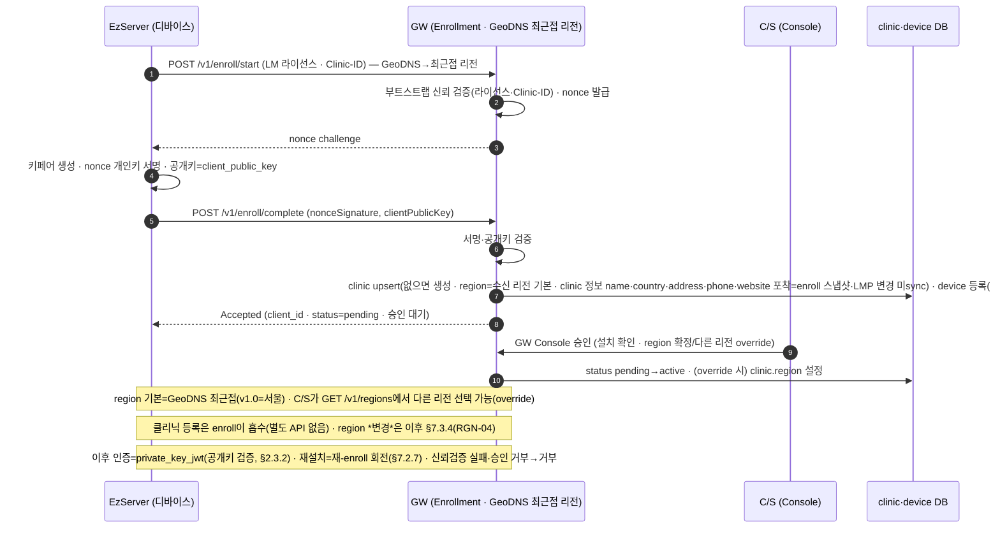

> **(B안) 제3자(LMP) 서명 자동승인 — LMP 라이선스 등록 device · v1.0 미지원 · LMP 재개발 후 적용 (확정·Appendix B #42)** — 아래 flow는 스펙에 유지하되 v1.0 미구현

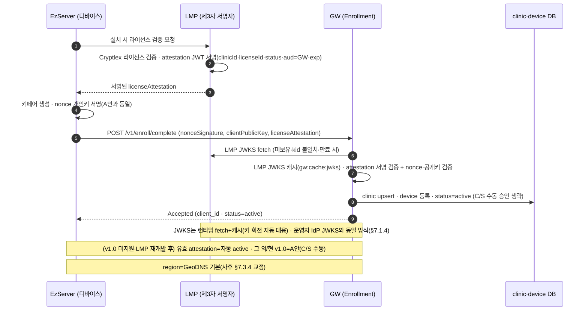

### 2.3.2 EzServer(디바이스) 인증·토큰 발급 — FR-AUTH-01/05

등록된 EzServer(디바이스, §1.4)가 작업 전 단명 access token을 발급받는다. **인증 = 비대칭 `private_key_jwt`**(공유 secret 없음) — 디바이스가 **개인키로 서명한 assertion(JWT)** 을 제시하면 GW가 **enrollment에서 등록한 공개키(`device.client_public_key`)로 서명을 검증**한다(§7.1.1·ADR-13). 검증 후 lifecycle·allowlist를 확인하고, claim(`deviceId`·`region`·`aud`·`TTL`)을 강제 바인딩한 access token을 발급한다. 디바이스는 그 토큰을 **이후 API 호출의 Bearer로 사용**하고, 만료되면 개인키로 다시 서명해 재발급받는다. revoked 디바이스는 캐시 TTL과 무관하게 즉시 차단(§7.2.4). **갱신은 refresh token이 아니라 개인키 재서명 재발급**(§7.1.1 — 단명+즉시 revocation 모델). 상세는 §7.1.1.

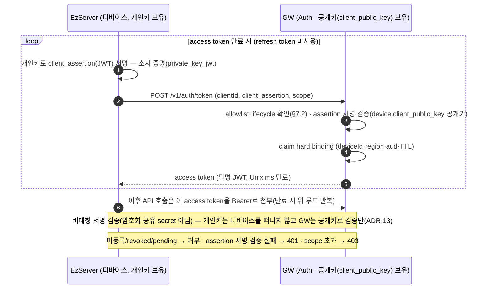

### 2.3.3 리전 해석·라우팅 — FR-RGN-\*

인증된 호출자가 작업(업로드·연동) 직전 device/clinic→region을 해석해 **리전 ID·표시명·endpoint·운영상태·귀결 clinicId·mappingVersion·캐시 TTL·주권 정책**을 받는다(`Clinic`). `deviceId`·`clinicId`는 동일 resolver가 같은 리전으로 귀결(ADR-10)한다. PHI는 해석된 리전 밖으로 이동하지 않는다(OPA, §7.3.3). 상세는 §7.3, 흐름은 ARD §5.2.

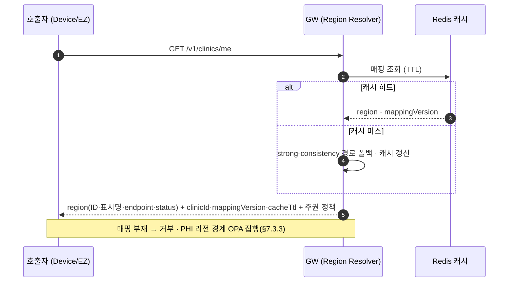

### 2.3.4 외부 연동 — 등록(Admin)·호출(presign·파일 bypass) (경로③, 갈래 A) — FR-INT-\*

**§4.1.4 경로③ 전용 (외부(C) 프록시).** EzServer→AXS 외부 연동(5단계 갈래 A). 클라이언트는 **`axs.gw.vatech.com` 서브도메인**으로 AXS 경로를 **그대로** 호출하고(§4.1.2 — CleverOne→EzServer 구간은 `Vatech-Target: axs` 헤더로 지시하면 EzServer가 서브도메인으로 변환), GW는 connector로 OAuth2 토큰을 관리(§7.1.3)·egress allowlist를 집행(§7.5.3)하되 요청/응답 body는 **AXS OpenAPI 그대로 통과(verbatim bypass)** 한다 — GW가 발급하거나 해석·변환하지 않는다. 대용량은 AXS가 발급한 presigned로 **AXS S3에 직접** 업로드(GW 미경유). 연동 의미·Org-ID 매핑 상세는 **④ Sub-SRS**, 본 SRS는 프레임워크·egress까지만. 상세는 §7.5.

**연동 등록(사전 — Admin/Console ③-C).** 아래 런타임 호출이 되려면 그 전에 target을 **등록**해야 한다. Admin이 GW Console에서 **`target` 1 레코드**(라우팅+아웃바운드 자격+인바운드 webhook 수신)를 등록하고 정책(`policy`)을 설정한다(관리 API §7.9·등록 레코드/화면 가이드=③-C `_status.md`). 자격·시크릿은 KMS에 저장하고 DB엔 참조만 둔다. **등록 순서는 클리닉 enroll과 무관**하다(target-first=AXS / clinic-first=운영 중 새 target 추가 둘 다 동일). `org_mapping`은 이 연동을 **실제 쓰는 클리닉이 붙을 때** 자가 등록된다. **분배 경로는 저장 레코드가 아니라 규약 도출**(clinic→MQTT 토픽 `gw/clinic/{clinicId}/webhook`·§7.6.6)이라, 새 target를 붙여도 클리닉별로 만들 delivery 레코드가 없다(별도 테이블 없음). 여러 테이블에 걸친 다중 쓰기라 원자성(트랜잭션/saga)은 LLD.

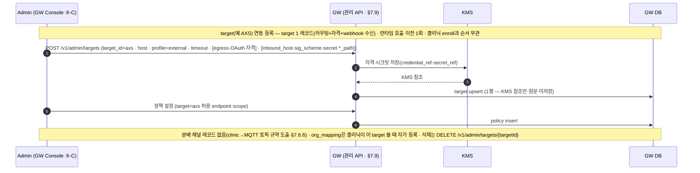

#### 연동 링크·`org_mapping` 생애주기 (AXS 기준) — 언제 생기고·어디서 쓰나

앞의 [1] target 등록(운영자·전역 1회)과 달리, **클리닉이 그 연동을 실제 켤 때** `org_mapping`(외부 Org-ID ↔ clinic_id) 한 행이 생긴다. 여기서 **두 가지를 분리**해야 한다(오해가 잦은 지점):

- **(로컬) `org_mapping` 등록 = `POST /v1/clinics/me/org-bindings`** — GW **DB에 매핑 한 행을 기록**할 뿐 **AXS를 호출하지 않는다**. GW가 라우팅/분배에 쓰는 로컬 지식이다(모든 target 공통).
- **(원격) AXS 연동 링크 = AXS Organization API 호출** — AXS 쪽에 "이 조직을 우리 integrating entity와 연결"하는 것으로, **별개의 프록시 호출**(`Vatech-Target: axs` 경로③·External Connector가 OAuth 부착)이다. AXS 문서 기준 `POST /v1/organization/integration/link`(`customerNumber` + integrating entity=Client ID) → `organizationId` + **org-admin 동의**(status `PENDING`→`APPROVED`, Data Reader 동의 요건)로 완료된다. **AXS/Straumann 어느 쪽도 "조직(고객) 생성" API를 제공하지 않는다** — `link`는 **이미 존재하는** AXS Organization(=Straumann 고객·`customerNumber` 보유)을 우리 integrating entity에 **연결**할 뿐이다(AXS 경로는 link/check/unlink/info 4개뿐, 조직 생성 없음·`organization.yml` 전수 확인). 보조 API: `.../integration/check`(연결 확인)·`.../integration/{customerNumber}/info`(region·countryCode).

처리는 클리닉 **가입 상태 A/B/C**(§1.4 용어·아래 표 정의)로 나뉜다 — **GW는 A/B/C를 모두 cover**한다(A 무처리·B API 링크·C 비-API 선행 후 B). 상태 판정·현장 분포=④(Sub-SRS).

> **[개발자 필수정보] AXS 가입 — 선행조건 1 + 클리닉 케이스 A/B/C (AXS 문서 근거).** AXS 문서 전수 확인 결과 **조직/고객 생성 API는 없다**(org 경로=link/check/unlink/info 4개뿐). "가입"은 아래처럼 **전 클리닉 공통 선행조건(파트너 등록)** 과 **클리닉 가입 상태별 처리(A/B/C)** 로 나뉜다.
>
> **선행조건 (전 클리닉 공통·1회·비-API) — GW→AXS 통합 파트너 등록.** 케이스가 아니라 A/B/C 셋 다의 공통 전제다. 이메일 `support-axs@straumann.com`에 **full name · company name(Vatech) · developer account email · application name(integration name) · intended roles/API calls** 제출 → AXS whitelist → **`client_id`+`client_secret`**(OAuth2 `client_credentials`·B2C 토큰 EP) 발급 → GW가 KMS 보관(`target.credential_ref`). 이 `client_id`가 link의 `integratingEntityId`다. **이게 없으면 어떤 클리닉도 AXS를 호출할 수 없다.** (근거 `getting-started.md`·`authentication.md`)
>
> **클리닉 가입 상태별 처리 (A/B/C 순서):**
>
> | 케이스 | 클리닉 상태 | GW가 하는 일 | **AXS API 호출?** | 클리닉에서 받을 정보 | 산출 |
> |---|---|---|---|---|---|
> | **A** | Straumann+AXS — **이미 연동**(`organizationId` 보유·consent APPROVED) | **org-binding 로컬 기록만** | ❌ **없음** — 이미 link 완료 | `organizationId`(이미 보유 — 획득 경로는 ④) | `org_mapping` 1행 |
> | **B** | Straumann 고객 — `customerNumber` 보유·**미연동** | **AXS `link` 호출** → `organizationId` 획득 → org-binding | ✅ **`link` (유일한 AXS API 액션)** | **`customerNumber`** (GW가 클리닉에서 수집할 유일한 신규 입력) + `integratingEntityId`(=선행조건·GW 보유) | `organizationId`(uuid)·`organizationIntegrationId`·`consentVersion`·`status`(`PENDING`→org-admin 동의→`APPROVED`) → `org_mapping` |
> | **C** | 비-Straumann — `customerNumber` **없음** | (자동화 불가) **Straumann 고객가입 선행**(아래) → `customerNumber` 확보 → **B와 동일** | ❌ **API 없음** — Straumann 고객가입은 수동 | (선행) Straumann 온보딩 산출물 → `customerNumber` | (B로 수렴) |
>
> **C 케이스 가입 방법 (Straumann 고객가입 = 비-API·수동).** AXS 문서에는 **고객(조직) 생성 절차·API가 없다** — 이는 AXS 연동이 아니라 **Straumann 본사와의 비즈니스 온보딩**이다. 실무 경로: **① Straumann 영업/파트너 채널에 고객 등록 요청**(제품 계약·법인/클리닉 정보 제출) → **② Straumann이 고객 계정 개설 + `customerNumber` 발급**(=AXS Organization의 자연키) → **③ 그 `customerNumber`로 B 경로(link) 진입**. GW는 이 절차를 **대행·자동화할 수 없고**, 클리닉을 "비-Straumann(C)" 상태로 인지·안내하며 `customerNumber` 확보 시점에 B를 실행한다. (구체 온보딩 서식·담당 창구·리드타임은 Straumann 영업 소관 — ④ `customerNumber` 확보 경로(영업/④ · Appendix B #45)와 연계.)
>
> **정리 — 케이스별 API 가능 여부:** **A**=AXS 호출 없음(이미 연동 → GW 자체 org-binding만) · **B**=AXS `link` **자동 호출**(유일한 AXS API) · **C**=API 없음(수동 Straumann 가입 후 B). 즉 **AXS를 API로 부르는 건 B 하나**, **자동화 불가한 건 C 하나**다.
>
> **GW 스키마 영향 없음**: B의 `link`는 기존 프록시 레일(`axs.gw.vatech.com` verbatim), org-binding(A·B 공통)은 기존 `org-bindings` API, `customerNumber`는 **통과값**(GW 미저장), client_id/secret은 `target(axs).credential_ref`(KMS). C는 API가 없어 엔드포인트/컬럼 신설이 없다 — **A/B/C cover에 GW core 신규 스키마 불요**. AXS 고유 시퀀스(동의 폴링·상태 판정)=**④**.

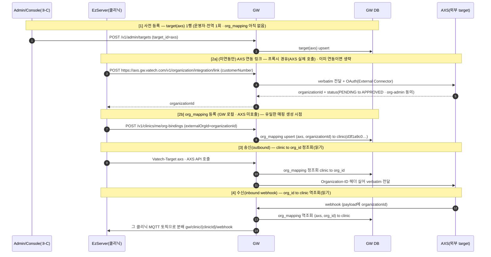

> **enroll과의 순서**: `org_mapping`은 clinic_id를 참조하므로 **[2b]는 온보딩(enroll·§2.3.1)으로 clinic이 존재한 뒤**라야 한다. 그 외 enroll과 연동은 독립이다(연동 안 하면 org_mapping 없음). 해지는 `DELETE /v1/admin/org-mappings`(로컬)로 그 행만 제거하며, AXS 쪽 해제가 필요하면 `.../integration/unlink`를 프록시로 호출한다.
>
> **GW 공통 vs ④ AXS Sub-SRS 분담**: 본 SRS(GW)는 **공통**만 정한다 — ① `org_mapping` 테이블 + org-bindings API(로컬 매핑) · ② AXS Organization API를 **탈 수 있는 프록시 레일**(target `axs` + External Connector · 특정 엔드포인트 하드코딩 없음). **AXS 고유 시퀀스**(link/check/unlink/info 절차, 동의 `PENDING`→`APPROVED` 폴링·`customerNumber` 확보·트리거 주체·organizationId→clinic 반영·region/countryCode 활용, 상태 A/B/C 판정)는 **④ Straumann(AXS) Sub-SRS**에서 구체화한다.


> **경로 동일성**: 본 흐름(`EZ→GW→target`)은 **CleverSpace(B 내부)도 동일**하다(ADR-11 target-routed proxy). AXS(C 외부)는 GW가 **OAuth·고정 egress IP**를 추가할 뿐 경로·중계 방식은 같다. 즉 본 시나리오는 AXS를 예로 든 *일반 target proxy*이며, CleverSpace는 `cleverspace.gw.vatech.com`으로 같은 경로를 탄다(차이는 trust profile뿐).

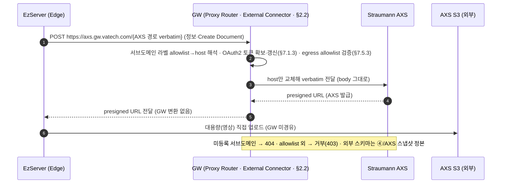

### 2.3.5 파일 업로드 — presigned 중계 (target-무관 · 발급=target)

**GW는 presigned를 발급하지 않으며, presigned 중계는 특정 target에 묶이지 않는다(target-무관).** 대용량 파일(CT·영상)은 **발급 target가 발급한 presigned로 그 target storage에 직접** 업로드하고, GW는 발급 요청을 **해당 target 서브도메인(`{target}.gw.vatech.com`)으로 verbatim 중계**(target-routed proxy, ADR-11)만 한다 — body를 해석·변환·서명하지 않는다. 업로드 **세션·resumable·멱등·무결성·완료처리는 발급 target 책임**(GW는 소유하지 않음). **신규 target = 레지스트리 1행**(코드·경로 변경 0, §4.1.2).

- **현재 대상 target**: **CleverSpace**(경로②·**B 내부** — 내부망, connector 불요) · **AXS**(경로③·**C 외부** — OAuth2·고정 egress를 **connector**가 추가, §2.3.4·§7.5). 향후 target도 동일.
- **경로·중계 방식은 target 무관 동일**하고, **차이는 trust profile뿐**(C만 connector로 OAuth·egress 추가). 아래는 CleverSpace(B 내부) 예시이며, AXS(C 외부)는 같은 경로에 connector를 얹는다(§2.3.4). 상세 §7.4·§4.1.4.

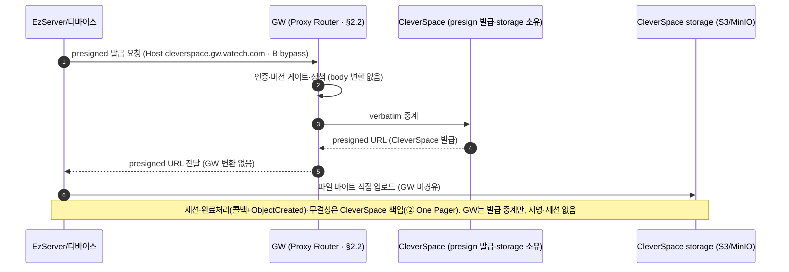

### 2.3.6 Webhook 수신·분배 — FR-WH-\*

외부(AXS)가 **target별 전용 호스트**(`axs.webhook.gw.vatech.com`)로 이벤트를 push하면, GW가 **Host/SNI로 발신자를 식별**(→그 target의 시크릿 선택)하고 **HMAC·timestamp 검증·eventId 멱등** 후 즉시 ACK하고 대상별로 분배한다(store-and-forward, ADR-09). 클라우드는 HTTP push, 방화벽 뒤 Edge(EzServer)는 MQTT QoS1 역방향. **발신자 식별은 수신 호스트(우리가 통제)로, 목적지(분배 대상)는 Org-ID↔ClinicID 매핑(§7.3)으로** 결정한다 — 둘 다 송신 source IP에 의존하지 않으며, **Host는 식별이지 인증이 아니다**(인증=HMAC). 수신 계약은 GW 고유 API(A), payload는 외부 참조(§4.1.3). 상세는 §7.6.

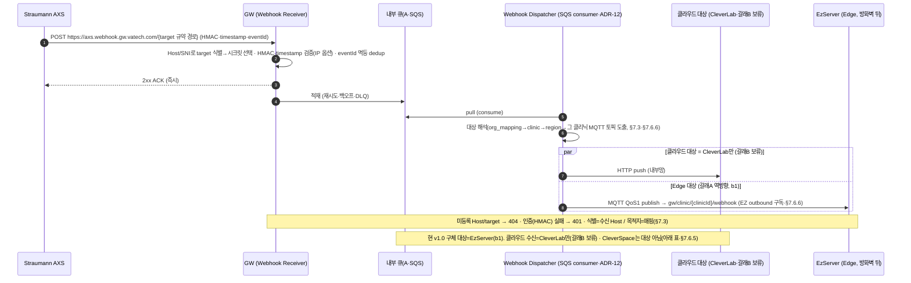

#### 분배 대상별 시나리오 (어느 서버가 어떤 Webhook을 받나)

Webhook은 **외부 서비스(현재 AXS)가 보낸 이벤트**를 GW가 받아, 그 이벤트가 향하는 **내부 대상**으로 분배한다(대상은 Org-ID↔ClinicID 매핑, §7.3). 대상별 시나리오·메커니즘·현 상태는 다음과 같다. **불명확한 항목은 소유 문서(④·PM)에 위임을 명시한다.**

| 분배 대상 | 어떤 이벤트를 받나(시나리오) | 메커니즘 | 현 상태 |
| --- | --- | --- | --- |
| **EzServer (Edge)** | 클리닉의 AXS 연동(**갈래 A**) **역방향** — 그 클리닉의 환자·파일·오더 상태 등 AXS가 통지하는 결과를 방화벽 뒤 EzServer로 | **MQTT QoS1**(EZ outbound 구독) | **역방향 capability는 b1(v1.0)에 포함**(WH-06·ARD v0.9·§7.6.6). 단 갈래 A의 _데이터_ 1차 범위는 EZ→AXS 단방향이며, **역방향으로 보낼 대상 이벤트 목록·활성화 세부는 ④ Sub-SRS에서 확정**(Roadmap §3.7.1) |
| **CleverLab (클라우드)** | 기공소 주문 연동(**갈래 B**) — Straumann Scan SW→AXS로 들어온 **기공 오더 전송·확정 결과**를 CleverLab로 | **HTTP push**(내부망) | **갈래 B — 현 시점 범위 외(보류, §1.2).** **갈래 B 활성화 여부·시점은 PM/제품이 결정**(보류·§1.2). 활성화 시 받을 이벤트(오더·확정 결과)는 ④ |
| **CleverSpace (클라우드)** | **해당 없음 — CleverSpace는 Webhook 수신 대상이 아니다**(내부(B) 프록시·presigned 백엔드일 뿐, AXS 이벤트 수신처 아님) | — | **N/A (확정).** 클라우드 webhook 수신은 CleverLab만(갈래 B). 결정 2026-06-23 |

> 정리: v1.0 구체적 분배 대상 = **EzServer(갈래A 역방향)**, 클라우드 수신 = **CleverLab만(갈래B·보류)**, **CleverSpace는 대상 아님**. 이벤트 종류·대상 매핑=④(갈래B 활성화 미결=Appendix B).

### 2.3.7 버전 호환 게이팅 — FR-COMPAT-\*

`Vatech-*` 헤더로 originator(요청 시작 주체)와 경유 홉(`Vatech-Via`)을 분리 판정하고, GW core가 **AppConfig agent에서 읽어 캐시한 호환성 매트릭스**(§7.7.5)와 대조해 **더 낮은 버전 기준**으로 게이팅한다. 미지원이면 표준 오류코드와 "업데이트 필요" fallback을 안내해 원인불명 실패를 제거(ADR-07)한다. 상세는 §7.7. 아래는 **① 매트릭스 발행(build-time)** 과 **② 런타임 게이팅** 두 흐름이다 — 발행은 CI/ops 흐름이라 런타임 시나리오(§2.3.1~7)와 범주가 달라 별도 번호(§2.3.8)를 주지 않고 본 절에 함께 둔다.

#### ① 매트릭스 발행 파이프라인 (build-time)

`compat-matrix.yaml`(원본·git)을 **Azure Pipeline이 AWS CLI로** 검증·렌더해 `server-configuration.json`을 **AWS AppConfig에 발행**한다(§7.7.5). GW core는 이미지에 굽지 않고 런타임에 **AppConfig Agent(사이드카)** 로 읽으므로 **매트릭스만 바뀌면 앱 재배포 0**(앱 build/deploy는 `config/**` 제외·path-scoped). AppConfig는 **배포 전 JSON Schema 검증·점진 롤아웃·경보 자동 롤백**을 제공한다(안전 크리티컬 매트릭스 보호).

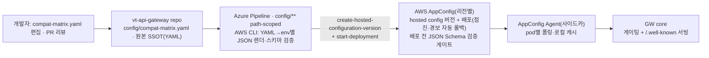

#### ② 런타임 게이팅

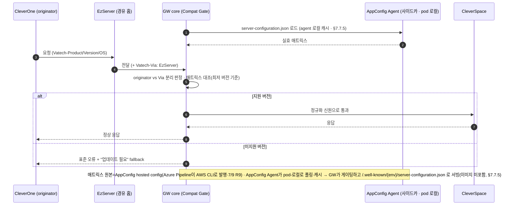

### 2.3.8 운영자·Console 인증 (직원 IdP OIDC) — FR-AUTH-08/09·FR-ADM-02

GW Console 사용자(Admin·C/S)은 **사내 직원**이라 **직원 IdP(MS365/Entra ID) OIDC**로 로그인한다(§7.1.4). GW는 IdP 발급 토큰을 검증(authN)하고, **역할·인가(authz)는 GW 자체**(`operator_role`·§7.9.2·A) — Entra는 SSO만. device 인증(private_key_jwt·§2.3.2)과 분리 면(ADR-08). GW는 **자체 비밀번호는 두지 않되**(SSO), authz용 `operator`·`operator_role` 테이블은 둔다(§7.9.2).

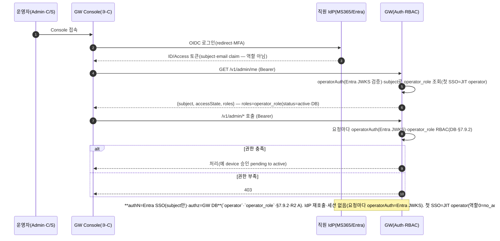

> **A 확정 — authN=Entra SSO(직원 IdP)·authz=GW 자체(`operator_role`)**(Appendix B #38). **OIDC 토큰 검증은 별도 endpoint가 아니라 모든 `/v1/admin/*`의 `operatorAuth`(Entra JWKS)** 로 이뤄지므로 전용 verify 경로가 없다 — Console은 로그인 후 신원·역할이 필요하면 `GET /v1/admin/me`(subject=토큰·역할=`operator_role` DB 조회).

## 2.4 Product Functions (제품 주요 기능)

> 7장 대분류와 1:1 매핑.

- 7.1 인증·토큰 (EzServer 머신 인증 + 사람=직원 IdP 연계)
- 7.2 EzServer(디바이스) 레지스트리·온보딩
- 7.3 리전·라우팅·주권 (라우팅 키 통합)
- 7.4 파일 업로드 — presigned 중계(GW 비발급)
- 7.5 외부 연동·Connector 프레임워크
- 7.6 Webhook 수신·이벤트 분배
- 7.7 API 버전 호환성 게이트
- 7.8 Fleet 운영·Config
- 7.9 관리·감사·컴플라이언스

## 2.5 User Classes and Characteristics (사용자 계층과 특징)

| 계층                            | 사용 빈도 | 주 사용 기능                              | 권한                 | 중요도 |
| ------------------------------- | --------- | ----------------------------------------- | -------------------- | ------ |
| EzServer(디바이스, §1.4)        | 상시      | 인증·파일 업로드(target presign)·config | 머신(디바이스 scope) | 핵심   |
| 사내 호출자(EzServer/CleverOne) | 상시      | 인증·라우팅·Webhook 수신                  | device=private_key_jwt(§7.1.1) | 핵심   |
| 외부 플랫폼(AXS)                | 이벤트 시 | Webhook·connector                         | 외부(OAuth2)         | 핵심   |
| 운영자/Admin                    | 일/주     | 관리 API·매핑·kill-switch                 | RBAC                 | 중요   |
| C/S(현장 설치 담당)             | 설치 시   | enrollment 승인(`pending→active`)·클리닉 등록 조회 | RBAC(승인 write, §7.9.2) | 핵심   |
| 인프라/DevOps                   | 배포 시   | IaC·관측·로그                             | 시스템               | 중요   |

## 2.6 Assumptions and Dependencies (가정과 종속 관계)

- **AXS sandbox 자격증명·OAuth Client** — Straumann이 제공하기를 기다린다. 미수령 시 §7.5 connector E2E와 ④ Sub-SRS 검증이 지연된다.
- **GW 인프라(K8s·Route 53 GeoDNS·고정 egress IP 집합·DNS 호스트)** — 인프라 담당이 별도로 구축하며, 본 SRS는 계획·요구만 기술한다(미확정 시 §3·§4.5·§7.3에 영향). **고정 egress IP는 단일 IP가 아니라 AZ/리전별 NAT의 고정 EIP 집합**(멀티 서버·멀티 리전)이며, AXS는 그 **합집합을 whitelist**한다. 오토스케일·새 AZ·리전 증설로 whitelist에 없는 egress IP가 생기지 않도록 EIP 풀에 핀(pin)하고, 증설 시 Straumann과 협의해 갱신한다(§2.1.1).
- **MQTT 브로커 운영 주체 = 인프라/운영이 확정**(Appendix B #4 · 영향: §7.6·ARD MQTT Broker)
- **CleverOne SRS(Nick)** — 클라이언트 식별 헤더 상세를 담는다. 미확보 시 §7.7 정밀화가 제약된다.

## 2.7 Apportioning of Requirements (단계별 요구사항)

| 버전 | 범위 | Roadmap 단계 |
| --- | --- | --- |
| gw/1.0 (MVP) | 인증 코어·레지스트리·enrollment·단일 리전 주권·presigned 중계·AXS connector(**v1.0=Straumann IO Scanner 한정·7/9**)·fleet 기본·config·감사/RBAC(경량)·Webhook·COMPAT·라우팅 키 통합 | 1·2·3·(4 일부)·5 |
| gw/1.1 | DPoP+HW키·hardware attestation·fleet 확장·2nd connector | 후속 |
| gw/1.2 | 멀티 리전 활성화(Aurora Global DB·GeoDNS N리전, §2.7.1) | 4단계(후행 시) |
| v2.0 | 레거시 10만대 마이그레이션 | 후속 트랙 |

> **v1.0 AXS 연동 범위 = Straumann IO(IntraOral) Scanner만 (7/9 결정).** 시간 제약상 5단계(Straumann) 연동의 v1.0 1차 범위를 **IO Scanner로 한정**하고, **CleverOne 연동은 v1.0에서 제외 → 후속 버전(적절 시점)의 originator 확장**으로 편입한다. **GW 기본 계약(COMPAT 게이팅·인증·라우팅·target 프록시)은 originator 무관 공통 토대라 v1.0 포함**(IO Scanner·CleverOne 공통). **IO Scanner↔EzServer 연동 방식은 미정**(추후 확정) — 확정 전까지 관련 ③-P-EZ 부분은 그 시점에 구체화하고, IO Scanner에 불필요한 스펙은 최대한 후행한다(우선순위·담당=Agenda Gantt·개발 Roadmap §3.9). 제품 스펙 초안 주체: **CleverOne=Nick·EzServer=Thomas**(GW는 표준만 제공).

### 2.7.1 리전 구축 단계화 — 단일(1차) → 멀티(2차), 단 v1.0부터 멀티리전-ready

**리전 구축은 2단계다 — 1차 단일 리전(gw/1.0) · 2차 멀티 리전(gw/1.2).** v1.0은 **단일 리전만 실제 배포**한다(멀티 리전 동시 운영·active-active·다중 signer는 v1.0 범위 밖, FR-RGN-05). 단, **v1.0부터 "멀티리전-ready"로 설계**하여 2차 확장이 _재설계·데이터 마이그레이션 없이 설정·배포 증분_(리전 수 1→N)으로 가능해야 한다. 이 "단일로 시작하되 멀티로 자라는" 설계는 **v1.0의 요구사항**이다(결정 — Appendix A, 2026-06-23. 기존 "gw/1.0 흡수 여부 TBD"를 대체).

**멀티리전-ready 설계 요건 (v1.0 단일 리전에서도 미리 갖춘다):**

| 요소 | v1.0(단일 리전)에서 미리 갖출 것 | 2차(멀티) 확장 시 |
| --- | --- | --- |
| **데이터 모델** | 전역 일관 vs 리전 로컬 분리(§2.1.1·§6.4), `region`·`mapping_version`·ClinicID↔region 키 보유(값은 단일 리전) | 매핑 행 추가 — 스키마 변경 없음 |
| **Region Resolver** | device/clinic→region resolver를 v1.0부터 경유(단일 리전으로 해석, ADR-10·§7.3.1) | resolver 매핑만 확장 |
| **DNS** | **apex(`gw.vatech.com`)·프록시 target(`*.gw.vatech.com`)·webhook 호스트(`{target}.webhook.gw.vatech.com`) 모두 v1.0부터 GeoDNS 라우팅**으로 구축(대상=서울 1개로 resolve), 클라이언트는 공개 호스트만 호출·리전 내부 호스트는 예약(§4.5.1) | **record 타입·클라이언트 변경 없이** GeoDNS 라우팅 대상만 N리전으로 추가(§7.3.5) |
| **egress** | NAT EIP **집합** 패턴(§2.1.1) — 단일 리전=1집합 | 집합 합집합 — 외부 whitelist 갱신 |
| **데이터 주권** | PHI 리전 경계 집행을 v1.0부터(OPA, §7.3.3) | 리전별 경계 그대로 적용 |

> **금지**: 단일 리전을 전제한 하드코딩(리전 고정 endpoint·단일 DB 가정·apex 없이 리전 호스트 직접 노출 등)으로 2차에 재작업이 생기지 않게 한다. (presign·storage는 GW 비소유·중계만이라 GW엔 presign broker가 없다 — FR-SES-06 해당 없음, §7.4·§7.4 FR-SES 매핑.)

## 2.8 Backward compatibility (하위 호환성)

GW 본체는 신규 구축이나, **기존 클라이언트(구버전 CleverOne/EzServer)와 경로 B**에 대한 호환 정책이 필요하다.

- **호환 대상** — 구버전 클라이언트는 well-known 버전 공시와 오류코드 fallback으로 흡수한다(§7.7).
- **호환 포기** — 경로 B는 Deprecated를 거쳐 EOS(서비스 종료)한다. 시점은 **PM(제품)이 확정**한다(Appendix B #3 · 영향: §7.6·① One Pager).
- **호환 매트릭스**(클라이언트×API 최소버전) — **① 운영 호환성 매트릭스 확정본에 의존**(Appendix B #8).

---

# 3 Environment (환경)

## 3.1 Operating Environment (운영 환경)

GW는 **개발(dev) · 테스트(test/staging) · 운영(prod) 3종 환경**으로 분리한다. 본 절(§3.1.1·§3.1.2)은 **운영(프로덕션) 런타임**이 기준이고, **개발 환경은 §3.4·테스트 환경은 §3.5**가 상세를 정의한다. 핵심은 **외부 의존(AXS·EzServer·CleverSpace·LMP)을 환경별로 실서비스/sandbox/스텁 중 무엇으로 대체하느냐**이며(§3.4 에뮬레이션 전략), **PHI는 운영에서만 실데이터**이고 개발·테스트는 **더미 데이터만** 쓴다(§6.4·§6.5).

> **환경 매트릭스 (차원별 dev / test / prod)**
>
> | 차원 | 개발(dev) | 테스트(test·staging) | 운영(prod) |
> | --- | --- | --- | --- |
> | 목적 | 기능 개발·단위 테스트 | 통합·E2E·부하·인수 | 실서비스 |
> | 배포 | 로컬(컨테이너) + 공유 dev(AWS dev 계정) | AWS staging(운영 유사·축소) | AWS prod(§3.1.2, 단일→멀티 리전 §2.7.1) |
> | DB | 로컬 PostgreSQL / dev RDS 소형 | RDS·Aurora 소형 | **Aurora PostgreSQL**(§3.1.2) |
> | 캐시 | 로컬 Valkey 컨테이너 | ElastiCache 소형 | **ElastiCache for Valkey** |
> | 큐(A)·엣지(B) | 로컬(elasticmq/LocalStack)·로컬 MQTT 브로커 | SQS·MQTT 소형 | **SQS · IoT Core/Amazon MQ** |
> | 스토리지(presigned) | MinIO/S3 dev(발급=스텁) | S3·발급주체 sandbox | S3(발급=CleverSpace/AXS) |
> | **AXS** | **sandbox**(unstable, ESIP-14) / 미수령 시 mock | **sandbox** | **production** |
> | **EzServer(=디바이스·EPI)** | **에뮬레이터/스텁**(실 EzServer는 Rust 재개발 중) | 실 EzServer(가능 시)·또는 스텁 | 실 EzServer |
> | CleverSpace(EzCloud) | **presign 발급 스텁** | sandbox·또는 실 | 실 CleverSpace |
> | LMP(Clinic-ID) | 스텁·시드 | staging | prod |
> | PHI 데이터 | **더미만(PHI 금지)** | **더미만** | 실 PHI(주권·consent, §6.5·§7.3.3) |
> | egress 고정 IP | 불요(또는 dev EIP) | sandbox용 EIP(Straumann 협의) | **prod 고정 EIP**(AXS whitelist, §2.1.1·§7.5.3) |
> | 관측·CI | 로컬 로그 | CloudWatch + E2E 게이트(§3.6.2) | full 관측(§6.3.2) |
>
> 환경별 인프라 구축·계정·자격 발급은 **인프라(③-I) 소유**이며 본 SRS는 _GW 개발·검증이 전제하는 환경 요구_ 를 기술한다. 환경 구축 일정·책임은 Appendix B #24.

### 3.1.1 Hardware Environment

서비스(클라우드) — AWS EKS(Kubernetes) 노드. 사양 상세는 인프라 담당 IaC. (노드 타입·수 = 인프라 IaC 확정)

### 3.1.2 Software Environment

GW가 동작하는 소프트웨어 스택. 근거·전체 표는 [ARD §4.5 기술 스택](<../../VT API Gateway — ARD (아키텍처).md>). 버전은 **구현 착수 시(LLD) 확정**한다.

> **배포 환경 = AWS 전용.** GW는 **AWS(EKS)에만 배포**한다 — 비AWS·private GW 배포는 두지 않는다. **AWS 미지원 국가도 별도 GW 없이 가장 가까운 AWS 리전의 GW에 접속**한다(GeoDNS, §7.3.5). 그 국가의 데이터 주권용 storage(MinIO 등)는 **GW가 아니라 target(CleverSpace/AXS)가 제공**하고, GW는 presigned를 **중계만** 한다(GW는 storage 비호스팅, §7.4). 상태 저장소·미들웨어는 **AWS 관리형**을 기본으로 하고(HA·백업·패치 위임, 무상태 pod ADR-02), pod→AWS 접근은 **IRSA**로 부여한다(정적 시크릿 미내장). 멀티 리전 데이터 토폴로지는 §2.1.1. 제품·버전 확정은 인프라/설계 단계(③-I·Appendix B #12).

- **언어 / 런타임**: TypeScript · Node.js LTS (버전 = 구현 시 확정)
- **프레임워크**: NestJS (DDD 모듈 · TDD)
- **ORM / 마이그레이션**: **Prisma** (권장 — 아래 근거) · 스키마는 DBML(dev-chain-design)에서 파생
- **관계형 DB**: **PostgreSQL 15.x(엔진 확정)** — **Aurora PostgreSQL 권장**(단일 리전부터; 인프라 비준 예정 Appendix B #18·아래 비교표) / RDS for PostgreSQL. 레지스트리·매핑·토큰메타·정책·감사 저장. 전역 일관 데이터의 리전 간 복제는 **Aurora Global Database**(§2.1.1)
- **캐시**: **Amazon ElastiCache for Valkey**(엔진=Valkey, **Redis 호환**·§1.4 — RESP·클라이언트·키스페이스 동일; Redis OSS 대비 저비용)(리전별·region-local) — region 매핑 TTL·nonce·rate-limit·idempotency·JWKS. **SSOT 아님**(캐시+휘발)·**리전 간 교차복제 안 함**(§2.1.1 — 로컬 PostgreSQL에서 재적재). 키스페이스 정본: `design/redis/redis-keyspace.md`
- **메시지 큐 (A · 내부 비동기 큐)**: **Amazon SQS** 기본(서버리스·IRSA 접근·DLQ 내장, 순서/dedup 필요 시 **SQS FIFO**) / Amazon MQ — **GW 내부** Webhook 비동기 분배·재시도·DLQ(§7.6.3). 엣지(B)와 별개 레그
- **MQTT 브로커 (B · 엣지 전달)**: 방화벽 뒤 Edge(EzServer) 역방향 push(QoS1·persistent, §7.6.6) — 지속 구독 필요(SQS 부적합). 후보 **AWS IoT Core / Amazon MQ**. **제품·운영 주체 = 인프라/운영 확정**(§2.6·Appendix B #4)
- **오브젝트 스토리지 — GW 비호스팅**: 발급 주체(CleverSpace ②/AXS ③)의 storage이며 GW는 presigned **중계만**(§7.4). AWS 리전=**S3** / **AWS 미지원 국가=target 제공 MinIO**(S3 호환). GW는 어느 경우든 발급·호스팅하지 않는다
- **정책 엔진**: **OPA** — 클러스터 내 sidecar/배포. allowlist·region·scope·egress 판단
- **시크릿 / 키 관리**: **AWS KMS · Secrets Manager**(enrollment·PKI는 Vault 검토). pod 주입은 **Secrets Store CSI / External Secrets**(IRSA 연계, 정적 시크릿 미내장)
- **컨테이너 / 오케스트레이션**: Docker · **EKS(Kubernetes)**. 멀티 서버 HA=k8s pod 복제. 이미지 레지스트리 **Amazon ECR**
- **인그레스 / 부하분산**: **AWS LB Controller(ALB/NLB)** — 리전별 **안정 inbound endpoint 1개**(§2.1.1) + **Route 53 GeoDNS**(§7.3.5·§4.5.1). **egress=NAT Gateway 고정 EIP 집합**(AXS whitelist=합집합, §2.1.1·§7.5.3)
- **관측성**: **OpenTelemetry 계측 + 구조화 로그(Pino)**, **수집 에이전트 = Grafana Alloy**(로그·메트릭·트레이스 통합 수집,확정) → 백엔드는 인프라 선택(Grafana 스택 Prometheus/Loki/Tempo 또는 CloudWatch·AMP). 도구는 여기까지, **로그 구조(필드·상관키·레벨)는 §6.3.2가 정의**(취합·분석은 인프라 소유). PHI·시크릿 미기록(§6.2)
- **API 문서**: `@nestjs/swagger` code-first (`/api-docs`, §1.7.1)

> **DB 선택 근거.** **엔진=PostgreSQL 확정**, 관리형 제품은 **처음부터 Aurora PostgreSQL 권장**(인프라 비준 예정, Appendix B #18). (1) **전역 일관 데이터(§2.1.1)**: 매핑·레지스트리·정책·JWKS 등 전역 SSOT의 리전 간 저지연 복제를 **Aurora Global Database**가 내장 제공(빠른 failover·스토리지 자동확장)한다 — RDS 교차 리전 읽기복제(비동기·지연·수동 승격)보다 우수. (2) **전환 비대칭성**: 멀티 리전 전환이 Aurora는 Global Database 활성화(마이그레이션 0)인 반면 RDS-first는 RDS→Aurora 플랫폼 마이그레이션(SSOT 컷오버·재검증·CCB)이라 비대칭적으로 비싸 **단일 리전부터 Aurora**를 쓴다 — 통제 제품(IEC 62304) 재검증·IaC 이중구축 회피. (3) **비용**: Aurora는 동급 인스턴스 기준 RDS 대비 **~20% 내외**(I/O·구성 변동) 높으나 저QPS control plane이라 절대 월 비용 차가 작고, 후속 마이그레이션 비용보다 작다. (4) **호환성**: Aurora PostgreSQL은 PostgreSQL 호환이라 Prisma·스키마·쿼리를 그대로 쓴다(일부 확장·최신 마이너 버전 지연 가능 — 저QPS CRUD라 영향 작음).
>
> **Aurora PostgreSQL vs RDS for PostgreSQL (둘 다 관리형 · 엔진은 PostgreSQL)**
>
> | 항목               | RDS for PostgreSQL                              | Aurora PostgreSQL (권장)                                   |
> | ------------------ | ----------------------------------------------- | ---------------------------------------------------------- |
> | 엔진               | 커뮤니티 PostgreSQL **그대로**                  | PostgreSQL **호환**(스토리지만 Aurora)                     |
> | 스토리지           | EBS 단일 볼륨                                   | 분산 스토리지(3-AZ 6중 복제·자동확장)                      |
> | 리전 내 HA         | Multi-AZ 동기 스탠바이 + 읽기복제               | 공유 스토리지 기반 읽기복제 최대 15, 더 빠른 failover      |
> | **교차 리전 복제** | 읽기복제(**비동기·지연 큼·수동 승격**)          | **Aurora Global Database**(저지연 ~1s·빠른 승격·관리형)    |
> | 호환성             | **100%**(모든 확장·버전 즉시)                   | 대부분(일부 확장 미지원·마이너 버전 지연)                  |
> | 비용·단순성        | 낮음·단순                                       | 다소 높음(동급 인스턴스 기준 **~20% 내외**, I/O·구성 변동) |
> | 멀티 리전 전환     | RDS→Aurora **마이그레이션 필요**(재검증·컷오버) | **Global Database 활성화(마이그레이션 0)**                 |
> | 적합               | v1.0 단일 리전(비용 우선 시)                    | **단일→멀티 리전 일관(권장)**                              |
>
> 결론: **엔진=PostgreSQL 확정, 제품=처음부터 Aurora PostgreSQL 권장**(단일 리전부터). RDS-first는 비용이 약간 낮으나(~20% 델타, 저QPS라 절대액 작음) **멀티 리전 시 마이그레이션 비용·재검증이 더 커서 비권장**. 최종 도장은 인프라 비준(Appendix B #18).
>
> **ORM 추천 — Prisma.** 근거: (1) control plane은 저(低) QPS·CRUD 중심(PRD §10)이라 Prisma의 타입 안전·DX 이점이 크고 복잡 쿼리 한계의 영향이 작다, (2) **DBML → Prisma schema**로 이어지는 설계 산출물 흐름과 마이그레이션 일원화에 부합(`design/dbml/`), (3) 사내 NestJS 표준·ARD §4.5에서 이미 `◎ Prisma`로 채택. 대안: TypeORM(NestJS 친화이나 유지보수 리스크)·Drizzle/Kysely(SQL-first·경량이나 배터리 적음)는 _복잡 쿼리·세밀한 SQL 제어가 핵심이 될 때만_ 재검토(결정 변경 시 ADR 추가).

## 3.2 Product Installation and Configuration (제품 설치 및 설정)

Helm Chart 기반 배포(인프라 담당). 환경 변수는 KMS/Secrets Manager. 상세 = 인프라 담당 확정.

## 3.3 Distribution Environment (배포 환경)

### 3.3.1 Master Configuration

Docker 이미지(컨테이너). 빌드 산출물·태깅 절차 = 인프라/LLD 확정.

### 3.3.2 Distribution Method

Azure Pipelines CI/CD → 컨테이너 레지스트리(ECR) → EKS 배포.

### 3.3.3 Patch/Update Method

롤링 배포(K8s). 카나리·롤백 정책은 FR-FLEET-04(v1.1) 참조. 상세 = 인프라/LLD 확정.

## 3.4 Development Environment (개발 환경)

GW는 **클라이언트(EzServer/CleverOne)·target(AXS·CleverSpace)·LMP** 등 다수 외부에 의존하므로, 이들이 모두 준비되기 전에 개발하려면 **실 sandbox·스텁·에뮬레이터를 조합**한다. 로컬(개발 PC, 컨테이너)에서 GW core를 띄우고 의존을 대체한다.

**개발 의존성 대체 (구축 필요 — 없으면 개발 불가)**

| 의존 | 역할 | 개발 환경 대체 |
| --- | --- | --- |
| **AXS** | 외부 연동(C, §7.5) | **AXS sandbox**(unstable, ESIP-14·④) — connector 1차 개발 대상. 자격증명 미수령 시(Appendix B #24) **AXS 응답 mock** |
| **EzServer PMS Integration(EPI)** | GW 호출 클라이언트(경로 A) | **클라이언트 에뮬레이터** — target 서브도메인 호출(CleverOne→EzServer `Vatech-Target` 헤더→서브도메인 변환 포함)·presigned 중계 요청·머신 인증(client_credentials + private_key_jwt, 키페어 서명)·역방향 MQTT 구독을 흉내(실 EzServer는 Rust 재개발 중) |
| **CleverSpace(EzCloud)** | presigned 발급 주체(②) | **발급 스텁** — presigned URL 발급 응답 mock + storage=MinIO/S3 dev (GW는 중계만이라 발급 응답만 필요) |
| **직원 IdP(Entra)** | 운영자(Console) 인증(OIDC) | dev 테넌트 또는 **OIDC mock** |
| **LMP** | Clinic-ID 발급원(온보딩, §2.3.1) | **스텁/시드** — Clinic-ID 발급 흉내로 자동 등록 테스트 |
| **Webhook 송신** | AXS→GW 이벤트(§7.6) | AXS sandbox webhook **또는** target 호스트로 HMAC 서명 POST하는 **simulator** |

**AXS 연동 우선 개발 경로(개발계획서 core pilot=Straumann).** ① GW core(인증·라우팅 ADR-11) → ② **AXS connector(§7.5)** → ③ **AXS sandbox로 E2E**(파일 presign 중계·webhook 수신·역방향 MQTT). 이때 클라이언트는 **EPI 에뮬레이터**, 그 외 target은 **스텁**으로 두고 AXS만 실 sandbox를 쓴다. AXS smoke 케이스(TC-01~04)는 AXS 테스트환경 문서(ESIP-14).

### 3.4.1 Hardware Environment

특별 HW 요구 없음 — 표준 개발 PC(별도 규정 없음). 빌드·로컬 컨테이너(PostgreSQL·Valkey·큐 등 §3.4) 구동 가능 사양이면 충분.

### 3.4.2 Software Environment

Node.js / NestJS / Prisma / PostgreSQL(local) / Docker / **Claude Code(개발 표준)** · VS Code. 버전 = 구현 착수 시 확정.

## 3.5 Test Environment (테스트 환경)

테스트(staging)는 **운영 유사·축소** AWS 환경으로, 통합·E2E·부하·인수 검증을 수행한다(§3.1 매트릭스). 개발(로컬·스텁 위주)과 달리 **가능한 한 실서비스/sandbox에 가깝게** 구성한다.

- **구성**: 운영과 동일 스택(EKS·Aurora·ElastiCache for Valkey·SQS·IoT Core)을 **소형**으로. 단일 리전(멀티 리전은 gw/1.2 검증 시).
- **외부 의존**: **AXS sandbox**(unstable, ESIP-14) · EzServer는 **실 EzServer(가능 시)** 또는 에뮬레이터 · CleverSpace sandbox/실 · LMP staging.
- **데이터**: **더미만(PHI 금지)** — 운영 PHI를 테스트에 반입하지 않는다(§6.5).
- **egress**: AXS sandbox용 **고정 EIP**를 Straumann과 협의해 whitelist(운영과 별개, §7.5.3).
- **검증·게이트**: 단위(Jest)·E2E·부하. CI(§3.6.2)에서 **테스트 통과를 baseline 게이트**로. 부하 목표치는 §5(규모 확정 후, Appendix B #1).

### 3.5.1 Hardware Environment

클라우드 — AWS staging. **운영 §3.1.1 HW 구성과 동일(축소본)** — 동일 스택·소형 인스턴스/노드.

### 3.5.2 Software Environment

운영(§3.1.2)과 동일 스택의 축소본. AXS `unstable` sandbox 전제(④ Sub-SRS·ESIP-14). 단위(Jest)·E2E·부하 테스트 도구 = 구현 착수 시(LLD) 확정.

## 3.6 Configuration Management (형상관리)

### 3.6.1 Location of Outputs

- 소스코드: Azure Repos `vt-api-gateway` (es-platforms)
- 문서: Azure Repos `vt-api-gateway` (es-platforms) `docs/specs/` — 공식 리뷰·baseline 위치 (설계 산출물은 `docs/specs/design/`)

### 3.6.2 Build Environment

Azure Pipelines(TDD 게이트 — 테스트 통과 필수). Node.js·pnpm 버전 = 구현 착수 시 확정.

## 3.7 Bugtrack System (버그트래킹)

- 시스템: Jira (`https://vts.vatech.com`)
- 프로젝트 키: `ESIP` / Component `platform/api-gateway`

## 3.8 Other Environment (기타 환경)

None

---

# 4 External Interface Requirements (외부 인터페이스 요구사항)

## 4.1 System Interfaces (시스템 인터페이스)

- API: [OpenAPI — `vt-api-gateway.openapi.yaml`](https://dev.azure.com/ewoosoft/es-platforms/_git/vt-api-gateway/docs/specs/design/openapi/vt-api-gateway.openapi.yaml)
- ERD: [DBML — `vt-api-gateway.dbml`](https://dev.azure.com/ewoosoft/es-platforms/_git/vt-api-gateway/docs/specs/design/dbml/vt-api-gateway.dbml)

연동 시스템: CleverSpace, Straumann AXS(④), CleverLab, EzServer(MQTT). 상세 계약은 §7 + Swagger.

### 4.1.1 API 정의 전략 — GW 고유 API vs 레지스트리 라우팅 프록시 (2면)

GW는 **두 면(surface)** 만 노출한다. 백엔드 API를 GW에서 재정의하지 않는다(중복 = 드리프트).

- **A. GW 고유 API** — GW가 직접 정의·처리하는 면(§7 전부).
- **Proxy. 레지스트리 라우팅 프록시** — 등록된 target으로 요청을 **그대로 전달(verbatim bypass)** 하는 면. target이 우리 소유(내부)냐 제3자(외부)냐에 따라 **trust profile만 다르며**(라우팅 메커니즘은 동일), 각각 **B(internal)·C(external)** 로 부른다.

**두 면은 요청 Host(서브도메인)로 배타적으로 갈린다** — apex `gw.vatech.com`이면 **GW 고유 API(A)** 가 처리, `{target}.gw.vatech.com`(등록된 target 서브도메인)이면 **프록시**가 그 target으로 전달. 라우팅 모델·불변식은 §4.1.2, 결정 근거는 ADR-11(target-routed proxy — 라우팅 신호는 **서브도메인**,개정). *`Vatech-Target` 헤더는 **CleverOne→EzServer 내부 구간**에서 target을 지시하는 키이며, **EzServer가 이를 서브도메인으로 변환**해 GW에 전달한다(§4.5.1).*

| 면 | 무엇 | 라우팅 키(GW 앞단) | GW 역할 | 정본(SSOT) |
| --- | --- | --- | --- | --- |
| **A. GW 고유 API** | §7 전부 — 인증·enrollment·디바이스 레지스트리·region resolve·Webhook 수신·**관리 API(③-C Console이 호출하는 Backoffice/관리 API 포함, §7.9·§7.8)**. UI 자체는 ③-C | **apex `gw.vatech.com`** (target 서브도메인 없음 · GW-own) | GW가 직접 처리·OpenAPI 정의(NestJS code-first `@nestjs/swagger`, §1.7.1) | 본 SRS §7 + [OpenAPI](https://dev.azure.com/ewoosoft/es-platforms/_git/vt-api-gateway/docs/specs/design/openapi/vt-api-gateway.openapi.yaml) |
| **B. 프록시(internal)** | **우리 소유** 백엔드(CleverSpace) | **서브도메인 `cleverspace.gw.vatech.com`**(라벨 = 논리 ID) | **verbatim bypass** + 정규화 신원 전달 + 정책 체인. 내부망 trusted — 백엔드가 GW 신뢰 | 각 백엔드 제품의 OpenAPI |
| **C. 프록시(external)** | **외부 제3자**(Straumann AXS, 향후 DS Core/3Shape) | **서브도메인 `axs.gw.vatech.com`**(라벨 = 논리 ID) | **verbatim bypass** + OAuth2 인증·토큰/secret 관리(§7.1.3)·고정 egress IP·egress allowlist(§7.5)·Webhook 역수신(§7.6). 경계 밖 untrusted | ④ Sub-SRS + 외부 OpenAPI 스냅샷 |

- **GW 고유 API(A) vs 프록시(내부 B·외부 C) 판별 = Host(서브도메인)**(배타). apex = GW 고유 API, 등록된 `{target}.gw.vatech.com` = 프록시, **미등록 서브도메인 → 거부(`404`)**. 상세 불변식은 §4.1.2.
- **B vs C = trust profile 차이일 뿐 라우팅은 동일**: B = 내부 안내 데스크(통과 + 정규화 신원), C = 거래처 방문(OAuth·토큰·secret·고정 egress IP·외부 장애 책임). C가 토큰·secret·외부 장애 책임까지 지므로 §7.5 `External Connector`로 1급 처리하고, B는 정책 체인 수준의 경량이다.
- **신규 target 추가 = 레지스트리 1행**(논리 ID→host + trust profile + 정책·egress)으로 끝난다 — **코드·경로 네임스페이스 변경 0**(NFR-SCL §6.3.5). §7.5.1 connector 프레임워크를 _내부·외부 전 target_ 으로 일반화한 것이며, 내부·외부를 **하나의 라우팅 규칙**으로 다룬다.
- **파일 업로드·presigned는 API 면과 데이터 경로를 구분한다**(§4.1.4): 경로②=B proxy(`cleverspace.gw.vatech.com`)·경로③=C proxy(`axs.gw.vatech.com`) — 둘 다 GW가 발급을 **중계(bypass)** 만 하고 presigned를 **직접 발급하지 않는다**(경로①=GW 직접 발급은 폐기, §4.1.4). **파일 바이트**는 어느 경로든 presigned로 **storage 직접 업로드**(GW 미경유).
- **CleverLab은 내부(B) 프록시 대상이 아니다.** 우리 클라우드 기공소 PMS지만, GW와의 관계는 **갈래 B 클라우드↔클라우드 연동(보류)** — CleverLab이 **C(AXS)를 향해 GW를 호출하는 클라이언트**(CleverLab→GW→AXS, EzServer가 GW를 호출하는 것과 같은 역할)이고, AXS 이벤트는 Webhook으로 수신(GW→CleverLab)한다. 따라서 위 B 행에 넣지 않는다(§2.1·④·§7.6.5).

### 4.1.2 라우팅·API 설계 규칙

1. **라우팅 모델 — Host(서브도메인)로 면을 가른다.** 요청 Host가 **apex `gw.vatech.com`이면 GW 고유 API(A)** 로 GW가 처리하고, **`{target}.gw.vatech.com`(등록 target 서브도메인)이면 프록시(내부 B·외부 C)** 로 그 target에 전달한다. 두 면은 **배타** — apex에 target 경로를 흉내 내면 `404`, **미등록 서브도메인 → fail-closed(`404`)**(추측 라우팅 금지). **CleverOne→EzServer 내부 구간은 `Vatech-Target` 헤더로 target을 지시**하고 **EzServer가 서브도메인으로 변환**해 GW에 전달한다(§4.5.1) — GW 앞단 라우팅 신호는 **서브도메인**이다. GW를 직접 호출하는 클라이언트(Console·클라우드)는 처음부터 target 서브도메인을 사용한다.
2. **목적지는 GW가 결정한다(서버측 레지스트리) — 클라이언트는 원서버 host/주소를 지정하지 않는다.** 서브도메인 라벨 `{target}`은 **논리 서비스 ID만** 담고 **원서버 host/URL은 실을 수 없다**. GW가 레지스트리로 라벨→host를 해석(allowlist 검증)하며 **미등록 라벨 → 거부(`404`/`403`)**. 따라서 클라이언트는 _논리 의도_ 만 표명하고 **주소 결정권은 GW**가 보유한다(SSRF·오픈 프록시·토폴로지 결합 차단). 원서버 주소 헤더·임의 라우팅 헤더(`X-Target` 등) 신설 금지 — 라우팅 키는 **서브도메인 라벨** 단일(EzServer 앞단의 `Vatech-Target`은 이 라벨로 1:1 변환).
3. **proxy 전달은 verbatim, 정책은 path를 본다.** 클라이언트는 target 서브도메인에 **target 경로를 그대로** 호출하고, GW는 **host만 바꿔 요청/응답 body를 그대로 통과**(필드 해석·변환 없음)한다. 단 **인증·버전 게이트·egress allowlist 정책은 (target+method+path)로 검사**한다 — GW는 path를 _라우팅엔_ 쓰지 않되 _정책엔_ 본다. **리전 목적지**는 **서브도메인 라벨**(어느 서비스) + `Vatech-Clinic-Id`(어느 리전, §7.3 resolver)의 **직교 조합**으로 구체 host를 정한다(멀티 Region).
4. **프록시(내부 B·외부 C)도 정책 체인을 통과한다** — 인증(§7.1)·버전 게이트(§7.7)·egress/allowlist(§7.5.3·§6.5). 전달이 무검증이 아니다. 내부(B)·외부(C) 차이는 **trust profile**(§4.1.1)뿐 — 외부(C)는 OAuth·토큰 관리(§7.1.3)·고정 egress IP가 추가된다.

> **서브도메인(GW 라우팅) · `Vatech-Target`(EzServer 앞단 hop 키) ≠ `Vatech-*` 식별 헤더(§7.7.1).** 식별·버전·리전 헤더는 `Vatech-*` 표준(`Product`·`Version`·`OS`·`Clinic-Id`·`Via`)만 쓰며 **버전 호환 판정용 필수**(FR-COMPAT-01)다 — "누가·어떤 버전·어느 클리닉"을 싣는다. **GW 앞단 라우팅은 Host(서브도메인)** 로 정하고, `Vatech-Target`은 **CleverOne→EzServer 구간에서만** "어느 논리 서비스로"를 지시하는 키다(EzServer가 서브도메인으로 변환). 이름이 비슷하나 역할이 다르다(식별 vs 라우팅 hop 지시).

5. **GW 고유 API 컨벤션**: REST/JSON, **경로 버전 프리픽스 `/v1`**(예 `/v1/auth/token`, 관리 API는 `/v1/admin/*`; Webhook 수신 경로는 유연·target별 등록이라 본 컨벤션 예외 — §4.1.3·§7.6.1), camelCase 필드, 시간 Unix ms(§1.3), 표준 오류코드(§7.7.4), idempotency key(§4.5). 단 `/.well-known/*`은 표준 관례상 버전 프리픽스 없이 노출(§7.7.2). 스키마 정본은 Swagger(code-first). **인증 스킴을 전 오퍼레이션에 명시**(상속 없음): 디바이스 API=`deviceAuth`(private_key_jwt·§7.1.1), 운영자·콘솔/관리 API=`operatorAuth`(직원 IdP OIDC·§7.1.4·RBAC §7.9.2), webhook 수신=`webhookHmac`(발신자 HMAC 서명·§7.6.2). 토큰 발급/검증·enroll·well-known만 `security:[]`(무인증). OpenAPI는 **디바이스/운영자·콘솔/외부·공개 3청중으로 섹션 분리 배치**(단일 spec 유지). enrollment 승인=운영자 API `PATCH /v1/admin/devices/{id}`(operatorAuth·C/S).

6. **프록시 실패·업스트림 오류 의미론.** **GW→target 연결 timeout(connect/response/total_deadline)은 GW 책임**(GW가 직접 연결하는 HTTP 클라이언트,§7.5.4·D1~D3), **재시도·서킷 브레이커는 service mesh(istio) egress**가 담당(GW 미구현). GW는 **자기 timeout·연결 실패, mesh 기인 오류**(연결 실패=`502` / timeout·deadline 초과=`504` / 서킷·일시불가=`503`)를 **표준 error envelope**로 정규화하고, **target 자체 4xx/5xx는 verbatim 통과**(body 미변형)하되 **`Vatech-Error-Origin`(`gateway`|`target`)** 마커로 책임을 구분한다(§7.7.4). 클라이언트 조기 절단 시 GW는 target 호출을 **취소**한다(cancellation 전파). 재시도·서킷 값은 GW가 소유·저장하지 않는다(istio 설정).

#### 라우팅 방식 비교·결정 (ADR-11)

API Gateway가 "어느 target으로 보낼지"를 정하는 방식은 여럿이다. 아래 표에서 네 방식 — **헤더(`Vatech-Target`) · 경로 프리픽스 · 서브도메인 · 클라이언트 지정 host** — 을 다기준으로 비교한다(표 안에서만 A~D로 약칭하며, 이 약칭은 §4.1.1의 트러스트 프로파일 A/B/C와 무관하다). ADR-11은 처음 **헤더 방식**으로 결정(CCB 승인 2026-06-25)했으나, **운영/장애대응·업계 관례**에서 서브도메인·경로가 우위라는 트레이드오프를 재평가한 결과 **GW edge 라우팅은 서브도메인 방식(`{target}.gw.vatech.com`)을 채택**한다. 다만 **CleverOne→EzServer 내부 구간은 헤더 방식(`Vatech-Target`)** 으로 target을 지시하고 **EzServer가 서브도메인으로 변환**한다(순정 nginx·split-horizon 불요) — 즉 **내부구간=헤더 + edge=서브도메인** 조합이다. 클라이언트 지정 host 방식은 SSRF로 반려. 구간별 조합(내부구간을 헤더/경로/서브도메인 중 무엇으로 두는지 × edge=서브도메인) 상세 비교는 **주간회의 Agenda**. (표기 ◎ 우수 · ○ 양호 · △ 제약 · ✕ 부적합)

| 기준 | A. 헤더 `Vatech-Target` (내부구간 채택) | B. 경로 프리픽스 `/axs/…` | C. 서브도메인 `axs.gw…` (**edge 채택**) | D. 클라이언트 지정 host/URL |
| --- | --- | --- | --- | --- |
| 일반성(업계 관례) | △ 덜 흔함(주로 버전·카나리) | ◎ **가장 흔함** | ○ 흔함 | ✕ 안티패턴 |
| verbatim bypass(target 원 path 보존) | ◎ host만 교체·path 그대로 | △ 프리픽스 strip(변환) 필요 | ◎ path 그대로 | ◎ 그대로 |
| GW 고유 API ↔ 프록시 구분 | ◎ 헤더 유무로 배타·명확 | △ 둘 다 path라 경계 모호(예약 prefix 필요) | ◎ 호스트로 분리 | △ 모호 |
| 경로 충돌(우리 `/v1`·target 자체 path) | ◎ 없음 | △ 충돌 가능(예약·strip 관리) | ◎ 없음 | ○ |
| 클라이언트 적응 비용 | ◎ 헤더 1개 추가 | ○ 경로 프리픽스 부착 | △ base URL 변경 | ✕ |
| 보안(SSRF·오픈 프록시) | ◎ 논리 ID enum·서버 레지스트리 | ◎ 서버 레지스트리 | ◎ | ✕ host 노출·SSRF |
| DNS/TLS·인프라 비용 | ◎ 단일 apex | ◎ 단일 apex | ○ **와일드카드 `*.gw.vatech.com` DNS·cert로 해소**(target별 등록 불요) | ◎ |
| 멀티 리전(GW 다리전 배포 + 리전별 target 선택) | ◎ 단일 apex 지오라우팅 · 리전은 `Clinic-Id`로 분리(§4.1.2-3) | ◎ 동일(단일 apex · 리전도 `Clinic-Id`) | ◎ **와일드카드 GeoDNS**(리전=GeoDNS 대상 · `Clinic-Id`), host 폭증 없음 | △ |
| 확장성(신규 연동 서버 추가) | ◎ 레지스트리 1행+enum, 코드변경 0 | ○ prefix 예약·충돌관리 필요 | ◎ **레지스트리 1행**(와일드카드라 DNS·cert 추가 불요) | ✕ |
| 유지보수·장애대응(표준 로그·LB/CDN/WAF에서 target 가시·제어) | △ 커스텀 헤더 — 로그·엣지 제어에 추가 설정 필요 | ◎ URL에 target 노출 — 표준 도구로 추적·차단·rate-limit | ◎ host 노출(표준 로그) | △ |
| 관측·정책(앱 내부 target 식별) | ◎ 단일 헤더 키 | ○ path 파싱 | ○ host 파싱 | △ |

> **결론(ADR-11).** **GW edge 라우팅 = 서브도메인 방식** — 업계 관례·운영/장애대응(host로 추적·차단·rate-limit) 우수, verbatim·SSRF 안전은 헤더 방식과 동등, target별 DNS/cert 부담은 `*.gw.vatech.com` 와일드카드 GeoDNS+TLS로 해소(§4.5.1). 단 **CleverOne→EzServer 내부 구간만 헤더(`Vatech-Target`)** 로 지시하고 EzServer가 서브도메인 변환(순정 nginx·split-horizon 불요). 경로 프리픽스(prefix strip 필요)·클라 지정 host(SSRF)는 반려. **ADR-11 CCB 승인·개정** — 대안·재평가 상세=Appendix A·ARD(Appendix B #13).

### 4.1.3 Webhook API 정의 방침

Webhook은 두 면(§4.1.1) 어느 쪽에도 깔끔히 떨어지지 않는 **하이브리드**다 — *수신 엔드포인트*는 GW 수신면(외부가 프록시 라우팅과 무관하게 **target 전용 webhook 호스트**로 직접 POST — 단 **경로·스키마는 target 규약 수용·유연**, GW 비강제), *이벤트 payload 스키마*는 C(외부 소유·참조만), *분배*는 내부 경로(클라우드 HTTP push·Edge MQTT)다. 단순 host 기반 프록시가 아니라 **수신→검증→멱등→ACK→매핑 기반 분배**의 store-and-forward 모델이다(§7.6). 따라서 API를 "전부 새로 정의"하지 않고, **GW가 소유하는 면만 정의하고 나머지는 참조**한다. 추후 §7.6 상세화 시 아래 4가지를 구분해 작성한다.

1. **수신 엔드포인트 = 유연·레지스트리 기반 수신기 (GW가 스키마·경로를 강제하지 않음).** GW가 소유·정의하는 것은 _수신 동작(발신자 검증→멱등→ACK→매핑 기반 분배)_ 이지 **제공자의 요청 스키마·경로가 아니다** — target의 API 규약은 target가 정하고, GW는 **어떤 형태의 인바운드 요청이든 수용**한다(해석 주체는 GW가 아니라 소비자).
   - **target별 전용 호스트로 식별**(`{target}.webhook.gw.vatech.com`, §4.5.1) — Host/SNI로 발신자를 판정한다(source IP 비의존). 그 아래 **경로/형식은 target 규약을 수용해 유연**하게 둔다(GW 비강제). 기본 관례 `…/<target 규약 경로>`는 예시일 뿐 확정 계약이 아니다.
   - **식별 vs 인증 분리**: **식별 = Host/SNI**(레지스트리 `inbound_host` 조회) → 그 target의 검증 시크릿 선택. **인증(신뢰) = HMAC 서명 + timestamp**(replay 방지). **source IP allowlist는 옵션**(방어심층). **Host는 식별이지 인증이 아니다.** 미등록 Host/검증 실패 → 거부(`401`/`404`).
   - **payload는 GW가 해석하지 않는다** — 검증·라우팅·관측에 필요한 **최상위 식별자(target·eventId·org 식별자·event_type 등)만** 레지스트리 경로 config로 추출하고 본문은 그대로 통과(opaque). 추출값(특히 event_type)은 **target 어휘를 verbatim** 저장하며 GW enum 아님(§7.6.1). 본문 스키마를 GW가 정의/재정의하지 않는다.
   - **응답**: 즉시 `2xx` ACK(§7.6.3). 에러 `400`(형식)·`401`(서명·IP·timestamp).
   - OpenAPI에는 _수신·ACK envelope_ 만 최소 표기하고, 경로는 기본 관례로 **예시**하되 target별로 가변임을 명시한다(payload는 opaque/`$ref`).

2. **이벤트 payload 스키마 = 정의하지 않고 참조한다 (C·외부 프로파일).** AXS 등 외부 소유. 정본은 **④ Sub-SRS + AXS OpenAPI 스냅샷**(`references/axs-docs/`). GW는 검증(HMAC·멱등)에 필요한 **최상위 식별 필드(eventType·eventId·org 식별자 등)만 알면** 되고, 그 외는 분배 시 통과시킨다.
3. **분배 경로 = REST API로 노출하지 않는다 (내부).**
   - 클라우드 대상(**CleverLab** — 갈래 B 수신처; CleverSpace는 webhook 대상 아님): **받는 쪽 백엔드의 OpenAPI**가 정본(B·내부 프로파일 성격, 내부망 HTTP push). GW는 그 API를 호출할 뿐 정의하지 않는다.
   - Edge(EzServer): **MQTT QoS1**(§7.6.6) — REST가 아니므로 OpenAPI 대상이 아니다. 토픽 네이밍·payload·QoS·retain 규약은 별도(AsyncAPI 또는 §7.6 표)로 기술한다.
4. **목적지 결정 = 매핑이다, 송신 host가 아니다.** payload의 식별자(예 AXS Org-ID)를 ClinicID로 매핑(`org_mapping` 테이블, §6.4)하고 ClinicID→region(§7.3)→그 클리닉 MQTT 토픽(`gw/clinic/{clinicId}/webhook`·§7.6.6)으로 대상 client를 정한다(분배 방식·토픽은 clinic에서 도출·별도 테이블 없음). GW는 본문을 해석하지 않고 이 라우팅 키만 본다. 매핑 규칙 상세는 ④ Sub-SRS.

> **정의 산출물 배치**: 수신 엔드포인트는 GW 단일 OpenAPI(`design/openapi/vt-api-gateway.openapi.yaml`)에 다른 GW 고유 API와 **함께** 둔다(code-first 단일 `/api-docs`와 일관). 외부 payload는 `$ref`로 분리 참조, MQTT 분배는 OpenAPI 밖(AsyncAPI/규약 문서). 별도 `webhook.openapi.yaml`로 쪼개지 않는다 — 같은 서비스가 노출하는 한 면이기 때문.

### 4.1.4 업로드·Presigned 경로 구분

파일 전송은 **control plane(API 면)** 과 **data plane(바이트 경로)** 을 분리해 이해한다. **GW는 presigned를 발급하지 않는다** — 발급 주체는 target(CleverSpace·AXS)이고 GW는 발급 요청을 **중계(bypass)** 만 한다. 파일 **바이트**는 어느 경로든 발급 주체 storage로 **직접** 업로드(GW 미경유).

> 업로드 경로는 **②·③만 유효**하다 — GW는 presigned 직접 발급·업로드 세션·region storage를 소유하지 않는다(발급=target). 번호 ①은 기존 참조 보존을 위해 비워 둔다.

#### 두 가지 업로드 경로 (둘 다 GW 중계·bypass)

| # | 대상 | presign·업로드 **요청 API** (control) | presign **발급 주체** | GW 역할 | OpenAPI 정본 |
| --- | --- | --- | --- | --- | --- |
| **②** | **CleverSpace 등 사내 백엔드** presign·파일 API | **내부(B) 프록시** — `cleverspace.gw.vatech.com`, target 경로 verbatim(§4.1.2) | **CleverSpace** | **verbatim bypass** — 요청/응답 body 그대로 통과, GW 해석·변환·서명 **없음** | CleverSpace OpenAPI |
| **③** | **Straumann AXS** 등 외부 presign·파일 API | **외부(C) 프록시** — `axs.gw.vatech.com`, target 경로 verbatim(§4.1.2) | **AXS**(외부) | **verbatim bypass** + OAuth2·egress allowlist(§7.5) | ④ Sub-SRS + AXS 스냅샷 |

#### data plane (공통)

presigned URL을 **Client가 받은 뒤**, 파일 **바이트**는 **발급 주체 storage로 직접 업로드**한다(GW 미경유, §6.4).

```
[control] Client → GW (② B bypass / ③ C bypass · 발급 요청 중계) → target presign 발급 → presigned URL 반환
[data]    Client ═══════════════════════════════════════► 발급 주체 storage 직접 업로드 (GW 미경유)
```

> **GW가 하지 않는 일**: presigned **직접 발급(서명)**·업로드 **세션 소유**·region **storage 소유** — **GW 범위 아님**. CleverSpace/AXS presign 스키마를 GW가 통합·변환하지도 않는다. GW는 발급 요청을 **중계**하고 정책(인증·버전·egress)만 적용한다.

> **②·③ 정본**: CleverSpace presign 변경은 **② Presigned One Pager**·CleverSpace OpenAPI. AXS presign·파일은 **④ Sub-SRS**·AXS 스냅샷.

## 4.2 User Interface (사용자 인터페이스)

GW 본체는 무인 control plane. Admin UI는 **③-C GW Console Sub-SRS**에서 정의(본 SRS는 관리 API §7.9까지). 따라서 본 절은 `N/A(③-C에서 정의)`.

> **Console 스택 힌트(권장 · 확정은 ③-C).** GW Console은 **관리 API(§7.9)를 소비하는 CRUD 백오피스**(디바이스·클리닉·region·org-mapping·target·policy·감사 조회 + C/S enrollment 승인)라, **CRUD-admin 프레임워크가 자연스럽다 — `react-admin`(코어 MIT) 권장**(대안: Refine). 근거: 관리 API가 REST CRUD·OpenAPI(§1.7.1) 계약이라 dataProvider로 바로 매핑, `authProvider`로 **직원 IdP(Entra OIDC) 위임**(§7.1.4)·`permissions`로 **Admin/C-S RBAC**(§7.9.2) 게이팅, GW=NestJS/TS와 **end-to-end TS**. 유의: GW는 **커서 페이지네이션**(§7.2.1)이라 커서 dataProvider 어댑터 필요. **최종 UI 스택·화면·컴포넌트는 ③-C 결정**이며 본 SRS는 방향 힌트만 준다.

## 4.3 Hardware Interface (하드웨어 인터페이스)

EzServer(디바이스, §1.4)와는 네트워크(REST/TLS) 인터페이스만. 직접 제어하는 HW 없음(물리 영상장비는 EzServer 뒤·GW 비대상) → `None`.

## 4.4 Software Interface (소프트웨어 인터페이스)

| 구성요소 | 버전 | 용도 |
| --- | --- | --- |
| 직원 IdP(MS365/Entra, OIDC) | 구현 시 확정 | 운영자(Console Admin·C/S) 인증 |
| Straumann AXS API | OpenAPI 스냅샷(2026-06-16) | 외부 연동(④) |
| PostgreSQL | 15.x | 레지스트리·매핑·토큰메타·정책·감사 |
| Redis | 구현 시 확정 | region 캐시·nonce·rate-limit·idempotency·JWKS |
| 메시지 큐 — **A. 내부 큐: Amazon SQS**(FIFO=순서/dedup) / Amazon MQ | 구현 시 확정 | **GW 내부** Webhook 비동기 분배·재시도·백오프·DLQ(§7.6.3). 엣지 전달(B)과 **별개 레그** |
| 오브젝트 스토리지 (S3 / MinIO) | 구현 시 확정 | 발급 주체(CleverSpace/AXS) storage — presigned 직접 업로드(GW 미경유, §4.1.4·§7.4) |
| MQTT Broker — **B. 엣지 전달**: AWS IoT Core / Amazon MQ | 구현 시 확정 | 방화벽 뒤 Edge(EzServer) 마지막 구간 push(QoS1·persistent, §7.6.6). 내부 큐(A·SQS)와 **별개 레그**·제품·운영주체 = 인프라/운영 확정(Appendix B #4) |
| OPA | 구현 시 확정 | allowlist·region·scope·egress 판단 |

## 4.5 Communication Interface (통신 인터페이스)

- 프로토콜: HTTPS(TLS 1.2+). Webhook 수신=HTTPS POST. Edge 분배=MQTT(QoS1·persistent).
- 보안: Bearer JWT(사내), OAuth2 client_credentials(디바이스=private_key_jwt 비대칭·§7.1.1 / AXS=OAuth2), Webhook HMAC 서명·IP allowlist·timestamp.
- 동기화: idempotency key(업로드 commit·Webhook eventId), 재시도·백오프·DLQ.
- presigned: 디바이스→리전 storage 직결(GW 미경유).

### 4.5.1 공개 엔드포인트(DNS)

DNS 호스트는 *클라이언트가 접속하는 외부 계약*이므로 본 SRS에 기록한다. **GW API apex `gw.vatech.com`은 확정(Scott)** 이다. **GW edge 라우팅은 target 서브도메인 `{target}.gw.vatech.com`으로 한다(ADR-11, §4.1.2)** — apex는 GW 고유 API(A), target 서브도메인은 등록 target 프록시(내부 B·외부 C). 인증서·GeoDNS 구성·리전 내부 호스트 네이밍 등 *구성*은 인프라/플랫폼팀 소유이며, 아래 표의 나머지 항목(리전 내부 호스트·Console·Webhook 경로)은 규약·예시다.

| 용도 | 호스트 | 비고 |
| --- | --- | --- |
| GW 고유 API (GeoDNS apex) | `gw.vatech.com` **(확정)** | **GW 고유 API(A, §4.1.1)의 호스트.** Route 53 GeoDNS로 최근접 리전 라우팅(§7.3.5). **v1.0(단일 리전)에서도 apex를 사용** — apex가 단일 리전을 가리키고, 2차에 백엔드만 N개로 늘린다 |
| **프록시 target (target별)** | `https://{target}.gw.vatech.com` (예: `axs.gw.vatech.com`·`cleverspace.gw.vatech.com`) | **GW edge 라우팅 키 = 서브도메인 라벨**(프록시: 내부 B·외부 C, §4.1.2). **`*.gw.vatech.com` 와일드카드 GeoDNS**(모두 GW edge LB로 resolve)로 두어 신규 target은 **레지스트리 1행**이면 되고 DNS·cert 추가가 불필요하다 — GW가 라벨을 레지스트리로 검증해 **미등록 라벨은 `404`**(SSRF 안전). **CleverOne→EzServer 내부 구간은 `Vatech-Target` 헤더**로 지시하고 **EzServer가 이 서브도메인으로 변환**해 HTTPS 전달(§4.1.2). apex와 동일하게 v1.0부터 GeoDNS(대상=서울 1개) |
| Webhook 수신 (target별) | `https://{target}.webhook.gw.vatech.com` (예: `axs.webhook.gw.vatech.com`) | **target별 전용 호스트로 발신자 식별**(Host/SNI). **apex와 동일하게 v1.0부터 GeoDNS 라우팅으로 구성**(대상=서울 1개, 2차에 리전 대상만 추가 §2.1.1·§2.7.1). **와일드카드 DNS 미사용**(엄격 관리·명시 등록; 추가는 연단위로 드묾 — 프록시 target과 달리 발신자 식별 무결성이 중요), TLS는 `*.webhook.gw.vatech.com` 와일드카드 cert 가능. 경로/형식은 target 규약 수용(유연, §7.6.1·§4.1.3). **Host=식별, 인증=HMAC**(§7.6.2) |
| **Admin API (내부 전용·4-way)** | `admin.gw.vatech.com` | **운영자 관리 API `/v1/admin/*`의 별도 배포(`GW Admin API`·§6.6.2) 전용 호스트.** **내부 전용 노출면** — 공개 device edge(apex)·webhook 호스트에서 **도달 금지**, Console·VPC 내부에서만(전용 ingress+NetworkPolicy·**사설 hosted zone 또는 내부 ALB+제한(WAF/IP-allow/VPN)**). apex(GW core)와 **물리 분리**(제어평면/데이터평면 격리). 사설/공개 zone·리전 토폴로지=③-I. v1.0 서울 1개(리전별·저볼륨) |
| 리전별 엔드포인트(내부) | `gw-<region>.vatech.com` (예: `-apne2`) | GeoDNS 백엔드·내부/운영용. **v1.0부터 네이밍 규칙 예약**(단일 리전 1개만 실재), 2차에 N개로 확장. 클라이언트엔 노출하지 않음 |
| GW Console (UI) | `console.gw.vatech.com` | **③-C 영역**(운영자 브라우저 UI) — 이 UI가 **Admin API(`admin.gw.vatech.com`)** 를 호출한다(별개 호스트·백엔드). 본 SRS는 참조만·확정은 ③-C |

> **와일드카드 TLS·DNS.** GW edge는 **`*.gw.vatech.com` 와일드카드 TLS cert** 하나로 apex·모든 target 서브도메인·Console을 커버한다(webhook 2단계 호스트는 `*.webhook.gw.vatech.com` 별도 와일드카드). **프록시 target은 와일드카드 DNS 사용**(레지스트리 검증이 SSRF를 막으므로 DNS 엄격 등록 불요) — **webhook 수신 호스트는 와일드카드 DNS 미사용**(발신자 식별 무결성이 걸려 명시 등록)이라는 차이에 유의.

> **멀티리전-ready DNS (§2.7.1).** **apex(`gw.vatech.com`)·프록시 target(`*.gw.vatech.com`)·target webhook 호스트(`{target}.webhook.gw.vatech.com`)는 v1.0부터 GeoDNS 라우팅 정책으로 구축**한다 — **v1.0엔 라우팅 대상이 서울 리전 1개**뿐이라 모든 조회가 서울로 resolve된다. 클라이언트는 처음부터 이 공개 호스트만 사용하고(리전 내부 호스트 직접 노출 금지), **2차 리전 추가는 GeoDNS 라우팅 대상을 N개로 늘리는 증분**일 뿐 — **record 타입·호스트명·클라이언트/헤더 변경이 없다**. (단순 A레코드로 두었다가 2차에 GeoDNS로 바꾸는 방식은 record 타입 마이그레이션이 생기므로 쓰지 않는다. 또 apex 없이 리전 호스트를 클라이언트에 박으면 2차에 재배포 필요 — 금지.)

> **4-way 배포 ↔ DNS ↔ 노출면 (인프라 담당 참고).** 단일 코드베이스를 4개 Deployment로 나눈(§6.6.2) 각 서빙 단위의 호스트·노출·리전 거동을 한눈에:
>
> | 배포(Deployment) | 호스트 | 노출면 | 리전 거동 |
> | --- | --- | --- | --- |
> | **GW core** | apex `gw.vatech.com` + proxy `*.gw.vatech.com` | **공개**(device edge) | v1.0 서울·**GeoDNS-ready**(2차 대상만 +N) |
> | **GW Admin API** | `admin.gw.vatech.com` | **내부 전용**(Console/VPC·전용 ingress+NetworkPolicy) | v1.0 서울·리전별(저볼륨)·공개 GeoDNS 밖 |
> | **Webhook Receiver** | `{target}.webhook.gw.vatech.com` | **공개**(외부 발신자·명시 등록) | v1.0 서울·**GeoDNS-ready**(2차 대상만 +N) |
> | **Webhook Dispatcher** | (ingress 없음) | **내부**(SQS consumer·수신 endpoint 없음) | 리전 로컬 실행 |
>
> **핵심**: 공개 3호스트(apex·`*.gw`·webhook)는 **v1.0부터 GeoDNS**(대상=서울 1개)로 깔고 2차에 **라우팅 대상만 N리전으로 증분**(record 타입·호스트명·클라이언트/헤더 불변). **Admin API는 공개 edge와 분리된 내부 전용 호스트**(4-way)라 device/webhook 공개면에서 도달하지 않는다 — 공개 GeoDNS 밖(사설 zone/내부 ALB). Dispatcher는 수신 ingress가 없다(큐 소비자). 인증서·GeoDNS·사설 zone 실제 구성=③-I.

- **apex 호스트명 `gw.vatech.com` 확정(Scott, 2026-06-24)** — 재논의 불요.
- 잔여(인프라/플랫폼팀): 인증서 발급·GeoDNS 구성·리전 내부 호스트(`gw-<region>.vatech.com`) 실제 등록 — 배포 구성 착수 전.
  - 결정 마감 시점: 배포 구성 착수 전
  - 영향 받는 섹션: §1.7.1·§3.1·§7.3.5·§7.6.1 · ①/②/④ 클라이언트 연동 · ③-C(Console)

## 4.6 Other Interface (기타 인터페이스)

None

---

# 5 Performance requirements (성능 요구사항)

> 수치는 §3.1 운영 환경(AWS 단일 리전 v1.0) 기준. **범위 경계**: 본 SRS는 _성능 요구치(목표)_ 만 정의한다. **서버/노드 규모·용량 산정은 GW SRS 범위 밖(인프라 IaC 영역, §3.1)** 이며, 디바이스/클리닉 운영 규모 수치는 PL이 제공한다.

## 5.1 Throughput (작업처리량)

단위 = control-plane 요청 RPS(인증·라우팅·세션 시작 등, 파일 전송 제외).

- **v1.0 목표(잠정)**: 지속 **≈1,000 RPS**, 피크 **≈3,000 RPS**(control-plane 인증·라우팅·세션·heartbeat, 파일 전송 제외).
  - 산출: `목표 RPS ≈ 동시 활성 디바이스 × 디바이스당 평균 호출/초 × 피크 계수` ≈ 10,000 × 0.1 × 3 ≈ 3,000(피크).
  - 잠정 근거: v1.0 동시 활성 디바이스 ≈10,000대(§5.2) 가정(10만대는 v2.0), 디바이스당 평균 ≈0.1 req/s(heartbeat·간헐 프록시·토큰 발급), 피크 계수 ×3.
  - **확정 책임**: 실제 fleet 규모·호출 빈도는 **인프라 담당이 규모 산정 시(PL의 디바이스/클리닉 규모 입력) 착수 전 확정**한다. 본 값은 용량·설계 기준의 잠정 목표다.

## 5.2 Concurrent Session (동시 세션)

세션 정의 = control plane 동시 활성 디바이스(최근 1분 내 요청).

- **v1.0 목표(잠정)**: 동시 활성 디바이스 **≈10,000**(control plane·최근 1분 내 요청).
  - 잠정 근거: v1.0 단일 리전·점진 출시 규모(10만대는 v2.0). EzServer는 상시 가동 엣지라 heartbeat 주기(≈60s) 기준 등록 디바이스 대부분이 1분 창에 활성 → 동시 세션 ≈ 활성 fleet.
  - **확정 책임**: 실제 규모는 **인프라 담당이 규모 산정 시(PL 입력) 착수 전 확정**한다. 본 값은 설계 기준의 잠정 목표다.

> **잠정 목표** — 위 수치(디바이스 대수·동시 세션·피크 패턴)는 v1.0 용량 설계용 **잠정치**이며, 인프라/PL의 실제 운영 규모 확정 시 §5.1·5.2를 갱신한다.

## 5.3 Response Time (대응시간)

인증·프록시 **p95 < 300ms** (파일 전송 제외) — NFR-PERF. 파일 전송은 presigned 직결이라 본 목표에서 제외(§5.4).

> **🔍 대안 검토 — control-plane 응답 시간 목표 (NFR-PERF)**
>
> - 채택안: 인증·프록시 **p95 < 300ms**(파일 제외)
>   - 장점: 디바이스 작업 직전 인증·라우팅 지연 체감 최소. 일반 API 게이트웨이 통념 수준
>   - 단점: 단일 리전·강한 일관성 경로(revocation·mapping 변경)에서 여유 적음
> - 대안 1: p95 < 500ms — 인프라 비용↓이나 다수 호출 누적 시 디바이스 작업 흐름 지연 체감
> - 대안 2: p99 기준 추가(예: p99 < 1s) — 꼬리 지연까지 관리하나 측정·운영 복잡도↑
> - 선정 이유: NFR-PERF 합의치. 파일은 직결이라 본 목표가 control-plane 체감을 대표
> - 재검토 조건: 멀티 리전(gw/1.2) 도입 / 동시 세션 목표 확정 후 부하 검증 결과

## 5.4 Performance Dependency (성능 종속 관계)

- 파일은 presigned 직결로 GW 미경유 → **GW control-plane 부하와 파일 크기·전송량 무관**. §5.3 목표가 파일 크기에 영향받지 않음
- 강한 일관성 경로(revocation §7.2.4·mapping 변경 §7.3.2)는 캐시 경로보다 지연↑ → 동시 세션 증가 시 §5.3 여유 감소
- 동시 세션(§5.2) ↑ → control-plane RPS(§5.1) 자원 경합

## 5.5 Other Performance Requirements (기타 성능 요구사항)

- Webhook: 수신 후 **즉시 2xx ACK**(처리는 큐 위임, §7.6.3) — ACK 지연 목표 **p95 < 100ms · p99 < 200ms**(검증+큐 적재만·처리 제외). 부하검증 후 조정(영향: §7.6).
- presigned URL TTL: 5~15분(§7.4.2)
- **프록시 복원력(§7.5.4)**: **GW→target 연결 timeout(connect 3s/response 10s·AXS SLA/total_deadline<클라)은 GW 책임**(`target`,D1~D3). **재시도·서킷은 service mesh(istio) egress**(GW 미구현). GW는 추가로 오류 정규화·멱등·취소 전파. 수치=Appendix B #25

---

# 6 Non-Functional Requirements (기능 이외의 요구사항)

## 6.1 Safety requirements (안전성 요구사항)

GW는 의료 데이터(PHI) 경로의 control plane이므로, 데이터 보호·오연동 방지가 안전성의 핵심이다. 도출용 5질문 기준:

| #   | 질문                                        | 본 SRS 대응                                                                    |
| --- | ------------------------------------------- | ------------------------------------------------------------------------------ |
| 1   | 비정상 동작이 재산·프라이버시 피해를 주는가 | PHI 유출·오리전 전송이 위험 → §6.1 통제 대상                                   |
| 2   | 피해 확률                                   | 라우팅 오류·매핑 drift 시 발생 가능 → mapping_version·강한 일관성(§7.3)로 완화 |
| 3   | 비정상 종료·장애                            | Webhook 수신 실패·큐 적체 → 빠른 ACK·DLQ(§7.6.3)                               |
| 4   | 사용자(운영자) 실수                         | 매핑 오재지정 → 재동의·감사 강제(§7.3.4·§7.9)                                  |
| 5   | 피할 수 없는 피해                           | 리전 장애 시 가용성 저하 → Multi-AZ(§6.3.1)                                    |

핵심 안전 규칙:

- GW는 PHI를 **매핑된 리전 밖으로 내보내지 않으며**(FR-RGN-03), 객체 키·메타데이터에도 PHI를 담지 않는다(§7.4.2).
- 디바이스를 revoke하면 GW는 캐시 TTL과 무관하게 **즉시 차단한다**(§7.2.4).
- GW는 의료기기 SW 인증 대상이므로 §6.13·§6.6.1을 준수한다.

## 6.2 Security Requirements (보안 요구사항)

보안 분석 8항목 점검(상세 정책은 [인증·보안·컴플라이언스 설계](https://vks.vatech.com/pages/viewpage.action?pageId=311608329) 참조):

| #   | 항목                | GW 적용                                                                                         |
| --- | ------------------- | ----------------------------------------------------------------------------------------------- |
| 1   | Authentication      | 디바이스 OAuth2 cc + private_key_jwt(§7.1.1), **운영자/Console = 직원 IdP(MS365/Entra OIDC, §7.1.4)**. DPoP+HW키 v1.1(ADR-01) |
| 2   | Authorization       | 운영자 RBAC(§7.9.2), scope 기반 디바이스 권한                                                   |
| 3   | Access control      | OPA allowlist(미등록 디바이스 차단 §7.2.2), egress endpoint allowlist(§7.5.3)                   |
| 4   | Non-repudiation     | append-only 감사(operator·timestamp·before/after·IP, §7.9.3)                                    |
| 5   | Confidentiality     | 전 구간 TLS, 시크릿 KMS, 외부 토큰 암호화 저장(§7.1.3). PHI 원칙적 비저장 — **단 webhook payload는 KMS envelope 암호화 저장**(§7.6.3·복호화 가능·masking·보관기간 추후 고려)                 |
| 6   | Integrity           | 업로드 checksum/ETag(§7.4.5), idempotency(§7.4.4·§7.6.4), Webhook HMAC(§7.6.2)                  |
| 7   | Secure coding       | OWASP Top 10 점검, 의존성 스캔(CI 게이트)                                                       |
| 8   | Web vulnerabilities | 입력 검증(class-validator), 표준 오류 매핑(§7.7.4)                                              |

> 보안과 편리의 트레이드오프: 디바이스는 머신 인증(무인 자동), 운영자 관리 변경에만 RBAC·감사 강화 — 행위별 보안 강도 분리.
>
> **운영자·Console 인증 보안(§7.1.4·§7.9.2).** GW Console 사용자(Admin·C/S)는 **사내 직원**이라 **직원 IdP(MS365/Entra ID)에 OIDC 위임**한다 — GW는 **자체 비밀번호·user 저장소를 두지 않아**(credential 유출면 제거), 비밀번호 정책·MFA·리셋·**퇴사 오프보딩을 IdP가 담당**한다. **인가(authz)는 GW 자체**(`operator_role`·§7.9.2·**A 확정**) — Entra는 **SSO(authN)만**. GW는 authz용 `operator`·`operator_role` 테이블을 둔다(자체 비밀번호는 없음). device 인증(private_key_jwt)과 분리 면(ADR-08). Appendix B #38.
>
> **webhook payload 기밀성·보관.** GW는 PHI를 원칙적으로 저장하지 않으나, **webhook payload(PHI 포함 가능)만 예외로 DB에 보관**한다 — **KMS envelope 암호화**(복호화 가능·앱 레벨·평문 미노출)·**리전 로컬**(전역 복제 안 함·주권)·Console 조회 시 **masking**·열람 전량 감사(§7.6.3·§7.9.3). **보관기간은 추후 고려**한다(v1.0은 자동 삭제/purge 없이 누적·정책은 Appendix B #36 후속). **암호화에 쓰는 KMS 키 자체(CMK·alias·키 회전·리전별 키 토폴로지)는 SRS에서 정하지 않는다 — LLD/③-I(인프라) 소관**이고, SRS는 "payload는 KMS envelope로 암호화 저장한다"는 **요구**까지만 규정한다(시크릿·자격의 `kms://alias/…` 참조와 동일 취급).

## 6.3 Software System Attributes (소프트웨어 시스템 특성)

### 6.3.1 Availability (가용성)

- v1.0(**1차 단일 리전**): control plane **Multi-AZ ≥ 99.9%**(월 다운타임 ≤ 약 43분) — NFR-AVA. 단일 리전 내 다중 AZ로 HA 확보(멀티 서버, §2.1.1)
- v1.2(**2차 멀티 리전**): 글로벌 **active-active**(멀티 리전). v1.0을 멀티리전-ready로 설계했으므로(§2.7.1) 재설계 없이 확장한다.
- 유지보수 윈도우·복구(RTO/RPO)는 인프라 담당과 협의·확정(Appendix B #9 · 영향: §6.8)
- 파일 경로는 presigned 직결이라 GW 가용성과 분리(GW 장애 시에도 발급된 URL 유효 구간 내 업로드 가능)

### 6.3.2 Maintainability (유지보수성)

NestJS 모듈(bounded context) 분리·TDD. (NFR-MNT/OBS)

**관측·구조화 로그.** 도구는 §3.1.2(Pino·OpenTelemetry 계측 · 수집 에이전트=Grafana Alloy). 본 절은 **로그의 구조(요구)** 를 정의하고, 정확한 필드·레벨 확정본은 인프라 취합 포맷과 협의해 확정한다(**Appendix B #14**, 필요 시 `design/`에 로그 스키마 산출물).

- **형식**: 모든 로그는 **기계 파싱 가능한 구조화 JSON 한 줄**.
- **필수 필드(최소셋)**: `ts`(Unix ms)·`level`·`service`/`version`·**`traceId`/`spanId`(OTel 상관)**·`requestId`·`tenantId`/`clinicId`·`actor`·`action`·`result`·`latencyMs`·실패 시 `errorCode`.
- **상관키**: OpenTelemetry **`traceId`** 로 요청 전 구간을 상관하고, **`Vatech-*`(originator)·`Vatech-Via`(경유 홉)** 를 함께 남겨 클라이언트·중계 홉까지 추적한다(§7.7).
- **레벨**: error/warn/info/debug (운영 기본 info 이상).
- **금지**: **PHI·시크릿·토큰 평문 미기록**(식별자만, §6.2·§6.4·§1.4 PHI).
- **앱 계약 vs 수집층 분리.** GW **앱**은 **stdout 구조화 JSON 로그 + OTel 계측(trace/metric·traceId)** 까지만 책임진다(고정). 그 로그·텔레메트리를 실어 나르는 **수집 에이전트 = `Grafana Alloy`**(확정)이며 **인프라 소유**다(§2.6).
  - **수집 에이전트(확정): Grafana Alloy**(DaemonSet) — OTel 호환 단일 에이전트로 **로그·메트릭·트레이스를 통합 수집·전송**(별도 로그 전송기 불요). **OTel은 trace 상관(`traceId`)을 위해 앱 계약에 고정**이고, Alloy가 OTel 파이프라인을 그대로 수집한다.
  - 로그·텔레메트리 백엔드(Grafana 스택 Loki/Mimir/Tempo·Grafana / 또는 CloudWatch·AMP·OpenSearch 등)는 **인프라 선택**. **어느 백엔드든 앱은 stdout JSON+OTel로 동일** — 수집층·백엔드 변경이 앱에 영향 없음.

- **로그 취합·분석은 인프라 담당 영역**(2026-06 회의) — GW는 구조화 로그(Pino)·trace(OpenTelemetry)를 **생성·노출**하고, 중앙 수집·저장·분석 파이프라인은 인프라가 구성한다(③-I). **로그 포맷(필드·상관관계 키·레벨)은 GW·인프라 합의로 확정**(Appendix B #14)(영향: §6.2 PHI·시크릿 미기록 제약 준수, Appendix B #14).

### 6.3.3 Portability (이식성)

IaC 환경 재현으로 이식 대비. (presign broker는 GW가 두지 않음 — 발급 주체별 storage, §7.4)

### 6.3.4 Reliability (신뢰성)

Webhook 전달 보증(QoS1·재시도·DLQ), 업로드 idempotency. **동기 프록시(내부·외부 target) 복원력**: **GW→target 연결 timeout(connect/response/total_deadline)은 GW 책임**(자기 아웃바운드 호출 bound, §7.5.4). **재시도·서킷 브레이커로 장애 격리는 service mesh(istio) egress**가 담당. GW는 추가로 **오류 정규화·멱등·취소 전파**. MTBF 목표 **≥ 30일**(계획 외 서비스 중단 간격 — 복구시간(MTTR) 반영 시 가용성 99.9%·§6.3.1과 정합). HA(≥2 복제·Multi-AZ)로 단일 컴포넌트 장애가 서비스 중단으로 전파되지 않게 설계. 실측·운영 SLA는 인프라 담당과 확정(§6.8).

### 6.3.5 Remaining Attributes (나머지 특성)

- Scalability — 플랫폼·테넌트·리전은 **설정 기반(코드 변경 최소)** 으로 확장한다(NFR-SCL). connector(§7.5.1)·리전(§7.3)·테넌트(§7.9.1)는 설정 등록만으로 추가한다.
- Interoperability — 표준 OAuth2/OIDC/OpenAPI/Webhook 준수. 그 외 `None`.

## 6.4 Logical Database Requirements (데이터베이스 요구사항)

- ERD: [DBML — `vt-api-gateway.dbml`](https://dev.azure.com/ewoosoft/es-platforms/_git/vt-api-gateway/docs/specs/design/dbml/vt-api-gateway.dbml). 신규 테이블의 컬럼·타입·인덱스·relation은 DBML(dev-chain-design)이 SSOT

#### 6.4.1 핵심 엔터티 관계 (Clinic · Device · 외부 Org)

핵심 엔터티는 **Clinic·Device**(항상 존재)와 **외부 Org-ID**(외부 연동 시 확장)이며, **region의 SSOT는 Clinic**이다 — device는 자신의 region 컬럼 없이 clinic에서 파생한다. 관계 개요:

```mermaid
erDiagram
    CLINIC ||--o{ DEVICE : "보유(현 1:1=EzServer · 모델 1:N)"
    CLINIC ||--|| REGION : "배정(1:1)"
    CLINIC ||--o{ EXTERNAL_ORG : "확장: 연동 target별 1 (AXS=현재)"
    CLINIC {
        string clinic_id PK "LMP 발급"
        string region FK
        int mapping_version
    }
    DEVICE {
        string device_id PK
        string clinic_id FK "nullable · region은 clinic 파생"
        string status
    }
    EXTERNAL_ORG {
        string target_id PK "예 axs"
        string external_org_id PK "예 AXS Org-ID"
        string clinic_id FK
    }
    REGION {
        string region_id PK
    }
```

기본(항상 존재) ↔ 확장(연동 시) ↔ 미래(추가 개발) 계층:

```mermaid
flowchart LR
    DEV["Device · 기본"]:::base
    CLI["Clinic · 기본"]:::base
    ORG["외부 Org-ID · 확장(AXS)"]:::ext
    FUT["미래 target id · 확장(추가 개발)"]:::fut
    DEV -->|"clinic_id (nullable)"| CLI
    CLI -->|"target별 1:1"| ORG
    CLI -.->|"신규 연동 시"| FUT
    classDef base fill:#e3f2fd,stroke:#1565c0,stroke-width:2px,color:#0d47a1
    classDef ext fill:#fff3e0,stroke:#fb8c00,stroke-width:2px,color:#e65100
    classDef fut fill:#ffffff,stroke:#9e9e9e,stroke-width:1.5px,stroke-dasharray:5 4,color:#555
```

- **주체 = `device`, `clinic` = 선택적 그룹(§1.2 귀속 원칙).** `clinic`은 clinic-종속 정보(region·policy 기본값·target-org 관계)의 **홈**이자 **region SSOT**다. region·policy는 **device → clinic(소속 시) → global** 순으로 해석하며(규칙=§7.3·§7.5.3), **v1.0은 100% clinic-bound라 실제로는 clinic 단위**로 해석된다(device/global 스코프는 스키마만 수용). `clinic.clinic_id` PK = **LMP 발급 Clinic-ID**(GW 생성 아님).
- **엔터티 계층 = 기본(Clinic·Device 항상 존재) + 확장(외부 Org-ID·연동 시에만)** — 위 다이어그램. **Clinic↔Device = 1:N**(모델·현재 1:1=클리닉당 EzServer 1대·Appendix B #17), `device.clinic_id`는 **nullable**(미래 비-EzServer=N대 또는 clinic-less). enroll 시 LMP Clinic-ID로 자동 채워진다(§2.3.1).
- **외부 Org-ID = (target, external_org_id) → clinic_id**(`org_mapping`). **target별 클리닉↔외부 id 1:1**. **AXS 연동 시에만 `axs` org_id 존재**하고, 미연동이면 없다.
  - **송신(AXS)**: clinic → org_id 조회해 **org_id를 실어 보냄**.
  - **수신(Webhook)**: 이벤트에 **org_id 동반** → `(target, org_id) → clinic` **역조회로 분배 대상** 판정(§7.6·§2.3.6).
- **확장성(제3·4 서비스)**: 신규 연동은 — (a) **동일 패턴이면 `org_mapping`에 target 값만 추가**(외부 id가 (target, external_id)→clinic 형태), (b) **구조가 다르면 신규 테이블·추가 개발**(현 구조에 억지로 흡수하지 않음 — 그게 정상). 어느 경우든 **Device·Clinic(기본)은 불변**, 외부 id는 **확장 레이어**로만 늘어난다. API도 동일하게 **target 파라미터화**로 확장(특정 target 하드코딩 금지).

> **`org_mapping` 경계 (오해 방지).** `org_mapping`은 target별 로직이 아니라 **얇은 식별자 대응표**(외부 org id ↔ clinic)다 — target별 인증·OAuth·라우팅·webhook·payload 스키마는 **`target` 테이블/④에 분리**되며, 확장성은 "만능 org_mapping"이 아니라 **관심사 분리**에서 온다. **분리 신호**: org_mapping에 target 조건 분기·전용 컬럼이 필요해지는 순간 = 그 target를 **전용 테이블로 빼라는 신호**(단일 평면 id·clinic과 1:1·추가 속성 불요 가정을 어기는 계층형 org·다중 id target은 전용 테이블로 분기 — 설계된 분기·기존 불변).
- **`target` 통합 레지스트리**: 한 연동 대상(예 `axs`)의 **아웃바운드**(라우팅·OAuth 자격·egress) + **인바운드**(webhook 수신 config)를 **한 테이블·한 행**(PK=`target_id`=Vatech-Target 값)에 담는다(구 connector·target_registry·webhook_provider 3표 병합·2026-07-06 — 관심사 분리는 컬럼 그룹+코드 모듈로 유지). `org_mapping`만 `target_id` FK 자식. 토큰=소문자 `^[a-z0-9_]+$`·**enum 금지**(런타임 등록). 상세=§7.5·§7.6·DBML.
- **`policy` 스코프**: `scope_type`(global|clinic|device)+`scope_id`로 붙고 `policy.target_id`(→`target` FK, 예 `axs`)별 허용을 정한다. 실효 정책 합성(device→clinic→global·deny-by-default)·평가 규칙=§7.5.3. **v1.0=clinic+global 행만**(device 스코프는 스키마만). 하드 FK 없이 discriminator + `(scope_type,scope_id,target_id)` 인덱스. 관리=§7.9+③-C(Appendix B #32)·jsonb=db-jsonb#policy.
- **region 모델**: **region SSOT=Clinic**(1:1), device의 region은 `device.clinic_id → clinic.region` **파생**(device.region 컬럼 없음 — 중복·drift 제거·relocation은 clinic 1곳만). 버전 마커=`clinic.mapping_version`(§7.3.2), 값 이력=`audit_log`(FR-RGN-02). resolver는 device→clinic→region 해석(§7.3·ADR-10). clinic-less device의 region 출처는 미래 확장점(§1.2 Will Not Do).

> **상세 스키마는 DBML·OpenAPI(SSOT).** `device`는 region 컬럼 없이 `clinic_id`(FK·nullable)로 clinic을 참조하고, 외부 Org-ID는 `org_mapping`의 (target_id, external_org_id) PK로 연동 대상(target) 확장을 수용한다.

#### 6.4.2 테이블 조감도 (그룹 수준)

> 관심사별 그룹과 **주요 관계만** 보이는 조감도다(컬럼 없음). **전체 컬럼·관계·제약은 DBML(SSOT)**, 식별 그룹 상세는 §6.4.1.

```mermaid
flowchart TB
    subgraph ID["식별 — 주체 device · 선택적 그룹 clinic (§6.4.1 상세)"]
        DEV["device<br/>(호출 주체 · + client_id·client_public_key = 인증 자격)"]
        CLI["clinic<br/>(선택적 그룹 · clinic-종속 정보 홈 · region 배정)"]
        ORG["org_mapping<br/>(외부 org id · 확장)"]
    end
    subgraph RGN["리전"]
        RC[region_catalog]
    end
    subgraph DISP["라우팅·연동·분배"]
        UPS["target<br/>(라우팅+자격+webhook 수신 통합)"]
        WE[webhook_event]
    end
    subgraph OPS["정책·운영"]
        POL[policy]
        AUD[audit_log]
        FLEET[fleet_state]
    end

    DEV --> CLI
    ORG --> CLI
    ORG --> UPS
    CLI --> RC
    WE --> ORG
    WE --> UPS
    FLEET --> DEV
    POL --> UPS
    style ID fill:#e3f2fd,stroke:#1565c0,stroke-width:2px
```

> **인증·온보딩은 별도 테이블이 없다** — 자격은 `device`(client_id·client_public_key)에 통합, 발급 access token은 **무상태 JWT**(서명 검증·저장 안 함, §7.1.1·ADR-02), enrollment 부트스트랩·승인 대기는 `device.status`(pending), 이력은 `audit_log`.

- **저장 정보**(컬럼·타입·인덱스 상세=DBML SSOT): 디바이스 레지스트리(인증 자격 client_id·public_key 포함)·device/clinic↔region 매핑·정책(OPA 입력)·감사 로그·연동 레지스트리(`org_mapping` + `target` 통합)·webhook 이벤트 상태·리전 카탈로그. 분배 채널은 별도 테이블 없이 clinic→MQTT 토픽으로 도출(§7.6.6).
- **저장 정책(PHI·payload)**: **PHI 영상 본문 미저장**(presigned 직결). **예외 — webhook payload는 DB 저장**(`webhook_event.payload_encrypted`·KMS envelope·리전 로컬·Console masking·삭제 미고려, §7.6.3). **호환성 매트릭스는 DB 미저장**(→ AppConfig, §7.7.5).
- 캐시: **Valkey**(ElastiCache for Valkey·Redis 호환, §1.4)(region 매핑 TTL·nonce·rate-limit·idempotency·JWKS·webhook dedup). **캐시(PG 재구성 가능) + 휘발 상태(nonce·멱등·dedup·rate-limit·lock)이며 SSOT 아님.** 키 패턴·TTL·재구성 출처는 키스페이스 카탈로그 `design/redis/redis-keyspace.md`(DBML과 나란한 설계 산출물)
- **데이터 토폴로지(멀티 서버·멀티 리전, §2.1.1)**: 리전 내 pod는 **동일 DB·Redis 공유**(무상태 앱 tier). 멀티 리전에서는 **(전역 일관) 라우팅·식별 데이터**(매핑·레지스트리·Org-ID·정책·compat·JWKS) 와 **(리전 로컬) 운영 데이터**(audit·in-flight queue)로 나눈다. 전역 데이터는 어느 리전에서도 같은 답을 내야 하며(soft-state 캐시 + strong-consistency 경로·`mapping_version`), 운영 데이터는 리전 로컬이다. **저장소 구현(전역 DB 단일 vs 리전별 복제)은 gw/1.2 인프라 설계에서 확정(Appendix B #15)**, 구분 원칙은 고정.
- 무결성:
  - 감사 로그 = **append-only**(UPDATE/DELETE 금지, FR-AUD-01)
  - 매핑 변경 = `mapping_version` 단조 증가(캐시 무효화·CAS·drift 감지) · 값 이력은 `audit_log`(FR-RGN-02·FR-AUD-01)
  - idempotency key 유니크 제약(중복 commit/이벤트 방지)
- 보존 기간:
  - **감사 로그·consent 보존 기간 = 품질/법무가 확정**(baseline 전 · Appendix B #5) — 의료·개인정보 법규(보존 의무 기간) 확인 필요. 영향: §6.5·§7.9.3·§7.9.5

## 6.5 Business Rules (비즈니스 규칙)

- 데이터 주권: PHI는 매핑된 리전을 벗어나지 않는다.
- 버전 게이팅: originator(`Vatech-*`)와 경유 홉(`Vatech-Via`)을 분리해, **더 낮은 버전 기준**으로 호환 여부를 판정한다.
- egress allowlist: connector별 허용 endpoint만 외부 통신.

## 6.6 Design and Implementation Constraints (설계와 구현 제한사항)

### 6.6.1 Standards Compliance

IEC 62304 / ISO 13485(의료기기 SW), OAuth 2.0 / OIDC, OpenAPI 3.0, ISO 8601(내부 저장은 Unix ms).

### 6.6.2 Other Constraints

BE = NestJS + DDD + TDD, DB = PostgreSQL, ORM = Prisma, CI = Azure Pipelines. (ARD §4.5)

> **IaC 도구 = Terraform (확정).** GW 인프라는 **Terraform**으로 관리한다 — 조직 인프라 표준 레포 **`es-infra`(Terraform, `platforms` 프로젝트)** 에 편입되며, 별도 IaC 도구를 두지 않는다(ARD §4.5 baseline과 일치). GW 배포는 es-infra의 EKS(`platform/`)·데이터(`data/`)·Route53(`network/`)·앱 아이덴티티(`apps/`) 계층에 얹힌다(참조 카탈로그 §2 `es-infra`).

> **k8s 배포 단위 = 기능별 Deployment 분리 (4-way 확정).** GW 소프트웨어(단일 코드베이스)를 **기능별로 잘게 쪼갠 Deployment**로 배포해 독립 스케일·장애 격리한다:
> - **GW core** — device 인증·target-routed proxy·enroll·well-known(§4.1) · **공개 노출면**(device edge)
> - **GW Admin API** — 운영자·Console용 `/v1/admin/*`(operator/Entra·RBAC·kill·config publish·payload break-glass·§7.9) · **내부 전용 노출면**(공개 device edge·webhook 호스트에서 도달 금지 — 전용 ingress·NetworkPolicy). **GW core로부터 분리**(제어평면 admin / 데이터평면 proxy·webhook 격리 — 게이트웨이 표준 패턴)
> - **Webhook Receiver** — webhook 수신·검증·ACK·SQS 적재(§7.6.1·2) · **공개 노출면**(webhook 호스트)
> - **Webhook Dispatcher** — SQS consumer·대상 해석·발행(ADR-12·§7.6.7) · **내부 전용**
>
> 네 Deployment는 **동일 코드·도메인·커넥터·시크릿을 공유**(드리프트 0·단일 검증 스택)하되 **독립 replica·오토스케일**(예: Dispatcher=SQS 큐depth/KEDA)·장애 격리·**노출면 분리**(제어평면 Admin=내부 전용 / 데이터평면 core·Receiver=공개)한다. Admin은 저QPS라 **저사양 최소 HA(≥2) 상주**(한계비용 소소·같은 이미지). **API 계약(`/v1/admin/*`)은 토폴로지와 무관하게 불변**. 향후 기능 추가 시 같은 원칙으로 분리.

## 6.7 Memory Constraints (메모리 제한 사항)

None

## 6.8 Operations (운영 요구사항)

- (대화형) 운영자 kill-switch(FR-FLEET-02)·매핑 재지정(FR-RGN-04)
- (무인) 토큰 자동 갱신·secret 회전(FR-AUTH-03/04)
- 백업/복구 RTO/RPO = 인프라 담당 확정(Appendix B #9)

## 6.9 Site Adaptation Requirements (사이트 적용 요구사항)

사이트(국가/클리닉)별 적용은 **데이터 주권**과 **AWS 가용성**으로 결정된다.

- **리전·주권 적용**: 클리닉은 온보딩 시 region을 자가 등록(§2.3.1)하고, GW는 device/clinic→region resolver(§7.3·ADR-10)로 **PHI를 그 리전 밖으로 보내지 않는다**(§7.3.3·OPA). region 목록은 `region_catalog`(§7.3.6). 1차 단일 리전 → 2차 멀티 리전(gw/1.2·§2.7.1).
- **AWS 미지원 국가**: 별도 GW를 두지 않고 **가장 가까운 AWS 리전 GW에 접속**한다(§2.1.1·§3.1.2). 그 국가의 주권용 storage(예: **MinIO**)는 **GW가 아니라 target(CleverSpace/AXS)가 제공**하고 GW는 presigned를 **중계만** 한다(GW는 storage·signer 비소유 — `리전 signer`·Upload Session은 폐기, §7.4·ADR-03/04 철회).
- **DNS**: 클라이언트는 공개 호스트만 사용(GW 고유 API=apex `gw.vatech.com` · 프록시=target 서브도메인 `{target}.gw.vatech.com`, §4.5.1), GeoDNS가 최근접 리전으로 라우팅.

상세 수치(리전 집합·국가 매핑)는 배포 구성 단계(인프라)에서 확정(§7.3·Appendix B #2).

## 6.10 Internationalization Requirements (다국어 지원 요구사항)

GW는 무인 control plane으로 UI 문자열 거의 없음. 시간은 Unix ms(UTC), 통화 무관. 운영자 메시지 다국어는 ③-C Console 영역. 본 SRS는 `N/A(기능상 해당 없음)` 수준.

## 6.11 Unicode Support (유니코드 지원)

UTF-8(메타데이터·로그)

## 6.12 64bit Support (64비트 지원)

N/A(컨테이너 런타임 64bit 기본)

## 6.13 Certification (제품 인증)

IEC 62304 / ISO 13485 대상(통제 문서 추적성). 인증 일정·준비물은 **마케팅·품질팀이 확정**(Appendix B #11).

## 6.14 Field Test (필드 테스트)

AXS pilot(b1) 연계 — 상세는 **④ Sub-SRS·개발계획서에서 확정**.

## 6.15 Other Requirements (기타 요구 사항)

None

---

# 7 Functional Requirements (기능요구사항)

> 각 대분류는 요구사항 명세의 FR ID를 SSOT로 흡수한다. 우선순위는 §1.3 기준(M·v1.0=P1). 전체 API 스키마는 [OpenAPI](https://dev.azure.com/ewoosoft/es-platforms/_git/vt-api-gateway/docs/specs/design/openapi/vt-api-gateway.openapi.yaml), DB 스키마는 [DBML](https://dev.azure.com/ewoosoft/es-platforms/_git/vt-api-gateway/docs/specs/design/dbml/vt-api-gateway.dbml)이 SSOT이며, **DB `jsonb` 컬럼의 JSON 형식·예시·검증은 `design/db-jsonb-fields.md`**(구현 계약), 본 장은 기능·동작·에러·경계를 정의한다.

## 7.1 인증·토큰 (P1)

GW는 **두 개의 인증면(surface)을 분리·공존**시킨다(ADR-08): 무인 **EzServer(디바이스, §1.4)의 머신 인증**과 **운영자(사람)의 직원 IdP(MS365/Entra) OIDC 인증**. 두 면은 성질이 달라 단일 인증면으로 묶지 않는다 — 서로 독립이며, 면을 가로지르는 행위(예: C/S가 특정 device enrollment 승인)는 감사 로그의 actor 타입(`user:`/`device:`)으로 상관된다.

### 7.1.1 EzServer(디바이스) 머신 인증 (P1)

FR-AUTH-01·05 (OAuth2 `client_credentials` + **비대칭 `private_key_jwt` 클라이언트 인증**, claim hard binding).

> **인증 흐름 3단계(개요).** 무인 디바이스라 사람 로그인(Authorization Code)이 아니라 **머신 인증**이며, **공유 secret 대신 키페어(비대칭 서명)** 를 쓴다.
> 1. **등록(enroll, 1회, §2.3.1)** — EzServer가 **키페어 생성** → **공개키만 GW에 등록**(`device.client_public_key`) + `client_id` 발급. 개인키는 디바이스를 떠나지 않는다. (OIDC의 "client 등록=공개키 등록"에 해당.)
> 2. **인증(토큰 발급, 만료마다)** — EzServer가 **개인키로 assertion(JWT)을 서명**해 제시 → GW가 **공개키(client_public_key)로 서명 검증** → **단명 access token(JWT) 발급**. (`client_credentials` 그랜트 + `private_key_jwt` 클라이언트 인증.)
> 3. **API 호출(상시)** — 발급받은 access token을 **Bearer로 첨부**해 통신. 만료 시 2를 반복(개인키 재서명).
>
> **핵심:** 개인키 보유자만 만들 수 있는 **서명**으로 신원을 증명(암호화가 아님)하고, GW는 **공개키로 검증만** 한다. **공유 secret은 없다**(배포·회전 노출면 제거, ADR-13). 일반적으로 떠올리는 "로그인 OIDC"(사람·Authorization Code)는 §7.1.4 사람 인증 면(직원 IdP)이며 본 절과 분리된다(ADR-08).

- **인증 방식 = 비대칭(공유 secret 없음, ADR-13).** 디바이스 인증은 **OAuth2 `client_credentials` 그랜트 + `private_key_jwt` 클라이언트 인증**(RFC 7521/7523)이다. 디바이스가 **enrollment에서 만든 키페어의 개인키로 JWT assertion을 서명**해 제시하고, GW는 **`device.client_public_key`(그 키페어의 공개키)로 검증**한다. **공유 `client_secret`을 발급·배포·저장하지 않는다** — 개인키는 디바이스를 떠나지 않으므로 secret 하향 전달·회전 문제가 원천 제거된다(enroll 자동 완결, §2.3.1·§7.2.5). `client_public_key`(공개키)가 SSOT라 별도 secret 저장소가 없고, **자격 데이터는 `device.client_id`(nullable)+`device.client_public_key`로 통합**(별도 `credential` 테이블 폐기, §6.4.1). `client_id`가 없는 device = client 자격 미발급 상태.
- **Input**: `client_id` + **`client_assertion`(디바이스 개인키로 서명한 JWT, `client_assertion_type=jwt-bearer`)**, 요청 scope(**선택** — RFC 6749 client_credentials에서 optional; **v1.0 미사용·예약**, 세분화 인가는 §7.5.3 gw/1.1+. v1.0은 AXS+Org-ID가 데이터·작업 격리)
- **Trigger**: 디바이스가 작업 전 토큰 발급 요청. **토큰 갱신 = refresh token이 아니라 개인키로 새 assertion을 서명해 재발급**(만료 시 디바이스가 자기 키로 재인증). RFC 6749 §4.4.3(client_credentials는 refresh token 미발급)에 부합하며, 단명 토큰 + 즉시 revocation(§7.2.4) 모델을 유지한다.
- **Output**: 단명 access token. claim에 `device_id`·`region`·`aud`·`TTL`을 **강제 바인딩**. **refresh token은 발급하지 않는다.**
- **Side Effect**: 토큰 발급 이력 기록(§7.9 감사), Redis에 JWKS·rate-limit 카운터 갱신
- **에러**: 미등록/revoked/pending 디바이스 → 거부(§7.2 lifecycle 연계), **assertion 서명 검증 실패(공개키 불일치·만료·nonce/aud 불일치)** → 401, scope 초과 → 403
- **비목표(Will Not Do)**:
  - **refresh token / `refresh_token` grant 미도입** — 디바이스 머신 인증은 개인키 재서명(assertion 재발급)으로만 갱신한다. refresh token은 장수명 자격이라 별도 revocation·회전 관리가 필요해 단명+즉시차단 모델과 상충하므로 도입하지 않는다. (사람·조직의 OIDC refresh 수명주기는 §7.1.4 사람 인증(직원 IdP) 도메인이며 디바이스 면과 분리, ADR-08.)
  - **공유 `client_secret` 미도입**(ADR-13) — 대칭 secret은 하향 전달·보관·회전 노출면이 있어 비대칭(private_key_jwt)으로 대체한다.
  - DPoP(sender-constrained)·**하드웨어 키(SE/TPM) 비추출은 gw/1.1**(FR-AUTH-06/07) — v1.0은 SW 보관 개인키, gw/1.1에서 같은 키를 TPM/SE 비추출로 이관(+hardware attestation, FR-ENR-06·ADR-01). 즉 v1.0부터 비대칭이며 gw/1.1은 키 보관을 하드웨어로 강화하는 것. **개인키 보관 위치(SW/HW) 속성은 attestation과 함께 gw/1.1에서 도입**(v1.0은 검증 불가라 스키마 미보유).

### 7.1.2 사내 호출자 JWT 발급·검증 (P1)

FR-AUTH-02 (EzServer·CleverOne 등 사내 서비스용 JWT 발급·서명 검증).

- **Input**: 사내 서비스 호출자 신원(직원 IdP/서비스 자격; 사람 운영자 인증은 §7.1.4), 대상 scope
- **Output**: 서명된 JWT. control plane 전 노드가 무상태 검증(soft-state, ADR-02)
- **에러**: 서명 검증 실패 → 401, 만료 → 401(갱신 유도)

### 7.1.3 외부 토큰 저장·갱신·secret 회전 (P1)

FR-AUTH-03·04 (외부(AXS 등) 크리덴셜 보호·access token 만료 전 자동 갱신, secret dual-window 회전). **크리덴셜과 access token은 다른 축**이므로 나누어 다룬다.

- **크리덴셜(장수명 secret/개인키).** GW는 자격 원문을 **KMS(Secrets Manager)에 두고 DB에는 `target.credential_ref` 참조만** 둔다(평문 미저장, §6.2). 자격은 **dual-window로 무중단 회전**한다(신·구 두 개를 겹쳐 두고 전환).
- **access token(단수명).** GW는 위 크리덴셜로 target 토큰 엔드포인트에서 access token을 발급받아 **soft-state 캐시**(`gw:cache:conn-token:{targetId}`, redis-keyspace)에 둔다. **만료 *전*에 선제 갱신**(proactive)하여, 프록시 호출이 만료된 토큰으로 실패하는 창을 없앤다.
- **Output**: 외부 target(§7.5)가 사용할 유효 access token을 제공한다. 평문은 노출하지 않는다(KMS·캐시 보호).
- **에러**: 갱신에 실패하면 백오프 재시도하고, 계속 실패하면 해당 target 호출을 차단하고 알람을 낸다. *(이 재시도는 **앱 레벨 토큰 수명 관리**이며, 프록시 요청 경로의 재시도·서킷=mesh(istio, §7.5.4)와 별개다.)*

### 7.1.4 사람 인증(OIDC 연계) — 운영자=직원 IdP (P1)

FR-AUTH-08·09 (운영자 OIDC 토큰 검증·연계, 디바이스 인증면(§7.1.1)과 **분리·공존** — 두 면은 매이지 않고 감사(actor 타입)에서만 상관, ADR-08).

- **GW Console 운영자(Admin·C/S) = 사내 직원** → **직원 IdP(MS365/Entra ID) OIDC 위임이 기본안**. GW는 **OIDC-agnostic**(verify 메커니즘 동일·issuer만 다름), 자체 비밀번호를 두지 않는 게 기본.
- **OneID = 고객(클리닉·랩·개인) 신원 제품**(테넌트=고객)이며 **GW와 무관하다** — 인증(device·운영자)에도 target 라우팅에도 쓰지 않는다. v1.0엔 GW에 직접 로그인/연동하는 고객 경로가 없다(고객은 EzServer·CleverOne 등 제품을 사용). *(구 "사람 인증=OneID 위임"·`oneid` target·③-P-OID 서술 전면 정정 — 2026-07-07, Appendix B #38·Agenda.)*
- **인가(authz) = GW 자체 (A방안·확정).** Entra는 **SSO(authN)만** 담당하고, "누가 무엇을 볼 수 있나"(역할)는 **GW가 자체 관리**한다 — Entra App Role/Group에 인가까지 맡기면 운영 부담이 커 배제. GW에 **`operator`(신원)·`operator_role`(역할 부여)** 테이블을 둔다(**이전 "operator 무상태·user 테이블 없음" 방침 반전**). 역할 모델·승인 흐름=§7.9.2.
- **JIT 프로비저닝.** 직원은 **전원 Entra SSO로 로그인 가능**하다. **첫 로그인 성공 시 GW가 `operator`를 자동 생성**(subject/email/displayName=Entra claim·status=active·**역할 0**). 역할이 없으면 접근 상태=`no_access`라 Console은 **"권한 요청" 화면**을 띄운다(`POST /v1/admin/me/access-requests`·§7.9.2).
- **검증 = 요청별(operatorAuth), 전용 endpoint 없음.** Console은 Entra OIDC **Bearer 토큰을 모든 `/v1/admin/*` 요청에 실어** 보내고, GW가 **요청마다 Entra JWKS로 검증(authN·subject 확인)** 한 뒤 **`operator_role`(status=active)에서 역할을 조회(authz)** 한다. 신원·역할·상태가 필요하면 **`GET /v1/admin/me`**(`OperatorMe`)로 조회한다 — 응답은 **토큰 claim 에코가 아니라 GW DB 조회 결과**(실효 역할·`accessState`). 역할 캐시=Redis(`gw:cache:operator-roles:{subject}`·design/redis).
- **Input**: 요청별 Entra OIDC Bearer 토큰 / **Output**: 검증된 신원 + GW 부여 실효 역할(RBAC) / **에러**: 검증 실패 401 · 역할 부재·정지 권한거부(§7.9.2)
- **오프보딩.** 퇴사 = Entra 계정 비활성(SSO 차단) + GW `operator.status=suspended`(즉시 접근 차단). **Entra SSO의 자동 오프보딩 이점을 유지**하면서 인가는 GW가 통제한다.

**비목표(Will Not Do)**: 소셜 로그인·자체 비밀번호 미도입(로그인=Entra SSO 전담·`oidc/verify` 부활 없음). **Entra App Role/Group을 인가 소스로 쓰지 않음**(authz=GW DB).

## 7.2 EzServer(디바이스) 레지스트리·온보딩 (P1)

> **본 절의 '디바이스'는 EzServer를 가리킨다**(GW 관점, §1.4 — 클리닉당 1개 엣지 머신). 물리 영상장비는 EzServer 뒤편(GW 비대상).

GW는 무인 EzServer를 **레지스트리**로 관리하고, 신뢰할 수 없는 디바이스를 신뢰 가능한 상태로 전환하는 **온보딩(enrollment)** 절차를 제공한다. 온보딩 = 부트스트랩 신뢰 검증(LM 라이선스·Clinic-ID) + nonce·공개키(client_public_key) 바인딩 → `pending` 등록 → **C/S 승인**으로 `active`(allowlist 활성)이며, `active` 디바이스만 인증(§7.1.1)·작업이 허용된다. 상세 흐름은 ARD §5.1.

### 7.2.1 디바이스 레지스트리·조회 (P1)

FR-DEV-01 (등록·조회 CRUD).

- **`device_id` 생성 규칙(확정).** GW가 **디바이스 최초 등록(enroll/complete) 시 생성**하는 **불투명(opaque)·안정(stable) 식별자**이며, **형식 = `UUIDv7`(RFC 9562)** — 128비트·시간정렬(인덱스 지역성)·불투명, canonical 소문자 문자열. **제조 일련번호(serial)나 `clinic_id`에서 파생하지 않는다**(외부·가변 값에 PK 결합 방지·열거 방지·공급망 디커플). 한번 부여되면 **디바이스 수명 동안 안정**(재설치·키 회전 시에도 유지 — 재-enroll은 같은 클리닉(EzServer 1대/클리닉, ADR-08)으로 기존 device를 찾아 `device_id`는 유지하고 `client_public_key`·`client_id`만 회전, §7.2.7). **발급 주체 대조**: `clinic_id`=LMP 발급(외부, §1.4) · `device_id`·`client_id`=GW 발급(Appendix B #29). 제조 serial 추적이 필요하면 `device_id`와 **별개의 선택 속성**으로 보관(PK 아님, LLD).
- **Input**: 디바이스 식별·메타(클리닉 소속 포함)
- **Output**: 레지스트리 레코드. 조회/목록(커서 페이지네이션)
- **Side Effect**: 변경 이력 감사(§7.9)

### 7.2.2 allowlist 접근 통제 (P1)

FR-DEV-02 (OPA 기반). 미등록 디바이스 요청 → 차단(403). (§6.5)

### 7.2.3 lifecycle 상태기계 (P1)

FR-DEV-03 (`pending → active → suspended → revoked` 전이·이력).

- **`pending → active` = C/S 승인 게이트.** enroll 완료 디바이스는 `pending`(인증 불가)이며 **C/S(현장 설치 담당)의 GW Console 승인**으로만 `active`가 된다(§2.3.1·§7.2.5·§7.9.2). 사람 승인이 부트스트랩 신뢰 앵커다.
- **허용 전이(명시).** `pending→active`(C/S 승인) · **`active↔suspended`**(일시 정지·재개 — **복구 가능**) · `active|suspended→revoked`(폐기). **`revoked`는 종단(복구 불가)** — 자격 무효라 되돌리지 않고, 재서비스는 **재-enroll**(§7.2.7 — `device_id` 유지·새 `client_id`·C/S 재승인)로 한다. 그 외 전이는 거부.
- **kill-switch vs suspend(구분).** kill(§7.8.2·FR-FLEET-02)=**revoked**(긴급·영구·denylist 즉시 전파·§7.2.4)로 **되돌릴 수 없다** — GW가 그 device에 **서비스를 거부**한다(토큰·호출 즉시 차단). "잠깐 막았다 재개"가 목적이면 **suspend**(`active↔suspended`·복구 가능)를 쓴다.
- **에러/경계**: 허용되지 않은 전이 → 거부, 모든 전이는 이력 보존(승인자·시각 포함, §7.9.3)

### 7.2.4 revocation — 강한 일관성 (P1)

FR-DEV-04 (즉시 차단). revoke 시 캐시 TTL과 무관하게 strong-consistency 경로로 즉시 반영.

### 7.2.5 enrollment 부트스트랩 · C/S 승인 (P1)

FR-ENR-01·02 (부트스트랩 신뢰 검증 → `pending` 등록 → C/S 승인 → `active`).

- **부트스트랩 신뢰 = LM 라이선스·Clinic-ID**. EzServer 설치 시 LMP로부터 받은 라이선스·Clinic-ID가 "정당한 그 클리닉의 EzServer"임을 뒷받침한다. **공장 주입 토큰·OOB 일회 코드는 미도입** — GW가 그런 토큰을 발급·저장하지 않는다(별도 사전 발급 시크릿 불필요).
- **활성화 앵커 = C/S 사람 승인.** 자동 검증(라이선스·서명)만으로 `active`가 되지 않는다. enroll 완료 디바이스는 `pending`이며 **현장 설치를 담당한 C/S가 GW Console에서 승인**해야 `active`가 된다(§7.2.3·§7.9.2). 사람 승인이라 Clinic-ID 위·변조로도 가짜 등록이 활성화되지 않는다(위조 위험 무력화).
- **Input**: 라이선스·Clinic-ID(부트스트랩) + (complete 단계) nonce 서명·공개키(client_public_key)
- **Trigger**: 디바이스 최초 enrollment 요청 → 이후 C/S 승인
- **Output**: `pending` 레지스트리 등록 + **`client_id` 발급·공개키(client_public_key) 바인딩**(공유 secret 없음 — 인증=private_key_jwt, §7.1.1·ADR-13) → **C/S 승인 시** allowlist 활성(`active`)
- **`client_id` 발급 규칙.** GW(인증 서버)가 **enroll/complete 시 자동 생성**한다 — OAuth2에서 client_id는 AS가 발급하는 **공개 식별자**이지 시크릿이 아니다(RFC 6749 §2.2). 공개키를 등록하고 client_id를 받는 이 절차는 **Dynamic Client Registration(RFC 7591)** 의 도메인 특화형이다. **OAuth은 의미만 규정하고 형식은 미정의**하므로 GW가 규칙을 정한다:
  - ① **형식(확정) = `gwc_` 접두 + base64url(128비트 CSPRNG)**(패딩 없음, 총 26자). 불투명·고엔트로피, **`device_id`·`clinic_id` 등 내부 식별자에서 파생 금지**(내부 토폴로지 노출·열거 방지). 접두사는 로그·타입 식별용.
  - ② **GW 전역 유일**(`device.client_id` UNIQUE 제약) — 충돌 시 재생성(무시할 확률).
  - ③ **비밀 아님**(인증은 private_key_jwt 서명이 담당 — client_id 기밀성에 의존하지 않음). 단 예측이 어려워 fleet 열거를 방해한다.
  - ④ 발급 형식은 확정(**Appendix B #28**), RFC 6749 §2.2 "크기 문서화" 충족.
  - ⑤ **재설치·키 회전 시**(§7.2.7): device row(및 `device_id`)는 유지하되, 재설치로 로컬 자격을 잃은 디바이스가 새 키페어와 함께 **새 `client_id`를 재발급**받는다.
- **에러**: 라이선스/Clinic-ID 신뢰 검증 실패·nonce 서명 불일치 → 거부. **C/S 승인 거부/미승인 → `pending` 유지(인증 불가)**

### 7.2.6 nonce challenge · 공개키(client_public_key) 바인딩 (P1)

FR-ENR-03·04 (replay 방지 nonce 서명, device 공개키(client_public_key) 바인딩).

- **`client_public_key`(공개키) 정의 = EzServer가 생성한 키페어의 공개키(또는 그 해시=key-id).** 물리 머신 지문이 아니다. EzServer가 enrollment 시 키페어를 만들어 **nonce를 개인키로 서명**(소지 증명)하고 **공개키를 전달** → GW가 device에 바인딩(§6.4 `device.client_public_key`). 이후 인증·재enrollment 시 대조한다.
  - **v1.0**: 소프트웨어 보관 개인키(디바이스 보유). **gw/1.1**: TPM/SE 비추출 키 + hardware attestation(FR-ENR-06·ADR-01) — 이때 개인키 보관 위치(SW/HW) 속성을 도입(v1.0은 self-assert라 검증 불가·스키마 미보유).
  - **개인키는 디바이스를 떠나지 않는다.** GW는 **공개키(`client_public_key`)만 보관**하고 개인키는 수신·저장하지 않는다. **개인키의 at-rest 안전 보관**(OS keystore·파일 권한·디스크 암호화 등)은 **EzServer(③-P-EZ) 책임**이며 OnePager에서 구체화한다 — 클라우드 백업·export는 미도입(분실 시 복구=§7.2.7 재-enroll 회전).
  - **LM(LicenseManager) machine fingerprint와 별개.** LM은 Cryptlex **하드웨어** 머신 지문으로 라이선스 활성화를 관리(`VERR_LICENSE_MACHINE_FINGERPRINT` — 재설치/HW 변경 시 재활성화·횟수 제한). GW의 `client_public_key`(공개키)는 **디바이스 신원 키**(포터블·비추출 지향)로 축이 다르다. 단 **재설치 시 키 변경→재활성화(제한·감사)** 처리 모델은 LM을 참고한다.
  - 정밀 암호(서명 알고리즘·키 포맷·key-id 산출)는 보안설계/LLD.
- **Side Effect**: 서버 nonce 발급·검증, **공개키(client_public_key) 바인딩 저장**.

### 7.2.7 재설치·개인키 분실 복구 — 공개키(client_public_key) 회전 (P1)

FR-ENR-07 (재설치·키 변경 시 공개키 회전). EzServer **재설치·개인키 분실·손상 시 새 키페어가 생겨 공개키(client_public_key)가 바뀐다** — 이를 **재-enrollment로 회전**해 복구한다. **개인키 분실 복구 경로 = 이 재-enroll 회전이 유일**하며(백업본 복원 없음), **개인키 백업(export)은 도입하지 않는다**(— 백업본 유출 시 신원 도용 위험 + "개인키는 디바이스를 떠나지 않는다" 원칙·gw/1.1 비추출 목표와 상충). 즉 **분실 = 새 키로 재발급**(새 `client_id`·공개키), 복원이 아니다.

- **회전 게이트(모두 충족)**: ① **부트스트랩 신뢰 재검증**(**LM 라이선스·Clinic-ID**로 정당한 그 클리닉의 EzServer 확인) · ② **동일 `clinic_id`** · ③ **C/S 승인**(재-enroll도 최초와 동일하게 GW Console 사람 승인 게이트 통과) · ④ **회전 횟수·속도 제한**(LM activation-limit 유사 — 유출 라이선스로 다수 등록 방지) · ⑤ **감사 로그**(append-only, 승인자·시각).
- **동작**: 기존 자격 **revoke**(§7.2.4, device.client_public_key·client_id 무효화) → 새 공개키(client_public_key) 바인딩·새 client_id 발급. **device는 클리닉당 활성 공개키(client_public_key) 1개**(§6.4.1 1:1)라 회전 = 교체. 회전 이력은 `audit_log`.
- **원칙**: **"clinic_id만 같으면 무조건 허용" 아님** — 반드시 부트스트랩 신뢰(라이선스) 재검증 + **C/S 승인** + 제한 + revoke-old + 감사.
- **에러**: 라이선스/신뢰 재검증 실패 → 거부. 회전 한도 초과 → 거부(Admin 개입).
- **보안설계/LLD에서 확정**: 회전 횟수/속도 한도값·빈발 시 Admin 에스컬레이션 임계·정밀 암호 = 보안설계/LLD·**Appendix B #27**(승인 자체는 C/S 필수로 확정).

**비목표(Will Not Do)**: 개인키 backup/restore(비추출 지향으로 미도입), geo/velocity 이상탐지(FR-ENR-05)·하드웨어 attestation(FR-ENR-06)은 **gw/1.1**. v1.0은 nonce·공개키(키 기반)·회전까지.

## 7.3 리전·라우팅·주권 (P1)

GW는 모든 데이터 경로를 **단일 리전으로 고정**하여 데이터 주권(PHI 리전 밖 미이동)을 보장한다. 라우팅 키는 **device·clinic 양쪽을 동일 resolver가 수용**한다(ADR-10) — 디바이스는 클리닉에 소속되어 같은 리전으로 귀결된다. **초기 region은 EzServer enroll 시 확립**된다(§2.3.1 — enroll이 Clinic-ID로 clinic을 upsert): **기본값은 enroll 요청이 GeoDNS로 도달한 최근접 리전**(v1.0=서울)이고, **현장 C/S가 다른 region을 선택(override)** 할 수 있다. 이후 **region *변경*(relocation)은 §7.3.4(FR-RGN-04, 재동의·감사)**. Org-ID 매핑은 **외부 연동 연결 시에만 target별 등록**(§2.3.4)으로 채워진다 — 운영자 일괄 수기 설정이 아니라 온보딩 산물이며, 오설정은 §7.3.4로 교정한다.

### 7.3.1 Region Resolver — device/clinic → region (P1)

FR-RGN-01·06 (단일 리전 resolver, resolver가 `device_id`·`clinic_id` 모두 수용).

- **Input**: `device_id` 또는 `clinic_id`(인증된 호출자)
- **Trigger**: 작업(업로드·연동) 직전 region 해석 요청
- **Output** (`Clinic`, OpenAPI): 해석된 `region`(ID)·`regionDisplayName`(표시명)·`endpoint`·`status`(active/draining/planned)·귀결 `clinicId`(region SSOT=clinic)·`mappingVersion`(drift·캐시 stale 판정)·`cacheTtlSeconds`(클라 캐시 허용 시간)·`hosts`(공개 호스트 참고 — `apex`·`webhookHostPattern`, 모두 GeoDNS라 **리전 불변**)·`sovereigntyPolicy`(`dataResidencyRegion`·`phiEgressAllowed`=false·`crossBorder`·`storage`{`hostedBy`=target·`kind`(S3/MinIO)·`regionBound`=true} — GW storage 비호스팅·target 소유 §7.4). 두 키(device/clinic) 모두 **동일 리전**으로 해석(ADR-10)
- **Side Effect**: Redis 매핑 캐시(TTL 초 단위) 조회·갱신
- **에러**: 매핑 부재 → 거부, 캐시 미스 → strong-consistency 경로 폴백
- 상세 흐름: ARD §5.2

### 7.3.2 mapping_version (버전 마커 · drift 감지) (P1)

FR-RGN-02 (매핑 버전 추적). 매핑 변경 시 `mapping_version`을 **단조 증가(+1)** 시킨다. 용도: ① **캐시 무효화**(soft-state·다중 리전 — 각 리전 캐시가 버전 불일치를 보고 재적재, ADR-02·§2.1.1) · ② **낙관적 동시성 제어**(CAS — `UPDATE … WHERE mapping_version = N`으로 동시 수정 lost-update 방지) · ③ **drift 감지**(리전 간 버전 차이). **값 이력·롤백은 이 정수가 아니라 `audit_log`(before/after)가 담당** — mapping_version은 "몇 번째 버전인지" 표시일 뿐 과거 값을 담지 않는다. `clinic`·`org_mapping` 등 전역 일관 매핑에 **동일 의미**로 적용.

### 7.3.3 PHI 리전 경계 보장 (P1)

FR-RGN-03 (PHI 리전 밖 미이동). 해석된 리전 외 storage/엔드포인트로의 데이터 이동을 정책(OPA)으로 차단. (§6.1·§6.5 연계)

### 7.3.4 리전 재지정·override + audit (P2)

FR-RGN-04 (relocation, 재동의·감사). 매핑 재지정 시 감사 로그(§7.9)·재동의(consent, FR-COMP-02)를 강제한다.

- **운영 중 변경 주체**: 운영자 override + **클리닉 자가 변경(EzServer Console, 운영 중)** 이 모두 본 경로를 탄다 — 클리닉이 접속할 GW 리전을 **운영 중에도 변경** 가능(§2.3.1·§7.3.6·Roadmap §2.4).
- **부수효과(설계 시 처리)**: (a) **기존 PHI는 옛 리전 storage에 잔류** — 자동 이관 없음(데이터 이관은 별도·v1.0 범위 밖; 옛 객체는 옛 리전 참조). (b) **국경 간이면 재동의·주권 재평가**(FR-COMP-02). (c) **in-flight 업로드/세션**은 발급 주체(CleverSpace/AXS) 측에서 옛 리전으로 완료, 전환은 신규부터. (d) `mapping_version`++ · strong-consistency 전파(§7.3.1/2)로 즉시 반영. → **라우팅·운영은 무중단**이나 데이터 이관·동의는 별도로 처리한다.

### 7.3.5 GeoDNS 연계 (P1)

Route 53 GeoDNS로 Edge(EzServer)를 최근접 GW 리전에 연결한다. 호스트명은 §4.5.1 참조. **GeoDNS·고정 egress IP·K8s 배치는 인프라 담당 영역**이며, 본 SRS는 *GW가 전제하는 연계 계획·요구*만 기술한다(§3.1·§2.6).

- **단계화(§2.7.1)**: **v1.0(단일 리전)에서도 클라이언트는 공개 호스트(apex·target 서브도메인)만** 호출하고, 그 호스트가 단일 리전을 가리킨다(GeoDNS 백엔드 1개). **2차(gw/1.2)에 백엔드를 N리전으로 늘리면** apex 라우팅이 자동으로 최근접 리전 분배로 동작 — **클라이언트·헤더 변경 없음**. 즉 GeoDNS는 v1.0부터 *구성상 존재*하되 라우팅 대상이 1개일 뿐이다(멀티리전-ready).

**비목표(Will Not Do)**: 멀티 리전 _동시 운영_(FR-RGN-05)는 **gw/1.2(2차)**. v1.0은 **단일 리전만 배포**한다 — 단 위 단계화대로 멀티리전-ready로 설계한다(§2.7.1).

### 7.3.6 GW 리전 카탈로그·조회 (P1)

GW가 **운영 중인 리전 목록**을 조회 API로 제공한다 — 클라이언트(EzServer Console 등)가 온보딩·운영 중 region 선택지를 표시·선택하기 위함이다.

- **API**: `GET /v1/regions` — 운영 리전 목록(region_id·표시명·endpoint·status[active/draining/planned]). 호스트 §4.5.1.
- **DB**: `region_catalog` 테이블(§6.4)이 SSOT — v1.0은 **단일 리전 1행**, 2차(gw/1.2)에 N행으로 확장(§2.7.1 멀티리전-ready). `clinic.region`은 이 카탈로그를 참조한다.
- **상태 전이**: `draining`(신규 등록 차단·기존 유지)·`planned`(목록 비노출) 등으로 점진 추가/회수 지원.
- **관리(쓰기) API·Console UI는 미정의** — 본 절은 조회(`GET`)만 확정. 리전 개통·상태 전이·회수의 **운영자 관리 API(§7.9)** 와 **Console region 관리 UI(③-C)** 는 **Appendix B #30**으로 추적(v1.0=단일 리전이라 시급도 낮음, gw/1.2 전 필요).

## 7.4 파일 업로드 — presigned 중계 (P1) — **GW 비발급**

**GW는 presigned URL을 발급하지 않고, 업로드 세션·storage를 소유하지 않는다.** 파일 업로드 presigned **발급 주체는 CleverSpace(경로②)·AXS(경로③)** 이며, GW는 발급 요청을 **중계(B/C bypass, §4.1.4)** 할 뿐이다. 파일 **바이트**는 발급 주체의 storage로 **직접** 업로드한다(GW 미경유, PHI control plane 미경유).

> **위임 경계**: 업로드 **세션(start→chunk→commit)·resumable/multipart·idempotency·checksum/ETag·완료처리(콜백+스토리지 이벤트)** 는 **발급 주체의 책임**이다 — CleverSpace presign은 **② Presigned One Pager**·CleverSpace OpenAPI, AXS presign·파일은 **④ Sub-SRS**·AXS 스냅샷이 정본. 본 SRS(GW)는 이를 정의하지 않는다.

**FR-SES 매핑(요구사항 명세)**: FR-SES-01~05(세션·presigned·resumable·멱등·무결성)는 **GW 직접 구현이 아니라 발급 주체(CleverSpace ②/AXS ④) 소유**다. GW 책임은 _중계_(§4.1.1 프록시: 내부 B·외부 C·§7.5 connector)로 한정한다. FR-SES-06(멀티클라우드 presign broker)도 GW가 broker를 두지 않으므로 해당 없음.

**비목표(Will Not Do)**:

- **GW가 presigned를 직접 발급**(Region Signer·GW 소유 region storage·GW Upload Session) — **GW 범위 아님**(ADR-03/04). GW는 서명·세션·storage를 갖지 않는다.
- CleverSpace·AXS presign을 GW가 하나의 API로 통합·변환 — §4.1.4, B/C bypass(verbatim).

## 7.5 외부 연동·Connector 프레임워크 (P1)

GW는 외부 시스템 연동을 **플러그형 connector(adapter)** 로 추상화하고, connector별 **egress 정책·endpoint allowlist**로 외부 통신을 통제한다.

> **경계**: AXS connector의 *연동 의미·OAuth·Org-ID 매핑·Webhook 이벤트 상세*는 **④ Straumann AXS Sub-SRS**. 본 절은 *프레임워크와 egress 통제*만 정의한다.

### 7.5.1 Connector 프레임워크 (P1)

FR-INT-01 (adapter 플러그형 등록).

- **Output**: 신규 connector를 설정 기반으로 등록(코드 변경 최소)
- **라우팅**: §4.1.2 target-routed proxy를 따른다 — connector 등록 = **레지스트리 1행**(논리 ID(예 `axs`)→host + trust profile `external` + egress allowlist). 내부(B) 프록시와 **동일 라우팅 메커니즘**이며 trust profile만 `external`이다. 신규 외부 연동(DS Core/3Shape 등) 확장 시 경로 네임스페이스·GW 코드 변경 없이 레지스트리 등록만으로 추가(NFR-SCL §6.3.5).
- **Side Effect**: connector 토큰 저장·갱신은 §7.1.3 위임

### 7.5.2 AXS connector (P1)

FR-INT-02 (Straumann AXS OAuth2·proxy·**파일/presign API bypass**의 _프레임워크 적용 지점_). AXS presign·파일 요청 body는 **AXS OpenAPI 그대로 통과**(§4.1.4 경로③) — GW가 발급하거나 해석·변환하지 않음. E2E 동작 요구만 본 절에 두고, 상세 계약은 ④.

> **AXS = GW의 첫 연동 구현 대상**(CleverSpace보다 **선행** — PRD §12·Roadmap §3.5, 2026-06 회의 재확인). 범용 proxy·Webhook 구조(§4.1.1·§7.6)를 외부 서비스로 먼저 검증한 뒤 CleverSpace 연동을 진행한다. 스펙 작성 순서(③ baseline 후 ④)와 구현 착수 순서(Straumann 먼저)는 별개다.

### 7.5.3 egress 정책 + endpoint allowlist (P1)

FR-INT-03 (허용 대상만 외부 통신). allowlist 외 egress는 OPA로 차단(§6.5).

**egress allowlist(SSOT, #31) = `target.egress_allowlist`.** 외부(C) 호출의 허용 host/CIDR/port + `requireStaticEgressIp`를 **target 한 곳**에 둔다(`policy`에 중복 두지 않음 — 2026-07-06 일원화). **OPA egress 판정과 네트워크(고정 EIP whitelist·SG)가 모두 이 값을 참조**한다. **내부(B)는 내부망이라 egress allowlist 불요**(§4.1.1). fail-closed(허용 목록 비면 deny).

**정책 스코프·평가 규칙(§6.4.1 `policy`).** 정책 입력은 `(scope_type, scope_id, target_id)`이고 **판정 주체 = device**(§1.2)다. 허용 **endpoint·scope**를 다음으로 판정한다(egress는 위 target SSOT를 참조):

- **deny-by-default(fail-closed)** — 매칭 정책이 없으면 거부.
- **해석 순서 = device → clinic → global**:
  - `global`(scope_id=NULL) = target **전역 기본값**(fallback).
  - `clinic` = 그 클리닉의 authoritative 권한 — **clinic-bound device의 상한(ceiling)**. 그 클리닉의 target 계약 경계(예: AXS org 허용 범위)를 넘지 못한다.
  - `device` = 개별 device 권한 — clinic-bound면 **clinic 상한 내로만 좁힌다(device ⊆ clinic, 권한 상승 불가)**; clinic-less면 device가 base(global 기본 위에서 판정).
- **차원별 판정(endpoint·scope)**: 두 차원은 **독립 평가**하고 요청은 **필요한 모든 차원이 허용해야** 통과한다(하나라도 불허 → deny). 각 차원의 실효 값도 위 스코프 순서(global→clinic→device)를 따르며 — `global`=기본, `clinic`=authoritative(global 기본을 대체 가능·소속 device 상한), `device`=**clinic 상한 내 축소만**(권한 상승 불가; clinic-less면 global 기본 위에서 판정). 리스트 병합의 정확한 규칙(교집합·패턴 매칭·우선순위)은 **OPA(Rego)/LLD**. *(egress는 스코프 무관 — target SSOT, 위.)*
- **v1.0**은 device 행 없이 **clinic → global** 만 평가(모든 device가 clinic-bound). device 스코프는 clinic-less/예외 등장 시(Appendix B #33).

> **v1.0 인가 = coarse(target 단위) · 세분화(endpoint·scope)는 예약.** AXS는 `Organization-ID`로 **클리닉 데이터 격리**를, 조직 consent(§2.3.4)로 **작업 권한**을 이미 집행한다. 따라서 v1.0의 GW 정책 실사용은 **"이 device/clinic이 target `axs`를 쓸 수 있다"는 굵은 허용**(+ egress SSOT + 인증 + region/PHI 경계)까지이고, **operation·데이터 격리는 AXS + Org-ID에 위임**한다(중복 재구현 회피). `allowed_endpoints`·`scopes`(및 토큰 `scope`, §7.1.1)의 **세분화 집행은 스키마만 유지한 예약 기능**으로, **클리닉별 권한 차등 · 침해 device blast-radius 축소 · 다중 target**이 필요한 **gw/1.1+에서 활성화**한다(optional 필드라 비파괴 확장). *OAuth scope 기능에 매몰된 과설계를 피해 v1.0은 굵게 집행하고 확장점만 남긴다.*

**비목표(Will Not Do)**: 추가 connector(DS Core/3Shape, FR-INT-04)는 **gw/1.1**(설정 추가로 확장).

### 7.5.4 프록시 복원력 — GW 연결 timeout · 오류 의미론 (재시도·서킷은 mesh) (P1)

FR-INT-05 (target-routed proxy(§4.1.2)의 **동기 전달 구간** 복원력). 동기 프록시(내부·외부 target)는 Webhook **비동기 큐(수신면=GW 고유 API·재시도/DLQ, §7.6.3)와 다른 레그**다 — 응답을 기다리는 호출자가 있어 큐잉이 아니라 **즉시 오류**로 다룬다. **책임 분담**: **재시도·서킷 브레이커는 service mesh(istio) egress**가 담당(GW 미구현)하고, **GW는 (1) 자기 아웃바운드 연결 timeout, (2) 오류 표현 정규화, (3) 멱등, (4) 클라이언트 취소 전파**를 진다.

- **Target 연결 timeout = GW 책임(D1~D3).** GW는 target(AXS·CleverSpace 등)에 **직접 연결하는 HTTP 클라이언트**다(프록시 전달·connector의 OAuth2 토큰 취득 §7.5.1) — mesh가 있어도 **자기 호출을 반드시 bound**해야 무한 대기·워커 점유를 막는다. per-대상 설정(`target`):
  - **`connect_timeout_ms` (D1)** — TCP+TLS 핸드셰이크 대기(도달 불가 빠른 감지). **추천 3s**.
  - **`response_timeout_ms` (D2)** — 연결 후 응답 대기, 초과 시 `504`. **추천 10s, 외부(AXS)는 SLA 반영 개별값**. 대용량 파일은 presigned 직결(GW 미경유, §4.1.4)이라 본 timeout은 control·metadata 중심.
  - **`total_deadline_ms` (D3)** — 프록시 호출 총 예산. **`GW total_deadline < 클라이언트(EzServer) 타임아웃`** 불변식으로 **GW가 먼저 `504`** 를 돌려 고아 요청을 막는다. **클라이언트(EzServer) 타임아웃 = 30s 고정(D4, EzServer팀 확인 대기)** → GW total_deadline ≤ **24s(80%)**. 클라이언트 타임아웃 인지(D10)는 **계약값(30s) 합의 기본 + 선택적 `Vatech-Timeout-Ms` 헤더(상대값 ms)** 로 내부 deadline을 `now + min(헤더, 설정)`으로 클램프(값·헤더 채택 Appendix B #25).
- **재시도·서킷 브레이커 = mesh(istio, D5~D8).** **재시도**(연결 실패 한정 등 보수적 정책)·**서킷 브레이커**(outlier detection)·`503`+`Retry-After`는 **istio egress**가 담당한다 — GW는 구현하지 않는다. 값·정책은 istio `DestinationRule`/`VirtualService`(GitOps·인프라 소유, §3.1·③-I). **앱 레벨 재시도(업무 의미)는 클라이언트 소유**(mesh 네트워크 재시도와 층이 다름).
- **GW 앱 레벨 책임(D9 · mesh가 못 하는 것).**
  - **오류 표현 정규화(§7.7.4).** GW 자기 timeout·연결 실패, 또는 mesh 기인 실패(서킷 개방 등)를 **GW 표준 error envelope + `Vatech-Error-Origin: gateway`** 로 통일한다(`502` 연결 실패 / `504` timeout·deadline 초과 / `503` 서킷·일시불가·`Retry-After`). **target 자체 4xx/5xx는 verbatim 통과**(body 미변형) + `Vatech-Error-Origin: target`. "인프라 계층 오류든 target 오류든 클라이언트가 한 가지 계약으로 읽도록" 표현을 통일한다.
  - **멱등.** 클라이언트 `Idempotency-Key`를 존중해 안전한 재요청을 지원한다(업로드 commit 등, §4.5).
  - **클라이언트 취소 전파.** 클라이언트 조기 절단 시 GW는 **target 호출을 취소**(cancellation 전파)해 자원을 회수한다.
- **관측(§6.3.2 연계).** GW 로그/메트릭에 `targetLatencyMs`·`targetStatus`·`timeout`(GW 자기 timeout 여부)·`errorOrigin`(gateway|target)을 남긴다. **재시도 횟수·서킷 상태는 mesh(istio) 텔레메트리**가 정본이며, GW 로그와 함께 **Grafana Alloy로 수집**(§6.3.2)해 원인을 식별한다.

- **에러**: (GW 자기) 연결 실패 → `502`(`Vatech-Error-Origin: gateway`) · response/deadline 초과 → `504`; (mesh) 서킷 개방/일시 불가 → `503`(+`Retry-After`). target 자체 오류 → 원응답 **verbatim 통과**(`Vatech-Error-Origin: target`).

## 7.6 Webhook 수신·이벤트 분배 (P1)

GW는 외부 이벤트의 **단일 수신·분배점**이다(ADR-09). 방화벽 뒤 Edge(EzServer)는 inbound가 불가하므로, GW가 대신 수신·검증·멱등 처리 후 대상별로 분배한다. 서비스별 개별 수신을 금지하여 서명·IP·멱등 검증의 분산을 막는다.

### 7.6.1 유연 수신 엔드포인트 (P1)

FR-WH-01 (외부 이벤트 수신면 — **target별 전용 호스트** `{target}.webhook.gw.vatech.com`, §4.5.1). **발신자 식별은 Host/SNI**(레지스트리 `inbound_host`)로 하며 상대 source IP에 의존하지 않는다. **경로·형식은 target 규약을 수용하는 유연·레지스트리 기반**이며 GW가 강제하지 않는다(§4.1.3). GW는 _누가 보냈는지_ 만 검증하고 payload는 소비자가 해석한다.

**추출 필드(config 기반).** GW는 payload를 해석하지 않되, 검증·매핑·관측에 필요한 **최상위 식별자만** `target` 레지스트리의 **경로 config**로 뽑는다 — `eventId`(멱등, `event_id_path` — 예 AXS `messageId`), `external_org_id`(목적지 매핑, `org_id_path`), `event_type`(관측·필터, `event_type_path`). **`event_type`은 발신 target이 payload에 실은 이벤트 유형 토큰을 그대로(verbatim) 저장**한다(예 AXS `patient.created`). 이는 **발신 어휘라 GW enum으로 고정하지 않으며**(target마다 다르고 새 유형이 계속 추가됨 — `audit_log.action`·config_key와 동일 원칙), 의미는 **`(target_id, event_type)` 조합**으로만 성립한다. `event_type_path` 미설정·미추출이면 `null`이며(관측용 부가 정보이지 처리 필수 아님), **목적지 라우팅은 `event_type`이 아니라 `org_mapping`** 이 결정한다.

- **Input**: 외부(AXS 등) 이벤트 — HTTPS POST
- **Output**: 즉시 `2xx` ACK(§7.6.3)
- **에러**: 미지원 target → 404, 페이로드 형식 오류 → 400

### 7.6.2 수신 검증 (P1)

FR-WH-02 (**식별** = Host/SNI → 레지스트리 `inbound_host`로 target·검증 시크릿 선택; **인증** = HMAC 서명 + timestamp replay 방지; source IP allowlist는 **옵션·방어심층**). **호스트명은 식별이지 인증이 아니다** — 신뢰는 HMAC으로 보장한다.

- **에러**: 미등록 Host/서명 불일치/timestamp 만료 → 401·거부(부정 호출 차단). IP allowlist 사용 시 미허용 → 거부(옵션)
- **검증 config 관리**: target별 `inbound_host`·`sig_scheme`·`secret_ref`(KMS 참조)·`source_ip_allowlist`(**CIDR 목록**, 옵션)는 **관리 API `/v1/admin/targets`(§7.9.1)로 등록·갱신**한다. **편리한 입력 UI(CIDR 검증·일괄 입력 등)는 ③-C Console**(GW는 API 계약까지).

### 7.6.3 빠른 ACK + 내부 큐 (A · SQS) (P1)

FR-WH-04 (검증 직후 `2xx` 즉시 응답, 처리는 **내부 비동기 큐(A)** 로 위임 — 재시도·백오프·DLQ). **내부 큐 기본 = Amazon SQS**(서버리스·IRSA·DLQ 내장, 순서/dedup 필요 시 SQS FIFO; 대안 Amazon MQ, §3.1.2). 이 큐는 **GW 내부 버퍼**이며, 클리닉으로의 마지막 구간 전달은 §7.6.6 엣지(B·MQTT)가 담당한다 — **둘은 별개 레그**다. **큐에서 꺼내(consume) 대상으로 발행하는 주체는 Webhook Dispatcher(§7.6.7)** 다 — 큐는 스스로 push하지 않는다.

**payload 보관(확정).** 이벤트 본문(payload)은 target가 소유하는 **opaque**(GW 비해석)이며 **환자정보(PHI)를 포함할 수 있다**(예: AXS `patient.created`의 이름·생년월일). 결정에 따라 본문은 **관계형 DB(`webhook_event.payload_encrypted`)에 암호화하여 일정기간 보관**한다(구 S3 claim-check 폐기):
- **저장 = DB 암호화(KMS)**: `payload_encrypted` 컬럼에 **KMS envelope 암호화**(복호화 가능·앱 레벨)로 저장한다 — DB 덤프로도 평문 PHI가 노출되지 않고 GW만 KMS로 복호화한다. **리전 로컬 보관·전역 복제 대상 아님**(주권 유지). Aurora at-rest 암호화와 별개의 앱 레벨 암호화다. **암호화에 쓰는 KMS 키(CMK·alias·키 회전·리전별 키 토폴로지)는 SRS에서 정하지 않는다 — LLD/③-I(인프라) 소관**(SRS는 KMS envelope 암호화 요구까지·§6.2).
- **보관 기간 = 일정기간·삭제 당분간 미고려**: 디버깅·재생·감사용으로 보관하되 **자동 삭제(TTL purge)를 v1.0에 도입하지 않는다**(보존기간·purge 정책은 Appendix B #36·후속).
- **in-flight(분배 큐)**: async 큐(SQS)는 **eventId만** 실어 DB 행을 claim-check한다(SQS에 payload 평문을 장기 적재하지 않음). Dispatcher가 DB에서 복호화해 대상으로 분배한다.
- `webhook_event`의 **메타 컬럼**(target·event_type·org·clinic·region·state·시각)은 PHI-free라 **Console 검색/필터** 대상이고, **`payload_encrypted`는 검색/조회 대상이 아니다**(본문 내부 환자 신원으로 검색하지 않음).
- **Console payload 열람 = GW 중개·복호화·masking**: 본문 열람은 **`GET /v1/admin/webhook-events/{eventId}/payload`(break-glass)** 로만 한다. **GW가 DB의 `payload_encrypted`를 KMS로 복호화**한 뒤 **환자정보를 masking**해 반환하고(전달 verbatim 본문은 불변·§6.4 최소화), **상위 RBAC(break-glass 역할)** 로 제한·**전량 감사**(action=`webhook.payload.view`·§7.9.3)한다. Console은 이 API의 마스킹 응답만 표시한다. 목록·단건 **메타** 조회(`/webhook-events`·`/{eventId}`)는 payload를 반환하지 않는다. masking 필드·보존기간은 Appendix B #36.

- **Side Effect**: 본문 **DB 암호화 저장**(`payload_encrypted`·KMS) + 큐(SQS·eventId 참조) 적재. 처리 실패 N회 → DLQ 이동·알람

### 7.6.4 멱등 처리 (P1)

FR-WH-03 (`eventId` dedup — 중복 수신 1회만 반영).

- **에러/경계**: 동일 `eventId` 재수신 → 저장된 결과 반환(중복 처리 0)

### 7.6.5 클라우드 분배 — HTTP push (P1)

FR-WH-05 (클라우드 대상에 내부망 HTTP push, 순서 보존). **클라우드 수신 대상은 CleverLab만**(갈래 B·현 시점 보류, §1.2). **CleverSpace는 webhook 수신 대상이 아니다**(내부(B) 프록시·presigned 백엔드 — 대상 아님으로 확정, §2.3.6). 대상별 시나리오는 §2.3.6.

- **CleverLab 갈래 B 활성화 여부·시점 = PM/제품이 결정**. 본 절은 *HTTP push 메커니즘*만 정의하고, 활성화 시 받을 이벤트(오더·확정 결과)는 ④에서 확정한다(Appendix B #16). (CleverSpace는 대상 아님 — 조사 불요.)

### 7.6.6 Edge 분배 — EzServer MQTT 역방향 (B) (P1)

FR-WH-06 (EzServer로 **MQTT QoS1·persistent**, 토픽=클리닉 단위). 오프라인 시 버퍼 후 재전달. b1(pilot)에 forward + 역방향 포함(AXS pilot 일정). **엣지 전달(B)에 SQS를 쓰지 않는다** — EzServer는 방화벽 뒤라 inbound 불가하고 **outbound 지속 구독(subscribe)으로 push받아야** 하므로 MQTT가 필수다(SQS 폴링·자격 배포는 부적합). 발행 주체는 **Webhook Dispatcher(§7.6.7)** 이며, EzServer가 브로커에 구독해 push받는다. **브로커 후보 = AWS IoT Core / Amazon MQ**(방화벽 뒤 엣지·cert 인증·fleet 규모). 제품·운영 주체 = **인프라/운영 확정**(§3.1.2·Appendix B #4). 내부 큐(A·SQS, §7.6.3)와 **별개 레그**다(A=SQS pull 버퍼, B=MQTT push — 역할·서비스 분리).

**토픽 규약(clinic-scoped 하행) — 확정.** 하행 토픽은 **클리닉 스코프**로 정한다:

```
gw/clinic/{clinicId}/{stream}        # {clinicId}=LMP 발급 Clinic-ID(전역 유일), {stream}=하행 용도(v1.0=webhook만·나머지 예약 확장점)
```

- **리전은 토픽에 넣지 않는다.** `clinicId`가 전역 유일이라 그 자체로 클리닉/EzServer를 특정하고, **리전은 EzServer가 접속하는 브로커 endpoint 선택으로 이미 결정**된다(토픽 중복 불요·교차리전은 대상 리전 브로커로 발행).
- **브로커 endpoint 획득(EzServer 측)**: EzServer는 **자기 클리닉 리전의 브로커 endpoint**에 접속해야 하며, 이 endpoint는 **region resolution(`GET /v1/clinics/me`)·enrollment config로 GW가 하달**한다(브로커 endpoint 필드는 #4 확정 시 `Clinic`/config 응답에 추가) — EzServer는 받은 endpoint에 붙어 자기 토픽만 구독한다. 클리닉 relocation(리전 변경) 시 EzServer는 **새 리전 브로커로 재접속**하며 토픽은 불변. (구체 endpoint 필드·브로커 문법은 브로커 제품 #4 확정 후.)
- **`{stream}` = 범용 하행 레일(예약 확장점)**: 이 MQTT 하행은 **GW→방화벽 뒤 EzServer로 능동 전달하는 최초의 수단**이라, 토픽에 `{stream}` 축을 두어 미래 다양한 하행 용도를 무구조변경으로 수용한다. **v1.0 구현 = `webhook`(이벤트 분배) 하나뿐**이며, `announce`(공지·클라이언트 업데이트 안내)·`command`(kill-switch 등)·`config`(원격 설정, §7.8.4)·`promo` 등은 **예약된 미래 확장점(미구현)** 이다. 새 용도는 **발행자만 추가**하면 되고 레일·구독은 불변(확장점 예약 비용≈0, 기능은 미구현).
- **구독·격리**: EzServer는 **자기 클리닉 프리픽스 전체를 구독**(`gw/clinic/{clinicId}/#`)하고 **모르는 stream은 무시**한다(미래 stream 추가 시 재구독·재배포 불요·forward-compat; v1.0은 `webhook`만 처리). 브로커 authz(cert/IoT policy)로 **타 클리닉 토픽 접근을 차단**한다. (EzServer=클리닉당 1대·ADR-08이라 clinic-scope = 그 device.)
- **QoS·전달**: 모든 하행 **QoS1·persistent**(오프라인 버퍼 후 재전달). 따라서 `webhook_event.dispatch_target` = `mqtt_edge:gw/clinic/{clinicId}/webhook`.
- **브로커 독립**: 위는 **논리 구조**이며, 브로커 제품(#4) 확정 시 **브로커별 토픽 문법만 매핑**한다(IoT Core는 슬래시 계층 그대로 사용). 논리 구조는 불변.

### 7.6.7 Webhook Dispatcher — 분배 워커(SQS consumer) (P1)

FR-WH-07 (수신과 분배를 잇는 **Webhook Dispatcher**). §7.6.3 큐(A·SQS)에 적재된 이벤트를 **소비(consume)** 해 대상별로 발행하는 GW 컴포넌트다 — 큐는 스스로 push하지 못하므로, Webhook Dispatcher가 §7.6.5(HTTP push)·§7.6.6(MQTT) 전달을 수행한다.

- **구현 = GW와 동일 코드베이스의 별도 worker Deployment(ADR-12)** — HTTP 서버 없이 SQS consumer만 실행. API tier와 **독립 스케일(SQS 큐depth, KEDA)·장애 격리**하되 코드·도메인 모델·커넥터·시크릿을 공유(드리프트 0, 단일 검증 스택). v1.0은 고정 replica로 시작, 볼륨 증가 시 오토스케일. (서버리스 Lambda 대안은 로직·DB·시크릿·egress 중복과 2nd 런타임 검증 부담으로 반려 — ADR-12.)
- **동작**: SQS pull → **대상 해석**(`org_mapping` Org-ID→Clinic → `clinic`→region, §6.4·§7.3) → Edge면 **그 클리닉 MQTT 토픽(`gw/clinic/{clinicId}/webhook`)으로 publish(§7.6.6·리전 브로커)** / (미래 클라우드면 HTTP push·§7.6.5) → 발행 성공 시 메시지 삭제. 분배 방식·토픽은 clinic에서 도출(별도 delivery 테이블 없음·§7.6.6). **교차 리전**(수신 리전 ≠ 대상 리전) 전달 포함.
- **멱등·신뢰성**: `eventId` dedup(§7.6.4)으로 중복 발행 방지. 발행 실패 → **재시도·백오프, N회 초과 → DLQ·알람**(§7.6.3). 처리 단위 멱등이라 at-least-once 소비에도 중복 부작용 0.
- **에러**: 대상 미해석(매핑 부재) → DLQ·알람. MQTT/HTTP 발행 실패 → 재시도 후 DLQ.

**비목표(Will Not Do)**: 본 절은 *수신·분배 프레임*만 정의한다. AXS 이벤트의 _의미·매핑(Org-ID↔ClinicID 등)_ 상세는 ④ Sub-SRS. 경로 B(CleverOne→CleverSpace 직결)는 Webhook 분배로 흡수 후 EOS(§2.8).

## 7.7 API 버전 호환성 게이트 (P1)

구버전 클라이언트(CleverOne/EzServer)가 확장된 CleverSpace API를 인식하지 못해 발생하는 **원인불명 실패를 제거**한다(ADR-07). originator(`Vatech-*`)와 경유 홉(`Vatech-Via`)을 분리 판정하여 *가장 낮은 버전 기준*으로 호환성을 게이팅한다.

> **경계**: 제품측(CleverOne/EzServer의 헤더 부착, CleverSpace의 well-known 적용) 변경 상세는 **① API 호환성 One Pager**. 본 절은 *GW 게이트의 판정·공시·매트릭스 집행*만 정의한다. 1단계는 GW 신설 전에도 기존 경로(서버 직접 판정)에서 즉시 적용(ADR-07).

### 7.7.1 Vatech-\* 식별 헤더 표준 (P1)

FR-COMPAT-01 (`Vatech-Product`·`Version`·`OS`·`Clinic-Id`·`Via` 파싱, originator 식별).

- **필수성**: `Vatech-*` 식별 헤더 + 표준화된 `User-Agent`는 **모든 제품(CleverOne·EzServer 등)의 모든 요청에 필수**다(2026-06 회의 — 전 제품 강제). 클라이언트는 **공용 라이브러리**로 부착을 표준화한다(제품별 구현 상세·라이브러리는 ① One Pager·③-P-\* 영역, 본 SRS는 GW 집행만).
- **originator vs 경유 홉(분리·누적)**: `Vatech-Product`/`Version`/`OS`는 **요청을 시작한 주체(originator)** 의 권위 소스다. 경유 중계 홉(EzServer 등)은 **자기 자신을 `Vatech-Via`에 누적**하고(홉이 여럿이면 콤마 누적), `User-Agent`는 **직전 송신자**(예 EzServer)를 싣는다. 예: CleverOne→EzServer→GW이면 `Vatech-Product: CleverOne` + `Vatech-Via: EzServer/x` + `User-Agent: EzServer/x`. 머신 판정은 전용 헤더로 하고 `User-Agent`는 로그·관측·하위호환용이다. 규칙 상세는 Roadmap §5·§5.1.
- **Input**: 요청 헤더(originator 권위 `Vatech-*` + 경유 홉 `Vatech-Via` + 직전 송신자 `User-Agent`)
- **Output**: 식별된 originator 제품·버전·OS·클리닉 (다중 홉 시 originator·경유 홉 버전을 모두 확보 → 더 낮은 버전 기준 게이팅 §7.7)
- **에러**: 필수 헤더 누락 → 표준 오류(§7.7.4)

### 7.7.2 well-known 런타임 버전 공시 (P1)

FR-COMPAT-02 (API/기능별 최소 클라이언트 버전을 런타임 공시·캐시).

- **경로**: `/.well-known/<env>/server-configuration.json` (env별 구분). 스키마 상세는 OpenAPI(§4.1)·① One Pager와 동기화
- **샘플·작성 가이드**: `design/well-known/`(`server-configuration.sample.json` + `README.md`) — 담당 개발자가 호환성 매트릭스에서 값 채움

### 7.7.3 서버 버전 체크 — validate-limits 사전검증 (P1)

FR-COMPAT-03 (요청 전 버전 게이팅).

- **Output(3단계 반응)**: **major 자리 미달 → 차단**(hard fail·§7.7.4 오류) / **minor 자리 미달 → 통과하되 경고**(degrade·advisory) / **patch 자리 → 무시**(통과).

> **불일치 반응 = semver 자리별 3단계(선례 반영·확정 대상).** 이분법(통과/차단)이 아니라 **major=차단 / minor=경고 통과(degrade) / patch=무시**의 3단계로 반응한다. 근거는 이미 출하된 **CleverOne↔EzServer 게이팅**(참조-카탈로그 §3: EzServer 1번째 자리 미달=강제 종료 / 2번째 자리 미달=일부 기능 제한·실행 / 3번째=무검사)으로, GW 호환 게이트가 이 의미론을 기준선으로 채택한다 — minor 미달은 하드 실패 대신 통과시키되 경고(예 `Vatech-Compat-Warning` 헤더·advisory)를 실어 클라이언트가 부분 기능 저하를 인지하게 한다. ※ 이는 **제품/바이너리 버전 호환 선례를 API 게이트로 옮긴 것**이라, **자리별 정책·경고 헤더명·(API 버전 ↔ 제품 버전) 매핑은 ① One Pager 확정 시 동결**(Appendix B #8·§7.7.5). 긴급 강제 차단은 Config push(§7.8.4).

### 7.7.4 오류코드 매핑·fallback (P1)

FR-COMPAT-04 (미지원 시 표준 오류코드 + "업데이트 필요" fallback 안내).

**프록시(내부·외부 target) 오류 매핑(§7.5.4 연계).** **GW 자기 연결 timeout·연결 실패**(GW→target 아웃바운드,D1~D3)와 **mesh 기인 서킷·일시불가**(istio egress)를 GW가 표준 envelope로 **정규화**한 것과, target이 _돌려준_ 오류를 구분한다 — 전자는 GW 표준 envelope, 후자는 verbatim 통과. `Vatech-Error-Origin` 헤더로 책임 주체를 표시한다.

| 상황 | HTTP | 본문 | `Vatech-Error-Origin` |
| --- | --- | --- | --- |
| target 연결 실패(거부·DNS·TLS) | `502` Bad Gateway | GW envelope(`TARGET_UNREACHABLE`) | `gateway` |
| target 응답 지연 — GW 연결 timeout·deadline 초과(D2/D3) | `504` Gateway Timeout | GW envelope(`TARGET_TIMEOUT`) | `gateway` |
| 서킷 개방(mesh/istio) / target 일시 불가 | `503` Service Unavailable(+`Retry-After`) | GW envelope(`TARGET_UNAVAILABLE`) | `gateway` |
| 라우팅 실패(미등록 target 서브도메인·allowlist 외) | `404`/`403` | GW envelope | `gateway` |
| target이 자체 4xx/5xx 응답 | target 원 코드 | **target body verbatim**(GW 미변형) | `target` |
| 클라이언트 조기 절단 | (응답 없음) | — GW가 target 호출 취소 | — |

> **원칙**: GW 정규화 오류(GW 자기 연결 timeout·연결 실패 + mesh 기인 서킷)만 GW envelope를 쓰고, target 응답은 코드·body를 **그대로 통과**(verbatim bypass 일관성, §4.1.2-3). 호출자는 `Vatech-Error-Origin`으로 "GW/인프라가 못 갔다(gateway)" vs "대상이 거부했다(target)"를 구분한다. **GW→target 연결 timeout은 GW 책임**, **재시도·서킷은 mesh(istio) 담당**이다(§7.5.4).

### 7.7.5 호환성 매트릭스 단일 소스 (P1)

FR-COMPAT-05 (매트릭스를 단일 소스로 동결, 빌드/CI 반영·검증). 매트릭스 확정본은 ① 산출물과 동기화(§2.8).

> **SSOT = 소스 파일(DB 아님).** 호환성 매트릭스는 **릴리스에 묶인 정적 설정**이라 **레포 소스(① One Pager 동기화)를 SSOT로 두고, 빌드/CI로 `/.well-known/{env}/server-configuration.json` 생성·공시**한다(런타임 조회는 AppConfig agent 캐시). **DB 테이블로 두지 않는다**(런타임 임의 변경이 버전 게이팅을 깨는 것 방지 — `compat_matrix` 테이블 폐기, 2026-07-01). 긴급 클라이언트 버전 차단이 필요하면 일반 테이블이 아니라 **Config push(§7.8.4)** 로 처리한다.
>
> **저작(authoring) = git/CI, Console = 읽기 전용 뷰어.** 매트릭스는 **안전 크리티컬**(오설정 시 전 클라이언트 잠금/부적합 통과)이고 **릴리스 결합·저빈도 변경**이라, 편집은 **레포 소스 파일 + PR 리뷰 + CI 검증·배포**로만 한다 — 리뷰·이력·롤백·감사를 git이 보장. **GW Console에 매트릭스 편집 UI·임의 업로드 저작면을 만들지 않는다**(런타임 가변 저장소 재도입 = 위 원칙 위반). Console은 **현재 실효 매트릭스를 well-known에서 읽어 표시하는 뷰어**(+선택적 스키마 검증·미리보기)만 제공한다(③-C). **소스 = `vt-api-gateway` 레포 `config/compat-matrix.yaml`**(**YAML·SSOT·확정** — 사람이 PR로 편집), **서빙본 `server-configuration.json`은 CI 생성 산출물**(env별·`generatedAt`·`serverVersion` 등 자동 주입·스키마 검증·직접 편집 안 함).
>
> **서빙 저장소 = AWS AppConfig (확정).** 이전 설계는 리전 로컬 **S3**였고 회의에서 **Secrets Manager**가 거론됐으나, 매트릭스 특성(**비-secret config · 8KB 초과 가능 · 안전 크리티컬 · 저빈도 릴리스 결합**)을 기준으로 4개 후보를 비교해 **AppConfig로 확정**한다. AppConfig는 AWS Systems Manager 계열의 **애플리케이션 config 전용 서비스**로, KMS(암호화 키 관리)·Secrets Manager(시크릿 값 저장)와는 별개다.
>
> | 항목 | SSM Parameter Store | Secrets Manager | **AWS AppConfig** | (참고) S3(구 설계) |
> |---|---|---|---|---|
> | 크기 한도 | Std 4KB / Adv 8KB ✗ | 64KB △ | **~MB급 ✓** | 사실상 무제한 |
> | 8KB 초과 수용 | 불가(쪼개기만) | 64KB까지만 | **여유 ✓** | 여유 |
> | 설계 용도 | config | 시크릿 전용 ✗ | **앱 config+안전배포 ✓** | 객체 스토리지 |
> | 비용 | Std 무료 | ~$0.40/시크릿·월 | 수신당 과금(캐시 시 소액) | 매우 저렴 |
> | 버전/롤백 | 정수 버전 | 스테이지 | 배포 이력 | 버전관리(옵션) |
> | 스키마 검증 | ✗ | ✗ | **JSON Schema/Lambda 게이트 ✓** | ✗ |
> | 점진 배포·자동 롤백 | ✗ | ✗ | **%·bake + 경보 자동 롤백 ✓** | ✗ |
> | CI 쓰기(AWS CLI) | put-parameter | put-secret-value | **create-version + start-deployment** | s3 cp |
> | GW 읽기 | Get+캐시 | Get+캐시 | **Agent(sidecar) 폴링+캐시** | Get+캐시 |
> | 판정 | ✗ 8KB 초과 불가 | ✗ config 오남용·64KB | **★ 채택** | 안전장치 없음(구 설계) |
>
> **선정 사유(회의 Secrets Manager 대비 전환 근거).** ① **비-secret config** — Secrets Manager는 자격/키 전용이라 시크릿당 과금·회전 등 불필요 기능을 안고 config를 넣는 용도 오남용이다(config 전용 서비스가 옳다). ② **8KB 초과 가능** — Parameter Store(Adv 8KB 하드리밋)는 배제, Secrets Manager(64KB)도 성장 여유가 없다. AppConfig는 **MB급**. ③ **안전 크리티컬** — 매트릭스 오설정은 전 클라이언트를 잠그거나 부적합을 통과시킨다. AppConfig가 네이티브 제공하는 **배포 전 JSON Schema 검증 게이트 + 점진 롤아웃 + CloudWatch 경보 자동 롤백**은 S3·Parameter Store·Secrets Manager 어디에도 없는 안전장치로, 이 성격에 결정적이다. ④ **앱 재배포 0 유지** — pod 재시작 없이 agent가 다음 폴링에 반영. → 요약: **크기 한계 회피 + 안전 배포**가 Secrets Manager를 대체할 실질 근거다.
>
> **발행 파이프라인·lifecycle (Azure Pipeline + AWS CLI).** 소스 `config/compat-matrix.yaml`(git PR) → **Azure Pipeline**(`config/**` path-scoped 트리거)이 **AWS CLI**로 YAML→env별 JSON 변환·스키마 검증 → `aws appconfig create-hosted-configuration-version`(profile validator가 배포 전 재검증) → `aws appconfig start-deployment`(전략=점진+bake·경보 자동 롤백). **앱 build/deploy 파이프라인은 `config/**`를 path-filter로 제외**(매트릭스만 바뀌면 앱 재배포 0). GW pod는 **AppConfig Agent 사이드카**로 폴링해 실효 매트릭스를 로컬에서 얻어(§2.3.8·pod별 캐시·공유 Redis 캐시 불요) `/.well-known/{env}/server-configuration.json`으로 서빙한다. **AppConfig는 리전 서비스**라 App/Env/Profile을 **리전별로 두고 CI가 같은 버전을 전 리전에 배포**(리전 로컬 발행 → 전역 일관 — 구 S3 모델과 동일 패턴). **AppConfig 리소스·Agent 사이드카·CloudWatch 경보·리전별 배포·정확 요금/크기 상한/폴링 주기 = ③-I(인프라) 소유·LLD 확정**. git 커밋과 앱 릴리스 baseline은 별개. ① One Pager(VKS)는 사람이 읽는 확정본으로 동기화.

**비목표(Will Not Do)**: 클라이언트 자동 업데이트·강제 설치는 본 게이트 범위 밖(클라이언트 제품 영역).

## 7.8 Fleet 운영·Config (P1)

10만대 규모 디바이스 운영을 1급 서브시스템으로 다룬다(ADR-06). 본 v1.0은 가시성·긴급 정지·중앙 config의 *기본 기능*을 제공한다.

### 7.8.1 디바이스 heartbeat·상태 가시성 (P1)

FR-FLEET-01 (health 수집).

GW는 병원 방화벽 뒤의 edge(device=EzServer)를 능동적으로 폴링할 수 없다. 따라서 liveness 신호는 **device→GW push가 유일**하다. device는 주기적으로 `POST /v1/fleet/heartbeat`(§design/openapi)를 호출해 생존과 health를 보고하고, GW는 수신 시각을 `fleet_state.last_heartbeat`에 기록하고 본문의 `appVersion`을 `fleet_state.app_version`에 갱신한다(보고 버전=롤아웃·호환성 가시성·§7.7). 본문의 나머지 health 힌트(diskFree·queueDepth 등)는 **관측 파이프라인(§6.3.2)로 전달**하며 fleet_state에 저장하지 않는다. 운영 대시보드(`GET /v1/admin/fleet`)는 last_heartbeat·app_version·파생 online을 노출하고, **성공률·오류 분포는 관측 metric(§7.8.3)** 소관이다. 응답에는 다음 heartbeat까지의 권장 주기(`nextIntervalSeconds`)를 실어, device가 이에 맞춰 다음 호출 주기를 갱신하게 한다(중앙 config §7.8.4로 조정). 온라인/오프라인은 GW가 `now - last_heartbeat`가 임계값(권장 주기의 배수)을 넘었는지로 파생 판정한다. device가 유휴 상태여도 heartbeat는 계속 전송되므로 트래픽 유무와 무관하게 생존을 판단할 수 있으며, device의 일반 API 호출도 보조적 "최근 활동" 신호로 함께 쓸 수 있다.

- **Input**: device의 주기적 heartbeat(`POST /v1/fleet/heartbeat` — appVersion·metrics 선택; device_id는 인증 토큰 subject에서 취득)
- **Output**: 디바이스 상태·health 대시보드용 지표(관리 API §7.9 / Console ③-C)
- **`nextIntervalSeconds` 관리(2계층)**: 응답으로 돌려줄 주기 값은 **정본 = 중앙 config(§7.8.4, `config` 테이블의 `gw.heartbeat.interval_seconds` 키)** 에서 device 스코프로 resolve하고, 해당 값이 없으면 **부트스트랩 기본값 = 앱 정적 config(`.env` 등, 예 `DEFAULT_HEARTBEAT_INTERVAL_SECONDS`)** 로 대체한다(resolve 순서: 중앙 config → `.env` 기본값). **`.env`는 재배포해야 바뀌고 전역뿐이므로 정본이 아니라 fallback 기본값 용도**이고, 운영자가 재배포 없이 조정하거나 리전·클리닉·device별로 다르게 주는 것은 중앙 config로 한다. v1.0은 전역 단일값으로 충분하며 per-device 타겟팅 세분·rollout은 gw/1.1(FR-FLEET-04)로 미룬다.
- **주기·임계값 수치**: 정본 기본 주기·오프라인 임계값(권장 주기의 배수)은 운영 튜닝 대상(Appendix B #34)
- **device측 구현 가이드**: EzServer가 이 heartbeat를 주기 호출하도록 EzServer 서브스펙(③-P-EZ onePager)에 반영해야 한다

### 7.8.2 kill-switch — 긴급 정지 (P1)

FR-FLEET-02 (즉시 정지).

- **Trigger**: 운영자가 디바이스/그룹 긴급 정지
- **Side Effect**: 해당 디바이스 작업 즉시 차단(revocation 경로 연계 §7.2.4)

### 7.8.3 upload 성공률·오류 분포 지표 (P2)

FR-FLEET-03 (지표 노출).

- **관측(observability) 메트릭으로 노출한다 — DB 스칼라 아님.** 성공률·오류 분포는 **분자/분모(성공·시도 count) + 시간창**이 있어야 하고 **다중 pod·리전 집계**가 필요하다. 이는 `fleet_state` 같은 PostgreSQL 스칼라(0~1 한 값)로는 성립하지 않는다(어느 창? 어떻게 갱신? 인스턴스별 count 합산은?). 따라서 **성공률·오류 분포는 저장 컬럼이 아니라 metric**이다.
- **메커니즘**: GW(및 edge)가 **OTel counter**(예: 프록시 `gw_proxy_requests_total{result,code}`·webhook·업로드 결과 등)를 방출 → **Grafana Alloy 수집 → 백엔드(Prometheus/Grafana·§6.3.2)** 가 `rate()`로 **시간창·인스턴스 횡단 집계**해 성공률·오류 분포를 계산·시각화한다. 멀티 서버·리전이어도 백엔드가 합산하므로 단일 서버 계산 문제가 없다.
- **"성공/실패"의 정의는 metric별로 명확하다**: GW 자기 요청/프록시는 GW가 5xx·timeout·정책 거부를 counter로 방출(§7.5.4 연계), **업로드는 GW 미경유(presigned 직결)라 edge(EzServer)·저장소 관측이 정본**이다(device가 자기 계측을 OTel 또는 heartbeat 힌트로 보고 가능·GW는 해석 안 함).
- **대시보드**: 성공률·오류 분포 패널은 **관측 백엔드(Grafana)** 에서 보며, `GET /v1/admin/fleet`(liveness·버전·online)과 **별개**다. 정확한 metric 이름·SLI 정의·경보 임계는 LLD/인프라(§6.3.2·Appendix B #14) 소관.
- **P2** — v1.0 필수 아님(liveness=FR-FLEET-01이 우선). `fleet_state`엔 성공률 컬럼을 두지 않는다.

### 7.8.4 중앙 Config push/pull (P1)

FR-CFG-01 (타겟팅 원격 적용).

**정의.** 중앙 Config는 운영자가 fleet(디바이스 함대)의 설정을 **코드 재배포 없이 원격으로 관리·전달**하는 서브시스템이다(MDM·remote-config·feature-flag 계열). 운영자가 콘솔(③-C)에서 값을 정의하면 GW가 SSOT에 저장하고, 각 device의 스코프에 맞는 **실효 config**를 해석해 pull/push로 전달한다. GW는 방화벽 뒤 device에 직접 접속할 수 없으므로 전달은 heartbeat(§7.8.1)와 동일한 제약을 받는다.

**두 종류의 config.** (a) **GW-동작 config** — GW가 직접 소비하거나 device에 알려주는 값(예 `gw.heartbeat.interval_seconds`·`gw.heartbeat.offline_threshold_multiplier`). (b) **device-동작 config** — GW는 전달만 하고 해석하지 않는 device 자체 설정(예 `device.upload.max_concurrency`). 둘은 같은 저장소·전달 경로를 공유하되 키 네임스페이스(`gw.*` / `device.*`)로 구분한다.

**데이터 모델(SSOT=PostgreSQL).** config는 `config` 테이블(design/dbml)에 **(스코프, 키)당 1행**으로 저장한다. 저장소를 PostgreSQL로 두는 이유는 §7.8.4가 요구하는 *타겟별 상이·버전·런타임 변경·전달 추적*이 정적 파일이나 `.env`로는 불가능하기 때문이다(`.env`는 GW 부트스트랩 기본값 fallback일 뿐 — §7.8.1). 읽기는 Redis(`gw:cache:config:{deviceId}`)로 캐시하고, `version` 변경 시 무효화한다.

- **스코프(`config_scope`)**: `global | region | clinic | device`. `scope_id`는 다형 참조(global=NULL / region=region_id / clinic=clinic_id / device=device_id)로, 정책(§7.5.3)과 같은 하드 FK 없는 discriminator 방식이다.
- **키(`config_key`)**: `gw.*`(GW 소비) / `device.*`(device 전달) 네임스페이스의 점 구분 소문자 키. 키별 값 타입·허용범위는 **앱 레벨 키 레지스트리(스키마)** 로 검증한다. 레지스트리는 **초기 seed + 확장형**이라 모든 설정을 지금 열거하지 않고 개발하며 한 줄씩 추가하며(`config_key`가 DB enum이 아니라 마이그레이션 불요), **현재 예상 키의 예시·형식은 design/db-jsonb-fields.md#config** 에 둔다. 등록되지 않은 키·범위 밖 값은 관리 API에서 거부한다.
- **값(`config_value`)**: jsonb(스칼라 또는 객체). **버전(`version`)**: 행 변경 시 증가 — device drift 감지·캐시 무효화용.

**실효 config 해석(precedence).** device의 실효 config는 **키별로 가장 구체적인 스코프가 이긴다**: `device` > `clinic`(소속 시) > `region` > `global`. 정책의 deny-by-default와 달리 config는 **override 병합**이라, 각 키를 독립적으로 가장 구체 스코프 값으로 확정한다.

**실효 버전(`configVersion`) = 콘텐츠 해시.** GW는 실효 config에 기여한 항목들을 `(config_key, config_value, 기여 행 version)`로 정렬해 canonical JSON으로 직렬화한 뒤 **SHA-256 hex 문자열**을 산출한다(문자열). 값·기여 스코프·행 `version` 중 하나라도 바뀌면 해시가 바뀌고 아니면 안정적이라, device는 자신의 `appliedConfigVersion`과 **동등성만 비교**(순서 무의미)해 다르면 다시 pull한다. **행 `version`의 최댓값은 쓰지 않는다**(더 구체 스코프 값 변경을 놓칠 수 있음). **전역 단조 카운터도 쓰지 않는다**(무관한 device까지 재-pull 유발). 산출식은 stateless라 pod 간 동일 결과를 보장한다.

**v1.0 범위 — 중앙 config는 GW-내부(gw.*)가 실사용.** v1.0에서 중앙 config는 **GW 인스턴스(여러 pod·리전)가 공유하는 런타임 설정(`gw.*`)** 이 실제 용도다(재배포 없이 조정). device를 건드리는 값은 **heartbeat 주기(`gw.heartbeat.interval_seconds`) 하나뿐이며, 이는 heartbeat 응답(`nextIntervalSeconds`)으로 전달**한다(별도 하행 불요). **device로의 원격 config 전달**(아래 pull/push·`device.*` 키)은 **gw/1.1+ 기능**으로, §7.6.6 범용 하행 레일의 미래 활용이다(v1.0 미구현).

**전달(delivery) — gw/1.1+.** device 대상 config 전달이 필요해지면(방화벽 뒤라 GW가 접속 불가·§7.8.1 동일 제약) 두 경로를 쓴다.

| 경로 | 동작 | 상태 |
| --- | --- | --- |
| **Pull** | device가 `GET /v1/fleet/config`(인증 토큰 subject=device_id)로 자신의 실효 config 조회. + heartbeat 응답(`FleetHeartbeatAck.configVersion`)으로 "적용 버전과 다르면 다시 pull" 신호(piggyback) | **gw/1.1+** |
| **Push-notify** | GW가 **역방향 MQTT(§7.6.6)** `config` stream으로 "config 변경" 알림 publish → device가 받아 pull | **gw/1.1+** |

push-notify 메시지(gw/1.1+)는 **트리거일 뿐 config 본문을 싣지 않는다**: `{ "type": "config.changed", "deviceId": "<id>", "configVersion": "<해시>", "at": <Unix ms> }`. device는 이를 받으면 `GET /v1/fleet/config`로 pull한다. 알림이 유실돼도 다음 heartbeat의 `configVersion`으로 복구되므로 **at-most-once로 충분**하다. 토픽 = **`gw/clinic/{clinicId}/config`**(§7.6.6 하행 레일의 예약 `config` stream).

**적용·오류·drift(gw/1.1+).** device는 받은 config를 **원자적으로 적용**하고, 실패 시 **이전 config를 유지**한 채 다음 pull에서 재시도한다. device는 적용한 버전(`appliedConfigVersion`)을 heartbeat 본문에 실어 보고하고, GW는 이를 실효 버전과 비교해 **미반영(drift) device를 대시보드에 노출**한다(관리 API §7.9 / ③-C).

**관리·보안.** 운영자는 `GET/PUT/DELETE /v1/admin/config`(design/openapi, `admin` 태그)로 (스코프, 키, 값)을 CRUD하며, 모든 변경은 감사된다(action=`config.publish`, §7.9.3). config에 **PHI를 넣지 않는다**(§6.4). device pull은 인증 필수이며 device는 **자기 스코프의 실효 config만** 조회한다(타 device config 노출 금지). 값은 키 레지스트리 스키마로 검증해 잘못된 타입·범위를 거부한다.

- **Input**: config 페이로드((스코프, 키, 값)) + 타겟 스코프(global/region/clinic/device) — 운영자 `PUT /v1/admin/config`
- **Output**: device별 실효 config 원격 적용 — device는 pull(`GET /v1/fleet/config` · heartbeat `configVersion` 신호) 또는 push-notify(역방향 MQTT) 수신
- **에러**: 적용 실패 시 device가 이전 config 유지·다음 pull 재시도. GW는 drift(미반영) device를 가시화

**비목표(Will Not Do)**: config rollout/카나리(단계적 %·명명 그룹 코호트 타겟, FR-FLEET-04)는 **gw/1.1**, 10만대 운영 최적화(FR-FLEET-05)는 **v2.0**. v1.0은 스코프=global/region/clinic/device의 즉시 적용과 pull 전달까지다(임의 명명 그룹·단계 rollout·MQTT 전체 push 제외).

### 7.8.5 클라이언트 SW 인벤토리 (P2)

FR-FLEET-06 (앞단 클라이언트 SW 버전·OS 가시성).

**목적.** "각 클리닉에 어떤 제품·버전이 설치돼 있는가"를 GW가 관측·기록해 운영 가시성을 제공한다(오랜 숙원 — 클리닉별 설치 버전 파악난 해소·호환 업그레이드 캠페인 근거). `CleverOne → EzServer → GW` 체인에서 GW가 보는 **originator SW**를 대상으로 한다.

**소유·성격 (확정) — GW는 간이(interim), 정식은 신규 LMP.** 이 기능의 **정식 소유는 추후 개발되는 신규 LMP**다 — LMP는 클라이언트 **설치·업데이트** 기능이 있어 SW 수집·관리와 궁합이 맞다. GW에는 **간이(lightweight) 버전**을 넣는다(FR-COMPAT-01 헤더 재사용이라 저비용) — 신규 LMP 이전까지 클리닉별 버전 가시성 역할을 충분히 한다. **식별용 `Vatech-Instance-Id`는 도입하지 않고 일단 수집**한다(아래 튜플 모델).

> **참고(EzServer Scan).** EzServer는 이미 **Scan 기능으로 클리닉 내 client PC를 수집**하고 **HW 고유정보로 식별정보**를 모은다. 그러나 **중앙 집중 관리 기능이 없고**, 그 식별정보가 있어도 **GW 호출 시 어느 client가 호출했는지 알기 어려워** 현재 GW에서 활용이 어렵다. 그래서 GW는 instance-id 없이 **튜플 presence로 간이 수집**하고, **정식(중앙) 수집·관리는 신규 LMP**가 맡는다.

**데이터 원천 = FR-COMPAT-01 헤더(추가 수집 없음).** `Vatech-Product`·`Vatech-Version`·`Vatech-OS`·`Vatech-Clinic-Id`는 **전 제품·전 요청 필수**(§7.7.1·공용 라이브러리)라 이미 파싱된다. 인벤토리는 이를 **영속(persist)** 할 뿐이다.

**식별 id 없음 → 튜플 presence 모델.** 앞단 클라는 안정 식별자가 없다 — 헤더에 instance-id가 없고, GW의 TCP peer는 EzServer라 클라 IP가 안 보이며(내부 hop 미전달), 설계상 source-IP 식별을 회피하고, IP는 동적·PII다. 따라서 식별 단위는 **(clinicId, product, version, os) 튜플**이며, 버전 업 시 **새 튜플이 등장**하고 옛 튜플의 `lastSeen`이 정체된다(=업그레이드/제거 추정).
- **얻는 것**: 버전 **presence + recency**(어느 클리닉에 어떤 버전이 살아있나·구버전 잔존 여부). 한 클리닉의 혼재 버전도 여러 튜플로 표현.
- **한계**: **PC 대수는 불가**(같은 버전 여러 대는 한 튜플로 합쳐짐)이고 `lastSeen` 정체는 recency proxy(반드시 제거는 아님) — 정밀 자산관리가 아니라 버전 가시성이다.

**쓰기 폭증 방지(throttle).** FR-COMPAT-01이 모든 요청에서 헤더를 파싱하므로 **요청마다 PG에 쓰면 안 된다**(unique upsert라 행은 유계지만 쓰기 횟수=요청량 → 저QPS control-plane PG에 과부하). **Redis `SET NX` 게이트**로 throttle한다:
- 요청 시 튜플 키 `gw:seen:client:{clinicId}:{hash}`(hash=product·version·os)를 **`SET NX EX {반영주기}`** 한다.
- **성공(키 부재 = 신규 튜플 또는 주기 경과)** → **GW core가 `client_inventory`에 async(논블로킹) upsert**(`INSERT … ON CONFLICT (clinic_id,product,sw_version,os) DO UPDATE SET last_seen=now()`; 신규면 first_seen 설정)하고 키를 세팅.
- **실패(키 존재 = 최근 반영됨)** → **skip**.

즉 **PG 쓰기 ≈ (distinct 튜플 수 ÷ 반영 주기)** 로 요청량과 무관하다. **누가**=GW core(요청 경로·async fire-and-forget), **어느 주기로**=SET-NX **TTL**(=반영 주기·인벤토리라 굵게, **기본 예 6~24h·운영 튜닝값**) — 튜플당 그 주기에 최대 1회. **별도 배치/크론·leader 불요**. Redis는 리전 공유라 **무상태 pod 교체(배포·스케일)에도 게이트가 유지**돼 flush 폭풍이 없다(pod 로컬 캐시였다면 배포마다 전 튜플 재flush). 키스페이스 상세=design/redis. (고빈도는 캐시·저빈도 현재상태만 PG — §7.8.3에서 성공률을 관측 metric으로 분리한 것과 같은 원칙.)

**신뢰·프라이버시.** `Vatech-*`·`User-Agent`는 클라이언트 **주장값(비인증)** 이므로 **인벤토리·관측용**이며 authz에 쓰지 않는다(compat 게이팅과 동일 취급). product·version·os·UA는 **PHI·PII 없음**(hostname·사용자·IP는 저장하지 않는다).

**저장·조회.**
- 앞단 originator = **`client_inventory`**(design/dbml·(clinicId,product,version,os) unique·first/last_seen·Vatech-OS는 verbatim 단일 필드).
- EzServer 자신(=device)의 SW/OS = **`fleet_state`**(`app_version`·`os`·heartbeat authoritative).
- 조회 API = **전 클리닉 횡단 `GET /v1/admin/clients`**(product·clinicId(선택)·staleOnly·커서 — "특정 버전 미만 클리닉 전체" 캠페인용) + **클리닉 드릴다운 `GET /v1/admin/clinics/{clinicId}/clients`**. EzServer 자신은 `GET /v1/admin/fleet`. (버전 미만 semver 비교는 결과 튜플에 대해 Console/리포트가 수행·§7.9.1 exact 필터 규약)

**Console(③-C).** Clinic을 선택하면 device(EzServer 버전·OS)와 **앞단 클라이언트 목록**(product·버전·OS·lastSeen)이 보이는 화면을 제공한다(UI 상세는 ③-C Sub-SRS). "특정 버전 미만 클리닉 전체" 조회로 호환 업그레이드 캠페인에 활용.

**미래 — 정밀 식별(신규 LMP 소관).** 공용 라이브러리에 **`Vatech-Instance-Id`**(클라이언트 생성 안정 install GUID)를 도입하면 per-instance 인벤토리·**정확 대수**·정밀 업그레이드 추적이 가능하다. 단 **전 제품 클라이언트 변경**이라 표준 헤더 확장(① One Pager·③-P) 협의가 필요하다 — **GW 미도입 확정**(GW는 식별 없이 일단 수집·튜플 모델 유지). **정식 per-instance 수집·관리는 신규 LMP**가 맡는다(설치·update 기능 궁합·§7.8.5 소유 note).

**P2.** v1.0 캡처 + 조회 API는 헤더 재사용이라 저비용이라 포함하되, 리치 대시보드는 ③-C.

## 7.9 관리·감사·컴플라이언스 (P1)

운영자 관리 기능은 **MVP 경량**으로 구현한다(심도 정책). UI 상세는 ③-C, 본 절은 *관리 API·권한·감사·컴플라이언스 규칙*을 정의한다.

> **경계**: 관리 화면·플로우(매핑·클리닉·상태·온보딩 UI)는 **③-C GW Console Sub-SRS**. 본 절은 Console이 호출하는 *관리 API와 정책*만.
>
> **배포(4-way)**: 관리 API(`/v1/admin/*`)는 **GW core와 분리된 별도 내부 전용 Deployment(`GW Admin API`)** 로 서빙한다 — **공개 device edge·webhook 호스트에서 도달 금지**(전용 ingress·NetworkPolicy), 제어평면(admin·최고위험: kill·config publish·PHI break-glass)을 데이터평면(device 인증·target proxy hot path)에서 격리한다(§6.6.2·§2.1.1·§2.2). **데이터는 PostgreSQL 공유**(서비스·데이터 분리가 아니라 배포·노출면 분리)이며 **API 계약은 토폴로지와 무관하게 불변**.

### 7.9.1 테넌트·키·디바이스 관리 API (P1)

FR-ADM-01 (CRUD API, MVP 경량). Console(③-C)이 호출. 테넌트·키·디바이스에 더해 **분배 지식·연동 레지스트리 관리** 포함 — Org-ID↔ClinicID 매핑(`/v1/admin/org-mappings`, GET/POST/**DELETE**)·**연동 대상 통합(`/v1/admin/targets` — 라우팅+아웃바운드 자격+인바운드 webhook 수신)**. 각 레지스트리는 GET(조회)+POST(등록/갱신 upsert)+DELETE(연동 해지) 제공. **관측·감사 조회(GW 런타임 생성 데이터, write API 없음)**: webhook 이벤트 메타 검색 `GET /v1/admin/webhook-events`(target/clinic/event_type/state/기간 필터·payload 본문 미포함·§7.6) + 단건 `GET /v1/admin/webhook-events/{eventId}`(DLQ triage·**메타 전용·payload 미제공**) + 본문 열람 `GET /v1/admin/webhook-events/{eventId}/payload`(**break-glass·GW 중개·DB 복호화·masking·감사**·Console 직접 접근 금지·§7.6.3), fleet 상태 `GET /v1/admin/fleet`(heartbeat·버전·online 대시보드·§7.8; 성공률·오류=관측 metric §7.8.3), 클라이언트 SW 인벤토리 `GET /v1/admin/clinics/{clinicId}/clients`(앞단 CleverOne 등 버전·OS presence·§7.8.5), 감사 `GET /v1/admin/audit`. **정책 관리**(`/v1/admin/policies` GET/POST/DELETE·FR-INT-03·deny-by-default라 v1.0 필수)·**리전 카탈로그 관리**(`/v1/admin/regions` **GET(운영자 list)**/POST/PUT/DELETE·§7.3.6 — device용 공개 조회 `GET /v1/regions`는 별개 면)도 제공(#32·#30 해소). **target(예: AXS) 하나 등록 = `target` 1 레코드**(+정책·클리닉별 org_mapping)이므로 Console이 등록하고 credential/secret은 KMS 저장(원문 미노출)·감사(action=`target.upsert`) — 등록 레코드·화면 가이드는 **③-C `_status.md`(작성 가이드)** 참조. 전체 스키마는 Swagger.

> **조회 필터 매칭 규약(v1.0).** 관리 조회 API의 모든 문자열·id·enum 필터는 **정확 일치(exact match)** 다(부분 일치·prefix·**full-text 검색 없음**). 예외는 두 가지뿐: **시각 범위**(`webhook-events`의 `from`/`to` = Unix ms 경계)와 **boolean 토글**(`fleet`의 `staleOnly`). 페이지네이션은 커서(`limit`/`cursor`, 불투명 토큰). full-text·부분 검색 수요가 생기면 별도 검토(현 v1.0 비목표).

### 7.9.2 운영자 RBAC (P1)

FR-ADM-02 (권한 분리). **A방안: authN=Entra SSO / authz=GW 자체**(역할·부여·승인을 GW가 관리·§7.1.4). 역할별 수행 가능 기능 제한(§6.5).

- **모델 = RBAC(역할) + 데이터 스코프.** 역할은 **소스코드 enum으로 관리**(`operator_role_type`={`admin`·`developer`·`cs`·`operator`}·DBML Enum→Prisma→TS 단일 선언·DB·앱 동시 강제), **멀티 부여** 가능. 데이터 접근은 **스코프**(global/region/clinic·config/policy와 동일 다형)로 좁힌다. 역할→허용 action 매핑은 **코드/OPA(앱 레벨)**(별도 permission 테이블 없음). **역할 목록을 DB 테이블로 두지 않는다** — 역할→권한이 코드라 새 역할은 어차피 대대적 코드 변경이고, DB 행만 추가하면 권한 0인 유령 역할이 되기 때문이다. **level(등급) 방식 아님**(역할=직교 역량).
  - **역할 추가 시 = `operator_role_type` enum + 소스코드를 함께 수정**하며, **GW(권한 매핑·API)와 GW Console(역할 UI·화면) 양쪽 모두** 반영한다(마이그레이션+양측 릴리스). 런타임 무릴리스 추가 없음.
  - `admin`=전체 관리(운영자·역할 승인·매핑 교정, global). `cs`(현장 설치)=**전 클리닉(global) enrollment 승인**+조회. `operator`=fleet·조회 운영. `developer`=조회·디버깅. (정확한 역할 카탈로그·action 매핑=db-jsonb#operator_role·LLD.)
- **부여 흐름(요청→승인).** 로그인만 된 운영자(역할 0=`no_access`)는 **`POST /v1/admin/me/access-requests`로 역할을 멀티 요청**(`operator_role` status=requested) → **Admin 승인 큐**(`GET /v1/admin/access-requests`) → Admin이 **승인(active)/거부(rejected)**(`PATCH …/roles/{grantId}`). Admin **직접 부여**(`POST …/roles`)도 가능·**회수=revoked**. Admin 알림 메커니즘=Console/OOB(③-C).
- **거부·정지.** 거부된 요청은 **행 보존(감사)** 하되 실효 역할이 없어 **빈 "권한 없음" 화면**. `operator.status=suspended`(오프보딩·정지)는 역할 무관 **전면 차단**.
- **모든 C/S 등록 요구.** 현장 설치 C/S는 `cs` 역할을 받아야 enrollment 승인이 공백 없이 가능(설치자=승인자). **C/S=전 클리닉(global)**·클리닉별 한정 없음(#39 무한정 확정). 국가/법인 스코핑은 후속(scope로 표현 가능).
- **모든 변경 감사**(action=`operator.status`·`operator.role.request`·`operator.role.grant`·`operator.role.decide`·§7.9.3). **계정·역할 UI 상세는 ③-C**. 본 SRS=DB(`operator`·`operator_role`)·관리 API·역할 모델·승인 게이트.
- **에러**: 권한 외 호출 → 403

### 7.9.3 감사 로그 — append-only (P1)

FR-AUD-01 (변조 방지·보존).

- **Side Effect**: 모든 관리 변경을 append-only로 기록한다 — `actor`(operator id 등)·`ts`·`action`·`result`·**`before_state`/`after_state`**(변경 전/후 부분 스냅샷·jsonb)·**`source_ip`**. before/after는 **관리 리소스 상태만** 담고 **PHI·원문 secret은 금지**(참조/마스킹만·§6.4); create=after만·delete=before만·상태 없는 action은 둘 다 생략 가능.
- **필드 규약**: `action`은 **`resource.verb` 명명 규약**(free string·앱 레벨 상수·정규식 검증, 예 `device.approve`·`region.change` — DB enum 아님, 확장성)을 따르고, `actor`는 **`type:id`**(`user:{sub}` | `system:{component}` | `device:{deviceId}`), `result`는 **enum**(`success`/`denied`/`failure`)이다. 정확한 형식·표준 action 목록은 `design/db-jsonb-fields.md#audit_log`.
- **조회(read-only)**: `GET /v1/admin/audit`(operatorAuth) — `actor`·`action`·`result`(정확 일치)·시각 범위(`from`/`to` Unix ms) 필터 + 커서 페이지네이션(§7.9.1). **쓰기 API 없음**(append-only는 시스템이 기록). 필터 축은 DBML 인덱스(`ts`·`actor`·`action`)와 정합. 고급 분석·집계는 LLD/③-C.
- **경계/보존**: 보존 기간은 **품질/법무가 확정**한다(Appendix B #36 · 영향: §6.4·§7.9.3).

### 7.9.4 data classification tagging (P1)

FR-COMP-01 (분류 태깅 → OPA 게이팅, 경량).

### 7.9.5 cross-border consent tracking (P1)

FR-COMP-02 (국경 간 동의 추적, v1.0~v2.0). 리전 재지정(§7.3.4) 시 재동의 연계.

**비목표(Will Not Do)**: 고급 감사 분석·리포트 자동화는 본 v1.0 범위 밖(MVP 경량 유지).

---

## Appendix A. Decision Log

| 일시 | 결정 사항 | 채택안 | 비교 대안 | 채택 이유 | 결정자 | 관련 |
| --- | --- | --- | --- | --- | --- | --- |
| 2026-06-08 | 디바이스 인증 | DPoP + HW키 | mTLS | 10만대 부담·키추출 위협 | Scott | ADR-01 |
| 2026-06-08 | Control plane 상태 | soft-state | full stateless | cache TTL·mapping_version | Scott | ADR-02 |
| 2026-06-15 | 버전 호환 | 헤더+well-known+매트릭스 | 클라이언트 버전 미전달 방치 | 원인불명 실패 제거 | Scott | ADR-07 |
| 2026-06-15 | 인증 2면 | 디바이스 머신 + OneID 공존 | 단일 인증면 | 무인/사람 신원 성질 다름 | Scott | ADR-08 |
| 2026-06-15 | Webhook | 단일 수신·분배(HTTP/MQTT) | 서비스별 개별 수신 | 검증 분산·Edge inbound 불가 | Scott | ADR-09 |
| 2026-06-15 | 라우팅 키 | device↔clinic↔region 통합 | 이원화 | 동일 리전 귀결 | Scott | ADR-10 |
| 2026-06-23 (개정) | 라우팅 모델 | target-routed proxy — **GW edge 라우팅 = target 서브도메인 `{target}.gw.vatech.com`**(Host/SNI), proxy는 verbatim. **`Vatech-Target` 헤더 = CleverOne→EzServer 내부 hop 키**(EzServer가 서브도메인 변환). apex=GW-own(A) | (초안) 헤더 유무 판별 / 경로 네임스페이스 / 투명 프록시 / 클라이언트 지정 upstream | 운영·장애대응·관례 우위(host 가시)+와일드카드(`*.gw.vatech.com`)로 DNS·cert 부담 해소, 내부구간은 순정 nginx·split-horizon 불요(헤더 hop). 신규 upstream=레지스트리 1행(코드·경로 변경 0, NFR-SCL) | PM/아키텍트(**CCB 승인 2026-06-25·개정**) | ADR-11 |
| 2026-06-23 | 리전 구축 단계화 | **1차 단일 리전(gw/1.0) → 2차 멀티 리전(gw/1.2)**, 단 v1.0부터 멀티리전-ready 설계 | 처음부터 멀티 리전 / 단일 리전 고정(확장 시 재작업) | 리스크·비용 낮추되 2차 확장을 재설계 없이(설정·배포 증분). 기존 "gw/1.0 흡수 여부 TBD"(B#7) 종결 | PM/아키텍트 | §2.7.1·§4.5.1·§7.3.5 |
| 2026-06-30 | Webhook Dispatcher(분배 워커) | **별도 worker Deployment**(GW와 동일 코드베이스·HTTP 없이 SQS consumer만, 독립 스케일 KEDA·장애 격리) | 기존 GW 모듈 in-process(부하·스케일 결합) / 서버리스 Lambda(로직·DB·시크릿·egress 중복, 2nd 런타임 검증 부담) | 코드·도메인·커넥터·시크릿 공유(드리프트 0·단일 검증 스택) + API와 독립 스케일·격리. webhook은 버스트성이라 분배만 큐depth로 확장 | 아키텍트/GW 리드 | ADR-12 · §2.2·§2.3.6·§7.6.7 |
| 2026-07-01 | 디바이스 머신 인증 방식 | **비대칭 `private_key_jwt`**(OAuth2 client_credentials + RFC 7523 — enroll 키페어 개인키 서명, `device.fingerprint` 공개키 검증) | 대칭 `client_secret` | secret 하향 전달·보관·회전 노출면 제거 + 이미 생성하는 키페어 재사용(자격 일원화)·비추출 gw/1.1 자연 승급. 공유 secret 폐지 | 아키텍트/GW 리드 | ADR-13 · §7.1.1·§7.2.5·§2.3.1 |

> 전체 ADR(01~11)·근거는 ARD §2. 본 표는 SRS 차원 핵심 결정 요약. **ADR-11은 ARD §2에 기재(v0.10) · CCB 승인 완료(2026-06-25)개정(라우팅 신호 header→subdomain edge, `Vatech-Target`=CleverOne→EzServer 내부 hop)**(Appendix B #13). **라우팅 방식 4안 다기준 비교·결정 표는 §4.1.2**(헤더 vs 경로 vs 서브도메인 vs 클라이언트 지정 — **edge=서브도메인 채택**).

## Appendix B. TBD·미결 항목 추적

> baseline 전 닫아야 할 결정 항목. 본문 각 절의 미결을 한 곳에 모은 추적표(본문이 정본, 본 표는 인덱스). 설계 단계의 단순 버전·도구 미결(§3·§4.4)는 묶어 1행으로 둔다.

### B-1. 완료·확정 (닫힌 결정 — 참고용. 번호는 추적 보존)

| # | 항목 | 결정 | 본문 |
| --- | --- | --- | --- |
| 7 | 멀티 Region·멀티클라우드 gw/1.0 흡수 | **1차 단일 / 2차(gw/1.2) 멀티 리전, v1.0 멀티리전-ready**(2026-06-23). 잔여=2차 구축 *시점*만 | §2.7.1 |
| 10 | CCB 명단·승인자 + 영역별 리뷰어 | **승인=Scott(실장·총괄·PM 겸임)·Raymond(GW 리드) 확정**; QA·보안·인프라 사안별 옵저버. **영역별 리뷰어 목록 확정(— §9)**: 아키텍처=Thomas·인프라=Jack·QA=정우혁/James·③-P별 담당(CS 고형용/CO 탁수용) | §8·§9 |
| 17 | 클리닉 GW 등록 주체 | **확정(2026-06-25): EzServer(클리닉당 1개)가 LMP Clinic-ID 수신 시 자동·무조건 GW 등록**(연동 무관). CleverOne 대안 폐기 | §2.3.1·§7.3 |
| 19 | 디바이스 정의·연결 모델 | **확정(2026-06-25): GW 관점 디바이스=EzServer**(물리 영상장비는 EzServer 뒤·GW 비대상, 직접 연결 없음). **명확화(2026-07-06): 이 결정의 논점은 'EzServer vs 물리 영상장비'였고, device의 본질=GW 호출 주체(머신 클라이언트)·EzServer=v1.0 유일 종류·미래 비-EzServer/clinic-less 가능**(§1.2·§1.4·§6.4.1). Agenda #1 종결 | §1.2·§1.4·§2.3.2·§7.1·§7.2·ADR-08 |
| 20 | GW 배포 클라우드 | **확정(2026-06-25): AWS 전용**(비AWS GW 없음·AWS 미지원국은 가까운 AWS GW 접속, 주권 storage=target MinIO 중계). 비AWS 포터블 배포(§2.1.2 초안) 폐기 | §2.1.1·§3.1.2 |
| 21 | GW Console 사용자 역할 | **확정: Admin + C/S**. C/S(현장 설치 담당)=**enrollment 승인**(`pending→active` 활성화 게이트, §7.2.3·§7.9.2) + 클리닉 등록 조회. 화면·세부 권한은 ③-C Console Sub-SRS 위임 | §7.9.2·§2.3.1 |
| 22 | 업로드·presigned 모델 | **확정(2026-06-23): GW 비발급·중계만**(발급=CleverSpace②/AXS③). `/v1/uploads`·리전 Signer·Upload Session 폐기 | §4.1.4·§7.4·ADR-03/04 |
| 23 | DNS apex 호스트명 | **확정(Scott, 2026-06-24): `gw.vatech.com`**(클라이언트 유일 호스트, GeoDNS apex) | §4.5.1 |
| 13 | 라우팅 모델 ADR-11 (target-routed proxy) | **CCB 승인(2026-06-25)개정**: GW edge=target 서브도메인(`{target}.gw.vatech.com`), `Vatech-Target`=CleverOne→EzServer 내부 hop 키(EzServer가 서브도메인 변환). 잔여(구현)=EzServer 헤더→서브도메인 변환·클라이언트 `Vatech-Target` 부착(③-P-\*, 결정 아님) | §4.1.1·§4.1.2·§4.5.1·§7.5·Appendix A·ARD §2 |
| 29 | `device_id` 생성 형식 | **확정(2026-07-01): `device_id` = UUIDv7**(RFC 9562, 128비트·시간정렬·불투명, canonical 소문자 문자열). GW가 등록 시 생성, serial·clinic_id 비파생, 재설치·회전 시 유지. 제조 serial은 PK 아닌 별도 선택 속성으로만(LLD) | §7.2.1·§6.4.1 |
| 28 | `client_id` 발급 형식 | **확정(2026-07-01): `client_id` = `gwc_` + base64url(128비트 CSPRNG)**(패딩 없음, 총 26자, 불투명·내부 식별자 비파생·비밀 아님). UNIQUE 충돌 시 재생성(무시할 확률). 재설치·키 회전 시 재발급 | §7.2.5·§7.1.1 |
| 26 | IaC 도구 | **확정(2026-07-02): Terraform** — 조직 표준 `es-infra`(Terraform)에 편입, 별도 IaC 도구 없음(ARD §4.5 일치). k8s 배포=기능별 Deployment 분리(**4-way**: GW core·**GW Admin API(내부전용)**·Webhook Receiver·Webhook Dispatcher) | §6.6.2·§2.1.1·§7.6 |
| 31 | egress 규칙 SSOT 일원화 | **확정(2026-07-06): egress_allowlist 단일 SSOT**(+`requireStaticEgressIp` 이관·이후 `target.egress_allowlist`로 병합). `policy.egress` 등 중복 **제거**(3중복 해소). egress=외부(C) 대상 속성이지 per-tenant authz 아님 — OPA·네트워크 모두 target 참조 | §7.5.3·§6.4·design/db-jsonb-fields.md |
| 35 | 중앙 Config(§7.8.4) 저장·전달·버전 모델 | **확정(2026-07-06)**: SSOT=PostgreSQL `config` 테이블(`config_scope` global/region/clinic/device·다형 참조), 실효=키별 가장 구체 우선(override 병합), 실효 `configVersion`=**콘텐츠 해시(SHA-256)**, 키 레지스트리=**앱 레벨 확장형 seed**(db-jsonb#config·DB enum 아님), 관리=`/v1/admin/config` CRUD(감사 `config.publish`). **v1.0 실사용 = GW-내부 config(`gw.*`, pod·리전 공유)** + heartbeat 주기(`gw.heartbeat.interval_seconds`)를 heartbeat 응답으로 device 전달. **device로의 원격 config 전달(`device.*`·`GET /v1/fleet/config` pull·MQTT `config` stream push-notify·configVersion drift)=gw/1.1+**(§7.6.6 범용 하행 레일의 미래 활용). Console UI=③-C. 기타 비목표(gw/1.1↑): rollout/카나리·명명 그룹(FR-FLEET-04) | §7.8.4·§7.8.1·§7.6.6·design/dbml·design/db-jsonb-fields.md#config·design/openapi |
| 30 | region 카탈로그 관리 API | **확정(2026-07-07)**: **`/v1/admin/regions` POST(개통)·`/{regionId}` PUT(active/draining/planned 전이)·DELETE(회수) 신설**, 조회=`GET /v1/regions`. v1.0=1행 시드로 충분·gw/1.2 다행. 잔여(비-SRS)=Console region 관리 UI(③-C) | §7.3.6·§7.9.1 |
| 32 | 정책(policy) 관리 API + 인가 세분화 수준 | **확정(2026-07-07)**: 관리 API **`/v1/admin/policies` GET/POST/DELETE 신설**(deny-by-default라 v1.0 필수). **v1.0 인가=coarse**(device/clinic이 target 사용 가능까지 + egress + 인증 + region/PHI) — operation·데이터 격리는 **AXS+Org-ID 위임**. `allowed_endpoints`·`scopes`·토큰 `scope` 세분화는 **optional·예약**(gw/1.1+ 활성화·비파괴). 정책 스코프=device→clinic→global(deny-by-default·clinic 상한). scope 값 카탈로그=④. 잔여(비-SRS)=Console UI(③-C)·차원별 병합 OPA/Rego(LLD) | §7.5.3·§7.9.1·§7.1.1·§6.4 |
| 44 | 클리닉 온보딩 end-to-end 여정 문서화 위치·분담 | **확정(2026-07-08): 상위 여정(설치→LMP→enroll→AXS·상태 A/B/C 분기)=③ §2.3 개요(신설·mermaid)로 GW 관점 조망 / AXS 내부 가입·구독 절차(link·check·unlink·동의 `PENDING`→`APPROVED` 폴링·`customerNumber` 확보·상태 A/B/C 판정)=④ Sub-SRS 정본**. 레이어 분리(오케스트레이션 vs AXS 계약)로 SSOT 비중복. 단계별 상세=소유 문서(③-P-EZ 설치·LMP/③-P-LMP 라이선스·§2.3.1 enroll·§2.3.4 연동 공통 레일). 잔여=④ Sub-SRS 집필(baseline 후 승격·④ `_status` 씨앗) | §2.3·§2.3.4 |
| 39 | C/S 승인 범위(국가/법인별 스코핑) | **확정(v1.0): 범위 무한정** — 어느 C/S나 전 클리닉 enroll 승인(클리닉별·국가/법인별 한정 없음). **국가/법인별 스코핑=후속 optional**(필요 시 Entra country/entity claim 또는 최소 매핑으로 집행·스펙 변경 아님) | §7.9.2·§2.3.8 |
| 6 | OpenAPI·DBML 등 설계 산출물 | **작성 완료·검증 통과(2026-07-08)**: OpenAPI 55 ops(redocly valid)·DBML 13 테이블(dbml2sql OK)·redis 키스페이스·well-known 샘플. **잔여=baseline 후 code-first(@nestjs/swagger)로 정본 승계·example 완성**(자연 과정·결정 아님·dev-chain) | §1.5·§4.1·§6.4 |
| 48 | 클라이언트 SW 인벤토리(앞단 버전·OS 가시성) 신설 | **확정(2026-07-09·§7.8.5·FR-FLEET-06)**: 클리닉별 설치 SW 버전 가시성(오랜 숙원). 원천=FR-COMPAT-01 헤더(`Vatech-Product/Version/OS/Clinic-Id`·이미 파싱)를 영속. **식별 id 없음** → (clinic,product,version,os) **튜플 presence + last_seen**(버전 presence·recency, **대수 아님**). 저장=신규 `client_inventory` 테이블(+EzServer 자신은 `fleet_state.app_version`·`os`). **쓰기=Redis seen-set throttle**(요청마다 아님). 조회=`GET /v1/admin/clinics/{clinicId}/clients`. Console UI=③-C. 신뢰=클라 주장값·비인증·관측용(authz 아님)·PHI/PII 없음. **GW는 간이(interim) — 정식(중앙 수집·관리)은 신규 LMP 소관(설치·update 궁합).** `Vatech-Instance-Id`(install GUID·per-instance·정확 대수)는 **미도입 확정**(GW는 식별 없이 일단 수집·튜플 유지). (참고: EzServer는 Scan+HW로 client 식별하나 중앙관리 없음·GW 호출 attribution 불가라 현재 활용 어려움.) redocly valid·op 45·DBML 11 | §7.8.5·§7.7.1·③-C|
| 47 | clinic·device API 분리 유지(통합 기각) | **확정(2026-07-08): device·clinic을 별도 리소스/API로 유지, device로의 통합 기각.** 사유=SoT(clinic=LMP 32자 / device=GW UUIDv7)·생성경로(clinic은 주로 enroll 자동·admin POST는 교정 예외 / device=enroll+C/S 승인)·lifecycle(device만 pending→…→revoked·kill)·관계역할(clinic=정책/config scope 앵커·org_mapping 라우팅 키·region 원천)이 모두 상이. **현 1:1은 배포 우연이지 모델 제약 아님**(모델=device 주체·clinic 선택적 그룹·**1:N**·clinic-less #33·#19). 통합 정당조건(영구 1:1 ∧ 동일 SoT ∧ 동일 lifecycle ∧ 독립 참조 없음) **전부 불성립**. **중복감 해소=API 통합이 아니라 Console UI(③-C)에서**: device-중심 마스터-디테일 + **편집면 단일화**(region·org-binding=clinic 화면만·lifecycle=device 화면만) + 양방향 링크. **관계 일급화 반영(2026-07-08)**: `Device` 응답에 `clinic` 요약 임베드(nullable·읽기전용·clinic-less면 null)·nested `GET /v1/admin/clinics/{clinicId}/devices`(1:N 하위목록) 신설(op 42). UI 구성 씨앗=③-C `_status` | §1.2·§7.2·§7.3·③-C |

### B-2. 미결 스펙 (열린 TBD — baseline 전/설계 단계에 닫을 **스펙** 결정. 판정=§spec-standard 2.2 결정트리: 외부 동작·계약·스키마·아키텍처·다른 개발자 제약·법/인증에 영향)

| # | 항목 | 본문 | 책임자 | 마감 | 영향 |
| --- | --- | --- | --- | --- | --- |
| 38 | **GW Console 사용자 인증·역할 관리 방식 — 확정(A방안)** — **authN=MS365/Entra SSO만·authz=GW 자체**(Entra에 인가까지 맡기면 운영 부담↑라 배제). GW `operator`(JIT·SSO)·`operator_role`(RBAC 역할+스코프·요청→승인 lifecycle) 테이블 신설(**이전 "operator 무상태" 반전**). 직원 전원 로그인 가능·역할 0=`no_access`(권한 요청 화면)·CS=global(전 클리닉)·거부 보존+빈 화면·정지=suspended. RBAC 관리 API 7종·`GET /me`(DB 조회)·§7.1.4·§7.9.2·db-jsonb#operator_role·redis `operator-roles` 반영. UI=③-C. *(이하 결정 전 원문 보존)* — **OneID=고객(클리닉/랩) IdP라 대상 아님**; Console 사용자=사내 직원(Admin·C/S). **기본안=MS365/Entra OIDC 연동**(자체 비번 없음·직원 SSO·퇴사 자동 오프보딩), 대안=GW 자체 user DB. 역할(Admin/C-S)=**Entra App Role/Group claim→RBAC**(별도 테이블 불요)이 기본; **C/S↔담당 클리닉 범위** 필요 시만 작은 GW 매핑 테이블. **스펙은 Entra 기본안 전제로 작성**(검증=요청별 `operatorAuth`·전용 verify endpoint 없음·UI 신원=`GET /v1/admin/me`·§7.1.4). 최종 확정 시 대안(자체 DB=`POST /v1/auth/login`) 반영. Agenda| §7.1.4·§7.9.2·§2.3 | GW+IT(Entra) | Console 구현 착수 전 | §7.9·③-C |
| 42 | **Enrollment 신뢰 앵커 — 확정: A(C/S 승인)=v1.0 · B(LMP 자동승인)=LMP 재개발 후** — **결정: v1.0은 A안(C/S 수동 승인)만.** B안(LMP 제3자 서명 자동승인)은 **당장 미고려 — 현 LMP가 문제라 재개발 예정이고, LMP 재개발 이후 적용**. B flow는 SRS·OpenAPI(`licenseAttestation` 예약)·DBML·redis(JWKS)에 **유지하되 v1.0 미구현** 명시. *(이하 결정 전 분석 원문 보존)* — 배경=C/S Console 수동 승인이 현장 번거로움(이전 회의). LMP/ELM=Cryptlex(LexActivator+`product.dat` public key) 기반이라 오프라인 서명 검증 역량은 있으나 **device측 검증**이고 **GW-검증 포터블 증명은 현 API에 없음** → B는 LMP 소폭 변경 필요(불가 아님). **LMP=바텍(ES) 자체 클라우드**(Cryptlex 위)라 수정 가능하나 **LMP/ELM 팀 별도 개발·일정·현 Roadmap 외**(크로스팀) — B의 실질 비용. **A. C/S 수동(v1.0·LMP 무변경·인간검증·단 수동부담)** vs **B. 자동승인**: B1=**LMP(클라우드)-서명** attestation(EzServer/ELM 릴레이→GW가 LMP JWKS 검증·런타임 결합 없음·추천) / B2=GW→LMP 런타임 verify(가용성 결합). **B 채택 시 LMP/ELM 개발**: 공통=증명 device 바인딩(license key+clinicId±serial)·clinicId 포함 / B1=**LMP** 서명 키페어+JWKS 공개+attestation JWT 발급(LMP 신규 ep or activate 확장)+키 회전(ELM/EzServer는 릴레이만·로컬이라 서명자 부적합) / B2=GW용 verify 엔드포인트+GW 서비스자격(EAP OAuth)+cloud→cloud 접근성. 공통 단점=인간검증 상실·EzServer 버전 공존. **추천 v1.0=A**(LMP 무변경) + B1 병행 검토(gw/1.1). **B 결정 시**: LMP 수정 + **별도 추가 설계**(attestation 계약·JWKS·claims — LMP/ELM 팀 공동·별도 티켓/One Pager·현 SRS 밖) + Roadmap 일정 추가 필요. **B1 완충용 `EnrollStartRequest.licenseAttestation` optional 필드 예약 완료**(OpenAPI·v1.0 미사용). abuse=rate-limit·pending TTL·nonce(반영). 확인: LMP가 GW-검증 서명 attestation 발급 가능? | §7.2.3·§7.2.5·§7.1.1 | GW+EzServer/LMP(③-P-EZ) | enroll 구현 착수 전 | Agenda|
| 41 | **Enrollment clinic record 보강 (LMP clinic 정보) — 확정: 수집함·LMP 미sync** — **결정: 수집한다**(name·country_code·address·phone·website=LMP 전부). **단 LMP에서 clinic 정보가 바뀌어도 GW로 자동 sync하지 않는다**(enroll 시점 스냅샷·갱신=(재)enroll 재포착 또는 운영자 수동 교정만). §2.3.1·DBML clinic·OpenAPI ClinicInfo·patchClinicMe(수동 보정으로 재정의) 반영. *(이하 결정 전 원문 보존)* — clinicId는 LMP `POST /licenses` 반환(확인 완료). LMP `GET /licenses`가 clinic 정보(`ClinicWithoutIdType`={name·address·phone·countyCode(국가 ISO3166)·website}) 제공 → Console 식별성 위해 clinic record 보강. **DB/API에 고정 필드로 선반영(잠정)**: DBML `clinic`(name·country_code·address·phone·website nullable)·OpenAPI(`ClinicInfo`·`EnrollCompleteRequest.clinic`·`PATCH /v1/clinics/me`(device)·`PATCH /v1/admin/clinics/{clinicId}`(operator)). **저장 구조=고정 컬럼 확정**(jsonb 아님·회의 안건 아님). **미결(회의)=수집·저장 필드셋만**(추천=LMP 전부·최소=name+country_code). 잔여: 신규 클리닉 정보 시점·실제 형식(clinic_id 평문)·PII 범위 | §2.3.1·§7.3·§7.9·§6.4.1 | EzServer(③-P-EZ)+GW | enroll 구현 착수 전 | §2.3.1·Agenda|
| 27 | **공개키(client_public_key) 회전(재설치) 정책 수치·crypto 확정** — 정책 골격은 §7.2.7 확정(라이선스/Clinic-ID 재검증·C/S 승인·기존 revoke·개인키 백업 미도입). **미결**: 회전 속도·횟수 상한, 빈발 시 Admin 에스컬레이션 임계, 키페어 알고리즘·key-id 산출·서명 스킴(nonce), revoke 전파 방식 | §7.2.6·§7.2.7·§2.3.1 | GW+보안 | enrollment 구현 착수 전 | §2.3·§7.2·보안설계·LLD |
| 1 | v1.0 목표 RPS·동시 세션(fleet 규모) — **잠정 목표값 반영**(§5.1 지속 ≈1,000·피크 ≈3,000 RPS / §5.2 동시 ≈10,000); 실제 규모는 인프라(PL 입력)가 착수 전 확정 | §5.1·5.2 | 인프라(규모 PL 입력) | 설계 착수 전 | §3.1·§7.1·§7.4 |
| 8 | 호환성 매트릭스 확정본 **+ 불일치 반응 정책**(major=차단/minor=경고 통과/patch=무시 3단계·경고 헤더명·API↔제품 버전 매핑) — 선례=CleverOne↔EzServer 게이팅(참조-카탈로그 §3) · **관리 lifecycle 확정(§7.7.5)**: git/CI 저작·Console 뷰어 · 소스=`vt-api-gateway` `config/compat-matrix.yaml`(**원본 포맷=YAML 확정**) · **서빙 저장소=AWS AppConfig 확정**(S3·Secrets Manager·Parameter Store 비교 후 채택 — 비-secret config·8KB 초과 가능·안전 크리티컬 근거·§7.7.5 표) · **발행=Azure Pipeline이 AWS CLI로**(`create-hosted-configuration-version`+`start-deployment`·배포 전 JSON Schema 검증·점진·경보 자동 롤백)·`config/**` path-scoped로 앱 재배포와 분리 · **AppConfig Agent 사이드카 폴링(pod-로컬·공유 Redis 캐시 불요)·리전별 배포** · **AppConfig 리소스·Agent·경보·요금/크기/폴링 = ③-I 소유** · ① One Pager(VKS)=사람용 확정본 동기화 · **잔여=매트릭스 값(min 버전)·반응 정책 확정값**(① 산출) | §2.8·§7.7.3·§7.7.5 | ① One Pager · GW · ③-I | ① 확정 시 | §7.7 |
| 33 | **비-EzServer·clinic-less device 구체화(미래 확장점)** — v1.0 device=EzServer(clinic-bound)뿐. 모델은 device-중심으로 clinic-less/비-EzServer를 **수용하도록 설계**(§1.2 Will Not Do)하되 구체 정체는 미정의. 실제 등장 시 확정: (a) clinic-less device의 **region 출처**(자체 지정/global) · (b) **target-org 신원**(`org_mapping`은 현재 clinic-키 → device-스코프 확장) · (c) **인증 부트스트랩**(EzServer=LM 라이선스·Clinic-ID; clinic-less는 다른 신뢰 앵커) · (d) policy `device` 스코프 실사용 | §1.2·§6.4.1·§7.2·§7.3 | GW(설계)+제품 로드맵 | 해당 device 연동 요구 시 | §1.2 Will Not Do·§6.4.1 |
| 37 | **분배 수신자(delivery) 모델 도입 — 비-edge/클라우드·다중 수신자** — v1.0은 전 클리닉이 EzServer(edge)라 분배 방식이 불변·토픽이 clinic_id에서 결정적(`gw/clinic/{clinicId}/webhook`, §7.6.6)이라 **저장 테이블 없이 규약으로 도출**한다(구 `delivery_channel` 테이블은 정보 0이라 **삭제**). **미래에** 어떤 target의 이벤트가 **클리닉 EzServer가 아닌 다른 수신자**(클라우드 CleverLab=갈래B / 한 클리닉 복수 수신자 / target·event_type별 상이 목적지)로 가야 하면 규약 도출만으론 부족 → **수신자 모델 도입**(예: `(clinic, recipient)` 또는 라우팅 규칙 테이블). 트리거=갈래B(CleverLab 클라우드 수신) 활성화 또는 비-edge 수신 target 등장 | §7.6.5/6·§2.3·design/dbml | GW+제품 | 갈래B 활성화/비-edge 수신 요구 시 | §7.6·④ |

### B-3. 비-스펙 추적 (운영·인프라·정책·일정·외부조직 — **GW 스펙·아키텍처에 영향 없음**·타 소유·참고용)

> B-2에서 이관(2026-07-08). **삭제가 아니라 소유 이전** — 값·일정·인프라 선택·컴플라이언스 정책은 각 소유(운영·인프라·PM·법무)가 확정하며, GW 스펙 결정은 아니다. # 번호는 교차참조 위해 보존.

| # | 항목 | 소유 | 비-스펙 사유 |
| --- | --- | --- | --- |
| 45 | 호주 AXS 연동 실태 조사(시나리오 A/B/C·Org-ID 취득) | 영업/Straumann·EzServer·④ | **결정: A/B/C 전부 cover** — AXS 문서 전수 확인 결과 **조직/고객 생성 API 없음**(org 경로=link/check/unlink/info 4개뿐). "가입"은 3층: **①GW→AXS 통합 파트너 등록**(1회·이메일·client_id/secret)·**②클리닉 link**(API·`customerNumber`+integratingEntityId→organizationId)·**③Straumann 고객가입**(C→B·비-API·수동). GW cover=A 무처리·B API 링크·C 비-API 선행절차 관리. **GW 스키마 무영향**(§2.3.4 표). 잔여=현장 분포·customerNumber 확보 경로(④·비차단) |
| 46 | example/식별자 **실형식 grounding 확인**(외부 발급·GW surrogate) | GW+발급처(AXS·LMP·EzServer)·LLD | 문서화 **값 확인** — 스키마·계약 불변, example 값만 실데이터로 확정. 대상: **externalOrgId**(AXS organizationId=UUID·`organization.yml`/`patientevents.md` 근거로 교정 완료; 구 `webhooks.md` 샘플의 10자리 `0040694997`은 실은 **customerNumber 형식** — 혼재)·**enroll licenseProof**(LMP 라이선스 id 형식·illustrative)·**serial**(EzServer 시리얼 형식·illustrative)·**policy/config surrogate id**(GW 생성·불투명·prefix/규칙 LLD). 확정 경로=(#45 AXS 실태)·LMP/EzServer 실데이터·LLD. **이미 교정**: `clinicId`(LMP 32자·별건)·`externalOrgId`(UUID). ⚠️ 다른 리소스 example 재사용 오용 주의(예 clinic 32-hex를 범용 `scopeId`로) |
| 40 | Entra 디렉터리 선결 확인·tenant admin 요청 | IT(Entra 담당) | 외부 의존성·행정 절차(§2.6 성격)·#38 Entra안의 전제 |
| 43 | 미승인 pending 자동 만료 TTL 값(추천 7일) | GW+운영조직 | config **값** — 만료 메커니즘은 §7.2 스펙 확정. C/S SLA 확인 후 default |
| 36 | webhook payload 보존기간·masking 필드 | 품질/법무 | 컴플라이언스·운영 **값** — **저장 방식 확정: DB KMS 암호화(`payload_encrypted`)·masking·삭제 당분간 미고려**(§7.6.3). 잔여=보존기간·purge 정책·masking 대상 필드(후속) |
| 34 | heartbeat 권장 주기·오프라인 임계값 | 인프라/운영 | 운영 튜닝 **값** — 메커니즘(push·파생판정)은 §7.8.1 스펙 확정 |
| 2 | 공개 EP DNS 인증서·GeoDNS·리전 내부 호스트 구성 | 인프라/플랫폼 | 배포·인프라 — 호스트 네이밍 규약(`{target}.webhook…`)은 §4.5.1·§7.6.2 스펙 확정 |
| 3 | 경로 B EOS 시점 | PM(제품) | 제품·운영 **일정**(§2.8·§1.2 영역)·GW 아키텍처 무영향 |
| 4 | 엣지(B) MQTT 브로커 제품·운영 주체 | 인프라/운영 | 인프라 제품 **선택** — 논리 토픽 규약은 §7.6.6 스펙 확정(브로커 endpoint 하달 필드만 계약 연동) |
| 5 | 감사·consent 보존 기간 | 품질/법무 | 법·컴플라이언스 정책 **값** |
| 9 | RTO/RPO·유지보수 윈도우 | 인프라 | 운영 SLA(§6.8)·인프라 소유 |
| 11 | 인증(IEC 62304/13485) 일정·준비물 | 품질/마케팅 | 프로세스·**일정** — 인증 요구 자체는 §6.13 스펙 |
| 12 | 인프라·런타임 상세 버전(도구·노드) | 인프라/개발 | 설계·인프라 버전(교체 가능) |
| 14 | 로그 포맷 세부(필드·레벨) | 인프라+GW | 설계 세부 — 앱 계약(stdout JSON+OTel)은 §6.3.2 확정 |
| 15 | 전역데이터 복제 토폴로지 세부 | PM/아키텍트+인프라 | gw/1.2 인프라 설계 — 모델(PG원본+리전복제)은 §6.4 확정 |
| 16 | Webhook 클라우드 분배(CleverLab 갈래B) 활성화 여부·시점 | PM/제품 | **제품 결정** — GW C-프록시 역량은 유지(#37 delivery 모델과 연동) |
| 18 | 관계형 DB 관리형 제품(Aurora PostgreSQL 권장) | 인프라/아키텍트 | 인프라 제품 **비준** — 엔진=PostgreSQL은 §3.1.2 확정 |
| 24 | dev/test/staging 환경 구축·자격 | 인프라/개발 | 인프라·프로세스(환경 프로비저닝) |
| 25 | 프록시 복원력 값(연결 timeout·istio 정책) | GW+인프라 | 튜닝 **값**·istio 정책 — 분담 아키텍처는 §7.5.4 확정 |
## 8 Change Management Process

- 변경 분류: Minor(문구) / Major(요구사항·NFR 수치·아키텍처)
- **CCB(Change Control Board)**
  - **핵심(승인)**: 실장(총괄)·**PM 겸임** — **Scott** · GW 백엔드 리드 — **Raymond** (Scott이 PM 겸임 확정)
  - **옵저버(사안별)**: QA 리드·보안·인프라 — Major 변경 검토 시 필요에 따라 참여(고정 명단 없음, v1.0)
  - **확대**: 필요 시 CCB에 인원 추가(실장 합의)
- 절차: PR(영향 평가: §·Swagger·DBML·일정) → Major는 CCB(핵심 2인) 승인 → Appendix A 1줄 추가 → baseline 시 release tag

## 9 Document Approvals

본 SRS는 baseline 통과 시 인수자·일시를 본 절에 기록한다. (현재 골격 — 미승인)

**승인자(CCB).**

| 역할                 | 인수자   | 승인 일시 |
| -------------------- | -------- | --------- |
| 실장·총괄·PM (CCB 승인) | Scott    | —         |
| GW 백엔드 리드 (CCB) | Raymond  | —         |
| QA 리드 (옵저버)     | (사안별) | —         |
| 보안 (옵저버)        | (사안별) | —         |
| 인프라 (옵저버)      | (사안별) | —         |

**리뷰어(영역별) —·확정.** baseline 리뷰 분담. 승인권은 CCB(위)에 있고, 아래는 영역별 리뷰 책임이다.

| 영역 | 리뷰 포인트 | 리뷰어 |
| --- | --- | --- |
| 총괄·승인(CCB) | baseline 승인 | **Scott**(실장·총괄·PM)·**Raymond**(GW 리드) |
| 아키텍처·라우팅 | ADR(특히 ADR-11 재평가)·3-plane·§2 | **Thomas** (복수 아키텍트 추가 가능) |
| 인증·보안 | §7.1·§6.2·§6.5·PHI·데이터 주권 | (보안) **Scott** |
| 인프라(③-I) | §3.1·배포·EIP·IaC·환경 구축 | **Jack** |
| DB·데이터 모델 | §6.4·DBML·보존기간(Appendix B #5) | **Raymond**(GW 팀 자체 소유·별도 DBA 없음) — 보존기간만 법무/품질 입력 |
| API 계약 | §4·§7·OpenAPI 정합·에러 계약 | **Raymond**(GW 팀 자체 소유) — *외부* 적합성 검토는 소비자 ③-P |
| ③-P-EZ (EzServer) | 클라이언트·클리닉 등록 주체 영향 | **Thomas** (담당 1인 이상) |
| ③-P-CS (CleverSpace) | presigned·내부(B) 프록시 영향 | **고형용/Larry** |
| ③-P-CO (CleverOne) | 경유(EzServer) 전환 영향 | **탁수용/Nick** |
| QA·검증 | §3.6·테스트·호환성 매트릭스 | **정우혁/James_ES** |


