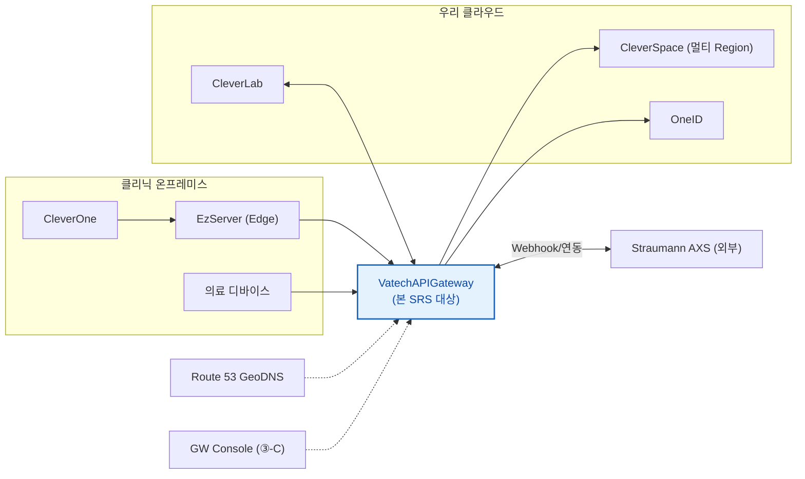
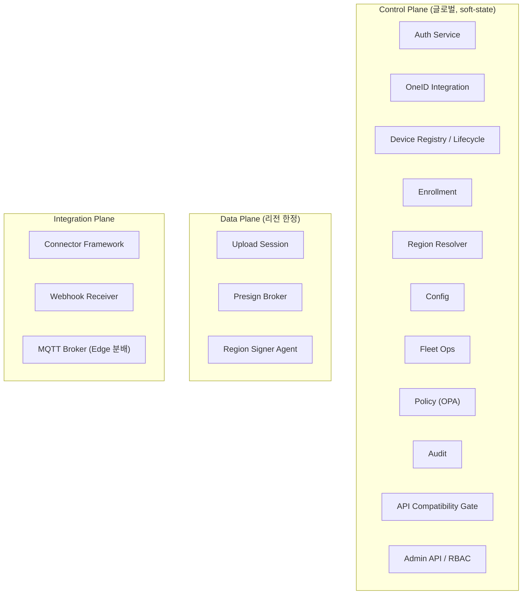
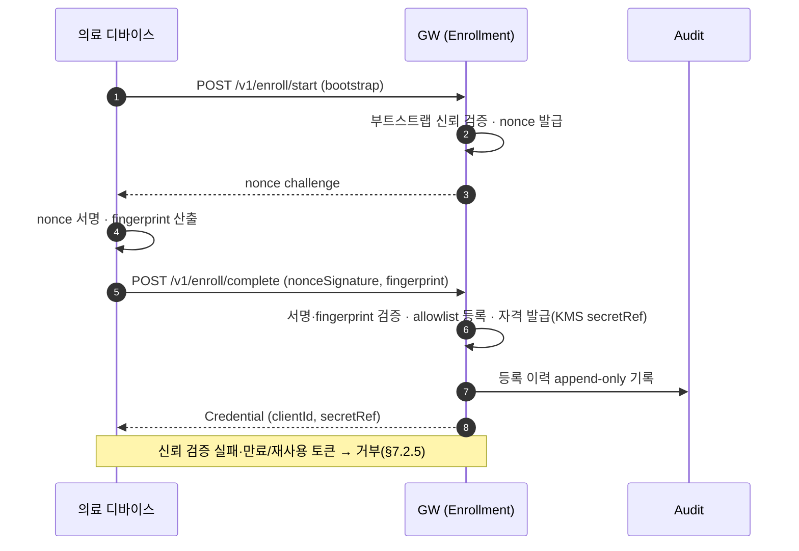
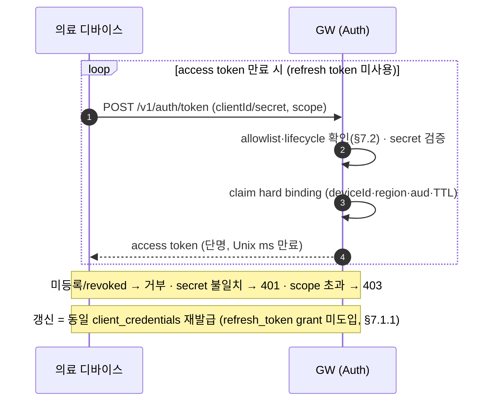
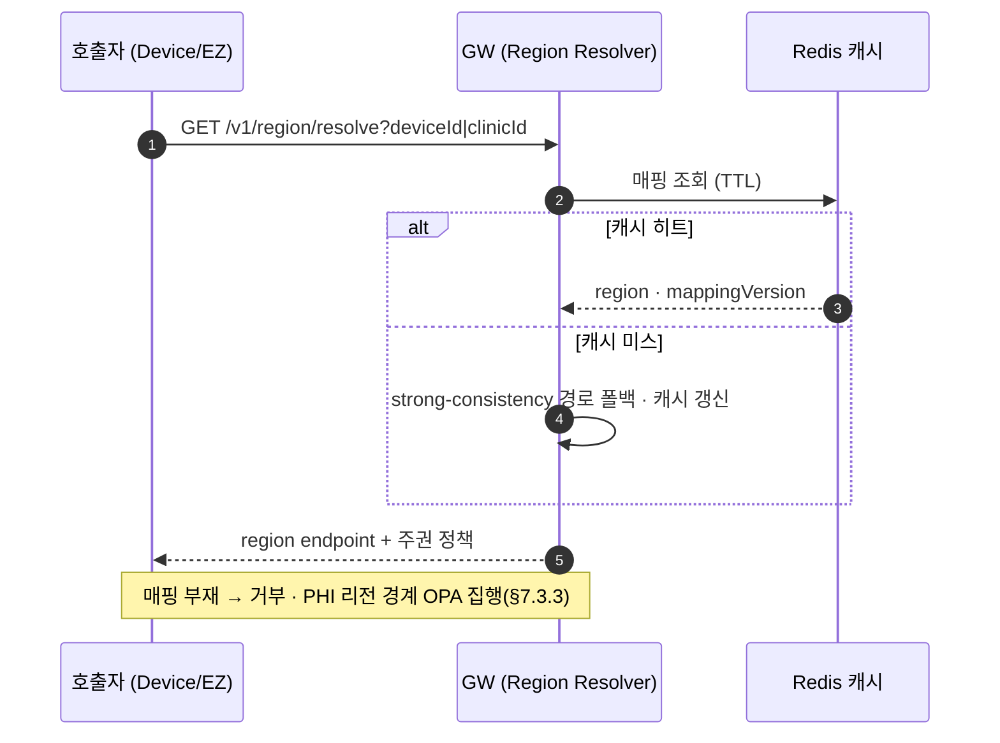
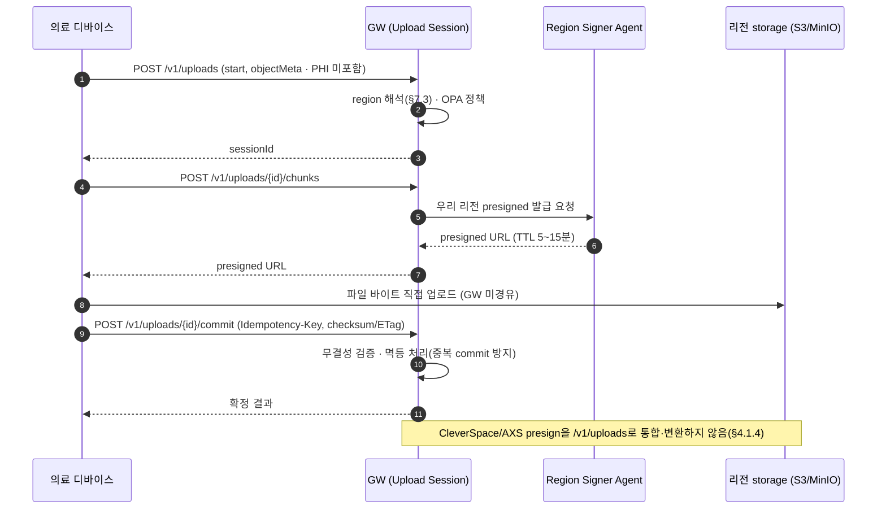
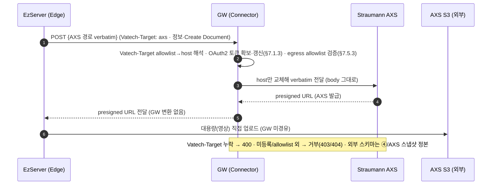
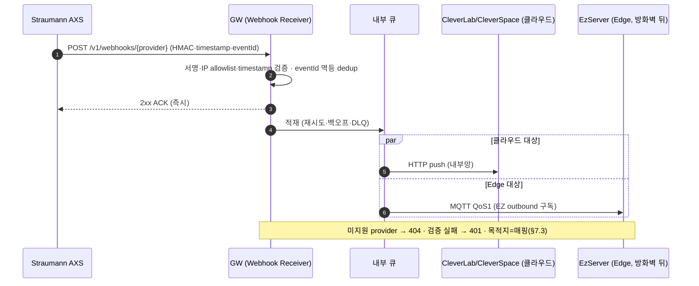
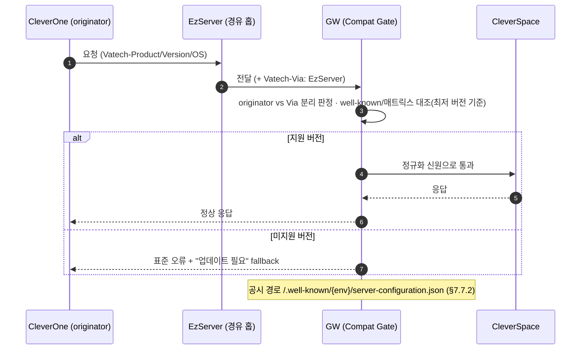

# VatechAPIGateway SRS (③ GW 일원화 + 멀티 Region)

> **골격(skeleton) — v0.1 작성 중.** 고정 항목(1~7장 + Appendix)을 모두 배치했다. 근거가 있는 내용은 PRD/ARD/요구사항 명세에서 가져왔고, 사람이 확정해야 할 곳은 `TBD`(4항목) 또는 `❓확인`으로 표시했다. 본 골격은 SRS v3.3 표준을 따른다.

**문서 통제**

| 문서 ID | ESIP-GW-SRS |
| --- | --- |
| 문서 버전 | v0.1 (Draft · 골격) |
| 적용 제품 버전 | gw/1.0.0.0~ |
| 분류 | 통제 문서 (Controlled · IEC 62304 / ISO 13485 — 요구사항 추적성) |
| SSOT 여부 | 본 SRS가 GW 플랫폼 요구사항의 SSOT. 기존 [요구사항 명세](https://vks.vatech.com/x/AcSSEg)·[PRD](https://vks.vatech.com/pages/viewpage.action?pageId=311608280)·[ARD](https://vks.vatech.com/pages/viewpage.action?pageId=311608281)는 추출/배경 뷰 |
| 공식 등록처 | [vt-api-gateway `docs/specs/SRS.md`](https://dev.azure.com/ewoosoft/es-platforms/_git/vt-api-gateway/docs/specs/SRS.md) (PR 리뷰) |

---

# 1 Introduction (개요)

## 1.1 Purpose (목표)

본 SRS는 **VatechAPIGateway(이하 GW)** 의 소프트웨어 요구사항을 정의한다. 적용 제품 버전은 `gw/1.0.0.0` 이상이다.

본 문서는 **내부 개발용**으로 작성하며, 동시에 **IEC 62304 / ISO 13485 통제 문서 baseline**의 요구사항 추적성 근거로 사용한다. 외부(파트너·외주) 공유 시 §6.6 등 회사 내부 사정에 해당하는 절은 제거 후 전달한다.

## 1.2 Product Scope (범위)

CleverSpace는 유상화·이용 한도 등 새 정책으로 API를 계속 확장하지만, 클리닉·PC마다 버전이 제각각인 구버전 CleverOne·EzServer가 이를 인식하지 못해 **원인불명 실패**가 발생한다. 또한 CleverOne이 EzServer를 거치지 않고 CleverSpace로 직접 연동하는 **경로 B**가 존재해 인증·정책 통제가 두 갈래로 분산된다. 나아가 Straumann AXS처럼 보안상 직접 연결이 불가능한 외부 연동 수요가 늘고 있다. 본 프로젝트는 **모든 클라우드·디바이스 연동을 단일 게이트웨이로 일원화**하여 인증(OneID 연계)·버전 호환·Region 라우팅을 단일 집행점에서 처리하는 것을 목표로 한다.

GW는 (1) 모든 통신이 경유하는 중앙 control plane(인증·디바이스 관리·라우팅·config), (2) 파일은 presigned URL로 디바이스↔리전 직결(GW 무부하), (3) 디바이스–리전 매칭으로 데이터 주권 보장, (4) 외부 이벤트(AXS 등)의 단일 Webhook 수신·분배, (5) 클라이언트 버전 호환 게이팅을 수행한다.

**Will Not Do (의도적으로 제외):**

- **제품측(CleverSpace·CleverOne·EzServer) 변경 상세** — ① API 호환성 / ② Presigned One Pager에서 다룬다. 본 SRS는 GW 쪽 계약만 정의한다.
- **Straumann AXS connector 상세** — ④ Sub-SRS([Straumann AXS Sub-SRS](https://dev.azure.com/ewoosoft/es-platforms/_git/vt-api-gateway/docs/specs/04-subsrs-straumann-axs/Sub-SRS.md))에서 다룬다. 본 SRS는 connector 프레임워크(§7.5)까지만.
- **GW Console(Admin Web) UI 상세** — ③-C Sub-SRS([GW Console Sub-SRS](https://dev.azure.com/ewoosoft/es-platforms/_git/vt-api-gateway/docs/specs/03c-subsrs-gw-console/Sub-SRS.md))에서 다룬다. 본 SRS는 관리 API(§7.9)까지만.
- **CleverLab↔AXS 직접 연동(Roadmap 5단계 갈래 B)** — **현 시점 미고려**(2026-06 회의). 단 외부 cloud 서비스 연동 **일반 역량**(C 프록시·§4.1.1·§7.5)은 유지하므로, 향후 활성화 시 신규 코드가 아닌 레지스트리 등록으로 수용한다. 우선 범위는 **갈래 A(EzServer→AXS)** 다(④).
- **레거시 10만대 마이그레이션** — v2.0(FR-MIG-\*). 본 v1.0 범위 밖.

## 1.3 Document Conventions (문서규칙)

- **우선순위 표기**: 각 기능에 `(P1)/(P2)/(P3)` 표기. 하위 요구사항은 별도 표기 없으면 상위 우선순위를 상속한다.
  - **P1** = 반드시 포함, 제외 시 릴리스 불가 (요구사항 명세의 `M`·`v1.0`에 대응)
  - **P2** = 중요하나 일정 조정 가능 (`S` 또는 `v1.1`)
  - **P3** = 추가되면 좋음, 다음 Phase (`v1.2`/`v2.0`)
- **버전 표기**: 베이스라인(`gw/1.0`)은 표기 없음. 후속분만 `(v1.1)`·`(v1.2)` 표기.
- **변경 표기**: 색이 아닌 텍스트(`(변경: YYYY-MM-DD)`)로 표기, 색은 보조.
- **시간**: Unix Timestamp(ms). 필드명: camelCase.

## 1.4 Terms and Abbreviations (정의 및 약어)

> 모두가 아는 표준 용어(JWT·TLS·REST·OAuth2 등)는 제외. 본 문서 독자(개발·QA·인프라·PM) 일부가 모르거나 혼동할 만한 것만 선별.

| 용어                  | 본 문서에서의 의미                                         | 비고               |
| --------------------- | ---------------------------------------------------------- | ------------------ |
| GW (VatechAPIGateway) | 모든 연동이 단일 경유하는 control plane                    | 본 SRS의 대상 제품 |
| PEP                   | Policy Enforcement Point — 요청 시점 인증·정책 집행 지점   | §7.1               |
| originator            | 요청을 _시작한_ 주체(`Vatech-*` 헤더의 권위 소스)          | §7.7               |
| `Vatech-Via`          | 요청을 _경유한_ 중계 홉(예: EzServer)                      | originator와 분리  |
| Edge                  | 클리닉 현장의 EzServer (방화벽 뒤, inbound 불가)           | §7.6               |
| soft-state            | 완전 stateless가 아닌, cache TTL·mapping_version 기반 상태 | ADR-02             |
| Region Signer Agent   | 리전 내에서 자격 보관·서명하는 에이전트(주권)              | ADR-03             |
| ClinicID↔Org-ID       | 클리닉 식별자와 외부(AXS) 조직 식별자 매핑                 | §7.3 / ④           |
| 경로 B (Path B)       | CleverOne → CleverSpace 직접 연동(EzServer 미경유)         | Deprecated 대상    |

> ❓확인 — 추가로 등록할 용어(예: PHI, allowlist) 또는 사내 공유 용어집 링크 여부.

## 1.5 Related Documents (관련문서)

**VKS (Confluence) — 통제·설계**

- [PRD (v2)](https://vks.vatech.com/pages/viewpage.action?pageId=311608280) — 상위 기획. §12.1 스펙 단위 정본
- [ARD (아키텍처)](https://vks.vatech.com/pages/viewpage.action?pageId=311608281) — ADR-01~10·컴포넌트·시퀀스
- [요구사항 명세](https://vks.vatech.com/x/AcSSEg) — FR/NFR 등록부 (본 SRS가 SSOT로 흡수, 해당 문서는 추출 뷰)
- [인증·보안·컴플라이언스 설계](https://vks.vatech.com/pages/viewpage.action?pageId=311608329) · [API 명세·데이터 모델·주권](https://vks.vatech.com/x/CMSSEg)
- [개발 Roadmap 결정 (배경)](https://vks.vatech.com/x/r9iSEg) — 케이스 D·단계

**Azure Repos — 스펙·설계 산출물 (`vt-api-gateway`)**

- [OpenAPI (GW 고유 API)](https://dev.azure.com/ewoosoft/es-platforms/_git/vt-api-gateway/docs/specs/design/openapi/vt-api-gateway.openapi.yaml) — dev-chain-design SSOT
- [DBML (PostgreSQL)](https://dev.azure.com/ewoosoft/es-platforms/_git/vt-api-gateway/docs/specs/design/dbml/vt-api-gateway.dbml) — dev-chain-design SSOT
- 하위 스펙:
  - ① API 호환성 One Pager (경로TBD) — VKS(Confluence), pageId 미확정
  - ② Presigned URL One Pager (경로TBD) — VKS(Confluence), pageId 미확정
  - [③-C GW Console Sub-SRS](https://dev.azure.com/ewoosoft/es-platforms/_git/vt-api-gateway/docs/specs/03c-subsrs-gw-console/Sub-SRS.md)
  - [④ Straumann AXS Sub-SRS](https://dev.azure.com/ewoosoft/es-platforms/_git/vt-api-gateway/docs/specs/04-subsrs-straumann-axs/Sub-SRS.md)

**외부·참고**

- [AXS OpenAPI (Straumann 정본)](https://developer.axs.straumann.com/api) · 스펙 인덱스 `https://developer.axs.straumann.com/specs/index.json`
- [AXS OpenAPI 스냅샷 (사내)](https://dev.azure.com/ewoosoft/es-platforms/_git/vt-api-gateway/docs/specs/references/axs-openapi/README.md) — ④ 연동 입력 (취득 2026-06-16, Confidential)

## 1.6 Intended Audience and Reading Suggestions (대상 및 읽는 방법)

| #   | 챕터                | PM  | 백엔드 | 인프라/DevOps | QA  | 보안 | 경영진 |
| --- | ------------------- | --- | ------ | ------------- | --- | ---- | ------ |
| 1.2 | Product Scope       | 2   | 1      | 1             | 1   | 1    | 2      |
| 2.x | Overall Description | 2   | 2      | 2             | 2   | 1    | 1      |
| 3.x | Environment         | 1   | 2      | 2             | 2   | 1    | —      |
| 4.x | External Interface  | 1   | 2      | 2             | 2   | 2    | —      |
| 5·6 | Perf / NFR          | 1   | 2      | 2             | 2   | 2    | —      |
| 7   | Functional Req      | 1   | 2      | 1             | 2   | 1    | —      |

> 범례: 1=훑어 이해 / 2=자세히 / —=읽지 않아도 됨

## 1.7 Project Output (프로젝트 산출물)

### 1.7.1 Output Format

백엔드 서비스 (NestJS, Kubernetes(EKS) 배포, 단일 control-plane endpoint). API 문서는 `@nestjs/swagger` code-first(`/api-docs`). 서비스 공개 호스트(제안)는 §4.5 참조.

### 1.7.2 Output Name and Version

- 공식 명칭: **VatechAPIGateway**
- 레포지토리: `vt-api-gateway` (Azure es-platforms)
- 초기 버전: `gw/1.0.0.0`

### 1.7.3 Patent Information

None

---

# 2 Overall Description (전체 설명)

## 2.1 Product Perspective (제품 조망)

GW는 기존 제품군(CleverOne·EzServer·CleverSpace·OneID)과 외부 플랫폼(Straumann AXS) 사이의 **단일 control plane**으로 신규 구축된다.



| 외부 시스템          | 역할                                                  |
| -------------------- | ----------------------------------------------------- |
| CleverOne / EzServer | 사내 호출자. EzServer는 Edge(방화벽 뒤, inbound 불가) |
| CleverSpace          | 멀티 Region 백엔드(데이터 경로 대상)                  |
| OneID                | 사람·클리닉·사내 호출자 인증(OIDC)                    |
| Straumann AXS        | 외부 연동 대상. Webhook 수신·presigned 연동           |
| CleverLab            | 우리 클라우드 서비스(B 프록시 대상). **CleverLab↔AXS 직접 연동(갈래 B)은 현 시점 범위 외**(§1.2·④ — 외부 cloud 연동 일반 역량은 유지) |
| Route 53 GeoDNS      | EzServer를 최근접 GW Region에 연결                    |
| GW Console           | Admin Web(③-C Sub-SRS) — 관리 API 호출                |

> 상세 인터페이스는 §4. ❓확인 — 누락된 외부 시스템 여부(예: 결제·알림 등).

## 2.2 Overall System Configuration (전체 시스템 구성)

ARD §3·§4의 **3-Plane(Control / Data / Integration)** 구성을 따른다. 컴포넌트 도출 기준 = _plane(책임 영역) + 배포 단위_.



> **🔍 대안 검토 — 디바이스 인증 방식** (ADR-01)
>
> - 채택안: DPoP + 하드웨어 키(SE/TPM)
> - 대안: mTLS — 10만대 운영 부담·물리 키추출 위협 미해결로 반려
> - 상세·재검토 조건: ARD ADR-01. (본 SRS는 결정을 참조하며, 핵심 결정 로그는 Appendix A)

> 핵심 아키텍처 결정은 ARD ADR-01~10에 확정. 본 SRS는 이를 참조하고 Appendix A에 결정 로그로 연결한다.

## 2.3 Overall Operation (전체 동작방식)

GW의 주요 동작을 **시나리오별 개요(overview)** 로 정리한다. 본 절은 흐름의 골격만 보이며, **상세 시퀀스·예외·재시도 정책은 ARD §5가 정본**이다. 전체 시스템 맥락은 §2.1(제품 조망)·§2.2(3-Plane 구성)을, 단계별 아키텍처 배경은 [개발 Roadmap 결정 §2.6 (배경)](https://vks.vatech.com/x/r9iSEg)을 참조한다.

시퀀스의 참여자(액터)는 §2.1 외부 시스템·§2.2 컴포넌트와 일치한다.

| 액터 | 의미 (출처) |
| --- | --- |
| 의료 디바이스 / CleverOne / EzServer(Edge) | 사내·현장 호출자(§2.1·§2.5). EzServer는 방화벽 뒤 Edge |
| GW | 본 SRS 대상. 내부 컴포넌트(Auth·Region Resolver·Upload Session·Region Signer Agent·Connector·Webhook Receiver·내부 큐/MQTT)는 §2.2 |
| OneID / CleverSpace / CleverLab | 우리 클라우드 백엔드(§2.1) |
| Straumann AXS / AXS S3 | 외부 플랫폼·외부 스토리지(§2.1, 경로③·§4.1.4) |
| 리전 storage(S3/MinIO) | 우리 리전 객체 스토리지(경로①·§7.4) |

> **본 절 시나리오 ↔ §7 기능·§4.1.4 경로 매핑**: 온보딩(§7.2)·인증(§7.1)·리전(§7.3)·업로드 경로①(§7.4·§4.1.4①)·외부 연동 경로③(§7.5·§4.1.4③)·Webhook(§7.6·§4.1.3)·버전 호환(§7.7). CleverSpace presign(경로②)은 B bypass로 GW가 해석·변환하지 않으므로(§4.1.4②) 본 동작 개요에 별도 시나리오를 두지 않고 ② One Pager가 정본이다.

### 2.3.1 디바이스 온보딩 (enrollment) — FR-ENR-\*

신뢰할 수 없는 디바이스를 부트스트랩 신뢰(공장 토큰/OOB 일회 코드)로 검증해 allowlist에 등록하고 자격을 발급한다. nonce challenge로 replay를 막고, device fingerprint를 바인딩한다. 상세는 §7.2.5·§7.2.6, 흐름은 ARD §5.1.



### 2.3.2 디바이스 인증·토큰 발급 — FR-AUTH-01/05

등록된 디바이스가 작업 전 단명 access token을 발급받는다. lifecycle·allowlist를 확인하고, claim(`deviceId`·`region`·`aud`·`TTL`)을 강제 바인딩한다. revoked 디바이스는 캐시 TTL과 무관하게 즉시 차단(§7.2.4). **갱신은 refresh token이 아니라 동일 `client_credentials` 재발급**으로 처리한다(§7.1.1 — 단명+즉시 revocation 모델). 상세는 §7.1.1.



### 2.3.3 리전 해석·라우팅 — FR-RGN-\*

인증된 호출자가 작업(업로드·연동) 직전 device/clinic→region을 해석해 리전 endpoint와 주권 정책을 받는다. `deviceId`·`clinicId`는 동일 resolver가 같은 리전으로 귀결(ADR-10)한다. PHI는 해석된 리전 밖으로 이동하지 않는다(OPA, §7.3.3). 상세는 §7.3, 흐름은 ARD §5.2.



### 2.3.4 업로드 세션·Presigned (경로①, 디바이스→우리 리전 storage) — FR-SES-\*

**§4.1.4 경로① 전용.** 디바이스가 우리 리전 storage로 올리는 PHI 파일을 Upload Session으로 추상화(start→chunk→commit, ADR-04)한다. presigned URL **발급 주체는 Region Signer Agent**이며, GW는 세션·리전·정책·Signer를 orchestration한다. 파일 **바이트**는 presigned로 storage에 **직접** 업로드(GW 미경유). commit은 idempotency key + checksum/ETag로 무결성을 확정한다. 상세는 §7.4, 흐름은 ARD §5.3.



### 2.3.5 외부 연동 — AXS presign·파일 bypass (경로③, 갈래 A) — FR-INT-\*

**§4.1.4 경로③ 전용 (C 프록시).** EzServer→AXS 외부 연동(5단계 갈래 A). 클라이언트는 `Vatech-Target: axs`를 실어 AXS 경로를 **그대로** 호출하고(§4.1.2), GW는 connector로 OAuth2 토큰을 관리(§7.1.3)·egress allowlist를 집행(§7.5.3)하되 요청/응답 body는 **AXS OpenAPI 그대로 통과(verbatim bypass)** 한다 — GW가 `/v1/uploads`로 해석·변환하지 않는다. 대용량은 AXS가 발급한 presigned로 **AXS S3에 직접** 업로드(GW 미경유). 연동 의미·Org-ID 매핑 상세는 **④ Sub-SRS**, 본 SRS는 프레임워크·egress까지만. 상세는 §7.5.



### 2.3.6 Webhook 수신·분배 — FR-WH-\*

외부(AXS)가 GW 단일 엔드포인트로 이벤트를 push하면, GW가 검증·멱등 후 즉시 ACK하고 대상별로 분배한다(store-and-forward, ADR-09). 클라우드는 HTTP push, 방화벽 뒤 Edge(EzServer)는 MQTT QoS1 역방향. 목적지는 송신 host가 아니라 Org-ID↔ClinicID 매핑(§7.3)으로 결정한다. 수신 계약은 A버킷, payload는 외부 참조(§4.1.3). 상세는 §7.6.



### 2.3.7 버전 호환 게이팅 — FR-COMPAT-\*

`Vatech-*` 헤더로 originator(요청 시작 주체)와 경유 홉(`Vatech-Via`)을 분리 판정하고, well-known 공시·호환성 매트릭스와 대조해 **더 낮은 버전 기준**으로 게이팅한다. 미지원이면 표준 오류코드와 "업데이트 필요" fallback을 안내해 원인불명 실패를 제거(ADR-07)한다. 상세는 §7.7.



## 2.4 Product Functions (제품 주요 기능)

> 7장 대분류와 1:1 매핑.

- 7.1 인증·토큰 (디바이스 머신 인증 + OneID 연계)
- 7.2 디바이스 레지스트리·온보딩
- 7.3 리전·라우팅·주권 (라우팅 키 통합)
- 7.4 업로드 세션·Presigned 발급
- 7.5 외부 연동·Connector 프레임워크
- 7.6 Webhook 수신·이벤트 분배
- 7.7 API 버전 호환성 게이트
- 7.8 Fleet 운영·Config
- 7.9 관리·감사·컴플라이언스

## 2.5 User Classes and Characteristics (사용자 계층과 특징)

| 계층                            | 사용 빈도 | 주 사용 기능              | 권한                 | 중요도 |
| ------------------------------- | --------- | ------------------------- | -------------------- | ------ |
| 의료 디바이스                   | 상시      | 인증·업로드 세션·config   | 머신(디바이스 scope) | 핵심   |
| 사내 호출자(EzServer/CleverOne) | 상시      | 인증·라우팅·Webhook 수신  | 서비스(OneID)        | 핵심   |
| 외부 플랫폼(AXS)                | 이벤트 시 | Webhook·connector         | 외부(OAuth2)         | 핵심   |
| 운영자/Admin                    | 일/주     | 관리 API·매핑·kill-switch | RBAC                 | 중요   |
| 인프라/DevOps                   | 배포 시   | IaC·관측·로그             | 시스템               | 중요   |

## 2.6 Assumptions and Dependencies (가정과 종속 관계)

- **AXS sandbox 자격증명·OAuth Client** — Straumann 제공 대기. (미수령 시 영향: §7.5 connector E2E·④ Sub-SRS 검증 지연)
- **GW 인프라(K8s·Route 53 GeoDNS·고정 egress IP·DNS 호스트)** — 인프라 담당 별도. 본 SRS는 계획·요구만 기술. (미확정 시 영향: §3·§4.5·§7.3)
- **MQTT 브로커 운영 주체** — TBD (미결 이유: 운영 조직 미정 / 책임자 ❓ / 마감 ❓ / 영향: §7.6·ARD MQTT Broker)
- **CleverOne SRS(Nick)** — 클라이언트 식별 헤더 상세. 미확보 시 §7.7 정밀화 제약.

## 2.7 Apportioning of Requirements (단계별 요구사항)

| 버전 | 범위 | Roadmap 단계 |
| --- | --- | --- |
| gw/1.0 (MVP) | 인증 코어·레지스트리·enrollment·단일 리전 주권·업로드 세션·AXS connector·fleet 기본·config·감사/RBAC(경량)·Webhook·COMPAT·라우팅 키 통합 | 1·2·3·(4 일부)·5 |
| gw/1.1 | DPoP+HW키·hardware attestation·fleet 확장·2nd connector | 후속 |
| gw/1.2 | 멀티 리전·멀티클라우드 presign·signer 확장 | 4단계(후행 시) |
| v2.0 | 레거시 10만대 마이그레이션 | 후속 트랙 |

> 멀티 Region(FR-RGN-05)·멀티클라우드(FR-SES-06)는 v1.2 배정이나 케이스 D 통합 진행 시 gw/1.0 흡수 가능 — TBD(§2.7, 결정 책임자 ❓, 마감 ❓).

## 2.8 Backward compatibility (하위 호환성)

GW 본체는 신규 구축이나, **기존 클라이언트(구버전 CleverOne/EzServer)와 경로 B**에 대한 호환 정책이 필요하다.

- 호환 대상: 구버전 클라이언트 — well-known·오류코드 fallback으로 흡수(§7.7)
- 호환 포기: 경로 B는 **Deprecated 후 EOS** (시점 TBD — §2.8, 책임자 ❓, 마감 ❓, 영향: §7.6·① One Pager)
- 호환 매트릭스(클라이언트×API 최소버전): TBD — ① 운영 호환성 매트릭스 확정본 의존

---

# 3 Environment (환경)

## 3.1 Operating Environment (운영 환경)

### 3.1.1 Hardware Environment

서비스(클라우드) — AWS EKS(Kubernetes) 노드. 사양 상세는 인프라 담당 IaC. (TBD: 노드 타입·수)

### 3.1.2 Software Environment

GW가 동작하는 소프트웨어 스택. 근거·전체 표는 [ARD §4.5 기술 스택](<../../VT API Gateway — ARD (아키텍처).md>). 버전 `TBD`는 설계 단계 확정.

- **언어 / 런타임**: TypeScript · Node.js LTS (버전 TBD)
- **프레임워크**: NestJS (DDD 모듈 · TDD)
- **ORM / 마이그레이션**: **Prisma** (권장 — 아래 근거) · 스키마는 DBML(dev-chain-design)에서 파생
- **관계형 DB**: PostgreSQL 15.x — 레지스트리·매핑·토큰메타·정책·감사
- **캐시**: Redis — region 매핑 TTL·nonce·rate-limit·idempotency·JWKS
- **메시지 큐**: RabbitMQ(권장) / SQS — Webhook 비동기 분배·재시도·DLQ(§7.6.3)
- **MQTT 브로커**: Edge(EzServer) 역방향 분배(QoS1·persistent, §7.6.6)
- **오브젝트 스토리지**: S3(리전) / MinIO(온프렘) — presigned 업로드 직결(§7.4, GW 미경유)
- **정책 엔진**: OPA — allowlist·region·scope·egress 판단
- **시크릿 / 키 관리**: KMS / Secrets Manager (enrollment·PKI는 Vault 검토)
- **컨테이너 / 오케스트레이션**: Docker · Kubernetes(EKS)
- **관측성**: OpenTelemetry · 구조화 로그(Pino) — PHI·시크릿 미기록(§6.2)
- **API 문서**: `@nestjs/swagger` code-first (`/api-docs`, §1.7.1)

> **ORM 추천 — Prisma.** 근거: (1) control plane은 저(低) QPS·CRUD 중심(PRD §10)이라 Prisma의 타입 안전·DX 이점이 크고 복잡 쿼리 한계의 영향이 작다, (2) **DBML → Prisma schema**로 이어지는 설계 산출물 흐름과 마이그레이션 일원화에 부합(`design/dbml/`), (3) 사내 NestJS 표준·ARD §4.5에서 이미 `◎ Prisma`로 채택. 대안: TypeORM(NestJS 친화이나 유지보수 리스크)·Drizzle/Kysely(SQL-first·경량이나 배터리 적음)는 _복잡 쿼리·세밀한 SQL 제어가 핵심이 될 때만_ 재검토(결정 변경 시 ADR 추가).

## 3.2 Product Installation and Configuration (제품 설치 및 설정)

Helm Chart 기반 배포(인프라 담당). 환경 변수는 KMS/Secrets Manager. 상세 TBD.

## 3.3 Distribution Environment (배포 환경)

### 3.3.1 Master Configuration

Docker 이미지(컨테이너). 빌드 산출물·태깅 절차 TBD.

### 3.3.2 Distribution Method

Azure Pipelines CI/CD → 컨테이너 레지스트리 → EKS 배포.

### 3.3.3 Patch/Update Method

롤링 배포(K8s). 카나리·롤백 정책은 FR-FLEET-04(v1.1) 참조. 상세 TBD.

## 3.4 Development Environment (개발 환경)

### 3.4.1 Hardware Environment

N/A(기존 개발 PC와 동일)

### 3.4.2 Software Environment

Node.js / NestJS / Prisma / PostgreSQL(local) / Docker / Cursor·VS Code. 버전 TBD(설계 단계).

## 3.5 Test Environment (테스트 환경)

### 3.5.1 Hardware Environment

N/A(기존과 동일)

### 3.5.2 Software Environment

AXS `unstable` 테스트 환경 전제(④ Sub-SRS). 단위(Jest)·E2E·부하 테스트 도구 TBD.

## 3.6 Configuration Management (형상관리)

### 3.6.1 Location of Outputs

- 소스코드: Azure Repos `vt-api-gateway` (es-platforms)
- 문서: 본 SRS는 작성은 `scp-architecture`, 공식 리뷰·baseline은 `vt-api-gateway/docs/specs/`

### 3.6.2 Build Environment

Azure Pipelines(TDD 게이트 — 테스트 통과 필수). Node.js·pnpm 버전 TBD.

## 3.7 Bugtrack System (버그트래킹)

- 시스템: Jira (`https://vts.vatech.com`)
- 프로젝트 키: `ESIP` / Component `platform/api-gateway`

## 3.8 Other Environment (기타 환경)

None

---

# 4 External Interface Requirements (외부 인터페이스 요구사항)

## 4.1 System Interfaces (시스템 인터페이스)

- API: [OpenAPI — `vt-api-gateway.openapi.yaml`](https://dev.azure.com/ewoosoft/es-platforms/_git/vt-api-gateway/docs/specs/design/openapi/vt-api-gateway.openapi.yaml)
- ERD: [DBML — `vt-api-gateway.dbml`](https://dev.azure.com/ewoosoft/es-platforms/_git/vt-api-gateway/docs/specs/design/dbml/vt-api-gateway.dbml)

연동 시스템: OneID(OIDC), CleverSpace, Straumann AXS(④), CleverLab, EzServer(MQTT). 상세 계약은 §7 + Swagger.

### 4.1.1 API 정의 전략 — GW 고유 API vs 레지스트리 라우팅 프록시 (2면)

GW는 **두 면(surface)** 만 노출한다. 백엔드 API를 GW에서 재정의하지 않는다(중복 = 드리프트).

- **A. GW 고유 API** — GW가 직접 정의·처리하는 면(§7 전부).
- **Proxy. 레지스트리 라우팅 프록시** — 등록된 upstream으로 요청을 **그대로 전달(verbatim bypass)** 하는 면. upstream이 우리 소유(내부)냐 제3자(외부)냐에 따라 **trust profile만 다르며**(라우팅 메커니즘은 동일), 각각 **B(internal)·C(external)** 로 부른다.

**두 면은 요청의 `Vatech-Target` 헤더 유무로 배타적으로 갈린다** — 없으면 A(GW가 처리), 있으면 Proxy(등록 upstream으로 전달). 라우팅 모델·불변식은 §4.1.2, 결정 근거는 ADR-11(target-routed proxy).

| 면 | 무엇 | 라우팅 키 | GW 역할 | 정본(SSOT) |
| --- | --- | --- | --- | --- |
| **A. GW 고유 API** | §7 전부 — 인증·enrollment·디바이스 레지스트리·region resolve·**Upload Session(§7.4 — 경로① 전용, AXS/CleverSpace presign 아님)**·Webhook 수신·**관리 API(③-C Console이 호출하는 Backoffice/관리 API 포함, §7.9·§7.8)**. UI 자체는 ③-C | **`Vatech-Target` 없음** (GW-own) | GW가 직접 처리·OpenAPI 정의(NestJS code-first `@nestjs/swagger`, §1.7.1) | 본 SRS §7 + [OpenAPI](https://dev.azure.com/ewoosoft/es-platforms/_git/vt-api-gateway/docs/specs/design/openapi/vt-api-gateway.openapi.yaml) |
| **B. 프록시(internal)** | **우리 소유** 백엔드(CleverSpace·OneID·CleverLab) | **`Vatech-Target` = 논리 ID**(예 `cleverspace`) | **verbatim bypass** + 정규화 신원 전달 + 정책 체인. 내부망 trusted — 백엔드가 GW 신뢰 | 각 백엔드 제품의 OpenAPI |
| **C. 프록시(external)** | **외부 제3자**(Straumann AXS, 향후 DS Core/3Shape) | **`Vatech-Target` = 논리 ID**(예 `axs`) | **verbatim bypass** + OAuth2 인증·토큰/secret 관리(§7.1.3)·고정 egress IP·egress allowlist(§7.5)·Webhook 역수신(§7.6). 경계 밖 untrusted | ④ Sub-SRS + 외부 OpenAPI 스냅샷 |

- **handle(A) vs proxy(B/C) 판별 = `Vatech-Target` 유무**(배타). A에 헤더 부착 시 거부, proxy인데 누락 시 fail-closed(`400`). 상세 불변식은 §4.1.2.
- **B vs C = trust profile 차이일 뿐 라우팅은 동일**: B = 내부 안내 데스크(통과 + 정규화 신원), C = 거래처 방문(OAuth·토큰·secret·고정 egress IP·외부 장애 책임). C가 토큰·secret·외부 장애 책임까지 지므로 §7.5 커넥터 프레임워크로 1급 처리하고, B는 정책 체인 수준의 경량이다.
- **신규 upstream 추가 = 레지스트리 1행**(논리 ID→host + trust profile + 정책·egress)으로 끝난다 — **코드·경로 네임스페이스 변경 0**(NFR-SCL §6.3.5). §7.5.1 connector 프레임워크를 _내부·외부 전 upstream_ 으로 일반화한 것이며, 내부·외부를 **하나의 라우팅 규칙**으로 다룬다.
- **파일 업로드·presigned는 API 면과 데이터 경로를 구분한다**(§4.1.4): 경로①=A(`/v1/uploads`, GW 고유), 경로②=B proxy(`Vatech-Target: cleverspace`), 경로③=C proxy(`Vatech-Target: axs`). GW는 CleverSpace·AXS·제3자 presign 규약을 **해석·변환·중계하지 않는다**(verbatim). **파일 바이트**는 어느 경로든 presigned로 **storage 직접 업로드**(GW 미경유).

### 4.1.2 라우팅·API 설계 규칙

1. **라우팅 모델 — `Vatech-Target` 유무로 면을 가른다.** 요청에 `Vatech-Target`이 **없으면 GW 고유 API(A)** 로 GW가 처리하고, **있으면 Proxy(B/C)** 로 등록 upstream에 전달한다. 두 면은 **배타** — A의 GW-own 경로에 `Vatech-Target` 부착 시 거부, proxy 호출에 누락 시 **fail-closed(`400`)**(추측 라우팅 금지). **v1.0부터 proxy 호출은 `Vatech-Target` 필수**(케이스 D 통합 — GW 전환 시 클라이언트를 어차피 변경하므로 증분 부담).
2. **목적지는 GW가 결정한다(서버측 레지스트리) — 클라이언트는 host/주소를 지정하지 않는다.** `Vatech-Target`은 **논리 서비스 ID(enum)만** 싣고 **host/URL은 금지**한다. GW가 레지스트리로 id→host를 해석(allowlist 검증)하며 **미등록 id → 거부(`404`/`403`)**. 따라서 클라이언트는 _논리 의도_ 만 표명하고 **주소 결정권은 GW**가 보유한다(SSRF·오픈 프록시·토폴로지 결합 차단). 원서버 주소 헤더·임의 라우팅 헤더(`X-Upstream` 등) 신설 금지 — 라우팅 키는 `Vatech-Target` 단일.
3. **proxy 전달은 verbatim, 정책은 path를 본다.** 클라이언트는 GW 호스트에 **upstream 경로를 그대로** 호출하고, GW는 **host만 바꿔 요청/응답 body를 그대로 통과**(필드 해석·변환 없음)한다. 단 **인증·버전 게이트·egress allowlist 정책은 (target+method+path)로 검사**한다 — GW는 path를 _라우팅엔_ 쓰지 않되 _정책엔_ 본다. **리전 목적지**는 `Vatech-Target`(어느 서비스) + `Vatech-Clinic-Id`(어느 리전, §7.3 resolver)의 **직교 조합**으로 구체 host를 정한다(멀티 Region).
4. **proxy(B·C)도 정책 체인을 통과한다** — 인증(§7.1)·버전 게이트(§7.7)·egress/allowlist(§7.5.3·§6.5). 전달이 무검증이 아니다. B/C 차이는 **trust profile**(§4.1.1)뿐 — C는 OAuth·토큰 관리(§7.1.3)·고정 egress IP가 추가된다.

> **`Vatech-Target`(라우팅) ≠ `Vatech-*` 식별 헤더(§7.7.1).** 식별·버전·리전 헤더는 `Vatech-*` 표준(`Product`·`Version`·`OS`·`Clinic-Id`·`Via`)만 쓰며 **버전 호환 판정용 필수**(FR-COMPAT-01)다 — "누가·어떤 버전·어느 클리닉"을 싣는다. `Vatech-Target`은 **라우팅용으로 proxy 호출에 필수**다 — "어느 논리 서비스로"를 싣는다. 이름이 비슷하나 역할이 다르다(식별 vs 라우팅).

5. **GW 고유 API 컨벤션**: REST/JSON, **경로 버전 프리픽스 `/v1`**(예 `/v1/auth/token`·`/v1/webhooks/{provider}`, 관리 API는 `/admin/v1/*`), camelCase 필드, 시간 Unix ms(§1.3), 표준 오류코드(§7.7.4), idempotency key(§4.5). 단 `/.well-known/*`은 표준 관례상 버전 프리픽스 없이 노출(§7.7.2). 스키마 정본은 Swagger(code-first).

> 결정 근거·반려 대안(경로 네임스페이스 라우팅 / 투명 프록시 / 클라이언트 지정 upstream)은 **ADR-11(라우팅 모델: target-routed proxy)** 참조(ARD에 정식 기재 — Appendix B 추적). 본 절은 SRS 차원 규칙 요약.

### 4.1.3 Webhook API 정의 방침

Webhook은 두 면(§4.1.1) 어느 쪽에도 깔끔히 떨어지지 않는 **하이브리드**다 — *수신 엔드포인트*는 A(GW 고유 API — 외부가 `Vatech-Target` 없이 GW로 직접 POST), *이벤트 payload 스키마*는 C(외부 소유·참조만), *분배*는 내부 경로(클라우드 HTTP push·Edge MQTT)다. 단순 host 기반 프록시가 아니라 **수신→검증→멱등→ACK→매핑 기반 분배**의 store-and-forward 모델이다(§7.6). 따라서 API를 "전부 새로 정의"하지 않고, **GW가 소유하는 면만 정의하고 나머지는 참조**한다. 추후 §7.6 상세화 시 아래 4가지를 구분해 작성한다.

1. **수신 엔드포인트 = GW가 OpenAPI로 정의한다 (A버킷).** 정의 대상은 *봉투(envelope)와 수신 계약*이지 외부 이벤트 본문이 아니다.
   - 경로: `POST /v1/webhooks/{provider}` (`provider` = `axs` 등 enum, 미지원 → 404). 호스트는 §4.5.1.
   - 요청 헤더: 서명(`X-AXS-Signature` 등 provider별 HMAC), `timestamp`(replay 방지), `eventId`(멱등 키). provider별 헤더명은 외부 규격을 따른다(④ 참조).
   - 요청 body: **provider별 외부 스키마**이므로 GW OpenAPI에서는 **공통 envelope + `payload`는 `$ref`(외부 스냅샷) 또는 opaque(`type: object`)** 로 둔다. 본문 필드를 GW가 재정의하지 않는다(드리프트 방지).
   - 응답: 즉시 `2xx` ACK 스키마(§7.6.3, 예 `{ "received": true, "eventId": "..." }`). 에러 `400`(형식)·`401`(서명·IP·timestamp)·`404`(provider).
2. **이벤트 payload 스키마 = 정의하지 않고 참조한다 (C버킷).** AXS 등 외부 소유. 정본은 **④ Sub-SRS + AXS OpenAPI 스냅샷**(`references/axs-openapi/`). GW는 검증(HMAC·멱등)에 필요한 **최상위 식별 필드(eventType·eventId·org 식별자 등)만 알면** 되고, 그 외는 분배 시 통과시킨다.
3. **분배 경로 = REST API로 노출하지 않는다 (내부).**
   - 클라우드 대상(CleverSpace/CleverLab): **받는 쪽 백엔드의 OpenAPI**가 정본(B버킷 성격, 내부망 HTTP push). GW는 그 API를 호출할 뿐 정의하지 않는다.
   - Edge(EzServer): **MQTT QoS1**(§7.6.6) — REST가 아니므로 OpenAPI 대상이 아니다. 토픽 네이밍·payload·QoS·retain 규약은 별도(AsyncAPI 또는 §7.6 표)로 기술한다.
4. **목적지 결정 = 매핑이다, 송신 host가 아니다.** payload의 식별자(예 AXS Org-ID)를 ClinicID로 매핑(§7.3)해 대상 클리닉/백엔드를 정한다. 매핑 규칙 상세는 ④ Sub-SRS.

> **정의 산출물 배치**: 수신 엔드포인트는 GW 단일 OpenAPI(`design/openapi/vt-api-gateway.openapi.yaml`)에 다른 GW 고유 API와 **함께** 둔다(code-first 단일 `/api-docs`와 일관). 외부 payload는 `$ref`로 분리 참조, MQTT 분배는 OpenAPI 밖(AsyncAPI/규약 문서). 별도 `webhook.openapi.yaml`로 쪼개지 않는다 — 같은 서비스가 노출하는 한 면이기 때문.

### 4.1.4 업로드·Presigned 경로 구분

파일 전송은 **control plane(API 버킷)** 과 **data plane(바이트 경로)** 을 분리해 이해한다. 혼동 방지: **`/v1/uploads`는 CleverSpace·AXS·제3자 presign API를 GW가 하나로 추상화·해석하는 API가 아니다.**

#### 세 가지 업로드 경로

| # | 대상 | presign·업로드 **요청 API** (control) | presign **발급 주체** | GW 역할 | OpenAPI 정본 |
| --- | --- | --- | --- | --- | --- |
| **①** | **의료 디바이스 → 우리 리전 storage**(PHI·주권) | **`POST /v1/uploads`…** (A버킷, §7.4) | **Region Signer Agent** — CleverSpace/AXS **앱 presign API 아님** | 리전 해석(§7.3)·세션·정책·Signer 조율·commit | GW OpenAPI |
| **②** | **CleverSpace 등 사내 백엔드** presign·파일 API | **B 프록시** — `Vatech-Target: cleverspace`, upstream 경로 verbatim(§4.1.2) | **CleverSpace**(또는 해당 백엔드) | **verbatim bypass** — 요청/응답 body **그대로 통과**, GW가 필드 해석·변환 **하지 않음** | CleverSpace OpenAPI |
| **③** | **Straumann AXS** 등 외부 presign·파일 API | **C 프록시** — `Vatech-Target: axs`, upstream 경로 verbatim(§4.1.2) | **AXS**(외부) | **verbatim bypass** + OAuth2·egress allowlist(§7.5) | ④ Sub-SRS + AXS 스냅샷 |

#### data plane (공통 — 세 경로 모두 동일)

presigned URL을 **Client가 받은 뒤**, 파일 **바이트**는 **목적 storage로 직접 업로드**한다. GW는 **파일 본문을 중계하지 않는다**(PHI control plane 미경유, §6.4).

```
[control] Client → GW API (① A / ② B bypass / ③ C bypass) → (필요 시 upstream) → presigned URL 반환
[data]    Client ═══════════════════════════════════════► storage 직접 업로드 (GW 미경유)
```

#### `/v1/uploads`가 하는 일 · 하지 않는 일

**하는 일 (경로①만):**

- 업로드 **전** device/clinic→region 해석(§7.3) · OPA 정책
- Upload Session 수명주기(start→chunk→commit, ADR-04) · idempotency · checksum
- Region Signer에게 **우리 리전 S3**용 presigned 발급 **요청·Client에 전달**

**하지 않는 일 (Will Not Do):**

- CleverSpace presign API body를 `/v1/uploads` 필드로 **매핑·변환**하지 않음 → **② B bypass**
- AXS presign·파일 API를 `/v1/uploads`로 **통합·추상화**하지 않음 → **③ C bypass**
- 제3자마다 다른 presign 스키마를 GW OpenAPI **하나로 재정의**하지 않음
- presign URL을 "남이 만든 것을 릴레이만" 하는 **수동 중계 API**로 두지 않음 — ①에서는 GW가 **세션·리전·Signer까지 orchestration** (발급 주체는 Signer)

> **②와 ①의 관계**: CleverSpace **앱** presign(②)과 디바이스 **리전 storage** 업로드(①)는 **별개 계약**이다. CleverSpace는 ①으로 올라간 객체를 **object_key 등으로 참조**할 수 있다. CleverSpace presign API 변경은 **② One Pager** · CleverSpace OpenAPI가 정본.

> **③과 ①의 관계**: AXS 파일 연동 presign·전달 규약은 **④ Sub-SRS** · AXS OpenAPI가 정본. unstable smoke(TC-03)도 **③ 경로** 기준.

## 4.2 User Interface (사용자 인터페이스)

GW 본체는 무인 control plane. Admin UI는 **③-C GW Console Sub-SRS**에서 정의(본 SRS는 관리 API §7.9까지). 따라서 본 절은 `N/A(③-C에서 정의)`.

## 4.3 Hardware Interface (하드웨어 인터페이스)

의료 디바이스와는 네트워크(REST/TLS) 인터페이스만. 직접 제어하는 HW 없음 → `None`.

## 4.4 Software Interface (소프트웨어 인터페이스)

| 구성요소                        | 버전                       | 용도                                                                                      |
| ------------------------------- | -------------------------- | ----------------------------------------------------------------------------------------- |
| OneID (OIDC)                    | TBD                        | 사람·클리닉·사내 호출자 인증                                                              |
| Straumann AXS API               | OpenAPI 스냅샷(2026-06-16) | 외부 연동(④)                                                                              |
| PostgreSQL                      | 15.x                       | 레지스트리·매핑·토큰메타·정책·감사                                                        |
| Redis                           | TBD                        | region 캐시·nonce·rate-limit·idempotency·JWKS                                             |
| 메시지 큐 (RabbitMQ 권장 / SQS) | TBD                        | Webhook 비동기 분배·재시도·백오프·DLQ(§7.6.3). 선정 기준은 전달 보증·포터빌리티(ARD §4.5) |
| 오브젝트 스토리지 (S3 / MinIO)  | TBD                        | 업로드 세션 파일 직결(presigned, §7.4). 디바이스→리전 storage 직결로 GW 미경유            |
| MQTT Broker                     | TBD                        | Edge(EzServer) 분배(QoS1)                                                                 |
| OPA                             | TBD                        | allowlist·region·scope·egress 판단                                                        |

## 4.5 Communication Interface (통신 인터페이스)

- 프로토콜: HTTPS(TLS 1.2+). Webhook 수신=HTTPS POST. Edge 분배=MQTT(QoS1·persistent).
- 보안: Bearer JWT(사내), OAuth2 client_credentials(디바이스·AXS), Webhook HMAC 서명·IP allowlist·timestamp.
- 동기화: idempotency key(업로드 commit·Webhook eventId), 재시도·백오프·DLQ.
- presigned: 디바이스→리전 storage 직결(GW 미경유).

### 4.5.1 공개 엔드포인트(DNS) — 제안

DNS 호스트는 *클라이언트가 접속하는 외부 계약*이므로 본 SRS에 기록한다. 단, **DNS 발급·관리는 인프라/플랫폼팀 소유**이므로 아래는 제안이며 확정 대기다.

| 용도 | 제안 호스트 | 비고 |
| --- | --- | --- |
| GW API (GeoDNS apex) | `gw.vatech.com` | 레포 `vt-api-gateway`와 일치. 짧은 대안 `gw.vatech.com`. Route 53 GeoDNS로 최근접 리전 라우팅(§7.3.5) |
| Webhook 수신 | `https://gw.vatech.com/v1/webhooks/<provider>` | 단일 호스트 경로 기반(§7.6.1). `/v1` 버전 프리픽스(§4.1.2-5) |
| 리전별 엔드포인트(내부) | `api-gateway-<region>.vatech.com` (예: `-apne2`) | GeoDNS 백엔드. 멀티 리전(gw/1.2)에서 사용 |
| GW Console | `console.gw.vatech.com` | **③-C 영역** — 본 SRS는 참조만. 확정은 ③-C Sub-SRS |

- **TBD**: 위 호스트명 확정
  - 미결 이유: DNS·인증서·GeoDNS 구성은 인프라/플랫폼팀 결정 사항
  - 결정 책임자: ❓ (인프라/플랫폼팀)
  - 결정 마감 시점: 배포 구성 착수 전
  - 영향 받는 섹션: §1.7.1·§3.1·§7.3.5·§7.6.1 · ①/②/④ 클라이언트 연동 · ③-C(Console)

## 4.6 Other Interface (기타 인터페이스)

None

---

# 5 Performance requirements (성능 요구사항)

> 수치는 §3.1 운영 환경(AWS 단일 리전 v1.0) 기준. **범위 경계**: 본 SRS는 _성능 요구치(목표)_ 만 정의한다. **서버/노드 규모·용량 산정은 GW SRS 범위 밖(인프라 IaC 영역, §3.1)** 이며, 디바이스/클리닉 운영 규모 수치는 PL이 제공한다.

## 5.1 Throughput (작업처리량)

단위 = control-plane 요청 RPS(인증·라우팅·세션 시작 등, 파일 전송 제외).

- **TBD**: v1.0 목표 RPS
  - 미결 이유: v1.0 운영 대상 디바이스/클리닉 규모가 미확정(10만대는 v2.0). 목표 RPS는 fleet 규모·디바이스당 호출 빈도에서 산출
  - 결정 책임자: **인프라 담당** (디바이스/클리닉 규모는 PL 입력). GW SRS 작성자는 요구치 문장만 보유
  - 결정 마감 시점: 설계 착수 전
  - 영향 받는 섹션: §3.1(노드 사양)·§5.2·§7.1·§7.4
- 산출 기준(제안): `목표 RPS ≈ 동시 활성 디바이스 × 디바이스당 평균 호출/초 × 피크 계수`

## 5.2 Concurrent Session (동시 세션)

세션 정의 = control plane 동시 활성 디바이스(최근 1분 내 요청) + 진행 중 업로드 세션 수.

- **TBD**: v1.0 동시 세션 목표
  - 미결 이유: §5.1과 동일(fleet 규모 미확정)
  - 결정 책임자: **인프라 담당** (규모 수치는 PL 입력). GW SRS 작성자 범위 밖
  - 결정 마감 시점: 설계 착수 전
  - 영향 받는 섹션: §3.1·§5.1·§5.4·§7.4

> ❓확인 필요 — **v1.0 운영 목표(디바이스 대수·클리닉 수·피크 업로드 패턴)**. 이 값이 정해지면 §5.1·5.2를 구체 수치로 확정한다.

## 5.3 Response Time (대응시간)

인증·프록시 **p95 < 300ms** (파일 전송 제외) — NFR-PERF. 파일 전송은 presigned 직결이라 본 목표에서 제외(§5.4).

> **🔍 대안 검토 — control-plane 응답 시간 목표 (NFR-PERF)**
>
> - 채택안: 인증·프록시 **p95 < 300ms**(파일 제외)
>   - 장점: 디바이스 작업 직전 인증·라우팅 지연 체감 최소. 일반 API 게이트웨이 통념 수준
>   - 단점: 단일 리전·강한 일관성 경로(revocation·mapping 변경)에서 여유 적음
> - 대안 1: p95 < 500ms — 인프라 비용↓이나 다수 호출 누적 시 디바이스 작업 흐름 지연 체감
> - 대안 2: p99 기준 추가(예: p99 < 1s) — 꼬리 지연까지 관리하나 측정·운영 복잡도↑
> - 선정 이유: NFR-PERF 합의치. 파일은 직결이라 본 목표가 control-plane 체감을 대표
> - 재검토 조건: 멀티 리전(gw/1.2) 도입 / 동시 세션 목표 확정 후 부하 검증 결과

## 5.4 Performance Dependency (성능 종속 관계)

- 파일은 presigned 직결로 GW 미경유 → **GW control-plane 부하와 파일 크기·전송량 무관**. §5.3 목표가 파일 크기에 영향받지 않음
- 강한 일관성 경로(revocation §7.2.4·mapping 변경 §7.3.2)는 캐시 경로보다 지연↑ → 동시 세션 증가 시 §5.3 여유 감소
- 동시 세션(§5.2) ↑ → control-plane RPS(§5.1) 자원 경합

## 5.5 Other Performance Requirements (기타 성능 요구사항)

- Webhook: 수신 후 **즉시 2xx ACK**(처리는 큐 위임, §7.6.3) — ACK 지연 목표 TBD(설계 단계, 영향: §7.6)
- presigned URL TTL: 5~15분(§7.4.2)

---

# 6 Non-Functional Requirements (기능 이외의 요구사항)

## 6.1 Safety requirements (안전성 요구사항)

GW는 의료 데이터(PHI) 경로의 control plane이므로, 데이터 보호·오연동 방지가 안전성의 핵심이다. 도출용 5질문 기준:

| #   | 질문                                        | 본 SRS 대응                                                                    |
| --- | ------------------------------------------- | ------------------------------------------------------------------------------ |
| 1   | 비정상 동작이 재산·프라이버시 피해를 주는가 | PHI 유출·오리전 전송이 위험 → §6.1 통제 대상                                   |
| 2   | 피해 확률                                   | 라우팅 오류·매핑 drift 시 발생 가능 → mapping_version·강한 일관성(§7.3)로 완화 |
| 3   | 비정상 종료·장애                            | Webhook 수신 실패·큐 적체 → 빠른 ACK·DLQ(§7.6.3)                               |
| 4   | 사용자(운영자) 실수                         | 매핑 오재지정 → 재동의·감사 강제(§7.3.4·§7.9)                                  |
| 5   | 피할 수 없는 피해                           | 리전 장애 시 가용성 저하 → Multi-AZ(§6.3.1)                                    |

핵심 안전 규칙:

- PHI는 **매핑된 리전 밖으로 이동하지 않는다**(FR-RGN-03). 객체 키·메타데이터에 PHI 미포함(§7.4.2)
- 디바이스 revocation은 캐시 TTL과 무관하게 **즉시 차단**(§7.2.4)
- 의료기기 SW 인증 대상 — §6.13·§6.6.1 준수

## 6.2 Security Requirements (보안 요구사항)

보안 분석 8항목 점검(상세 정책은 [인증·보안·컴플라이언스 설계](https://vks.vatech.com/pages/viewpage.action?pageId=311608329) 참조):

| #   | 항목                | GW 적용                                                                                         |
| --- | ------------------- | ----------------------------------------------------------------------------------------------- |
| 1   | Authentication      | 디바이스 OAuth2 cc + claim 바인딩(§7.1.1), 사내·사람 OneID OIDC(§7.1.4). DPoP+HW키 v1.1(ADR-01) |
| 2   | Authorization       | 운영자 RBAC(§7.9.2), scope 기반 디바이스 권한                                                   |
| 3   | Access control      | OPA allowlist(미등록 디바이스 차단 §7.2.2), egress endpoint allowlist(§7.5.3)                   |
| 4   | Non-repudiation     | append-only 감사(operator·timestamp·before/after·IP, §7.9.3)                                    |
| 5   | Confidentiality     | 전 구간 TLS, 시크릿 KMS, 외부 토큰 암호화 저장(§7.1.3), PII/PHI 비저장(NFR-SEC)                 |
| 6   | Integrity           | 업로드 checksum/ETag(§7.4.5), idempotency(§7.4.4·§7.6.4), Webhook HMAC(§7.6.2)                  |
| 7   | Secure coding       | OWASP Top 10 점검, 의존성 스캔(CI 게이트)                                                       |
| 8   | Web vulnerabilities | 입력 검증(class-validator), 표준 오류 매핑(§7.7.4)                                              |

> 보안과 편리의 트레이드오프: 디바이스는 머신 인증(무인 자동), 운영자 관리 변경에만 RBAC·감사 강화 — 행위별 보안 강도 분리.

## 6.3 Software System Attributes (소프트웨어 시스템 특성)

### 6.3.1 Availability (가용성)

- v1.0: control plane **Multi-AZ ≥ 99.9%**(월 다운타임 ≤ 약 43분) — NFR-AVA
- v1.2: 글로벌 **active-active**(멀티 리전)
- 유지보수 윈도우·복구(RTO/RPO)는 인프라 담당과 협의 — TBD(영향: §6.8)
- 파일 경로는 presigned 직결이라 GW 가용성과 분리(GW 장애 시에도 발급된 URL 유효 구간 내 업로드 가능)

### 6.3.2 Maintainability (유지보수성)

NestJS 모듈(bounded context) 분리·TDD. 구조화 로그·OpenTelemetry. (NFR-MNT/OBS)

- **로그 취합·분석은 인프라 담당 영역**(2026-06 회의) — GW는 구조화 로그(Pino)·trace(OpenTelemetry)를 **생성·노출**하고, 중앙 수집·저장·분석 파이프라인은 인프라가 구성한다(③-I). **로그 포맷(필드·상관관계 키·레벨)은 검토 중(TBD)** — 확정 시 GW·인프라 합의(영향: §6.2 PHI·시크릿 미기록 제약 준수, Appendix B #14).

### 6.3.3 Portability (이식성)

멀티클라우드 presign broker(S3/Blob/GCS/MinIO, FR-SES-06, v1.2)·IaC 환경 재현으로 이식 대비.

### 6.3.4 Reliability (신뢰성)

Webhook 전달 보증(QoS1·재시도·DLQ), 업로드 idempotency. MTBF 목표 TBD.

### 6.3.5 Remaining Attributes (나머지 특성)

- Scalability — 플랫폼·테넌트·리전 추가가 **설정 기반(코드 변경 최소)** 으로 확장(NFR-SCL). connector(§7.5.1)·리전(§7.3)·테넌트(§7.9.1)는 설정 등록으로 추가
- Interoperability — 표준 OAuth2/OIDC/OpenAPI/Webhook 준수. 그 외 `None`.

## 6.4 Logical Database Requirements (데이터베이스 요구사항)

- ERD: [DBML — `vt-api-gateway.dbml`](https://dev.azure.com/ewoosoft/es-platforms/_git/vt-api-gateway/docs/specs/design/dbml/vt-api-gateway.dbml). 신규 테이블의 컬럼·타입·인덱스·relation은 DBML(dev-chain-design)이 SSOT
- 저장 정보 유형: 디바이스 레지스트리, device/clinic↔region 매핑, 토큰 메타, 정책(OPA 입력), 감사 로그. **PHI 본문은 미저장**(presigned 직결)
- 캐시: Redis(region 매핑 TTL·nonce·rate-limit·idempotency·JWKS)
- 무결성:
  - 감사 로그 = **append-only**(UPDATE/DELETE 금지, FR-AUD-01)
  - 매핑 변경 = `mapping_version` 증가·이력 보존(FR-RGN-02)
  - idempotency key 유니크 제약(중복 commit/이벤트 방지)
- 보존 기간:
  - **TBD**: 감사 로그·consent 보존 기간
    - 미결 이유: 의료·개인정보 법규(보존 의무 기간) 확인 필요
    - 결정 책임자: ❓ (품질/법무)
    - 결정 마감 시점: baseline 전
    - 영향 받는 섹션: §6.5·§7.9.3·§7.9.5

## 6.5 Business Rules (비즈니스 규칙)

- 데이터 주권: PHI는 매핑된 리전을 벗어나지 않는다.
- 버전 게이팅: originator(`Vatech-*`)와 경유 홉(`Vatech-Via`)을 분리해, **더 낮은 버전 기준**으로 호환 판정.
- egress allowlist: connector별 허용 endpoint만 외부 통신.

## 6.6 Design and Implementation Constraints (설계와 구현 제한사항)

### 6.6.1 Standards Compliance

IEC 62304 / ISO 13485(의료기기 SW), OAuth 2.0 / OIDC, OpenAPI 3.0, ISO 8601(내부 저장은 Unix ms).

### 6.6.2 Other Constraints

BE = NestJS + DDD + TDD, DB = PostgreSQL, ORM = Prisma, IaC = Terraform, CI = Azure Pipelines. (ARD §4.5)

## 6.7 Memory Constraints (메모리 제한 사항)

None

## 6.8 Operations (운영 요구사항)

- (대화형) 운영자 kill-switch(FR-FLEET-02)·매핑 재지정(FR-RGN-04)
- (무인) 토큰 자동 갱신·secret 회전(FR-AUTH-03/04)
- 백업/복구 RTO/RPO TBD(인프라 담당)

## 6.9 Site Adaptation Requirements (사이트 적용 요구사항)

리전별 signer·storage 구성(주권). 비-AWS는 MinIO(v1.2). 상세 TBD.

## 6.10 Internationalization Requirements (다국어 지원 요구사항)

GW는 무인 control plane으로 UI 문자열 거의 없음. 시간은 Unix ms(UTC), 통화 무관. 운영자 메시지 다국어는 ③-C Console 영역. 본 SRS는 `N/A(기능상 해당 없음)` 수준.

## 6.11 Unicode Support (유니코드 지원)

UTF-8(메타데이터·로그). 이모지 처리 대상 아님.

## 6.12 64bit Support (64비트 지원)

N/A(컨테이너 런타임 64bit 기본)

## 6.13 Certification (제품 인증)

IEC 62304 / ISO 13485 대상(통제 문서 추적성). 인증 일정·준비물은 마케팅·품질팀 협의 — TBD.

## 6.14 Field Test (필드 테스트)

AXS pilot(b1) 연계 — ④ Sub-SRS·개발계획서. 상세 TBD.

## 6.15 Other Requirements (기타 요구 사항)

None

---

# 7 Functional Requirements (기능요구사항)

> 각 대분류는 요구사항 명세의 FR ID를 SSOT로 흡수한다. 우선순위는 §1.3 기준(M·v1.0=P1). 전체 API 스키마는 [OpenAPI](https://dev.azure.com/ewoosoft/es-platforms/_git/vt-api-gateway/docs/specs/design/openapi/vt-api-gateway.openapi.yaml), DB 스키마는 [DBML](https://dev.azure.com/ewoosoft/es-platforms/_git/vt-api-gateway/docs/specs/design/dbml/vt-api-gateway.dbml)이 SSOT이며, 본 장은 기능·동작·에러·경계를 정의한다.

## 7.1 인증·토큰 (P1)

GW는 **두 개의 인증면(surface)을 분리·공존**시킨다(ADR-08): 무인 디바이스의 **머신 인증**과 사람·클리닉·사내 호출자의 **OneID(OIDC) 인증**. 두 면은 성질이 달라 단일 인증면으로 묶지 않으며, 디바이스↔신원 매핑으로 연결된다.

### 7.1.1 디바이스 머신 인증 (P1)

FR-AUTH-01·05 (OAuth2 `client_credentials`, claim hard binding).

- **Input**: `client_id`/`client_secret`(또는 HW키 바인딩), 요청 scope
- **Trigger**: 디바이스가 작업 전 토큰 발급 요청. **토큰 갱신 = refresh token이 아니라 동일 `client_credentials`로 재발급**(만료 시 디바이스가 자기 자격으로 재인증). RFC 6749 §4.4.3(client_credentials는 refresh token 미발급)에 부합하며, 단명 토큰 + 즉시 revocation(§7.2.4) 모델을 유지한다.
- **Output**: 단명 access token. claim에 `device_id`·`region`·`aud`·`TTL`을 **강제 바인딩**. **refresh token은 발급하지 않는다.**
- **Side Effect**: 토큰 발급 이력 기록(§7.9 감사), Redis에 JWKS·rate-limit 카운터 갱신
- **에러**: 미등록/revoked 디바이스 → 거부(§7.2 lifecycle 연계), secret 불일치 → 401, scope 초과 → 403
- **비목표(Will Not Do)**:
  - **refresh token / `refresh_token` grant 미도입** — 디바이스 머신 인증은 client_credentials 재발급으로만 갱신한다. refresh token은 장수명 자격이라 별도 revocation·회전 관리가 필요해 단명+즉시차단 모델과 상충하므로 도입하지 않는다. (사람·조직의 OIDC refresh 수명주기는 §7.1.4 OneID 도메인이며 디바이스 면과 분리, ADR-08.)
  - DPoP(sender-constrained)·하드웨어 키(SE/TPM) 비추출은 **gw/1.1**(FR-AUTH-06/07). v1.0은 claim 바인딩까지. (secret 재전송 노출 완화는 refresh token이 아니라 이 DPoP+HW키 경로로 해결한다.)

### 7.1.2 사내 호출자 JWT 발급·검증 (P1)

FR-AUTH-02 (EzServer·CleverOne 등 사내 서비스용 JWT 발급·서명 검증).

- **Input**: 사내 호출자 신원(OneID 연계, §7.1.4), 대상 scope
- **Output**: 서명된 JWT. control plane 전 노드가 무상태 검증(soft-state, ADR-02)
- **에러**: 서명 검증 실패 → 401, 만료 → 401(갱신 유도)

### 7.1.3 외부 토큰 저장·갱신·secret 회전 (P1)

FR-AUTH-03·04 (외부(AXS 등) 토큰 암호화 저장·만료 전 자동 갱신, secret dual-window 회전).

- **Output**: 외부 connector(§7.5)가 사용할 유효 토큰. 평문 미노출(KMS)
- **Side Effect**: 만료 전 자동 갱신, secret 무중단 교체(이중 윈도우)
- **에러**: 갱신 실패 시 백오프 재시도 후 connector 호출 차단·알람

### 7.1.4 OneID(OIDC) 연계 — 사람·클리닉·사내 호출자 (P1)

FR-AUTH-08·09 (OneID 토큰 검증·연계, 디바이스 머신 인증 ↔ OneID 신원 분리·매핑, ADR-08).

- **Input**: OneID(OIDC) 토큰
- **Output**: 검증된 사람/클리닉/사내 호출자 신원 + 디바이스 인증면과의 매핑
- **에러**: OneID 검증 실패 → 401. 매핑 부재 → 권한 거부(§7.9 RBAC)

**비목표(Will Not Do)**: 자체 비밀번호·소셜 로그인은 도입하지 않는다 — 사람/조직 인증은 OneID 단일 위임.

## 7.2 디바이스 레지스트리·온보딩 (P1)

GW는 무인 디바이스를 **레지스트리**로 관리하고, 신뢰할 수 없는 디바이스를 신뢰 가능한 상태로 전환하는 **온보딩(enrollment)** 절차를 제공한다. 온보딩 = enrollment token 발급 = allowlist 등록이며, 등록된 디바이스만 인증(§7.1.1)·작업이 허용된다. 상세 흐름은 ARD §5.1.

### 7.2.1 디바이스 레지스트리·조회 (P1)

FR-DEV-01 (등록·조회 CRUD).

- **Input**: 디바이스 식별·메타(클리닉 소속 포함)
- **Output**: 레지스트리 레코드. 조회/목록(커서 페이지네이션)
- **Side Effect**: 변경 이력 감사(§7.9)

### 7.2.2 allowlist 접근 통제 (P1)

FR-DEV-02 (OPA 기반). 미등록 디바이스 요청 → 차단(403). (§6.5)

### 7.2.3 lifecycle 상태기계 (P1)

FR-DEV-03 (`pending → active → suspended → revoked` 전이·이력).

- **에러/경계**: 허용되지 않은 전이 → 거부, 모든 전이는 이력 보존

### 7.2.4 revocation — 강한 일관성 (P1)

FR-DEV-04 (즉시 차단). revoke 시 캐시 TTL과 무관하게 strong-consistency 경로로 즉시 반영.

### 7.2.5 enrollment 부트스트랩 (P1)

FR-ENR-01·02 (enrollment token = allowlist 등록, 공장 토큰/OOB 일회 코드).

- **Input**: 부트스트랩 신뢰(공장 주입 토큰 또는 OOB 일회 코드, 짧은 TTL·1회)
- **Trigger**: 디바이스 최초 enrollment 요청
- **Output**: allowlist 등록 + 디바이스 자격(client_id/secret, HW키 바인딩) 발급
- **에러**: 신뢰 검증 실패·만료/재사용 토큰 → 거부

### 7.2.6 nonce challenge · fingerprint 바인딩 (P1)

FR-ENR-03·04 (replay 방지 nonce 서명, device fingerprint 바인딩).

- **Side Effect**: 서버 nonce 발급·검증, HW 특성 바인딩 저장

**비목표(Will Not Do)**: geo/velocity 이상탐지(FR-ENR-05)·하드웨어 attestation(FR-ENR-06)은 **gw/1.1**. v1.0은 nonce·fingerprint까지.

## 7.3 리전·라우팅·주권 (P1)

GW는 모든 데이터 경로를 **단일 리전으로 고정**하여 데이터 주권(PHI 리전 밖 미이동)을 보장한다. 라우팅 키는 **device·clinic 양쪽을 동일 resolver가 수용**한다(ADR-10) — 디바이스는 클리닉에 소속되어 같은 리전으로 귀결된다.

### 7.3.1 Region Resolver — device/clinic → region (P1)

FR-RGN-01·06 (단일 리전 resolver, resolver가 `device_id`·`clinic_id` 모두 수용).

- **Input**: `device_id` 또는 `clinic_id`(인증된 호출자)
- **Trigger**: 작업(업로드·연동) 직전 region 해석 요청
- **Output**: 매핑된 리전 endpoint + 주권 정책. 두 키 모두 **동일 리전**으로 해석
- **Side Effect**: Redis 매핑 캐시(TTL 초 단위) 조회·갱신
- **에러**: 매핑 부재 → 거부, 캐시 미스 → strong-consistency 경로 폴백
- 상세 흐름: ARD §5.2

### 7.3.2 mapping_version (drift·롤백) (P1)

FR-RGN-02 (매핑 버전 추적). 매핑 변경 시 `mapping_version` 증가·이력 보존으로 drift 감지·롤백 지원.

### 7.3.3 PHI 리전 경계 보장 (P1)

FR-RGN-03 (PHI 리전 밖 미이동). 해석된 리전 외 storage/엔드포인트로의 데이터 이동을 정책(OPA)으로 차단. (§6.1·§6.5 연계)

### 7.3.4 리전 재지정·override + audit (P2)

FR-RGN-04 (relocation, 재동의·감사). 운영자가 매핑을 재지정하면 감사 로그(§7.9)와 재동의(consent, FR-COMP-02)를 강제.

### 7.3.5 GeoDNS 연계 (P1)

Route 53 GeoDNS로 Edge(EzServer)를 최근접 GW 리전에 연결한다. 호스트명은 §4.5.1 참조. **GeoDNS·고정 egress IP·K8s 배치는 인프라 담당 영역**이며, 본 SRS는 *GW가 전제하는 연계 계획·요구*만 기술한다(§3.1·§2.6).

**비목표(Will Not Do)**: 멀티 리전 동시 운영 + 리전 signer 다수(FR-RGN-05)는 **gw/1.2**. v1.0은 단일 리전 주권만(케이스 D 통합 진행 시 흡수 여부는 §2.7 TBD).

## 7.4 업로드 세션·Presigned 발급 (P1) — **경로① 전용**

본 절은 **§4.1.4 경로①** — **의료 디바이스 → 우리 리전 storage(S3 등)** — 만 정의한다. CleverSpace·AXS·제3자 presign API는 **본 절·`/v1/uploads` 범위 밖**이며 각각 **B/C bypass**(§4.1.4)와 upstream OpenAPI(② One Pager · ④ Sub-SRS)가 정본이다.

GW는 경로①에서 파일 전송을 **Upload Session으로 추상화**(ADR-04)하여, 단발 presigned의 한계(재개 불가·멱등성 부재)를 해소한다. presigned URL **발급 주체**는 **Region Signer Agent**(Data plane)이며, CleverSpace·AXS **제품 presign API를 호출해 URL을 받아 릴레이하지 않는다**. 파일 **바이트**는 presigned로 **리전 storage에 직접** 업로드(GW 미경유, PHI control plane 미경유). 상세 흐름은 ARD §5.3.

> **경계**: CleverSpace **앱** presign API(경로②) 변경은 **② Presigned One Pager** + CleverSpace OpenAPI. AXS 파일·presign(경로③)은 **④ Sub-SRS** + AXS 스냅샷. 본 절 OpenAPI는 **`/v1/uploads`…(경로①)** 만 SSOT.

### 7.4.1 Upload Session 수명주기 (P1)

FR-SES-01 (start→chunk→commit).

- **Input**: 업로드 메타(크기·청크 수·대상), 인증된 디바이스
- **Trigger**: 디바이스가 `start upload` 요청
- **Output**: 세션 ID + region 해석 결과(§7.3) + 정책 검사(OPA) 통과
- **Side Effect**: 세션 메타 저장(PostgreSQL), 만료 TTL 설정
- **에러**: 정책 거부 → 403, region 해석 실패 → 거부

### 7.4.2 Presigned URL — 디바이스 → 리전 직결 (P1)

FR-SES-02 (리전 signer가 presigned 발급, GW 미경유 업로드).

- **Output**: 청크별 단명 presigned URL(짧은 TTL 5~15분, Region Signer Agent 발급)
- **Side Effect**: PHI·객체 키/메타에 환자정보 미포함

### 7.4.3 resumable / multipart (P1)

FR-SES-03 (중단 재개·멀티파트).

### 7.4.4 idempotency key (P1)

FR-SES-04 (commit 멱등).

- **경계/에러**: 동일 idempotency key 재요청 → 중복 commit 방지(저장 결과 반환)

### 7.4.5 checksum/ETag 무결성 (P1)

FR-SES-05 (청크 SHA256·ETag 검증). 무결성 불일치 → commit 거부·재업로드 유도.

**비목표(Will Not Do)**:

- CleverSpace·AXS·제3자 presign을 `/v1/uploads`로 **통합·스키마 변환** — §4.1.4 경로②③, B/C bypass
- 멀티클라우드 presign broker(S3/Blob/GCS/MinIO, FR-SES-06) — **gw/1.2**. v1.0은 단일 리전 S3

## 7.5 외부 연동·Connector 프레임워크 (P1)

GW는 외부 시스템 연동을 **플러그형 connector(adapter)** 로 추상화하고, connector별 **egress 정책·endpoint allowlist**로 외부 통신을 통제한다.

> **경계**: AXS connector의 *연동 의미·OAuth·Org-ID 매핑·Webhook 이벤트 상세*는 **④ Straumann AXS Sub-SRS**. 본 절은 *프레임워크와 egress 통제*만 정의한다.

### 7.5.1 Connector 프레임워크 (P1)

FR-INT-01 (adapter 플러그형 등록).

- **Output**: 신규 connector를 설정 기반으로 등록(코드 변경 최소)
- **라우팅**: §4.1.2 target-routed proxy를 따른다 — connector 등록 = **레지스트리 1행**(논리 ID(예 `axs`)→host + trust profile `external` + egress allowlist). 내부 proxy(B)와 **동일 라우팅 메커니즘**이며 trust profile만 `external`이다. 신규 외부 연동(DS Core/3Shape 등) 확장 시 경로 네임스페이스·GW 코드 변경 없이 레지스트리 등록만으로 추가(NFR-SCL §6.3.5).
- **Side Effect**: connector 토큰 저장·갱신은 §7.1.3 위임

### 7.5.2 AXS connector (P1)

FR-INT-02 (Straumann AXS OAuth2·proxy·**파일/presign API bypass**의 _프레임워크 적용 지점_). AXS presign·파일 요청 body는 **AXS OpenAPI 그대로 통과**(§4.1.4 경로③) — GW가 `/v1/uploads`로 해석·변환하지 않음. E2E 동작 요구만 본 절에 두고, 상세 계약은 ④.

> **AXS = GW의 첫 연동 구현 대상**(CleverSpace보다 **선행** — PRD §12·Roadmap §3.5, 2026-06 회의 재확인). 범용 proxy·Webhook 구조(§4.1.1·§7.6)를 외부 서비스로 먼저 검증한 뒤 CleverSpace 연동을 진행한다. 스펙 작성 순서(③ baseline 후 ④)와 구현 착수 순서(Straumann 먼저)는 별개다.

### 7.5.3 egress 정책 + endpoint allowlist (P1)

FR-INT-03 (허용 대상만 외부 통신). allowlist 외 egress는 OPA로 차단(§6.5).

**비목표(Will Not Do)**: 추가 connector(DS Core/3Shape, FR-INT-04)는 **gw/1.1**(설정 추가로 확장).

## 7.6 Webhook 수신·이벤트 분배 (P1)

GW는 외부 이벤트의 **단일 수신·분배점**이다(ADR-09). 방화벽 뒤 Edge(EzServer)는 inbound가 불가하므로, GW가 대신 수신·검증·멱등 처리 후 대상별로 분배한다. 서비스별 개별 수신을 금지하여 서명·IP·멱등 검증의 분산을 막는다.

### 7.6.1 단일 수신 엔드포인트 (P1)

FR-WH-01 (`…/v1/webhooks/<provider>` 단일 진입, 호스트는 §4.5.1).

- **Input**: 외부(AXS 등) 이벤트 — HTTPS POST
- **Output**: 즉시 `2xx` ACK(§7.6.3)
- **에러**: 미지원 provider → 404, 페이로드 형식 오류 → 400

### 7.6.2 수신 검증 (P1)

FR-WH-02 (HMAC 서명 · 소스 IP allowlist · timestamp replay 방지).

- **에러**: 서명 불일치/IP 미허용/timestamp 만료 → 401·거부(부정 호출 차단)

### 7.6.3 빠른 ACK + 내부 큐 (P1)

FR-WH-04 (검증 직후 `2xx` 즉시 응답, 처리는 내부 큐로 위임 — 재시도·백오프·DLQ).

- **Side Effect**: 큐 적재. 처리 실패 N회 → DLQ 이동·알람

### 7.6.4 멱등 처리 (P1)

FR-WH-03 (`eventId` dedup — 중복 수신 1회만 반영).

- **에러/경계**: 동일 `eventId` 재수신 → 저장된 결과 반환(중복 처리 0)

### 7.6.5 클라우드 분배 — HTTP push (P1)

FR-WH-05 (CleverLab/CleverSpace 등 클라우드 대상에 내부망 HTTP push, 순서 보존).

### 7.6.6 Edge 분배 — EzServer MQTT 역방향 (P1)

FR-WH-06 (EzServer로 MQTT QoS1·persistent, 토픽=클리닉 단위). 오프라인 시 버퍼 후 재전달. b1(pilot)에 forward + 역방향 포함(AXS pilot 일정).

**비목표(Will Not Do)**: 본 절은 *수신·분배 프레임*만 정의한다. AXS 이벤트의 _의미·매핑(Org-ID↔ClinicID 등)_ 상세는 ④ Sub-SRS. 경로 B(CleverOne→CleverSpace 직결)는 Webhook 분배로 흡수 후 EOS(§2.8).

## 7.7 API 버전 호환성 게이트 (P1)

구버전 클라이언트(CleverOne/EzServer)가 확장된 CleverSpace API를 인식하지 못해 발생하는 **원인불명 실패를 제거**한다(ADR-07). originator(`Vatech-*`)와 경유 홉(`Vatech-Via`)을 분리 판정하여 *가장 낮은 버전 기준*으로 호환성을 게이팅한다.

> **경계**: 제품측(CleverOne/EzServer의 헤더 부착, CleverSpace의 well-known 적용) 변경 상세는 **① API 호환성 One Pager**. 본 절은 *GW 게이트의 판정·공시·매트릭스 집행*만 정의한다. 1단계는 GW 신설 전에도 기존 경로(서버 직접 판정)에서 즉시 적용(ADR-07).

### 7.7.1 Vatech-\* 식별 헤더 표준 (P1)

FR-COMPAT-01 (`Vatech-Product`·`Version`·`OS`·`Clinic-Id`·`Via` 파싱, originator 식별).

- **필수성**: `Vatech-*` 식별 헤더 + 표준화된 `User-Agent`는 **모든 제품(CleverOne·EzServer 등)의 모든 요청에 필수**다(2026-06 회의 — 전 제품 강제). 클라이언트는 **공용 라이브러리**로 부착을 표준화한다(제품별 구현 상세·라이브러리는 ① One Pager·③-P-* 영역, 본 SRS는 GW 집행만).
- **originator vs 경유 홉(분리·누적)**: `Vatech-Product`/`Version`/`OS`는 **요청을 시작한 주체(originator)** 의 권위 소스다. 경유 중계 홉(EzServer 등)은 **자기 자신을 `Vatech-Via`에 누적**하고(홉이 여럿이면 콤마 누적), `User-Agent`는 **직전 송신자**(예 EzServer)를 싣는다. 예: CleverOne→EzServer→GW이면 `Vatech-Product: CleverOne` + `Vatech-Via: EzServer/x` + `User-Agent: EzServer/x`. 머신 판정은 전용 헤더로 하고 `User-Agent`는 로그·관측·하위호환용이다. 규칙 상세는 Roadmap §5·§5.1.
- **Input**: 요청 헤더(originator 권위 `Vatech-*` + 경유 홉 `Vatech-Via` + 직전 송신자 `User-Agent`)
- **Output**: 식별된 originator 제품·버전·OS·클리닉 (다중 홉 시 originator·경유 홉 버전을 모두 확보 → 더 낮은 버전 기준 게이팅 §7.7)
- **에러**: 필수 헤더 누락 → 표준 오류(§7.7.4)

### 7.7.2 well-known 런타임 버전 공시 (P1)

FR-COMPAT-02 (API/기능별 최소 클라이언트 버전을 런타임 공시·캐시).

- **경로**: `/.well-known/<env>/server-configuration.json` (env별 구분). 스키마 상세는 OpenAPI(§4.1)·① One Pager와 동기화
- **샘플·작성 가이드**: `design/well-known/`(`server-configuration.sample.json` + `README.md`) — 담당 개발자가 호환성 매트릭스에서 값 채움

### 7.7.3 서버 버전 체크 — validate-limits 사전검증 (P1)

FR-COMPAT-03 (요청 전 버전 게이팅).

- **Output**: 지원 시 통과 / 미지원 시 차단

### 7.7.4 오류코드 매핑·fallback (P1)

FR-COMPAT-04 (미지원 시 표준 오류코드 + "업데이트 필요" fallback 안내).

### 7.7.5 호환성 매트릭스 단일 소스 (P1)

FR-COMPAT-05 (매트릭스를 단일 소스로 동결, 빌드/CI 반영·검증). 매트릭스 확정본은 ① 산출물과 동기화(§2.8).

**비목표(Will Not Do)**: 클라이언트 자동 업데이트·강제 설치는 본 게이트 범위 밖(클라이언트 제품 영역).

## 7.8 Fleet 운영·Config (P1)

10만대 규모 디바이스 운영을 1급 서브시스템으로 다룬다(ADR-06). 본 v1.0은 가시성·긴급 정지·중앙 config의 *기본 기능*을 제공한다.

### 7.8.1 디바이스 heartbeat·상태 가시성 (P1)

FR-FLEET-01 (health 수집).

- **Output**: 디바이스 상태·health 대시보드용 지표(관리 API §7.9 / Console ③-C)

### 7.8.2 kill-switch — 긴급 정지 (P1)

FR-FLEET-02 (즉시 정지).

- **Trigger**: 운영자가 디바이스/그룹 긴급 정지
- **Side Effect**: 해당 디바이스 작업 즉시 차단(revocation 경로 연계 §7.2.4)

### 7.8.3 upload 성공률·오류 분포 지표 (P2)

FR-FLEET-03 (지표 노출).

### 7.8.4 중앙 Config push/pull (P1)

FR-CFG-01 (타겟팅 원격 적용).

- **Input**: config 페이로드 + 타겟(디바이스/그룹/리전)
- **Output**: 원격 적용. 디바이스는 pull 또는 push 수신
- **에러**: 적용 실패 시 이전 config 유지·재시도

**비목표(Will Not Do)**: config rollout/카나리(FR-FLEET-04)는 **gw/1.1**, 10만대 운영 최적화(FR-FLEET-05)는 **v2.0**.

## 7.9 관리·감사·컴플라이언스 (P1)

운영자 관리 기능은 **MVP 경량**으로 구현한다(심도 정책). UI 상세는 ③-C, 본 절은 *관리 API·권한·감사·컴플라이언스 규칙*을 정의한다.

> **경계**: 관리 화면·플로우(매핑·클리닉·상태·온보딩 UI)는 **③-C GW Console Sub-SRS**. 본 절은 Console이 호출하는 *관리 API와 정책*만.

### 7.9.1 테넌트·키·디바이스 관리 API (P1)

FR-ADM-01 (CRUD API, MVP 경량). Console(③-C)이 호출. 전체 스키마는 Swagger.

### 7.9.2 운영자 RBAC (P1)

FR-ADM-02 (권한 분리, 경량). 역할별 수행 가능 기능 제한(§6.5).

- **에러**: 권한 외 호출 → 403

### 7.9.3 감사 로그 — append-only (P1)

FR-AUD-01 (변조 방지·보존).

- **Side Effect**: 모든 관리 변경(operator id·timestamp·before/after·IP)을 append-only로 기록
- **경계/보존**: 보존 기간은 TBD(§6.4, 책임자 ❓, 마감 ❓, 영향: §6.4·§7.9.3)

### 7.9.4 data classification tagging (P1)

FR-COMP-01 (분류 태깅 → OPA 게이팅, 경량).

### 7.9.5 cross-border consent tracking (P1)

FR-COMP-02 (국경 간 동의 추적, v1.0~v2.0). 리전 재지정(§7.3.4) 시 재동의 연계.

**비목표(Will Not Do)**: 고급 감사 분석·리포트 자동화는 본 v1.0 범위 밖(MVP 경량 유지).

---

## Appendix A. Decision Log

| 일시 | 결정 사항 | 채택안 | 비교 대안 | 채택 이유 | 결정자 | 관련 |
| --- | --- | --- | --- | --- | --- | --- |
| 2026-06-08 | 디바이스 인증 | DPoP + HW키 | mTLS | 10만대 부담·키추출 위협 | Scott | ADR-01 |
| 2026-06-08 | Control plane 상태 | soft-state | full stateless | cache TTL·mapping_version | Scott | ADR-02 |
| 2026-06-15 | 버전 호환 | 헤더+well-known+매트릭스 | 클라이언트 버전 미전달 방치 | 원인불명 실패 제거 | Scott | ADR-07 |
| 2026-06-15 | 인증 2면 | 디바이스 머신 + OneID 공존 | 단일 인증면 | 무인/사람 신원 성질 다름 | Scott | ADR-08 |
| 2026-06-15 | Webhook | 단일 수신·분배(HTTP/MQTT) | 서비스별 개별 수신 | 검증 분산·Edge inbound 불가 | Scott | ADR-09 |
| 2026-06-15 | 라우팅 키 | device↔clinic↔region 통합 | 이원화 | 동일 리전 귀결 | Scott | ADR-10 |
| 2026-06-23 | 라우팅 모델 | target-routed proxy(`Vatech-Target` 유무로 GW-own/proxy 구분, proxy는 verbatim) | 경로 네임스페이스 라우팅 / 투명 프록시 / 클라이언트 지정 upstream | upstream 무한 확장을 설정(레지스트리 1행) 기반으로 — 코드·경로 변경 0(NFR-SCL), 내부·외부 단일 규칙 | PM/아키텍트(CCB 확인 대기) | ADR-11 |

> 전체 ADR(01~11)·근거는 ARD §2. 본 표는 SRS 차원 핵심 결정 요약. **ADR-11은 ARD에 정식 기재 필요(Appendix B #13).**

## Appendix B. TBD·미결 항목 추적

> baseline 전 닫아야 할 결정 항목. 본문 각 절의 TBD를 한 곳에 모은 추적표(본문이 정본, 본 표는 인덱스). 설계 단계의 단순 버전·도구 TBD(§3·§4.4)는 묶어 1행으로 둔다.

| # | 항목 | 본문 | 책임자 | 마감 | 영향 |
| --- | --- | --- | --- | --- | --- |
| 1 | v1.0 목표 RPS·동시 세션(fleet 규모) | §5.1·5.2 | 인프라(규모 PL 입력) | 설계 착수 전 | §3.1·§7.1·§7.4 |
| 2 | 공개 엔드포인트 DNS 호스트명 | §4.5.1 | 인프라/플랫폼팀 | 배포 구성 착수 전 | §1.7.1·§3.1·§7.3.5·§7.6.1·①②④·③-C |
| 3 | 경로 B EOS 시점 | §2.8·§7.6 | PM(제품) | ① One Pager 확정 시 | §7.6·① |
| 4 | MQTT 브로커 운영 주체 | §2.6·§7.6 | 운영조직(미정) | ③-P-EZ 착수 전 | §7.6·ARD |
| 5 | 감사·consent 보존 기간 | §6.4·§7.9.3·§7.9.5 | 품질/법무 | baseline 전 | §6.5 |
| 6 | OpenAPI·DBML (`docs/specs/design/`) | §1.5·§4.1·§6.4 | GW(본인) | dev-chain-design 작성 후 | §7 전반 |
| 7 | 멀티 Region·멀티클라우드 gw/1.0 흡수 여부 | §2.7 | PM/아키텍트 | 설계 착수 전 | §7.3·§7.4 |
| 8 | 호환성 매트릭스 확정본 | §2.8·§7.7.5 | ① One Pager | ① 확정 시 | §7.7 |
| 9 | RTO/RPO·유지보수 윈도우 | §6.3.1·§6.8 | 인프라 | 설계 단계 | §6 |
| 10 | CCB 명단·승인자 | §8·§9 | PM | **확정(2026-06-23)** | 변경관리 — Scott(PM)·Raymond(GW 백엔드 리드) |
| 11 | 인증(IEC 62304/13485) 일정·준비물 | §6.13·§6.14 | 품질/마케팅 | 추후 | — |
| 12 | 인프라·런타임 상세 버전(도구·노드) | §3·§4.4 | 인프라/개발 | 설계 단계 | §3 |
| 13 | ADR-11(라우팅 모델: target-routed proxy) ARD 정식 기재 + 클라이언트 `Vatech-Target` 부착 적응 | §4.1.1·§4.1.2·§4.1.4·§7.5·Appendix A | GW/아키텍트(ARD) · PM(CCB 승인) | baseline 전 | §4.1·§7.5·OpenAPI·③-P-CS/CO/EZ(헤더 부착)·① |
| 14 | 로그 포맷(필드·상관키·레벨) 검토 확정 | §6.3.2 | 인프라(취합·분석) + GW(생성) | 설계 단계 | §6.2·§6.3.2·③-I |

## 8 Change Management Process

- 변경 분류: Minor(문구) / Major(요구사항·NFR 수치·아키텍처)
- **CCB(Change Control Board)**
  - **핵심(승인)**: PM — **Scott** · GW 백엔드 리드 — **Raymond**
  - **옵저버(사안별)**: QA 리드·보안·인프라 — Major 변경 검토 시 필요에 따라 참여(고정 명단 없음, v1.0)
  - **확대**: 필요 시 CCB에 인원 추가(PM 합의)
- 절차: PR(영향 평가: §·Swagger·DBML·일정) → Major는 CCB(핵심 2인) 승인 → Appendix A 1줄 추가 → baseline 시 release tag

## 9 Document Approvals

본 SRS는 baseline 통과 시 인수자·일시를 본 절에 기록한다. (현재 골격 — 미승인)

| 역할                 | 인수자   | 승인 일시 |
| -------------------- | -------- | --------- |
| PM (CCB)             | Scott    | —         |
| GW 백엔드 리드 (CCB) | Raymond  | —         |
| QA 리드 (옵저버)     | (사안별) | —         |
| 보안 (옵저버)        | (사안별) | —         |
| 인프라 (옵저버)      | (사안별) | —         |

---

## 변경 이력

| 일시 | 변경 사항 | 작성자 |
| --- | --- | --- |
| 2026-06-17 | 골격 v0.1 — SRS v3.3 고정 항목 전체 배치, PRD/ARD/요구사항 명세(FR/NFR·ADR) 기반 초안·TBD·❓확인 표기 | (작성자 ID 미지정) |
| 2026-06-17 | §1.1·§1.2 확정(범위·목적 추천안 확정, 초안 경고 제거), §7.1·§7.3·§7.6 본문 상세화(Input/Trigger/Output/Side Effect·에러·비목표) | (작성자 ID 미지정) |
| 2026-06-17 | 1단계 — §7.4(업로드 세션·Presigned)·§7.5(Connector)·§7.7(버전 호환 게이트) 상세화. ②·④·① 경계 주석 명시 | (작성자 ID 미지정) |
| 2026-06-17 | 2단계 — §7.2(디바이스 레지스트리·온보딩)·§7.8(Fleet·Config)·§7.9(관리·감사·컴플라이언스) 상세화. §7 전 절 본문 완료(③-C 경계 명시) | (작성자 ID 미지정) |
| 2026-06-17 | 3~6장 정밀화 — §5(Throughput/Concurrent TBD 4항목·Response Time 대안 검토 박스·종속 관계), §6.1(Safety 5질문), §6.2(보안 8항목 표), §6.3.1(가용성 상세), §6.4(DB 무결성·보존 TBD) | (작성자 ID 미지정) |
| 2026-06-17 | 자체 검증 — §7 순서 복구(7.1~7.9)·중복 스텁(7.5·7.7·7.8·7.9) 제거. §4.5.1 공개 엔드포인트(DNS) 제안 추가(GW API·Webhook·Console 호스트, TBD 인프라 확정) | (작성자 ID 미지정) |
| 2026-06-17 | §8 CCB 구성 조정(PM+GW 백엔드 리드 핵심 2인, QA·보안·인프라 사안별 옵저버), §9 승인자 QA 리드 → 옵저버 | (작성자 ID 미지정) |
| 2026-06-17 | §5 범위 경계 명시(서버/노드 규모·용량 산정은 인프라 IaC 영역, GW SRS 범위 밖) + §5.1·5.2 책임자 인프라 담당(규모 수치 PL 입력)으로 확정 | (작성자 ID 미지정) |
| 2026-06-17 | 자체 검증 심화 — FR/NFR 전수 대조(전 FR ID §7 매핑·MIG v2.0 비목표 확인), NFR-SCL 갭 보강(§6.3.5 Scalability 추가), 교차 참조·비목표 버전 정합 확인. Appendix B(TBD 추적표 12항목) 추가 | (작성자 ID 미지정) |
| 2026-06-22 | §4.1.1 API 정의 전략(3버킷: GW 고유 API/프록시 라우트/Egress 커넥터) + §4.1.2 라우팅·API 설계 규칙(서버측 라우트, 클라이언트 지정 upstream 금지=SSRF, Vatech-\* 한정, 정책 체인, 고유 API 컨벤션) 추가 | (작성자 ID 미지정) |
| 2026-06-22 | §4.1.2 규칙 2 보강 — 경로/호스트 1차 라우팅 명시 + `Vatech-Target`(논리 서비스 ID·allowlist·선택/예약, v1.0 미사용 가능) 헤더 표준화, 임의 라우팅 헤더 신설 금지 | (작성자 ID 미지정) |
| 2026-06-22 | §4.1.1 표에 "방향/신뢰경계" 열 추가 — B(inbound·내부 trusted 프록시) vs C(outbound·외부 untrusted 연동) 구분 명확화, presigned 비경유 경로 명시 | (작성자 ID 미지정) |
| 2026-06-22 | §4.1.1 A버킷에 ③-C Console이 호출하는 Backoffice/관리 API 포함(§7.9·§7.8) 명시 — UI=③-C / API=GW 경계 가시화 | (작성자 ID 미지정) |
| 2026-06-22 | §4.1.4 업로드·Presigned 경로 구분(① `/v1/uploads`·Region Signer / ② CleverSpace B bypass / ③ AXS C bypass) · §7.4·§7.5.2 경계·비목표 정리 — AXS/CS presign을 GW가 통합 추상화하지 않음 | (작성자 ID 미지정) |
| 2026-06-22 | §4.1.3-1 Webhook 수신 경로 표기 정합화 — `POST /webhooks/{provider}` → `POST /v1/webhooks/{provider}` (§4.1.2-5·§4.5.1·§7.6.1·OpenAPI와 `/v1` 프리픽스 통일) | (작성자 ID 미지정) |
| 2026-06-22 | §2.3 Overall Operation 확장 — 동작 개요를 시나리오 7종(2.3.1~2.3.7: 온보딩·인증·리전·업로드 경로①·외부연동 경로③·Webhook·버전호환)으로 재작성, 각 시나리오 설명 + mermaid 시퀀스 다이어그램 추가. 액터를 §2.1·§2.2 컴포넌트와 정합, §4.1.4 경로 구분·`/v1/webhooks` 반영. 상세 시퀀스는 ARD §5 위임 유지 | (작성자 ID 미지정) |
| 2026-06-22 | 디바이스 토큰 갱신 정책 명시 — §7.1.1 Trigger/Output에 "갱신=client_credentials 재발급, refresh token 미발급"(RFC 6749 §4.4.3) 명문화 + Will Not Do에 `refresh_token` grant 미도입 사유 추가, §2.3.2 다이어그램에 재발급 loop·refresh 미사용 note 반영. 단명+즉시 revocation 모델 보존 | (작성자 ID 미지정) |
| 2026-06-22 | §4.1.2 라우팅 규칙 보강 — 규칙 1에 handle(A)/bypass(B/C) 정적 결정 + A 예약 네임스페이스 reserved-segment 규율 추가, 규칙 2를 가드형으로 재작성(`Vatech-Target`=대안 라우터 아닌 일관성 가드: 있으면 경로 파생 target과 일치 검증·불일치 400, 없어도 경로로 라우팅 성립, per-route만 필수 가능·전역 의무화 아님) + `Vatech-Target`(라우팅 선택) vs `Vatech-*` 식별 헤더(호환 필수) 구분 명시 | (작성자 ID 미지정) |
| 2026-06-23 | §8·§9 CCB 명단 확정 — 핵심: Scott(PM)·Raymond(GW 백엔드 리드); QA·보안·인프라는 사안별 옵저버, 필요 시 CCB 확대. Appendix B #10 완료 | (작성자 ID 미지정) |
| 2026-06-23 | **라우팅 모델 전환(ADR-11) — target-routed proxy 채택.** §4.1.1 3버킷 → 2면(GW 고유 API / 레지스트리 라우팅 프록시, B·C=trust profile) 재구성, §4.1.2 규칙 전면 개정(`Vatech-Target` 유무로 면 구분·v1.0 proxy 필수·논리 ID enum만·SSRF 가드·verbatim 전달·정책은 path 검사·region 직교 조합). §4.1.4 경로②③를 `Vatech-Target` proxy로, §2.3.5 다이어그램·§7.5.1 connector(레지스트리 일반화)·§4.1.3 표현 갱신. Appendix A ADR-11 + Appendix B #13(ARD 기재·클라이언트 헤더 적응). 이전 "경로 네임스페이스 1차 + Vatech-Target 가드"(2026-06-22) 결정을 대체 | (작성자 ID 미지정) |
| 2026-06-23 | 2026-06 회의 결정 반영 — (1) Straumann 선행 구현 명시(§7.5.2), (2) CleverLab↔AXS 갈래 B 현 시점 제외(§1.2 Will Not Do·§2.1·④ _status·Roadmap §3.7.2 정합) — 외부 cloud 연동 일반 역량은 유지, (3) `Vatech-*`+`User-Agent` 전 제품 강제·공용 라이브러리·originator/Via 누적(§7.7.1), (4) 로그 취합·분석 인프라 소유·로그 포맷 검토 TBD(§6.3.2·Appendix B #14) | (작성자 ID 미지정) |
