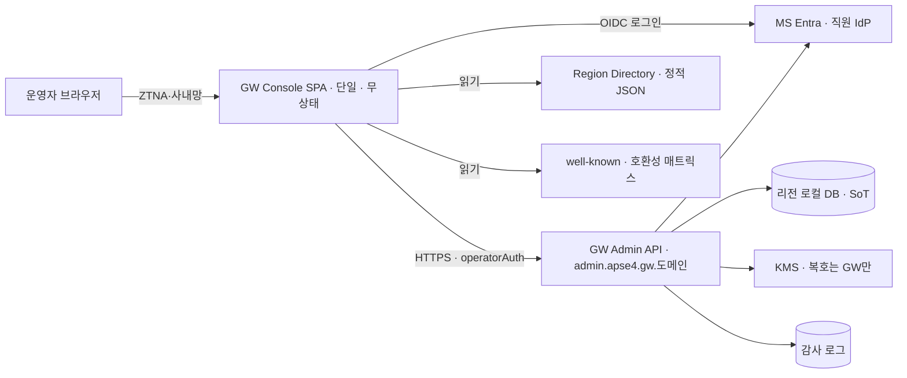
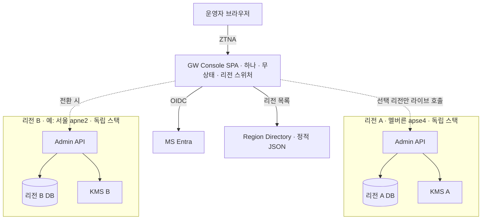
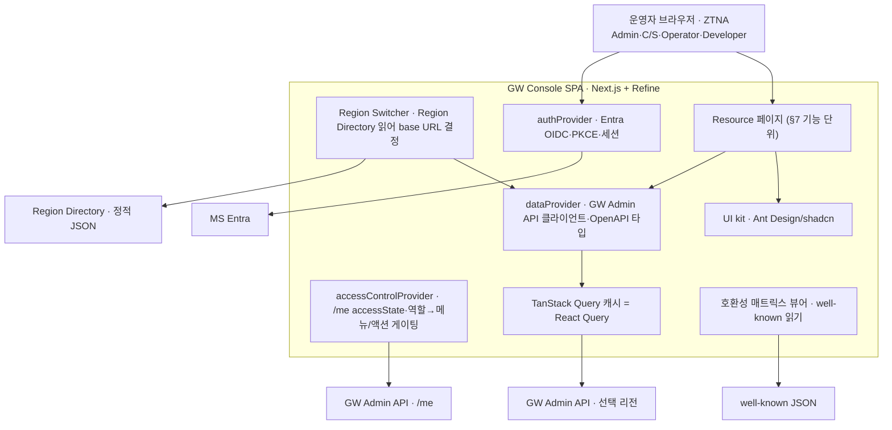
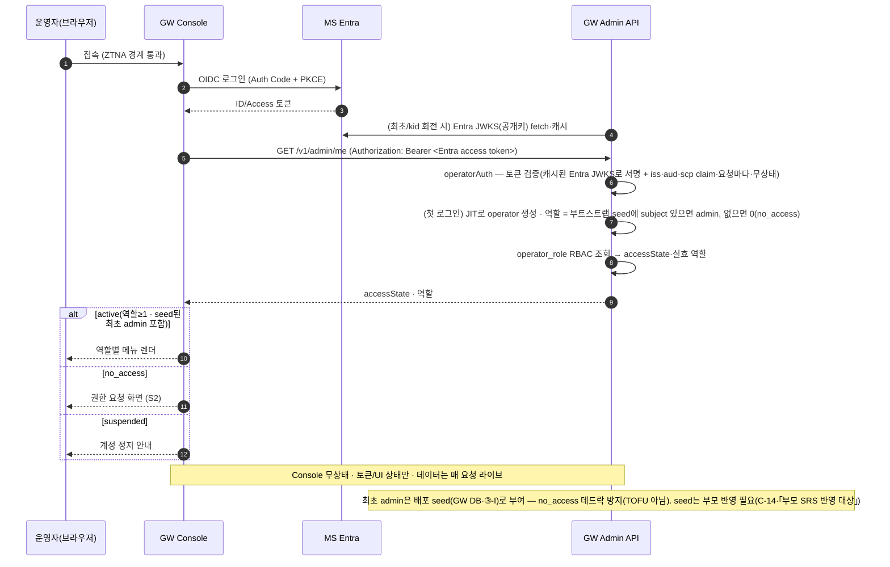
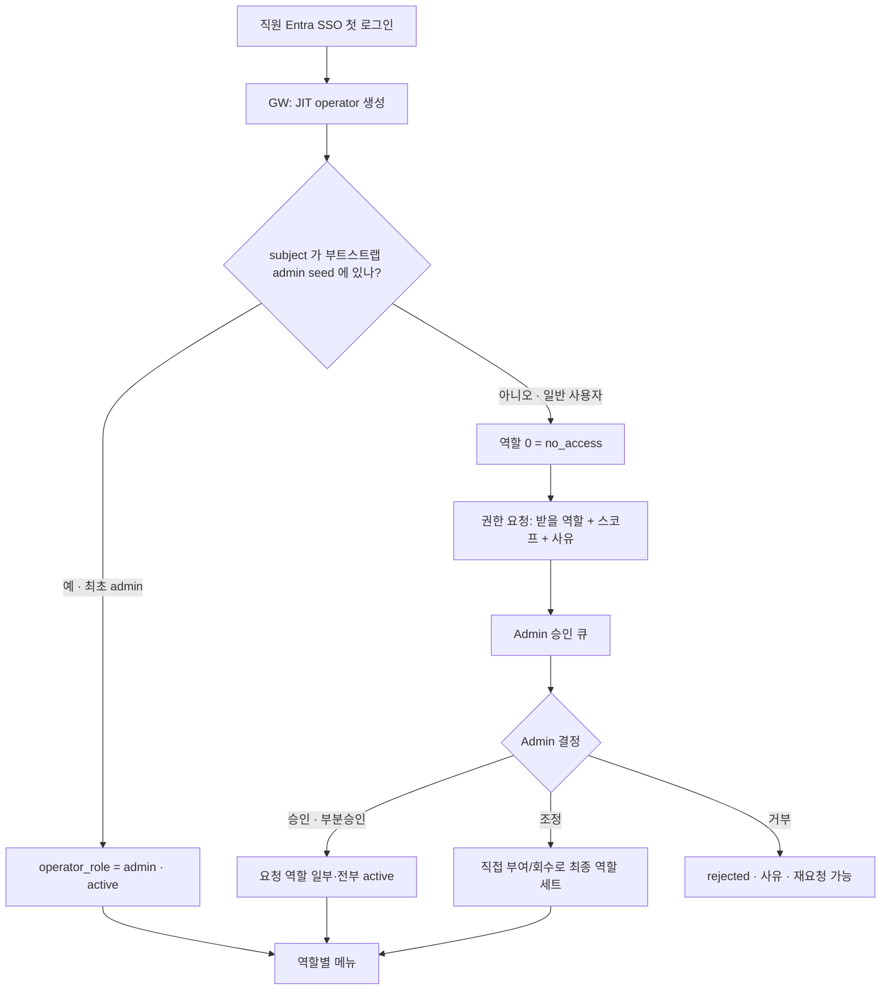
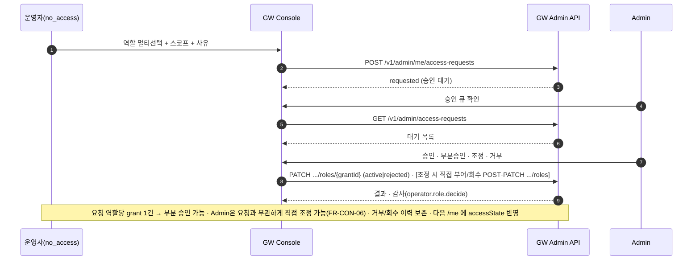
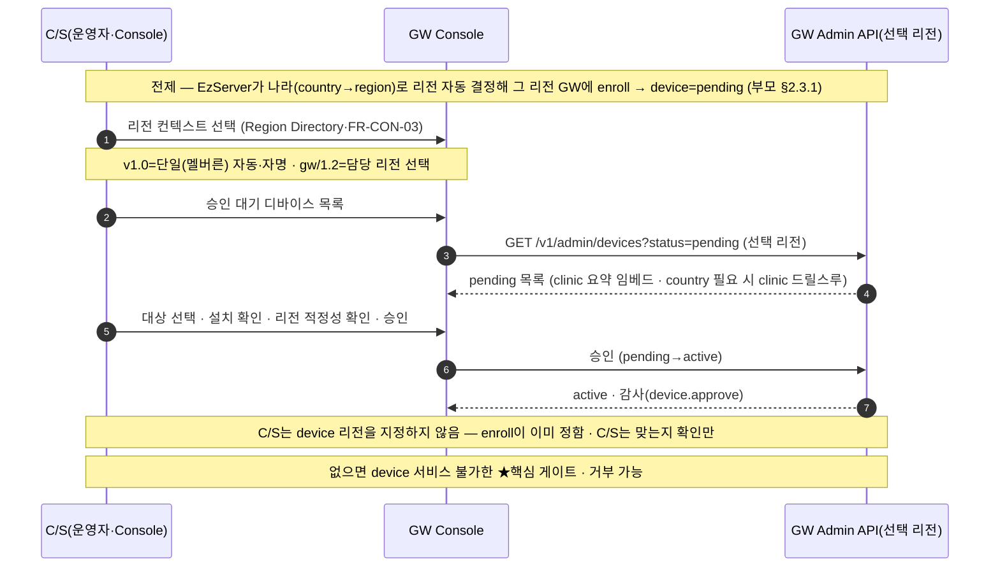
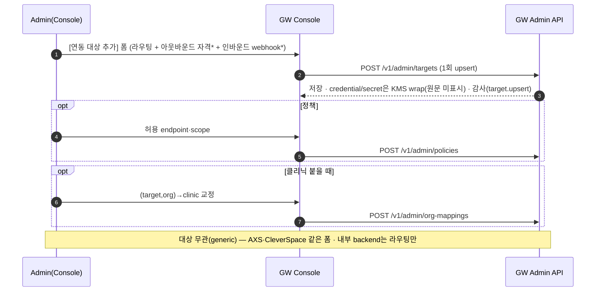
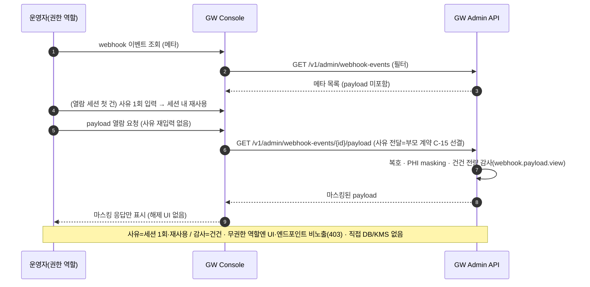

# GW Console Sub-SRS (③-C)

create by: 전규현(Raymond)

> **문서 상태.** ③ GW SRS baseline(`spec-v1.0.10`) 후 `_status.md` 씨앗을 승격한 **초안(v0.11 · baseline 동결 가능 · v0.8 구조·§4.2 화면 맵·§6.10 국제화(PO→Lingui) · v0.9 재검증 · v0.10 Admin API 커버리지 감사(26/26)·§1.5 정본 URL · v0.11 사장님 리뷰 반영(S1 Entra 토큰 검증 명시 등·진행))**. 부모 = **GW SRS**(`vt-api-gateway/docs/specs/SRS.md`). ABC 스펙 표준(spec-philosophy·spec-standard·spec-writing-tips) 정합 리라이트 반영.

---

# 1 Introduction (개요)

## 1.1 Purpose (목표)
본 문서는 **GW Console(③-C)의 소프트웨어 요구사항을 규정하는 Sub-SRS**다. 부모 GW SRS가 정의한 관리 계약(§7.9.1 Admin API·§7.9.2 RBAC·§7.1.4 운영자 OIDC·§7.9.3 감사 등)을 **상속**하되, Console을 하나의 **독립 규격**으로 완성한다 — 부모에 이미 규정된 GW 백엔드 동작은 참조로 두고, 본 문서는 **Console 고유 요구(화면·플로우·가드·마스킹·오류·동시성)** 를 정본으로 담는다.

> **"Sub-SRS"의 의미:** 여기서 Sub는 **GW와의 관계**(범위·계약 종속)를 뜻하며 완성도를 뜻하지 않는다. **계약(Admin API·데이터 모델)의 소유는 부모 GW SRS**이고 Console은 이를 소비만 하지만, **문서 자체는 §1~§7 + Appendix를 갖춘 독립적으로 읽히는 완결 SRS**이며 Console 개발팀(③-C)의 governing SRS다.

- **작성 맥락:** 사내 개발용. Console v1.0을 온보딩 승인 흐름과 함께 조기 착수하기 위해, v1.0을 **완전 규격**으로, v2.0을 **방향·확장점 수준**으로 한 문서에 담는다(§1.3 단계 규약).
- **상세도(Case):** Console은 **PHI(§1.4) 취급(break-glass)·의료 규제(IEC 62304/ISO 13485)·신규 도메인·다수 화면·15+ API** → spec-philosophy §3 기준 **Case C(고상세)** 로 작성한다(특히 §4·§6·§7 에러·검증·감사).
- 대상 독자·읽는 법은 §1.6.

## 1.2 Product Scope (범위)
GW가 클리닉 EzServer를 온보딩하고 외부(AXS 등)·내부(CleverSpace 등) 연동을 중계하려면 **운영자가 디바이스를 승인·관리하고 연동을 등록·통제할 수단**이 반드시 필요하다. 이 수단이 없으면 enroll된 디바이스를 `active`로 만들 사람이 없어 **GW 서비스 자체가 시작되지 않는다.** GW Console은 이 **운영 통제면**을, 사내 직원이 안전하게(직원 IdP·최소권한·전량 감사) 다루도록 제공한다.

**핵심 역할 (대표):**
- **디바이스 개통·통제** — C/S 현장 설치 승인(★개통 게이트)·수명주기(정지·차단).
- **연동 통제** — 연동 대상(AXS·CleverSpace 등) 등록·정책·매핑을 *대상 무관* 화면으로.
- **관측·통제 열람** — fleet·감사 조회 및 PHI webhook의 통제된 break-glass 열람.

**성격·경계:**
- **GW Admin API 프론트엔드** — 자체 데이터 저장소·비즈니스 로직 없음(GW가 SoT).
- **무상태·리전 스위처** — 데이터 주권(region silo)을 위해 교차리전 집계·저장을 하지 않는다.
- 개별 기능 상세는 §2.4·§7.

**Will not do (의도적 제외):**
- **GW 데이터 SoT·직접 DB/KMS 접근** — Console은 열람·조작을 모두 GW Admin API 경유로만 한다(주권·보안 경계; 직접 접근은 도메인 경계 붕괴).
- **PHI payload 복호·평문 표시** — 복호·마스킹은 GW가 하고 Console은 마스킹 결과만 표시한다(규제·PHI 최소노출).
- **EzServer device-self 평면**(`/v1/clinics/me/*`) — actor가 디바이스라 운영자 콘솔과 다르다(혼동 방지·§7.4 note).
- **호환성 매트릭스 저작** — 저작은 git/CI(부모 §7.7.5), Console은 읽기 전용 뷰어만(런타임 가변 저장소 재도입 금지).
- **Region Directory 발행** — ③-I 소관(Console은 읽기만).
- **디바이스·클리닉 수동 등록(예외 경로)** — 부모 `POST /v1/admin/devices`·`POST /v1/admin/clinics`(운영자 수동 등록·교정)는 일상 경로가 아니라 **v1.0 Console UI에 두지 않는다**(필요 시 API 직접 호출·주 경로=enroll 자동).
- **접근성(키보드·스크린리더) 정식 준수** — 사내 전용 어드민이라 v1.0 정식 접근성 인증 목표는 두지 않는다(기본 시맨틱 HTML만). 대외 공개 시 재검토.

## 1.3 Document Conventions (문서규칙)
- **단계 규약(우선순위 대용):** 각 요구에 **[v1.0]** 또는 **[v2.0]** 태그. `[v1.0]`은 다시 **필수**(없으면 서비스 불가)/**주요**(필수 아니나 주요)로 나뉘고, `[v2.0]`은 부가·확장·고급이다. 분류 기준·전체 표 = 동 폴더 `기능-v1-v2-분리.md`(요약은 §2.7).
  - **부모 P1/P2/P3 매핑(참고):** 부모 GW SRS는 절별 `(P1/P2/P3)` 우선순위를 쓴다. 대응 = **[v1.0]필수 ≈ P1 · [v1.0]주요 ≈ P2 · [v2.0] ≈ P3+**. 본 Sub-SRS는 단계(버전) 축으로 표기하고 우선순위는 이 매핑으로 환산한다.
- **동사 규약(writing-tips §3.1):** 필수="~해야 한다/한다", 권장="~하는 것이 좋다", 선택="~할 수 있다", 비목표="~하지 않는다".
- **상속:** 상위 절의 단계 태그는 하위에 상속된다(하위에 별도 표기 없으면 상위 따름). 상위가 [v2.0]인데 하위만 [v1.0]일 수 없다.
- **표기:** 색깔만으로 정보를 전달하지 않는다(텍스트 표기 우선). 부모 참조는 `부모 §X`, FR 식별자는 `FR-CON-NN`.

## 1.4 Terms and Abbreviations (정의 및 약어)
> 이해관계자 일부가 모를 수 있는 용어만. (JWT·HTTPS 등 자명한 용어는 제외.)

| 용어 | 정의 |
| --- | --- |
| **운영자(operator)** | Console 사용자 = 사내 직원(Admin·C/S·Operator·Developer). 부모 §7.9.2. |
| **Entra** | MS365/Entra ID. 직원 IdP·Console SSO(OIDC) 발급자. 부모 §7.1.4. |
| **RBAC** | 역할 기반 인가. 역할=`operator_role_type`{admin·developer·cs·operator}. authN=Entra·authz=GW. |
| **break-glass** | 통제된 PHI payload 예외 열람(GW 복호·마스킹·사유·전량 감사). |
| **ZTNA** | Zero Trust Network Access. Console 페이지 접근 경계(③-I). |
| **Region Directory** | 리전→`apiHost`·`webhookHostPattern` 정적 JSON(③-I 발행·부모 §7.3.6). |
| **target(연동 대상)** | 외부/내부 연동 1건(라우팅+아웃바운드 자격+인바운드 webhook)을 담는 GW 레지스트리 레코드. |
| **PHI** | Protected Health Information — 보호 대상 건강정보(환자정보). webhook payload에 포함될 수 있어 저장·열람을 통제(§6.2·§7.6). |

## 1.5 Related Documents (관련문서)
> 링크는 **정본 repo의 클릭 가능한 URL**로 적는다(로컬/상대 경로 금지). 부모 계약 3종은 **baseline 태그(`spec-v1.0.10`) 고정 permalink**로 — 시간이 지나도 끊기지 않도록.

- **부모 GW SRS** — [vt-api-gateway `docs/specs/SRS.md` @spec-v1.0.10](https://dev.azure.com/ewoosoft/es-platforms/_git/vt-api-gateway?path=/docs/specs/SRS.md&version=GTspec-v1.0.10). Console 상속 근거: §7.9.1·§7.9.2·§7.1.4·§7.9.3·§7.6.3·§7.7.5·§7.8·§7.3.6.
- **Admin OpenAPI** — [vt-api-gateway `design/openapi/vt-api-gateway.openapi.yaml` @spec-v1.0.10](https://dev.azure.com/ewoosoft/es-platforms/_git/vt-api-gateway?path=/docs/specs/design/openapi/vt-api-gateway.openapi.yaml&version=GTspec-v1.0.10) (계약 정본·타입 생성 원천).
- **부모 DBML** — [vt-api-gateway `design/dbml/vt-api-gateway.dbml` @spec-v1.0.10](https://dev.azure.com/ewoosoft/es-platforms/_git/vt-api-gateway?path=/docs/specs/design/dbml/vt-api-gateway.dbml&version=GTspec-v1.0.10) (데이터 모델).
- **기능 v1/v2 분리** — [본 Sub-SRS 동 폴더 `기능-v1-v2-분리.md`](https://dev.azure.com/ewoosoft/es-platforms/_git/vt-api-gateway?path=/docs/specs/03c-subsrs-gw-console/기능-v1-v2-분리.md)(승격 후 co-located).

## 1.6 Intended Audience and Reading Suggestions (대상 및 읽는 방법)
> 범례: `1`=훑어 이해 · `2`=자세히 읽어 업무 반영 · `—`=불요.

| 챕터 | PM/기획 | 백엔드(GW) | 프론트(③-C) | QA | 보안 | ③-I(인프라) |
| --- | --- | --- | --- | --- | --- | --- |
| 1.2 Scope | 2 | 1 | 1 | 1 | 1 | 1 |
| 2 Overall | 2 | 2 | 2 | 2 | 1 | 2 |
| 4 Interface | 1 | 2 | 2 | 2 | 2 | 2 |
| 6 보안/제약 | 1 | 1 | 2 | 1 | 2 | 2 |
| 7 기능 | 1 | 2 | 2 | 2 | 2 | — |
- 처음 읽는 사람은 §1.2 → §2.7(단계) → §2 → §7 순을 권한다. 인증·RBAC(§7.1·§7.2)이 모든 화면의 전제다.

## 1.7 Project Output (프로젝트 산출물)
### 1.7.1 Output Format (산출물 형태)
**Web Application (SPA)**. 사내 배포 · ZTNA 경유 접근.

### 1.7.2 Output Name and Version (산출물명(가칭) 및 버전)
**GW Console** (가칭). 레포(추천) `vt-api-gateway-console`(미생성). 초기 버전 v1.0.

### 1.7.3 Patent Information (특허 출원 유무 및 내용)
None.

---

# 2 Overall Description (전체 설명)

## 2.1 Product Perspective (제품 조망)
Console은 **GW 생태계의 관리 프론트엔드**로, GW Admin API의 클라이언트다. 외부 시스템과의 관계는 아래와 같다.

**외부 시스템·액터 (누락 점검):**
| 대상 | 카테고리 | 역할 |
| --- | --- | --- |
| **운영자** | 외부 액터 | Console 사용자(Admin·C/S·Operator·Developer). |
| **MS Entra** | 외부 플랫폼(IdP) | 직원 SSO(OIDC) 로그인·토큰 발급. Console authN 위임. |
| **GW Admin API** | 회사 내부 시스템 | 모든 관리 동작의 백엔드(리전별 `admin.<region>.gw.<도메인>`). |
| **Region Directory** | 외부 데이터 소스 | 리전 목록·라우팅 메타(정적 JSON·③-I 발행). |
| **well-known 호환성 매트릭스** | 외부 데이터 소스 | 실효 매트릭스 읽기(뷰어). |
| **ZTNA/사내망** | 인프라 경계 | Console 페이지·admin 엔드포인트 접근 통제(③-I). |

### 2.1.1 v1.0 — 단일 리전 조망

v1.0 production = 멜버른(apse4) 단일이라 리전 스위칭이 자명.

### 2.1.2 gw/1.2 — 멀티리전 조망 (region silo)

- **주권 유지**: 리전 스택은 서로 배선되지 않음(교차리전 서버 경로 없음). Console은 **한 번에 한 리전만** 라이브 호출·표시(교차리전 집계·저장 없음). PHI 포함 리전 데이터는 각 리전 DB에 at-rest.
- 리전 추가 = 스택 + Region Directory 행 추가일 뿐(기존 리전 무영향).

## 2.2 Overall System Configuration — GW Console 내부 구성 (Refine + Next.js)
**컴포넌트 도출 기준 = 기술 스택(권장 Refine·핵심 결정 B)의 책임 경계.** Refine의 provider 3종이 각각 Entra·GW Admin·Region Directory에 매핑되고, 기능은 Resource 페이지로 나뉜다(§7과 1:1). Console 자체 저장소·비즈니스 로직은 없다(§6.4).

- **authProvider** = Entra OIDC 로그인·토큰·세션(§7.1). **accessControlProvider** = `/me` accessState·역할로 메뉴·액션 게이팅(§7.2·최소권한). **dataProvider** = GW Admin API 소비(OpenAPI 타입·리전 base는 Region Switcher 주입) + TanStack Query 캐시. **Resource 페이지** = §7 기능 단위. (프레임워크 확정 시 내부 구성 조정·§6.6.)
- **훔쳐보기 금지(writing-tips §7):** Console은 GW Admin API 외 어떤 내부 경로(DB·KMS·GW 내부 모듈)도 직접 호출하지 않는다.

## 2.3 Overall Operation (전체 동작방식) — 주요 시나리오·플로우
주요 시나리오(부모 §2.3 방식과 정렬): **S1** 로그인·부트스트랩 · **S2** 권한 요청→승인 · **S3** 디바이스 enrollment 승인(핵심) · **S4** 연동 대상 등록 · **S5** payload break-glass 열람 · **S6** 리전 스위칭.

### 2.3.1 S1 — 로그인·부트스트랩

### 2.3.2 S2 — 온보딩: 최초 admin 부트스트랩 · 권한 요청→승인

> **부트스트랩 seed 정책:** 최초 admin은 **GW DB seed**(③-I 배포 시 초기 admin의 Entra `oid` 지정·Entra 그룹 아님 — authz=GW DB 원칙)로 부여한다. seed 부여는 백엔드 계약이라 **부모 SRS 반영이 필요**하다(Appendix B **C-14** · 「부모 SRS 반영 대상」).

**온보딩 상태 결정 (상황별).** 최초 admin은 seed로, 이후 사용자는 요청→승인으로 온보딩된다 — "먼저 로그인한 사람이 admin"(TOFU)은 쓰지 않는다.

**권한 요청→승인 (일반 사용자).** Admin은 요청을 **그대로 승인·부분 승인·조정·거부** 할 수 있다.

### 2.3.3 S3 — 디바이스 enrollment 승인 (C/S · 핵심)

> **혼란 방지 — 리전은 "선택"이 아니라 "확인".** device의 리전은 enroll 시 EzServer가 나라로 자동 결정해 이미 그 리전 DB에 있다. C/S가 하는 일은 (1) **콘솔의 리전 컨텍스트**를 그 리전으로 두고(스위처·v1.0 단일이라 자동) (2) 배정이 **맞는지 확인**하는 것이지 device에 리전을 부여하는 것이 아니다. 틀렸으면 승인하지 않고 재-enroll/마이그레이션으로 교정한다(부모 §2.3.1·§7.3.4).

### 2.3.4 S4 — 연동 대상(target) 등록

### 2.3.5 S5 — payload break-glass 열람

### 2.3.6 S6 — 리전 스위칭
1. Console은 Region Directory에서 리전 목록·`apiHost`를 읽는다.
2. 운영자가 대상 리전을 선택하면 이후 API 호출 base = `admin.<region>.gw.<도메인>`.
3. 화면은 선택 리전만 라이브 호출·표시한다(교차리전 집계·저장 없음·주권 유지).
4. v1.0=단일(멜버른)이라 선택지가 하나다. gw/1.2=Region Directory 행만 늘어난다(§2.1.2·FR-CON-03).

## 2.4 Product Functions (제품 주요 기능 — §7과 1:1)
- **운영자 로그인·세션**(§7.1) — 직원 SSO로 안전하게 콘솔에 들어온다.
- **권한 관리(RBAC)**(§7.2) — 역할을 요청·승인하고 최소권한으로 화면을 연다.
- **디바이스 관리·수명주기**(§7.3) — 승인·정지·차단(kill)까지 현장 디바이스를 통제한다.
- **클리닉 관리·관계**(§7.4) — 클리닉·소속 디바이스·연동 상태를 한 화면 맥락에서 본다.
- **연동 대상 관리**(§7.5) — AXS·CleverSpace 등 어떤 대상이든 같은 화면으로 붙인다.
- **Webhook 이벤트·PHI 열람**(§7.6) — 이벤트를 추적하고 필요 시 통제된 열람을 한다.
- **Fleet·SW 인벤토리**(§7.7) — 온라인·버전 현황과 클리닉별 설치 SW를 본다.
- **중앙 config 관리**(§7.8) · **호환성 매트릭스 뷰어**(§7.9) · **감사 조회**(§7.10).
- **공통 UX·세션·오류·동시성**(§7.12) · **[v2.0] 확장·고급**(§7.11).

## 2.5 User Classes and Characteristics (사용자 계층과 특징)
> Console 사용자는 모두 **운영자·관리자 카테고리(사내 직원)** 다 — 최종 소비자·B2B 파트너·device-self는 대상이 아니다(그 경계는 §1.2 Will-not-do). 정본 역할 정의 = 부모 §7.9.2.

| 역할 | 특성 | 사용 빈도 | 주 기능(§7) | 기술 수준 | 권한 | 중요도 |
| --- | --- | --- | --- | --- | --- | --- |
| **admin** | 사내 관리자·전권 운영 | 수시 | 운영자/역할 승인·연동·정책·전체 | 높음 | 전체 관리(global) | 최고 |
| **cs**(현장 설치) | 현장 설치 담당자·개통 승인자 | 설치 이벤트 시 | **디바이스 enrollment 승인**·클리닉 조회 | 중 | 전 클리닉 승인(global) | 최고(서비스 개통 게이트) |
| **operator** | 운영 모니터링 담당 | 일 단위 | fleet·webhook·감사 조회 | 중 | 조회·운영 | 중 |
| **developer** | 디버깅·조회 개발자 | 필요 시 | webhook·감사·config 조회·디버깅 | 높음 | 조회 | 중 |
| (no_access) | 로그인만 된 미부여 직원 | — | 권한 요청 화면만 | — | 없음 | — |

## 2.6 Assumptions and Dependencies (가정과 종속 관계)
| 가정/의존 | 소유 | 실패/미충족 시 영향 |
| --- | --- | --- |
| **Entra 테넌트·앱 등록**(claim·app role) | IT(부모 Appendix B #40·#38·Appendix C-2) | 로그인·통합 테스트 불가(§7.1). SRS 집필은 비차단. |
| **GW Admin API baseline**(계약 안정) | GW(부모 §7.9.1·OpenAPI) | 계약 변동 시 영향 화면 재검토(§2.8). 현행 baseline 충족. |
| **접근 경계**(Istio 내부전용 + ZTNA) | ③-I | 미비 시 배포 보안 공백. Console은 경계 뒤 동작(§6.2). |
| **역할 enum 동기**(GW·Console·DB) | GW+③-C | 새 역할은 양측 함께 릴리스(§7.2·런타임 무릴리스 추가 없음). |
| **Region Directory·well-known 발행** | ③-I | **v1.0 배포 선결**(gw/1.2 아님·부모 §7.3.6 P1) — Region Directory는 Console 리전 스위처(FR-CON-03)뿐 아니라 **EzServer 부트스트랩(enroll)의 유일한 앵커**라 v1.0에 반드시 있어야 한다(v1.0=한 리전 1행). 미발행 시 리전 스위처·매트릭스 뷰어 동작 불가 + EzServer 온보딩 불가(§7.9·FR-CON-03). |

## 2.7 Apportioning of Requirements (단계별 요구사항)
| 단계 | 범위 | 대표 |
| --- | --- | --- |
| **v1.0** | 필수(인증·RBAC·**디바이스 승인**·디바이스 관리·클리닉 조회·감사) + 주요(연동 대상·정책·매핑·webhook 조회·break-glass·fleet·config·매트릭스 뷰어·공통 UX/동시성) | §7.1~7.10·7.12 |
| **v2.0** | 온보딩 마법사·연동 가입/구독 관리·고급 감사 분석·config rollout·SW 인벤토리 추세·역할 카탈로그 편집·멀티리전 운영 뷰 | §7.11 |

**미래 계획이 현재 아키텍처에 주는 영향(필수 점검):**
- **gw/1.2 멀티리전** → 지금부터 **단일 Console·리전 스위처·무상태**(§2.1.2·FR-CON-03)로 설계해, 리전 추가가 코드 변화 없이 흡수되게 한다.
- **다국적 운영자** → §6.10 i18n(한/영) 골격을 v1.0부터 둔다.
- **격리 존(중국 등) 진출** → **도메인 규약이 존 전용 Console 독립 배포를 수용**해야 한다(§4.5) — global 단일 호스트 + per-zone 호스트 여지를 **별도 GW 도메인 설계(Appendix C-10)** 부터 확보한다.
- **경계 확인(제품/일정):** v1.0에 실제 등록·운영할 연동 대상 시점(내부 라우팅=v1.0, 외부 AXS=④ 연동 착수) — Appendix C-1.

## 2.8 Backward compatibility (하위 호환성)
신규 제품이라 자체 하위호환 대상 없음(**N/A**). 단 Console은 **GW Admin API 버전에 종속**되므로, GW 계약 변경(부모 spec-vX) 시 영향 화면을 변경 관리로 재검토한다(계약 정본=OpenAPI). GW가 하위호환 계약(예약 필드·비파괴)을 지키는 한 Console은 무중단 재배포로 따라간다.

---

# 3 Environment (환경)

## 3.1 Operating Environment (운영 환경)

### 3.1.1 Hardware Environment (하드웨어 환경)
운영자 PC(사무). 서버측은 GW 배포 인프라(③-I·EKS)에 얹히며 별도 하드웨어 요구는 없다.

### 3.1.2 Software Environment (소프트웨어 환경)
클라이언트는 **최신 상록(evergreen) 브라우저**(Chrome·Edge·Firefox)를 지원한다. 구형 IE는 지원하지 않는다(웹앱). 접근은 ZTNA 경계를 경유하며 HTTPS를 필수로 한다. (템플릿의 Windows OS 지원 표는 웹앱이라 **N/A**.)

## 3.2 Product Installation and Configuration (제품 설치 및 설정)
웹으로 배포하며 별도 설치툴은 없다. 런타임 config는 리전별 GW Admin 엔드포인트, Entra OIDC 설정(발급자·clientId·audience·리다이렉트 URI), Region Directory URL이다.

SRS는 앱이 **소비하는 config 키(위)와 인증 요구**(OIDC Auth Code+PKCE·필요 클레임/앱 역할→운영자 역할 매핑=부모 §7.1.4·§7.9.2)만 규정한다. **Entra 테넌트·앱 등록·리다이렉트 URI·클레임/역할 발급 등 *설정 절차*는 SRS 범위 밖**(운영 런북)으로 **[Entra 설정 가이드](Entra-설정-가이드.md)**(IT/③-I 소유·GW 공용·living)에서 다룬다.

## 3.3 Distribution Environment (배포 환경)

### 3.3.1 Master Configuration (마스터 구성)
컨테이너 이미지로 SPA 정적 자산을 서빙한다. CD 매체 배포는 아니다(N/A).

### 3.3.2 Distribution Method (배포 방법)
③-I가 **AWS 클라우드에 배포**한다 — SPA 정적 자산을 **S3 + CloudFront**(global 단일 호스트 `console.gw.<도메인>`·§4.5) 등 ③-I 표준으로 서빙한다(EKS 서빙도 가능·구체=③-I). "사내"는 배포 *위치*가 아니라 **접근 통제**를 뜻한다 — 공개 인터넷에 두되 **ZTNA + Entra**로 사내 직원만 접근한다(§6.2). 격리 존(중국 등)은 그 존 인프라에 별도 배포한다(§4.5). CI/CD는 GW와 동일 파이프라인(③-I·§3.6.2).

### 3.3.3 Patch/Update Method (패치와 업데이트 방법)
무중단 재배포(정적 자산 교체)로 갱신하며, 클라이언트는 새로고침으로 최신본을 받는다.

## 3.4 Development Environment (개발 환경)

Console은 **GW Admin API·Entra(OIDC)·정적 자원(Region Directory·well-known 매트릭스)** 에 의존하는 SPA다. 이들이 모두 준비되기 전에도 개발할 수 있도록, 로컬에서 SPA를 띄우고 각 의존을 **실 dev/staging · mock · 정적 스텁**으로 대체한다. **PHI는 개발에서 실데이터를 쓰지 않는다** — dev/test는 더미만이며, Console은 어차피 마스킹된 응답만 표시한다(§6.2·부모 §3.4 원칙).

**개발 의존성 대체 (구축 필요 — 없으면 개발 불가)**

| 의존 | 역할 | 개발 환경 대체 |
| --- | --- | --- |
| **GW Admin API** | 모든 관리 데이터·동작(§7 전부) | ① **dev/staging GW Admin(실)** 연결 — 실데이터는 GW dev DB 시드(부모 §3.5 시드/E2E 하네스) · ② 또는 **OpenAPI 기반 mock 서버**(예 Prism)로 계약만으로 개발 · ③ 컴포넌트 단위는 **MSW**(브라우저 요청 가로채기)로 화면 먼저 개발 |
| **Entra(OIDC)** | 운영자 인증 | **dev 테넌트** 또는 **OIDC mock**(로컬 로그인 우회·역할 클레임 주입) — 절차는 §3.2·[Entra 설정 가이드] |
| **`GET /me` accessState·역할** | RBAC 게이팅(§7.2) | mock/dev에서 **accessState 3케이스(active·no_access·suspended)와 역할 조합**을 주입해 분기 화면 개발 |
| **Region Directory** | 리전 목록·라우팅 메타(§7.1·FR-CON-03) | 로컬 **정적 JSON 사본**(dev 리전 1행=`apne2`) |
| **well-known 호환성 매트릭스** | 뷰어(§7.9) | **정적 JSON 스텁** |

**개발 워크플로 (권장 순서)**
1. **계약 소비 배선** — GW **OpenAPI에서 타입·API 클라이언트 생성**(예 orval/openapi-typescript). 계약 변경 시 재생성(§6.3.2).
2. **로컬 기동** — SPA 기동(`pnpm dev`)·아래 env 주입.
3. **의존 연결** — 초기엔 **mock/MSW + OIDC mock**로 화면·RBAC 분기 개발 → 이후 **dev/staging GW + dev Entra 테넌트**로 실연동 검증.
4. **역할별 개발** — accessState·역할을 주입해 admin/cs/operator/developer 화면과 403·no_access·suspended를 모두 개발(§7.2·§7.12).

**환경 config 키 (로컬 `.env` — 값은 환경별)**
- `GW_ADMIN_BASE`(리전별 `admin.<region>.gw.<도메인>` · dev=`apne2`) · `REGION_DIRECTORY_URL` · `WELLKNOWN_URL`
- `ENTRA_ISSUER` · `ENTRA_CLIENT_ID` · `ENTRA_AUDIENCE` · `ENTRA_REDIRECT_URI`
- `AUTH_MODE`(dev에서 `mock`|`entra` 전환 — 로컬 OIDC 우회용·prod 금지)

### 3.4.1 Hardware Environment (하드웨어 환경)
특별 HW 요구 없음 — 표준 개발 PC. 로컬 SPA 빌드·(선택) mock 서버·Docker 컨테이너 구동 가능 사양이면 충분하다.

### 3.4.2 Software Environment (소프트웨어 환경)
Node.js(LTS) · **pnpm**(조직 표준) · **Next.js + Refine** · **TanStack Query**(=React Query) · UI kit(Ant Design 또는 shadcn/ui) · **OpenAPI 코드젠**(orval/openapi-typescript) · **MSW**(요청 mock) · **Playwright**(e2e) · Docker(로컬 GW/의존 구동·선택) · **Claude Code**(개발 표준) · VS Code. 구체 버전은 구현 착수 시 확정(§6.6 스택은 ③-C LLD 확정).

## 3.5 Test Environment (테스트 환경)

테스트(staging)는 **운영 유사·축소** 환경으로 통합·E2E·인수 검증을 수행한다. 개발(로컬·mock 위주·§3.4)과 달리 **가능한 한 실 staging GW·Entra에 붙여** 계약·인증 경로를 검증한다.
- **대상 GW**: staging GW Admin API(실). 데이터는 GW의 **시드/E2E 반복성 하네스**(부모 §3.5·globalSetup migrate+seed·resetState TRUNCATE+캐시 flush·tx 격리)로 **결정적 상태**를 만든다.
- **인증**: Entra **테스트 테넌트**(실 OIDC) — dev의 OIDC mock과 달리 실 로그인·역할 클레임→운영자 역할 매핑 경로를 검증(§3.2·§7.2).
- **정적 자원**: staging Region Directory·well-known(실 발행본 또는 staging 사본).
- **데이터**: **더미만(PHI 금지)** — 운영 PHI를 테스트에 반입하지 않는다(§6.2). break-glass 열람은 **더미 PHI + 마스킹** 경로로만 검증.
- **검증·게이트**: 계약 기반 **E2E(Playwright)** 로 역할별 화면·403·no_access·suspended·break-glass·**stale write 감지·충돌 경고**(FR-CON-36)를 커버한다. CI(§3.6.2)에서 테스트 통과를 게이트로 둔다.

### 3.5.1 Hardware Environment (하드웨어 환경)
클라우드(AWS staging)·운영 §3.1.1 축소본. Console은 무상태 SPA라 별도 서버 HW 요구가 없다(정적 서빙).

### 3.5.2 Software Environment (소프트웨어 환경)
개발(§3.4.2)과 동일 스택의 축소본 + **Playwright**(E2E)·계약 기반 목(필요 시). 구체 버전·도구는 구현 착수 시(LLD) 확정한다.

## 3.6 Configuration Management (형상관리)

### 3.6.1 Location of Outputs (산출물 위치)
정본 위치는 현재 `scp-architecture/…/03c-subsrs-gw-console/`이다. **이관 트리거**는 `vt-api-gateway-console` repo 생성 시점으로, 그때 본 SRS·기능분리 문서를 그 repo `docs/`로 옮기고 여기에는 리다이렉트 스텁만 남긴다(부모 GW SRS의 03-srs-gateway stub 방식과 동일).

### 3.6.2 Build Environment (빌드 환경)
③-I/조직 표준 CI를 사용한다.

## 3.7 Bugtrack System (버그트래킹)
Jira(GW 프로젝트).

## 3.8 Other Environment (기타 환경)
없음.

---

# 4 External Interface Requirements (외부 인터페이스 요구사항)

## 4.1 System Interfaces (시스템 인터페이스)
- **GW Admin API**(부모 §7.9.1·OpenAPI 정본) — 모든 관리 동작의 백엔드. 인증=요청별 `operatorAuth`(Entra Bearer). 리전 base=`admin.<region>.gw.<도메인>`. *상세 시그니처·payload·상태코드는 OpenAPI(SSOT), 본 문서는 목적·동작·에러만.*
- **MS Entra(OIDC)** — Authorization Code + PKCE. discovery·JWKS 표준.
- **Region Directory / well-known 매트릭스** — 정적 JSON 읽기(③-I 발행).

## 4.2 User Interface (사용자 인터페이스)
논리 요구(레이아웃·컴포넌트 상세 = UI 명세/LLD·Appendix C-7):
- 좌측 내비 = **역할별 메뉴**(권한 없는 항목 비노출). 상단 = 리전 컨텍스트·로그인 사용자.
- **마스킹**: credential/secret·PHI payload는 원문 미표시(해제 UI 없음).
- **파괴적 액션 가드**: kill 등은 확인 다이얼로그·사유·위험색 구분(§7.3·§6.1).
- 목록: 서버측 필터(정확 일치)·커서 페이지네이션(부모 §7.9.1 조회 규약).
- 접근성 = §1.2(Will not do) · i18n = §6.10.

**화면 맵 (스크린 인벤토리).** 화면은 **§7 기능 그룹과 1:1**이며 Refine Resource 페이지로 스캐폴딩한다(§2.2). 아래는 만들 화면의 전체 목록(구현 커버리지 기준)이다. 라우트는 예시이고, **역할 게이팅 정밀 규약 = 각 FR-CON·accessControlProvider(§7.2)**, **시각 레이아웃·컴포넌트 상세 = LLD(Appendix C-7)**.

| 화면 (라우트·예시) | §7 | 담는 FR-CON | 주 역할 가시성 | 유형 |
| --- | --- | --- | --- | --- |
| 로그인·세션 (`/login`·OIDC 콜백) | 7.1 | 01·02 | 전원(미인증→로그인) | 인증 흐름 |
| 전역 크롬 — 리전 스위처·상단바·좌측 내비 | 7.1 | 03 | 전원(항목은 역할별 노출) | 전역 UI |
| 운영자·역할 (`/operators`) | 7.2 | 06 · 08(v2.0) | Admin | 목록·상세·역할 부여/회수·정지 |
| 권한 요청/승인 (`/access-requests`) | 7.2 | 04·05 | 요청=전원(no_access) · 승인=Admin | 본인 요청·Admin 승인 큐 |
| 디바이스 (`/devices`) | 7.3 | 09·10·11·12 | Admin · C/S(enroll 승인) | 목록·상세·수명주기 |
| 클리닉 (`/clinics`) | 7.4 | 13·14·15 | Admin · C/S | 목록·상세·편집 |
| 연동 대상·정책 (`/targets`) | 7.5 | 16·17·18·19·20 | Admin | 목록·상세·편집(generic) |
| Webhook 이벤트 (`/webhook-events`) | 7.6 | 21·22 | Admin · payload 열람=break-glass 역할(C-5) | 목록·단건·열람 |
| Fleet·SW 인벤토리 (`/fleet`·`/clients`) | 7.7 | 23·24·25 | Admin · C/S(뷰) | 대시보드·목록 |
| 중앙 config (`/config`) | 7.8 | 26·27 | Admin | 목록·편집·publish |
| 호환성 매트릭스 (`/compat-matrix`) | 7.9 | 28 | Admin · C/S(뷰) | 뷰어(읽기전용) |
| 감사 로그 (`/audit`) | 7.10 | 29·30 | Admin | 목록·조회 |
| [v2.0] 확장 화면 | 7.11 | 31·32 | (v2.0) | 후속 |

> **공통 동작(화면 아님).** §7.0(기본 정렬·UTC 표시·빈/로딩/오류 3상태)·§7.12(FR-CON-33~37: 세션·오류·stale write 감지)는 개별 화면이 아니라 **전 화면 공통 규칙**이다. 또한 **FR-CON-07**(역할 표기 규약 — 멀티선택·서열 UI 금지·CS=global 자동·거부/회수 이력 노출)은 §7.2 두 화면(운영자·권한 요청/승인) **공통 규약**이다. 시각 레이아웃·컴포넌트 상세는 SRS 범위 밖이며 **구현 단계에서 Refine 스캐폴딩 + 반복 확정**한다(§4.2 상단·Appendix C-7).

## 4.3 Hardware Interface
없음(하드웨어 직접 제어 없음).

## 4.4 Software Interface
GW Admin **OpenAPI**(타입 생성)·Entra OIDC. Console은 계약을 코드 생성으로 소비한다.

## 4.5 Communication Interface (통신 인터페이스)
**HTTPS 필수** · OIDC(Auth Code+PKCE) · ZTNA 경유(③-I). CORS/CSP 등 보안 헤더는 배포(§6.2·③-I).

**Console 접속 호스트 (URL 규약):**
- **기본 = 환경별 전역 단일 호스트** — **prod `console.gw.<도메인>` · dev `console.gw.dev.ezcld.net`**(환경 base 규약·staging=③-I). Console은 논리적으로 하나(결정 A)라 환경마다 접속 URL이 하나다. **리전 라벨을 붙이지 않는다.** 리전은 Console이 *호출하는* **Admin API base `admin.<region>.gw.<도메인>`**(FR-CON-03)에만 붙는다 — 전역 콘솔이 브라우저에서 각 리전 admin 엔드포인트를 스위칭 호출한다(콘솔 호스트 1개 ≠ 리전별).
- **격리 존 예외(중국 등)** — 네트워크·규제상 global 콘솔에 도달·허용되지 않는 존은 **그 존 전용 Console을 독립 배포**한다(같은 코드베이스·별 호스트 예 `console.<zone>.gw.<도메인>` 또는 존 전용 도메인·그 존만 서비스·global 스위처에 미포함). **도메인 규약은 이 per-zone 배포를 처음부터 수용**해야 한다.
- 구체 `<도메인>`은 **별도 GW 도메인**(vatech.com 미사용) 확정 후, 호스트 provisioning은 ③-I(Appendix C-10).

## 4.6 Other Interface
없음.

---

# 5 Performance requirements (성능 요구사항)
## 5.1 Throughput
관리 조작 위주·저 RPS(사내 소수 운영자).

## 5.2 Concurrent Session
동시 운영자 소수(수십 규모). 부모 §5의 device 트래픽과 별개.

## 5.3 Response Time
체감 응답 = **GW Admin API 응답 + 클라이언트 렌더**. Console 자체 지연은 렌더에 한한다. 목록·상세는 GW 응답을 받는 즉시 커밋해 렌더한다(인위적 추가 지연 없음·대량은 커서 페이지네이션 분할). **주의:** 부모 §5는 device control-plane 전용이라 **Admin API 전용 SLA가 없다** — Admin API 성능 목표(p95 등)가 필요하면 부모 SRS에 별도 절을 신설해야 한다(Appendix C-8·소유=GW·시점=성능 요구 시).

## 5.4 Performance Dependency
응답은 GW Admin API 응답 시간에 종속(상한). Console은 캐시(TanStack Query)로 재조회를 줄인다.

## 5.5 Other Performance Requirements
번들·메모리는 상록 브라우저 통상 범위. 별도 상한 없음.

---

# 6 Non-Functional Requirements (기능 이외의 요구사항)

## 6.1 Safety requirements (안전성)
- **kill-switch 등 파괴적·비가역 액션은 가드해야 한다** — 오조작이 클리닉 서비스 중단으로 직결되므로 확인·사유·권한 제한·감사 노출을 요구한다(§7.3).
- Console은 **PHI 평문을 저장·재노출하지 않는다**(GW 마스킹 응답만 표시).

## 6.2 Security Requirements (보안 요구사항)
- **authN=Entra SSO만**(자체 비밀번호·user 저장소 없음·부모 §7.1.4). **authz=GW 자체**(역할·스코프 판정=GW).
- **최소권한 UI** — 역할에 없는 기능은 비노출, 시도 시 GW 403.
- **마스킹·직접 접근 금지** — credential/secret·PHI payload 마스킹, DB/KMS 직접 접근 금지(모두 GW 경유·break-glass는 사유+감사).
- **전량 감사** — 모든 관리 변경·열람은 GW가 감사(부모 §7.9.3). Console은 이력 조회·표시.
- **접근 경계** = Istio 내부전용 + ZTNA(③-I·구체=Appendix C-3)·전 구간 HTTPS.

## 6.3 Software System Attributes
### 6.3.1 Availability
Console 다운은 GW 데이터 경로 무영향(관리면만). GW Admin API 가용성에 종속.

### 6.3.2 Maintainability
OpenAPI 타입 생성 소비로 계약 변경 추적. 역할·enum은 GW와 동기(§2.6).

### 6.3.3 Portability
상록 브라우저 표준 웹(특정 OS 비종속). 멀티리전 대비 base URL 주입 분리(§2.1.2).

### 6.3.4 Reliability
파괴적 액션은 서버 확정 후 반영(낙관적 반영 금지). 실패 시 명확한 오류·재시도(§7.12). 편집 충돌은 v1.0에서 **클라이언트측 stale write 감지·경고**(FR-CON-36)로 다루며, 서버 강제 잠금은 부모 계약 확장 시(Appendix C-11).

### 6.3.5 Remaining
Usability(역할별 명료 메뉴·가드/마스킹으로 오조작 방지)·Testability(계약 기반 e2e).

## 6.4 Logical Database Requirements
**Console 자체 DB 없음**(GW가 SoT). 로컬 상태=세션 토큰·UI 상태뿐. 데이터 모델=부모 DBML 참조.

## 6.5 Business Rules (비즈니스 규칙)
정본=부모 §7.9.2. 핵심:
- **C/S만 enrollment 승인**(전 클리닉·global). Admin은 운영자/역할 승인.
- **역할=멀티·서열 아님**. 거부/회수 이력 보존(감사).
- **호환성 매트릭스 편집 불가**(뷰어만·저작=git/CI).
- **연동 대상 관리는 대상 무관(generic)**(핵심 결정 C).

## 6.6 Design and Implementation Constraints
### 6.6.1 Standards Compliance
IEC 62304·ISO 13485·감사 추적(부모 §7.9.3)·접근성(§1.2 Will not do)·i18n(§6.10).

### 6.6.2 Other Constraints
- 인증=Entra OIDC·인가=GW(자체 인증 도입 금지). GW가 SoT(Console에 로직·저장 금지).
- **권장 스택 = Refine+Next.js**(핵심 결정 B·③-C LLD 확정·Appendix C-4).
- **훔쳐보기 금지** — GW Admin API 외 내부 경로 직접 호출 금지(§2.2·writing-tips §7).
- 역할 enum은 GW·DB와 동기(§2.6).

## 6.7 Memory Constraints
상록 브라우저 통상 범위(별도 제약 없음).

## 6.8 Operations
사내 운영자 업무시간 상시 사용. 백업/복구=GW측(Console 무상태). 감사 로그는 GW가 기록(§7.10).

## 6.9 Site Adaptation Requirements
리전별 GW Admin 엔드포인트·Entra 설정 주입(환경 config). 별도 사이트 개조 없음.

## 6.10 Internationalization (국제화)
**전사 표준(제약).** 회사 i18n 표준은 **① 번역 카탈로그 = PO(gettext)** 이고, **② 소스코드의 사용자 문자열 = 영어 원문**(원문 자체가 msgid) **· 심볼릭 키 금지**다. **특정 라이브러리를 규정하지 않으며**, 이 두 제약을 만족하는 도구를 고른다.

**라이브러리 선정(비교 → LinguiJS).** 위 제약(PO 네이티브 + 소스=영어원문·심볼 키 금지)에 맞춰 후보를 비교했다:

| 후보 | PO 적합성 | 소스=영어원문·심볼 키 금지 | 판정 |
| --- | --- | --- | --- |
| **LinguiJS** | 네이티브(`format: 'po'`) | ✅ 매크로 `` t`English` `` — **원문이 곧 msgid**(별도 키 없음) | **채택** |
| i18next | JSON 네이티브·PO는 변환 계층(i18next-conv) | ✗ **키 기반**(심볼 키 필요) → 표준 ② 위반 | 제외 |
| react-intl | ICU-JSON·PO 적합성 약함 | △ id 필요(영어원문은 `defaultMessage`) | 제외 |

**심볼 키를 금지하고 영어 원문을 msgid로 둔다**는 제약이 **키 기반 i18next를 배제**하고, PO 네이티브·문자열=msgid인 **Lingui를 자연 선택**하게 한다(react-intl은 PO 적합성 약함). 더해 사내 자매 제품(cloudwebviewer)이 이미 동일한 Lingui 구성이라 워크플로·번역 자산·툴링까지 공유한다(핵심 결정 E·Appendix C-13).

**방식(워크플로 — LinguiJS v4·cloudwebviewer 정합):**
1. **소스에 영어 원문 인라인** — 사용자 노출 문자열은 `@lingui/macro`의 `` t`Save changes` ``(JS·유틸)·`<Trans>Save changes</Trans>`(JSX)·`useLingui()`(훅)로 **영어 원문 그대로** 박는다. **원문이 곧 msgid이며 심볼릭 키를 두지 않는다**(표준 ②).
2. **추출(extract)** — `lingui extract`가 `src`를 스캔해 **`.po` 카탈로그**(`i18n/{locale}_console.po`)에 msgid를 추가·갱신한다(gettext 표준·디프/번역도구 친화).
3. **번역** — 번역가가 `.po`를 채운다.
4. **컴파일(compile)** — `lingui compile`이 `.po`를 **런타임 메시지 카탈로그(ES 모듈)** 로 변환한다(`compileNamespace: 'es'`). 앱은 `@lingui/core`의 `i18n.load()` + `i18n.activate(locale)`로 로드·전환하고, `@lingui/react`의 `I18nProvider`로 트리를 감싼다.
5. **빌드 통합** — Next.js는 **`@lingui/swc-plugin`**으로 매크로를 변환한다(cloudwebviewer의 Vite용 `@lingui/vite-plugin`에 대응하는 Next 플러그인). `extract`·`compile`은 npm script로 개발·CI에 건다.

**설정 규약(`lingui.config.ts` — cloudwebviewer와 동일 키):** `format: 'po'` · `compileNamespace: 'es'` · `catalogs[].path = 'i18n/{locale}_console'` · `include: ['src']`.

**로케일:** 네이밍은 회사 표준(`en_US`·`ko_KR`·`es_MX`·`pt_BR`·`fr_FR`)을 따른다. **v1.0 활성 = `ko_KR`·`en_US`**(사내 운영자 우선)이고, 나머지는 카탈로그만 예약해 두었다가 수요 시 활성한다(추출은 전 로케일 대상이라 추가는 번역 채움만).

**경계:** 날짜·숫자·복수형은 Lingui 포맷(`i18n.date()`·`i18n.number()`·ICU plural) 또는 `Intl`로 처리한다. 번역 자산(`.po`)은 레포 소스로 관리한다(PR·이력·리뷰). 구체 플러그인·SWC 설정·버전은 ③-C LLD에서 확정한다(스택 확정 Appendix C-4와 함께).

**참고(레퍼런스 구현) — CloudWebViewer.** 사내 웹 뷰어 제품이 동일 Lingui 구성을 이미 운영한다: `lingui.config.ts`(`format: 'po'`·`compileNamespace: 'es'`·per-package 카탈로그 `i18n/{locale}_<pkg>`)·`packages/*/i18n/{locale}_*.po`·root `extract`/`compile` 스크립트·`t`/`<Trans>`/`useLingui` 사용·`I18nProvider`+`i18n.load/activate` 로딩. 설정·워크플로는 이 레포를 정본 예시로 참조한다. repo: https://dev.azure.com/ewoosoft/cloudwebviewer/_git/cloudwebviewer

## 6.11 Unicode Support
지원(웹 표준 UTF-8).

## 6.12 64bit Support
N/A(웹 클라이언트).

## 6.13 Certification
GW 제품 인증(IEC 62304/ISO 13485·부모 §6.13) 범위 포함. 감사·접근통제·PHI 취급이 근거.

## 6.14 Field Test
GW pilot과 연계(별도 계획).

## 6.15 Other Requirements
없음.

---

# 7 Functional Requirements (기능요구사항)

## 7.0 공통 규칙 (모든 FR에 적용 · DRY)
아래는 §7 전 기능에 공통 적용되며, 각 FR은 **고유 사항만** 기술한다(중복 회피·writing-tips §5).
- **권한:** 모든 화면·액션은 역할(§2.5·부모 §7.9.2)로 게이팅한다. 무권한은 **비노출 + 서버 403**(FR-CON-34).
- **감사:** 모든 쓰기·열람은 GW가 append-only 감사한다(부모 §7.9.3). Console은 변경 후 감사 이력을 표시한다.
- **동시성:** 편집 쓰기는 저장 직전 재조회로 **stale write를 감지·경고**한다(FR-CON-36). *서버 강제 낙관적 잠금(409)은 부모 계약 확장 필요 — Appendix C-11.*
- **오류·세션:** 네트워크/서버 오류·세션 만료 처리는 FR-CON-33·35 공통.
- **입력 검증:** 폼 입력은 OpenAPI 스키마(타입·필수·길이·enum)로 클라이언트 1차 검증하고, 최종 판정은 GW(400/409/422)에 따른다.
- **마스킹:** credential/secret·PHI는 원문 미표시.
- **기본 정렬:** 목록은 별도 언급 없으면 **최신순**(`createdAt`/`updatedAt` desc). 예외: 승인 큐(§7.2)=오래된 순(FIFO). *정렬 파라미터가 현 부모 계약에 없어 GW 기본 정렬에 의존 — 안정 정렬 계약화는 Appendix C-12.*
- **시각 표시:** 모든 시각은 **UTC 표시 + 브라우저 로컬 병기**(감사·규제 명확성·§6.13). 부모 API 시각은 Unix ms(시간대 중립)이라 표시는 Console 책임.
- **빈/로딩/오류 상태:** 모든 목록·상세 화면은 (a) 빈 결과 (b) 로딩(무한 로딩 금지) (c) 오류(FR-CON-35) **3상태를 일관 표시**한다.

## 7.1 운영자 인증·세션 [v1.0 필수]
- **FR-CON-01** [v1.0] **Entra SSO 로그인** — OIDC(Auth Code+PKCE)로 로그인·로그아웃한다. 자체 비밀번호 없음. *에러:* Entra 인증 실패·토큰 검증 실패 시 로그인 화면으로 복귀하고 사유를 표시한다.
- **FR-CON-02** [v1.0] **부트스트랩 분기** — 로그인 후 `GET /v1/admin/me`의 `accessState`로 분기: `active`→역할별 메뉴 / `no_access`→권한 요청(§7.2) / `suspended`→정지 안내. *최초 admin:* 첫 사용자도 seed에 없으면 `no_access`이며, **최초 admin은 배포 seed로 `active`가 된다**(§2.3.2·부모 계약 추가 필요=Appendix B C-14). *에러:* `/me` 실패 시 재시도·오류 표시(무한 로딩 금지).
- **FR-CON-03** [v1.0] **단일 Console·리전 스위처** — Region Directory에서 리전을 읽어 대상 리전을 전환하고, 이후 호출 base를 `admin.<region>.gw.<도메인>`로 둔다. 무상태·교차리전 집계 없음(§2.1.2·핵심 결정 A). *에러:* Directory 로드 실패 시 캐시된 마지막 목록 사용·경고 표시.
  - **FR-CON-03a** [v2.0/gw1.2] 멀티리전 운영 확장 — 운영자 권한의 리전 간 조달(Entra 그룹→각 리전 역할)·주권 준수 범위 내 교차리전 요약 뷰.

## 7.2 운영자 RBAC·권한 요청/승인 [v1.0 필수]
정본=부모 §7.1.4·§7.9.2.
- **FR-CON-04** [v1.0] **권한 요청**(no_access·본인) — 역할 멀티선택 + 스코프(기본 global) + 사유 → `POST /v1/admin/me/access-requests` → "승인 대기". *검증:* 최소 1개 역할 선택. *에러:* 중복 요청은 GW가 거절(409)→"이미 요청됨" 표시. 거부되면 사유 표시·재요청 가능.
- **FR-CON-05** [v1.0] **Admin 승인 큐·조정**(admin) — `GET /v1/admin/access-requests`(requested) → **승인·부분 승인·거부**(`PATCH …/roles/{grantId}` — 요청 역할당 grant 1건이라 **일부만 active·나머지 reject** 가능) + **직접 조정**(요청과 무관하게 부여/회수=FR-CON-06). 즉 요청은 제안이고 **최종 역할은 Admin이 확정**한다. *Side effect:* 승인 시 대상 운영자의 다음 `/me`부터 역할 반영. *알림:* 요청 발생 알림 채널(이메일/Teams/인앱)은 ③-C 확정(Appendix C-6).
- **FR-CON-06** [v1.0] **운영자 관리**(admin) — `GET /v1/admin/operators`(상태·역할 필터)·상세 → 직접 부여(`POST …/roles`)·회수(revoked)·정지/복구(status). *가드:* 본인 마지막 admin 역할 회수 방지 — **GW 서버가 강제**한다(`PATCH …/roles/{grantId}`가 시스템 마지막 admin 회수를 409로 거부·**부모 §7.9.2/OpenAPI에 반영됨**(spec-v1.0.10·`patchAdminOperatorRole` 409)). Console UI도 해당 버튼을 비활성화하되 **최종 강제는 서버**다(API 직접 호출로도 lock-out 불가). *Side effect:* suspended는 역할 무관 전면 차단.
- **FR-CON-07** [v1.0] **표기 규약** — 역할=멀티(체크박스)·서열 UI 금지·설명 툴팁. CS=global 자동(클리닉 선택 UI 불필요). 거부/회수 이력 상태로 노출(삭제 아님).
- **FR-CON-08** [v2.0] **역할 카탈로그 편집 UI** — 새 역할·권한 매핑 편집(현재 역할=코드 enum이라 코드 변경 동반 → 고급).

## 7.3 디바이스 관리·수명주기 [v1.0 필수]
정본=부모 §7.2·§7.9.1. 주 워크스페이스=Device 뷰.
- **FR-CON-09** [v1.0] **디바이스 목록/상세** — 컬럼: device·clinic(임베드 요약)·status. **region은 컬럼이 아니다** — 배포 상수라 전 행이 동일하므로(부모 §7.3.1·§2.1.1) **현재 리전 컨텍스트로 화면 상단에 1회 표시**(FR-CON-03). 상세 탭=[상태·수명주기]·[인증·키]·[소속 clinic 카드(읽기+링크)]. clinic 요약은 `Device` 응답 임베드 사용(2차 콜 불필요). *경계:* pending 0건·목록 비었을 때 빈 상태 UI.
- **FR-CON-10** [v1.0·필수] **Enrollment 승인**(cs) — 선택 리전 컨텍스트(FR-CON-03)의 `pending→active` 활성화·거부. ★없으면 device 서비스 불가. *권한:* cs·admin만. *검증:* 설치 확인 + **리전 적정성 확인** — device 리전은 enroll이 이미 결정(EzServer country→region)하므로 C/S는 **지정이 아니라 확인**만 한다. *인수(성공):* 승인 후 상태가 `active`로 반영되고 감사(`device.approve`)가 남는다. *에러:* 리전 배정이 틀렸으면 승인하지 않고 재-enroll/마이그레이션(부모 §7.3.4) 안내.
- **FR-CON-11** [v1.0] **수명주기 액션** — suspend/resume(active↔suspended·복구 가능)·**kill(→revoked·`POST …/kill`)**.
- **FR-CON-12** [v1.0] **kill 가드**(안전·§6.1) — 확인 다이얼로그(device 식별·영향)·2차 확인/사유·권한 제한·실행 시 승인자·시각 감사 노출. revoked는 되돌리기 없음(재서비스=재-enroll 안내). suspend와 위험색으로 시각 분리. *멱등:* 이미 revoked면 재-kill은 무효(상태 표시).

## 7.4 클리닉 관리·관계 [v1.0]
정본=부모 §7.3·Appendix B #47. 보조 워크스페이스=Clinic 뷰.
- **FR-CON-13** [v1.0·필수(조회)] **클리닉 목록/상세** — 컬럼: clinic·country·**deviceCount·orgBindingStatus**. **region은 컬럼 아님**(배포 상수·상단 리전 컨텍스트로 1회 표시·FR-CON-09 동일). *(clinic은 device 같은 lifecycle status가 없다 — 부모 `getAdminClinics` 규약.)* `deviceCount`·`orgBindingStatus`는 **GW가 Clinic 목록 응답에 제공하는 읽기전용 요약 필드**다 — 집계는 GW(SoT)가 수행하며 클라이언트 N+1 집계를 하지 않는다. *이 두 필드는 부모 §7.9.1 Clinic DTO에 반영됨*(읽기전용·additive·비파괴·spec-v1.0.10). 상세 탭=[clinic 정보(region 표시)]·[org-bindings]·[소속 device 목록(`GET …/clinics/{id}/devices`)]·[SW 인벤토리]·[clinic-scope 정책·config].
- **FR-CON-14** [v1.0·주요(교정)] **편집면 단일화(3갈래 분리)** — 실제 API 계약이 셋이라 갈래를 나눈다: (a) **clinic 표시정보**(name·country_code·address·phone·website) 교정 = Clinic 화면 `PATCH …/clinics/{id}`로 단일화 · (b) **org-binding** 교정 = org-mapping 화면(별도 API·FR-CON-19) · (c) **region은 v1.0 교정 API 없음** — 변경=교차리전 마이그레이션(부모 §7.3.4·부모 Appendix B #50·gw/1.2 이후). device 수명주기는 Device 화면에서만. 같은 필드를 두 화면에서 고치지 않는다. *동시성:* stale write 감지(FR-CON-36).
- **FR-CON-15** [v1.0] **양방향 드릴스루** — Device↔Clinic 상호 링크.
> **device-self 혼동 금지:** `/v1/clinics/me/*`(디바이스 자가 평면)는 actor가 다르므로 운영자 화면과 합치지 않는다(§1.2 Will-not-do).

## 7.5 연동 대상(target) 관리·정책·org-mapping [v1.0 주요]
정본=부모 §7.5·§7.6·§7.9.1. **대상 무관(generic)·핵심 결정 C.**
- **FR-CON-16** [v1.0] **[연동 대상 추가] 화면**(한 폼·3섹션 → `POST /v1/admin/targets` 1회):
  1. 라우팅(모든 대상): target_id·host·profile(internal/external)·timeout.
  2. 아웃바운드 자격(external만): credential(→KMS·원문 미표시)·egress allowlist.
  3. 인바운드 webhook(수신 대상만): inbound_host·sig_scheme·secret(→KMS)·`*_path`(event/org/eventType JSONPath).
  - 내부 backend(예: CleverSpace)는 라우팅만 채워 등록(Console 추가 구현 없음).
  - *검증:* target_id 형식·host 필수(라우팅 대상 시)·JSONPath 문법. *멱등:* upsert(같은 target_id 재등록=갱신). *에러:* KMS wrap 실패·2단계 부분 실패 시 상태 안내(FR-CON-35).
- **FR-CON-17** [v1.0] **목록/상세/삭제** — GET 목록·상태(enabled)·편집(upsert)·`DELETE …/targets/{id}`. *Side effect:* 삭제는 라우팅·연동 중단 → 확인 가드. *에러:* 종속 참조(org_mapping·정책·webhook_event)가 있으면 **409** — 먼저 정리하도록 안내.
- **FR-CON-18** [v1.0] **정책 편집** — target별 allowed_endpoints·scopes(`/v1/admin/policies` GET/POST/DELETE·deny-by-default·부모 #32).
- **FR-CON-19** [v1.0] **org-mapping 관리** — (target_id,org_id)→clinic 목록·교정(`POST …/org-mappings`)·**삭제(`DELETE …/org-mappings`·연동 해지·확인 가드)**. 1차 입력=자가 등록(부모 §2.3.4). *검증:* 대상 clinic 존재.
- **FR-CON-20** [v2.0] **연동 가입/구독 관리 고급 화면**(AXS link/check/unlink·customerNumber·동의 폴링) — AXS 특화·④ 소관 연계. v1.0은 out-of-band Org-ID를 FR-CON-19에 입력.

## 7.6 Webhook 이벤트 조회·payload break-glass 열람 [v1.0 주요]
정본=부모 §7.6.3·§7.9.1.
- **FR-CON-21** [v1.0] **이벤트 메타 검색/단건** — `GET /v1/admin/webhook-events`(target/clinic/event_type/state/기간 필터)·단건(DLQ triage·메타 전용·payload 미포함).
- **FR-CON-22** [v1.0] **payload break-glass 열람** — `GET …/{eventId}/payload`(GW 복호·PHI masking·전량 감사 `webhook.payload.view`). Console은 마스킹 응답만 표시(해제 UI 금지·직접 DB/KMS 없음).
  - **FR-CON-22a** [v1.0] PHI 접근이라 **열람은 지정 역할로 제한**(무권한은 UI·엔드포인트 비노출·403)하고 **사유 확보 + 건건 전량 감사**를 요구한다(규제·§6.2). **사유는 건건 재입력이 아니라 열람 세션 단위로 1회 받아 재사용**한다(Console이 세션 내 사유를 유지·프리필해 재입력 마찰 제거)—단 **매 payload 열람은 그대로 건건 감사**한다(감사는 축약하지 않음). 열람 가능 역할 목록만 Appendix C-5(보안+③-C). *열람 **액션**은 부모가 이미 건건 감사(`webhook.payload.view`·§7.9.3)하지만, **사유(reason) 자체를 받아 저장하는 수단은 부모에 없다** — payload GET에 reason 파라미터 없음·`audit_log`에 reason 필드 없음. 사유 확보·저장을 계약으로 성립시키려면 부모 반영이 선결이다(Appendix B **C-15**: API reason 전달 + audit_log reason 필드).*

## 7.7 Fleet·클라이언트 SW 인벤토리 [v1.0 주요 / 일부 v2.0]
정본=부모 §7.8.1·§7.8.5.
- **FR-CON-23** [v1.0] **Fleet 상태** — `GET /v1/admin/fleet`(heartbeat·online·버전·**staleOnly·clinicId 필터**). *`product` 필터는 fleet에 없다* — product 축은 클라이언트 SW 인벤토리(FR-CON-24·`/clients`)에만 귀속.
- **FR-CON-24** [v1.0] **SW 인벤토리 조회** — Clinic 상세 탭: EzServer 버전·OS(fleet) + 앞단 클라이언트(`GET …/clinics/{id}/clients`). **표기=(product,version,os) 튜플·"대수" 표시 금지**·lastSeen=recency(확정 아님).
- **FR-CON-25** [v2.0] **인벤토리 추세·업그레이드 캠페인 뷰**.

## 7.8 중앙 config 관리 [v1.0 주요]
정본=부모 §7.8.4.
- **FR-CON-26** [v1.0] **gw.* config CRUD·publish** — `/v1/admin/config`로 조회·편집·publish(감사 `config.publish`)·**행 버전(`ConfigEntry.version`·정수) 표시**. *(콘텐츠 해시 `configVersion`은 device 측 fleet config pull 필드[gw/1.1+·v1.0 미사용]라 Admin config 화면 범위 아님.)* *동시성:* stale write 감지(FR-CON-36·행 `version` 표시). *경계:* gw.* 스코프만(device.* 원격 config는 v2.0).
- **FR-CON-27** [v2.0] **rollout/카나리·명명 그룹·device 원격 config**(gw/1.1+).

## 7.9 호환성 매트릭스 뷰어 [v1.0 주요]
정본=부모 §7.7.5.
- **FR-CON-28** [v1.0] **읽기 전용 뷰어** — well-known 실효 매트릭스 표시(+선택 스키마 검증·미리보기). 편집·업로드 저작면 없음(저작=git/CI). 긴급 차단은 config push(§7.8) 소관.

## 7.10 감사 로그 조회 [v1.0 필수]
정본=부모 §7.9.3.
- **FR-CON-29** [v1.0] **감사 조회** — `GET /v1/admin/audit`(actor·action·result 정확 일치·기간 필터·커서). before/after 부분 스냅샷 표시(PHI·원문 secret 없음). **쓰기 없음**(시스템 기록).
- **FR-CON-30** [v2.0] **고급 감사 분석·리포트**.

## 7.11 [v2.0] 확장·고급 기능 (방향·확장점)
> v2.0은 방향/확장점 수준만(상세는 v2 착수 시 승격).
- **FR-CON-31** [v2.0] 클리닉 온보딩 여정 마법사/시각화(설치→enroll→AXS 상태 A/B/C·부모 §2.3).
- **FR-CON-32** [v2.0] 멀티리전 운영 뷰(Region Directory 편집은 ③-I·gw/1.2).
- (그 외 v2.0 = FR-CON-08·20·25·27·30·37·03a에 분산.)

## 7.12 공통 UX·세션·오류·동시성 [v1.0]
- **FR-CON-33** [v1.0] **세션 만료·재인증** — 토큰 만료/유휴 타임아웃 시 재인증 유도·미저장 입력 경고. 만료 상태 호출 시 자동 재인증 또는 로그인 복귀.
- **FR-CON-34** [v1.0] **권한 거부(403)** — 무권한 기능은 메뉴·액션 비노출. 그럼에도 403이면 명확한 안내 + 권한 요청 경로(§7.2) 링크.
- **FR-CON-35** [v1.0] **네트워크·서버 오류** — 실패 시 명확한 오류·재시도. **파괴적/쓰기 액션은 낙관적 반영 금지**(서버 확정 후 반영). 2단계 쓰기(KMS+DB) 부분 실패는 상태 안내(보상=GW·LLD). *재시도 정책(횟수·backoff)·클라이언트측 타임아웃 구체값 = ③-C LLD 확정(Appendix C-9).*
- **FR-CON-36** [v1.0] **편집 동시성(stale write 감지)** — target·policy·clinic·config 편집 시, **로드 시점의 `updatedAt`을 기억했다가 저장 직전 재조회해 값이 바뀌었으면 경고**하고 덮어쓸지/취소할지 사용자가 정한다(마지막-쓰기-승리를 무경고로 두지 않음). *v1.0은 이 클라이언트측 감지로 한다 — 현 부모 OpenAPI엔 `expectedVersion`/`If-Match`+409가 없기 때문(target·policy·`ClinicInfo`엔 version 필드 없음·`ConfigEntry.version`은 서버 전용).* **서버 강제 낙관적 잠금(expectedVersion+409)** 은 다중 운영자 안전 강화용 **부모 계약 확장**으로 권고(Appendix C-11).
- **FR-CON-37** [v2.0] **데이터 export·대량 액션** — 목록 CSV export·다중 선택 일괄 처리(승인/회수 등).
- **참고(강제 로그아웃):** 별도 기능 없이, Admin이 운영자를 `suspended`(§7.2·FR-CON-06) 시키면 그 운영자의 다음 API 호출부터 401/403으로 전면 차단된다(사실상 강제 로그아웃). 세션 무효화는 GW authz(요청별 operatorAuth)로 즉시 발효.

---

## Appendix A. Decision Log
| ID | 결정 | 대안·기각 사유 | 일시 |
| --- | --- | --- | --- |
| A | 단일 Console+리전 스위처 | 리전별 콘솔(번거로움)·교차리전 집계(주권 위반) 기각 | 2026-08-04 |
| B | Refine+Next.js(권장) | React-admin(MUI 결속)·순수 Next.js(보일러플레이트) 후순위 | 2026-08-04 |
| C | 연동 대상 무관(generic) 화면 | 대상별 전용 화면(대상 추가마다 코드) 기각 | 2026-08-04 |
| D | v1.0·v2.0 한 문서·v1 완전/v2 경량 | 별도 2문서(정합 유지비) 기각 | 2026-08-04 |
| E | 국제화: 표준=PO+소스 영어원문(심볼 키 금지) → LinguiJS 선정 | i18next=키 기반(제약 위반)·react-intl=PO 적합성 약함 기각 · ref: cloudwebviewer | 2026-08-05 |

## Appendix B. 미결·확인 항목 (Sub-SRS TBD)
| # | 항목 | 결정자·시점 |
| --- | --- | --- |
| C-1 | v1.0에 실제 등록·운영할 **연동 대상 시점**(내부 라우팅 vs 외부 AXS) | 제품/일정 — 8/6 공유·확인 |
| C-2 | Entra 테넌트·앱 등록(claim·app role) | IT(Entra)·부모 Appendix B #40 |
| C-3 | 접근 경계(Istio 내부전용 + ZTNA) 구체 | ③-I |
| C-4 | 기술 스택 확정(Refine 권장) | ③-C LLD |
| C-5 | break-glass payload 열람 **가능 역할 목록**(제한+사유+감사는 FR-CON-22로 확정) | 보안+③-C |
| C-6 | 승인 요청 알림 채널(이메일/Teams/인앱) | ③-C |
| C-7 | UI 상세 명세(레이아웃·컴포넌트) | ③-C(별도 UI 명세) |
| C-8 | Admin API 전용 성능 SLA(부모 §5는 device control-plane 전용·Admin 수치 없음) | GW·성능 요구 시 |
| C-9 | Console→GW/Entra 호출 재시도 정책(횟수·backoff)·클라이언트 타임아웃 구체값 | ③-C LLD |
| C-10 | 구체 GW 도메인 `<도메인>`(vatech.com 미사용·별도 도메인) 확정 | ③-I/정보전략실 |
| C-11 | **서버 강제 낙관적 잠금**(target·policy·clinic·config에 `expectedVersion`/`If-Match`+409) — 부모 OpenAPI 확장 필요. v1.0=클라이언트측 stale write 감지(FR-CON-36), 다중 운영자 안전 강화 시 권고 | GW+③-C(spec-change) |
| C-12 | 목록 **기본 정렬·안정 정렬 계약**(현 부모 OpenAPI에 정렬 파라미터 없음) — GW 기본 정렬 보장 확인·계약화 | GW·목록 화면 착수 시 |
| C-13 | 국제화 구체 — `@lingui/swc-plugin` Next 통합·SWC 설정·플러그인 버전·초기 카탈로그 부트스트랩(방식·설정 규약은 §6.10 확정) | ③-C LLD |
| C-14 | **최초 admin 부트스트랩 seed** — JIT 생성 시 subject가 배포 seed에 있으면 `operator_role=admin` 부여(no_access 승인 데드락 방지·TOFU 아님·**GW DB seed**·③-I 배포 프로비저닝). **부모 GW SRS §7.1.4(JIT)·§7.9.2(RBAC)에 seed 계약 추가 필요**. §2.3.2 | GW(부모 SRS)·③-I · **Console baseline 후** |
| C-15 | **payload 열람 사유(reason) 수집·저장 — API+DB 둘 다 부재** — break-glass 열람의 "사유 확보+감사"(FR-CON-22a)가 현재 부모에 미지원이다: **(a)** `GET …/{eventId}/payload`에 **reason 전달 파라미터/헤더 없음**, **(b)** `audit_log`에 **사유 저장 필드 없음**(현재 actor·action·result·before/after·source_ip만 — `operator_role.note`는 RBAC 요청/승인 사유라 별개). 열람 **액션 자체**는 이미 감사됨(`webhook.payload.view`)이나 **사유는 담을 곳이 없음**. → **부모 OpenAPI(reason 전달) + DBML/§7.9.3(audit_log reason 필드) 추가 필요**. 사유는 Console이 열람 세션 단위로 확보·재사용. §2.3.5·FR-CON-22a | GW(부모 SRS·DBML)·보안 · **Console baseline 후** |

### 부모 SRS 반영 대상 (Console baseline 후 일괄)

부모 GW SRS/OpenAPI 변경이 필요한 항목만 모은 체크리스트다(정본 상세=위 Appendix B 해당 행). **현재 부모 SRS는 모두 미수정**이며, 본 Console Sub-SRS가 baseline으로 확정되면 **하나의 spec-change로 부모에 반영**한다.

- [ ] **C-14 (필수)** — 최초 admin 부트스트랩 seed: JIT 시 seed면 `admin` 부여 → 부모 §7.1.4·§7.9.2.
- [ ] **C-15 (필수)** — payload 열람 사유(reason) 수집·저장: API reason 파라미터/헤더 **+ `audit_log` reason 필드**(현재 둘 다 없음) → 부모 OpenAPI·DBML·§7.9.3.
- [ ] **C-11 (선택·권고)** — 서버 강제 낙관적 잠금(`expectedVersion`+409) → 부모 OpenAPI. v1.0은 클라이언트측 stale write 감지로 우회(FR-CON-36).
- [ ] **C-12 (확인/소규모)** — 목록 기본 정렬·안정 정렬 계약 → 부모 OpenAPI.
- [ ] **C-8 (선택·성능 요구 시)** — Admin API 성능 SLA 절 → 부모 §5.

---

## 변경 이력
| 버전 | 일자 | 변경 |
| --- | --- | --- |
| v0.1 | 2026-08-04 | `_status.md` 씨앗 승격 초안(템플릿+부모+씨앗). |
| v0.2 | 2026-08-04 | ABC 스펙 표준(philosophy·standard·writing-tips) 정합 전면 리라이트 — §1.1/§1.2 Why중심·§1.6 매트릭스·§2.1~2.3 조망/내부구성/시나리오·§2.5 5항목·Decision Log·§7 Case C 깊이·§7.0 공통규칙. spec-reviewer 1·2차 반영(H1~H3·M1~M3·Low). |
| v0.3 | 2026-08-04 | spec-reviewer 재검증 반영 — FR-CON-13 phantom `status` 제거·S3 다이어그램 country/region 정정·FR-CON-06/13 "반영됨"으로 정정·부모 태그 spec-v1.0.10 갱신·FR-CON-19 org-mapping 삭제·FR-CON-17 종속 409·재시도 정책 소유(C-9). |
| v0.4 | 2026-08-04 | spec-reviewer 3차(판정=baseline 준비됨) 반영 — FR-CON-26 configVersion(콘텐츠 해시=device 필드) → `ConfigEntry.version`(정수)로 정정·bare `R4` 라벨 제거(별도 GW 도메인·Appendix C-10)·§1.4 `PHI` 정의 추가. |
| v0.5 | 2026-08-04 | spec-reviewer **4차 판정 = ✅ baseline 동결 가능**(3차 지적 3건 CLOSED·regression 없음). 잔여 비차단 🟢 반영(§1.1 PHI 첫 등장에 §1.4 참조). **baseline 후보.** |
| v0.6 | 2026-08-05 | spec-reviewer **5차 적대적 완전성 패스** 반영 — H1: FR-CON-36 낙관적 잠금이 부모 계약(expectedVersion/409) 부재 → **클라이언트측 stale write 감지·경고로 하향**·서버 강제는 Appendix C-11 권고. §7.0 공통규칙에 **기본 정렬·시각(UTC) 표시·빈/로딩/오류 3상태** 추가(M1~M3·C-12). FR-CON-09 부모 §4.5.1→§7.3.1 정정(L1)·"Appendix C-N" 표기 통일(L2)·C-2/C-3/C-7 순방향 참조(L3)·수동등록 예외경로·접근성 Will-not-do(L4·S2)·강제 로그아웃 note(S1). + §2.6 **Region Directory=v1.0 배포 선결** 명시(EzServer 부트스트랩 앵커·gw1.2 아님·부모 §7.3.6 P1). |
| v0.7 | 2026-08-05 | **FR-CON-36 용어 일관성 정정** — v1.0 편집 동시성 표기를 **stale write 감지(FR-CON-36)로 통일**: §3 E2E 커버리지·FR-CON-14·FR-CON-26에 남아 있던 "낙관적 잠금" 표기 제거(FR-CON-36 정의와 불일치 해소). "서버 강제 낙관적 잠금(expectedVersion+409)"은 미래 부모계약 확장 옵션(Appendix C-11) 지칭으로만 유지. |
| v0.8 | 2026-08-05 | **§6 제목/내용 분리**(6.3.x·6.4·6.6.1·6.7~6.15 헤더에서 본문 줄바꿈 분리) · **§4.2 화면 맵(스크린 인벤토리) 표 추가**(화면=§7 기능 1:1·Refine Resource·라우트·역할 가시성·공통동작 구분·시각상세=LLD) · **§6.10 국제화 확정** — 표준 = PO + 소스 영어원문(심볼 키 금지)이고, 비교표로 **LinguiJS v4 선정**(i18next=키 기반 제약위반·react-intl=PO 적합성 약함). 워크플로(t()→extract→.po→compile)·`lingui.config` 규약·로케일·**cloudwebviewer 레퍼런스(repo 링크)** 명시. 핵심 결정 **E** 신설(Appendix A E·Appendix C-13). · **§5·§4.3/4.4/4.6도 제목/본문 분리**(§6과 동일 패턴·§2.x의 라벨식 "—"는 정당한 제목이라 유지) · **§1.2 핵심 결정 블록쿼트(A·B·C·E) 제거** — SRS 표준(§1.2=executive Product Scope)에 맞춰, 결정은 Appendix A Decision Log + 각 적용 절(§2.1.2·§4.5·§6.6·§6.5·§7.5·§6.10)로 정리(중복 제거·내용 손실 없음). |
| v0.9 | 2026-08-05 | v0.8 **spec-reviewer 6차 재검증** 지적 반영 — **H1(차단)**: §4.2 화면 맵 FR-CON 그룹핑 정정(**04·05=권한 요청/승인**·**06·08=운영자·역할**·**07=§7.2 공통 표기 규약**으로 이동 — 부모 OpenAPI/§7.2 본문과 대조) · **M1**: "접근성/i18n(§6.10)"을 접근성(§1.2 Will-not-do)·i18n(§6.10)로 분리(§6.10은 i18n 전용) · **L1**: 헤딩 앞 빈 줄 3곳(§4.4→4.5·§4.5→4.6·§6.6.1→6.6.2) 보정. → **baseline 동결 가능**(회귀 없음). |
| v0.10 | 2026-08-05 | **부모 Admin API 커버리지 감사** — OpenAPI `/v1/admin/*` **26개 엔드포인트가 모두 Console FR-CON에 매핑**됨을 교차 확인(clients·kill·payload는 `/clients`·`POST …/kill` 축약 경로로 참조). 잔여 2건 정리: FR-CON-37을 §7.11 v2.0 분산 목록에 추가(spec-reviewer L2)·FR-CON-26에 `/v1/admin/config` 경로 인용 보강. **§1.1에 "Sub-SRS 의미"(관계상 Sub·계약 소유=부모·문서는 완결 SRS) 주석 추가.** **§1.5 관련문서를 정본 repo URL(클릭 가능·부모 3종은 baseline 태그 `spec-v1.0.10` permalink)로 교체**(상대 경로 제거). baseline 동결 가능 유지. |
| v0.11 | 2026-08-05 | 사장님 리뷰 반영(진행) — **§2.3.1 S1 로그인·부트스트랩 다이어그램에 Entra 액세스 토큰 검증 단계 명시**: `operatorAuth`(캐시된 Entra JWKS로 서명+`iss`·`aud`·`scp` claim 검증·요청마다·무상태) + `operator_role` RBAC 조회 → `accessState`를 흐름에 드러냄(기존엔 `operatorAuth` 한 단어로 압축돼 검증 절차가 안 보였음). Entra JWKS는 최초/kid 회전 시 fetch·캐시(요청마다 Entra 호출 아님·§7.1.4). · abc-dev-assistant(개인 repo)를 §1.5 관련문서에서 제외. · **최초 admin 부트스트랩 설계 추가(§2.3.2)** — first-admin 승인 데드락 해소: **seed된 최초 admin(GW DB seed·③-I 배포·TOFU 아님)** vs 이후 request→approve를 **상황별 플로우차트 + 시퀀스**로 명시, **부분 승인·Admin 조정**(FR-CON-05)·FR-CON-02 seed note 보강. **최초 admin seed는 부모 §7.1.4/§7.9.2 계약 추가 필요 — 표시만 하고 부모 미수정(Appendix B C-14·Console 확정 후 부모 반영).** · **break-glass 열람 사유를 세션 단위 재사용으로 다듬음**(FR-CON-22a·§2.3.5 — 건건 재입력 제거·건건 감사는 유지·GW 스펙 밖 세션 메커니즘은 미도입) + payload 열람 **사유(reason) 수집·저장 계약 부재를 C-15로 확정**(부모 검증: `audit_log`엔 actor·action·result·before/after·source_ip만·reason 컬럼 없음 / payload GET에 reason 파라미터 없음 → **API reason 전달 + audit_log reason 필드 둘 다** 필요·`operator_role.note`는 RBAC용 별개). · **부모 SRS 반영 대상 체크리스트를 부록에 한 블록으로 정리**(C-8·C-11·C-12·C-14·C-15)하고 §2.3.2 인라인 콜아웃 축소. |
