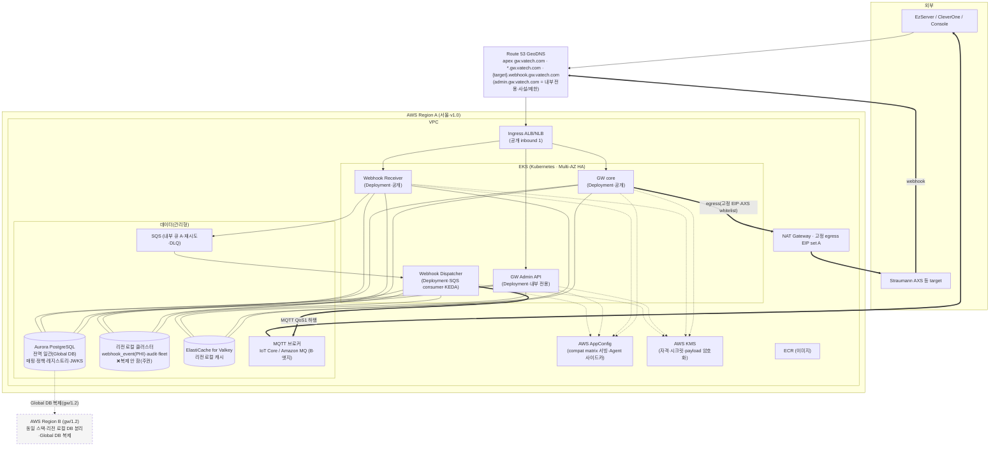

# ③-I VT API Gateway — Infra IaC 구축 계획서 (초안)

> **문서 유형 = IaC 구축 계획서** (기능 스펙/One Pager 아님 · One Pager는 ①②③-P).
> **작성 분담 (7/16 R3)** — 본 초안은 **Raymond가 (a) 전체 인프라 다이어그램과 (b) GW SRS에서 인프라 관련 요구를 추출**해 뼈대를 만든 것이고, **상세(구체 리소스 정의·사이징·운영값·Terraform 모듈)는 Jack(③-I 인프라 담당)이 작성·완성**한다. 각 절의 `🔧 Jack 상세` 표시가 인프라 담당이 채울 부분이다.
> **입력(정본) = ③ GW SRS**(§2.1.1·§3.1·§4.5.1·§6.3·§6.6.2·§7.3.5·§7.5.3·§7.6.6·§7.7.5) · Roadmap §3.9·§4 · 이 문서 `_status.md` 씨앗.
> **상태**: 초안 작성 착수(2026-07-20·Raymond) → Jack 상세 → PR → baseline (③ GW SRS baseline 이후 승계).
> **공식 등록처**: `vt-api-gateway-infra`(별도 레포) 또는 조직 표준 **`es-infra`(Terraform·`platforms` 프로젝트)** 에 편입 — 최종 위치=③-I 확정.

---

## 0. 범위·원칙

- **GW는 AWS(EKS)에만 배포**한다 — 비AWS·private GW 배포 없음. AWS 미지원 국가도 별도 GW 없이 **가장 가까운 AWS 리전 GW에 GeoDNS로 접속**한다(SRS §3.1.2·§7.3.5). 그 국가의 데이터 주권용 storage(MinIO 등)는 **GW가 아니라 target(CleverSpace/AXS)가 제공**하고 GW는 presigned를 **중계만** 한다(§7.4).
- **상태 저장소·미들웨어 = AWS 관리형 기본**(HA·백업·패치 위임 · 무상태 pod ADR-02) · pod→AWS 접근 = **IRSA**(정적 시크릿 미내장).
- **v1.0 = 단일 리전(서울)** 로 구축하되 **멀티리전-ready**(GeoDNS·데이터 토폴로지·egress 집합 동일, 리전 수만 1→N·§2.7.1). **gw/1.2 = N리전 활성화**(라우팅 대상 증분·record 타입·클라이언트 불변).
- **IaC 도구 = Terraform (확정·7/2 R5·Appendix B #26)** — 조직 표준 `es-infra`에 편입, 별도 도구 없음. *(과거 "CDK 권장" 문구는 결정 전 안으로 폐기.)*

---

## 0.5 인계 가이드 (→ Jack)

**이 문서 쓰는 법.** 각 §2 영역의 `🔧 Jack 상세`를 채워 `IaC 구축 계획서`를 완성한다(요구는 이미 정리됨 — "무엇을"이 아니라 "어떻게 구축"을 쓰면 됨). 상세는 이 파일에 이어 쓰고, 최종은 **`es-infra`(Terraform·platforms)** 또는 별도 인프라 레포로 승계 → PR → baseline(③ GW SRS baseline 후).

**① 우선순위·타임라인 (7/16 R2).**
- **8월 = 기반 구축·자동배포** — VPC/EKS(4-way)·Route53 GeoDNS·NAT 고정 EIP·KMS/IRSA·AppConfig·**DB 2-cluster(명명·endpoint 확정)**·CI/CD(Terraform·Azure Pipelines→ECR→EKS).
- **9월 = 개발환경 연동 완료**(dev에서 IOScanner·EzServer·GW–AXS 연동).
- **10월 = production 연동 완료.**
- **⚠ GW 구현 선결 = DB 클러스터/이름/endpoint(§2.4)** — 구현이 연결 대상을 알아야 하므로 가장 먼저 확정.

**② 이미 확정 — 재론 금지(구현·비준만).** Terraform(es-infra·7/2 R5) · 4-way Deployment(7/9 R10) · AppConfig(7/9 R9) · Grafana Alloy 수집(7/2 R3) · AWS 전용 배포 · GW storage 비호스팅(presigned 중계) · **PHI 리전 로컬·2-cluster 불변식**(§2.1.1·주권 FR-RGN-03) · 엔진 PostgreSQL 17.x. → 이 결정들은 **바꾸는 게 아니라 구현/제품 비준**한다.

**③ Jack이 정하는 것.** DB 클러스터/이름·인스턴스 사이징·노드 타입/수·MQTT 브로커 제품(Appendix B #4)·RTO/RPO(#9)·Aurora 비준(#18)·환경 프로비저닝(#24)·Global DB primary 배치(#15)·EIP 풀·인증서/GeoDNS/사설 zone·요금·Terraform 모듈 구조. (= §3 미결 + 각 `🔧 Jack 상세`.)

**④ 필독(입력 정본).** SRS **§2.1.1**(배포·2-cluster)·**§3.1**(환경)·**§4.5.1**(DNS 호스트)·**§6.3**(HA·관측)·**§6.6.2**(4-way·Terraform)·**§7.3.5**(멀티리전)·**§7.5.3**(egress)·**§7.6.6**(MQTT)·**§7.7.5**(AppConfig) + **DBML 상단 "데이터 클래스" 범례**(테이블→클러스터 배치의 SSOT) + **Appendix B 인프라 행**(#2·4·9·12·15·18·24·26).

**⑤ ③-C Console 인프라 흡수.** GW 플랫폼 + 제품(③-C Console 등) 인프라는 **단일 소유(③-I)로 구축**한다 — ③-C가 요구(호스팅·인증·API 접근)를 확정하면 이 계획서에 흡수·보강(Roadmap §3.9).

---

## 1. 전체 인프라 아키텍처 (Raymond)

> v1.0 단일 리전 기준. 점선 박스(리전 B)는 gw/1.2 확장. **AWS 관리형=회색 개념**, GW 배포 단위(4-way)=강조.

**관측(별도 평면):** OTel 계측 → **Grafana Alloy**(통합 수집 에이전트) → 백엔드(Loki 로그 / Tempo 트레이스 / Mimir·Prometheus 메트릭 / 중앙 Grafana) — 구성·백엔드 선택=③-I(§6.3.2).

`🔧 Jack 상세`: VPC 서브넷/AZ 배치·보안그룹·라우팅 테이블·리소스별 Terraform 모듈·계정 구조.

---

## 2. GW SRS에서 추출한 인프라 요구 (입력 → Jack이 IaC로 구현)

### 2.1 배포 토폴로지 — 4-way (SRS §2.2·§6.6.2·§2.1.1)
- 단일 코드베이스를 **4개 Deployment**로 분리: **GW core**·**Webhook Receiver**(공개 데이터평면) / **GW Admin API**·**Webhook Dispatcher**(내부 전용). 동일 이미지·시크릿·PostgreSQL 공유, **독립 replica·오토스케일·장애 격리**.
- **HA**: Multi-AZ, 각 Deployment **≥2 replica**(§6.3.1). Admin은 저QPS라 저사양 최소 HA 상주.
- **Dispatcher**: HTTP 없이 SQS consumer, **KEDA(SQS 큐depth) 오토스케일**(ADR-12).
- `🔧 Jack 상세`: 노드 타입·수·오토스케일 정책·리소스 requests/limits·PDB(Appendix B 노드 사이징).

### 2.2 네트워킹·DNS (SRS §4.5.1·§2.1.1·§7.3.5)
- **Route 53 GeoDNS**를 v1.0부터 공개 3호스트에 적용(대상=서울 1개로 resolve): apex `gw.vatech.com` · 프록시 `*.gw.vatech.com`(와일드카드) · webhook `{target}.webhook.gw.vatech.com`.
- **`admin.gw.vatech.com` = 내부 전용** — 공개 device edge·webhook 호스트에서 도달 금지(**전용 ingress + NetworkPolicy** · 사설 hosted zone 또는 내부 ALB+제한(WAF/IP-allow/VPN)).
- **리전 내부 호스트 `gw-<region>.vatech.com`**(예 `gw-apne2.vatech.com`) — server-side·**클라이언트 미노출**(§4.5.1). GeoDNS 백엔드용.
- **inbound = 안정 endpoint 1개**(리전별 ALB/NLB) / **outbound = NAT 고정 EIP 다수**(inbound IP ≠ egress IP).
- **와일드카드 TLS**: `*.gw.vatech.com`(+ `*.webhook.gw.vatech.com` 별도).
- `🔧 Jack 상세`: 인증서 발급·GeoDNS 라우팅 정책·사설 zone/내부 ALB 구성·DNS record.

### 2.3 egress 고정 IP (SRS §2.1.1·§7.5.3·§2.6)
- 외부(AXS 등)가 IP whitelist를 요구 → 화이트리스트 대상 = **GW egress IP**. pod별 임시 IP 아님, **AZ/리전별 NAT 고정 EIP**, 멀티리전이면 **전 리전 EIP 합집합(A∪B…)**.
- 오토스케일·새 AZ·리전 증설이 egress IP를 늘리므로 **EIP 풀에 핀(pin)** + Straumann과 **whitelist 협의·갱신(리드타임)**. Straumann whitelist에 **전 prod 리전 egress IP 등록**.
- `🔧 Jack 상세`: EIP 풀 provisioning·개수·AZ 확장 시 IP 추가 절차·비용.

### 2.4 데이터 저장소 (SRS §2.1.1·§3.1.2·§6.4)
- **엔진 = PostgreSQL 17.x 확정** · 관리형 = **Aurora PostgreSQL 권장**(인프라 비준·Appendix B #18).
- **저장소 2분(클러스터 2개)** — Global DB는 클러스터 단위 복제라 한 클러스터에 논리 DB 2개로 못 나눔:
  - **① 전역 일관 클러스터** = Aurora Global DB(매핑·레지스트리·정책·config·operator 등 non-PHI·전 리전 복제·읽기 로컬/쓰기 primary forward).
  - **② 리전 로컬 클러스터** = webhook_event(payload=PHI)·audit·fleet 등 운영 데이터(**복제 안 함·주권 FR-RGN-03**). Global DB 미포함(소형 Aurora/RDS 가능).
- **캐시 = ElastiCache for Valkey**(리전 로컬·교차복제 안 함·로컬 PG에서 재적재).
- **내부 큐 A = SQS**(재시도·DLQ, webhook 수신 버퍼).
- **⚠ DB·클러스터·스키마 명명 = GW 구현 선결(③-I 확정 필요).** GW 구현이 **어느 클러스터/DB에 연결할지** 알아야 하므로 조기 확정이 필요하다. 2-cluster라 이름이 둘:
  - **① 전역 일관 클러스터**(Aurora Global DB) — 권장: 클러스터 id `vtgw-global-<env>`(예 `vtgw-global-prod`), database `vtgw_global`.
  - **② 리전 로컬 클러스터** — 권장: 클러스터 id `vtgw-regional-<region>-<env>`(예 `vtgw-regional-apne2-prod`), database `vtgw_regional`.
  - 스키마 = `public`(기본) 또는 명명 스키마 · env 접미사 `prod`/`stg`/`dev`.
  - **위 이름은 권장(예시)이며 ③-I가 조직 명명 표준(`es-infra`)에 맞춰 확정**한다. 확정된 **클러스터 endpoint + database 이름**은 GW 구현의 연결 설정(Prisma/LLD)이 소비한다.
  - **테이블→클러스터 배치**는 DBML 데이터 클래스 범례(전역 일관 vs 리전 로컬)를 따른다 — 전역 일관 테이블은 ①, webhook_event·audit·fleet은 ②.
- `🔧 Jack 상세`: 위 명명 확정 · 인스턴스 클래스·스토리지·백업/복구(RTO/RPO·Appendix B #9)·Global DB primary 배치(#15)·두 클러스터 사이징·비용.

### 2.5 MQTT 브로커 — B 엣지 (SRS §7.6.6·§3.1.2·Appendix B #4)
- 방화벽 뒤 EzServer 역방향 push(**QoS1·persistent·TLS·cert 인증**) — 지속 구독 필요(SQS 부적합).
- 후보 = **AWS IoT Core / Amazon MQ**. **제품·운영 주체 = 인프라/운영 확정(Appendix B #4)**.
- GW가 브로커 endpoint를 region resolution·enrollment config로 EzServer에 하달(구체 endpoint 필드·문법=브로커 확정 후).
- `🔧 Jack 상세`: 브로커 제품 선택·cert/IoT policy(클리닉별 토픽 격리)·리전별 endpoint·규모.

### 2.6 스토리지 (SRS §4.1.4·§7.4)
- **GW는 storage 비호스팅** — 파일 바이트는 presigned로 target storage(S3/MinIO)에 **직접** 업로드, GW 미경유(중계만).
- 비-AWS 국가 MinIO = **target(CleverSpace/AXS) 제공**(GW 아님).
- `🔧 Jack 상세`: (GW 소유 storage 없음 — 해당 없음. 단 AppConfig/로그/백업용 S3 등 운영 버킷은 필요 시.)

### 2.7 Config 서빙 — AppConfig (SRS §7.7.5·Appendix B #8)
- 호환성 매트릭스 서빙 = **AWS AppConfig**(S3·Secrets Manager 아님). App/Env(리전별)/ConfigurationProfile(hosted·JSON Schema validator)/Deployment Strategy(점진+bake).
- **AppConfig Agent 사이드카**(GW pod 폴링·localhost 서빙) · **CloudWatch 경보 연동(자동 롤백)** · **리전별 배포**(리전 로컬 발행→전역 일관).
- 발행 파이프라인 = **Azure Pipeline이 AWS CLI로**(`create-hosted-configuration-version`+`start-deployment`).
- `🔧 Jack 상세`: AppConfig 리소스·Agent 사이드카·경보·리전별 배포·요금/크기 상한/폴링 주기.

### 2.8 시크릿·자격 (SRS §6.2·§7.1.3)
- 자격·시크릿 원문 = **KMS**(Secrets Manager)에 저장, DB엔 참조(`credential_ref`·`secret_ref`)만. webhook payload = KMS envelope 암호화(리전 로컬).
- pod→AWS 접근 = **IRSA**(정적 시크릿 미내장). 자격 dual-window 무중단 회전.
- `🔧 Jack 상세`: KMS CMK·alias·키 회전·리전별 키 토폴로지·IRSA role/policy.

### 2.9 관측 (SRS §6.3.2)
- OTel 계측 → **Grafana Alloy**(통합 수집) → 백엔드(Loki/Tempo/Mimir·Prometheus·중앙 Grafana). 앱 계약 = stdout JSON + OTel(불변).
- `🔧 Jack 상세`: Alloy 배포(DaemonSet 등)·백엔드 제품·대시보드·경보·보존.

### 2.10 환경 (SRS §3.1·§3.4·§3.5·Appendix B #24)
- **dev / test·staging / prod 3종**. 운영과 동일 스택(EKS·Aurora·ElastiCache Valkey·SQS·IoT Core)을 소형으로.
- **PHI는 prod만 실데이터**, dev·test는 더미. AXS: dev/test=sandbox·prod=production. EzServer: dev=에뮬레이터.
- `🔧 Jack 상세`: 계정/환경 분리·프로비저닝·자격 발급·E2E 게이트 인프라.

### 2.11 IaC·CI/CD (SRS §6.6.2·Appendix B #26)
- **Terraform**(조직 표준 `es-infra`·platforms) — EKS(`platform/`)·데이터(`data/`)·Route53(`network/`)·앱 아이덴티티(`apps/`) 계층에 편입.
- **CI/CD = Azure Pipelines → ECR → EKS**(롤링 배포). config(`config/**`)는 path-filter 분리(매트릭스만 바뀌면 앱 재배포 0).
- `🔧 Jack 상세`: Terraform 모듈·state·워크스페이스·파이프라인 단계·OIDC 페더레이션·승인 게이트.

### 2.12 보안·데이터 주권 (SRS §6.5·§7.3.3·§2.1.1)
- **제어평면(Admin)/데이터평면 격리**(NetworkPolicy·내부 전용 ingress). **PHI 리전 로컬**(교차 리전 복제 저장소에 두지 않음). deny-by-default.
- `🔧 Jack 상세`: NetworkPolicy·보안그룹·WAF·감사 로깅 인프라.

---

## 3. 미결·확정 필요 (Appendix B 인프라 항목)

| # | 항목 | 소유 |
| --- | --- | --- |
| 2 | 공개 EP DNS 인증서·GeoDNS·리전 내부 호스트 구성 | 인프라/플랫폼 |
| 4 | 엣지(B) MQTT 브로커 제품·운영 주체 | 인프라/운영 |
| 9 | RTO/RPO·유지보수 윈도우(운영 SLA) | 인프라 |
| 12 | AWS 관리형 제품·버전 확정 | 인프라/설계 |
| 15 | 전역데이터 복제 토폴로지 세부(Global DB primary 배치·충돌 처리)·gw/1.2 | PM/아키텍트+인프라 |
| 18 | Aurora PostgreSQL 비준·엔진 버전(PG 17.x·Extension 호환) | 인프라/아키텍트 |
| 24 | dev/test/staging 환경 구축·자격 | 인프라/개발 |
| 49 | (참고) clinic_id 수동 이관 시 데이터/저장소 영향 | GW+운영 |
| — | **DB·클러스터·스키마 명명(GW 구현 선결)** — 2-cluster 이름·database·endpoint 확정(권장=§2.4·조직 표준 준수) | 인프라(③-I) |
| — | 노드 타입·수·용량 산정(fleet 규모=PL 입력·§5) | 인프라 |

---

## 4. 소유·경계

- **Raymond(GW)**: 전체 인프라 다이어그램(§1) + GW SRS 인프라 요구 추출(§2) + 미결 목록(§3). = **"무엇이 필요한가"(요구·계약)**.
- **Jack(③-I 인프라)**: 각 `🔧 Jack 상세` — 구체 리소스 정의·Terraform 모듈·사이징·운영값·제품 비준·비용. = **"어떻게 구축·운영하는가"(구현)**.
- **경계 원칙**: GW SRS는 _요구_ 까지만, _구축_ 은 ③-I. GW 플랫폼 + 제품(③-C Console 등) 인프라를 **단일 소유로 구축**(③-C 요구 확정 시 ③-I에 흡수·보강).
- 승계 트리거: ③ GW SRS 해당 절 baseline(7/20) 후 → 본 초안을 Jack에게 전달 → 상세 작성·PR·baseline.
