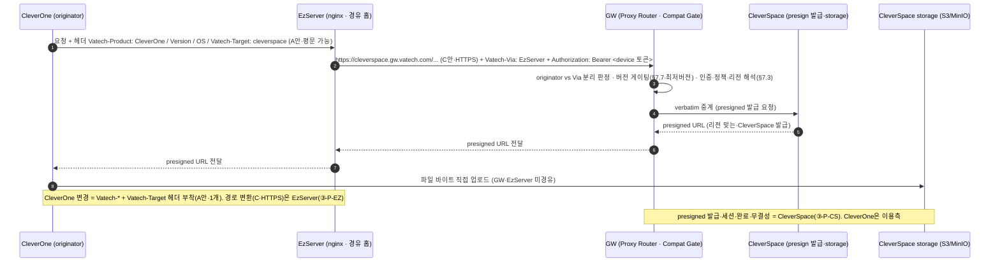

# ③-P-CO One Pager — CleverOne GW 적응 (1·2·3·4단계 통합)

> **상태: 초안(2026-07-27·Raymond).** ③ GW SRS baseline v1.0(`spec-v1.0`·7/20 동결)에서 CleverOne이 적응해야 할 계약을 추출한 **GW 소유자 1차 초안**이다. 완성·확정은 **CleverOne 팀 인계 후**(리뷰 탁수용/Nick). 정본 계약 = ③ GW SRS(각 블록 앵커) · 본 문서는 그 소비 스펙이며 GW 계약을 재정의하지 않는다.
> **소유(개발) = CleverOne 팀.** GW(Raymond)는 표준 계약 + 초안까지 제공한다. `🔧 CleverOne 팀 상세` = 인계 후 팀이 채울 항목.
> **7/23 결정**: 이 문서가 **1·2·3·4단계를 통합**한다 — **①호환성·②Presigned One Pager는 폐지**하고 여기에 흡수(딱 2개 제품 문서: CleverSpace·CleverOne). presigned는 **CleverOne이 이용측**(CleverSpace 발급 API를 GW 경유로 호출·직접 연동 금지).
> **작성/구현 순서 주의**: CleverOne 연동 *구현*은 **post-v1.0**(v1.0 AXS 연동=Straumann IO Scanner만·SRS §1.2·§2.7)이나, **OnePager는 지금** 작성한다(작성 ≠ 구현 시점). 작성 담당은 **Nick→Raymond**로 이관.

## 1. 목적·배경

- **CleverOne = ES 차세대 2D/3D 통합 데스크톱 뷰어**. GW 관점에서 **originator(요청 시작 주체)** 이자 **presigned 이용측 클라이언트**다. CleverOne은 로컬 **EzServer(EzWebServer)** 와 REST로 연동하고, 클라우드(CleverSpace·AXS) 통신은 **EzServer를 경유**한다.
- **문제**: 현재 CleverOne의 클라우드 통신은 EzServer를 거치되 대상별로 제각각이고(경로 B 레거시·직접 연결), GW 도입 후에는 **모든 클라우드 트래픽이 GW를 경유**(인증·버전 게이팅·정책·관측 일원화)해야 한다. 또한 파일 업로드는 **GW 비발급·중계**(ADR-03/04)로 통일되어, CleverOne은 **CleverSpace가 발급한 presigned를 이용**하는 쪽으로 바뀐다.
- **해결(4단계·CleverOne 최소 변경)**: ① `Vatech-*` 식별 헤더 부착 + 호환성 fallback(1) · ② presigned 업로드 이용 전환(2) · ③ Direct→GW 경유(A+C 라우팅·3) · ④ Region 선택(대안)·ClinicID 인지(4). **핵심 변경은 헤더 부착 + 업로드 흐름 전환으로 작고, 경로 변환의 무거운 부분은 EzServer(③-P-EZ)가 흡수**한다(R5 A+C).

## 2. 범위·비범위

- **범위**: CleverOne이 originator로서 **헤더 부착·호환성 fallback**(1) · **CleverSpace presigned 이용**(2) · **EzServer 경유 GW 라우팅 적응**(3) · **Region 선택 UI(대안)·ClinicID 표시**(4).
- **비범위(명시)**:
  - **경로 변환(A→C·서브도메인·HTTPS 브리징)은 EzServer 책임**(§2.3.0·③-P-EZ) — CleverOne은 `Vatech-Target` 헤더 1개만 부착(A안).
  - **GW 인증 토큰(`Authorization: Bearer <device 토큰>`)은 EzServer가 부착**(§7.7.1·③-P-EZ) — CleverOne은 자기 originator 신원 헤더만.
  - **presigned 발급·세션·storage는 CleverSpace 소유**(§7.4·③-P-CS) — CleverOne은 이용측.
  - CleverOne 내부 뷰어/촬영/진단 기능은 GW 무관.
  - **OneID는 GW 인증에 없음**(고객 로그인 제품으로만 잔존) — GW 경로와 무관.

## 3. 액터

| 액터 | 역할 |
| --- | --- |
| **CleverOne** (originator) | `Vatech-*` 식별 헤더 + `Vatech-Target` 부착, presigned 이용, 호환성 fallback UI |
| **EzServer** (경유 홉·nginx) | `Vatech-Target`(A) → `{target}.gw.vatech.com` 서브도메인+HTTPS(C) 변환, `Vatech-Via` 누적·`Authorization` 부착(§2.3.0·③-P-EZ) |
| **GW** (Proxy Router·Compat Gate) | 인증·버전 게이팅·정책·관측 후 target으로 verbatim 중계 |
| **CleverSpace / AXS** (target) | presigned 발급·응답(§7.4) — CleverOne이 이용 |

## 4. 통합 데이터 흐름 (A+C 라우팅 · R5)

## CO-1. Vatech-\* 헤더·well-known·fallback (1단계 · 호환성)

**GW 계약 앵커: §7.7.1(식별 헤더)·§7.7.2(well-known)·§7.7.3(3단계 반응)·Appendix B #8.** GW는 originator 버전을 매트릭스와 대조해 **major 미달=차단 / minor 미달=경고 통과 / patch=무시**로 게이팅한다.

- **CleverOne 적응**:
  - **originator 식별 헤더 필수**: 모든 요청에 `Vatech-Product: CleverOne` · `Vatech-Version` · `Vatech-OS`를 부착한다(2026-06 회의 — 전 제품 강제). **공용 라이브러리로 부착 표준화**(제품별 구현은 흡수된 ①영역). CleverOne이 originator이므로 이 값은 **권위 소스**이고, EzServer는 이를 relay만 한다.
  - **well-known 소비·fallback**: GW가 공시하는 `/.well-known/<env>/server-configuration.json`(§7.7.2)의 최소 클라 버전을 읽어, **major 미달 시 "업데이트 필요" 안내(차단)·minor 미달 시 경고 배너(기능 저하 인지)** 를 사용자에게 표시한다(원인불명 실패 제거·ADR-07). 경고 신호 = `Vatech-Compat-Warning` 헤더(후보·Appendix B #8).
- `🔧 CleverOne 팀 상세`: 헤더 부착 공용 라이브러리 적용 지점, `Vatech-Version` 값 소스(제품 빌드 버전↔API 버전 매핑), well-known 캐시·폴링 주기, fallback UI(차단 다이얼로그·경고 배너) 문구·동작.

## CO-2. presigned 업로드 이용 (2단계)

**GW 계약 앵커: §2.3.5·§4.1.4(경로②)·§7.4.** 대용량 파일은 **CleverSpace가 발급한 presigned로 CleverSpace storage에 직접** 업로드하고, GW는 발급 요청을 verbatim 중계만 한다(바이트 미경유).

- **CleverOne 적응(이용측)**:
  - **발급 요청 → 직접 업로드**: 기존 직접 업로드 방식을 **CleverSpace presigned 발급 API 호출(GW 경유) → 받은 URL로 storage 직접 PUT** 흐름으로 전환한다. 발급 API 계약은 **CleverSpace OpenAPI(③-P-CS)가 정본**.
  - **세션·완료·재시도 이용**: 세션 상태·resumable·ETag/checksum·완료 통지(commit)는 CleverSpace가 정의(§7.4)하며, CleverOne은 그 계약대로 **이용**한다. commit 등 안전 재요청에는 `Idempotency-Key`를 실어 GW가 존중(§7.5.4).
  - **직접 연동 금지**: presigned 발급 요청도 반드시 **GW 경유**(직접 CleverSpace 호출 금지·경로 B EOS).
- `🔧 CleverOne 팀 상세`: 업로드 대상 데이터(CT·영상 등)·현행 업로드 코드 → presigned 이용 전환 매핑, resumable/multipart 이용, 진행률·완료 UI, 실패·재시도 처리, `Idempotency-Key` 부여 규칙.

## CO-3. Direct→GW 경유 (3단계 · A+C 라우팅)

**GW 계약 앵커: §2.3.0·§4.1.2·§4.5.1(ADR-11)·§7.7.1(헤더 규약)·§7.7.4(오류)·Agenda R5.** 클라우드 통신을 GW 경유로 전환한다. **CleverOne→EzServer = A안(`Vatech-Target` 헤더)**, **EzServer→GW = C안(서브도메인 HTTPS)** 로 확정(R5).

- **CleverOne 적응**:
  - **`Vatech-Target` 헤더 부착(A안·핵심·최소)**: 클라우드 대상을 `Vatech-Target: {label}`(예 `cleverspace`·`axs`)로 지정해 EzServer에 보낸다(평문/HTTPS 무관). EzServer가 이 값을 `{label}.gw.vatech.com` 서브도메인+HTTPS로 변환(§2.3.0). **CleverOne 변경 = 헤더 1개**(기존 `Vatech-Target` 재활용·R5 표) — 경로 변환·HTTPS 브리징은 EzServer(③-P-EZ)가 흡수.
  - **originator 헤더 relay 전제**: CleverOne의 `Vatech-*`(CO-1)는 EzServer가 그대로 relay하고, EzServer는 자신을 `Vatech-Via`에 누적하며 `Authorization`을 부착한다 — **CleverOne은 GW 인증 토큰을 직접 다루지 않는다**(§7.7.1·③-P-EZ).
  - **오류 계약 인지(§7.7.4)**: GW/인프라 실패(`Vatech-Error-Origin: gateway`·502/503/504)와 target 거부(`target`·원 코드 verbatim)를 구분해 사용자에게 안내한다.
  - **경로 B EOS**: 직접 연결(CleverOne→CleverSpace 직결) 레거시는 GW 경유로 흡수 후 종료(§2.8).
- `🔧 CleverOne 팀 상세`: 현행 클라우드 호출부(EzWebServerClient 등)·직접 연결 엔드포인트 목록 → `Vatech-Target` 부착 전환 매핑, target 라벨 카탈로그, 오류 origin별 UI 처리, 경로 B EOS 일정.

## CO-4. Region 선택 UI(대안)·ClinicID (4단계)

**GW 계약 앵커: §7.3.6(리전 카탈로그·`GET /v1/regions`)·§7.3.1(ClinicResolution)·§7.3.4(relocation).** GW는 운영 리전 목록을 조회 API로 제공하고, region SSOT는 clinic(`clinic_id`)이다.

- **CleverOne 적응**:
  - **Region 선택 = 대안 UI**: 주 선택 UI는 **EzServer Console**(§2.3.1·③-P-EZ)이나, CleverOne이 **대안**으로 `GET /v1/regions`(§7.3.6)를 읽어 리전 선택지를 표시할 수 있다(온보딩·relocation). 실제 채택 여부·범위는 제품 결정.
  - **ClinicID 인지**: CleverOne이 속한 클리닉의 `clinic_id`(LMP 발급·불변·region SSOT·§7.3)를 인지·표시한다. region은 `clinic_id`에서 해석(§7.3.1)되며, CleverOne은 리전 내부 endpoint를 다루지 않고 공개 호스트만 사용(§7.3.5).
- **단계 주의**: v1.0(단일 리전)에서도 클라이언트는 공개 호스트만 호출하고 헤더 변경 없이 gw/1.2 멀티리전으로 확장(§7.3.5·멀티리전-ready). 4단계 우선순위는 1~3단계보다 낮다.
- `🔧 CleverOne 팀 상세`: Region 선택 UI 채택 여부·범위(대안), ClinicID 표시 위치, relocation 시 사용자 흐름(재접속·재동의 안내·§7.3.4).

## 5. GW↔CleverOne 계약 요약

| 항목 | GW/EzServer 책임(고정) | CleverOne 책임(적응) |
| --- | --- | --- |
| 식별 헤더 | GW: originator vs Via 분리 판정(§7.7.1) / EZ: relay·Via 누적 | **`Vatech-Product/Version/OS` 부착**(권위 소스) |
| 라우팅 | EZ: `Vatech-Target`→서브도메인 C 변환(§2.3.0) / GW: verbatim 중계 | **`Vatech-Target` 헤더 1개 부착**(A안) |
| 인증 | EZ가 `Authorization: Bearer <device 토큰>` 부착(§7.7.1) | 다루지 않음(EzServer 경유) |
| 호환성 | GW 게이팅·well-known 공시(§7.7) | **well-known fallback UI**(차단/경고) |
| presigned | GW 발급 요청 verbatim 중계(§7.4) / CS 발급 | **발급 이용 → storage 직접 업로드** |
| 오류 | GW 정규화·`Vatech-Error-Origin`(§7.7.4) | origin별 안내 UI |
| 리전 | GW `GET /v1/regions`·ClinicResolution(§7.3.6·1) | Region 선택 대안 UI·ClinicID 표시 |

## 6. 보안

- **인증 위임**: CleverOne은 GW 인증 토큰을 보유·부착하지 않는다(EzServer 경유·§7.7.1) — 토큰 노출면 축소.
- **PHI 주권**: presigned 발급은 GW 해석 리전 준수(§7.3.3), 파일 바이트는 GW·EzServer 미경유(직접 storage). CleverOne은 리전 내부 endpoint 미인지(§7.3.5).
- **직접 연동 금지**: 모든 클라우드 호출 GW 경유(경로 B EOS) — 우회 경로 제거.
- **오류 origin 구분**: `Vatech-Error-Origin`으로 인프라 실패 vs target 거부 구분(§7.7.4).

## 7. Open items (TBD)

- **CleverOne SRS(Nick) 헤더·인증 상세 확보** — `Vatech-Version` 값 소스·SSO/토큰 현행.
- **Region 선택 UI(대안) 채택 여부·범위** — 주 UI=EzServer Console, CleverOne 대안 여부는 제품 결정(4단계).
- **호환성 자리별 정책·경고 헤더명·(API↔제품) 버전 매핑** — 흡수된 ①영역·Appendix B #8.
- **경로 B EOS 시점** — 직접 연결 종료 일정(Agenda 논의).
- **연동 구현 착수 시점** — post-v1.0(v1.0=IO Scanner). OnePager는 지금.
- **공식 등록처** — CleverOne 제품 repo / VKS(인계 시 결정).

## 8. 참조

- ③ GW SRS: 헤더 §7.7.1 · 라우팅 §2.3.0·§4.1.2·§4.5.1(ADR-11·A+C) · 호환성 §7.7(§7.7.2·§7.7.3·Appendix B #8) · presigned 이용 §2.3.5·§4.1.4·§7.4 · 오류 §7.7.4·§7.5.4 · 리전 §7.3(§7.3.1·§7.3.4·§7.3.5·§7.3.6)
- 흡수: ①호환성 One Pager(폐지)·②Presigned One Pager(폐지) — 본 문서에 통합(7/23)
- 관련 적응: **EzServer ③-P-EZ**(경로 변환 A→C·인증 부착·Vatech-Via 누적) · **CleverSpace ③-P-CS**(presigned 발급·storage)
- Roadmap §4·§5.1(라우팅 헤더 규약) · 실행 할당표(`00-execution-allocation.md`) · 주간회의 Agenda 7/30 S2 · R5(A+C 라우팅)
- CleverOne SRS(`references/CleverOne/Confidential_CleverOne_v0.9_srs.md`·Nick)
- 형식 선례: `03p-cs-cleverspace/CleverSpace-GW적응-OnePager.md`(대칭 문서) · `03p-lmp-license/OnePager.md`
