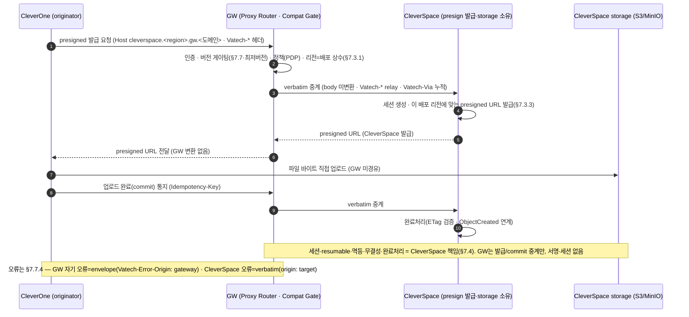

# ③-P-CS One Pager — CleverSpace GW 적응 (1·2·3·4단계 통합)

> **상태: 초안(2026-07-27·Raymond).** ③ GW SRS baseline v1.0(`spec-v1.0`·7/20 동결)에서 CleverSpace가 적응해야 할 계약을 추출한 **GW 소유자 1차 초안**이다. 완성·확정은 **CleverSpace 팀 인계 후**(리뷰 고형용/Larry). 정본 계약 = ③ GW SRS(아래 각 블록의 앵커) · 본 문서는 그 소비 스펙이며 GW 계약을 재정의하지 않는다.
> **소유(개발) = CleverSpace 팀.** GW(Raymond)는 표준 계약 + 초안까지 제공한다. `🔧 CleverSpace 팀 상세` = 인계 후 팀이 채울 항목.
> **7/23 결정**: 이 문서가 **1·2·3·4단계를 통합**한다 — 별도 **①호환성·②Presigned One Pager는 폐지**하고 여기에 흡수한다(딱 2개 제품 문서: CleverSpace·CleverOne). presigned는 **CleverSpace가 발급 API 신규**·CleverOne이 이용, 둘 다 **GW 경유**(직접 연동 금지)라 양쪽이 바뀐다.
> **구현 순서 주의**: GW 연동 *구현*은 **AXS(Straumann IO Scanner) 선행·CleverSpace 후행**(SRS §7.5.2·PRD §12)이다. 단 **OnePager 작성은 지금** 한다(작성 순서 ≠ 구현 순서).

## 1. 목적·배경

- **CleverSpace = 클라우드 뷰어·스토리지 백엔드**(CloudWebViewer). GW 관점에서 **내부(B) 프록시 대상 upstream**이자 **파일 presigned 발급·storage 소유자**다.
- **문제**: 현재 클라이언트(CleverOne 등)는 CleverSpace에 **직접 연결**(경로 B 레거시)하고, 대용량 파일 업로드용 presigned도 제품별로 제각각이다. GW 도입 후에는 **모든 트래픽이 GW를 경유**(인증·버전 게이팅·정책·관측 일원화)해야 하고, **파일 업로드는 GW 비발급·중계** 모델(ADR-03/04)로 통일된다.
- **해결(4단계)**: CleverSpace가 ① 서버 버전/오류를 GW 호환 게이트와 정합화하고(1단계), ② presigned 발급 API를 신규 제공하며(2단계), ③ 직접 연결을 GW 경유로 전환하고(3단계), ④ 멀티 Region 구축(4단계·gw/1.2)으로 데이터 주권을 보장한다.

## 2. 범위·비범위

- **범위**: CleverSpace 서버의 **버전 공시·오류코드 정합**(1) · **presigned 발급 API 신규 + 세션/완료처리**(2) · **Direct→GW 경유 수신 적응**(3) · **멀티 Region storage**(4).
- **비범위(명시)**:
  - **CleverSpace는 Webhook 수신 대상이 아니다** — 내부(B) 프록시·presigned 백엔드일 뿐, AXS 이벤트 수신처가 아니다(SRS §7.6.5·§2.3.6 확정, 2026-06-23). 클라우드 webhook 수신은 **CleverLab만**(갈래B·보류).
  - **GW는 presigned를 발급하지 않고 파일 바이트를 경유하지 않는다** — 발급·세션·storage는 CleverSpace 소유(§7.4). GW는 발급 요청 **verbatim 중계**만.
  - CleverSpace **내부 뷰어 기능**(2D/3D 렌더링 등)은 GW 무관.

## 3. 액터

| 액터 | 역할 |
| --- | --- |
| **CleverOne / EzServer** (클라이언트) | originator·경유 홉 — `Vatech-*` 헤더 부착, GW 경유로 CleverSpace 호출 |
| **GW** (Proxy Router) | 인증·버전 게이트·정책·관측 후 **`cleverspace.<region>.gw.<도메인>`으로 verbatim 중계**(내부 B·connector 불요). presigned 미발급·바이트 미경유 |
| **CleverSpace** (upstream) | **B 내부 프록시 대상** · **presigned 발급·storage 소유** · 서버 버전 공시·표준 오류 |
| **CleverSpace storage** (S3/MinIO) | 파일 바이트 저장 — 클라이언트가 presigned로 **직접** 업로드(GW 미경유) |

## 4. 통합 데이터 흐름

## CS-1. 서버 버전 체크·well-known·오류코드 (1단계 · 호환성)

**GW 계약 앵커: §7.7(§7.7.1~5)·Appendix B #8.** GW는 originator/경유 홉의 `Vatech-*` 버전을 **호환성 매트릭스**(§7.7.5)와 대조해 **semver 자리별 3단계**(major 미달=차단 / minor 미달=경고 통과 / patch=무시·§7.7.3)로 게이팅한다. GW가 `/.well-known/<env>/server-configuration.json`을 공시(§7.7.2)한다.

- **CleverSpace 적응**:
  - **서버 최소 클라이언트 버전 선언**: CleverSpace API별 최소 지원 클라이언트 버전을 **호환성 매트릭스 소스**(`vt-api-gateway` repo `config/compat-matrix.yaml`)에 반영할 값으로 제공한다. 매트릭스 SSOT·발행은 GW/CI(§7.7.5)가 소유하므로 CleverSpace는 **값(minClientVersion 등)을 채워 전달**한다.
  - **표준 오류코드 정합**: CleverSpace가 반환하는 4xx/5xx는 GW가 **verbatim 통과**(`Vatech-Error-Origin: target`·§7.7.4)하므로, 클라이언트가 일관되게 읽도록 **오류 body 형식·코드 어휘를 GW 표준 envelope 의미론과 정합**시킨다(원인불명 실패 제거·ADR-07).
- `🔧 CleverSpace 팀 상세`: API↔서버 버전 매핑 표, 각 API 최소 클라 버전 값, 서버 오류코드 카탈로그(→ GW 표준 매핑), well-known에 실을 CleverSpace 항목. **자리별 정책·경고 헤더명(`Vatech-Compat-Warning` 후보)·(API 버전↔제품 버전) 매핑은 흡수된 ①영역 확정 대상(Appendix B #8).**

## CS-2. presigned 발급 API 신규 (2단계)

**GW 계약 앵커: §2.3.5·§4.1.4(경로②)·§7.4.** 대용량 파일(CT·영상)은 **CleverSpace가 발급한 presigned로 CleverSpace storage에 직접** 업로드하고, GW는 발급 요청을 **`cleverspace.<region>.gw.<도메인>`으로 verbatim 중계**(내부 B bypass)만 한다 — body를 해석·변환·서명하지 않는다.

- **CleverSpace가 신규 개발(소유)**:
  - **presigned 발급 API**: 업로드 세션 `start → (presigned) → commit`. GW는 이 계약을 정의하지 않으며 CleverSpace OpenAPI가 정본.
  - **세션·resumable/multipart·idempotency·checksum(ETag)·완료처리(콜백 + storage ObjectCreated)** = 전부 CleverSpace 책임(§7.4 위임 경계·FR-SES-01~05는 GW 직접구현 아님).
  - **storage** = S3(AWS 지원국) / **Provider MinIO**(AWS 미지원국) — GW 비호스팅.
  - **리전 준수**: GW의 배포 리전(§7.3.1·상수)에 맞는 presigned URL을 발급한다(바이트 차단이 아니라 **발급 단계 보장**). GW→CleverSpace 리전 전달 방식은 본 문서에서 확정(§7.3.3이 "② CleverSpace 계약에서 확정"으로 위임).
- **GW 책임(고정)**: 발급/commit 요청 **verbatim 중계** + 인증·버전 게이트·정책 + `Idempotency-Key` 존중(§7.5.4). presigned 미발급·바이트 미경유.
- `🔧 CleverSpace 팀 상세`: 발급 API 스펙(엔드포인트·요청/응답 스키마), 세션 상태 머신, resumable/multipart 규약, ETag·checksum 무결성, 완료 콜백 + ObjectCreated 연계, minio 전제·리전별 버킷, GW 리전 전달 필드 형식.

## CS-3. Direct→GW 경유 수신 정합 (3단계)

**GW 계약 앵커: §2.3.0·§4.1.2·§4.5.1(ADR-11 라우팅)·§7.5.4·§7.7.4(프록시 오류·타임아웃)·§7.7.1(헤더).** CleverSpace는 **내부(B) 프록시 대상 upstream**으로 등록되고(트러스트 프로파일=internal·connector 불요), 클라이언트 직접 연결(경로 B 레거시)을 **GW 경유로 전환**한다.

- **CleverSpace 적응**:
  - **upstream 등록 = 레지스트리 1행**(§4.1.2·§7.5.1) — `target_id=cleverspace`, host, trust profile=internal. 신규 경로·GW 코드 변경 0(관리 API `/v1/admin/targets`·§7.6.2).
  - **수신 호스트**: `cleverspace.<region>.gw.<도메인>`(C안 서브도메인·§4.5.1)으로 GW가 verbatim 전달. CleverSpace는 이 경유 트래픽을 수용.
  - **헤더 규약(§7.7.1)**: originator `Vatech-Product/Version/OS`는 GW가 그대로 relay, 경유 홉은 `Vatech-Via` 누적. CleverSpace는 **originator 신원을 이 헤더로 관측·기록**(source IP 아님).
  - **오류·타임아웃 계약(§7.5.4·§7.7.4)**: GW는 자기 아웃바운드 연결 timeout(`connect_timeout_ms`~3s / `response_timeout_ms`~10s / `total_deadline_ms`)을 bound하고, **GW total_deadline < 클라이언트 타임아웃(30s·D4)** 불변식으로 먼저 `504`를 돌린다. **재시도·서킷은 mesh(istio)** 담당. CleverSpace 자체 4xx/5xx는 **verbatim 통과**(`Vatech-Error-Origin: target`).
  - **경로 B EOS**: 직접 연결 레거시는 GW 경유로 흡수 후 종료(§2.8) — EOS 시점은 흡수된 ①영역·Agenda 논의.
- `🔧 CleverSpace 팀 상세`: 현행 직접 연결 엔드포인트 목록·GW 경유 전환 매핑, internal trust 전제(내부망·egress allowlist 불요·§7.5.3), 응답 타임아웃 SLA(→ GW response_timeout 개별값), 헤더 기반 originator 로깅 반영, 경로 B EOS 계획.

## CS-4. 멀티 Region 구축 (4단계 · gw/1.2)

**GW 계약 앵커: §7.3(§7.3.1·§7.3.3·§7.3.5)·§2.7.1.** GW는 v1.0 **단일 production 리전(호주)**이나 **멀티리전-ready**로 설계되며, 멀티 리전 동시 운영은 **gw/1.2(2차)**다. CleverSpace storage는 **리전 바운드**(`regionBound=true`·§7.3.1)여야 PHI 주권(§7.3.3)이 보장된다.

- **CleverSpace 적응**:
  - **리전별 storage 구축**: GW 해석 리전에 맞는 버킷/MinIO로 presigned 발급(§7.3.3). PHI는 리전 밖 미이동.
  - **AWS 미지원국** = Provider MinIO로 동일 계약 충족.
  - **relocation 시**(§7.3.4): 기존 PHI는 옛 리전 잔류(자동 이관 없음), in-flight 세션은 옛 리전으로 완료·전환은 신규부터.
- **단계 주의**: v1.0(단일 리전)에서도 클라이언트는 공개 호스트(GW 고유 API 호스트·서브도메인)만 호출하고 헤더 변경 없이 gw/1.2에서 리전 라벨 호스트로 확장(최근접 분배 아님·데이터 주권상 배정·§7.3.5). 따라서 4단계는 **CleverSpace storage 다지역화가 실제 트리거**이며, 우선순위는 1~3단계보다 낮다.
- `🔧 CleverSpace 팀 상세`: 대상 리전 목록, 리전별 storage 토폴로지(S3/MinIO), GW 리전 파라미터→버킷 선택 로직, relocation 데이터 이관 방침(별도 트랙).

## 5. GW↔CleverSpace 계약 요약

| 항목 | GW 책임(고정·baselined) | CleverSpace 책임(신규·소유) |
| --- | --- | --- |
| 라우팅 | `cleverspace.<region>.gw.<도메인>` verbatim 중계(내부 B·§4.5.1) | upstream 1행 등록 수용·경유 트래픽 처리 |
| 인증·게이트 | 인증·버전 게이팅·정책·관측(§7.7) | 서버 버전값·표준 오류 제공(§7.7.4) |
| presigned | 발급 요청 verbatim 중계(미발급·바이트 미경유·§7.4) | **발급 API·세션·완료·무결성·storage 신규**(§2.3.5) |
| 오류·타임아웃 | 자기 timeout bound·정규화·`Vatech-Error-Origin`(§7.5.4) | 자체 4xx/5xx(verbatim 통과)·응답 SLA |
| 리전 | 리전=배포 상수·전달(§7.3.1) | 리전 맞는 presigned 발급·리전별 storage(§7.3.3) |
| Webhook | — | **해당 없음**(CleverSpace는 수신 대상 아님·§7.6.5) |

## 6. 보안

- **내부(B) 트러스트**: 내부망이라 connector·OAuth·고정 egress 불요(§4.1.1). egress allowlist는 외부(C·AXS)만 해당(§7.5.3).
- **PHI 주권**: presigned 발급은 GW 배포 리전 준수(§7.3.1·§7.3.3), 리전 바운드 storage(§7.3.1). 파일 바이트는 GW 미경유(PHI control plane 미경유).
- **오류 origin 구분**: 클라이언트는 `Vatech-Error-Origin`으로 GW/인프라 실패(gateway) vs CleverSpace 거부(target)를 구분(§7.7.4).
- **presigned 무결성**: 짧은 TTL·ETag/checksum·완료 검증 = CleverSpace 소유(§7.4 위임).

## 7. Open items (TBD)

- **GW→CleverSpace 리전 전달 방식** — §7.3.3이 "② CleverSpace 계약에서 확정"으로 위임(발급 요청에 리전 파라미터 형식).
- **presigned 발급 상세** — 세션 상태 머신·resumable·ETag·완료 콜백(CleverSpace OpenAPI 정본).
- **호환성 자리별 정책·경고 헤더명·(API↔제품) 버전 매핑** — 흡수된 ①영역·Appendix B #8.
- **경로 B EOS 시점** — 직접 연결 종료 일정(Agenda 논의).
- **멀티 Region 범위·AWS 미지원국 MinIO 전제** — 4단계 트리거·gw/1.2.
- **공식 등록처** — CleverSpace 제품 repo / VKS(인계 시 결정).

## 8. 참조

- ③ GW SRS: 라우팅 §2.3.0·§4.1.2·§4.5.1(ADR-11) · presigned §2.3.5·§4.1.4·§7.4 · 호환성 §7.7(§7.7.1~5·Appendix B #8) · 프록시 오류·타임아웃 §7.5.4·§7.7.4 · 리전 §7.3(§7.3.1·§7.3.3·§7.3.5·§2.7.1) · upstream 레지스트리 §4.1.2·§7.5.1 · Webhook 비대상 §7.6.5·§2.3.6
- 흡수: ①호환성 One Pager(폐지)·②Presigned One Pager(폐지) — 본 문서에 통합(7/23)
- Roadmap §4·§5.1 · 실행 할당표(`00-execution-allocation.md`) · 주간회의 Agenda 7/30 S2
- CleverSpace v1.3 기능요구정의서(`references/CleverSpace/`)
- 형식 선례: `03p-lmp-license/OnePager.md` · `03p-ez-ezserver`(인계 모델)
