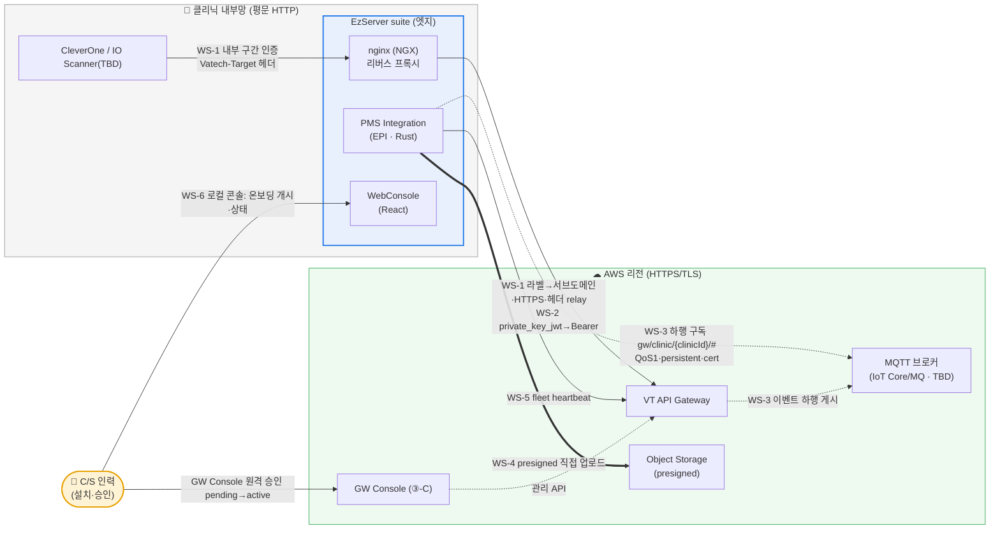

# Engineering One Pager — EzServer GW 적응 (③-P-EZ)

create by: Raymond Jeon (GW·Raymond)

## Project Name

EzServer — GW 적응 개발 (③-P-EZ)

## Date

- **초안(추출·분석)**: 2026-07-20 · Raymond
- **상태**: 초안 — Raymond가 ③ GW SRS + **기존 EzServer 코드베이스 분석**으로 작성한 시드. **작성·완성 = EzServer 팀(Teddy·Thomas)**. 정식 baseline은 ③ GW SRS baseline 이후(제품 레포).
- **⚠ 표기 규칙**: v1.0=Straumann IO Scanner 우선이나 **IO Scanner↔EzServer 연동 방식은 미정(R1)**. 확정 못한 부분은 **`TBD`** 로 명시했고, 방식 확정 후 EzServer 팀이 구체화한다.

## Submitter Info

- **초안 작성**: Raymond — GW 표준 계약(SRS/OpenAPI/DBML) + 기존 EzServer suite 분석
- **완성·소유**: EzServer 팀(Teddy·Thomas) — 7/16 주간회의 R3 결정("EzServer 연동 Spec 초안은 Raymond가 해서 Thomas에게 전달")
- **관련 소유**: LMP/ELM(라이선스·Clinic-ID) · ③-C GW Console(C/S 원격 승인) · ③-I 인프라(MQTT 브로커·DNS·KMS)

## 인계 가이드 (→ EzServer 팀)

**이 문서 쓰는 법.** 이 초안은 Raymond가 (a) GW SRS에서 EzServer 개발 항목을 추출하고 (b) 기존 EzServer suite 코드를 분석해 **"무엇을 어느 컴포넌트에서"** 까지 정리한 뼈대다. EzServer 팀은 각 작업 블록(WS-1~8)의 `🔧 EzServer 팀 상세` 를 채워 **"어떻게 구현하는가"** 를 완성한다 — 요구·착지 컴포넌트는 이미 정리됐으니 설계·인터페이스·공수를 채우면 된다. 상세는 이 파일에 이어 쓰고, 최종은 **EzServer 제품 레포**로 승계 → PR → baseline(③ GW SRS baseline 이후).

**EzServer 팀이 정하는 것 (= 각 `🔧 EzServer 팀 상세` 합).** private_key_jwt 키 저장 방식·서명 라이브러리 · nginx proxy 블록 생성 방법(Nginx Controller SCF→NCF vs include) · GW 하행 MQTT를 EPI 어느 태스크로 얹을지 · presigned 발급주체 전환 범위 · heartbeat 태스크 주기 구현 · WebConsole GW 패널/클라이언트 형태 · OneID 분리 범위 · 컴포넌트별 공수·순서·테스트.

## Project Description

EzServer는 클리닉 현장 PC에 설치되는 **엣지 서버 제품군(suite)** 이다 — 단일 프로세스가 아니라 nginx 웹서버·PHP 백엔드·인증/라이선스 서버·Rust 연동 서비스·관리 콘솔이 함께 도는 구성이다. GW 관점에서 이 suite 전체가 **하나의 디바이스**(클리닉당 1대)로 보인다. 본 One Pager는 **GW 도입에 따라 이 suite의 어느 컴포넌트를 어떻게 고쳐야 하는지**를 GW SRS와 실제 코드 분석으로 정리해 EzServer 팀에 넘긴다.

**기존 EzServer 구성요소 현황** (코드/문서 분석)

| 컴포넌트 | 현재 역할 | 기술·경로 | GW 적응 관련성 |
| --- | --- | --- | --- |
| **nginx (NGX) + FastCGI(PHP)** | 클리닉 내부망 요청을 받는 **웹서버·리버스 프록시 프론트**. `Nginx Controller`가 서버 설정(SCF)을 읽어 nginx 설정(NCF)을 생성 | nginx+PHP · `EzServerService` | **WS-1 라우팅/Bypass의 착지점**(신규 proxy config) |
| **EzServer AuthProvider (EAP)** | OAuth 기반 **통합 인증 서버** | `EzServerService` 계열 | **WS-2 인증** — 현재 client_credentials·introspection(대칭키), **private_key_jwt 부재** |
| **LicenseManager (ELM)** | Cryptlex·LMP 연동 **라이선스·Clinic-ID 발급** | `ezserver-license-manager` | **WS-2 온보딩** — Clinic-ID 소스(재활용) |
| **PMS Integration (EPI)** | localhost `/epiapi` **번역 서비스** — PMS/EzCloud 연동·**presigned 업로드**·**MQTT/AMQP** | **Rust(axum)** · `ezserver_pms_integration` | **WS-3(MQTT 확장)·WS-4(업로드 수정)·WS-2(device-id/enroll handler)** |
| **WebConsole** | 로컬 **관리 UI**(`/webconsole/`) — 서버정보·PMS 연동·계정·업데이터 | **React/Vite** · `ezserver_webconsole_frontend` | **WS-6 로컬 온보딩 콘솔의 착지점**(패널 추가) |
| EzServerLinker | 현재 클라우드 연계 relay(참고) | `common/ESLinkageCloudPlatform/EzCloudService` | 현행 경로 참고(경로 B/하위 호환) |

- **범위(포함)**: GW 경유 전환(3단계)·ClinicID·Region 인지(4단계)·AXS 갈래 A presigned 직접 업로드(④ 연계)·라우팅 변환·enrollment·인증·MQTT 하행·fleet heartbeat·로컬 온보딩 콘솔.
- **범위 밖**: **EzServer 전면 Rust 재개발(후속 별도 트랙)** · GW 내부 구현 · AXS 내부 가입/구독 절차(④) · CleverOne 자체 변경(③-P-CO).

## Business and Marketing Justification

- **분산 통제 일원화** — CleverOne이 EzServer를 우회해 CleverSpace로 직결하는 **경로 B**를 GW 경유로 통일해 인증·버전 호환·감사를 **단일 control plane**으로 모은다.
- **버전 불일치 실패 해소** — EzServer가 `Vatech-*` 식별 헤더를 실어주어 GW가 호환성 게이팅(FR-COMPAT-01)으로 원인불명 실패를 차단·안내한다.
- **v1.0 사업 우선순위(IO Scanner)** — Straumann IO Scanner→AXS(갈래 A) 연동의 클리닉 측 실행 주체가 EzServer다.
- **재사용으로 공수 절감** — 분석 결과 presigned 업로드·MQTT·device-id·로컬 콘솔 골격이 **이미 존재**해, 전면 재개발 없이 **기존 컴포넌트 확장**으로 상당 부분 수용 가능하다.

## Risk Assessment

| 리스크 | 영향 | 완화 |
| --- | --- | --- |
| **IO Scanner↔EzServer 연동 방식 미정(R1)** | v1.0 우선 기능의 **선결** — 미확정 시 갈래 A 전체 지연 | R1 조기 확정, 확정 전까지 관련 세부 **TBD**로 격리(WS-8) |
| **private_key_jwt 서명 인프라 부재(EAP)** | 인증 방식 전환이 **순수 신규 개발** | 키 생성·보관·JWT 서명 신규(WS-2) — device-id 생성기는 재활용 |
| **MQTT 하행이 기존 용도와 다름** | EPI의 MQTT는 진행알림(ws)·AMQP는 PMS용 → GW 브로커 구독은 신규 채널 | rumqttc 인프라 재활용 + 신규 구독/envelope 처리(WS-3) |
| **device-id가 Windows/WMI 종속** | `generate_ezserver_id.rs`가 WMI 기반(비Windows 불가) | v1.0 EzServer=Windows 전제라 무방·비Windows device는 후속 |
| **OneID 결합 분리** | EPI가 OneID에 얽혀 있으나 **GW에 OneID 없음**(확정) | GW 경로에서 OneID 의존 분리(config·client 팩토리) |
| **client→EzServer 내부 구간 무검증 전달** | 프록시 남용·LAN SSRF·`Vatech-Target` 위조 | nginx 화이트리스트 + 내부 호출자 인증(WS-1) |

## Resource and Scheduling Details

- **작성**: 본 초안(Raymond) → **EzServer 팀이 완성**. GW는 표준 계약(SRS §7·OpenAPI·DBML)만 제공.
- **일정**: 차주 이후 EzServer 팀 상세화 → ③ GW SRS baseline 이후 PR·리뷰 → 제품 레포 baseline. IO Scanner 의존부는 R1 확정 후.
- **의존**: ③ GW SRS · ③-I 인프라(브로커·DNS·KMS) · LMP/ELM(Clinic-ID) · ③-C GW Console · ④ AXS Sub-SRS.
- **후속(범위 밖)**: EzServer 전면 Rust 재개발은 5단계 이후 별도 트랙.

## Technical Description

### 데이터 흐름 (한눈에)

> EzServer(방화벽 뒤 엣지) 관점의 흐름. 점선=역방향(하행)·굵은선=대용량 우회. 라벨의 WS 코드는 아래 작업 블록과 대응.



> **C/S 인력**이 두 콘솔을 다룬다 — 현장 **WebConsole**로 온보딩 개시(WS-6), **GW Console(③-C)** 로 원격 승인. **IO Scanner→EzServer 유입(WS-8)은 방식 미정(TBD)**.

### 작업 블록 요약 — 어느 컴포넌트를 고치나

| 블록 | 기능 | 대상 컴포넌트(파일) | 상태 |
| --- | --- | --- | --- |
| **WS-1** | 상행 라우팅·프록시(Bypass)·식별 헤더·내부 인증 | **nginx(NGX)** / Nginx Controller(SCF→NCF) · EPI `http_client_factory` | 🆕 신규 config + 🔧 헤더 |
| **WS-2** | 인증·온보딩(private_key_jwt·enroll·재-enroll) | **EAP**(인증) · EPI `generate_ezserver_id`·`post_clinics`·`post_auth_clients` · ELM(Clinic-ID) | 🆕 서명 인프라 + 🔧 enroll |
| **WS-3** | 하행 이벤트 수신(Webhook/MQTT downlink) | **EPI** `upload_manager/mqtt_client`(rumqttc) | 🔧 확장 + 🆕 구독/envelope |
| **WS-4** | 대용량 업로드(presigned 직접) | **EPI** `upload_manager/` | 🔧 수정(발급주체 전환) |
| **WS-5** | Fleet heartbeat | **EPI**(신규 주기 task) | 🆕 신규 |
| **WS-6** | 로컬 온보딩 콘솔 | **WebConsole** `usePMSIntegration`·`PMSPanel`·`clients` | 🔧 패널·클라이언트 추가 |
| **WS-7** | 하위 호환·경로 B 이관 | nginx 라우팅 · EzServerLinker(현행) | 🔧 전환 |
| **WS-8** | IO Scanner 수집(0단계) | 미정 | ⬜ **TBD(R1)** |
| **WS-9** | 연동 등록(org-binding·AXS link 개시) | **EPI/WebConsole** — `POST /v1/clinics/me/org-bindings`·AXS link 프록시 | 🆕 신규 |

범례: 🆕 신규 개발 · 🔧 기존 수정/확장 · ⬜ 미정.

> WS-1에 **오류 envelope 패스스루·호환 경고 relay·클라이언트 타임아웃(30s) 계약**, WS-3에 **엣지 last-hop 분배(TBD)** 가 포함된다(아래 상세).

---

### WS-1. 상행 라우팅·프록시 (Bypass) — nginx 착지 (SRS §2.3.0·§4.1.2·§4.5.1·§7.7.1·ADR-11)

**목적**: CleverOne→EzServer→GW→target. 내부 `Vatech-Target: {label}` 헤더(A)를 **`{label}.gw.vatech.com` 서브도메인 + HTTPS(C)** 로 변환해 전달. AXS 경로는 URL·body **verbatim**.

**대상**: **nginx(NGX)** — 순정 nginx `map`으로 라벨→서브도메인, 평문→HTTPS 브리징, 화이트리스트(SSRF 방어). 단 EzServer는 nginx 설정을 손으로 두지 않고 **`Nginx Controller`가 SCF→NCF로 생성**하므로, 이 proxy 블록을 **Controller가 생성하도록 추가**하거나 별도 include로 얹어야 한다(구현 방식=EzServer 팀).

**식별 헤더 relay**: originator `Vatech-Product/Version/OS`는 그대로 전달, EzServer는 `Vatech-Via: EzServer/{ver}` 누적. **현재 코드에 `Vatech-*` 처리 부재** → nginx relay(또는 EPI가 GW를 직접 호출하면 `http_client_factory`에도) **신규 추가**. 외부(AXS)로는 내부 `Vatech-*` 미전송(GW가 교체).

**내부 구간 인증**(client→EzServer): GW에 인증하는 주체가 EzServer라 **내부 구간 인증·인가는 EzServer 몫**(GW 신뢰경계 밖). 임의 LAN client의 `Vatech-Target` 위조·무검증 전달 방지 — 화이트리스트 + 내부 호출자 인증(수준=EzServer 위협모델).

**nginx config 예제** (7/16 회의 검증 스케치 — 확정·튜닝은 EzServer 팀):

```nginx
# 내부(A: Vatech-Target 헤더) → GW edge(C: 서브도메인) 브리징. 순정 nginx.
resolver 8.8.8.8 1.1.1.1;                        # 변수 proxy_pass 런타임 해석 → 공인 DNS(루프 방지)

map $http_vatech_target $gw_target {             # target 검증(SSRF 방어)·제네릭
    default              "";                     # 형식 위반 → 빈값
    "~^[a-z0-9-]{1,40}$" $http_vatech_target;    # 소문자·숫자·하이픈만 허용(provider 추가해도 무변경)
}

server {
    listen 80;                                   # 평문 HTTP(대부분)
    listen 443 ssl;                              # 자체 HTTPS(self-signed, 켜진 경우)
    ssl_certificate     /etc/ezserver/tls/self.crt;
    ssl_certificate_key /etc/ezserver/tls/self.key;

    location / {
        if ($gw_target = "") { return 400; }             # Vatech-Target 없음/형식 위반 → 400
        proxy_pass          https://$gw_target.gw.vatech.com$request_uri;  # C: {target}.gw.vatech.com
        proxy_ssl_server_name on;
        proxy_ssl_name      $gw_target.gw.vatech.com;    # 아웃바운드 SNI
        proxy_set_header    Host $gw_target.gw.vatech.com;# Host(GW가 라우팅)
        proxy_ssl_verify    on;                          # GW 공인 인증서 검증(중간자 방지)
        proxy_ssl_trusted_certificate /etc/ssl/certs/ca-certificates.crt;
        proxy_connect_timeout 3s;                        # 연결(§7.5.4 D1)
        proxy_read_timeout    30s;                       # 응답 대기 = 클라(EzServer) 타임아웃(§7.5.4 D4·30s) — GW deadline(≤24s)보다 커야 함
        proxy_send_timeout    30s;
        # proxy_intercept_errors off(기본): GW 오류 envelope·Vatech-Error-Origin·Retry-After를 nginx 에러페이지로 대체 금지(§7.7.4)
        # Vatech-* 식별 헤더(Product/Version/OS/Clinic-Id/Via)·Vatech-Compat-Warning은 그대로 전달
    }
}
```

- **동작**: `Vatech-Target: axs` → `axs.gw.vatech.com` HTTPS 브리징(EzServer 자체 HTTPS-off 무관, 아웃바운드는 nginx가 HTTPS 개시).
- **응답·오류 패스스루(§7.7.4)**: GW 정규화 오류(`502/503/504`+`Vatech-Error-Origin: gateway`·`Retry-After`)와 target verbatim 오류(`Vatech-Error-Origin: target`)를 **클라이언트에 그대로 반환** — nginx 기본 에러페이지로 치환 금지(클라가 "게이트웨이/인프라 실패 vs target 거부" 구분).
- **호환성 경고 relay(§7.7.3)**: GW 게이팅 반응(major=차단·minor=경고통과·patch=무시)에서 **경고 헤더(예 `Vatech-Compat-Warning`)·업데이트 필요 오류를 삼키지 말고 전달**(헤더명 확정=Appendix B #8).
- **클라이언트 타임아웃 계약(§7.5.4 D4·Appendix B #25)**: EzServer 아웃바운드 대기 = **30s(계약값)** → GW deadline ≤24s가 이에서 역산됨. nginx `proxy_read_timeout`을 여기 맞추고, (선택) `Vatech-Timeout-Ms`로 예산 통지. **이 30s 확정이 #25(D4)를 닫는다 — EzServer 확인 필요.**
- **EzServer 자기 호출 헤더·호스트(§7.7.1·§4.5.1)**: EzServer가 originator로 **GW 고유 API**(enroll·token·clinics/me·heartbeat)를 호출할 땐 자신의 `Vatech-Product: EzServer`/Version/OS를 붙이고 **apex `gw.vatech.com`**(target 서브도메인 아님)로 보낸다. 비-prod=`{env}.gw.vatech.com`.
- **보안 주의**: 평문 LAN 구간 토큰/PHI 노출 위험 — 민감 트래픽은 그 구간 HTTPS 권장.
- **미결(R1)**: 7/16 회의에서 **라우팅 방식 재평가**(A 헤더 vs B 경로 프리픽스) 논의 중 — R1 확정 시 이 config가 바뀔 수 있다(경로 프리픽스 시 `location /gw/{target}/`).
- `🔧 EzServer 팀 상세`: proxy 블록을 Nginx Controller(SCF→NCF)로 생성할지 별도 include로 얹을지 · SCF 스키마에 GW 설정 추가 · 화이트리스트 관리(정적 map vs 동적) · 내부 구간 인증 방식·수준 · `Vatech-*` relay 지점(nginx vs EPI) · 평문 LAN 구간 HTTPS 적용 여부.

### WS-2. 인증·온보딩 (Enrollment / Device Identity) — EAP+신규 (SRS §2.3.1·§2.3.2·§7.1.1·§7.2)

**목적**: 디바이스가 개인키로 자신을 증명(`private_key_jwt`)하고 GW에 enroll한다.

**현황 격차**: 현재 인증은 **EAP의 OAuth `client_credentials` + introspection(대칭 시크릿)** 이고, EPI도 `oauth_client` 대칭키를 쓴다 — **개인키·JWT 서명 인프라가 없다**. GW의 `private_key_jwt`는 **신규 개발**.

**할 일**:
- **키페어 생성·개인키 at-rest 보관**(디바이스 외부 반출 금지·백업/export 미도입) — 신규. device 식별은 기존 `generate_ezserver_id.rs`(WMI 기반 UUID+BIOS Serial)를 안정 fingerprint로 재활용 가능하나, **GW 바인딩 키는 별도 키페어**.
- **enroll 흐름**: LMP/ELM Clinic-ID + 라이선스를 실어 `POST /v1/enroll/start` → nonce 개인키 서명 → 공개키 `POST /v1/enroll/complete`. 기존 EPI enroll 계열(`post_auth_clients.rs`·`post_clients.rs`·`post_clinics.rs`)을 GW 대상으로 확장/치환.
- **토큰(§7.1.1)**: 개인키로 client_assertion 서명(claim=`iss`·`sub`=client_id·`aud`=GW 토큰 EP·짧은 `exp`·`iat`·**매회 고유 `jti`**·고정 `alg`) → `POST /v1/auth/token` → 단명 Bearer(refresh 없음·만료 시 재서명). **구현 함정**: `jti` 재사용 시 401(GW가 `SET NX EX` 단일 소비) · **노드 시계 NTP 동기 필수**(짧은 exp/iat 검증) · `aud`를 정확한 토큰 EP로 고정 · **토큰을 만료까지 캐시 + single-flight 갱신**(토큰 EP rate-limit·thundering herd 회피).
- **활성화**: `pending` → C/S가 **GW Console(③-C)** 원격 승인 → `active`. 개시는 **WebConsole**(WS-6), 승인은 GW Console — 별개.
- **재-enroll 회전**(재설치·개인키 분실): 동일 clinic_id·C/S 재승인. 유일 경로.
- **차단 상태 처리(§7.2.4)**: 토큰/API가 갑자기 401/403이면 **suspended(복구 가능→백오프·대기)** 와 **revoked(종료→재-enroll 회전)** 를 구분해 처리하고 콘솔(WS-6)에 노출. revoked는 캐시 TTL 무관 즉시 차단.
- **clinic 정보 전송**: enroll 시 LMP clinic 정보(name·country_code·address·phone·website) 함께 전달. LMP 변경 자동 sync 안 함(수동 `PATCH /v1/clinics/me`).
- **OneID 분리**: EPI가 OneID에 결합돼 있으나 **GW에 OneID 없음(확정)** — GW 경로에서 OneID 의존 제거.
- `🔧 EzServer 팀 상세`: 키페어 알고리즘·개인키 at-rest 저장 위치/보호(DPAPI·키스토어 등)·서명 라이브러리 · enroll을 EAP에서 처리할지 EPI 핸들러 확장으로 할지 · ELM Clinic-ID/라이선스 조회 연동 · client_assertion 생성·토큰 캐시 · OneID 의존 분리 범위(config·client 팩토리).

### WS-3. 하행 이벤트 수신 (Webhook / MQTT downlink) — EPI 확장 (SRS §7.6.6·§2.3.6)

**목적**: AXS 등 외부 이벤트를 GW가 브로커로 하행 게시 → EzServer가 구독해 수신.

**현황**: EPI에 **MQTT 클라이언트(rumqttc)가 이미 있다**(단 현재는 EzServer Messenger 진행알림·ws용) + AMQP RPC 수신(PMS용). GW 하행은 **별도 브로커·토픽 구독**이라 인프라는 재활용하되 채널은 신규.

**할 일**:
- **outbound 지속 구독** `gw/clinic/{clinicId}/#` · **QoS1·persistent·TLS·cert**.
- **v1.0은 `webhook` stream만 처리**(모르는 stream 무시·forward-compat). envelope `{ target, eventId, eventType, clinicId, ts, payload }` 파싱.
- **⚠ 엣지 last-hop 분배(§7.6.7·TBD)**: envelope를 벗겨 **원 payload(verbatim)를 클리닉 내 소비자(CleverOne/앱)에 전달**하는 것이 하행의 목적. 그런데 **클리닉 내 소비자는 MQTT push 대상이 아니라** 분배 방식이 미정("MQTT 역방향 Edge 분배 운영 주체" TBD). 필요 동작: envelope unwrap · **edge에서 eventId 재-dedup** · `target`/`eventType`로 라우팅 · 소비자에 노출(로컬 큐/콜백/폴링 등). **분배 메커니즘 확정 필요.**
- **ClinicResolution 소비(§7.3.1)**: `GET /v1/clinics/me`(브로커 endpoint·region·hosts 포함)를 **`cacheTtlSeconds`만큼 캐시**하고 **`mappingVersion` 변화 시 재조회**.
- **브로커 endpoint는 GW가 하달**(`GET /v1/clinics/me`·enroll config). 리전 변경 시 새 리전 브로커 재접속(토픽 불변).
- 장애 시 **자동 재접속**(persistent 세션·백오프=EzServer). eventId 멱등이라 중복 무해.
- **브로커 제품(IoT Core/Amazon MQ)·토픽 문법 = TBD**(SRS Appendix B 브로커 확정 후).
- `🔧 EzServer 팀 상세`: GW 하행을 기존 `mqtt_client`(rumqttc) 확장으로 얹을지 별도 커넥션으로 둘지 · cert 프로비저닝·저장(enroll 산출물과 연계) · envelope→내부 처리 매핑 · 재접속/백오프 파라미터 · 리전 변경 재접속 트리거 · 수신 이벤트를 어느 내부 소비자로 전달할지.

### WS-4. 대용량 업로드 (presigned 직접) — EPI 수정 (SRS §2.3.5·§4.1.4·§7.4)

**목적**: 대용량 파일을 발급 주체 storage에 직접 업로드(GW 미경유).

**현황**: EPI `upload_manager/`가 **이미 presigned URL→S3→create/share** 파이프라인을 EzCloud 대상으로 구현(zip 스트리밍·2GiB·워커풀). GW/AXS 시대엔 **발급 주체·엔드포인트만 전환**하면 된다.

**할 일**: presigned 발급 주체를 CleverSpace/AXS로 전환(config·client), 업로드 target·자격 흐름 조정. 기존 워커풀·zip 스트림 재활용.
- **멱등키(§4.5)**: 재시도(timeout/503) 시 **안정 `Idempotency-Key`** 를 업로드 완료/변경 요청에 실어 중복 적용 방지(프록시 경유 변경 요청에도 동일).
- `🔧 EzServer 팀 상세`: 발급 주체별(EzCloud vs AXS) presigned 요청 클라이언트 분기 · IO Scanner 산출물의 zip/포맷 처리(WS-8 의존·TBD) · 업로드 완료 통지 경로 · 자격/토큰 전달 방식 · 재시도·부분 실패 처리·Idempotency-Key 생성/재사용.

### WS-5. Fleet heartbeat — EPI 신규 (SRS §7.8.1)

**목적**: GW가 방화벽 뒤 EzServer를 폴링 못하므로 EzServer가 능동 보고.

**현황**: 현재는 **로컬 readiness 체크만** 존재(클라우드 보고 없음) → **신규**.

**할 일**: `POST /v1/fleet/heartbeat`를 주기 호출(주기=응답 `nextIntervalSeconds`·중앙 config), 본문 `appVersion`·`os`·(선택)health. EPI에 신규 주기 task 추가(기존 tokio 태스크 패턴 재활용).
- `🔧 EzServer 팀 상세`: heartbeat를 EPI 어느 프로세스에 둘지 · 수집 health 지표 범위 · 초기 주기 기본값·오프라인 판정 연동 · 실패 시 백오프 · 네트워크 단절 중 동작.

### WS-6. 로컬 온보딩 콘솔 — WebConsole 확장 (SRS §2.3.1 [2])

**목적**: 설치자/C-S가 현장에서 온보딩을 개시·상태 확인.

**현황**: **WebConsole(React/Vite)의 PMS 연동 패널이 거의 동일한 템플릿**이다 — `usePMSIntegration.ts`가 이미 연동 개시·연결 확인·자격 재생성·상태 머신(성공/실패)을 구현. GW 온보딩은 **이 패턴 복제**로 자연스럽게 추가된다.

**할 일**:
- 신규 백엔드 클라이언트(`ezServerPmsIntegrationClient` 복제 → GW용, 예 `/gwapi/*` 또는 EPI `/epiapi` 경유) + react-query.
- 신규 패널·라우트(예 `/main/gateway`, `routes.tsx` 등록) 또는 기존 통합 패널에 섹션 추가(제품 스코핑=EzServer 팀).
- **최소 기능**: ⑴ Clinic-ID·라이선스 확인 후 **enroll 개시** · ⑵ **상태 표시**(`pending`/`active`/`expired`/`suspended`/`revoked`/오류) · ⑶ **재-enroll 트리거** · ⑷ (선택) 연결·heartbeat 확인.
- **추가 상태·기능**: pending **7일 만료**(Appendix B #43)→`expired` 표시·재개시 · **suspended/revoked 차단 상태** 표시(WS-2 연계) · **리전 선택·운영 중 리전 이전**(`GET /v1/regions`·§7.3.4·주로 gw/1.2).
- OAuth scope에 GW 스코프 추가 필요 여부 확인(`common/auth/config.ts`).

**경계**: **GW Console(③-C)** 은 C/S의 원격 승인·전체 디바이스 관리(클라우드), **WebConsole**은 자기 장비 온보딩·자가 진단(로컬). GW는 **계약(enroll·상태·재-enroll API)** 까지만, 로컬 UI 범위는 EzServer 소관.
- `🔧 EzServer 팀 상세`: GW 패널을 신규 라우트로 둘지 기존 통합 패널 섹션으로 둘지 · 백엔드 클라이언트 경로(`/gwapi` 신규 vs `/epiapi` 경유) · GW 상태를 EPI 리소스로 둘지 EzServer SettingValue로 둘지 · OAuth scope 추가 · 재-enroll 다이얼로그(기존 자격 재생성 패턴 복제).

### WS-7. 하위 호환·경로 B 이관 (SRS §2.8)

기존 EzServer→CleverSpace/CleverOne 흐름은 계약·동작 변경 없이 GW를 경유(현행 EzServerLinker 경로 포함 검토). **경로 B(직결)** 사용분은 EOS 전 GW 경유로 이관(시점=PM).
- `🔧 EzServer 팀 상세`: 현재 클라우드 통신 경로(EzServerLinker vs EPI) 확인 · GW 경유로 전환할 범위·순서 · 경로 B 사용처 식별·EOS 계획(PM 협의) · 기존 클라이언트 무중단 전환 방안.

### WS-9. 연동 등록 — org-binding · AXS link 개시 (GW 계약분) (SRS §2.3.4·§7.3)

**목적**: target(AXS 등) 연동을 켤 때 클리닉이 자기 매핑(Org-ID)을 등록해야 outbound 호출·webhook 분배가 동작한다.

**할 일**:
- 연동 활성화 시 **`POST /v1/clinics/me/org-bindings`로 Org-ID 자가 등록**(GW DB 매핑·§2.3.4). 이게 없으면 AXS outbound·분배 불가.
- 케이스 B(AXS): `customerNumber`로 AXS **`.../integration/link`** 를 `axs.gw.vatech.com` 경유(verbatim 프록시) 호출해 `organizationId` 획득 후 org-binding 등록.
- **경계**: `POST /v1/clinics/me/org-bindings`·link 프록시 호출은 **GW 코어 계약이라 EzServer가 수행**한다(④ 아님). AXS 고유 시퀀스(동의 폴링·상태 판정)만 ④.
- `🔧 EzServer 팀 상세`: 연동 활성화 UI(WebConsole)·`customerNumber` 수집·link 호출·org-binding 등록·오류 처리·재시도(멱등키 WS-4).

### WS-8. ⚠ IO Scanner 수신·수집 (0단계) — **TBD (R1 미정)**

- **`TBD` — IO Scanner↔EzServer 연동 방식 미정**(주간회의 R1): 수집 제품·프로토콜·트리거 미확정.
- 확정 필요(모두 R1 후): **수집 방식**(파일 watch/SDK/로컬 API)·**포맷**·**EzServer 내 파이프라인**(→ WS-4 업로드·→ 갈래A로 연결).
- v1.0 우선 연동이 IO Scanner라 **이 블록이 선결** — R1 확정 전까지 WS-4/WS-3의 IO-Scanner-특정 세부도 **TBD**.

### TBD 목록 (확정 필요)
| 항목 | 내용 | 소유·확정 시점 |
| --- | --- | --- |
| **IO Scanner↔EzServer 연동 방식** | 수집 제품·프로토콜·포맷·파이프라인(WS-8) | R1(주간회의) |
| MQTT 브로커 endpoint·토픽 문법 | 브로커 제품(IoT Core/Amazon MQ) 확정 후 | ③-I |
| 역방향 대상 이벤트 목록 | AXS가 통지할 이벤트·활성화 세부 | ④ AXS Sub-SRS |
| fleet heartbeat 기본 주기·오프라인 임계 | 정본 값 | GW SRS Appendix B |
| 내부 구간 인증 수준 | client→EzServer 인증·zero-trust 여부 | EzServer 위협모델 |
| GW 라우팅 방식(A 헤더 vs B 경로) | nginx config 형태 결정 | R1(주간회의) |
| **엣지 last-hop 분배 메커니즘** | envelope→클리닉 내 소비자 전달 방식(WS-3·§7.6.7 TBD) | EzServer + GW |
| **클라이언트 타임아웃 30s 확정** | GW deadline 역산 기준(§7.5.4 D4·Appendix B #25) | EzServer 확인 |

## Terms and Abbreviations

| 용어 | 설명 |
| --- | --- |
| **EzServer suite** | 클리닉 엣지 제품군(nginx·PHP·EAP·ELM·EPI·WebConsole). GW 관점에서 디바이스(클리닉당 1대) |
| **NGX / FGI** | nginx 웹서버 / FastCGI(PHP 구동) — 리버스 프록시 프론트 |
| **EAP** | EzServer AuthProvider — OAuth 통합 인증 서버 |
| **ELM** | EzServer LicenseManager — Cryptlex·LMP 연동 라이선스·Clinic-ID 발급 |
| **EPI** | EzServer PMS Integration — Rust(axum) localhost `/epiapi` 번역 서비스(업로드·MQTT·AMQP) |
| **WebConsole** | EzServer 로컬 관리 UI(React/Vite·`/webconsole/`) |
| **GW** | VT API Gateway — 연동 단일 control plane |
| **GW Console (③-C)** | 운영자용 클라우드 어드민 웹 — enroll 원격 승인 |
| **private_key_jwt** | 디바이스가 개인키로 client_assertion 서명해 토큰 발급받는 인증 방식 |
| **Vatech-Target** | 내부 구간에서 논리 target 지시 헤더(→ 서브도메인 변환) |
| **Vatech-Via** | 요청 경유 홉 식별(예: EzServer) |
| **경로 B (Path B)** | CleverOne→CleverSpace 직결(EzServer 미경유)·Deprecated 대상 |
| **갈래 A** | EzServer→AXS 연동(장비·스캐너·v1.0 우선) |
| **presigned** | 발급 주체 storage 직접 업로드 서명 URL(GW 미경유) |
| **AXS** | Straumann AXS(외부 연동 플랫폼) |

## 참조

GW SRS §2.3.0·§2.3.1·§2.3.2·§4.1.2·§4.1.4·§4.5.1·§7.1.1·§7.2.7·§7.6.6·§7.7.1·§7.8.1·§2.8 · Roadmap §3.7·§4·§5.1 · 기존 코드: `ezserver_pms_integration`(Rust)·`ezserver_webconsole_frontend`(React)·`ezserver-license-manager` · 참조 문서 `references/EzServer/EzServerService`(nginx/PHP·Nginx Controller) · 이 폴더 `_status.md`.
