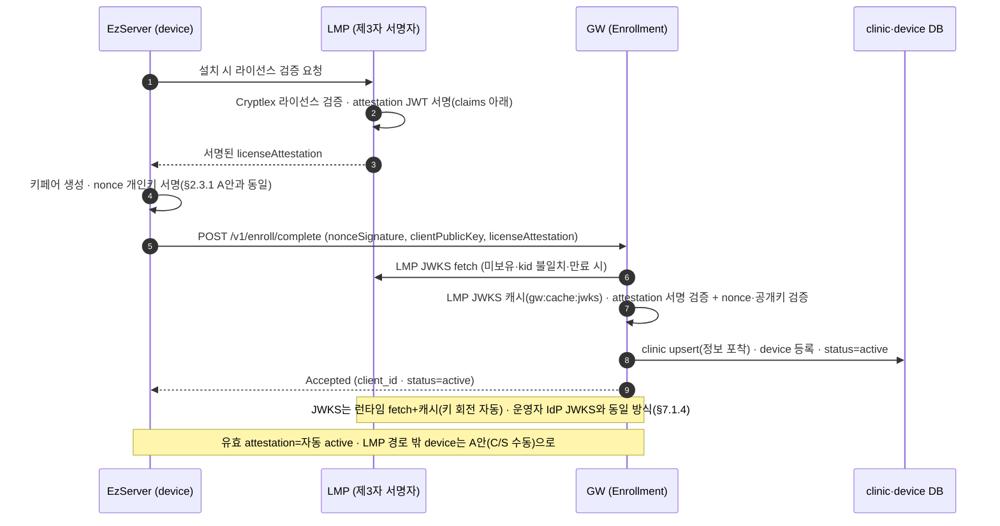

# ③-P-LMP One Pager — LMP 제3자 서명 attestation (enroll 자동승인 · B안)

> **상태: 초안(조건부).** enroll 승인 flow의 **B안(제3자 서명 자동승인)** 을 채택할 때(주간회의 R9) 개발하는 스펙이다. v1.0 baseline은 **A안(C/S 수동 승인)** 이며, B는 gw/1.1+ 옵션으로 A와 **공존**한다(택일 아님). 정본 계약 = ③ GW SRS §2.3.1 B·§7.1.1·§7.1.4 · Appendix B #42 · Agenda R9.
> **소유(개발)=LMP/ELM 팀(ES 라이선스), 크로스팀.** 본 문서는 GW 소유자 1차 초안이며 인계 후 확정.

## 1. 목적·배경

- **문제**: enroll 승인이 **C/S 수동**(현장 담당자가 GW Console에서 device를 pending→active)이라, 설치마다 사람 손이 필요하다(이전 회의에서 "현장 번거로움" 우려·10만 대 확장성).
- **해결(B안)**: **LMP가 라이선스를 검증했다는 사실을 서명(attestation)** 해 주면, GW가 그 서명을 검증해 **유효 라이선스 device를 자동 active** 시킨다 → C/S 수동 승인 생략.
- **"제3자 서명"**: GW 입장에서 **LMP(바텍 클라우드)가 신뢰하는 제3자 서명자**로서 "이 라이선스는 이 clinic의 것"을 보증한다. GW는 LMP 공개키로 그 보증을 검증한다.

## 2. 범위·비범위

- **범위**: LMP의 attestation 서명 발급 + JWKS 공개, EzServer의 attestation 취득·릴레이, GW의 검증·자동승인.
- **비범위**: A안(C/S 수동 승인)은 별개로 항상 유지 — **LMP 라이선스 경로 밖 device**(비-EzServer·미등록)는 A로 승인. 라이선스 발급/Cryptlex 활성화 자체(기존 LMP/ELM 기능).

## 3. 액터

| 액터 | 역할 |
| --- | --- |
| **LMP** (바텍 클라우드) | **제3자 서명자** — Cryptlex로 라이선스 검증 후 attestation JWT 서명·JWKS 공개 |
| **ELM** (`ezserver-license-manager`, 클리닉 로컬) | Cryptlex/LMP 연동 — attestation 취득 경로 |
| **EzServer** (device) | attestation을 받아 enroll에 **릴레이**(자체 서명 안 함) |
| **GW** | enroll 시 attestation을 **LMP JWKS로 검증** → 자동 active |
| Cryptlex (3rd-party) | LMP 하부 라이선스 엔진(GW는 직접 접촉 안 함) |

## 4. 시퀀스

## 5. LMP/ELM 개발 항목 (주 개발 주체)

1. **비대칭 서명 키페어** 생성·보관(private=LMP/KMS). Cryptlex product 키와 무관한 **LMP 자체 서명 키**.
2. **JWKS(공개키) 공개 엔드포인트** — 예 `https://lmp.vatech.com/.well-known/jwks.json`. GW가 **런타임 fetch + 캐시**(키 회전 자동 대응). *공개키 복사-내장(pin)은 채택 안 함 — 런타임 fetch 단일.*
3. **attestation 발급** — Cryptlex 라이선스 검증 성공 후 JWT 서명 발급(신규 엔드포인트 또는 기존 activate 응답 확장).
4. **키 회전 정책** — `kid`로 JWKS 다중 키 게시(무중단 회전).

## 6. attestation JWT claims (제안)

| claim | 값 | 용도 |
| --- | --- | --- |
| `iss` | LMP issuer URL | 발급자(JWKS 위치 유도) |
| `aud` | `gw`(또는 GW audience) | 대상 고정(오용 방지) |
| `clinicId` | LMP clinicId | **device↔clinic 바인딩**(§2.3.1) |
| `licenseId`/`licenseKey` | LMP 식별자 | 라이선스 참조 |
| `status` | active | 라이선스 상태 |
| `deviceSerial`/`machineFingerprint` | (권장) | **replay·전용(轉用) 방지**(다른 device로 재사용 차단) |
| `iat`/`exp` | 짧은 TTL | 재생 창 최소화 |

## 7. EzServer(device) 개발 항목

- 설치 시 LMP/ELM에서 attestation **취득** → `POST /v1/enroll/complete`의 **`licenseAttestation`**(이미 OpenAPI에 optional 예약) 필드에 실어 전달.
- **버전 공존**: attestation 미지원(구) EzServer는 필드 미전송 → GW가 **A안(C/S 수동)** 으로 폴백. 신/구 EzServer 혼재 수용.

## 8. GW 개발 항목

- **LMP JWKS 런타임 fetch + 캐시**(`gw:cache:jwks`, §7.1.4 운영자 IdP JWKS와 동일 메커니즘 재사용).
- enroll 시 `licenseAttestation` 있으면 **서명·`aud`·`exp`·`clinicId`·(serial) 바인딩 검증** → 통과 시 **status=active**(C/S 승인 생략). 없거나 검증 실패 → **A안(pending·C/S 승인)** 으로.
- 감사: 자동승인 이벤트 기록(actor=`system:enroll-attestation`).

## 9. 보안

- **replay·전용 방지**: attestation에 device serial/fingerprint 바인딩 + 짧은 TTL + `aud=gw`.
- **abuse**: enroll rate-limit·미승인 pending TTL은 A/B 공통 유지.
- **키 관리**: LMP private key=KMS. GW는 공개키만(JWKS). Cryptlex 키는 GW 미노출.

## 10. A안과의 공존

- **A(C/S 수동)** = 보편·fallback(모든 device). **B(attestation 자동)** = LMP 라이선스 등록 device 편의.
- v1.0 우선순위(A먼저/B먼저/동시)는 **R9 결정**. B는 A를 **대체하지 않고 보완**.

## 11. Open items (TBD)

- R9 결정(우선순위·B 채택 여부).
- **LMP가 GW-검증 가능한 서명 attestation을 발급 가능한지** — ES 라이선스/ELM 팀 확인(Cryptlex 위에 LMP 자체 서명층 추가).
- 정확한 claim set·TTL·serial 바인딩 방식·JWKS 위치·키 회전 주기.
- Roadmap 일정 편입(현 Roadmap 미포함).

## 12. 참조

- ③ GW SRS §2.3.1(B 다이어그램)·§7.1.1·§7.1.4(JWKS)·§7.2.5 · Appendix B #42 · 주간회의 Agenda R9
- `ezserver-license-manager` `api/licenseapi.yaml`(ELM API) · Cryptlex(LexActivator·product.dat)
- OpenAPI: `EnrollStartRequest.licenseAttestation`(예약 필드)
