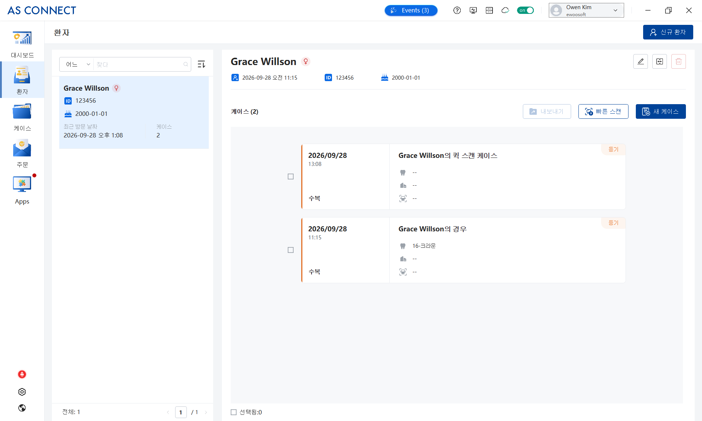
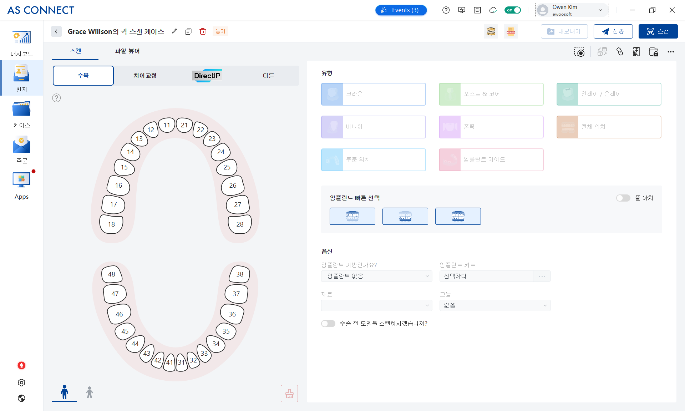
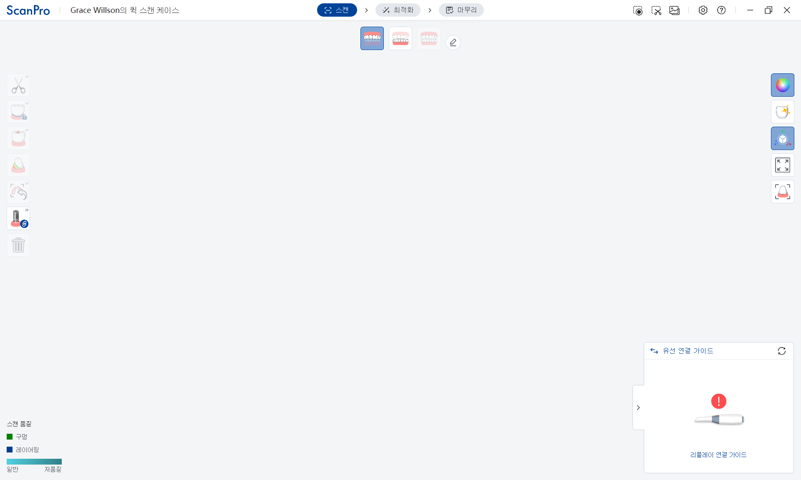
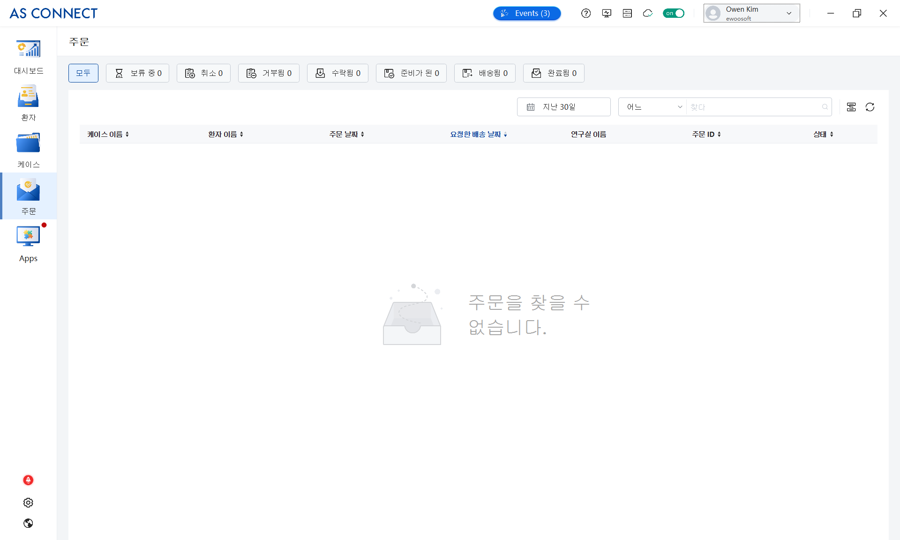

## Date/ Place/ Attendees

- Date: 2026년 9월 28일 15:00 ~16:00
- Place: MS Teams 화상 미팅
- Attendees:
    - ES : 김성훈 / Scott , 김성민/ Frank , 김성호_ES/ Owen , 조상형(Leo)
    - Alliedstar : Lawrence Chen, Shelly Tan
- 참조 : 최정우 / Hugo , 김성훈 / Scott , 민진우/ Thomas , 탁수용/ Nick

## Related VTS task

- COMM-1841 - Alliedstar IOS와 EzServer 연동을 위한 협업 방안을 논의하고 실행한다. **In Progress**
    
    
    

## Background

- 프랑스/인도 등 해외 법인으로 부터 Alliedstar IO Scanner 연동을 요청 받음
- 인도 법인에서 Alliedstar社와 소통하였고, 연동 기능 개발에 적극적 지원을 확답 받음
- 프랑스 법인의 Weclever(PMS)에서 연동 기능을 개발함
    - EVNWCL-6310 - Jira issue doesn't exist or you don't have permission to view it.

## Agenda

- ES-Alliedstar 구강 스캐너 연동 인터페이스를 협의한다.
- 연동 시나리오 설명
    - ES SW에서 환자 선택 후 촬영 기능을 실행한다.
    - Alliedstar에서 환자 정보를 전달 받아, Case를 생성하고 촬영 기능을 수행한다.
    - (옵션) 촬영 완료 후 데이터를 EzServer로 전달하여 저장한다.
        - ES SW에서 Alliedstar의 case/ 환자 편집 기능을 실행하지는 않는다.

## Discussion

- Alliedstar 소개 및 촬영 시나리오 시연
  - 환자 생성 → Case 생성 → 촬영 → 주문

  

  

  

  

- **설명:** 연동 목표
    - Straumann 연동 인터페이스 설명
    - 개발실에서 고려 중인 연동 인터페이스 설명
    - 1차 목표 (vatech API Gateway 활용 방식)
        - EzDent-i, Clever One에서 환자 선택 후 IO Scanner 촬영 기능 실행
    - 2차 목표
        - 촬영된 데이터를 EzServer에 저장
        - 촬영데이터 편집, EzServer 데이터를 Alliedstar 전송 등의 기능은 현시점에서 고려대상이 아님
- **결정 사항**
    - Alliedstar의 연동 인터페이스에 맞춰, ES에서 vatech API Gateway를 사용하는 연동 방식으로 구현한다.
    - 연동 기능 구현은 공개된 API를 활용하는 방식이라 NDA 체결이 필수는 아니다.
    - Alliedstar 연동은 환자 정보를 전달하여, 촬영 기능을 수행할 수 있게 하는 기능을 우선 목표로 한다.
    - 개발 일정 계획은 ES에서 수립 후 Alliedstar에 전달한다.
    - 이후 연동 인터페이스 논의는 이메일로 소통하고, 필요 시 미팅을 진행한다.