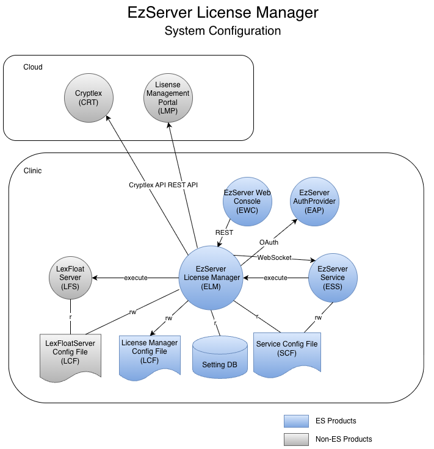

# Project name: License Manager

# Date:

- 2021-01-15 (1차 작성 완료)

# Submitter Info:

- 민진우/ Thomas

# Project Description:

본 문서는 EzServer License Manager 를 개발하기 위해서 개발중에 자주 바뀌지 않고, 문서로 남겨야할 부분에 대해서 정리한 문서이고 다음을 포한한다.

- System Configuration

# Business and Marketing Justification: N/A

# Risk Assessment: N/A

# Resource and Schedule Details:

- TBD

# Technical Description:

## System Configuration

Diagram Source: https://vatechcorp.sharepoint.com/:u:/s/es/EdodFXChRzVOgu9CBhMET9YBwMLCeBaZqFyujsb5GLlAqQ?e=2frNGD 
- 

- EzServer LicenseManager (ELM): Cryptlex, LMP와 연동하는 통합 라이센스 관리 서버.
- EzServer Web Console (EWC): EzServer의 웹 기반 관리자 화면. 라이센스 관리 UI를 제공한다.
- License Manager Config File (LCF): License Manager에 사용하는 설정 파일로 서버 실행에 필요한 설정 및 제품별 LexFloatServer 를 실행하기 위한 정보를 담고 있다.
- EzServer Service (ESS): Server PC에 설치되는 서버 제품들을 관리하는 Windows Service application 이며 background로 동작한다. (구 EzWebServer Service)
- Server Config File (SCF): Server 제품들을 구동하기 위해 필요한 설정을 담고 있는 파일.
- EzServer AuthProvider (EAP): OAuth 기반 통합 인증 서버. ELM의 REST API 호출시 token을 introspection 하기 위해서 API를 호출한다.
- Setting DB (SDB): LMP에서 받은 License 정보를 Clinic 내에 보관하기 위해서 사용한다.
- Cryptlex(CRX): Cloud기반 License Service Provider
- License Management Portal (LMP): Vatech의 Cloud 기반 License Management Portal

## EzServer Service Config File Format (SCF)

[EzServer Service Config File Format](<../EzServerService/EzServer Service Config File Format.md>) 을 참고한다.

## License Config File

- File Name: ezserver-license-manager.config.json
- Source Repository Location: https://dev.azure.com/ewoosoft/ezserver/_git/ezserver-license-manager?path=%2Fconfig%2Fezserver-license-manager.config.json
- Default Installed Location: c:\Program Files (x86)\VATECH\EzServer\LicenseManager\config\ezserver-license-manager.config.json

**ezserver-license-manager.config.json** Expand source

## Setting DB

ezwebserver_v4.0.0_srs_db_schema_rest_api.xlsx를 참고한다.

## Web Socket Messages

EzServer WebSocket Messages 를 참고한다.
