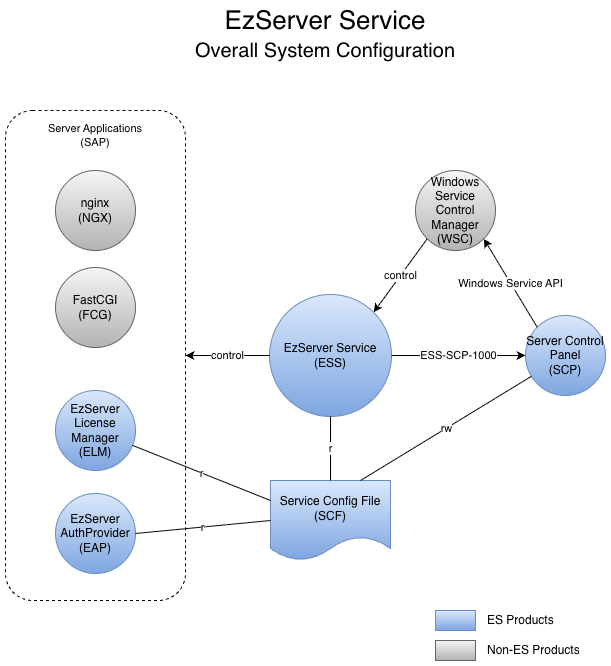

# Project name: Server Process Management (EzServer Service)

# Date:

- 2021-01-15 (1차 작성 완료)

# Submitter Info:

- 민진우/ Thomas

# Project Description:

Server PC내에서 사용하는 EzServer 에 배포되는 server process 들간의 port 충돌이 일어나지 않고, 효율적으로 관리하는 방안을 정리하는 문서이고, EzServer Service 개발자가 개발할 때 참고하는 문서이다.

다음과 같은 내용을 다룬다.

- 서버 제품 군들 중 서버 외부에 노출이 안되는 내부용 application 들은 서버 시작시 Port를 자동으로 부여 받도록 한다.
    - 자동 port 번호 부여 대상 application
        - FastCGI
        - EzServer AuthProvider
        - EzServer LicenseManager
    - 자동 port 번호 부여 대상에서 제외되는 application
        - DB(PostgreSQL) 서버
        - 기존 Legacy Application(FileManager 등)
        - nignx
    - LexFloatServer는 자동 부여되지만 License Manager에서 관리한다.

# Business and Marketing Justification: N/A

# Risk Assessment: N/A

# Resource and Schedule Details:

TBD

# Technical Description:

## System Configuration

Diagram Source: https://vatechcorp.sharepoint.com/:u:/s/es/EU7vC0c0e6JFqiUb8c_6IZYBH8L7t-GZTf0MiQdoEQnsZg?e=j0u5um
- 
  
- EzServer Service (ESS): Server PC에 설치되는 서버 제품들을 관리하는 Windows Service application 이며 background로 동작한다. (구 EzWebServer Service)
- Windows Service Control Manager(WC: Windows OS에서 Service들을 관리하는 관리자 Console application.
- Server Control Panel (SCP): Server 제품 설정을 관리하고 Server 제품을 제어하는 기능을 제공하는 UI application.
- Server Config File (SCF): Server 제품들을 구동하기 위해 필요한 설정을 담고 있는 파일
- nginx (NGX): Web Server
- FastCGI (FGI): nginx 에서 PHP를 구동하기 위한 서버
- EzServer AuthProvider (EAP): OAuth 기반 통합 인증 서버
- EzServer LicenseManager (ELM): Cryptlex, LMP와 연동하는 통합 라이센스 관리 서버

## Scenarios

### **사용자가 서버 설정을 변경하고 저장한다.**

1. 사용자가 SCP를 실행한다.
2. 사용자가 Settings 창을 연다.
3. SCP는 Settings 창을 열고, ESS에 SAP들을 중지하도록 메시지를 보낸다.
4. ESS는 SAP를 중지한다.
5. 사용자가 SCP UI의 서버 설정을 변경하고 저장한다.
6. SCP는 설정에 사용된 port가 사용중인지 검사한다.
    1. 한개라도 사용중이면 에러메시지를 표시하고, 저장을 중단한다.
    2. 설정에 사용중인 port가 하나도 없으면, 다음으로 진행한다.
7. SCP는 SAP에 port 번호를 자동으로 부여한다.
8. SCP는 사용자가 설정한 내용과 자동 부여된 port 번호를 SCF에 저장한다.
9. SCP는 ESS에 SAP를 시작하도록 메시지를 보낸다.
10. ESS는 SAP들을 시작한다.
11. ESS는 SAP가 모두 시작되었으면 완료되었다는 메시지를 SCP한테 보낸다.
12. SCP는 Settings 창을 닫고, 현재의 상태를 표시한다.

### **ESS가 SCF 에서 설정을 읽는다.**

1. ESS는 SCF이 있는지 확인한다.
    1. 없다면, 기본값을 저장하고 읽어온다.
    2. 있는데, 버전정보가 없다면, v1버전으로 간주하고, 추가적인 속성을 기본값으로 저장하고 읽어온다.

### **ESS를 시작한다.**

1. 사용자가 SCP의 서비스 시작 버튼을 누른다.
2. SCP는 Windows Service API를 통해서 등록된 모든 Service 들의 시작을 요청한다.
3. WSC는 ESS에 시작을 요청한다.
4. ESS는 SCF에서 설정을 읽는다.
5. ESS는 등록된 서비스 명과 일치되는 SAP를 실행한다.
    1. SAP는 실행 직후, SCP의 LocalSocket Server에 접속한다.
    2. SAP는 시작이 완료되면 ESS는 SCP로 메시지를 보낸다.

### **ESS를 중지한다.**

1. 사용자가 SCP의 서비스 중지 버튼을 누른다.
2. SCP는 Windows Service API를 통해서 등록된 모든 Service 들의 중지을 요청한다.
3. WSC는 ESS에 중지를 요청한다.
4. ESS는 등록된 서비스 명과 일치되는 SAP를 중지한다.
    1. 중지를 완료하기 직전에 ESS는 SCP로 메시지를 보낸다.

## EzServer Service Config File Format (SCF)

[EzServer Service Config File Format](<EzServer Service Config File Format.md>) 을 참고한다.

## IPC Messages

ESS-SCP-1000: ESS에서 SCP로 보내는 메시지 형식

```
{"version":1,"from":"EzServer Echo","to":"EzServer Control Panel","message":"start","payload":{"status":"stopped","errorCode":0,"errorMessage":"OK"}}
```

- version: 최초버전이므로 1.
- from: 보내는 쪽 이름. e.g. "EzServer Echo", "EzServer AuthProvider"
- to: 받는 쪽 이름. e.g. "EzServer Control Panel"
- message: "start", "stop"
- payload
    - status: "starting", "started", "stopping", "stopped", "error"
    - errorCode: Error code.
    - errorMessage: Error message.

## Error Codes

| `VERR_COMMON_IO` | -1005 | `I/O error.` | I/O error in accessing file/directory/devices. |
| --- | --- | --- | --- |
| `VERR_COMMON_NOFILE` | -1002 | `No such file or directory exists.` | File not found. |
| `VERR_COMMON_SOCKET_ADDRESS_IN_USER` | `-1109` | `The address specified to bind() is already in use and was set to be exclusive.` | The port is in use when checking port. |
| `VERR_COMMON_CHILD` | -1010 | `No child processes` | Failed to launch process |

## EzServer Installer 변경사항

- 서버 설치시, 다음의 Service 들이 Windows Service에 등록되도록 한다.
    - EzServer Echo
    - EzServer Web
    - EzServer FastCGI
    - EzServer AuthProvider
    - EzServer LicenseManager
    - 사용하는 command`sc create "(service name)" binpath="(service exe location)"sc create "EzServer Echo" binpath="C:\Program Files (x86)\VATECH\EzWebServer\VTEzWebServerService32.exe"`
        
        e.g.
        
- 서버 삭제시, 등록된 서비스들을 중지하고 삭제한도록 한다.
    - 사용하는 command `sc delete "(service name)"`

## Server Controller 구현

### **Nginx Controller 구현**

서비스 시작시, SCF를 읽어서 NCF를 수정해야 한다.

```
TBDauth provider

license manager
```